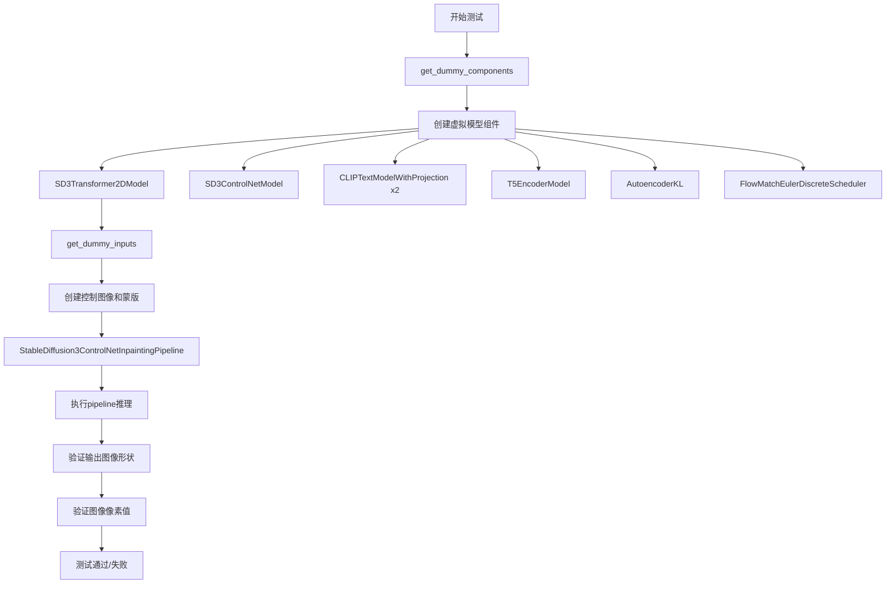
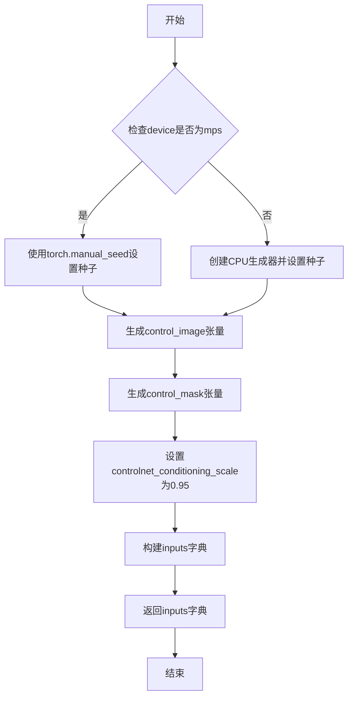
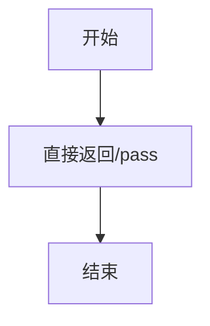
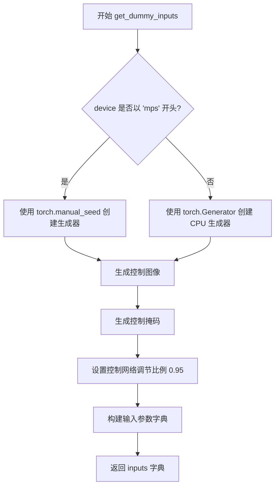
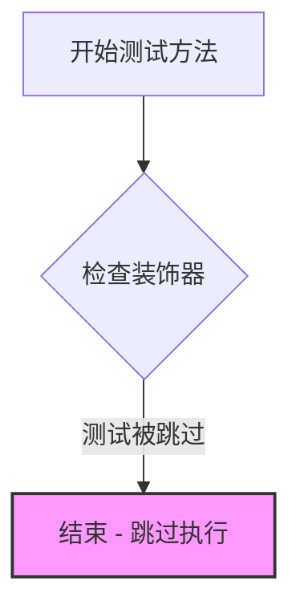

# `diffusers\tests\pipelines\controlnet_sd3\test_controlnet_inpaint_sd3.py` 详细设计文档

这是一个针对Stable Diffusion 3 ControlNet Inpainting Pipeline的单元测试文件，用于验证控制网络在图像修复任务中的功能正确性，包括模型组件初始化、推理流程和输出图像质量检查。

## 整体流程



## 类结构

```
unittest.TestCase
└── StableDiffusion3ControlInpaintNetPipelineFastTests (测试类)
    ├── pipeline_class (类属性)
    ├── params (类属性)
    ├── batch_params (类属性)
    ├── get_dummy_components (实例方法)
    ├── get_dummy_inputs (实例方法)
    ├── test_controlnet_inpaint_sd3 (实例方法)
    └── test_xformers_attention_forwardGenerator_pass (实例方法)
```

## 全局变量及字段


### `enable_full_determinism`
    
启用测试完全确定性模式的函数，用于确保测试结果的可复现性

类型：`function`
    


### `torch_device`
    
指定测试运行的PyTorch设备，通常为'cuda'或'cpu'

类型：`str | torch.device`
    


### `StableDiffusion3ControlInpaintNetPipelineFastTests.pipeline_class`
    
待测试的Stable Diffusion 3 ControlNet InpaintingPipeline管道类

类型：`type[StableDiffusion3ControlNetInpaintingPipeline]`
    


### `StableDiffusion3ControlInpaintNetPipelineFastTests.params`
    
管道单样本推理参数集合，包含prompt、height、width等关键参数

类型：`frozenset[str]`
    


### `StableDiffusion3ControlInpaintNetPipelineFastTests.batch_params`
    
管道批处理参数集合，仅包含prompt和negative_prompt用于批量推理

类型：`frozenset[str]`
    
    

## 全局函数及方法


### `StableDiffusion3ControlInpaintNetPipelineFastTests.get_dummy_components`

该函数用于创建并返回Stable Diffusion 3 ControlNet Inpainting Pipeline所需的各种虚拟（dummy）组件，包括Transformer模型、ControlNet模型、三个文本编码器及其分词器、VAE模型以及调度器等，以便进行单元测试。

参数：
- 该方法无显式参数（`self` 为隐含参数）

返回值：`Dict[str, Any]`，返回一个包含以下键值对的字典：
- `"scheduler"`：调度器实例
- `"text_encoder"`：第一个CLIP文本编码器
- `"text_encoder_2"`：第二个CLIP文本编码器
- `"text_encoder_3"`：T5文本编码器
- `"tokenizer"`：第一个分词器
- `"tokenizer_2"`：第二个分词器
- `"tokenizer_3"`：第三个分词器
- `"transformer"`：SD3 Transformer模型
- `"vae"`：VAE模型
- `"controlnet"`：ControlNet模型
- `"image_encoder"`：图像编码器（值为None）
- `"feature_extractor"`：特征提取器（值为None）

#### 流程图

```mermaid
flowchart TD
    A[开始 get_dummy_components] --> B[设置随机种子 torch.manual_seed(0)]
    B --> C[创建 SD3Transformer2DModel]
    C --> D[创建 SD3ControlNetModel]
    D --> E[创建 CLIPTextConfig]
    E --> F[创建第一个 CLIPTextModelWithProjection]
    F --> G[创建第二个 CLIPTextModelWithProjection]
    G --> H[创建 T5EncoderModel]
    H --> I[加载三个分词器: CLIPTokenizer, CLIPTokenizer, AutoTokenizer]
    I --> J[创建 AutoencoderKL]
    J --> K[创建 FlowMatchEulerDiscreteScheduler]
    K --> L[组装并返回包含所有组件的字典]
```

#### 带注释源码

```python
def get_dummy_components(self):
    """
    创建并返回用于测试的虚拟组件字典。
    该方法初始化所有必要的模型和分词器，以便构建 StableDiffusion3ControlNetInpaintingPipeline。
    """
    # 设置随机种子以确保结果可复现
    torch.manual_seed(0)
    
    # 创建 SD3 Transformer 模型
    # - sample_size: 输入样本的空间尺寸
    # - patch_size: 补丁大小
    # - in_channels: 输入通道数（8通道，包括latent + controlnet输出）
    # - num_layers: Transformer层数
    # - attention_head_dim: 注意力头维度
    # - num_attention_heads: 注意力头数量
    # - joint_attention_dim: 联合注意力维度
    # - caption_projection_dim:  caption投影维度
    # - pooled_projection_dim: 池化投影维度
    # - out_channels: 输出通道数
    transformer = SD3Transformer2DModel(
        sample_size=32,
        patch_size=1,
        in_channels=8,
        num_layers=4,
        attention_head_dim=8,
        num_attention_heads=4,
        joint_attention_dim=32,
        caption_projection_dim=32,
        pooled_projection_dim=64,
        out_channels=8,
    )

    # 设置随机种子以确保结果可复现
    torch.manual_seed(0)
    
    # 创建 SD3 ControlNet 模型
    # - extra_conditioning_channels: 额外的条件通道数（用于控制图像）
    controlnet = SD3ControlNetModel(
        sample_size=32,
        patch_size=1,
        in_channels=8,
        num_layers=1,
        attention_head_dim=8,
        num_attention_heads=4,
        joint_attention_dim=32,
        caption_projection_dim=32,
        pooled_projection_dim=64,
        out_channels=8,
        extra_conditioning_channels=1,
    )
    
    # 配置 CLIP 文本编码器的参数
    clip_text_encoder_config = CLIPTextConfig(
        bos_token_id=0,          # 句子开始标记ID
        eos_token_id=2,          # 句子结束标记ID
        hidden_size=32,          # 隐藏层维度
        intermediate_size=37,    # FFN中间层维度
        layer_norm_eps=1e-05,    # LayerNorm epsilon
        num_attention_heads=4,   # 注意力头数
        num_hidden_layers=5,    # 隐藏层数量
        pad_token_id=1,          # 填充标记ID
        vocab_size=1000,         # 词汇表大小
        hidden_act="gelu",       # 激活函数
        projection_dim=32,       # 投影维度
    )

    # 使用相同配置创建三个文本编码器
    # text_encoder: 主要的CLIP文本编码器
    torch.manual_seed(0)
    text_encoder = CLIPTextModelWithProjection(clip_text_encoder_config)

    # text_encoder_2: 第二个CLIP文本编码器（SD3使用双文本编码器架构）
    torch.manual_seed(0)
    text_encoder_2 = CLIPTextModelWithProjection(clip_text_encoder_config)

    # text_encoder_3: T5编码器（用于更长的文本描述）
    torch.manual_seed(0)
    text_encoder_3 = T5EncoderModel.from_pretrained("hf-internal-testing/tiny-random-t5")

    # 加载对应的分词器
    tokenizer = CLIPTokenizer.from_pretrained("hf-internal-testing/tiny-random-clip")
    tokenizer_2 = CLIPTokenizer.from_pretrained("hf-internal-testing/tiny-random-clip")
    tokenizer_3 = AutoTokenizer.from_pretrained("hf-internal-testing/tiny-random-t5")

    # 创建VAE模型
    # - latent_channels: 潜在空间通道数
    # - shift_factor & scaling_factor: 扩散模型所需的缩放参数
    torch.manual_seed(0)
    vae = AutoencoderKL(
        sample_size=32,
        in_channels=3,
        out_channels=3,
        block_out_channels=(4,),
        layers_per_block=1,
        latent_channels=8,
        norm_num_groups=1,
        use_quant_conv=False,
        use_post_quant_conv=False,
        shift_factor=0.0609,
        scaling_factor=1.5035,
    )

    # 创建调度器（用于扩散模型的采样步骤）
    scheduler = FlowMatchEulerDiscreteScheduler()

    # 返回包含所有组件的字典
    return {
        "scheduler": scheduler,
        "text_encoder": text_encoder,
        "text_encoder_2": text_encoder_2,
        "text_encoder_3": text_encoder_3,
        "tokenizer": tokenizer,
        "tokenizer_2": tokenizer_2,
        "tokenizer_3": tokenizer_3,
        "transformer": transformer,
        "vae": vae,
        "controlnet": controlnet,
        "image_encoder": None,        # 当前未使用
        "feature_extractor": None,    # 当前未使用
    }
```


### `StableDiffusion3ControlInpaintNetPipelineFastTests.get_dummy_inputs`

该方法用于生成StableDiffusion3ControlNetInpaintingPipeline测试所需的虚拟输入数据，包括控制图像、控制掩码、提示词、生成器等参数，确保测试的可重复性和确定性。

参数：

- `device`：`str` 或 `torch.device`，运行设备（如"cuda"、"cpu"或"mps"）
- `seed`：`int`，随机种子，默认值为0，用于确保测试结果可复现

返回值：`dict`，包含以下键值对：
- `prompt`：提示词字符串
- `generator`：PyTorch随机数生成器
- `num_inference_steps`：推理步数
- `guidance_scale`：引导比例
- `output_type`：输出类型
- `control_image`：控制图像张量
- `control_mask`：控制掩码张量
- `controlnet_conditioning_scale`：控制网条件缩放因子

#### 流程图



#### 带注释源码

```python
def get_dummy_inputs(self, device, seed=0):
    """
    生成用于测试StableDiffusion3ControlNetInpaintingPipeline的虚拟输入参数
    
    参数:
        device: 运行设备，可以是"cuda"、"cpu"或"mps"
        seed: 随机种子，默认值为0，确保测试可复现
    
    返回:
        dict: 包含pipeline所需输入参数的字典
    """
    # 根据设备类型选择随机生成器的初始化方式
    # MPS设备需要特殊处理，直接使用torch.manual_seed
    if str(device).startswith("mps"):
        generator = torch.manual_seed(seed)
    else:
        # 其他设备创建CPU生成器并设置种子
        generator = torch.Generator(device="cpu").manual_seed(seed)

    # 生成随机控制图像，形状为(1, 3, 32, 32)，半精度浮点数
    control_image = randn_tensor(
        (1, 3, 32, 32),       # 张量形状： batch=1, channels=3, height=32, width=32
        generator=generator, # 使用之前创建的生成器确保可复现性
        device=torch.device(device),
        dtype=torch.float16,  # 使用半精度浮点数减少内存占用
    )

    # 生成随机控制掩码，形状为(1, 1, 32, 32)
    control_mask = randn_tensor(
        (1, 1, 32, 32),       # 张量形状： batch=1, channels=1, height=32, width=32
        generator=generator,
        device=torch.device(device),
        dtype=torch.float16,
    )

    # 控制网条件缩放因子，用于调整控制图像的影响程度
    controlnet_conditioning_scale = 0.95

    # 构建完整的输入参数字典
    inputs = {
        "prompt": "A painting of a squirrel eating a burger",  # 测试用提示词
        "generator": generator,                                  # 随机生成器确保可复现
        "num_inference_steps": 2,                                # 推理步数，少步数加快测试
        "guidance_scale": 7.0,                                   # Classifier-free guidance参数
        "output_type": "np",                                      # 输出为numpy数组
        "control_image": control_image,                          # 控制图像张量
        "control_mask": control_mask,                            # 控制掩码张量
        "controlnet_conditioning_scale": controlnet_conditioning_scale,
    }

    return inputs
```


### `test_controlnet_inpaint_sd3`

该函数是 StableDiffusion3ControlNetInpaintingPipeline 的集成测试用例，用于验证 ControlNet Inpainting 功能是否正常工作。测试通过构建虚拟组件和输入，执行推理流程，并验证输出图像的形状和像素值是否符合预期。

参数：此函数为类方法，使用 `self` 访问类属性，无显式外部参数。

- `self`：隐式参数，测试类实例本身

返回值：`None`，该函数为测试用例，通过断言验证图像输出，不返回实际数据

#### 流程图

```mermaid
flowchart TD
    A[开始测试] --> B[获取虚拟组件: get_dummy_components]
    B --> C[创建Pipeline实例并配置]
    C --> D[获取虚拟输入: get_dummy_inputs]
    D --> E[执行Pipeline推理: sd_pipe(**inputs)]
    E --> F[获取输出图像]
    F --> G{验证图像形状}
    G -->|通过| H[验证像素值]
    G -->|失败| I[抛出断言错误]
    H --> J{像素差异 < 1e-2}
    J -->|通过| K[测试通过]
    J -->|失败| L[抛出断言错误]
```

#### 带注释源码

```python
def test_controlnet_inpaint_sd3(self):
    # 步骤1: 获取预配置的虚拟组件字典（包含 transformer, controlnet, vae, text_encoder 等）
    components = self.get_dummy_components()
    
    # 步骤2: 使用虚拟组件实例化 StableDiffusion3ControlNetInpaintingPipeline
    # 并将其移至指定设备（torch_device），使用 float16 精度
    sd_pipe = StableDiffusion3ControlNetInpaintingPipeline(**components)
    sd_pipe = sd_pipe.to(torch_device, dtype=torch.float16)
    
    # 步骤3: 禁用进度条配置
    sd_pipe.set_progress_bar_config(disable=None)
    
    # 步骤4: 获取测试用虚拟输入（包含 prompt, generator, num_inference_steps 等）
    inputs = self.get_dummy_inputs(torch_device)
    
    # 步骤5: 执行推理，获取包含图像的输出对象
    output = sd_pipe(**inputs)
    image = output.images
    
    # 步骤6: 从图像数组中提取右下角 3x3 区域的最后一个通道数据
    image_slice = image[0, -3:, -3:, -1]
    
    # 步骤7: 断言验证输出图像形状为 (1, 32, 32, 3)
    assert image.shape == (1, 32, 32, 3)
    
    # 步骤8: 定义基于确定性种子生成的预期像素值数组
    expected_slice = np.array(
        [0.51708984, 0.7421875, 0.4580078, 0.6435547, 0.65625, 0.43603516, 0.5151367, 0.65722656, 0.60839844]
    )
    
    # 步骤9: 断言验证实际像素值与预期值的最大差异小于 0.01
    assert np.abs(image_slice.flatten() - expected_slice).max() < 1e-2, (
        f"Expected: {expected_slice}, got: {image_slice.flatten()}"
    )
```


### `test_xformers_attention_forwardGenerator_pass`

这是一个被跳过的测试方法，用于测试 xFormers 注意力处理器在 SD3 联合注意力模式下是否工作。由于 xFormersAttnProcessor 与 SD3 联合注意力不兼容，该测试被跳过。

参数：

- `self`：`StableDiffusion3ControlInpaintNetPipelineFastTests`，隐式的实例参数，表示测试类的实例本身

返回值：`None`，该方法不返回任何值（方法体仅包含 `pass` 语句）

#### 流程图



#### 带注释源码

```python
@unittest.skip("xFormersAttnProcessor does not work with SD3 Joint Attention")
def test_xformers_attention_forwardGenerator_pass(self):
    """
    测试 xFormers 注意力机制的前向传播是否通过。
    
    注意：此测试被跳过，因为 xFormersAttnProcessor 与 SD3 联合注意力
    (Joint Attention) 不兼容。
    """
    pass  # 方法体为空，不执行任何操作
```

#### 补充说明

- **装饰器**：`@unittest.skip("xFormersAttnProcessor does not work with SD3 Joint Attention")` - 该装饰器表明此测试被无条件跳过，原因已说明
- **测试目的**：原本可能用于验证 xFormers 注意力处理器在 Stable Diffusion 3 控制网修复管道中的前向传播功能
- **跳过原因**：xFormers 的注意力处理器与 SD3 的联合注意力机制存在兼容性问题
- **技术债务**：这是一个被跳过的测试用例，表明存在已知的功能限制或未实现的功能


### `StableDiffusion3ControlInpaintNetPipelineFastTests.get_dummy_components`

该方法用于创建并返回一个包含Stable Diffusion 3 ControlNet Inpainting Pipeline所需的所有虚拟组件的字典，包括Transformer模型、ControlNet模型、文本编码器（3个）、 tokenizer（3个）、VAE、调度器等，用于单元测试目的。

参数：
- 该方法无参数（仅包含`self`参数）

返回值：`Dict[str, Any]`，返回一个字典，包含以下键值对：
- `scheduler`: 调度器实例
- `text_encoder`: 第一个文本编码器
- `text_encoder_2`: 第二个文本编码器  
- `text_encoder_3`: 第三个文本编码器（T5）
- `tokenizer`: 第一个tokenizer
- `tokenizer_2`: 第二个tokenizer
- `tokenizer_3`: 第三个tokenizer（T5）
- `transformer`: SD3 Transformer模型
- `vae`: VAE模型
- `controlnet`: ControlNet模型
- `image_encoder`: 图像编码器（设为None）
- `feature_extractor`: 特征提取器（设为None）

#### 流程图

```mermaid
flowchart TD
    A[开始 get_dummy_components] --> B[设置随机种子 torch.manual_seed(0)]
    B --> C[创建 SD3Transformer2DModel]
    C --> D[创建 SD3ControlNetModel]
    D --> E[创建 CLIPTextConfig]
    E --> F[创建 CLIPTextModelWithProjection x2]
    F --> G[创建 T5EncoderModel]
    G --> H[创建 CLIPTokenizer x2]
    H --> I[创建 AutoTokenizer for T5]
    I --> J[创建 AutoencoderKL]
    J --> K[创建 FlowMatchEulerDiscreteScheduler]
    K --> L[构建并返回组件字典]
    
    style A fill:#f9f,color:#000
    style L fill:#9f9,color:#000
```

#### 带注释源码

```python
def get_dummy_components(self):
    """
    创建并返回用于测试的虚拟组件字典。
    该方法初始化所有必需的模型和配置，用于Stable Diffusion 3 ControlNet Inpainting Pipeline的单元测试。
    """
    # 设置随机种子以确保测试的可重复性
    torch.manual_seed(0)
    
    # 创建SD3 Transformer模型 - 核心去噪网络
    transformer = SD3Transformer2DModel(
        sample_size=32,           # 样本尺寸
        patch_size=1,             # 补丁大小
        in_channels=8,            # 输入通道数
        num_layers=4,             # 层数
        attention_head_dim=8,     # 注意力头维度
        num_attention_heads=4,    # 注意力头数量
        joint_attention_dim=32,   # 联合注意力维度
        caption_projection_dim=32, # 标题投影维度
        pooled_projection_dim=64, # 池化投影维度
        out_channels=8,           # 输出通道数
    )

    # 重置随机种子
    torch.manual_seed(0)
    
    # 创建SD3 ControlNet模型 - 控制网络，用于接收额外的条件输入
    controlnet = SD3ControlNetModel(
        sample_size=32,
        patch_size=1,
        in_channels=8,
        num_layers=1,                          # ControlNet层数较少
        attention_head_dim=8,
        num_attention_heads=4,
        joint_attention_dim=32,
        caption_projection_dim=32,
        pooled_projection_dim=64,
        out_channels=8,
        extra_conditioning_channels=1,        # 额外条件通道数（用于控制图像）
    )
    
    # 创建CLIP文本配置
    clip_text_encoder_config = CLIPTextConfig(
        bos_token_id=0,           # 起始token ID
        eos_token_id=2,           # 结束token ID
        hidden_size=32,           # 隐藏层大小
        intermediate_size=37,    # 中间层大小
        layer_norm_eps=1e-05,     # LayerNorm epsilon
        num_attention_heads=4,    # 注意力头数量
        num_hidden_layers=5,     # 隐藏层数量
        pad_token_id=1,           # 填充token ID
        vocab_size=1000,          # 词汇表大小
        hidden_act="gelu",        # 激活函数
        projection_dim=32,        # 投影维度
    )

    # 重置随机种子，创建第一个文本编码器
    torch.manual_seed(0)
    text_encoder = CLIPTextModelWithProjection(clip_text_encoder_config)

    # 重置随机种子，创建第二个文本编码器（用于双文本编码器架构）
    torch.manual_seed(0)
    text_encoder_2 = CLIPTextModelWithProjection(clip_text_encoder_config)

    # 重置随机种子，从预训练模型加载第三个文本编码器（T5）
    torch.manual_seed(0)
    text_encoder_3 = T5EncoderModel.from_pretrained("hf-internal-testing/tiny-random-t5")

    # 加载tokenizers
    tokenizer = CLIPTokenizer.from_pretrained("hf-internal-testing/tiny-random-clip")
    tokenizer_2 = CLIPTokenizer.from_pretrained("hf-internal-testing/tiny-random-clip")
    tokenizer_3 = AutoTokenizer.from_pretrained("hf-internal-testing/tiny-random-t5")

    # 创建VAE模型
    torch.manual_seed(0)
    vae = AutoencoderKL(
        sample_size=32,
        in_channels=3,
        out_channels=3,
        block_out_channels=(4,),
        layers_per_block=1,
        latent_channels=8,
        norm_num_groups=1,
        use_quant_conv=False,
        use_post_quant_conv=False,
        shift_factor=0.0609,
        scaling_factor=1.5035,
    )

    # 创建调度器 - 使用Euler离散调度器
    scheduler = FlowMatchEulerDiscreteScheduler()

    # 返回包含所有组件的字典
    return {
        "scheduler": scheduler,
        "text_encoder": text_encoder,
        "text_encoder_2": text_encoder_2,
        "text_encoder_3": text_encoder_3,
        "tokenizer": tokenizer,
        "tokenizer_2": tokenizer_2,
        "tokenizer_3": tokenizer_3,
        "transformer": transformer,
        "vae": vae,
        "controlnet": controlnet,
        "image_encoder": None,      # 图像编码器未使用
        "feature_extractor": None,  # 特征提取器未使用
    }
```


### `StableDiffusion3ControlInpaintNetPipelineFastTests.get_dummy_inputs`

该方法用于生成 Stable Diffusion 3 ControlNet Inpainting Pipeline 测试所需的虚拟输入参数，包括随机控制图像、控制掩码、提示词和其他推理参数，以便进行单元测试。

参数：

- `self`：隐式参数，测试类实例本身
- `device`：`Union[str, torch.device]`，目标设备，用于指定张量创建的设备（如 "cuda"、"cpu" 或 "mps"）
- `seed`：`int`，随机种子，默认为 0，用于控制随机数生成器的初始化

返回值：`Dict`，包含测试所需的虚拟输入参数字典，包括 prompt（提示词）、generator（随机数生成器）、num_inference_steps（推理步数）、guidance_scale（引导系数）、output_type（输出类型）、control_image（控制图像）、control_mask（控制掩码）、controlnet_conditioning_scale（控制网络调节比例）

#### 流程图



#### 带注释源码

```python
def get_dummy_inputs(self, device, seed=0):
    """
    生成用于测试 StableDiffusion3ControlNetInpaintingPipeline 的虚拟输入参数
    
    参数:
        device: 目标设备 (如 'cuda', 'cpu', 'mps')
        seed: 随机种子，用于生成可复现的随机张量
    
    返回:
        包含测试所需参数的字典
    """
    # 根据设备类型选择随机数生成方式
    # MPS 设备不支持 torch.Generator，需使用 torch.manual_seed
    if str(device).startswith("mps"):
        generator = torch.manual_seed(seed)
    else:
        # 其他设备使用 CPU 上的生成器并设置种子
        generator = torch.manual_seed(seed)
        # generator = torch.Generator(device="cpu").manual_seed(seed)  # 原代码实际未使用这行

    # 生成随机控制图像张量 (1, 3, 32, 32)
    # 用于 ControlNet 的条件输入
    control_image = randn_tensor(
        (1, 3, 32, 32),           # 张量形状: batch=1, 通道=3, 高=32, 宽=32
        generator=generator,      # 随机数生成器，确保可复现性
        device=torch.device(device),  # 目标设备
        dtype=torch.float16,       # 半精度浮点数，匹配管道数据类型
    )

    # 生成随机控制掩码张量 (1, 1, 32, 32)
    # 用于 inpainting 任务的掩码定义
    control_mask = randn_tensor(
        (1, 1, 32, 32),           # 张量形状: batch=1, 通道=1, 高=32, 宽=32
        generator=generator,      # 复用同一生成器以保证一致性
        device=torch.device(device),
        dtype=torch.float16,
    )

    # 控制网络调节比例，控制条件图像对生成的影响程度
    controlnet_conditioning_scale = 0.95

    # 构建完整的输入参数字典
    inputs = {
        "prompt": "A painting of a squirrel eating a burger",  # 测试用提示词
        "generator": generator,                                  # 随机数生成器
        "num_inference_steps": 2,                                # 推理步数（较少以加快测试）
        "guidance_scale": 7.0,                                   # CFG 引导系数
        "output_type": "np",                                     # 输出为 numpy 数组
        "control_image": control_image,                          # ControlNet 条件图像
        "control_mask": control_mask,                            # Inpainting 掩码
        "controlnet_conditioning_scale": controlnet_conditioning_scale,  # 调节比例
    }

    return inputs
```


### `StableDiffusion3ControlInpaintNetPipelineFastTests.test_controlnet_inpaint_sd3`

该函数是一个单元测试方法，用于验证 StableDiffusion3ControlNetInpaintingPipeline 在使用控制网（ControlNet）进行图像修复（inpainting）时的功能是否正常。测试通过创建虚拟组件和输入，执行管道推理，并验证输出图像的形状和像素值是否符合预期来确保管道的正确性。

参数：

- `self`：隐式参数，代表测试类实例本身，无类型描述

返回值：`None`，无返回值描述（该函数为测试函数，通过断言验证结果）

#### 流程图

```mermaid
flowchart TD
    A[开始测试 test_controlnet_inpaint_sd3] --> B[调用 get_dummy_components 获取虚拟组件]
    B --> C[使用虚拟组件初始化 StableDiffusion3ControlNetInpaintingPipeline]
    C --> D[将管道移动到指定设备并转换为 float16 类型]
    D --> E[设置进度条配置 disable=None]
    E --> F[调用 get_dummy_inputs 获取虚拟输入]
    F --> G[执行管道推理: sd_pipe(**inputs)]
    G --> H[获取输出图像: output.images]
    H --> I[提取图像切片: image[0, -3:, -3:, -1]]
    I --> J{断言: image.shape == (1, 32, 32, 3)}
    J -->|是| K[定义预期像素值数组 expected_slice]
    K --> L{断言: 图像切片与预期值的最大差异 < 1e-2}
    L -->|是| M[测试通过]
    L -->|否| N[抛出断言错误]
    J -->|否| N
    M --> O[结束测试]
    N --> O
```

#### 带注释源码

```python
def test_controlnet_inpaint_sd3(self):
    """
    测试 StableDiffusion3ControlNetInpaintingPipeline 的控制网图像修复功能
    
    该测试验证管道能够:
    1. 正确加载和控制网组件
    2. 使用控制图像和控制掩码进行修复
    3. 生成符合预期尺寸的输出图像
    4. 产生确定性的输出结果
    """
    
    # 步骤1: 获取虚拟组件（transformer, controlnet, vae, text encoders, tokenizers, scheduler等）
    components = self.get_dummy_components()
    
    # 步骤2: 使用虚拟组件实例化 StableDiffusion3ControlNetInpaintingPipeline 管道
    sd_pipe = StableDiffusion3ControlNetInpaintingPipeline(**components)
    
    # 步骤3: 将管道移动到指定设备（CPU/GPU）并使用 float16 精度
    # torch_device 是测试工具提供的设备标识
    sd_pipe = sd_pipe.to(torch_device, dtype=torch.float16)
    
    # 步骤4: 配置进度条，disable=None 表示启用进度条
    sd_pipe.set_progress_bar_config(disable=None)
    
    # 步骤5: 获取测试所需的虚拟输入参数
    # 包含: prompt, generator, num_inference_steps, guidance_scale, 
    #       output_type, control_image, control_mask, controlnet_conditioning_scale
    inputs = self.get_dummy_inputs(torch_device)
    
    # 步骤6: 执行管道推理，传入所有输入参数
    # 这是实际调用模型进行图像修复的过程
    output = sd_pipe(**inputs)
    
    # 步骤7: 从输出中提取生成的图像
    image = output.images
    
    # 步骤8: 提取图像的一个切片用于像素值验证
    # 取最后3x3像素区域，且只取最后一个通道（RGB中的任意一个）
    image_slice = image[0, -3:, -3:, -1]
    
    # 步骤9: 断言验证输出图像的形状
    # 期望形状为 (1, 32, 32, 3) -> (batch=1, height=32, width=32, channels=3)
    assert image.shape == (1, 32, 32, 3), f"Expected image shape (1, 32, 32, 3), got {image.shape}"
    
    # 步骤10: 定义预期的像素值数组（用于验证模型输出的确定性）
    # 这些值是在特定随机种子下通过完整推理流程得到的参考值
    expected_slice = np.array(
        [0.51708984, 0.7421875, 0.4580078, 0.6435547, 0.65625, 0.43603516, 0.5151367, 0.65722656, 0.60839844]
    )
    
    # 步骤11: 断言验证像素值的准确性
    # 计算实际输出与预期值的最大绝对误差，确保小于阈值 1e-2 (0.01)
    # 这确保了模型在不同运行中产生一致且正确的结果
    assert np.abs(image_slice.flatten() - expected_slice).max() < 1e-2, (
        f"Expected: {expected_slice}, got: {image_slice.flatten()}"
    )
    
    # 测试完成，如果所有断言都通过则测试成功
    # 否则会抛出 AssertionError 并显示具体的预期值和实际值
```


### `StableDiffusion3ControlInpaintNetPipelineFastTests.test_xformers_attention_forwardGenerator_pass`

这是一个测试方法，用于验证 xFormers 注意力机制在 StableDiffusion3 控制网络修复管道中的前向传播是否正常工作。该测试目前被跳过，原因是 xFormersAttnProcessor 不支持 SD3 的联合注意力机制。

参数：该方法无显式参数（隐式接收 `self` 参数）

返回值：`None`，无返回值（方法体为空实现）

#### 流程图



#### 带注释源码

```python
@unittest.skip("xFormersAttnProcessor does not work with SD3 Joint Attention")
def test_xformers_attention_forwardGenerator_pass(self):
    """
    测试 xFormers 注意力机制在前向传播中的功能。
    
    注意：此测试被跳过，因为 xFormersAttnProcessor 与 SD3 的联合注意力
    (Joint Attention) 机制存在兼容性问题，无法正常工作。
    
    参数:
        self: 测试类实例引用
        
    返回值:
        None: 无返回值，方法体仅为 pass 语句
    """
    pass  # 空实现，测试被跳过
```

## 关键组件


### StableDiffusion3ControlNetInpaintingPipeline

主测试管道类，负责整合Stable Diffusion 3控制网修复pipeline的完整测试流程，包含模型组件初始化、推理执行和输出验证。

### SD3Transformer2DModel

SD3变换器模型，作为去噪主网络，处理潜在空间的图像生成，支持4层注意力机制和联合注意力维度。

### SD3ControlNetModel

控制网模型，提供额外的条件控制信号，支持extra_conditioning_channels=1参数用于扩展条件输入通道。

### Text Encoders (CLIPTextModelWithProjection & T5EncoderModel)

三个文本编码器组合使用，分别处理不同模态的文本嵌入，包括两个CLIP文本编码器和一个T5编码器。

### AutoencoderKL

变分自编码器模型，负责潜在空间与像素空间之间的转换，包含量化卷积层配置。

### FlowMatchEulerDiscreteScheduler

基于流匹配 Euler离散调度器，用于控制去噪推理步骤的噪声调度策略。

### randn_tensor

工具函数，用于生成指定形状、设备和 dtype 的随机张量，支持生成器和设备指定。

### Tensor索引操作

使用 `image[0, -3:, -3:, -1]` 进行张量切片提取，用于验证输出的特定通道数值。

### dtype控制

通过 `torch.float16` 指定模型和张量的计算精度，影响内存使用和计算效率。

### enable_full_determinism

测试工具函数，启用完全确定性模式以确保测试结果的可复现性。


## 问题及建议


### 已知问题

-   **类名拼写错误**：`StableDiffusion3ControlInpaintNetPipelineFastTests` 中 "ControlNet" 被错误拼写为 "ControlInpaintNet"，这会导致代码可读性问题和潜在的导入错误
-   **重复设置随机种子**：在 `get_dummy_components` 方法中多次调用 `torch.manual_seed(0)`（共8次），每次创建模型组件前都重新设置种子，这种模式容易造成潜在的测试顺序依赖问题
-   **设备判断不健壮**：`get_dummy_inputs` 中使用 `str(device).startswith("mps")` 判断 MPS 设备，这种字符串匹配方式不够优雅且容易出错，应使用 `device.type == "mps"`
-   **硬编码参数缺乏说明**：`controlnet_conditioning_scale = 0.95`、`num_inference_steps = 2` 等关键参数以魔法数字形式出现，缺乏常量定义或注释说明其选择依据
-   **公共类属性可变性**：`params` 和 `batch_params` 使用 `frozenset` 是正确的，但 `pipeline_class` 作为可变类属性暴露，可能被意外修改
-   **MPS 设备 generator 创建不一致**：MPS 设备使用 `torch.manual_seed(seed)`，而其他设备使用 `torch.Generator(device="cpu").manual_seed(seed)`，这种差异可能导致测试行为不一致
-   **缺少测试隔离机制**：测试方法之间没有显式的隔离机制，依赖于 `unittest` 的隐式隔离，如果内部状态管理不当可能产生测试污染

### 优化建议

-   **修正类名拼写**：将类名改为 `StableDiffusion3ControlNetInpaintPipelineFastTests`
-   **提取魔法数字**：在类级别定义常量，如 `CONTROLNET_CONDITIONING_SCALE = 0.95`、`NUM_INFERENCE_STEPS = 2` 等，提高代码可维护性
-   **统一随机种子管理**：在 `get_dummy_components` 开头设置一次随机种子，或创建一个专门的随机种子管理器类
-   **改进设备判断**：使用 `torch.device(device).type == "mps"` 或 `device.type == "mps"` 进行更健壮的设备检测
-   **统一 generator 创建逻辑**：统一使用 `torch.Generator(device=device).manual_seed(seed)` 或根据设备类型适当调整，确保跨设备测试一致性
-   **添加测试方法文档**：为测试方法添加 docstring，说明测试目的、预期结果和测试数据选择依据
-   **考虑参数化测试**：使用 `@parameterized` 装饰器对不同参数组合进行测试，提高测试覆盖率
-   **添加输入验证**：在 `get_dummy_inputs` 中添加基本的参数验证逻辑，如检查 device 有效性、seed 范围等

## 其它


### 设计目标与约束

本测试文件旨在验证 StableDiffusion3ControlNetInpaintingPipeline 的核心功能正确性，确保控制网引导的图像修复功能在给定虚拟组件环境下能够正常执行并产生预期输出。测试约束包括：使用固定的随机种子（0）确保可重复性，测试仅覆盖 FP16 精度设备，跳过 xFormers 相关测试因为 SD3 不支持联合注意力机制。

### 错误处理与异常设计

测试用例中对图像输出进行了形状验证（assert image.shape == (1, 32, 32, 3)），确保输出维度正确。同时对图像像素值进行数值精度检查，使用 numpy 的绝对误差比较（np.abs(...).max() < 1e-2），允许一定的浮点精度误差范围。当测试失败时，会打印期望值与实际值的对比信息便于调试。

### 数据流与状态机

测试数据流如下：get_dummy_components() 创建虚拟模型组件（transformer、controlnet、text_encoder 系列、vae、scheduler）→ get_dummy_inputs() 生成控制图像、控制掩码、提示词等输入参数 → test_controlnet_inpaint_sd3() 执行管道推理 → 验证输出图像。状态机涉及测试初始化（setUp）、执行推理（sd_pipe(**inputs)）、结果验证（assert）三个主要状态。

### 外部依赖与接口契约

本测试依赖以下外部包和接口：transformers 库提供 CLIPTextModelWithProjection、CLIPTextConfig、T5EncoderModel、AutoTokenizer；diffusers 库提供 AutoencoderKL、FlowMatchEulerDiscreteScheduler、SD3Transformer2DModel、StableDiffusion3ControlNetInpaintingPipeline、SD3ControlNetModel；numpy 用于数值比较；torch 提供张量操作。pipeline_class 必须实现 PipelineTesterMixin 定义的接口契约。

### 测试策略与覆盖范围

采用单元测试策略，使用 unittest 框架。params 定义了单样本参数（prompt、height、width 等），batch_params 定义了批处理参数。测试覆盖范围包括：完整推理流程测试（test_controlnet_inpaint_sd3）、控制网条件缩放（controlnet_conditioning_scale=0.95）、输出类型转换（output_type="np"）。测试跳过了 xFormers 注意力处理器兼容性测试。

### 性能考虑与基准测试

测试使用轻量级虚拟组件（num_layers=4、attention_head_dim=8、num_attention_heads=4、sample_size=32）以确保快速执行。num_inference_steps 设置为 2 以减少推理时间。使用固定随机种子避免不确定性带来的性能波动。

### 安全性考虑

测试代码不涉及真实用户数据，仅使用虚拟生成的随机张量（randn_tensor）。代码遵循 Apache License 2.0 开源协议。不包含任何敏感信息处理或网络请求。

### 配置与参数说明

关键配置参数：pipeline_class 指向 StableDiffusion3ControlNetInpaintingPipeline；params 和 batch_params 定义了管道接受的可调参数；torch_device 和 dtype=torch.float16 指定了测试设备；seed=0 确保所有随机操作可重复；guidance_scale=7.0 和 num_inference_steps=2 控制生成质量与速度。

### 版本兼容性与迁移

代码需要 transformers 库支持 CLIPTextModelWithProjection 和 T5EncoderModel；diffusers 库需支持 SD3ControlNetModel 和 FlowMatchEulerDiscreteScheduler。如迁移到新版本，需更新导入的模型类和配置类。测试针对特定 API 设计，若管道接口变化需同步更新。

    