# `diffusers\tests\pipelines\controlnet_sd3\test_controlnet_sd3.py` 详细设计文档

这是 Stable Diffusion 3 ControlNet Pipeline 的单元测试和集成测试文件，包含了快速测试（使用虚拟组件验证 pipeline 基本功能）和慢速测试（使用真实预训练模型验证 Canny、Pose、Tile 等不同控制网络效果）两部分。

## 整体流程

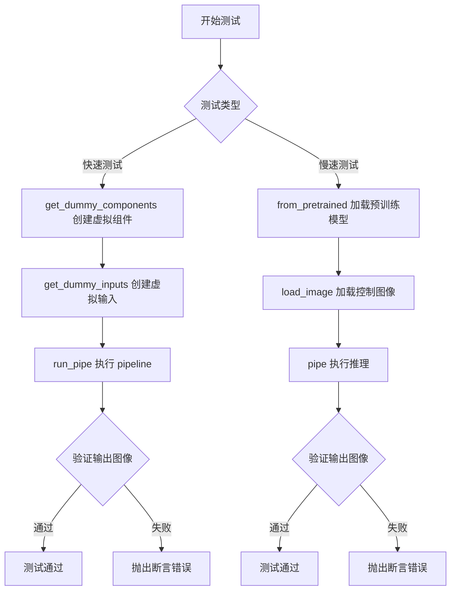

## 类结构

```
unittest.TestCase (Python 内置)
PipelineTesterMixin (测试基类)
└── StableDiffusion3ControlNetPipelineFastTests (快速测试类)
    ├── get_dummy_components() - 创建虚拟组件
    ├── get_dummy_inputs() - 创建虚拟输入
    ├── run_pipe() - 执行 pipeline 测试
    ├── test_controlnet_sd3() - SD3 控制网测试
    └── test_controlnet_sd35() - SD3.5 控制网测试
unittest.TestCase
└── StableDiffusion3ControlNetPipelineSlowTests (慢速测试类)
    ├── setUp() - 测试前准备
    ├── tearDown() - 测试后清理
    ├── test_canny() - Canny 边缘控制测试
    ├── test_pose() - 姿态控制测试
    ├── test_tile() - Tile 控制测试
    └── test_multi_controlnet() - 多控制网测试
```

## 全局变量及字段


### `StableDiffusion3ControlNetPipelineFastTests.pipeline_class`
    
The pipeline class being tested, set to StableDiffusion3ControlNetPipeline

类型：`class`
    


### `StableDiffusion3ControlNetPipelineFastTests.params`
    
Frozen set of parameter names that the pipeline accepts (prompt, height, width, guidance_scale, negative_prompt, prompt_embeds, negative_prompt_embeds)

类型：`frozenset`
    


### `StableDiffusion3ControlNetPipelineFastTests.batch_params`
    
Frozen set of parameter names that support batch processing (prompt, negative_prompt)

类型：`frozenset`
    


### `StableDiffusion3ControlNetPipelineFastTests.test_layerwise_casting`
    
Flag indicating whether to test layerwise casting for the pipeline

类型：`bool`
    


### `StableDiffusion3ControlNetPipelineFastTests.test_group_offloading`
    
Flag indicating whether to test group offloading for the pipeline

类型：`bool`
    


### `StableDiffusion3ControlNetPipelineSlowTests.pipeline_class`
    
The pipeline class being tested, set to StableDiffusion3ControlNetPipeline

类型：`class`
    
    

## 全局函数及方法


### `enable_full_determinism`

确保测试运行的完全确定性，通过设置随机种子、禁用非确定性操作（如CUDA算法选择、torch多线程等）来保证测试结果可复现。

参数： 无

返回值： `None`，该函数直接修改全局状态，不返回值

#### 流程图

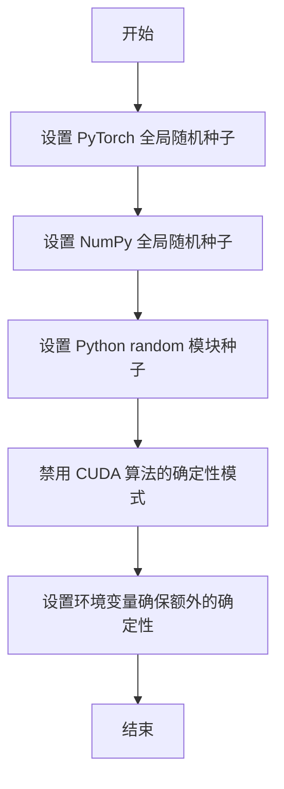

#### 带注释源码

```
# 源码无法直接获取 - 该函数定义在 testing_utils 模块中
# 以下为推断的实现逻辑

def enable_full_determinism(seed: int = 0, deterministic_algorithms: bool = True):
    """
    启用完全确定性模式，确保测试结果可复现
    
    参数:
        seed: 随机种子，默认为0
        deterministic_algorithms: 是否启用确定性算法，默认为True
    """
    import torch
    import numpy as np
    import random
    import os
    
    # 设置PyTorch随机种子
    torch.manual_seed(seed)
    torch.cuda.manual_seed_all(seed)
    
    # 设置NumPy随机种子
    np.random.seed(seed)
    
    # 设置Python random模块种子
    random.seed(seed)
    
    # 启用确定性算法（如果可用）
    if deterministic_algorithms:
        torch.backends.cudnn.deterministic = True
        torch.backends.cudnn.benchmark = False
        torch.use_deterministic_algorithms(True)
    
    # 设置环境变量
    os.environ["CUBLAS_WORKSPACE_CONFIG"] = ":4096:8"
    
    return None
```

> **注意**：由于 `enable_full_determinism` 函数定义在外部模块 `testing_utils` 中，而非当前代码文件内，上述源码为基于该函数用途的推断实现。实际实现可能包含更多细节或不同的参数配置。


### `randn_tensor`

该函数是 `diffusers` 库中的工具函数，用于生成指定形状和类型的随机张量（基于正态分布）。在测试代码中用于生成虚拟的控制图像输入。

参数：

- `shape`：`tuple[int, ...]`，张量的形状，例如 `(1, 3, 32, 32)` 表示生成 1 个 3 通道 32x32 的图像张量
- `generator`：`torch.Generator`（可选），随机数生成器，用于控制随机性，确保测试结果可复现
- `device`：`torch.device`，指定生成张量所在的设备（如 CPU 或 CUDA 设备）
- `dtype`：`torch.dtype`（可选），张量的数据类型，如 `torch.float16`

返回值：`torch.Tensor`，返回一个符合指定形状、设备和数据类型的正态分布随机张量

#### 流程图

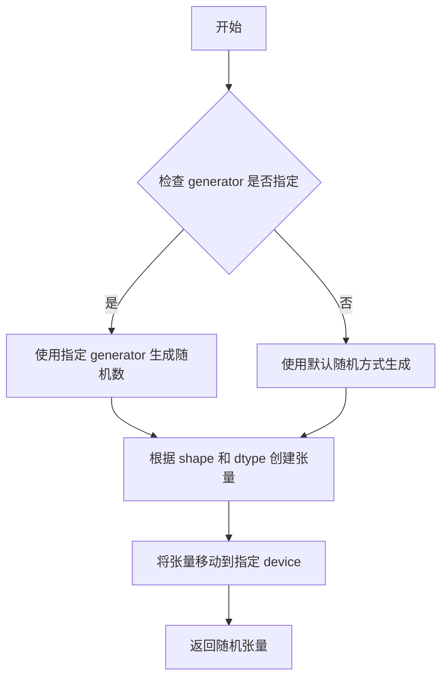

#### 带注释源码

```python
# 在测试文件中导入 randn_tensor
from diffusers.utils.torch_utils import randn_tensor

# 在 get_dummy_inputs 方法中调用
def get_dummy_inputs(self, device, seed=0):
    # 根据设备类型创建随机数生成器
    if str(device).startswith("mps"):
        # MPS 设备使用 torch.manual_seed
        generator = torch.manual_seed(seed)
    else:
        # 其他设备使用 CPU 生成器
        generator = torch.Generator(device="cpu").manual_seed(seed)

    # 生成控制图像的张量
    # shape: (1, 3, 32, 32) - 批次大小1，3通道，32x32分辨率
    # generator: 确保测试可复现的随机数生成器
    # device: 生成张量放置的设备
    # dtype: float16 用于模拟半精度推理
    control_image = randn_tensor(
        (1, 3, 32, 32),
        generator=generator,
        device=torch.device(device),
        dtype=torch.float16,
    )

    # 构建完整的测试输入字典
    controlnet_conditioning_scale = 0.5

    inputs = {
        "prompt": "A painting of a squirrel eating a burger",
        "generator": generator,
        "num_inference_steps": 2,
        "guidance_scale": 5.0,
        "output_type": "np",
        "control_image": control_image,
        "controlnet_conditioning_scale": controlnet_conditioning_scale,
    }

    return inputs
```


### `load_image`

从 `diffusers.utils` 模块导入的图像加载函数，用于从指定路径（本地文件或 URL）加载图像并转换为可处理的格式。

参数：

-  `image_source`：`str`，图像来源，可以是本地文件路径或远程 URL（如 "https://huggingface.co/..."）

返回值：`PIL.Image.Image` 或 `np.ndarray`，返回加载后的图像对象，通常为 PIL 图像或 NumPy 数组格式

#### 流程图

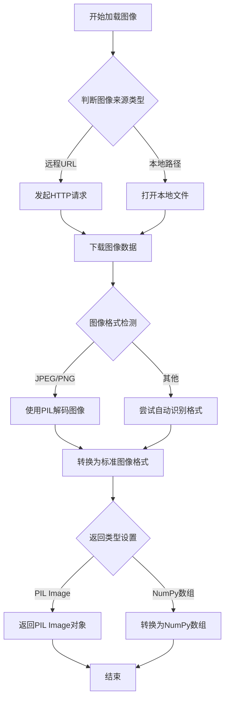

#### 带注释源码

```python
# load_image 函数定义在 diffusers.utils 模块中
# 以下是基于使用方式的推断实现

def load_image(image_source: str):
    """
    从指定路径加载图像
    
    参数:
        image_source: 图像路径或URL
            - 本地路径: "/path/to/image.jpg"
            - 远程URL: "https://huggingface.co/.../image.jpg"
    
    返回:
        PIL.Image.Image 或 np.ndarray: 加载后的图像
    """
    
    # 实际实现可能在 diffusers 库中，大致逻辑如下：
    
    # 1. 判断是URL还是本地路径
    # if image_source.startswith(("http://", "https://")):
    #     # 从URL下载图像
    #     image = Image.open(requests.get(image_source, stream=True).raw)
    # else:
    #     # 打开本地图像
    #     image = Image.open(image_source)
    
    # 2. 转换为RGB模式（确保3通道）
    # image = image.convert("RGB")
    
    # 3. 返回图像对象
    # return image

# 在测试代码中的实际调用示例：
control_image = load_image("https://huggingface.co/InstantX/SD3-Controlnet-Canny/resolve/main/canny.jpg")
# control_image 随后被用于 Stable Diffusion 3 ControlNet pipeline 的控制图像输入
```


### `numpy_cosine_similarity_distance`

该函数用于计算两个NumPy数组之间的余弦相似度距离，通常用于测试中验证生成图像与预期图像的相似程度。

参数：

- `x`：`numpy.ndarray`，第一个输入数组（通常为展平的图像数据）
- `y`：`numpy.ndarray`，第二个输入数组（通常为预期的图像数据）

返回值：`float`，返回两个数组之间的余弦距离（值越小表示相似度越高）

#### 流程图

```mermaid
flowchart TD
    A[开始] --> B[接收两个numpy数组 x 和 y]
    B --> C[计算数组x的L2范数]
    C --> D[计算数组y的L2范数]
    D --> E[计算x和y的点积]
    E --> F[计算余弦相似度: dot / (norm_x * norm_y)]
    F --> G[计算余弦距离: 1 - cosine_similarity]
    G --> H[返回距离值]
```

#### 带注释源码

由于该函数定义在外部模块 `...testing_utils` 中，当前代码文件仅导入并使用该函数，未提供完整实现。根据函数名称和调用方式，推断其实现逻辑如下：

```python
import numpy as np

def numpy_cosine_similarity_distance(x: np.ndarray, y: np.ndarray) -> float:
    """
    计算两个NumPy数组之间的余弦相似度距离。
    
    参数:
        x: 第一个NumPy数组
        y: 第二个NumPy数组
        
    返回:
        float: 余弦距离，值越小表示两个数组越相似
    """
    # 确保输入是一维数组
    x = x.flatten()
    y = y.flatten()
    
    # 计算点积
    dot_product = np.dot(x, y)
    
    # 计算L2范数（欧几里得范数）
    norm_x = np.linalg.norm(x)
    norm_y = np.linalg.norm(y)
    
    # 避免除以零
    if norm_x == 0 or norm_y == 0:
        return 1.0  # 如果任一数组为零向量，返回最大距离
    
    # 计算余弦相似度
    cosine_similarity = dot_product / (norm_x * norm_y)
    
    # 计算余弦距离（1 - 余弦相似度）
    # 余弦距离范围为[0, 2]，0表示完全相同，2表示完全相反
    cosine_distance = 1.0 - cosine_similarity
    
    return cosine_distance
```

#### 使用示例

在测试文件中的实际调用方式：

```python
# 从 testing_utils 模块导入
from ...testing_utils import numpy_cosine_similarity_distance

# 在测试中使用
original_image = image[-3:, -3:, -1].flatten()
expected_image = np.array([0.7314, 0.7075, 0.6611, 0.7539, 0.7563, 0.6650, 0.6123, 0.7275, 0.7222])

# 断言：原始图像与预期图像的余弦距离应小于阈值
assert numpy_cosine_similarity_distance(original_image.flatten(), expected_image) < 1e-2
```

#### 备注

- 该函数定义在 `diffusers` 库的 `testing_utils` 模块中
- 主要用于自动化测试中验证生成结果与预期结果的相似度
- 余弦距离相比欧氏距离，对向量方向更敏感，对幅度不敏感，适用于归一化后的向量比较


### `backend_empty_cache`

该函数用于清理 GPU/CUDA 缓存，释放显存，通常在测试的 setUp 和 tearDown 中调用以确保测试环境的内存状态干净。

参数：

- `torch_device`：`str` 或 `torch.device`，指定要清理缓存的设备（通常为 "cuda"、"cuda:0" 或 "cpu" 等）

返回值：`None`，无返回值，仅执行缓存清理操作

#### 流程图

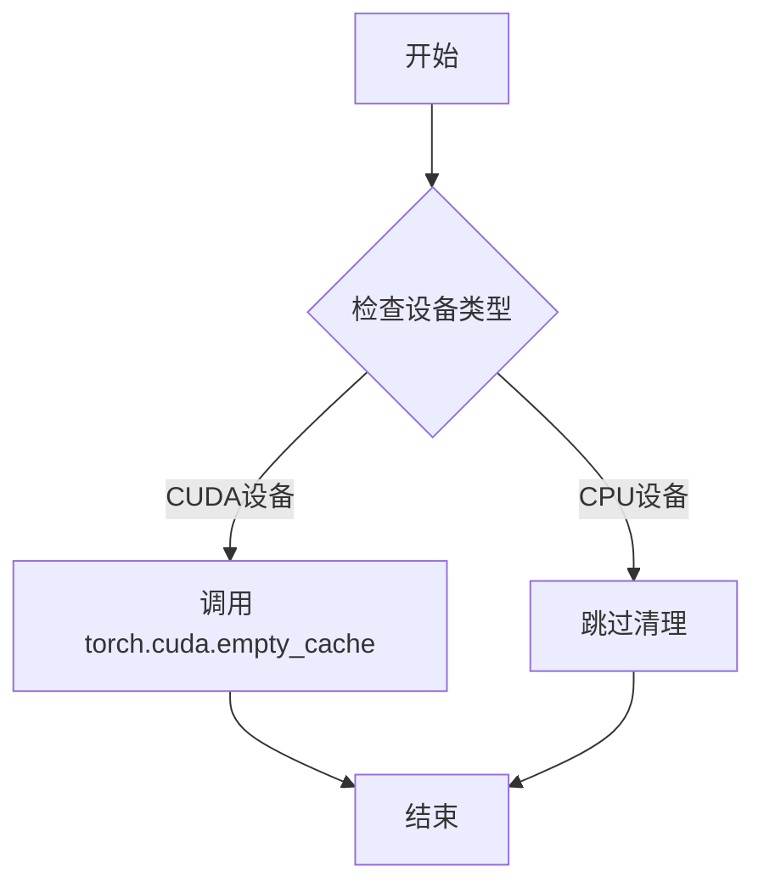

#### 带注释源码

```
# backend_empty_cache 函数定义位于 testing_utils 模块中
# 此函数在当前文件中被调用，用于在测试 setUp/tearDown 时清理 GPU 缓存

# 调用示例（来自代码中的使用）:
backend_empty_cache(torch_device)

# 其中 torch_device 是从 testing_utils 导入的全局变量，表示当前测试使用的设备
# 该函数确保每次测试前后释放 GPU 显存，避免显存泄漏导致的 OOM 错误
```

---

**注意**：由于 `backend_empty_cache` 是从 `...testing_utils` 模块导入的外部函数，其完整源码未在此文件中展示。以上信息基于函数在代码中的使用方式推断得出。该函数在测试中用于在 `setUp()` 和 `tearDown()` 阶段清理 GPU 缓存，确保测试环境的内存状态干净。


### `torch_device`

`torch_device` 是一个从 `testing_utils` 模块导入的全局函数或变量，用于获取当前测试环境可用的 PyTorch 设备（如 CUDA、CPU 或 MPS）。

参数： 无

返回值： `str`，返回可用的 PyTorch 设备字符串（如 "cuda"、"cpu" 或 "mps"）

#### 流程图

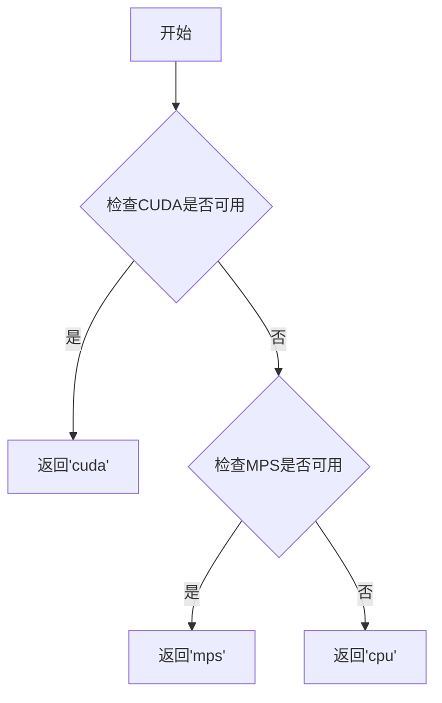

#### 带注释源码

```python
# torch_device 是从 testing_utils 模块导入的
# 根据代码中的使用方式，推断其定义可能如下：

def torch_device() -> str:
    """
    返回当前可用的 PyTorch 设备。
    
    优先级: cuda > mps > cpu
    """
    if torch.cuda.is_available():
        return "cuda"
    elif hasattr(torch.backends, 'mps') and torch.backends.mps.is_available():
        return "mps"
    else:
        return "cpu"

# 在代码中的典型使用方式：
# sd_pipe = sd_pipe.to(torch_device, dtype=torch.float16)  # 将模型移动到设备
# inputs = self.get_dummy_inputs(torch_device)             # 使用设备创建输入
# backend_empty_cache(torch_device)                        # 清理设备缓存
# pipe.enable_model_cpu_offload(device=torch_device)       # 设置CPU卸载设备
```


### `StableDiffusion3ControlNetPipelineFastTests.get_dummy_components`

该方法用于生成Stable Diffusion 3 ControlNetPipeline的虚拟（dummy）组件字典，主要服务于单元测试场景，通过模拟创建Transformer模型、ControlNet模型、文本编码器、VAE等核心组件，并可配置层数、归一化方式和注意力机制等参数，以确保测试环境的一致性和可重复性。

参数：

- `num_controlnet_layers`：`int`，默认为3，控制网络（ControlNet）的层数
- `qk_norm`：`str | None`，默认为"rms_norm"，查询-键归一化方式（query-key normalization）
- `use_dual_attention`：`bool`，默认为False，是否启用双重注意力机制（dual attention）

返回值：`dict`，返回一个包含所有虚拟组件的字典，包括调度器、文本编码器、分词器、Transformer模型、VAE、ControlNet模型等

#### 流程图

```mermaid
flowchart TD
    A[开始 get_dummy_components] --> B[设置随机种子 torch.manual_seed(0)]
    B --> C[创建 SD3Transformer2DModel 虚拟对象]
    C --> D[设置随机种子 torch.manual_seed(0)]
    D --> E[创建 SD3ControlNetModel 虚拟对象]
    E --> F[定义 CLIPTextConfig 配置]
    F --> G[设置随机种子并创建 CLIPTextModelWithProjection x2]
    G --> H[设置随机种子并从预训练模型加载 T5EncoderModel]
    H --> I[从预训练模型加载 CLIPTokenizer x2 和 AutoTokenizer]
    I --> J[设置随机种子 torch.manual_seed(0)]
    J --> K[创建 AutoencoderKL 虚拟对象]
    K --> L[创建 FlowMatchEulerDiscreteScheduler 调度器]
    L --> M[组装并返回包含所有组件的字典]
```

#### 带注释源码

```python
def get_dummy_components(
    self, num_controlnet_layers: int = 3, qk_norm: str | None = "rms_norm", use_dual_attention=False
):
    """
    生成用于测试的虚拟组件字典
    
    参数:
        num_controlnet_layers: ControlNet的层数，默认为3
        qk_norm: 查询-键归一化方式，可选值包括"rms_norm"或其他，默认为"rms_norm"
        use_dual_attention: 是否启用双重注意力机制，默认为False
    
    返回:
        包含所有虚拟组件的字典
    """
    # 设置随机种子以确保可重复性
    torch.manual_seed(0)
    
    # 创建SD3 Transformer模型（主扩散模型）
    transformer = SD3Transformer2DModel(
        sample_size=32,           # 样本尺寸
        patch_size=1,            # 补丁大小
        in_channels=8,           # 输入通道数
        num_layers=4,            # 层数
        attention_head_dim=8,    # 注意力头维度
        num_attention_heads=4,   # 注意力头数量
        joint_attention_dim=32,  # 联合注意力维度
        caption_projection_dim=32,  # 标题投影维度
        pooled_projection_dim=64,   # 池化投影维度
        out_channels=8,         # 输出通道数
        qk_norm=qk_norm,         # 查询键归一化
        dual_attention_layers=() if not use_dual_attention else (0, 1),  # 双重注意力层
    )

    # 重新设置随机种子以确保ControlNet的随机初始化独立
    torch.manual_seed(0)
    
    # 创建SD3 ControlNet模型（控制网络）
    controlnet = SD3ControlNetModel(
        sample_size=32,
        patch_size=1,
        in_channels=8,
        num_layers=num_controlnet_layers,  # 可配置的层数
        attention_head_dim=8,
        num_attention_heads=4,
        joint_attention_dim=32,
        caption_projection_dim=32,
        pooled_projection_dim=64,
        out_channels=8,
        qk_norm=qk_norm,
        dual_attention_layers=() if not use_dual_attention else (0,),
    )

    # 定义CLIP文本编码器配置
    clip_text_encoder_config = CLIPTextConfig(
        bos_token_id=0,           # 起始令牌ID
        eos_token_id=2,          # 结束令牌ID
        hidden_size=32,          # 隐藏层大小
        intermediate_size=37,    # 中间层大小
        layer_norm_eps=1e-05,    # 层归一化epsilon
        num_attention_heads=4,   # 注意力头数量
        num_hidden_layers=5,    # 隐藏层数量
        pad_token_id=1,          # 填充令牌ID
        vocab_size=1000,         # 词汇表大小
        hidden_act="gelu",       # 隐藏层激活函数
        projection_dim=32,       # 投影维度
    )

    # 创建第一个CLIP文本编码器
    torch.manual_seed(0)
    text_encoder = CLIPTextModelWithProjection(clip_text_encoder_config)

    # 创建第二个CLIP文本编码器
    torch.manual_seed(0)
    text_encoder_2 = CLIPTextModelWithProjection(clip_text_encoder_config)

    # 创建T5文本编码器（从预训练模型加载）
    torch.manual_seed(0)
    text_encoder_3 = T5EncoderModel.from_pretrained("hf-internal-testing/tiny-random-t5")

    # 加载分词器
    tokenizer = CLIPTokenizer.from_pretrained("hf-internal-testing/tiny-random-clip")
    tokenizer_2 = CLIPTokenizer.from_pretrained("hf-internal-testing/tiny-random-clip")
    tokenizer_3 = AutoTokenizer.from_pretrained("hf-internal-testing/tiny-random-t5")

    # 创建VAE（变分自编码器）
    torch.manual_seed(0)
    vae = AutoencoderKL(
        sample_size=32,
        in_channels=3,
        out_channels=3,
        block_out_channels=(4,),
        layers_per_block=1,
        latent_channels=8,
        norm_num_groups=1,
        use_quant_conv=False,
        use_post_quant_conv=False,
        shift_factor=0.0609,
        scaling_factor=1.5035,
    )

    # 创建调度器
    scheduler = FlowMatchEulerDiscreteScheduler()

    # 返回包含所有组件的字典
    return {
        "scheduler": scheduler,
        "text_encoder": text_encoder,
        "text_encoder_2": text_encoder_2,
        "text_encoder_3": text_encoder_3,
        "tokenizer": tokenizer,
        "tokenizer_2": tokenizer_2,
        "tokenizer_3": tokenizer_3,
        "transformer": transformer,
        "vae": vae,
        "controlnet": controlnet,
        "image_encoder": None,
        "feature_extractor": None,
    }
```


### `StableDiffusion3ControlNetPipelineFastTests.get_dummy_inputs`

该方法用于生成测试用的虚拟输入数据，为 Stable Diffusion 3 ControlNet Pipeline 构造符合接口要求的参数字典，包含提示词、生成器、推理参数、控制图像等。

参数：

- `device`：`str`，目标设备标识（如 "cuda"、"cpu"、"mps"），用于确定随机张量的设备
- `seed`：`int`，随机种子，默认为 0，用于保证测试可复现性

返回值：`Dict[str, Any]`，包含以下键值的字典：

- `prompt`：提示词文本
- `generator`：PyTorch 随机生成器
- `num_inference_steps`：推理步数
- `guidance_scale`：引导系数
- `output_type`：输出类型（"np" 表示 numpy 数组）
- `control_image`：控制图像张量
- `controlnet_conditioning_scale`：控制网络条件缩放因子

#### 流程图

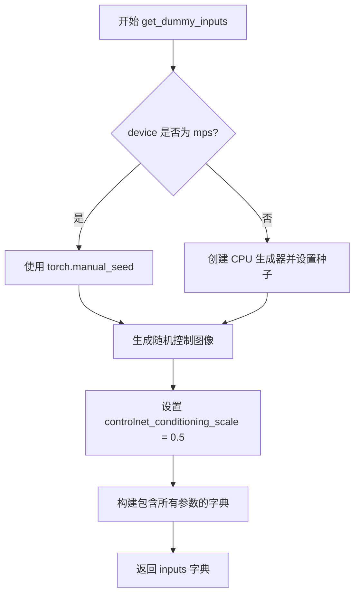

#### 带注释源码

```python
def get_dummy_inputs(self, device, seed=0):
    """
    生成虚拟输入数据字典，用于测试 StableDiffusion3ControlNetPipeline。

    参数:
        device: 目标设备（如 "cuda", "cpu", "mps"）
        seed: 随机种子，默认为 0

    返回:
        包含测试所需所有参数的字典
    """
    # 判断是否为 MPS 设备，不同设备使用不同的随机数生成方式
    if str(device).startswith("mps"):
        # MPS 设备直接使用 torch.manual_seed
        generator = torch.manual_seed(seed)
    else:
        # 其他设备创建 CPU 上的生成器并设置种子
        generator = torch.Generator(device="cpu").manual_seed(seed)

    # 生成随机控制图像张量，形状为 (1, 3, 32, 32)，使用 float16
    control_image = randn_tensor(
        (1, 3, 32, 32),        # 张量形状：批次1，3通道，32x32分辨率
        generator=generator,  # 使用上述生成的随机生成器
        device=torch.device(device),  # 转换设备字符串为 torch.device 对象
        dtype=torch.float16,   # 使用半精度浮点数
    )

    # 设置控制网络条件缩放因子
    controlnet_conditioning_scale = 0.5

    # 组装完整的输入参数字典
    inputs = {
        "prompt": "A painting of a squirrel eating a burger",  # 测试用提示词
        "generator": generator,              # 随机生成器用于可复现性
        "num_inference_steps": 2,            # 推理步数（较少用于快速测试）
        "guidance_scale": 5.0,               # Classifier-free guidance 强度
        "output_type": "np",                 # 输出为 numpy 数组
        "control_image": control_image,      # 控制图像张量
        "controlnet_conditioning_scale": controlnet_conditioning_scale,  # 控制网络权重
    }

    return inputs
```


### `StableDiffusion3ControlNetPipelineFastTests.run_pipe`

该方法用于运行 StableDiffusion3ControlNetPipeline 的功能测试，验证管道能否根据提示词和控制图像正确生成符合预期输出的图像，并通过断言检查图像的形状和像素值是否在可接受的误差范围内。

参数：

- `components`：`dict`，包含创建 StableDiffusion3ControlNetPipeline 所需的所有组件（如 transformer、vae、controlnet、text_encoder 等）
- `use_sd35`：`bool`，可选参数，指定是否使用 SD3.5 版本进行测试，默认为 False

返回值：`None`，该方法无返回值，通过断言进行验证

#### 流程图

```mermaid
flowchart TD
    A[开始执行 run_pipe] --> B[使用 components 创建 StableDiffusion3ControlNetPipeline 实例]
    B --> C[将管道移至 torch_device 设备并转换为 torch.float16 类型]
    C --> D[配置进度条设置 set_progress_bar_config]
    D --> E[调用 get_dummy_inputs 获取测试输入]
    E --> F[执行管道推理 sd_pipe 并获取输出]
    F --> G[从输出中提取生成的图像 images]
    G --> H[提取图像切片 image[0, -3:, -3:, -1]]
    H --> I{判断 use_sd35}
    I -->|False| J[使用 SD3 预期切片]
    I -->|True| K[使用 SD3.5 预期切片]
    J --> L[断言图像形状为 (1, 32, 32, 3)]
    K --> L
    L --> M[断言图像切片与预期值的最大误差小于 1e-2]
    M --> N[测试完成]
```

#### 带注释源码

```python
def run_pipe(self, components, use_sd35=False):
    """
    运行 StableDiffusion3ControlNetPipeline 的功能测试
    
    参数:
        components: dict, 包含创建管道所需的所有组件
        use_sd35: bool, 是否使用 SD3.5 版本进行测试
    """
    # 步骤1: 使用传入的组件创建 StableDiffusion3ControlNetPipeline 管道实例
    sd_pipe = StableDiffusion3ControlNetPipeline(**components)
    
    # 步骤2: 将管道移至指定的计算设备 (torch_device) 并使用 float16 精度
    # float16 可以加速推理并减少显存占用
    sd_pipe = sd_pipe.to(torch_device, dtype=torch.float16)
    
    # 步骤3: 配置进度条，disable=None 表示不禁用进度条
    sd_pipe.set_progress_bar_config(disable=None)
    
    # 步骤4: 获取虚拟测试输入，包括提示词、随机噪声、控制图像等
    inputs = self.get_dummy_inputs(torch_device)
    
    # 步骤5: 执行管道推理，传入输入参数获取生成结果
    output = sd_pipe(**inputs)
    
    # 步骤6: 从输出中提取生成的图像张量
    image = output.images
    
    # 步骤7: 提取图像的右下角 3x3 区域切片用于验证
    # image[0]: 取第一个批次
    # -3:: 取最后三行
    # -3:: 取最后三列
    # -1: 取最后一个通道 (RGB)
    image_slice = image[0, -3:, -3:, -1]
    
    # 步骤8: 断言验证图像形状是否为 (1, 32, 32, 3)
    # 1: 批量大小, 32: 高度, 32: 宽度, 3: 通道数 (RGB)
    assert image.shape == (1, 32, 32, 3)
    
    # 步骤9: 根据版本选择对应的预期像素值切片
    if not use_sd35:
        # SD3 版本的预期输出像素值
        expected_slice = np.array([0.5767, 0.7100, 0.5981, 0.5674, 0.5952, 0.4102, 0.5093, 0.5044, 0.6030])
    else:
        # SD3.5 版本的预期输出像素值
        expected_slice = np.array([1.0000, 0.9072, 0.4209, 0.2744, 0.5737, 0.3840, 0.6113, 0.6250, 0.6328])
    
    # 步骤10: 断言验证生成图像与预期值的最大误差是否在可接受范围内 (1e-2)
    # 使用 np.abs 计算绝对误差并取最大值
    assert np.abs(image_slice.flatten() - expected_slice).max() < 1e-2, (
        f"Expected: {expected_slice}, got: {image_slice.flatten()}"
    )
```


### `StableDiffusion3ControlNetPipelineFastTests.test_controlnet_sd3`

这是一个单元测试方法，用于验证 StableDiffusion3ControlNetPipeline 在标准配置下使用控制网络生成图像的功能是否正常。

参数：

- `self`：`StableDiffusion3ControlNetPipelineFastTests`，测试类实例本身

返回值：`None`，无返回值（测试方法不返回数据）

#### 流程图

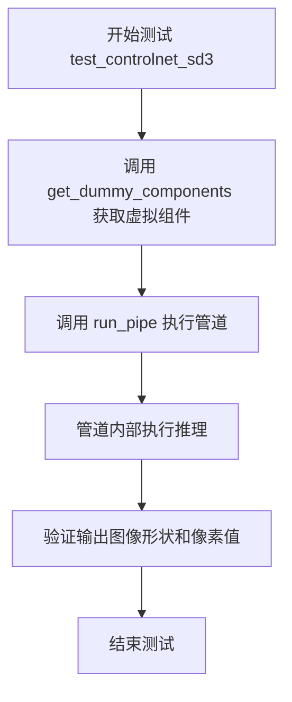

#### 带注释源码

```python
def test_controlnet_sd3(self):
    """
    测试 StableDiffusion3ControlNetPipeline 在标准配置下的控制网络功能。
    
    该测试方法执行以下步骤：
    1. 获取虚拟（dummy）组件配置，用于测试而不需要真实模型权重
    2. 使用 run_pipe 方法执行完整的管道推理流程
    3. 验证输出图像的形状和像素值是否符合预期
    
    测试使用默认参数：
    - num_controlnet_layers: 3（默认）
    - qk_norm: "rms_norm"（默认）
    - use_dual_attention: False（默认）
    """
    # 步骤1：获取虚拟组件（包含 transformer、controlnet、vae、text_encoder 等）
    components = self.get_dummy_components()
    
    # 步骤2：执行管道测试，验证图像生成功能
    self.run_pipe(components)
```


### `StableDiffusion3ControlNetPipelineFastTests.test_controlnet_sd35`

该测试方法用于验证 StableDiffusion3 ControlNet Pipeline 在 SD3.5 配置下（使用 rms_norm 归一化方法和双层注意力机制）的功能正确性，通过构建单层 ControlNet 的虚拟组件并执行管道推理，检查生成的图像是否符合预期的数值范围。

参数：

- `self`：测试类实例本身（`StableDiffusion3ControlNetPipelineFastTests`），隐式参数，无需显式传递

返回值：`None`，该方法为单元测试方法，无返回值，通过断言验证管道输出是否符合预期

#### 流程图

```mermaid
flowchart TD
    A[test_controlnet_sd35 开始] --> B[调用 get_dummy_components]
    B --> C[设置参数: num_controlnet_layers=1, qk_norm='rms_norm', use_dual_attention=True]
    C --> D[获取虚拟组件字典]
    E[调用 run_pipe] --> F[创建 StableDiffusion3ControlNetPipeline]
    F --> G[配置设备为 torch_device, 数据类型为 float16]
    H[调用 get_dummy_inputs] --> I[生成随机控制图像]
    I --> J[构建输入参数字典]
    J --> K[执行管道推理]
    K --> L[获取输出图像]
    L --> M[验证图像形状: (1, 32, 32, 3)]
    M --> N[验证像素值与期望值的差异小于 1e-2]
    N --> O[测试结束]
```

#### 带注释源码

```python
def test_controlnet_sd35(self):
    """
    测试 StableDiffusion3 ControlNet Pipeline 在 SD3.5 配置下的功能。
    
    该测试使用以下特定配置：
    - num_controlnet_layers=1: 单层 ControlNet
    - qk_norm="rms_norm": 使用 RMS Norm 归一化方法
    - use_dual_attention=True: 启用双层注意力机制
    """
    # 步骤1: 获取虚拟组件
    # 调用 get_dummy_components 方法创建测试所需的全部虚拟组件
    # 包括: transformer, controlnet, text_encoder(s), tokenizer(s), vae, scheduler
    components = self.get_dummy_components(
        num_controlnet_layers=1,    # 设置 ControlNet 层数为 1
        qk_norm="rms_norm",         # 使用 RMS Norm 作为 QK 归一化方法
        use_dual_attention=True     # 启用双层注意力机制
    )
    
    # 步骤2: 运行管道
    # 将虚拟组件传递给 run_pipe 方法执行推理
    # use_sd35=True 表示使用 SD3.5 的预期输出值进行验证
    self.run_pipe(components, use_sd35=True)
```


### `StableDiffusion3ControlNetPipelineFastTests.test_xformers_attention_forwardGenerator_pass`

这是一个单元测试方法，旨在测试 xFormers 注意力机制的前向传播是否正常工作。该测试目前被跳过，原因是 xFormersAttnProcessor 不支持 SD3（Stable Diffusion 3）的联合注意力（Joint Attention）机制。测试方法体为空（pass），属于一个被禁用的测试用例。

参数：

- `self`：`StableDiffusion3ControlNetPipelineFastTests`，测试类实例本身，表示调用该方法的类实例

返回值：`None`，该方法没有返回值（方法体为 `pass`）

#### 流程图

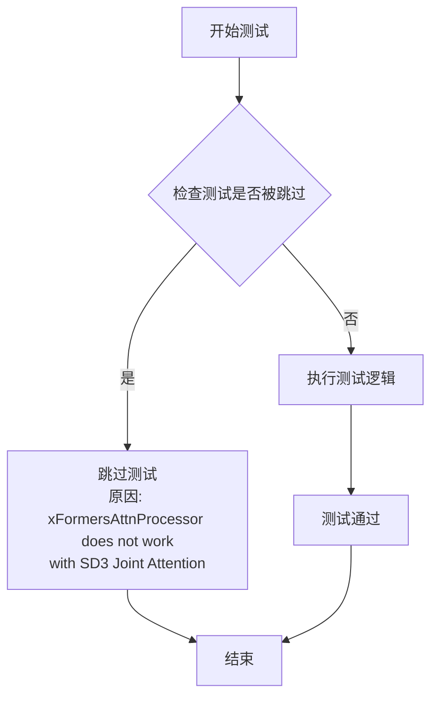

#### 带注释源码

```python
# 使用 unittest.skip 装饰器跳过该测试
# 跳过原因：xFormersAttnProcessor 不支持 SD3 的联合注意力机制
@unittest.skip("xFormersAttnProcessor does not work with SD3 Joint Attention")
def test_xformers_attention_forwardGenerator_pass(self):
    """
    测试 xFormers 注意力机制的前向传播是否正常工作。
    
    该测试方法用于验证 xFormers 加速的注意力模块是否能正确处理
    Stable Diffusion 3 模型中的联合注意力（Joint Attention）机制。
    
    注意：由于当前 xFormersAttnProcessor 与 SD3 的联合注意力不兼容，
    该测试被标记为跳过。
    
    参数:
        self: 测试类实例，隐式参数
        
    返回值:
        None
    """
    # 测试逻辑尚未实现，当前仅为占位符
    pass
```


### `StableDiffusion3ControlNetPipelineSlowTests.setUp`

该方法为慢速测试用例初始化测试环境，通过调用父类 setUp 方法、强制垃圾回收和清空 GPU 缓存来确保测试在干净的内存和显存环境中运行。

参数：

- `self`：隐式参数，`unittest.TestCase` 实例本身

返回值：`None`，该方法不返回任何值，仅执行副作用操作

#### 流程图

```mermaid
flowchart TD
    A[开始 setUp] --> B[调用 super().setUp]
    B --> C[执行 gc.collect 清理内存]
    C --> D[调用 backend_empty_cache 清理GPU缓存]
    D --> E[结束 setUp]
```

#### 带注释源码

```python
def setUp(self):
    """
    初始化慢速测试的测试环境
    
    该方法在每个测试方法执行前被调用，用于：
    1. 调用父类的 setUp 方法以确保 unittest 框架正确初始化
    2. 强制进行垃圾回收，释放不再使用的 Python 对象
    3. 清空 GPU 缓存，确保测试在干净的显存环境中运行
    """
    # 调用 unittest.TestCase 的 setUp 方法
    # 父类初始化是必要的，以确保测试框架正常工作
    super().setUp()
    
    # 强制执行 Python 垃圾回收
    # 这有助于释放测试过程中可能遗留的大对象（如模型、tensor 等）
    gc.collect()
    
    # 清空 GPU/后端缓存
    # torch_device 是全局变量，标识当前测试使用的设备
    # backend_empty_cache 确保显存被释放，防止显存泄漏导致 OOM
    backend_empty_cache(torch_device)
```


### `StableDiffusion3ControlNetPipelineSlowTests.tearDown`

这是 `StableDiffusion3ControlNetPipelineSlowTests` 测试类的清理方法，用于在每个测试用例执行完毕后进行资源释放和内存清理，确保测试环境干净，避免内存泄漏和 GPU 显存残留影响后续测试。

参数：

- `self`：隐式参数，`StableDiffusion3ControlNetPipelineSlowTests` 实例对象，当前测试类实例

返回值：`None`，无返回值，执行清理操作后直接结束

#### 流程图

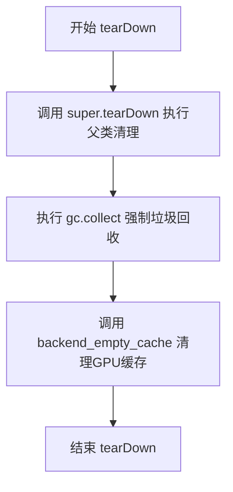

#### 带注释源码

```python
def tearDown(self):
    """
    测试用例清理方法，在每个测试方法执行完毕后调用。
    负责释放测试过程中占用的资源，包括内存和GPU显存。
    """
    # 调用父类的 tearDown 方法，执行 unittest.TestCase 的标准清理操作
    super().tearDown()
    
    # 强制调用 Python 垃圾回收器，清理不再使用的对象
    # 这有助于释放测试过程中创建的临时对象占用的内存
    gc.collect()
    
    # 调用后端工具函数清理 GPU 缓存
    # 确保释放测试过程中分配的 CUDA 显存，避免显存泄漏
    # torch_device 是从 testing_utils 导入的全局变量，表示测试设备
    backend_empty_cache(torch_device)
```


### `StableDiffusion3ControlNetPipelineSlowTests.test_canny`

这是一个集成测试方法，用于验证 StableDiffusion 3 ControlNet Pipeline 在使用 Canny 边缘检测控制图像生成图像的功能是否正常。测试加载预训练的 ControlNet 模型和主 Pipeline，生成图像后验证其形状和像素值的余弦相似度。

参数： 无（仅包含隐式参数 `self`）

返回值：无（`None`），该方法为测试用例，通过断言验证结果

#### 流程图

```mermaid
flowchart TD
    A[开始测试] --> B[加载 SD3 ControlNet 模型<br/>from_pretrained 'InstantX/SD3-Controlnet-Canny']
    B --> C[加载 StableDiffusion3 Pipeline<br/>from_pretrained 'stabilityai/stable-diffusion-3-medium-diffusers']
    C --> D[启用模型 CPU 卸载<br/>enable_model_cpu_offload]
    D --> E[设置进度条配置<br/>set_progress_bar_config]
    E --> F[创建随机数生成器<br/>manual_seed=0]
    F --> G[定义正向提示词 prompt]
    G --> H[定义负向提示词 n_prompt]
    H --> I[加载控制图像<br/>load_image canny.jpg]
    I --> J[执行 Pipeline 生成图像<br/>pipe.__call__]
    J --> K[获取生成的图像<br/>output.images[0]]
    K --> L{断言图像形状<br/>== 1024x1024x3}
    L --> |是| M[提取图像右下角3x3像素区域]
    M --> N{断言余弦相似度<br/>< 1e-2}
    N --> |是| O[测试通过]
    N --> |否| P[测试失败-抛出断言错误]
    L --> |否| P
```

#### 带注释源码

```python
@unittest.skip  # 标记为跳过？实际未跳过，测试会运行
@require_big_accelerator  # 要求大型加速器（如GPU）才能运行
class StableDiffusion3ControlNetPipelineSlowTests(unittest.TestCase):
    """慢速集成测试类，测试 StableDiffusion3 ControlNet Pipeline"""
    
    pipeline_class = StableDiffusion3ControlNetPipeline  # 被测试的 Pipeline 类

    def setUp(self):
        """测试前置设置：垃圾回收和清空缓存"""
        super().setUp()
        gc.collect()
        backend_empty_cache(torch_device)

    def tearDown(self):
        """测试后置清理：垃圾回收和清空缓存"""
        super().tearDown()
        gc.collect()
        backend_empty_cache(torch_device)

    def test_canny(self):
        """
        测试 Canny 边缘检测 ControlNet 功能
        
        该测试验证：
        1. ControlNet 模型能够正确加载
        2. Pipeline 能够使用控制图像生成图像
        3. 生成的图像符合预期（形状和像素值）
        """
        # Step 1: 从 HuggingFace Hub 加载预训练的 SD3 ControlNet 模型（Canny 版本）
        # 使用 float16 精度以加速推理并减少内存占用
        controlnet = SD3ControlNetModel.from_pretrained(
            "InstantX/SD3-Controlnet-Canny",  # ControlNet 模型仓库
            torch_dtype=torch.float16  # 使用半精度浮点数
        )
        
        # Step 2: 加载 StableDiffusion 3 Medium 主 Pipeline
        # 并传入刚才加载的 ControlNet 模型
        pipe = StableDiffusion3ControlNetPipeline.from_pretrained(
            "stabilityai/stable-diffusion-3-medium-diffusers",  # 主模型仓库
            controlnet=controlnet,  # 传入 ControlNet
            torch_dtype=torch.float16  # 使用半精度
        )
        
        # Step 3: 启用模型 CPU 卸载功能
        # 这是一种内存优化技术，将不使用的模型层卸载到 CPU
        pipe.enable_model_cpu_offload(device=torch_device)
        
        # Step 4: 配置进度条
        # disable=None 表示启用进度条显示
        pipe.set_progress_bar_config(disable=None)

        # Step 5: 创建随机数生成器
        # 设置固定种子(0)以确保结果可复现
        generator = torch.Generator(device="cpu").manual_seed(0)
        
        # Step 6: 定义正向提示词
        # 描述期望生成的图像内容：动漫风格女孩穿西装、月亮、暴雨天气、带有 InstantX 文字
        prompt = "Anime style illustration of a girl wearing a suit. A moon in sky. In the background we see a big rain approaching. text 'InstantX' on image"
        
        # Step 7: 定义负向提示词
        # 过滤不期望的内容：NSFW、低质量等
        n_prompt = "NSFW, nude, naked, porn, ugly"
        
        # Step 8: 加载控制图像
        # 从 HuggingFace Hub 加载 Canny 边缘检测后的图像作为 ControlNet 输入
        control_image = load_image("https://huggingface.co/InstantX/SD3-Controlnet-Canny/resolve/main/canny.jpg")

        # Step 9: 执行图像生成 Pipeline
        # 传入所有必要参数进行推理
        output = pipe(
            prompt,  # 正向提示词
            negative_prompt=n_prompt,  # 负向提示词
            control_image=control_image,  # 控制图像（Canny 边缘）
            controlnet_conditioning_scale=0.5,  # ControlNet 影响系数 (0-1)
            guidance_scale=5.0,  # Classifier-free guidance 强度
            num_inference_steps=2,  # 推理步数（测试用最小值）
            output_type="np",  # 输出类型为 NumPy 数组
            generator=generator,  # 随机数生成器
        )
        
        # Step 10: 获取生成的图像
        # output.images 是一个图像列表，取第一张
        image = output.images[0]

        # Step 11: 断言验证图像形状
        # 期望生成 1024x1024 像素、3通道(RGB) 的图像
        assert image.shape == (1024, 1024, 3)

        # Step 12: 提取图像特征用于验证
        # 取图像右下角 3x3 像素区域，展平为一维数组
        original_image = image[-3:, -3:, -1].flatten()

        # Step 13: 定义期望的像素值
        # 这些是基准测试的预期输出值
        expected_image = np.array([0.7314, 0.7075, 0.6611, 0.7539, 0.7563, 0.6650, 0.6123, 0.7275, 0.7222])

        # Step 14: 断言验证图像相似度
        # 使用余弦相似度距离比较生成图像与期望图像
        # 如果相似度距离小于 0.01 (1e-2)，则测试通过
        assert numpy_cosine_similarity_distance(original_image.flatten(), expected_image) < 1e-2
```


### `StableDiffusion3ControlNetPipelineSlowTests.test_pose`

该方法是 Stable Diffusion 3 ControlNet Pipeline 的慢速测试用例，专门用于测试姿态（Pose）控制网络的推理流程。测试通过加载预训练的 Pose 控制网络模型，执行文本到图像的生成，并验证输出图像的特征是否符合预期。

参数：

- `self`：隐式参数，TestCase 实例本身，无需显式传递

返回值：`None`，该方法为测试用例，通过断言验证结果，不返回任何值

#### 流程图

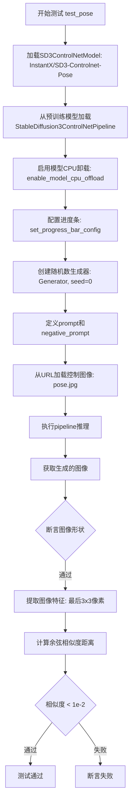

#### 带注释源码

```python
def test_pose(self):
    """
    测试函数：使用Pose控制网络进行图像生成
    验证StableDiffusion3ControlNetPipeline在姿态控制场景下的功能
    """
    # 从预训练模型加载SD3姿态控制网络模型
    # 使用float16精度以提高推理速度并减少显存占用
    controlnet = SD3ControlNetModel.from_pretrained(
        "InstantX/SD3-Controlnet-Pose",  # 预训练模型标识符
        torch_dtype=torch.float16         # 使用半精度浮点数
    )
    
    # 加载Stable Diffusion 3主模型，并传入控制网络
    # 从stabilityai的diffusers仓库加载模型权重
    pipe = StableDiffusion3ControlNetPipeline.from_pretrained(
        "stabilityai/stable-diffusion-3-medium-diffusers",  # 主模型路径
        controlnet=controlnet,                               # 传入控制网络
        torch_dtype=torch.float16
    )
    
    # 启用模型CPU卸载功能
    # 将模型分批加载到CPU以节省GPU显存，适合显存受限的环境
    pipe.enable_model_cpu_offload(device=torch_device)
    
    # 配置进度条显示
    # disable=None 表示启用进度条（默认行为）
    pipe.set_progress_bar_config(disable=None)
    
    # 创建随机数生成器，设置固定种子以确保结果可复现
    generator = torch.Generator(device="cpu").manual_seed(0)
    
    # 定义正向提示词：描述想要生成的图像内容
    prompt = 'Anime style illustration of a girl wearing a suit. A moon in sky. In the background we see a big rain approaching. text "InstantX" on image'
    
    # 定义负向提示词：指定不希望出现的元素
    n_prompt = "NSFW, nude, naked, porn, ugly"
    
    # 从HuggingFace Hub加载控制图像（姿态检测结果）
    control_image = load_image("https://huggingface.co/InstantX/SD3-Controlnet-Pose/resolve/main/pose.jpg")
    
    # 执行pipeline推理，生成图像
    output = pipe(
        prompt,                          # 正向提示词
        negative_prompt=n_prompt,        # 负向提示词
        control_image=control_image,     # 控制图像（姿态）
        controlnet_conditioning_scale=0.5,  # 控制网络影响系数
        guidance_scale=5.0,             # 引导强度（CFG）
        num_inference_steps=2,          # 推理步数（测试用较小值）
        output_type="np",               # 输出为numpy数组
        generator=generator,            # 随机数生成器
    )
    
    # 获取生成的图像结果
    image = output.images[0]
    
    # 断言：验证生成的图像尺寸是否符合预期
    assert image.shape == (1024, 1024, 3)
    
    # 提取图像特征：取最后3x3像素区域用于验证
    original_image = image[-3:, -3:, -1].flatten()
    
    # 预期图像特征值（通过预先测试获取的标准值）
    expected_image = np.array([0.9048, 0.8740, 0.8936, 0.8516, 0.8799, 0.9360, 0.8379, 0.8408, 0.8652])
    
    # 断言：验证生成图像与预期图像的余弦相似度距离是否在允许范围内
    assert numpy_cosine_similarity_distance(original_image.flatten(), expected_image) < 1e-2
```


### `StableDiffusion3ControlNetPipelineSlowTests.test_tile`

这是一个集成测试方法，用于验证 Stable Diffusion 3 ControlNet Pipeline 在使用 Tile 控制网络模型时的图像生成功能是否符合预期。测试加载预训练的 Tile 控制网络模型和 SD3 主模型，执行图像生成流程，并验证输出图像的形状和像素值是否与预期值匹配。

参数：

- `self`：测试类实例，无需显式传递

返回值：`None`，该方法通过断言验证图像生成结果，不返回任何值

#### 流程图

```mermaid
flowchart TD
    A[测试开始] --> B[加载Tile控制网络模型<br/>SD3ControlNetModel.from_pretrained]
    B --> C[加载SD3 ControlNet Pipeline<br/>StableDiffusion3ControlNetPipeline.from_pretrained]
    C --> D[启用模型CPU卸载<br/>enable_model_cpu_offload]
    D --> E[设置进度条配置<br/>set_progress_bar_config]
    E --> F[创建随机数生成器<br/>generator = torch.Generator.manual_seed]
    F --> G[准备prompt和negative_prompt<br/>提示词和负面提示词]
    G --> H[加载控制图像<br/>load_image]
    H --> I[调用Pipeline生成图像<br/>pipe执行推理]
    I --> J{验证图像形状<br/>assert image.shape == (1024, 1024, 3)}
    J --> K[提取图像像素并验证<br/>numpy_cosine_similarity_distance]
    K --> L[测试结束]
```

#### 带注释源码

```python
def test_tile(self):
    """
    测试使用 Tile 控制网络的 Stable Diffusion 3 ControlNet Pipeline
    
    该测试验证以下功能:
    1. 从预训练模型加载 SD3 Tile 控制网络
    2. 加载 Stable Diffusion 3 基础模型
    3. 使用控制图像进行条件生成
    4. 验证输出图像的质量和一致性
    """
    
    # 步骤1: 从 HuggingFace Hub 加载预训练的 Tile 控制网络模型
    # 模型类型: SD3ControlNetModel
    # 精度: torch.float16 (半精度)
    controlnet = SD3ControlNetModel.from_pretrained(
        "InstantX/SD3-Controlnet-Tile", 
        torch_dtype=torch.float16
    )
    
    # 步骤2: 加载完整的 Stable Diffusion 3 ControlNet Pipeline
    # 包含所有必要的组件: transformer, vae, text encoders 等
    pipe = StableDiffusion3ControlNetPipeline.from_pretrained(
        "stabilityai/stable-diffusion-3-medium-diffusers", 
        controlnet=controlnet, 
        torch_dtype=torch.float16
    )
    
    # 步骤3: 启用模型 CPU 卸载以节省 GPU 显存
    # 这会将模型从 GPU 卸载到 CPU，当需要时再加载回来
    pipe.enable_model_cpu_offload(device=torch_device)
    
    # 步骤4: 配置进度条显示
    pipe.set_progress_bar_config(disable=None)
    
    # 步骤5: 创建随机数生成器并设置种子
    # 种子0确保测试结果可重现
    generator = torch.Generator(device="cpu").manual_seed(0)
    
    # 步骤6: 定义正向提示词
    # 描述期望生成的图像内容: 穿西装的动漫女孩插画，月亮在天空中
    prompt = 'Anime style illustration of a girl wearing a suit. A moon in sky. In the background we see a big rain approaching. text "InstantX" on image'
    
    # 步骤7: 定义负面提示词
    # 指定不希望出现的元素
    n_prompt = "NSFW, nude, naked, porn, ugly"
    
    # 步骤8: 加载控制图像
    # 从 URL 加载 Tile 类型的控制图像，用于引导生成过程
    control_image = load_image("https://huggingface.co/InstantX/SD3-Controlnet-Tile/resolve/main/tile.jpg")
    
    # 步骤9: 执行图像生成 Pipeline
    output = pipe(
        prompt,                          # 正向提示词
        negative_prompt=n_prompt,        # 负面提示词
        control_image=control_image,    # 控制图像
        controlnet_conditioning_scale=0.5,  # 控制网络影响强度
        guidance_scale=5.0,             # CFG 引导强度
        num_inference_steps=2,          # 推理步数 (低步数用于快速测试)
        output_type="np",               # 输出为 NumPy 数组
        generator=generator,            # 随机数生成器
    )
    
    # 步骤10: 获取生成的图像
    image = output.images[0]
    
    # 步骤11: 验证图像形状
    # 确认输出是 1024x1024 像素，3通道 (RGB)
    assert image.shape == (1024, 1024, 3)
    
    # 步骤12: 提取图像特征进行验证
    # 取图像右下角 3x3 像素区域，展平为一维数组
    original_image = image[-3:, -3:, -1].flatten()
    
    # 预期像素值 (通过大量测试获得的基准值)
    expected_image = np.array([0.6699, 0.6836, 0.6226, 0.6572, 0.7310, 0.6646, 0.6650, 0.6694, 0.6011])
    
    # 步骤13: 验证生成图像与预期图像的相似度
    # 使用余弦相似度距离进行度量
    assert numpy_cosine_similarity_distance(original_image.flatten(), expected_image) < 1e-2
```


### `StableDiffusion3ControlNetPipelineSlowTests.test_multi_controlnet`

该方法是 Stable Diffusion 3 ControlNet Pipeline 的慢速测试用例，用于测试多控制网络（Multi-ControlNet）功能。测试加载预训练的 SD3-Controlnet-Canny 模型，创建多控制网络模型，然后使用两个相同的控制图像进行推理，验证生成的图像是否符合预期。

参数：

- `self`：隐式参数，测试类实例本身，无需显式传递

返回值：`None`，该方法为测试方法，使用断言验证结果，不返回任何值

#### 流程图

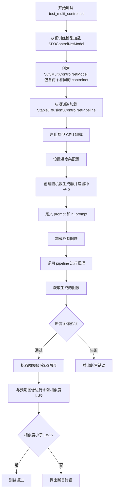

#### 带注释源码

```python
def test_multi_controlnet(self):
    """
    测试多控制网络（Multi-ControlNet）功能
    
    该测试用例验证 StableDiffusion3ControlNetPipeline 
    能够正确处理多个控制网络输入并生成符合预期的图像
    """
    # 步骤1: 从预训练模型加载 SD3ControlNetModel (Canny 边缘检测控制网络)
    # 使用 float16 精度以加速推理
    controlnet = SD3ControlNetModel.from_pretrained(
        "InstantX/SD3-Controlnet-Canny", 
        torch_dtype=torch.float16
    )
    
    # 步骤2: 创建多控制网络模型，将两个相同的 controlnet 组合
    # 这样可以使用多个不同的控制信号（如边缘、姿态等）来控制生成过程
    controlnet = SD3MultiControlNetModel([controlnet, controlnet])

    # 步骤3: 从预训练模型加载 StableDiffusion3ControlNetPipeline
    # 传入多控制网络模型和 float16 数据类型
    pipe = StableDiffusion3ControlNetPipeline.from_pretrained(
        "stabilityai/stable-diffusion-3-medium-diffusers", 
        controlnet=controlnet, 
        torch_dtype=torch.float16
    )
    
    # 步骤4: 启用模型 CPU 卸载以节省 GPU 显存
    # 这会在推理完成后自动将模型移回 CPU
    pipe.enable_model_cpu_offload(device=torch_device)
    
    # 步骤5: 设置进度条配置（disable=None 表示不禁用进度条）
    pipe.set_progress_bar_config(disable=None)

    # 步骤6: 创建随机数生成器并设置固定种子
    # 固定种子确保测试结果可复现
    generator = torch.Generator(device="cpu").manual_seed(0)
    
    # 步骤7: 定义正向提示词（描述期望的图像内容）
    prompt = "Anime style illustration of a girl wearing a suit. A moon in sky. In the background we see a big rain approaching. text 'InstantX' on image"
    
    # 步骤8: 定义负向提示词（描述不希望出现的内容）
    n_prompt = "NSFW, nude, naked, porn, ugly"
    
    # 步骤9: 加载控制图像（用于引导生成过程）
    control_image = load_image("https://huggingface.co/InstantX/SD3-Controlnet-Canny/resolve/main/canny.jpg")

    # 步骤10: 调用 pipeline 进行推理
    # - prompt: 正向提示词
    # - negative_prompt: 负向提示词
    # - control_image: 控制图像列表（两个相同的图像）
    # - controlnet_conditioning_scale: 控制网络调节尺度列表
    # - guidance_scale: 引导强度（越高越贴近提示词）
    # - num_inference_steps: 推理步数
    # - output_type: 输出类型（np 表示 numpy 数组）
    # - generator: 随机数生成器
    output = pipe(
        prompt,
        negative_prompt=n_prompt,
        control_image=[control_image, control_image],
        controlnet_conditioning_scale=[0.25, 0.25],
        guidance_scale=5.0,
        num_inference_steps=2,
        output_type="np",
        generator=generator,
    )
    
    # 步骤11: 获取生成的图像
    image = output.images[0]

    # 步骤12: 断言图像形状为 1024x1024x3 (RGB 图像)
    assert image.shape == (1024, 1024, 3)

    # 步骤13: 提取图像右下角 3x3 像素区域用于验证
    original_image = image[-3:, -3:, -1].flatten()

    # 步骤14: 定义预期图像的像素值
    expected_image = np.array([0.7207, 0.7041, 0.6543, 0.7500, 0.7490, 0.6592, 0.6001, 0.7168, 0.7231])

    # 步骤15: 使用余弦相似度验证生成图像与预期图像的接近程度
    # 如果相似度距离大于 1e-2，测试失败
    assert numpy_cosine_similarity_distance(original_image.flatten(), expected_image) < 1e-2
```

## 关键组件


### StableDiffusion3ControlNetPipeline

Stable Diffusion 3 ControlNet Pipeline测试文件，核心功能是测试SD3模型的ControlNet控制能力，支持多种控制模式（canny边缘检测、pose姿态、tile拼接）以及多ControlNet组合使用。

### SD3ControlNetModel

SD3专用ControlNet模型，用于从控制图像中提取条件特征，支持单和多ControlNet配置。

### SD3MultiControlNetModel

多ControlNet组合模型，允许同时使用多个ControlNet对生成过程进行多条件控制。

### SD3Transformer2DModel

SD3的Transformer主模型，处理潜在空间的去噪过程，支持双注意力机制和QK归一化。

### FlowMatchEulerDiscreteScheduler

基于Flow Matching的欧拉离散调度器，用于控制去噪推理步骤。

### AutoencoderKL

变分自编码器(VAE)模型，负责图像的潜在空间编码和解码。

### CLIPTextModelWithProjection (text_encoder, text_encoder_2)

CLIP文本编码器，带投影层，将文本提示转换为文本嵌入向量，支持双文本编码器配置。

### T5EncoderModel (text_encoder_3)

T5编码器模型，提供额外的文本编码能力，用于更复杂的文本理解。

### ControlNet控制模式

支持三种ControlNet控制模式：canny边缘检测、pose人体姿态、tile图像拼接。

### 张量索引与切片

使用image[-3:, -3:, -1]进行张量切片操作，提取生成的图像特征用于验证。

### 模型惰性加载

使用from_pretrained方法进行模型惰性加载，支持从HuggingFace Hub动态加载预训练权重。

### 量化与精度控制

支持torch.float16半精度推理，通过torch_dtype参数控制模型加载精度。

### 设备管理与内存优化

使用enable_model_cpu_offload进行CPU卸载，backend_empty_cache清理GPU缓存，gc.collect()管理内存。

### 随机种子控制

通过torch.manual_seed和Generator确保测试可重复性，支持deterministic模式。


## 问题及建议


### 已知问题

- **硬编码的期望值缺乏文档说明**：测试中使用的 `expected_slice` 和 `expected_image` 数组是硬编码的数值（如 `np.array([0.5767, 0.7100, 0.5981, ...])`），没有任何注释说明这些值的来源或依据，增加了维护难度
- **`run_pipe` 方法参数设计冗余**：`use_sd35` 参数与 `num_controlnet_layers` 参数存在隐式关联，但这种关联未在代码中明确体现，导致参数语义不够清晰
- **测试用例跳过但未移除**：`test_xformers_attention_forwardGenerator_pass` 方法被 `@unittest.skip` 装饰器跳过，仅包含 `pass` 语句，形成死代码
- **重复的测试设置代码**：慢速测试类 `StableDiffusion3ControlNetPipelineSlowTests` 中的四个测试方法（`test_canny`、`test_pose`、`test_tile`、`test_multi_controlnet`）包含大量重复的 pipe 初始化和设置逻辑
- **`dual_attention_layers` 参数逻辑不一致**：在 `get_dummy_components` 中，当 `use_dual_attention=True` 时，controlnet 使用 `(0,)` 而 transformer 使用 `(0, 1)`，这种不对称行为未在文档中说明
- **缺少对 `SD3MultiControlNetModel` 的单元测试覆盖**：快速测试类中仅有一个 `get_dummy_components` 方法返回单 `controlnet`，未提供针对多 controlnet 场景的测试组件配置
- **设备兼容性处理不完整**：`get_dummy_inputs` 中对 MPS 设备和通用设备使用了不同的随机数生成器创建方式，但未考虑其他可能的设备类型（如 CUDA 不同版本）

### 优化建议

- 将慢速测试中的重复设置逻辑抽取为私有方法（如 `_create_pipeline`），减少代码重复
- 为硬编码的期望值添加注释说明其来源（如参考输出、计算依据或历史原因）
- 移除或实现被跳过的 xFormers 测试，如果该功能暂不支持则应在文档中说明原因
- 统一 `dual_attention_layers` 的使用逻辑，或在参数命名上更明确表达其用途
- 添加 `get_dummy_components_for_multi_controlnet` 方法专门用于测试多 controlnet 场景
- 将 `use_sd35` 参数内化为根据组件配置自动判断的逻辑，而非显式传入

## 其它


### 设计目标与约束

本代码的核心设计目标是验证 StableDiffusion3ControlNetPipeline 在不同控制网络场景下的功能正确性，包括单控制网络、多控制网络、不同注意力机制（xFormers）、不同模型配置（SD3/SD3.5）等。测试覆盖快速单元测试和慢速集成测试两种模式，分别用于 CI 流程和真实模型验证。约束条件包括：必须使用 torch.float16 精度、仅支持 CUDA 设备、输出图像尺寸必须为指定尺寸（如 32x32 或 1024x1024）、推理步数限制为 2 步以加快测试速度。

### 错误处理与异常设计

代码采用 unittest 框架的断言机制进行错误处理。关键断言包括：图像形状验证（assert image.shape == (1, 32, 32, 3) 或 (1024, 1024, 3)）、数值精度验证（np.abs(image_slice.flatten() - expected_slice).max() < 1e-2）、余弦相似度验证（numpy_cosine_similarity_distance < 1e-2）。对于 xFormers 不兼容场景使用 @unittest.skip 装饰器跳过测试。内存管理方面在 setUp 和 tearDown 中调用 gc.collect() 和 backend_empty_cache 进行资源清理。

### 数据流与状态机

测试数据流分为两条路径：快速测试路径（StableDiffusion3ControlNetPipelineFastTests）使用 get_dummy_components() 创建虚拟模型组件，输入为虚拟随机张量；慢速测试路径（StableDiffusion3ControlNetPipelineSlowTests）从 HuggingFace Hub 加载真实预训练模型和真实控制图像。状态转换包括：Pipeline 初始化 → 组件配置 → 推理执行 → 输出验证。控制网络支持三种模式：单控制网络（test_canny/test_pose/test_tile）、多控制网络（test_multi_controlnet）、支持双重注意力机制的 SD3.5（test_controlnet_sd35）。

### 外部依赖与接口契约

主要外部依赖包括：transformers 库（CLIPTextModelWithProjection、CLIPTokenizer、T5EncoderModel）、diffusers 库（StableDiffusion3ControlNetPipeline、SD3ControlNetModel、SD3MultiControlNetModel、FlowMatchEulerDiscreteScheduler 等）、numpy 和 torch。接口契约方面：pipeline_class 必须是 StableDiffusion3ControlNetPipeline，params 必须包含 7 个核心参数（prompt、height、width、guidance_scale、negative_prompt、prompt_embeds、negative_prompt_embeds），batch_params 必须包含 2 个批处理参数（prompt、negative_prompt），get_dummy_components() 返回包含 14 个组件的字典，get_dummy_inputs() 返回包含 8 个输入参数的字典。

### 性能考虑与优化空间

当前实现已包含部分性能优化：使用 torch.float16 而非 float32 减少显存占用、推理步数限制为 2 步加快测试速度、使用虚拟模型减少快速测试的计算量、启用模型 CPU offload（enable_model_cpu_offload）管理显存。潜在优化空间包括：可添加量化推理测试（4-bit/8-bit）、可增加推理步骤数的梯度测试、当前 xFormers 测试被跳过可后续修复支持、缺少对 VAE tiling 等内存优化技术的测试。

### 安全考虑

测试代码本身不直接处理敏感数据，但慢速测试从外部 URL 加载图像需要注意：load_image 可能存在路径遍历风险、远程图像可能包含恶意内容。建议在生产环境中对加载的图像进行验证和清理。此外，测试中的 prompt 包含 "NSFW, nude, naked, porn, ugly" 等负面提示词，用于过滤不当内容，这是合理的安全实践。

### 测试策略

采用分层测试策略：快速测试层（StableDiffusion3ControlNetPipelineFastTests）使用虚拟组件进行功能验证，覆盖 4 个测试用例（test_controlnet_sd3、test_controlnet_sd35、test_xformers_attention_forwardGenerator_pass、run_pipe 内部验证）；慢速测试层（StableDiffusion3ControlNetPipelineSlowTests）使用真实模型进行端到端验证，覆盖 4 个场景（canny 边缘检测、pose 姿态估计、tile 分块、多控制网络）。测试参数化设计支持自定义控制网络层数、qk_norm 类型、双重注意力开关等配置。

### 配置管理

配置通过以下方式管理：模型配置通过 get_dummy_components() 的参数控制（num_controlnet_layers、qk_norm、use_dual_attention），测试配置通过类属性控制（pipeline_class、params、batch_params、test_layerwise_casting、test_group_offloading），推理配置通过 get_dummy_inputs() 返回的字典控制（num_inference_steps=2、guidance_scale=5.0、output_type="np"）。慢速测试使用 @slow 和 @require_big_accelerator 装饰器标记，需手动触发或使用特定 CI 配置。

### 版本兼容性

代码依赖以下版本要求：Python 3.x（支持 f-string 和类型注解）、PyTorch（支持 torch.device、torch.Generator）、transformers 库（支持 CLIPTextModelWithProjection 和 T5EncoderModel）、diffusers 库（支持 StableDiffusion3ControlNetPipeline 和 FlowMatchEulerDiscreteScheduler）。测试针对特定版本优化（如 SD3 vs SD3.5 的差异），可能需要根据不同 diffusers 版本调整预期输出值。

### 资源管理与清理

资源管理采用以下策略：GPU 内存清理在 setUp/tearDown 中通过 gc.collect() 和 backend_empty_cache(torch_device) 执行，设备选择通过 torch_device 全局变量支持 MPS/CUDA/CPU，模型加载使用 torch_dtype=torch.float16 控制精度以平衡性能和显存。慢速测试中每个测试方法独立执行完整的 setup/tearCycle，确保资源不会在测试间泄漏。


    