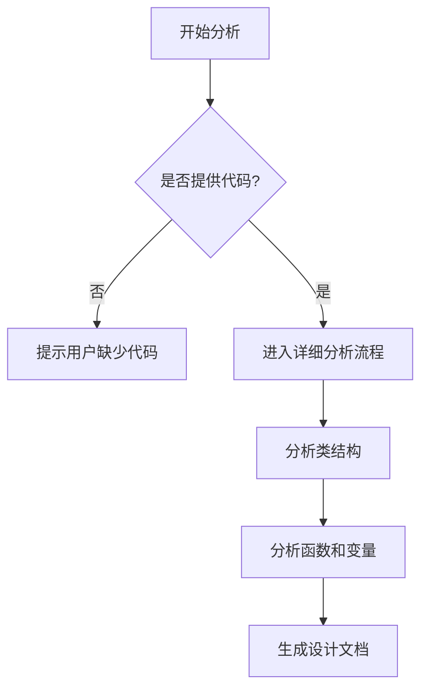

# `diffusers\tests\pipelines\cosmos\__init__.py` 详细设计文档

未提供源代码，无法进行分析。请在代码块中提供需要分析的源代码。

## 整体流程



## 类结构

```

```

## 全局变量及字段


    

## 全局函数及方法


## 关键组件


## 错误

未提供源代码进行分析。请在"代码"部分提供需要分析的源代码，以便我能够识别关键组件并生成详细的设计文档。


## 问题及建议


### 已知问题

-   未提供待分析的代码，无法进行技术债务和优化空间的分析

### 优化建议

-   请提供需要分析的源代码，以便进行详细的技术债务识别和优化建议


## 其它


### 一段话描述

无（代码未提供）

### 文件的整体运行流程

无（代码未提供）

### 类的详细信息

无（代码未提供）

### 类字段和全局变量

无（代码未提供）

### 类方法和全局函数

无（代码未提供）

### 关键组件信息

无（代码未提供）

### 潜在的技术债务或优化空间

无（代码未提供）

### 设计目标与约束

无（代码未提供）

### 错误处理与异常设计

无（代码未提供）

### 数据流与状态机

无（代码未提供）

### 外部依赖与接口契约

无（代码未提供）

### 性能要求与基准

无（代码未提供）

### 安全性考虑

无（代码未提供）

### 兼容性设计

无（代码未提供）

### 测试策略

无（代码未提供）

### 部署与运维

无（代码未提供）


    