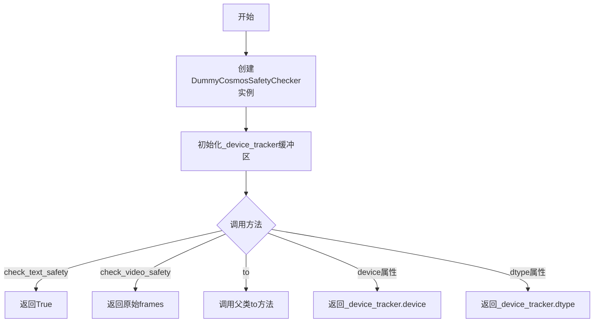
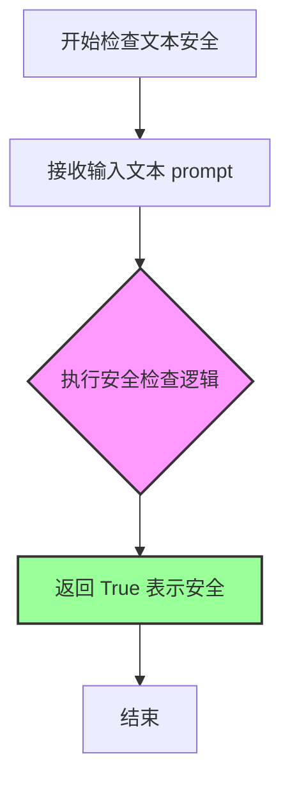
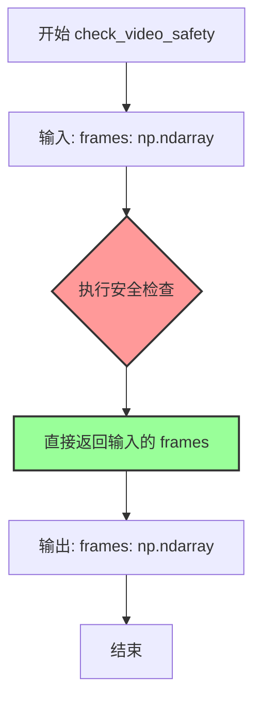
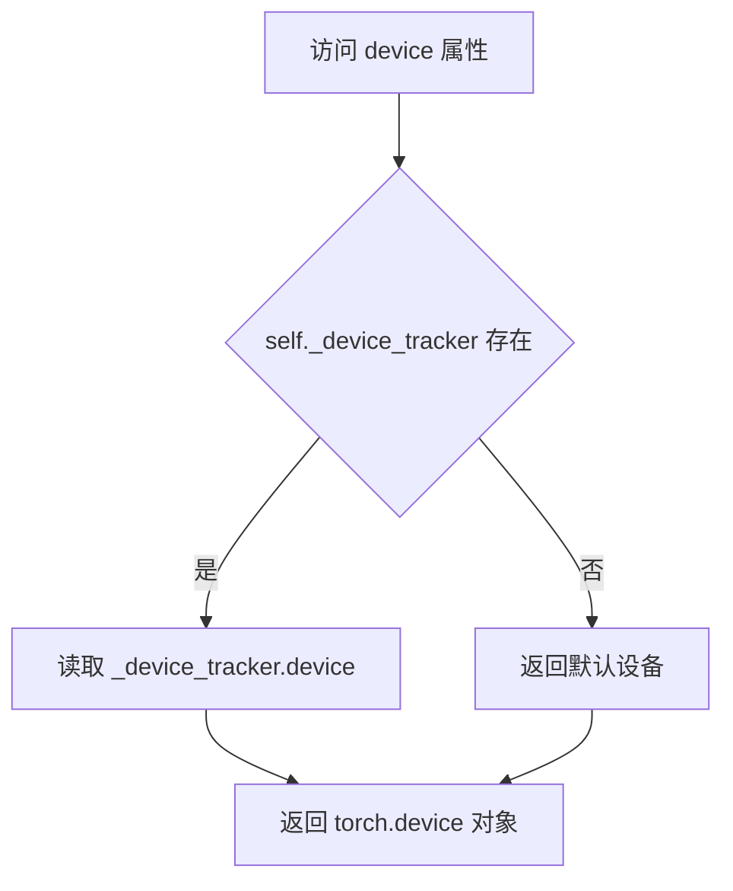
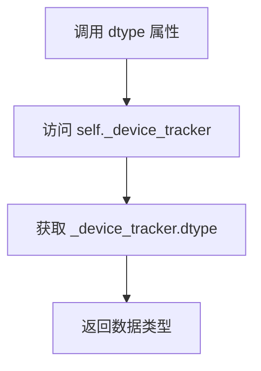

# `diffusers\tests\pipelines\cosmos\cosmos_guardrail.py` 详细设计文档

这是一个虚拟的安全检查器实现（DummyCosmosSafetyChecker），用于快速测试场景。该类继承自ModelMixin和ConfigMixin，提供了文本和视频安全检查的接口，但实际实现为直接返回原始输入或True，不进行任何真实的安全过滤。

## 整体流程



## 类结构

```
DummyCosmosSafetyChecker (虚拟安全检查器)
├── 继承自: ModelMixin
└── 继承自: ConfigMixin
```

## 全局变量及字段


### `DummyCosmosSafetyChecker._device_tracker`
    
用于跟踪模型设备和数据类型的缓冲区

类型：`torch.Tensor`
    
    

## 全局函数及方法


### `DummyCosmosSafetyChecker.__init__`

构造函数，初始化 DummyCosmosSafetyChecker 类实例，调用父类初始化方法并注册一个设备跟踪缓冲区，用于追踪模型所在的设备和数据类型。

参数：

- 无显式参数（`self` 为隐式参数，表示类实例本身）

返回值：`None`，无返回值（构造函数）

#### 流程图

```mermaid
flowchart TD
    A[开始 __init__] --> B[调用 super().__init__ 初始化父类]
    B --> C[注册 _device_tracker 缓冲区]
    C --> D[设置 persistent=False 表示非持久化]
    D --> E[结束]
```

#### 带注释源码

```python
def __init__(self) -> None:
    """
    构造函数，初始化 DummyCosmosSafetyChecker 实例。
    
    继承自 ModelMixin 和 ConfigMixin，用于模拟安全检查器的空实现，
    主要用于快速测试场景。
    """
    # 调用父类 ModelMixin 和 ConfigMixin 的初始化方法
    # ConfigMixin 会处理配置加载和注册
    # ModelMixin 会初始化基础模型功能
    super().__init__()

    # 注册一个设备跟踪缓冲区 _device_tracker
    # 这是一个形状为 (1,) 的 float32 类型张量
    # persistent=False 表示该缓冲区不会被保存到模型检查点中
    # 用于通过该张量的 device 和 dtype 属性来追踪模型的设备和数据类型
    self.register_buffer("_device_tracker", torch.zeros(1, dtype=torch.float32), persistent=False)
```


### `DummyCosmosSafetyChecker.check_text_safety`

文本安全检查（虚拟实现），用于在快速测试中模拟文本安全检查功能，当前实现始终返回 True，表示文本被认为是安全的。

参数：

- `prompt`：`str`，待检查的文本提示内容

返回值：`bool`，始终返回 `True`，表示文本通过安全检查

#### 流程图



#### 带注释源码

```python
def check_text_safety(self, prompt: str) -> bool:
    """
    检查文本提示的安全性（虚拟实现）。
    
    这是一个用于测试目的的虚拟实现，始终返回 True。
    在实际应用中，这里应该包含真正的安全检查逻辑，
    例如内容过滤、敏感词检测等。
    
    Args:
        prompt: str - 待检查的文本提示内容
        
    Returns:
        bool - 始终返回 True，表示文本通过安全检查
    """
    return True
```


### `DummyCosmosSafetyChecker.check_video_safety`

该方法是 `DummyCosmosSafetyChecker` 类中的一个虚拟实现（dummy implementation），用于视频/帧的安全检查。在实际测试中，该方法简单地返回输入的帧数组，不执行任何实际的安全检查逻辑。

参数：

- `frames`：`np.ndarray`，需要检查安全性的视频帧数据

返回值：`np.ndarray`，经过"检查"后的视频帧数据（在本虚拟实现中，直接返回输入的 frames）

#### 流程图



#### 带注释源码

```python
def check_video_safety(self, frames: np.ndarray) -> np.ndarray:
    """
    视频/帧安全检查（虚拟实现）
    
    这是一个用于快速测试的虚拟安全检查器，不执行任何实际的安全检查逻辑。
    在真实场景中，这里应该包含对视频帧的内容审核、敏感信息过滤等功能。
    
    参数:
        frames: np.ndarray
            输入的视频帧数据，通常是一个三维或四维数组，形状如 (N, H, W, C) 或 (N, C, H, W)
            
    返回:
        np.ndarray
            处理后的视频帧数据。在当前虚拟实现中，直接返回输入的 frames
    """
    # 虚拟实现：直接返回输入的帧，不做任何检查
    # 实际应用中应该包含：
    # - 内容审核算法
    # - 敏感信息检测
    # - 不当内容过滤
    # - 违规帧识别与替换
    return frames
```


### DummyCosmosSafetyChecker.to

将模型移动到指定的设备和数据类型，支持链式调用。

参数：

- `device`：`str | torch.device`，目标设备，可以是字符串（如 "cuda"）或 torch.device 对象，默认为 None
- `dtype`：`torch.dtype`，目标数据类型（如 torch.float32），默认为 None

返回值：`Module`，返回移动后的模块本身，支持链式调用

#### 流程图

```mermaid
flowchart TD
    A[开始] --> B[调用父类 super().to device=device dtype=dtype]
    B --> C[获取返回的模块对象]
    C --> D[返回模块对象]
    D --> E[结束]
```

#### 带注释源码

```python
def to(self, device: str | torch.device = None, dtype: torch.dtype = None):
    """
    将模型移动到指定的设备和数据类型
    
    参数:
        device: 目标设备，可以是字符串或 torch.device 对象
        dtype: 目标数据类型
    
    返回:
        移动后的模块本身，支持链式调用
    """
    # 调用父类 ModelMixin 的 to 方法，执行实际的设备和数据类型迁移
    module = super().to(device=device, dtype=dtype)
    # 返回模块本身，以便支持链式调用（如 model.to(...).train()）
    return module
```


### `DummyCosmosSafetyChecker.device`

该属性是 DummyCosmosSafetyChecker 类的设备访问器，通过内部注册的 _device_tracker 缓冲区获取模型所在的计算设备（CPU/GPU）。

参数：无（该属性仅接收隐含的 self 参数）

返回值：`torch.device`，返回模型所在的设备（CPU 或 CUDA 设备）

#### 流程图



#### 带注释源码

```python
@property
def device(self) -> torch.device:
    """
    属性：device
    
    描述：
        返回模型所在的计算设备。
        该属性通过访问内部注册的 _device_tracker 缓冲区的 device 属性来获取设备信息。
    
    工作原理：
        - DummyCosmosSafetyChecker 在 __init__ 中注册了一个名为 _device_tracker 的持久化缓冲区
        - 该缓冲区是一个 float32 类型的张量，用于追踪模型被移动到的设备
        - 当调用 .to(device) 方法时，PyTorch 会自动将 _device_tracker 移动到目标设备
        - 因此访问 _device_tracker.device 可以获取模型当前所在的设备
    
    返回值：
        torch.device: 模型所在的设备（如 cpu, cuda:0 等）
    
    示例：
        >>> checker = DummyCosmosSafetyChecker()
        >>> checker.to("cuda:0")
        >>> checker.device
        device(type='cuda', index=0)
    """
    return self._device_tracker.device
```


### `DummyCosmosSafetyChecker.dtype`

该属性返回 DummyCosmosSafetyChecker 模型的数据类型（dtype），通过访问内部注册的设备跟踪器 `_device_tracker` 的数据类型属性来实现。

参数：无

返回值：`torch.dtype`，返回模型当前使用的数据类型（如 torch.float32、torch.float16 等）

#### 流程图



#### 带注释源码

```python
@property
def dtype(self) -> torch.dtype:
    """
    返回模型的数据类型（dtype）。
    
    该属性通过访问内部注册的设备跟踪器 _device_tracker 的 dtype 属性来获取
    模型当前使用的数据类型。这个设计确保了与 diffusers 框架中 ModelMixin
    的数据类型管理机制保持一致。
    
    Returns:
        torch.dtype: 模型当前使用的数据类型，例如 torch.float32、torch.float16 等
    """
    return self._device_tracker.dtype
```


## 关键组件


### DummyCosmosSafetyChecker 类

DummyCosmosSafetyChecker 是一个用于快速测试的虚拟安全检查器类，继承自 ModelMixin 和 ConfigMixin，提供文本和视频安全检查的接口实现，当前所有检查方法均直接返回输入值（不做实际安全检查）。

### check_text_safety 方法

文本安全检查方法，接收字符串 prompt 并返回布尔值，当前实现始终返回 True，表示所有文本均通过安全检查。

### check_video_safety 方法

视频安全检查方法，接收 numpy 数组 frames 并返回处理后的帧数组，当前实现直接返回原始帧，不进行任何安全检查。

### _device_tracker 缓冲变量

用于追踪模型设备和数据类型的内部缓冲变量，类型为 torch.float32，形状为 (1,)，persistent=False 表示不持久化到模型检查点。

### device 属性

返回模型当前所在的 torch.device，通过访问 _device_tracker.device 获取。

### dtype 属性

返回模型当前的数据类型 torch.dtype，通过访问 _device_tracker.dtype 获取。

### to 方法

模型设备和数据类型转换方法，支持将模块移动到指定设备并转换数据类型，返回转换后的模块实例。


## 问题及建议


### 已知问题

-   **命名与实现不匹配**: 类名为`DummyCosmosSafetyChecker`，但实际是一个通用的虚拟安全检查器实现，缺乏明确的领域特定语义
-   **`_device_tracker`使用不当**: 注册了一个仅用于实现`device`和`dtype`属性的零张量buffer，这增加了内存开销且语义不清晰
-   **`check_video_safety`返回值语义错误**: 方法名为`check_video_safety`但返回原frames而非安全检查结果（如过滤后的安全帧或安全标志），违反直觉
-   **`to`方法冗余**: 重写的`to`方法直接调用父类实现后返回，无任何自定义逻辑，属于不必要的重写
-   **缺少文档字符串**: 类和所有方法均无docstring，无法说明预期行为和用途
-   **类型注解不完整**: `check_video_safety`的`np.ndarray`参数缺少shape和dtype说明；`check_text_safety`返回`bool`但未说明`True`/`False`的具体含义
-   **继承顺序可能存在问题**: `ModelMixin, ConfigMixin`的继承顺序可能导致方法解析顺序(MRO)问题，应考虑实际使用场景调整
-   **未实现配置保存/加载**: 继承`ConfigMixin`但未展示配置相关功能，代码片段不完整

### 优化建议

-   **移除`_device_tracker`**: 使用`self.register_parameter`或直接实现`device`/`dtype`属性从模型参数中获取，而非创建无实际用途的buffer
-   **修正`check_video_safety`签名**: 返回类型应明确为`tuple[bool, np.ndarray]`或自定义`SafetyCheckResult`类，以清晰表达"检查"而非"透传"的语义
-   **添加文档字符串**: 为类和每个方法添加Google风格的docstring，说明参数、返回值和预期行为
-   **删除冗余的`to`方法**: 直接依赖父类`ModelMixin`的`to`实现即可
-   **补充类型注解细节**: 使用`np.ndarray[Any, np.dtype[np.uint8]]`等详细类型；为`check_text_safety`的返回值添加`Literal[True, False]`说明`True`表示安全、`False`表示不安全
-   **考虑添加`__repr__`方法**: 便于调试时输出实例状态
-   **若仅为测试使用**: 可添加`if __name__ == "__main__"`块或单独的测试用例文件来演示使用方式


## 其它


### 设计目标与约束

设计目标：该类是一个用于快速测试的虚拟guardrail实现，主要用于测试流程中作为安全检查器的占位符，不执行实际的安全检查功能。

设计约束：
- 继承自diffusers库的ModelMixin和ConfigMixin基类
- 实现了与真实安全检查器相同的接口（check_text_safety, check_video_safety）
- 必须在调用前正确初始化父类

### 错误处理与异常设计

该模块采用最小化错误处理策略：
- 继承父类ModelMixin和ConfigMixin的标准异常传播机制
- 未实现自定义错误处理逻辑
- check_text_safety和check_video_safety方法不会抛出异常
- to()方法继承自父类，异常处理由父类实现

### 数据流与状态机

数据处理流程：
1. 外部调用check_text_safety(prompt) -> 直接返回True，不进行任何处理
2. 外部调用check_video_safety(frames) -> 直接返回输入frames，不进行任何处理
3. 设备转换通过to()方法，将设备信息记录在_device_tracker缓冲区中

状态机设计：
- 该类无复杂状态机设计
- 设备状态通过_device_tracker的device和dtype属性追踪

### 外部依赖与接口契约

外部依赖：
- numpy：用于视频帧的ndarray类型支持
- torch：PyTorch核心库，用于设备管理和张量操作
- diffusers.configuration_utils.ConfigMixin：配置混入基类
- diffusers.models.modeling_utils.ModelMixin：模型混入基类

接口契约：
- check_text_safety(prompt: str) -> bool：接收字符串prompt，返回布尔值
- check_video_safety(frames: np.ndarray) -> np.ndarray：接收numpy数组，返回numpy数组
- to(device, dtype) -> self：设备转换方法
- device属性：返回torch.device
- dtype属性：返回torch.dtype

### 版本兼容性

- Python版本：需支持Python 3.8+（根据diffusers库要求）
- PyTorch版本：需与diffusers库版本兼容（通常为1.9.0+）
- diffusers版本：该代码作为dummy实现，需与最新版diffusers的ModelMixin和ConfigMixin接口兼容

### 性能考虑

- 时间复杂度：O(1)，所有方法均为即时返回
- 空间复杂度：O(1)，仅使用单个float32类型的零张量作为设备追踪器
- 性能特征：该实现专为测试场景设计，不涉及实际计算，无性能瓶颈

### 安全考虑

- 输入验证：该类不进行任何输入验证
- 权限管理：继承自父类的权限管理机制
- 安全风险：作为虚拟实现，不存在真实安全检查的风险

### 测试策略

测试建议：
- 单元测试：验证接口方法的基本调用和返回值
- 集成测试：验证与diffusers框架的兼容性
- 接口测试：确保与真实CosmosSafetyChecker的接口签名一致

### 部署注意事项

部署场景：
- 该类仅用于测试环境，不用于生产部署
- 作为测试夹具（test fixture）嵌入测试套件中
- 无需特殊配置或初始化参数

### 监控和日志

监控和日志设计：
- 未实现专门的日志记录功能
- 继承父类的标准日志机制
- 可通过_device_tracker监控设备转移操作

### 资源管理

资源管理策略：
- 内存占用极低（单个float32张量）
- 无GPU内存分配需求
- 无需显式资源清理（依赖Python垃圾回收）
- to()方法支持动态设备迁移

    