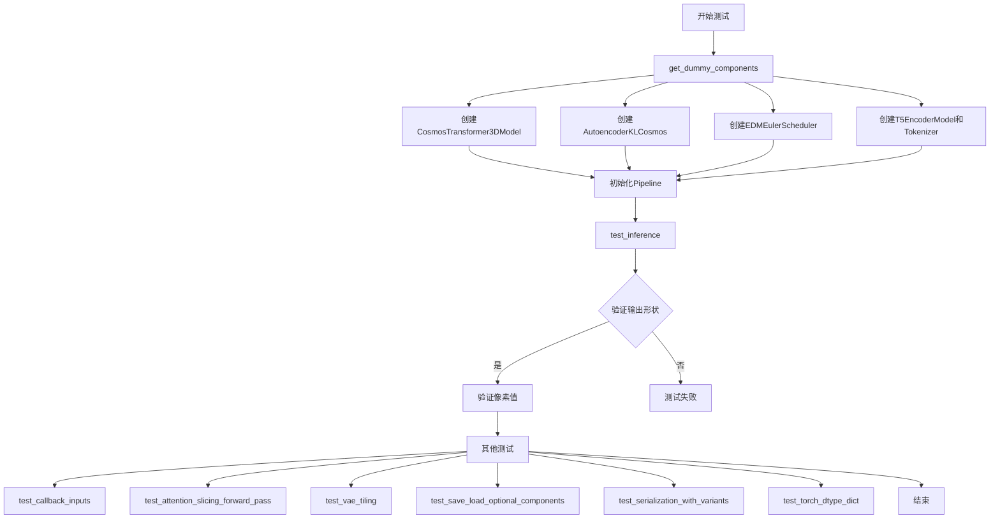
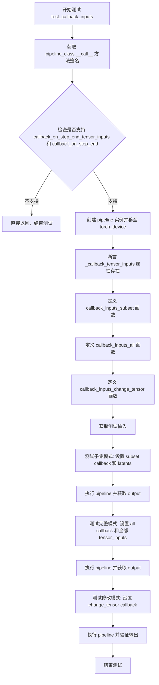
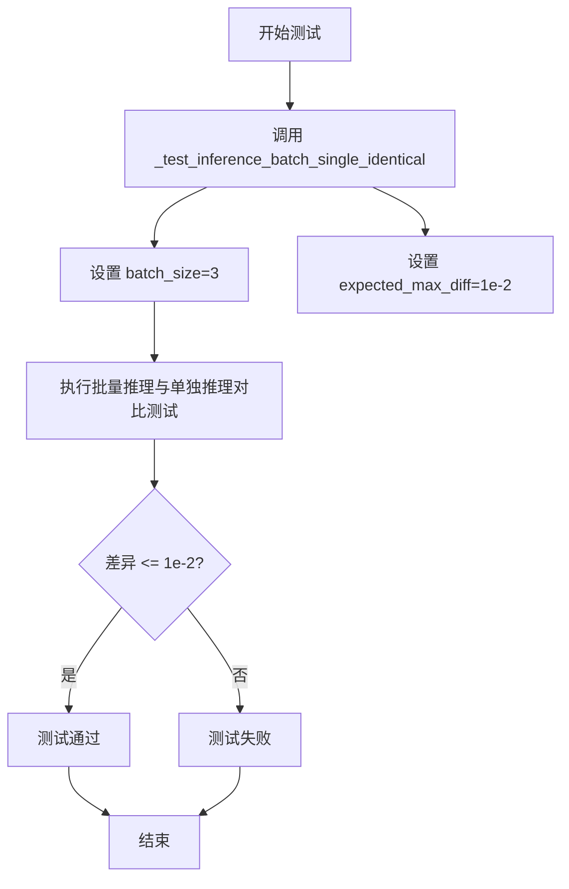
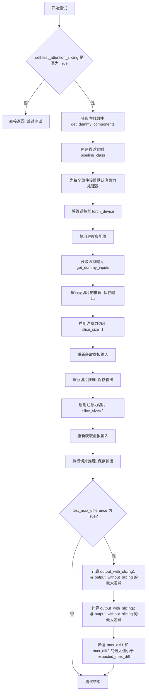
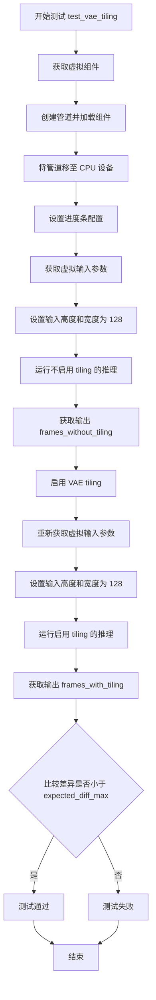
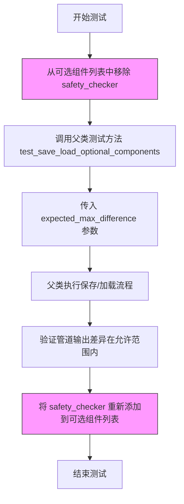
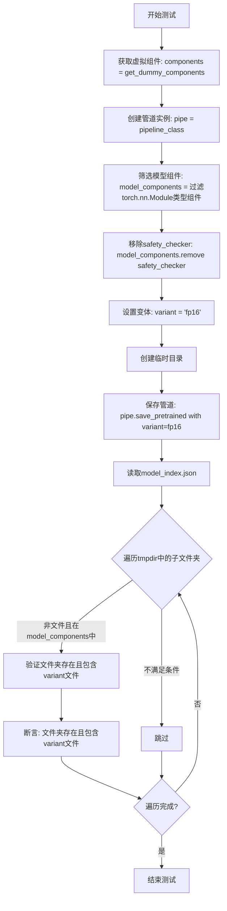
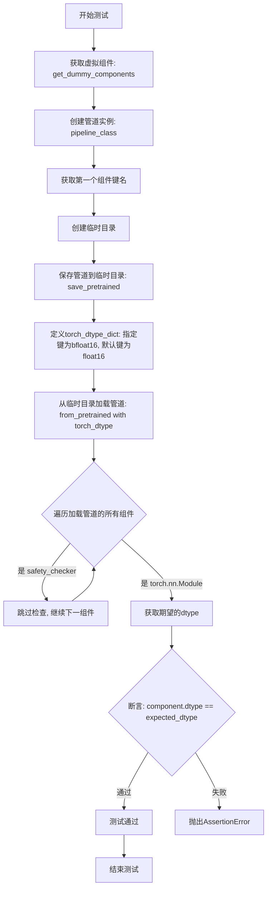
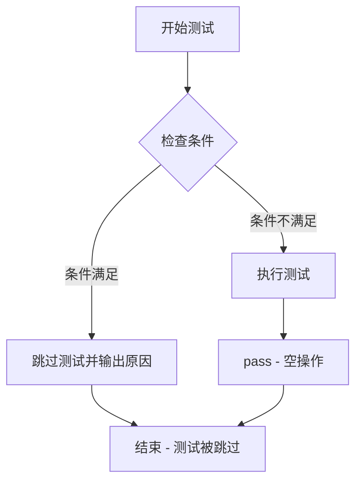

# `diffusers\tests\pipelines\cosmos\test_cosmos.py` 详细设计文档

这是一个用于测试CosmosTextToWorldPipeline（文本到视频生成管道）的单元测试文件，包含多种测试场景如推理测试、注意力切片、VAE平铺、序列化等，以确保管道的正确性和性能。

## 整体流程



## 类结构

```
CosmosTextToWorldPipelineWrapper (测试用包装类)
└── CosmosTextToWorldPipelineFastTests (主测试类)
    ├── PipelineTesterMixin (测试混入类)
    └── unittest.TestCase (Python单元测试基类)
```

## 全局变量及字段


### `enable_full_determinism`
    
启用完全确定性以确保测试可重复性

类型：`function`
    


### `torch_device`
    
指定测试使用的设备（如'cpu'或'cuda'）

类型：`str`
    


### `TEXT_TO_IMAGE_BATCH_PARAMS`
    
文本到图像批处理参数集合

类型：`set`
    


### `TEXT_TO_IMAGE_IMAGE_PARAMS`
    
文本到图像图像参数集合

类型：`set`
    


### `TEXT_TO_IMAGE_PARAMS`
    
文本到图像主参数集合

类型：`set`
    


### `PipelineTesterMixin`
    
提供管道测试通用方法的混入类

类型：`class`
    


### `to_np`
    
将张量转换为numpy数组的辅助函数

类型：`function`
    


### `DummyCosmosSafetyChecker`
    
用于快速测试的虚拟安全检查器

类型：`class`
    


### `CosmosTextToWorldPipelineFastTests.pipeline_class`
    
被测试的管道类（CosmosTextToWorldPipelineWrapper）

类型：`type`
    


### `CosmosTextToWorldPipelineFastTests.params`
    
管道调用参数集合（排除cross_attention_kwargs）

类型：`set`
    


### `CosmosTextToWorldPipelineFastTests.batch_params`
    
批处理参数集合

类型：`set`
    


### `CosmosTextToWorldPipelineFastTests.image_params`
    
图像参数集合

类型：`set`
    


### `CosmosTextToWorldPipelineFastTests.image_latents_params`
    
图像潜在向量参数集合

类型：`set`
    


### `CosmosTextToWorldPipelineFastTests.required_optional_params`
    
必需的可选参数集合

类型：`frozenset`
    


### `CosmosTextToWorldPipelineFastTests.supports_dduf`
    
是否支持DDUF（默认False）

类型：`bool`
    


### `CosmosTextToWorldPipelineFastTests.test_xformers_attention`
    
是否测试xformers注意力（默认False）

类型：`bool`
    


### `CosmosTextToWorldPipelineFastTests.test_layerwise_casting`
    
是否测试逐层类型转换（默认True）

类型：`bool`
    


### `CosmosTextToWorldPipelineFastTests.test_group_offloading`
    
是否测试组卸载（默认True）

类型：`bool`
    
    

## 全局函数及方法


### `CosmosTextToWorldPipelineFastTests.get_dummy_components`

该方法是一个测试辅助函数，用于创建虚拟（dummy）组件对象，以便在不需要加载大型预训练模型的情况下对 `CosmosTextToWorldPipeline` 进行单元测试。它初始化了一个完整的组件字典，包括 transformer、VAE 编码器、调度器、文本编码器、tokenizer 和安全检查器，所有组件均使用随机初始化的参数。

参数：
- 无（仅包含 `self` 参数隐式引用）

返回值：`Dict[str, Any]`，返回包含所有pipeline组件的字典，用于实例化测试用的pipeline对象。

#### 流程图

```mermaid
flowchart TD
    A[开始 get_dummy_components] --> B[设置随机种子 torch.manual_seed(0)]
    B --> C[创建 CosmosTransformer3DModel]
    C --> D[设置随机种子 torch.manual_seed(0)]
    D --> E[创建 AutoencoderKLCosmos]
    E --> F[设置随机种子 torch.manual_seed(0)]
    F --> G[创建 EDMEulerScheduler]
    G --> H[加载 T5EncoderModel 预训练模型]
    H --> I[加载 AutoTokenizer 预训练模型]
    I --> J[创建 DummyCosmosSafetyChecker]
    J --> K[组装 components 字典]
    K --> L[返回 components]
```

#### 带注释源码

```python
def get_dummy_components(self):
    """
    创建虚拟组件用于单元测试
    
    该方法初始化所有必需的pipeline组件，但使用随机初始化的权重
    而非加载预训练模型，以加快测试执行速度并确保测试的确定性
    """
    # 设置随机种子确保测试可重复性
    torch.manual_seed(0)
    
    # 创建 Transformer 模型 - 用于文本到视频的生成
    transformer = CosmosTransformer3DModel(
        in_channels=4,              # 输入通道数
        out_channels=4,             # 输出通道数
        num_attention_heads=2,      # 注意力头数量
        attention_head_dim=16,      # 注意力头维度
        num_layers=2,               # Transformer 层数
        mlp_ratio=2,                # MLP 扩展比率
        text_embed_dim=32,          # 文本嵌入维度
        adaln_lora_dim=4,           # AdaLN LoRA 维度
        max_size=(4, 32, 32),       # 最大尺寸
        patch_size=(1, 2, 2),       # 补丁大小
        rope_scale=(2.0, 1.0, 1.0), # RoPE 缩放因子
        concat_padding_mask=True,   # 是否拼接填充掩码
        extra_pos_embed_type="learnable" # 额外位置嵌入类型
    )

    # 重新设置种子确保 VAE 的确定性初始化
    torch.manual_seed(0)
    
    # 创建 VAE 编码器-解码器模型
    vae = AutoencoderKLCosmos(
        in_channels=3,                          # 输入通道数 (RGB)
        out_channels=3,                         # 输出通道数
        latent_channels=4,                      # 潜在空间通道数
        encoder_block_out_channels=(8, 8, 8, 8), # 编码器块输出通道
        decode_block_out_channels=(8, 8, 8, 8), # 解码器块输出通道
        attention_resolutions=(8,),            # 注意力分辨率
        resolution=64,                           # 分辨率
        num_layers=2,                           # 层数
        patch_size=4,                           # 补丁大小
        patch_type="haar",                      # 补丁类型
        scaling_factor=1.0,                     # 缩放因子
        spatial_compression_ratio=4,            # 空间压缩比
        temporal_compression_ratio=4            # 时间压缩比
    )

    # 重新设置种子确保调度器的确定性初始化
    torch.manual_seed(0)
    
    # 创建 ODE 求解器调度器 (EDM Euler)
    scheduler = EDMEulerScheduler(
        sigma_min=0.002,           # 最小噪声水平
        sigma_max=80,              # 最大噪声水平
        sigma_data=0.5,            # 数据噪声水平
        sigma_schedule="karras",   # 噪声调度策略
        num_train_timesteps=1000,  # 训练时间步数
        prediction_type="epsilon", # 预测类型
        rho=7.0,                   # rho 参数
        final_sigmas_type="sigma_min" # 最终噪声类型
    )
    
    # 加载小型 T5 文本编码器用于测试
    text_encoder = T5EncoderModel.from_pretrained("hf-internal-testing/tiny-random-t5")
    
    # 加载小型 T5 tokenizer 用于测试
    tokenizer = AutoTokenizer.from_pretrained("hf-internal-testing/tiny-random-t5")

    # 组装所有组件到字典中
    components = {
        "transformer": transformer,      # 3D Transformer 模型
        "vae": vae,                      # VAE 编解码器
        "scheduler": scheduler,          # 噪声调度器
        "text_encoder": text_encoder,    # 文本编码器
        "tokenizer": tokenizer,          # 分词器
        # 由于 Cosmos Guardrail 模型过大，无法在快速测试中运行
        "safety_checker": DummyCosmosSafetyChecker(),
    }
    
    return components
```

---

## 详细设计文档

### 1. 一句话概述

`get_dummy_components` 是一个测试辅助方法，用于创建虚拟的 pipeline 组件对象，使测试能够在不加载大型预训练模型的情况下快速执行，同时确保测试结果的可重复性。

### 2. 文件的整体运行流程

该方法属于测试文件 `CosmosTextToWorldPipelineFastTests` 类，该类继承自 `PipelineTesterMixin` 和 `unittest.TestCase`，是 `diffusers` 库中用于验证 `CosmosTextToWorldPipeline` 功能的单元测试类。测试流程通常为：
1. 调用 `get_dummy_components()` 获取虚拟组件
2. 使用这些组件实例化 pipeline
3. 执行各种测试方法（如 `test_inference`、`test_attention_slicing_forward_pass` 等）
4. 验证输出是否符合预期

### 3. 类的详细信息

#### `CosmosTextToWorldPipelineFastTests` 类

| 字段/属性 | 类型 | 描述 |
|-----------|------|------|
| `pipeline_class` | Type | 测试的 pipeline 类（CosmosTextToWorldPipelineWrapper） |
| `params` | frozenset | pipeline 调用参数集合 |
| `batch_params` | set | 批处理参数集合 |
| `image_params` | set | 图像参数集合 |
| `image_latents_params` | set | 图像潜在向量参数集合 |
| `required_optional_params` | frozenset | 必须的可选参数集合 |
| `supports_dduf` | bool | 是否支持 DDUF |
| `test_xformers_attention` | bool | 是否测试 xformers 注意力 |
| `test_layerwise_casting` | bool | 是否测试分层类型转换 |
| `test_group_offloading` | bool | 是否测试组卸载 |

#### 类方法

| 方法名 | 描述 |
|--------|------|
| `get_dummy_components` | 创建虚拟组件字典 |
| `get_dummy_inputs` | 创建虚拟输入参数 |
| `test_inference` | 测试推理功能 |
| `test_callback_inputs` | 测试回调输入 |
| `test_inference_batch_single_identical` | 测试批处理与单张推理一致性 |
| `test_attention_slicing_forward_pass` | 测试注意力切片前向传播 |
| `test_vae_tiling` | 测试 VAE 瓦片化 |
| `test_save_load_optional_components` | 测试可选组件的保存/加载 |
| `test_serialization_with_variants` | 测试序列化变体 |
| `test_torch_dtype_dict` | 测试 torch dtype 字典 |
| `test_encode_prompt_works_in_isolation` | 测试提示编码器隔离工作 |

### 4. 关键组件信息

| 组件名称 | 类型 | 一句话描述 |
|----------|------|------------|
| `CosmosTransformer3DModel` | nn.Module | 用于文本到视频生成的 3D Transformer 主干网络 |
| `AutoencoderKLCosmos` | nn.Module | 变分自编码器，用于压缩和解压视频潜在表示 |
| `EDMEulerScheduler` | SchedulerMixin | 基于 EDM 的 Euler 方法噪声调度器 |
| `T5EncoderModel` | PreTrainedModel | T5 文本编码器，将文本提示转换为嵌入向量 |
| `AutoTokenizer` | PreTrainedTokenizer | T5 分词器，将文本转换为 token ID |
| `DummyCosmosSafetyChecker` | nn.Module | 虚拟安全检查器，用于测试目的 |

### 5. 潜在的技术债务或优化空间

1. **硬编码的随机种子**：多次调用 `torch.manual_seed(0)` 虽然确保了确定性，但这种方式不够优雅，可以考虑在测试框架层面统一管理随机状态。

2. **重复的组件初始化模式**：`get_dummy_components` 和 `get_dummy_inputs` 存在耦合，当组件参数变化时需要同时修改两处。

3. **缺失的文档注释**：测试类中的各个测试方法缺少详细的文档说明，难以理解每个测试的意图和预期行为。

4. **魔法数字**：代码中包含许多硬编码的数值（如 `atol=1e-3`、`expected_max_diff=1e-2` 等），应提取为常量或配置。

5. **测试覆盖不完整**：由于性能原因，许多复杂的组件（如真正的安全检查器）被替换为虚拟实现，导致无法验证这些组件的实际功能。

### 6. 其它项目

#### 设计目标与约束
- **设计目标**：提供快速、可重复的单元测试，确保 pipeline 功能的正确性
- **性能约束**：由于 Cosmos Guardrail 模型过大，测试中必须使用虚拟实现

#### 错误处理与异常设计
- 测试方法中使用了 `@unittest.skip` 装饰器来跳过某些无法在 CI 环境中执行的测试
- 断言失败时使用有意义的错误消息（如 "Attention slicing should not affect the inference results"）

#### 数据流与状态机
- 组件创建遵循确定性流程：设置随机种子 → 创建组件 → 组装字典
- Pipeline 状态通过 `pipe.to(device)` 和 `pipe.set_progress_bar_config()` 进行管理

#### 外部依赖与接口契约
- 依赖 `diffusers` 库中的多个组件类
- 依赖 `transformers` 库中的 T5 模型和分词器
- 通过 `DummyCosmosSafetyChecker` 模拟安全检查器接口


### `CosmosTextToWorldPipelineFastTests.get_dummy_inputs`

该方法用于生成测试用的虚拟输入参数，模拟文本到视频生成管道的调用参数。根据设备类型（MPS 或其他）选择不同的随机数生成器方式，并返回一个包含提示词、负提示词、生成器、推理步数、引导 scale、图像尺寸、帧数、最大序列长度和输出类型的字典。

参数：

- `device`：设备标识字符串，用于指定运行设备（如 "cpu"、"cuda" 或 "mps"）
- `seed`：整型，默认值为 `0`，用于控制随机数生成的种子

返回值：`Dict[str, Any]`，返回包含文本到视频生成所需的所有测试输入参数的字典

#### 流程图

```mermaid
flowchart TD
    A[开始 get_dummy_inputs] --> B{检查 device 是否以 'mps' 开头}
    B -->|是| C[使用 torch.manual_seed(seed) 创建生成器]
    B -->|否| D[使用 torch.Generator(device=device) 创建生成器并设置 manual_seed]
    C --> E[构建输入字典 inputs]
    D --> E
    E --> F[设置 prompt: 'dance monkey']
    E --> G[设置 negative_prompt: 'bad quality']
    E --> H[设置 generator]
    E --> I[设置 num_inference_steps: 2]
    E --> J[设置 guidance_scale: 3.0]
    E --> K[设置 height: 32, width: 32]
    E --> L[设置 num_frames: 9]
    E --> M[设置 max_sequence_length: 16]
    E --> N[设置 output_type: 'pt']
    E --> O[返回 inputs 字典]
```

#### 带注释源码

```python
def get_dummy_inputs(self, device, seed=0):
    """
    生成用于测试的虚拟输入参数。
    
    参数:
        device: 运行设备标识符，用于创建随机数生成器
        seed: 随机种子，用于确保测试结果可复现
    
    返回:
        包含文本到视频生成所需参数的字典
    """
    # 根据设备类型选择随机数生成方式
    # MPS (Metal Performance Shaders) 设备使用 torch.manual_seed
    if str(device).startswith("mps"):
        generator = torch.manual_seed(seed)
    else:
        # 其他设备（如 CPU、CUDA）使用 torch.Generator 并设置种子
        generator = torch.manual_seed(seed)
        generator = torch.Generator(device=device).manual_seed(seed)

    # 构建测试输入参数字典
    inputs = {
        "prompt": "dance monkey",           # 正向提示词
        "negative_prompt": "bad quality",   # 负向提示词，用于引导生成质量
        "generator": generator,             # 随机数生成器，确保可复现性
        "num_inference_steps": 2,           # 推理步数，测试时使用较少步数
        "guidance_scale": 3.0,               # 引导强度，控制生成内容与提示词的相关性
        "height": 32,                        # 生成视频的高度（像素）
        "width": 32,                         # 生成视频的宽度（像素）
        "num_frames": 9,                     # 生成视频的帧数
        "max_sequence_length": 16,           # 文本序列的最大长度
        "output_type": "pt",                 # 输出类型，'pt' 表示 PyTorch 张量
    }

    return inputs
```


### `CosmosTextToWorldPipelineFastTests.test_inference`

该方法是 `CosmosTextToWorldPipelineFastTests` 测试类的核心推理测试方法，用于验证 Cosmos 文本到视频生成管道的基本推理功能是否正确，包括模型加载、推理执行和输出结果验证。

参数：

- `self`：测试类实例本身，无显式参数

返回值：`None`，该方法为 `unittest.TestCase` 的测试方法，通过 `self.assertEqual` 和 `self.assertTrue` 断言验证推理结果的正确性，无显式返回值。

#### 流程图

```mermaid
flowchart TD
    A[开始 test_inference 测试] --> B[设置设备为 CPU]
    B --> C[调用 get_dummy_components 获取虚拟组件]
    C --> D[使用虚拟组件创建 CosmosTextToWorldPipelineWrapper 管道实例]
    D --> E[将管道移动到指定设备 CPU]
    E --> F[设置进度条配置 disable=None]
    F --> G[调用 get_dummy_inputs 获取虚拟输入参数]
    G --> H[执行管道推理: pipe(**inputs)]
    H --> I[获取生成的视频 frames: video[0]]
    I --> J{验证视频形状}
    J -->|通过| K[验证生成视频数值 slice 与期望值匹配]
    J -->|失败| L[测试失败: 抛出 AssertionError]
    K --> M[测试通过]
    
    subgraph get_dummy_components
    C1[创建 CosmosTransformer3DModel 虚拟 transformer]
    C2[创建 AutoencoderKLCosmos 虚拟 VAE]
    C3[创建 EDMEulerScheduler 虚拟调度器]
    C4[创建 T5EncoderModel 虚拟文本编码器]
    C5[创建 AutoTokenizer 虚拟分词器]
    C6[创建 DummyCosmosSafetyChecker 虚拟安全检查器]
    C7[组装 components 字典]
    end
    
    subgraph get_dummy_inputs
    G1[创建随机数生成器]
    G2[组装 prompt: dance monkey]
    G3[设置 negative_prompt: bad quality]
    G4[设置 num_inference_steps: 2]
    G5[设置 guidance_scale: 3.0]
    G6[设置 height: 32, width: 32, num_frames: 9]
    G7[返回 inputs 字典]
    end
```

#### 带注释源码

```python
def test_inference(self):
    """
    测试 CosmosTextToWorldPipeline 的基本推理功能。
    验证管道能够：
    1. 正确加载虚拟组件（transformer, VAE, scheduler, text_encoder, tokenizer, safety_checker）
    2. 根据文本提示生成对应尺寸的视频
    3. 输出的数值在预期范围内
    """
    # 步骤1: 确定测试设备为 CPU（避免需要 GPU）
    device = "cpu"

    # 步骤2: 获取预定义的虚拟组件，用于快速测试
    # 这些虚拟组件是小型的模拟模型，具有真实的架构结构但参数很少
    components = self.get_dummy_components()
    
    # 步骤3: 使用虚拟组件创建管道实例
    # CosmosTextToWorldPipelineWrapper 继承自 CosmosTextToWorldPipeline
    # 并自动使用 DummyCosmosSafetyChecker 替代真实的 Cosmos Guardrail
    pipe = self.pipeline_class(**components)
    
    # 步骤4: 将管道移动到指定设备（CPU）
    pipe.to(device)
    
    # 步骤5: 配置进度条（disable=None 表示启用进度条显示）
    pipe.set_progress_bar_config(disable=None)

    # 步骤6: 获取测试输入参数
    # 包含: prompt, negative_prompt, generator, num_inference_steps, 
    #       guidance_scale, height, width, num_frames, max_sequence_length, output_type
    inputs = self.get_dummy_inputs(device)
    
    # 步骤7: 执行管道推理，生成视频帧
    # 返回 PipelineOutput 对象，包含 frames 属性
    video = pipe(**inputs).frames
    
    # 步骤8: 获取第一个（也是唯一的）生成的视频
    # 形状应为 (num_frames, channels, height, width) = (9, 3, 32, 32)
    generated_video = video[0]
    
    # 步骤9: 断言验证生成视频的形状是否符合预期
    # 期望形状: (9 帧, 3 通道, 32x32 分辨率)
    self.assertEqual(generated_video.shape, (9, 3, 32, 32))

    # 步骤10: 定义期望的数值切片（用于验证输出数值正确性）
    # 这些值是在确定性条件下运行管道得到的预期输出
    # fmt: off
    expected_slice = torch.tensor([0.0, 0.9686, 0.8549, 0.8078, 0.0, 0.8431, 1.0, 0.4863, 0.7098, 0.1098, 0.8157, 0.4235, 0.6353, 0.2549, 0.5137, 0.5333])
    # fmt: on

    # 步骤11: 从生成的视频中提取特定位置的数值进行验证
    # 取前8个和后8个像素值，组成16个值的切片
    generated_slice = generated_video.flatten()
    generated_slice = torch.cat([generated_slice[:8], generated_slice[-8:]])
    
    # 步骤12: 断言验证生成的数值与期望值在允许误差范围内匹配
    # 使用 torch.allclose 进行近似相等比较，允许误差为 1e-3
    self.assertTrue(torch.allclose(generated_slice, expected_slice, atol=1e-3))
```


### `CosmosTextToWorldPipelineFastTests.test_callback_inputs`

该测试方法用于验证 CosmosTextToWorldPipeline 的回调（callback）功能是否正确实现，包括检查回调张量输入（callback_on_step_end_tensor_inputs）参数的支持情况，以及回调函数是否能正确接收和处理张量数据。

参数：

- `self`：`CosmosTextToWorldPipelineFastTests`，测试类实例本身

返回值：`None`，该方法为测试方法，无返回值（执行断言验证）

#### 流程图



#### 带注释源码

```python
def test_callback_inputs(self):
    """
    测试 CosmosTextToWorldPipeline 的回调输入功能。
    
    该测试验证以下功能：
    1. pipeline 的 __call__ 方法支持 callback_on_step_end 和 callback_on_step_end_tensor_inputs 参数
    2. pipeline 具有 _callback_tensor_inputs 属性，定义了回调函数可使用的张量列表
    3. 回调函数可以正确接收和验证张量输入
    4. 回调函数可以修改张量值并影响最终输出
    """
    # 获取 pipeline 的 __call__ 方法的签名
    sig = inspect.signature(self.pipeline_class.__call__)
    
    # 检查方法签名中是否包含回调相关的参数
    has_callback_tensor_inputs = "callback_on_step_end_tensor_inputs" in sig.parameters
    has_callback_step_end = "callback_on_step_end" in sig.parameters

    # 如果 pipeline 不支持这些参数，则跳过测试
    if not (has_callback_tensor_inputs and has_callback_step_end):
        return

    # 创建虚拟组件并实例化 pipeline
    components = self.get_dummy_components()
    pipe = self.pipeline_class(**components)
    pipe = pipe.to(torch_device)
    pipe.set_progress_bar_config(disable=None)
    
    # 验证 pipeline 具有 _callback_tensor_inputs 属性
    # 该属性定义了回调函数可以使用的张量变量列表
    self.assertTrue(
        hasattr(pipe, "_callback_tensor_inputs"),
        f" {self.pipeline_class} should have `_callback_tensor_inputs` that defines a list of tensor variables its callback function can use as inputs",
    )

    # 定义回调函数：验证只传递允许的张量输入子集
    def callback_inputs_subset(pipe, i, t, callback_kwargs):
        # 遍历回调参数中的所有张量
        for tensor_name, tensor_value in callback_kwargs.items():
            # 检查只传递了允许的张量输入
            assert tensor_name in pipe._callback_tensor_inputs

        return callback_kwargs

    # 定义回调函数：验证传递了所有允许的张量输入
    def callback_inputs_all(pipe, i, t, callback_kwargs):
        # 检查所有允许的张量输入都被传递
        for tensor_name in pipe._callback_tensor_inputs:
            assert tensor_name in callback_kwargs

        # 再次验证回调参数中只包含允许的张量
        for tensor_name, tensor_value in callback_kwargs.items():
            assert tensor_name in pipe._callback_tensor_inputs

        return callback_kwargs

    # 获取测试输入
    inputs = self.get_dummy_inputs(torch_device)

    # 测试模式1：传递回调函数的子集
    inputs["callback_on_step_end"] = callback_inputs_subset
    inputs["callback_on_step_end_tensor_inputs"] = ["latents"]
    output = pipe(**inputs)[0]

    # 测试模式2：传递所有允许的张量输入
    inputs["callback_on_step_end"] = callback_inputs_all
    inputs["callback_on_step_end_tensor_inputs"] = pipe._callback_tensor_inputs
    output = pipe(**inputs)[0]

    # 定义回调函数：在最后一步修改 latents 张量
    def callback_inputs_change_tensor(pipe, i, t, callback_kwargs):
        # 判断是否为最后一步
        is_last = i == (pipe.num_timesteps - 1)
        if is_last:
            # 将 latents 修改为零张量
            callback_kwargs["latents"] = torch.zeros_like(callback_kwargs["latents"])
        return callback_kwargs

    # 测试模式3：通过回调修改张量
    inputs["callback_on_step_end"] = callback_inputs_change_tensor
    inputs["callback_on_step_end_tensor_inputs"] = pipe._callback_tensor_inputs
    output = pipe(**inputs)[0]
    
    # 验证修改后的输出：总和应小于阈值（因为被清零）
    assert output.abs().sum() < 1e10
```


### `CosmosTextToWorldPipelineFastTests.test_inference_batch_single_identical`

这是一个单元测试方法，用于验证管道在批量推理模式下，单个样本的输出与单独推理时的输出是否保持一致（bit-identical），以确保批处理不会引入不确定性问题。

参数：
- `self`：隐式参数，测试类的实例

返回值：无（`None`），该方法通过 `unittest.TestCase` 的断言来验证结果

#### 流程图



#### 带注释源码

```python
def test_inference_batch_single_identical(self):
    """
    测试批量推理模式下单个样本的输出是否与单独推理时的输出一致。
    
    该测试方法继承自 PipelineTesterMixin，通过对比批量推理中单个样本的输出
    与单独调用管道时的输出，验证推理结果的确定性和一致性。
    
    参数:
        self: CosmosTextToWorldPipelineFastTests 实例
        
    返回:
        None: 通过 unittest 断言验证，无显式返回值
    """
    # 调用父类 mixin 提供的测试方法
    # batch_size=3: 测试3个样本的批量推理
    # expected_max_diff=1e-2: 允许的最大差异阈值为0.01
    self._test_inference_batch_single_identical(batch_size=3, expected_max_diff=1e-2)
```


### `CosmosTextToWorldPipelineFastTests.test_attention_slicing_forward_pass`

该方法是一个单元测试，用于验证 CosmosTextToWorldPipeline 在启用注意力切片（Attention Slicing）功能时不会影响推理结果的正确性。测试会比较未启用切片、启用 slice_size=1 和 slice_size=2 三种情况下的输出差异，确保差异在预期范围内。

参数：

- `self`：测试类实例本身，无需显式传递
- `test_max_difference`：`bool`，默认值为 `True`，控制是否测试最大差异
- `test_mean_pixel_difference`：`bool`，默认值为 `True`，控制是否测试平均像素差异（当前未使用）
- `expected_max_diff`：`float`，默认值为 `1e-3`，预期的最大允许差异阈值

返回值：`None`，该方法为单元测试，通过 `self.assertLess` 断言验证结果，无显式返回值

#### 流程图



#### 带注释源码

```python
def test_attention_slicing_forward_pass(
    self, test_max_difference=True, test_mean_pixel_difference=True, expected_max_diff=1e-3
):
    """
    测试注意力切片功能是否会改变推理结果
    
    参数:
        test_max_difference: bool, 是否测试最大差异
        test_mean_pixel_difference: bool, 是否测试平均像素差异(当前未使用)
        expected_max_diff: float, 允许的最大差异阈值
    """
    # 检查测试类是否启用注意力切片测试
    if not self.test_attention_slicing:
        return

    # 获取虚拟组件(模型、VAE、调度器、文本编码器等)
    components = self.get_dummy_components()
    # 使用虚拟组件创建管道实例
    pipe = self.pipeline_class(**components)
    # 为每个组件设置默认的注意力处理器
    for component in pipe.components.values():
        if hasattr(component, "set_default_attn_processor"):
            component.set_default_attn_processor()
    # 将管道移至测试设备
    pipe.to(torch_device)
    # 配置进度条(禁用)
    pipe.set_progress_bar_config(disable=None)

    # 设置生成器设备为 CPU
    generator_device = "cpu"
    # 获取虚拟输入参数
    inputs = self.get_dummy_inputs(generator_device)
    # 执行无注意力切片的推理,获取输出
    output_without_slicing = pipe(**inputs)[0]

    # 启用注意力切片,slice_size=1
    pipe.enable_attention_slicing(slice_size=1)
    # 重新获取虚拟输入
    inputs = self.get_dummy_inputs(generator_device)
    # 执行启用切片(slice_size=1)的推理
    output_with_slicing1 = pipe(**inputs)[0]

    # 启用注意力切片,slice_size=2
    pipe.enable_attention_slicing(slice_size=2)
    # 重新获取虚拟输入
    inputs = self.get_dummy_inputs(generator_device)
    # 执行启用切片(slice_size=2)的推理
    output_with_slicing2 = pipe(**inputs)[0]

    # 如果需要测试最大差异
    if test_max_difference:
        # 计算 slice_size=1 时输出与无切片输出的最大差异
        max_diff1 = np.abs(to_np(output_with_slicing1) - to_np(output_without_slicing)).max()
        # 计算 slice_size=2 时输出与无切片输出的最大差异
        max_diff2 = np.abs(to_np(output_with_slicing2) - to_np(output_without_slicing)).max()
        # 断言:注意力切片不应该影响推理结果,最大差异应小于阈值
        self.assertLess(
            max(max_diff1, max_diff2),
            expected_max_diff,
            "Attention slicing should not affect the inference results",
        )
```


### `CosmosTextToWorldPipelineFastTests.test_vae_tiling`

该测试方法用于验证 VAE（变分自编码器）分块（tiling）功能是否正常工作。通过对比启用分块前后的推理输出，确保分块操作不会对最终的生成结果产生显著影响，从而保证视频生成的质量一致性。

参数：

- `expected_diff_max`：`float`，可选，默认值为 `0.2`。表示启用 VAE tiling 后与不启用时的输出最大允许差异阈值，如果实际差异超过此值则测试失败。

返回值：`None`，无返回值。该方法为单元测试方法，通过断言来验证功能正确性，不返回任何值。

#### 流程图



#### 带注释源码

```python
def test_vae_tiling(self, expected_diff_max: float = 0.2):
    """
    测试 VAE tiling 功能，确保启用 tiling 后生成的视频质量不会受到显著影响。
    
    参数:
        expected_diff_max: float, 允许的最大差异阈值，默认为 0.2
    """
    # 设置生成器设备为 CPU
    generator_device = "cpu"
    
    # 获取虚拟组件（transformer, vae, scheduler, text_encoder, tokenizer, safety_checker）
    components = self.get_dummy_components()

    # 使用虚拟组件创建管道实例
    pipe = self.pipeline_class(**components)
    
    # 将管道移至 CPU 设备
    pipe.to("cpu")
    
    # 配置进度条（disable=None 表示不禁用进度条）
    pipe.set_progress_bar_config(disable=None)

    # ===== 第一次推理：不启用 VAE tiling =====
    # 获取虚拟输入参数（包含 prompt, negative_prompt, generator 等）
    inputs = self.get_dummy_inputs(generator_device)
    
    # 设置生成视频的高度和宽度为 128（更大的分辨率以测试 tiling）
    inputs["height"] = inputs["width"] = 128
    
    # 执行推理（不启用 tiling），返回 Video 对象
    output_without_tiling = pipe(**inputs)[0]

    # ===== 第二次推理：启用 VAE tiling =====
    # 启用 VAE tiling 并设置分块参数
    # tile_sample_min_height/width: 分块的最小高度/宽度
    # tile_sample_stride_height/width: 分块的步长（相邻分块之间的重叠区域）
    pipe.vae.enable_tiling(
        tile_sample_min_height=96,
        tile_sample_min_width=96,
        tile_sample_stride_height=64,
        tile_sample_stride_width=64,
    )
    
    # 重新获取虚拟输入参数（重置 generator 状态）
    inputs = self.get_dummy_inputs(generator_device)
    
    # 再次设置高度和宽度为 128
    inputs["height"] = inputs["width"] = 128
    
    # 执行推理（启用 tiling），返回 Video 对象
    output_with_tiling = pipe(**inputs)[0]

    # ===== 验证结果 =====
    # 将 PyTorch 张量转换为 NumPy 数组
    # 比较两次输出的最大差异，确保 tiling 不会显著影响生成质量
    self.assertLess(
        (to_np(output_without_tiling) - to_np(output_with_tiling)).max(),
        expected_diff_max,
        "VAE tiling should not affect the inference results"
    )
```


### `CosmosTextToWorldPipelineFastTests.test_save_load_optional_components`

该测试方法用于验证管道在保存和加载可选组件时的正确性，特别针对 safety_checker 组件进行序列化与反序列化测试，确保管道在包含或移除可选组件时都能正确保存和恢复状态。

参数：

- `self`：`CosmosTextToWorldPipelineFastTests`，测试类的实例，隐式参数
- `expected_max_difference`：`float`，可选参数，默认值为 `1e-4`，指定保存/加载前后输出的最大允许差异阈值

返回值：`None`，该方法为单元测试方法，执行验证操作但不返回具体结果

#### 流程图



#### 带注释源码

```python
def test_save_load_optional_components(self, expected_max_difference=1e-4):
    """
    测试管道保存和加载可选组件的功能。
    
    该测试方法验证 CosmosTextToWorldPipeline 管道在包含可选组件时的
    序列化和反序列化能力。特别针对 safety_checker 组件进行测试，
    确保在移除该组件后管道仍能正确保存和加载。
    
    参数:
        expected_max_difference: float, 默认 1e-4
            保存/加载前后输出的最大允许差异，用于验证加载后的管道
            仍然能够产生与原始管道相近的结果
    
    返回:
        None: 此方法为单元测试方法，执行验证操作但不返回结果
    """
    # 从管道的可选组件列表中临时移除 safety_checker
    # 这是为了测试在不存在 safety_checker 时的保存/加载行为
    self.pipeline_class._optional_components.remove("safety_checker")
    
    # 调用父类 (PipelineTesterMixin) 的测试方法
    # 父类方法会执行完整的保存/加载流程并验证结果
    # 传入 expected_max_difference 参数控制精度要求
    super().test_save_load_optional_components(expected_max_difference=expected_max_difference)
    
    # 测试完成后，将 safety_checker 重新添加到可选组件列表
    # 确保后续测试不受影响，保持测试类的完整性
    self.pipeline_class._optional_components.append("safety_checker")
```


### `CosmosTextToWorldPipelineFastTests.test_serialization_with_variants`

该测试方法用于验证 `CosmosTextToWorldPipeline` 管道在序列化时能够正确保存变体（variant）文件（如 `fp16`），并检查保存的模型组件目录结构和变体文件是否符合预期格式。

参数：

- 无显式参数（仅 `self` 隐式参数）

返回值：`None`，该方法为 `unittest.TestCase` 的测试方法，通过断言验证序列化结果，不返回任何值。

#### 流程图



#### 带注释源码

```python
def test_serialization_with_variants(self):
    """
    测试管道序列化时变体文件的保存是否正确
    """
    # 获取虚拟（dummy）组件，用于测试
    components = self.get_dummy_components()
    
    # 使用虚拟组件创建管道实例
    pipe = self.pipeline_class(**components)
    
    # 筛选出所有 torch.nn.Module 类型的组件（模型组件）
    model_components = [
        component_name
        for component_name, component in pipe.components.items()
        if isinstance(component, torch.nn.Module)
    ]
    
    # 从模型组件列表中移除 safety_checker，因为它不是模型文件
    model_components.remove("safety_checker")
    
    # 设置要测试的变体类型为 fp16（半精度浮点）
    variant = "fp16"

    # 创建临时目录用于保存管道
    with tempfile.TemporaryDirectory() as tmpdir:
        # 将管道保存到临时目录，使用指定的变体和非安全序列化
        pipe.save_pretrained(tmpdir, variant=variant, safe_serialization=False)

        # 读取保存的 model_index.json 配置文件
        with open(f"{tmpdir}/model_index.json", "r") as f:
            config = json.load(f)

        # 遍历临时目录中的所有子文件夹
        for subfolder in os.listdir(tmpdir):
            # 检查是否为子文件夹、是否在模型组件列表中
            if not os.path.isfile(subfolder) and subfolder in model_components:
                # 构建子文件夹的完整路径
                folder_path = os.path.join(tmpdir, subfolder)
                # 验证文件夹存在且子文件夹名称在配置中
                is_folder = os.path.isdir(folder_path) and subfolder in config
                # 断言：文件夹存在且包含指定变体的文件
                assert is_folder and any(p.split(".")[1].startswith(variant) for p in os.listdir(folder_path))
```


### `CosmosTextToWorldPipelineFastTests.test_torch_dtype_dict`

该测试方法验证管道能够使用指定的 `torch_dtype` 字典保存和加载，并确保每个组件按预期加载了正确的 dtype。

参数：

- `self`：`CosmosTextToWorldPipelineFastTests`，测试类实例，表示当前的测试对象

返回值：`None`，该测试方法不返回任何值，通过断言验证组件的 dtype 是否符合预期

#### 流程图



#### 带注释源码

```python
def test_torch_dtype_dict(self):
    """
    测试管道的 torch_dtype_dict 功能，验证保存和加载时
    各个组件能否正确设置对应的 dtype
    """
    # 步骤1: 获取预定义的虚拟组件（用于测试）
    components = self.get_dummy_components()
    if not components:
        self.skipTest("No dummy components defined.")

    # 步骤2: 使用虚拟组件创建管道实例
    pipe = self.pipeline_class(**components)

    # 步骤3: 获取第一个组件的键名，用于后续测试
    specified_key = next(iter(components.keys()))

    # 步骤4: 创建临时目录用于保存和加载管道
    with tempfile.TemporaryDirectory(ignore_cleanup_errors=True) as tmpdirname:
        # 保存管道到临时目录（不启用安全序列化）
        pipe.save_pretrained(tmpdirname, safe_serialization=False)
        
        # 定义 torch_dtype 字典：
        # - 第一个组件键使用 bfloat16
        # - 其他组件默认使用 float16
        torch_dtype_dict = {specified_key: torch.bfloat16, "default": torch.float16}
        
        # 从临时目录加载管道，传入自定义的 torch_dtype 字典
        loaded_pipe = self.pipeline_class.from_pretrained(
            tmpdirname, 
            safety_checker=DummyCosmosSafetyChecker(), 
            torch_dtype=torch_dtype_dict
        )

    # 步骤5: 验证加载后的管道组件 dtype 是否符合预期
    for name, component in loaded_pipe.components.items():
        # safety_checker 是虚拟对象，跳过 dtype 检查
        if name == "safety_checker":
            continue
        
        # 仅检查 torch.nn.Module 类型且具有 dtype 属性的组件
        if isinstance(component, torch.nn.Module) and hasattr(component, "dtype"):
            # 获取期望的 dtype：
            # 优先使用组件名对应的 dtype，否则使用 "default" 键的 dtype，再否则使用 float32
            expected_dtype = torch_dtype_dict.get(
                name, 
                torch_dtype_dict.get("default", torch.float32)
            )
            
            # 断言组件的实际 dtype 与期望 dtype 一致
            self.assertEqual(
                component.dtype,
                expected_dtype,
                f"Component '{name}' has dtype {component.dtype} but expected {expected_dtype}",
            )
```


### `CosmosTextToWorldPipelineFastTests.test_encode_prompt_works_in_isolation`

该测试方法用于验证 `encode_prompt` 方法能否独立于完整管道运行，但目前已被跳过。原因是管道在没有安全检查器的情况下不应运行，而测试创建管道时未传入安全检查器，导致管道默认使用实际的 Cosmos Guardrail（太大太慢，无法在 CI 上运行）。

参数：

- `self`：`CosmosTextToWorldPipelineFastTests`，测试类实例本身

返回值：`None`，该测试方法不返回任何值（被跳过的空实现）

#### 流程图



#### 带注释源码

```python
@unittest.skip(
    "The pipeline should not be runnable without a safety checker. The test creates a pipeline without passing in "
    "a safety checker, which makes the pipeline default to the actual Cosmos Guardrail. The Cosmos Guardrail is "
    "too large and slow to run on CI."
)
def test_encode_prompt_works_in_isolation(self):
    """
    测试 encode_prompt 方法能否独立工作的测试方法。
    
    该测试被 @unittest.skip 装饰器跳过，原因如下：
    1. 管道在没有 safety_checker 的情况下不应该可运行
    2. 测试创建管道时不传入 safety_checker，会导致使用默认的 Cosmos Guardrail
    3. Cosmos Guardrail 模型太大太慢，无法在 CI 环境中运行
    
    参数:
        self: CosmosTextToWorldPipelineFastTests 实例
    
    返回值:
        None: 空实现，测试被跳过
    """
    pass  # 空操作，测试被跳过
```

## 关键组件


### CosmosTextToWorldPipelineWrapper

包装类，通过重写 `from_pretrained` 静态方法将虚拟安全检查器（DummyCosmosSafetyChecker）注入到管道初始化流程中，以支持快速测试而无需加载大型的 Cosmos Guardrail 模型。

### CosmosTransformer3DModel

3D 变换器模型组件，负责处理文本到世界的生成任务中的潜在空间变换，包含注意力机制、MLP 层、位置编码等核心架构。

### AutoencoderKLCosmos

变分自编码器（VAE）组件，用于将图像编码到潜在空间并从潜在空间解码，支持空间和时间维度的压缩比设置。

### EDMEulerScheduler

EDM（Elucidating the Design Space of Diffusion Models）欧拉调度器，负责在推理过程中计算噪声时间步，决定每一步的噪声添加和去除策略。

### T5EncoderModel + AutoTokenizer

文本编码组件，T5 模型将输入的 prompt 编码为文本嵌入向量，供变换器模型在生成过程中使用。

### DummyCosmosSafetyChecker

虚拟安全检查器，用于替代真实的 Cosmos Guardrail，在快速测试中模拟安全检查功能，避免加载过大的模型。

### get_dummy_components 方法

创建测试所需的全部虚拟组件集合，包括 transformer、vae、scheduler、text_encoder、tokenizer 和 safety_checker，并设置特定的架构参数（如 2 层注意力头、4 通道输入输出等）。

### get_dummy_inputs 方法

构建测试用的输入参数字典，包含 prompt、negative_prompt、生成器、推理步数、引导 scale、输出尺寸（height/width/num_frames）等配置。

### test_inference

核心推理测试，验证管道能够生成正确形状的视频帧（9 帧、3 通道、32x32 分辨率），并检查输出数值与预期 slice 的接近程度。

### test_callback_inputs

测试回调机制的正确性，验证 `callback_on_step_end` 和 `callback_on_step_end_tensor_inputs` 参数能够正确传递张量给用户自定义的回调函数，并支持在回调中修改 latents。

### test_attention_slicing_forward_pass

测试注意力切片功能，通过比较启用/不启用切片时的输出差异，确保切片优化不会影响生成结果的质量。

### test_vae_tiling

测试 VAE 平铺功能，验证在启用平铺（tile_sample）后处理高分辨率图像（128x128）时，输出结果与未启用平铺时的差异在可接受范围内。

### test_serialization_with_variants

测试管道的序列化能力，验证以特定 variant（如 fp16）保存时，各模型组件的权重文件是否正确保存为对应格式。

### test_torch_dtype_dict

测试组件的 dtype 字典配置，验证通过 `torch_dtype` 参数可以正确地为不同组件指定不同的数据类型（如 bfloat16、float16）。


## 问题及建议


### 已知问题

- **方法签名不符合 unittest 规范**：`test_attention_slicing_forward_pass` 方法带有自定义默认参数（test_max_difference、test_mean_pixel_difference、expected_max_diff），unittest 通常要求方法不接受额外参数，可能导致测试框架行为异常
- **未使用的导入**：`inspect`、`tempfile` 在某些测试中未充分使用，`unittest` 未被显式使用（虽然类继承自它）
- **硬编码设备字符串**：多处硬编码 "cpu"、"mps"、"generator_device"，缺乏对 GPU 的动态检测和适配
- **Magic Number 缺乏解释**：如 `expected_max_diff=1e-2`、`expected_diff_max=0.2`、`atol=1e-3` 等数值缺乏注释说明其来源或依据
- **测试结果验证不完整**：test_callback_inputs 中对 output 变量进行了赋值但未对其内容进行断言验证；test_inference_batch_single_identical 调用后同样未验证结果
- **潜在的内存泄漏风险**：多次创建 pipeline 和组件对象（通过 get_dummy_components()），但未显式释放大型模型（transformer、vae、text_encoder）占用的 GPU/CPU 内存
- **临时文件操作未清理**：test_serialization_with_variants 和 test_torch_dtype_dict 使用 tempfile 但未验证清理是否完全（虽然使用了 ignore_cleanup_errors=True）
- **test_save_load_optional_components 副作用**：手动修改 `self.pipeline_class._optional_components` 列表后追加元素，如果测试失败，可能影响后续测试的执行状态
- **模型重复加载**：多个测试方法各自调用 get_dummy_components() 创建新模型实例，未考虑测试间的模型复用，导致测试执行时间增加
- **test_serialization_with_variants 断言逻辑脆弱**：第194-197行使用复杂的 os.listdir 和字符串解析来验证文件，容易因文件格式变化而失败，且错误信息不直观

### 优化建议

- 移除 test_attention_slicing_forward_pass 的自定义默认参数，或将其改为类属性配置
- 将设备字符串提取为类级别常量或从环境变量/配置文件读取
- 为关键数值（阈值、精度）添加注释说明其业务含义或测试依据
- 确保所有测试方法对其输出结果进行明确的断言验证
- 使用 pytest fixtures 或 setUp/tearDown 方法管理模型生命周期，实现跨测试的模型复用
- 将 _optional_components 的修改操作改为在 setUp/tearDown 中进行，确保测试隔离
- 简化 test_serialization_with_variants 的文件验证逻辑，使用更健壮的配置文件读取方式

## 其它


### 设计目标与约束

本测试文件旨在验证CosmosTextToWorldPipeline管道在各种场景下的功能正确性，包括基础推理、批次处理、注意力切片、VAE平铺、模型保存加载以及序列化等方面。测试设计遵循快速执行原则，使用小型虚拟模型（dummy components）进行验证，避免加载大型预训练模型。测试覆盖了管道的主要公开接口和可选功能，同时确保测试能够在CPU设备上快速运行。

### 错误处理与异常设计

测试中使用了`unittest.skip`装饰器跳过不适合快速测试的场景（如需要Cosmos Guardrail的测试）。对于可能的设备兼容性测试（如MPS设备），代码进行了特殊处理以确保随机数生成器的一致性。测试断言使用具体的阈值（如`atol=1e-3`、`expected_max_diff=1e-2`）来检测功能正确性，当结果超出预期范围时会抛出明确的AssertionError。

### 数据流与状态机

测试数据流遵循以下路径：1) 通过`get_dummy_components()`创建虚拟组件（transformer、vae、scheduler、text_encoder、tokenizer、safety_checker）；2) 通过`get_dummy_inputs()`构建符合管道接口的输入参数字典；3) 将组件实例化为管道对象并移动到目标设备；4) 调用管道的`__call__`方法执行推理；5) 验证输出的frames形状和数值正确性。状态转换主要体现在管道的不同配置状态（如启用/禁用attention slicing、VAE tiling）下的行为验证。

### 外部依赖与接口契约

管道依赖于以下核心外部组件：1) `transformers`库的`AutoTokenizer`和`T5EncoderModel`；2) `diffusers`库的`AutoencoderKLCosmos`、`CosmosTextToWorldPipeline`、`CosmosTransformer3DModel`、`EDMEulerScheduler`；3) `numpy`和`torch`用于数值计算。测试使用HF内部的tiny随机模型（`hf-internal-testing/tiny-random-t5`）作为文本编码器，避免加载大型模型。管道参数遵循`TEXT_TO_IMAGE_PARAMS`、`TEXT_TO_IMAGE_BATCH_PARAMS`、`TEXT_TO_IMAGE_IMAGE_PARAMS`定义的契约。

### 性能考虑

测试设计考虑了性能验证场景：1) `test_attention_slicing_forward_pass`验证注意力切片优化不改变输出结果；2) `test_vae_tiling`验证VAE平铺优化的数值一致性；3) 使用小尺寸输出（32x32，9帧）来加速测试执行；4) 限制推理步数为2步（`num_inference_steps=2`）以减少计算量。

### 安全性考虑

代码包含安全检查器相关的测试设计：`CosmosTextToWorldPipelineWrapper`通过`from_pretrained`静态方法注入`DummyCosmosSafetyChecker`替代真实的Cosmos Guardrail（因真实模型过大无法在CI运行）。测试验证了安全检查器作为可选组件的序列化能力（`test_save_load_optional_components`），确保`safety_checker`可以从模型配置中移除或添加。

### 测试覆盖范围

测试覆盖了以下关键场景：1) 基础推理功能（`test_inference`）；2) 回调函数输入验证（`test_callback_inputs`）；3) 批次与单样本一致性（`test_inference_batch_single_identical`）；4) 注意力切片优化（`test_attention_slicing_forward_pass`）；5) VAE平铺优化（`test_vae_tiling`）；6) 可选组件保存加载（`test_save_load_optional_components`）；7) 变体序列化（`test_serialization_with_variants`）；8) torch_dtype字典支持（`test_torch_dtype_dict`）。

### 配置管理与随机性控制

通过`enable_full_determinism()`启用完全确定性以确保测试可复现性。使用`torch.manual_seed(0)`和`generator.manual_seed(seed)`控制随机数生成。设备配置支持CPU和MPS设备（通过`str(device).startswith("mps")`检测MPS特殊处理）。临时目录使用`tempfile.TemporaryDirectory`管理，确保测试清理。

### 版本兼容性与依赖管理

代码依赖特定版本的`diffusers`、`transformers`、`torch`和`numpy`。测试类继承自`PipelineTesterMixin`和`unittest.TestCase`，遵循diffusers测试框架的约定。参数定义使用集合运算（`TEXT_TO_IMAGE_PARAMS - {"cross_attention_kwargs"}`）适应不同管道的参数差异。

    