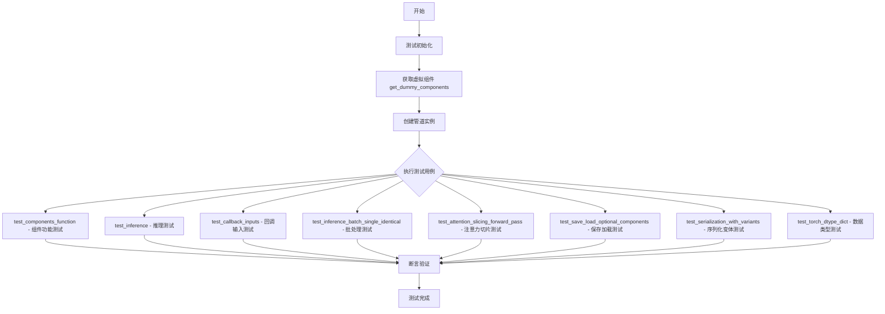
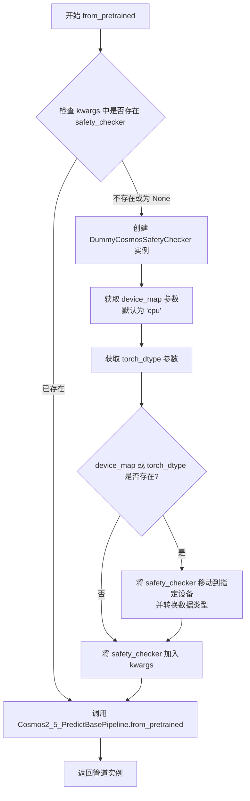
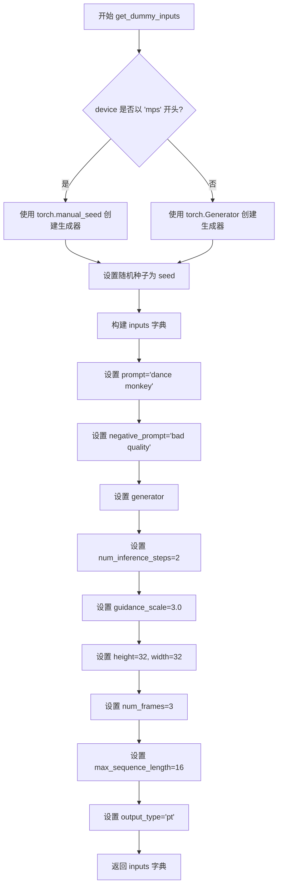
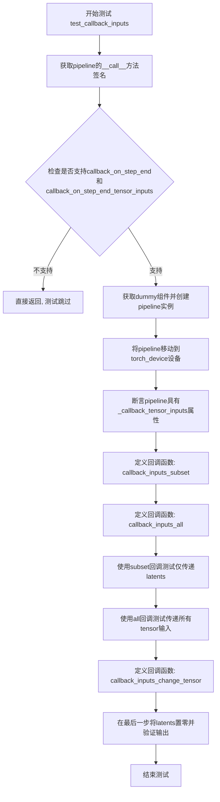
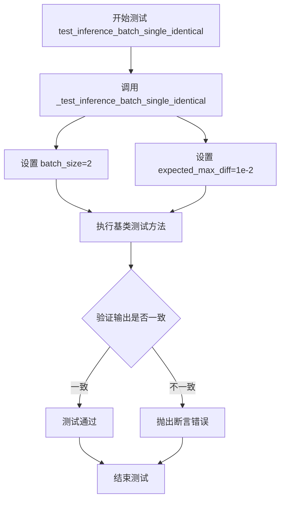
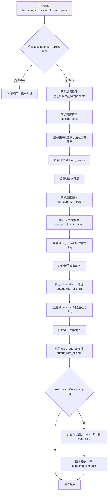
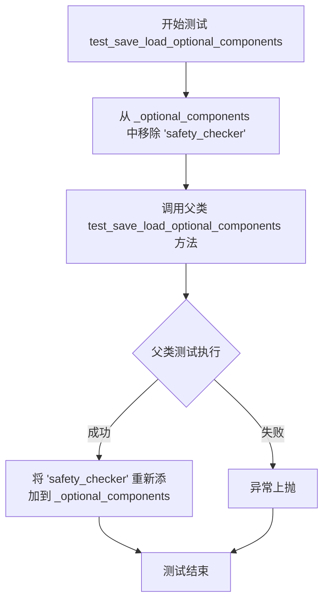
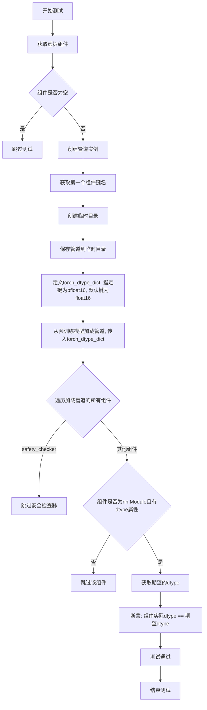

# `diffusers\tests\pipelines\cosmos\test_cosmos2_5_predict.py` 详细设计文档

这是一个用于测试Cosmos 2.5视频生成管道的单元测试文件，包含了管道推理、批处理、注意力切片、保存加载、序列化和数据类型等核心功能的测试用例。

## 整体流程



## 类结构

```
PipelineTesterMixin (测试混入类)
└── Cosmos2_5_PredictPipelineFastTests (具体测试类)
    └── Cosmos2_5_PredictBaseWrapper (管道包装类)
        └── Cosmos2_5_PredictBasePipeline (实际管道基类)
```

## 全局变量及字段


### `enable_full_determinism`
    
启用完全确定性以确保测试可重复性的配置函数

类型：`function`
    


### `torch_device`
    
指定PyTorch计算设备（如'cpu'或'cuda'）的全局变量

类型：`str`
    


### `TEXT_TO_IMAGE_BATCH_PARAMS`
    
文本到图像批量推理的参数集合

类型：`set`
    


### `TEXT_TO_IMAGE_IMAGE_PARAMS`
    
文本到图像生成中图像相关的参数集合

类型：`set`
    


### `TEXT_TO_IMAGE_PARAMS`
    
文本到图像生成任务的标准参数集合

类型：`set`
    


### `PipelineTesterMixin`
    
提供pipeline通用测试方法的混合类

类型：`class`
    


### `to_np`
    
将PyTorch张量转换为NumPy数组的辅助函数

类型：`function`
    


### `DummyCosmosSafetyChecker`
    
用于测试的虚拟Cosmos安全检查器

类型：`class`
    


### `Cosmos2_5_PredictPipelineFastTests.pipeline_class`
    
待测试的pipeline类引用

类型：`type`
    


### `Cosmos2_5_PredictPipelineFastTests.params`
    
单次推理所需的参数集合

类型：`set`
    


### `Cosmos2_5_PredictPipelineFastTests.batch_params`
    
批量推理所需的参数集合

类型：`set`
    


### `Cosmos2_5_PredictPipelineFastTests.image_params`
    
图像处理相关的参数集合

类型：`set`
    


### `Cosmos2_5_PredictPipelineFastTests.image_latents_params`
    
图像潜在向量相关的参数集合

类型：`set`
    


### `Cosmos2_5_PredictPipelineFastTests.required_optional_params`
    
可选但推荐提供的参数集合

类型：`frozenset`
    


### `Cosmos2_5_PredictPipelineFastTests.supports_dduf`
    
标志位，表示pipeline是否支持DDUF（Diffusion Denoising UpSampling Fusion）

类型：`bool`
    


### `Cosmos2_5_PredictPipelineFastTests.test_xformers_attention`
    
标志位，指示是否测试xFormers注意力机制

类型：`bool`
    


### `Cosmos2_5_PredictPipelineFastTests.test_layerwise_casting`
    
标志位，指示是否测试逐层类型转换

类型：`bool`
    


### `Cosmos2_5_PredictPipelineFastTests.test_group_offloading`
    
标志位，指示是否测试组卸载功能

类型：`bool`
    
    

## 全局函数及方法


### `Cosmos2_5_PredictBaseWrapper.from_pretrained`

该方法是一个静态工厂方法，用于从预训练模型加载 `Cosmos2_5_PredictBasePipeline` 管道实例。核心逻辑是在加载过程中自动创建一个虚拟的安全检查器（`DummyCosmosSafetyChecker`），以确保管道在测试环境中能够正常运行，而无需依赖实际的 Cosmos Guardrail 组件（该组件体积庞大且运行缓慢，不适合在 CI 环境中执行）。

参数：

- `*args`：可变位置参数，传递给父类 `Cosmos2_5_PredictBasePipeline.from_pretrained` 的位置参数。
- `**kwargs`：可变关键字参数，传递给父类 `Cosmos2_5_PredictBasePipeline.from_pretrained` 的关键字参数，常见参数包括 `safety_checker`、`device_map`、`torch_dtype` 等。

返回值：`Cosmos2_5_PredictBasePipeline`，返回加载完成并配置好的管道实例。

#### 流程图



#### 带注释源码

```python
@staticmethod
def from_pretrained(*args, **kwargs):
    """
    从预训练模型加载 Cosmos2_5_PredictBasePipeline 实例的静态方法。
    该方法重写了父类的加载逻辑，以便在测试环境中自动注入虚拟的安全检查器，
    避免因缺少真实的 Cosmos Guardrail 而导致的加载失败。
    
    参数:
        *args: 可变位置参数，传递给父类的 from_pretrained 方法
        **kwargs: 可变关键字参数，可包含 safety_checker, device_map, torch_dtype 等
    
    返回:
        Cosmos2_5_PredictBasePipeline: 加载完成的管道实例
    """
    # 检查调用者是否未指定 safety_checker 或将其设置为 None
    if "safety_checker" not in kwargs or kwargs["safety_checker"] is None:
        # 创建虚拟安全检查器用于测试环境
        safety_checker = DummyCosmosSafetyChecker()
        
        # 获取设备映射配置，默认为 CPU
        device_map = kwargs.get("device_map", "cpu")
        
        # 获取目标数据类型配置
        torch_dtype = kwargs.get("torch_dtype")
        
        # 如果指定了设备或数据类型，则将安全检查器移动到对应位置
        if device_map is not None or torch_dtype is not None:
            safety_checker = safety_checker.to(device_map, dtype=torch_dtype)
        
        # 将配置好的安全检查器放入关键字参数中
        kwargs["safety_checker"] = safety_checker
    
    # 调用父类的 from_pretrained 方法完成管道加载
    return Cosmos2_5_PredictBasePipeline.from_pretrained(*args, **kwargs)
```


### `Cosmos2_5_PredictPipelineFastTests.get_dummy_components`

该方法用于创建测试所需的虚拟（dummy）组件，包括3D变换器、VAE编码器/解码器、调度器、文本编码器、分词器以及安全检查器，以便在不加载实际预训练权重的情况下对`Cosmos2_5_PredictBasePipeline`管道进行单元测试。

参数：
- 该方法无显式参数（隐式参数`self`表示类的实例）

返回值：`Dict[str, Any]`，返回一个字典，键为组件名称（如"transformer"、"vae"等），值为对应的虚拟模型或配置对象。

#### 流程图

```mermaid
flowchart TD
    A[开始 get_dummy_components] --> B[设置随机种子 torch.manual_seed(0)]
    B --> C[创建 CosmosTransformer3DModel]
    C --> D[设置随机种子 torch.manual_seed(0)]
    D --> E[创建 AutoencoderKLWan VAE]
    E --> F[设置随机种子 torch.manual_seed(0)]
    F --> G[创建 UniPCMultistepScheduler]
    G --> H[设置随机种子 torch.manual_seed(0)]
    H --> I[创建 Qwen2_5_VLConfig 配置]
    I --> J[基于配置创建 Qwen2_5_VLForConditionalGeneration 文本编码器]
    J --> K[从预训练加载 Qwen2Tokenizer 分词器]
    K --> L[创建 DummyCosmosSafetyChecker 安全检查器]
    L --> M[组装 components 字典]
    M --> N[返回 components]
```

#### 带注释源码

```python
def get_dummy_components(self):
    """
    创建用于测试的虚拟组件。
    
    该方法初始化管道所需的所有模型组件，使用随机权重而非预训练权重，
    以便进行快速单元测试。
    """
    # 设置随机种子确保结果可复现
    torch.manual_seed(0)
    
    # 创建3D变换器模型 (Cosmos Transformer)
    # 参数包括输入通道数(16+1)、输出通道数(16)、注意力头数(2)等
    transformer = CosmosTransformer3DModel(
        in_channels=16 + 1,           # 输入通道数 = 16 + 1 (conditioning)
        out_channels=16,              # 输出通道数
        num_attention_heads=2,        # 注意力头数量
        attention_head_dim=16,        # 注意力头维度
        num_layers=2,                 # Transformer层数
        mlp_ratio=2,                  # MLP扩展比率
        text_embed_dim=32,            # 文本嵌入维度
        adaln_lora_dim=4,             # AdaLN LoRA维度
        max_size=(4, 32, 32),         # 最大尺寸 (帧数, 高度, 宽度)
        patch_size=(1, 2, 2),         # 补丁尺寸 (时间, 高度, 宽度)
        rope_scale=(2.0, 1.0, 1.0),   # RoPE缩放因子
        concat_padding_mask=True,     # 是否连接填充掩码
        extra_pos_embed_type="learnable",  # 额外位置嵌入类型
    )

    # 重置随机种子以确保VAE的可复现性
    torch.manual_seed(0)
    
    # 创建Wan VAE (Variational Autoencoder)
    # 用于将图像编码为潜在表示及解码回像素空间
    vae = AutoencoderKLWan(
        base_dim=3,                   # 基础维度 (RGB通道)
        z_dim=16,                     # 潜在空间维度
        dim_mult=[1, 1, 1, 1],        # 各层维度倍数
        num_res_blocks=1,             # 残差块数量
        temperal_downsample=[False, True, True],  # 时间下采样策略
    )

    # 重置随机种子以确保调度器的可复现性
    torch.manual_seed(0)
    
    # 创建UniPC多步调度器
    # 控制去噪过程的采样调度
    scheduler = UniPCMultistepScheduler()

    # 重置随机种子以确保文本编码器的可复现性
    torch.manual_seed(0)
    
    # 创建Qwen2.5 VL配置对象
    config = Qwen2_5_VLConfig(
        text_config={
            "hidden_size": 16,              # 文本隐藏层大小
            "intermediate_size": 16,        # 中间层大小
            "num_hidden_layers": 2,         # 隐藏层数量
            "num_attention_heads": 2,       # 注意力头数量
            "num_key_value_heads": 2,       # Key-Value头数量
            "rope_scaling": {               # RoPE缩放配置
                "mrope_section": [1, 1, 2],
                "rope_type": "default",
                "type": "default",
            },
            "rope_theta": 1000000.0,        # RoPE基础频率
        },
        vision_config={
            "depth": 2,                     # 视觉编码器深度
            "hidden_size": 16,              # 视觉隐藏层大小
            "intermediate_size": 16,        # 视觉中间层大小
            "num_heads": 2,                 # 视觉注意力头数
            "out_hidden_size": 16,          # 输出隐藏层大小
        },
        hidden_size=16,                     # 总体隐藏层大小
        vocab_size=152064,                  # 词汇表大小
        vision_end_token_id=151653,         # 视觉结束token ID
        vision_start_token_id=151652,       # 视觉开始token ID
        vision_token_id=151654,             # 视觉token ID
    )
    
    # 创建Qwen2.5视觉语言模型作为文本编码器
    text_encoder = Qwen2_5_VLForConditionalGeneration(config)
    
    # 从预训练加载轻量级分词器用于文本处理
    tokenizer = Qwen2Tokenizer.from_pretrained("hf-internal-testing/tiny-random-Qwen2VLForConditionalGeneration")

    # 组装所有组件到字典中
    # 键名与管道类的expected_components属性对应
    components = {
        "transformer": transformer,         # 3D变换器主模型
        "vae": vae,                         # VAE编解码器
        "scheduler": scheduler,             # 采样调度器
        "text_encoder": text_encoder,       # 文本编码器
        "tokenizer": tokenizer,              # 分词器
        "safety_checker": DummyCosmosSafetyChecker(),  # 安全检查器
    }
    
    # 返回组件字典供管道初始化使用
    return components
```


### `Cosmos2_5_PredictPipelineFastTests.get_dummy_inputs`

该方法用于生成测试用的虚拟输入参数，模拟文本到视频扩散管道的推理调用参数。根据设备类型（MPS 或其他）创建随机数生成器，并返回包含提示词、负提示词、生成器、推理步数、引导系数、输出尺寸等完整输入字典。

参数：

- `device`：`str` 或 `torch.device`，指定运行设备，用于创建随机数生成器
- `seed`：`int`（默认值 0），随机种子，用于确保测试可重复性

返回值：`Dict[str, Any]`，包含以下键值的字典：
- `prompt`：提示词文本
- `negative_prompt`：负提示词文本
- `generator`：PyTorch 随机数生成器
- `num_inference_steps`：推理步数
- `guidance_scale`：引导系数
- `height`：输出高度
- `width`：输出宽度
- `num_frames`：生成帧数
- `max_sequence_length`：最大序列长度
- `output_type`：输出类型

#### 流程图



#### 带注释源码

```python
def get_dummy_inputs(self, device, seed=0):
    """
    生成用于管道推理测试的虚拟输入参数。
    
    参数:
        device: 运行设备，str 或 torch.device 类型
        seed: 随机种子，默认值为 0
    
    返回:
        dict: 包含文本到视频生成所需的所有输入参数
    """
    # 判断是否为 Apple MPS 设备，MPS 不支持 torch.Generator
    if str(device).startswith("mps"):
        # MPS 设备使用简化的随机种子方式
        generator = torch.manual_seed(seed)
    else:
        # 其他设备（CPU/CUDA）使用 Generator 对象以支持更精细的随机控制
        generator = torch.Generator(device=device).manual_seed(seed)

    # 构建完整的输入参数字典，用于模拟真实的推理调用
    inputs = {
        "prompt": "dance monkey",           # 正向提示词，指导生成内容
        "negative_prompt": "bad quality",   # 负向提示词，避免生成低质量内容
        "generator": generator,             # 随机数生成器，确保可重复性
        "num_inference_steps": 2,           # 推理步数，越多越精细但耗时
        "guidance_scale": 3.0,              # 引导系数，控制生成内容与提示词的相关性
        "height": 32,                       # 输出视频帧的高度（像素）
        "width": 32,                        # 输出视频帧的宽度（像素）
        "num_frames": 3,                    # 生成视频的帧数
        "max_sequence_length": 16,          # 文本嵌入的最大序列长度
        "output_type": "pt",                # 输出类型，'pt' 表示 PyTorch 张量
    }

    return inputs
```


### `Cosmos2_5_PredictPipelineFastTests.test_components_function`

该测试方法用于验证 `Cosmos2_5_PredictBaseWrapper` 管道类在实例化后是否正确维护了 `components` 属性，并确保该属性包含所有初始化时传入的组件对象（排除字符串、整数、浮点数等非组件类型）。

参数：

- `self`：`Cosmos2_5_PredictPipelineFastTests` 类型，当前测试类的实例引用

返回值：`None`，该方法为测试方法，无返回值（等价于 `void`），通过 `unittest` 的断言来验证逻辑正确性

#### 流程图

```mermaid
flowchart TD
    A[开始 test_components_function] --> B[调用 get_dummy_components 获取测试组件]
    B --> C[过滤掉字符串、整数、浮点类型的值]
    C --> D[使用过滤后的组件字典实例化管道: pipeline_class(**init_components)]
    E[断言: 检查 pipe 是否具有 components 属性]
    E -->|是| F[断言: 检查 pipe.components 的键集合是否与 init_components 键集合相等]
    F --> G[测试通过 / 测试失败]
    E -->|否| H[测试失败]
```

#### 带注释源码

```python
def test_components_function(self):
    """
    测试管道实例是否正确维护了 components 属性。
    该属性应包含所有非基本类型的组件对象（transformer、vae、scheduler等）。
    """
    # 第一步：获取虚拟组件字典
    # 这些是用于测试的模拟组件，不是真实的模型权重
    init_components = self.get_dummy_components()
    
    # 第二步：过滤掉基本数据类型
    # 只保留 PyTorch 模型对象、调度器等组件，排除字符串/整数/浮点数等配置参数
    # 例如：tokenizer 是字符串路径，需要排除
    init_components = {k: v for k, v in init_components.items() if not isinstance(v, (str, int, float))}
    
    # 第三步：使用组件字典实例化管道
    # 这会调用 Cosmos2_5_PredictBaseWrapper.__init__
    pipe = self.pipeline_class(**init_components)
    
    # 第四步：验证管道具有 components 属性
    # 这是 diffusers 库中管道的标准属性，用于跟踪所有组件
    self.assertTrue(hasattr(pipe, "components"))
    
    # 第五步：验证 components 包含所有初始化的组件
    # 确保没有组件在实例化过程中丢失
    self.assertTrue(set(pipe.components.keys()) == set(init_components.keys()))
```


### `Cosmos2_5_PredictPipelineFastTests.test_inference`

这是一个单元测试方法，用于测试 Cosmos 2.5 预测管道的推理功能。该测试方法通过初始化虚拟组件、创建管道实例、执行推理，然后验证生成视频的形状是否为 (3, 3, 32, 32) 以及所有数值是否为有限的（finite）。

参数：

- `self`：`Cosmos2_5_PredictPipelineFastTests` 实例，隐式参数，测试用例对象本身

返回值：`None`，无返回值（测试函数通过断言进行验证）

#### 流程图

```mermaid
graph TD
    A[开始] --> B[设置 device = 'cpu']
    B --> C[调用 get_dummy_components 获取虚拟组件]
    C --> D[使用虚拟组件实例化管道 pipeline]
    D --> E[将管道移动到 device]
    E --> F[设置进度条配置 pipe.set_progress_bar_config]
    F --> G[调用 get_dummy_inputs 获取输入参数]
    G --> H[执行管道推理 pipe 执行生成]
    H --> I[从结果中提取视频 frames]
    I --> J[获取第一帧 generated_video = video[0]]
    J --> K[断言验证形状: (3, 3, 32, 32)]
    K --> L[断言验证数值有限性: torch.isfinite]
    L --> M[结束]
```

#### 带注释源码

```python
def test_inference(self):
    """
    测试 Cosmos 2.5 预测管道的推理功能。
    验证管道能够正确生成视频，并且输出形状和数值符合预期。
    """
    # 1. 设置测试设备为 CPU
    device = "cpu"

    # 2. 获取虚拟组件（用于测试的模拟模型组件）
    components = self.get_dummy_components()
    
    # 3. 使用虚拟组件实例化管道
    pipe = self.pipeline_class(**components)
    
    # 4. 将管道移动到指定设备
    pipe.to(device)
    
    # 5. 配置进度条（disable=None 表示不禁用进度条）
    pipe.set_progress_bar_config(disable=None)

    # 6. 获取虚拟输入参数
    inputs = self.get_dummy_inputs(device)
    
    # 7. 执行推理，获取生成结果
    # pipe(**inputs) 返回一个对象，其 .frames 属性包含生成的视频
    video = pipe(**inputs).frames
    
    # 8. 获取第一个生成的视频（视频列表中的第一项）
    generated_video = video[0]
    
    # 9. 断言验证：生成的视频形状应为 (3, 3, 32, 32)
    # 即：(帧数, 通道数, 高度, 宽度)
    self.assertEqual(generated_video.shape, (3, 3, 32, 32))
    
    # 10. 断言验证：所有数值必须是有限的（不是 NaN 或 Inf）
    self.assertTrue(torch.isfinite(generated_video).all())
```


### `Cosmos2_5_PredictPipelineFastTests.test_callback_inputs`

该方法用于测试pipeline的回调功能是否正确实现，包括验证回调函数能否正确接收tensor输入、验证回调张量子集和全部张量的传递、以及验证在最后一步修改tensor值后pipeline仍能正常工作。

参数：

- `self`：`Cosmos2_5_PredictPipelineFastTests`（隐式参数），测试类的实例本身

返回值：`None`，该方法为单元测试方法，无返回值，通过断言验证功能正确性

#### 流程图



#### 带注释源码

```python
def test_callback_inputs(self):
    """
    测试 Cosmos2_5_PredictBasePipeline 的回调输入功能。
    验证:
    1. pipeline支持callback_on_step_end和callback_on_step_end_tensor_inputs参数
    2. _callback_tensor_inputs属性正确定义
    3. 回调函数可以接收tensor输入的子集
    4. 回调函数可以接收所有允许的tensor输入
    5. 回调函数可以修改tensor值(如在最后一步将latents置零)
    """
    # 获取pipeline的__call__方法签名
    sig = inspect.signature(self.pipeline_class.__call__)
    # 检查是否支持回调张量输入参数
    has_callback_tensor_inputs = "callback_on_step_end_tensor_inputs" in sig.parameters
    # 检查是否支持回调结束步骤参数
    has_callback_step_end = "callback_on_step_end" in sig.parameters

    # 如果pipeline不支持这些参数,则直接返回(跳过测试)
    if not (has_callback_tensor_inputs and has_callback_step_end):
        return

    # 获取测试用的dummy组件
    components = self.get_dummy_components()
    # 使用dummy组件创建pipeline实例
    pipe = self.pipeline_class(**components)
    # 将pipeline移动到测试设备(cpu/cuda)
    pipe = pipe.to(torch_device)
    # 设置进度条配置(disable=None表示显示进度条)
    pipe.set_progress_bar_config(disable=None)
    
    # 断言pipeline具有_callback_tensor_inputs属性
    # 该属性定义了回调函数可以使用的tensor变量列表
    self.assertTrue(
        hasattr(pipe, "_callback_tensor_inputs"),
        f" {self.pipeline_class} should have `_callback_tensor_inputs` that defines a list of tensor variables its callback function can use as inputs",
    )

    # 定义回调函数:验证只传递latents子集
    def callback_inputs_subset(pipe, i, t, callback_kwargs):
        """验证回调kwargs中的tensor都在允许的tensor_inputs列表中"""
        for tensor_name in callback_kwargs.keys():
            assert tensor_name in pipe._callback_tensor_inputs
        return callback_kwargs

    # 定义回调函数:验证传递所有允许的tensor
    def callback_inputs_all(pipe, i, t, callback_kwargs):
        """验证所有允许的tensor都在callback_kwargs中,且kwargs中只有允许的tensor"""
        for tensor_name in pipe._callback_tensor_inputs:
            assert tensor_name in callback_kwargs
        for tensor_name in callback_kwargs.keys():
            assert tensor_name in pipe._callback_tensor_inputs
        return callback_kwargs

    # 获取dummy输入
    inputs = self.get_dummy_inputs(torch_device)

    # 测试1:只传递latents作为回调tensor输入
    inputs["callback_on_step_end"] = callback_inputs_subset
    inputs["callback_on_step_end_tensor_inputs"] = ["latents"]
    # 执行pipeline并忽略返回值
    _ = pipe(**inputs)[0]

    # 测试2:传递所有允许的tensor作为回调输入
    inputs["callback_on_step_end"] = callback_inputs_all
    inputs["callback_on_step_end_tensor_inputs"] = pipe._callback_tensor_inputs
    # 执行pipeline并忽略返回值
    _ = pipe(**inputs)[0]

    # 定义回调函数:在最后一步将latents修改为全零tensor
    def callback_inputs_change_tensor(pipe, i, t, callback_kwargs):
        """在最后推理步骤将latents置零"""
        # 判断是否为最后一步
        is_last = i == (pipe.num_timesteps - 1)
        if is_last:
            # 将latents替换为相同形状的全零tensor
            callback_kwargs["latents"] = torch.zeros_like(callback_kwargs["latents"])
        return callback_kwargs

    # 测试3:使用修改tensor的回调函数
    inputs["callback_on_step_end"] = callback_inputs_change_tensor
    inputs["callback_on_step_end_tensor_inputs"] = pipe._callback_tensor_inputs
    # 执行pipeline获取输出
    output = pipe(**inputs)[0]
    # 验证输出tensor的绝对值和小于一定阈值(确保输出有效)
    assert output.abs().sum() < 1e10
```


### `Cosmos2_5_PredictPipelineFastTests.test_inference_batch_single_identical`

该方法是一个单元测试函数，用于验证在批处理推理模式下，单个样本的输出与批量样本中单个样本的输出是否一致，确保pipeline在批处理时不会引入额外的不确定性或变异。

参数：

- `self`：`Cosmos2_5_PredictPipelineFastTests`，测试类的实例对象，包含测试上下文和辅助方法

返回值：`None`，该方法为测试方法，不返回任何值，仅通过断言验证结果

#### 流程图



#### 带注释源码

```python
def test_inference_batch_single_identical(self):
    """
    测试批处理推理时，单个样本和批量样本中对应样本的输出是否相同。
    该测试确保pipeline在批处理模式下不会引入额外的不确定因素。
    """
    # 调用基类 PipelineTesterMixin 提供的测试方法
    # batch_size=2: 使用2个样本进行测试
    # expected_max_diff=1e-2: 允许的最大差异为0.01
    self._test_inference_batch_single_identical(batch_size=2, expected_max_diff=1e-2)
```


### `Cosmos2_5_PredictPipelineFastTests.test_attention_slicing_forward_pass`

该测试方法用于验证注意力切片（Attention Slicing）功能在 Cosmos2_5 预测管道中不会影响推理结果的正确性，通过对比启用/禁用注意力切片时的输出差异来确保功能实现的准确性。

参数：

- `self`：`Cosmos2_5_PredictPipelineFastTests`，测试类实例本身
- `test_max_difference`：`bool`，是否测试最大差异，默认为 `True`
- `test_mean_pixel_difference`：`bool`，是否测试平均像素差异，默认为 `True`（当前未使用）
- `expected_max_diff`：`float`，期望的最大差异阈值，默认为 `1e-3`

返回值：`None`，该方法为测试用例，无返回值

#### 流程图



#### 带注释源码

```python
def test_attention_slicing_forward_pass(
    self, test_max_difference=True, test_mean_pixel_difference=True, expected_max_diff=1e-3
):
    """
    测试注意力切片功能的前向传播是否正确。
    
    注意力切片是一种内存优化技术，将注意力计算分割成多个小块进行，
    以减少显存占用。此测试验证启用该功能后不会影响输出结果的一致性。
    
    参数:
        test_max_difference: 是否测试最大差异
        test_mean_pixel_difference: 是否测试平均像素差异（当前未使用）
        expected_max_diff: 允许的最大差异阈值
    """
    # 检查测试是否应该运行，如果 test_attention_slicing 属性为 False 则跳过
    if not getattr(self, "test_attention_slicing", True):
        return

    # 获取用于测试的虚拟组件（transformer, vae, scheduler, text_encoder, tokenizer, safety_checker）
    components = self.get_dummy_components()
    
    # 使用虚拟组件创建管道实例
    pipe = self.pipeline_class(**components)
    
    # 遍历管道中的所有组件，将它们的注意力处理器设置为默认处理器
    # 这是为了确保测试从已知状态开始
    for component in pipe.components.values():
        if hasattr(component, "set_default_attn_processor"):
            component.set_default_attn_processor()
    
    # 将管道移动到测试设备（如 CPU 或 CUDA）
    pipe.to(torch_device)
    
    # 配置进度条，disable=None 表示启用进度条
    pipe.set_progress_bar_config(disable=None)

    # 设置生成器设备为 CPU
    generator_device = "cpu"
    
    # 获取虚拟输入参数（prompt, negative_prompt, generator, num_inference_steps 等）
    inputs = self.get_dummy_inputs(generator_device)
    
    # 执行无注意力切片的推理，获取基准输出
    output_without_slicing = pipe(**inputs)[0]

    # 启用注意力切片，slice_size=1 表示将注意力计算分成 1 块（即不切片）
    pipe.enable_attention_slicing(slice_size=1)
    
    # 获取新的虚拟输入（使用新的随机种子）
    inputs = self.get_dummy_inputs(generator_device)
    
    # 执行 slice_size=1 的推理
    output_with_slicing1 = pipe(**inputs)[0]

    # 启用注意力切片，slice_size=2 表示将注意力计算分成 2 块
    pipe.enable_attention_slicing(slice_size=2)
    
    # 获取新的虚拟输入
    inputs = self.get_dummy_inputs(generator_device)
    
    # 执行 slice_size=2 的推理
    output_with_slicing2 = pipe(**inputs)[0]

    # 如果启用最大差异测试
    if test_max_difference:
        # 将 PyTorch 张量转换为 NumPy 数组并计算差异
        max_diff1 = np.abs(to_np(output_with_slicing1) - to_np(output_without_slicing)).max()
        max_diff2 = np.abs(to_np(output_with_slicing2) - to_np(output_without_slicing)).max()
        
        # 断言：注意力切片不应该影响推理结果
        # 所有差异中的最大值应该小于预期的最大差异阈值
        self.assertLess(
            max(max_diff1, max_diff2),
            expected_max_diff,
            "Attention slicing should not affect the inference results"
        )
```


### `Cosmos2_5_PredictPipelineFastTests.test_save_load_optional_components`

该测试方法用于验证 Cosmos2_5_PredictBasePipeline 管道在保存和加载时处理可选组件（特别是 safety_checker）的正确性，通过临时移除 safety_checker 来测试可选组件的序列化和反序列化功能。

参数：

- `self`：`Cosmos2_5_PredictPipelineFastTests`，隐式参数 unittest.TestCase 的标准测试方法参数
- `expected_max_difference`：`float`，默认值 `1e-4`，期望保存/加载前后模型输出的最大差异阈值，用于精度验证

返回值：`None`，无显式返回值，该方法通过 unittest 断言验证功能正确性

#### 流程图



#### 带注释源码

```python
def test_save_load_optional_components(self, expected_max_difference=1e-4):
    """
    测试管道保存和加载可选组件的功能。
    
    该测试方法验证 Cosmos2_5_PredictBasePipeline 管道在保存和加载时
    对可选组件（特别是 safety_checker）的处理是否正确。
    
    参数:
        expected_max_difference (float): 期望的最大差异阈值，用于比较
                                          保存和加载后模型输出的差异。
                                          默认为 1e-4。
    
    返回:
        None: 该方法通过 unittest 断言验证功能，不返回任何值。
    """
    # 临时从可选组件列表中移除 safety_checker
    # 这是为了测试当 safety_checker 不存在时的保存/加载行为
    self.pipeline_class._optional_components.remove("safety_checker")
    
    # 调用父类（PipelineTesterMixin）的测试方法
    # 执行实际的保存/加载验证逻辑
    # 父类方法会验证：
    # 1. 管道能否正确保存到磁盘
    # 2. 管道能否从磁盘正确加载
    # 3. 保存/加载前后的输出差异是否在 expected_max_difference 范围内
    super().test_save_load_optional_components(expected_max_difference=expected_max_difference)
    
    # 测试完成后，将 safety_checker 重新添加到可选组件列表
    # 恢复原始状态，确保不影响后续测试
    self.pipeline_class._optional_components.append("safety_checker")
```


### `Cosmos2_5_PredictPipelineFastTests.test_serialization_with_variants`

该方法用于测试管道在保存为特定变体（如fp16）时，能够正确地将模型组件保存到对应的子文件夹中，并确保文件名包含变体前缀。

参数：

- `self`：无显式参数，测试类实例本身

返回值：`None`，该方法为单元测试，通过断言验证逻辑，无返回值

#### 流程图

```mermaid
flowchart TD
    A[开始] --> B[获取虚拟组件: components = self.get_dummy_components()]
    B --> C[创建管道: pipe = self.pipeline_class(**components)]
    C --> D[提取模型组件名称列表<br/>model_components = [component_name<br/>for component_name, component<br/>in pipe.components.items()<br/>if isinstance(component, torch.nn.Module)]]
    D --> E[从列表中移除safety_checker]
    E --> F[设置变体: variant = 'fp16']
    F --> G[创建临时目录]
    G --> H[保存管道到临时目录<br/>pipe.save_pretrained(tmpdir,<br/>variant=variant,<br/>safe_serialization=False)]
    H --> I[读取model_index.json配置文件]
    I --> J{遍历tmpdir中的子文件夹}
    J --> K{子文件夹是目录<br/>且在model_components中<br/>且在config中?}
    K -->|是| L[获取文件夹中的文件列表]
    L --> M{检查是否存在文件<br/>文件扩展名.后缀<br/>以variant开头?}
    M -->|是| N[断言通过]
    M -->|否| O[断言失败]
    K -->|否| P[跳过该文件夹]
    J --> Q[结束]
    N --> Q
    O --> Q
    P --> Q
```

#### 带注释源码

```
def test_serialization_with_variants(self):
    # 步骤1: 获取虚拟组件（用于测试的假模型组件）
    components = self.get_dummy_components()
    
    # 步骤2: 使用虚拟组件实例化管道
    pipe = self.pipeline_class(**components)
    
    # 步骤3: 筛选出所有PyTorch模块类型的组件作为模型组件
    # 这些组件才需要保存为变体文件
    model_components = [
        component_name
        for component_name, component in pipe.components.items()
        if isinstance(component, torch.nn.Module)
    ]
    
    # 步骤4: 从列表中移除safety_checker，因为它不是核心模型组件
    model_components.remove("safety_checker")
    
    # 步骤5: 设置变体类型为fp16（半精度浮点）
    variant = "fp16"

    # 步骤6: 创建临时目录用于保存模型
    with tempfile.TemporaryDirectory() as tmpdir:
        # 步骤7: 保存管道到指定路径，使用fp16变体，不使用安全序列化
        pipe.save_pretrained(tmpdir, variant=variant, safe_serialization=False)

        # 步骤8: 读取model_index.json获取配置信息
        with open(f"{tmpdir}/model_index.json", "r") as f:
            config = json.load(f)

        # 步骤9: 遍历临时目录中的所有子文件夹
        for subfolder in os.listdir(tmpdir):
            # 步骤10: 检查该子文件夹是否是目录、是否在模型组件列表中、是否在配置中
            if not os.path.isfile(subfolder) and subfolder in model_components:
                folder_path = os.path.join(tmpdir, subfolder)
                is_folder = os.path.isdir(folder_path) and subfolder in config
                
                # 步骤11: 断言验证
                # - 子文件夹确实是目录
                # - 子文件夹中的文件存在以variant(fp16)为前缀的文件
                assert is_folder and any(
                    p.split(".")[1].startswith(variant) 
                    for p in os.listdir(folder_path)
                )
```


### `Cosmos2_5_PredictPipelineFastTests.test_torch_dtype_dict`

该方法是一个单元测试，用于验证管道在加载时能够正确应用 `torch_dtype_dict` 配置，确保各个组件（除安全检查器外）的数据类型与指定的 dtype 匹配。

参数：无（仅包含 `self` 隐式参数）

返回值：`None`，该方法为测试用例，通过断言验证数据类型正确性，无显式返回值

#### 流程图



#### 带注释源码

```python
def test_torch_dtype_dict(self):
    """
    测试管道的 torch_dtype_dict 功能，验证各组件在加载时是否正确设置了数据类型。
    该测试确保当使用 torch_dtype 参数加载管道时，各个模型组件能够按照字典中的配置
    正确转换数据类型。
    """
    # 获取预定义的虚拟组件，用于测试
    components = self.get_dummy_components()
    
    # 如果没有虚拟组件定义，则跳过该测试
    if not components:
        self.skipTest("No dummy components defined.")

    # 使用虚拟组件创建管道实例
    pipe = self.pipeline_class(**components)

    # 从组件字典中获取第一个键名，用于后续测试
    specified_key = next(iter(components.keys()))

    # 创建临时目录用于保存和加载管道
    with tempfile.TemporaryDirectory(ignore_cleanup_errors=True) as tmpdirname:
        # 将管道保存到临时目录（不使用安全序列化）
        pipe.save_pretrained(tmpdirname, safe_serialization=False)
        
        # 定义 torch_dtype 字典：指定键使用 bfloat16，默认使用 float16
        torch_dtype_dict = {specified_key: torch.bfloat16, "default": torch.float16}
        
        # 从预训练路径加载管道，并传入 torch_dtype_dict 配置
        # 同时传入虚拟安全检查器
        loaded_pipe = self.pipeline_class.from_pretrained(
            tmpdirname, 
            safety_checker=DummyCosmosSafetyChecker(), 
            torch_dtype=torch_dtype_dict
        )

    # 遍历加载后管道的所有组件
    for name, component in loaded_pipe.components.items():
        # 跳过安全检查器，不验证其数据类型
        if name == "safety_checker":
            continue
        
        # 检查组件是否为 PyTorch 模块且具有 dtype 属性
        if isinstance(component, torch.nn.Module) and hasattr(component, "dtype"):
            # 根据组件名称获取期望的 dtype，若未指定则使用默认值
            expected_dtype = torch_dtype_dict.get(name, torch_dtype_dict.get("default", torch.float32))
            
            # 断言组件的实际 dtype 与期望 dtype 匹配
            self.assertEqual(
                component.dtype,
                expected_dtype,
                f"Component '{name}' has dtype {component.dtype} but expected {expected_dtype}",
            )
```


### `Cosmos2_5_PredictPipelineFastTests.test_encode_prompt_works_in_isolation`

该方法是一个被跳过的单元测试，用于验证提示编码（prompt encoding）功能能够独立正常工作。但由于 Cosmos Guardrail 模型过大且运行缓慢，该测试在 CI 环境中被跳过。

参数：

- `self`：`Cosmos2_5_PredictPipelineFastTests`，测试类实例，代表当前测试用例对象本身。

返回值：`None`，该方法不返回任何值（被 `@unittest.skip` 跳过，且方法体只有 `pass` 语句）。

#### 流程图

```mermaid
flowchart TD
    A[开始执行测试] --> B{检查@unittest.skip装饰器}
    B -->|装饰器存在| C[跳过测试并输出跳过原因]
    B -->|装饰器不存在| D[执行test_encode_prompt_works_in_isolation方法体]
    D --> E[方法体为空<br/>只有pass语句]
    E --> F[测试结束]
    C --> F
```

#### 带注释源码

```python
@unittest.skip(
    "The pipeline should not be runnable without a safety checker. The test creates a pipeline without passing in "
    "a safety checker, which makes the pipeline default to the actual Cosmos Guardrail. The Cosmos Guardrail is "
    "too large and slow to run on CI."
)
def test_encode_prompt_works_in_isolation(self):
    """
    测试提示编码功能在隔离环境下的工作情况。
    
    该测试原本用于验证：
    1. 管道能够独立进行提示编码
    2. 不依赖完整的安全检查器也能正常工作
    
    但由于以下原因被跳过：
    - 管道在未传入安全检查器时会默认使用 Cosmos Guardrail
    - Cosmos Guardrail 模型体积过大
    - 在 CI 环境中运行速度过慢
    """
    pass  # 方法体为空，不执行任何实际测试逻辑
```

## 关键组件


### Cosmos2_5_PredictBaseWrapper

包装类，继承自Cosmos2_5_PredictBasePipeline，用于在未提供safety_checker时自动创建并配置DummyCosmosSafetyChecker，支持设备映射和dtype转换。

### Cosmos2_5_PredictPipelineFastTests

核心测试类，继承PipelineTesterMixin和unittest.TestCase，包含对Cosmos2.5视频生成pipeline的全面测试，验证组件初始化、推理、批处理、注意力切片、保存加载、序列化和dtype处理等功能。

### DummyCosmosSafetyChecker

虚拟安全检查器，用于测试环境替代真实的Cosmos Guardrail，避免在CI环境中运行过大的模型。

### get_dummy_components

创建虚拟组件的工厂方法，初始化CosmosTransformer3DModel、AutoencoderKLWan、UniPCMultistepScheduler、Qwen2_5_VLForConditionalGeneration和Qwen2Tokenizer等核心组件，用于单元测试。

### get_dummy_inputs

生成虚拟推理输入的工厂方法，构建包含prompt、negative_prompt、generator、num_inference_steps、guidance_scale、height、width、num_frames、max_sequence_length和output_type的输入字典。

### 张量索引与惰性加载

在test_callback_inputs测试中实现，支持在推理过程中通过callback_on_step_end和callback_on_step_end_tensor_inputs参数动态访问和修改中间张量状态。

### 反量化支持

通过test_torch_dtype_dict测试验证，支持从预训练模型加载时指定torch_dtype字典，为不同组件（如transformer、vae等）分别设置计算精度。

### 量化策略

test_serialization_with_variants测试验证了模型序列化时支持variant参数（如fp16），确保不同量化版本的模型组件可以正确保存和加载。

### Safety Checker集成

通过Cosmos2_5_PredictBaseWrapper.from_pretrained静态方法实现安全检查器的自动注入和设备/dtype配置。

### Attention Slicing

test_attention_slicing_forward_pass测试验证了注意力切片功能，支持通过enable_attention_slicing方法分片处理注意力计算以节省显存。

### 组件序列化与变体

test_save_load_optional_components和test_serialization_with_variants测试覆盖了可选组件管理和多变体模型保存加载功能。

### 批处理一致性

test_inference_batch_single_identical测试验证了批处理推理与单样本推理结果的一致性。

## 问题及建议


### 已知问题

- **死代码**：`test_encode_prompt_works_in_st isolation` 方法被完全跳过，仅包含 `pass` 语句，属于无效测试代码
- **硬编码的配置值**：transformer、VAE 和 text_encoder 的配置中存在大量硬编码参数（如 `max_size=(4, 32, 32)`、`patch_size=(1, 2, 2)`、管道参数等），缺乏文档说明这些值的选取依据
- **重复的组件创建逻辑**：`get_dummy_components()` 方法在每次调用时都重新创建所有组件，包括多次调用 `torch.manual_seed(0)`，导致测试运行效率低下
- **设备处理不一致**：在 `get_dummy_inputs()` 中对 MPS 设备使用了不同的 generator 创建逻辑（直接使用 `torch.manual_seed(seed)` 而非 `torch.Generator(device=device).manual_seed(seed)`），可能导致测试行为不一致
- **资源清理不当**：`test_save_load_optional_components` 方法直接修改类属性 `self.pipeline_class._optional_components`，在异常情况下可能导致状态未恢复
- **测试方法参数过多**：`test_attention_slicing_forward_pass` 方法接收多个可选参数，降低了测试的可维护性和可读性
- **错误信息不够具体**：部分断言的错误信息较为通用，例如 "Attention slicing should not affect the inference results"，缺乏足够的调试信息
- **命名规范不一致**：测试方法命名混合使用了 camelCase（如 `test_inference_batch_single_identical`）和 PEP 8 推荐的 snake_case
- **未使用的导入**：`inspect` 和 `json` 模块被导入但未在代码中实际使用

### 优化建议

- 移除 `test_encode_prompt_works_in_isolation` 方法或实现其真正的测试逻辑
- 使用 `functools.lru_cache` 或类级别的 fixture 缓存 `get_dummy_components()` 的返回值，避免重复创建组件
- 统一设备处理逻辑，使用统一的 generator 创建方式，或在类级别设置设备兼容性检查
- 使用 pytest fixture 或 `setUp`/`tearDown` 方法管理类属性修改，确保测试后的状态恢复
- 将硬编码的配置值提取为类常量或配置文件，并添加文档注释说明其用途和设计考量
- 简化 `test_attention_slicing_forward_pass` 方法签名，移除不必要的可选参数
- 增强断言错误信息，包含更多调试上下文（如实际值 vs 预期值）
- 清理未使用的导入，保持代码整洁

## 其它


### 一段话描述

该代码是针对 Cosmos2_5_PredictBasePipeline 视频生成管道的单元测试套件，验证了管道在推理、批处理、模型序列化、注意力切片、回调函数等方面的正确性和一致性。

### 文件的整体运行流程

文件通过 unittest 框架定义测试类 Cosmos2_5_PredictPipelineFastTests，包含多个测试方法。测试流程为：1) 初始化测试组件（get_dummy_components）创建虚拟的 transformer、vae、scheduler、text_encoder、tokenizer 等；2) 准备测试输入（get_dummy_inputs）；3) 执行各项测试用例验证管道功能；4) 清理资源。每个测试方法独立运行，通过断言验证预期行为。

### 类的详细信息

#### 类：Cosmos2_5_PredictBaseWrapper

**类字段：**

- 无新增类字段，继承自 Cosmos2_5_PredictBasePipeline

**类方法：**

- **from_pretrained**
  - 参数：*args, **kwargs
  - 参数类型：任意位置参数，任意关键字参数
  - 参数描述：当未提供 safety_checker 时，自动创建 DummyCosmosSafetyChecker 并根据 device_map 和 torch_dtype 移动到指定设备和转换数据类型
  - 返回值类型：Cosmos2_5_PredictBasePipeline 实例
  - 返回值描述：返回已配置安全检查器的管道实例

#### 类：Cosmos2_5_PredictPipelineFastTests

**类字段：**

| 名称 | 类型 | 描述 |
|------|------|------|
| pipeline_class | type | 测试的管道类（Cosmos2_5_PredictBaseWrapper） |
| params | frozenset | 文本到图像管道参数集合（排除 cross_attention_kwargs） |
| batch_params | frozenset | 批处理参数集合 |
| image_params | frozenset | 图像参数集合 |
| image_latents_params | frozenset | 图像潜在向量参数集合 |
| required_optional_params | frozenset | 必需的可选参数集合 |
| supports_dduf | bool | 是否支持 DDUF（默认 False） |
| test_xformers_attention | bool | 是否测试 xformers 注意力（默认 False） |
| test_layerwise_casting | bool | 是否测试分层类型转换（默认 True） |
| test_group_offloading | bool | 是否测试组卸载（默认 True） |

**类方法：**

- **get_dummy_components**
  - 参数：无
  - 参数类型：无
  - 参数描述：创建用于测试的虚拟组件
  - 返回值类型：dict
  - 返回值描述：包含 transformer、vae、scheduler、text_encoder、tokenizer、safety_checker 的字典

- **get_dummy_inputs**
  - 参数：device, seed=0
  - 参数类型：str, int
  - 参数描述：device 为目标设备，seed 为随机种子
  - 返回值类型：dict
  - 返回值描述：包含 prompt、negative_prompt、generator、num_inference_steps、guidance_scale、height、width、num_frames、max_sequence_length、output_type 的字典

- **test_components_function**
  - 参数：无
  - 参数类型：无
  - 参数描述：验证管道具有 components 属性且包含所有初始化组件
  - 返回值类型：None
  - 返回值描述：无返回值，通过断言验证

- **test_inference**
  - 参数：无
  - 参数类型：无
  - 参数描述：执行管道推理，验证输出形状和数值有限性
  - 返回值类型：None
  - 返回值描述：无返回值，通过断言验证

- **test_callback_inputs**
  - 参数：无
  - 参数类型：无
  - 参数描述：验证回调函数正确接收和处理张量输入
  - 返回值类型：None
  - 返回值描述：无返回值，通过断言验证

- **test_inference_batch_single_identical**
  - 参数：无
  - 参数类型：无
  - 参数描述：验证批处理和单样本推理结果一致性
  - 返回值类型：None
  - 返回值描述：无返回值，通过断言验证

- **test_attention_slicing_forward_pass**
  - 参数：test_max_difference=True, test_mean_pixel_difference=True, expected_max_diff=1e-3
  - 参数类型：bool, bool, float
  - 参数描述：验证注意力切片功能不影响推理结果
  - 返回值类型：None
  - 返回值描述：无返回值，通过断言验证

- **test_save_load_optional_components**
  - 参数：expected_max_difference=1e-4
  - 参数类型：float
  - 参数描述：验证可选组件的保存和加载功能
  - 返回值类型：None
  - 返回值描述：无返回值，通过断言验证

- **test_serialization_with_variants**
  - 参数：无
  - 参数类型：无
  - 参数描述：验证带变体的模型序列化功能
  - 返回值类型：None
  - 返回值描述：无返回值，通过断言验证

- **test_torch_dtype_dict**
  - 参数：无
  - 参数类型：无
  - 参数描述：验证 torch_dtype 字典加载功能
  - 返回值类型：None
  - 返回值描述：无返回值，通过断言验证

- **test_encode_prompt_works_in_isolation**
  - 参数：无
  - 参数类型：无
  - 参数描述：验证 prompt 编码独立工作（已跳过）
  - 返回值类型：None
  - 返回值描述：无返回值

### 关键组件信息

| 名称 | 描述 |
|------|------|
| Cosmos2_5_PredictBasePipeline | 被测试的视频预测生成管道基类 |
| CosmosTransformer3DModel | 3D 变换器模型，用于视频生成 |
| AutoencoderKLWan | VAE 模型，用于编码/解码图像潜在表示 |
| UniPCMultistepScheduler | 多步调度器，用于去噪过程 |
| Qwen2_5_VLForConditionalGeneration | 文本编码器，将文本转换为嵌入 |
| Qwen2Tokenizer | 文本分词器 |
| DummyCosmosSafetyChecker | 虚拟安全检查器，用于测试 |
| PipelineTesterMixin | 管道测试混入类，提供通用测试方法 |

### 潜在的技术债务或优化空间

1. **硬编码的测试参数**：num_inference_steps=2、height=32、width=32 等参数硬编码，可考虑参数化以提高测试覆盖率
2. **缺失的错误边界测试**：未测试管道在异常输入（如空 prompt、无效设备）下的行为
3. **测试跳过**：test_encode_prompt_works_in_isolation 被完全跳过，未实现实际测试逻辑
4. **设备兼容性处理**：对 MPS 设备使用 manual_seed 而非 Generator，可能导致测试行为不一致
5. **重复代码**：get_dummy_inputs 在多个测试方法中被重复调用，可提取为 fixture

### 设计目标与约束

**设计目标：**

- 确保 Cosmos2_5 视频生成管道在各种配置下正确运行
- 验证管道组件的序列化和反序列化功能
- 确保注意力切片等优化功能不影响输出质量
- 验证回调机制的正确性

**约束：**

- 测试仅在 CPU 和指定设备上运行，不覆盖 GPU 特定功能
- 由于 Cosmos Guardrail 过大，某些测试被跳过
- 测试使用确定性随机种子以确保结果可复现

### 错误处理与异常设计

- **safety_checker 为 None**：在 from_pretrained 中自动创建 DummyCosmosSafetyChecker
- **MPS 设备特殊处理**：使用 torch.manual_seed 而非 Generator 以兼容 MPS
- **测试跳过**：使用 @unittest.skip 装饰器跳过无法在 CI 运行的测试
- **临时目录清理**：使用 tempfile.TemporaryDirectory 并设置 ignore_cleanup_errors=True

### 数据流与状态机

测试数据流如下：

1. **初始化阶段**：get_dummy_components 创建所有模型组件 → 管道构造函数接收组件
2. **推理阶段**：get_dummy_inputs 准备输入 → 管道 __call__ 执行推理 → 返回视频帧
3. **回调阶段**：在每个推理步骤结束时调用 callback_on_step_end，允许修改中间状态
4. **序列化阶段**：save_pretrained 保存模型 → from_pretrained 加载模型 → 验证状态一致性

### 外部依赖与接口契约

**主要依赖：**

- transformers：Qwen2_5_VLConfig, Qwen2_5_VLForConditionalGeneration, Qwen2Tokenizer
- diffusers：AutoencoderKLWan, Cosmos2_5_PredictBasePipeline, CosmosTransformer3DModel, UniPCMultistepScheduler
- numpy：数组处理
- torch：深度学习框架
- unittest：测试框架

**接口契约：**

- 管道必须实现 __call__ 方法，接受 prompt、num_inference_steps、guidance_scale 等参数
- 管道必须具有 components 属性，返回组件字典
- 管道必须支持 save_pretrained 和 from_pretrained 方法
- 回调函数必须接受 pipe、i、t、callback_kwargs 参数
- 安全检查器必须实现 __call__ 方法

### 测试覆盖范围

| 测试方法 | 覆盖功能 |
|----------|----------|
| test_components_function | 组件初始化和属性 |
| test_inference | 基本推理功能 |
| test_callback_inputs | 回调机制和张量输入 |
| test_inference_batch_single_identical | 批处理一致性 |
| test_attention_slicing_forward_pass | 注意力切片优化 |
| test_save_load_optional_components | 可选组件序列化 |
| test_serialization_with_variants | 变体序列化 |
| test_torch_dtype_dict | dtype 字典加载 |

### 性能考量

- 测试使用小模型（小尺寸参数）以加快执行速度
- num_inference_steps 设为 2（最小值）以减少推理时间
- 使用 disable=None 启用进度条配置
- 预期最大差异设置较宽松（1e-2 到 1e-3）以容忍数值误差

### 安全考虑

- 使用 DummyCosmosSafetyChecker 而非真实的 Cosmos Guardrail，避免大模型加载
- 测试输出通过 torch.isfinite 验证数值稳定性
- 安全检查器作为可选组件，可根据需求配置

    