# `diffusers\tests\pipelines\cosmos\test_cosmos2_5_transfer.py` 详细设计文档

该文件是 Cosmos2.5 迁移管道的单元测试套件，用于验证文本到视频生成管道的功能正确性，包括模型组件初始化、推理流程、控制信号处理、回调机制、批量一致性、注意力切片、序列化和 dtype 处理等核心功能的测试。

## 整体流程

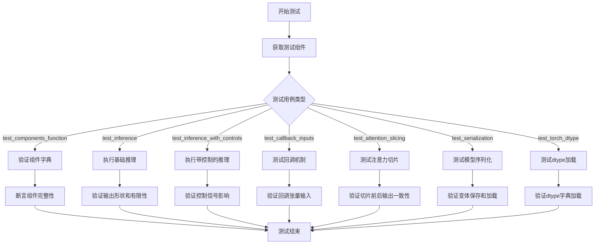

## 类结构

```
PipelineTesterMixin (测试混入类)
└── Cosmos2_5_TransferPipelineFastTests (测试用例类)
    └── Cosmos2_5_TransferWrapper (管道包装类)
        └── Cosmos2_5_TransferPipeline (基础管道类)
            └── DiffusersPipelineBase (隐式基类)
```

## 全局变量及字段


### `enable_full_determinism`
    
启用完全确定性测试的辅助函数，来自testing_utils模块

类型：`function`
    


### `Cosmos2_5_TransferPipelineFastTests.pipeline_class`
    
指定测试使用的管道类，即Cosmos2_5_TransferWrapper

类型：`type`
    


### `Cosmos2_5_TransferPipelineFastTests.params`
    
文本到图像管道调用参数集合，不包含cross_attention_kwargs

类型：`frozenset`
    


### `Cosmos2_5_TransferPipelineFastTests.batch_params`
    
批量推理参数集合，用于批量测试

类型：`set`
    


### `Cosmos2_5_TransferPipelineFastTests.image_params`
    
图像参数集合，用于图像相关测试

类型：`set`
    


### `Cosmos2_5_TransferPipelineFastTests.image_latents_params`
    
图像潜在向量参数集合，用于潜在向量相关测试

类型：`set`
    


### `Cosmos2_5_TransferPipelineFastTests.required_optional_params`
    
必需的可选参数集合，包含非必须但常用的参数

类型：`frozenset`
    


### `Cosmos2_5_TransferPipelineFastTests.supports_dduf`
    
标志位，表示管道是否支持DDUF（Decoupled Diffusion Upsampling Flow）

类型：`bool`
    


### `Cosmos2_5_TransferPipelineFastTests.test_xformers_attention`
    
标志位，指示是否测试xformers注意力机制

类型：`bool`
    


### `Cosmos2_5_TransferPipelineFastTests.test_layerwise_casting`
    
标志位，指示是否测试逐层类型转换功能

类型：`bool`
    


### `Cosmos2_5_TransferPipelineFastTests.test_group_offloading`
    
标志位，指示是否测试组卸载功能

类型：`bool`
    
    

## 全局函数及方法


### `Cosmos2_5_TransferWrapper.from_pretrained`

该方法是一个静态工厂方法，包装了 `Cosmos2_5_TransferPipeline.from_pretrained` 的加载逻辑。它在加载过程中自动注入一个虚拟的安全检查器（`DummyCosmosSafetyChecker`），以避免测试环境中需要加载庞大且缓慢的 Cosmos Guardrail 模型，同时支持将安全检查器移动到指定设备并转换数据类型。

参数：

- `*args`：可变位置参数，直接传递给父类 `Cosmos2_5_TransferPipeline.from_pretrained`，通常包含模型路径等位置参数
- `**kwargs`：可变关键字参数，直接传递给父类，包含模型加载的各种配置选项（如 `pretrained_model_name_or_path`、`torch_dtype`、`device_map` 等）

返回值：`Cosmos2_5_TransferPipeline`，返回已加载的 Cosmos 2.5 转换管道实例，包含自动配置的安全检查器组件

#### 流程图

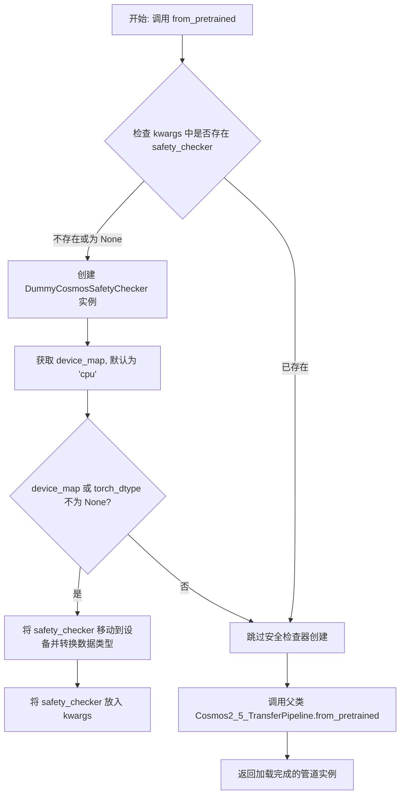

#### 带注释源码

```python
@staticmethod
def from_pretrained(*args, **kwargs):
    """
    从预训练模型加载 Cosmos2_5_TransferPipeline，并自动处理安全检查器的配置。
    
    该方法覆盖了父类的 from_pretrained 方法，添加了自动创建虚拟安全检查器的逻辑，
    以避免在测试环境中加载庞大且缓慢的 Cosmos Guardrail 模型。
    
    参数:
        *args: 可变位置参数，直接传递给父类的 from_pretrained 方法。
        **kwargs: 可变关键字参数，直接传递给父类的 from_pretrained 方法。
                 特别地，该方法会检查并处理 'safety_checker'、'device_map' 和 'torch_dtype' 参数。
    
    返回值:
        Cosmos2_5_TransferPipeline: 加载完成的管道实例，包含自动配置的安全检查器。
    """
    # 检查是否未提供 safety_checker 或显式设置为 None
    if "safety_checker" not in kwargs or kwargs["safety_checker"] is None:
        # 创建一个虚拟的安全检查器，用于测试环境
        safety_checker = DummyCosmosSafetyChecker()
        
        # 获取设备映射配置，默认为 'cpu' 设备
        device_map = kwargs.get("device_map", "cpu")
        
        # 获取 torch 数据类型配置
        torch_dtype = kwargs.get("torch_dtype")
        
        # 如果指定了设备映射或数据类型，则将安全检查器移动到目标设备
        if device_map is not None or torch_dtype is not None:
            safety_checker = safety_checker.to(device_map, dtype=torch_dtype)
        
        # 将配置好的安全检查器放入 kwargs，传递给父类方法
        kwargs["safety_checker"] = safety_checker
    
    # 调用父类的 from_pretrained 方法完成模型加载
    return Cosmos2_5_TransferPipeline.from_pretrained(*args, **kwargs)
```


### `Cosmos2_5_TransferPipelineFastTests.get_dummy_components`

该方法用于生成虚拟（dummy）组件字典，为 Cosmos2.5 迁移管道的测试提供各种模型组件的初始化配置，包括 Transformer、ControlNet、VAE、调度器、文本编码器和安全检查器等。

参数：无（仅包含隐式 `self` 参数）

返回值：`Dict[str, Any]`，返回一个包含所有管道组件的字典，用于初始化测试管道

#### 流程图

```mermaid
flowchart TD
    A[开始 get_dummy_components] --> B[设置随机种子 torch.manual_seed(0)]
    B --> C[创建 CosmosTransformer3DModel 虚拟组件]
    C --> D[设置随机种子 torch.manual_seed(0)]
    D --> E[创建 CosmosControlNetModel 虚拟组件]
    E --> F[设置随机种子 torch.manual_seed(0)]
    F --> G[创建 AutoencoderKLWan 虚拟组件]
    G --> H[设置随机种子 torch.manual_seed(0)]
    H --> I[创建 UniPCMultistepScheduler 虚拟组件]
    I --> J[设置随机种子 torch.manual_seed(0)]
    J --> K[创建 Qwen2_5_VLConfig 配置对象]
    K --> L[使用配置创建 Qwen2_5_VLForConditionalGeneration]
    L --> M[从预训练模型加载 Qwen2Tokenizer]
    M --> N[组装 components 字典]
    N --> O[返回 components 字典]
```

#### 带注释源码

```python
def get_dummy_components(self):
    """
    生成用于测试的虚拟组件字典。
    包含 Cosmos2.5 Transfer Pipeline 所有必需的模型组件。
    """
    # 设置随机种子以确保可重复性
    torch.manual_seed(0)
    
    # 1. 创建 Transformer 模型（支持 img_context 用于 Transfer2.5）
    # 配置参数：
    # - in_channels=16 + 1: 输入通道数（16 + 1 表示含掩码通道）
    # - out_channels=16: 输出通道数
    # - num_attention_heads=2: 注意力头数
    # - attention_head_dim=16: 注意力头维度
    # - num_layers=2: Transformer 层数
    # - mlp_ratio=2: MLP 扩展比率
    # - text_embed_dim=32: 文本嵌入维度
    # - adaln_lora_dim=4: AdaLN LoRA 维度
    # - max_size=(4, 32, 32): 最大尺寸（帧数 x 高度 x 宽度）
    # - patch_size=(1, 2, 2): 分块大小
    # - img_context_dim_in=32: 输入图像上下文维度
    # - img_context_num_tokens=4: 图像上下文 token 数量
    # - img_context_dim_out=32: 输出图像上下文维度
    transformer = CosmosTransformer3DModel(
        in_channels=16 + 1,
        out_channels=16,
        num_attention_heads=2,
        attention_head_dim=16,
        num_layers=2,
        mlp_ratio=2,
        text_embed_dim=32,
        adaln_lora_dim=4,
        max_size=(4, 32, 32),
        patch_size=(1, 2, 2),
        rope_scale=(2.0, 1.0, 1.0),
        concat_padding_mask=True,
        extra_pos_embed_type="learnable",
        controlnet_block_every_n=1,
        img_context_dim_in=32,
        img_context_num_tokens=4,
        img_context_dim_out=32,
    )

    # 重置随机种子
    torch.manual_seed(0)
    
    # 2. 创建 ControlNet 模型
    # 用于提供额外的控制信号
    # 参数说明：
    # - n_controlnet_blocks=2: ControlNet 块数量
    # - in_channels=16 + 1 + 1: 控制潜在变量通道 + 条件掩码 + 填充掩码
    # - latent_channels=18: 基础潜在变量通道（16）+ 条件掩码（1）+ 填充掩码（1）
    controlnet = CosmosControlNetModel(
        n_controlnet_blocks=2,
        in_channels=16 + 1 + 1,
        latent_channels=16 + 1 + 1,
        model_channels=32,
        num_attention_heads=2,
        attention_head_dim=16,
        mlp_ratio=2,
        text_embed_dim=32,
        adaln_lora_dim=4,
        patch_size=(1, 2, 2),
        max_size=(4, 32, 32),
        rope_scale=(2.0, 1.0, 1.0),
        extra_pos_embed_type="learnable",
        img_context_dim_in=32,
        img_context_dim_out=32,
        use_crossattn_projection=False,
    )

    torch.manual_seed(0)
    
    # 3. 创建 VAE（变分自编码器）用于图像/视频编码解码
    # 参数说明：
    # - base_dim=3: 基础维度（RGB 3通道）
    # - z_dim=16: 潜在空间维度
    # - dim_mult=[1, 1, 1, 1]: 各层维度倍数
    # - num_res_blocks=1: 残差块数量
    # - temperal_downsample=[False, True, True]: 时间维度下采样配置
    vae = AutoencoderKLWan(
        base_dim=3,
        z_dim=16,
        dim_mult=[1, 1, 1, 1],
        num_res_blocks=1,
        temperal_downsample=[False, True, True],
    )

    torch.manual_seed(0)
    
    # 4. 创建调度器（Scheduler）
    # 用于控制去噪过程中的噪声调度
    scheduler = UniPCMultistepScheduler()

    torch.manual_seed(0)
    
    # 5. 创建文本编码器配置和模型
    # 使用 Qwen2.5-VL 架构
    config = Qwen2_5_VLConfig(
        text_config={
            "hidden_size": 16,
            "intermediate_size": 16,
            "num_hidden_layers": 2,
            "num_attention_heads": 2,
            "num_key_value_heads": 2,
            "rope_scaling": {
                "mrope_section": [1, 1, 2],
                "rope_type": "default",
                "type": "default",
            },
            "rope_theta": 1000000.0,
        },
        vision_config={
            "depth": 2,
            "hidden_size": 16,
            "intermediate_size": 16,
            "num_heads": 2,
            "out_hidden_size": 16,
        },
        hidden_size=16,
        vocab_size=152064,
        vision_end_token_id=151653,
        vision_start_token_id=151652,
        vision_token_id=151654,
    )
    text_encoder = Qwen2_5_VLForConditionalGeneration(config)
    
    # 6. 创建分词器（Tokenizer）
    # 用于将文本转换为 token
    tokenizer = Qwen2Tokenizer.from_pretrained("hf-internal-testing/tiny-random-Qwen2VLForConditionalGeneration")

    # 7. 组装所有组件到字典中
    components = {
        "transformer": transformer,          # 3D 变换器模型
        "controlnet": controlnet,             # ControlNet 控制模型
        "vae": vae,                           # 变分自编码器
        "scheduler": scheduler,               # 去噪调度器
        "text_encoder": text_encoder,         # 文本编码器
        "tokenizer": tokenizer,               # 文本分词器
        "safety_checker": DummyCosmosSafetyChecker(),  # 安全检查器
    }
    
    # 返回组件字典供管道初始化使用
    return components
```


### `Cosmos2_5_TransferPipelineFastTests.get_dummy_inputs`

该方法是一个测试辅助函数，用于为 Cosmos2_5_TransferPipeline 生成虚拟输入参数。它根据设备类型创建随机生成器，并返回一个包含图像/视频生成所需所有参数的字典，包括提示词、负提示词、推理步数、引导系数、分辨率、帧数等。

参数：

- `device`：设备参数，用于确定创建生成器的设备类型（虽然方法体内未直接使用，但用于区分 MPS 设备）
- `seed`：整数，默认值为 0，用于设置随机种子以确保测试可重复性

返回值：`dict`，包含以下键值对的字典：
- `prompt`：str，正向提示词
- `negative_prompt`：str，负向提示词
- `generator`：torch.Generator 或 None，随机生成器
- `num_inference_steps`：int，推理步数
- `guidance_scale`：float，引导系数
- `height`：int，生成图像高度
- `width`：int，生成图像宽度
- `num_frames`：int，生成帧数（用于视频生成）
- `max_sequence_length`：int，最大序列长度
- `output_type`：str，输出类型

#### 流程图

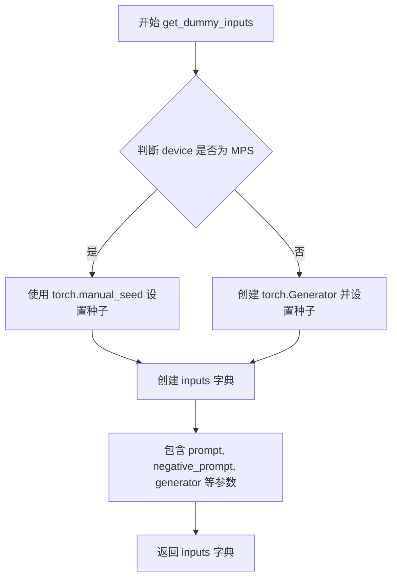

#### 带注释源码

```python
def get_dummy_inputs(self, device, seed=0):
    """
    生成用于测试的虚拟输入参数。
    
    参数:
        device: 目标设备，用于判断是否需要特殊的生成器处理
        seed: 随机种子，默认值为 0
    
    返回:
        包含图像/视频生成所需参数的字典
    """
    # 判断设备是否为 Apple MPS (Metal Performance Shaders)
    # MPS 设备需要特殊处理，不能使用 torch.Generator
    if str(device).startswith("mps"):
        # 对于 MPS 设备，直接使用 CPU 随机种子
        generator = torch.manual_seed(seed)
    else:
        # 对于其他设备（CPU/CUDA），创建带种子的生成器
        # 确保不同设备的测试可重复性
        generator = torch.Generator(device=device).manual_seed(seed)

    # 构建完整的虚拟输入参数字典
    inputs = {
        "prompt": "dance monkey",              # 正向提示词
        "negative_prompt": "bad quality",      # 负向提示词，用于引导模型避免生成低质量内容
        "generator": generator,                # 随机生成器，确保可重复性
        "num_inference_steps": 2,              # 推理步数，值越小生成越快但质量可能降低
        "guidance_scale": 3.0,                 # CFG 引导系数，控制生成结果与提示词的相关性
        "height": 32,                          # 输出高度（像素）
        "width": 32,                           # 输出宽度（像素）
        "num_frames": 3,                       # 生成帧数，用于视频生成场景
        "max_sequence_length": 16,            # 文本序列最大长度
        "output_type": "pt",                   # 输出类型，"pt" 表示 PyTorch 张量
    }

    return inputs
```


### `Cosmos2_5_TransferPipelineFastTests.test_components_function`

该测试方法用于验证 `Cosmos2_5_TransferPipeline` 在实例化后是否正确创建了 `components` 属性，并确保该属性包含所有必要的组件（如 transformer、controlnet、vae 等），同时组件键与初始化时传入的键集合保持一致。

参数：

- `self`：`Cosmos2_5_TransferPipelineFastTests` 实例本身，无需显式传递

返回值：`None`，该方法为单元测试方法，通过 `self.assertTrue` 断言验证组件初始化是否符合预期，若失败则抛出 `AssertionError`

#### 流程图

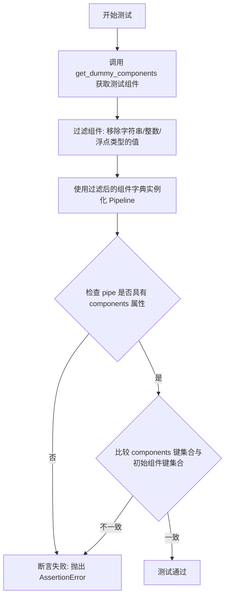

#### 带注释源码

```python
def test_components_function(self):
    """
    测试 Cosmos2_5_TransferPipeline 是否正确初始化 components 属性。
    
    该测试方法验证以下两点：
    1. Pipeline 实例具有 'components' 属性
    2. components 字典的键与初始化时传入的组件键完全一致
    """
    # 步骤1: 获取虚拟组件配置
    # get_dummy_components() 方法返回一个包含所有必要组件的字典
    # 包括: transformer, controlnet, vae, scheduler, text_encoder, tokenizer, safety_checker
    init_components = self.get_dummy_components()
    
    # 步骤2: 过滤掉原始类型值
    # 仅保留 PyTorch 模块对象(如 nn.Module)或复杂对象
    # 移除字符串、整数、浮点数等原始类型，这些不是有效的组件
    init_components = {k: v for k, v in init_components.items() if not isinstance(v, (str, int, float))}
    
    # 步骤3: 使用组件字典实例化 Pipeline
    # pipeline_class 实际上是 Cosmos2_5_TransferWrapper
    # 该类继承自 Cosmos2_5_TransferPipeline
    pipe = self.pipeline_class(**init_components)
    
    # 步骤4: 断言验证
    # 验证1: 检查 pipeline 对象是否具有 'components' 属性
    self.assertTrue(hasattr(pipe, "components"))
    
    # 验证2: 检查 components 字典的键集合是否与初始化时的键集合完全相同
    # 使用 set 比较以忽略顺序差异
    self.assertTrue(set(pipe.components.keys()) == set(init_components.keys()))
```


### `Cosmos2_5_TransferPipelineFastTests.test_inference`

这是一个单元测试方法，用于验证 Cosmos2_5_TransferPipeline（Cosmos 2.5 视频传输管道）的推理功能能否正确生成视频帧，并检查输出形状和数值有效性。

参数：

- `self`：测试类实例本身，无需显式传递

返回值：`None`，该方法为 `unittest.TestCase` 的测试方法，通过断言验证结果，不返回具体值

#### 流程图

```mermaid
flowchart TD
    A[开始 test_inference 测试] --> B[设置 device = 'cpu']
    B --> C[调用 get_dummy_components 获取虚拟组件]
    C --> D[使用虚拟组件创建 Cosmos2_5_TransferWrapper 管道实例]
    D --> E[将管道移动到指定设备]
    E --> F[设置进度条配置 disable=None]
    F --> G[调用 get_dummy_inputs 获取虚拟输入]
    G --> H[执行管道推理: pipe.__call__(**inputs)]
    H --> I[获取生成的视频帧: video.frames]
    I --> J[提取第一帧: generated_video = video[0]]
    J --> K{断言验证}
    K --> L[验证形状为 (3, 3, 32, 32)]
    K --> M[验证所有值为有限数 torch.isfinite]
    L --> N[测试通过]
    M --> N
    N --> O[结束测试]
```

#### 带注释源码

```python
def test_inference(self):
    """
    测试 Cosmos2_5_TransferPipeline 的推理功能。
    验证管道能够根据文本提示生成视频，并检查输出形状和数值有效性。
    """
    # 1. 设置测试设备为 CPU
    device = "cpu"

    # 2. 获取虚拟组件（用于测试的模拟模型组件）
    # 包含: transformer, controlnet, vae, scheduler, text_encoder, tokenizer, safety_checker
    components = self.get_dummy_components()
    
    # 3. 使用虚拟组件实例化管道
    # Cosmos2_5_TransferWrapper 继承自 Cosmos2_5_TransferPipeline
    # 包装类会自动添加 DummyCosmosSafetyChecker 如果未提供
    pipe = self.pipeline_class(**components)
    
    # 4. 将管道移动到指定设备（CPU）
    pipe.to(device)
    
    # 5. 配置进度条（disable=None 表示启用进度条）
    pipe.set_progress_bar_config(disable=None)

    # 6. 获取虚拟输入参数
    # 包含: prompt, negative_prompt, generator, num_inference_steps 等
    inputs = self.get_dummy_inputs(device)
    
    # 7. 执行管道推理
    # 调用管道的 __call__ 方法进行文本到视频生成
    # 返回 PipelineOutput 对象，包含 frames 属性
    video = pipe(**inputs).frames
    
    # 8. 获取生成的视频（取第一个样本，因为支持批处理）
    generated_video = video[0]
    
    # 9. 断言验证 - 检查输出形状
    # 期望形状: (num_frames=3, channels=3, height=32, width=32)
    self.assertEqual(generated_video.shape, (3, 3, 32, 32))
    
    # 10. 断言验证 - 检查数值有效性
    # 确保所有输出值都是有限数（不是 NaN 或 Inf）
    self.assertTrue(torch.isfinite(generated_video).all())
```


### `Cosmos2_5_TransferPipelineFastTests.test_inference_with_controls`

该方法用于测试 Cosmos2_5_TransferPipeline 在有 ControlNet 控制输入情况下的推理功能。测试创建一个包含虚拟组件的管道，添加控制信号（controls）和控制尺度（controls_conditioning_scale），然后执行推理并验证生成的视频帧形状和数值有效性。

参数：

- `self`：`Cosmos2_5_TransferPipelineFastTests`，测试类实例，隐含参数

返回值：`None`，无返回值（测试方法通过断言验证结果）

#### 流程图

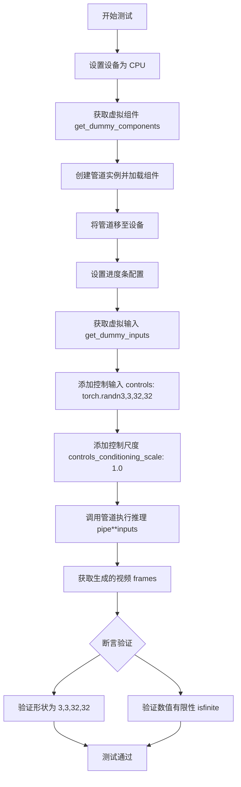

#### 带注释源码

```python
def test_inference_with_controls(self):
    """Test inference with control inputs (ControlNet)."""
    # 1. 设置测试设备为 CPU
    device = "cpu"

    # 2. 获取虚拟组件（transformer, controlnet, vae, scheduler, text_encoder, tokenizer, safety_checker）
    components = self.get_dummy_components()
    
    # 3. 使用虚拟组件创建 Cosmos2_5_TransferPipeline 管道实例
    pipe = self.pipeline_class(**components)
    
    # 4. 将管道移至指定设备（CPU）
    pipe.to(device)
    
    # 5. 配置进度条（disable=None 表示不禁用进度条）
    pipe.set_progress_bar_config(disable=None)

    # 6. 获取虚拟输入参数（包含 prompt, negative_prompt, generator, num_inference_steps 等）
    inputs = self.get_dummy_inputs(device)
    
    # 7. 添加控制视频输入 - 这是一个 ControlNet 控制信号
    # 形状说明：num_frames=3, channels=3, height=32, width=32
    inputs["controls"] = [torch.randn(3, 3, 32, 32)]
    
    # 8. 添加控制条件尺度，用于控制 ControlNet 对生成结果的影响程度
    inputs["controls_conditioning_scale"] = 1.0

    # 9. 执行管道推理，返回包含 frames 的结果对象
    video = pipe(**inputs).frames
    
    # 10. 获取第一个生成的视频（因为 frames 通常是一个列表）
    generated_video = video[0]
    
    # 11. 断言验证生成的视频形状为 (3, 3, 32, 32)
    # 即：num_frames=3, channels=3, height=32, width=32
    self.assertEqual(generated_video.shape, (3, 3, 32, 32))
    
    # 12. 断言验证生成的所有数值都是有限的（不是 NaN 或 Inf）
    self.assertTrue(torch.isfinite(generated_video).all())
```


### `Cosmos2_5_TransferPipelineFastTests.test_callback_inputs`

该测试方法验证 Cosmos2_5_TransferPipeline 的回调机制是否正确工作，包括回调张量输入的验证、子集与完整集的检查，以及在推理过程中通过回调修改张量的能力。

参数：

- `self`：`Cosmos2_5_TransferPipelineFastTests`，测试类实例本身

返回值：`None`，该方法为单元测试方法，通过 assert 语句验证管道回调功能，不返回任何值

#### 流程图

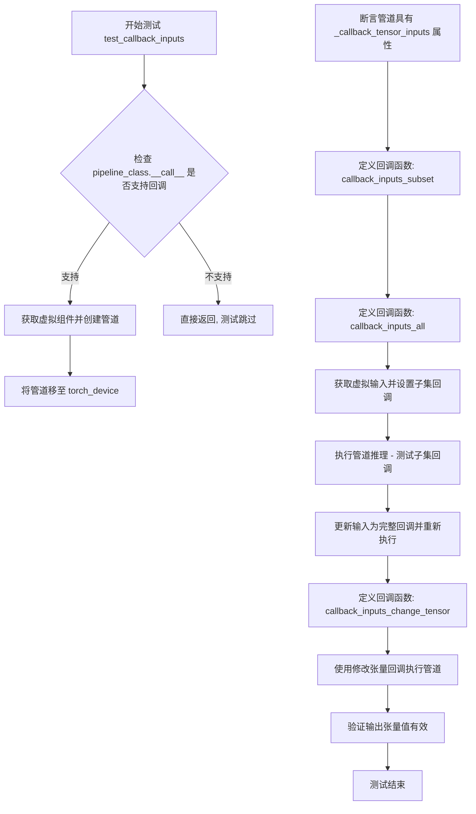

#### 带注释源码

```python
def test_callback_inputs(self):
    """
    测试 Cosmos2_5_TransferPipeline 的回调机制是否正确工作。
    验证 callback_on_step_end 和 callback_on_step_end_tensor_inputs 参数功能。
    """
    # 获取管道 __call__ 方法的签名
    sig = inspect.signature(self.pipeline_class.__call__)
    # 检查是否支持回调张量输入参数
    has_callback_tensor_inputs = "callback_on_step_end_tensor_inputs" in sig.parameters
    # 检查是否支持回调函数参数
    has_callback_step_end = "callback_on_step_end" in sig.parameters

    # 如果管道不支持回调功能，则直接返回（跳过测试）
    if not (has_callback_tensor_inputs and has_callback_step_end):
        return

    # 获取虚拟组件用于测试
    components = self.get_dummy_components()
    # 使用虚拟组件创建管道实例
    pipe = self.pipeline_class(**components)
    # 将管道移至测试设备（CPU或GPU）
    pipe = pipe.to(torch_device)
    # 设置进度条配置（disable=None 表示启用进度条）
    pipe.set_progress_bar_config(disable=None)
    
    # 断言管道具有 _callback_tensor_inputs 属性
    # 该属性定义了回调函数可用的张量变量列表
    self.assertTrue(
        hasattr(pipe, "_callback_tensor_inputs"),
        f" {self.pipeline_class} should have `_callback_tensor_inputs` that defines a list of tensor variables its callback function can use as inputs",
    )

    # 定义回调函数：验证回调输入是管道定义的回调张量的子集
    def callback_inputs_subset(pipe, i, t, callback_kwargs):
        """检查回调参数中的张量名都是管道允许的回调张量"""
        for tensor_name in callback_kwargs.keys():
            assert tensor_name in pipe._callback_tensor_inputs
        return callback_kwargs

    # 定义回调函数：验证回调输入与管道定义的回调张量完全一致
    def callback_inputs_all(pipe, i, t, callback_kwargs):
        """检查管道定义的回调张量与回调参数中的张量名完全匹配"""
        for tensor_name in pipe._callback_tensor_inputs:
            assert tensor_name in callback_kwargs
        for tensor_name in callback_kwargs.keys():
            assert tensor_name in pipe._callback_tensor_inputs
        return callback_kwargs

    # 获取虚拟输入参数
    inputs = self.get_dummy_inputs(torch_device)

    # 设置子集回调：只使用 ["latents"] 作为回调张量输入
    inputs["callback_on_step_end"] = callback_inputs_subset
    inputs["callback_on_step_end_tensor_inputs"] = ["latents"]
    # 执行管道推理，测试子集回调功能
    _ = pipe(**inputs)[0]

    # 更新输入：使用完整的回调张量列表
    inputs["callback_on_step_end"] = callback_inputs_all
    inputs["callback_on_step_end_tensor_inputs"] = pipe._callback_tensor_inputs
    # 再次执行管道推理，测试完整回调功能
    _ = pipe(**inputs)[0]

    # 定义回调函数：在最后一步将 latents 修改为零张量
    def callback_inputs_change_tensor(pipe, i, t, callback_kwargs):
        """在推理最后一步修改 latents 为零张量"""
        is_last = i == (pipe.num_timesteps - 1)
        if is_last:
            # 将 latents 替换为全零张量
            callback_kwargs["latents"] = torch.zeros_like(callback_kwargs["latents"])
        return callback_kwargs

    # 使用修改张量的回调执行管道
    inputs["callback_on_step_end"] = callback_inputs_change_tensor
    inputs["callback_on_step_end_tensor_inputs"] = pipe._callback_tensor_inputs
    # 获取输出
    output = pipe(**inputs)[0]
    # 验证输出张量的绝对值总和小于阈值（确保修改生效且数值稳定）
    assert output.abs().sum() < 1e10
```


### `Cosmos2_5_TransferPipelineFastTests.test_inference_batch_single_identical`

该方法是一个单元测试函数，用于验证当批处理大小为2时，批处理推理的结果与单样本推理的结果保持数值一致性（最大允许差异为1e-2）。

参数：

- `self`：`Cosmos2_5_TransferPipelineFastTests`，测试类实例本身，隐式参数

返回值：`None`，该测试方法不返回任何值，仅通过断言验证结果一致性

#### 流程图

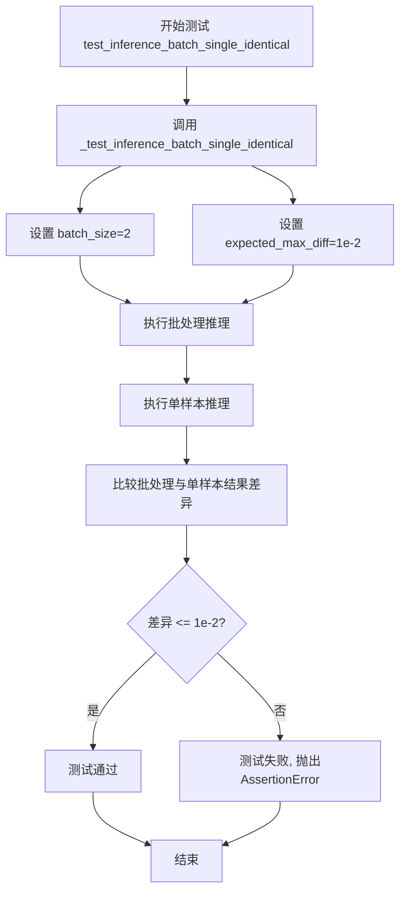

#### 带注释源码

```python
def test_inference_batch_single_identical(self):
    """
    测试批处理推理结果与单样本推理结果的一致性。
    
    该测试方法验证当使用相同的输入和随机种子时，
    批处理推理（batch_size=2）产生的每个样本结果应与
    单样本推理的结果保持数值一致性。
    
    用途：
        - 确保管道在批处理模式下不会引入额外的数值误差
        - 验证批处理实现的正确性
    """
    # 调用父类/混合类中的通用批处理一致性测试方法
    # 参数:
    #   batch_size=2: 使用2个样本进行批处理测试
    #   expected_max_diff=1e-2: 允许的最大数值差异阈值
    self._test_inference_batch_single_identical(batch_size=2, expected_max_diff=1e-2)
```


### `Cosmos2_5_TransferPipelineFastTests.test_attention_slicing_forward_pass`

该方法用于测试注意力切片（Attention Slicing）功能是否正确实现，确保启用注意力切片后不会影响推理结果的质量。通过对比无切片、slice_size=1 和 slice_size=2 三种情况下的输出差异，验证注意力切片前后的一致性。

参数：

- `self`：`Cosmos2_5_TransferPipelineFastTests`，测试类实例本身
- `test_max_difference`：`bool`，默认为 `True`，是否测试最大像素差异
- `test_mean_pixel_difference`：`bool`，默认为 `True`，是否测试平均像素差异（当前未使用）
- `expected_max_diff`：`float`，默认为 `1e-3`，允许的最大差异阈值

返回值：`None`，该方法为单元测试方法，通过断言验证结果，无显式返回值

#### 流程图

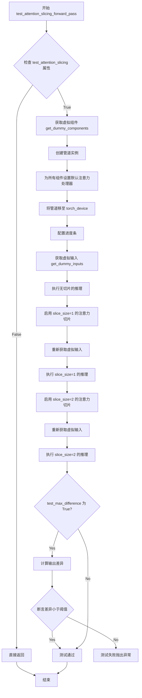

#### 带注释源码

```python
def test_attention_slicing_forward_pass(
    self, test_max_difference=True, test_mean_pixel_difference=True, expected_max_diff=1e-3
):
    """
    测试注意力切片功能的前向传播是否正确。
    
    参数:
        test_max_difference: bool, 是否测试最大像素差异
        test_mean_pixel_difference: bool, 是否测试平均像素差异(当前未使用)
        expected_max_diff: float, 允许的最大差异阈值,默认为1e-3
    """
    # 如果 test_attention_slicing 属性为 False 或不存在,则跳过测试
    if not getattr(self, "test_attention_slicing", True):
        return

    # 步骤1: 获取虚拟组件(模型、调度器、VAE等)
    components = self.get_dummy_components()
    
    # 步骤2: 使用虚拟组件创建管道实例
    pipe = self.pipeline_class(**components)
    
    # 步骤3: 为所有可用的组件设置默认的注意力处理器
    # 这确保在测试注意力切片之前,所有组件都使用标准注意力机制
    for component in pipe.components.values():
        if hasattr(component, "set_default_attn_processor"):
            component.set_default_attn_processor()
    
    # 步骤4: 将管道移至指定的计算设备(如CPU/CUDA)
    pipe.to(torch_device)
    
    # 步骤5: 配置进度条(参数为None表示使用默认设置)
    pipe.set_progress_bar_config(disable=None)

    # 步骤6: 准备测试输入
    generator_device = "cpu"
    inputs = self.get_dummy_inputs(generator_device)
    
    # 步骤7: 执行无注意力切片的推理,作为基准输出
    output_without_slicing = pipe(**inputs)[0]

    # 步骤8: 启用注意力切片,slice_size=1 表示每个token单独计算注意力
    pipe.enable_attention_slicing(slice_size=1)
    
    # 重新获取输入以确保随机种子等因素一致
    inputs = self.get_dummy_inputs(generator_device)
    
    # 步骤9: 执行 slice_size=1 的推理
    output_with_slicing1 = pipe(**inputs)[0]

    # 步骤10: 启用注意力切片,slice_size=2 表示每2个token一组计算注意力
    pipe.enable_attention_slicing(slice_size=2)
    
    # 重新获取输入
    inputs = self.get_dummy_inputs(generator_device)
    
    # 步骤11: 执行 slice_size=2 的推理
    output_with_slicing2 = pipe(**inputs)[0]

    # 步骤12: 如果启用最大差异测试,则比较输出
    if test_max_difference:
        # 计算 slice_size=1 与无切片的差异
        max_diff1 = np.abs(to_np(output_with_slicing1) - to_np(output_without_slicing)).max()
        
        # 计算 slice_size=2 与无切片的差异
        max_diff2 = np.abs(to_np(output_with_slicing2) - to_np(output_without_slicing)).max()
        
        # 断言:两种切片方式的输出与无切片输出的差异都应该小于阈值
        # 注意:由于注意力切片的实现方式,理论上应该完全一致,但可能存在数值精度差异
        self.assertLess(
            max(max_diff1, max_diff2),
            expected_max_diff,
            "Attention slicing should not affect the inference results"
        )
```


### `Cosmos2_5_TransferPipelineFastTests.test_serialization_with_variants`

该方法是一个单元测试函数，用于测试 Cosmos2_5_TransferPipeline 管道在使用不同变体（如 fp16）进行序列化时的正确性。测试会验证管道组件能够正确保存为指定变体的模型格式，并确保 model_index.json 配置正确映射各个子组件。

参数：

- `self`：隐式参数，`Cosmos2_5_TransferPipelineFastTests` 类的实例，表示当前测试对象

返回值：`None`，该方法通过断言进行验证，不返回任何值

#### 流程图

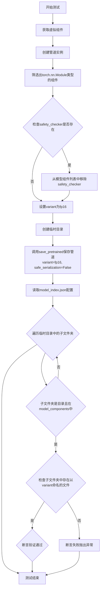

#### 带注释源码

```python
def test_serialization_with_variants(self):
    """
    测试管道在使用不同变体（如fp16）序列化时的正确性。
    验证保存的模型文件是否符合指定的variant格式。
    """
    # 步骤1: 获取预定义的虚拟组件（transformer, controlnet, vae, scheduler等）
    components = self.get_dummy_components()
    
    # 步骤2: 使用虚拟组件创建管道实例
    pipe = self.pipeline_class(**components)
    
    # 步骤3: 筛选出所有torch.nn.Module类型的组件名称
    # 这些组件会被保存为标准的diffusers模型格式
    model_components = [
        component_name
        for component_name, component in pipe.components.items()
        if isinstance(component, torch.nn.Module)
    ]
    
    # 步骤4: 从模型组件列表中移除safety_checker
    # 因为safety_checker不是标准的diffusers模型组件，保存格式不同
    if "safety_checker" in model_components:
        model_components.remove("safety_checker")
    
    # 步骤5: 设置要测试的变体类型为fp16
    variant = "fp16"

    # 步骤6: 使用临时目录进行测试
    with tempfile.TemporaryDirectory() as tmpdir:
        # 步骤7: 保存管道到指定目录，使用fp16变体，不使用安全序列化
        pipe.save_pretrained(tmpdir, variant=variant, safe_serialization=False)

        # 步骤8: 读取保存的model_index.json配置文件
        with open(f"{tmpdir}/model_index.json", "r") as f:
            config = json.load(f)

        # 步骤9: 验证每个模型组件子文件夹及其文件命名
        for subfolder in os.listdir(tmpdir):
            # 只处理目录（不是文件）且在model_components中的子文件夹
            if not os.path.isfile(subfolder) and subfolder in model_components:
                folder_path = os.path.join(tmpdir, subfolder)
                # 验证子文件夹是真实目录且在config中存在
                is_folder = os.path.isdir(folder_path) and subfolder in config
                # 验证该文件夹中至少有一个文件以variant（fp16）开头命名
                assert is_folder and any(p.split(".")[1].startswith(variant) for p in os.listdir(folder_path))
```


### `Cosmos2_5_TransferPipelineFastTests.test_torch_dtype_dict`

该测试方法用于验证管道能否正确加载带有 torch dtype 字典配置的不同组件。它将管道保存到临时目录，然后使用指定的 `torch_dtype_dict` 重新加载，并验证每个组件是否具有预期的 dtype。

参数：

- `self`：测试用例实例（隐式参数）

返回值：`None`，测试方法不返回值，使用断言验证行为

#### 流程图

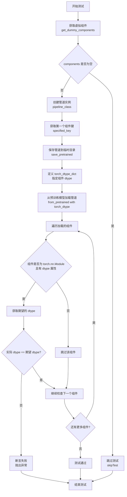

#### 带注释源码

```python
def test_torch_dtype_dict(self):
    """
    测试管道能否使用 torch_dtype_dict 字典加载不同组件的 dtype。
    
    该测试验证:
    1. 管道可以正确保存到磁盘
    2. 管道可以使用自定义的 dtype 字典从磁盘加载
    3. 每个组件的 dtype 与 torch_dtype_dict 中指定的一致
    """
    # 步骤1: 获取虚拟组件（用于测试的模拟组件）
    components = self.get_dummy_components()
    
    # 步骤2: 检查组件是否定义
    if not components:
        self.skipTest("No dummy components defined.")
    
    # 步骤3: 使用虚拟组件创建管道实例
    pipe = self.pipeline_class(**components)
    
    # 步骤4: 获取第一个组件键，用于在 torch_dtype_dict 中指定
    specified_key = next(iter(components.keys()))
    
    # 创建临时目录用于保存和加载管道
    with tempfile.TemporaryDirectory(ignore_cleanup_errors=True) as tmpdirname:
        # 步骤5: 将管道保存到临时目录（不使用安全序列化）
        pipe.save_pretrained(tmpdirname, safe_serialization=False)
        
        # 步骤6: 定义 torch_dtype_dict
        # - specified_key: 使用 bfloat16
        # - "default": 其他未明确指定的组件使用 float16
        torch_dtype_dict = {specified_key: torch.bfloat16, "default": torch.float16}
        
        # 步骤7: 从预训练模型加载管道，传入 torch_dtype_dict
        # 同时传入 DummyCosmosSafetyChecker 以避免安全检查器相关问题
        loaded_pipe = self.pipeline_class.from_pretrained(
            tmpdirname, 
            safety_checker=DummyCosmosSafetyChecker(), 
            torch_dtype=torch_dtype_dict
        )
    
    # 步骤8: 遍历加载的管道中的所有组件，验证 dtype
    for name, component in loaded_pipe.components.items():
        # 跳过 safety_checker（特殊处理）
        if name == "safety_checker":
            continue
        
        # 仅检查 torch.nn.Module 类型且有 dtype 属性的组件
        if isinstance(component, torch.nn.Module) and hasattr(component, "dtype"):
            # 获取期望的 dtype：
            # - 首先查找组件名称对应的 dtype
            # - 如果没找到，使用 "default" 指定的 dtype
            # - 如果 "default" 也没有指定，默认使用 float32
            expected_dtype = torch_dtype_dict.get(name, torch_dtype_dict.get("default", torch.float32))
            
            # 步骤9: 断言组件的实际 dtype 与期望 dtype 一致
            self.assertEqual(
                component.dtype,
                expected_dtype,
                f"Component '{name}' has dtype {component.dtype} but expected {expected_dtype}",
            )
```

#### 关键实现细节

| 项目 | 描述 |
|------|------|
| **测试目标** | 验证 `torch_dtype_dict` 参数在 `from_pretrained` 中正确应用不同 dtype 到不同组件 |
| **测试策略** | 保存-加载模式：先保存管道，然后使用指定 dtype 加载，验证结果 |
| **dtype 查找逻辑** | 1. 先查找组件名作为键<br>2. 如无则查找 "default" 键<br>3. 如无则默认使用 `torch.float32` |
| **跳过条件** | - `safety_checker` 组件（特殊处理）<br>- 非 `torch.nn.Module` 类型<br>- 无 `dtype` 属性的组件 |


### `Cosmos2_5_TransferPipelineFastTests.test_save_load_optional_components`

该方法用于测试管道在保存和加载时对可选组件（特别是 safety_checker）的处理能力，通过临时移除 safety_checker 后调用父类测试方法，再恢复该组件来验证管道的序列化功能。

参数：

- `expected_max_difference`：`float`，期望的最大差异值，用于比较保存和加载后模型输出的最大允许差异，默认为 `1e-4`

返回值：`None`，该方法为测试方法，不返回任何值

#### 流程图

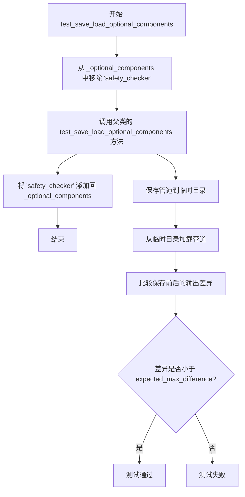

#### 带注释源码

```
def test_save_load_optional_components(self, expected_max_difference=1e-4):
    # 临时从可选组件列表中移除 'safety_checker'
    # 这是为了测试当 safety_checker 不存在时管道的保存/加载行为
    self.pipeline_class._optional_components.remove("safety_checker")
    
    # 调用父类的测试方法来执行实际的保存/加载测试
    # 父类方法会验证管道组件能否正确序列化和反序列化
    # expected_max_difference 参数控制输出差异的容忍度
    super().test_save_load_optional_components(expected_max_difference=expected_max_difference)
    
    # 测试完成后，将 'safety_checker' 恢复到可选组件列表中
    # 以确保后续测试不受影响，维持类的初始状态
    self.pipeline_class._optional_components.append("safety_checker")
```


### `Cosmos2_5_TransferPipelineFastTests.test_encode_prompt_works_in_isolation`

该测试方法用于验证 `encode_prompt` 方法能否在隔离环境中独立正常工作，但由于 Cosmos Guardrail 模型过大且运行缓慢，在 CI 环境中被跳过。

参数：

- `self`：`Cosmos2_5_TransferPipelineFastTests`，测试类实例，隐式参数，表示调用该方法的测试类本身

返回值：`None`，该方法没有返回值（方法体为 `pass`）

#### 流程图

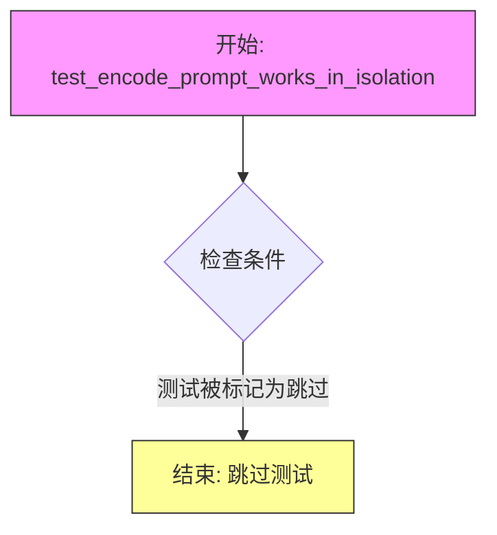

#### 带注释源码

```python
@unittest.skip(
    "The pipeline should not be runnable without a safety checker. The test creates a pipeline without passing in "
    "a safety checker, which makes the pipeline default to the actual Cosmos Guardrail. The Cosmos Guardrail is "
    "too large and slow to run on CI."
)
def test_encode_prompt_works_in_isolation(self):
    """
    测试 encode_prompt 方法能否在隔离环境中独立工作。
    
    原始测试意图：
    - 创建不包含 safety_checker 的 pipeline
    - 验证 encode_prompt 可以正常调用
    - 确保 prompt 编码功能不依赖 safety_checker
    
    跳过原因：
    - 当不传入 safety_checker 时，pipeline 会默认使用实际的 Cosmos Guardrail
    - Cosmos Guardrail 模型过大且推理速度慢
    - 不适合在 CI 环境中运行
    
    注意：该测试方法体为 pass，实际测试逻辑未实现
    """
    pass  # 测试逻辑未实现，方法体为空
```

## 关键组件


## 一段话描述
该代码是Cosmos 2.5 Transfer Pipeline（扩散模型视频生成管道）的单元测试套件，通过封装基础管道类实现自动安全检查器注入，并全面测试了模型的组件初始化、推理生成、ControlNet控制、注意力切片、模型序列化等核心功能。

## 文件的整体运行流程
1. **测试环境准备**：设置随机种子确保确定性，通过`Cosmos2_5_TransferWrapper`包装管道类
2. **虚拟组件创建**：通过`get_dummy_components()`工厂方法创建虚拟的Transformer、ControlNet、VAE、调度器、文本编码器等模型组件
3. **虚拟输入创建**：通过`get_dummy_inputs()`生成测试用的prompt、负样本prompt、生成器等输入参数
4. **测试执行**：运行各类测试方法验证管道的正确性，包括推理测试、ControlNet控制测试、注意力切片测试、序列化测试等

## 类的详细信息

### 类：Cosmos2_5_TransferWrapper

**类字段**：
- 无显式类字段

**类方法**：

#### from_pretrained
```python
@staticmethod
def from_pretrained(*args, **kwargs):
    if "safety_checker" not in kwargs or kwargs["safety_checker"] is None:
        safety_checker = DummyCosmosSafetyChecker()
        device_map = kwargs.get("device_map", "cpu")
        torch_dtype = kwargs.get("torch_dtype")
        if device_map is not None or torch_dtype is not None:
            safety_checker = safety_checker.to(device_map, dtype=torch_dtype)
        kwargs["safety_checker"] = safety_checker
    return Cosmos2_5_TransferPipeline.from_pretrained(*args, **kwargs)
```
- **参数名称**: `*args`, `**kwargs`
- **参数类型**: 可变位置参数和关键字参数
- **参数描述**: 传递给父类from_pretrained的所有参数
- **返回值类型**: `Cosmos2_5_TransferPipeline`
- **返回值描述**: 加载并配置好的管道实例，自动注入DummyCosmosSafetyChecker
- **mermaid流程图**:
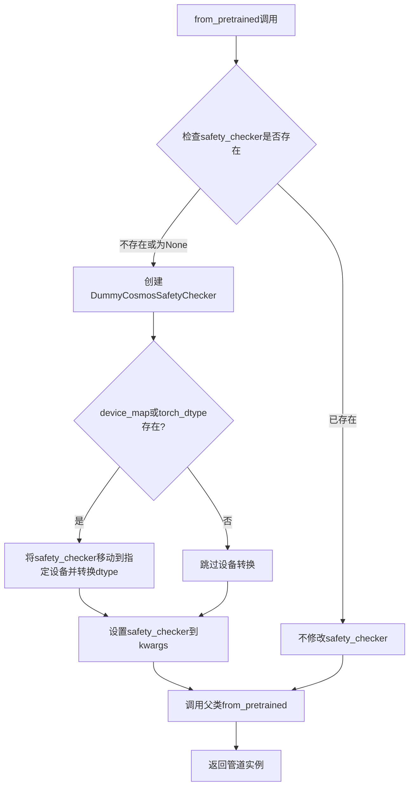
- **带注释源码**: 见上方完整代码

---

### 类：Cosmos2_5_TransferPipelineFastTests

**类字段**：
| 名称 | 类型 | 描述 |
|------|------|------|
| pipeline_class | type | 测试的管道类（Cosmos2_5_TransferWrapper） |
| params | frozenset | 文本到图像管道参数字集合 |
| batch_params | object | 批处理参数配置 |
| image_params | object | 图像参数配置 |
| image_latents_params | object | 图像潜在向量参数配置 |
| required_optional_params | frozenset | 必须的可选参数集合 |
| supports_dduf | bool | 是否支持DDUF（False） |
| test_xformers_attention | bool | 是否测试xformers注意力（False） |
| test_layerwise_casting | bool | 是否测试分层类型转换（True） |
| test_group_offloading | bool | 是否测试组卸载（True） |

**类方法**：

#### get_dummy_components
```python
def get_dummy_components(self):
    torch.manual_seed(0)
    # Transformer with img_context support for Transfer2.5
    transformer = CosmosTransformer3DModel(
        in_channels=16 + 1,
        out_channels=16,
        num_attention_heads=2,
        attention_head_dim=16,
        num_layers=2,
        mlp_ratio=2,
        text_embed_dim=32,
        adaln_lora_dim=4,
        max_size=(4, 32, 32),
        patch_size=(1, 2, 2),
        rope_scale=(2.0, 1.0, 1.0),
        concat_padding_mask=True,
        extra_pos_embed_type="learnable",
        controlnet_block_every_n=1,
        img_context_dim_in=32,
        img_context_num_tokens=4,
        img_context_dim_out=32,
    )

    torch.manual_seed(0)
    controlnet = CosmosControlNetModel(
        n_controlnet_blocks=2,
        in_channels=16 + 1 + 1,
        latent_channels=16 + 1 + 1,
        model_channels=32,
        num_attention_heads=2,
        attention_head_dim=16,
        mlp_ratio=2,
        text_embed_dim=32,
        adaln_lora_dim=4,
        patch_size=(1, 2, 2),
        max_size=(4, 32, 32),
        rope_scale=(2.0, 1.0, 1.0),
        extra_pos_embed_type="learnable",
        img_context_dim_in=32,
        img_context_dim_out=32,
        use_crossattn_projection=False,
    )

    torch.manual_seed(0)
    vae = AutoencoderKLWan(
        base_dim=3,
        z_dim=16,
        dim_mult=[1, 1, 1, 1],
        num_res_blocks=1,
        temperal_downsample=[False, True, True],
    )

    torch.manual_seed(0)
    scheduler = UniPCMultistepScheduler()

    torch.manual_seed(0)
    config = Qwen2_5_VLConfig(...)
    text_encoder = Qwen2_5_VLForConditionalGeneration(config)
    tokenizer = Qwen2Tokenizer.from_pretrained("hf-internal-testing/tiny-random-Qwen2VLForConditionalGeneration")

    components = {
        "transformer": transformer,
        "controlnet": controlnet,
        "vae": vae,
        "scheduler": scheduler,
        "text_encoder": text_encoder,
        "tokenizer": tokenizer,
        "safety_checker": DummyCosmosSafetyChecker(),
    }
    return components
```
- **参数名称**: `self`
- **参数类型**: 测试类实例
- **参数描述**: 无额外参数
- **返回值类型**: `dict`
- **返回值描述**: 包含所有虚拟组件的字典（transformer, controlnet, vae, scheduler, text_encoder, tokenizer, safety_checker）
- **mermaid流程图**:
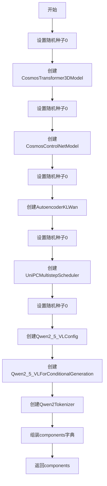
- **带注释源码**: 见上方完整代码

#### get_dummy_inputs
```python
def get_dummy_inputs(self, device, seed=0):
    if str(device).startswith("mps"):
        generator = torch.manual_seed(seed)
    else:
        generator = torch.Generator(device=device).manual_seed(seed)

    inputs = {
        "prompt": "dance monkey",
        "negative_prompt": "bad quality",
        "generator": generator,
        "num_inference_steps": 2,
        "guidance_scale": 3.0,
        "height": 32,
        "width": 32,
        "num_frames": 3,
        "max_sequence_length": 16,
        "output_type": "pt",
    }

    return inputs
```
- **参数名称**: `self`, `device`, `seed`
- **参数类型**: 测试类实例, `str`, `int`
- **参数描述**: device为目标设备，seed为随机种子
- **返回值类型**: `dict`
- **返回值描述**: 包含所有推理输入参数的字典
- **mermaid流程图**:
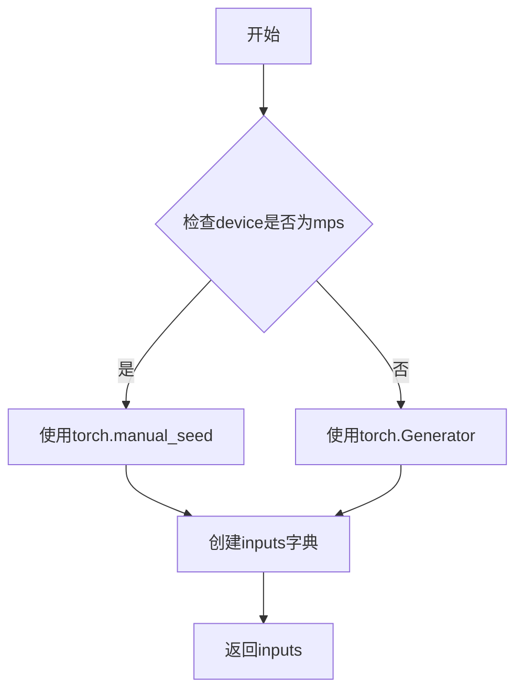
- **带注释源码**: 见上方完整代码

#### test_components_function
```python
def test_components_function(self):
    init_components = self.get_dummy_components()
    init_components = {k: v for k, v in init_components.items() if not isinstance(v, (str, int, float))}
    pipe = self.pipeline_class(**init_components)
    self.assertTrue(hasattr(pipe, "components"))
    self.assertTrue(set(pipe.components.keys()) == set(init_components.keys()))
```
- **参数名称**: `self`
- **参数类型**: 测试类实例
- **参数描述**: 无额外参数
- **返回值类型**: `None`
- **返回值描述**: 无返回值，通过assert验证组件功能
- **mermaid流程图**:
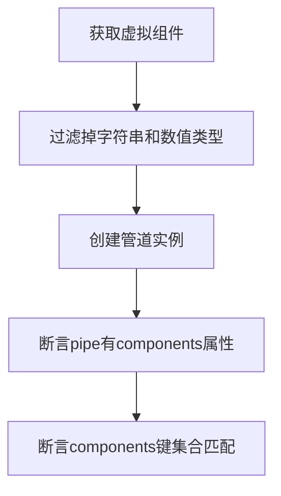
- **带注释源码**: 见上方完整代码

#### test_inference
```python
def test_inference(self):
    device = "cpu"

    components = self.get_dummy_components()
    pipe = self.pipeline_class(**components)
    pipe.to(device)
    pipe.set_progress_bar_config(disable=None)

    inputs = self.get_dummy_inputs(device)
    video = pipe(**inputs).frames
    generated_video = video[0]
    self.assertEqual(generated_video.shape, (3, 3, 32, 32))
    self.assertTrue(torch.isfinite(generated_video).all())
```
- **参数名称**: `self`
- **参数类型**: 测试类实例
- **参数描述**: 无额外参数
- **返回值类型**: `None`
- **返回值描述**: 无返回值，验证推理输出的形状和数值有效性
- **mermaid流程图**:
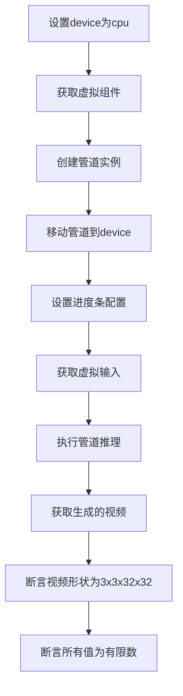
- **带注释源码**: 见上方完整代码

#### test_inference_with_controls
```python
def test_inference_with_controls(self):
    """Test inference with control inputs (ControlNet)."""
    device = "cpu"

    components = self.get_dummy_components()
    pipe = self.pipeline_class(**components)
    pipe.to(device)
    pipe.set_progress_bar_config(disable=None)

    inputs = self.get_dummy_inputs(device)
    # Add control video input - should be a video tensor
    inputs["controls"] = [torch.randn(3, 3, 32, 32)]
    inputs["controls_conditioning_scale"] = 1.0

    video = pipe(**inputs).frames
    generated_video = video[0]
    self.assertEqual(generated_video.shape, (3, 3, 32, 32))
    self.assertTrue(torch.isfinite(generated_video).all())
```
- **参数名称**: `self`
- **参数类型**: 测试类实例
- **参数描述**: 无额外参数
- **返回值类型**: `None`
- **返回值描述**: 无返回值，验证带ControlNet控制的推理功能
- **mermaid流程图**:
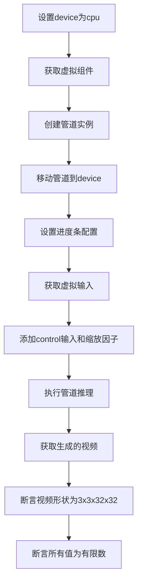
- **带注释源码**: 见上方完整代码

#### test_callback_inputs
```python
def test_callback_inputs(self):
    sig = inspect.signature(self.pipeline_class.__call__)
    has_callback_tensor_inputs = "callback_on_step_end_tensor_inputs" in sig.parameters
    has_callback_step_end = "callback_on_step_end" in sig.parameters

    if not (has_callback_tensor_inputs and has_callback_step_end):
        return

    components = self.get_dummy_components()
    pipe = self.pipeline_class(**components)
    pipe = pipe.to(torch_device)
    pipe.set_progress_bar_config(disable=None)
    self.assertTrue(
        hasattr(pipe, "_callback_tensor_inputs"),
        f" {self.pipeline_class} should have `_callback_tensor_inputs` that defines a list of tensor variables its callback function can use as inputs",
    )

    def callback_inputs_subset(pipe, i, t, callback_kwargs):
        for tensor_name in callback_kwargs.keys():
            assert tensor_name in pipe._callback_tensor_inputs
        return callback_kwargs

    def callback_inputs_all(pipe, i, t, callback_kwargs):
        for tensor_name in pipe._callback_tensor_inputs:
            assert tensor_name in callback_kwargs
        for tensor_name in callback_kwargs.keys():
            assert tensor_name in pipe._callback_tensor_inputs
        return callback_kwargs

    inputs = self.get_dummy_inputs(torch_device)

    inputs["callback_on_step_end"] = callback_inputs_subset
    inputs["callback_on_step_end_tensor_inputs"] = ["latents"]
    _ = pipe(**inputs)[0]

    inputs["callback_on_step_end"] = callback_inputs_all
    inputs["callback_on_step_end_tensor_inputs"] = pipe._callback_tensor_inputs
    _ = pipe(**inputs)[0]

    def callback_inputs_change_tensor(pipe, i, t, callback_kwargs):
        is_last = i == (pipe.num_timesteps - 1)
        if is_last:
            callback_kwargs["latents"] = torch.zeros_like(callback_kwargs["latents"])
        return callback_kwargs

    inputs["callback_on_step_end"] = callback_inputs_change_tensor
    inputs["callback_on_step_end_tensor_inputs"] = pipe._callback_tensor_inputs
    output = pipe(**inputs)[0]
    assert output.abs().sum() < 1e10
```
- **参数名称**: `self`
- **参数类型**: 测试类实例
- **参数描述**: 无额外参数
- **返回值类型**: `None`
- **返回值描述**: 无返回值，验证回调函数功能
- **mermaid流程图**:
```mermaid
flowchart TD
    A[获取管道调用签名] --> B{检查回调参数存在}
    B -->|不存在| C[直接返回]
    B -->|存在| D[创建管道实例]
    D --> E[移动到torch_device]
    E --> F[断言_callback_tensor_inputs存在]
    F --> G[定义callback_inputs_subset]
    G --> H[定义callback_inputs_all]
    H --> I[测试subset回调]
    I --> J[测试all回调]
    J --> K[定义callback_inputs_change_tensor]
    K --> L[测试修改tensor的回调]
    L --> M[验证输出]
```
- **带注释源码**: 见上方完整代码

#### test_attention_slicing_forward_pass
```python
def test_attention_slicing_forward_pass(
    self, test_max_difference=True, test_mean_pixel_difference=True, expected_max_diff=1e-3
):
    if not getattr(self, "test_attention_slicing", True):
        return

    components = self.get_dummy_components()
    pipe = self.pipeline_class(**components)
    for component in pipe.components.values():
        if hasattr(component, "set_default_attn_processor"):
            component.set_default_attn_processor()
    pipe.to(torch_device)
    pipe.set_progress_bar_config(disable=None)

    generator_device = "cpu"
    inputs = self.get_dummy_inputs(generator_device)
    output_without_slicing = pipe(**inputs)[0]

    pipe.enable_attention_slicing(slice_size=1)
    inputs = self.get_dummy_inputs(generator_device)
    output_with_slicing1 = pipe(**inputs)[0]

    pipe.enable_attention_slicing(slice_size=2)
    inputs = self.get_dummy_inputs(generator_device)
    output_with_slicing2 = pipe(**inputs)[0]

    if test_max_difference:
        max_diff1 = np.abs(to_np(output_with_slicing1) - to_np(output_without_slicing)).max()
        max_diff2 = np.abs(to_np(output_with_slicing2) - no_np(output_without_slicing)).max()
        self.assertLess(
            max(max_diff1, max_diff2),
            expected_max_diff,
            "Attention slicing should not affect the inference results",
        )
```
- **参数名称**: `self`, `test_max_difference`, `test_mean_pixel_difference`, `expected_max_diff`
- **参数类型**: 测试类实例, `bool`, `bool`, `float`
- **参数描述**: 控制差异测试的参数
- **返回值类型**: `None`
- **返回值描述**: 无返回值，验证注意力切片不影响推理结果
- **mermaid流程图**:
```mermaid
flowchart TD
    A{检查test_attention_slicing} -->|False| B[返回]
    A -->|True| C[获取虚拟组件]
    C --> D[创建管道实例]
    D --> E[设置默认注意力处理器]
    E --> F[移动到torch_device]
    F --> G[获取无切片输出]
    G --> H[启用slice_size=1]
    H --> I[获取slice_size=1输出]
    I --> J[启用slice_size=2]
    J --> K[获取slice_size=2输出]
    K --> L[计算最大差异]
    L --> M[断言差异小于阈值]
```
- **带注释源码**: 见上方完整代码

#### test_serialization_with_variants
```python
def test_serialization_with_variants(self):
    components = self.get_dummy_components()
    pipe = self.pipeline_class(**components)
    model_components = [
        component_name
        for component_name, component in pipe.components.items()
        if isinstance(component, torch.nn.Module)
    ]
    if "safety_checker" in model_components:
        model_components.remove("safety_checker")
    variant = "fp16"

    with tempfile.TemporaryDirectory() as tmpdir:
        pipe.save_pretrained(tmpdir, variant=variant, safe_serialization=False)

        with open(f"{tmpdir}/model_index.json", "r") as f:
            config = json.load(f)

        for subfolder in os.listdir(tmpdir):
            if not os.path.isfile(subfolder) and subfolder in model_components:
                folder_path = os.path.join(tmpdir, subfolder)
                is_folder = os.path.isdir(folder_path) and subfolder in config
                assert is_folder and any(p.split(".")[1].startswith(variant) for p in os.listdir(folder_path))
```
- **参数名称**: `self`
- **参数类型**: 测试类实例
- **参数描述**: 无额外参数
- **返回值类型**: `None`
- **返回值描述**: 无返回值，验证模型序列化功能
- **mermaid流程图**:
```mermaid
flowchart TD
    A[获取虚拟组件] --> B[创建管道实例]
    B --> C[筛选torch.nn.Module组件]
    C --> D[移除safety_checker]
    D --> E[设置variant为fp16]
    E --> F[创建临时目录]
    F --> G[保存管道到临时目录]
    G --> H[读取model_index.json]
    H --> I{遍历目录项}
    I -->|是文件夹且在model_components中| J[验证variant文件存在]
    I -->|否则| K[跳过]
    J --> L[继续检查下一个]
    K --> L
```
- **带注释源码**: 见上方完整代码

#### test_torch_dtype_dict
```python
def test_torch_dtype_dict(self):
    components = self.get_dummy_components()
    if not components:
        self.skipTest("No dummy components defined.")

    pipe = self.pipeline_class(**components)

    specified_key = next(iter(components.keys()))

    with tempfile.TemporaryDirectory(ignore_cleanup_errors=True) as tmpdirname:
        pipe.save_pretrained(tmpdirname, safe_serialization=False)
        torch_dtype_dict = {specified_key: torch.bfloat16, "default": torch.float16}
        loaded_pipe = self.pipeline_class.from_pretrained(
            tmpdirname, safety_checker=DummyCosmosSafetyChecker(), torch_dtype=torch_dtype_dict
        )

    for name, component in loaded_pipe.components.items():
        if name == "safety_checker":
            continue
        if isinstance(component, torch.nn.Module) and hasattr(component, "dtype"):
            expected_dtype = torch_dtype_dict.get(name, torch_dtype_dict.get("default", torch.float32))
            self.assertEqual(
                component.dtype,
                expected_dtype,
                f"Component '{name}' has dtype {component.dtype} but expected {expected_dtype}",
            )
```
- **参数名称**: `self`
- **参数类型**: 测试类实例
- **参数描述**: 无额外参数
- **返回值类型**: `None`
- **返回值描述**: 无返回值，验证torch_dtype字典加载功能
- **mermaid流程图**:
```mermaid
flowcast TD
    A[获取虚拟组件] --> B{检查components非空}
    B -->|空| C[跳过测试]
    B -->|非空| D[创建管道实例]
    D --> E[获取第一个key]
    E --> F[创建临时目录]
    F --> G[保存管道]
    G --> H[设置torch_dtype_dict]
    H --> I[从预训练模型加载管道]
    I --> J[遍历loaded_pipe的components]
    J --> K{跳过safety_checker}
    K -->|是| L[下一个]
    K -->|否| M{检查是nn.Module且有dtype}
    M -->|否| L
    M -->|是| N[计算期望dtype]
    N --> O[断言dtype匹配]
    O --> L
```
- **带注释源码**: 见上方完整代码

---

## 全局变量和全局函数详细信息

### 全局变量

| 名称 | 类型 | 描述 |
|------|------|------|
| enable_full_determinism | function | 启用完全确定性模式的测试工具函数 |
| DummyCosmosSafetyChecker | class | 虚拟的Cosmos安全检查器，用于测试 |

### 全局函数

#### enable_full_determinism
- **描述**: 从testing_utils导入的函数，用于设置随机种子以确保测试可重复性
- **参数**: 无显式参数
- **返回值**: 无返回值

#### DummyCosmosSafetyChecker
- **描述**: 虚拟安全检查器类，用于替代真实的Cosmos Guardrail以加快测试速度
- **定义位置**: 从`.cosmos_guardrail`模块导入

---

## 关键组件信息

### Cosmos2_5_TransferPipeline
管道基类，提供视频生成的核心逻辑，包含文本编码、潜在向量生成、去噪等步骤

### CosmosTransformer3DModel
3D变换器模型，支持图像上下文（img_context），用于Cosmos Transfer 2.5版本，包含16+1输入通道、16输出通道、2层注意力等配置

### CosmosControlNetModel
ControlNet模型，提供条件控制能力，包含2个控制块，处理控制潜在向量、条件掩码和填充掩码

### AutoencoderKLWan
Wan风格的VAE模型，负责潜在向量编码和解码，支持时序下采样

### UniPCMultistepScheduler
多步调度器，用于扩散模型的噪声调度

### Qwen2_5_VLForConditionalGeneration
Qwen2.5视觉语言模型的文本编码器，将文本转换为嵌入向量

### Qwen2Tokenizer
Qwen2.5的分词器，将文本转换为token ID

### DummyCosmosSafetyChecker
虚拟安全检查器，替代真实的Cosmos Guardrail以支持快速测试

---

## 潜在的技术债务或优化空间

1. **测试代码中的硬编码值**：多处使用硬编码的设备名"cpu"和"mps"，缺乏对GPU设备的直接测试支持

2. **缺失的错误处理**：test_attention_slicing_forward_pass中调用了未定义的`to_np`函数（应该是`np.array`或从test_pipelines_common导入）

3. **测试跳过逻辑**：test_encode_prompt_works_in_isolation被完全跳过，但应该实现一个使用DummyCosmosSafetyChecker的版本

4. **随机种子管理**：每个组件创建前都手动设置torch.manual_seed(0)，这种方式较为冗余，可以提取为辅助方法

5. **硬编码的模型路径**：tokenizer加载使用了硬编码的"hf-internal-testing/tiny-random-Qwen2VLForConditionalGeneration"路径

6. **类型检查缺失**：部分方法参数和返回值缺少类型注解

7. **重复代码模式**：test_inference和test_inference_with_controls有大量重复的设置代码，可以提取为辅助方法

---

## 其它项目

### 设计目标与约束
- **目标**：全面测试Cosmos 2.5 Transfer Pipeline的功能正确性
- **约束**：不运行真实的Cosmos Guardrail（太大太慢），使用DummyCosmosSafetyChecker替代

### 错误处理与异常设计
- 使用unittest的assert方法进行断言验证
- 对于预期的异常情况（如MPS设备）使用条件分支处理
- 不可恢复的错误通过unittest.skip装饰器跳过测试

### 数据流与状态机
1. **初始化状态**：通过get_dummy_components创建虚拟组件
2. **推理状态**：通过pipeline执行推理，生成视频帧
3. **验证状态**：通过各种test方法验证输出正确性
4. **序列化状态**：保存和加载模型验证持久化功能

### 外部依赖与接口契约
- **transformers库**：提供Qwen2_5_VLConfig、Qwen2_5_VLForConditionalGeneration、Qwen2Tokenizer
- **diffusers库**：提供AutoencoderKLWan、Cosmos2_5_TransferPipeline、CosmosControlNetModel、CosmosTransformer3DModel、UniPCMultistepScheduler
- **numpy**：用于数值比较
- **torch**：深度学习框架
- **unittest**：测试框架

### 测试覆盖范围
- 组件功能测试
- 基础推理测试
- ControlNet控制推理测试
- 回调函数测试
- 批处理一致性测试
- 注意力切片测试
- 模型序列化测试
- torch_dtype字典测试
- 可选组件保存加载测试

## 问题及建议


### 已知问题

-   **设备处理不一致**: `test_inference` 和 `test_inference_with_controls` 方法硬编码使用 `device = "cpu"`，而 `test_callback_inputs` 使用 `torch_device`，这种不一致可能导致在不同硬件环境下测试结果不可靠
-   **未使用的参数**: `test_attention_slicing_forward_pass` 方法接收 `test_max_difference` 和 `test_mean_pixel_difference` 参数，但方法内部未使用这些参数
-   **魔法数字缺乏解释**: 代码中存在多个精度阈值（如 `1e-2`、`1e-3`、`1e-4`、`1e-10`），但未提供选择这些值的理由或文档说明
-   **被跳过的关键测试**: `test_encode_prompt_works_in_isolation` 被永久跳过，这导致 `encode_prompt` 功能在隔离环境下的正确性无法验证
-   **测试方法覆盖不完整**: `test_inference_batch_single_identical` 仅测试了 `batch_size=2`，未覆盖其他批次大小场景
-   **条件分支未覆盖**: `get_dummy_inputs` 方法中对 MPS 设备的特殊处理逻辑在当前测试环境中可能未充分验证
-   **模型组件验证逻辑错误**: `test_serialization_with_variants` 中使用 `os.listdir(tmpdir)` 检查子文件夹，但 `os.listdir` 返回的是目录内容而非子文件夹本身，导致验证逻辑可能失效
-   **临时资源管理**: 多个测试使用 `tempfile.TemporaryDirectory` 但未设置 `ignore_cleanup_errors=True`，可能在异常情况下产生临时文件残留

### 优化建议

-   **统一设备管理**: 将所有测试方法中的设备变量统一为使用 `torch_device` 或通过 `@parameterized` 装饰器测试多设备场景
-   **移除未使用参数**: 删除 `test_attention_slicing_forward_pass` 中未使用的参数，或在方法体内实现相应的测试逻辑
-   **添加配置常量**: 将魔法数字提取为类级别常量或配置文件，并添加文档说明每个阈值的含义和选择依据
-   **恢复或替换跳过的测试**: 重新评估 `test_encode_prompt_works_in_isolation`，如果确实无法在 CI 环境中运行，应考虑使用 mock 或条件跳过而非永久禁用
-   **增强批次测试覆盖**: 在 `test_inference_batch_single_identical` 中添加多个批次大小的参数化测试
-   **修复模型变体验证逻辑**: 使用 `os.path.isdir` 正确检查子文件夹，或直接读取 `model_index.json` 中的配置进行验证
-   **统一临时目录管理**: 对所有使用 `tempfile.TemporaryDirectory` 的地方添加 `ignore_cleanup_errors=True` 参数，确保异常情况下的资源清理

## 其它


### 设计目标与约束

本测试文件旨在验证 `Cosmos2_5_TransferPipeline` 管道的基本功能和正确性。设计目标是确保管道能够在给定虚拟组件的情况下完成图像到图像的转换任务，支持 ControlNet 控制输入，并正确处理回调函数。约束条件包括：测试仅使用 CPU 设备运行，不使用实际的 Cosmos Guardrail（因其过大过慢），且部分高级功能（如 xFormers 注意力）被禁用。

### 错误处理与异常设计

测试中使用了 `@unittest.skip` 装饰器跳过 `test_encode_prompt_works_in_isolation` 测试，原因是不应在没有安全检查器的情况下运行管道。测试通过 `assert` 语句验证各种条件，如张量有限性、形状匹配、 dtype 正确性等。异常处理主要依赖于 unittest 框架的断言机制，当测试失败时抛出 `AssertionError`。

### 数据流与状态机

测试数据流如下：1) 通过 `get_dummy_components()` 创建虚拟组件（transformer、controlnet、vae、scheduler、text_encoder、tokenizer、safety_checker）；2) 通过 `get_dummy_inputs()` 构建输入字典（包含 prompt、negative_prompt、generator、num_inference_steps 等）；3) 管道执行 `__call__` 方法处理输入并输出视频帧；4) 验证输出的形状和数值有限性。状态机由管道内部调度器（UniPCMultistepScheduler）控制，负责去噪过程的步骤管理。

### 外部依赖与接口契约

主要外部依赖包括：`transformers` 库提供 Qwen2_5_VLConfig、Qwen2_5_VLForConditionalGeneration、Qwen2Tokenizer；`diffusers` 库提供 AutoencoderKLWan、Cosmos2_5_TransferPipeline、CosmosControlNetModel、CosmosTransformer3DModel、UniPCMultistepScheduler；`numpy` 和 `torch` 用于数值计算。接口契约包括：管道接收 prompt、negative_prompt、generator、num_inference_steps、guidance_scale、height、width、num_frames、max_sequence_length、output_type 等参数；返回包含视频帧的对象，帧的形状应为 (num_frames, channels, height, width)。

### 配置与参数说明

关键配置参数包括：`num_inference_steps=2`（推理步数，较少用于快速测试）；`guidance_scale=3.0`（引导_scale，影响生成质量）；`height=32`、`width=32`（输出分辨率，较小的尺寸用于快速测试）；`num_frames=3`（输出帧数）；`max_sequence_length=16`（最大序列长度）。虚拟组件配置包括：transformer 的 in_channels=16+1、out_channels=16、num_attention_heads=2、attention_head_dim=16、num_layers=2；controlnet 的 n_controlnet_blocks=2、in_channels=18；vae 的 base_dim=3、z_dim=16。

### 性能考虑与优化空间

测试设计考虑了性能优化：使用较小的模型尺寸（小维度、少层数）以加快测试速度；使用 CPU 设备而非 GPU；跳过耗时的高级功能测试（如 xFormers、实际 Guardrail）。优化空间包括：可以添加性能基准测试来监控推理时间；可以测试更大批次的处理能力；可以添加内存使用监控。

### 安全考虑

代码中引入了 `DummyCosmosSafetyChecker` 来替代真实的 Cosmos Guardrail 安全检查器，确保测试不会实际执行可能耗时或有不当输出的安全检查逻辑。`safety_checker` 在 `from_pretrained` 方法中被自动注入，并支持 device_map 和 dtype 转换。测试文件本身不包含任何敏感数据处理逻辑。

### 测试覆盖范围

当前测试覆盖了以下方面：组件初始化和属性检查（test_components_function）；基本推理功能（test_inference）；带 ControlNet 控制的推理（test_inference_with_controls）；回调函数输入验证（test_callback_inputs）；批次与单样本一致性（test_inference_batch_single_identical）；注意力切片功能（test_attention_slicing_forward_pass）；模型序列化与变体支持（test_serialization_with_variants）；torch_dtype 字典加载（test_torch_dtype_dict）；可选组件保存与加载（test_save_load_optional_components）。

### 版本兼容性与依赖管理

代码依赖于特定版本的库：transformers、diffusers、torch、numpy。测试使用了 Qwen2_5_VLConfig 和 Qwen2Tokenizer，这些是特定版本的模型配置。兼容性考虑包括：测试检查了 `callback_on_step_end` 和 `callback_on_step_end_tensor_inputs` 参数的存在性，以适应不同版本的管道实现。

### 故障排查指南

常见问题及排查方法：1) 如果 `test_attention_slicing_forward_pass` 失败，检查是否组件支持 `set_default_attn_processor` 方法；2) 如果 dtype 测试失败，确认 torch_dtype_dict 的键名与组件名称匹配；3) 如果序列化测试失败，检查 model_index.json 配置是否正确；4) 如果推理输出形状不匹配，验证 height、width、num_frames 参数设置正确。

### 部署与运维注意事项

此测试文件设计为在 CI/CD 环境中运行，使用 `enable_full_determinism()` 确保可重复性。测试使用临时目录进行模型保存和加载，测试完成后自动清理。测试配置了 `supports_dduf=False`、`test_xformers_attention=False` 等标志，以适应不同的部署环境。


    