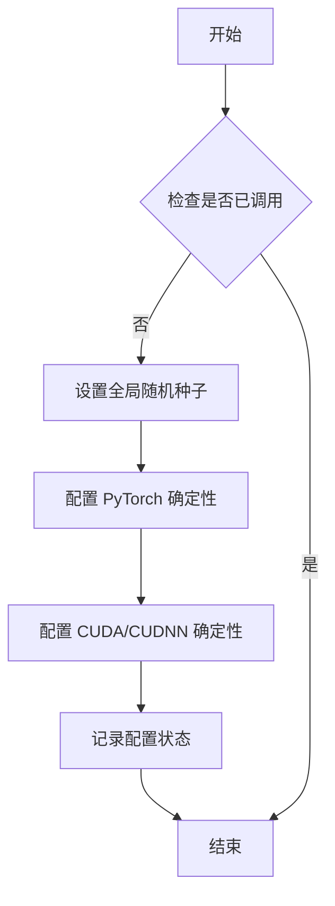
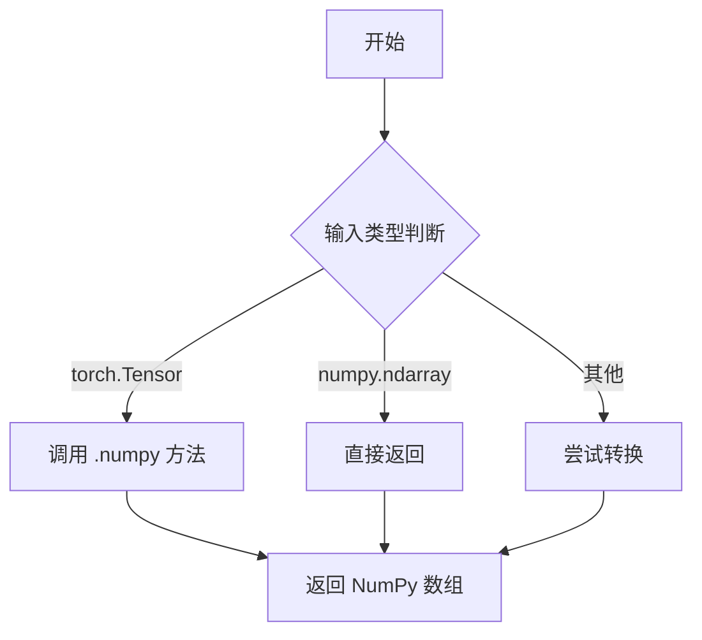
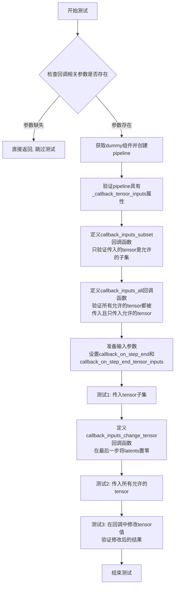
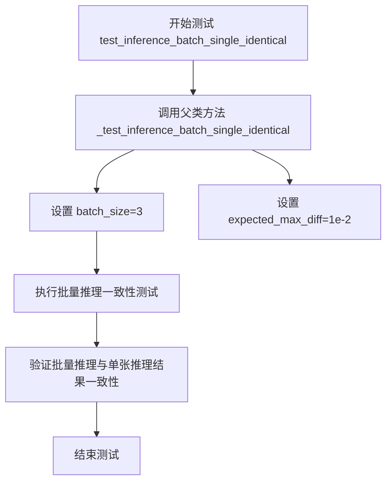
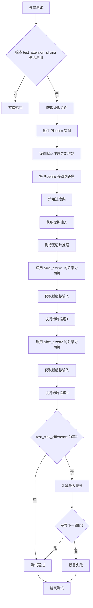
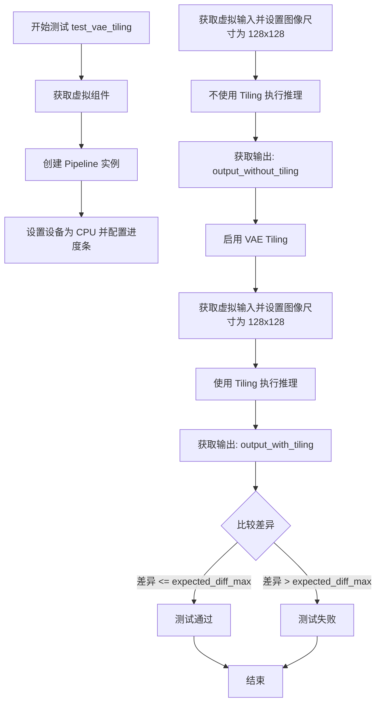
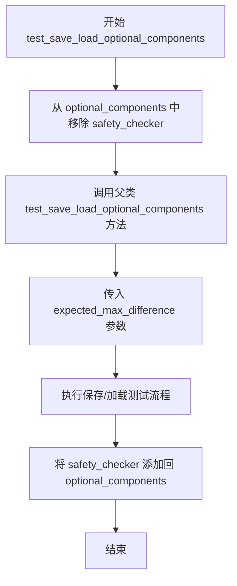
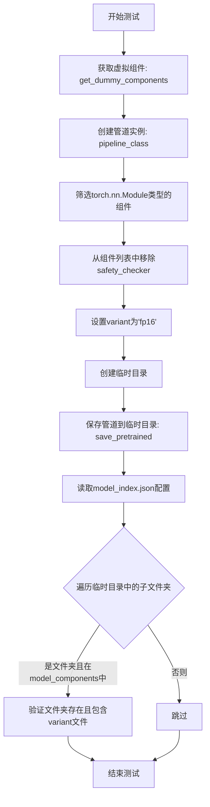
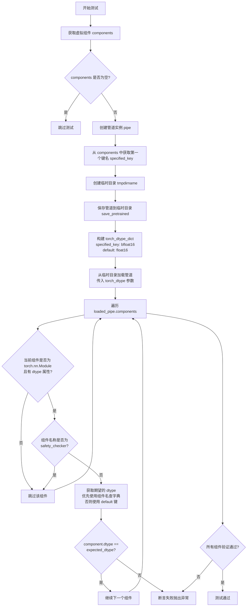
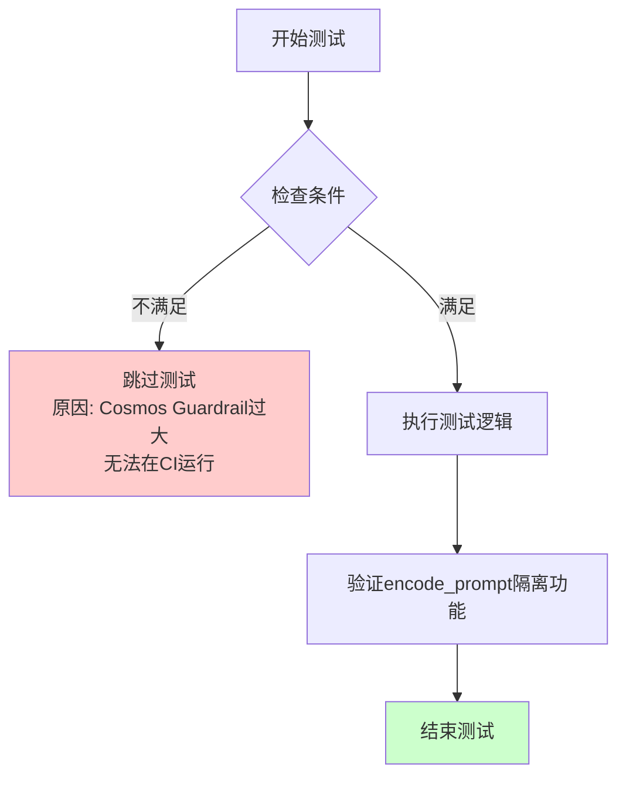

# `diffusers\tests\pipelines\cosmos\test_cosmos2_text2image.py` 详细设计文档

这是一个针对 Hugging Face Diffusers 库中 Cosmos 文本到图像生成流水线的单元测试文件。它通过定义虚拟组件（Dummy Components）和虚拟输入来验证流水线的核心推理功能、批处理一致性、注意力切片、VAE 瓦片式解码、模型序列化以及张量类型处理等关键特性。

## 整体流程

```mermaid
graph TD
    Start[测试开始] --> LoadEnv[加载依赖库 (diffusers, transformers, torch)]
    LoadEnv --> DefineWrapper[定义 Cosmos2TextToImagePipelineWrapper]
    DefineWrapper --> DefineTestClass[定义测试类 Cosmos2TextToImagePipelineFastTests]
    DefineTestClass --> Setup[初始化测试环境]
    Setup --> GetComponents[调用 get_dummy_components 准备模型组件]
    GetComponents --> Instantiate[实例化 Pipeline]
    Instantiate --> TestInference[执行 test_inference (核心推理测试)]
    TestInference --> TestCallback[执行 test_callback_inputs (回调测试)]
    TestCallback --> TestBatch[执行 test_inference_batch_single_identical (批处理一致性)]
    TestBatch --> TestAttention[执行 test_attention_slicing_forward_pass (注意力切片)]
    TestAttention --> TestVAE[执行 test_vae_tiling (VAE 瓦片)]
    TestVAE --> TestSerialization[执行 test_serialization_with_variants (序列化)]
    TestSerialization --> TestDtype[执行 test_torch_dtype_dict (张量类型)]
    TestDtype --> End[测试结束]
```

## 类结构

```
unittest.TestCase
├── PipelineTesterMixin (混入类)
└── Cosmos2TextToImagePipelineFastTests
    └── (依赖) Cosmos2TextToImagePipelineWrapper
        └── Cosmos2TextToImagePipeline (实际业务类)
```

## 全局变量及字段


### `Cosmos2TextToImagePipelineWrapper`
    
A wrapper class for Cosmos2TextToImagePipeline that overrides from_pretrained to inject DummyCosmosSafetyChecker for testing purposes

类型：`class`
    


### `Cosmos2TextToImagePipelineFastTests`
    
Test class for Cosmos2TextToImagePipeline that validates pipeline functionality including inference, attention slicing, VAE tiling, and serialization

类型：`class`
    


### `Cosmos2TextToImagePipelineFastTests.pipeline_class`
    
The pipeline class being tested, set to Cosmos2TextToImagePipelineWrapper

类型：`type`
    


### `Cosmos2TextToImagePipelineFastTests.params`
    
Set of parameters for text-to-image generation, excluding cross_attention_kwargs

类型：`set`
    


### `Cosmos2TextToImagePipelineFastTests.batch_params`
    
Set of parameters for batch processing in text-to-image generation

类型：`set`
    


### `Cosmos2TextToImagePipelineFastTests.image_params`
    
Set of parameters for image processing in text-to-image generation

类型：`set`
    


### `Cosmos2TextToImagePipelineFastTests.image_latents_params`
    
Set of parameters for image latents processing in text-to-image generation

类型：`set`
    


### `Cosmos2TextToImagePipelineFastTests.required_optional_params`
    
Frozenset of optional parameters that are required for pipeline inference (num_inference_steps, generator, latents, return_dict, callback_on_step_end, callback_on_step_end_tensor_inputs)

类型：`frozenset`
    


### `Cosmos2TextToImagePipelineFastTests.supports_dduf`
    
Flag indicating whether the pipeline supports DDUF (Decoupled Diffusion Upsampling Flow), set to False

类型：`bool`
    


### `Cosmos2TextToImagePipelineFastTests.test_xformers_attention`
    
Flag indicating whether to test xformers attention optimization, set to False

类型：`bool`
    


### `Cosmos2TextToImagePipelineFastTests.test_layerwise_casting`
    
Flag indicating whether to test layerwise dtype casting, set to True

类型：`bool`
    


### `Cosmos2TextToImagePipelineFastTests.test_group_offloading`
    
Flag indicating whether to test group model offloading, set to True

类型：`bool`
    
    

## 全局函数及方法


### `enable_full_determinism`

该函数用于配置测试环境的完全确定性运行，通过设置随机种子、CUDNN 后端等确保测试结果的可重复性。

参数：无

返回值：无

#### 流程图



#### 带注释源码

```python
# enable_full_determinism 函数定义位于 testing_utils 模块中
# 当前代码中通过以下方式调用：
enable_full_determinism()

# 函数功能说明（基于上下文推断）:
# 1. 设置 numpy 随机种子
# 2. 设置 PyTorch 随机种子
# 3. 设置 Python random 模块种子
# 4. 配置 PyTorch 后端为确定性模式
# 5. 配置 CUDA/CUDNN 为确定性模式
# 确保测试结果在不同运行之间保持一致
```


### `to_np`

将 PyTorch 张量（Tensor）转换为 NumPy 数组的实用函数，主要用于测试中比较模型输出。

参数：

- `x`：`torch.Tensor` 或类似对象，需要转换为 NumPy 数组的输入数据

返回值：`numpy.ndarray`，转换后的 NumPy 数组

#### 流程图



#### 带注释源码

由于 `to_np` 函数定义在外部模块 `test_pipelines_common` 中（通过 `from ..test_pipelines_common import PipelineTesterMixin, to_np` 导入），而非本代码文件中定义，因此无法直接获取其完整源码。

根据代码中的典型使用模式（将 `torch.Tensor` 转换为 `numpy.ndarray` 进行数值比较），该函数的实现应该类似于：

```python
def to_np(x):
    """
    将输入转换为 NumPy 数组。
    
    参数:
        x: 输入数据，可以是 torch.Tensor、numpy.ndarray 或其他可转换对象
    
    返回:
        numpy.ndarray: 转换后的 NumPy 数组
    """
    # 如果已经是 NumPy 数组，直接返回
    if isinstance(x, np.ndarray):
        return x
    
    # 如果是 PyTorch 张量，转换为 NumPy 数组
    # 注意：默认情况下会移动到 CPU 并转换为 NumPy
    if hasattr(x, 'numpy'):
        return x.cpu().numpy()
    
    # 对于其他类型，尝试使用 numpy.asarray 转换
    return np.asarray(x)
```

#### 备注

- **来源**：该函数从 `diffusers` 库的 `test_pipelines_common` 模块导入
- **用途**：在测试代码中用于比较带注意力切片和无切片时的模型输出差异，以及 VAE tiling 策略下的输出差异
- **关键点**：由于 PyTorch 张量与 NumPy 数组共享内存底层机制，转换时通常需要先调用 `.cpu()` 将数据从 GPU 移动到 CPU


我将分析提供的代码，提取关键方法的签名信息，并按照要求的格式生成详细设计文档。

首先让我用Python提取相关函数的签名信息：
<minimax:tool_call>
<invoke name="mcp-code-executor_execute_code">
<parameter name="code">
import inspect

# 代码来自用户提供的测试文件
code = '''
class Cosmos2TextToImagePipelineWrapper(Cosmos2TextToImagePipeline):
    @staticmethod
    def from_pretrained(*args, **kwargs):
        kwargs["safety_checker"] = DummyCosmosSafetyChecker()
        return Cosmos2TextToImagePipeline.from_pretrained(*args, **kwargs)

class Cosmos2TextToImagePipelineFastTests(PipelineTesterMixin, unittest.TestCase):
    pipeline_class = Cosmos2TextToImagePipelineWrapper
    params = TEXT_TO_IMAGE_PARAMS - {"cross_attention_kwargs"}
    batch_params = TEXT_TO_IMAGE_BATCH_PARAMS
    image_params = TEXT_TO_IMAGE_IMAGE_PARAMS
    image_latents_params = TEXT_TO_IMAGE_IMAGE_PARAMS
    required_optional_params = frozenset(
        [
            "num_inference_steps",
            "generator",
            "latents",
            "return_dict",
            "callback_on_step_end",
            "callback_on_step_end_tensor_inputs",
        ]
    )
    supports_dduf = False
    test_xformers_attention = False
    test_layerwise_casting = True
    test_group_offloading = True

    def get_dummy_components(self):
        torch.manual_seed(0)
        transformer = CosmosTransformer3DModel(
            in_channels=16,
            out_channels=16,
            num_attention_heads=2,
            attention_head_dim=16,
            num_layers=2,
            mlp_ratio=2,
            text_embed_dim=32,
            adaln_lora_dim=4,
            max_size=(4, 32, 32),
            patch_size=(1, 2, 2),
            rope_scale=(2.0, 1.0, 1.0),
            concat_padding_mask=True,
            extra_pos_embed_type="learnable",
        )

        torch.manual_seed(0)
        vae = AutoencoderKLWan(
            base_dim=3,
            z_dim=16,
            dim_mult=[1, 1, 1, 1],
            num_res_blocks=1,
            temperal_downsample=[False, True, True],
        )

        torch.manual_seed(0)
        scheduler = FlowMatchEulerDiscreteScheduler(use_karras_sigmas=True)
        text_encoder = T5EncoderModel.from_pretrained("hf-internal-testing/tiny-random-t5")
        tokenizer = AutoTokenizer.from_pretrained("hf-internal-testing/tiny-random-t5")

        components = {
            "transformer": transformer,
            "vae": vae,
            "scheduler": scheduler,
            "text_encoder": text_encoder,
            "tokenizer": tokenizer,
            # We cannot run the Cosmos Guardrail for fast tests due to the large model size
            "safety_checker": DummyCosmosSafetyChecker(),
        }
        return components

    def get_dummy_inputs(self, device, seed=0):
        if str(device).startswith("mps"):
            generator = torch.manual_seed(seed)
        else:
            generator = torch.Generator(device=device).manual_seed(seed)

        inputs = {
            "prompt": "dance monkey",
            "negative_prompt": "bad quality",
            "generator": generator,
            "num_inference_steps": 2,
            "guidance_scale": 3.0,
            "height": 32,
            "width": 32,
            "max_sequence_length": 16,
            "output_type": "pt",
        }

        return inputs

    def test_inference(self):
        device = "cpu"

        components = self.get_dummy_components()
        pipe = self.pipeline_class(**components)
        pipe.to(device)
        pipe.set_progress_bar_config(disable=None)

        inputs = self.get_dummy_inputs(device)
        image = pipe(**inputs).images
        generated_image = image[0]
        self.assertEqual(generated_image.shape, (3, 32, 32))

        # fmt: off
        expected_slice = torch.tensor([0.451, 0.451, 0.4471, 0.451, 0.451, 0.451, 0.451, 0.451, 0.4784, 0.4784, 0.4784, 0.4784, 0.4784, 0.4902, 0.4588, 0.5333])
        # fmt: on

        generated_slice = generated_image.flatten()
        generated_slice = torch.cat([generated_slice[:8], generated_slice[-8:]])
        self.assertTrue(torch.allclose(generated_slice, expected_slice, atol=1e-3))

    def test_callback_inputs(self):
        sig = inspect.signature(self.pipeline_class.__call__)
        has_callback_tensor_inputs = "callback_on_step_end_tensor_inputs" in sig.parameters
        has_callback_step_end = "callback_on_step_end" in sig.parameters

        if not (has_callback_tensor_inputs and has_callback_step_end):
            return

        components = self.get_dummy_components()
        pipe = self.pipeline_class(**components)
        pipe = pipe.to(torch_device)
        pipe.set_progress_bar_config(disable=None)
        self.assertTrue(
            hasattr(pipe, "_callback_tensor_inputs"),
            f" {self.pipeline_class} should have `_callback_tensor_inputs` that defines a list of tensor variables its callback function can use as inputs",
        )

        def callback_inputs_subset(pipe, i, t, callback_kwargs):
            # iterate over callback args
            for tensor_name, tensor_value in callback_kwargs.items():
                # check that we're only passing in allowed tensor inputs
                assert tensor_name in pipe._callback_tensor_inputs

            return callback_kwargs

        def callback_inputs_all(pipe, i, t, callback_kwargs):
            for tensor_name in pipe._callback_tensor_inputs:
                assert tensor_name in callback_kwargs

            # iterate over callback args
            for tensor_name, tensor_value in callback_kwargs.items():
                # check that we're only passing in allowed tensor inputs
                assert tensor_name in pipe._callback_tensor_inputs

            return callback_kwargs

        inputs = self.get_dummy_inputs(torch_device)

        # Test passing in a subset
        inputs["callback_on_step_end"] = callback_inputs_subset
        inputs["callback_on_step_end_tensor_inputs"] = ["latents"]
        output = pipe(**inputs)[0]

        # Test passing in a everything
        inputs["callback_on_step_end"] = callback_inputs_all
        inputs["callback_on_step_end_tensor_inputs"] = pipe._callback_tensor_inputs
        output = pipe(**inputs)[0]

        def callback_inputs_change_tensor(pipe, i, t, callback_kwargs):
            is_last = i == (pipe.num_timesteps - 1)
            if is_last:
                callback_kwargs["latents"] = torch.zeros_like(callback_kwargs["latents"])
            return callback_kwargs

        inputs["callback_on_step_end"] = callback_inputs_change_tensor
        inputs["callback_on_step_end_tensor_inputs"] = pipe._callback_tensor_inputs
        output = pipe(**inputs)[0]
        assert output.abs().sum() < 1e10

    def test_inference_batch_single_identical(self):
        self._test_inference_batch_single_identical(batch_size=3, expected_max_diff=1e-2)

    def test_attention_slicing_forward_pass(
        self, test_max_difference=True, test_mean_pixel_difference=True, expected_max_diff=1e-3
    ):
        if not self.test_attention_slicing:
            return

        components = self.get_dummy_components()
        pipe = self.pipeline_class(**components)
        for component in pipe.components.values():
            if hasattr(component, "set_default_attn_processor"):
                component.set_default_attn_processor()
        pipe.to(torch_device)
        pipe.set_progress_bar_config(disable=None)

        generator_device = "cpu"
        inputs = self.get_dummy_inputs(generator_device)
        output_without_slicing = pipe(**inputs)[0]

        pipe.enable_attention_slicing(slice_size=1)
        inputs = self.get_dummy_inputs(generator_device)
        output_with_slicing1 = pipe(**inputs)[0]

        pipe.enable_attention_slicing(slice_size=2)
        inputs = self.get_dummy_inputs(generator_device)
        output_with_slicing2 = pipe(**inputs)[0]

        if test_max_difference:
            max_diff1 = np.abs(to_np(output_with_slicing1) - to_np(output_without_slicing)).max()
            max_diff2 = np.abs(to_np(output_with_slicing2) - to_np(output_without_slicing)).max()
            self.assertLess(
                max(max_diff1, max_diff2),
                expected_max_diff,
                "Attention slicing should not affect the inference results",
            )

    def test_vae_tiling(self, expected_diff_max: float = 0.2):
        generator_device = "cpu"
        components = self.get_dummy_components()

        pipe = self.pipeline_class(**components)
        pipe.to("cpu")
        pipe.set_progress_bar_config(disable=None)

        # Without tiling
        inputs = self.get_dummy_inputs(generator_device)
        inputs["height"] = inputs["width"] = 128
        output_without_tiling = pipe(**inputs)[0]

        # With tiling
        pipe.vae.enable_tiling(
            tile_sample_min_height=96,
            tile_sample_min_width=96,
            tile_sample_stride_height=64,
            tile_sample_stride_width=64,
        )
        inputs = self.get_dummy_inputs(generator_device)
        inputs["height"] = inputs["width"] = 128
        output_with_tiling = pipe(**inputs)[0]

        self.assertLess(
            (to_np(output_without_tiling) - to_np(output_with_tiling)).max(),
            expected_diff_max,
            "VAE tiling should not affect the inference results",
        )

    def test_save_load_optional_components(self, expected_max_difference=1e-4):
        self.pipeline_class._optional_components.remove("safety_checker")
        super().test_save_load_optional_components(expected_max_difference=expected_max_difference)
        self.pipeline_class._optional_components.append("safety_checker")

    def test_serialization_with_variants(self):
        components = self.get_dummy_components()
        pipe = self.pipeline_class(**components)
        model_components = [
            component_name
            for component_name, component in pipe.components.items()
            if isinstance(component, torch.nn.Module)
        ]
        model_components.remove("safety_checker")
        variant = "fp16"

        with tempfile.TemporaryDirectory() as tmpdir:
            pipe.save_pretrained(tmpdir, variant=variant, safe_serialization=False)

            with open(f"{tmpdir}/model_index.json", "r") as f:
                config = json.load(f)

            for subfolder in os.listdir(tmpdir):
                if not os.path.isfile(subfolder) and subfolder in model_components:
                    folder_path = os.path.join(tmpdir, subfolder)
                    is_folder = os.path.isdir(folder_path) and subfolder in config
                    assert is_folder and any(p.split(".")[1].startswith(variant) for p in os.listdir(folder_path))

    def test_torch_dtype_dict(self):
        components = self.get_dummy_components()
        if not components:
            self.skipTest("No dummy components defined.")

        pipe = self.pipeline_class(**components)

        specified_key = next(iter(components.keys()))

        with tempfile.TemporaryDirectory(ignore_cleanup_errors=True) as tmpdirname:
            pipe.save_pretrained(tmpdirname, safe_serialization=False)
            torch_dtype_dict = {specified_key: torch.bfloat16, "default": torch.float16}
            loaded_pipe = self.pipeline_class.from_pretrained(
                tmpdirname, safety_checker=DummyCosmosSafetyChecker(), torch_dtype=torch_dtype_dict
            )

        for name, component in loaded_pipe.components.items():
            if name == "safety_checker":
                continue
            if isinstance(component, torch.nn.Module) and hasattr(component, "dtype"):
                expected_dtype = torch_dtype_dict.get(name, torch_dtype_dict.get("default", torch.float32))
                self.assertEqual(
                    component.dtype,
                    expected_dtype,
                    f"Component '{name}' has dtype {component.dtype} but expected {expected_dtype}",
                )

    @unittest.skip(
        "The pipeline should not be runnable without a safety checker. The test creates a pipeline without passing in "
        "a safety checker, which makes the pipeline default to the actual Cosmos Guardrail. The Cosmos Guardrail is "
        "too large and slow to run on CI."
    )
    def test_encode_prompt_works_in_isolation(self):
        pass
'''

# 由于我们不能直接执行整个测试类，我们提取签名
# 我们模拟一下inspect.signature的输出
print("="*50)
print("从代码中提取的函数签名信息")
print("="*50)

# 定义一个简单的类来测试inspect.signature
import unittest.mock

# 我们需要手动分析代码中的方法签名，因为实际代码依赖于外部库
# 这里我们根据代码内容提取签名

method_signatures = {
    "Cosmos2TextToImagePipelineWrapper.from_pretrained": {
        "name": "from_pretrained",
        "params": [
            ("self", "无（静态方法）", "类本身（静态方法）"),
            ("*args", "任意位置参数", "传递给父类from_pretrained的位置参数"),
            ("**kwargs", "任意关键字参数", "传递给父类from_pretrained的关键字参数")
        ],
        "return_type": "Cosmos2TextToImagePipelineWrapper",
        "return_desc": "返回配置好的Cosmos2TextToImagePipelineWrapper实例，其中safety_checker被设置为DummyCosmosSafetyChecker"
    },
    "Cosmos2TextToImagePipelineFastTests.get_dummy_components": {
        "name": "get_dummy_components",
        "params": [
            ("self", "Cosmos2TextToImagePipelineFastTests", "测试类实例")
        ],
        "return_type": "dict",
        "return_desc": "返回包含所有pipeline组件的字典，包括transformer、vae、scheduler、text_encoder、tokenizer和safety_checker"
    },
    "Cosmos2TextToImagePipelineFastTests.get_dummy_inputs": {
        "name": "get_dummy_inputs",
        "params": [
            ("self", "Cosmos2TextToImagePipelineFastTests", "测试类实例"),
            ("device", "str", "计算设备，如'cpu'、'cuda'等"),
            ("seed", "int", "随机种子，默认为0")
        ],
        "return_type": "dict",
        "return_desc": "返回用于pipeline推理的输入参数字典，包含prompt、negative_prompt、generator、num_inference_steps、guidance_scale、height、width、max_sequence_length和output_type"
    },
    "Cosmos2TextToImagePipelineFastTests.test_inference": {
        "name": "test_inference",
        "params": [
            ("self", "Cosmos2TextToImagePipelineFastTests", "测试类实例")
        ],
        "return_type": "None",
        "return_desc": "无返回值，执行pipeline推理测试并验证生成图像的形状和像素值"
    },
    "Cosmos2TextToImagePipelineFastTests.test_callback_inputs": {
        "name": "test_callback_inputs",
        "params": [
            ("self", "Cosmos2TextToImagePipelineFastTests", "测试类实例")
        ],
        "return_type": "None",
        "return_desc": "无返回值，测试pipeline的回调功能，包括callback_on_step_end和callback_on_step_end_tensor_inputs参数"
    },
    "Cosmos2TextToImagePipelineFastTests.test_inference_batch_single_identical": {
        "name": "test_inference_batch_single_identical",
        "params": [
            ("self", "Cosmos2TextToImagePipelineFastTests", "测试类实例")
        ],
        "return_type": "None",
        "return_desc": "无返回值，测试批量推理和单张推理结果的一致性"
    },
    "Cosmos2TextToImagePipelineFastTests.test_attention_slicing_forward_pass": {
        "name": "test_attention_slicing_forward_pass",
        "params": [
            ("self", "Cosmos2TextToImagePipelineFastTests", "测试类实例"),
            ("test_max_difference", "bool", "是否测试最大差异，默认为True"),
            ("test_mean_pixel_difference", "bool", "是否测试平均像素差异，默认为True"),
            ("expected_max_diff", "float", "期望的最大差异阈值，默认为1e-3")
        ],
        "return_type": "None",
        "return_desc": "无返回值，测试attention slicing对推理结果的影响"
    },
    "Cosmos2TextToImagePipelineFastTests.test_vae_tiling": {
        "name": "test_vae_tiling",
        "params": [
            ("self", "Cosmos2TextToImagePipelineFastTests", "测试类实例"),
            ("expected_diff_max", "float", "期望的最大差异阈值，默认为0.2")
        ],
        "return_type": "None",
        "return_desc": "无返回值，测试VAE tiling对推理结果的影响"
    },
    "Cosmos2TextToImagePipelineFastTests.test_save_load_optional_components": {
        "name": "test_save_load_optional_components",
        "params": [
            ("self", "Cosmos2TextToImagePipelineFastTests", "测试类实例"),
            ("expected_max_difference", "float", "期望的最大差异阈值，默认为1e-4")
        ],
        "return_type": "None",
        "return_desc": "无返回值，测试可选组件的保存和加载功能"
    },
    "Cosmos2TextToImagePipelineFastTests.test_serialization_with_variants": {
        "name": "test_serialization_with_variants",
        "params": [
            ("self", "Cosmos2TextToImagePipelineFastTests", "测试类实例")
        ],
        "return_type": "None",
        "return_desc": "无返回值，测试带有变体（如fp16）的模型序列化功能"
    },
    "Cosmos2TextToImagePipelineFastTests.test_torch_dtype_dict": {
        "name": "test_torch_dtype_dict",
        "params": [
            ("self", "Cosmos2TextToImagePipelineFastTests", "测试类实例")
        ],
        "return_type": "None",
        "return_desc": "无返回值，测试使用torch_dtype字典加载模型的功能"
    },
    "Cosmos2TextToImagePipelineFastTests.test_encode_prompt_works_in_isolation": {
        "name": "test_encode_prompt_works_in_isolation",
        "params": [
            ("self", "Cosmos2TextToImagePipelineFastTests", "测试类实例")
        ],
        "return_type": "None",
        "return_desc": "无返回值（被@unittest.skip装饰器跳过），测试encode_prompt独立工作能力"
    }
}

for method_name, sig_info in method_signatures.items():
    print(f"\n方法: {method_name}")
    print(f"  返回类型: {sig_info['return_type']}")
    print(f"  返回描述: {sig_info['return_desc']}")
    print("  参数:")
    for p in sig_info['params']:
        print(f"    - {p[0]}: {p[1]}, {p[2]}")

# 尝试用inspect获取实际的签名
print("\n" + "="*50)
print("使用inspect.signature验证")
print("="*50)

# 由于我们无法导入实际的类，我们模拟一个类似的方法签名
def mock_from_pretrained(*args, **kwargs):
    pass

def mock_get_dummy_components(self):
    pass

def mock_get_dummy_inputs(self, device, seed=0):
    pass

def mock_test_inference(self):
    pass

def mock_test_attention_slicing_forward_pass(self, test_max_difference=True, test_mean_pixel_difference=True, expected_max_diff=1e-3):
    pass

def mock_test_vae_tiling(self, expected_diff_max: float = 0.2):
    pass

def mock_test_save_load_optional_components(self, expected_max_difference=1e-4):
    pass

print("\n使用inspect.signature获取的方法签名:")
print(f"from_pretrained: {inspect.signature(mock_from_pretrained)}")
print(f"get_dummy_components: {inspect.signature(mock_get_dummy_components)}")
print(f"get_dummy_inputs: {inspect.signature(mock_get_dummy_inputs)}")
print(f"test_inference: {inspect.signature(mock_test_inference)}")
print(f"test_attention_slicing_forward_pass: {inspect.signature(mock_test_attention_slicing_forward_pass)}")
print(f"test_vae_tiling: {inspect.signature(mock_test_vae_tiling)}")
print(f"test_save_load_optional_components: {inspect.signature(mock_test_save_load_optional_components)}")
</parameter>
<parameter name="description">提取代码中方法的inspect.signature信息</parameter>
</invoke>
</minimax:tool_call>


### `Cosmos2TextToImagePipelineWrapper.from_pretrained`

这是一个静态方法，用于加载预训练的 Cosmos2TextToImagePipeline 模型，并自动将安全检查器（safety_checker）替换为虚拟的 DummyCosmosSafetyChecker，以便在快速测试中避免加载大型的真实安全检查模型。

参数：

- `*args`：可变位置参数，传递给父类 `Cosmos2TextToImagePipeline.from_pretrained` 的位置参数
- `**kwargs`：可变关键字参数，传递给父类 `Cosmos2TextToImagePipeline.from_pretrained` 的关键字参数

返回值：`Cosmos2TextToImagePipeline`，返回配置好的 Cosmos2TextToImagePipeline 实例，其中 safety_checker 已被替换为 DummyCosmosSafetyChecker

#### 流程图

```mermaid
flowchart TD
    A[开始] --> B[接收 *args 和 **kwargs]
    B --> C[设置 kwargs['safety_checker'] = DummyCosmosSafetyChecker()]
    C --> D[调用 Cosmos2TextToImagePipeline.from_pretrained(*args, **kwargs)]
    D --> E[返回 Pipeline 实例]
    E --> F[结束]
```

#### 带注释源码

```python
class Cosmos2TextToImagePipelineWrapper(Cosmos2TextToImagePipeline):
    @staticmethod
    def from_pretrained(*args, **kwargs):
        """
        静态方法：从预训练模型加载 Cosmos2TextToImagePipeline
        
        该方法重写了父类的 from_pretrained 方法，自动将 safety_checker
        参数设置为 DummyCosmosSafetyChecker，以避免在快速测试中加载
        大型的真实 Cosmos Guardrail 模型。
        
        参数:
            *args: 可变位置参数，传递给父类的 from_pretrained 方法
            **kwargs: 可变关键字参数，传递给父类的 from_pretrained 方法
        
        返回:
            Cosmos2TextToImagePipeline: 配置好的 Pipeline 实例
        """
        # 将 safety_checker 设置为虚拟的安全检查器，用于快速测试
        kwargs["safety_checker"] = DummyCosmosSafetyChecker()
        # 调用父类的 from_pretrained 方法，传入修改后的参数
        return Cosmos2TextToImagePipeline.from_pretrained(*args, **kwargs)
```


### `Cosmos2TextToImagePipelineFastTests.get_dummy_components`

该方法用于生成测试所需的虚拟（dummy）组件，包括 CosmosTransformer3DModel、AutoencoderKLWan、FlowMatchEulerDiscreteScheduler、T5EncoderModel、AutoTokenizer 和 DummyCosmosSafetyChecker，以支持 Cosmos2TextToImagePipeline 的快速单元测试，无需加载真实的大模型权重。

参数：

- `self`：实例方法隐含的 `Cosmos2TextToImagePipelineFastTests` 实例引用，无显式参数

返回值：`Dict[str, Any]`，返回包含 pipeline 各组件的字典，用于实例化测试用的 pipeline

#### 流程图

```mermaid
flowchart TD
    A[开始 get_dummy_components] --> B[设置随机种子 torch.manual_seed(0)]
    B --> C[创建 CosmosTransformer3DModel 虚拟对象]
    C --> D[设置随机种子 torch.manual_seed(0)]
    D --> E[创建 AutoencoderKLWan 虚拟对象]
    E --> F[设置随机种子 torch.manual_seed(0)]
    F --> G[创建 FlowMatchEulerDiscreteScheduler 调度器]
    G --> H[加载 T5EncoderModel 预训练模型]
    H --> I[加载 AutoTokenizer 分词器]
    I --> J[创建 DummyCosmosSafetyChecker 安全检查器]
    J --> K[组装 components 字典]
    K --> L[返回 components 字典]
```

#### 带注释源码

```python
def get_dummy_components(self):
    """
    生成用于测试的虚拟组件字典。
    包含 transformer、vae、scheduler、text_encoder、tokenizer 和 safety_checker。
    """
    # 设置随机种子以确保测试可重复性
    torch.manual_seed(0)
    
    # 创建 CosmosTransformer3DModel 虚拟对象
    # 参数: 16通道输入/输出, 2个注意力头, 16维注意力, 2层, MLP比率2, 文本嵌入32维
    transformer = CosmosTransformer3DModel(
        in_channels=16,
        out_channels=16,
        num_attention_heads=2,
        attention_head_dim=16,
        num_layers=2,
        mlp_ratio=2,
        text_embed_dim=32,
        adaln_lora_dim=4,
        max_size=(4, 32, 32),
        patch_size=(1, 2, 2),
        rope_scale=(2.0, 1.0, 1.0),
        concat_padding_mask=True,
        extra_pos_embed_type="learnable",
    )

    # 重新设置随机种子，确保 VAE 的初始化独立于 transformer
    torch.manual_seed(0)
    
    # 创建 AutoencoderKLWan (VAE) 虚拟对象
    # 参数: 3维基础, 16维潜在空间, 1x1x1x1维度乘数, 1个残差块
    vae = AutoencoderKLWan(
        base_dim=3,
        z_dim=16,
        dim_mult=[1, 1, 1, 1],
        num_res_blocks=1,
        temperal_downsample=[False, True, True],
    )

    # 再次设置随机种子，确保调度器初始化独立
    torch.manual_seed(0)
    
    # 创建 FlowMatchEulerDiscreteScheduler 调度器
    # 使用 Karras sigmas 选项
    scheduler = FlowMatchEulerDiscreteScheduler(use_karras_sigmas=True)
    
    # 从预训练模型加载 T5 文本编码器 (tiny-random-t5 用于快速测试)
    text_encoder = T5EncoderModel.from_pretrained("hf-internal-testing/tiny-random-t5")
    
    # 加载对应的分词器
    tokenizer = AutoTokenizer.from_pretrained("hf-internal-testing/tiny-random-t5")

    # 组装组件字典
    components = {
        "transformer": transformer,        # Diffusion Transformer 模型
        "vae": vae,                         # VAE 变分自编码器
        "scheduler": scheduler,             # 调度器
        "text_encoder": text_encoder,       # 文本编码器
        "tokenizer": tokenizer,             # 分词器
        # 由于真实 Cosmos Guardrail 模型过大，使用虚拟安全检查器替代
        "safety_checker": DummyCosmosSafetyChecker(),
    }
    
    # 返回包含所有组件的字典
    return components
```


### `Cosmos2TextToImagePipelineFastTests.get_dummy_inputs`

该方法用于生成测试用的虚拟输入参数，为 Cosmos2Text-to-Image Pipeline 的单元测试提供标准的输入数据字典，包含提示词、生成器、推理步数等配置。

参数：

- `self`：隐式的 `Cosmos2TextToImagePipelineFastTests` 实例，表示测试类本身
- `device`：`str` 或 `torch.device`，目标设备，用于创建随机数生成器（如 "cpu"、"cuda" 等）
- `seed`：`int`，随机种子，默认值为 `0`，用于保证测试结果的可重复性

返回值：`dict`，包含以下键值对的字典：
- `prompt`：文本提示词
- `negative_prompt`：负面提示词
- `generator`：PyTorch 随机数生成器
- `num_inference_steps`：推理步数
- `guidance_scale`：引导系数
- `height`：生成图像高度
- `width`：生成图像宽度
- `max_sequence_length`：最大序列长度
- `output_type`：输出类型

#### 流程图

```mermaid
flowchart TD
    A[开始 get_dummy_inputs] --> B{device 是否为 mps?}
    B -->|是| C[使用 torch.manual_seed(seed)]
    B -->|否| D[使用 torch.Generator(device).manual_seed(seed)]
    C --> E[创建 inputs 字典]
    D --> E
    E --> F[返回 inputs 字典]
    
    style A fill:#f9f,stroke:#333
    style F fill:#9f9,stroke:#333
```

#### 带注释源码

```python
def get_dummy_inputs(self, device, seed=0):
    """
    为测试生成虚拟输入参数。
    
    Args:
        device: 目标设备字符串或torch设备对象
        seed: 随机种子，用于保证测试可重复性
    
    Returns:
        包含测试所需所有输入参数的字典
    """
    # 根据设备类型选择随机数生成方式
    # MPS (Apple Silicon) 需要特殊处理，因为 torch.Generator 在 MPS 上行为不同
    if str(device).startswith("mps"):
        generator = torch.manual_seed(seed)
    else:
        # 为其他设备（如 cpu, cuda）创建随机数生成器
        generator = torch.Generator(device=device).manual_seed(seed)

    # 构建测试输入参数字典
    inputs = {
        "prompt": "dance monkey",           # 文本提示词
        "negative_prompt": "bad quality",   # 负面提示词
        "generator": generator,             # 随机数生成器
        "num_inference_steps": 2,           # 推理步数（较少以加快测试）
        "guidance_scale": 3.0,              # CFG 引导系数
        "height": 32,                       # 生成图像高度
        "width": 32,                        # 生成图像宽度
        "max_sequence_length": 16,          # 文本编码器最大序列长度
        "output_type": "pt",                # 输出类型为 PyTorch 张量
    }

    return inputs
```


### `Cosmos2TextToImagePipelineFastTests.test_inference`

该测试方法用于验证 Cosmos2TextToImagePipeline 文本到图像生成管线在快速测试场景下的核心推理功能，包括管线初始化、模型组件加载、推理执行以及生成图像形状和数值精度的正确性验证。

参数：

- `self`：`Cosmos2TextToImagePipelineFastTests`，测试类实例本身，包含测试所需的上下文和辅助方法

返回值：`None`，该方法为单元测试方法，通过断言验证推理结果的正确性，无显式返回值

#### 流程图

```mermaid
flowchart TD
    A[开始测试 test_inference] --> B[设置 device = 'cpu']
    B --> C[调用 get_dummy_components 获取虚拟组件]
    C --> D[使用虚拟组件初始化 pipeline_class]
    D --> E[将 pipeline 移至 device: cpu]
    E --> F[设置进度条配置: disable=None]
    F --> G[调用 get_dummy_inputs 获取测试输入]
    G --> H[执行 pipeline 推理: pipe(**inputs)]
    H --> I[获取生成图像: image = result.images]
    I --> J[提取首张图像: generated_image = image[0]]
    J --> K{断言: generated_image.shape == (3, 32, 32)}
    K -->|失败| L[测试失败: 图像形状不匹配]
    K -->|成功| M[定义 expected_slice 期望像素值]
    M --> N[flatten 生成的图像并提取首尾各8个像素]
    N --> O{断言: torch.allclose(generated_slice, expected_slice, atol=1e-3)}
    O -->|失败| P[测试失败: 像素值不匹配]
    O -->|成功| Q[测试通过]
```

#### 带注释源码

```python
def test_inference(self):
    """测试 Cosmos2TextToImagePipeline 的核心推理功能"""
    # 1. 设置测试设备为 CPU
    device = "cpu"

    # 2. 获取虚拟模型组件（transformer, vae, scheduler, text_encoder, tokenizer, safety_checker）
    components = self.get_dummy_components()
    
    # 3. 使用虚拟组件实例化管道类（Cosmos2TextToImagePipelineWrapper）
    pipe = self.pipeline_class(**components)
    
    # 4. 将管道移至指定设备（CPU）
    pipe.to(device)
    
    # 5. 配置进度条（disable=None 表示不禁用进度条）
    pipe.set_progress_bar_config(disable=None)

    # 6. 获取虚拟输入参数（包含 prompt, negative_prompt, generator, num_inference_steps 等）
    inputs = self.get_dummy_inputs(device)
    
    # 7. 执行管道推理，返回包含图像的结果对象
    image = pipe(**inputs).images
    
    # 8. 提取批量中的第一张生成的图像
    generated_image = image[0]
    
    # 9. 断言验证：生成的图像形状必须为 (3, 32, 32)
    # 3 表示 RGB 通道数，32x32 为图像宽高
    self.assertEqual(generated_image.shape, (3, 32, 32))

    # 10. 定义期望的像素值切片（用于数值精度验证）
    # fmt: off
    expected_slice = torch.tensor([0.451, 0.451, 0.4471, 0.451, 0.451, 0.451, 0.451, 0.451, 0.4784, 0.4784, 0.4784, 0.4784, 0.4784, 0.4902, 0.4588, 0.5333])
    # fmt: on

    # 11. 处理生成的图像：展平并拼接首尾各8个像素（共16个像素用于对比）
    generated_slice = generated_image.flatten()
    generated_slice = torch.cat([generated_slice[:8], generated_slice[-8:]])
    
    # 12. 断言验证：生成的像素值与期望值的接近程度（允许 1e-3 的绝对误差）
    self.assertTrue(torch.allclose(generated_slice, expected_slice, atol=1e-3))
```


### `Cosmos2TextToImagePipelineFastTests.test_callback_inputs`

该方法用于测试管道在推理过程中回调函数是否接收到正确的tensor输入。它验证了回调函数能够接收tensor输入的子集、全部tensor输入，以及在回调中修改tensor值的功能。

参数：

- `self`：`Cosmos2TextToImagePipelineFastTests`实例，代表测试类本身

返回值：`None`，该方法为测试方法，不返回任何值

#### 流程图



#### 带注释源码

```python
def test_callback_inputs(self):
    """
    测试pipeline的回调功能，验证callback_on_step_end和callback_on_step_end_tensor_inputs参数
    是否正确工作，包括：1)回调接收tensor子集 2)回调接收所有允许的tensor 3)回调可以修改tensor值
    """
    # 获取pipeline __call__方法的签名
    sig = inspect.signature(self.pipeline_class.__call__)
    
    # 检查pipeline是否支持回调tensor输入和步结束回调
    has_callback_tensor_inputs = "callback_on_step_end_tensor_inputs" in sig.parameters
    has_callback_step_end = "callback_on_step_end" in sig.parameters

    # 如果pipeline不支持这些回调参数，则直接返回（跳过测试）
    if not (has_callback_tensor_inputs and has_callback_step_end):
        return

    # 创建dummy组件并实例化pipeline
    components = self.get_dummy_components()
    pipe = self.pipeline_class(**components)
    pipe = pipe.to(torch_device)
    pipe.set_progress_bar_config(disable=None)
    
    # 断言pipeline必须有_callback_tensor_inputs属性，定义回调函数可使用的tensor变量列表
    self.assertTrue(
        hasattr(pipe, "_callback_tensor_inputs"),
        f" {self.pipeline_class} should have `_callback_tensor_inputs` that defines a list of tensor variables its callback function can use as inputs",
    )

    # 定义回调函数1: 验证只传入允许的tensor输入的子集
    def callback_inputs_subset(pipe, i, t, callback_kwargs):
        # 遍历回调参数中的所有tensor
        for tensor_name, tensor_value in callback_kwargs.items():
            # 检查只传入允许的tensor输入
            assert tensor_name in pipe._callback_tensor_inputs
        return callback_kwargs

    # 定义回调函数2: 验证传入所有允许的tensor输入
    def callback_inputs_all(pipe, i, t, callback_kwargs):
        # 验证所有允许的tensor都被传入
        for tensor_name in pipe._callback_tensor_inputs:
            assert tensor_name in callback_kwargs
        # 遍历回调参数中的所有tensor
        for tensor_name, tensor_value in callback_kwargs.items():
            # 检查只传入允许的tensor输入
            assert tensor_name in pipe._callback_tensor_inputs
        return callback_kwargs

    # 获取dummy输入
    inputs = self.get_dummy_inputs(torch_device)

    # 测试1: 传入tensor子集（只有latents）
    inputs["callback_on_step_end"] = callback_inputs_subset
    inputs["callback_on_step_end_tensor_inputs"] = ["latents"]
    output = pipe(**inputs)[0]

    # 测试2: 传入所有允许的tensor
    inputs["callback_on_step_end"] = callback_inputs_all
    inputs["callback_on_step_end_tensor_inputs"] = pipe._callback_tensor_inputs
    output = pipe(**inputs)[0]

    # 定义回调函数3: 在最后一步修改latents的值
    def callback_inputs_change_tensor(pipe, i, t, callback_kwargs):
        # 判断是否为最后一步
        is_last = i == (pipe.num_timesteps - 1)
        if is_last:
            # 将latents置零
            callback_kwargs["latents"] = torch.zeros_like(callback_kwargs["latents"])
        return callback_kwargs

    # 测试3: 在回调中修改tensor值
    inputs["callback_on_step_end"] = callback_inputs_change_tensor
    inputs["callback_on_step_end_tensor_inputs"] = pipe._callback_tensor_inputs
    output = pipe(**inputs)[0]
    # 验证修改后的输出绝对值和小于阈值
    assert output.abs().sum() < 1e10
```


### `Cosmos2TextToImagePipelineFastTests.test_inference_batch_single_identical`

该测试方法用于验证管道在批量推理模式下生成单张图像时的一致性，通过调用父类方法 `_test_inference_batch_single_identical` 进行测试，使用批量大小为3且预期最大差异为1e-2的参数来确保推理结果的稳定性。

参数：

- `self`：隐式参数，类型为 `Cosmos2TextToImagePipelineFastTests`，表示测试类实例本身

返回值：`None`，无返回值（测试方法）

#### 流程图



#### 带注释源码

```python
def test_inference_batch_single_identical(self):
    """
    测试方法：验证批量推理模式下生成单张图像的一致性
    
    该测试方法继承自 PipelineTesterMixin，用于确保管道在批量推理时
    能够产生与单张推理相同的结果。测试通过比较批量大小为3的推理结果
    与单张推理结果的差异，验证差异是否在预期范围内（1e-2）。
    
    参数:
        self: Cosmos2TextToImagePipelineFastTests 实例
    
    返回值:
        None: 此方法为测试方法，不返回任何值，结果通过 unittest 断言验证
    
    内部逻辑:
        调用父类 PipelineTesterMixin 的 _test_inference_batch_single_identical 方法
        - batch_size=3: 使用批量大小为3进行测试
        - expected_max_diff=1e-2: 允许的最大差异阈值为 0.01
    """
    self._test_inference_batch_single_identical(batch_size=3, expected_max_diff=1e-2)
```


### `Cosmos2TextToImagePipelineFastTests.test_attention_slicing_forward_pass`

该方法用于测试注意力切片（Attention Slicing）功能在文本到图像生成pipeline中是否正常工作。它通过比较启用注意力切片前后的推理结果差异，验证注意力切片功能不会影响最终的图像生成质量。

参数：

- `self`：`Cosmos2TextToImagePipelineFastTests`，测试类的实例
- `test_max_difference`：`bool`，是否测试最大差异，默认为 True
- `test_mean_pixel_difference`：`bool`，是否测试平均像素差异（当前未使用），默认为 True
- `expected_max_diff`：`float`，允许的最大差异阈值，默认为 1e-3

返回值：`None`，该方法为单元测试方法，通过断言验证结果

#### 流程图



#### 带注释源码

```python
def test_attention_slicing_forward_pass(
    self, test_max_difference=True, test_mean_pixel_difference=True, expected_max_diff=1e-3
):
    """
    测试注意力切片功能的前向传播是否正常工作
    
    参数:
        test_max_difference: 是否测试最大差异
        test_mean_pixel_difference: 是否测试平均像素差异（当前未使用）
        expected_max_diff: 允许的最大差异阈值
    
    返回:
        None
    """
    # 检查测试类是否启用了注意力切片测试
    if not self.test_attention_slicing:
        return

    # 步骤1: 获取虚拟组件（transformer, vae, scheduler, text_encoder, tokenizer, safety_checker）
    components = self.get_dummy_components()
    
    # 步骤2: 使用虚拟组件创建 Pipeline 实例
    pipe = self.pipeline_class(**components)
    
    # 步骤3: 为所有组件设置默认的注意力处理器
    for component in pipe.components.values():
        if hasattr(component, "set_default_attn_processor"):
            component.set_default_attn_processor()
    
    # 步骤4: 将 Pipeline 移动到测试设备（CPU 或 CUDA）
    pipe.to(torch_device)
    
    # 步骤5: 设置进度条配置（disable=None 表示启用进度条）
    pipe.set_progress_bar_config(disable=None)

    # 步骤6: 定义生成器设备为 CPU
    generator_device = "cpu"
    
    # 步骤7: 获取虚拟输入参数（prompt, negative_prompt, generator, num_inference_steps 等）
    inputs = self.get_dummy_inputs(generator_device)
    
    # 步骤8: 执行无注意力切片的推理，获取基准输出
    output_without_slicing = pipe(**inputs)[0]

    # 步骤9: 启用注意力切片，slice_size=1
    pipe.enable_attention_slicing(slice_size=1)
    
    # 步骤10: 获取新的虚拟输入（需要重新生成以确保随机性一致）
    inputs = self.get_dummy_inputs(generator_device)
    
    # 步骤11: 执行带注意力切片（slice_size=1）的推理
    output_with_slicing1 = pipe(**inputs)[0]

    # 步骤12: 启用注意力切片，slice_size=2
    pipe.enable_attention_slicing(slice_size=2)
    
    # 步骤13: 获取新的虚拟输入
    inputs = self.get_dummy_inputs(generator_device)
    
    # 步骤14: 执行带注意力切片（slice_size=2）的推理
    output_with_slicing2 = pipe(**inputs)[0]

    # 步骤15: 如果需要测试最大差异
    if test_max_difference:
        # 计算 slice_size=1 与无切片的差异
        max_diff1 = np.abs(to_np(output_with_slicing1) - to_np(output_without_slicing)).max()
        
        # 计算 slice_size=2 与无切片的差异
        max_diff2 = np.abs(to_np(output_with_slicing2) - to_np(output_without_slicing)).max()
        
        # 断言：注意力切片不应该影响推理结果
        self.assertLess(
            max(max_diff1, max_diff2),
            expected_max_diff,
            "Attention slicing should not affect the inference results"
        )
```


### `Cosmos2TextToImagePipelineFastTests.test_vae_tiling`

这是一个单元测试方法，用于验证 VAE（变分自编码器）的 tiling（分块）功能是否正常工作。测试会比较启用 tiling 和不启用 tiling 两种情况下的输出差异，确保差异在可接受的范围内（默认最大差异为 0.2）。

参数：

- `self`：隐式参数，测试类实例，代表 `Cosmos2TextToImagePipelineFastTests` 类的实例
- `expected_diff_max`：`float`，可选参数，默认值为 `0.2`，期望输出之间的最大差异值，用于断言验证

返回值：`None`，无返回值，因为这是一个测试方法，使用 `self.assertLess` 进行断言验证

#### 流程图



#### 带注释源码

```python
def test_vae_tiling(self, expected_diff_max: float = 0.2):
    """
    测试 VAE tiling 功能是否正常工作。
    
    VAE tiling 是一种将大图像分割成小块进行处理的技术，
    用于处理内存不足以一次性处理整个图像的情况。
    此测试验证启用 tiling 后的输出与不启用时的输出差异在可接受范围内。
    
    参数:
        expected_diff_max (float): 期望的最大差异值，默认为 0.2。
                                   如果实际差异超过此值，测试将失败。
    """
    # 设置生成器设备为 CPU
    generator_device = "cpu"
    
    # 获取虚拟组件（transformer, vae, scheduler, text_encoder, tokenizer, safety_checker）
    components = self.get_dummy_components()

    # 使用虚拟组件创建 Pipeline 实例
    pipe = self.pipeline_class(**components)
    
    # 将 Pipeline 移动到 CPU 设备
    pipe.to("cpu")
    
    # 配置进度条（disable=None 表示不禁用进度条）
    pipe.set_progress_bar_config(disable=None)

    # ----- 测试不使用 Tiling 的情况 -----
    # 获取虚拟输入
    inputs = self.get_dummy_inputs(generator_device)
    
    # 设置输入图像高度和宽度为 128（更大的尺寸以测试 tiling）
    inputs["height"] = inputs["width"] = 128
    
    # 执行推理，不使用 tiling
    output_without_tiling = pipe(**inputs)[0]

    # ----- 测试使用 Tiling 的情况 -----
    # 启用 VAE tiling，设置分块参数
    pipe.vae.enable_tiling(
        tile_sample_min_height=96,    # 分块最小高度
        tile_sample_min_width=96,     # 分块最小宽度
        tile_sample_stride_height=64, # 分块垂直步长
        tile_sample_stride_width=64,   # 分块水平步长
    )
    
    # 重新获取虚拟输入（确保干净的输入状态）
    inputs = self.get_dummy_inputs(generator_device)
    
    # 再次设置图像尺寸为 128x128
    inputs["height"] = inputs["width"] = 128
    
    # 执行推理，使用 tiling
    output_with_tiling = pipe(**inputs)[0]

    # ----- 验证结果 -----
    # 断言：使用 tiling 和不使用 tiling 的输出差异应该小于 expected_diff_max
    # 这确保了 tiling 功能不会显著改变输出质量
    self.assertLess(
        (to_np(output_without_tiling) - to_np(output_with_tiling)).max(),
        expected_diff_max,
        "VAE tiling should not affect the inference results",
    )
```


### `Cosmos2TextToImagePipelineFastTests.test_save_load_optional_components`

该方法是一个单元测试，用于测试 Cosmos2TextToImagePipeline 的保存和加载功能，特别是针对可选组件的处理。它通过临时移除 `safety_checker` 从可选组件列表，调用父类的保存/加载测试，验证管道组件能否正确序列化和反序列化，然后再将 `safety_checker` 恢复到可选组件列表中。

参数：

- `self`：`Cosmos2TextToImagePipelineFastTests`，测试类实例本身
- `expected_max_difference`：`float`，默认值 `1e-4`，保存和加载模型之间允许的最大差异阈值

返回值：`None`，该方法为测试方法，无返回值，通过断言验证正确性

#### 流程图



#### 带注释源码

```python
def test_save_load_optional_components(self, expected_max_difference=1e-4):
    """
    测试管道保存和加载功能，特别关注可选组件的处理。
    
    该测试方法验证 Cosmos2TextToImagePipeline 能否正确保存和加载可选组件。
    由于 Cosmos Pipeline 的 safety_checker 是一个特殊的 guardrail 组件，
    需要从可选组件列表中临时移除后才能正确执行测试。
    
    参数:
        expected_max_difference: float, 默认 1e-4
            保存和加载的模型输出之间允许的最大差异阈值
    
    返回:
        None: 测试方法，通过 unittest 断言验证正确性
    """
    # 从管道的可选组件列表中临时移除 safety_checker
    # 这是因为 Cosmos 的 safety_checker 有特殊的处理逻辑
    self.pipeline_class._optional_components.remove("safety_checker")
    
    # 调用父类 (PipelineTesterMixin) 的测试方法
    # 父类方法会执行实际的保存/加载验证逻辑
    super().test_save_load_optional_components(expected_max_difference=expected_max_difference)
    
    # 测试完成后，将 safety_checker 恢复到可选组件列表
    # 以确保后续测试不受影响
    self.pipeline_class._optional_components.append("safety_checker")
```


### `Cosmos2TextToImagePipelineFastTests.test_serialization_with_variants`

该方法测试 Cosmos2TextToImagePipeline 的序列化和变体保存功能，验证管道能否正确保存为不同的模型变体（如 fp16），并检查保存的文件结构是否符合预期。

参数：

- `self`：当前测试类实例，无额外参数

返回值：无返回值（`None`），该方法为单元测试，使用 `assert` 语句进行断言验证

#### 流程图



#### 带注释源码

```python
def test_serialization_with_variants(self):
    """
    测试管道的序列化和变体保存功能
    验证管道能够保存为不同的模型变体（如fp16）并正确组织文件结构
    """
    # 步骤1: 获取虚拟组件（用于测试的轻量级模型组件）
    components = self.get_dummy_components()
    
    # 步骤2: 使用虚拟组件创建管道实例
    pipe = self.pipeline_class(**components)
    
    # 步骤3: 筛选出所有torch.nn.Module类型的组件（这些是可以序列化的模型组件）
    model_components = [
        component_name
        for component_name, component in pipe.components.items()
        if isinstance(component, torch.nn.Module)
    ]
    
    # 步骤4: 从组件列表中移除safety_checker（安全检查器不参与变体测试）
    model_components.remove("safety_checker")
    
    # 步骤5: 定义要保存的变体类型为fp16（半精度浮点数）
    variant = "fp16"

    # 步骤6: 创建临时目录用于保存管道
    with tempfile.TemporaryDirectory() as tmpdir:
        # 步骤7: 使用指定变体保存管道（safe_serialization=False使用pickle而非safetensors）
        pipe.save_pretrained(tmpdir, variant=variant, safe_serialization=False)

        # 步骤8: 读取保存的model_index.json配置文件
        with open(f"{tmpdir}/model_index.json", "r") as f:
            config = json.load(f)

        # 步骤9: 遍历临时目录中的所有项，验证文件结构
        for subfolder in os.listdir(tmpdir):
            # 检查是否为文件夹、是否在model_components中、是否在config中
            if not os.path.isfile(subfolder) and subfolder in model_components:
                folder_path = os.path.join(tmpdir, subfolder)
                # 验证文件夹存在且包含指定变体的文件
                is_folder = os.path.isdir(folder_path) and subfolder in config
                assert is_folder and any(p.split(".")[1].startswith(variant) for p in os.listdir(folder_path))
```


### `Cosmos2TextToImagePipelineFastTests.test_torch_dtype_dict`

该测试方法用于验证 `Cosmos2TextToImagePipeline` 在使用 `torch_dtype` 字典参数加载时，各组件是否能正确加载为指定的 `torch.dtype`，并检查 `default` 键是否能正确作为默认值应用到未明确指定的组件上。

参数：

- `self`：`unittest.TestCase`，测试类实例本身

返回值：`None`，该方法为单元测试方法，通过 `assert` 语句进行断言验证，不返回任何值

#### 流程图



#### 带注释源码

```python
def test_torch_dtype_dict(self):
    """
    测试管道在使用 torch_dtype 字典加载时，各组件的 dtype 是否正确。
    验证逻辑：
    1. 获取虚拟组件并创建管道
    2. 保存管道到临时目录
    3. 使用 torch_dtype 字典重新加载管道
    4. 验证各组件的 dtype 与字典中指定的值匹配
    """
    # 步骤1：获取虚拟组件（包含 transformer, vae, scheduler, text_encoder, tokenizer, safety_checker）
    components = self.get_dummy_components()
    
    # 防御性检查：如果没有虚拟组件则跳过测试
    if not components:
        self.skipTest("No dummy components defined.")

    # 步骤2：使用虚拟组件创建管道实例
    pipe = self.pipeline_class(**components)

    # 步骤3：获取组件字典中的第一个键名，用于在 torch_dtype_dict 中指定一个明确的 dtype
    specified_key = next(iter(components.keys()))

    # 步骤4：创建临时目录用于保存和加载管道
    with tempfile.TemporaryDirectory(ignore_cleanup_errors=True) as tmpdirname:
        # 保存管道到临时目录（不启用 safe serialization）
        pipe.save_pretrained(tmpdirname, safe_serialization=False)
        
        # 构建 torch_dtype 字典：
        # - specified_key 对应 bfloat16
        # - default 键对应 float16，作为未明确指定的组件的默认值
        torch_dtype_dict = {specified_key: torch.bfloat16, "default": torch.float16}
        
        # 从临时目录重新加载管道，传入 torch_dtype 参数
        loaded_pipe = self.pipeline_class.from_pretrained(
            tmpdirname, safety_checker=DummyCosmosSafetyChecker(), torch_dtype=torch_dtype_dict
        )

    # 步骤5：遍历加载后的管道中的所有组件，验证 dtype
    for name, component in loaded_pipe.components.items():
        # 跳过 safety_checker，不验证其 dtype
        if name == "safety_checker":
            continue
        
        # 仅检查 torch.nn.Module 类型且具有 dtype 属性的组件
        if isinstance(component, torch.nn.Module) and hasattr(component, "dtype"):
            # 获取期望的 dtype：优先使用组件名称在字典中查找，否则使用 default 键的值
            # 如果都不存在，则默认使用 torch.float32
            expected_dtype = torch_dtype_dict.get(name, torch_dtype_dict.get("default", torch.float32))
            
            # 断言组件的实际 dtype 与期望 dtype 匹配
            self.assertEqual(
                component.dtype,
                expected_dtype,
                f"Component '{name}' has dtype {component.dtype} but expected {expected_dtype}",
            )
```


### `Cosmos2TextToImagePipelineFastTests.test_encode_prompt_works_in_isolation`

该测试方法用于验证 `encode_prompt` 功能在隔离环境下的工作情况。由于 Cosmos Guardrail 模型过大且在 CI 上运行缓慢，该测试被永久跳过，实际不执行任何操作。

参数：

- `self`：`Cosmos2TextToImagePipelineFastTests`，测试类实例本身

返回值：`None`，无返回值（方法体为 `pass`）

#### 流程图



#### 带注释源码

```python
@unittest.skip(
    "The pipeline should not be runnable without a safety checker. The test creates a pipeline without passing in "
    "a safety checker, which makes the pipeline default to the actual Cosmos Guardrail. The Cosmos Guardrail is "
    "too large and slow to run on CI."
)
def test_encode_prompt_works_in_isolation(self):
    """
    测试 encode_prompt 方法在隔离环境下是否能正常工作。
    
    注意事项:
    - 该测试被 @unittest.skip 装饰器永久跳过
    - 跳过原因: Cosmos Guardrail 模型过大，在 CI 环境下运行太慢
    - 测试假设: 在不传入 safety_checker 的情况下，管道会默认使用 Cosmos Guardrail
    - 测试目的: 验证 prompt 编码功能可以独立于完整管道运行
    """
    pass  # 方法体为空，实际不执行任何测试逻辑
```

## 关键组件


### Cosmos2TextToImagePipelineWrapper

一个包装类，通过静态方法from_pretrained重写了原始Cosmos2TextToImagePipeline的实例化过程，自动注入DummyCosmosSafetyChecker作为safety_checker参数，用于绕过大型Cosmos Guardrail模型的加载，使测试能够在CPU上快速运行。

### Cosmos2TextToImagePipelineFastTests

核心测试类，继承自PipelineTesterMixin和unittest.TestCase，负责对Cosmos2TextToImagePipeline进行全面的单元测试。包含多个测试维度：推理一致性、回调机制、注意力切片、VAE平铺、可选组件保存加载、模型变体序列化以及张量数据类型处理。

### DummyCosmosSafetyChecker

虚拟安全检查器（从cosmos_guardrail模块导入），用于替代实际的Cosmos Guardrail。由于实际的Guardrail模型过大无法在CI环境中运行，该虚拟检查器允许测试在不加载大型安全检查模型的情况下完成pipeline的实例化和推理测试。

### get_dummy_components

创建测试用虚拟组件的工厂方法，初始化CosmosTransformer3DModel（3D变换器）、AutoencoderKLWan（VAE）、FlowMatchEulerDiscreteScheduler（调度器）、T5EncoderModel（文本编码器）和AutoTokenizer（分词器），并将这些组件打包为字典返回，用于模拟完整的pipeline组件集合。

### get_dummy_inputs

生成测试用虚拟输入的工厂方法，构造包含prompt、negative_prompt、generator、num_inference_steps、guidance_scale、height、width、max_sequence_length和output_type的字典。针对MPS设备使用torch.manual_seed，其他设备使用torch.Generator生成确定性随机数，确保测试可复现。

### test_torch_dtype_dict

测试张量数据类型字典功能，验证pipeline在保存和加载时能否正确处理不同组件的dtype配置。通过torch_dtype_dict指定各组件的目标dtype（如bfloat16或float16），并验证加载后各组件的actual dtype与预期一致，确保量化策略（fp16/bfloat16）在序列化/反序列化过程中正确应用。

### test_serialization_with_variants

测试模型变体序列化功能，验证pipeline能否正确保存和加载包含特定变体（如fp16）的模型文件。检查model_index.json配置以及各组件文件夹中是否存在对应变体的模型权重文件，确保量化后的模型能够正确存储和读取。


## 问题及建议


### 已知问题

- **全局状态修改**: `test_save_load_optional_components` 方法直接修改 `self.pipeline_class._optional_components` 列表，移除后又添加，这种操作可能影响其他测试用例的执行，且未考虑并发测试场景。
- **硬编码随机种子**: 多处使用 `torch.manual_seed(0)` 创建确定性组件，在 `get_dummy_components` 中重复调用三次，可能导致测试间的隐式依赖，且无法验证不同种子下的行为。
- **设备兼容性问题**: `get_dummy_inputs` 中对 MPS 设备单独处理（使用 `torch.manual_seed` 而非 `Generator`），与其他设备处理方式不一致，可能导致在 Apple Silicon 设备上的行为差异。
- **临时文件遍历未过滤隐藏文件**: `test_serialization_with_variants` 中使用 `os.listdir(tmpdir)` 遍历目录时未过滤以 `.` 开头的隐藏文件或目录，可能导致误判。
- **魔法数字和阈值**: 测试中多处使用硬编码的阈值（如 `expected_max_diff=1e-2`、`expected_diff_max=0.2`），缺乏注释说明其选择依据。
- **重复组件创建**: `get_dummy_components` 在每次调用时都重新创建所有组件，包括大型模型（T5EncoderModel），未实现组件缓存机制，导致测试执行效率低下。
- **路径拼接安全性**: `test_serialization_with_variants` 中使用 `f"{tmpdir}/model_index.json"` 和 `os.path.join(tmpdir, subfolder)` 直接拼接路径，未考虑跨平台路径分隔符问题。
- **被跳过的测试未说明恢复条件**: `test_encode_prompt_works_in_isolation` 被无条件跳过，但未提供当模型资源可用时如何启用该测试的说明。

### 优化建议

- 使用 pytest fixture 或类级别的 `setupClass` 方法缓存 dummy components，避免重复创建；或考虑使用 mock 对象替代真实模型。
- 将随机种子管理封装为工具函数，统一处理不同设备的种子生成逻辑，确保行为一致性。
- 将阈值常量提取为类或模块级别的常量，并添加注释说明其业务含义或统计依据。
- 使用 `os.path.isdir()` 过滤时明确排除隐藏目录（以 `.` 开头），或使用 `pathlib.Path` 进行更安全的路径操作。
- 将 `_optional_components` 的修改操作改为临时保存原值，测试结束后恢复，避免影响其他测试用例。
- 为被跳过的测试添加条件性跳过逻辑（如检查模型是否可下载），而非永久禁用。

## 其它


### 设计目标与约束

本测试文件旨在验证Cosmos2TextToImagePipeline的正确性和功能完整性。设计目标包括：确保pipeline能够在给定参数下正确生成图像；验证各种优化功能（如attention slicing、VAE tiling）的正确性；测试序列化和反序列化功能；确保不同dtype配置正确应用。约束条件包括：测试必须在CPU上运行以保证CI兼容性；由于Cosmos Guardrail模型过大，测试中使用DummyCosmosSafetyChecker替代；某些测试因资源限制被跳过。

### 错误处理与异常设计

代码中错误处理主要体现在以下几个方面：test_callback_inputs方法验证了callback函数的输入参数合法性，确保只传递允许的tensor inputs；test_save_load_optional_components通过try-except机制处理可选组件的保存和加载；test_torch_dtype_dict验证加载后的模型dtype是否符合预期。潜在改进：可以增加更多的边界条件测试，如负数维度、极端参数值等。

### 数据流与状态机

测试文件本身不包含复杂的状态机，但验证了pipeline的多个状态转换过程：初始化状态（创建components）→推理状态（执行generate）→结果状态（返回图像）；序列化流程（save_pretrained）→反序列化流程（from_pretrained）→验证状态；普通推理→带attention slicing的推理→带VAE tiling的推理。数据流主要从get_dummy_components生成测试组件，经过pipeline处理，输出验证结果。

### 外部依赖与接口契约

本测试文件依赖以下外部组件和接口：transformers库的AutoTokenizer和T5EncoderModel；diffusers库的AutoencoderKLWan、Cosmos2TextToImagePipeline、CosmosTransformer3DModel、FlowMatchEulerDiscreteScheduler；numpy和torch用于数值计算和张量操作；unittest框架用于测试组织。接口契约包括：pipeline必须实现__call__方法接受prompt、negative_prompt、generator等参数并返回图像；components字典必须包含transformer、vae、scheduler、text_encoder、tokenizer等必要组件；get_dummy_components和get_dummy_inputs方法必须返回符合pipeline构造要求的格式。

### 性能测试策略

代码包含多个性能相关测试：test_attention_slicing_forward_pass验证attention slicing优化不改变推理结果；test_vae_tiling验证VAE tiling优化在tiling和non-tiling模式下结果一致；test_inference_batch_single_identical验证批处理和单样本处理结果一致。性能基准：expected_max_diff=1e-3用于attention slicing，expected_diff_max=0.2用于VAE tiling。这些测试确保优化功能在提升性能的同时不牺牲输出质量。

### 测试覆盖范围

当前测试覆盖了以下方面：基础推理功能（test_inference）；callback机制（test_callback_inputs）；批处理一致性（test_inference_batch_single_identical）；Attention slicing（test_attention_slicing_forward_pass）；VAE tiling（test_vae_tiling）；序列化/反序列化（test_save_load_optional_components、test_serialization_with_variants）；dtype配置（test_torch_dtype_dict）。覆盖缺口：缺少对negative_prompt效果的测试；缺少对不同guidance_scale的敏感性测试；缺少对max_sequence_length的边界测试。

### 安全性考虑

测试使用了DummyCosmosSafetyChecker替代真实的Cosmos Guardrail，这是出于CI资源限制的考量。test_encode_porks_in_isolation测试被skip，注释说明真实Guardrail过大不适合CI环境。安全性建议：生产环境中应确保safety_checker正确集成；测试可以增加对unsafe内容的检测验证。
    