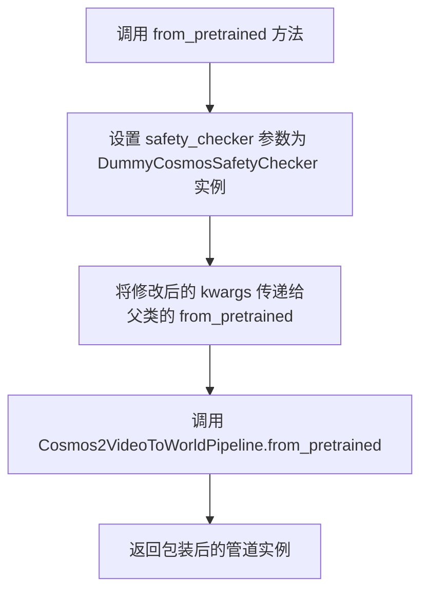
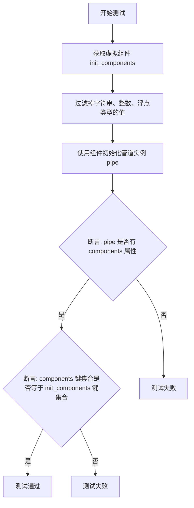
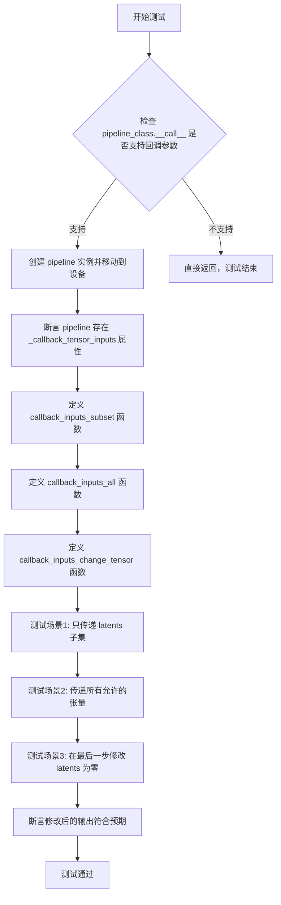
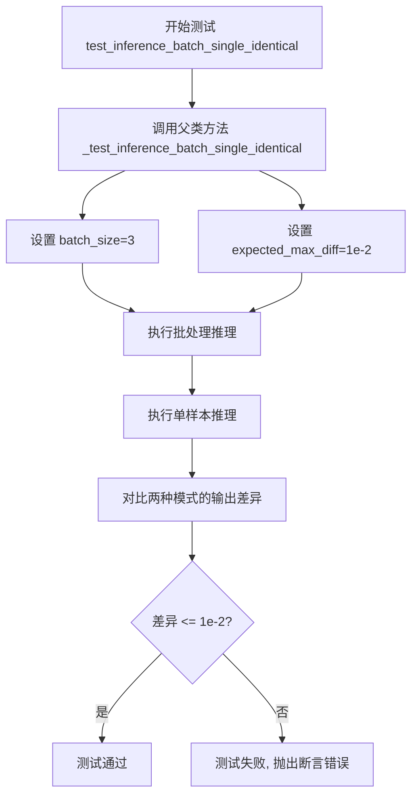
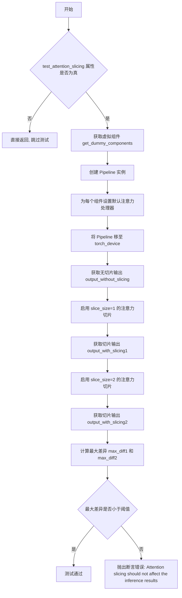
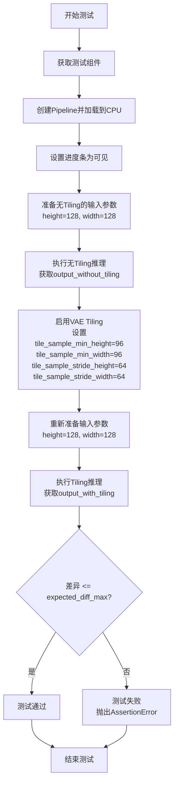
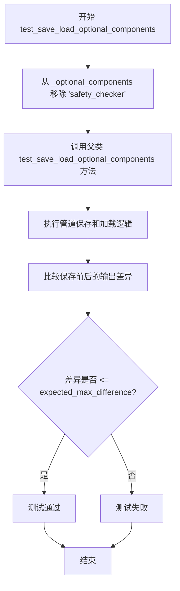
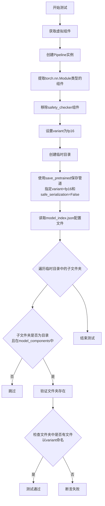
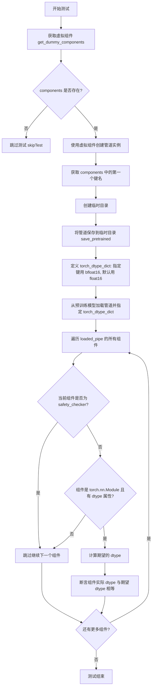
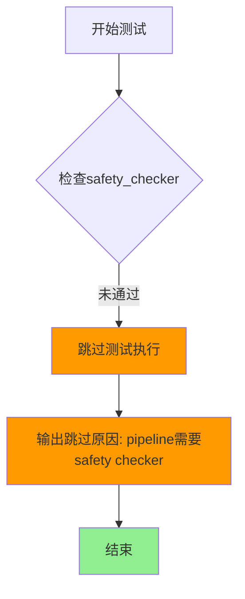

# `diffusers\tests\pipelines\cosmos\test_cosmos2_video2world.py` 详细设计文档

This file defines a comprehensive unit test suite for the Cosmos2VideoToWorldPipeline, ensuring the pipeline's core functionality (inference), component management, optimization features (attention slicing, VAE tiling), and serialization capabilities work correctly using dummy/fake components.

## 整体流程

```mermaid
graph TD
    Start[Unittest Runner] --> LoadTestClass[Load Cosmos2VideoToWorldPipelineFastTests]
    LoadTestClass --> InitTest[Instantiate Test Class]
    InitTest --> TestMethodLoop{Iterate Test Methods}
    TestMethodLoop --> Setup[Setup Phase]
    Setup --> GetComponents[Call get_dummy_components: Create Transformer, VAE, Scheduler, etc.]
    Setup --> GetInputs[Call get_dummy_inputs: Create Image, Prompt, Generator]
    Setup --> InstantiatePipeline[Instantiate Pipeline with Components]
    TestMethodLoop --> Execute[Execute Phase: pipe(**inputs)]
    Execute --> Assert[Assertion Phase: Check Shape, Values, Types]
    Assert --> TestMethodLoop
    TestMethodLoop -- Finished --> End[Test Run Complete]
```

## 类结构

```
unittest.TestCase
├── PipelineTesterMixin
│   └── Cosmos2VideoToWorldPipelineFastTests (Main Test Class)
└── Cosmos2VideoToWorldPipelineWrapper (Wrapper for Pipeline)
    └── Cosmos2VideoToWorldPipeline (External Base Class)
```

## 全局变量及字段


### `Cosmos2VideoToWorldPipelineFastTests.pipeline_class`
    
The pipeline class being tested (Cosmos2VideoToWorldPipelineWrapper)

类型：`type`
    


### `Cosmos2VideoToWorldPipelineFastTests.params`
    
Text-to-image generation parameters excluding cross_attention_kwargs

类型：`frozenset`
    


### `Cosmos2VideoToWorldPipelineFastTests.batch_params`
    
Batch parameters including image and video for batch processing

类型：`set`
    


### `Cosmos2VideoToWorldPipelineFastTests.image_params`
    
Image parameters for image-to-image generation tests

类型：`frozenset`
    


### `Cosmos2VideoToWorldPipelineFastTests.image_latents_params`
    
Image latents parameters for latent manipulation tests

类型：`frozenset`
    


### `Cosmos2VideoToWorldPipelineFastTests.required_optional_params`
    
Optional parameters that are required for pipeline execution (e.g., num_inference_steps, generator)

类型：`frozenset`
    


### `Cosmos2VideoToWorldPipelineFastTests.supports_dduf`
    
Flag indicating whether the pipeline supports DDUF (Decoupled Diffusion Upsampling Flow)

类型：`bool`
    


### `Cosmos2VideoToWorldPipelineFastTests.test_xformers_attention`
    
Flag to enable/disable xformers attention optimization testing (disabled for this pipeline)

类型：`bool`
    


### `Cosmos2VideoToWorldPipelineFastTests.test_layerwise_casting`
    
Flag to enable layerwise dtype casting tests for memory optimization

类型：`bool`
    


### `Cosmos2VideoToWorldPipelineFastTests.test_group_offloading`
    
Flag to enable group offloading tests for model sharding

类型：`bool`
    
    

## 全局函数及方法


### `Cosmos2VideoToWorldPipelineWrapper.from_pretrained`

这是一个静态方法，用于包装父类的 `from_pretrained` 方法，在加载预训练模型时自动注入一个虚拟的安全检查器（Dummy Safety Checker），以避免在测试环境中因 Cosmos Guardrail 模型过大而导致的问题。

参数：

- `*args`：可变位置参数，传递给父类 `from_pretrained` 方法的位置参数
- `**kwargs`：可变关键字参数，传递给父类 `from_pretrained` 方法的关键字参数

返回值：`Cosmos2VideoToWorldPipelineWrapper instance`，返回包装后的管道实例

#### 流程图



#### 带注释源码

```python
class Cosmos2VideoToWorldPipelineWrapper(Cosmos2VideoToWorldPipeline):
    # 继承自 Cosmos2VideoToWorldPipeline 类
    
    @staticmethod
    # 静态方法装饰器，表示该方法不需要访问类或实例属性
    def from_pretrained(*args, **kwargs):
        """
        静态方法：包装父类的 from_pretrained 以注入虚拟安全检查器
        
        该方法重写了父类的 from_pretrained，在参数中添加一个虚拟的
        安全检查器，避免在测试时加载过大的 Cosmos Guardrail 模型
        """
        # 将 safety_checker 参数设置为虚拟安全检查器实例
        kwargs["safety_checker"] = DummyCosmosSafetyChecker()
        
        # 调用父类的 from_pretrained 方法，传入修改后的参数
        return Cosmos2VideoToWorldPipeline.from_pretrained(*args, **kwargs)
```

#### 关键组件信息

| 组件名称 | 描述 |
|---------|------|
| `Cosmos2VideoToWorldPipeline` | 父类，提供了视频到世界的生成管道功能 |
| `DummyCosmosSafetyChecker` | 虚拟安全检查器，用于替代真实的 Cosmos Guardrail 以支持快速测试 |
| `CosmosTransformer3DModel` | 3D 变换器模型，用于视频生成 |
| `AutoencoderKLWan` | VAE 编码器-解码器模型 |
| `FlowMatchEulerDiscreteScheduler` | 调度器，用于控制扩散过程 |

#### 潜在的技术债务或优化空间

1. **硬编码的安全检查器注入**：当前实现直接将 `DummyCosmosSafetyChecker` 硬编码到方法中，缺乏灵活性。建议通过参数控制是否使用虚拟检查器。
2. **缺少参数验证**：没有对传入的 `kwargs` 进行验证或处理，可能导致意外的参数冲突。
3. **测试覆盖不完整**：代码中有一个被跳过的测试 `test_encode_prompt_works_in_isolation`，表明某些功能在测试环境中无法验证。

#### 其它项目

- **设计目标**：在保持与父类相同接口的同时，为测试环境提供轻量级的安全检查器解决方案
- **约束**：由于 Cosmos Guardrail 模型过大，无法在 CI 环境中运行，因此必须使用虚拟检查器
- **错误处理**：当前没有显式的错误处理逻辑，依赖父类实现
- **数据流**：参数通过 `kwargs` 传递，最终传递给 Diffusers 的 `from_pretrained` 方法


### `Cosmos2VideoToWorldPipelineFastTests.get_dummy_components`

该方法创建并返回一个包含虚拟模型组件的字典（Transformer、VAE、Scheduler、文本编码器、分词器等），用于单元测试目的，确保测试的可重复性和独立性。

参数：

- `self`：`Cosmos2VideoToWorldPipelineFastTests` 实例本身，无需显式传递

返回值：`dict`，键为组件名称（如 "transformer"、"vae" 等），值为对应的模型实例或调度器对象

#### 流程图

```mermaid
flowchart TD
    A[开始 get_dummy_components] --> B[设置随机种子 torch.manual_seed(0)]
    B --> C[创建 CosmosTransformer3DModel 实例]
    C --> D[设置随机种子 torch.manual_seed(0)]
    D --> E[创建 AutoencoderKLWan 实例]
    E --> F[设置随机种子 torch.manual_seed(0)]
    F --> G[创建 FlowMatchEulerDiscreteScheduler 实例]
    G --> H[加载 T5EncoderModel 预训练模型]
    H --> I[加载 AutoTokenizer 分词器]
    I --> J[创建 DummyCosmosSafetyChecker 实例]
    J --> K[构建 components 字典]
    K --> L[返回 components 字典]
```

#### 带注释源码

```python
def get_dummy_components(self):
    """
    创建并返回用于测试的虚拟组件字典
    
    该方法初始化所有必需的模型组件（Transformer、VAE、调度器、文本编码器等）
    用于单元测试，确保测试环境的一致性和可重复性
    """
    # 使用固定随机种子确保测试结果可重复
    torch.manual_seed(0)
    
    # 创建虚拟 3D Transformer 模型
    # 参数配置为测试用的小规模模型
    transformer = CosmosTransformer3DModel(
        in_channels=16 + 1,           # 输入通道数（16 + 1 用于条件）
        out_channels=16,              # 输出通道数
        num_attention_heads=2,        # 注意力头数量
        attention_head_dim=16,        # 注意力头维度
        num_layers=2,                 # Transformer 层数
        mlp_ratio=2,                  # MLP 扩展比率
        text_embed_dim=32,            # 文本嵌入维度
        adaln_lora_dim=4,             # LoRA 维度
        max_size=(4, 32, 32),         # 最大尺寸
        patch_size=(1, 2, 2),         # 补丁大小
        rope_scale=(2.0, 1.0, 1.0),   # 旋转位置编码缩放
        concat_padding_mask=True,     # 是否连接填充掩码
        extra_pos_embed_type="learnable"  # 额外位置嵌入类型
    )

    # 重新设置随机种子以确保 VAE 初始化独立
    torch.manual_seed(0)
    
    # 创建虚拟 VAE（变分自编码器）模型
    vae = AutoencoderKLWan(
        base_dim=3,                   # 基础维度（RGB 图像）
        z_dim=16,                     # 潜在空间维度
        dim_mult=[1, 1, 1, 1],        # 各层维度倍数
        num_res_blocks=1,             # 残差块数量
        temperal_downsample=[False, True, True]  # 时间维度下采样配置
    )

    # 再次设置随机种子
    torch.manual_seed(0)
    
    # 创建基于欧拉离散调度的流匹配调度器
    scheduler = FlowMatchEulerDiscreteScheduler(use_karras_sigmas=True)
    
    # 加载虚拟 T5 文本编码器（用于测试的小型随机模型）
    text_encoder = T5EncoderModel.from_pretrained("hf-internal-testing/tiny-random-t5")
    
    # 加载虚拟 T5 分词器
    tokenizer = AutoTokenizer.from_pretrained("hf-internal-testing/tiny-random-t5")

    # 组装所有组件到字典中
    components = {
        "transformer": transformer,              # 3D Transformer 模型
        "vae": vae,                              # VAE 编码器/解码器
        "scheduler": scheduler,                  # 噪声调度器
        "text_encoder": text_encoder,           # 文本编码器
        "tokenizer": tokenizer,                  # 文本分词器
        # 注释：Cosmos Guardrail 由于模型体积过大，无法在快速测试中运行
        "safety_checker": DummyCosmosSafetyChecker(),  # 虚拟安全检查器
    }
    
    # 返回包含所有模型组件的字典
    return components
```


### `Cosmos2VideoToWorldPipelineFastTests.get_dummy_inputs`

该方法用于生成测试用的虚拟输入参数，包括图像、提示词、负提示词、生成器以及推理所需的各类参数。根据设备类型（MPS或其他）选择不同的随机数生成器初始化方式，确保测试的可重复性。

参数：

- `self`：隐含的实例参数，表示类的实例本身
- `device`：`torch.device` 或 `str`，指定生成器和张量存放的设备（如 "cpu", "cuda", "mps" 等）
- `seed`：`int`，随机种子，默认值为 0，用于保证测试结果的可重复性

返回值：`dict`，包含以下键值对的字典：
- `image`：PIL.Image 对象，32x32 的 RGB 图像
- `prompt`：`str`，正向提示词 "dance monkey"
- `negative_prompt`：`str`，负向提示词 "bad quality"
- `generator`：`torch.Generator`，随机数生成器
- `num_inference_steps`：`int`，推理步数，值为 2
- `guidance_scale`：`float`，引导系数，值为 3.0
- `height`：`int`，图像高度，值为 32
- `width`：`int`，图像宽度，值为 32
- `num_frames`：`int`，视频帧数，值为 9
- `max_sequence_length`：`int`，最大序列长度，值为 16
- `output_type`：`str`，输出类型，值为 "pt"（PyTorch 张量）

#### 流程图

```mermaid
flowchart TD
    A[开始 get_dummy_inputs] --> B{判断设备类型}
    B -->|device 以 'mps' 开头| C[使用 torch.manual_seed(seed)]
    B -->|其他设备| D[使用 torch.Generator(device=device).manual_seed(seed)]
    C --> E[设置 image_height = 32]
    D --> E
    E --> F[设置 image_width = 32]
    F --> G[创建 32x32 RGB PIL Image]
    G --> H[构建输入字典 inputs]
    H --> I[返回 inputs 字典]
    I --> J[结束]
```

#### 带注释源码

```python
def get_dummy_inputs(self, device, seed=0):
    """
    生成用于 pipeline 测试的虚拟输入参数。
    
    参数:
        device: torch.device 或 str - 目标设备
        seed: int - 随机种子，默认 0
    
    返回:
        dict: 包含图像、提示词、生成器等推理参数的字典
    """
    # 判断是否为 MPS 设备（MPS 是 Apple Silicon 的 GPU 加速）
    if str(device).startswith("mps"):
        # MPS 设备使用 torch.manual_seed() 直接设置 CPU 随机种子
        generator = torch.manual_seed(seed)
    else:
        # 其他设备（CPU/CUDA）创建指定设备的生成器并设置种子
        generator = torch.Generator(device=device).manual_seed(seed)

    # 设置测试用图像的尺寸
    image_height = 32
    image_width = 32
    
    # 创建一个 32x32 的纯色 RGB 测试图像（所有像素为黑色 (0,0,0)）
    image = PIL.Image.new("RGB", (image_width, image_height))

    # 构建完整的输入参数字典，包含推理所需的所有配置
    inputs = {
        "image": image,                          # 输入图像
        "prompt": "dance monkey",                # 正向提示词
        "negative_prompt": "bad quality",        # 负向提示词
        "generator": generator,                  # 随机数生成器
        "num_inference_steps": 2,                # 推理步数（较少步数用于快速测试）
        "guidance_scale": 3.0,                   # CFG 引导强度
        "height": image_height,                  # 输出高度
        "width": image_width,                    # 输出宽度
        "num_frames": 9,                         # 生成视频的帧数
        "max_sequence_length": 16,               # 文本序列最大长度
        "output_type": "pt",                     # 输出为 PyTorch 张量
    }

    return inputs
```


### `Cosmos2VideoToWorldPipelineFastTests.test_inference`

该测试方法验证了 Cosmos2VideoToWorldPipeline 的基本推理流程，包括构建管道、执行推理、验证输出视频形状以及检查像素值的正确性。

参数：

- `self`：`Cosmos2VideoToWorldPipelineFastTests`，测试类的实例，包含测试所需的组件和配置

返回值：`void`，无返回值（测试方法通过断言进行验证）

#### 流程图

```mermaid
flowchart TD
    A[开始 test_inference] --> B[设置设备为 cpu]
    B --> C[调用 get_dummy_components 获取虚拟组件]
    C --> D[使用虚拟组件构建管道实例]
    D --> E[将管道移至 cpu 设备]
    E --> F[配置进度条: set_progress_bar_config]
    F --> G[调用 get_dummy_inputs 获取虚拟输入]
    G --> H[执行管道推理: pipe\*\*inputs]
    H --> I[获取生成的视频 frames]
    I --> J[提取第一个视频: video[0]]
    J --> K{验证视频形状是否为 (9, 3, 32, 32)}
    K -->|是| L[定义预期像素值切片]
    K -->|否| M[测试失败]
    L --> N[展平视频并提取首尾各8个像素]
    N --> O{验证生成像素与预期像素的接近度}
    O -->|是| P[测试通过]
    O -->|否| M
```

#### 带注释源码

```python
def test_inference(self):
    """测试管道的基本推理流程，验证输出视频形状和像素值"""
    
    # 1. 设置计算设备为 CPU
    device = "cpu"

    # 2. 获取虚拟组件（transformer, vae, scheduler, text_encoder, tokenizer, safety_checker）
    components = self.get_dummy_components()
    
    # 3. 使用虚拟组件实例化管道
    pipe = self.pipeline_class(**components)
    
    # 4. 将管道移至指定设备（CPU）
    pipe.to(device)
    
    # 5. 配置进度条（disable=None 表示启用进度条）
    pipe.set_progress_bar_config(disable=None)

    # 6. 获取虚拟输入参数
    # 包含: image, prompt, negative_prompt, generator, num_inference_steps,
    #       guidance_scale, height, width, num_frames, max_sequence_length, output_type
    inputs = self.get_dummy_inputs(device)
    
    # 7. 执行推理并获取返回结果
    # pipe(**inputs) 返回一个包含 frames 属性的对象
    video = pipe(**inputs).frames
    
    # 8. 提取生成的视频（取第一个元素，因为可能返回批量视频）
    generated_video = video[0]
    
    # 9. 断言验证：视频形状应为 (9帧, 3通道, 32高度, 32宽度)
    # 9 = num_frames, 3 = RGB通道, 32x32 = 图像分辨率
    self.assertEqual(generated_video.shape, (9, 3, 32, 32))

    # 10. 定义预期像素值切片（用于验证生成质量的确定性）
    # fmt: off
    expected_slice = torch.tensor([
        0.451, 0.451, 0.4471, 0.451, 0.451, 0.451, 0.451, 0.451,  # 前8个像素
        0.5098, 0.5137, 0.5176, 0.5098, 0.5255, 0.5412, 0.5098, 0.5059  # 后8个像素
    ])
    # fmt: on

    # 11. 从生成的视频中提取用于比较的像素切片
    # 将视频展平为一维，然后取首尾各8个像素（共16个）
    generated_slice = generated_video.flatten()
    generated_slice = torch.cat([generated_slice[:8], generated_slice[-8:]])
    
    # 12. 断言验证：生成像素值应与预期值接近（容差 1e-3）
    # 使用 torch.allclose 进行浮点数近似比较
    self.assertTrue(torch.allclose(generated_slice, expected_slice, atol=1e-3))
```


### `Cosmos2VideoToWorldPipelineFastTests.test_components_function`

该测试方法验证管道实例化后具有 `components` 属性，且该属性的键与初始化时传入的组件键完全匹配，确保管道正确保存了对所有组件的引用。

参数：

- `self`：`Cosmos2VideoToWorldPipelineFastTests`，测试类的实例，隐式参数

返回值：`void`（`None`），无返回值，该方法通过 `assert` 语句进行断言验证

#### 流程图



#### 带注释源码

```python
def test_components_function(self):
    """
    验证管道具有 'components' 属性，且该属性的键与初始化时传入的组件键完全匹配。
    """
    # 步骤1: 获取虚拟组件字典（包含 transformer, vae, scheduler, text_encoder, tokenizer, safety_checker）
    init_components = self.get_dummy_components()
    
    # 步骤2: 过滤掉字符串、整数、浮点类型的值，仅保留实际的组件对象（如 PyTorch 模块）
    # 这是因为某些配置值（如字符串路径）不应被视为需要跟踪的组件
    init_components = {k: v for k, v in init_components.items() if not isinstance(v, (str, int, float))}
    
    # 步骤3: 使用过滤后的组件字典实例化管道
    pipe = self.pipeline_class(**init_components)
    
    # 步骤4: 断言管道具有 'components' 属性
    # 这是 Cosmos2VideoToWorldPipeline 应有的属性，用于存储所有组件的引用
    self.assertTrue(hasattr(pipe, "components"))
    
    # 步骤5: 断言 components 字典的键与初始化时传入的组件键完全匹配
    # 确保管道正确保存了所有传入组件的引用，且没有遗漏或多余
    self.assertTrue(set(pipe.components.keys()) == set(init_components.keys()))
```


### Cosmos2VideoToWorldPipelineFastTests.test_callback_inputs

该方法用于测试 Cosmos2VideoToWorldPipeline 的回调功能，验证 `callback_on_step_end` 和 `callback_on_step_end_tensor_inputs` 参数的正确性，确保在推理过程中能够通过回调函数操作张量（如修改 latents）。

参数：

- `self`：unittest.TestCase，当前测试类实例

返回值：`void`，无返回值

#### 流程图



#### 带注释源码

```python
def test_callback_inputs(self):
    """
    测试回调功能 (callback_on_step_end)，允许在推理过程中操作张量。
    验证 pipeline 支持回调参数并能正确处理张量输入。
    """
    # 获取 pipeline __call__ 方法的签名
    sig = inspect.signature(self.pipeline_class.__call__)
    
    # 检查是否支持 callback_on_step_end_tensor_inputs 参数
    has_callback_tensor_inputs = "callback_on_step_end_tensor_inputs" in sig.parameters
    # 检查是否支持 callback_on_step_end 参数
    has_callback_step_end = "callback_on_step_end" in sig.parameters

    # 如果 pipeline 不支持这些回调参数，则直接返回
    if not (has_callback_tensor_inputs and has_callback_step_end):
        return

    # 获取虚拟组件并创建 pipeline 实例
    components = self.get_dummy_components()
    pipe = self.pipeline_class(**components)
    # 将 pipeline 移动到测试设备 (torch_device)
    pipe = pipe.to(torch_device)
    # 配置进度条
    pipe.set_progress_bar_config(disable=None)
    
    # 断言 pipeline 必须有 _callback_tensor_inputs 属性
    # 该属性定义了回调函数可以使用的张量变量列表
    self.assertTrue(
        hasattr(pipe, "_callback_tensor_inputs"),
        f" {self.pipeline_class} should have `_callback_tensor_inputs` that defines a list of tensor variables its callback function can use as inputs",
    )

    def callback_inputs_subset(pipe, i, t, callback_kwargs):
        """
        回调函数：验证只传递了允许的张量输入的子集
        """
        # 遍历回调参数中的所有张量
        for tensor_name, tensor_value in callback_kwargs.items():
            # 检查传递的张量是否在允许的列表中
            assert tensor_name in pipe._callback_tensor_inputs

        return callback_kwargs

    def callback_inputs_all(pipe, i, t, callback_kwargs):
        """
        回调函数：验证所有允许的张量输入都被传递
        """
        # 检查所有允许的张量都在回调参数中
        for tensor_name in pipe._callback_tensor_inputs:
            assert tensor_name in callback_kwargs

        # 再次验证回调参数中的每个张量都是允许的
        for tensor_name, tensor_value in callback_kwargs.items():
            assert tensor_name in pipe._callback_tensor_inputs

        return callback_kwargs

    # 获取测试输入
    inputs = self.get_dummy_inputs(torch_device)

    # ===== 测试场景1: 传递张量子集 =====
    # 只允许回调访问 latents
    inputs["callback_on_step_end"] = callback_inputs_subset
    inputs["callback_on_step_end_tensor_inputs"] = ["latents"]
    # 执行推理
    output = pipe(**inputs)[0]

    # ===== 测试场景2: 传递所有允许的张量 =====
    # 允许回调访问所有允许的张量
    inputs["callback_on_step_end"] = callback_inputs_all
    inputs["callback_on_step_end_tensor_inputs"] = pipe._callback_tensor_inputs
    # 执行推理
    output = pipe(**inputs)[0]

    def callback_inputs_change_tensor(pipe, i, t, callback_kwargs):
        """
        回调函数：在最后一步将 latents 修改为零张量
        用于测试回调能否真正修改推理过程中的张量
        """
        # 判断是否为最后一步
        is_last = i == (pipe.num_timesteps - 1)
        if is_last:
            # 将 latents 修改为零张量
            callback_kwargs["latents"] = torch.zeros_like(callback_kwargs["latents"])
        return callback_kwargs

    # ===== 测试场景3: 修改张量值 =====
    inputs["callback_on_step_end"] = callback_inputs_change_tensor
    inputs["callback_on_step_end_tensor_inputs"] = pipe._callback_tensor_inputs
    # 执行推理
    output = pipe(**inputs)[0]
    # 断言：由于 latents 被置零，输出的绝对值之和应该很小
    assert output.abs().sum() < 1e10
```


### `Cosmos2VideoToWorldPipelineFastTests.test_inference_batch_single_identical`

该测试方法验证管道在批处理模式下的输出与单样本处理模式的输出是否一致，确保批处理逻辑不会引入数值误差。

参数：

- `self`：`Cosmos2VideoToWorldPipelineFastTests`，测试类实例，代表当前测试用例

返回值：`void`（`None`），测试方法无返回值，通过断言验证结果

#### 流程图



#### 带注释源码

```python
def test_inference_batch_single_identical(self):
    """
    Tests that batch processing produces identical results to single processing.
    
    该测试方法验证 Cosmos2VideoToWorldPipeline 管道在批处理模式下
    生成的视频帧与单样本处理模式生成的视频帧在数值上保持一致，
    确保批处理优化不会引入额外的数值误差。
    
    测试逻辑:
    - 调用继承自 PipelineTesterMixin 的 _test_inference_batch_single_identical 方法
    - 使用 batch_size=3 进行批处理测试
    - 允许的最大差异阈值为 1e-2 (0.01)
    """
    # 调用父类/混合类的通用批处理一致性测试方法
    # 参数:
    #   batch_size: 批处理样本数量, 设为3以测试小批量场景
    #   expected_max_diff: 允许的最大数值差异, 1e-2 表示批处理和单处理的
    #                      输出差异应小于等于0.01
    self._test_inference_batch_single_identical(batch_size=3, expected_max_diff=1e-2)
```


### `Cosmos2VideoToWorldPipelineFastTests.test_attention_slicing_forward_pass`

验证注意力切片（attention slicing）优化不会改变输出结果。通过对比启用注意力切片前后的推理输出差异，确保优化方法在减少内存占用的同时保持数值精度。

参数：

- `self`：`Cosmos2VideoToWorldPipelineFastTests`，测试类实例本身
- `test_max_difference`：`bool`，是否测试最大差异，默认为 `True`
- `test_mean_pixel_difference`：`bool`，是否测试平均像素差异，默认为 `True`（当前未被使用）
- `expected_max_diff`：`float`，允许的最大差异阈值，默认为 `1e-3`

返回值：`void`，无返回值（测试方法）

#### 流程图



#### 带注释源码

```python
def test_attention_slicing_forward_pass(
    self, test_max_difference=True, test_mean_pixel_difference=True, expected_max_diff=1e-3
):
    """
    验证注意力切片优化不会改变输出结果。
    
    参数:
        test_max_difference: 是否测试最大差异
        test_mean_pixel_difference: 是否测试平均像素差异（当前未使用）
        expected_max_diff: 允许的最大差异阈值
    """
    # 如果测试类未启用注意力切片测试，则直接返回
    if not self.test_attention_slicing:
        return

    # 步骤1: 获取虚拟组件（用于测试的模拟模型组件）
    components = self.get_dummy_components()
    
    # 步骤2: 使用虚拟组件创建 Pipeline 实例
    pipe = self.pipeline_class(**components)
    
    # 步骤3: 为所有组件设置默认的注意力处理器
    for component in pipe.components.values():
        if hasattr(component, "set_default_attn_processor"):
            component.set_default_attn_processor()
    
    # 步骤4: 将 Pipeline 移动到测试设备（CPU/CUDA）
    pipe.to(torch_device)
    pipe.set_progress_bar_config(disable=None)

    # 步骤5: 获取测试输入（使用 CPU 生成器确保确定性）
    generator_device = "cpu"
    inputs = self.get_dummy_inputs(generator_device)
    
    # 步骤6: 执行不带注意力切片的推理，获取基准输出
    output_without_slicing = pipe(**inputs)[0]

    # 步骤7: 启用 slice_size=1 的注意力切片，重新推理
    pipe.enable_attention_slicing(slice_size=1)
    inputs = self.get_dummy_inputs(generator_device)
    output_with_slicing1 = pipe(**inputs)[0]

    # 步骤8: 启用 slice_size=2 的注意力切片，再次推理
    pipe.enable_attention_slicing(slice_size=2)
    inputs = self.get_dummy_inputs(generator_device)
    output_with_slicing2 = pipe(**inputs)[0]

    # 步骤9: 如果需要测试最大差异
    if test_max_difference:
        # 计算切片输出与基准输出的最大绝对差异
        max_diff1 = np.abs(to_np(output_with_slicing1) - to_np(output_without_slicing)).max()
        max_diff2 = np.abs(to_np(output_with_slicing2) - to_np(output_without_slicing)).max()
        
        # 断言：注意力切片不应影响推理结果
        self.assertLess(
            max(max_diff1, max_diff2),
            expected_max_diff,
            "Attention slicing should not affect the inference results",
        )
```


### `Cosmos2VideoToWorldPipelineFastTests.test_vae_tiling`

验证 VAE tiling（分块处理）产生的结果与未使用分块处理的结果相近，确保 VAE tiling 不会影响推理结果的质量。

参数：

- `self`：测试类实例本身，无需显式传递
- `expected_diff_max`：`float`，允许的最大差异阈值，默认为 0.2

返回值：`void`，无返回值（测试方法通过断言验证结果）

#### 流程图



#### 带注释源码

```python
def test_vae_tiling(self, expected_diff_max: float = 0.2):
    """
    验证 VAE tiling（分块处理）产生的结果与未使用分块处理的结果相近。
    
    参数:
        expected_diff_max: float, 允许的最大差异阈值, 默认为 0.2
    返回:
        void, 无返回值(通过断言验证)
    """
    # 设置生成器设备为CPU
    generator_device = "cpu"
    # 获取虚拟组件(模型、VAE、调度器等)
    components = self.get_dummy_components()

    # 使用虚拟组件创建Pipeline实例
    pipe = self.pipeline_class(**components)
    # 将Pipeline移动到CPU设备
    pipe.to("cpu")
    # 设置进度条配置(禁用=None表示启用进度条)
    pipe.set_progress_bar_config(disable=None)

    # --- 第一部分: 不使用Tiling的推理 ---
    # 获取虚拟输入参数
    inputs = self.get_dummy_inputs(generator_device)
    # 设置输入图像高度和宽度为128
    inputs["height"] = inputs["width"] = 128
    # 执行推理并获取结果(取第一帧)
    output_without_tiling = pipe(**inputs)[0]

    # --- 第二部分: 使用Tiling的推理 ---
    # 启用VAE tiling,设置分块参数
    pipe.vae.enable_tiling(
        tile_sample_min_height=96,    # 分块最小高度
        tile_sample_min_width=96,     # 分块最小宽度
        tile_sample_stride_height=64, # 垂直步长
        tile_sample_stride_width=64,   # 水平步长
    )
    # 重新获取虚拟输入参数
    inputs = self.get_dummy_inputs(generator_device)
    # 再次设置输入图像高度和宽度为128
    inputs["height"] = inputs["width"] = 128
    # 执行推理并获取结果(取第一帧)
    output_with_tiling = pipe(**inputs)[0]

    # --- 验证部分 ---
    # 断言: 使用tiling和不使用tiling的输出差异应小于预期最大差异
    # 将torch张量转换为numpy数组进行数值比较
    self.assertLess(
        (to_np(output_without_tiling) - to_np(output_with_tiling)).max(),
        expected_diff_max,
        "VAE tiling should not affect the inference results"
    )
```


### `Cosmos2VideoToWorldPipelineFastTests.test_save_load_optional_components`

测试保存和加载管道时可选组件的处理能力，验证管道在包含或排除可选组件时能否正确序列化和反序列化。

参数：

- `self`：`Cosmos2VideoToWorldPipelineFastTests`，调用该方法的测试类实例
- `expected_max_difference`：`float`，期望的最大差异值，用于比较保存前后的模型输出差异，默认为 `1e-4`

返回值：`void`，无返回值（`None`）

#### 流程图



#### 带注释源码

```python
def test_save_load_optional_components(self, expected_max_difference=1e-4):
    """
    测试保存和加载管道时可选组件的处理。
    
    该测试方法验证管道在包含可选组件时能够正确序列化和反序列化。
    具体流程如下：
    1. 从管道的可选组件列表中临时移除 'safety_checker'
    2. 调用父类的测试方法执行完整的保存/加载测试
    3. 将 'safety_checker' 添加回可选组件列表
    
    参数:
        expected_max_difference (float): 保存前后模型输出的最大允许差异，默认值为 1e-4
        
    返回值:
        None: 该方法为测试方法，不返回任何值
        
    注意:
        - 该测试依赖父类 PipelineTesterMixin.test_save_load_optional_components 的实现
        - safety_checker 被临时移除是为了测试可选组件的序列化能力
    """
    
    # 步骤1: 从管道的可选组件列表中移除 safety_checker
    # 这样保存时不会包含 safety_checker，测试可选组件的加载能力
    self.pipeline_class._optional_components.remove("safety_checker")
    
    # 步骤2: 调用父类的测试方法执行实际的保存/加载测试
    # 父类方法会:
    #   a. 创建管道实例
    #   b. 执行一次推理获取基准输出
    #   c. 保存管道到临时目录
    #   d. 从临时目录加载管道
    #   e. 执行推理获取加载后的输出
    #   f. 比较两次输出的差异是否在允许范围内
    super().test_save_load_optional_components(expected_max_difference=expected_max_difference)
    
    # 步骤3: 将 safety_checker 添加回可选组件列表
    # 恢复原始状态，确保其他测试不受影响
    self.pipeline_class._optional_components.append("safety_checker")
```


### `Cosmos2VideoToWorldPipelineFastTests.test_serialization_with_variants`

该测试方法用于验证管道在使用特定模型变体（如 fp16）保存时的序列化和文件结构是否符合预期，确保保存的模型文件正确包含变体信息。

参数：

- `self`：无名称，`unittest.TestCase`，测试类实例本身

返回值：`void`，无返回值，该方法为单元测试，通过 assert 语句进行验证

#### 流程图



#### 带注释源码

```python
def test_serialization_with_variants(self):
    """
    测试使用特定模型变体（如fp16）保存管道并验证文件结构。
    
    该测试执行以下步骤：
    1. 创建包含虚拟组件的pipeline实例
    2. 识别所有torch.nn.Module类型的模型组件
    3. 使用fp16变体保存pipeline到临时目录
    4. 验证保存的文件结构包含变体信息
    """
    # 获取虚拟组件，用于测试
    components = self.get_dummy_components()
    
    # 使用虚拟组件创建pipeline实例
    pipe = self.pipeline_class(**components)
    
    # 从pipeline中提取所有torch.nn.Module类型的组件名称
    # 这些是需要保存为模型文件的组件
    model_components = [
        component_name
        for component_name, component in pipe.components.items()
        if isinstance(component, torch.nn.Module)
    ]
    
    # 移除safety_checker，因为它不是torch.nn.Module且不需要保存
    model_components.remove("safety_checker")
    
    # 设置要测试的模型变体类型为fp16
    variant = "fp16"

    # 创建临时目录用于保存模型
    with tempfile.TemporaryDirectory() as tmpdir:
        # 使用save_pretrained保存pipeline
        # variant=fp16: 指定保存为fp16变体
        # safe_serialization=False: 使用pickle而非safetensors
        pipe.save_pretrained(tmpdir, variant=variant, safe_serialization=False)

        # 读取model_index.json配置文件
        # 该文件包含pipeline的配置信息
        with open(f"{tmpdir}/model_index.json", "r") as f:
            config = json.load(f)

        # 遍历临时目录中的所有子文件夹
        for subfolder in os.listdir(tmpdir):
            # 检查子文件夹是否为目录且在model_components中
            if not os.path.isfile(subfolder) and subfolder in model_components:
                # 构建子文件夹的完整路径
                folder_path = os.path.join(tmpdir, subfolder)
                
                # 验证文件夹存在且在config中
                is_folder = os.path.isdir(folder_path) and subfolder in config
                
                # 断言验证：
                # 1. 文件夹确实存在
                # 2. 文件夹中至少有一个文件以variant（fp16）命名
                #    文件命名格式通常为：model_name.fp16.safetensors 或 similar
                assert is_folder and any(
                    p.split(".")[1].startswith(variant) 
                    for p in os.listdir(folder_path)
                )
```


### Cosmos2VideoToWorldPipelineFastTests.test_torch_dtype_dict

Tests loading the pipeline with specific torch dtypes (bfloat16/float16) for different components. This test verifies that when loading a pipeline with a `torch_dtype_dict` specifying dtypes for specific components and a default dtype, each component is correctly loaded with the expected dtype.

参数：

- `self`：无参数类型，这是 Python unittest 测试类的实例方法

返回值：`void`，该方法为单元测试方法，不返回任何值，通过 `self.assertEqual` 断言验证结果

#### 流程图



#### 带注释源码

```python
def test_torch_dtype_dict(self):
    """测试使用特定的 torch dtype 字典加载管道，验证各组件的 dtype 是否正确设置"""
    
    # Step 1: 获取虚拟组件（用于测试的轻量级模型组件）
    components = self.get_dummy_components()
    
    # Step 2: 如果没有虚拟组件，则跳过测试
    if not components:
        self.skipTest("No dummy components defined.")

    # Step 3: 使用虚拟组件创建管道实例
    pipe = self.pipeline_class(**components)

    # Step 4: 获取 components 字典中的第一个键名，用于后续测试
    specified_key = next(iter(components.keys()))

    # Step 5: 创建临时目录用于保存和加载模型
    with tempfile.TemporaryDirectory(ignore_cleanup_errors=True) as tmpdirname:
        # Step 6: 将管道保存到临时目录（不采用安全序列化）
        pipe.save_pretrained(tmpdirname, safe_serialization=False)
        
        # Step 7: 定义 torch_dtype_dict，指定特定组件的 dtype 和默认 dtype
        # - specified_key: 使用 bfloat16
        # - default: 使用 float16（用于其他未明确指定的组件）
        torch_dtype_dict = {specified_key: torch.bfloat16, "default": torch.float16}
        
        # Step 8: 从预训练路径加载管道，传入 torch_dtype_dict 参数
        # safety_checker 需要显式传入，因为 DummyCosmosSafetyChecker 不是默认配置的一部分
        loaded_pipe = self.pipeline_class.from_pretrained(
            tmpdirname, safety_checker=DummyCosmosSafetyChecker(), torch_dtype=torch_dtype_dict
        )

    # Step 9: 遍历加载后管道的所有组件，验证 dtype 是否正确
    for name, component in loaded_pipe.components.items():
        # 跳过 safety_checker，不验证其 dtype
        if name == "safety_checker":
            continue
        
        # 只检查 torch.nn.Module 类型且有 dtype 属性的组件
        if isinstance(component, torch.nn.Module) and hasattr(component, "dtype"):
            # 获取期望的 dtype：
            # - 如果组件名在 torch_dtype_dict 中，使用对应的值
            # - 否则使用 "default" 对应的值
            # - 如果都没有，默认使用 float32
            expected_dtype = torch_dtype_dict.get(name, torch_dtype_dict.get("default", torch.float32))
            
            # 断言：组件的实际 dtype 应该等于期望的 dtype
            self.assertEqual(
                component.dtype,
                expected_dtype,
                f"Component '{name}' has dtype {component.dtype} but expected {expected_dtype}",
            )
```


### `Cosmos2VideoToWorldPipelineFastTests.test_encode_prompt_works_in_isolation`

这是一个被跳过的占位测试用例，用于测试提示词编码的隔离功能。由于 Cosmos Guardrail 模型过大且运行缓慢，不适合在 CI 环境中运行，因此该测试被禁用。

参数：

- `self`：`Cosmos2VideoToWorldPipelineFastTests`，测试类实例本身

返回值：`None`，无返回值（测试被跳过）

#### 流程图



#### 带注释源码

```python
@unittest.skip(
    "The pipeline should not be runnable without a safety checker. The test creates a pipeline without passing in "
    "a safety checker, which makes the pipeline default to the actual Cosmos Guardrail. The Cosmos Guardrail is "
    "too large and slow to run on CI."
)
def test_encode_prompt_works_in_isolation(self):
    """
    占位测试用例，用于验证提示词编码能否在隔离环境中工作。
    
    注意：该测试当前被跳过，原因如下：
    1. Pipeline 不能在未配置 safety_checker 的情况下运行
    2. 测试会创建不带 safety_checker 的 pipeline，导致使用默认的 Cosmos Guardrail
    3. Cosmos Guardrail 模型过大，不适合在 CI 环境中运行
    
    测试目的（预期实现）：
    - 验证 prompt 编码功能可以独立于 pipeline 主逻辑运行
    - 确保 text_encoder 和 tokenizer 可以正确处理输入提示词
    - 检查编码结果的质量和一致性
    """
    pass  # 空实现，测试被跳过
```

## 关键组件


### Cosmos2VideoToWorldPipelineWrapper

包装类，继承自Cosmos2VideoToWorldPipeline，通过from_pretrained静态方法自动注入DummyCosmosSafetyChecker，以支持快速测试而无需加载大型真实安全检查器模型。

### Cosmos2VideoToWorldPipelineFastTests

核心测试类，继承自PipelineTesterMixin和unittest.TestCase，封装了Cosmos2VideoToWorldPipeline的全面测试套件，包括推理验证、组件功能、回调机制、注意力切片、VAE平铺、序列化等测试场景。

### DummyCosmosSafetyChecker

虚拟安全检查器类，继承自cosmos_guardrail模块的CosmosSafetyChecker，用于替代真实的Cosmos Guardrail以支持快速测试，避免在CI环境中加载过大的模型。

### get_dummy_components

工厂方法，创建虚拟的Transformer、VAE、Scheduler、TextEncoder和Tokenizer组件，用于测试。通过torch.manual_seed(0)确保可重复性，配置小规模模型参数（2层注意力、16维头等）。

### get_dummy_inputs

工厂方法，创建虚拟输入数据，包括PIL图像、提示词、负提示词、生成器、推理步数、引导scale、输出尺寸和帧数等参数。支持MPS设备兼容性处理。

### test_inference

验证管道基本推理功能的核心测试，创建虚拟组件和输入，执行管道调用，检查输出视频形状是否为(9, 3, 32, 32)，并通过torch.allclose验证数值精度。

### test_components_function

测试管道components属性的功能，验证components字典包含所有初始化组件且键值匹配。

### test_callback_inputs

测试推理过程中回调机制的高级测试，验证callback_on_step_end和callback_on_step_end_tensor_inputs参数的功能，包括张量输入验证和回调中修改latents的能力。

### test_attention_slicing_forward_pass

测试注意力切片优化功能，比较启用/禁用注意力切片时的推理结果差异，确保优化不影响输出质量。

### test_vae_tiling

测试VAE平铺功能的测试，验证在启用tiling处理高分辨率(128x128)输入时与不使用tiling的输出差异在预期范围内。

### test_save_load_optional_components

测试可选组件的保存和加载功能，特别针对safety_checker的序列化和反序列化处理。

### test_serialization_with_variants

测试模型变体序列化功能，验证save_pretrained时指定variant参数后，不同组件目录中是否生成了对应的variant文件。

### test_torch_dtype_dict

测试torch_dtype字典功能，验证从pretrained加载时根据torch_dtype_dict字典为各组件应用指定的数据类型（如fp16）。

### PipelineTesterMixin

测试混入类，提供管道测试的通用基础设施方法，包括_test_inference_batch_single_identical等共享测试逻辑。

### TEXT_TO_IMAGE_PARAMS / TEXT_TO_IMAGE_BATCH_PARAMS / TEXT_TO_IMAGE_IMAGE_PARAMS

测试参数集合定义，指定哪些参数用于不同类型的测试（单图、批量图、图像参数等）。


## 问题及建议


### 已知问题

-   **类变量非线程安全操作**：`test_save_load_optional_components` 方法直接修改类变量 `self.pipeline_class._optional_components`，在并行测试执行时可能导致竞态条件
-   **冗余的随机种子设置**：`get_dummy_components` 方法中多次调用 `torch.manual_seed(0)`（第52、58、63行），第一次设置后续被覆盖，造成不必要的重复操作
-   **硬编码的测试参数**：图像尺寸固定为32x32、帧数为9、推理步数为2，这些极小的测试参数可能无法真实反映生产环境的性能特征
-   **魔数缺乏解释**：`expected_slice` 中的数值、`expected_max_diff=0.2`（VAE tiling测试）等阈值缺乏注释说明其选取依据
-   **空实现测试**：`test_encode_prompt_works_in_isolation` 方法仅有 `pass` 语句且被跳过，浪费测试框架资源
-   **格式清理注释**：`# fmt: off` 和 `# fmt: on` 表明代码格式化被临时禁用，应避免此类实践
-   **过滤逻辑不够健壮**：`test_components_function` 中使用 `isinstance(v, (str, int, float))` 过滤组件的方式较为hacky，可能遗漏其他基本类型

### 优化建议

-   **使用深拷贝处理类变量**：在修改 `_optional_components` 前创建副本，测试完成后恢复，避免影响其他测试用例
-   **提取公共测试逻辑**：将 `get_dummy_components` 和 `get_dummy_inputs` 的重复设置逻辑抽象为测试基类的类方法或fixture
-   **参数化测试配置**：将硬编码的测试参数（图像尺寸、帧数、推理步数）提取为类常量或配置文件，便于调整和扩展
-   **添加阈值注释**：为关键阈值（如VAE tiling的0.2、attention slicing的1e-3）添加文档注释说明其业务意义和选取依据
-   **清理空测试**：直接删除 `test_encode_prompt_works_in_isolation` 方法或添加有意义的测试逻辑
-   **启用代码格式化**：移除 `# fmt: off/on` 注释，保持代码风格一致性
-   **改进类型过滤逻辑**：使用更明确的组件类型检查或依赖注入模式替代当前的黑名单过滤方式
-   **添加资源清理验证**：移除 `ignore_cleanup_errors=True` 参数，确保临时文件正确清理

## 其它


### 设计目标与约束

本测试文件旨在验证Cosmos2VideoToWorldPipeline的核心功能，包括推理流程、组件管理、模型序列化、注意力切片、VAE平铺等特性。测试约束包括：无法在快速测试中运行完整的Cosmos Guardrail（模型过大），仅支持CPU设备推理，使用虚拟的DummyCosmosSafetyChecker替代真实安全检查器。

### 错误处理与异常设计

测试类通过unittest框架进行断言验证，使用torch.allclose进行浮点数近似比较（atol=1e-3）。对于MPS设备使用torch.manual_seed替代Generator。对于可选组件safety_checker，通过_pipeline_class._optional_components进行动态管理。部分测试用@unittest.skip装饰器跳过（如test_encode_prompt_works_in_isolation）。

### 数据流与状态机

测试数据流：get_dummy_components()创建虚拟模型组件 → get_dummy_inputs()生成输入参数（包含image、prompt、negative_prompt等） → pipeline调用__call__执行推理 → 返回frames结果。状态转换：组件初始化 → 设备转移(to(device)) → 推理执行 → 结果验证。

### 外部依赖与接口契约

主要依赖：transformers(AutoTokenizer, T5EncoderModel)、diffusers(Cosmos2VideoToWorldPipeline等)、torch、numpy、PIL、tempfile、json、inspect。Pipeline接口遵循HuggingFace Diffusers标准：from_pretrained类方法加载模型，__call__方法执行推理，支持callback_on_step_end和callback_on_step_end_tensor_inputs回调机制。

### 性能特征与基准

测试覆盖性能相关特性：attention_slicing（测试不同slice_size=1和2）、vae_tiling（tile_sample_min_height/width=96，stride=64）、torch_dtype_dict支持fp16/bfloat16。性能基准：test_attention_slicing预期最大差异1e-3，test_vae_tiling预期最大差异0.2，test_save_load_optional_components预期最大差异1e-4。

### 配置与参数说明

关键参数：num_inference_steps=2（推理步数）、guidance_scale=3.0（引导系数）、height/width=32（图像尺寸）、num_frames=9（视频帧数）、max_sequence_length=16（最大序列长度）、output_type="pt"（输出类型）。Transformer配置：in_channels=17(16+1)、out_channels=16、num_layers=2、mlp_ratio=2。VAE配置：base_dim=3、z_dim=16、dim_mult=[1,1,1,1]。

### 版本兼容性考虑

测试代码适用于HuggingFace Diffusers库，需配合transformers库使用。测试标记test_layerwise_casting=True和test_group_offloading=True表明支持PyTorch的张量分层类型转换和模型组卸载特性。test_xformers_attention=False表明未启用xFormers优化。

### 安全考虑

使用DummyCosmosSafetyChecker替代真实的Cosmos Guardrail进行测试，避免大模型加载。safety_checker作为可选组件在test_save_load_optional_components中动态移除和恢复。test_torch_dtype_dict测试中显式处理safety_checker以避免类型检查。

### 测试策略与覆盖率

测试覆盖范围：基础推理(test_inference)、组件功能(test_components_function)、回调机制(test_callback_inputs)、批处理一致性(test_inference_batch_single_identical)、注意力切片(test_attention_slicing_forward_pass)、VAE平铺(test_vae_tiling)、序列化与变体(test_serialization_with_variants、test_torch_dtype_dict)、可选组件保存加载(test_save_load_optional_components)。

### 并发与线程安全

测试主要针对单线程顺序执行，未涉及并发场景。Generator使用torch.Generator进行确定性随机数生成，确保测试可重复性。enable_full_determinism()函数启用完全确定性模式。

### 资源清理与生命周期

使用tempfile.TemporaryDirectory()自动管理临时目录清理（ignore_cleanup_errors=True）。Pipeline组件通过unittest.TestCase管理，测试结束后自动释放。PIL.Image在get_dummy_inputs中创建，无显式资源释放但生命周期随测试结束。

### 命名规范与代码风格

遵循HuggingFace Diffusers代码规范：类名使用CamelCase，方法名使用snake_case。测试方法以test_前缀开头。魔法数字使用变量命名（image_height=32等）。格式化：fmt: off/on用于禁用/启用black格式化。


    