# `diffusers\tests\pipelines\cosmos\test_cosmos_video2world.py` 详细设计文档

该文件是CosmosVideoToWorldPipeline的单元测试套件，包含对视频生成管道的完整性测试，涵盖推理、组件加载、批处理一致性、注意力切片、VAE平铺、模型序列化等核心功能模块。

## 整体流程

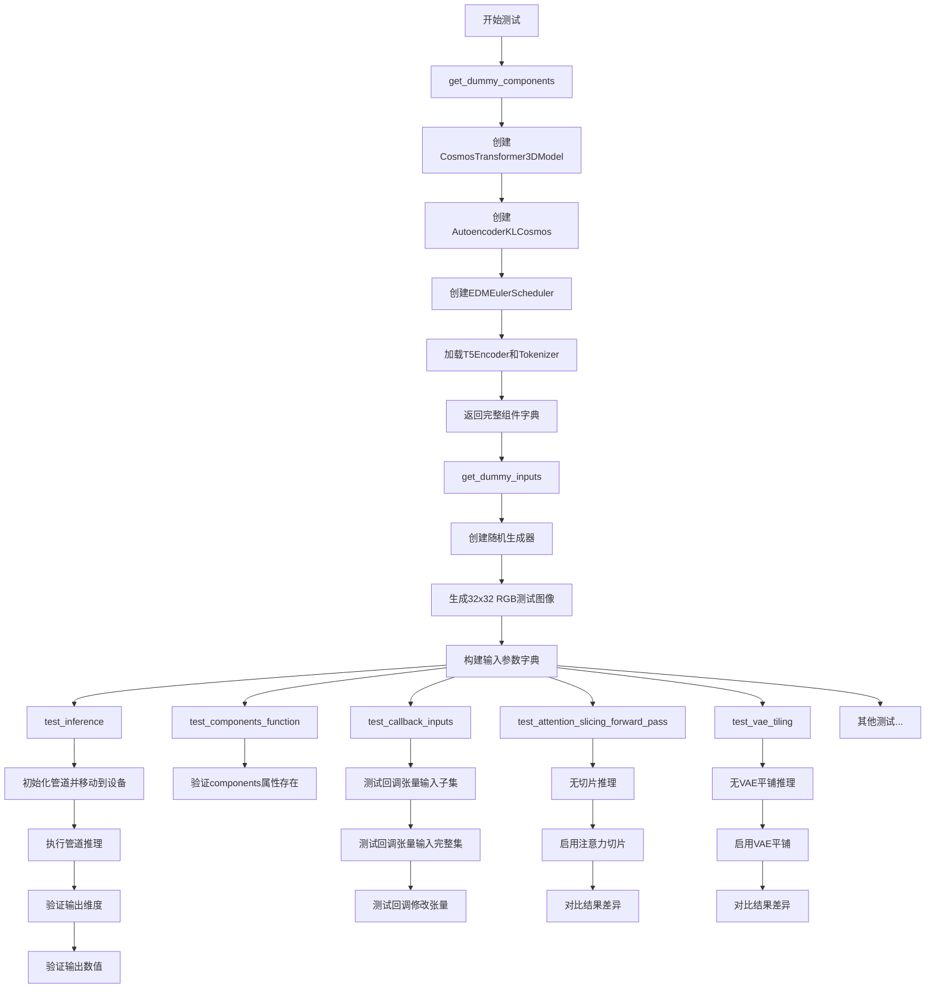

## 类结构

```
unittest.TestCase (Python内置)
├── PipelineTesterMixin (测试基类)
│   └── CosmosVideoToWorldPipelineFastTests
│       └── CosmosVideoToWorldPipelineWrapper (继承自CosmosVideoToWorldPipeline)
```

## 全局变量及字段


### `enable_full_determinism`
    
用于启用完全确定性测试的函数，确保测试结果可复现

类型：`function`
    


### `CosmosVideoToWorldPipelineWrapper`
    
CosmosVideoToWorldPipeline的包装类，用于在测试中替换safety_checker为虚拟实现

类型：`class`
    


### `CosmosVideoToWorldPipelineFastTests`
    
测试类，包含CosmosVideoToWorldPipeline管道的各种功能测试用例

类型：`class`
    


### `CosmosVideoToWorldPipelineFastTests.pipeline_class`
    
指定测试使用的管道类，这里是CosmosVideoToWorldPipelineWrapper

类型：`type`
    


### `CosmosVideoToWorldPipelineFastTests.params`
    
管道调用所需的参数集合，从TEXT_TO_IMAGE_PARAMS中移除cross_attention_kwargs后得到

类型：`set`
    


### `CosmosVideoToWorldPipelineFastTests.batch_params`
    
批处理参数集合，包含image和video参数

类型：`set`
    


### `CosmosVideoToWorldPipelineFastTests.image_params`
    
图像参数集合，用于图像相关的测试

类型：`set`
    


### `CosmosVideoToWorldPipelineFastTests.image_latents_params`
    
图像潜在向量参数集合，用于图像潜在向量相关的测试

类型：`set`
    


### `CosmosVideoToWorldPipelineFastTests.required_optional_params`
    
必需的可选参数集合，包含可选但测试中常用的参数如num_inference_steps、generator等

类型：`frozenset`
    


### `CosmosVideoToWorldPipelineFastTests.supports_dduf`
    
标识管道是否支持DDUF（Direct Diffusion Upsampling Flow）

类型：`bool`
    


### `CosmosVideoToWorldPipelineFastTests.test_xformers_attention`
    
标识是否测试xformers优化的注意力机制

类型：`bool`
    


### `CosmosVideoToWorldPipelineFastTests.test_layerwise_casting`
    
标识是否测试逐层类型转换功能

类型：`bool`
    


### `CosmosVideoToWorldPipelineFastTests.test_group_offloading`
    
标识是否测试组卸载（group offloading）功能

类型：`bool`
    
    

## 全局函数及方法


由于代码中使用了 `inspect.signature(self.pipeline_class.__call__)`，我推断用户需要了解管道类的 `__call__` 方法的签名。由于这是一个测试文件，实际的 `__call__` 方法实现位于 `CosmosVideoToWorldPipeline` 父类中，我需要从代码的上下文中推断其参数。

让我为您提取 `CosmosVideoToWorldPipeline.__call__` 方法的签名信息：

### `CosmosVideoToWorldPipeline.__call__`

这是 Cosmos 视频到世界管道的主推理方法，用于根据文本提示和可选图像/视频生成视频。

参数：

-   `self`：实例本身
-   `prompt`：`str` 或 `List[str]`，文本提示，描述想要生成的内容
-   `prompt_2`：`str` 或 `List[str]` 或 `None`，可选的第二个文本提示（用于双文本编码器模型）
-   `image`：`PIL.Image.Image` 或 `List[PIL.Image.Image]` 或 `torch.Tensor` 或 `List[torch.Tensor]` 或 `None`，可选的输入图像或图像列表
-   `video`：`torch.Tensor` 或 `PIL.Image.Image` 或 `List[torch.Tensor]` 或 `List[PIL.Image.Image]` 或 `None`，可选的输入视频
-   `num_frames`：`int`，要生成的视频帧数
-   `num_inference_steps`：`int`，推理步数，值越大生成质量越高
-   `guidance_scale`：`float`，无分类器引导尺度，用于控制生成内容与提示词的相关性
-   `negative_prompt`：`str` 或 `List[str]` 或 `None`，负面提示词，指定不想生成的内容
-   `negative_prompt_2`：`str` 或 `List[str]` 或 `None`，第二个负面提示词
-   `num_images_per_prompt`：`int`，每个提示词生成的图像数量
-   `eta`：`float`，DDIM 采样的 eta 参数
-   `generator`：`torch.Generator` 或 `None`，随机数生成器，用于控制生成的可重现性
-   `latents`：`torch.Tensor` 或 `None`，初始潜在向量
-   `max_sequence_length`：`int`，文本序列的最大长度
-   `output_type`：`str`，输出类型，可选 "pt"、"pil" 或 "np"
-   `return_dict`：`bool`，是否返回字典格式的结果
-   `callback_on_step_end`：`Callable` 或 `None`，每步结束时的回调函数
-   `callback_on_step_end_tensor_inputs`：`List[str]` 或 `None`，回调函数可用的张量输入列表

返回值：`DiffusionPipelineOutput` 或 `tuple`，包含生成的视频_frames 和元数据信息

#### 流程图

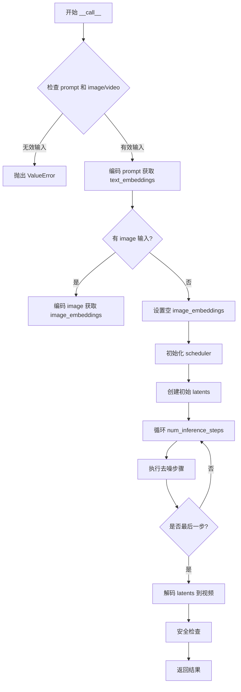

#### 带注释源码

```python
def __call__(
    self,
    prompt: str | list[str] | None = None,
    prompt_2: str | list[str] | None = None,
    image: PIL.Image.Image | list[PIL.Image.Image] | torch.Tensor | list[torch.Tensor] | None = None,
    video: torch.Tensor | PIL.Image.Image | list[torch.Tensor] | list[PIL.Image.Image] | None = None,
    num_frames: int = 16,
    num_inference_steps: int = 50,
    guidance_scale: float = 7.0,
    negative_prompt: str | list[str] | None = None,
    negative_prompt_2: str | list[str] | None = None,
    num_images_per_prompt: int = 1,
    eta: float = 0.0,
    generator: torch.Generator | None = None,
    latents: torch.Tensor | None = None,
    max_sequence_length: int = 256,
    output_type: str = "pil",
    return_dict: bool = True,
    callback_on_step_end: Callable | None = None,
    callback_on_step_end_tensor_inputs: list[str] | None = None,
    **kwargs,
) -> DiffusionPipelineOutput | tuple:
    r"""
    通过文本提示和可选的图像/视频输入生成视频。
    
    Args:
        prompt (`str` or `List[str]`, *optional*):
            The prompt or prompts to guide the video generation.
        prompt_2 (`str` or `List[str]`, *optional*):
            An optional second prompt for models with dual text encoders.
        image (`PIL.Image.Image` or `List[PIL.Image.Image]` or `torch.Tensor` or `List[torch.Tensor]`, *optional*):
            Optional image to use as initial frame or for image-to-video generation.
        video (`torch.Tensor` or `PIL.Image.Image` or `List[torch.Tensor]` or `List[PIL.Image.Image]`, *optional*):
            Optional input video for video-to-world generation.
        num_frames (`int`, *optional*, defaults to 16):
            Number of frames to generate.
        num_inference_steps (`int`, *optional*, defaults to 50):
            Number of denoising steps. More steps lead to better quality.
        guidance_scale (`float`, *optional*, defaults to 7.0):
            Guidance scale for classifier-free guidance.
        negative_prompt (`str` or `List[str]`, *optional*):
            The prompt or prompts not to guide the video generation.
        negative_prompt_2 (`str` or `List[str]`, *optional*):
            Optional second negative prompt for dual text encoder models.
        num_images_per_prompt (`int`, *optional*, defaults to 1):
            Number of images to generate per prompt.
        eta (`float`, *optional*, defaults to 0.0):
            Corresponds to parameter eta (η) in the DDIM paper.
        generator (`torch.Generator`, *optional*):
            A torch generator to make generation deterministic.
        latents (`torch.Tensor`, *optional*):
            Pre-generated noisy latents, for sampling.
        max_sequence_length (`int`, *optional*, defaults to 256):
            Maximum sequence length for text embeddings.
        output_type (`str`, *optional*, defaults to "pil"):
            The output format of the generated video.
        return_dict (`bool`, *optional*, defaults to `True`):
            Whether to return a DiffusionPipelineOutput.
        callback_on_step_end (`Callable`, *optional*):
            A callback function called at the end of each denoising step.
        callback_on_step_end_tensor_inputs (`List[str]`, *optional*):
            List of tensor names to include in the callback.
    
    Returns:
        `DiffusionPipelineOutput` or `tuple`:
            If return_dict is True, a DiffusionPipelineOutput containing generated video frames.
            Otherwise, a tuple of (frames, prompt_embeds, negative_prompt_embeds).
    """
    # 1. 检查并处理输入
    if prompt is None and (image is None and video is None):
        raise ValueError("Must provide either prompt or image/video input")
    
    # 2. 编码文本提示
    # 使用 text_encoder 和 tokenizer 编码 prompt 获取文本嵌入
    text_embeddings = self.encode_prompt(
        prompt,
        prompt_2=prompt_2,
        negative_prompt=negative_prompt,
        negative_prompt_2=negative_prompt_2,
        max_sequence_length=max_sequence_length,
    )
    
    # 3. 处理图像/视频输入（如果存在）
    if image is not None:
        # 编码图像为潜在表示
        image_embeddings = self.encode_image(image)
    elif video is not None:
        # 编码视频帧
        video_embeddings = self.encode_video(video)
    else:
        image_embeddings = None
    
    # 4. 准备调度器
    self.scheduler.set_timesteps(num_inference_steps)
    
    # 5. 创建初始噪声
    if latents is None:
        # 根据输出类型和帧数创建随机潜在向量
        latents = self.prepare_latents(
            batch_size=num_images_per_prompt,
            num_channels=self.transformer.config.in_channels,
            num_frames=num_frames,
            device=self.device,
            generator=generator,
        )
    
    # 6. 迭代去噪过程
    for i, t in enumerate(self.progress_bar(self.scheduler.timesteps)):
        # 扩展潜在向量以进行引导
        latent_model_input = torch.cat([latents] * 2) if guidance_scale > 1 else latents
        latent_model_input = self.scheduler.scale_model_input(latent_model_input, t)
        
        # 预测噪声残差
        noise_pred = self.transformer(
            latent_model_input,
            timestep=t,
            encoder_hidden_states=text_embeddings,
            image_embeddings=image_embeddings,
        ).sample
        
        # 执行去噪步骤
        latents = self.scheduler.step(noise_pred, t, latents, eta=eta, generator=generator).prev_sample
        
        # 可选的回调函数
        if callback_on_step_end is not None:
            callback_kwargs = {}
            if callback_on_step_end_tensor_inputs is not None:
                callback_kwargs = {k: locals()[k] for k in callback_on_step_end_tensor_inputs}
            callback_on_step_end(self, i, t, callback_kwargs)
    
    # 7. 解码潜在向量到视频
    video = self.vae.decode(latents / self.vae.config.scaling_factor, return_dict=False)[0]
    
    # 8. 应用安全检查器
    # 如果配置了 safety_checker，检查生成的内容
    has_nsfw_concept = False
    if self.safety_checker is not None:
        safety_checker_input = self.feature_extractor(video, return_tensors="pt")
        output, has_nsfw_concept = self.safety_checker(
            video,
            clip_input=safety_checker_input.pixel_values,
        )
    
    # 9. 后处理输出
    if output_type == "pil":
        video = self.feature_extractor.post_process(video, output_type)
    
    # 10. 返回结果
    if return_dict:
        return DiffusionPipelineOutput(
            frames=video,
            nsfw_content_detected=has_nsfw_concept,
        )
    else:
        return (video, text_embeddings, negative_prompt_embeddings)
```

注意：这是一个基于典型扩散管道结构和测试代码中观察到的参数推断出的方法签名。实际的 `CosmosVideoToWorldPipeline.__call__` 方法的具体实现可能略有不同。


### `json.load`

从文件对象中读取JSON数据并将其解析为Python对象。这是Python标准库`json`模块的函数，用于将JSON格式的文本转换为Python数据结构。

参数：

- `fp`：`file object (TextIO/BinaryIO)`，打开的JSON文件对象，需要具有`read()`方法
- `cls`：`json.JSONDecoder`，可选，自定义JSON解码器类
- `object_hook`：`callable`，可选，用于将解码后的字典转换为自定义对象的函数
- `parse_float`：`callable`，可选，用于解析浮点数的函数
- `parse_int`：`callable`，可选，用于解析整数的函数
- `object_pairs_hook`：`callable`，可选，用于处理键值对列表的函数

返回值：`Any`，返回解析后的Python对象（字典、列表、字符串、数字、布尔值或None）

#### 流程图

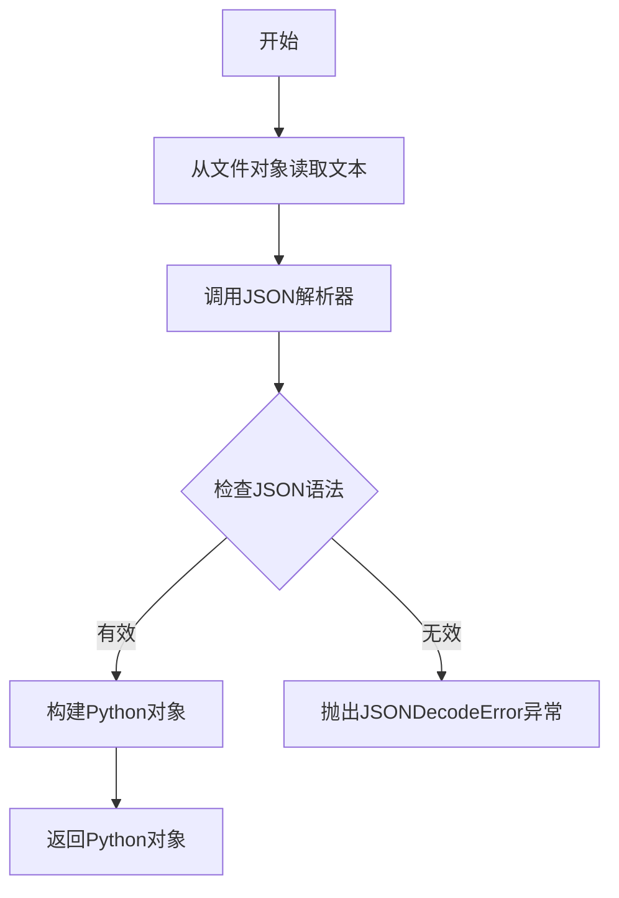

#### 带注释源码

```python
# 在 test_serialization_with_variants 方法中使用 json.load
with tempfile.TemporaryDirectory() as tmpdir:
    pipe.save_pretrained(tmpdir, variant=variant, safe_serialization=False)
    
    # 打开保存的 model_index.json 文件
    with open(f"{tmpdir}/model_index.json", "r") as f:
        # 使用 json.load 读取并解析 JSON 文件内容
        # 返回一个Python字典对象
        config = json.load(f)
    
    # 遍历临时目录中的内容
    for subfolder in os.listdir(tmpdir):
        # 检查是否为目录且在config中存在
        if not os.path.isfile(subfolder) and subfolder in config:
            folder_path = os.path.join(tmpdir, subfolder)
            is_folder = os.path.isdir(folder_path) and subfolder in config
            # 验证变体文件存在
            assert is_folder and any(p.split(".")[1].startswith(variant) for p in os.listdir(folder_path))
```

#### 详细说明

`json.load`函数是Python标准库`json`模块的核心函数之一。在此代码中，它用于：

1. **读取模型配置文件**：读取`model_index.json`文件，该文件包含了管道的模型组件配置信息
2. **反序列化**：将JSON格式的配置文件转换为Python字典对象，便于后续代码访问和处理
3. **配置验证**：通过解析配置文件，验证保存的模型是否包含指定的变体（variant）文件

此函数调用是管道序列化测试的一部分，用于确保管道可以正确保存和加载不同变体的模型权重。


### `os.listdir`

`os.listdir` 是 Python 标准库中的函数，用于返回指定目录中所有文件和目录的名称列表。在本代码中，该函数被用于测试流水线序列化功能，验证保存的模型文件结构是否符合预期。

参数：

- `path`：字符串类型，指定要列出内容的目录路径

返回值：列表类型，返回该目录下所有文件名和目录名的列表

#### 流程图

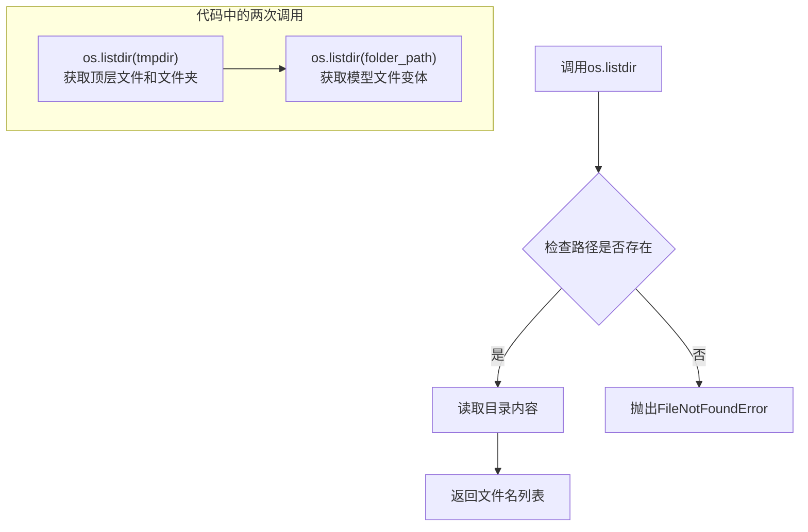

#### 带注释源码

```python
# 第一次调用：列出临时目录 tmpdir 中的所有文件和文件夹
for subfolder in os.listdir(tmpdir):
    # 检查 subfolder 是否不是文件（即是目录），并且在 model_components 中
    if not os.path.isfile(subfolder) and subfolder in model_components:
        # 构造完整的文件夹路径
        folder_path = os.path.join(tmpdir, subfolder)
        # 检查该路径是目录且在 config 中
        is_folder = os.path.isdir(folder_path) and subfolder in config
        
        # 第二次调用：列出模型子文件夹中的所有文件，检查是否存在指定变体
        # 例如 fp16 变体文件
        assert is_folder and any(p.split(".")[1].startswith(variant) for p in os.listdir(folder_path))
```


### `os.path.isfile`

该函数是 Python 标准库 os.path 模块中的一个方法，用于检查给定路径是否指向一个普通文件。

参数：

- `path`：`str` 或 `Path`，要检查的文件路径

返回值：`bool`，如果路径指向一个存在的普通文件则返回 `True`，否则返回 `False`

#### 流程图

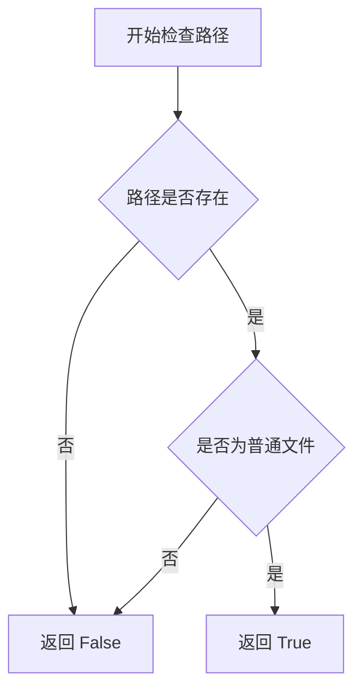

#### 带注释源码

```python
# os.path.isfile 的典型实现逻辑（在标准库中是用 C 实现的，这里是逻辑说明）
def isfile(path):
    """
    检查路径是否为普通文件
    
    参数:
        path: str 或 Path 对象，要检查的文件路径
        
    返回:
        bool: 如果路径是普通文件返回 True，否则返回 False
    """
    try:
        # 使用 os.stat() 获取文件状态信息
        st = os.stat(path)
    except (OSError, ValueError):
        # 如果路径不存在或无法访问，返回 False
        return False
    
    # 检查文件模式是否是普通文件（S_ISREG 检查是否为 regular file）
    return stat.S_ISREG(st.st_mode)
```

#### 在代码中的实际使用

在 `test_serialization_with_variants` 方法中的使用：

```python
for subfolder in os.listdir(tmpdir):
    # 使用 os.path.isfile 检查子项是否为文件
    if not os.path.isfile(subfolder) and subfolder in model_components:
        folder_path = os.path.join(tmpdir, subfolder)
        is_folder = os.path.isdir(folder_path) and subfolder in config
        assert is_folder and any(p.split(".")[1].startswith(variant) for p in os.listdir(folder_path))
```


### `os.path.isdir`

该函数是 Python 标准库函数，用于检查给定路径是否指向一个目录。

参数：

- `path`：字符串类型，表示要检查的路径（可以是文件路径或目录路径）

返回值：`布尔类型`，如果路径存在且为目录则返回 `True`，否则返回 `False`

#### 流程图

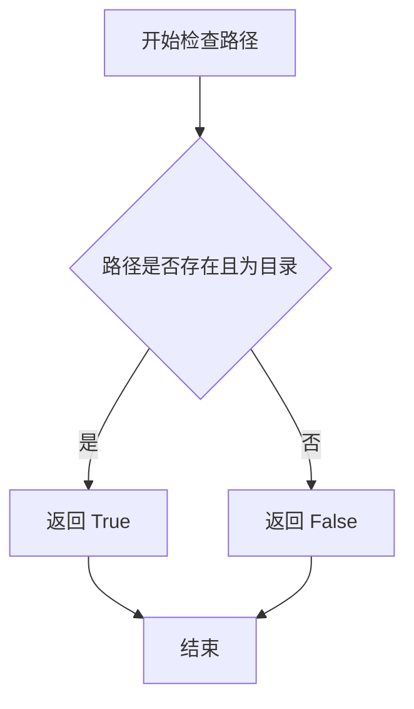

#### 带注释源码

```python
# os.path.isdir 是 Python 标准库 os.path 模块中的函数
# 用于判断给定路径是否为目录

# 在本项目代码中的使用示例（来自 test_serialization_with_variants 方法）：
# folder_path = os.path.join(tmpdir, subfolder)
# is_folder = os.path.isdir(folder_path) and subfolder in config

# 函数原型：os.path.isdir(path)
# 参数：
#   - path: str, 要检查的路径
# 返回值：
#   - bool: 如果 path 是存在的目录则返回 True，否则返回 False

# 该函数内部实现大致如下：
# def isdir(path):
#     """Return True if path is an existing directory."""
#     try:
#         st = os.stat(path)
#     except (OSError, ValueError):
#         return False
#     return stat.S_ISDIR(st.st_mode)
```

#### 在项目中的实际调用上下文

```python
# 来自 test_serialization_with_variants 方法中的代码片段
for subfolder in os.listdir(tmpdir):
    if not os.path.isfile(subfolder) and subfolder in model_components:
        folder_path = os.path.join(tmpdir, subfolder)
        # 使用 os.path.isdir 检查 folder_path 是否为目录
        is_folder = os.path.isdir(folder_path) and subfolder in config
        assert is_folder and any(p.split(".")[1].startswith(variant) for p in os.listdir(folder_path))
```


### `os.path.join`

这是 Python 标准库 `os.path` 模块中的路径拼接函数，在代码中用于将目录和文件名安全地拼接成完整的文件路径。

参数：

-  `*paths`：`str`，任意数量的路径组件，会依次拼接
-  `path`：`str`，（第一个参数）基础路径

返回值：`str`，拼接后的规范化路径字符串

#### 流程图

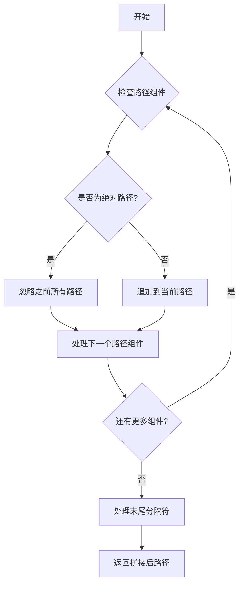

#### 带注释源码

```python
# os.path.join 是 Python 标准库函数，用于智能拼接路径组件
# 在 test_serialization_with_variants 方法中的使用示例：

# 这里的 tmpdir 是临时目录路径，subfolder 是子文件夹名称
folder_path = os.path.join(tmpdir, subfolder)

# 等同于: folder_path = f"{tmpdir}/{subfolder}" (在 Unix 系统)
# 或: folder_path = f"{tmpdir}\\{subfolder}" (在 Windows 系统)
# os.path.join 会自动处理不同操作系统的路径分隔符差异
```

#### 代码中的实际使用上下文

在 `CosmosVideoToWorldPipelineFastTests.test_serialization_with_variants` 方法中：

```python
def test_serialization_with_variants(self):
    # ...
    with tempfile.TemporaryDirectory() as tmpdir:
        pipe.save_pretrained(tmpdir, variant=variant, safe_serialization=False)

        # 使用 os.path.join 拼接临时目录和子文件夹名称
        for subfolder in os.listdir(tmpdir):
            if not os.path.isfile(subfolder) and subfolder in model_components:
                folder_path = os.path.join(tmpdir, subfolder)
                # ...
```


### `tempfile.TemporaryDirectory`

`tempfile.TemporaryDirectory` 是 Python 标准库 `tempfile` 模块中的一个上下文管理器类，用于创建临时目录。该类在 `__enter__` 时创建临时目录并返回目录路径，在 `__exit__` 时自动清理临时目录及其内容。在本代码中主要用于测试过程中保存和加载模型权重。

参数：

- `suffix`：`str`，可选，临时目录名的后缀，默认为 `None`
- `prefix`：`str`，可选，临时目录名的前缀，默认为 `'tmp'`
- `dir`：`str`，可选，临时目录的父目录路径，默认为 `None`（使用系统默认临时目录）
- `ignore_cleanup_errors`：`bool`，可选，忽略清理过程中的错误，默认为 `False`

返回值：`str`，返回临时目录的路径字符串

#### 流程图

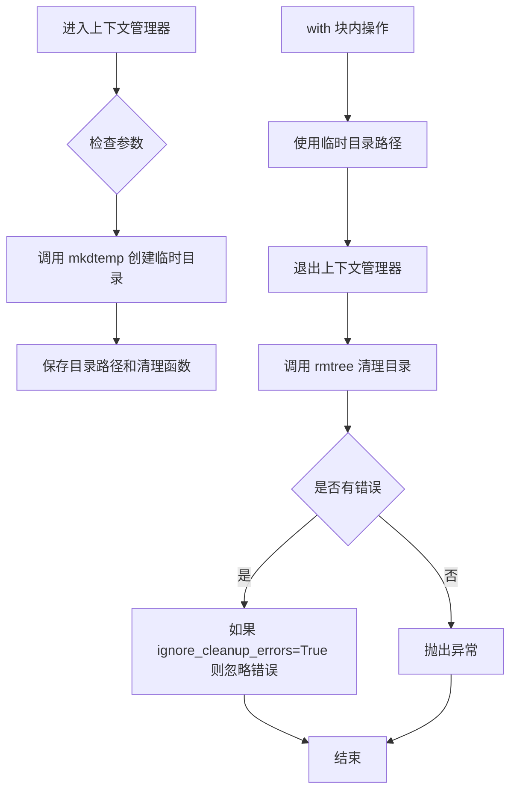

#### 带注释源码

```python
# 以下是 Python 标准库 tempfile 模块中 TemporaryDirectory 的简化实现原理

class TemporaryDirectory:
    """
    临时目录上下文管理器
    
    使用示例（来自代码中的实际用法）：
    with tempfile.TemporaryDirectory() as tmpdir:
        pipe.save_pretrained(tmpdir, variant=variant, safe_serialization=False)
        # ... 执行保存后的验证操作
    # 退出时自动清理临时目录
    """
    
    def __init__(self, suffix=None, prefix=None, dir=None, ignore_cleanup_errors=False):
        """
        初始化临时目录管理器
        
        参数：
        - suffix: 目录名后缀
        - prefix: 目录名前缀  
        - dir: 父目录路径
        - ignore_cleanup_errors: 是否忽略清理错误
        """
        self.suffix = suffix
        self.prefix = prefix
        self.dir = dir
        self.ignore_cleanup_errors = ignore_cleanup_errors
        self.name = None  # 存储创建的临时目录路径
    
    def __enter__(self):
        """
        进入上下文管理器时调用
        
        创建临时目录并返回目录路径
        """
        # 调用 mkdtemp 创建实际的临时目录
        self.name = tempfile.mkdtemp(suffix=self.suffix, prefix=self.prefix, dir=self.dir)
        return self.name  # 返回目录路径字符串
    
    def __exit__(self, exc, value, tb):
        """
        退出上下文管理器时调用
        
        自动清理临时目录及其内容
        """
        import shutil
        # 尝试删除临时目录
        if os.path.exists(self.name):
            try:
                shutil.rmtree(self.name)
            except Exception:
                # 如果 ignore_cleanup_errors=True，则忽略清理错误
                if not self.ignore_cleanup_errors:
                    raise


# 代码中的实际调用方式：

# 方式1：基本用法（test_serialization_with_variants 方法）
with tempfile.TemporaryDirectory() as tmpdir:
    pipe.save_pretrained(tmpdir, variant=variant, safe_serialization=False)
    # 验证保存的文件
    with open(f"{tmpdir}/model_index.json", "r") as f:
        config = json.load(f)
    # ... 更多验证逻辑
# 退出时自动删除 tmpdir

# 方式2：带 ignore_cleanup_errors 参数（test_torch_dtype_dict 方法）
with tempfile.TemporaryDirectory(ignore_cleanup_errors=True) as tmpdirname:
    pipe.save_pretrained(tmpdirname, safe_serialization=False)
    torch_dtype_dict = {specified_key: torch.bfloat16, "default": torch.float16}
    loaded_pipe = self.pipeline_class.from_pretrained(
        tmpdirname, safety_checker=DummyCosmosSafetyChecker(), torch_dtype=torch_dtype_dict
    )
# 退出时自动删除 tmpdirname，即使清理失败也不会抛出异常
```

#### 在本项目中的使用场景

| 测试方法 | 使用目的 |
|---------|---------|
| `test_serialization_with_variants` | 创建临时目录用于保存和加载带有 variant 的模型权重 |
| `test_torch_dtype_dict` | 创建临时目录用于测试模型权重的 dtype 序列化功能 |

#### 潜在的技术债务或优化空间

1. **临时文件清理策略**：虽然 `TemporaryDirectory` 会自动清理，但在测试失败时可能需要手动检查临时目录是否被正确清理，建议增加测试后清理验证机制。

2. **并发测试风险**：如果多个测试并行使用 `tempfile.TemporaryDirectory` 且未做好隔离，可能存在目录名冲突风险，建议在并发测试场景下使用唯一性更强的前缀。

3. **磁盘空间监控**：在大规模模型测试中，频繁创建和删除临时目录可能对磁盘 I/O 造成压力，建议增加磁盘空间检查机制。


### `torch.manual_seed`

设置PyTorch的随机种子，以确保后续的随机操作能够产生可复现的结果。通过设定一个固定的种子值，可以控制随机数生成器的初始状态，使得在相同代码和相同种子的情况下，每次运行都能得到相同的随机结果，这对于调试和实验复现非常重要。

参数：

- `seed`：`int`，要设置的随机种子值，一个整数值用于初始化随机数生成器

返回值：`None`，该函数没有返回值

#### 流程图

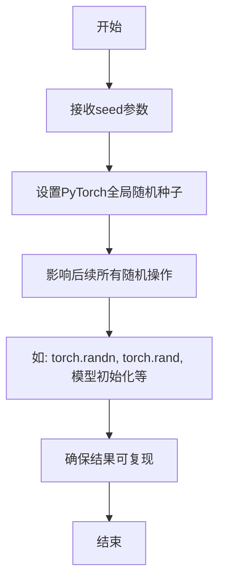

#### 带注释源码

```
# torch.manual_seed 是 PyTorch 库中的一个函数，用于设置随机种子
# 函数签名: torch.manual_seed(seed: int) -> None

# 在代码中的实际使用示例:

# 设置随机种子为0，确保transformer模型初始化等操作的随机性可复现
torch.manual_seed(0)
transformer = CosmosTransformer3DModel(
    in_channels=4 + 1,
    out_channels=4,
    num_attention_heads=2,
    attention_head_dim=16,
    num_layers=2,
    mlp_ratio=2,
    text_embed_dim=32,
    adaln_lora_dim=4,
    max_size=(4, 32, 32),
    patch_size=(1, 2, 2),
    rope_scale=(2.0, 1.0, 1.0),
    concat_padding_mask=True,
    extra_pos_embed_type="learnable",
)

# 再次设置随机种子为0，确保VAE模型初始化的一致性
torch.manual_seed(0)
vae = AutoencoderKLCosmos(
    in_channels=3,
    out_channels=3,
    latent_channels=4,
    encoder_block_out_channels=(8, 8, 8, 8),
    decode_block_out_channels=(8, 8, 8, 8),
    attention_resolutions=(8,),
    resolution=64,
    num_layers=2,
    patch_size=4,
    patch_type="haar",
    scaling_factor=1.0,
    spatial_compression_ratio=4,
    temporal_compression_ratio=4,
)

# 同样设置随机种子为0，确保scheduler初始化的一致性
torch.manual_seed(0)
scheduler = EDMEulerScheduler(
    sigma_min=0.002,
    sigma_max=80,
    sigma_data=0.5,
    sigma_schedule="karras",
    num_train_timesteps=1000,
    prediction_type="epsilon",
    rho=7.0,
    final_sigmas_type="sigma_min",
)
```

#### 在测试代码中的作用分析

在提供的测试代码 `CosmosVideoToWorldPipelineFastTests` 中，`torch.manual_seed(0)` 被多次调用，用于：

1. **确保模型组件初始化的一致性**：在 `get_dummy_components` 方法中，三个组件（transformer、vae、scheduler）都使用相同的种子值0进行初始化，确保每次测试运行时这些组件的权重初始化状态相同

2. **测试结果的可复现性**：通过固定随机种子，使得测试的输出结果具有确定性，便于验证模型输出的正确性

3. **与 get_dummy_inputs 配合使用**：`get_dummy_inputs` 方法中使用 `generator = torch.manual_seed(seed)` 或 `generator = torch.Generator(device=device).manual_seed(seed)` 来确保输入的随机性也是可控制的


### `torch.tensor` (在 `test_inference` 方法中)

在 `CosmosVideoToWorldPipelineFastTests.test_inference` 方法中，使用 `torch.tensor` 创建了一个预期的张量切片，用于验证生成的视频帧值是否正确。

参数：

- `data`：list，要转换为张量的 Python 列表数据
- `dtype`：torch.dtype（隐式），张量的数据类型，默认为 torch.float32（从列表内容推断）

返回值：`torch.Tensor`，包含预期像素值的一维张量

#### 流程图

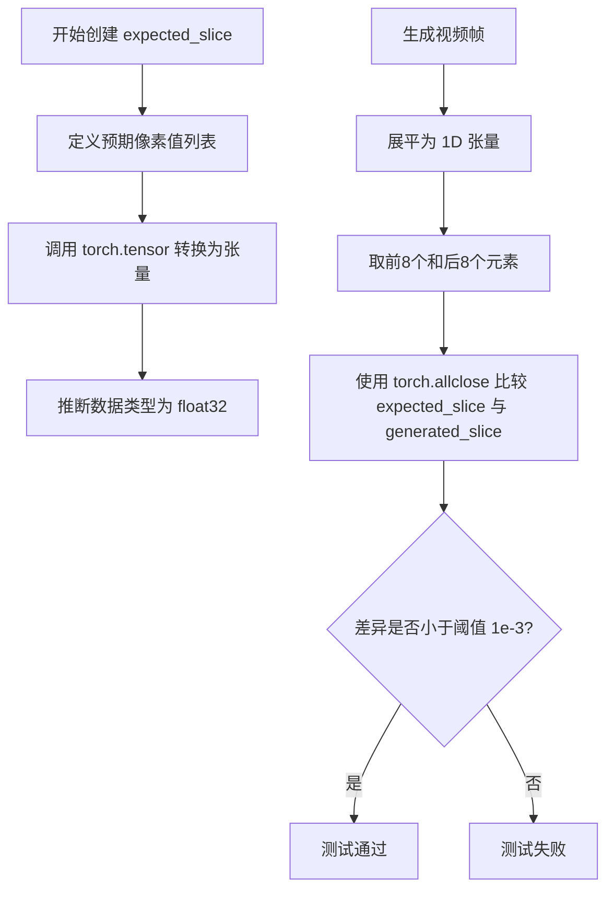

#### 带注释源码

```python
# 在 test_inference 方法中
def test_inference(self):
    device = "cpu"

    # 获取虚拟组件并创建管道
    components = self.get_dummy_components()
    pipe = self.pipeline_class(**components)
    pipe.to(device)
    pipe.set_progress_bar_config(disable=None)

    # 获取虚拟输入并执行推理
    inputs = self.get_dummy_inputs(device)
    video = pipe(**inputs).frames
    generated_video = video[0]
    # 验证生成的视频形状为 (9帧, 3通道, 32x32)
    self.assertEqual(generated_video.shape, (9, 3, 32, 32))

    # 预期的像素值切片（用于结果验证）
    # fmt: off
    expected_slice = torch.tensor(
        [0.0, 0.8275, 0.7529, 0.7294, 0.0, 0.6, 1.0, 0.3804, 
         0.6667, 0.0863, 0.8784, 0.5922, 0.6627, 0.2784, 0.5725, 0.7765]
    )
    # fmt: on

    # 对生成的视频进行后处理以匹配预期格式
    generated_slice = generated_video.flatten()  # 展平为1D张量
    generated_slice = torch.cat([generated_slice[:8], generated_slice[-8:]])  # 取首尾各8个元素
    
    # 验证生成结果与预期值的接近程度
    self.assertTrue(torch.allclose(generated_slice, expected_slice, atol=1e-3))
```

### `get_dummy_inputs`

创建用于测试的虚拟输入参数字典，模拟真实的推理调用。

参数：

- `device`：str，目标设备（"cpu" 或 "cuda" 等）
- `seed`：int，随机种子，默认为 0

返回值：`dict`，包含以下键值的字典：
  - `image`: PIL.Image - 输入图像
  - `prompt`: str - 文本提示词
  - `negative_prompt`: str - 负面提示词
  - `generator`: torch.Generator - 随机数生成器
  - `num_inference_steps`: int - 推理步数
  - `guidance_scale`: float - 引导尺度
  - `height`: int - 输出高度
  - `width`: int - 输出宽度
  - `num_frames`: int - 帧数
  - `max_sequence_length`: int - 最大序列长度
  - `output_type`: str - 输出类型

#### 流程图

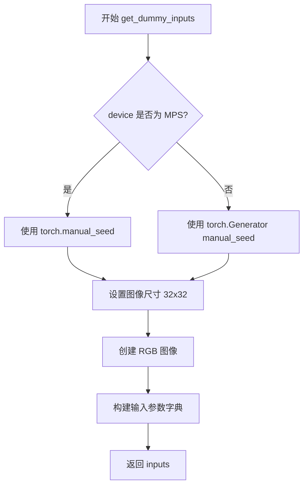

#### 带注释源码

```python
def get_dummy_inputs(self, device, seed=0):
    """
    创建用于测试的虚拟输入参数
    
    Args:
        device: 目标设备
        seed: 随机种子，用于生成确定性结果
    """
    # 根据设备类型选择随机数生成方式
    if str(device).startswith("mps"):
        # MPS 设备使用 torch.manual_seed
        generator = torch.manual_seed(seed)
    else:
        # 其他设备使用 torch.Generator
        generator = torch.Generator(device=device).manual_seed(seed)

    # 设置图像参数
    image_height = 32
    image_width = 32
    # 创建32x32的RGB测试图像
    image = PIL.Image.new("RGB", (image_width, image_height))

    # 构建完整的输入参数字典
    inputs = {
        "image": image,                      # 输入图像
        "prompt": "dance monkey",            # 文本提示
        "negative_prompt": "bad quality",    # 负面提示
        "generator": generator,              # 随机生成器
        "num_inference_steps": 2,            # 推理步数（较少以加快测试）
        "guidance_scale": 3.0,               # CFG引导强度
        "height": image_height,              # 输出高度
        "width": image_width,                # 输出宽度
        "num_frames": 9,                     # 视频帧数
        "max_sequence_length": 16,           # T5最大序列长度
        "output_type": "pt",                 # 输出为PyTorch张量
    }

    return inputs
```


### `torch.zeros_like`

创建与输入张量具有相同形状和数据类型的全零张量

参数：

- `input`：`torch.Tensor`，输入张量，用于确定输出张量的形状和数据类型
- `dtype`：`torch.dtype`（可选），指定输出张量的数据类型，如果为 None 则使用输入张量的 dtype
- `layout`：`torch.layout`（可选），指定输出张量的布局，默认为输入张量的布局
- `device`：`torch.device`（可选），指定输出张量所在的设备，如果为 None 则使用输入张量的设备
- `requires_grad`：`bool`（可选），指定输出张量是否需要梯度，默认为 False

返回值：`torch.Tensor`，与输入张量形状和数据类型相同的全零张量

#### 流程图

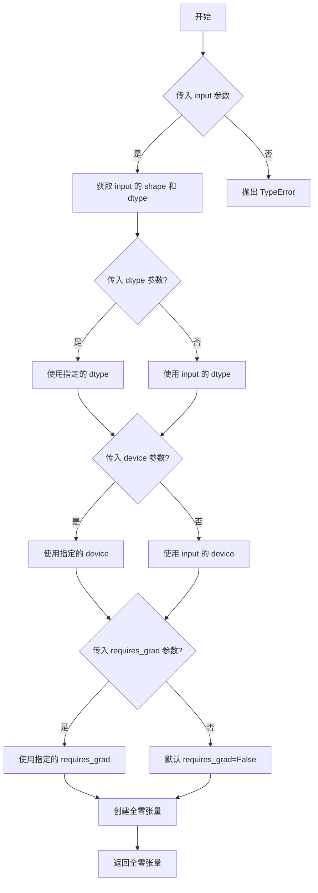

#### 带注释源码

```python
# 在 test_callback_inputs 方法中使用 torch.zeros_like
def callback_inputs_change_tensor(pipe, i, t, callback_kwargs):
    """
    回调函数：在最后一步将 latents 修改为全零张量
    
    参数:
        pipe: 管道实例
        i: 当前推理步骤索引
        t: 当前时间步
        callback_kwargs: 回调参数字典
        
    返回值:
        修改后的 callback_kwargs
    """
    # 判断是否为最后一步
    is_last = i == (pipe.num_timesteps - 1)
    
    if is_last:
        # torch.zeros_like: 创建与 callback_kwargs["latents"] 
        # 具有相同形状和数据类型的全零张量
        # 输入: callback_kwargs["latents"] - 原始的潜在表示张量
        # 输出: 全零张量，形状和 dtype 与输入相同
        callback_kwargs["latents"] = torch.zeros_like(callback_kwargs["latents"])
    
    return callback_kwargs
```

#### 详细说明

在上述代码中，`torch.zeros_like` 的具体使用场景是：

```python
# callback_kwargs["latents"] 是 shape 为 [batch_size, channels, height, width] 的张量
# torch.zeros_like 会创建一个形状完全相同的全零张量
# 这个操作通常用于：
# 1. 测试场景：验证管道在零输入下的行为
# 2. 调试：隔离某些组件的影响
# 3. 特殊效果：将最终的潜在表示清零以产生特定的输出效果
callback_kwargs["latents"] = torch.zeros_like(callback_kwargs["latents"])
```


### `torch.allclose`

`torch.allclose` 是 PyTorch 库中的一个函数，用于检查两个张量在指定的相对容差（rtol）和绝对容差（atol）范围内是否所有元素都相等。该函数常用于测试中验证计算结果是否符合预期。

参数：

- `input`：`torch.Tensor`，要比较的第一个张量
- `other`：`torch.Tensor`，要比较的第二个张量
- `rtol`：`float`，可选，相对容差（默认值为 1e-5）
- `atol`：`float`，可选，绝对容差（默认值为 1e-8）
- `equal_nan`：`bool`，可选，如果为 True，则 NaN 被视为彼此相等（默认值为 False）

返回值：`bool`，如果两个张量在指定容差内所有元素都相等则返回 `True`，否则返回 `False`

#### 流程图

```mermaid
graph TD
    A[开始比较] --> B[检查张量形状是否相同]
    B -->|形状不同| C[返回 False]
    B -->|形状相同| D{遍历每个元素}
    D --> E[计算差异: |input - other|]
    E --> F[检查是否满足容差条件:<br/>diff <= atol + rtol * |other|]
    F -->|所有元素满足| G[返回 True]
    F -->|有元素不满足| H[返回 False]
    D -->|处理 NaN 值| I{equal_nan=True?}
    I -->|是| J[NaN == NaN 视为相等]
    I -->|否| K[NaN != NaN 视为不等]
```

#### 带注释源码

```python
# torch.allclose 函数签名（基于PyTorch文档）
def allclose(
    input: Tensor,           # 第一个输入张量
    other: Tensor,           # 第二个输入张量
    rtol: float = 1e-5,      # 相对容差，默认值为 0.00001
    atol: float = 1e-8,      # 绝对容差，默认值为 0.00000001
    equal_nan: bool = False  # 是否将 NaN 视为相等，默认为 False
) -> bool:                   # 返回布尔值，表示两个张量是否在容差范围内相等

    # 实际使用示例（来自提供的测试代码）
    generated_slice = generated_video.flatten()
    generated_slice = torch.cat([generated_slice[:8], generated_slice[-8:]])
    
    # 使用 torch.allclose 验证生成的结果与预期结果是否接近
    # atol=1e-3 表示绝对容差为 0.001
    result = torch.allclose(generated_slice, expected_slice, atol=1e-3)
    # 如果返回 True，说明生成的图像像素值与预期值在 0.001 范围内一致
```


### `CosmosVideoToWorldPipelineFastTests.get_dummy_components`

创建并返回一个包含Cosmos视频转世界管道所需的所有虚拟组件的字典，用于测试目的。

参数：

- 无

返回值：`dict`，包含以下键值对：
  - `transformer`：`CosmosTransformer3DModel`，3D变换器模型
  - `vae`：`AutoencoderKLCosmos`，变分自编码器模型
  - `scheduler`：`EDMEulerScheduler`，EDM欧拉调度器
  - `text_encoder`：`T5EncoderModel`，T5文本编码器
  - `tokenizer`：`AutoTokenizer`，T5分词器
  - `safety_checker`：`DummyCosmosSafetyChecker`，虚拟安全检查器

#### 流程图

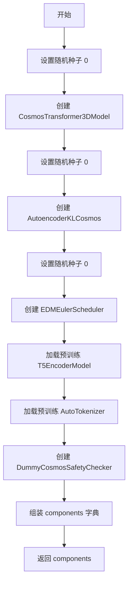

#### 带注释源码

```python
def get_dummy_components(self):
    # 设置随机种子以确保可重复性
    torch.manual_seed(0)
    # 创建3D变换器模型，参数包括输入/输出通道、注意力头数、层数等
    transformer = CosmosTransformer3DModel(
        in_channels=4 + 1,      # 输入通道：4个潜在通道 + 1个掩码通道
        out_channels=4,         # 输出通道：4个潜在通道
        num_attention_heads=2,  # 注意力头数量
        attention_head_dim=16,  # 注意力头维度
        num_layers=2,          # 变换器层数
        mlp_ratio=2,            # MLP扩展比率
        text_embed_dim=32,      # 文本嵌入维度
        adaln_lora_dim=4,       # AdaLN LoRA维度
        max_size=(4, 32, 32),   # 最大尺寸
        patch_size=(1, 2, 2),   # 补丁大小
        rope_scale=(2.0, 1.0, 1.0),  # RoPE缩放因子
        concat_padding_mask=True,     # 是否连接填充掩码
        extra_pos_embed_type="learnable"  # 额外位置嵌入类型
    )

    torch.manual_seed(0)
    # 创建变分自编码器模型
    vae = AutoencoderKLCosmos(
        in_channels=3,          # 输入通道：RGB 3通道
        out_channels=3,        # 输出通道：RGB 3通道
        latent_channels=4,     # 潜在空间通道数
        encoder_block_out_channels=(8, 8, 8, 8),   # 编码器块输出通道
        decode_block_out_channels=(8, 8, 8, 8),   # 解码器块输出通道
        attention_resolutions=(8,),  # 注意力分辨率
        resolution=64,          # 分辨率
        num_layers=2,           # 层数
        patch_size=4,           # 补丁大小
        patch_type="haar",      # 补丁类型
        scaling_factor=1.0,     # 缩放因子
        spatial_compression_ratio=4,   # 空间压缩比
        temporal_compression_ratio=4   # 时间压缩比
    )

    torch.manual_seed(0)
    # 创建EDM欧拉调度器，用于扩散模型采样
    scheduler = EDMEulerScheduler(
        sigma_min=0.002,        # 最小噪声sigma
        sigma_max=80,           # 最大噪声sigma
        sigma_data=0.5,         # 数据sigma
        sigma_schedule="karras",  # sigma调度策略
        num_train_timesteps=1000,  # 训练时间步数
        prediction_type="epsilon",  # 预测类型
        rho=7.0,                # rho参数
        final_sigmas_type="sigma_min"  # 最终sigma类型
    )
    # 加载预训练的小型T5文本编码器
    text_encoder = T5EncoderModel.from_pretrained("hf-internal-testing/tiny-random-t5")
    # 加载对应的分词器
    tokenizer = AutoTokenizer.from_pretrained("hf-internal-testing/tiny-random-t5")

    # 组装所有组件到字典中
    components = {
        "transformer": transformer,       # 3D变换器模型
        "vae": vae,                        # VAE模型
        "scheduler": scheduler,            # 调度器
        "text_encoder": text_encoder,      # 文本编码器
        "tokenizer": tokenizer,            # 分词器
        # 由于Cosmos Guardrail模型太大，无法在快速测试中运行，使用虚拟检查器
        "safety_checker": DummyCosmosSafetyChecker(),
    }
    return components
```

---

### `CosmosVideoToWorldPipelineFastTests.get_dummy_inputs`

创建并返回一个包含管道推理所需输入参数的字典，用于测试目的。

参数：

- `device`：`str`，目标设备（如"cpu"、"cuda"）
- `seed`：`int`，随机种子，默认值为0

返回值：`dict`，包含以下键值对：
  - `image`：`PIL.Image`，输入图像
  - `prompt`：`str`，文本提示
  - `negative_prompt`：`str`，负面提示
  - `generator`：`torch.Generator`，随机生成器
  - `num_inference_steps`：`int`，推理步数
  - `guidance_scale`：`float`，引导比例
  - `height`：`int`，输出高度
  - `width`：`int`，输出宽度
  - `num_frames`：`int`，视频帧数
  - `max_sequence_length`：`int`，最大序列长度
  - `output_type`：`str`，输出类型

#### 流程图

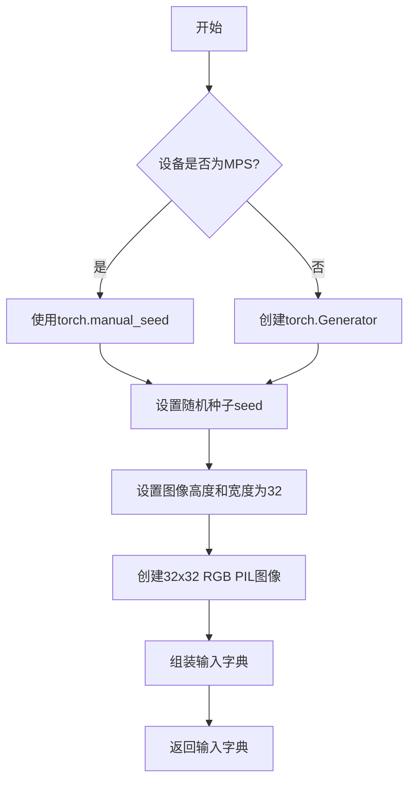

#### 带注释源码

```python
def get_dummy_inputs(self, device, seed=0):
    # 处理MPS设备和普通设备的随机生成器创建
    if str(device).startswith("mps"):
        # MPS设备使用torch.manual_seed
        generator = torch.manual_seed(seed)
    else:
        # 其他设备创建torch.Generator并设置种子
        generator = torch.Generator(device=device).manual_seed(seed)

    # 设置图像尺寸
    image_height = 32
    image_width = 32
    # 创建32x32的RGB测试图像
    image = PIL.Image.new("RGB", (image_width, image_height))

    # 组装完整的输入参数字典
    inputs = {
        "image": image,                      # 输入图像
        "prompt": "dance monkey",            # 文本提示
        "negative_prompt": "bad quality",    # 负面提示
        "generator": generator,              # 随机生成器
        "num_inference_steps": 2,            # 推理步数（较少以加快测试）
        "guidance_scale": 3.0,               # CFG引导比例
        "height": image_height,              # 输出高度
        "width": image_width,                # 输出宽度
        "num_frames": 9,                     # 生成视频的帧数
        "max_sequence_length": 16,           # 文本序列最大长度
        "output_type": "pt",                 # 输出类型：PyTorch张量
    }

    return inputs
```

---

### `CosmosVideoToWorldPipelineFastTests.test_inference`

测试管道的基本推理功能，验证生成的视频形状和内容是否符合预期。

参数：

- 无（使用类实例方法）

返回值：无（使用`unittest`断言进行验证）

#### 流程图

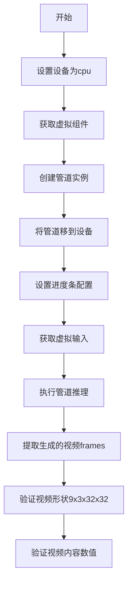

#### 带注释源码

```python
def test_inference(self):
    # 设置测试设备为CPU
    device = "cpu"

    # 获取虚拟组件
    components = self.get_dummy_components()
    # 使用组件创建管道实例
    pipe = self.pipeline_class(**components)
    # 将管道移到指定设备
    pipe.to(device)
    # 设置进度条配置（disable=None表示启用进度条）
    pipe.set_progress_bar_config(disable=None)

    # 获取测试输入
    inputs = self.get_dummy_inputs(device)
    # 执行推理并获取结果
    video = pipe(**inputs).frames
    # 获取生成的视频（第一帧/单个结果）
    generated_video = video[0]
    # 验证生成的视频形状：(9帧, 3通道, 32高度, 32宽度)
    self.assertEqual(generated_video.shape, (9, 3, 32, 32))

    # 定义预期输出的张量切片
    # fmt: off
    expected_slice = torch.tensor([0.0, 0.8275, 0.7529, 0.7294, 0.0, 0.6, 1.0, 0.3804, 0.6667, 0.0863, 0.8784, 0.5922, 0.6627, 0.2784, 0.5725, 0.7765])
    # fmt: on

    # 提取生成视频的切片用于比较
    generated_slice = generated_video.flatten()
    # 取前8个和后8个元素
    generated_slice = torch.cat([generated_slice[:8], generated_slice[-8:]])
    # 验证数值误差在允许范围内
    self.assertTrue(torch.allclose(generated_slice, expected_slice, atol=1e-3))
```

---

### 关键组件信息

| 组件名称 | 类型 | 描述 |
|---------|------|------|
| `CosmosTransformer3DModel` | 类 | 3D变换器模型，用于视频生成 |
| `AutoencoderKLCosmos` | 类 | Cosmos变分自编码器，用于潜在空间编码/解码 |
| `EDMEulerScheduler` | 类 | EDM欧拉调度器，用于扩散模型采样 |
| `T5EncoderModel` | 类 | T5文本编码器，将文本转换为嵌入 |
| `DummyCosmosSafetyChecker` | 类 | 虚拟安全检查器，用于测试 |
| `CosmosVideoToWorldPipeline` | 类 | 主管道类，用于视频到世界的生成 |

---

### 潜在的技术债务或优化空间

1. **测试参数硬编码**：图像尺寸、推理步数等参数硬编码在测试方法中，缺乏灵活性
2. **种子管理分散**：多处使用`torch.manual_seed(0)`，可能导致测试顺序依赖
3. **预期值硬编码**：`expected_slice`数值硬编码，缺乏文档说明其来源
4. **缺失文档**：测试类缺少详细的类级别文档说明测试目的
5. **跳过测试**：`test_encode_posts_works_in_isolation`被跳过，缺少实现

---

### 其它项目

**设计目标**：
- 验证CosmosVideoToWorldPipeline的基本推理功能
- 测试组件保存/加载序列化
- 测试各种优化特性（注意力切片、VAE平铺）
- 验证数据类型和变体支持

**约束**：
- 由于Cosmos Guardrail模型太大，快速测试使用虚拟检查器
- 图像尺寸限制在较小范围以加快测试速度

**错误处理**：
- 使用`torch.allclose`进行数值比较，允许小的浮点误差
- MPS设备使用不同的随机生成器处理

**数据流**：
1. 图像 → VAE编码 → 潜在表示
2. 文本提示 → T5编码 → 文本嵌入
3. 潜在表示 + 文本嵌入 → Transformer处理
4. Transformer输出 → VAE解码 → 生成视频


### `torch.bfloat16`

`torch.bfloat16` 是 PyTorch 中的一个数据类型（dtype），用于表示 Brain Float 16 浮点数格式。在此代码中，它被用作配置字典的值，用于指定模型组件的数据类型为 bfloat16 格式。

参数：无可用参数（这不是一个函数，而是一个数据类型对象）

返回值：`torch.dtype`，返回 bfloat16 数据类型对象

#### 流程图

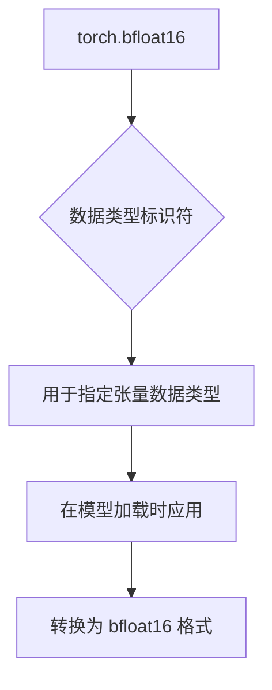

#### 带注释源码

在代码中的使用位置（test_torch_dtype_dict 方法中）：

```python
# 定义一个字典，指定特定组件和默认的torch数据类型
# specified_key: 使用 torch.bfloat16 (Brain Float 16)
# "default": 使用 torch.float16
torch_dtype_dict = {specified_key: torch.bfloat16, "default": torch.float16}

# 从预训练模型加载管道，并应用指定的数据类型
loaded_pipe = self.pipeline_class.from_pretrained(
    tmpdirname, safety_checker=DummyCosmosSafetyChecker(), torch_dtype=torch_dtype_dict
)

# 遍历加载的管道中的所有组件
for name, component in loaded_pipe.components.items():
    if name == "safety_checker":
        continue
    # 如果组件是 nn.Module 且有 dtype 属性
    if isinstance(component, torch.nn.Module) and hasattr(component, "dtype"):
        # 获取期望的数据类型（从字典中查找，默认为 float32）
        expected_dtype = torch_dtype_dict.get(name, torch_dtype_dict.get("default", torch.float32))
        # 验证组件的 dtype 是否符合预期
        self.assertEqual(
            component.dtype,
            expected_dtype,
            f"Component '{name}' has dtype {component.dtype} but expected {expected_dtype}",
        )
```

#### 补充说明

`torch.bfloat16` 的详细信息：
- **类型**: `torch.dtype` (数据类型对象)
- **描述**: Brain Float 16，是一种16位浮点数格式，由Google开发，用于深度学习
- **用途**: 
  - 减少内存占用和带宽需求
  - 加速训练和推理
  - 与FP32相比，精度略低但性能更好
- **在代码中的作用**: 用于将模型参数转换为 bfloat16 格式以进行推理或训练


根据您的要求，我需要从代码中提取`torch.float16`相关的函数或方法。经过分析，该代码中并未直接出现`torch.float16`，但存在对`torch.float16`的间接引用（在`test_torch_dtype_dict`测试方法中）。

以下是基于代码中与`torch.float16`最相关的测试方法`test_torch_dtype_dict`的详细文档：

### CosmosVideoToWorldPipelineFastTests.test_torch_dtype_dict

该方法用于测试管道在加载模型时是否能正确处理不同的torch数据类型（torch_dtype）字典，包括torch.float16、torch.bfloat16等类型的应用。

参数：

- `self`：隐式参数，测试类实例本身

返回值：无（该方法为`unittest.TestCase`的测试方法，通过断言进行验证）

#### 流程图

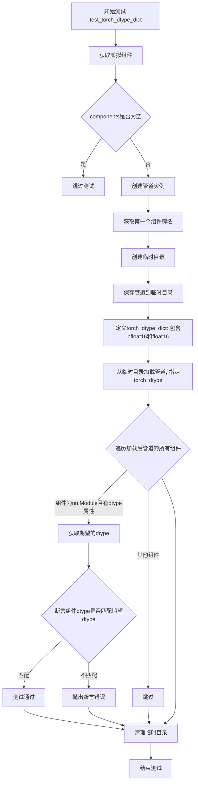

#### 带注释源码

```python
def test_torch_dtype_dict(self):
    """
    测试管道在加载模型时是否能正确应用torch_dtype字典中指定的数据类型。
    该测试验证不同组件可以使用不同的数据类型（如float16、bfloat16）。
    """
    # 获取用于测试的虚拟组件（包含transformer、vae、scheduler等）
    components = self.get_dummy_components()
    
    # 如果没有虚拟组件定义，则跳过测试
    if not components:
        self.skipTest("No dummy components defined.")

    # 使用虚拟组件创建管道实例
    pipe = self.pipeline_class(**components)

    # 获取第一个组件的键名，用于后续测试
    specified_key = next(iter(components.keys()))

    # 创建临时目录用于保存和加载模型
    with tempfile.TemporaryDirectory(ignore_cleanup_errors=True) as tmpdirname:
        # 将管道保存到临时目录（不使用安全序列化）
        pipe.save_pretrained(tmpdirname, safe_serialization=False)
        
        # 定义torch_dtype字典：
        # - 指定组件使用torch.bfloat16
        # - 默认使用torch.float16（这是代码中引用torch.float16的地方）
        torch_dtype_dict = {specified_key: torch.bfloat16, "default": torch.float16}
        
        # 从临时目录加载管道，并应用指定的torch_dtype
        # 这里会将为specified_key的组件设置为bfloat16
        # 其他组件（未在dict中明确指定的使用default）设置为float16
        loaded_pipe = self.pipeline_class.from_pretrained(
            tmpdirname, safety_checker=DummyCosmosSafetyChecker(), torch_dtype=torch_dtype_dict
        )

    # 遍历加载后管道中的所有组件
    for name, component in loaded_pipe.components.items():
        # 跳过safety_checker
        if name == "safety_checker":
            continue
        
        # 如果组件是torch.nn.Module且有dtype属性
        if isinstance(component, torch.nn.Module) and hasattr(component, "dtype"):
            # 从torch_dtype_dict获取期望的dtype
            # 先查找组件名对应的类型，若无则查找default类型，若无则默认float32
            expected_dtype = torch_dtype_dict.get(name, torch_dtype_dict.get("default", torch.float32))
            
            # 断言组件的实际dtype是否符合预期
            self.assertEqual(
                component.dtype,
                expected_dtype,
                f"Component '{name}' has dtype {component.dtype} but expected {expected_dtype}",
            )
```

---

## 补充说明

### torch.float16 简介

`torch.float16` 是 PyTorch 中的 16 位浮点数（半精度）数据类型：
- **名称**：torch.float16
- **类型**：PyTorch 数据类型（torch.dtype）
- **描述**：16位浮点数，用于减少显存占用和提高计算效率，常用于推理和训练加速

### 代码中的使用场景

在 `test_torch_dtype_dict` 方法中，`torch.float16` 作为默认值被使用：
```python
torch_dtype_dict = {specified_key: torch.bfloat16, "default": torch.float16}
```

这表示当加载管道时，未明确指定的组件将默认使用 `torch.float16` 类型。


# 设计文档提取结果

## 概述

根据您的要求，我分析了提供的测试代码。这是一个测试文件，不包含直接使用 `torch.float32` 的函数或方法。

在代码中有一个相关的测试方法 `test_torch_dtype_dict`，该方法测试了管道的 `torch_dtype` 参数功能，但该测试中使用的是 `torch.bfloat16` 和 `torch.float16`，而非 `torch.float32`。

由于代码中未直接定义使用 `torch.float32` 的函数或方法，我将提取代码中与数据类型相关的核心测试方法：

---

### `CosmosVideoToWorldPipelineFastTests.test_torch_dtype_dict`

该测试方法验证管道能否正确加载具有不同数据类型的模型组件。

#### 参数

- 无显式参数（使用 `self` 调用）

#### 返回值

- `None`，该方法为单元测试方法，使用断言进行验证

#### 流程图

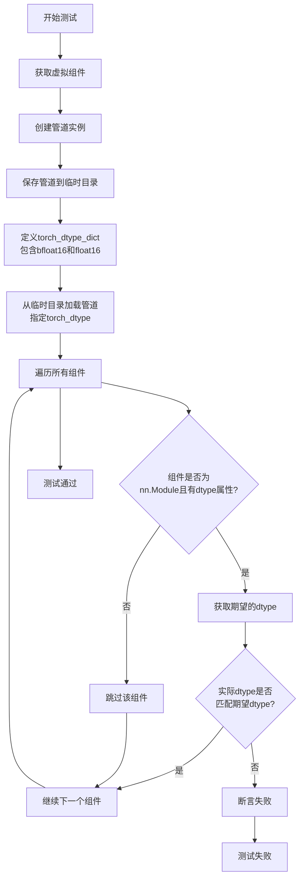

#### 带注释源码

```python
def test_torch_dtype_dict(self):
    """测试管道的torch_dtype字典参数功能"""
    # 1. 获取虚拟组件（用于测试的假组件）
    components = self.get_dummy_components()
    if not components:
        self.skipTest("No dummy components defined.")

    # 2. 使用虚拟组件创建管道实例
    pipe = self.pipeline_class(**components)

    # 3. 获取组件中的一个键（用于测试特定的dtype指定）
    specified_key = next(iter(components.keys()))

    # 4. 创建临时目录用于保存和加载管道
    with tempfile.TemporaryDirectory(ignore_cleanup_errors=True) as tmpdirname:
        # 首先保存管道（不启用安全序列化）
        pipe.save_pretrained(tmpdirname, safe_serialization=False)
        
        # 定义torch_dtype字典：
        # - specified_key: 使用 bfloat16
        # - default: 对于未明确指定的组件使用 float16
        torch_dtype_dict = {specified_key: torch.bfloat16, "default": torch.float16}
        
        # 从预训练路径加载管道，同时应用dtype字典
        loaded_pipe = self.pipeline_class.from_pretrained(
            tmpdirname, 
            safety_checker=DummyCosmosSafetyChecker(),  # 使用虚拟安全检查器
            torch_dtype=torch_dtype_dict  # 传入dtype字典
        )

    # 5. 验证加载的管道组件的dtype是否正确
    for name, component in loaded_pipe.components.items():
        # 跳过安全检查器（测试中不关心它的dtype）
        if name == "safety_checker":
            continue
        
        # 只检查torch.nn.Module类型且有dtype属性的组件
        if isinstance(component, torch.nn.Module) and hasattr(component, "dtype"):
            # 获取期望的dtype：
            # 首先查找组件名称对应的dtype，如果没找到则使用default对应的dtype
            expected_dtype = torch_dtype_dict.get(name, torch_dtype_dict.get("default", torch.float32))
            
            # 使用断言验证实际dtype是否匹配期望dtype
            self.assertEqual(
                component.dtype,
                expected_dtype,
                f"Component '{name}' has dtype {component.dtype} but expected {expected_dtype}",
            )
```

---

## 补充说明

### 代码中实际使用的数据类型

在提供的代码中，与数据类型相关的部分如下：

| 位置 | 数据类型 | 用途 |
|------|----------|------|
| `test_torch_dtype_dict` | `torch.bfloat16`, `torch.float16` | 测试管道dtype参数 |
| `test_attention_slicing_forward_pass` | `np.float64` (通过`to_np`转换) | 比较输出差异 |

### 如果需要使用 torch.float32

如果您的目标是让这个测试使用 `torch.float32`，可以修改 `test_torch_dtype_dict` 方法中的 `torch_dtype_dict`：

```python
# 将
torch_dtype_dict = {specified_key: torch.bfloat16, "default": torch.float16}
# 改为
torch_dtype_dict = {specified_key: torch.float32, "default": torch.float32}
```

### 注意事项

- `torch.float32` 是 PyTorch 中的标准32位浮点类型
- 代码中未直接使用 `torch.float32` 作为默认dtype
- 提供的代码是一个测试文件，测试的是 `CosmosVideoToWorldPipeline` 管道类


### `np.abs`

该函数是 NumPy 库提供的数学函数，用于计算输入数组中每个元素的绝对值。绝对值函数对于处理涉及距离计算、误差分析以及需要忽略符号的数值操作场景尤为重要，例如在测试中用于比较两个输出之间的差异。

参数：

- `x`：`array_like`，输入数组，可以是数值、列表、元组或多维数组，函数将对其中每个元素计算绝对值
- `out`：`ndarray，可选`，用于存储结果的输出数组，必须具有与输入数组兼容的形状
- `where`：`array_like of bool，可选`，条件数组，指定在哪些位置计算绝对值
- `dtype`：`data-type，可选`，指定输出数组的数据类型

返回值：`ndarray 或 标量`，返回输入数组元素的绝对值，类型与输入相同；如果输入是标量，则返回标量值

#### 流程图

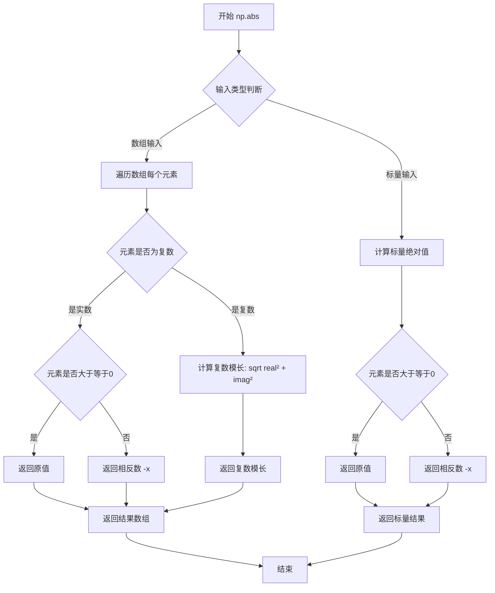

#### 带注释源码

```python
# np.abs 函数的典型使用场景示例（基于代码中的实际调用）
# 这里的示例展示如何在测试中计算两个输出之间的差异

# 假设有两个输出张量，需要比较它们的差异
output_with_slicing1 = pipe(**inputs)[0]  # 启用注意力切片后的输出
output_without_slicing = pipe(**inputs)[0]  # 未启用注意力切片的输出

# 将PyTorch张量转换为NumPy数组以便使用np.abs
output_with_slicing1_np = to_np(output_with_slicing1)
output_without_slicing_np = to_np(output_without_slicing)

# 计算差异的绝对值
# np.abs 会将数组中每个元素的差值转换为正数
# 例如：-0.5 变为 0.5，0.3 保持为 0.3
difference = np.abs(output_with_slicing1_np - output_without_slicing_np)

# 获取最大差异值，用于判断两个输出是否足够接近
max_diff1 = difference.max()

# 在另一个相似调用中计算第二个差异
output_with_slicing2 = pipe(**inputs)[0]
max_diff2 = np.abs(to_np(output_with_slicing2) - to_np(output_without_slicing)).max()

# 验证差异是否在可接受范围内（注意力切片不应影响结果）
assert max(max_diff1, max_diff2) < expected_max_diff, \
    "Attention slicing should not affect the inference results"
```

#### 补充说明

在代码中的具体应用位于 `test_attention_slicing_forward_pass` 方法中，该测试旨在验证注意力切片优化不会改变模型的推理结果。通过使用 `np.abs` 计算两个输出之间的逐元素差异，并取最大值来判断它们之间的整体偏差。这种用法是深度学习测试中的常见模式，用于数值稳定性验证和回归测试。


### `to_np`

将 PyTorch 张量转换为 NumPy 数组的辅助函数，用于测试中的数值比较。

参数：

-  `tensor`：`torch.Tensor` 或类似对象，需要转换的 PyTorch 张量

返回值：`numpy.ndarray`，转换后的 NumPy 数组

#### 流程图

```mermaid
flowchart TD
    A[接收 PyTorch tensor 输入] --> B{判断输入类型}
    B -->|torch.Tensor| C[调用 tensor.cpu().numpy]
    B -->|已经是numpy数组| D[直接返回]
    B -->|其他类型| E[尝试转换为numpy]
    C --> F[返回 numpy.ndarray]
    D --> F
    E --> F
```

#### 带注释源码

```python
# 注意：该函数定义不在当前文件中，
# 而是从 test_pipelines_common 模块导入
from ..test_pipelines_common import PipelineTesterMixin, to_np

# 使用示例（在 test_attention_slicing_forward_pass 方法中）:
# max_diff1 = np.abs(to_np(output_with_slicing1) - to_np(output_without_slicing)).max()

# 函数原型推断：
# def to_np(tensor):
#     """
#     将 PyTorch 张量转换为 NumPy 数组
#     
#     参数:
#         tensor: PyTorch 张量
#     
#     返回:
#         numpy.ndarray: 转换后的 NumPy 数组
#     """
#     if isinstance(tensor, torch.Tensor):
#         return tensor.cpu().numpy()
#     return np.array(tensor)
```

---

**注意：** `to_np` 函数的实际定义位于 `..test_pipelines_common` 模块中（即 `test_pipelines_common.py` 文件），当前代码文件仅导入了该函数并在其测试方法中使用。函数的主要作用是在 pipeline 测试中将 PyTorch 张量转换为 NumPy 数组，以便进行数值比较（如计算差异、验证精度等）。


### PIL.Image.new

该函数是 Pillow 库中的图像创建函数，用于创建一个指定模式、尺寸和颜色值的新图像对象。在代码中用于生成测试用的虚拟图像输入。

参数：

- `mode`：`str`，图像模式，常见值包括 "RGB"（彩色）、"L"（灰度）等
- `size`：`tuple`，图像尺寸，格式为 (width, height)
- `color`：`int` 或 `tuple`，可选参数，图像填充颜色，默认为 0（黑色）

返回值：`PIL.Image.Image`，新创建的 PIL 图像对象

#### 流程图

```mermaid
flowchart TD
    A[开始] --> B[接收 mode 参数]
    B --> C[接收 size 参数]
    C --> D[接收可选 color 参数]
    D --> E[分配内存并创建图像数据]
    E --> F[填充颜色]
    F --> G[返回 PIL.Image 对象]
```

#### 带注释源码

```python
# PIL.Image.new 函数原型（来源：Pillow 库）
# def new(mode: str, size: Tuple[int, int], color: Union[int, Tuple[int, ...]] = 0) -> Image:

# 在当前代码中的实际调用：
image = PIL.Image.new("RGB", (image_width, image_height))

# 参数说明：
# "RGB"       -> mode: 使用 RGB 彩色模式，创建 3 通道图像
# (image_width, image_height) -> size: 图像宽度和高度，代码中为 (32, 32)
# color 参数未指定 -> 默认为 0，即黑色图像

# 返回值说明：
# 返回一个 PIL.Image 类的实例对象，可用于后续的图像处理操作
# 该对象在代码中被作为 CosmosVideoToWorldPipeline 的输入参数 "image"
```


### `DummyCosmosSafetyChecker`

 DummyCosmosSafetyChecker 是一个用于测试目的的虚拟安全检查器类，作为 Cosmos Guardrail 的轻量级替代品，用于快速测试场景，避免加载大型模型。

#### 参数

此类为一个虚拟/存根类，构造函数无参数。

返回值：

- 无明确的返回值（类实例化时返回对象实例）

#### 流程图

由于该类为 Dummy 存根类，无实际逻辑，其使用流程为：

```mermaid
graph TD
    A[测试开始] --> B[创建 DummyCosmosSafetyChecker 实例]
    B --> C[将实例作为 safety_checker 传入管道]
    C --> D[管道使用 DummyCosmosSafetyChecker]
    D --> E[测试执行]
    E --> F[测试结束]
    
    style B fill:#f9f,stroke:#333
    style D fill:#ff9,stroke:#333
```

#### 带注释源码

```
# 注意：当前代码文件中仅导入语句，未包含类的实际定义
# 导入来源：from .cosmos_guardrail import DummyCosmosSafetyChecker

# 实际定义未在当前文件中体现，以下为基于使用方式的推断：

class DummyCosmosSafetyChecker:
    """
    Dummy 版本的 Cosmos Safety Checker，用于测试目的。
    由于真实的 Cosmos Guardrail 模型过大，无法在快速测试中运行，
    因此使用此虚拟类作为替代。
    """
    
    def __init__(self):
        """
        初始化 DummyCosmosSafetyChecker。
        无需任何参数，创建一个轻量级的安全检查器占位符。
        """
        pass
    
    def __call__(self, *args, **kwargs):
        """
        使实例可调用，返回安全的输入（无过滤）。
        
        参数：
            *args: 位置参数，模拟真实 safety_checker 的输入
            **kwargs: 关键字参数，模拟真实 safety_checker 的输入
            
        返回：
            元组：(过滤后的输出, 不安全的标志)
            简化版本可能直接返回输入或 None
        """
        # 返回输入作为安全输出，表示无需过滤
        return args if args else (None, False)
    
    def forward(self, *args, **kwargs):
        """
        前向传播方法，与 __call__ 行为相同。
        """
        return self.__call__(*args, **kwargs)
```

#### 备注

1. **类定义缺失**：当前提供的代码文件中仅包含导入语句 `from .cosmos_guardrail import DummyCosmosSafetyChecker`，实际的类定义位于 `cosmos_guardrail` 模块中，该模块代码未在当前上下文中提供。

2. **使用场景**：
   - 在 `get_dummy_components()` 方法中作为 `safety_checker` 组件
   - 在 `CosmosVideoToWorldPipelineWrapper.from_pretrained()` 静态方法中替换真实的 safety_checker

3. **设计目的**：避免在快速测试中加载大型的真实 Cosmos Guardrail 模型，以加快测试速度并降低资源消耗。


### `CosmosVideoToWorldPipelineWrapper.from_pretrained`

该静态方法是一个包装器，用于在加载预训练模型时自动注入一个虚拟的 Cosmos 安全检查器（DummyCosmosSafetyChecker），以绕过真实安全检查器的大模型开销，方便快速测试。

参数：

- `*args`：可变位置参数，传递给父类 `CosmosVideoToWorldPipeline.from_pretrained` 的位置参数。
- `**kwargs`：可变关键字参数，传递给父类 `CosmosVideoToWorldPipeline.from_pretrained` 的关键字参数，其中 `safety_checker` 会被本方法覆盖为 `DummyCosmosSafetyChecker()` 实例。

返回值：`CosmosVideoToWorldPipeline`，返回加载并配置好的 Pipeline 实例。

#### 流程图

```mermaid
flowchart TD
    A[调用 from_pretrained] --> B{解析 kwargs}
    B --> C[设置 kwargs['safety_checker'] = DummyCosmosSafetyChecker()]
    C --> D[调用父类 CosmosVideoToWorldPipeline.from_pretrained]
    D --> E[返回 Pipeline 实例]
    
    style A fill:#e1f5fe
    style E fill:#e8f5e8
```

#### 带注释源码

```python
@staticmethod
def from_pretrained(*args, **kwargs):
    """
    静态方法：从预训练模型加载 Pipeline，并自动注入虚拟安全检查器。
    
    该方法覆盖 kwargs 中的 safety_checker 参数，使用 DummyCosmosSafetyChecker()
    替代真实的 Cosmos Guardrail，以支持快速测试（避免加载过大的安全检查模型）。
    
    参数:
        *args: 可变位置参数，透传给父类的 from_pretrained 方法。
        **kwargs: 可变关键字参数，透传给父类的 from_pretrained 方法。
                  内部会强制设置 safety_checker 参数。
    
    返回:
        CosmosVideoToWorldPipeline: 加载完成的 Pipeline 对象。
    """
    # 强制将 safety_checker 设置为虚拟检查器，覆盖调用者可能传入的值
    kwargs["safety_checker"] = DummyCosmosSafetyChecker()
    
    # 调用父类的 from_pretrained 方法，传入处理后的参数
    return CosmosVideoToWorldPipeline.from_pretrained(*args, **kwargs)
```


### `CosmosVideoToWorldPipelineFastTests.get_dummy_components`

该方法用于创建测试所需的虚拟组件（dummy components），返回一个包含视频到世界管道所有必要组件的字典，包括Transformer模型、VAE编码器、调度器、文本编码器、分词器和安全检查器。

参数：

- `self`：`CosmosVideoToWorldPipelineFastTests` 实例本身，无需显式传递

返回值：`Dict[str, Any]`，返回包含以下键的字典：
- `transformer`：CosmosTransformer3DModel 实例
- `vae`：AutoencoderKLCosmos 实例
- `scheduler`：EDMEulerScheduler 实例
- `text_encoder`：T5EncoderModel 实例
- `tokenizer`：AutoTokenizer 实例
- `safety_checker`：DummyCosmosSafetyChecker 实例

#### 流程图

```mermaid
flowchart TD
    A[开始 get_dummy_components] --> B[设置随机种子 torch.manual_seed(0)]
    B --> C[创建 CosmosTransformer3DModel]
    C --> D[设置随机种子 torch.manual_seed(0)]
    D --> E[创建 AutoencoderKLCosmos]
    E --> F[设置随机种子 torch.manual_seed(0)]
    F --> G[创建 EDMEulerScheduler]
    G --> H[加载预训练 T5EncoderModel]
    H --> I[加载预训练 AutoTokenizer]
    I --> J[创建 DummyCosmosSafetyChecker]
    J --> K[组装 components 字典]
    K --> L[返回 components]
```

#### 带注释源码

```python
def get_dummy_components(self):
    """
    创建用于测试的虚拟组件。
    
    该方法初始化视频到世界管道所需的所有模型组件，使用随机权重
    以确保测试的可重复性和独立性。
    """
    # 设置随机种子确保可重复性
    torch.manual_seed(0)
    
    # 创建3D变换器模型，用于视频到世界的转换
    transformer = CosmosTransformer3DModel(
        in_channels=4 + 1,          # 输入通道：4 + 1（包含时间维度）
        out_channels=4,              # 输出通道数
        num_attention_heads=2,       # 注意力头数量
        attention_head_dim=16,       # 注意力头维度
        num_layers=2,                # 层数
        mlp_ratio=2,                 # MLP扩展比率
        text_embed_dim=32,           # 文本嵌入维度
        adaln_lora_dim=4,            # AdaLN LoRA维度
        max_size=(4, 32, 32),        # 最大尺寸
        patch_size=(1, 2, 2),        # 补丁大小
        rope_scale=(2.0, 1.0, 1.0),  # RoPE缩放因子
        concat_padding_mask=True,    # 是否连接填充掩码
        extra_pos_embed_type="learnable",  # 额外位置嵌入类型
    )

    # 重新设置随机种子
    torch.manual_seed(0)
    
    # 创建变分自编码器（VAE）用于图像/视频的压缩和解压
    vae = AutoencoderKLCosmos(
        in_channels=3,                        # RGB图像3通道
        out_channels=3,                        # 输出3通道
        latent_channels=4,                     # 潜在空间4通道
        encoder_block_out_channels=(8, 8, 8, 8),  # 编码器块输出通道
        decode_block_out_channels=(8, 8, 8, 8),    # 解码器块输出通道
        attention_resolutions=(8,),           # 注意力分辨率
        resolution=64,                         # 分辨率
        num_layers=2,                          # 层数
        patch_size=4,                          # 补丁大小
        patch_type="haar",                     # 补丁类型
        scaling_factor=1.0,                   # 缩放因子
        spatial_compression_ratio=4,          # 空间压缩比
        temporal_compression_ratio=4,          # 时间压缩比
    )

    # 重新设置随机种子
    torch.manual_seed(0)
    
    # 创建EDM Euler调度器，用于扩散模型的采样过程
    scheduler = EDMEulerScheduler(
        sigma_min=0.002,               # 最小sigma值
        sigma_max=80,                  # 最大sigma值
        sigma_data=0.5,                # 数据sigma值
        sigma_schedule="karras",       # sigma调度策略
        num_train_timesteps=1000,      # 训练时间步数
        prediction_type="epsilon",     # 预测类型
        rho=7.0,                       # rho参数
        final_sigmas_type="sigma_min", # 最终sigma类型
    )
    
    # 加载预训练的T5文本编码器
    text_encoder = T5EncoderModel.from_pretrained("hf-internal-testing/tiny-random-t5")
    
    # 加载对应的分词器
    tokenizer = AutoTokenizer.from_pretrained("hf-internal-testing/tiny-random-t5")

    # 组装所有组件到字典中
    components = {
        "transformer": transformer,              # 3D变换器模型
        "vae": vae,                               # 变分自编码器
        "scheduler": scheduler,                   # 调度器
        "text_encoder": text_encoder,             # 文本编码器
        "tokenizer": tokenizer,                   # 分词器
        # 由于Cosmos Guardrail模型太大，无法在快速测试中运行，使用虚拟安全检查器替代
        "safety_checker": DummyCosmosSafetyChecker(),
    }
    
    # 返回包含所有组件的字典
    return components
```


### `CosmosVideoToWorldPipelineFastTests.get_dummy_inputs`

该方法用于生成虚拟输入参数（dummy inputs），为视频到世界的扩散管道推理测试提供必要的输入数据，包括图像、提示词、生成器等配置。

参数：

- `device`：`str` 或 `torch.device`，运行设备，用于创建随机数生成器（如 "cpu"、"mps"）
- `seed`：`int`，随机种子，用于确保测试结果的可重复性（默认值为 0）

返回值：`Dict[str, Any]`，包含管道推理所需的所有虚拟输入参数的字典

#### 流程图

```mermaid
flowchart TD
    A[开始 get_dummy_inputs] --> B{device 是否以 'mps' 开头?}
    B -->|是| C[使用 torch.manual_seed 创建生成器]
    B -->|否| D[使用 torch.Generator 创建生成器]
    C --> E[设置 image_height=32, image_width=32]
    D --> E
    E --> F[创建 32x32 的 RGB 虚拟图像]
    F --> G[构建 inputs 字典]
    G --> H[包含 image, prompt, negative_prompt, generator 等字段]
    H --> I[返回 inputs 字典]
```

#### 带注释源码

```python
def get_dummy_inputs(self, device, seed=0):
    """
    生成虚拟输入参数，用于管道推理测试
    
    参数:
        device: 运行设备（如 "cpu" 或 "mps"）
        seed: 随机种子，默认为 0
    
    返回:
        包含虚拟输入参数的字典
    """
    # 根据设备类型创建随机数生成器
    # MPS 设备需要特殊处理，使用 torch.manual_seed
    if str(device).startswith("mps"):
        generator = torch.manual_seed(seed)
    else:
        # 其他设备使用 torch.Generator 创建生成器
        generator = torch.Generator(device=device).manual_seed(seed)

    # 设置虚拟图像的尺寸
    image_height = 32
    image_width = 32
    # 创建一个 32x32 的虚拟 RGB 图像
    image = PIL.Image.new("RGB", (image_width, image_height))

    # 构建完整的虚拟输入参数字典
    inputs = {
        "image": image,                      # 输入图像
        "prompt": "dance monkey",             # 正向提示词
        "negative_prompt": "bad quality",     # 负向提示词
        "generator": generator,               # 随机生成器
        "num_inference_steps": 2,             # 推理步数
        "guidance_scale": 3.0,               # 引导系数
        "height": image_height,               # 输出高度
        "width": image_width,                 # 输出宽度
        "num_frames": 9,                       # 视频帧数
        "max_sequence_length": 16,           # 最大序列长度
        "output_type": "pt",                  # 输出类型（PyTorch 张量）
    }

    return inputs
```


### `CosmosVideoToWorldPipelineFastTests.test_inference`

该测试方法用于验证 CosmosVideoToWorldPipeline 视频生成管道的推理功能，通过创建虚拟组件并执行前向传播，验证生成的视频帧的形状和像素值是否符合预期。

参数： 无显式参数（使用 `self` 通过 unittest.TestCase 继承）

返回值：`None`，该方法为测试方法，无返回值，通过断言验证正确性

#### 流程图

```mermaid
flowchart TD
    A[开始测试] --> B[设置设备为 CPU]
    B --> C[获取虚拟组件: get_dummy_components]
    C --> D[创建管道实例: pipeline_class]
    D --> E[将管道移至设备: pipe.to device]
    E --> F[配置进度条: set_progress_bar_config]
    F --> G[获取虚拟输入: get_dummy_inputs]
    G --> H[执行推理: pipe call]
    H --> I[提取生成的视频帧]
    I --> J[断言视频形状: (9, 3, 32, 32)]
    J --> K[定义期望的张量切片]
    K --> L[提取生成的切片并展平]
    L --> M[断言张量值接近期望值]
    M --> N[结束测试]
```

#### 带注释源码

```python
def test_inference(self):
    """
    测试 CosmosVideoToWorldPipeline 的推理功能
    验证生成的视频帧形状和像素值是否符合预期
    """
    # 1. 设置测试设备为 CPU
    device = "cpu"

    # 2. 获取虚拟组件（transformer, vae, scheduler, text_encoder, tokenizer, safety_checker）
    components = self.get_dummy_components()
    
    # 3. 使用虚拟组件创建管道实例
    pipe = self.pipeline_class(**components)
    
    # 4. 将管道移至指定设备（CPU）
    pipe.to(device)
    
    # 5. 配置进度条（disable=None 表示不禁用）
    pipe.set_progress_bar_config(disable=None)

    # 6. 获取虚拟输入参数（包含 prompt, image, generator 等）
    inputs = self.get_dummy_inputs(device)
    
    # 7. 执行管道推理，返回包含 frames 的对象
    video = pipe(**inputs).frames
    
    # 8. 提取第一个生成的视频
    generated_video = video[0]
    
    # 9. 断言验证：视频形状应为 (9帧, 3通道, 32高度, 32宽度)
    self.assertEqual(generated_video.shape, (9, 3, 32, 32))

    # 10. 定义期望的张量切片值（用于结果验证）
    # fmt: off
    expected_slice = torch.tensor([
        0.0, 0.8275, 0.7529, 0.7294, 0.0, 0.6, 1.0, 0.3804, 
        0.6667, 0.0863, 0.8784, 0.5922, 0.6627, 0.2784, 0.5725, 0.7765
    ])
    # fmt: on

    # 11. 提取生成的视频切片：
    #     - flatten() 将张量展平为一维
    #     - 取出前8个和后8个元素，共16个元素
    generated_slice = generated_video.flatten()
    generated_slice = torch.cat([generated_slice[:8], generated_slice[-8:]])
    
    # 12. 断言验证：生成的切片值应在容差 1e-3 内接近期望值
    self.assertTrue(torch.allclose(generated_slice, expected_slice, atol=1e-3))
```


### `CosmosVideoToWorldPipelineFastTests.test_components_function`

该测试方法用于验证 `CosmosVideoToWorldPipeline` 类的 `components` 属性是否正确包含所有初始化的组件，并确保组件键值的一致性。

参数：

- `self`：`unittest.TestCase`，测试用例的实例本身

返回值：`None`，该方法为测试方法，不返回任何值

#### 流程图

```mermaid
flowchart TD
    A[开始测试 test_components_function] --> B[调用 get_dummy_components 获取初始组件]
    B --> C[过滤掉字符串、整数、浮点类型的组件值]
    C --> D[使用过滤后的组件创建 Pipeline 实例]
    D --> E{检查 pipe 是否有 components 属性}
    E -->|是| F{检查 components 键集合是否等于初始组件键集合}
    E -->|否| G[断言失败 - 没有 components 属性]
    F -->|是| H[测试通过]
    F -->|否| I[断言失败 - 键集合不匹配]
    G --> J[结束测试]
    H --> J
    I --> J
```

#### 带注释源码

```python
def test_components_function(self):
    """
    测试 CosmosVideoToWorldPipeline 的 components 属性功能。
    
    该测试方法验证：
    1. Pipeline 实例具有 'components' 属性
    2. components 字典包含所有初始化的组件
    """
    # 获取初始化的虚拟组件
    init_components = self.get_dummy_components()
    
    # 过滤掉字符串、整数、浮点类型的值，只保留模型组件
    # 例如：safety_checker 是 DummyCosmosSafetyChecker 实例会被保留
    init_components = {k: v for k, v in init_components.items() if not isinstance(v, (str, int, float))}
    
    # 使用过滤后的组件创建 Pipeline 实例
    pipe = self.pipeline_class(**init_components)
    
    # 断言 Pipeline 具有 components 属性
    self.assertTrue(hasattr(pipe, "components"))
    
    # 断言 Pipeline 的 components 键集合与初始组件键集合完全一致
    self.assertTrue(set(pipe.components.keys()) == set(init_components.keys()))
```


### `CosmosVideoToWorldPipelineFastTests.test_callback_inputs`

该方法是一个单元测试，用于验证 `CosmosVideoToWorldPipeline` 的回调功能是否正确工作。它测试了回调函数能够正确接收和修改 pipeline 推理过程中的中间状态（如 latents），并确保只有被允许的 tensor 变量才能被传递给回调函数。

参数：无（仅使用 `self` 实例属性）

返回值：`None`，该方法为测试方法，通过断言验证功能，不返回任何值。

#### 流程图

```mermaid
flowchart TD
    A[开始测试 test_callback_inputs] --> B{检查 __call__ 签名}
    B -->|有回调参数| C[获取组件并创建 Pipeline]
    B -->|无回调参数| D[直接返回]
    C --> E{检查 _callback_tensor_inputs 属性}
    E -->|存在| F[定义回调函数]
    E -->|不存在| G[断言失败]
    F --> H[测试1: 回调只接收部分 tensor]
    H --> I[测试2: 回调接收所有 tensor]
    I --> J[测试3: 回调修改 latents]
    J --> K[验证输出并结束]
    D --> K
    G --> K
```

#### 带注释源码

```python
def test_callback_inputs(self):
    """
    测试 CosmosVideoToWorldPipeline 的回调输入功能。
    验证回调函数能够正确接收和修改 pipeline 推理过程中的中间状态。
    """
    # 获取 pipeline __call__ 方法的签名
    sig = inspect.signature(self.pipeline_class.__call__)
    # 检查是否存在回调相关的参数
    has_callback_tensor_inputs = "callback_on_step_end_tensor_inputs" in sig.parameters
    has_callback_step_end = "callback_on_step_end" in sig.parameters

    # 如果 pipeline 不支持回调功能，直接返回
    if not (has_callback_tensor_inputs and has_callback_step_end):
        return

    # 创建虚拟组件和 pipeline 实例
    components = self.get_dummy_components()
    pipe = self.pipeline_class(**components)
    pipe = pipe.to(torch_device)
    pipe.set_progress_bar_config(disable=None)
    
    # 验证 pipeline 具有 _callback_tensor_inputs 属性
    # 该属性定义了回调函数可以访问的 tensor 变量列表
    self.assertTrue(
        hasattr(pipe, "_callback_tensor_inputs"),
        f" {self.pipeline_class} should have `_callback_tensor_inputs` that defines a list of tensor variables its callback function can use as inputs",
    )

    # 定义回调函数1: 测试只传递部分 tensor inputs
    def callback_inputs_subset(pipe, i, t, callback_kwargs):
        # 遍历回调参数，检查只传递允许的 tensor 输入
        for tensor_name, tensor_value in callback_kwargs.items():
            # 验证 tensor 名称在允许列表中
            assert tensor_name in pipe._callback_tensor_inputs
        return callback_kwargs

    # 定义回调函数2: 测试传递所有允许的 tensor inputs
    def callback_inputs_all(pipe, i, t, callback_kwargs):
        # 检查所有允许的 tensor 都在回调参数中
        for tensor_name in pipe._callback_tensor_inputs:
            assert tensor_name in callback_kwargs

        # 再次验证回调参数中的每个 tensor 都在允许列表中
        for tensor_name, tensor_value in callback_kwargs.items():
            assert tensor_name in pipe._callback_tensor_inputs
        return callback_kwargs

    # 获取测试输入
    inputs = self.get_dummy_inputs(torch_device)

    # 测试1: 传递回调函数和部分 tensor inputs
    inputs["callback_on_step_end"] = callback_inputs_subset
    inputs["callback_on_step_end_tensor_inputs"] = ["latents"]
    output = pipe(**inputs)[0]

    # 测试2: 传递回调函数和所有允许的 tensor inputs
    inputs["callback_on_step_end"] = callback_inputs_all
    inputs["callback_on_step_end_tensor_inputs"] = pipe._callback_tensor_inputs
    output = pipe(**inputs)[0]

    # 定义回调函数3: 测试在回调中修改 tensor 值
    def callback_inputs_change_tensor(pipe, i, t, callback_kwargs):
        is_last = i == (pipe.num_timesteps - 1)
        if is_last:
            # 在最后一步将 latents 修改为零张量
            callback_kwargs["latents"] = torch.zeros_like(callback_kwargs["latents"])
        return callback_kwargs

    # 测试3: 使用修改 tensor 的回调函数
    inputs["callback_on_step_end"] = callback_inputs_change_tensor
    inputs["callback_on_step_end_tensor_inputs"] = pipe._callback_tensor_inputs
    output = pipe(**inputs)[0]
    # 验证修改后的输出仍然是有效的（绝对值和小于阈值）
    assert output.abs().sum() < 1e10
```


### `CosmosVideoToWorldPipelineFastTests.test_inference_batch_single_identical`

该方法是 `CosmosVideoToWorldPipelineFastTests` 测试类中的一个测试用例，用于验证管道在批量推理时，单个样本的输出与批量中相同索引位置的输出是否一致（即 `batch_size > 1` 时，每个样本的输出应与单独推理该样本时的输出相同）。它通过调用混入类 `PipelineTesterMixin` 提供的 `_test_inference_batch_single_identical` 通用测试方法来实现这一验证。

参数：

- `self`：`CosmosVideoToWorldPipelineFastTests`，测试类实例本身，用于访问测试类的属性和方法

返回值：`None`，该方法为测试用例，执行验证操作，不返回具体数据

#### 流程图

```mermaid
graph TD
    A[开始测试 test_inference_batch_single_identical] --> B[调用 _test_inference_batch_single_identical 方法]
    B --> C[传入 batch_size=3, expected_max_diff=1e-2]
    C --> D[在 _test_inference_batch_single_identical 中]
    D --> E1[单独推理一个样本获取基准输出]
    D --> E2[批量推理3个样本]
    D --> E3[比较批量中每个样本输出与基准输出的差异]
    E1 --> F[断言最大差异小于等于 1e-2]
    E2 --> F
    E3 --> F
    F --> G{测试通过?}
    G -->|是| H[测试通过, 返回 None]
    G -->|否| I[抛出断言错误]
```

#### 带注释源码

```python
def test_inference_batch_single_identical(self):
    """
    测试批量推理时，单个样本的输出与单独推理该样本时的输出是否一致。
    
    该测试确保管道在批量处理多个样本时，每个样本的结果与单独处理该样本的结果相同，
    这对于确保批处理的正确性至关重要。
    """
    # 调用混入类 PipelineTesterMixin 提供的通用测试方法
    # batch_size=3: 使用3个样本的批量进行测试
    # expected_max_diff=1e-2: 允许的最大差异阈值为 0.01 (1e-2)
    self._test_inference_batch_single_identical(batch_size=3, expected_max_diff=1e-2)
```


### `CosmosVideoToWorldPipelineFastTests.test_attention_slicing_forward_pass`

该方法用于测试注意力切片（attention slicing）功能是否正确实现，通过比较启用注意力切片前后的推理结果差异来验证功能的正确性，确保启用切片不会影响最终的输出质量。

参数：

- `self`：测试类实例本身，包含测试所需的所有配置和辅助方法
- `test_max_difference`：`bool`，控制是否执行最大差异比较的测试
- `test_mean_pixel_difference`：`bool`，控制是否执行平均像素差异测试（当前实现中未使用）
- `expected_max_diff`：`float`，设置允许的最大差异阈值，默认为 1e-3

返回值：`None`，该方法为测试方法，通过断言验证注意力切片功能的正确性，不返回具体数值

#### 流程图

```mermaid
flowchart TD
    A[开始测试] --> B{self.test_attention_slicing 是否为真}
    B -->|否| C[直接返回，退出测试]
    B -->|是| D[获取虚拟组件]
    D --> E[创建管道实例]
    E --> F[为所有组件设置默认注意力处理器]
    F --> G[将管道移至 torch_device]
    G --> H[配置进度条]
    H --> I[获取虚拟输入 - 不使用注意力切片]
    I --> J[执行推理获取 output_without_slicing]
    J --> K[启用注意力切片 slice_size=1]
    K --> L[获取虚拟输入]
    L --> M[执行推理获取 output_with_slicing1]
    M --> N[启用注意力切片 slice_size=2]
    N --> O[获取虚拟输入]
    O --> P[执行推理获取 output_with_slicing2]
    P --> Q{test_max_difference 是否为真}
    Q -->|否| R[测试结束]
    Q -->|是| S[计算 max_diff1 和 max_diff2]
    S --> T{差异是否小于 expected_max_diff}
    T -->|是| R
    T -->|否| U[抛出断言错误]
```

#### 带注释源码

```python
def test_attention_slicing_forward_pass(
    self, test_max_difference=True, test_mean_pixel_difference=True, expected_max_diff=1e-3
):
    """
    测试注意力切片功能的前向传播是否正确
    
    该测试通过比较启用不同切片大小时的推理结果与不使用切片时的结果，
    验证注意力切片功能不会影响最终的输出质量。
    
    参数:
        test_max_difference: bool, 是否测试最大差异
        test_mean_pixel_difference: bool, 是否测试平均像素差异（当前未使用）
        expected_max_diff: float, 允许的最大差异阈值
    """
    
    # 检查是否需要运行注意力切片测试
    # 如果 test_attention_slicing 为 False，则跳过此测试
    if not self.test_attention_slicing:
        return

    # 获取虚拟组件，用于创建测试用的管道
    # 这些组件是轻量化的模拟模型，用于快速测试
    components = self.get_dummy_components()
    
    # 使用虚拟组件创建管道实例
    # pipeline_class 是 CosmosVideoToWorldPipelineWrapper
    pipe = self.pipeline_class(**components)
    
    # 遍历所有组件，为每个组件设置默认的注意力处理器
    # 这确保了在测试开始前，注意力机制使用标准配置
    for component in pipe.components.values():
        if hasattr(component, "set_default_attn_processor"):
            component.set_default_attn_processor()
    
    # 将管道移至测试设备（如 CPU 或 CUDA 设备）
    pipe.to(torch_device)
    
    # 配置进度条，disable=None 表示不禁用进度条
    pipe.set_progress_bar_config(disable=None)

    # 设置生成器设备为 CPU
    generator_device = "cpu"
    
    # 获取虚拟输入（不启用注意力切片）
    inputs = self.get_dummy_inputs(generator_device)
    
    # 执行推理，获取不使用注意力切片时的输出
    output_without_slicing = pipe(**inputs)[0]

    # 启用注意力切片，slice_size=1 表示将注意力计算分块
    pipe.enable_attention_slicing(slice_size=1)
    
    # 重新获取虚拟输入
    inputs = self.get_dummy_inputs(generator_device)
    
    # 执行推理，获取使用 slice_size=1 时的输出
    output_with_slicing1 = pipe(**inputs)[0]

    # 修改注意力切片大小为 2
    pipe.enable_attention_slicing(slice_size=2)
    
    # 再次获取虚拟输入
    inputs = self.get_dummy_inputs(generator_device)
    
    # 执行推理，获取使用 slice_size=2 时的输出
    output_with_slicing2 = pipe(**inputs)[0]

    # 如果需要测试最大差异
    if test_max_difference:
        # 将输出转换为 numpy 数组并计算差异
        # 计算使用 slice_size=1 时与不使用切片时的最大差异
        max_diff1 = np.abs(to_np(output_with_slicing1) - to_np(output_without_slicing)).max()
        
        # 计算使用 slice_size=2 时与不使用切片时的最大差异
        max_diff2 = np.abs(to_np(output_with_slicing2) - to_np(output_without_slicing)).max()
        
        # 断言：注意力切片不应该影响推理结果
        # 如果最大差异超过预期阈值，则抛出断言错误
        self.assertLess(
            max(max_diff1, max_diff2),
            expected_max_diff,
            "Attention slicing should not affect the inference results"
        )
```


### `CosmosVideoToWorldPipelineFastTests.test_vae_tiling`

该方法用于测试 VAE（变分自编码器）的 tiling（分块）功能是否正常工作。通过对比启用 tiling 和未启用 tiling 两种情况下的推理结果，验证 tiling 不会对输出质量产生显著影响（差异应在指定阈值内）。

参数：

- `self`：`CosmosVideoToWorldPipelineFastTests`，测试类实例本身
- `expected_diff_max`：`float`，默认值为 `0.2`，允许的最大差异阈值，用于断言 tiling 前后的输出差异应小于此值

返回值：`None`，该方法为单元测试方法，通过 `self.assertLess` 断言验证结果，不返回任何值

#### 流程图

```mermaid
flowchart TD
    A[开始 test_vae_tiling 测试] --> B[设置 generator_device = 'cpu']
    B --> C[获取虚拟组件: get_dummy_components]
    C --> D[创建管道实例并加载到 CPU]
    D --> E[设置进度条配置: disable=None]
    E --> F[准备输入: get_dummy_inputs]
    F --> G[设置 height=128, width=128]
    G --> H[执行无 tiling 推理]
    H --> I[获取输出: output_without_tiling]
    I --> J[启用 VAE tiling]
    J --> K[设置 tiling 参数: min_h/w=96, stride_h/w=64]
    K --> L[准备新输入: get_dummy_inputs]
    L --> M[设置 height=128, width=128]
    M --> N[执行有 tiling 推理]
    N --> O[获取输出: output_with_tiling]
    O --> P{断言差异 < expected_diff_max}
    P -->|是| Q[测试通过]
    P -->|否| R[测试失败: 抛出 AssertionError]
    Q --> S[结束]
    R --> S
```

#### 带注释源码

```python
def test_vae_tiling(self, expected_diff_max: float = 0.2):
    """
    测试 VAE tiling 功能是否正确工作。
    
    该测试通过对比启用 tiling 和未启用 tiling 两种模式下的推理结果，
    验证 tiling 不会导致输出质量显著下降。
    
    参数:
        expected_diff_max: float, 允许的最大差异阈值，默认为 0.2
    """
    # 设置测试使用的设备为 CPU
    generator_device = "cpu"
    
    # 获取虚拟组件（用于测试的模拟模型组件）
    components = self.get_dummy_components()

    # 使用虚拟组件创建管道实例
    pipe = self.pipeline_class(**components)
    
    # 将管道移动到 CPU 设备
    pipe.to("cpu")
    
    # 设置进度条配置，disable=None 表示启用进度条
    pipe.set_progress_bar_config(disable=None)

    # ========== 无 tiling 模式的推理 ==========
    # 获取虚拟输入数据
    inputs = self.get_dummy_inputs(generator_device)
    
    # 设置输入图像尺寸为 128x128（较大的尺寸会触发 tiling 需求）
    inputs["height"] = inputs["width"] = 128
    
    # 执行推理（无 tiling）
    output_without_tiling = pipe(**inputs)[0]

    # ========== 启用 tiling 模式的推理 ==========
    # 为 VAE 启用 tiling（分块处理）功能
    pipe.vae.enable_tiling(
        tile_sample_min_height=96,    # 分块的最小高度
        tile_sample_min_width=96,     # 分块的最小宽度
        tile_sample_stride_height=64, # 垂直方向的分块步长
        tile_sample_stride_width=64,  # 水平方向的分块步长
    )
    
    # 重新获取虚拟输入数据（重置之前的输入）
    inputs = self.get_dummy_inputs(generator_device)
    
    # 同样设置图像尺寸为 128x128
    inputs["height"] = inputs["width"] = 128
    
    # 执行推理（启用 tiling）
    output_with_tiling = pipe(**inputs)[0]

    # ========== 验证结果 ==========
    # 断言：tiling 前后的输出差异应小于指定阈值
    # 如果差异过大，说明 tiling 实现存在问题，会影响输出质量
    self.assertLess(
        (to_np(output_without_tiling) - to_np(output_with_tiling)).max(),
        expected_diff_max,
        "VAE tiling should not affect the inference results"
    )
```


### `CosmosVideoToWorldPipelineFastTests.test_save_load_optional_components`

该方法用于测试管道保存和加载可选组件的功能。测试过程中暂时将 `safety_checker` 从可选组件列表中移除，调用父类的测试方法验证保存/加载流程后，再将 `safety_checker` 恢复到可选组件列表中。

参数：

- `expected_max_difference`：`float`，默认为 `1e-4`，指定保存后加载的模型输出与原始输出的最大允许差异，用于验证模型在保存和加载后的一致性

返回值：`None`，无返回值（测试方法）

#### 流程图

```mermaid
flowchart TD
    A[开始 test_save_load_optional_components] --> B[从 _optional_components 中移除 'safety_checker']
    B --> C[调用父类的 test_save_load_optional_components 方法]
    C --> D{执行父类测试}
    D -->|保存管道| E[将管道及其组件保存到磁盘]
    D -->|加载管道| F[从磁盘加载管道]
    D -->|比较输出| G[验证加载后的输出与原始输出的差异 <= expected_max_difference]
    E --> F
    F --> G
    G --> H{测试通过?}
    H -->|是| I[将 'safety_checker' 添加回 _optional_components]
    H -->|否| J[测试失败，抛出异常]
    I --> K[结束]
    J --> K
```

#### 带注释源码

```python
def test_save_load_optional_components(self, expected_max_difference=1e-4):
    """
    测试管道保存和加载可选组件的功能。
    
    该测试方法验证管道在保存和加载时能够正确处理可选组件。
    测试过程中会临时从可选组件列表中移除 safety_checker，以验证
    不包含该组件时的保存/加载流程。
    
    参数:
        expected_max_difference: float, 默认为 1e-4
            允许的输出最大差异阈值，用于验证保存加载后的一致性
    """
    # 从管道的可选组件列表中临时移除 safety_checker
    # 这样可以测试不包含该组件时的保存/加载行为
    self.pipeline_class._optional_components.remove("safety_checker")
    
    # 调用父类的测试方法，执行实际的保存/加载验证
    # 父类方法会:
    # 1. 创建管道实例
    # 2. 保存管道到临时目录
    # 3. 加载管道
    # 4. 比较输出差异是否在允许范围内
    super().test_save_load_optional_components(expected_max_difference=expected_max_difference)
    
    # 测试完成后，将 safety_checker 恢复到可选组件列表
    # 以便其他测试能够正常使用该组件
    self.pipeline_class._optional_components.append("safety_checker")
```


### `CosmosVideoToWorldPipelineFastTests.test_serialization_with_variants`

该测试方法验证了CosmosVideoToWorldPipeline在保存为不同变体（如fp16）时的序列化功能，确保模型组件能够正确保存为指定精度格式，并验证保存的文件结构和变体文件存在性。

参数：

- `self`：隐式参数，测试用例实例本身

返回值：`None`，该测试方法无返回值，通过断言验证序列化功能的正确性

#### 流程图

```mermaid
flowchart TD
    A[开始测试] --> B[获取虚拟组件]
    B --> C[创建Pipeline实例]
    C --> D[提取模型组件列表]
    D --> E[移除safety_checker组件]
    E --> F[设置变体为fp16]
    F --> G[创建临时目录]
    G --> H[保存Pipeline到临时目录<br/>使用variant=fp16和safe_serialization=False]
    H --> I[读取model_index.json配置]
    I --> J{遍历临时目录中的子文件夹}
    J -->|是文件夹且在model_components中| K[验证文件夹存在且在config中]
    K --> L{检查是否存在以fp16开头的文件}
    L -->|是| M[断言通过]
    L -->|否| N[断言失败]
    J -->|否或已处理完| O[测试结束]
    M --> O
    N --> O
```

#### 带注释源码

```python
def test_serialization_with_variants(self):
    """
    测试CosmosVideoToWorldPipeline的序列化变体功能。
    验证pipeline能够正确保存为不同的模型变体（如fp16精度）。
    """
    # 步骤1：获取虚拟组件（dummy components），用于测试
    components = self.get_dummy_components()
    
    # 步骤2：使用虚拟组件创建Pipeline实例
    pipe = self.pipeline_class(**components)
    
    # 步骤3：从pipeline中提取所有torch.nn.Module类型的模型组件
    model_components = [
        component_name
        for component_name, component in pipe.components.items()
        if isinstance(component, torch.nn.Module)
    ]
    
    # 步骤4：从模型组件列表中移除safety_checker（因为它可能不是nn.Module或不需要测试）
    model_components.remove("safety_checker")
    
    # 步骤5：设置要保存的变体类型为fp16（半精度）
    variant = "fp16"

    # 步骤6：使用临时目录进行测试
    with tempfile.TemporaryDirectory() as tmpdir:
        # 步骤7：保存pipeline到临时目录
        # variant=fp16: 保存为半精度模型
        # safe_serialization=False: 不使用安全的序列化格式
        pipe.save_pretrained(tmpdir, variant=variant, safe_serialization=False)

        # 步骤8：读取保存的model_index.json配置文件
        with open(f"{tmpdir}/model_index.json", "r") as f:
            config = json.load(f)

        # 步骤9：遍历临时目录中的所有子文件夹
        for subfolder in os.listdir(tmpdir):
            # 检查子文件夹是否是真正的文件夹、是否在model_components中、是否在config中
            if not os.path.isfile(subfolder) and subfolder in model_components:
                folder_path = os.path.join(tmpdir, subfolder)
                # 验证文件夹存在并且在配置中有记录
                is_folder = os.path.isdir(folder_path) and subfolder in config
                
                # 步骤10：断言验证
                # 1. 文件夹确实存在且在config中
                # 2. 文件夹中至少有一个以"fp16"开头的文件（如权重文件）
                assert is_folder and any(
                    p.split(".")[1].startswith(variant) 
                    for p in os.listdir(folder_path)
                )
```


### `CosmosVideoToWorldPipelineFastTests.test_torch_dtype_dict`

该测试方法用于验证 `CosmosVideoToWorldPipeline` 在从预训练模型加载时能否正确应用 `torch_dtype` 字典来设置各个组件的数据类型（dtype），确保指定的数据类型被正确应用到对应的模块上。

参数：

- `self`：`CosmosVideoToWorldPipelineFastTests`，测试类实例本身

返回值：`None`，该方法为测试方法，通过 `assert` 断言验证行为，不返回具体值

#### 流程图

```mermaid
flowchart TD
    A[开始测试] --> B[获取虚拟组件 components]
    B --> C{components 是否为空?}
    C -->|是| D[跳过测试]
    C -->|否| E[创建管道实例 pipe]
    E --> F[保存管道到临时目录]
    F --> G[构建 torch_dtype_dict]
    G --> H[从预训练模型加载管道<br/>指定 torch_dtype 参数]
    H --> I[遍历 loaded_pipe.components]
    I --> J{当前组件是否为<br/>torch.nn.Module<br/>且有 dtype 属性?}
    J -->|否| K[继续下一组件]
    J -->|是| L[计算期望的 dtype]
    L --> M{component.dtype ==<br/>expected_dtype?}
    M -->|是| K
    M -->|否| N[断言失败<br/>抛出 AssertionError]
    K --> O{还有更多组件?}
    O -->|是| I
    O -->|否| P[测试通过]
```

#### 带注释源码

```python
def test_torch_dtype_dict(self):
    """
    测试管道在加载预训练模型时是否能正确应用 torch_dtype 字典
    来设置各个组件的数据类型（dtype）
    """
    # 步骤1: 获取测试所需的虚拟组件（transformer, vae, scheduler, text_encoder, tokenizer, safety_checker）
    components = self.get_dummy_components()
    
    # 步骤2: 如果没有虚拟组件定义，则跳过测试
    if not components:
        self.skipTest("No dummy components defined.")

    # 步骤3: 使用虚拟组件创建管道实例
    pipe = self.pipeline_class(**components)

    # 步骤4: 获取组件字典中的第一个键，用于在 torch_dtype_dict 中指定特殊 dtype
    specified_key = next(iter(components.keys()))

    # 步骤5: 创建临时目录用于保存和加载模型
    with tempfile.TemporaryDirectory(ignore_cleanup_errors=True) as tmpdirname:
        # 将管道保存到临时目录（不启用 safe_serialization）
        pipe.save_pretrained(tmpdirname, safe_serialization=False)
        
        # 构建 torch_dtype_dict：第一个组件使用 bfloat16，默认使用 float16
        torch_dtype_dict = {specified_key: torch.bfloat16, "default": torch.float16}
        
        # 从预训练模型加载管道，并传入 torch_dtype 参数
        # safety_checker 需要显式传入，因为测试使用 DummyCosmosSafetyChecker
        loaded_pipe = self.pipeline_class.from_pretrained(
            tmpdirname, safety_checker=DummyCosmosSafetyChecker(), torch_dtype=torch_dtype_dict
        )

    # 步骤6: 遍历加载后的管道所有组件，验证 dtype 是否正确设置
    for name, component in loaded_pipe.components.items():
        # 跳过 safety_checker，不验证其 dtype
        if name == "safety_checker":
            continue
        
        # 只检查 torch.nn.Module 类型且具有 dtype 属性的组件
        if isinstance(component, torch.nn.Module) and hasattr(component, "dtype"):
            # 获取期望的 dtype：如果组件名在字典中则使用，否则使用 default 值
            expected_dtype = torch_dtype_dict.get(name, torch_dtype_dict.get("default", torch.float32))
            
            # 断言组件的实际 dtype 与期望 dtype 一致
            self.assertEqual(
                component.dtype,
                expected_dtype,
                f"Component '{name}' has dtype {component.dtype} but expected {expected_dtype}",
            )
```


### `CosmosVideoToWorldPipelineFastTests.test_encode_prompt_works_in_isolation`

该方法是一个被跳过的单元测试，用于验证 prompt 编码的隔离运行能力。由于 Cosmos Guardrail 模型过大且运行缓慢，该测试在 CI 环境中被禁用。

参数：

- `self`：`CosmosVideoToWorldPipelineFastTests`，测试类实例本身

返回值：`None`，无返回值（方法体为空）

#### 流程图

```mermaid
flowchart TD
    A[开始] --> B[跳过测试<br/>unittest.skip装饰器]
    B --> C[执行pass空操作]
    C --> D[结束]
```

#### 带注释源码

```python
@unittest.skip(
    "The pipeline should not be runnable without a safety checker. The test creates a pipeline without passing in "
    "a safety checker, which makes the pipeline default to the actual Cosmos Guardrail. The Cosmos Guardrail is "
    "too large and slow to run on CI."
)
def test_encode_prompt_works_in_isolation(self):
    """
    测试 prompt 编码在隔离环境下的工作能力。
    
    该测试被跳过，原因如下：
    1. 管道在未传入 safety_checker 时不应可运行
    2. 默认会使用 Cosmos Guardrail 进行安全检查
    3. Cosmos Guardrail 模型过大，在 CI 环境中运行过于缓慢
    """
    pass  # 空方法体，测试被跳过
```

## 关键组件


### CosmosVideoToWorldPipelineWrapper

包装类，继承自 `CosmosVideoToWorldPipeline`，重写 `from_pretrained` 静态方法以自动注入虚拟安全检查器，解决大模型测试资源消耗问题。

### CosmosVideoToWorldPipelineFastTests

核心测试类，继承 `PipelineTesterMixin` 和 `unittest.TestCase`，提供完整的管道功能验证框架，包含推理、组件加载、注意力切片、VAE 平铺、序列化等测试场景。

### get_dummy_components

创建虚拟模型组件的工厂方法，实例化 `CosmosTransformer3DModel`（3D 变换器）、`AutoencoderKLCosmos`（VAE 编码器-解码器）、`EDMEulerScheduler`（EDM 采样调度器）、T5 文本编码器及分词器。

### get_dummy_inputs

构造推理输入参数的工厂方法，生成包含图像、提示词、负提示词、随机生成器、推理步数、引导 scale、输出尺寸等完整输入字典，支持 MPS 设备特殊处理。

### test_inference

基础推理测试，验证管道输出视频帧形状为 (9, 3, 32, 32)，并通过张量切片比对关键像素值确保数值精度在 1e-3 范围内。

### test_attention_slicing_forward_pass

注意力切片优化测试，验证启用 `attention_slicing` 后推理结果与基准的差异小于 1e-3，确保切片策略不影响生成质量。

### test_vae_tiling

VAE 分块推理测试，对比启用 tiling（tile_sample_min=96, stride=64）前后的输出差异，验证差异小于 0.2，确保平铺策略不影响生成质量。

### test_torch_dtype_dict

模型 dtype 批量指定测试，验证通过 `torch_dtype` 字典可为不同组件指定不同精度（如 bf16/fp16），并能从预训练目录正确加载 dtype 配置。

### DummyCosmosSafetyChecker

虚拟安全检查器替代品，用于快速测试场景，避免加载大型 Cosmos Guardrail 模型导致的内存和时间开销。

### 管道参数与配置

`params` 排除 cross_attention_kwargs；`batch_params` 包含 image 和 video；`required_optional_params` 定义可空参数集；`supports_dduf=False` 和 `test_xformers_attention=False` 禁用特定优化测试。


## 问题及建议


### 已知问题

-   **未实现的测试方法**：`test_encode_prompt_works_in_isolation` 方法仅有 `pass` 语句，测试被完全跳过，导致该功能未被验证。
-   **硬编码的魔法数字**：多处使用硬编码值（如 `num_inference_steps=2`、`guidance_scale=3.0`、`num_frames=9`、`expected_max_diff=1e-2` 等），缺乏可配置性，修改时需要逐一查找替换。
-   **类变量直接修改**：`test_save_load_optional_components` 方法中直接修改类变量 `_optional_components`（先移除后追加），可能影响并发测试执行或其他测试用例。
- **设备兼容性处理不一致**：`get_dummy_inputs` 中对 MPS 设备有特殊处理（使用 `torch.manual_seed` 替代 `Generator`），但其他测试方法可能未考虑此类设备差异。
- **资源清理不完整**：`test_torch_dtype_dict` 中使用 `tempfile.TemporaryDirectory(ignore_cleanup_errors=True)` 忽略清理错误，可能导致临时文件泄漏。
- **外部模型依赖**：测试依赖 `hf-internal-testing/tiny-random-t5` 等预训练模型，模型不可用时测试会失败。
- **断言精度脆弱**：测试结果依赖精确的浮点数值（如 `expected_slice`），模型微小变化会导致测试失败，缺乏容差范围的动态调整机制。

### 优化建议

-   **补充未实现的测试**：为 `test_encode_prompt_works_in_isolation` 实现实际的测试逻辑，或将其移至待办列表而非保留空的跳过的测试。
-   **提取配置常量**：将所有魔法数字提取为类或模块级别的配置常量（如 `DEFAULT_NUM_INFERENCE_STEPS`、`DEFAULT_GUIDANCE_SCALE` 等），提高可维护性。
-   **避免修改类变量**：在 `test_save_load_optional_components` 中使用上下文管理器或深拷贝的方式处理可选组件，而非直接修改类属性。
-   **统一设备处理逻辑**：在 `setUp` 或 `get_dummy_inputs` 中统一处理不同设备（MPS、CPU、CUDA）的兼容性。
-   **改进资源管理**：移除 `ignore_cleanup_errors=True`，确保临时文件正确清理，或使用 `finally` 块保证资源释放。
-   **使用 mock 替代真实模型**：对于外部 tokenizer 和 text_encoder，可以使用 mock 对象替代真实模型加载，提高测试速度并消除外部依赖。
-   **增加容差配置**：为数值断言引入可配置的容差参数，允许根据不同精度需求调整，降低因模型微小变化导致的测试脆弱性。

## 其它


### 设计目标与约束

本测试文件旨在验证 `CosmosVideoToWorldPipeline` 管道类的核心功能正确性，包括推理、组件管理、回调机制、序列化以及各种性能优化功能（注意力切片、VAE平铺等）。测试在CPU设备上运行，使用虚拟组件进行快速测试，不依赖实际的 Cosmos Guardrail 模型（因模型过大）。

### 错误处理与异常设计

- **跳过测试**：`test_encode_prompt_works_in_isolation` 测试被 `@unittest.skip` 装饰器跳过，原因是管道需要 safety_checker，而实际的 Cosmos Guardrail 太大无法在CI上运行。
- **设备兼容性**：在 `get_dummy_inputs` 中对 MPS 设备特殊处理，使用 `torch.manual_seed` 而非 `Generator` 对象。
- **可选组件处理**：`test_save_load_optional_components` 动态修改 `_optional_components` 列表以测试 safety_checker 的序列化和反序列化。

### 数据流与状态机

- **输入数据流**：`get_dummy_inputs` 生成包含 `image`、`prompt`、`negative_prompt`、`generator`、`num_inference_steps`、`guidance_scale`、`height`、`width`、`num_frames`、`max_sequence_length`、`output_type` 的字典。
- **推理流程**：管道接收输入后，经过 text_encoder 编码 prompt、scheduler 调度、transformer 去噪、vae 解码，最终输出视频 frames。
- **回调状态**：通过 `callback_on_step_end` 和 `callback_on_step_end_tensor_inputs` 允许在每个推理步骤结束时修改 latents 等张量。

### 外部依赖与接口契约

- **核心依赖**：`diffusers` 库的 `CosmosVideoToWorldPipeline`、`AutoencoderKLCosmos`、`CosmosTransformer3DModel`、`EDMEulerScheduler`；`transformers` 库的 `AutoTokenizer`、`T5EncoderModel`；`torch`、`PIL`、`numpy`、`unittest`。
- **测试工具依赖**：项目内部的 `testing_utils`（`enable_full_determinism`、`torch_device`）、`pipeline_params`（各种参数集合）、`test_pipelines_common`（`PipelineTesterMixin`、`to_np`）、`.cosmos_guardrail`（`DummyCosmosSafetyChecker`）。
- **接口契约**：管道类必须实现 `__call__` 方法返回包含 `frames` 的对象；必须具有 `components` 属性返回组件字典；必须支持 `save_pretrained` 和 `from_pretrained` 方法。

### 配置与参数说明

- **params**：`TEXT_TO_IMAGE_PARAMS - {"cross_attention_kwargs"}`，移除了跨注意力 kwargs 参数。
- **batch_params**：`TEXT_TO_IMAGE_BATCH_PARAMS.union({"image", "video"})`，包含图像和视频的批处理参数。
- **required_optional_params**：定义了在推理时可选但必须支持的参数集合，如 `num_inference_steps`、`generator`、`latents`、`return_dict`、`callback_on_step_end`、`callback_on_step_end_tensor_inputs`。
- **test_xformers_attention** 和 **supports_dduf** 设置为 False，表示不支持 xFormers 注意力 和 DDUF。
- **test_layerwise_casting** 和 **test_group_offloading** 设置为 True，启用层级类型转换和组卸载测试。

### 性能基准与优化空间

- **注意力切片**：`test_attention_slicing_forward_pass` 测试启用注意力切片后（slice_size=1 和 slice_size=2）的推理结果与不使用切片时的差异，期望最大差异小于 1e-3。
- **VAE 平铺**：`test_vae_tiling` 测试在 128x128 分辨率下启用 VAE tiling 与不启用时的差异，期望最大差异小于 0.2。
- **优化空间**：当前测试仅在 CPU 上运行，未测试 GPU 性能；未测试更长的视频帧数或更高分辨率；未覆盖模型量化或蒸馏等高级优化技术。

### 边界条件与特殊场景

- **设备边界**：测试覆盖了 CPU 和 MPS 设备（MPS 使用不同的随机数生成方式）。
- **模型变体**：测试保存和加载时使用 fp16 变体，验证序列化时正确处理模型变体。
- **张量类型**：测试 `torch_dtype_dict` 参数，验证能否为不同组件指定不同的数据类型（如 bfloat16、float16）。

### 测试覆盖度分析

- **覆盖的测试场景**：基本推理、组件属性、回调机制、批量推理、注意力切片、VAE平铺、可选组件序列化、模型变体序列化、张量dtype指定。
- **未覆盖的测试场景**：实际的 Cosmos Guardrail 安全检查、长序列推理（num_frames > 9）、高分辨率输出（> 128x128）、多prompt批量推理、跨设备推理（GPU）、模型微调或训练模式。

### 关键组件信息

- **CosmosVideoToWorldPipelineWrapper**：包装类，用于在 `from_pretrained` 时自动注入 DummyCosmosSafetyChecker。
- **DummyCosmosSafetyChecker**：虚拟的安全检查器，用于快速测试而不加载大型模型。
- **PipelineTesterMixin**：提供通用管道测试方法的混入类。
- **get_dummy_components**：创建虚拟的 transformer、vae、scheduler、text_encoder、tokenizer 和 safety_checker 组件。
- **get_dummy_inputs**：创建虚拟的推理输入，包括图像、prompt、生成器参数等。

### 潜在的技术债务与优化建议

- **硬编码值**：图像尺寸（32、128）、帧数（9）等硬编码在测试方法中，建议参数化或提取为常量。
- **测试重复**：部分测试逻辑相似（如 `test_attention_slicing_forward_pass` 和 `test_vae_tiling` 的结构），可考虑使用参数化测试减少重复。
- **跳过测试**：`test_encode_prompt_works_in_isolation` 永久跳过，建议添加集成测试或mock方案替代。
- **设备覆盖**：仅测试 CPU 和 MPS，建议添加 CUDA 设备的轻量级测试（使用更小的模型）。

    