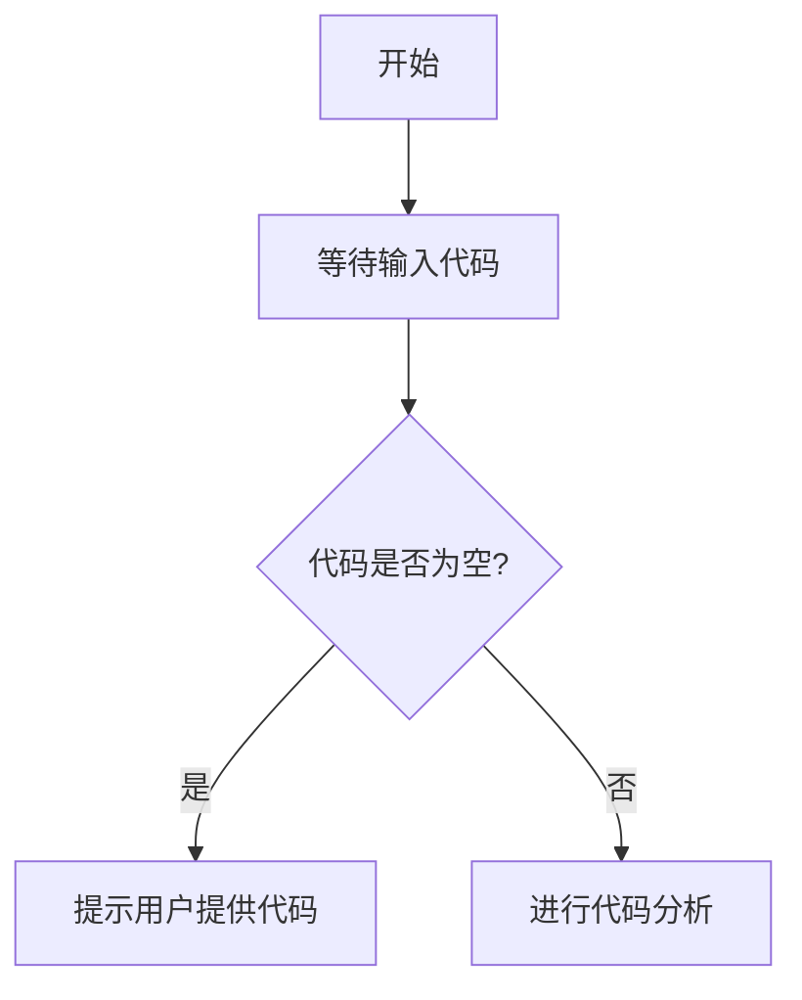

# `diffusers\tests\pipelines\ddim\__init__.py` 详细设计文档

未提供源代码，无法进行分析。请提供需要分析的代码。

## 整体流程



## 类结构

```

```

## 全局变量及字段


    

## 全局函数及方法


## 关键组件


## 问题及建议


### 已知问题

-   未提供代码内容，无法进行技术债务和优化空间的分析
-   缺少待分析的源代码输入

### 优化建议

-   请提供待分析的源代码，以便进行详细的技术债务识别和优化建议
-   建议在提交代码时附带相关的业务背景和技术栈信息，以便更准确地识别潜在问题


## 其它


### 设计目标与约束
明确本模块的业务目标、性能指标、兼容性要求以及在系统中的位置与约束条件。

### 错误处理与异常设计
描述异常分类、错误码体系、异常传播机制以及统一的错误日志记录方式。

### 数据流与状态机
绘制主要业务数据流动路径，阐明状态转换规则以及触发条件。

### 外部依赖与接口契约
列出所有外部系统、第三方库、RPC/Restful 接口的调用方式、输入输出契约及版本要求。

### 安全性考虑
说明身份认证、授权、输入校验、加密传输等安全措施以及潜在的攻击面。

### 性能与可扩展性
给出关键性能指标（如响应时间、吞吐量），并描述水平/垂直扩展的方案。

### 配置管理
阐述配置文件的组织、加载策略、动态更新机制以及敏感信息的保护方式。

### 部署与运维
描述部署环境、容器化/虚拟化方案、启动脚本、健康检查以及监控指标。

### 测试策略
列出单元测试、集成测试、端到端测试的覆盖率目标、测试框架以及 CI 集成方式。

### 版本兼容性与迁移
明确版本号命名规则、向后兼容策略以及升级迁移路径和回滚方案。

### 监控与日志
规定关键业务指标、监控告警阈值、日志格式、采集方式以及存储周期。

### 资源管理
说明内存、线程、连接池等资源的使用上限、回收策略以及异常情况下的降级方案。

### 代码风格与规范
约定代码格式化、命名规范、注释要求以及代码审查流程。

### 文档维护
制定文档更新时机、责任人以及文档发布渠道（如内部 Wiki、Swagger）。

    