# `diffusers\tests\pipelines\ddim\test_ddim.py` 详细设计文档

这是diffusers库中DDIM（Denoising Diffusion Implicit Models）管道的测试文件，包含快速单元测试和集成测试，用于验证DDIMPipeline在CIFAR10和 bedroom数据集上的图像生成功能正确性，以及管道的保存/加载、批量推理等特性。

## 整体流程

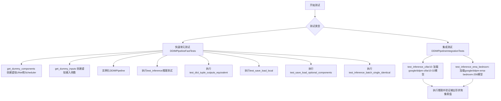

## 类结构

```
unittest.TestCase (Python标准库)
├── PipelineTesterMixin (自定义测试混合类)
│   └── DDIMPipelineFastTests
└── DDIMPipelineIntegrationTests
```

## 全局变量及字段


### `enable_full_determinism`
    
启用测试的完全确定性，确保测试结果可复现

类型：`function`
    


### `slow`
    
标记测试为慢速测试，用于跳过长时间运行的集成测试

类型：`decorator`
    


### `require_torch_accelerator`
    
装饰器要求测试环境具有torch加速器（如CUDA）才能运行

类型：`decorator`
    


### `torch_device`
    
表示当前torch计算设备（cpu/cuda）的字符串变量

类型：`str`
    


### `DDIMPipelineFastTests.pipeline_class`
    
指定测试使用的管道类为DDIMPipeline

类型：`Type[DDIMPipeline]`
    


### `DDIMPipelineFastTests.params`
    
无条件图像生成任务的参数配置

类型：`tuple`
    


### `DDIMPipelineFastTests.required_optional_params`
    
管道必需的可选参数集合，已排除部分参数

类型：`set`
    


### `DDIMPipelineFastTests.batch_params`
    
批量图像生成任务的参数配置

类型：`tuple`
    
    

## 全局函数及方法


### `DDIMPipelineFastTests.get_dummy_components`

该方法用于创建虚拟的UNet2DModel和DDIMScheduler组件，作为测试DDIMPipeline的输入参数。通过设置固定随机种子确保测试的可重复性，并配置一个轻量级的UNet模型用于快速单元测试。

参数：

- 无参数（除隐式self参数）

返回值：`Dict[str, Any]`，返回一个包含"unet"和"scheduler"键的字典，分别对应虚拟的UNet2DModel实例和DDIMScheduler实例，用于测试目的。

#### 流程图

```mermaid
flowchart TD
    A[开始 get_dummy_components] --> B[设置随机种子 torch.manual_seed(0)]
    B --> C[创建 UNet2DModel 实例]
    C --> D[配置 UNet2DModel 参数]
    D --> E[创建 DDIMScheduler 实例]
    E --> F[构建 components 字典]
    F --> G[返回 components 字典]
```

#### 带注释源码

```python
def get_dummy_components(self):
    """
    创建用于单元测试的虚拟Pipeline组件。
    
    返回一个包含UNet2DModel和DDIMScheduler的字典，
    用于测试DDIMPipeline的推理功能。
    """
    # 设置固定随机种子，确保测试结果可复现
    torch.manual_seed(0)
    
    # 创建虚拟的UNet2DModel，用于图像生成
    # 配置为轻量级模型，以便快速执行测试
    unet = UNet2DModel(
        block_out_channels=(4, 8),       # UNet的通道数配置
        layers_per_block=1,               # 每个块的层数
        norm_num_groups=4,                # 归一化组数
        sample_size=8,                    # 样本空间分辨率
        in_channels=3,                    # 输入通道数（RGB图像）
        out_channels=3,                   # 输出通道数（RGB图像）
        # 下采样块类型：标准下块和带注意力下块
        down_block_types=("DownBlock2D", "AttnDownBlock2D"),
        # 上采样块类型：带注意力上块和标准上块
        up_block_types=("AttnUpBlock2D", "UpBlock2D"),
    )
    
    # 创建虚拟的DDIMScheduler，用于扩散调度
    scheduler = DDIMScheduler()
    
    # 将组件封装为字典返回
    components = {"unet": unet, "scheduler": scheduler}
    return components
```


### `DDIMPipelineFastTests.get_dummy_inputs`

该方法用于生成 DDIMPipeline 测试所需的虚拟输入参数，根据设备类型创建随机数生成器，并返回一个包含批处理大小、生成器、推理步数和输出类型的字典。

参数：

- `self`：隐式参数，测试类实例
- `device`：`str`，目标设备标识，用于判断设备类型并创建对应生成器
- `seed`：`int`，随机种子，默认值为0，用于确保测试结果的可复现性

返回值：`Dict[str, Any]`，返回包含测试所需参数的字典，包括 batch_size（批大小）、generator（随机生成器）、num_inference_steps（推理步数）和 output_type（输出类型）

#### 流程图

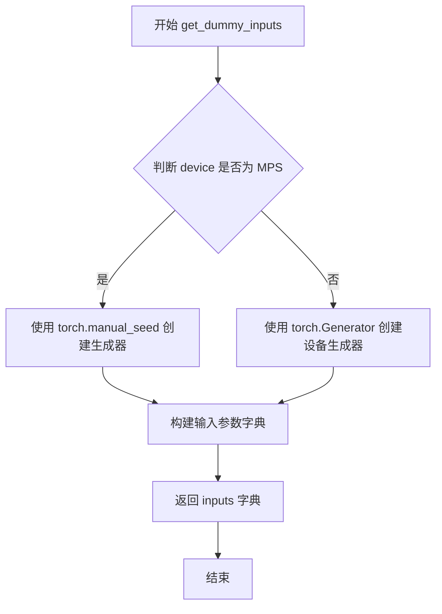

#### 带注释源码

```python
def get_dummy_inputs(self, device, seed=0):
    """
    生成用于测试 DDIMPipeline 的虚拟输入参数。
    
    参数:
        device: 目标设备标识符，用于创建对应的随机生成器
        seed: 随机种子，默认值为 0，用于确保测试结果可复现
    
    返回:
        包含测试参数的字典，包括 batch_size、generator、num_inference_steps 和 output_type
    """
    # 判断是否为 Apple MPS 设备
    if str(device).startswith("mps"):
        # MPS 设备使用 CPU 生成器（因 MPS 不支持 Generator API）
        generator = torch.manual_seed(seed)
    else:
        # 其他设备（如 CPU/CUDA）使用设备对应的生成器
        generator = torch.Generator(device=device).manual_seed(seed)
    
    # 构建测试所需的输入参数字典
    inputs = {
        "batch_size": 1,              # 单批次生成
        "generator": generator,        # 随机数生成器
        "num_inference_steps": 2,     # 推理步数（较少以加快测试速度）
        "output_type": "np",          # 输出为 NumPy 数组
    }
    return inputs
```


### `DDIMPipelineFastTests.test_inference`

该测试方法用于验证 DDIMPipeline 在 CPU 设备上的图像生成推理功能，通过创建虚拟组件、执行推理并比对生成的图像 slice 与预期值来确保管道的正确性。

参数：

- `self`：`DDIMPipelineFastTests`，测试类实例，隐式参数，用于访问类属性和方法

返回值：`None`，测试函数无返回值，通过断言验证图像生成结果的正确性

#### 流程图

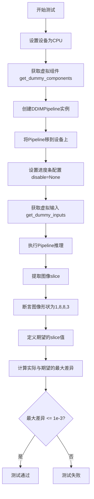

#### 带注释源码

```python
def test_inference(self):
    """测试DDIMPipeline在CPU设备上的推理功能"""
    # 设置测试设备为CPU
    device = "cpu"

    # 获取虚拟组件（UNet2DModel和DDIMScheduler）
    components = self.get_dummy_components()
    
    # 使用虚拟组件创建DDIMPipeline实例
    pipe = self.pipeline_class(**components)
    
    # 将Pipeline移至指定设备（CPU）
    pipe.to(device)
    
    # 配置进度条（disable=None表示不禁用进度条）
    pipe.set_progress_bar_config(disable=None)

    # 获取虚拟输入参数（batch_size, generator, num_inference_steps, output_type）
    inputs = self.get_dummy_inputs(device)
    
    # 执行Pipeline推理，生成图像
    # 返回的images形状为(batch_size, height, width, channels)
    image = pipe(**inputs).images
    
    # 提取图像右下角3x3区域作为验证slice
    # image[0, -3:, -3:, -1] 取第一个batch，底部3行，右侧3列，最后一个通道
    image_slice = image[0, -3:, -3:, -1]

    # 断言1：验证输出图像形状为(1, 8, 8, 3)
    self.assertEqual(image.shape, (1, 8, 8, 3))
    
    # 定义期望的图像slice值（numpy数组）
    expected_slice = np.array([0.0, 9.979e-01, 0.0, 9.999e-01, 9.986e-01, 9.991e-01, 7.106e-04, 0.0, 0.0])
    
    # 计算实际输出与期望值的最大绝对差异
    max_diff = np.abs(image_slice.flatten() - expected_slice).max()
    
    # 断言2：验证最大差异小于等于1e-3（确保数值精度）
    self.assertLessEqual(max_diff, 1e-3)
```


### `DDIMPipelineFastTests.test_dict_tuple_outputs_equivalent`

该测试方法用于验证 DDIMPipeline 在使用字典格式输出和元组格式输出时，结果是否等价，确保两种输出形式在数值上的一致性。

参数：

- `self`：隐式参数，测试类实例本身
- `expected_max_difference`：`float`，允许的最大数值差异阈值，默认为 `3e-3`（0.003）

返回值：`None`，无返回值（unittest 测试方法）

#### 流程图

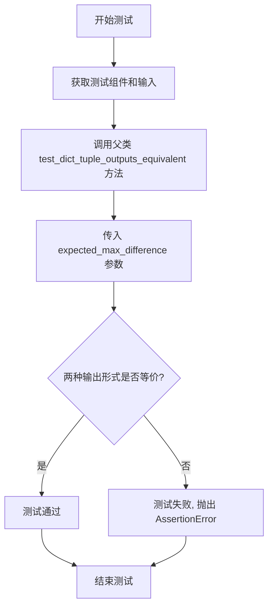

#### 带注释源码

```python
def test_dict_tuple_outputs_equivalent(self):
    """
    测试字典和元组输出格式的等价性
    
    该测试方法继承自 PipelineTesterMixin，用于验证 DDIMPipeline
    在使用字典格式输出和使用元组格式输出时，生成的图像结果是否一致。
    这确保了 API 的一致性和向后兼容性。
    
    参数:
        self: DDIMPipelineFastTests 的实例
        expected_max_difference: float, 允许的最大数值差异阈值 (默认 3e-3)
    
    返回值:
        None
    
    异常:
        AssertionError: 当两种输出格式的差异超过 expected_max_difference 时抛出
    """
    # 调用父类 PipelineTesterMixin 的同名测试方法
    # 传入期望的最大差异值 3e-3 (0.003)
    super().test_dict_tuple_outputs_equivalent(expected_max_difference=3e-3)
```


### `DDIMPipelineFastTests.test_save_load_local`

该测试方法用于验证 DDIMPipeline 的保存和加载功能，确保管道在序列化和反序列化后能够保持一致的性能表现，通过与父类测试方法进行比较来验证模型输出的一致性。

参数：此方法不接受任何显式参数（仅包含隐式 `self` 参数）。

返回值：`None`，该方法为 unittest 测试用例，执行特定的断言验证，不返回任何值。

#### 流程图

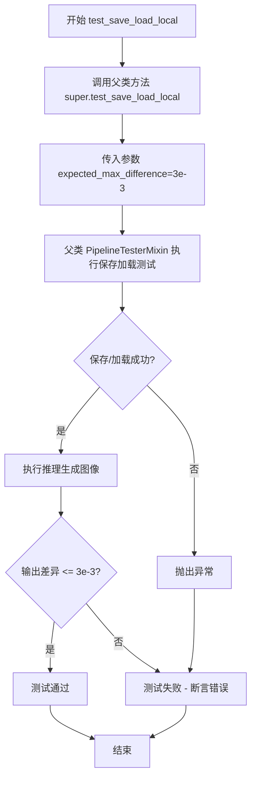

#### 带注释源码

```python
def test_save_load_local(self):
    """
    测试管道的保存和加载功能。
    
    该测试方法继承自 PipelineTesterMixin，通过调用父类的 test_save_load_local 方法
    来验证 DDIMPipeline 在本地保存和加载后是否能正常工作。
    
    测试流程：
    1. 调用父类方法执行完整的保存/加载流程
    2. 验证加载后的管道输出与原始管道输出的差异在允许范围内
    3. expected_max_difference=3e-3 表示允许的最大差异值为 0.003
    
    Returns:
        None: 此方法为 unittest 测试方法，通过断言验证，不返回具体值
    """
    # 调用父类 PipelineTesterMixin 的 test_save_load_local 方法
    # 传递 expected_max_difference=3e-3 参数用于验证输出差异阈值
    super().test_save_load_local(expected_max_difference=3e-3)
```


### `DDIMPipelineFastTests.test_save_load_optional_components`

该测试方法用于验证 Diffusion Pipeline 在保存和加载时对可选组件的处理是否正确，通过比较加载后的模型输出与原始输出的差异来确保状态一致性。

参数：

- `self`：测试类实例本身，用于访问测试类的属性和方法
- `expected_max_difference`：浮点数类型，允许的最大输出差异阈值（默认为 3e-3），用于判断保存/加载操作是否保持模型行为一致

返回值：无返回值（`None`），该方法为 `unittest.TestCase` 的测试方法，通过断言进行验证

#### 流程图

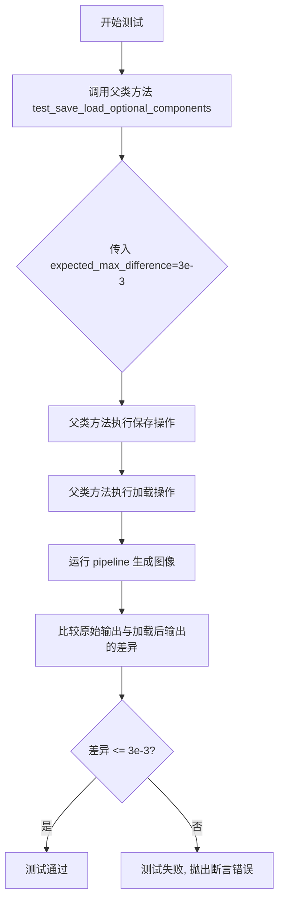

#### 带注释源码

```python
def test_save_load_optional_components(self):
    """
    测试 Pipeline 的保存和加载功能，特别是针对可选组件的处理。
    
    该测试方法继承自 PipelineTesterMixin，验证当 Pipeline 包含可选组件时，
    保存和加载操作能否正确恢复模型状态，确保生成结果的一致性。
    """
    # 调用父类的测试方法，传入允许的最大差异阈值
    # expected_max_difference=3e-3 表示允许 0.003 的最大差异
    super().test_save_load_optional_components(expected_max_difference=3e-3)
```


### `DDIMPipelineFastTests.test_inference_batch_single_identical`

该方法是DDIMPipelineFastTests测试类中的一个测试用例，用于验证批量推理（batch inference）与单样本推理（single inference）的输出是否保持一致，确保模型在两种推理模式下具有相同的生成结果。

参数：

- `self`：测试类实例本身，隐含参数无需显式传递
- `expected_max_diff`：浮点数类型（默认值3e-3），指定批量推理与单样本推理之间的最大允许差异阈值

返回值：无返回值（`None`），该方法为测试用例，通过断言验证模型行为而非返回计算结果

#### 流程图

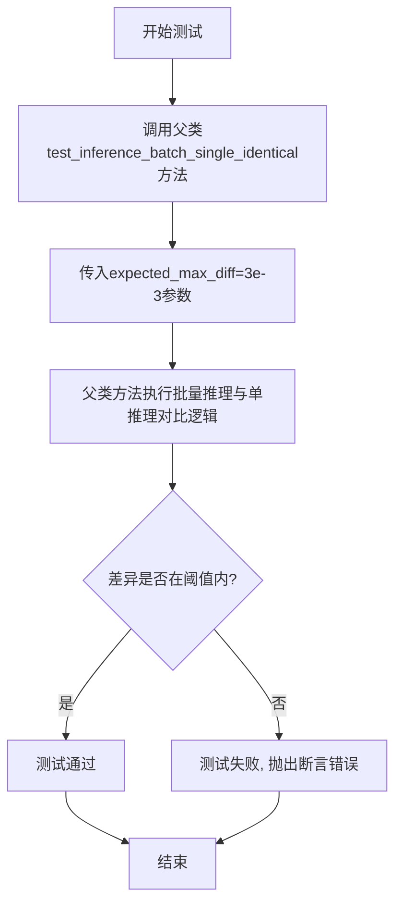

#### 带注释源码

```python
def test_inference_batch_single_identical(self):
    """
    测试方法：验证批量推理与单样本推理的输出一致性
    
    该测试方法继承自PipelineTesterMixin父类，用于确保DDIMPipeline
    在批量生成图像时能够产生与逐个生成相同的输出结果。
    这对于验证模型的确定性和批处理逻辑的正确性非常重要。
    
    参数:
        self: DDIMPipelineFastTests类的实例
        expected_max_diff: float类型,默认值3e-3
            批量推理与单推理输出之间的最大允许差异
            如果实际差异超过此阈值则测试失败
    
    返回值:
        无返回值,测试结果通过unittest断言机制报告
    """
    # 调用父类(PipelineTesterMixin)的同名测试方法
    # 传递最大允许差异阈值参数
    super().test_inference_batch_single_identical(expected_max_diff=3e-3)
```


### `DDIMPipelineIntegrationTests.test_inference_cifar10`

该测试方法用于在 CIFAR-10 数据集上验证 DDIMPipeline 的推理功能。它加载预训练的 DDPM 模型，配置 DDIM 调度器，执行图像生成流程，并验证生成的图像形状和像素值是否符合预期。

参数：

- 该方法无显式参数（隐式参数 `self` 为测试类实例）

返回值：无显式返回值（测试方法返回 `None`，通过 `assert` 语句进行断言验证）

#### 流程图

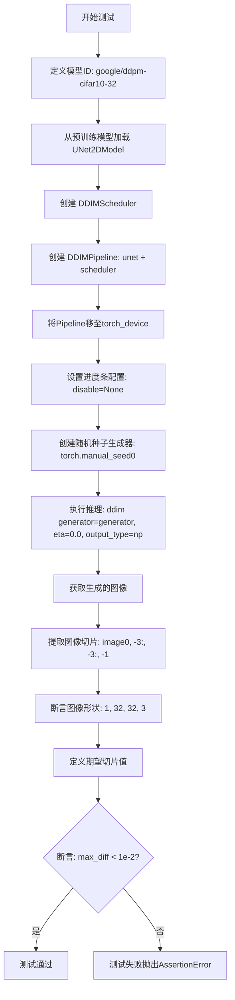

#### 带注释源码

```python
def test_inference_cifar10(self):
    """
    测试 DDIMPipeline 在 CIFAR-10 数据集上的推理功能。
    验证模型能够生成 32x32 的彩色图像，并检查输出像素值的准确性。
    """
    # 指定预训练模型标识符（CIFAR-10 32x32 分辨率）
    model_id = "google/ddpm-cifar10-32"

    # 从 HuggingFace Hub 加载预训练的 UNet2DModel
    # 该模型是 DDPM 架构的降噪网络
    unet = UNet2DModel.from_pretrained(model_id)

    # 创建 DDIMScheduler 调度器
    # DDIM (Denoising Diffusion Implicit Models) 提供确定性采样策略
    scheduler = DDIMScheduler()

    # 实例化 DDIMPipeline
    # 组合 UNet 去噪模型和 DDIM 调度器
    ddim = DDIMPipeline(unet=unet, scheduler=scheduler)

    # 将 Pipeline 移至指定计算设备
    # torch_device 通常为 CUDA 或 CPU
    ddim.to(torch_device)

    # 配置进度条显示
    # disable=None 表示不禁用进度条
    ddim.set_progress_bar_config(disable=None)

    # 创建确定性随机数生成器
    # 使用固定种子 0 确保测试结果可复现
    generator = torch.manual_seed(0)

    # 执行图像生成推理
    # eta=0.0 表示使用完全确定性采样（DDIM 的参数）
    # output_type="np" 返回 NumPy 数组格式的图像
    image = ddim(generator=generator, eta=0.0, output_type="np").images

    # 提取图像右下角 3x3 像素区域
    # 用于与期望值进行比对验证
    image_slice = image[0, -3:, -3:, -1]

    # 断言验证：图像形状应为 (1, 32, 32, 3)
    # 1张图，32x32分辨率，3通道(RGB)
    assert image.shape == (1, 32, 32, 3)

    # 定义期望的像素值切片
    # 这些值是在确定性条件下预先计算的标准输出
    expected_slice = np.array([0.1723, 0.1617, 0.1600, 0.1626, 0.1497, 0.1513, 0.1505, 0.1442, 0.1453])

    # 断言验证：实际输出与期望值的最大差异应小于 1e-2
    # 确保模型输出的一致性和准确性
    assert np.abs(image_slice.flatten() - expected_slice).max() < 1e-2
```


### `DDIMPipelineIntegrationTests.test_inference_ema_bedroom`

这是一个集成测试函数，用于验证 DDIMPipeline 在 EMA（指数移动平均）卧室图像生成任务上的推理能力。测试会加载预训练的 DDPM 模型，执行图像生成，并验证输出图像的形状和像素值是否符合预期。

参数：

- `self`：无需显式传入，测试类方法的标准参数

返回值：`None`，该函数为测试函数，通过断言验证结果而非返回值

#### 流程图

```mermaid
flowchart TD
    A[开始测试] --> B[定义模型ID: google/ddpm-ema-bedroom-256]
    B --> C[从预训练加载 UNet2DModel]
    C --> D[从预训练加载 DDIMScheduler]
    D --> E[创建 DDIMPipeline: unet=unet, scheduler=scheduler]
    E --> F[将Pipeline移动到 torch_device]
    F --> G[设置进度条配置: disable=None]
    G --> H[创建随机数生成器: torch.manual_seed(0)]
    H --> I[执行推理: ddpm(generator=generator, output_type=np)]
    I --> J[提取图像切片: image[0, -3:, -3:, -1]]
    J --> K{断言: image.shape == (1, 256, 256, 3)}
    K -->|是| L[定义期望像素值数组]
    L --> M{断言: 最大像素差异 < 1e-2}
    M -->|是| N[测试通过]
    M -->|否| O[抛出断言错误]
    K -->|否| O
```

#### 带注释源码

```python
def test_inference_ema_bedroom(self):
    """
    集成测试：验证 DDIMPipeline 在 EMA 卧室图像生成任务上的推理能力
    
    该测试：
    1. 加载预训练的 DDPM EMA 卧室模型（256x256）
    2. 使用 DDIMScheduler 进行推理
    3. 验证生成的图像形状和像素值
    """
    # 模型标识符：Google 提供的 DDPM EMA 卧室数据集预训练模型
    model_id = "google/ddpm-ema-bedroom-256"

    # 从预训练模型加载 UNet2DModel
    # 这是一个用于去噪的 UNet 模型
    unet = UNet2DModel.from_pretrained(model_id)
    
    # 从预训练模型加载 DDIMScheduler
    # DDIM (Denoising Diffusion Implicit Models) 是一种扩散模型调度器
    scheduler = DDIMScheduler.from_pretrained(model_id)

    # 创建 DDIMPipeline 实例
    # 将 UNet 和 Scheduler 组装成完整的扩散 pipeline
    ddpm = DDIMPipeline(unet=unet, scheduler=scheduler)
    
    # 将 pipeline 移动到指定的计算设备（GPU/CPU）
    ddpm.to(torch_device)
    
    # 配置进度条
    # disable=None 表示不禁用进度条
    ddpm.set_progress_bar_config(disable=None)

    # 创建随机数生成器
    # 设置种子为 0 以确保结果可复现
    generator = torch.manual_seed(0)
    
    # 执行图像生成推理
    # generator: 控制随机性的生成器
    # output_type="np": 输出 NumPy 数组格式的图像
    # 返回包含图像的输出对象，.images 获取图像数组
    image = ddpm(generator=generator, output_type="np").images

    # 提取图像切片
    # 取第一张图像的最后 3x3 像素区域，用于验证
    image_slice = image[0, -3:, -3:, -1]

    # 断言：验证生成图像的形状
    # 期望形状为 (1, 256, 256, 3)
    # 1: batch size, 256x256: 图像分辨率, 3: RGB 通道
    assert image.shape == (1, 256, 256, 3)
    
    # 定义期望的像素值切片
    # 这些值是预先计算的正确输出，用于比较
    expected_slice = np.array([0.0060, 0.0201, 0.0344, 0.0024, 0.0018, 0.0002, 0.0022, 0.0000, 0.0069])

    # 断言：验证像素值的准确性
    # 计算实际输出与期望输出的最大差异
    # 如果差异大于 1e-2，测试失败
    assert np.abs(image_slice.flatten() - expected_slice).max() < 1e-2
```


### `DDIMPipelineFastTests.get_dummy_components`

该方法用于生成测试所需的虚拟（dummy）组件，包括一个配置简化的 UNet2DModel 模型和一个 DDIMScheduler 调度器，以便在单元测试中初始化 DDIMPipeline 进行推理测试。

参数： 无（仅包含隐式的 `self` 参数）

返回值：`Dict[str, Any]`，返回一个包含 "unet" 和 "scheduler" 两个键的字典，分别对应 UNet2DModel 实例和 DDIMScheduler 实例，用于构建 DDIMPipeline。

#### 流程图

```mermaid
flowchart TD
    A[开始 get_dummy_components] --> B[设置随机种子 torch.manual_seed(0)]
    B --> C[创建虚拟 UNet2DModel]
    C --> D[配置 UNet2DModel 参数]
    D --> E[创建虚拟 DDIMScheduler]
    E --> F[组装 components 字典]
    F --> G[返回 components 字典]
```

#### 带注释源码

```python
def get_dummy_components(self):
    """
    生成用于测试的虚拟组件。
    
    返回值:
        dict: 包含 'unet' 和 'scheduler' 的字典，用于初始化 DDIMPipeline
    """
    # 设置随机种子，确保测试的可重复性
    torch.manual_seed(0)
    
    # 创建虚拟 UNet2DModel，配置参数如下：
    # - block_out_channels: 输出通道数配置 (4, 8)
    # - layers_per_block: 每个块的层数 = 1
    # - norm_num_groups: 归一化组数 = 4
    # - sample_size: 样本尺寸 = 8
    # - in_channels: 输入通道数 = 3 (RGB图像)
    # - out_channels: 输出通道数 = 3 (RGB图像)
    # - down_block_types: 下采样块类型
    # - up_block_types: 上采样块类型
    unet = UNet2DModel(
        block_out_channels=(4, 8),
        layers_per_block=1,
        norm_num_groups=4,
        sample_size=8,
        in_channels=3,
        out_channels=3,
        down_block_types=("DownBlock2D", "AttnDownBlock2D"),
        up_block_types=("AttnUpBlock2D", "UpBlock2D"),
    )
    
    # 创建虚拟 DDIMScheduler，使用默认配置
    scheduler = DDIMScheduler()
    
    # 组装组件字典
    components = {"unet": unet, "scheduler": scheduler}
    
    # 返回组件字典
    return components
```


### `DDIMPipelineFastTests.get_dummy_inputs`

该方法是一个测试辅助函数，用于为 DDIMPipeline 生成虚拟输入参数。它根据指定设备创建随机数生成器，并返回一个包含批处理大小、生成器、推理步数和输出类型的字典，用于 pipeline 的推理测试。

参数：

- `self`：类的实例方法隐式参数
- `device`：`str` 或 `torch.device`，指定创建随机数生成器的目标设备（如 "cpu"、"cuda" 等）
- `seed`：`int`，默认值 0，用于设置随机数生成器的种子，确保测试可重复性

返回值：`Dict[str, Any]`，返回一个包含 pipeline 所需输入参数的字典，具体包含：
- `batch_size`：批处理大小（固定为 1）
- `generator`：随机数生成器实例
- `num_inference_steps`：推理步数（固定为 2）
- `output_type`：输出类型（固定为 "np"，即 numpy 数组）

#### 流程图

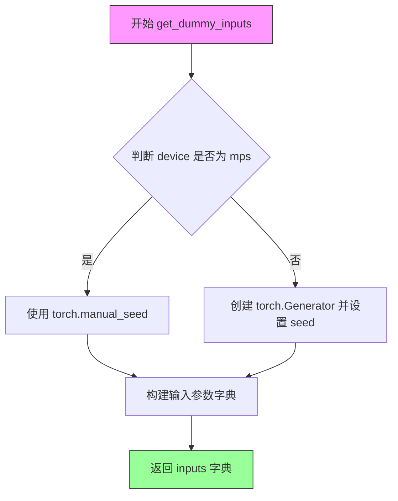

#### 带注释源码

```python
def get_dummy_inputs(self, device, seed=0):
    """
    生成用于 DDIMPipeline 测试的虚拟输入参数。
    
    Args:
        device: 目标设备，用于创建随机数生成器
        seed: 随机种子，用于确保测试结果可复现
    
    Returns:
        包含 pipeline 所需输入参数的字典
    """
    # 判断是否为 Apple MPS 设备
    if str(device).startswith("mps"):
        # MPS 设备不支持 torch.Generator，使用 CPU 方式的随机种子
        generator = torch.manual_seed(seed)
    else:
        # 为指定设备创建随机数生成器并设置种子
        generator = torch.Generator(device=device).manual_seed(seed)
    
    # 构建输入参数字典
    inputs = {
        "batch_size": 1,              # 批处理大小设为 1
        "generator": generator,       # 随机数生成器
        "num_inference_steps": 2,     # DDIM 推理步数（较少用于快速测试）
        "output_type": "np",          # 输出类型为 numpy 数组
    }
    
    return inputs  # 返回构建的输入参数字典
```


### `DDIMPipelineFastTests.test_inference`

该测试方法验证 DDIMPipeline 在 CPU 设备上使用虚拟（dummy）组件进行图像生成推理的功能，通过比较生成的图像切片与预期值来确认 pipeline 正确执行。

参数：

- `self`：隐含的测试类实例参数，无需额外描述

返回值：`None`，测试方法无返回值，通过断言验证结果

#### 流程图

```mermaid
flowchart TD
    A[开始 test_inference] --> B[设置设备为 CPU]
    B --> C[调用 get_dummy_components 获取虚拟组件]
    C --> D[使用虚拟组件实例化 DDIMPipeline]
    D --> E[将 pipeline 移动到 CPU 设备]
    E --> F[设置进度条配置 disable=None]
    F --> G[调用 get_dummy_inputs 获取虚拟输入]
    G --> H[执行 pipeline 推理: pipe\*\*inputs]
    H --> I[获取生成图像的切片: image[0, -3:, -3:, -1]]
    I --> J[断言图像形状为 (1, 8, 8, 3)]
    J --> K[定义期望的图像切片值]
    K --> L[计算实际与期望的最大差异]
    L --> M[断言最大差异 <= 1e-3]
    M --> N[结束测试]
```

#### 带注释源码

```python
def test_inference(self):
    """
    测试 DDIMPipeline 的推理功能，使用虚拟组件在 CPU 上进行图像生成。
    验证生成的图像形状和像素值与预期一致。
    """
    # 步骤1: 设置测试设备为 CPU
    device = "cpu"

    # 步骤2: 获取虚拟组件（UNet2DModel 和 DDIMScheduler）
    # 使用固定的随机种子确保可重复性
    components = self.get_dummy_components()
    
    # 步骤3: 使用虚拟组件实例化 DDIMPipeline
    pipe = self.pipeline_class(**components)
    
    # 步骤4: 将 pipeline 移动到指定设备（CPU）
    pipe.to(device)
    
    # 步骤5: 配置进度条（disable=None 表示不禁用进度条）
    pipe.set_progress_bar_config(disable=None)

    # 步骤6: 获取虚拟输入参数
    # 包含: batch_size=1, generator, num_inference_steps=2, output_type="np"
    inputs = self.get_dummy_inputs(device)
    
    # 步骤7: 执行推理，生成图像
    # 调用 pipeline 的 __call__ 方法进行图像生成
    image = pipe(**inputs).images
    
    # 步骤8: 获取图像右下角 3x3 区域切片用于验证
    # image shape: (1, 8, 8, 3) -> 取第一个样本的最后一个通道的右下角
    image_slice = image[0, -3:, -3:, -1]

    # 步骤9: 断言验证图像形状
    # 预期形状: (batch=1, height=8, width=8, channels=3)
    self.assertEqual(image.shape, (1, 8, 8, 3))
    
    # 步骤10: 定义期望的像素值切片
    # 这些值是在固定随机种子下使用相同配置生成的预期结果
    expected_slice = np.array([0.0, 9.979e-01, 0.0, 9.999e-01, 9.986e-01, 9.991e-01, 7.106e-04, 0.0, 0.0])
    
    # 步骤11: 计算实际输出与期望输出的最大差异
    max_diff = np.abs(image_slice.flatten() - expected_slice).max()
    
    # 步骤12: 断言验证最大差异在允许范围内（1e-3）
    self.assertLessEqual(max_diff, 1e-3)
```


### `DDIMPipelineFastTests.test_dict_tuple_outputs_equivalent`

该测试方法用于验证 DDIMPipeline 在使用字典格式输入和元组格式输入时，生成的图像输出是否等价，确保两种输入方式的输出结果一致性。

参数：

- `expected_max_difference`：`float`，期望的最大差异阈值，用于判断两种输入方式的输出是否足够接近

返回值：`None`，测试方法无返回值，通过断言验证输出等价性

#### 流程图

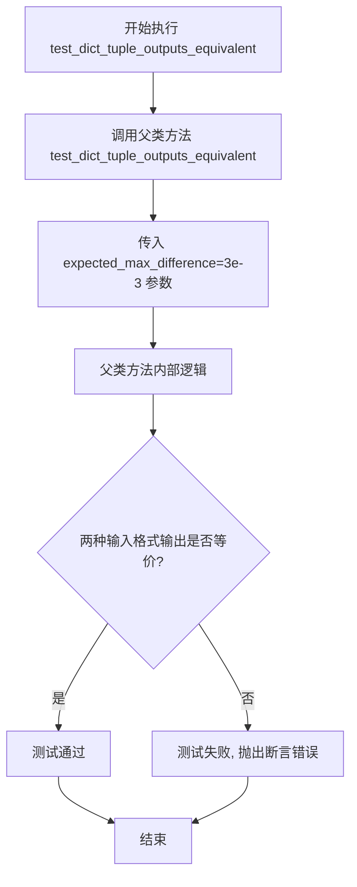

#### 带注释源码

```python
def test_dict_tuple_outputs_equivalent(self):
    """
    测试字典输入和元组输入的输出是否等价
    
    该测试方法继承自 PipelineTesterMixin，验证当使用不同的输入格式
    （字典格式 vs 元组/位置参数格式）调用 pipeline 时，生成的图像
    输出结果应该在指定阈值内一致。
    
    参数:
        expected_max_difference: float, 允许的最大差异阈值 (3e-3)
    
    返回:
        None: 通过 unittest 断言验证，不返回任何值
    """
    # 调用父类的测试方法，传入预期的最大差异阈值
    # 父类 PipelineTesterMixin.test_dict_tuple_outputs_equivalent 
    # 会分别使用字典参数和元组参数调用 pipeline，比较输出差异
    super().test_dict_tuple_outputs_equivalent(expected_max_difference=3e-3)
```


### `DDIMPipelineFastTests.test_save_load_local`

该方法是一个单元测试函数，用于测试 DDIMPipeline 的本地保存和加载功能。它调用父类的 `test_save_load_local` 方法，验证保存并重新加载管道后，管道输出的图像与原始输出的差异是否在可接受的阈值范围内（`expected_max_difference=3e-3`），以确保管道序列化和反序列化的正确性。

参数：

- `self`：`DDIMPipelineFastTests` 实例对象，测试类本身，无需额外参数

返回值：`None`，该方法为单元测试方法，通过断言验证正确性，不返回具体数据

#### 流程图

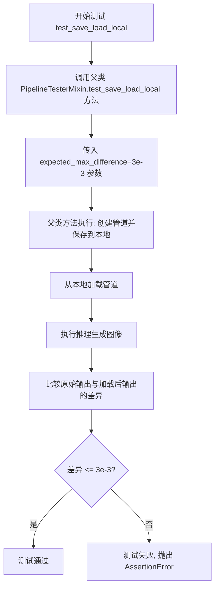

#### 带注释源码

```python
def test_save_load_local(self):
    """
    测试 DDIMPipeline 的保存和加载功能
    
    该测试方法继承自 PipelineTesterMixin 父类，用于验证:
    1. 管道能够正确序列化并保存到本地
    2. 管道能够正确从本地加载
    3. 加载后的管道输出与原始管道输出的差异在允许范围内
    
    参数:
        self: DDIMPipelineFastTests 实例对象
        
    返回值:
        None (通过 unittest 断言验证，不返回具体值)
        
    异常:
        AssertionError: 当保存/加载后的输出差异超过 expected_max_difference 时抛出
    """
    # 调用父类 PipelineTesterMixin 的 test_save_load_local 方法
    # expected_max_difference=3e-3 表示允许的最大差异值为 0.003
    super().test_save_load_local(expected_max_difference=3e-3)
```


### `DDIMPipelineFastTests.test_save_load_optional_components`

该方法用于测试 DDIMPipeline 的保存和加载功能，特别是针对可选组件的序列化和反序列化能力。它通过调用父类 `PipelineTesterMixin` 的同名方法来实现，验证管道在保存并重新加载后，其推理结果与原始结果的差异在允许范围内（默认 3e-3）。

参数：

- `self`：实例方法隐含的 `DDIMPipelineFastTests` 类实例本身，无显式类型描述
- `expected_max_difference`：`float`，可选参数，默认值为 `3e-3`（即 0.003），表示保存/加载前后推理结果允许的最大差异阈值

返回值：`None`，该方法为单元测试方法，通过 `self.assertLessEqual` 等断言验证行为，不返回任何值

#### 流程图

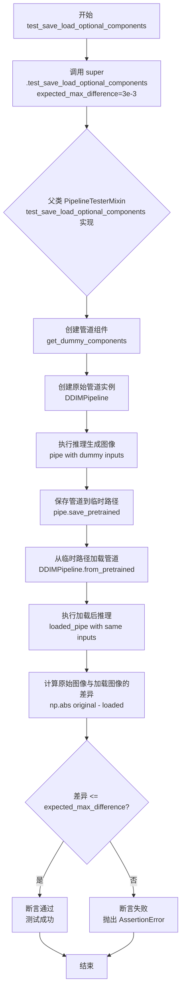

#### 带注释源码

```python
def test_save_load_optional_components(self):
    """
    测试管道的保存和加载功能，特别关注可选组件的处理。
    
    该测试方法继承自 PipelineTesterMixin 父类，验证以下场景：
    1. 创建带有可选组件的 DDIMPipeline 实例
    2. 执行推理并保存输出作为基准
    3. 将管道保存到磁盘（包含可选组件）
    4. 从磁盘重新加载管道
    5. 使用相同输入再次执行推理
    6. 比较两次推理结果的差异是否在允许范围内
    
    这种测试确保管道的序列化/反序列化过程不会改变模型行为，
    对于确保模型可移植性和版本兼容性非常重要。
    
    Args:
        expected_max_difference: float, 默认 3e-3
            允许的最大差异阈值。如果两次推理结果的差异超过此值，
            测试将失败并抛出 AssertionError。
    
    Returns:
        None。此方法通过 unittest 断言来验证行为，
        不返回任何值。
    
    Raises:
        AssertionError: 如果保存/加载前后的图像差异超过 expected_max_difference，
                       或者加载后的管道组件与原始组件不一致。
    """
    # 调用父类的测试实现，传入期望的最大差异阈值
    # 父类 PipelineTesterMixin.test_save_load_optional_components 会执行完整的
    # 保存/加载流程验证，包括：
    #   - 测试可选组件（如 vae, text_encoder 等）是否正确保存/加载
    #   - 验证可选组件为 None 时管道仍能正常工作
    #   - 比较保存/加载前后的推理结果一致性
    super().test_save_load_optional_components(expected_max_difference=3e-3)
```


### `DDIMPipelineFastTests.test_inference_batch_single_identical`

这是一个单元测试方法，用于验证 DDIMPipeline 在批量推理时与单个样本推理的结果是否一致（逐像素对比），确保批处理逻辑不会引入随机性或计算误差。

参数：

- `self`：`DDIMPipelineFastTests`，测试类实例本身，包含测试所需的配置和辅助方法

返回值：`None`，测试方法无返回值，通过 `unittest.TestCase` 的断言来验证正确性

#### 流程图

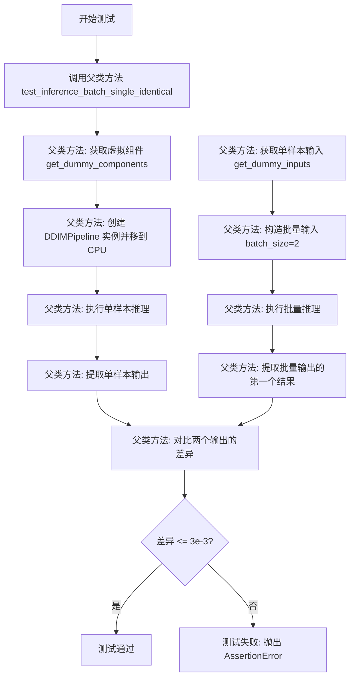

#### 带注释源码

```python
def test_inference_batch_single_identical(self):
    """
    测试批量推理与单个推理的输出是否一致。
    
    该测试方法继承自 PipelineTesterMixin，用于验证 DDIMPipeline
    在批量推理模式下与单样本推理模式下的输出结果是否逐像素相同，
    确保管道在处理批量数据时不会引入额外的随机性或计算误差。
    
    参数:
        self: DDIMPipelineFastTests 实例
        
    返回值:
        None: 测试通过则无返回值，失败则抛出 AssertionError
    """
    # 调用父类 PipelineTesterMixin 的测试方法
    # expected_max_diff=3e-3 表示允许的最大像素差异阈值为 0.003
    super().test_inference_batch_single_identical(expected_max_diff=3e-3)
```


### `DDIMPipelineIntegrationTests.test_inference_cifar10`

该方法是一个集成测试函数，用于测试 DDIMPipeline 在 CIFAR-10 数据集上的推理能力。它加载预训练的 DDPM-CIFAR10-32 模型，配置 DDIMScheduler，执行图像生成流程，并验证生成图像的形状和像素值是否符合预期。

参数：此方法无显式参数（仅包含隐式 `self` 参数）

返回值：无显式返回值（返回类型为 `None`，但通过断言验证图像生成结果）

#### 流程图

```mermaid
flowchart TD
    A[开始测试] --> B[定义模型ID: google/ddpm-cifar10-32]
    B --> C[从预训练模型加载 UNet2DModel]
    C --> D[创建 DDIMScheduler]
    D --> E[创建 DDIMPipeline 实例]
    E --> F[将Pipeline移动到 torch_device]
    F --> G[设置进度条配置]
    G --> H[创建随机数生成器并设置种子为0]
    H --> I[调用Pipeline执行推理<br/>参数: generator, eta=0.0, output_type=np]
    I --> J[提取图像切片 image[0, -3:, -3:, -1]]
    J --> K[断言验证图像形状为 (1, 32, 32, 3)]
    K --> L[定义期望的像素值数组]
    L --> M[断言验证生成图像与期望值的最大差异 < 1e-2]
    M --> N[测试结束]
```

#### 带注释源码

```python
def test_inference_cifar10(self):
    """
    集成测试：验证 DDIMPipeline 在 CIFAR-10 数据集上的推理功能
    
    测试流程：
    1. 加载预训练的 DDPM-CIFAR10-32 UNet2DModel
    2. 配置 DDIMScheduler 调度器
    3. 构建完整的 DDIMPipeline
    4. 执行图像生成推理
    5. 验证输出图像的尺寸和像素值
    """
    
    # 指定预训练模型标识符 (HuggingFace Hub上的CIFAR-10 32x32模型)
    model_id = "google/ddpm-cifar10-32"

    # 从预训练模型加载 UNet2DModel (Denoising Diffusion Probabilistic Model)
    # 该模型用于在扩散过程中预测噪声
    unet = UNet2DModel.from_pretrained(model_id)
    
    # 创建 DDIMScheduler (Denoising Diffusion Implicit Models)
    # DDIM 是一种确定性采样方法，比 DDPM 采样更快
    scheduler = DDIMScheduler()

    # 构建完整的 DDIMPipeline
    # 将 UNet 和 Scheduler 组装成可用的推理Pipeline
    ddim = DDIMPipeline(unet=unet, scheduler=scheduler)
    
    # 将Pipeline移动到指定的计算设备 (如 CUDA 或 CPU)
    ddim.to(torch_device)
    
    # 配置进度条显示 (disable=None 表示启用进度条)
    ddim.set_progress_bar_config(disable=None)

    # 创建随机数生成器并设置固定种子(0)
    # 固定种子确保推理过程的可重复性
    generator = torch.manual_seed(0)
    
    # 执行图像生成推理
    # 参数:
    #   - generator: 随机数生成器，控制采样噪声
    #   - eta: DDIM的随机性参数 (0.0表示完全确定性)
    #   - output_type: 输出格式 ("np"表示返回numpy数组)
    # 返回值包含images属性, 存储生成的图像数据
    image = ddim(generator=generator, eta=0.0, output_type="np").images

    # 提取生成的图像切片
    # 取最后3x3像素区域用于验证
    image_slice = image[0, -3:, -3:, -1]

    # 断言验证图像形状
    # CIFAR-10 图像标准尺寸: 32x32 像素, 3通道 (RGB)
    assert image.shape == (1, 32, 32, 3)
    
    # 定义期望的像素值数组 (标准化的浮点数, 范围约 0-1)
    expected_slice = np.array([0.1723, 0.1617, 0.1600, 0.1626, 0.1497, 0.1513, 0.1505, 0.1442, 0.1453])

    # 断言验证生成图像与期望值的差异
    # 最大允许差异为 1e-2 (0.01)
    assert np.abs(image_slice.flatten() - expected_slice).max() < 1e-2
```


### `DDIMPipelineIntegrationTests.test_inference_ema_bedroom`

该测试方法用于验证 DDIMPipeline 在使用 EMA（指数移动平均）-bedroom-256 预训练模型进行图像生成时的正确性，通过对比生成的图像切片与预期值来确认模型推理功能的准确性。

参数：无（该方法仅使用 `self` 访问测试类实例）

返回值：`None`，该方法为单元测试，通过断言验证图像生成结果，不返回任何值

#### 流程图

```mermaid
flowchart TD
    A[开始测试] --> B[定义模型ID: google/ddpm-ema-bedroom-256]
    B --> C[从预训练模型加载 UNet2DModel]
    C --> D[从预训练模型加载 DDIMScheduler]
    D --> E[创建 DDIMPipeline: ddpm]
    E --> F[将 Pipeline 移动到 torch_device]
    F --> G[设置进度条配置: disable=None]
    G --> H[创建随机数生成器: manual_seed=0]
    H --> I[调用 Pipeline 生成图像]
    I --> J[提取图像切片: image[0, -3:, -3:, -1]]
    J --> K{断言1: image.shape == (1, 256, 256, 3)}
    K -->|通过| L[定义预期切片值]
    L --> M{断言2: 差异 < 1e-2}
    M -->|通过| N[测试通过]
    M -->|失败| O[抛出 AssertionError]
    K -->|失败| O
```

#### 带注释源码

```python
def test_inference_ema_bedroom(self):
    """测试 DDIMPipeline 使用 EMA bedroom 模型进行推理"""
    
    # 1. 定义预训练模型标识符 (Google 托管的 ddpm-ema-bedroom-256 模型)
    model_id = "google/ddpm-ema-bedroom-256"

    # 2. 从预训练模型加载 UNet2DModel (用于去噪的 UNet 网络)
    unet = UNet2DModel.from_pretrained(model_id)
    
    # 3. 从预训练模型加载 DDIMScheduler (DDIM 调度器，用于去噪调度)
    scheduler = DDIMScheduler.from_pretrained(model_id)

    # 4. 创建 DDIMPipeline 实例，传入 UNet 和 Scheduler
    ddpm = DDIMPipeline(unet=unet, scheduler=scheduler)
    
    # 5. 将 Pipeline 移动到指定设备 (torch_device，通常是 GPU)
    ddpm.to(torch_device)
    
    # 6. 配置进度条 (disable=None 表示启用进度条)
    ddpm.set_progress_bar_config(disable=None)

    # 7. 创建确定性随机数生成器 (设置种子为 0，确保可复现性)
    generator = torch.manual_seed(0)
    
    # 8. 调用 Pipeline 进行图像生成
    #    - generator: 随机数生成器
    #    - output_type="np": 输出为 NumPy 数组
    #    - .images: 获取生成的图像结果
    image = ddpm(generator=generator, output_type="np").images

    # 9. 提取图像右下角 3x3 切片 (用于结果验证)
    image_slice = image[0, -3:, -3:, -1]

    # 10. 断言图像形状为 (1, 256, 256, 3)
    #     - 1: batch size
    #     - 256x256: 图像分辨率
    #     - 3: RGB 通道数
    assert image.shape == (1, 256, 256, 3)
    
    # 11. 定义预期图像切片值 (来自已知正确的输出)
    expected_slice = np.array([0.0060, 0.0201, 0.0344, 0.0024, 0.0018, 0.0002, 0.0022, 0.0000, 0.0069])

    # 12. 断言生成图像与预期值的最大差异小于 1e-2 (0.01)
    assert np.abs(image_slice.flatten() - expected_slice).max() < 1e-2
```

## 关键组件


### 张量索引

代码中使用张量切片操作 `image[0, -3:, -3:, -1]` 从生成的图像张量中提取最后 3x3 像素区域用于验证。这种索引方式允许精确访问多维数组的子区域，用于对比预期输出与实际输出的差异。

### 惰性加载

模型通过 `UNet2DModel.from_pretrained(model_id)` 和 `DDIMScheduler.from_pretrained(model_id)` 方式加载预训练权重，采用惰性加载策略，仅在首次调用时从远程仓库或本地加载模型参数到内存，减少启动时的内存占用。

### 反量化支持

代码中 `output_type="np"` 参数指定将 pipeline 输出从 PyTorch 张量转换为 NumPy 数组格式。`pipe(**inputs).images` 返回的图像数据自动完成从张量到 NumPy 的反量化转换，便于与传统机器学习流程集成。

### 量化策略

集成测试中使用了两种量化策略的模型变体：`google/ddpm-cifar10-32` 为标准 DDPM 模型，而 `google/ddpm-ema-bedroom-256` 为 EMA（指数移动平均）量化版本。EMA 策略通过维护模型权重的滑动平均值来提供更稳定的推理质量。

### 虚拟组件工厂

`get_dummy_components()` 方法作为测试工厂，创建虚拟的 UNet2DModel 和 DDIMScheduler 组件用于快速测试。该工厂方法封装了模型配置的完整参数集，包括 `block_out_channels`、`layers_per_block`、`norm_num_groups` 等关键配置。

### 输入生成器

`get_dummy_inputs()` 方法构建测试所需的输入字典，包含 batch_size、generator、num_inference_steps 等参数。针对 MPS 设备特殊处理随机种子生成逻辑，确保不同硬件平台的测试一致性。

### 集成测试验证

`DDIMPipelineIntegrationTests` 类封装了完整的端到端推理流程测试，从模型加载、pipeline 初始化到图像生成的完整链路验证。CIFAR10 和 bedroom 两个数据集分别代表小分辨率（32x32）和高分辨率（256x256）的典型扩散模型应用场景。


## 问题及建议


### 已知问题

- **硬编码问题**：模型ID（如"google/ddpm-cifar10-32"、"google/ddpm-ema-bedroom-256"）和期望输出切片值在测试中直接硬编码，缺乏配置管理机制，导致维护成本高
- **重复代码**：`get_dummy_components`方法创建的`UNet2DModel`参数在多个测试文件中可能重复定义，且`pipe.set_progress_bar_config(disable=None)`调用在多个测试方法中重复出现
- **缺少异常处理**：集成测试直接调用`from_pretrained`加载大型预训练模型，没有对网络下载失败、模型加载异常等情况的错误处理和测试
- **资源管理不当**：集成测试`DDIMPipelineIntegrationTests`直接在测试方法中创建pipeline并加载模型，没有使用`setUp/tearDown`进行资源清理，可能导致内存占用累积
- **测试隔离性不足**：使用`torch.manual_seed(0)`设置随机种子，但全局设置`enable_full_determinism()`可能影响其他并行测试的执行结果
- **参数覆盖不完整**：`required_optional_params`移除了一些参数，但未明确记录移除原因，且`test_inference`方法未覆盖这些被移除参数的测试场景

### 优化建议

- 将模型ID、期望输出值等配置抽取到独立的测试配置文件或环境变量中
- 使用`setUp`方法统一初始化pipeline和设置进度条，添加`tearDown`方法释放GPU显存
- 为集成测试添加`@unittest.skipIf`装饰器，在网络不可用或模型加载失败时跳过，而非直接失败
- 考虑使用pytest fixtures管理测试资源和依赖
- 将随机种子设置移至每个测试方法内部，或使用`@torch.no_grad()`装饰器确保计算图不会累积
- 添加对scheduler参数变化、output_type不同格式等边界条件的测试覆盖

## 其它


### 设计目标与约束

本代码的测试目标是验证DDIM（Denoising Diffusion Implicit Models）pipeline在diffusers库中的正确性。设计约束包括：1）必须继承PipelineTesterMixin以保持与通用测试框架的一致性；2）单元测试必须在CPU上快速执行，使用dummy components；3）集成测试使用真实预训练模型（google/ddpm-cifar10-32和google/ddpm-ema-bedroom-256），需要在GPU上运行且标记为slow；4）测试必须在确定性和可重复性条件下运行，通过enable_full_determinism()确保。

### 错误处理与异常设计

测试代码主要依赖unittest框架的assert方法进行验证。关键错误处理包括：1）图像形状验证使用self.assertEqual检查输出维度；2）数值精度验证使用self.assertLessEqual比较最大差异；3）设备兼容性处理针对MPS设备使用torch.manual_seed而非Generator；4）集成测试中使用assert语句验证模型输出形状和数值精度。

### 数据流与状态机

测试数据流如下：1）get_dummy_components()创建UNet2DModel和DDIMScheduler的dummy实例；2）get_dummy_inputs()生成包含batch_size、generator、num_inference_steps、output_type的输入字典；3）pipeline执行推理生成图像；4）验证输出图像的shape和数值slice。状态机涉及pipeline的加载、配置、推理三个状态转换过程。

### 外部依赖与接口契约

核心依赖包括：1）diffusers库的DDIMPipeline、DDIMScheduler、UNet2DModel；2）numpy用于数值比较；3）torch用于张量操作；4）testing_utils模块的enable_full_determinism、require_torch_accelerator、slow、torch_device；5）pipeline_params的UNCONDITIONAL_IMAGE_GENERATION_PARAMS和UNCONDITIONAL_IMAGE_GENERATION_BATCH_PARAMS；6）test_pipelines_common的PipelineTesterMixin。接口契约要求pipeline接受generator、eta、output_type等参数并返回包含images属性的对象。

### 性能基准与测试覆盖

性能基准：单元测试在CPU上约需数秒完成，使用2步推理和8x8小图像；集成测试在GPU上推理时间取决于模型大小（32x32或256x256）和硬件配置。测试覆盖：test_inference验证基础推理功能；test_dict_tuple_outputs_equivalent验证输出格式兼容性；test_save_load_local验证模型序列化；test_save_load_optional_components验证可选组件保存；test_inference_batch_single_identical验证批处理一致性；集成测试覆盖真实模型场景。

### 版本兼容性考虑

代码需要兼容：1）Python 3.x版本；2）PyTorch版本需支持torch.Generator和torch.manual_seed；3）diffusers库版本需包含DDIMPipeline和相关组件；4）numpy版本需支持数组操作和数值比较。当前使用from_pretrained加载预训练模型，需要网络连接或本地缓存。

### 安全性考虑

测试代码本身不涉及用户输入处理，安全性风险较低。但需要注意：1）from_pretrained可能从远程下载模型，需确保网络来源可信；2）测试输出图像数值验证使用硬编码的expected_slice，需确保与模型版本匹配；3）使用torch_device可能涉及GPU内存管理，大模型测试需注意显存溢出。

### 可维护性与扩展性

当前设计具有良好的可维护性：1）使用dummy components与真实模型分离，便于快速测试；2）继承PipelineTesterMixin保持测试模式一致性；3）参数通过params和batch_params配置，易于扩展。扩展方向：1）可添加更多集成测试覆盖不同模型；2）可添加性能基准测试记录推理时间；3）可添加跨平台测试覆盖更多设备。

### 配置管理与环境要求

环境要求：1）Python 3.8+；2）PyTorch 1.9+；3）diffusers库；4）numpy；5）transformers和accelerate（DDIMScheduler依赖）。配置通过命令行标记控制：@slow标记控制集成测试执行；@require_torch_accelerator要求GPU环境。测试使用固定随机种子（seed=0）确保可重复性。

### 部署与运维注意事项

测试代码通常用于开发阶段验证，不涉及生产部署。运维要点：1）集成测试标记为slow，CI/CD中需单独配置；2）需要GPU资源运行集成测试；3）模型缓存需要足够磁盘空间（cifar10约几十MB，bedroom约几百MB）；4）full determinism模式可能影响性能，生产环境通常不使用。


    