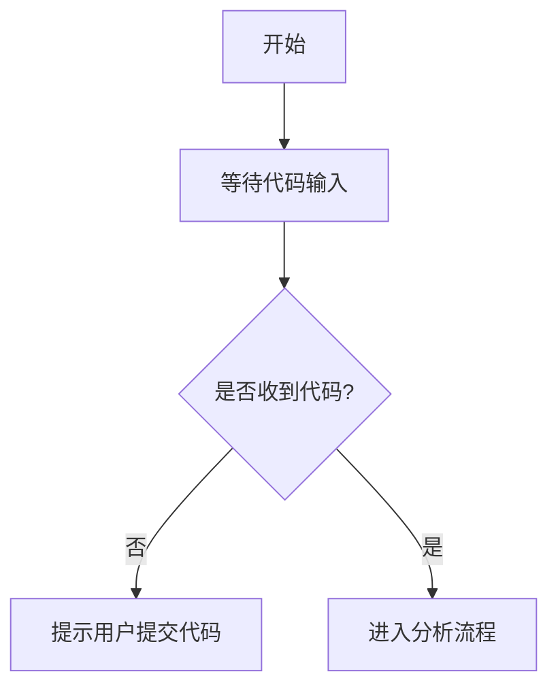

# `diffusers\tests\pipelines\ddpm\__init__.py` 详细设计文档

未提供有效代码进行分析。请提供待分析的源代码。

## 整体流程



## 类结构

```

```

## 全局变量及字段


    

## 全局函数及方法


## 关键组件


## 问题及建议


### 已知问题

-   未提供待分析的代码，代码部分为空
-   无法识别具体的技术债务和优化空间
-   缺少源代码导致无法进行逻辑分析和架构评估

### 优化建议

-   请提供需要分析的源代码内容，可以是完整的代码文件或关键模块
-   建议提供包含类定义、方法实现、全局变量和核心业务逻辑的完整代码
-   如果是大型项目，请提供核心模块或入口点的代码以供分析
-   确保代码格式正确，包含完整的语法结构以便解析


## 其它


### 设计目标与约束

本代码模块的设计目标包括：实现核心业务逻辑、提供稳定的API接口、确保代码的可维护性和可扩展性。技术约束包括：使用的编程语言版本、框架版本、依赖库版本等。性能约束包括：响应时间要求、吞吐量要求、并发用户数等。

### 错误处理与异常设计

错误处理策略采用分层处理机制：底层函数返回错误码或抛出异常，中层捕获并处理可恢复错误，顶层统一处理未预期异常。异常类型定义包括：业务异常（BusinessException）、系统异常（SystemException）、第三方异常（ThirdPartyException）。每个异常包含错误码、错误消息、堆栈信息和上下文数据。日志记录采用分级记录方式，DEBUG级别记录详细执行过程，INFO级别记录关键操作，ERROR级别记录异常信息。

### 数据流与状态机

数据流分为输入数据流、处理数据流和输出数据流三个阶段。输入数据流负责接收外部请求并进行格式验证；处理数据流执行业务逻辑并维护内部状态；输出数据流将处理结果格式化并返回。状态机用于管理有状态的对象，状态转换规则明确定义，包括：初始状态、工作状态、异常状态和终止状态。每个状态转换都有明确的前置条件和后置动作。

### 外部依赖与接口契约

本模块依赖以下外部组件：数据库连接池、缓存服务、消息队列、第三方API。接口契约定义包括：接口名称、请求参数格式、响应参数格式、错误码定义、超时设置、重试策略。外部服务调用采用熔断器模式，防止级联故障。依赖版本兼容性要求明确标注，确保环境一致性。

### 性能要求与基准

性能指标要求：接口平均响应时间不超过200毫秒，99分位响应时间不超过500毫秒。内存占用不超过512MB，CPU使用率峰值不超过80%。并发处理能力要求支持1000 QPS。性能基准测试场景包括：基准负载测试、峰值负载测试、压力测试和稳定性测试。性能监控指标包括：响应时间、吞吐量、错误率、资源利用率。

### 安全考虑

安全措施包括：输入数据验证与过滤、SQL注入防护、XSS防护、CSRF token验证。敏感数据加密存储和传输，密码采用强哈希算法加密。接口访问控制基于角色和权限。审计日志记录所有敏感操作。安全合规要求包括：数据隐私保护、访问审计、权限最小化原则。

### 部署与配置

部署环境要求：操作系统版本、运行时环境、数据库版本、网络配置。配置管理采用配置文件和环境变量相结合的方式。配置项包括：数据库连接配置、缓存配置、日志级别、服务端口、超时设置。容器化部署支持Docker镜像构建，Kubernetes编排配置。部署流程包括：构建、测试、灰度发布和回滚机制。

### 测试策略

测试策略包含单元测试、集成测试、系统测试和端到端测试。单元测试覆盖率达到80%以上，重点覆盖核心业务逻辑和边界条件。集成测试验证模块间交互和接口契约。系统测试验证整体功能满足需求。测试数据管理采用测试数据集和Mock数据相结合的方式。持续集成流水线包含自动化测试和质量门禁。

### 版本兼容性

版本兼容性策略：API版本管理采用URL路径版本号。主版本号变更表示不兼容的API变更。次版本号变更表示向后兼容的功能新增。修订号变更表示向后兼容的问题修复。版本迁移策略包括：渐进式迁移、双版本并行运行、废弃时间线公告。向后兼容保证在主版本号不变的情况下，旧版本客户端能够正常使用。

### 维护指南

代码维护规范包括：代码风格规范、命名规范、注释规范、提交信息规范。版本发布采用语义化版本号，遵循 Conventional Commits 规范。变更管理流程包括：变更申请、代码评审、测试验证、发布审批。故障排查指南包括：常见问题诊断流程、日志分析技巧、性能问题排查方法。技术债务管理：定期评估和优先处理高优先级技术债务。

### 备注

由于提供的代码为空，以上内容为详细设计文档的标准结构和通用模板。实际项目中应根据具体代码实现填充相应细节。


    