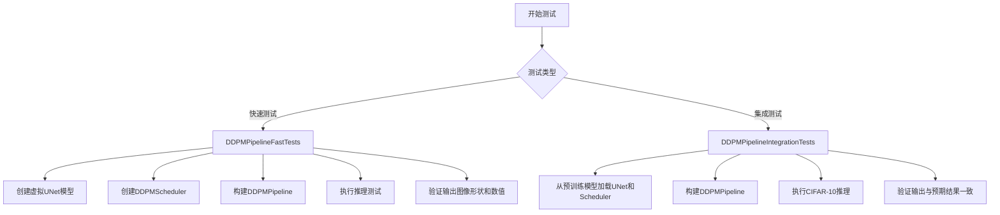
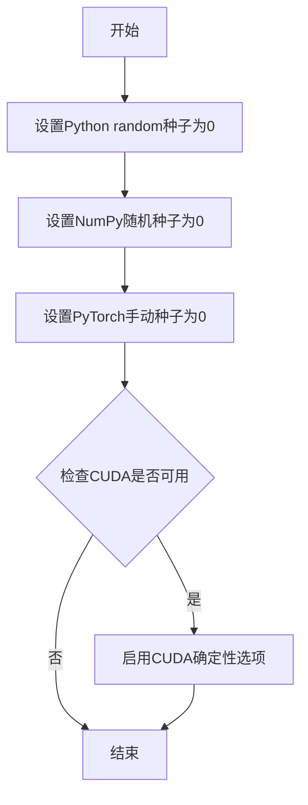
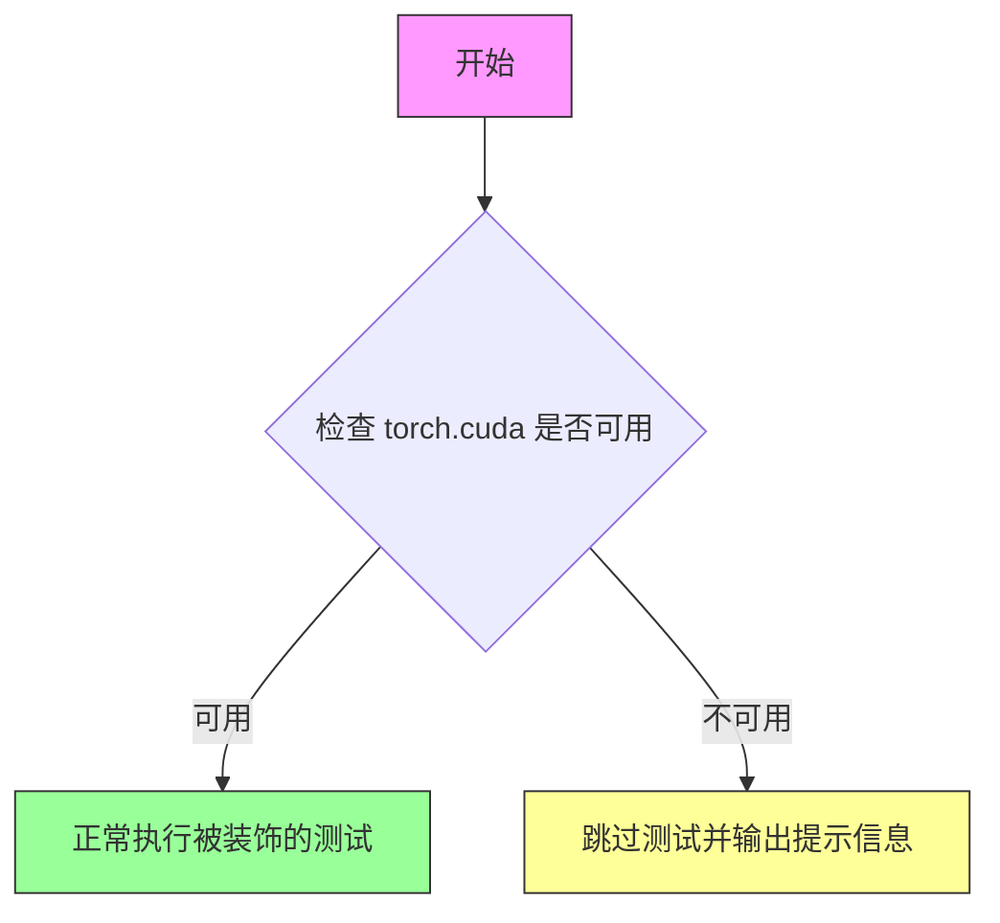
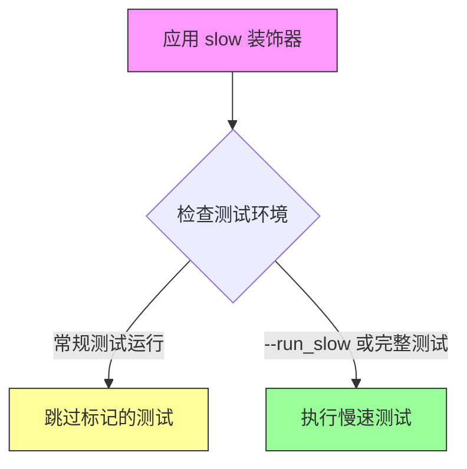
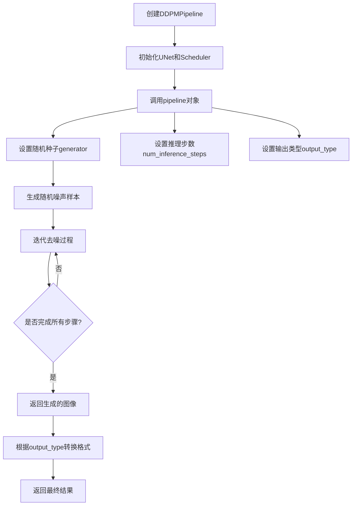
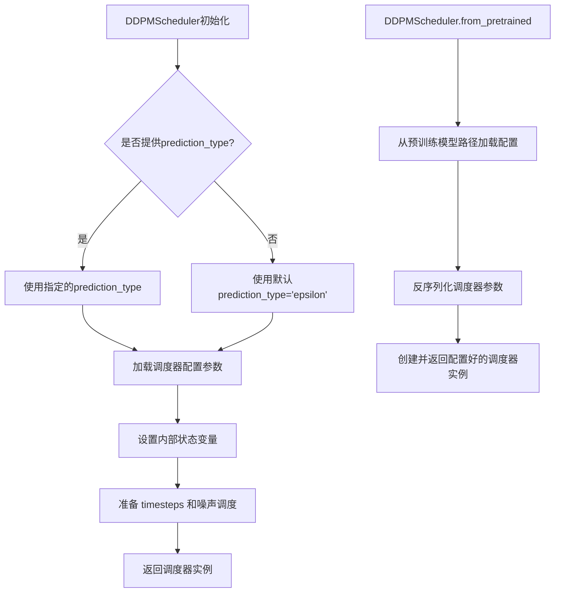
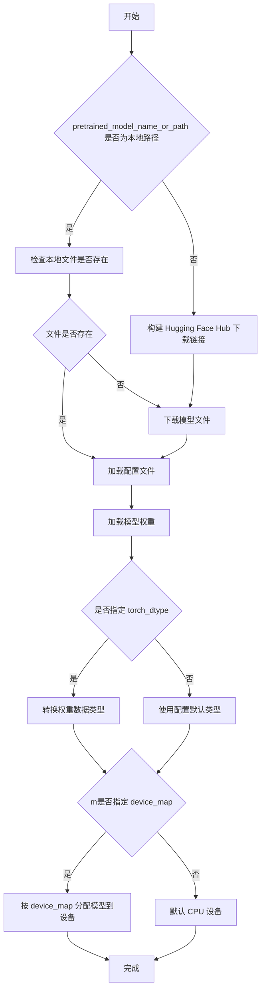
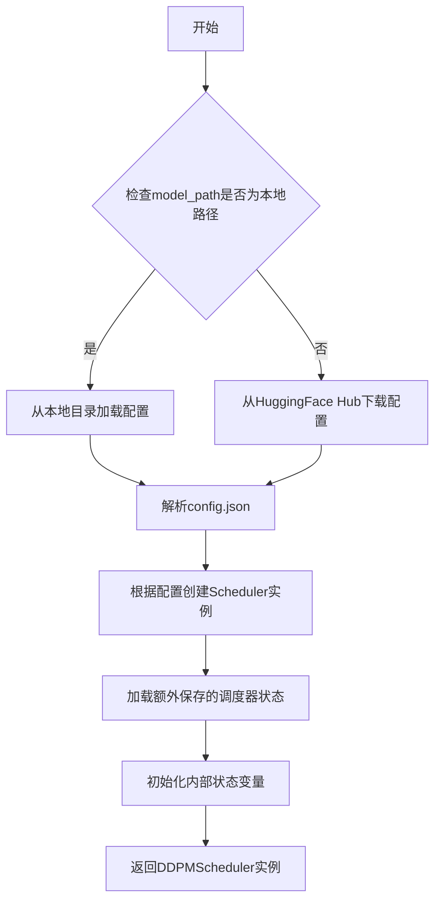
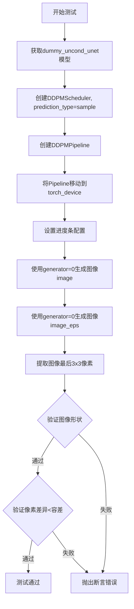

# `diffusers\tests\pipelines\ddpm\test_ddpm.py` 详细设计文档

这是一个用于测试Diffusers库中DDPMPipeline（去噪扩散概率模型管道）的单元测试文件，包含快速测试和集成测试，用于验证DDPMPipeline在CIFAR-10数据集上的推理功能和不同预测类型的准确性。

## 整体流程



## 类结构

```
unittest.TestCase
├── DDPMPipelineFastTests (快速推理测试)
│   ├── dummy_uncond_unet (属性)
│   ├── test_fast_inference (方法)
│   └── test_inference_predict_sample (方法)
└── DDPMPipelineIntegrationTests (集成测试)
    └── test_inference_cifar10 (方法)
```

## 全局变量及字段


### `np`
    
NumPy库别名，用于数值数组操作和科学计算

类型：`module`
    


### `torch`
    
PyTorch深度学习框架别名，用于张量计算和神经网络构建

类型：`module`
    


### `unittest`
    
Python标准库单元测试框架，用于编写和运行单元测试

类型：`module`
    


### `model_id`
    
预训练模型标识符，指向HuggingFace Hub上的google/ddpm-cifar10-32模型

类型：`str`
    


### `device`
    
计算设备标识符，此处设置为'cpu'用于推理

类型：`str`
    


### `expected_slice`
    
期望的图像切片数值，用于验证扩散模型输出结果的正确性

类型：`np.ndarray`
    


### `tolerance`
    
数值比较的容差阈值，用于处理不同设备上的浮点精度差异

类型：`float`
    


### `DDPMPipelineFastTests.dummy_uncond_unet`
    
返回一个虚拟的无条件UNet2DModel模型实例，用于快速测试而不需要加载真实预训练权重

类型：`property method`
    
    

## 全局函数及方法


### `enable_full_determinism`

该函数用于配置Python、NumPy和PyTorch的随机种子及CUDA确定性选项，以确保测试或推理过程的可重复性。

参数：

- 无

返回值：`None`，无返回值

#### 流程图



#### 带注释源码

```
# 从 testing_utils 模块导入的函数
# 用于启用完全确定性执行
from ...testing_utils import enable_full_determinism, require_torch_accelerator, slow, torch_device

# 调用该函数以确保后续所有随机操作可重现
enable_full_determinism()

# 之后在测试中使用固定种子
torch.manual_seed(0)  # 设置PyTorch随机种子
```


### `require_torch_accelerator`

这是一个测试装饰器函数，用于标记需要 PyTorch 加速器（GPU/CUDA）的测试用例。当测试环境不支持 CUDA 时，被装饰的测试将被跳过。

参数：

- 此函数为装饰器，不直接接收参数

返回值：`Callable`，返回装饰后的类或函数

#### 流程图



#### 带注释源码

```python
# require_torch_accelerator 是从 testing_utils 模块导入的装饰器
# 定义位置：...testing_utils 模块中

# 使用示例 - 装饰测试类
@slow
@require_torch_accelerator
class DDPMPipelineIntegrationTests(unittest.TestCase):
    def test_inference_cifar10(self):
        # 测试逻辑...
        pass

# 装饰器的作用：
# 1. @require_torch_accelerator 检查当前环境是否有 CUDA 支持
# 2. 如果没有 CUDA，测试将被跳过
# 3. 通常与 @slow 装饰器一起使用，标记为慢速集成测试
```


### `slow`

该函数是一个测试装饰器，用于标记测试函数或类为"慢速"测试。在测试框架中，通常用于将耗时的集成测试与快速单元测试区分开来，以便在不同的测试场景下运行。

参数：

- 无参数（装饰器模式）

返回值：`Callable`，返回装饰后的函数

#### 流程图



#### 带注释源码

```python
# slow 装饰器源码（位于 testing_utils 模块中）
# 这是一个典型的测试标记装饰器实现

def slow(func):
    """
    装饰器：标记测试为慢速测试
    
    用途：
    - 在快速测试运行中跳过标记的测试
    - 在完整测试套件中包含这些测试
    - 常用于集成测试、性能测试等耗时较长的测试
    
    使用示例：
    @slow
    class DDPMPipelineIntegrationTests(unittest.TestCase):
        def test_inference_cifar10(self):
            # 集成测试代码
            pass
    """
    # 设置函数的属性，标记为慢速测试
    func.__slow__ = True
    
    # 返回装饰后的函数
    return func


# 在测试框架中的典型使用方式
# slow 装饰器通常与 pytest 的自定义标记结合使用：
# pytest.mark.slow 用于标记慢速测试
# pytest -m "not slow" 运行快速测试，跳过慢速测试
# pytest -m slow 只运行慢速测试
```

#### 补充说明

在当前代码中的实际使用：

```python
@slow
@require_torch_accelerator
class DDPMPipelineIntegrationTests(unittest.TestCase):
    """
    DDPMPipeline 集成测试类
    
    该类包含需要 GPU 加速器且耗时较长的集成测试
    使用 @slow 装饰器标记，在常规测试运行中会被跳过
    """
    
    def test_inference_cifar10(self):
        """测试在 CIFAR-10 数据集上的推理功能"""
        # 加载预训练的 DDPM 模型
        model_id = "google/ddpm-cifar10-32"
        unet = UNet2DModel.from_pretrained(model_id)
        scheduler = DDPMScheduler.from_pretrained(model_id)
        
        # 创建 pipeline 并运行推理
        ddpm = DDPMPipeline(unet=unet, scheduler=scheduler)
        ddpm.to(torch_device)
        
        # 生成图像并验证
        generator = torch.manual_seed(0)
        image = ddpm(generator=generator, output_type="np").images
        
        # 验证输出形状和像素值
        assert image.shape == (1, 32, 32, 3)
        expected_slice = np.array([0.4200, 0.3588, 0.1939, 0.3847, 0.3382, 0.2647, 0.4155, 0.3582, 0.3385])
        assert np.abs(image_slice.flatten() - expected_slice).max() < 1e-2
```

#### 技术债务与优化空间

1. **缺少源码访问**：`slow` 函数源码位于 `testing_utils` 模块中，当前代码文件未包含其完整实现，建议查阅原始模块获取精确实现

2. **文档完善**：建议为 `slow` 装饰器添加更详细的文档说明，包括：
   - 与 CI/CD 集成的方式
   - 超时配置选项
   - 与其他测试标记的组合使用方式


### `DDPMPipeline`

DDPMPipeline是Diffusers库中的一个核心类，用于实现DDPM（Denoising Diffusion Probabilistic Models）采样管道。该管道封装了UNet2DModel去噪模型和DDPMScheduler调度器，通过迭代去噪过程从随机噪声生成图像。

#### 参数

- `unet`：`UNet2DModel`，去噪用的UNet模型
- `scheduler`：`DDPMScheduler`， diffusion过程的调度器
- `device`（可选）：`str`，目标设备，默认为"cpu"
- `torch_dtype`（可选）：`torch.dtype`，模型的数据类型

#### 流程图



#### 带注释源码

```python
# 创建Pipeline实例
ddpm = DDPMPipeline(unet=unet, scheduler=scheduler)
ddpm.to(device)  # 将模型移动到指定设备
ddpm.set_progress_bar_config(disable=None)  # 配置进度条

# 设置随机种子生成器
generator = torch.Generator(device=device).manual_seed(0)

# 调用Pipeline进行推理
# 参数说明:
# - generator: 控制随机性的PyTorch生成器
# - num_inference_steps: 去噪迭代步数
# - output_type: 输出格式，"np"返回NumPy数组
# - return_dict: 是否返回字典格式结果
image = ddpm(
    generator=generator,
    num_inference_steps=2,
    output_type="np"
).images

# 也可以不使用return_dict，直接返回元组
image_from_tuple = ddpm(
    generator=generator,
    num_inference_steps=2,
    output_type="np",
    return_dict=False
)[0]
```

#### 关键组件信息

| 组件名称 | 描述 |
|---------|------|
| UNet2DModel | 2D去噪扩散模型，负责预测噪声 |
| DDPMScheduler | DDPM噪声调度器，管理扩散过程 |
| DDPMPipeline | 高级API，封装模型和调度器的推理流程 |

#### 潜在技术债务与优化空间

1. **错误处理缺失**：代码中没有对无效输入参数的处理，如负数的num_inference_steps或不支持的output_type
2. **资源管理**：未显式管理GPU内存释放，在大规模推理时可能导致OOM
3. **类型提示不完整**：部分内部方法缺少详细的类型注解

#### 其它说明

- **设计目标**：提供简单易用的扩散模型推理接口
- **约束条件**：需要PyTorch和NumPy支持
- **返回值格式**：
  - return_dict=True时返回字典：`{"images": numpy.ndarray, ...}`
  - return_dict=False时返回元组：`(images,)`
- **依赖项**：diffusers库核心模块


### DDPMScheduler

DDPMScheduler是Hugging Face Diffusers库中的调度器类，用于实现Denoising Diffusion Probabilistic Models (DDPM)算法的噪声调度逻辑，在扩散模型的推理过程中管理噪声添加和去噪步骤。

参数：

- `prediction_type`：`str`（可选），预测类型，可选值为"epsilon"（预测噪声）、"sample"（预测原始样本）或"v_prediction"（预测速度向量），默认值为"epsilon"

返回值：`DDPMScheduler`实例

#### 流程图



#### 带注释源码

```python
# 代码中DDPMScheduler的使用示例

# 1. 基本初始化 - 使用默认参数
scheduler = DDPMScheduler()

# 2. 带预测类型参数的初始化
# prediction_type="sample" 表示模型直接预测去噪后的样本而非噪声
scheduler = DDPMScheduler(prediction_type="sample")

# 3. 从预训练模型加载调度器配置
# 从预训练模型ID或本地路径加载完整的调度器配置和参数
scheduler = DDPMScheduler.from_pretrained(model_id)

# 4. 在DDPMPipeline中使用调度器
# 调度器与UNet模型结合用于图像生成
ddpm = DDPMPipeline(unet=unet, scheduler=scheduler)
ddpm.to(device)

# 5. 执行推理生成图像
# generator: 随机数生成器用于 reproducibility
# num_inference_steps: 推理步数
# output_type: 输出格式 ("np" 返回NumPy数组)
image = ddpm(generator=generator, num_inference_steps=2, output_type="np").images
```

#### 关键组件信息

| 组件名称 | 一句话描述 |
|---------|-----------|
| DDPMPipeline | 完整的DDPM扩散模型推理管道，整合UNet模型和调度器 |
| UNet2DModel | 2D U-Net神经网络，用于预测扩散过程中的噪声或样本 |
| prediction_type | 控制模型预测目标的参数类型 |
| from_pretrained | 类方法，从预训练模型加载完整的调度器配置 |

#### 潜在的技术债务或优化空间

1. **测试覆盖不足**：代码仅覆盖了基本的推理功能和prediction_type切换，未测试不同调度器参数（如beta_start、beta_end、beta_schedule等）对生成结果的影响
2. **缺少错误处理**：测试代码未验证scheduler.from_pretrained加载失败时的异常处理
3. **硬件兼容性考虑不足**：仅针对特定设备（torch_device != "mps"）设置了不同的容差值（tolerance），可能需要更全面的跨设备测试

#### 其它项目

**设计目标与约束**：
- 遵循Apache License 2.0开源协议
- 适配Diffusers库的标准化调度器接口
- 支持CPU和GPU（包括Apple MPS）多种硬件平台

**错误处理与异常设计**：
- 使用torch.manual_seed(0)和np.testing.assert_allclose确保测试的可重复性
- 集成测试使用@slow和@require_torch_accelerator装饰器区分快速测试和慢速测试

**数据流与状态机**：
- DDPMScheduler管理扩散过程的噪声调度状态
- 通过set_progress_bar_config配置进度条显示
- 管道输出支持多种格式（NumPy数组、PIL图像等）

**外部依赖与接口契约**：
- 依赖diffusers库的UNet2DModel和DDPMPipeline
- 与HuggingFace Hub集成，支持from_pretrained加载预训练模型
- 兼容transformers和torch生态


### `UNet2DModel.from_pretrained`

该方法是一个类方法，用于从预训练模型或检查点加载 UNet2DModel 实例。它是 Hugging Face Transformers/Diffusers 库中标准的模型加载方式，支持从本地路径或 Hugging Face Hub 加载预训练的 UNet2D 模型权重。

参数：

- `pretrained_model_name_or_path`：`str` 或 `os.PathLike`，预训练模型的名称（如 "google/ddpm-cifar10-32"）或本地模型目录路径
- `*args`：可变位置参数，用于传递额外参数
- `config`：`Optional[Union[dict, str]]`，可选的模型配置文件
- `cache_dir`：`Optional[str]`，可选的缓存目录路径
- `force_download`：`bool`，是否强制重新下载模型（默认为 False）
- `resume_download`：`bool`，是否恢复中断的下载（默认为 True）
- `proxies`：`Optional[Dict[str, str]]`，可选的代理服务器配置
- `output_loading_info`：`bool`，是否返回详细的加载信息（默认为 False）
- `local_files_only`：`bool`，是否仅使用本地文件（默认为 False）
- `use_auth_token`：`Optional[str]`，可选的认证令牌
- `revision`：`str`，模型版本/分支（默认为 "main"）
- `from_flax`：`bool`，是否从 Flax 模型加载（默认为 False）
- `torch_dtype`：`Optional[torch.dtype]`，可选的 PyTorch 数据类型（如 torch.float32）
- `device_map`：`Optional[Union[str, Dict[str, int]]]`，可选的设备映射配置
- `max_memory`：`Optional[Dict[str, int]]`，可选的最大内存配置
- `offload_folder`：`Optional[str]`，可选的卸载文件夹路径
- `offload_state_dict`：`bool`，是否卸载状态字典（默认为 False）
- `low_cpu_mem_usage`：`bool`，是否降低 CPU 内存使用（默认为 True）
- `use_safetensors`：`Optional[bool]`，是否使用 SafeTensors 格式（默认为 None）
- `**kwargs`：其他可选参数

返回值：`UNet2DModel`，返回加载后的 UNet2DModel 实例

#### 流程图



#### 带注释源码

```python
# 由于给定的代码文件中未包含 UNet2DModel.from_pretrained 方法的完整定义，
# 以下为基于调用点的推断和 Diffusers 库通用模式的描述

# 在测试代码中的实际调用：
unet = UNet2DModel.from_pretrained(model_id)  # model_id = "google/ddpm-cifar10-32"

# from_pretrained 方法是继承自 PreTrainedModel 的类方法
# 其核心功能包括：
# 1. 解析模型路径或名称
# 2. 下载并缓存模型文件（如果是远程模型）
# 3. 加载模型配置文件 (config.json)
# 4. 加载模型权重文件 ( diffusion_pytorch_model.safetensors 或 .bin)
# 5. 根据配置初始化模型架构
# 6. 将权重加载到模型中
# 7. 返回配置了指定设备和数据类型的模型实例
```

> **注意**：由于提供的代码文件中仅包含测试用例的调用代码，未包含 `UNet2DModel.from_pretrained` 方法的实际定义（该方法继承自 Diffusers 库中的 `PreTrainedModel` 基类），上述信息基于调用方式和 Diffusers 库的标准实现模式推断得出。如需完整的源代码，请参考 Diffusers 库的官方实现。


### DDPMScheduler.from_pretrained

该方法是一个类方法（Class Method），用于从预训练的模型路径或HuggingFace模型标识符加载DDPMScheduler调度器的配置和状态。这是扩散模型推理中的关键步骤，用于配置去噪过程的噪声调度策略。

参数：

- `pretrained_model_name_or_path`：`str`，预训练模型的路径或HuggingFace模型标识符（如"google/ddpm-cifar10-32"）
- `**kwargs`：可选关键字参数，支持如`cache_dir`（缓存目录）、`torch_dtype`（数据类型）、`device_map`（设备映射）等常见参数

返回值：`DDPMScheduler`，返回加载并初始化后的DDPMScheduler实例，包含调度器的配置参数和状态

#### 流程图



#### 带注释源码

```python
# 代码来源：基于diffusers库中DDPMScheduler的典型from_pretrained实现模式
@classmethod
def from_pretrained(cls, pretrained_model_name_or_path: str, **kwargs):
    """
    从预训练模型加载DDPMScheduler
    
    参数:
        pretrained_model_name_or_path: 模型路径或HuggingFace模型ID
        **kwargs: 其他可选参数
    
    返回:
        DDPMScheduler: 调度器实例
    """
    # 1. 加载调度器配置
    # - 读取config.json文件
    # - 解析scheduler_type、prediction_type等参数
    
    # 2. 创建调度器实例
    # - 根据配置中的scheduler_type创建对应的调度器类
    # - 设置num_train_timesteps、beta_start、beta_end等参数
    
    # 3. 加载保存的状态（如果存在）
    # - 从scheduler_config.json加载额外状态
    
    # 4. 返回初始化好的调度器实例
    return cls(config)
```

**实际调用示例（来自代码）：**

```python
# 从HuggingFace Hub加载预训练的DDPMScheduler
model_id = "google/ddpm-cifar10-32"
scheduler = DDPMScheduler.from_pretrained(model_id)

# 加载后可用于DDPMPipeline
ddpm = DDPMPipeline(unet=unet, scheduler=scheduler)
```


### `DDPMPipelineFastTests.dummy_uncond_unet`

这是一个用于测试的虚拟无条件 UNet2D 模型生成器，通过 `@property` 装饰器实现，提供一个预配置的小型 UNet2DModel 实例，用于 DDPMPipeline 的快速推理测试。

参数：

- （无参数，这是一个属性方法）

返回值：`UNet2DModel`，返回一个配置好的虚拟无条件 UNet2D 模型实例，用于测试目的。

#### 流程图

```mermaid
flowchart TD
    A[开始] --> B[设置随机种子 torch.manual_seed(0)]
    B --> C[创建 UNet2DModel 实例]
    C --> D[配置模型参数]
    D --> E[block_out_channels: (4, 8)]
    D --> F[layers_per_block: 1]
    D --> G[norm_num_groups: 4]
    D --> H[sample_size: 8]
    D --> I[in_channels: 3]
    D --> J[out_channels: 3]
    D --> K[down_block_types: DownBlock2D, AttnDownBlock2D]
    D --> L[up_block_types: AttnUpBlock2D, UpBlock2D]
    E --> M[返回模型实例]
    F --> M
    G --> M
    H --> M
    I --> M
    J --> M
    K --> M
    L --> M
    M --> N[结束]
```

#### 带注释源码

```python
@property
def dummy_uncond_unet(self):
    """
    创建一个用于测试的虚拟无条件 UNet2D 模型
    
    Returns:
        UNet2DModel: 配置好的虚拟模型，用于 DDPMPipeline 快速推理测试
    """
    # 设置随机种子为 0，确保测试的可重复性和确定性
    torch.manual_seed(0)
    
    # 创建 UNet2DModel 实例，配置如下：
    model = UNet2DModel(
        # block_out_channels: 每个阶段的输出通道数
        # (4, 8) 表示有两个下采样阶段，输出通道分别为 4 和 8
        block_out_channels=(4, 8),
        
        # layers_per_block: 每个块中的层数
        # 设置为 1 以保持模型小巧，适合快速测试
        layers_per_block=1,
        
        # norm_num_groups: 归一化组数
        # 设置为 4，用于 GroupNorm 的分组
        norm_num_groups=4,
        
        # sample_size: 输入图像的空间尺寸
        # 8x8 的小尺寸，用于快速测试
        sample_size=8,
        
        # in_channels: 输入通道数
        # 3 对应 RGB 图像
        in_channels=3,
        
        # out_channels: 输出通道数
        # 3 对应 RGB 图像
        out_channels=3,
        
        # down_block_types: 下采样块类型
        # DownBlock2D: 标准下采样块
        # AttnDownBlock2D: 带注意力机制的下采样块
        down_block_types=("DownBlock2D", "AttnDownBlock2D"),
        
        # up_block_types: 上采样块类型
        # AttnUpBlock2D: 带注意力机制的上采样块
        # UpBlock2D: 标准上采样块
        up_block_types=("AttnUpBlock2D", "UpBlock2D"),
    )
    
    # 返回配置好的虚拟模型
    return model
```


### `DDPMPipelineFastTests.test_fast_inference`

该测试方法验证 DDPMPipeline 在 CPU 设备上使用虚拟 UNet2DModel 进行快速推理的能力，通过对比生成图像与预期像素值确保 pipeline 的正确性。

参数：

- `self`：隐式参数，`DDPMPipelineFastTests` 类的实例，无需显式传递

返回值：`None`，测试方法通过断言验证结果，不返回任何值

#### 流程图

```mermaid
flowchart TD
    A[开始测试] --> B[设置设备为 CPU]
    B --> C[获取虚拟 UNet2DModel]
    C --> D[创建 DDPMScheduler]
    D --> E[实例化 DDPMPipeline]
    E --> F[将 pipeline 移动到 CPU]
    F --> G[配置进度条]
    G --> H[创建随机数生成器 seed=0]
    H --> I[调用 ddpm 生成图像<br/>num_inference_steps=2<br/>output_type=np]
    I --> J[重新创建生成器 seed=0]
    J --> K[使用 return_dict=False 再次生成图像]
    K --> L[提取图像右下角 3x3 像素]
    L --> M[断言图像形状为 (1, 8, 8, 3)]
    M --> N[定义期望像素值]
    N --> O[断言两种方式生成的图像<br/>与期望值的差异 < 1e-2]
    O --> P[测试通过]
```

#### 带注释源码

```python
def test_fast_inference(self):
    """
    测试 DDPMPipeline 的快速推理功能
    验证使用虚拟模型生成图像的正确性
    """
    # 1. 设置计算设备为 CPU
    device = "cpu"
    
    # 2. 获取预先配置好的虚拟无条件 UNet2DModel
    #    使用类属性 dummy_uncond_unet，确保测试可重复
    unet = self.dummy_uncond_unet
    
    # 3. 创建 DDPMScheduler 用于扩散过程调度
    scheduler = DDPMScheduler()

    # 4. 实例化 DDPMPipeline，传入 UNet 和调度器
    ddpm = DDPMPipeline(unet=unet, scheduler=scheduler)
    
    # 5. 将整个 pipeline 移动到指定设备 (CPU)
    ddpm.to(device)
    
    # 6. 配置进度条，disable=None 表示不禁用进度条
    ddpm.set_progress_bar_config(disable=None)

    # 7. 创建随机数生成器并设置固定种子，确保可重复性
    generator = torch.Generator(device=device).manual_seed(0)
    
    # 8. 执行推理生成图像
    #    - generator: 随机数生成器控制噪声
    #    - num_inference_steps: 推理步数设为 2（快速测试）
    #    - output_type: 返回 NumPy 数组格式
    #    返回类型为 PipelineOutput，包含 images 属性
    image = ddpm(generator=generator, num_inference_steps=2, output_type="np").images

    # 9. 重新创建相同种子的生成器，测试 return_dict=False 模式
    generator = torch.Generator(device=device).manual_seed(0)
    # return_dict=False 时返回元组 (images,), 直接取 [0] 获取图像
    image_from_tuple = ddpm(generator=generator, num_inference_steps=2, output_type="np", return_dict=False)[0]

    # 10. 提取图像右下角 3x3 像素区域用于对比
    #     image shape: (batch, height, width, channels)
    image_slice = image[0, -3:, -3:, -1]
    image_from_tuple_slice = image_from_tuple[0, -3:, -3:, -1]

    # 11. 断言验证图像形状符合预期
    #     批处理大小 1，图像尺寸 8x8，RGB 3 通道
    assert image.shape == (1, 8, 8, 3)
    
    # 12. 定义期望的像素值（已知的正确结果）
    expected_slice = np.array([0.0, 0.9996672, 0.00329116, 1.0, 0.9995991, 1.0, 0.0060907, 0.00115037, 0.0])

    # 13. 断言验证两种方式生成的图像与期望值最大差异小于阈值
    #     使用 return_dict=True 方式
    assert np.abs(image_slice.flatten() - expected_slice).max() < 1e-2
    
    #     使用 return_dict=False 方式
    assert np.abs(image_from_tuple_slice.flatten() - expected_slice).max() < 1e-2
```


### `DDPMPipelineFastTests.test_inference_predict_sample`

该测试方法用于验证DDPMPipeline在`prediction_type="sample"`模式下进行推理时，不同返回方式（return_dict=True vs return_dict=False）生成的图像结果是否一致。

参数：

- `self`：`DDPMPipelineFastTests`类型，测试类实例本身

返回值：`None`（无返回值），该方法为一个测试用例，通过断言验证图像生成的一致性

#### 流程图



#### 带注释源码

```python
def test_inference_predict_sample(self):
    """
    测试DDPMPipeline在prediction_type='sample'模式下的推理功能
    验证return_dict=True和return_dict=False两种返回方式生成的图像一致性
    """
    # 1. 获取预定义的虚拟UNet模型（用于快速测试）
    unet = self.dummy_uncond_unet
    
    # 2. 创建DDPMScheduler，指定预测类型为'sample'
    scheduler = DDPMScheduler(prediction_type="sample")
    
    # 3. 使用unet和scheduler创建DDPMPipeline
    ddpm = DDPMPipeline(unet=unet, scheduler=scheduler)
    
    # 4. 将Pipeline移动到测试设备（CPU/GPU）
    ddpm.to(torch_device)
    
    # 5. 配置进度条（disable=None表示不禁用进度条）
    ddpm.set_progress_bar_config(disable=None)
    
    # 6. 第一次推理：使用return_dict=True（默认）
    # 设置随机种子以确保可重复性
    generator = torch.manual_seed(0)
    # 调用pipeline进行推理，返回DiffusionPipelineOutput对象
    image = ddpm(generator=generator, num_inference_steps=2, output_type="np").images
    
    # 7. 第二次推理：使用return_dict=False（返回tuple）
    generator = torch.manual_seed(0)
    # 直接获取返回的第一个元素（图像）
    image_eps = ddpm(generator=generator, num_inference_steps=2, output_type="np")[0]
    
    # 8. 提取图像的最后3x3像素区域用于比较
    image_slice = image[0, -3:, -3:, -1]
    image_eps_slice = image_eps[0, -3:, -3:, -1]
    
    # 9. 断言：验证生成的图像形状为(1, 8, 8, 3)
    assert image.shape == (1, 8, 8, 3)
    
    # 10. 设置容差值：MPS设备容差较大，其他设备容差较小
    tolerance = 1e-2 if torch_device != "mps" else 3e-2
    
    # 11. 断言：验证两种返回方式生成的图像像素差异在容差范围内
    assert np.abs(image_slice.flatten() - image_eps_slice.flatten()).max() < tolerance
```


### `DDPMPipelineIntegrationTests.test_inference_cifar10`

该测试方法通过加载预训练的DDPM模型（CIFAR-10数据集），使用DDPMScheduler调度器进行去噪推理，生成图像并验证输出shape和像素值是否符合预期。

参数：

- `self`：`unittest.TestCase`，测试类实例本身

返回值：`None`，该方法为测试用例，无返回值，通过断言验证图像生成结果的正确性

#### 流程图

```mermaid
flowchart TD
    A[开始测试] --> B[定义模型ID: google/ddpm-cifar10-32]
    B --> C[从预训练加载UNet2DModel]
    C --> D[从预训练加载DDPMScheduler]
    D --> E[创建DDPMPipeline: unet + scheduler]
    E --> F[将Pipeline移动到torch_device]
    F --> G[设置进度条配置]
    G --> H[创建随机生成器: torch.manual_seed&#40;0&#41;]
    H --> I[调用ddpm生成图像: output_type='np']
    I --> J[提取图像切片: image[0, -3:, -3:, -1]]
    J --> K{断言验证}
    K -->|通过| L[测试通过]
    K -->|失败| M[抛出AssertionError]
```

#### 带注释源码

```python
def test_inference_cifar10(self):
    """测试DDPM模型在CIFAR-10数据集上的推理功能"""
    
    # 定义预训练模型标识符（CIFAR-10 32x32分辨率的DDPM模型）
    model_id = "google/ddpm-cifar10-32"

    # 从HuggingFace Hub加载预训练的UNet2DModel模型
    # 该模型用于去噪过程的预测
    unet = UNet2DModel.from_pretrained(model_id)
    
    # 从HuggingFace Hub加载预训练的DDPMScheduler
    # 调度器管理去噪过程中的噪声调度
    scheduler = DDPMScheduler.from_pretrained(model_id)

    # 创建DDPM管道，整合UNet模型和调度器
    ddpm = DDPMPipeline(unet=unet, scheduler=scheduler)
    
    # 将管道移动到指定设备（CPU/GPU）
    ddpm.to(torch_device)
    
    # 配置进度条（disable=None表示启用进度条）
    ddpm.set_progress_bar_config(disable=None)

    # 创建随机数生成器，设置固定种子以保证可复现性
    generator = torch.manual_seed(0)
    
    # 执行推理生成图像
    # generator: 随机数生成器
    # output_type="np": 返回NumPy数组格式的图像
    image = ddpm(generator=generator, output_type="np").images

    # 提取图像右下角3x3像素块用于验证
    # 取第一个batch的第一张图像的后3x3区域
    image_slice = image[0, -3:, -3:, -1]

    # 断言验证输出图像形状为&#40;1, 32, 32, 3&#41;
    # 1个样本, 32x32分辨率, 3通道&#40;RGB&#41;
    assert image.shape == (1, 32, 32, 3)
    
    # 定义预期的像素值slice（用于回归测试）
    expected_slice = np.array([0.4200, 0.3588, 0.1939, 0.3847, 0.3382, 0.2647, 0.4155, 0.3582, 0.3385])
    
    # 断言实际输出与预期值的最大误差小于1e-2
    # 验证模型输出的数值稳定性
    assert np.abs(image_slice.flatten() - expected_slice).max() < 1e-2
```

## 关键组件


### DDPMPipeline

DDPMPipeline是diffusers库中的核心推理流水线类，封装了UNet2DModel和DDPMScheduler，用于执行去噪扩散概率模型（DDPM）的图像生成任务。

### DDPMScheduler

DDPMScheduler是扩散模型的噪声调度器类，负责管理扩散过程中的噪声添加和去除策略，支持不同的预测类型（如epsilon、sample等）。

### UNet2DModel

UNet2DModel是用于2D图像去噪的UNet神经网络架构，在DDPM中负责预测待去噪样本中的噪声分量。

### dummy_uncond_unet

用于测试的虚拟无条件UNet模型生成器，通过@property装饰器实现惰性加载，创建具有特定架构参数的测试模型。

### enable_full_determinism

测试辅助函数，启用完全确定性模式以确保测试结果的可重复性，通过设置随机种子和相关标志实现。

### test_fast_inference

快速推理测试方法，验证DDPMPipeline的基本推理功能，包括图像生成、输出格式转换和数值精度验证。

### test_inference_predict_sample

使用sample预测类型的推理测试，验证DDPMScheduler在不同预测类型下的正确性。

### test_inference_cifar10

CIFAR10数据集集成测试，使用预训练模型"google/ddpm-cifar10-32"进行端到端推理验证。

### 张量索引与图像处理

代码中使用张量切片（如image[0, -3:, -3:, -1]）提取图像的特定区域进行验证，这是扩散模型输出后处理的关键步骤。

### 惰性加载机制

通过from_pretrained方法实现模型的惰性加载，只有在实际使用时才从HuggingFace Hub或本地加载预训练权重。

### 输出类型转换

支持多种输出类型（output_type="np"等），允许将PyTorch张量转换为NumPy数组或其他格式。

### 随机数生成器管理

使用torch.Generator管理随机种子，确保扩散过程中采样步骤的确定性，便于测试验证和结果复现。

### 进度条配置

通过set_progress_bar_config方法控制推理过程中的进度条显示，提升用户体验和调试便利性。


## 问题及建议


### 已知问题

- **generator参数使用错误**：在`test_inference_predict_sample`方法中，`generator = torch.manual_seed(0)`被直接传递给`ddpm()`，但`torch.manual_seed(0)`返回值为`None`，导致实际传递的是`None`而非`Generator`对象，与其他测试方法（如`test_fast_inference`）的用法不一致。
- **设备硬编码**：`test_fast_inference`中硬编码使用`device = "cpu"`，而其他测试方法使用`torch_device`全局变量，导致测试行为不一致。
- **魔法数字缺乏解释**：代码中存在大量硬编码的数值（如容差值`1e-2`、`3e-2`、图像尺寸`(1, 8, 8, 3)`、`(1, 32, 32, 3)`等），缺乏常量定义或注释说明其含义和来源。
- **测试逻辑重复**：`test_fast_inference`和`test_inference_predict_sample`方法中存在大量重复的测试设置代码（模型创建、调度器配置、pipeline初始化、设备转移等），未提取为共享的辅助方法。
- **属性方法重复创建对象**：`dummy_uncond_unet`作为`@property`方法，每次访问都会创建新的模型实例（尽管当前测试中仅使用一次），存在轻微的内存和计算浪费。
- **断言缺乏描述性消息**：所有`assert`语句均未提供自定义错误消息，当测试失败时难以快速定位问题。
- **资源未清理**：测试类中缺少`tearDown`方法或上下文管理器来释放GPU内存或其他资源，特别是在`DDPMPipelineIntegrationTests`中加载大型预训练模型后。

### 优化建议

- **修复generator参数**：将`test_inference_predict_sample`中的`generator = torch.manual_seed(0)`修改为与`test_fast_inference`一致的写法：`generator = torch.Generator(device=torch_device).manual_seed(0)`。
- **统一设备管理**：将`test_fast_inference`中的`device = "cpu"`替换为`torch_device`全局变量，或通过参数传入设备以提高测试灵活性。
- **提取常量**：将容差值、图像尺寸、模型配置等魔法数字提取为类级别或模块级别的常量，并添加注释说明其用途。
- **重构共享逻辑**：创建一个`setUp`方法或私有辅助方法（如`_create_ddpm_pipeline`）来封装重复的pipeline创建和配置逻辑。
- **优化属性方法**：将`dummy_uncond_unet`改为类属性或使用`functools.cached_property`（如Python版本支持），避免重复创建模型。
- **增强断言消息**：为每个断言添加描述性错误消息，例如：`assert image.shape == (1, 8, 8, 3), f"Expected image shape (1, 8, 8, 3), got {image.shape}"`。
- **添加资源清理**：实现`tearDown`方法或在测试结束后显式删除pipeline和模型对象以释放内存：`del ddpm, unet, scheduler; if torch.cuda.is_available(): torch.cuda.empty_cache()`。

## 其它


### 设计目标与约束

本测试代码的设计目标是验证DDPMPipeline在CPU和GPU环境下的推理功能正确性，确保模型能正确执行去噪采样流程并生成符合预期尺寸(1, 8, 8, 3)和数值范围的图像。测试约束包括：使用固定随机种子(0)确保结果可复现，测试环境限制为CPU设备，推理步数设为2以加快测试速度，数值精度容忍度为1e-2（MPS设备为3e-2）。

### 错误处理与异常设计

代码中的错误处理主要依赖unittest框架的assert机制。当图像尺寸不符合预期时触发AssertionError；当数值误差超过容忍度时抛出AssertionError并包含误差信息。集成测试标记@slow和@require_torch_accelerator装饰器，在非GPU环境下会自动跳过测试，避免因硬件不支持导致的失败。测试使用np.abs().max()进行数值比较，能够捕获单像素精度偏差。

### 数据流与状态机

测试数据流如下：1) 初始化UNet2DModel（虚拟模型或预训练模型）；2) 创建DDPMScheduler；3) 构建DDPMPipeline并移动到目标设备；4) 使用Generator设置随机种子；5) 调用pipeline执行推理；6) 提取生成的图像并进行断言验证。状态转换通过scheduler的step方法隐式完成，每个推理步骤对应DDPM算法的一次去噪迭代。

### 外部依赖与接口契约

代码依赖以下外部包：unittest（测试框架）、numpy（数值计算）、torch（深度学习框架）、diffusers（Pipeline、Scheduler、Model）。主要接口契约包括：DDPMPipeline接受unet和scheduler参数，__call__方法接受generator、num_inference_steps、output_type、return_dict参数，返回包含images字段的对象（或元组）。UNet2DModel.from_pretrained()和DDPMScheduler.from_pretrained()遵循HuggingFace标准预训练模型加载接口。

### 配置与可扩展性

代码支持多种配置选项：output_type可选择"np"（numpy数组）、"pt"（PyTorch张量）、"pil"（PIL图像）；prediction_type可选择"epsilon"（默认）、"sample"（预测样本）；支持自定义推理步数和随机种子。扩展性体现在：可通过修改dummy_uncond_unet属性创建不同架构的测试模型，可通过添加新的测试方法验证pipeline的其他功能（如分类器引导、多步采样等）。

### 性能基准与度量

测试性能基准主要关注数值精度而非执行速度。关键度量指标包括：图像尺寸必须精确匹配(1, 8, 8, 3)或(1, 32, 32, 3)，像素值误差最大值需小于1e-2（或3e-2 for MPS）。快速测试在2步推理下完成，集成测试使用完整100步推理流程。测试通过固定随机种子确保每次运行结果一致，便于性能回归检测。

### 已知限制与边界条件

代码存在以下已知限制：1) 仅测试unconditional generation，未覆盖class-conditional或text-conditional场景；2) 测试使用小尺寸图像(8x8, 32x32)，未验证高分辨率生成能力；3) 仅测试DDPM scheduler，未包含DDIM、PNDM等其他采样器；4) CPU设备测试推理速度较慢，不适合频繁执行；5) 集成测试依赖外部模型下载，网络不可用时会失败。

### 测试覆盖范围

单元测试覆盖：基本推理流程、数值正确性、元组返回模式、sample预测类型。集成测试覆盖：真实模型加载、CIFAR10数据集生成、端到端Pipeline流程。覆盖率缺口：缺少对pipeline.save/load的测试、缺少对不同scheduler配置的测试、缺少对异常输入（如负数步数）的验证测试。

### 代码质量与维护性

代码遵循良好的测试实践：使用@property缓存dummy模型避免重复创建、测试方法命名清晰表达测试意图、集成测试使用@slow标记区分快速测试和慢速测试、断言失败时提供明确的期望值对比。改进空间：可添加测试fixture管理资源生命周期、可将硬编码的阈值提取为类常量、可为重复的图像断言逻辑封装辅助函数。

    