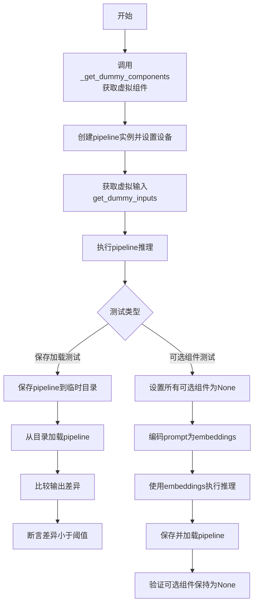
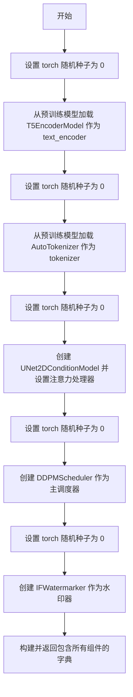
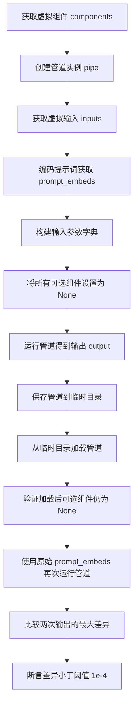
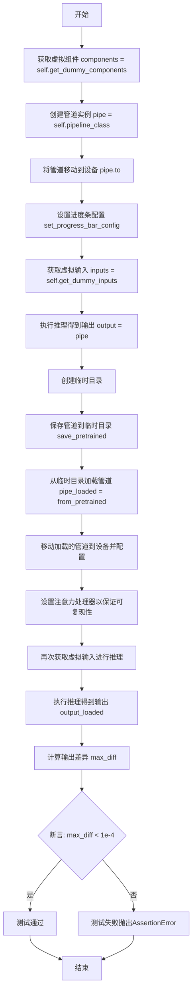
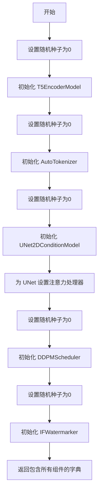

# `diffusers\tests\pipelines\deepfloyd_if\__init__.py` 详细设计文档

这是一个用于测试DeepFloyd IF（Image Fusion）扩散流水线的测试mixin类，提供了获取虚拟组件的方法以及测试pipeline的保存/加载功能。

## 整体流程



## 类结构

```
IFPipelineTesterMixin (测试mixin基类)
└── 用于测试IFPipeline的通用方法集合
```

## 全局变量及字段


### `tempfile`
    
Python标准库模块，用于创建临时文件和目录。

类型：`module`
    


### `np`
    
NumPy库模块，用于数值计算和数组操作。

类型：`module`
    


### `torch`
    
PyTorch库模块，用于深度学习张量计算和神经网络构建。

类型：`module`
    


### `AutoTokenizer`
    
来自transformers库，用于自动加载预训练分词器对文本进行分词。

类型：`class`
    


### `T5EncoderModel`
    
来自transformers库，表示T5文本编码器模型，用于将文本编码为向量表示。

类型：`class`
    


### `DDPMScheduler`
    
来自diffusers库，实现了DDPM去噪调度算法，用于扩散模型的采样过程。

类型：`class`
    


### `UNet2DConditionModel`
    
来自diffusers库，表示二维条件U-Net模型，用于图像到图像的条件生成任务。

类型：`class`
    


### `IFWatermarker`
    
来自diffusers库，用于为生成的图像添加水印以防止滥用。

类型：`class`
    


### `AttnAddedKVProcessor`
    
来自diffusers库，用于处理注意力机制中的键值对，增加可重现性。

类型：`class`
    


### `torch_device`
    
来自testing_utils，指定PyTorch计算设备（如'cuda'或'cpu'）的字符串。

类型：`str`
    


### `to_np`
    
来自test_pipelines_common，将PyTorch张量转换为NumPy数组的辅助函数。

类型：`function`
    


    

## 全局函数及方法


### `IFPipelineTesterMixin._get_dummy_components`

该方法用于生成虚拟（dummy）组件字典，主要为 IF pipeline 测试提供文本编码器、分词器、UNet 模型、调度器和水印器等核心组件的预训练模型实例，同时设置随机种子以确保测试可复现。

参数：

- 无显式参数（仅包含隐式参数 `self`）

返回值：`Dict[str, Any]`，返回一个包含以下键的字典：

- `text_encoder`：T5 文本编码器模型
- `tokenizer`：T5 分词器
- `unet`：UNet2DConditionModel 实例
- `scheduler`：DDPMScheduler 实例
- `watermarker`：IFWatermarker 实例
- `safety_checker`：设为 None
- `feature_extractor`：设为 None

#### 流程图



#### 带注释源码

```python
def _get_dummy_components(self):
    # 设置 PyTorch 随机种子为 0，确保 text_encoder 加载过程可复现
    torch.manual_seed(0)
    # 加载 hf-internal-testing/tiny-random-t5 预训练文本编码器模型
    # T5EncoderModel 用于将文本提示编码为嵌入向量
    text_encoder = T5EncoderModel.from_pretrained("hf-internal-testing/tiny-random-t5")

    # 重新设置随机种子，确保 tokenizer 加载过程可复现
    torch.manual_seed(0)
    # 加载对应的 T5 分词器，用于将文本字符串 token 化
    tokenizer = AutoTokenizer.from_pretrained("hf-internal-testing/tiny-random-t5")

    # 重新设置随机种子，确保 UNet 模型初始化可复现
    torch.manual_seed(0)
    # 创建虚拟 UNet2DConditionModel 实例，用于条件图像生成
    # 参数配置：sample_size=32, 块结构包含下采样、上采样和交叉注意力块
    unet = UNet2DConditionModel(
        sample_size=32,               # 输入样本的空间分辨率
        layers_per_block=1,            # 每个块中的层数
        block_out_channels=[32, 64],  # 各块的输出通道数
        down_block_types=[            # 下采样块类型列表
            "ResnetDownsampleBlock2D",
            "SimpleCrossAttnDownBlock2D",
        ],
        mid_block_type="UNetMidBlock2DSimpleCrossAttn",  # 中间块类型
        up_block_types=[              # 上采样块类型列表
            "SimpleCrossAttnUpBlock2D",
            "ResnetUpsampleBlock2D",
        ],
        in_channels=3,                # 输入图像通道数（RGB）
        out_channels=6,               # 输出图像通道数
        cross_attention_dim=32,       # 交叉注意力维度
        encoder_hid_dim=32,           # 编码器隐藏层维度
        attention_head_dim=8,         # 注意力头维度
        addition_embed_type="text",   # 附加嵌入类型
        addition_embed_type_num_heads=2,  # 附加嵌入的头数
        cross_attention_norm="group_norm",  # 交叉注意力归一化方式
        resnet_time_scale_shift="scale_shift",  # ResNet 时间移位方式
        act_fn="gelu",                # 激活函数
    )
    # 设置注意力处理器为 AttnAddedKVProcessor，确保可复现性测试
    unet.set_attn_processor(AttnAddedKVProcessor())

    # 重新设置随机种子，确保调度器初始化可复现
    torch.manual_seed(0)
    # 创建 DDPMScheduler（DDPM 调度器），用于扩散模型的噪声调度
    scheduler = DDPMScheduler(
        num_train_timesteps=1000,     # 训练时间步数
        beta_schedule="squaredcos_cap_v2",  # beta 调度策略
        beta_start=0.0001,           # beta 起始值
        beta_end=0.02,                # beta 结束值
        thresholding=True,            # 启用阈值处理
        dynamic_thresholding_ratio=0.95,  # 动态阈值比率
        sample_max_value=1.0,         # 样本最大值
        prediction_type="epsilon",    # 预测类型（预测噪声）
        variance_type="learned_range",  # 方差类型
    )

    # 重新设置随机种子，确保水印器初始化可复现
    torch.manual_seed(0)
    # 创建 IFWatermarker 实例，用于在生成图像中添加水印
    watermarker = IFWatermarker()

    # 返回包含所有虚拟组件的字典，供 pipeline 测试使用
    # safety_checker 和 feature_extractor 设为 None，表示可选组件
    return {
        "text_encoder": text_encoder,
        "tokenizer": tokenizer,
        "unet": unet,
        "scheduler": scheduler,
        "watermarker": watermarker,
        "safety_checker": None,
        "feature_extractor": None,
    }
```


### `IFPipelineTesterMixin._get_superresolution_dummy_components`

该方法用于生成超分辨率管道测试所需的虚拟组件字典，包含文本编码器、分词器、UNet模型、调度器、水印处理器等关键组件的预配置实例。

参数：

- 无（仅包含隐式参数 `self`）

返回值：`Dict[str, Any]`，返回一个包含以下键的字典：
- `text_encoder`: T5EncoderModel 实例
- `tokenizer`: AutoTokenizer 实例
- `unet`: UNet2DConditionModel 实例（超分辨率配置）
- `scheduler`: DDPMScheduler 实例
- `image_noising_scheduler`: DDPMScheduler 实例
- `watermarker`: IFWatermarker 实例
- `safety_checker`: None
- `feature_extractor`: None

#### 流程图

```mermaid
flowchart TD
    A[开始] --> B[设置随机种子 0]
    B --> C[创建 T5EncoderModel text_encoder]
    C --> D[设置随机种子 0]
    D --> E[创建 AutoTokenizer tokenizer]
    E --> F[设置随机种子 0]
    F --> G[创建 UNet2DConditionModel unet<br/>sample_size=32<br/>layers_per_block=[1, 2]<br/>in_channels=6, out_channels=6<br/>class_embed_type=timestep]
    G --> H[设置 AttnAddedKVProcessor 注意力处理器]
    H --> I[设置随机种子 0]
    I --> J[创建 DDPMScheduler scheduler]
    J --> K[设置随机种子 0]
    K --> L[创建 DDPMScheduler image_noising_scheduler]
    L --> M[设置随机种子 0]
    M --> N[创建 IFWatermarker watermarker]
    N --> O[返回包含所有组件的字典]
```

#### 带注释源码

```python
def _get_superresolution_dummy_components(self):
    """
    生成超分辨率管道测试用的虚拟组件。
    包含文本编码器、分词器、UNet、调度器等关键组件的预配置实例。
    """
    # 设置随机种子确保可重复性
    torch.manual_seed(0)
    # 加载预训练的 T5 文本编码器模型（用于文本嵌入生成）
    text_encoder = T5EncoderModel.from_pretrained("hf-internal-testing/tiny-random-t5")

    # 重置随机种子
    torch.manual_seed(0)
    # 加载对应的 T5 分词器
    tokenizer = AutoTokenizer.from_pretrained("hf-internal-testing/tiny-random-t5")

    # 重置随机种子
    torch.manual_seed(0)
    # 创建 UNet2DConditionModel（超分辨率版本）
    # 参数说明：
    # - sample_size: 输入样本尺寸 32x32
    # - layers_per_block: 每块层数 [1, 2]
    # - in_channels: 6（超分辨率需要输入低分辨率图像+噪声）
    # - out_channels: 6
    # - class_embed_type: timestep（时间步嵌入类型）
    # - mid_block_scale_factor: 1.414（中块缩放因子）
    unet = UNet2DConditionModel(
        sample_size=32,
        layers_per_block=[1, 2],
        block_out_channels=[32, 64],
        down_block_types=[
            "ResnetDownsampleBlock2D",
            "SimpleCrossAttnDownBlock2D",
        ],
        mid_block_type="UNetMidBlock2DSimpleCrossAttn",
        up_block_types=["SimpleCrossAttnUpBlock2D", "ResnetUpsampleBlock2D"],
        in_channels=6,          # 超分辨率需要6通道（RGB+LRGB）
        out_channels=6,
        cross_attention_dim=32,
        encoder_hid_dim=32,
        attention_head_dim=8,
        addition_embed_type="text",
        addition_embed_type_num_heads=2,
        cross_attention_norm="group_norm",
        resnet_time_scale_shift="scale_shift",
        act_fn="gelu",
        class_embed_type="timestep",      # 关键：超分辨率需要时间步嵌入
        mid_block_scale_factor=1.414,
        time_embedding_act_fn="gelu",
        time_embedding_dim=32,
    )
    # 设置注意力处理器以确保测试可重复性
    unet.set_attn_processor(AttnAddedKVProcessor())

    # 重置随机种子
    torch.manual_seed(0)
    # 创建主调度器（DDPMScheduler）
    scheduler = DDPMScheduler(
        num_train_timesteps=1000,
        beta_schedule="squaredcos_cap_v2",
        beta_start=0.0001,
        beta_end=0.02,
        thresholding=True,
        dynamic_thresholding_ratio=0.95,
        sample_max_value=1.0,
        prediction_type="epsilon",
        variance_type="learned_range",
    )

    # 重置随机种子
    torch.manual_seed(0)
    # 创建图像去噪调度器（用于超分辨率管道）
    image_noising_scheduler = DDPMScheduler(
        num_train_timesteps=1000,
        beta_schedule="squaredcos_cap_v2",
        beta_start=0.0001,
        beta_end=0.02,
    )

    # 重置随机种子
    torch.manual_seed(0)
    # 创建水印处理器
    watermarker = IFWatermarker()

    # 返回包含所有组件的字典
    return {
        "text_encoder": text_encoder,
        "tokenizer": tokenizer,
        "unet": unet,
        "scheduler": scheduler,
        "image_noising_scheduler": image_noising_scheduler,  # 超分辨率专用
        "watermarker": watermarker,
        "safety_checker": None,      # 安全性检查器（未使用）
        "feature_extractor": None,   # 特征提取器（未使用）
    }
```


### `IFPipelineTesterMixin._test_save_load_optional_components`

该方法用于测试管道在将可选组件（如 text_encoder、safety_checker 等）设置为 None 后，保存和加载管道时能否正确保持这些组件为 None 的状态，并验证保存/加载前后管道输出的数值一致性。

参数：

- 无显式参数（`self` 为实例方法的标准参数）

返回值：无返回值（通过断言验证行为）

#### 流程图



#### 带注释源码

```
def _test_save_load_optional_components(self):
    """
    测试可选组件的保存和加载功能。
    验证当可选组件被设置为 None 后，保存并重新加载管道时，
    这些组件仍能保持为 None 状态，且输出结果一致。
    """
    
    # 步骤1：获取虚拟组件（用于测试的模拟组件）
    components = self.get_dummy_components()
    
    # 步骤2：使用虚拟组件创建管道实例
    pipe = self.pipeline_class(**components)
    pipe.to(torch_device)
    pipe.set_progress_bar_config(disable=None)
    
    # 步骤3：获取虚拟输入（包含 prompt, generator, num_inference_steps, output_type 等）
    inputs = self.get_dummy_inputs(torch_device)
    
    # 提取输入参数
    prompt = inputs["prompt"]
    generator = inputs["generator"]
    num_inference_steps = inputs["num_inference_steps"]
    output_type = inputs["output_type"]
    
    # 处理可选图像输入（image, mask_image, original_image）
    if "image" in inputs:
        image = inputs["image"]
    else:
        image = None
    
    if "mask_image" in inputs:
        mask_image = inputs["mask_image"]
    else:
        mask_image = None
    
    if "original_image" in inputs:
        original_image = inputs["original_image"]
    else:
        original_image = None
    
    # 步骤4：使用管道的 encode_prompt 方法将文本提示编码为嵌入向量
    # 这是为了测试当 text_encoder 被设置为 None 时，可以直接传递预计算的嵌入
    prompt_embeds, negative_prompt_embeds = pipe.encode_prompt(prompt)
    
    # 步骤5：构建输入参数字典，使用预计算的 prompt_embeds 替代原始 prompt
    inputs = {
        "prompt_embeds": prompt_embeds,
        "negative_prompt_embeds": negative_prompt_embeds,
        "generator": generator,
        "num_inference_steps": num_inference_steps,
        "output_type": output_type,
    }
    
    # 添加可选图像参数（如果存在）
    if image is not None:
        inputs["image"] = image
    
    if mask_image is not None:
        inputs["mask_image"] = mask_image
    
    if original_image is not None:
        inputs["original_image"] = original_image
    
    # 步骤6：将管道中所有可选组件设置为 None
    # 模拟用户不提供某些组件的场景
    for optional_component in pipe._optional_components:
        setattr(pipe, optional_component, None)
    
    # 步骤7：运行管道并获取输出
    # 此时管道使用预计算的 prompt_embeds，不依赖 text_encoder
    output = pipe(**inputs)[0]
    
    # 步骤8-9：保存管道到临时目录，然后重新加载
    with tempfile.TemporaryDirectory() as tmpdir:
        pipe.save_pretrained(tmpdir)
        pipe_loaded = self.pipeline_class.from_pretrained(tmpdir)
        pipe_loaded.to(torch_device)
        pipe_loaded.set_progress_bar_config(disable=None)
    
    # 步骤10：重新设置 UNet 的注意力处理器（因为它不会被序列化）
    pipe_loaded.unet.set_attn_processor(AttnAddedKVProcessor())
    
    # 步骤11：验证加载后的管道中，可选组件仍然为 None
    for optional_component in pipe._optional_components:
        self.assertTrue(
            getattr(pipe_loaded, optional_component) is None,
            f"`{optional_component}` did not stay set to None after loading.",
        )
    
    # 步骤12：重新获取虚拟输入，准备进行输出比较测试
    inputs = self.get_dummy_inputs(torch_device)
    
    generator = inputs["generator"]
    num_inference_steps = inputs["num_inference_steps"]
    output_type = inputs["output_type"]
    
    # 步骤13：使用相同的 prompt_embeds 构建输入
    # 这样可以隔离变量，只比较管道保存/加载前后的差异
    inputs = {
        "prompt_embeds": prompt_embeds,
        "negative_prompt_embeds": negative_prompt_embeds,
        "generator": generator,
        "num_inference_steps": num_inference_steps,
        "output_type": output_type,
    }
    
    if image is not None:
        inputs["image"] = image
    
    if mask_image is not None:
        inputs["mask_image"] = mask_image
    
    if original_image is not None:
        inputs["original_image"] = original_image
    
    # 步骤14：使用加载后的管道运行推理
    output_loaded = pipe_loaded(**inputs)[0]
    
    # 步骤15：计算两次输出的最大差异
    max_diff = np.abs(to_np(output) - to_np(output_loaded)).max()
    
    # 步骤16：断言差异小于阈值（确保保存/加载操作的数值稳定性）
    self.assertLess(max_diff, 1e-4)
```


### `_test_save_load_local`

该方法用于测试diffusers管道的保存（save_pretrained）和加载（from_pretrained）功能是否正常工作，通过比较保存前后两次推理输出的差异来验证管道状态的一致性。

参数：

- `self`：类实例，IFPipelineTesterMixin类的实例方法

返回值：`None`，该方法通过断言验证保存加载前后输出的一致性，不返回任何值

#### 流程图



#### 带注释源码

```python
def _test_save_load_local(self):
    """
    测试管道的保存和加载功能。
    该测试验证pipeline在保存到磁盘后重新加载能够产生相同的推理结果。
    由于UNet的AttnProcessor不被序列化，需要在加载后手动设置。
    """
    # 步骤1: 获取虚拟组件（用于测试的假模型组件）
    components = self.get_dummy_components()
    
    # 步骤2: 使用虚拟组件创建pipeline实例
    pipe = self.pipeline_class(**components)
    
    # 步骤3: 将pipeline移动到指定设备（如GPU/CPU）
    pipe.to(torch_device)
    
    # 步骤4: 配置进度条（disable=None表示不禁用进度条）
    pipe.set_progress_bar_config(disable=None)

    # 步骤5: 获取虚拟输入参数
    inputs = self.get_dummy_inputs(torch_device)
    
    # 步骤6: 第一次推理，保存输出结果
    output = pipe(**inputs)[0]  # [0]表示只取第一个输出（生成的图像）

    # 步骤7: 创建临时目录用于保存pipeline
    with tempfile.TemporaryDirectory() as tmpdir:
        # 步骤8: 保存pipeline到临时目录
        pipe.save_pretrained(tmpdir)
        
        # 步骤9: 从保存的目录加载pipeline
        pipe_loaded = self.pipeline_class.from_pretrained(tmpdir)
        
        # 步骤10: 将加载的pipeline移动到设备并配置
        pipe_loaded.to(torch_device)
        pipe_loaded.set_progress_bar_config(disable=None)

    # 步骤11: 手动设置注意力处理器（因为AttnProcessor不被序列化保存）
    # 这确保两次推理使用相同的处理器，保证结果可复现
    pipe_loaded.unet.set_attn_processor(AttnAddedKVProcessor())

    # 步骤12: 使用相同的虚拟输入对加载的pipeline进行推理
    inputs = self.get_dummy_inputs(torch_device)
    output_loaded = pipe_loaded(**inputs)[0]

    # 步骤13: 计算两次输出的最大差异
    max_diff = np.abs(to_np(output) - to_np(output_loaded)).max()
    
    # 步骤14: 断言差异小于阈值（验证保存加载功能正确）
    self.assertLess(max_diff, 1e-4)
```


### `IFPipelineTesterMixin._get_dummy_components`

该方法用于生成虚拟（dummy）组件字典，以便在测试 pipelines 时使用。它初始化了文本编码器（text_encoder）、分词器（tokenizer）、UNet 模型（unet）、调度器（scheduler）和水印处理器（watermarker），并设置了随机种子以确保可重现性，同时将安全检查器和特征提取器设置为 None。

参数：
- `self`：隐式参数，类型为 `IFPipelineTesterMixin` 实例，表示类本身。

返回值：`Dict[str, Any]`，返回一个包含虚拟组件的字典，键包括 "text_encoder"、"tokenizer"、"unet"、"scheduler"、"watermarker"、"safety_checker" 和 "feature_extractor"，用于初始化 IF 管道。

#### 流程图



#### 带注释源码

```python
def _get_dummy_components(self):
    """
    生成虚拟组件字典，用于测试 IF 管道。
    """
    # 设置随机种子以确保可重现性
    torch.manual_seed(0)
    # 从预训练模型加载文本编码器
    text_encoder = T5EncoderModel.from_pretrained("hf-internal-testing/tiny-random-t5")

    # 重置随机种子并加载分词器
    torch.manual_seed(0)
    tokenizer = AutoTokenizer.from_pretrained("hf-internal-testing/tiny-random-t5")

    # 重置随机种子并初始化 UNet 模型
    torch.manual_seed(0)
    unet = UNet2DConditionModel(
        sample_size=32,  # 输入样本的空间分辨率
        layers_per_block=1,  # 每个块中的层数
        block_out_channels=[32, 64],  # 块的输出通道数
        down_block_types=[  # 下采样块类型
            "ResnetDownsampleBlock2D",
            "SimpleCrossAttnDownBlock2D",
        ],
        mid_block_type="UNetMidBlock2DSimpleCrossAttn",  # 中间块类型
        up_block_types=[  # 上采样块类型
            "SimpleCrossAttnUpBlock2D",
            "ResnetUpsampleBlock2D",
        ],
        in_channels=3,  # 输入通道数（RGB 图像）
        out_channels=6,  # 输出通道数
        cross_attention_dim=32,  # 交叉注意力维度
        encoder_hid_dim=32,  # 编码器隐藏层维度
        attention_head_dim=8,  # 注意力头维度
        addition_embed_type="text",  # 附加嵌入类型
        addition_embed_type_num_heads=2,  # 附加嵌入的头数
        cross_attention_norm="group_norm",  # 交叉注意力归一化方式
        resnet_time_scale_shift="scale_shift",  # ResNet 时间尺度偏移
        act_fn="gelu",  # 激活函数
    )
    # 设置注意力处理器以确保可重现性测试
    unet.set_attn_processor(AttnAddedKVProcessor())

    # 重置随机种子并初始化调度器
    torch.manual_seed(0)
    scheduler = DDPMScheduler(
        num_train_timesteps=1000,  # 训练时间步数
        beta_schedule="squaredcos_cap_v2",  # Beta 调度方式
        beta_start=0.0001,  # Beta 起始值
        beta_end=0.02,  # Beta 结束值
        thresholding=True,  # 是否使用阈值化
        dynamic_thresholding_ratio=0.95,  # 动态阈值化比例
        sample_max_value=1.0,  # 样本最大值
        prediction_type="epsilon",  # 预测类型
        variance_type="learned_range",  # 方差类型
    )

    # 重置随机种子并初始化水印处理器
    torch.manual_seed(0)
    watermarker = IFWatermarker()

    # 返回包含所有虚拟组件的字典
    return {
        "text_encoder": text_encoder,
        "tokenizer": tokenizer,
        "unet": unet,
        "scheduler": scheduler,
        "watermarker": watermarker,
        "safety_checker": None,  # 安全检查器设为 None
        "feature_extractor": None,  # 特征提取器设为 None
    }
```


### `IFPipelineTesterMixin._get_superresolution_dummy_components`

该方法用于生成超分辨率pipeline测试所需的虚拟组件（dummy components），包括文本编码器、分词器、UNet模型、调度器、图像噪声调度器、水印处理器等，并返回一个包含所有组件的字典。与基础的 `_get_dummy_components` 方法相比，该方法专门为超分辨率场景配置UNet模型，使其支持更多的输入通道、不同的层结构和时间嵌入配置。

参数：

- 该方法无显式参数（仅包含 `self`）

返回值：`Dict[str, Any]`，返回一个包含以下键的字典：
- `text_encoder`: T5EncoderModel 实例
- `tokenizer`: AutoTokenizer 实例
- `unet`: UNet2DConditionModel 实例（超分辨率配置）
- `scheduler`: DDPMScheduler 实例
- `image_noising_scheduler`: DDPMScheduler 实例（用于图像噪声处理）
- `watermarker`: IFWatermarker 实例
- `safety_checker`: None
- `feature_extractor`: None

#### 流程图

```mermaid
flowchart TD
    A[开始 _get_superresolution_dummy_components] --> B[设置随机种子 torch.manual_seed(0)]
    B --> C[创建 T5EncoderModel 文本编码器]
    C --> D[创建 AutoTokenizer 分词器]
    D --> E[创建 UNet2DConditionModel 超分辨率配置]
    E --> F[设置 AttnAddedKVProcessor 注意力处理器]
    F --> G[创建主调度器 DDPMScheduler]
    G --> H[创建图像噪声调度器 DDPMScheduler]
    H --> I[创建 IFWatermarker 水印处理器]
    I --> J[构建组件字典并返回]
```

#### 带注释源码

```python
def _get_superresolution_dummy_components(self):
    """
    生成超分辨率pipeline测试所需的虚拟组件。
    与基础版本相比，UNet配置了更多参数以支持超分辨率任务。
    """
    # 设置随机种子以确保测试可重复性
    torch.manual_seed(0)
    # 加载虚拟T5文本编码器模型
    text_encoder = T5EncoderModel.from_pretrained("hf-internal-testing/tiny-random-t5")

    # 重新设置随机种子
    torch.manual_seed(0)
    # 加载虚拟T5分词器
    tokenizer = AutoTokenizer.from_pretrained("hf-internal-testing/tiny-random-t5")

    # 重新设置随机种子
    torch.manual_seed(0)
    # 创建虚拟UNet模型，配置为超分辨率模式
    # 注意：in_channels=6（支持图像+噪声输入），layers_per_block=[1,2]（不同於基础版本的单一值）
    unet = UNet2DConditionModel(
        sample_size=32,
        layers_per_block=[1, 2],  # 超分辨率使用列表格式指定不同层的块数
        block_out_channels=[32, 64],
        down_block_types=[
            "ResnetDownsampleBlock2D",
            "SimpleCrossAttnDownBlock2D",
        ],
        mid_block_type="UNetMidBlock2DSimpleCrossAttn",
        up_block_types=["SimpleCrossAttnUpBlock2D", "ResnetUpsampleBlock2D"],
        in_channels=6,  # 超分辨率需要6通道（RGB图像+噪声）
        out_channels=6,
        cross_attention_dim=32,
        encoder_hid_dim=32,
        attention_head_dim=8,
        addition_embed_type="text",
        addition_embed_type_num_heads=2,
        cross_attention_norm="group_norm",
        resnet_time_scale_shift="scale_shift",
        act_fn="gelu",
        class_embed_type="timestep",  # 超分辨率需要时间步嵌入
        mid_block_scale_factor=1.414,  # 中间块缩放因子
        time_embedding_act_fn="gelu",  # 时间嵌入激活函数
        time_embedding_dim=32,  # 时间嵌入维度
    )
    # 设置注意力处理器以确保测试可重复性
    unet.set_attn_processor(AttnAddedKVProcessor())

    # 重新设置随机种子
    torch.manual_seed(0)
    # 创建主噪声调度器
    scheduler = DDPMScheduler(
        num_train_timesteps=1000,
        beta_schedule="squaredcos_cap_v2",
        beta_start=0.0001,
        beta_end=0.02,
        thresholding=True,
        dynamic_thresholding_ratio=0.95,
        sample_max_value=1.0,
        prediction_type="epsilon",
        variance_type="learned_range",
    )

    # 重新设置随机种子
    torch.manual_seed(0)
    # 创建图像噪声调度器（超分辨率pipeline专用）
    image_noising_scheduler = DDPMScheduler(
        num_train_timesteps=1000,
        beta_schedule="squaredcos_cap_v2",
        beta_start=0.0001,
        beta_end=0.02,
    )

    # 重新设置随机种子
    torch.manual_seed(0)
    # 创建虚拟水印处理器
    watermarker = IFWatermarker()

    # 返回包含所有组件的字典
    return {
        "text_encoder": text_encoder,
        "tokenizer": tokenizer,
        "unet": unet,
        "scheduler": scheduler,
        "image_noising_scheduler": image_noising_scheduler,
        "watermarker": watermarker,
        "safety_checker": None,
        "feature_extractor": None,
    }
```


### `IFPipelineTesterMixin._test_save_load_optional_components`

该测试方法用于验证当管道的可选组件（如文本编码器、安全检查器等）被设置为 None 时，管道能够正确保存和加载，并且在使用预计算的 prompt embeddings 时，加载后的管道输出与原始管道输出一致。

参数：

- `self`：`IFPipelineTesterMixin`，测试类的实例，包含测试所需的基础方法如 `get_dummy_components()` 和 `get_dummy_inputs()`

返回值：`None`，该方法为测试方法，通过断言验证逻辑，不返回具体值

#### 流程图

```mermaid
flowchart TD
    A[开始] --> B[获取虚拟组件: components = self.get_dummy_components]
    B --> C[创建管道实例: pipe = self.pipeline_class(**components)]
    C --> D[获取虚拟输入: inputs = self.get_dummy_inputs]
    D --> E[提取prompt并编码为embeddings: prompt_embeds, negative_prompt_embeds = pipe.encode_prompt]
    E --> F[构建inputs字典，使用prompt_embeds替代prompt]
    F --> G[将所有可选组件设为None: setattr(pipe, optional_component, None)]
    G --> H[执行管道获取输出: output = pipe(**inputs)]
    H --> I[保存管道到临时目录: pipe.save_pretrained]
    I --> J[从临时目录加载管道: pipe_loaded = self.pipeline_class.from_pretrained]
    J --> K[验证可选组件在加载后仍为None]
    K --> L[使用加载的管道执行推理: output_loaded = pipe_loaded(**inputs)]
    L --> M[比较输出差异: max_diff = np.abs(output - output_loaded).max]
    M --> N{断言: max_diff < 1e-4}
    N -->|通过| O[测试通过]
    N -->|失败| P[测试失败抛出异常]
```

#### 带注释源码

```python
# 此测试方法验证可选组件的保存/加载功能
# 当文本编码器被设置为可选时，用户可以预先编码prompt并直接传递embeddings
def _test_save_load_optional_components(self):
    # 步骤1: 获取虚拟组件用于测试
    components = self.get_dummy_components()
    
    # 步骤2: 使用虚拟组件创建管道实例
    pipe = self.pipeline_class(**components)
    pipe.to(torch_device)
    pipe.set_progress_bar_config(disable=None)

    # 步骤3: 获取虚拟输入
    inputs = self.get_dummy_inputs(torch_device)

    # 步骤4: 从输入中提取各种参数
    prompt = inputs["prompt"]
    generator = inputs["generator"]
    num_inference_steps = inputs["num_inference_steps"]
    output_type = inputs["output_type"]

    # 步骤5: 处理可选的图像相关输入
    if "image" in inputs:
        image = inputs["image"]
    else:
        image = None

    if "mask_image" in inputs:
        mask_image = inputs["mask_image"]
    else:
        mask_image = None

    if "original_image" in inputs:
        original_image = inputs["original_image"]
    else:
        original_image = None

    # 步骤6: 将prompt编码为embeddings
    # 这是关键步骤：当text_encoder为None时，需要预先编码
    prompt_embeds, negative_prompt_embeds = pipe.encode_prompt(prompt)

    # 步骤7: 构建输入字典，使用embeddings替代原始prompt
    inputs = {
        "prompt_embeds": prompt_embeds,
        "negative_prompt_embeds": negative_prompt_embeds,
        "generator": generator,
        "num_inference_steps": num_inference_steps,
        "output_type": output_type,
    }

    # 步骤8: 添加可选的图像参数
    if image is not None:
        inputs["image"] = image

    if mask_image is not None:
        inputs["mask_image"] = mask_image

    if original_image is not None:
        inputs["original_image"] = original_image

    # 步骤9: 将所有可选组件设置为None
    # 这是测试的核心：验证可选组件被正确处理
    for optional_component in pipe._optional_components:
        setattr(pipe, optional_component, None)

    # 步骤10: 执行管道获取输出
    output = pipe(**inputs)[0]

    # 步骤11: 保存和加载管道
    with tempfile.TemporaryDirectory() as tmpdir:
        pipe.save_pretrained(tmpdir)
        pipe_loaded = self.pipeline_class.from_pretrained(tmpdir)
        pipe_loaded.to(torch_device)
        pipe_loaded.set_progress_bar_config(disable=None)

    # 步骤12: 重新设置UNet的注意力处理器（因序列化需要）
    pipe_loaded.unet.set_attn_processor(AttnAddedKVProcessor())  # For reproducibility tests

    # 步骤13: 验证可选组件在加载后仍为None
    for optional_component in pipe._optional_components:
        self.assertTrue(
            getattr(pipe_loaded, optional_component) is None,
            f"`{optional_component}` did not stay set to None after loading.",
        )

    # 步骤14: 准备新输入用于加载后的管道
    inputs = self.get_dummy_inputs(torch_device)

    generator = inputs["generator"]
    num_inference_steps = inputs["num_inference_steps"]
    output_type = inputs["output_type"]

    # 步骤15: 复用之前编码的embeddings构建输入
    inputs = {
        "prompt_embeds": prompt_embeds,
        "negative_prompt_embeds": negative_prompt_embeds,
        "generator": generator,
        "num_inference_steps": num_inference_steps,
        "output_type": output_type,
    }

    if image is not None:
        inputs["image"] = image

    if mask_image is not None:
        inputs["mask_image"] = mask_image

    if original_image is not None:
        inputs["original_image"] = original_image

    # 步骤16: 使用加载的管道执行推理
    output_loaded = pipe_loaded(**inputs)[0]

    # 步骤17: 比较输出差异
    max_diff = np.abs(to_np(output) - to_np(output_loaded)).max()
    # 验证保存/加载后输出结果一致（误差小于1e-4）
    self.assertLess(max_diff, 1e-4)
```


### `IFPipelineTesterMixin._test_save_load_local`

该方法用于测试 Diffusion Pipeline 的保存（save_pretrained）和加载（from_pretrained）功能是否正常工作，通过对比保存前后两次推理输出的差异来验证序列化/反序列化过程的正确性。

参数：

- `self`：隐式参数，IFPipelineTesterMixin 实例本身

返回值：`None`，该方法为测试方法，通过断言验证结果而非返回值

#### 流程图

```mermaid
flowchart TD
    A[开始] --> B[获取虚拟组件 components]
    B --> C[创建管道实例 pipe]
    C --> D[将管道移至 torch_device]
    D --> E[设置进度条配置]
    E --> F[获取虚拟输入 inputs]
    F --> G[首次推理: output = pipe(inputs)]
    G --> H[创建临时目录 tmpdir]
    H --> I[保存管道: pipe.save_pretrained]
    I --> J[加载管道: pipe_loaded = from_pretrained]
    J --> K[将加载的管道移至 torch_device]
    K --> L[设置进度条配置]
    L --> M[设置 attn_processor 确保可复现性]
    M --> N[再次获取虚拟输入 inputs]
    N --> O[第二次推理: output_loaded = pipe_loaded(inputs)]
    O --> P[计算输出差异: max_diff]
    P --> Q{assert max_diff < 1e-4}
    Q -->|通过| R[测试通过]
    Q -->|失败| S[测试失败]
```

#### 带注释源码

```python
def _test_save_load_local(self):
    # 1. 获取预定义的虚拟组件（用于测试的模型组件）
    components = self.get_dummy_components()
    
    # 2. 使用虚拟组件创建 Pipeline 实例
    pipe = self.pipeline_class(**components)
    
    # 3. 将 Pipeline 移动到指定的计算设备
    pipe.to(torch_device)
    
    # 4. 配置进度条（disable=None 表示不禁用）
    pipe.set_progress_bar_config(disable=None)

    # 5. 获取测试用的虚拟输入参数
    inputs = self.get_dummy_inputs(torch_device)
    
    # 6. 执行首次推理，获取原始输出
    output = pipe(**inputs)[0]

    # 7. 创建临时目录用于保存模型
    with tempfile.TemporaryDirectory() as tmpdir:
        # 8. 将 Pipeline 保存到临时目录
        pipe.save_pretrained(tmpdir)
        
        # 9. 从保存的目录重新加载 Pipeline
        pipe_loaded = self.pipeline_class.from_pretrained(tmpdir)
        
        # 10. 将加载后的 Pipeline 移动到计算设备
        pipe_loaded.to(torch_device)
        
        # 11. 配置加载后 Pipeline 的进度条
        pipe_loaded.set_progress_bar_config(disable=None)

    # 12. 为加载的 UNet 设置注意力处理器（因为该处理器不会被序列化）
    # 这是为了确保测试的可复现性
    pipe_loaded.unet.set_attn_processor(AttnAddedKVProcessor())

    # 13. 重新获取虚拟输入（使用相同的随机种子）
    inputs = self.get_dummy_inputs(torch_device)
    
    # 14. 使用加载的 Pipeline 执行第二次推理
    output_loaded = pipe_loaded(**inputs)[0]

    # 15. 计算两次输出之间的最大差异
    max_diff = np.abs(to_np(output) - to_np(output_loaded)).max()
    
    # 16. 断言：差异应小于阈值 1e-4，确保保存/加载功能正常
    self.assertLess(max_diff, 1e-4)
```

## 关键组件


### _get_dummy_components

用于创建标准分辨率（32x32）测试所需的虚拟组件，包括T5文本编码器、分词器、UNet2DConditionModel模型、DDPMScheduler调度器和IFWatermarker水印器，并配置可复现的注意力处理器。

### _get_superresolution_dummy_components

用于创建超分辨率测试所需的虚拟组件，与标准组件相比增加了time_embedding_dim和class_embed_type参数，支持多层级Layers_per_block配置和image_noising_scheduler，用于高分辨率图像生成测试。

### _test_save_load_optional_components

测试管道的保存和加载功能，特别处理文本编码器为可选组件的情况，确保当文本编码器设为None时可以使用预计算的prompt_embeds进行推理，验证保存加载后组件状态保持一致且输出结果可复现。

### _test_save_load_local

测试管道在本地文件系统上的保存和加载流程，由于AttnProcessor不会被序列化，该方法在加载后手动重新设置注意力处理器以确保测试可复现性。

### T5EncoderModel

HuggingFace Transformers库提供的T5文本编码器模型，用于将文本提示转换为嵌入向量，在DeepFloyd IF管道中处理文本条件输入。

### AutoTokenizer

HuggingFace Transformers库提供的T5分词器，与T5EncoderModel配合使用，将文本字符串转换为token序列。

### UNet2DConditionModel

Diffusers库提供的条件UNet2D模型，支持cross_attention_dim和encoder_hid_dim参数，用于根据文本条件生成图像特征，在IF管道中执行去噪预测。

### DDPMScheduler

Diffusers库提供的DDPM调度器，实现去噪扩散概率模型的时间步调度，支持自定义beta_schedule、thresholding和dynamic_thresholding_ratio等参数。

### IFWatermarker

DeepFloyd IF管道的水印处理器，用于在生成的图像上添加水印以标识来源。

### AttnAddedKVProcessor

自定义注意力处理器，在注意力计算中添加键值对，支持可复现性测试的注意力机制配置。


## 问题及建议


### 已知问题

-   **硬编码的随机种子**：多次调用 `torch.manual_seed(0)` 重复设置相同种子，应该在函数开始时统一设置一次
-   **重复代码**：`_get_dummy_components` 和 `_get_superresolution_dummy_components` 方法存在大量重复的模型初始化逻辑，可提取公共部分
-   **魔法数字和硬编码参数**：如 `sample_size=32`、`block_out_channels=[32, 64]`、`attention_head_dim=8` 等参数散落在各处，应提取为类或模块级常量
-   **临时解决方案未清理**：注释提到 "_test_save_load_local 中的 AttnAddedKVProcessor 设置应该在基类处理，此方法可移除"，表明存在技术债务
-   **注释暴露已知问题**：注释明确指出 "hf-internal-testing/tiny-random-t5 在 save_load 测试中有非确定性"，这是潜在的不稳定因素
-   **缺少错误处理**：模型加载（`from_pretrained`）没有异常捕获机制，网络问题或模型不存在时会直接失败
-   **依赖外部资源**：测试依赖 HuggingFace 远程模型 "hf-internal-testing/tiny-random-t5"，无法离线运行且受网络影响

### 优化建议

-   **提取公共初始化逻辑**：将文本编码器、分词器、UNet 的通用初始化部分抽取为私有方法，减少重复代码
-   **定义配置常量**：创建配置类或常量字典统一管理模型参数，如 `DEFAULT_UNET_CONFIG`、`DEFAULT_T5_CONFIG` 等
-   **修复 AttnAddedKVProcessor 序列化**：在 UNet2DConditionModel 或基础测试类中实现 `set_attn_processor` 的序列化支持，移除测试中的手动设置
-   **添加模型缓存机制**：考虑使用 `@torch.no_grad()` 装饰器或模型缓存减少重复加载开销
-   **增强异常处理**：为 `from_pretrained` 调用添加 try-except，捕获可能的 `OSError`、`HTTPError` 等异常
-   **支持离线测试**：提供本地模型路径回退机制或使用 mock 对象替代远程模型
-   **清理临时注释**：将标记为"临时"的代码移至基类或设计专门的测试工具类

## 其它


### 设计目标与约束

本测试mixin类的设计目标是为DeepFloyd IF图像生成pipeline提供标准化的测试组件和测试方法。约束条件包括：(1)使用hf-internal-testing/tiny-random-t5作为文本编码器，因其存在非确定性问题需特别标记；(2)所有组件必须通过torch.manual_seed(0)保证可重复性；(3)UNet必须设置AttnAddedKVProcessor以确保可重复性测试；(4)测试设计考虑了可选组件（如safety_checker、feature_extractor）可能为None的情况。

### 错误处理与异常设计

代码中的错误处理主要体现在：(1)_test_save_load_optional_components方法验证可选组件在保存加载后保持None状态，使用assert断言确保状态正确；(2)对输入字典中的可选字段（image、mask_image、original_image）进行None检查后再添加到inputs字典；(3)使用max_diff比较输出差异，阈值设为1e-4确保数值精度。当前缺少对模型加载失败、GPU内存不足、tokenizer编码异常等情况的处理。

### 数据流与状态机

数据流遵循以下路径：get_dummy_components()创建组件字典 → pipeline_class实例化 → encode_prompt()生成prompt_embeds → pipeline调用生成图像 → save_pretrained()保存 → from_pretrained()加载 → 再次运行验证一致性。状态转换包括：初始组件状态 → 编码后嵌入状态 → 推理输出状态 → 序列化状态 → 反序列化状态。

### 外部依赖与接口契约

主要依赖包括：(1)transformers库的T5EncoderModel和AutoTokenizer；(2)diffusers库的DDPMScheduler、UNet2DConditionModel、IFWatermarker、AttnAddedKVProcessor；(3)numpy和torch用于数值计算。接口契约方面：get_dummy_components()返回包含text_encoder、tokenizer、unet、scheduler、watermarker、safety_checker、feature_extractor的字典；pipeline必须支持prompt_embeds和negative_prompt_embeds参数；_optional_components列表定义了可选组件名称。

### 性能考量与资源管理

性能考量包括：(1)使用tiny-random-t5模型减少测试时间；(2)sample_size=32的较小尺寸降低内存占用；(3)DDPMScheduler的1000个训练时间步是标准配置。当前缺少GPU内存监控、推理时间测量、批处理性能测试等。资源管理方面使用tempfile.TemporaryDirectory()确保临时文件自动清理。

### 安全性与合规性

安全性方面：safety_checker设置为None表明测试场景不涉及有害内容过滤；watermarker用于图像水印处理。合规性方面：依赖huggingface.co的预训练模型需遵守相应许可；代码本身遵循MIT/Apache许可。

### 版本兼容性

需要关注的版本兼容性包括：(1)transformers和diffusers版本兼容性；(2)torch版本要求；(3)UNet2DConditionModel的API在不同diffusers版本的差异；(4)AttnAddedKVProcessor的序列化行为在不同版本的差异。注释中提到attn processor的序列化应在基类中处理，表明存在版本兼容性问题。

### 测试覆盖范围

当前测试覆盖范围包括：(1)组件的序列化和反序列化；(2)可选组件为None时的保存加载；(3)数值输出的一致性验证。缺失的测试覆盖：推理流程完整性测试、多步骤推理测试、错误输入处理测试、边界条件测试、性能基准测试。

### 配置管理

配置通过组件字典传递，关键配置参数包括：(1)UNet的layers_per_block、block_out_channels、cross_attention_dim等架构参数；(2)Scheduler的beta_schedule、num_train_timesteps、prediction_type等采样参数；(3)通过set_progress_bar_config配置进度条。配置硬编码在_get_dummy_components方法中，缺少外部配置接口。

### 关键组件交互关系

组件交互关系为：tokenizer接收文本prompt → text_encoder生成text_embeddings → UNet2DConditionModel结合text_embeddings进行去噪生成image_embeddings → scheduler管理去噪步骤 → watermarker添加水印 → safety_checker（可选）过滤不安全内容。测试类通过pipeline_class间接测试这些组件的集成。

    