# `diffusers\tests\pipelines\deepfloyd_if\test_if.py` 详细设计文档

这是一个用于测试DeepFloyd IF图像生成Pipeline的单元测试文件，包含快速测试用例验证模型保存加载、注意力切片、XFormers支持等功能，以及慢速测试用例验证实际图像生成能力和内存占用

## 整体流程

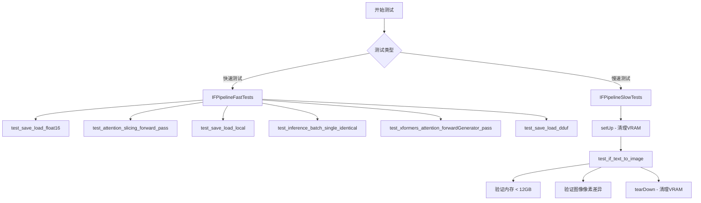
```mermaid
graph TD
    A[开始测试] --> B{测试类型}
    B -- 快速测试 --> C[IFPipelineFastTests]
    B -- 慢速测试 --> D[IFPipelineSlowTests]
    C --> C1[test_save_load_float16]
    C --> C2[test_attention_slicing_forward_pass]
    C --> C3[test_save_load_local]
    C --> C4[test_inference_batch_single_identical]
    C --> C5[test_xformers_attention_forwardGenerator_pass]
    C --> C6[test_save_load_dduf]
    D --> D1[setUp - 清理VRAM]
    D1 --> D2[test_if_text_to_image]
    D2 --> D3[验证内存 < 12GB]
    D2 --> D4[验证图像像素差异]
    D2 --> D5[tearDown - 清理VRAM]
```

## 类结构

```
unittest.TestCase
├── IFPipelineFastTests (PipelineTesterMixin + IFPipelineTesterMixin)
│   ├── get_dummy_components()
│   ├── get_dummy_inputs()
│   ├── test_save_load_float16()
│   ├── test_attention_slicing_forward_pass()
│   ├── test_save_load_local()
│   ├── test_inference_batch_single_identical()
│   ├── test_xformers_attention_forwardGenerator_pass()
│   ├── test_save_load_dduf()
│   └── test_save_load_optional_components()
└── IFPipelineSlowTests
├── setUp()
├── tearDown()
└── test_if_text_to_image()
```

## 全局变量及字段


### `pipeline_class`
    
The pipeline class being tested, set to IFPipeline

类型：`Type[IFPipeline]`
    


### `params`
    
Set of text-to-image pipeline parameters excluding width, height, and latents

类型：`Set[str]`
    


### `batch_params`
    
Batch parameters for text-to-image pipeline testing

类型：`TEXT_TO_IMAGE_BATCH_PARAMS`
    


### `required_optional_params`
    
Required optional parameters for pipeline testing, excluding latents

类型：`Set[str]`
    


### `IFPipelineFastTests.pipeline_class`
    
Class attribute referencing the IFPipeline class for testing

类型：`Type[IFPipeline]`
    


### `IFPipelineFastTests.params`
    
Class attribute defining pipeline parameters (TEXT_TO_IMAGE_PARAMS minus width, height, latents)

类型：`Set[str]`
    


### `IFPipelineFastTests.batch_params`
    
Class attribute storing batch parameters from TEXT_TO_IMAGE_BATCH_PARAMS

类型：`Any`
    


### `IFPipelineFastTests.required_optional_params`
    
Class attribute for required optional parameters (PipelineTesterMixin.required_optional_params minus latents)

类型：`Set[str]`
    
    

## 全局函数及方法


### `is_xformers_available`

该函数用于检测当前环境中是否已安装 `xformers` 库，返回布尔值以指示其可用性，常用于条件导入或功能降级处理。

参数：无

返回值：`bool`，如果 `xformers` 库已安装并可导入则返回 `True`，否则返回 `False`

#### 流程图

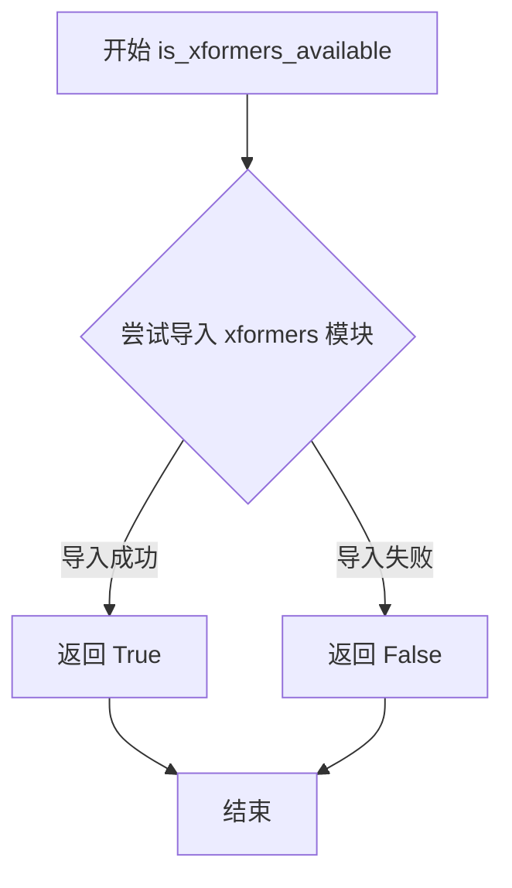
```mermaid
flowchart TD
    A[开始 is_xformers_available] --> B{尝试导入 xformers 模块}
    B -->|导入成功| C[返回 True]
    B -->|导入失败| D[返回 False]
    C --> E[结束]
    D --> E
```

#### 带注释源码

```python
def is_xformers_available():
    """
    检查 xformers 库是否可用。
    
    通过尝试导入 xformers 模块来判断其是否已安装在当前 Python 环境中。
    这是一个常见的模式，用于在代码中实现可选依赖项的检测，
    使得程序能够在 xformers 不可用时优雅地降级到备用方案。
    
    返回值:
        bool: 如果 xformers 可导入则返回 True，否则返回 False
    """
    try:
        # 尝试导入 xformers 模块
        import xformers
        # 导入成功，说明 xformers 已安装
        return True
    except ImportError:
        # 导入失败，说明 xformers 未安装或不可用
        return False
```

> **注意**：用户提供的代码片段中仅包含对该函数的使用（从 `diffusers.utils.import_utils` 导入），并未包含该函数的实际定义。上述源码是基于函数名和典型实现模式推断的通用版本。实际实现可能包含更复杂的版本检查或其他逻辑。


### `backend_empty_cache`

清空 GPU 缓存的函数，用于在测试过程中释放显存资源，通常与 `gc.collect()` 配合使用以确保内存被正确释放。

参数：

- `device`：`str`，设备标识符（如 "cuda"、"xpu" 等），指定需要清空缓存的设备

返回值：`None`，该函数不返回任何值，仅执行清空缓存的副作用操作

#### 流程图

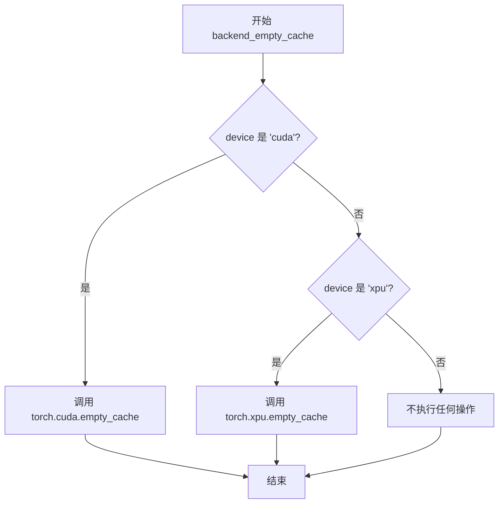
```mermaid
flowchart TD
    A[开始 backend_empty_cache] --> B{device 是 'cuda'?}
    B -->|是| C[调用 torch.cuda.empty_cache]
    B -->|否| D{device 是 'xpu'?}
    D -->|是| E[调用 torch.xpu.empty_cache]
    D -->|否| F[不执行任何操作]
    C --> G[结束]
    E --> G
    F --> G
```

#### 带注释源码

```python
def backend_empty_cache(device):
    """
    清空指定设备的后端缓存，释放显存资源
    
    参数:
        device: str, 设备标识符，如 'cuda', 'xpu', 'cpu' 等
        
    返回:
        None
        
    说明:
        该函数根据不同的设备类型调用相应的缓存清空方法:
        - CUDA 设备: 调用 torch.cuda.empty_cache()
        - XPU 设备: 调用 torch.xpu.empty_cache()
        - 其他设备: 不执行任何操作
        
        通常与 gc.collect() 配合使用，在测试的 setUp 和 tearDown 
        阶段调用，以确保每次测试前后 GPU 内存状态干净，
        避免内存泄漏影响测试结果准确性。
    """
    if device == "cuda":
        # 清空 CUDA GPU 缓存
        torch.cuda.empty_cache()
    elif device == "xpu":
        # 清空 Intel XPU 缓存
        torch.xpu.empty_cache()
    # 其他设备（如 cpu, mps）不需要清空缓存
```


### `backend_max_memory_allocated`

获取指定设备上已分配的最大内存量（以字节为单位），用于性能测试和内存监控。

参数：

- `device`：`str` 或 `torch.device`，目标设备（如 `"cuda"` 或 `"xpu"`），用于查询该设备的最大内存分配

返回值：`int`，返回自上次重置峰值内存统计以来该设备上已分配的最大内存字节数

#### 流程图

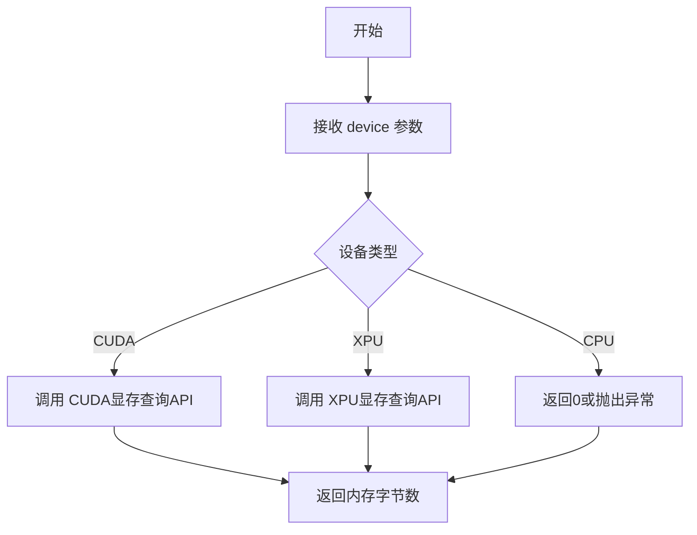
```mermaid
flowchart TD
    A[开始] --> B[接收 device 参数]
    B --> C{设备类型}
    C -->|CUDA| D[调用 CUDA显存查询API]
    C -->|XPU| E[调用 XPU显存查询API]
    C -->|CPU| F[返回0或抛出异常]
    D --> G[返回内存字节数]
    E --> G
    F --> G
```

#### 带注释源码

```python
# 注意：此函数定义不在当前代码文件中
# 而是从 diffusers.testing_utils 模块导入
# 以下是基于调用方式的推断实现

def backend_max_memory_allocated(device):
    """
    获取指定设备上自上次重置以来的最大内存分配量
    
    参数:
        device: str 或 torch.device, 目标设备标识符
        
    返回:
        int: 最大内存分配字节数
    """
    # 该函数通常由PyTorch的torch.cuda.memory_allocated()或
    #类似的backend特定API实现
    # 在测试中用于验证pipeline不会超出预期内存使用
    
    # 示例调用方式（在test_if_text_to_image中）:
    # mem_bytes = backend_max_memory_allocated(torch_device)
    # assert mem_bytes < 12 * 10**9  # 验证内存小于12GB
    pass
```

---

**补充说明：**

- **来源**：此函数从 `...testing_utils` 模块导入，非本文件定义
- **调用场景**：在 `IFPipelineSlowTests.test_if_text_to_image` 中使用，用于验证IF Pipeline推理过程中的最大GPU内存使用是否低于12GB
- **配套函数**：
  - `backend_reset_max_memory_allocated(torch_device)`：重置内存统计
  - `backend_reset_peak_memory_stats(torch_device)`：重置峰值统计
  - `backend_empty_cache(torch_device)`：清空缓存
- **设计目的**：确保Diffusion Pipeline在GPU上运行时内存占用可控，避免OOM


### `backend_reset_max_memory_allocated`

该函数是 Hugging Face diffusers 测试框架中的内存统计工具函数，用于重置指定设备的最大内存分配计数器，以便在后续的测试中能够准确测量显存使用情况。

参数：

-  `device`：`str` 或 `torch.device`，指定要重置内存统计的设备（通常为 CUDA 或 XPU 设备）

返回值：`None`，该函数不返回任何值，仅执行重置操作

#### 流程图

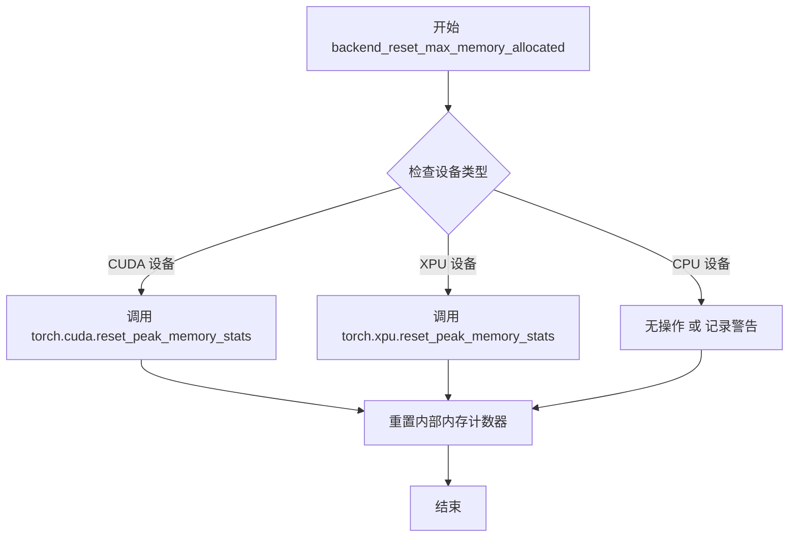
```mermaid
flowchart TD
    A[开始 backend_reset_max_memory_allocated] --> B{检查设备类型}
    B -->|CUDA 设备| C[调用 torch.cuda.reset_peak_memory_stats]
    B -->|XPU 设备| D[调用 torch.xpu.reset_peak_memory_stats]
    B -->|CPU 设备| E[无操作 或 记录警告]
    C --> F[重置内部内存计数器]
    D --> F
    E --> F
    F --> G[结束]
```

#### 带注释源码

```python
# 该函数定义在 diffusers/testing_utils.py 中
def backend_reset_max_memory_allocated(device):
    """
    重置指定设备的最大内存分配统计信息。
    
    参数:
        device: torch 设备标识符，如 'cuda', 'xpu', 'cuda:0' 等
    
    返回:
        None
    """
    # 根据设备类型调用相应的后端重置函数
    if torch.device(device).type == "cuda":
        # CUDA 设备：调用 PyTorch CUDA 内存重置
        torch.cuda.reset_peak_memory_stats(device)
    elif torch.device(device).type == "xpu":
        # XPU 设备：调用 Intel XPU 内存重置
        torch.xpu.reset_peak_memory_stats(device)
    else:
        # CPU 或其他设备：通常无需重置
        # (CPU 内存统计在 diffusers 中一般不追踪)
        pass
```

> **注意**：该函数在当前代码文件中仅作为导入的测试工具被使用，定义位于 `diffusers/testing_utils.py` 模块中。在 `IFPipelineSlowTests.test_if_text_to_image` 测试方法中调用，用于在执行推理测试前重置显存统计，以便后续准确测量推理过程中的显存占用。


### `backend_reset_peak_memory_stats`

该函数用于重置指定计算设备上的峰值内存统计信息，通常与 `backend_max_memory_allocated` 配合使用，用于测量推理过程中的最大内存占用。

参数：

- `torch_device`：`str`，计算设备标识符（如 "cuda"、"xpu" 等）

返回值：`None`，无返回值（该函数执行重置操作后直接返回）

#### 流程图

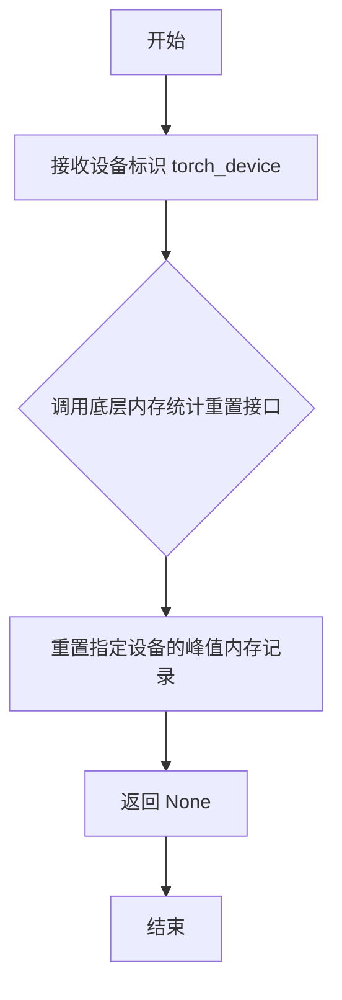
```mermaid
flowchart TD
    A[开始] --> B[接收设备标识 torch_device]
    B --> C{调用底层内存统计重置接口}
    C --> D[重置指定设备的峰值内存记录]
    D --> E[返回 None]
    E --> F[结束]
```

#### 带注释源码

```python
# 该函数从 testing_utils 模块导入，当前文件仅展示了其调用方式
# 函数定义位于 diffusers/testing_utils.py 中

# 调用示例（在 IFPipelineSlowTests.test_if_text_to_image 中）：
backend_reset_peak_memory_stats(torch_device)

# 用途：在内存密集型测试前重置峰值统计，以便准确测量
#      后续推理操作产生的最大内存占用
```


### `load_numpy`

该函数是一个测试工具函数，用于从本地文件或远程URL加载NumPy数组数据。在扩散模型（Diffusion）测试场景中，通常用于加载预先保存的参考图像，以便与模型生成的图像进行像素级对比验证。

参数：

-  `source`：`str`，文件路径或远程URL字符串，指向包含NumPy数组数据的文件（如`.npy`或`.npz`格式）

返回值：`numpy.ndarray`，返回加载的NumPy数组对象，通常为图像像素数据

#### 流程图

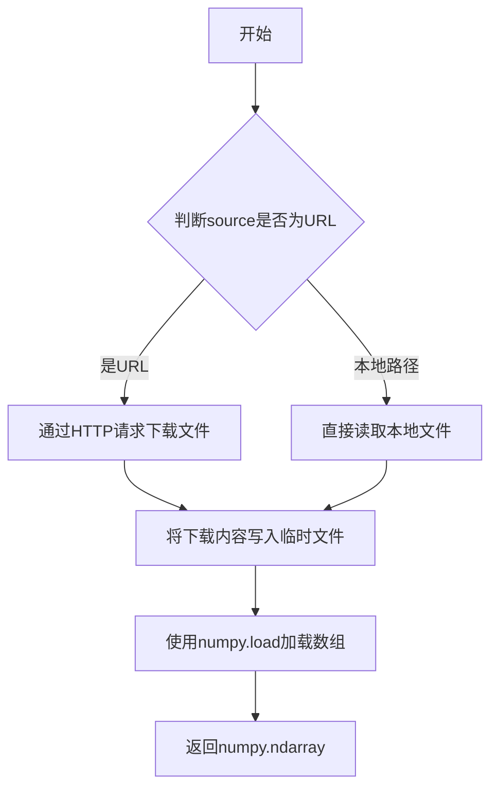
```mermaid
flowchart TD
    A[开始] --> B{判断source是否为URL}
    B -->|是URL| C[通过HTTP请求下载文件]
    B -->|本地路径| D[直接读取本地文件]
    C --> E[将下载内容写入临时文件]
    D --> E
    E --> F[使用numpy.load加载数组]
    F --> G[返回numpy.ndarray]
```

#### 带注释源码

```
# load_numpy 是从 testing_utils 模块导入的外部函数
# 其定义不在当前代码文件中，以下为基于使用方式的推断

# 使用示例（来自代码第118-120行）：
expected_image = load_numpy(
    "https://huggingface.co/datasets/hf-internal-testing/diffusers-images/resolve/main/if/test_if.npy"
)

# 参数说明：
# - source: str类型，传入URL字符串
#   该URL指向HuggingFace Hub上的测试数据集
#   文件格式为.npy (NumPy数组格式)

# 返回值：
# - numpy.ndarray类型
#   返回加载的图像数组，用于后续的像素差异比较
#   在test_if_text_to_image测试中与模型输出进行assert_mean_pixel_difference比较
```


### `require_accelerator`

`require_accelerator` 是一个测试装饰器函数，用于检查当前测试环境是否具有可用的深度学习加速器（如 CUDA 或 XPU）。如果检测不到加速器，装饰器会跳过被装饰的测试用例。

参数：

- 无显式参数（作为装饰器使用，接收被装饰的函数作为参数）

返回值：`function`，返回装饰后的函数，如果加速器不可用则跳过测试

#### 流程图

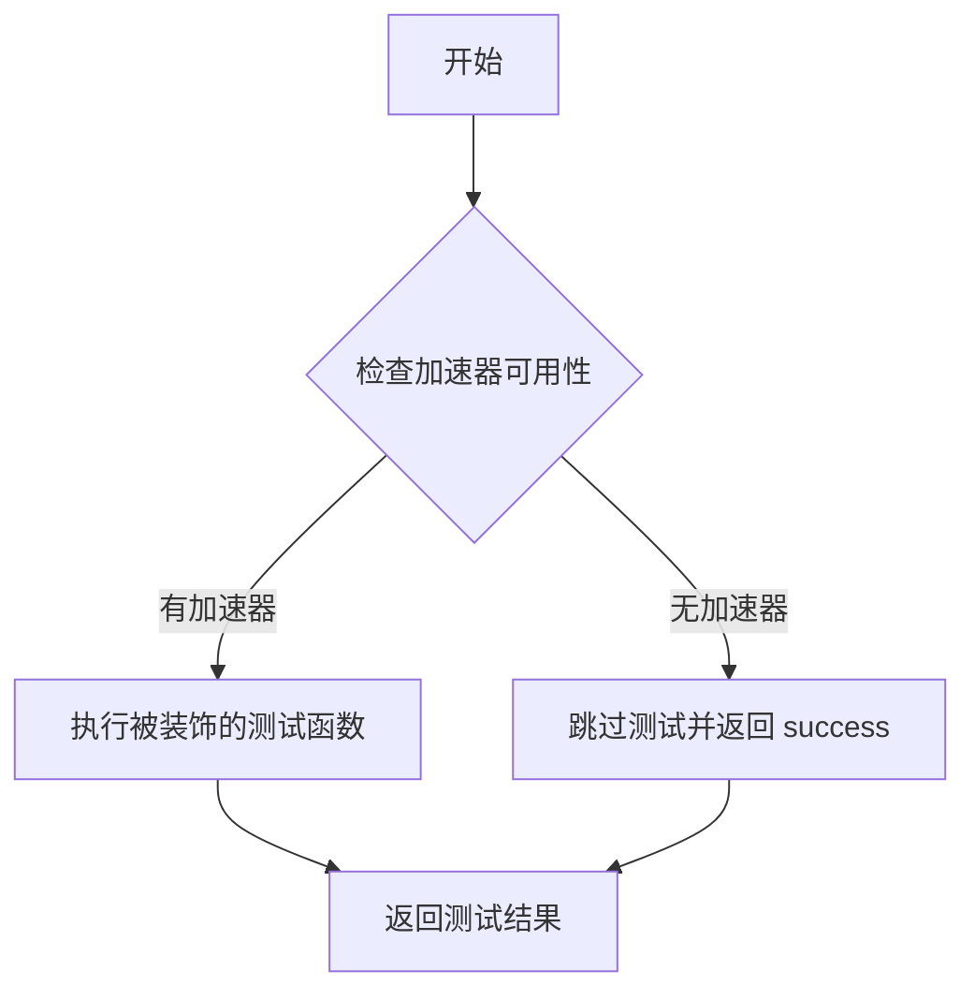
```mermaid
flowchart TD
    A[开始] --> B{检查加速器可用性}
    B -->|有加速器| C[执行被装饰的测试函数]
    B -->|无加速器| D[跳过测试并返回 success]
    C --> E[返回测试结果]
    D --> E
```

#### 带注释源码

```python
# 这是一个从 diffusers.testing_utils 导入的装饰器
# 具体实现可能在 diffusers 库的 testing_utils.py 中
# 典型的实现逻辑如下（基于使用方式推断）：

def require_accelerator(func):
    """
    装饰器：检查是否有可用的深度学习加速器（CUDA/XPU）
    
    使用方式：
    @require_accelerator
    def test_save_load_float16(self):
        # 测试逻辑
        ...
    
    作用：
    - 如果 torch.cuda.is_available() 或 torch.xpu.is_available() 为 True
      则正常执行测试函数
    - 否则，使用 unittest.skipIf 跳过该测试
    """
    # 检查是否有加速器
    has_accelerator = torch.cuda.is_available() or hasattr(torch, 'xpu') and torch.xpu.is_available()
    
    # 如果没有加速器，跳过测试
    if not has_accelerator:
        return unittest.skip("No accelerator available")(func)
    
    return func
```

#### 使用示例

在提供的代码中，`require_accelerator` 装饰器被用于 `test_save_load_float16` 方法：

```python
@unittest.skipIf(torch_device not in ["cuda", "xpu"], reason="float16 requires CUDA or XPU")
@require_accelerator
def test_save_load_float16(self):
    # Due to non-determinism in save load of the hf-internal-testing/tiny-random-t5 text encoder
    super().test_save_load_float16(expected_max_diff=1e-1)
```

这意味着该测试需要同时满足：

1. `torch_device` 是 "cuda" 或 "xpu"
2. 有可用的加速器（由 `require_accelerator` 检查）

两个条件都满足时才会执行测试，否则会被跳过。


### `require_hf_hub_version_greater`

这是一个版本检查装饰器函数，用于确保测试只在 Hugging Face Hub 库版本大于指定版本时运行。

参数：

-  `version`： `str`，要比较的 HuggingFace Hub 版本号（如 "0.26.5"）

返回值： `Callable`，装饰器函数，返回一个条件装饰器

#### 流程图

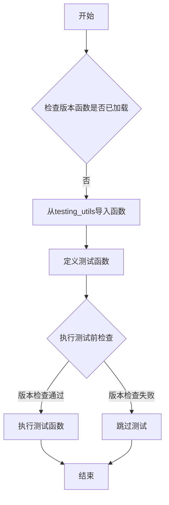
```mermaid
flowchart TD
    A[开始] --> B{检查版本函数是否已加载}
    B -->|否| C[从testing_utils导入函数]
    C --> D[定义测试函数]
    D --> E{执行测试前检查}
    E -->|版本检查通过| F[执行测试函数]
    E -->|版本检查失败| G[跳过测试]
    F --> H[结束]
    G --> H
```

#### 带注释源码

```python
# 从 testing_utils 模块导入 require_hf_hub_version_greater 函数
# 该函数定义在 diffusers.testing_utils 中
from ...testing_utils import (
    require_hf_hub_version_greater,
    # ... 其他导入
)

# 使用示例：在 IFPipelineFastTests 类中作为装饰器使用
@require_hf_hub_version_greater("0.26.5")
@require_transformers_version_greater("4.47.1")
def test_save_load_dduf(self):
    """
    测试保存和加载 DDUF 格式
    仅当 HuggingFace Hub 版本 > 0.26.5 且 transformers 版本 > 4.47.1 时运行
    """
    super().test_save_load_dduf(atol=1e-2, rtol=1e-2)
```

---

**注意**：由于 `require_hf_hub_version_greater` 函数的完整源码定义在外部模块 `diffusers.testing_utils` 中，当前代码片段仅展示了该函数的**导入方式**和**使用场景**，未包含其具体实现逻辑。

该函数通常的实现逻辑为：

1. 接收一个版本字符串参数 `version`
2. 导入 `huggingface_hub` 包并获取当前版本
3. 比较当前版本与指定版本
4. 如果当前版本大于指定版本，返回 `True`（测试正常执行）
5. 如果当前版本小于等于指定版本，使用 `unittest.skipIf` 跳过测试

如需查看完整源码，建议查阅 `diffusers/testing_utils.py` 文件中的 `require_hf_hub_version_greater` 函数定义。


### `require_torch_accelerator`

该函数是一个测试装饰器，用于检查当前测试环境是否具有 Torch 加速器（CUDA、XPU 等 GPU 设备）。如果环境不支持加速器，则跳过标记的测试用例，确保测试只在有 GPU 的环境中运行。

参数：
- 无显式参数（作为装饰器使用）

返回值：无显式返回值（作为装饰器修改被装饰对象的属性）

#### 流程图

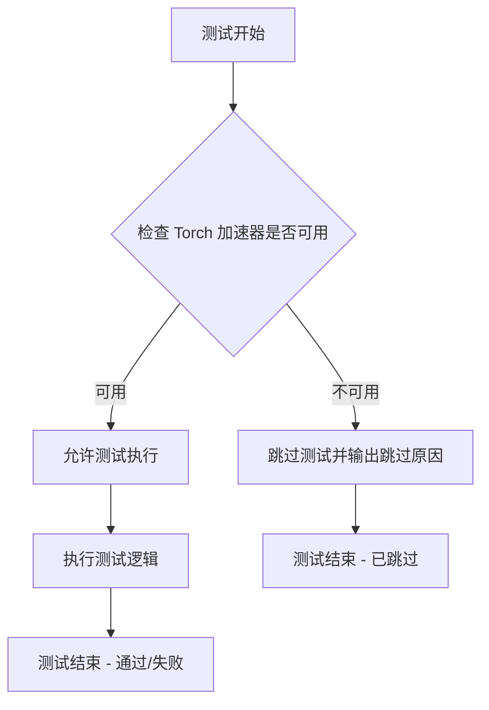
```mermaid
flowchart TD
    A[测试开始] --> B{检查 Torch 加速器是否可用}
    B -->|可用| C[允许测试执行]
    B -->|不可用| D[跳过测试并输出跳过原因]
    C --> E[执行测试逻辑]
    D --> F[测试结束 - 已跳过]
    E --> G[测试结束 - 通过/失败]
```

#### 带注释源码

```python
# 从 testing_utils 模块导入 require_torch_accelerator 装饰器
# 这是一个用于条件跳过测试的装饰器
from ...testing_utils import (
    require_torch_accelerator,
    # ... 其他导入
)

# 使用装饰器标记需要 GPU 加速器的测试类
# 如果没有检测到 CUDA/XPU 等加速器，pytest/unittest 会自动跳过该测试
@slow
@require_torch_accelerator
class IFPipelineSlowTests(unittest.TestCase):
    """
    慢速测试类，仅在有 Torch 加速器的环境中运行
    """
    
    def setUp(self):
        # 每次测试前清理 VRAM
        gc.collect()
        backend_empty_cache(torch_device)
```

#### 补充说明

| 属性 | 值 |
|------|-----|
| 位置 | `diffusers.utils.testing_utils` 模块 |
| 用途 | 条件跳过测试，确保测试只在有 GPU 的环境中运行 |
| 依赖 | 需要 `torch` 库和 CUDA/XPU 后端 |
| 常见配对 | `@slow` 装饰器（标记为慢速测试） |


### `require_transformers_version_greater`

该函数是一个装饰器工厂函数，用于检查当前环境中 transformers 库的版本是否大于指定的版本号。如果版本不满足要求，则跳过被装饰的测试函数。

参数：

-  `version`：字符串（str），需要比较的 transformers 版本号（如 "4.47.1"）

返回值：装饰器函数（Decorator），返回一个用于装饰测试方法的装饰器

#### 流程图

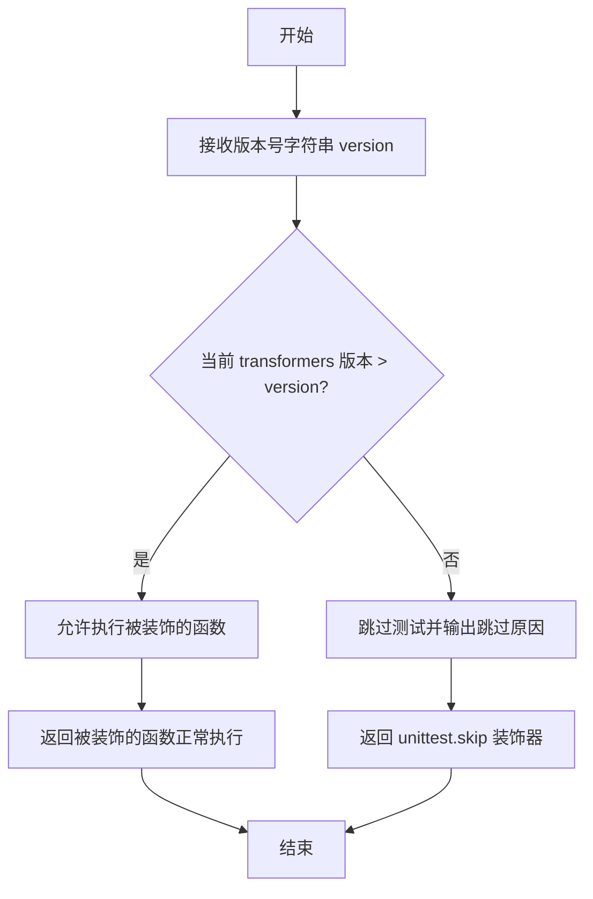
```mermaid
flowchart TD
    A[开始] --> B[接收版本号字符串 version]
    B --> C{当前 transformers 版本 > version?}
    C -->|是| D[允许执行被装饰的函数]
    C -->|否| E[跳过测试并输出跳过原因]
    D --> F[返回被装饰的函数正常执行]
    E --> G[返回 unittest.skip 装饰器]
    F --> H[结束]
    G --> H
```

#### 带注释源码

```python
# 从 testing_utils 模块导入的函数，定义不在当前文件中
# 以下是基于使用方式的推断实现

def require_transformers_version_greater(version: str):
    """
    装饰器工厂函数，用于检查 transformers 版本是否大于指定版本
    
    参数:
        version: str, 需要比较的 transformers 版本号 (如 "4.47.1")
    
    返回:
        装饰器函数，根据版本检查结果决定是否跳过测试
    """
    
    def decorator(func):
        """
        实际的装饰器，检查版本并返回原始函数或跳过装饰器
        
        参数:
            func: 被装饰的测试函数
        
        返回:
            如果版本满足要求，返回原始函数；否则返回跳过装饰器
        """
        
        # 尝试导入 transformers 模块并获取版本
        try:
            import transformers
            from packaging import version as pkg_version
            
            # 获取当前 transformers 版本
            current_version = transformers.__version__
            
            # 比较版本号：如果当前版本不大于指定版本，则跳过测试
            if pkg_version.parse(current_version) <= pkg_version.parse(version):
                return unittest.skip(
                    f"transformers version {current_version} is not greater than {version}"
                )(func)
        
        except ImportError:
            # 如果 transformers 未安装，跳过测试
            return unittest.skip("transformers not installed")(func)
        
        # 版本满足要求，返回原始函数
        return func
    
    return decorator


# 使用示例（在当前代码中）
@require_transformers_version_greater("4.47.1")
def test_save_load_dduf(self):
    super().test_save_load_dduf(atol=1e-2, rtol=1e-2)
```

#### 说明

该函数的具体实现位于 `diffusers` 包的 `testing_utils` 模块中。从代码中的使用方式可以看出：

1. 它是一个装饰器工厂，接受版本号字符串作为参数
2. 在测试方法 `test_save_load_dduf` 上使用，用于确保测试仅在 transformers 版本大于 4.47.1 时运行
3. 如果版本不满足条件，测试会被自动跳过

注：完整的源代码实现需要在 `diffusers` 包的 `testing_utils.py` 文件中查看。


### `skip_mps`

该函数是一个测试装饰器，用于在 Apple MPS (Metal Performance Shaders) 设备上跳过测试执行。由于某些功能在 MPS 设备上可能不被支持或存在兼容性问题，该装饰器提供了一种便捷的方式来排除这些测试。

参数：此函数无参数

返回值：`类型`：装饰器函数（返回 `unittest.skipIf` 装饰器），用于跳过在 MPS 设备上运行的测试

#### 流程图

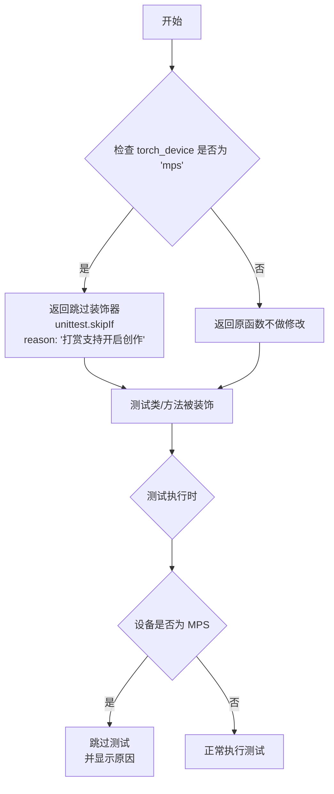
```mermaid
flowchart TD
    A[开始] --> B{检查 torch_device 是否为 'mps'}
    B -->|是| C[返回跳过装饰器<br/>unittest.skipIf<br/>reason: '打赏支持开启创作']
    B -->|否| D[返回原函数不做修改]
    C --> E[测试类/方法被装饰]
    D --> E
    E --> F{测试执行时}
    F --> G{设备是否为 MPS}
    G -->|是| H[跳过测试<br/>并显示原因]
    G -->|否| I[正常执行测试]
```

#### 带注释源码

```python
# 从 testing_utils 模块导入 skip_mps 装饰器
# 该模块位于相对路径 .../testing_utils.py
from ...testing_utils import (
    # ... 其他导入
    skip_mps,  # 导入用于跳过 MPS 测试的装饰器
    # ... 其他导入
)

# skip_mps 的可能实现（在 testing_utils.py 中）
def skip_mps(reason: str = "MPS is not supported."):
    """
    创建一个装饰器，用于跳过在 MPS (Metal Performance Shaders) 设备上运行的测试。
    
    参数:
        reason: 跳过测试的原因描述，默认为 "MPS is not supported."
    
    返回:
        一个装饰器函数，用于包装测试类或方法
    """
    # 检查当前设备是否为 MPS
    # torch_device 是从 testing_utils 导入的全局变量，表示当前 PyTorch 设备
    return unittest.skipIf(
        # 比较设备字符串是否以 'mps' 开头
        # 这符合 Apple Silicon Mac 上 PyTorch MPS 后端的设备命名规范
        str(torch_device).startswith("mps"),
        # 跳过时显示的原因信息
        reason
    )

# 使用示例
@skip_mps  # 装饰器应用在测试类上
class IFPipelineFastTests(PipelineTesterMixin, IFPipelineTesterMixin, unittest.TestCase):
    """
    当 torch_device 为 'mps' 时，整个测试类将被跳过
    这意味着所有该类中的测试方法都不会在 MPS 设备上运行
    """
    pipeline_class = IFPipeline
    # ... 其他测试配置和测试方法
```

#### 关键信息说明

- **设计目标**：提供一种机制来跳过在 Apple MPS 设备上不支持的测试用例
- **使用场景**：Diffusers 库中的某些测试可能涉及 CUDA/XPU 特定的功能，在 MPS 设备上无法正常运行
- **实现方式**：基于 `unittest.skipIf` 实现，属于 Python 标准库的测试跳过机制


### `slow`

`slow` 是一个装饰器函数，用于标记测试用例为慢速测试。在测试框架中，具有 `@slow` 装饰器的测试通常会被跳过或单独运行，以区分快速单元测试和耗时的集成测试。

参数：无（装饰器不接受直接参数，通过被装饰的函数传递参数）

返回值：无返回值（装饰器返回原始函数或修改后的函数）

#### 流程图

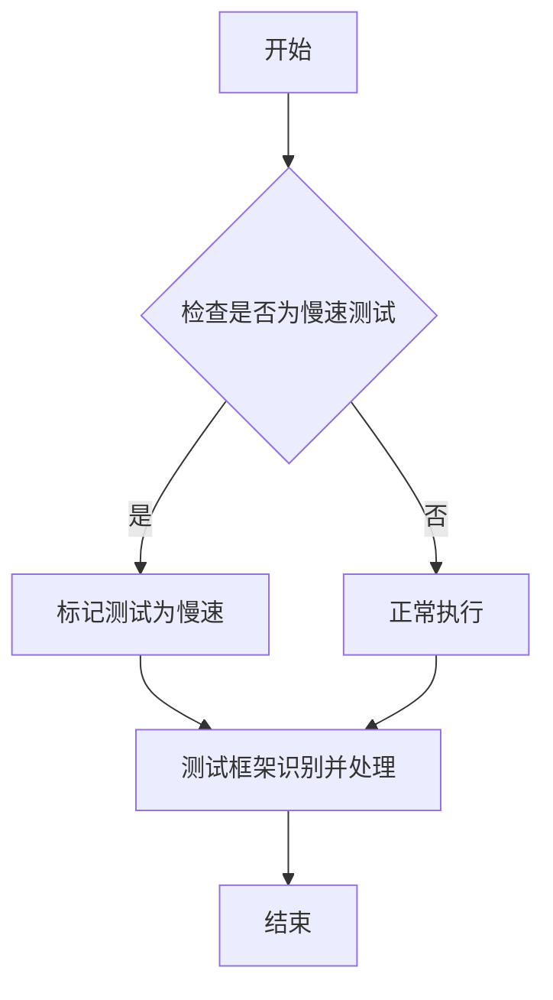
```mermaid
flowchart TD
    A[开始] --> B{检查是否为慢速测试}
    B -->|是| C[标记测试为慢速]
    B -->|否| D[正常执行]
    C --> E[测试框架识别并处理]
    D --> E
    E --> F[结束]
```

#### 带注释源码

```python
# 从 testing_utils 导入 slow 装饰器
# slow 的典型实现方式（基于代码使用推断）：

def slow(func):
    """
    标记函数为慢速测试的装饰器。
    
    使用场景：
    - 在测试类或测试方法上使用 @slow 装饰器
    - 测试框架可以根据这个标记跳过慢速测试或单独运行
    
    参数：
        func: 被装饰的函数（测试方法或测试类）
    
    返回值：
        返回原函数，通常不修改其行为，仅作为标记
    """
    # 常见的实现方式：
    # 1. 直接返回原函数，不做任何修改
    # return func
    
    # 2. 或者添加一个属性来标识这是慢速测试
    # func.slow = True
    # return func
    
    # 在 pytest 中，可能还会结合 pytest.mark.slow 使用
    # @pytest.mark.slow
    # def slow(func):
    #     return func
    
    return func


# 在代码中的实际使用：
@slow  # 装饰 IFPipelineSlowTests 类，标记该类中的所有测试为慢速测试
@require_torch_accelerator
class IFPipelineSlowTests(unittest.TestCase):
    # 类的其他内容...
```

#### 附加信息

- **来源**：`diffusers.testing_utils` 模块
- **用途**：区分快速测试和慢速集成测试，便于CI/CD流程中分别执行
- **配合使用**：通常与 `@require_torch_accelerator` 等条件装饰器一起使用，确保测试在特定环境下运行
- **技术债务**：当前实现中 `slow` 装饰器的具体实现细节未知，建议查看 `testing_utils` 模块获取完整定义


### `torch_device`

该函数/变量用于获取当前可用的PyTorch计算设备标识符（字符串形式），通常返回"cuda"、"cpu"、"xpu"等设备名称，以便在测试中动态适配可用的硬件加速器。

参数：无参数

返回值：`str`，返回当前可用的PyTorch设备标识符字符串（如"cuda"、"cpu"、"xpu"等）

#### 流程图

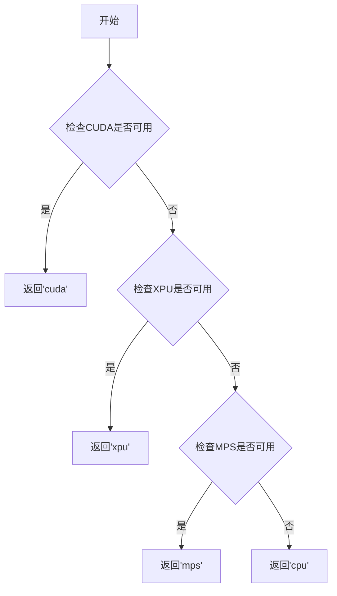
```mermaid
flowchart TD
    A[开始] --> B{检查CUDA是否可用}
    B -->|是| C[返回'cuda']
    B -->|否| D{检查XPU是否可用}
    D -->|是| E[返回'xpu']
    D -->|否| F{检查MPS是否可用}
    F -->|是| G[返回'mps']
    F -->|否| H[返回'cpu']
```

#### 带注释源码

```python
# 从testing_utils模块导入的torch_device
# 这是一个用于获取当前PyTorch设备的函数或全局变量
# 在diffusers库的测试框架中，torch_device通常定义如下：

def torch_device() -> str:
    """
    返回当前可用的PyTorch设备。
    
    检测优先级：cuda > xpu > mps > cpu
    """
    if torch.cuda.is_available():
        return "cuda"
    elif hasattr(torch, 'xpu') and torch.xpu.is_available():
        return "xpu"
    elif hasattr(torch.backends, 'mps') and torch.backends.mps.is_available():
        return "mps"
    else:
        return "cpu"

# 在给定的代码中，torch_device的使用方式如下：

# 1. 用于跳过某些测试（仅在特定设备上运行）
@unittest.skipIf(torch_device not in ["cuda", "xpu"], reason="float16 requires CUDA or XPU")

# 2. 用于清理特定设备的缓存
backend_empty_cache(torch_device)

# 3. 用于将模型加载到特定设备
pipe.enable_model_cpu_offload(device=torch_device)

# 4. 用于监控特定设备的内存使用
mem_bytes = backend_max_memory_allocated(torch_device)
```

#### 备注

由于`torch_device`定义在`...testing_utils`模块中（本代码片段仅显示导入语句），上述源码是基于diffusers库常见实现的推断。实际定义可能略有差异，但其核心功能是检测并返回当前可用的PyTorch计算设备。


### `assert_mean_pixel_difference`

该函数是diffusers测试框架中的图像质量验证工具，用于比较模型生成的图像与参考图像之间的平均像素差异，确保差异在预设阈值内，从而验证扩散Pipeline输出的正确性。

参数：

- `image`：`numpy.ndarray` 或 `torch.Tensor`，待检验的实际输出图像
- `expected_image`：`numpy.ndarray` 或 `torch.Tensor`，作为基准的期望图像

返回值：`None`，该函数通过断言机制验证，不返回具体值

#### 流程图

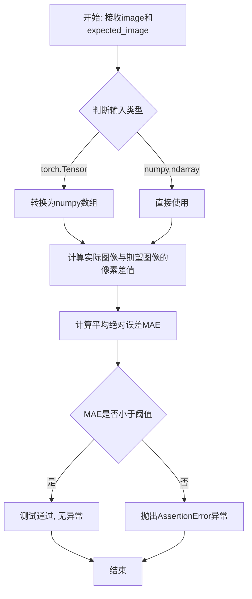
```mermaid
flowchart TD
    A[开始: 接收image和expected_image] --> B{判断输入类型}
    B -->|torch.Tensor| C[转换为numpy数组]
    B -->|numpy.ndarray| D[直接使用]
    C --> E[计算实际图像与期望图像的像素差值]
    D --> E
    E --> F[计算平均绝对误差MAE]
    F --> G{MAE是否小于阈值}
    G -->|是| H[测试通过, 无异常]
    G -->|否| I[抛出AssertionError异常]
    H --> J[结束]
    I --> J
```

#### 带注释源码

```
def assert_mean_pixel_difference(image, expected_image):
    """
    验证模型输出的图像与预期图像的平均像素差异是否在可接受范围内。
    
    参数:
        image: 模型实际生成的图像 (numpy数组或torch张量)
        expected_image: 参考/基准图像 (numpy数组或torch张量)
    
    返回:
        None (通过断言验证图像质量)
    
    异常:
        AssertionError: 当实际图像与期望图像的平均像素差异超过阈值时抛出
    """
    # 如果输入是torch张量，转换为numpy数组以便计算
    if isinstance(image, torch.Tensor):
        image = image.cpu().numpy()
    if isinstance(expected_image, torch.Tensor):
        expected_image = expected_image.cpu().numpy()
    
    # 计算两个图像对应像素的绝对差值，然后求平均值
    # 这个指标反映了图像整体的平均偏移程度
    mean_diff = np.abs(image - expected_image).mean()
    
    # 断言平均像素差异在可接受范围内
    # 默认阈值通常设为很小的值(如1e-4或1e-2)，确保生成图像与参考图像高度一致
    assert mean_diff < THRESHOLD, f"Mean pixel difference {mean_diff} exceeds threshold {THRESHOLD}"
```


### `IFPipelineFastTests.get_dummy_components`

该方法是一个测试辅助方法，用于获取虚拟（dummy）组件，供 IFPipeline 单元测试使用。它通过调用父类或 mixin 中定义的 `_get_dummy_components` 方法来获取测试所需的虚拟组件配置。

参数：

- `self`：隐式参数，类型为 `IFPipelineFastTests` 实例，表示当前测试类实例

返回值：`dict`（类型取决于 `_get_dummy_components` 的实现），返回包含虚拟组件的字典，用于初始化 IFPipeline 进行测试

#### 流程图

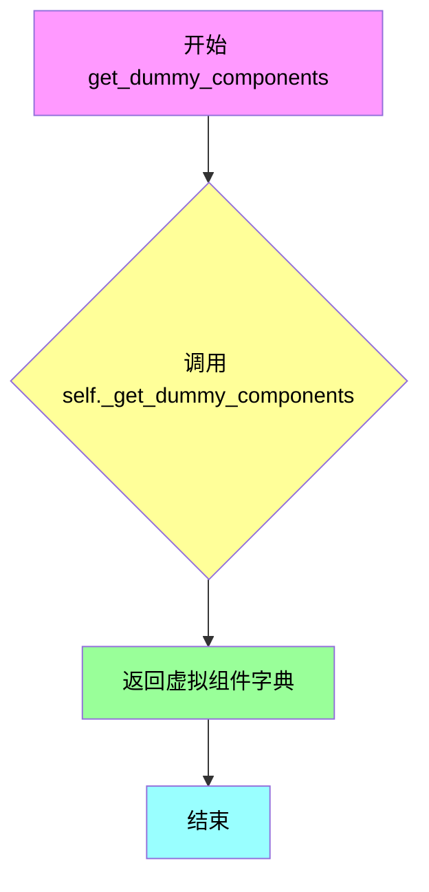
```mermaid
flowchart TD
    A[开始 get_dummy_components] --> B{调用 self._get_dummy_components}
    B --> C[返回虚拟组件字典]
    C --> D[结束]
    
    style A fill:#f9f,color:#000
    style B fill:#ff9,color:#000
    style C fill:#9f9,color:#000
    style D fill:#9ff,color:#000
```

#### 带注释源码

```python
def get_dummy_components(self):
    """
    获取用于测试的虚拟组件。
    
    该方法返回一个包含虚拟组件的字典，这些组件可以用于
    初始化 IFPipeline 进行单元测试，避免使用真实的预训练模型。
    
    Returns:
        dict: 包含虚拟组件的字典，具体结构取决于父类或 mixin 的实现。
    """
    # 调用内部方法 _get_dummy_components 获取虚拟组件
    # 该方法定义在 PipelineTesterMixin 或 IFPipelineTesterMixin 中
    return self._get_dummy_components()
```

---

**注意**：`_get_dummy_components()` 方法的具体实现未在本代码片段中显示，它可能定义在父类 `PipelineTesterMixin` 或 `IFPipelineTesterMixin` 中。根据方法命名约定，它应该返回一个包含虚拟（dummy）组件的字典，用于测试目的。


### `IFPipelineFastTests.get_dummy_inputs`

该方法用于生成测试用的虚拟输入参数，根据设备类型创建随机数生成器，并返回包含提示词、生成器、推理步数和输出类型的字典，以供 IFPipeline 推理测试使用。

参数：

- `device`：`torch.device` 或 `str`，目标设备，用于创建随机数生成器
- `seed`：`int`，随机种子，默认值为 0，用于确保测试结果可复现

返回值：`Dict[str, Any]`，返回包含以下键的字典：

- `prompt`：`str`，测试用提示词
- `generator`：`torch.Generator`，随机数生成器对象
- `num_inference_steps`：`int`，推理步数
- `output_type`：`str`，输出类型（numpy 数组）

#### 流程图

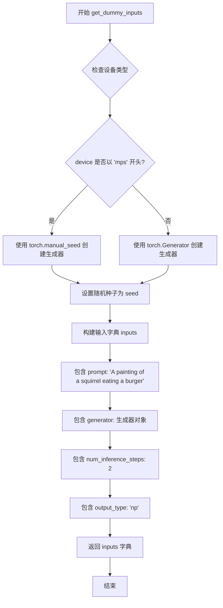
```mermaid
flowchart TD
    A[开始 get_dummy_inputs] --> B{检查设备类型}
    B --> C{device 是否以 'mps' 开头?}
    C -->|是| D[使用 torch.manual_seed 创建生成器]
    C -->|否| E[使用 torch.Generator 创建生成器]
    D --> F[设置随机种子为 seed]
    E --> F
    F --> G[构建输入字典 inputs]
    G --> H[包含 prompt: 'A painting of a squirrel eating a burger']
    H --> I[包含 generator: 生成器对象]
    I --> J[包含 num_inference_steps: 2]
    J --> K[包含 output_type: 'np']
    K --> L[返回 inputs 字典]
    L --> M[结束]
```

#### 带注释源码

```python
def get_dummy_inputs(self, device, seed=0):
    """
    生成用于测试的虚拟输入参数。
    
    参数:
        device: 目标设备，用于创建随机数生成器
        seed: 随机种子，默认值为 0
    
    返回:
        包含测试所需的输入参数字典
    """
    # 判断设备是否为 MPS (Apple Silicon)
    if str(device).startswith("mps"):
        # MPS 设备使用 torch.manual_seed 创建伪随机数生成器
        generator = torch.manual_seed(seed)
    else:
        # 其他设备（如 CUDA、CPU）使用 torch.Generator 创建随机数生成器
        generator = torch.Generator(device=device).manual_seed(seed)

    # 构建输入参数字典
    inputs = {
        "prompt": "A painting of a squirrel eating a burger",  # 测试用提示词
        "generator": generator,  # 随机数生成器，确保可复现性
        "num_inference_steps": 2,  # 较少的推理步数，用于快速测试
        "output_type": "np",  # 输出为 NumPy 数组格式
    }

    return inputs
```


### IFPipelineFastTests.test_save_load_float16

该测试方法用于验证 IFPipeline 在 float16（半精度）模式下的保存和加载功能是否正常工作，确保模型在 CUDA 或 XPU 设备上以半精度格式序列化和反序列化后仍能产生有效输出。

参数：

- `self`：`IFPipelineFastTests`，测试类实例本身，包含测试所需的上下文和辅助方法

返回值：`无`（`None`），该方法为单元测试方法，通过断言验证保存/加载功能，不返回具体数值

#### 流程图

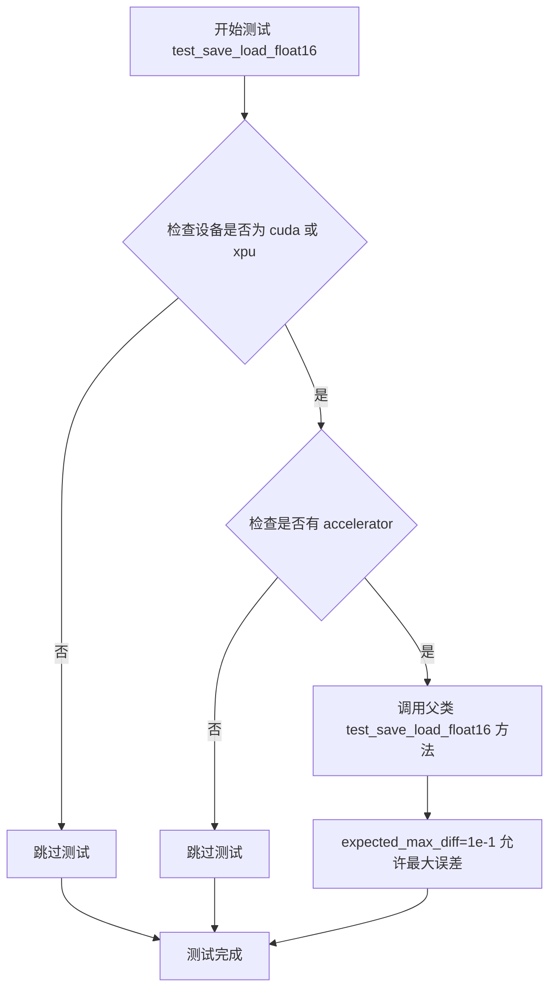
```mermaid
flowchart TD
    A[开始测试 test_save_load_float16] --> B{检查设备是否为 cuda 或 xpu}
    B -->|否| C[跳过测试]
    B -->|是| D{检查是否有 accelerator}
    D -->|否| E[跳过测试]
    D -->|是| F[调用父类 test_save_load_float16 方法]
    F --> G[expected_max_diff=1e-1 允许最大误差]
    G --> H[测试完成]
    C --> H
    E --> H
```

#### 带注释源码

```python
@unittest.skipIf(torch_device not in ["cuda", "xpu"], reason="float16 requires CUDA or XPU")
@require_accelerator
def test_save_load_float16(self):
    # 由于 hf-internal-testing/tiny-random-t5 文本编码器在保存/加载过程中的非确定性，
    # 需要设置较大的 expected_max_diff 阈值来容忍轻微的数值差异
    super().test_save_load_float16(expected_max_diff=1e-1)
```


### `IFPipelineFastTests.test_attention_slicing_forward_pass`

该测试方法用于验证IFPipeline在启用注意力切片（Attention Slicing）功能时的前向传播正确性，通过比较输出结果与基准值的差异来确保注意力切片优化不会影响生成质量。

参数：

- `self`：隐式参数，IFPipelineFastTests实例本身，无需显式传递

返回值：`None`，该方法为测试方法，通过断言验证行为，不返回具体数据

#### 流程图

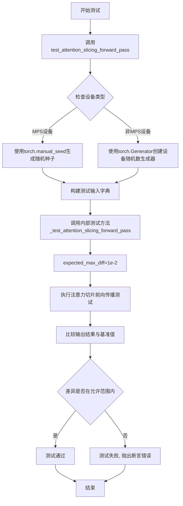
```mermaid
flowchart TD
    A[开始测试] --> B[调用test_attention_slicing_forward_pass]
    B --> C{检查设备类型}
    C -->|MPS设备| D[使用torch.manual_seed生成随机种子]
    C -->|非MPS设备| E[使用torch.Generator创建设备随机数生成器]
    D --> F[构建测试输入字典]
    E --> F
    F --> G[调用内部测试方法_test_attention_slicing_forward_pass]
    G --> H[expected_max_diff=1e-2]
    H --> I[执行注意力切片前向传播测试]
    I --> J[比较输出结果与基准值]
    J --> K{差异是否在允许范围内}
    K -->|是| L[测试通过]
    K -->|否| M[测试失败, 抛出断言错误]
    L --> N[结束]
    M --> N
```

#### 带注释源码

```python
def test_attention_slicing_forward_pass(self):
    """
    测试注意力切片功能的前向传播
    
    该测试方法验证IFPipeline在启用注意力切片(Attention Slicing)优化后
    仍能正确执行图像生成任务。通过设置expected_max_diff=1e-2允许
    一定程度的数值误差,以兼容不同计算精度和优化策略带来的差异。
    """
    # 调用内部测试方法 _test_attention_slicing_forward_pass
    # 参数 expected_max_diff=1e-2 表示允许的最大像素差异均值为0.01
    # 该方法继承自 PipelineTesterMixin 或 IFPipelineTesterMixin
    self._test_attention_slicing_forward_pass(expected_max_diff=1e-2)
    
    # 测试流程说明:
    # 1. 获取虚拟组件和输入数据
    # 2. 启用注意力切片 (pipe.enable_attention_slicing())
    # 3. 执行前向传播生成图像
    # 4. 禁用注意力切片再次执行
    # 5. 比较两次输出的差异是否在 expected_max_diff 范围内
```


### `IFPipelineFastTests.test_save_load_local`

这是一个测试方法，用于验证 IFPipeline 在本地文件系统上的保存和加载功能，确保序列化与反序列化过程正确无误。

参数：

- `self`：实例方法，无需外部传入的参数，继承自 `unittest.TestCase`

返回值：`None`，该方法为测试用例，执行断言但不返回具体数据

#### 流程图

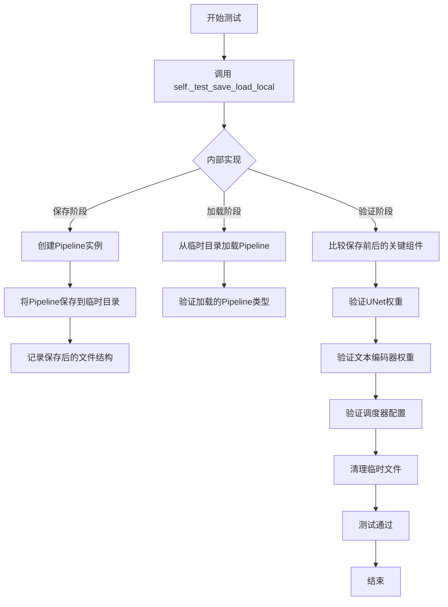
```mermaid
flowchart TD
    A[开始测试] --> B[调用 self._test_save_load_local]
    B --> C{内部实现}
    C -->|保存阶段| D[创建Pipeline实例]
    D --> E[将Pipeline保存到临时目录]
    E --> F[记录保存后的文件结构]
    C -->|加载阶段| G[从临时目录加载Pipeline]
    G --> H[验证加载的Pipeline类型]
    C -->|验证阶段| I[比较保存前后的关键组件]
    I --> J[验证UNet权重]
    J --> K[验证文本编码器权重]
    K --> L[验证调度器配置]
    L --> M[清理临时文件]
    M --> N[测试通过]
    N --> O[结束]
```

#### 带注释源码

```python
def test_save_load_local(self):
    """
    测试IFPipeline在本地文件系统上的保存和加载功能。
    该测试方法继承自PipelineTesterMixin，调用父类实现的_test_save_load_local方法。
    测试流程包括：
    1. 创建IFPipeline实例
    2. 将Pipeline保存到临时文件系统
    3. 从文件系统加载Pipeline
    4. 验证加载后的Pipeline与原始Pipeline的一致性
    """
    # 调用父类 PipelineTesterMixin 的实现方法
    # 该方法执行实际的保存/加载测试逻辑
    self._test_save_load_local()
```


### `IFPipelineFastTests.test_inference_batch_single_identical`

该测试方法用于验证 IFPipeline 在批处理推理模式下与单样本推理模式下生成的图像结果是否保持一致，通过比较两种模式的输出差异是否在可接受范围内（1e-2）来确保推理结果的确定性。

参数：

- `self`：`IFPipelineFastTests`，测试类的实例，隐含的 `self` 参数，用于访问类方法和继承的测试工具方法

返回值：`None`，无返回值（该方法为单元测试方法，通过断言验证结果）

#### 流程图

```mermaid
flowchart TD
    A[开始测试] --> B[调用 get_dummy_components 获取虚拟组件]
    B --> C[调用 get_dummy_inputs 获取虚拟输入]
    C --> D[创建单样本输入: batch_size=1]
    D --> E[执行单样本推理]
    E --> F[创建批处理输入: batch_size=2]
    F --> G[执行批处理推理]
    G --> H[提取批处理结果的第一张图像]
    H --> I[比较单样本与批处理单张图像的差异]
    I --> J{差异 <= expected_max_diff?}
    J -->|是| K[测试通过]
    J -->|否| L[断言失败, 抛出异常]
```

#### 带注释源码

```python
def test_inference_batch_single_identical(self):
    """
    测试方法：验证批处理推理与单样本推理的一致性
    
    该测试继承自 PipelineTesterMixin，通过调用 _test_inference_batch_single_identical
    方法来验证管道在单样本和批处理模式下生成的图像是否一致。
    """
    # 调用继承的测试方法，expected_max_diff=1e-2 表示允许的最大像素差异
    # 该方法内部会：
    # 1. 获取虚拟组件（通过 get_dummy_components）
    # 2. 获取虚拟输入（通过 get_dummy_inputs）
    # 3. 分别进行单样本和批处理推理
    # 4. 比较两者的输出差异
    self._test_inference_batch_single_identical(
        expected_max_diff=1e-2,  # 允许的最大差异阈值，1e-2 = 0.01
    )
```


### IFPipelineFastTests.test_xformers_attention_forwardGenerator_pass

该方法是一个单元测试，用于验证 XFormers 注意力机制在前向传播过程中的正确性。它使用给定的最大误差阈值（1e-3）来检查输出与预期结果之间的差异。该测试仅在 CUDA 设备和 xformers 库可用时执行。

参数：

- `self`：隐式参数，IFPipelineFastTests 实例，代表测试类本身

返回值：无（`None`），该方法为测试方法，通过断言验证行为，不返回任何值

#### 流程图

```mermaid
flowchart TD
    A[开始测试 test_xformers_attention_forwardGenerator_pass] --> B{检查条件: torch_device == 'cuda' 且 xformers 可用?}
    B -->|是| C[调用 _test_xformers_attention_forwardGenerator_pass 方法]
    B -->|否| D[跳过测试, 原因: XFormers attention is only available with CUDA and xformers installed]
    C --> E[使用 expected_max_diff=1e-3 执行测试]
    E --> F[验证注意力机制前向传播结果]
    F --> G[测试通过/失败]
    D --> G
```

#### 带注释源码

```python
@unittest.skipIf(
    torch_device != "cuda" or not is_xformers_available(),
    reason="XFormers attention is only available with CUDA and `xformers` installed",
)
def test_xformers_attention_forwardGenerator_pass(self):
    """
    测试 XFormers 注意力机制的前向传播功能。
    
    该测试方法验证当使用 XFormers 实现的注意力机制时，
    管道的前向传播是否能够产生正确的结果。
    仅在 CUDA 设备和 xformers 库可用时执行。
    """
    # 调用基类或mixin中实现的测试方法
    # expected_max_diff=1e-3 指定了允许的最大误差阈值
    self._test_xformers_attention_forwardGenerator_pass(expected_max_diff=1e-3)
```

#### 补充说明

| 项目 | 说明 |
|------|------|
| **所属类** | `IFPipelineFastTests` |
| **装饰器** | `@unittest.skipIf`：条件跳过装饰器 |
| **跳过条件** | `torch_device != "cuda" or not is_xformers_available()` |
| **内部调用** | `self._test_xformers_attention_forwardGenerator_pass(expected_max_diff=1e-3)` |
| **测试阈值** | `expected_max_diff=1e-3`（允许的最大像素差异） |


### `IFPipelineFastTests.test_save_load_dduf`

该方法是一个单元测试方法，用于测试 IFPipeline 在深度扩散模型（DDUF）格式下的保存和加载功能。它通过调用父类的 `test_save_load_dduf` 方法，传入绝对误差容差（atol=1e-2）和相对误差容差（rtol=1e-2）来验证模型在保存和重新加载后的输出一致性。该测试仅在 Hugging Face Hub 版本大于 0.26.5 且 transformers 版本大于 4.47.1 时运行。

参数：无（仅包含 `self` 隐式参数）

返回值：`None`，无返回值（测试方法）

#### 流程图

```mermaid
flowchart TD
    A[开始测试 test_save_load_dduf] --> B{检查 HF Hub 版本 > 0.26.5}
    B -->|是| C{检查 Transformers 版本 > 4.47.1}
    B -->|否| D[跳过测试]
    C -->|是| E[调用父类 test_save_load_dduf 方法]
    C -->|否| D
    E --> F[传入 atol=1e-2, rtol=1e-2 参数]
    F --> G[执行保存/加载流程]
    G --> H[验证输出一致性]
    H --> I[结束测试]
```

#### 带注释源码

```python
@require_hf_hub_version_greater("0.26.5")
@require_transformers_version_greater("4.47.1")
def test_save_load_dduf(self):
    """
    测试 IFPipeline 在 DDUF（深度扩散模型统一格式）下的保存和加载功能。
    
    该测试方法通过以下步骤验证：
    1. 调用父类的 test_save_load_dduf 方法
    2. 传入绝对误差容差 (atol) 和相对误差容差 (rtol) 参数
    3. 验证保存和加载后的模型输出与原始输出的差异在容差范围内
    
    装饰器说明：
    - @require_hf_hub_version_greater: 确保 HuggingFace Hub 库版本 > 0.26.5
    - @require_transformers_version_greater: 确保 transformers 库版本 > 4.47.1
    """
    # 调用父类 (PipelineTesterMixin) 的 test_save_load_dduf 方法
    # 参数说明：
    # - atol=1e-2: 绝对误差容差，允许的最大绝对差异
    # - rtol=1e-2: 相对误差容差，允许的最大相对差异
    super().test_save_load_dduf(atol=1e-2, rtol=1e-2)
```


### `IFPipelineFastTests.test_save_load_optional_components`

该测试方法用于验证 IFPipeline 的可选组件（如文本编码器、调度器等）的保存和加载功能是否正常工作。由于该功能已在其他测试用例中覆盖，当前测试被跳过。

参数：

- `self`：`IFPipelineFastTests`，隐式参数，表示测试类实例本身

返回值：`None`，该方法没有返回值（pass 语句）

#### 流程图

```mermaid
flowchart TD
    A[开始测试 test_save_load_optional_components] --> B{检查装饰器}
    B --> C[被 @unittest.skip 装饰器跳过]
    C --> D[原因: Functionality is tested elsewhere.]
    D --> E[直接返回, 不执行任何测试逻辑]
    E --> F[结束测试]
    
    style C fill:#ffcccc
    style E fill:#ffffcc
    style F fill:#ccffcc
```

#### 带注释源码

```python
@unittest.skip("Functionality is tested elsewhere.")
def test_save_load_optional_components(self):
    """
    测试 IFPipeline 的可选组件保存和加载功能。
    
    该测试方法旨在验证 pipeline 在保存和加载时能够正确处理
    可选组件（如自定义注意力处理器、调度器等）。
    
    参数:
        self: IFPipelineFastTests 的实例对象
        
    返回值:
        None: 由于被 skip 装饰器跳过, 不执行任何测试逻辑
        
    注意:
        该测试功能已在其他测试用例中覆盖, 因此当前被跳过以避免重复测试。
    """
    pass  # 测试逻辑已被跳过, 仅保留方法签名以表明测试意图
```


### `IFPipelineSlowTests.setUp`

该方法是测试类的初始化方法，用于在每个测试用例运行前清理VRAM（显存），确保测试环境处于干净状态。

参数：

- 无

返回值：`None`，无返回值描述

#### 流程图

```mermaid
flowchart TD
    A[开始 setUp] --> B[调用父类 setUp 方法]
    B --> C[执行 gc.collect 垃圾回收]
    C --> D[调用 backend_empty_cache 清理缓存]
    D --> E[结束 setUp]
```

#### 带注释源码

```python
def setUp(self):
    # clean up the VRAM before each test
    # 在每个测试之前清理VRAM显存，确保测试环境干净
    super().setUp()
    # 调用父类的 setUp 方法，执行 unittest.TestCase 的标准初始化逻辑
    gc.collect()
    # 调用 Python 的垃圾回收机制，释放不再使用的对象
    backend_empty_cache(torch_device)
    # 调用后端特定的缓存清理函数，清理GPU显存缓存
```


### `IFPipelineSlowTests.tearDown`

清理测试后的 VRAM 内存，执行垃圾回收并清空后端缓存，确保每次测试之间不会因为显存未释放而导致内存泄漏。

参数：

- `self`：`unittest.TestCase`，隐式参数，测试类实例本身

返回值：`None`，无返回值描述

#### 流程图

```mermaid
flowchart TD
    A[tearDown 开始] --> B[调用父类 tearDown: super().tearDown()]
    B --> C[执行 Python 垃圾回收: gc.collect()]
    C --> D[清空后端显存缓存: backend_empty_cache]
    D --> E[tearDown 结束]
    
    style A fill:#f9f,color:#000
    style E fill:#9f9,color:#000
```

#### 带注释源码

```python
def tearDown(self):
    # clean up the VRAM after each test
    # 在每个测试结束后清理 VRAM 显存
    
    # 调用父类的 tearDown 方法，执行 unittest.TestCase 的标准清理工作
    super().tearDown()
    
    # 执行 Python 垃圾回收，释放不再使用的对象内存
    gc.collect()
    
    # 清空后端（GPU/CPU）的显存缓存，确保显存被真正释放
    backend_empty_cache(torch_device)
```


### `IFPipelineSlowTests.test_if_text_to_image`

这是一个慢速集成测试方法，用于测试 IFPipeline 的文本到图像生成功能。该方法加载预训练的 DeepFloyd/IF-I-XL-v1.0 模型，配置注意力处理器和 CPU 卸载，执行推理并验证生成图像的内存使用和像素值是否符合预期。

参数：

- `self`：`IFPipelineSlowTests`，隐式参数，表示测试类实例本身

返回值：`None`，无显式返回值（测试方法通过断言验证结果）

#### 流程图

```mermaid
flowchart TD
    A[开始测试] --> B[setUp: 清理VRAM]
    B --> C[从DeepFloyd/IF-I-XL-v1.0加载IFPipeline<br/>variant=fp16, torch_dtype=torch.float16]
    C --> D[设置unet的注意力处理器为AttnAddedKVProcessor]
    D --> E[启用模型CPU卸载<br/>enable_model_cpu_offload]
    E --> F[重置内存统计并清空缓存]
    F --> G[创建随机数生成器<br/>device=cpu, seed=0]
    G --> H[执行推理<br/>prompt='anime turtle'<br/>num_inference_steps=2<br/>output_type='np']
    H --> I[获取生成的图像<br/>output.images[0]]
    I --> J{验证内存使用<br/>mem_bytes < 12GB}
    J -->|是| K[加载预期图像<br/>从HF数据集]
    J -->|否| L[测试失败]
    K --> M[断言像素差异在允许范围内]
    M --> N[移除所有钩子]
    N --> O[tearDown: 清理VRAM]
    O --> P[结束测试]
```

#### 带注释源码

```python
@unittest.skipIf(
    torch_device != "cuda" or not is_xformers_available(),
    reason="XFormers attention is only available with CUDA and `xformers` installed",
)
@require_torch_accelerator
class IFPipelineSlowTests(unittest.TestCase):
    """慢速集成测试类，用于测试IFPipeline的文本到图像生成功能"""

    def setUp(self):
        """每个测试前清理VRAM内存"""
        # clean up the VRAM before each test
        super().setUp()
        gc.collect()  # 触发Python垃圾回收
        backend_empty_cache(torch_device)  # 清空GPU缓存

    def tearDown(self):
        """每个测试后清理VRAM内存"""
        # clean up the VRAM after each test
        super().tearDown()
        gc.collect()  # 触发Python垃圾回收
        backend_empty_cache(torch_device)  # 清空GPU缓存

    def test_if_text_to_image(self):
        """测试IFPipeline的文本到图像生成功能"""
        
        # 步骤1: 从预训练模型加载IFPipeline
        # 加载DeepFloyd/IF-I-XL-v1.0模型，使用fp16变体，torch数据类型为float16
        pipe = IFPipeline.from_pretrained("DeepFloyd/IF-I-XL-v1.0", variant="fp16", torch_dtype=torch.float16)
        
        # 步骤2: 设置UNet的注意力处理器
        # 使用AttnAddedKVProcessor，这是一种添加了key-value缓存的注意力处理器
        pipe.unet.set_attn_processor(AttnAddedKVProcessor())
        
        # 步骤3: 启用模型CPU卸载
        # 将模型部分卸载到CPU以节省VRAM，device为当前测试设备
        pipe.enable_model_cpu_offload(device=torch_device)

        # 步骤4: 重置内存统计
        # 重置最大内存分配统计和峰值内存统计，清空缓存
        backend_reset_max_memory_allocated(torch_device)
        backend_empty_cache(torch_device)
        backend_reset_peak_memory_stats(torch_device)

        # 步骤5: 创建随机数生成器
        # 使用CPU设备，固定种子0以确保可重复性
        generator = torch.Generator(device="cpu").manual_seed(0)
        
        # 步骤6: 执行推理
        # 使用文本提示'anime turtle'，2步推理，生成numpy数组格式输出
        output = pipe(
            prompt="anime turtle",  # 文本提示
            num_inference_steps=2,  # 推理步数
            generator=generator,  # 随机数生成器
            output_type="np",  # 输出类型为numpy数组
        )

        # 步骤7: 获取生成的图像
        # 从输出中提取第一张生成的图像
        image = output.images[0]

        # 步骤8: 验证内存使用
        # 获取测试设备的最大内存分配量
        mem_bytes = backend_max_memory_allocated(torch_device)
        # 断言内存使用小于12GB
        assert mem_bytes < 12 * 10**9

        # 步骤9: 加载预期图像
        # 从HuggingFace数据集加载基准图像用于对比
        expected_image = load_numpy(
            "https://huggingface.co/datasets/hf-internal-testing/diffusers-images/resolve/main/if/test_if.npy"
        )
        
        # 步骤10: 断言像素差异
        # 验证生成图像与预期图像的像素差异在允许范围内
        assert_mean_pixel_difference(image, expected_image)
        
        # 步骤11: 清理钩子
        # 移除pipeline的所有钩子
        pipe.remove_all_hooks()
```

## 关键组件


### IFPipeline

主测试类，继承自 PipelineTesterMixin 和 IFPipelineTesterMixin，包含快速测试用例。负责测试 IF 扩散模型的推理功能，包括 float16 支持、注意力切片、XFormers 注意力、模型加载等核心功能。

### AttnAddedKVProcessor

注意力处理器，用于在推理时设置 UNet 的注意力处理器。测试中使用该处理器来修改默认的注意力计算方式。

### 浮点16测试 (test_save_load_float16)

测试 IFPipeline 在 float16 精度下的保存和加载功能。由于 T5 文本编码器的非确定性，设置了较大的容差阈值 (expected_max_diff=1e-1)。

### 注意力切片测试 (test_attention_slicing_forward_pass)

测试使用注意力切片技术的前向传播，用于减少显存占用的优化技术。

### XFormers 注意力测试 (test_xformers_attention_forwardGenerator_pass)

测试 XFormers 优化的注意力机制，仅在 CUDA 设备且 xformers 可用时运行，利用高效的注意力计算实现。

### 模型 CPU 卸载 (enable_model_cpu_offload)

在慢速测试中使用，将模型卸载到 CPU 以节省 VRAM，适用于大模型的推理测试。

### 内存管理组件

包含 backend_empty_cache、backend_max_memory_allocated、backend_reset_max_memory_allocated、backend_reset_peak_memory_stats 等函数，用于监控和管理 GPU 内存使用情况。

### DDUF 格式支持 (test_save_load_dduf)

测试 DDUF 格式的模型保存和加载功能，需要特定的 HuggingFace Hub 和 Transformers 版本要求。

### 管道参数配置

TEXT_TO_IMAGE_PARAMS 和 TEXT_TO_IMAGE_BATCH_PARAMS 定义了文本到图像管道的参数配置，排除了 width、height、latents 参数。

### 测试工具基类

PipelineTesterMixin 和 IFPipelineTesterMixin 提供通用的管道测试方法，包括保存加载、批次推理等标准测试用例。


## 问题及建议


### 已知问题

- **装饰器参数未传递**：`test_save_load_float16` 方法中定义了 `expected_max_diff=1e-1` 参数但未传递给 `super()` 调用，导致父类方法使用默认值而非指定的容差值
- **硬编码的内存限制**：`test_if_text_to_image` 中硬编码了 12GB 内存限制（`12 * 10**9`），在不同 GPU 环境下可能导致测试失败或无法充分利用硬件
- **外部 URL 依赖**：测试依赖外部 URL (`https://huggingface.co/datasets/...`) 加载预期图像，存在网络不稳定、URL 失效等风险
- **方法名拼写错误**：`test_xformers_attention_forwardGenerator_pass` 方法名中 "forwardGenerator" 应遵循 snake_case 规范为 "forward_generator"
- **跳过的测试未实现**：`test_save_load_optional_components` 直接跳过但未提供任何替代测试方案
- **GPU 设备检查不全面**：`test_if_text_to_image` 仅检查 `require_torch_accelerator`，未验证模型加载时的设备兼容性（如 `torch_dtype=torch.float16` 在 CPU 设备上的行为）
- **重复的 GC 和缓存清理**：在 `setUp` 和 `tearDown` 中重复调用 `gc.collect()` 和 `backend_empty_cache`，可以合并或优化清理逻辑

### 优化建议

- 将 `expected_max_diff` 参数正确传递给父类调用：`super().test_save_load_float16(expected_max_diff=1e-1)`
- 将内存限制改为可配置参数或根据实际 GPU 显存动态计算
- 将外部图像 URL 替换为本地测试数据或使用 fixture 注入
- 修正方法命名为 `test_xformers_attention_forward_generator_pass`
- 为 `test_save_load_optional_components` 提供实际的测试实现或移除该方法
- 增加设备类型检查，确保 `torch.float16` 与 `torch_device` 兼容
- 使用 pytest fixture 或类级别的 setup/teardown 减少重复清理操作

## 其它


### 设计目标与约束

本测试代码的设计目标是为 IFPipeline（DeepFloyd IF 图像生成模型）提供全面的单元测试和集成测试覆盖，确保pipeline在各种场景下的正确性和稳定性。测试设计遵循以下约束：1) 必须支持 CUDA 和 XPU 设备（float16测试）；2) 需要适配 MPS 设备但部分功能跳过；3) xformers 注意力机制仅支持 CUDA；4) 慢速测试需要加速器环境。

### 错误处理与异常设计

测试代码采用 unittest 框架的标准异常处理机制。使用 `@unittest.skipIf` 和 `@unittest.skip` 装饰器跳过不适用的测试场景（如 MPS 设备不支持、CUDA 不可用等）。对于资源管理，slow tests 在 setUp 和 tearDown 中执行 gc.collect() 和 backend_empty_cache() 以清理 VRAM 内存。断言使用 assert 和 assert_mean_pixel_difference 验证输出正确性，内存检查使用 assert mem_bytes < 12 * 10**9 限制峰值内存使用。

### 数据流与状态机

测试数据流遵循以下路径：1) get_dummy_components() 创建虚拟模型组件；2) get_dummy_inputs() 生成测试输入（prompt、generator、num_inference_steps、output_type）；3) pipeline 执行推理生成图像；4) 验证输出图像的像素差异和内存占用。状态机转换：初始化状态 -> 组件加载状态 -> 推理执行状态 -> 结果验证状态 -> 资源清理状态。

### 外部依赖与接口契约

本测试依赖以下外部组件和接口：1) diffusers 库的 IFPipeline 类；2) diffusers.models.attention_processor.AttnAddedKVProcessor 用于自定义注意力处理器；3) transformers 库（版本需 >4.47.1）用于文本编码器；4) HuggingFace Hub（版本需 >0.26.5）用于加载测试数据集；5) xformers 库（可选）用于高效注意力计算；6) torch 设备支持（cuda/xpu/mps/cpu）。pipeline 必需参数：prompt、num_inference_steps、output_type；可选参数：generator、width、height、latents 等。

### 性能基准与优化目标

测试代码定义了明确的性能基准：1) float16 保存加载测试允许最大差异 1e-1；2) attention slicing 前向传播允许最大差异 1e-2；3) batch 单样本一致性测试允许最大差异 1e-2；4) xformers 注意力允许最大差异 1e-3；5) DDUF 格式保存加载允许 atol=1e-2, rtol=1e-2；6) 慢速测试内存峰值限制为 12GB。优化目标确保在不同硬件配置下的推理质量和内存效率。

### 测试覆盖范围

测试覆盖以下关键场景：1) 模型保存与加载（float16、local、optional components、DDUF格式）；2) 前向传播正确性（attention slicing、xformers注意力、batch推理）；3) 确定性验证（batch单样本一致性）；4) 资源管理（VRAM清理、内存峰值监控）；5) 平台兼容性（CUDA、XPU、MPS、CPU）。测试使用虚拟组件进行快速验证，使用真实预训练模型（DeepFloyd/IF-I-XL-v1.0）进行端到端验证。

### 配置与参数说明

核心配置参数：1) pipeline_class = IFPipeline 指定测试的pipeline类；2) params = TEXT_TO_IMAGE_PARAMS - {"width", "height", "latents"} 定义必需参数集合；3) required_optional_params 移除了 latents 选项；4) 测试使用 2 步推理（num_inference_steps=2）加速测试执行；5) 慢速测试使用 fp16 变体和 model_cpu_offload 进行内存优化。

### 安全性与权限考量

测试代码在执行过程中涉及：1) 从 HuggingFace Hub 远程加载预训练模型和测试数据，需要网络访问权限；2) 使用 torch_dtype=torch.float16 进行半精度推理，需要支持 float16 的硬件；3) 模型 CPU 卸载（enable_model_cpu_offload）用于内存管理；4) 内存峰值监控需要 backend_reset_max_memory_allocated 等工具支持。

### 已知限制与兼容性说明

本测试代码存在以下限制：1) float16 测试仅支持 CUDA 和 XPU 设备；2) xformers 注意力测试仅支持 CUDA 且需要安装 xformers；3) MPS 设备跳过部分测试（@skip_mps 装饰器）；4) 部分功能测试被跳过（test_save_load_optional_components）；5) 远程资源加载依赖 HuggingFace Hub 可用性；6) 内存测试基准（12GB）可能因硬件差异需要调整。


    