# `diffusers\tests\pipelines\deepfloyd_if\test_if_img2img.py` 详细设计文档

该文件是DeepFloyd IF图像到图像扩散模型(IFImg2ImgPipeline)的单元测试文件,包含快速测试和慢速测试两类,验证模型的推理、内存管理、注意力机制、保存加载等功能。

## 整体流程

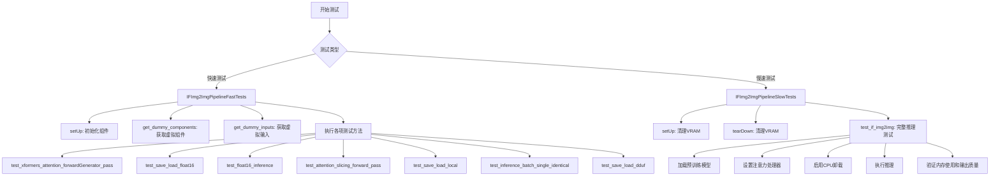

## 类结构

```
unittest.TestCase
├── IFImg2ImgPipelineFastTests (PipelineTesterMixin, IFPipelineTesterMixin)
│   ├── get_dummy_components()
│   ├── get_dummy_inputs()
│   ├── test_xformers_attention_forwardGenerator_pass()
│   ├── test_save_load_float16()
│   ├── test_float16_inference()
│   ├── test_attention_slicing_forward_pass()
│   ├── test_save_load_local()
│   ├── test_inference_batch_single_identical()
│   ├── test_save_load_dduf()
│   └── test_save_load_optional_components()
└── IFImg2ImgPipelineSlowTests
├── setUp()
├── tearDown()
└── test_if_img2img()
```

## 全局变量及字段


### `device`
    
测试设备标识符，如'cuda'、'mps'或'cpu'

类型：`str`
    


### `seed`
    
随机种子用于生成可复现的测试结果

类型：`int`
    


### `generator`
    
PyTorch随机数生成器，用于控制推理过程中的随机性

类型：`torch.Generator`
    


### `image`
    
输入图像的张量数据，用于图像到图像的转换测试

类型：`torch.Tensor`
    


### `inputs`
    
包含prompt、image、generator等参数的测试输入字典

类型：`dict`
    


### `pipe`
    
DeepFloyd IF图像到图像生成管道实例

类型：`IFImg2ImgPipeline`
    


### `output`
    
管道推理输出结果，包含生成的图像

类型：`PipelineOutput`
    


### `mem_bytes`
    
GPU内存分配字节数，用于性能监控

类型：`int`
    


### `expected_image`
    
用于对比测试的预期输出图像数据

类型：`numpy.ndarray`
    


### `IFImg2ImgPipelineFastTests.pipeline_class`
    
待测试的IFImg2ImgPipeline管道类引用

类型：`type`
    


### `IFImg2ImgPipelineFastTests.params`
    
管道推理参数集合，包含prompt、num_inference_steps等

类型：`set`
    


### `IFImg2ImgPipelineFastTests.batch_params`
    
批处理参数集合，用于批量推理测试

类型：`set`
    


### `IFImg2ImgPipelineFastTests.required_optional_params`
    
必需的可选参数集合，定义了管道支持的配置选项

类型：`set`
    
    

## 全局函数及方法


### `IFImg2ImgPipelineFastTests.get_dummy_components`

该方法是一个测试辅助方法，用于获取虚拟（dummy）组件字典，以便在单元测试中实例化管道（pipeline）而无需加载真实的预训练模型。它通过调用内部方法 `_get_dummy_components()` 来获取包含所有必要虚拟组件的字典。

参数：

- `self`：`IFImg2ImgPipelineFastTests` 实例方法的标准隐式参数，无需显式传递

返回值：`Dict` 或对象，返回包含虚拟组件的字典，具体组件包括但不限于文本编码器（text_encoder）、U-Net（unet）、VAE、调度器（scheduler）等用于测试的虚拟对象。

#### 流程图

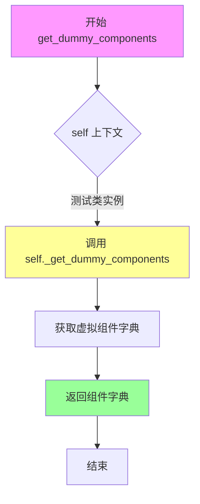

#### 带注释源码

```python
def get_dummy_components(self):
    """
    获取用于测试的虚拟组件。
    
    该方法为单元测试提供必要的虚拟组件，
    以便在不加载真实预训练模型的情况下测试管道功能。
    
    Returns:
        包含虚拟组件的字典，用于实例化 IFImg2ImgPipeline
    """
    # 调用内部方法 _get_dummy_components 获取虚拟组件
    # _get_dummy_components 方法定义在父类 PipelineTesterMixin 或 IFPipelineTesterMixin 中
    return self._get_dummy_components()
```

---

### 补充说明

**方法定位：** 此方法属于 `IFImg2ImgPipelineFastTests` 测试类，该类继承自 `PipelineTesterMixin` 和 `IFPipelineTesterMixin`，用于对 IF（DeepFloyd IF）图像到图像管道进行快速单元测试。

**返回值推断：** 基于同类测试代码的惯例，`_get_dummy_components()` 通常返回一个包含以下键的字典：
- `text_encoder`：虚拟文本编码器
- `unet`：虚拟 U-Net 模型
- `vae`：虚拟 VAE 模型
- `scheduler`：虚拟调度器
- `feature_extractor`：虚拟特征提取器（如果有）
- `tokenizer`：虚拟分词器（如果有）

**技术债务/优化空间：**
1. 该方法直接调用 `_get_dummy_components()` 而没有任何错误处理或日志记录
2. 由于实现隐藏在父类中，调用者无法直接了解返回的具体组件结构
3. 如果 `_get_dummy_components` 的实现发生变化，此方法的行为也会随之改变，缺乏显式的接口契约

**设计目标：** 此方法遵循了测试代码的常见模式——提供隔离的虚拟组件，使测试可以快速运行而不依赖外部模型下载或 GPU 资源。


### `IFImg2ImgPipelineFastTests.get_dummy_inputs`

该方法用于生成测试用的虚拟输入参数，包括文本提示、随机图像张量、生成器和推理步数等，为图像到图像扩散管道测试提供标准化的输入数据。

参数：

- `self`：类实例本身，包含测试类的方法和属性
- `device`：`str`，目标设备字符串（如"cpu"、"cuda"、"mps"等），用于创建张量和生成器
- `seed`：`int`，随机数种子，默认值为0，确保测试结果的可重复性

返回值：`dict`，包含以下键值对的字典：
- `prompt`（str）：文本提示，描述生成图像的内容
- `image`（torch.Tensor）：输入图像张量，形状为(1, 3, 32, 32)
- `generator`（torch.Generator）：随机生成器对象，用于控制推理过程中的随机性
- `num_inference_steps`（int）：推理步数，固定为2
- `output_type`（str）：输出类型，固定为"np"（NumPy数组）

#### 流程图

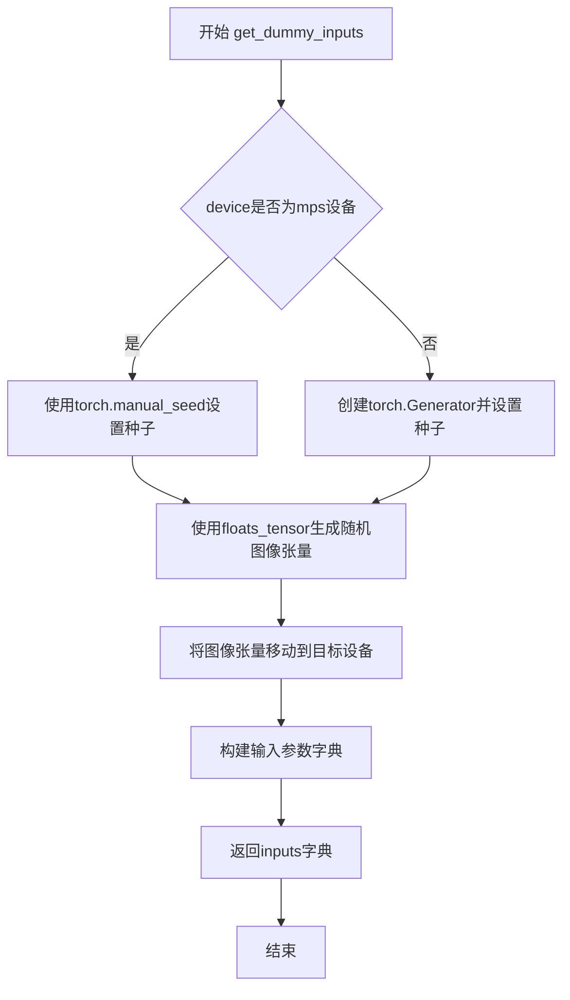

#### 带注释源码

```python
def get_dummy_inputs(self, device, seed=0):
    """
    生成用于测试IFImg2ImgPipeline的虚拟输入参数
    
    参数:
        device: 目标设备字符串，用于创建张量和生成器
        seed: 随机种子，确保测试结果可重复
    
    返回:
        包含prompt、image、generator、num_inference_steps和output_type的字典
    """
    
    # 判断设备是否为Apple Silicon的MPS设备
    if str(device).startswith("mps"):
        # MPS设备使用torch.manual_seed直接设置CPU生成器的种子
        generator = torch.manual_seed(seed)
    else:
        # 其他设备（CPU/CUDA/XPU）使用torch.Generator创建设备特定的生成器
        generator = torch.Generator(device=device).manual_seed(seed)

    # 生成形状为(1, 3, 32, 32)的随机浮点数张量作为虚拟输入图像
    # 使用指定种子确保可重复性
    image = floats_tensor((1, 3, 32, 32), rng=random.Random(seed)).to(device)

    # 构建完整的输入参数字典
    inputs = {
        "prompt": "A painting of a squirrel eating a burger",  # 文本提示词
        "image": image,                                         # 输入图像张量
        "generator": generator,                                 # 随机生成器
        "num_inference_steps": 2,                               # 推理步数
        "output_type": "np",                                    # 输出为NumPy数组
    }

    return inputs
```


### IFImg2ImgPipelineFastTests.test_xformers_attention_forwardGenerator_pass

该函数是 IFImg2ImgPipelineFastTests 类中的一个测试方法，用于验证 XFormers 注意力机制在前向传播过程中的正确性，通过调用内部方法 _test_xformers_attention_forwardGenerator_pass 并设定预期最大误差阈值为 1e-3 来进行测试。

参数：

- `self`：IFImg2ImgPipelineFastTests 实例，代表测试类本身

返回值：`None`，该方法为测试方法，不返回任何值

#### 流程图

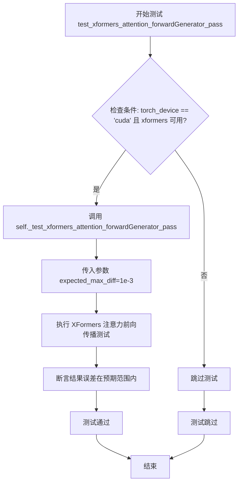

#### 带注释源码

```python
@unittest.skipIf(
    torch_device != "cuda" or not is_xformers_available(),
    reason="XFormers attention is only available with CUDA and `xformers` installed",
)
def test_xformers_attention_forwardGenerator_pass(self):
    """
    测试 XFormers 注意力机制的前向传播功能
    
    该测试方法仅在 CUDA 设备且 xformers 库可用时执行。
    用于验证 IFImg2ImgPipeline 在使用 XFormers 注意力处理器时的
    前向传播是否产生正确的结果。
    """
    # 调用内部测试方法，设定预期最大误差为 1e-3
    # _test_xformers_attention_forwardGenerator_pass 是从 PipelineTesterMixin 继承的测试方法
    self._test_xformers_attention_forwardGenerator_pass(expected_max_diff=1e-3)
```


### `IFImg2ImgPipelineFastTests.test_save_load_float16`

该方法是 `IFImg2ImgPipelineFastTests` 测试类中的一个测试用例，用于验证 IFImg2ImgPipeline 在 float16（半精度）模式下的保存和加载功能是否正确工作，确保模型在 CUDA 或 XPU 设备上以 fp16 格式序列化和反序列化后仍能保持预期精度。

参数：

- `self`：隐式参数，类型为 `IFImg2ImgPipelineFastTests` 实例，表示测试类本身

返回值：无返回值（`None`），因为这是一个 unittest 测试方法，通过断言验证行为

#### 流程图

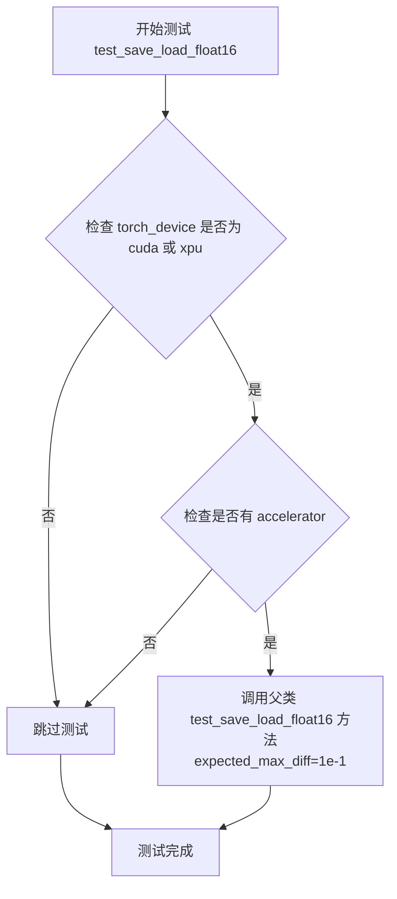

#### 带注释源码

```python
@unittest.skipIf(
    torch_device not in ["cuda", "xpu"], 
    reason="float16 requires CUDA or XPU"
)
@require_accelerator
def test_save_load_float16(self):
    """
    测试 float16 格式模型的保存和加载功能。
    
    由于 HuggingFace 内部测试用的 tiny-random-t5 文本编码器
    在保存/加载过程中存在非确定性因素，因此使用较大的误差容忍度 (1e-1)。
    """
    # 调用父类 (PipelineTesterMixin) 的测试方法
    # expected_max_diff=1e-1 表示允许较大的像素差异，
    # 因为 tiny-random-t5 文本编码器存在非确定性
    super().test_save_load_float16(expected_max_diff=1e-1)
```

#### 关键组件信息

| 组件名称 | 一句话描述 |
|---------|-----------|
| `IFImg2ImgPipeline` | DeepFloyd IF 图像到图像扩散管道，用于根据文本提示和输入图像生成新图像 |
| `IFImg2ImgPipelineFastTests` | IFImg2ImgPipeline 的快速单元测试类，包含多个测试用例验证管道功能 |
| `PipelineTesterMixin` | 管道测试混入类，提供通用的管道测试方法（如 test_save_load_float16） |
| `IFPipelineTesterMixin` | IF 管道特定的测试混入类，提供 IF 架构特定的测试辅助方法 |
| `torch.float16` | PyTorch 的半精度浮点数据类型，用于减少显存占用和加速推理 |

#### 潜在的技术债务或优化空间

1. **硬编码的设备检查**：`torch_device not in ["cuda", "xpu"]` 的检查方式缺乏扩展性，未来支持新设备（如苹果 Metal）时需要修改多处代码
2. **误差容忍度较大**：使用 `expected_max_diff=1e-1` 表明测试精度要求较低，可能掩盖潜在的精度问题
3. **测试依赖父类实现**：该方法完全依赖父类实现，缺少对本类特定行为的验证，如果父类实现变更可能导致测试行为变化
4. **跳过逻辑重复**：设备检查逻辑在多个测试方法中重复出现，可考虑提取为类级别或模块级别的装饰器

#### 其它项目

**设计目标与约束**：
- 确保 float16 格式的模型能够正确保存和加载
- 只能在支持 float16 的设备（CUDA/XPU）上运行
- 需要 accelerator 环境中运行

**错误处理与异常设计**：
- 使用 `@unittest.skipIf` 装饰器在不满足条件时跳过测试，而非抛出异常
- 通过 `@require_accelerator` 确保在有 accelerator 的环境中运行

**数据流与状态机**：
- 该测试方法本身不直接处理数据流，其逻辑委托给父类 `PipelineTesterMixin.test_save_load_float16` 执行
- 测试流程：加载模型 → 保存模型 → 重新加载 → 验证输出一致性

**外部依赖与接口契约**：
- 依赖 `super().test_save_load_float16()` 父类方法的具体实现
- 依赖 `torch_device` 全局变量确定当前设备
- 依赖 `is_xformers_available()` 检查 xformers 可用性（虽然该方法未直接使用）


### `IFImg2ImgPipelineFastTests.test_float16_inference`

该测试方法用于验证在 float16（半精度）推理模式下管道的正确性，通过调用父类的 float16 推理测试并设置预期的最大误差阈值来确保推理结果的精度在可接受范围内。

参数：

- `self`：无，Python 实例方法的隐式参数，指代当前测试类实例

返回值：`None`，该方法为测试方法，通过断言验证结果，不返回具体数值

#### 流程图

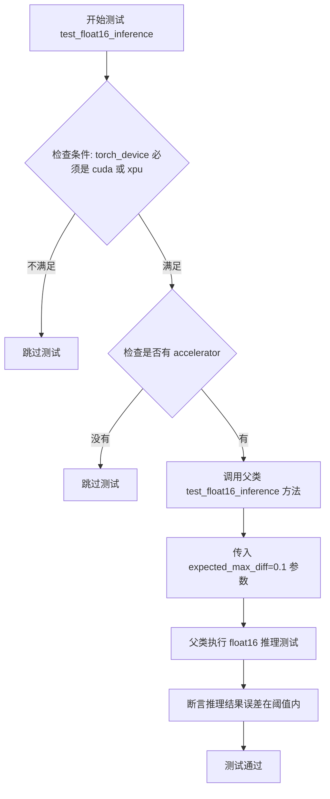

#### 带注释源码

```python
@unittest.skipIf(torch_device not in ["cuda", "xpu"], reason="float16 requires CUDA or XPU")
@require_accelerator
def test_float16_inference(self):
    """
    测试 float16（半精度）推理功能
    
    该测试方法执行以下操作：
    1. 检查运行环境是否为 CUDA 或 XPU 设备（float16 需要 GPU 加速）
    2. 检查是否配置了 accelerator（加速器）
    3. 调用父类的 test_float16_inference 方法进行实际测试
    4. 预期最大误差阈值为 1e-1（即 0.1）
    
    装饰器说明：
    - @unittest.skipIf: 条件跳过装饰器，不满足条件时跳过测试
    - @require_accelerator: 要求必须配置加速器才能运行此测试
    """
    super().test_float16_inference(expected_max_diff=1e-1)
    # 调用父类 PipelineTesterMixin 的 test_float16_inference 方法
    # expected_max_diff=1e-1 表示允许的像素值最大平均差异为 0.1
```


### `IFImg2ImgPipelineFastTests.test_attention_slicing_forward_pass`

该方法是一个单元测试用例，用于验证图像到图像（Img2Img）管道在启用注意力切片（attention slicing）功能时的前向传播是否正确执行，并通过比较输出图像的像素差异确保推理结果与预期一致（允许的最大差异为1e-2）。

参数：

- `self`：`IFImg2ImgPipelineFastTests`，测试类实例本身，包含测试所需的配置和方法

返回值：`None`，该方法为测试用例，不返回任何值，仅通过断言验证结果

#### 流程图

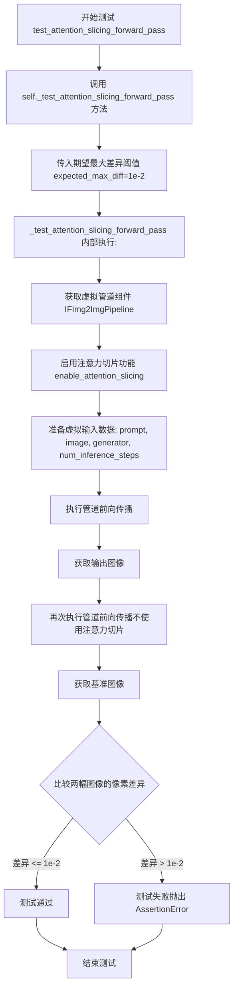

#### 带注释源码

```python
def test_attention_slicing_forward_pass(self):
    """
    测试注意力切片（Attention Slicing）功能的前向传播是否正确。
    
    注意力切片是一种内存优化技术，将注意力计算分块处理以减少显存占用。
    此测试验证启用该功能后，管道仍能产生正确的输出结果。
    """
    # 调用父类或混入类中实现的通用测试方法
    # expected_max_diff=1e-2 表示输出图像与基准图像的像素差异容忍度为 0.01
    self._test_attention_slicing_forward_pass(expected_max_diff=1e-2)
```


### IFImg2ImgPipelineFastTests.test_save_load_local

描述：该测试方法用于验证IFImg2ImgPipeline的本地保存和加载功能，通过调用父类提供的通用测试方法`_test_save_load_local()`来执行具体的测试逻辑，确保管道模型在本地文件系统中的序列化和反序列化过程正确无误。

参数：

- `self`：`IFImg2ImgPipelineFastTests`，测试类实例本身，代表当前测试用例的上下文

返回值：`None`，该方法没有显式返回值，测试结果通过断言机制体现

#### 流程图

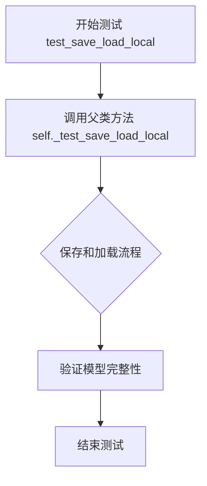

#### 带注释源码

```python
def test_save_load_local(self):
    """
    测试IFImg2ImgPipeline的本地保存和加载功能。
    
    该测试方法继承自PipelineTesterMixin，通过调用父类的
    _test_save_load_local方法来实现具体的保存加载测试逻辑。
    测试流程包括：
    1. 创建pipeline实例
    2. 保存pipeline到本地路径
    3. 从本地路径加载pipeline
    4. 验证加载后的pipeline能够正常生成图像
    5. 比较原始pipeline和加载后的pipeline的输出差异
    """
    self._test_save_load_local()
```


### `IFImg2ImgPipelineFastTests.test_inference_batch_single_identical`

该方法是一个单元测试用例，用于验证图像到图像（Img2Img）管道在批量推理时，单张图像的处理结果与单独推理结果的一致性。

参数：

- `self`：`IFImg2ImgPipelineFastTests`，测试类实例，隐式参数，包含测试所需的配置和辅助方法

返回值：`None`，该方法为 unittest 测试方法，通过断言验证结果，不返回具体值

#### 流程图

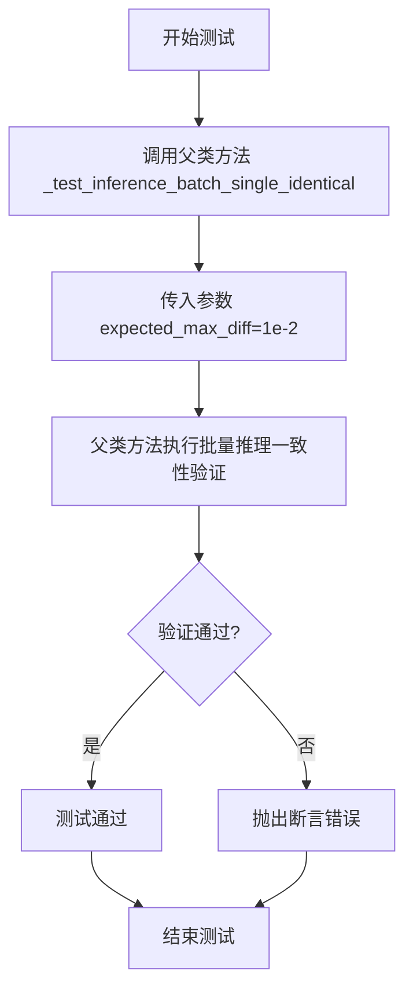

#### 带注释源码

```python
def test_inference_batch_single_identical(self):
    """
    测试批量推理时单张图像处理的一致性。
    验证使用批量输入和单个输入产生的结果差异在可接受范围内。
    """
    # 调用父类 PipelineTesterMixin 提供的通用测试方法
    # expected_max_diff=1e-2 表示期望的最大像素差异为 0.01
    self._test_inference_batch_single_identical(
        expected_max_diff=1e-2,
    )
```


### `IFImg2ImgPipelineFastTests.test_save_load_dduf`

该测试方法用于验证 IFImg2ImgPipeline 的 DDUF（DeepFloyd Unit Format）保存和加载功能，通过调用父类的测试方法并指定容差值来确保模型在序列化和反序列化后保持数值一致性。

参数：此方法无显式参数，隐式接收 `self`（`IFImg2ImgPipelineFastTests` 实例）。

返回值：`None`，该方法为单元测试方法，执行测试逻辑而不返回具体值。

#### 流程图

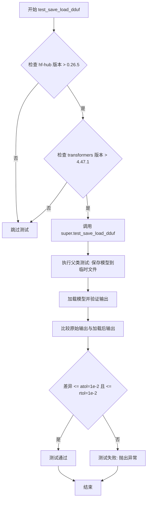

#### 带注释源码

```python
@require_hf_hub_version_greater("0.26.5")
@require_transformers_version_greater("4.47.1")
def test_save_load_dduf(self):
    # 装饰器: 确保测试环境满足版本要求
    # - require_hf_hub_version_greater("0.26.5"): 验证 huggingface-hub 库版本大于 0.26.5
    # - require_transformers_version_greater("4.47.1"): 验证 transformers 库版本大于 4.47.1
    
    super().test_save_load_dduf(atol=1e-2, rtol=1e-2)
    # 调用父类 PipelineTesterMixin 的 test_save_load_dduf 方法
    # 参数:
    #   - atol=1e-2: 绝对容差 (absolute tolerance)，用于浮点数比较
    #   - rtol=1e-2: 相对容差 (relative tolerance)，用于浮点数比较
    # 功能: 保存 pipeline 到磁盘，重新加载，并验证输出的一致性
```

---

### 补充信息

#### 关键组件信息

| 组件名称 | 描述 |
|---------|------|
| `IFImg2ImgPipeline` | DeepFloyd IF 图像到图像转换管道类 |
| `test_save_load_dduf` | 验证 DDUF 格式保存/加载功能的测试方法 |
| `PipelineTesterMixin` | 提供通用管道测试方法的混合类 |

#### 技术债务与优化空间

1. **硬编码容差值**：容差值 `atol=1e-2` 和 `rtol=1e-2` 被硬编码在测试中，缺乏灵活性
2. **版本检查依赖**：测试依赖特定版本的库，可能导致未来维护困难
3. **缺失错误处理**：父类方法调用未包装在 try-except 中，错误信息可能不够友好

#### 外部依赖与接口契约

- **huggingface-hub >= 0.26.5**: 用于模型保存/加载功能
- **transformers >= 4.47.1**: 用于文本编码器相关功能
- **super().test_save_load_dduf()**: 父类方法契约 - 应接受 `atol` 和 `rtol` 参数并执行完整的保存-加载-验证流程


### `IFImg2ImgPipelineFastTests.test_save_load_optional_components`

该测试方法用于验证管道在保存和加载时对可选组件的处理能力，但由于该功能已在其他测试中覆盖，该测试当前被跳过。

参数：无（仅包含隐含的 `self` 参数）

返回值：`None`，无返回值（void 方法）

#### 流程图

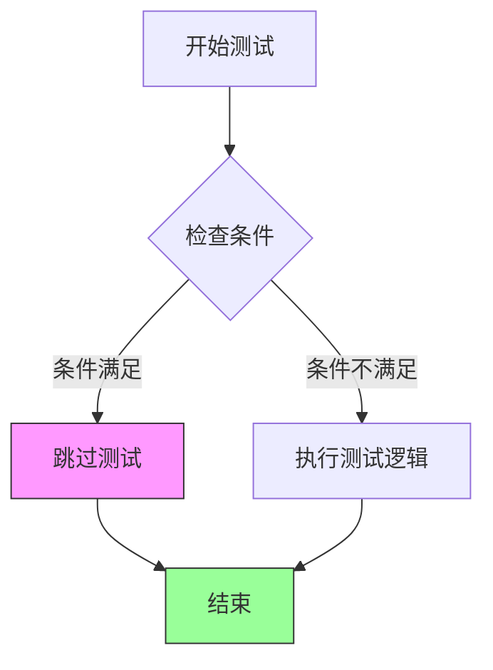

#### 带注释源码

```python
@unittest.skip("Functionality is tested elsewhere.")
def test_save_load_optional_components(self):
    """
    测试管道的保存和加载功能是否正确处理可选组件。
    
    可选组件指的是在管道初始化时可以选择是否加载的组件，
    例如某些特定的处理器、调度器或自定义模块。
    
    该测试方法目前被跳过，原因如装饰器所示：该功能已在其他测试中得到覆盖。
    在未来如果需要单独验证此功能，可以移除 @unittest.skip 装饰器并实现具体的测试逻辑。
    
    参数:
        self: IFImg2ImgPipelineFastTests 的实例，提供了对测试类的访问
        
    返回值:
        None: 该方法不返回任何值
        
    异常:
        unittest.SkipTest: 当测试被跳过时抛出
    """
    pass  # 测试逻辑未实现，仅作为占位符
```


### `IFImg2ImgPipelineSlowTests.setUp`

该方法为测试类 `IFImg2ImgPipelineSlowTests` 的初始化方法，在每个测试用例执行前被调用，用于清理 GPU 显存（VRAM）以确保测试环境的干净状态，避免因显存残留导致测试结果不稳定。

参数：

- `self`：`unittest.TestCase`，Python unittest 框架的标准实例参数，代表测试类本身的实例

返回值：`None`，该方法不返回任何值，仅执行清理操作

#### 流程图

```mermaid
flowchart TD
    A[开始 setUp] --> B[调用父类 super().setUp]
    B --> C[执行 gc.collect 垃圾回收]
    C --> D[调用 backend_empty_cache 清理 GPU 显存]
    D --> E[结束 setUp]
```

#### 带注释源码

```python
def setUp(self):
    # clean up the VRAM before each test
    # 在每个测试开始前清理 VRAM（显存），确保测试环境干净
    super().setUp()
    # 调用 unittest.TestCase 的父类 setUp 方法，执行框架级别的初始化
    
    gc.collect()
    # 执行 Python 垃圾回收，释放不再使用的内存对象
    
    backend_empty_cache(torch_device)
    # 调用后端工具函数清理指定设备（torch_device）的 GPU 缓存
    # torch_device 是全局变量，通常为 'cuda' 或 'cpu' 等设备标识
```


### `IFImg2ImgPipelineSlowTests.tearDown`

清理每个测试执行后的 VRAM 内存，释放 GPU 资源，确保测试之间的隔离性。

参数：
- 无（仅包含 `self` 参数）

返回值：`None`，无返回值描述

#### 流程图

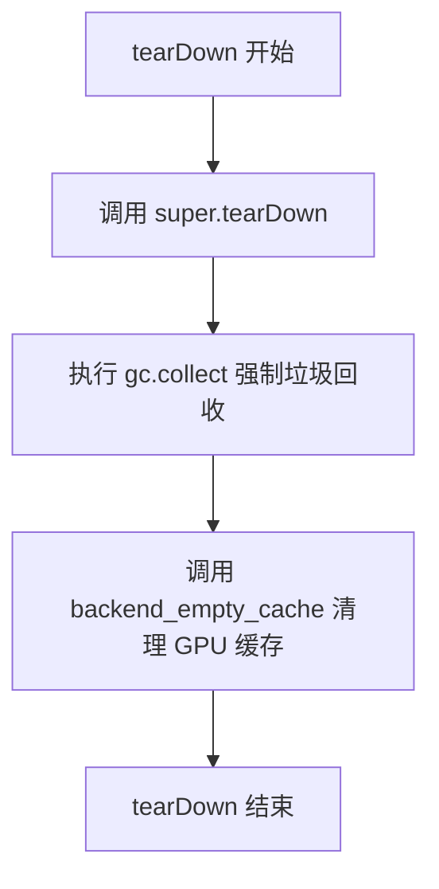

#### 带注释源码

```python
def tearDown(self):
    # clean up the VRAM after each test
    # 清理每个测试后的 VRAM
    super().tearDown()  # 调用父类的 tearDown 方法
    gc.collect()  # 强制进行 Python 垃圾回收，释放不再使用的对象
    backend_empty_cache(torch_device)  # 清理 GPU 显存缓存
```


### `IFImg2ImgPipelineSlowTests.test_if_img2img`

这是一个慢速测试方法，用于验证 IFImg2ImgPipeline 的图像到图像（img2img）功能是否正常工作。测试会加载预训练的 DeepFloyd/IF-I-L-v1.0 模型，执行图像转换，并通过内存占用和像素差异断言来验证结果的正确性。

参数：

- `self`：隐式参数，测试类实例本身，无额外描述

返回值：`None`，无返回值（测试方法，通过断言验证结果）

#### 流程图

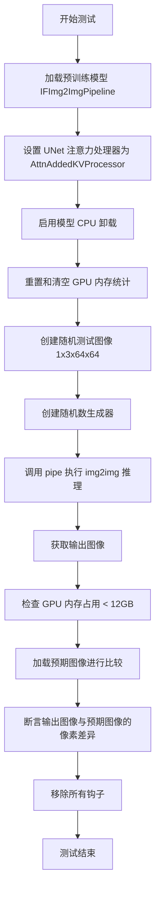

#### 带注释源码

```python
@unittest.skip("SLOW - 需要 GPU")  # 标记为慢速测试，需要手动运行
@require_torch_accelerator  # 需要支持 torch 加速器的设备
def test_if_img2img(self):
    """
    测试 IFImg2ImgPipeline 的图像到图像（img2img）功能
    
    测试内容包括：
    1. 加载预训练的 DeepFloyd/IF-I-L-v1.0 模型（fp16 变体）
    2. 设置自定义注意力处理器
    3. 启用模型 CPU 卸载以优化显存使用
    4. 执行 img2img 推理并验证输出质量
    5. 检查显存占用是否在合理范围内
    """
    # 从预训练模型加载 IFImg2ImgPipeline
    # variant="fp16" 使用半精度浮点数以减少显存占用
    pipe = IFImg2ImgPipeline.from_pretrained(
        "DeepFloyd/IF-I-L-v1.0",  # HuggingFace 模型 ID
        variant="fp16",           # 使用 FP16 权重变体
        torch_dtype=torch.float16,# 设置模型为半精度
    )
    
    # 设置 UNet 的注意力处理器为 AttnAddedKVProcessor
    # 这是一种自定义的注意力实现，用于特定的注意力计算
    pipe.unet.set_attn_processor(AttnAddedKVProcessor())
    
    # 启用模型 CPU 卸载功能
    # 当模型不在推理使用时，将部分模型权重卸载到 CPU 以节省 GPU 显存
    pipe.enable_model_cpu_offload(device=torch_device)

    # 重置最大内存分配统计
    backend_reset_max_memory_allocated(torch_device)
    # 清空 GPU 缓存，释放显存
    backend_empty_cache(torch_device)
    # 重置峰值内存统计
    backend_reset_peak_memory_stats(torch_device)

    # 创建测试用随机图像 tensor
    # 形状: (batch=1, channels=3, height=64, width=64)
    # 使用固定随机种子 0 确保可复现性
    image = floats_tensor((1, 3, 64, 64), rng=random.Random(0)).to(torch_device)
    
    # 创建随机数生成器用于推理过程
    # 使用 CPU 设备并设置固定种子 0 确保可复现性
    generator = torch.Generator(device="cpu").manual_seed(0)
    
    # 执行图像到图像转换推理
    # 参数说明：
    # - prompt: 文本提示词，指导图像转换的方向
    # - image: 输入图像，待转换的源图像
    # - num_inference_steps: 推理步数，越多越精细但耗时更长
    # - generator: 随机数生成器，确保结果可复现
    # - output_type: 输出类型，"np" 表示返回 NumPy 数组
    output = pipe(
        prompt="anime turtle",      # 提示词：生成动漫风格的海龟
        image=image,                # 输入图像
        num_inference_steps=2,      # 仅使用 2 步推理（快速测试）
        generator=generator,        # 随机数生成器
        output_type="np",           # 输出 NumPy 数组
    )
    
    # 从输出中提取生成的图像
    # output.images 是一个列表，包含所有生成的图像
    image = output.images[0]

    # 获取推理过程中占用的最大 GPU 显存
    mem_bytes = backend_max_memory_allocated(torch_device)
    
    # 断言：验证显存占用小于 12GB
    # 确保模型在合理的显存范围内运行
    assert mem_bytes < 12 * 10**9

    # 从 HuggingFace 数据集加载预期输出图像
    # 用于与实际输出进行像素级比较
    expected_image = load_numpy(
        "https://huggingface.co/datasets/hf-internal-testing/diffusers-images/resolve/main/if/test_if_img2img.npy"
    )
    
    # 断言：验证输出图像与预期图像的像素差异在可接受范围内
    # 使用 assert_mean_pixel_difference 确保像素级一致性
    assert_mean_pixel_difference(image, expected_image)

    # 清理：移除所有注册的模型钩子
    # 防止钩子影响后续测试
    pipe.remove_all_hooks()
```


### `IFImg2ImgPipelineFastTests.get_dummy_components`

该方法是一个测试辅助函数，用于返回一组虚拟（dummy）组件字典，这些组件模拟了 `IFImg2ImgPipeline` 所需的完整模型配置（包括 UNet、文本编码器、VAE、调度器等），以便在单元测试中执行不依赖真实预训练模型的快速测试。

参数：

- `self`：`IFImg2ImgPipelineFastTests` 实例，隐式参数，代表当前测试类实例

返回值：任意类型（通常为 `Dict[str, Any]`），返回由父类 `_get_dummy_components()` 方法生成的虚拟组件字典，包含用于测试的模型、调度器等配置对象

#### 流程图

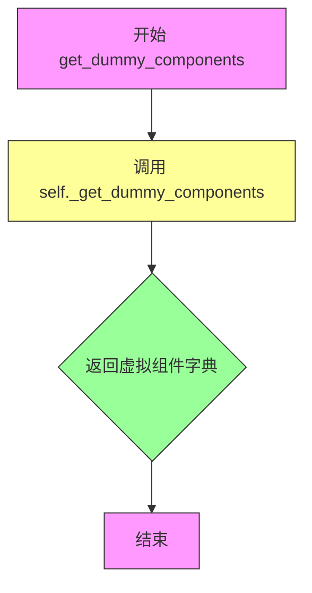

#### 带注释源码

```python
def get_dummy_components(self):
    """
    返回用于测试的虚拟组件。
    
    该方法封装了对父类 _get_dummy_components() 方法的调用，
    返回一个包含 IFImg2ImgPipeline 运行所需的全部虚拟组件的字典，
    包括：unet, text_encoder, vae, scheduler, tokenizer 等。
    这样可以在不加载真实预训练权重的情况下进行单元测试。
    
    Returns:
        包含虚拟组件的字典，键为组件名称，值为对应的虚拟模型/调度器对象
    """
    return self._get_dummy_components()
```


### `IFImg2ImgPipelineFastTests.get_dummy_inputs`

该方法为IFImg2ImgPipeline图像到图像扩散管道生成测试用的虚拟输入数据，根据设备类型创建随机生成器，构造包含提示词、图像、张量生成器、推理步数和输出类型的输入字典，用于管道推理测试。

参数：

- `device`：`torch.device` 或 `str`，指定运行设备（如"cuda"、"cpu"或"mps"）
- `seed`：`int`，随机种子，默认值为0，用于确保测试结果可复现

返回值：`Dict[str, Any]`，返回包含管道推理所需参数的字典，包括prompt（提示词）、image（输入图像张量）、generator（随机生成器）、num_inference_steps（推理步数）、output_type（输出类型）

#### 流程图

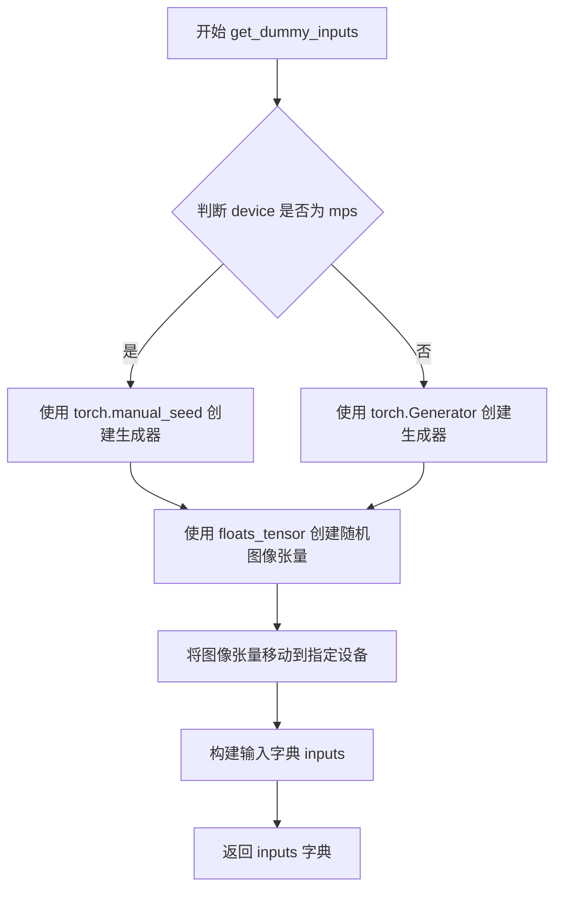

#### 带注释源码

```python
def get_dummy_inputs(self, device, seed=0):
    """
    为图像到图像管道测试生成虚拟输入数据
    
    参数:
        device: 运行设备
        seed: 随机种子
    
    返回:
        包含测试所需参数的字典
    """
    # 判断设备是否为Apple MPS (Metal Performance Shaders)
    if str(device).startswith("mps"):
        # MPS设备使用CPU生成器设置种子
        generator = torch.manual_seed(seed)
    else:
        # 其他设备（CUDA/CPU）使用指定设备的生成器
        generator = torch.Generator(device=device).manual_seed(seed)

    # 创建形状为(1, 3, 32, 32)的随机浮点数图像张量
    # 1=batch size, 3=通道数(RGB), 32x32=图像分辨率
    image = floats_tensor((1, 3, 32, 32), rng=random.Random(seed)).to(device)

    # 构建管道推理所需的输入字典
    inputs = {
        "prompt": "A painting of a squirrel eating a burger",  # 文本提示词
        "image": image,           # 输入图像张量
        "generator": generator,   # 随机生成器确保可复现性
        "num_inference_steps": 2, # 推理步数（测试用最小值）
        "output_type": "np",      # 输出类型为numpy数组
    }

    return inputs
```


### `IFImg2ImgPipelineFastTests.test_xformers_attention_forwardGenerator_pass`

该测试方法用于验证 XFormers 注意力机制的前向传播是否正确工作。测试仅在 CUDA 设备和 xformers 库可用时执行，内部调用 `_test_xformers_attention_forwardGenerator_pass` 方法，期望输出与参考实现的最大差异阈值为 1e-3。

参数：

- `self`：隐式参数，测试类实例本身，无需额外描述

返回值：无（`None`），该方法为测试用例，通过断言验证行为，不返回具体数据

#### 流程图

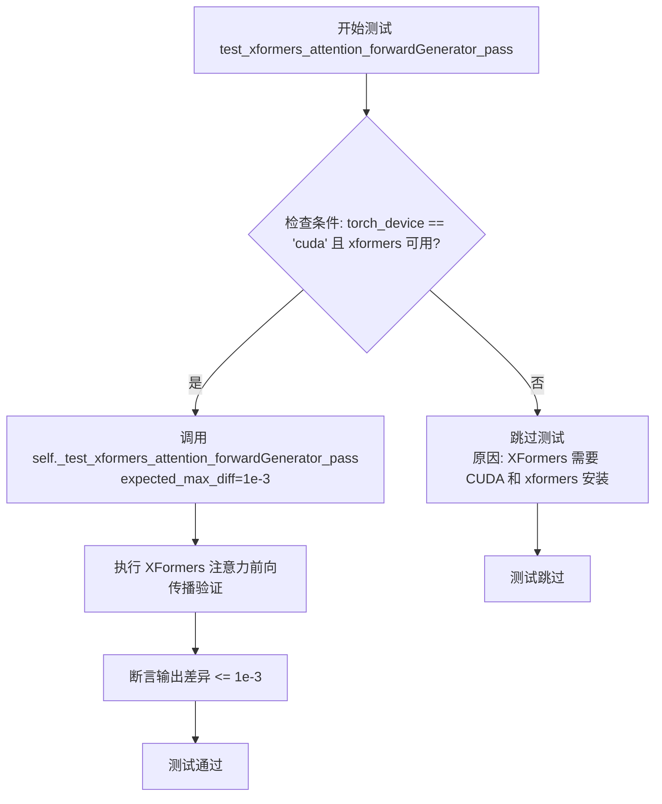

#### 带注释源码

```python
@unittest.skipIf(
    torch_device != "cuda" or not is_xformers_available(),
    reason="XFormers attention is only available with CUDA and `xformers` installed",
)
def test_xformers_attention_forwardGenerator_pass(self):
    """
    测试 XFormers 注意力机制的前向传播是否正确。
    
    该测试方法执行以下操作：
    1. 检查测试环境是否满足条件（CUDA 设备 + xformers 可用）
    2. 如果条件满足，调用内部测试方法验证 XFormers 注意力输出
    3. 设置期望的最大差异阈值为 1e-3，确保精度符合要求
    
    注意：实际验证逻辑在 _test_xformers_attention_forwardGenerator_pass 方法中实现，
    该方法可能来自 PipelineTesterMixin 或 IFPipelineTesterMixin 父类。
    """
    # 调用内部测试方法，expected_max_diff=1e-3 表示允许的最大差异
    self._test_xformers_attention_forwardGenerator_pass(expected_max_diff=1e-3)
```


### `IFImg2ImgPipelineFastTests.test_save_load_float16`

该测试方法用于验证 `IFImg2ImgPipeline` 流水线在 float16（半精度）模型权重下的保存和加载功能是否正常工作，确保序列化与反序列化过程中模型精度和数据一致性符合预期。

参数：

- `self`：`IFImg2ImgPipelineFastTests`，unittest.TestCase 的子类实例，表示当前测试用例对象

返回值：`None`，测试方法无返回值，通过内部断言验证保存/加载的正确性

#### 流程图

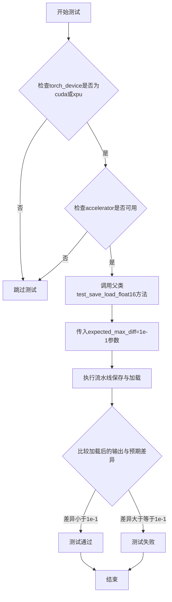

#### 带注释源码

```python
@unittest.skipIf(
    torch_device not in ["cuda", "xpu"],  # 仅在CUDA或XPU设备上运行，因为float16仅在这些设备上有意义
    reason="float16 requires CUDA or XPU"  # 跳过原因说明
)
@require_accelerator  # 装饰器：要求加速器可用才能执行此测试
def test_save_load_float16(self):
    """
    测试 IFImg2ImgPipeline 在 float16 精度下的保存和加载功能。
    
    该测试继承自 PipelineTesterMixin，验证模型在转换为 float16 后
    能否正确序列化为磁盘文件并重新加载，且输出结果与原始输出的
    差异在可接受范围内（expected_max_diff=1e-1）。
    """
    # 由于 hf-internal-testing/tiny-random-t5 文本编码器在保存/加载过程中
    # 存在非确定性因素，此处放宽了最大允许差异阈值
    # 调用父类的测试方法来执行实际的保存/加载验证逻辑
    super().test_save_load_float16(expected_max_diff=1e-1)
```


### `IFImg2ImgPipelineFastTests.test_float16_inference`

该测试方法用于验证模型在 float16（半精度）推理模式下的正确性，通过调用父类的测试方法来执行核心的精度验证逻辑。

参数：

- `self`：`IFImg2ImgPipelineFastTests`，测试类实例本身，包含测试所需的上下文和辅助方法
- `expected_max_diff`：`float`（隐式传递给父类），期望的最大像素差异阈值，设定为 `1e-1`（0.1），用于容忍非确定性操作带来的微小差异

返回值：`None`，该方法为测试用例，无返回值，通过断言验证推理结果的正确性

#### 流程图

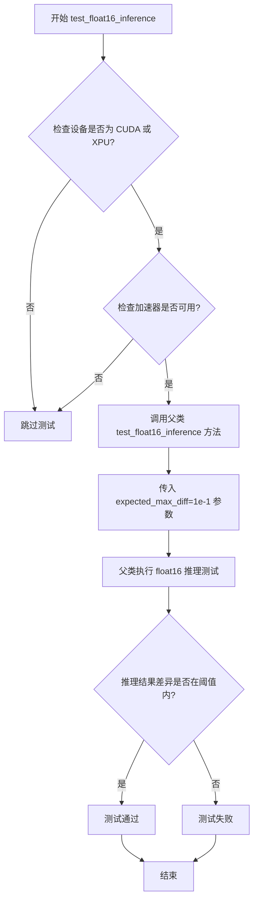

#### 带注释源码

```python
@unittest.skipIf(
    torch_device not in ["cuda", "xpu"], 
    reason="float16 requires CUDA or XPU"
)
@require_accelerator
def test_float16_inference(self):
    """
    测试方法：验证 float16 推理
    
    该测试方法用于确保模型在 float16（半精度）推理模式下能够正常工作。
    由于 float16 精度较低且存在非确定性因素（如不同的 CUDA 实现），
    因此设置了较大的容差阈值 (expected_max_diff=1e-1)。
    
    限制条件：
    - 仅在 CUDA 或 XPU 设备上运行
    - 需要加速器（accelerator）支持
    """
    # 调用父类的 test_float16_inference 方法执行实际的测试逻辑
    # 传递 expected_max_diff=1e-1 作为参数，允许较大的像素差异容忍度
    # 这是因为 float16 推理可能引入数值误差，且存在非确定性因素
    super().test_float16_inference(expected_max_diff=1e-1)
```

#### 补充说明

| 项目 | 说明 |
|------|------|
| **所属类** | `IFImg2ImgPipelineFastTests` |
| **类定义位置** | 代码文件中的 `IFImg2ImgPipelineFastTests` 测试类 |
| **父类方法** | `PipelineTesterMixin.test_float16_inference` |
| **测试目的** | 验证 IFImg2ImgPipeline 在 float16 精度下的推理正确性 |
| **设备要求** | CUDA 或 XPU |
| **加速器要求** | 需要 `accelerator` 可用 |
| **容差设置** | `1e-1`（0.1），相比默认的 `1e-3` 更为宽松 |
| **跳过条件** | 设备不是 CUDA 或 XPU，或加速器不可用 |


### `IFImg2ImgPipelineFastTests.test_attention_slicing_forward_pass`

该测试方法用于验证图像到图像管道中注意力切片（Attention Slicing）功能的前向传递是否正确工作，通过调用内部测试方法并设定预期的最大数值差异阈值来确保推理结果的精度。

参数：

- `self`：`IFImg2ImgPipelineFastTests`（隐式参数），表示测试类的实例本身

返回值：`None`，该方法为测试用例，无返回值（Python 中默认返回 None）

#### 流程图

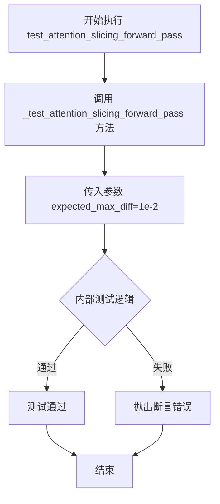

#### 带注释源码

```python
def test_attention_slicing_forward_pass(self):
    """
    测试注意力切片（Attention Slicing）前向传递的测试方法。
    
    Attention Slicing 是一种内存优化技术，通过将注意力计算分片处理
    来减少显存占用。该测试验证启用该功能后，管道仍能正常执行推理，
    并确保结果与基准的差异在可接受范围内。
    
    参数:
        self: IFImg2ImgPipelineFastTests 的实例，包含测试所需的配置和辅助方法
    
    返回值:
        None: 测试方法不返回任何值，通过断言来验证测试结果
    
    内部逻辑:
        调用父类/混入类的 _test_attention_slicing_forward_pass 方法，
        传入 expected_max_diff=1e-2 作为允许的最大数值差异阈值
    """
    # 调用内部测试方法验证注意力切片功能
    # expected_max_diff=1e-2 表示输出图像与基准图像的像素值差异
    # 必须小于等于 0.01，否则测试失败
    self._test_attention_slicing_forward_pass(expected_max_diff=1e-2)
```


### IFImg2ImgPipelineFastTests.test_save_load_local

该方法是一个单元测试用例，用于测试 `IFImg2ImgPipeline` 管道能否正确地保存到本地并从本地加载，且加载后的管道功能保持一致。它通过调用父类 `PipelineTesterMixin` 提供的 `_test_save_load_local` 方法实现具体测试逻辑。

参数：

- `self`：实例方法隐式参数，类型为 `IFImg2ImgPipelineFastTests`，表示测试类实例本身

返回值：`None`，无返回值（测试方法）

#### 流程图

```mermaid
flowchart TD
    A[开始 test_save_load_local] --> B[调用 self._test_save_load_local]
    B --> C{执行父类测试逻辑}
    C --> D[保存管道到本地临时目录]
    D --> E[从本地临时目录加载管道]
    E --> F[使用相同输入生成图像]
    F --> G[对比原管道和加载管道的输出]
    G --> H{输出是否一致}
    H -->|是| I[测试通过]
    H -->|否| J[断言失败]
    I --> K[清理临时文件]
    J --> K
    K --> L[结束]
```

#### 带注释源码

```python
def test_save_load_local(self):
    """
    测试 IFImg2ImgPipeline 的保存和加载功能
    
    该测试方法验证管道对象能够被序列化保存到本地文件系统，
    并且从本地加载后能够正常工作，生成与原始管道相同的结果。
    
    测试流程：
    1. 获取虚拟组件和虚拟输入
    2. 创建管道实例并生成参考输出
    3. 将管道保存到临时目录
    4. 从临时目录加载管道
    5. 使用相同输入生成新输出
    6. 对比两次输出的像素差异
    """
    # 调用父类 PipelineTesterMixin 提供的测试方法
    # _test_save_load_local 方法定义在 test_pipelines_common.py 中
    # 它会执行完整的保存/加载流程并验证管道功能一致性
    self._test_save_load_local()
```


### `IFImg2ImgPipelineFastTests.test_inference_batch_single_identical`

该测试方法用于验证图片到图片（Img2Img）管道在批量推理和单张推理模式下产生的结果是否一致，通过对比两者的输出差异是否在可接受范围内来确保管道实现的正确性和可重复性。

参数：

- `self`：`IFImg2ImgPipelineFastTests`，测试类实例本身，包含测试所需的管道组件和辅助方法

返回值：`None`，测试方法无返回值，通过断言完成验证

#### 流程图

```mermaid
flowchart TD
    A[开始测试 test_inference_batch_single_identical] --> B[调用 _test_inference_batch_single_identical 方法]
    B --> C[设置 expected_max_diff=1e-2]
    C --> D[执行批量推理测试]
    D --> E[执行单张推理测试]
    E --> F{比较输出差异}
    F -->|差异 ≤ 1e-2| G[测试通过]
    F -->|差异 > 1e-2| H[测试失败: 抛出 AssertionError]
    G --> I[结束]
    H --> I
```

#### 带注释源码

```python
def test_inference_batch_single_identical(self):
    """
    测试批量推理与单张推理的结果一致性。
    
    该测试方法继承自 PipelineTesterMixin，通过调用 _test_inference_batch_single_identical
    来验证当使用批量输入（batch）和单个输入（single）时，管道输出应该相同。
    这确保了管道的实现对批量和单张处理是一致的。
    
    注意：
    - 该测试方法依赖于父类或混入类 PipelineTesterMixin 提供的 _test_inference_batch_single_identical 实现
    - expected_max_diff=1e-2 表示允许的最大像素差异为 0.01
    """
    # 调用父类/混入类的测试方法，传入预期的最大差异阈值
    self._test_inference_batch_single_identical(
        expected_max_diff=1e-2,  # 允许的最大像素差异
    )
```


### `IFImg2ImgPipelineFastTests.test_save_load_dduf`

该测试方法用于验证 IFImg2ImgPipeline 在使用 DDUF（Deep Diffusion Upscaler Format）格式时的保存和加载功能，通过调用父类的 test_save_load_dduf 方法并指定绝对误差容差（atol=1e-2）和相对误差容差（rtol=1e-2）来确保模型在序列化与反序列化后仍能保持数值一致性。该测试仅在 HuggingFace Hub 版本大于 0.26.5 且 Transformers 版本大于 4.47.1 时运行。

参数：

- `self`：隐式参数，测试类实例本身
- `atol`：`float`，绝对误差容差（absolute tolerance），设置为 1e-2
- `rtol`：`float`，相对误差容差（relative tolerance），设置为 1e-2

返回值：无返回值（`None`），该方法为单元测试方法，通过断言验证保存加载的正确性

#### 流程图

```mermaid
flowchart TD
    A[开始 test_save_load_dduf 测试] --> B{检查 HuggingFace Hub 版本 > 0.26.5}
    B -->|是| C{检查 Transformers 版本 > 4.47.1}
    B -->|否| D[跳过测试]
    C -->|是| E[调用父类方法 test_save_load_dduf]
    C -->|否| D
    E --> F[传入参数 atol=1e-2, rtol=1e-2]
    F --> G[父类执行保存加载测试]
    G --> H{数值差异是否在容差范围内}
    H -->|是| I[测试通过]
    H -->|否| J[测试失败 - 抛出断言错误]
    I --> K[结束]
    J --> K
```

#### 带注释源码

```python
@require_hf_hub_version_greater("0.26.5")  # 装饰器：要求 HuggingFace Hub 版本大于 0.26.5
@require_transformers_version_greater("4.47.1")  # 装饰器：要求 Transformers 版本大于 4.47.1
def test_save_load_dduf(self):
    """
    测试 IFImg2ImgPipeline 的 DDUF 格式保存和加载功能。
    
    DDUF (Deep Diffusion Upscaler Format) 是一种用于保存和加载扩散模型的格式。
    该测试验证管道在序列化（保存）和反序列化（加载）后能够正常工作，
    并且数值输出与原始输出在指定的容差范围内一致。
    """
    # 调用父类 PipelineTesterMixin 的 test_save_load_dduf 方法
    # 传入绝对误差容差 atol=1e-2 和相对误差容差 rtol=1e-2
    # 这意味着对于每个像素值，允许的绝对差异为 0.01，相对差异为 1%
    super().test_save_load_dduf(atol=1e-2, rtol=1e-2)
```


### `IFImg2ImgPipelineFastTests.test_save_load_optional_components`

该方法是一个单元测试方法，用于测试管道的可选组件保存和加载功能，但当前已被标记为跳过（`@unittest.skip`），其功能在其他地方进行测试。

参数：

- `self`：`IFImg2ImgPipelineFastTests`，测试类的实例，隐含参数，表示当前测试对象

返回值：`None`，无返回值（方法体为 `pass`）

#### 流程图

```mermaid
flowchart TD
    A[开始测试] --> B{检查装饰器条件}
    B -->|条件满足| C[跳过测试]
    B -->|条件不满足| D[执行测试逻辑]
    C --> E[结束测试 - SKIPPED]
    D --> F[调用父类测试方法]
    F --> G[验证保存/加载结果]
    G --> E
```

#### 带注释源码

```python
@unittest.skip("Functionality is tested elsewhere.")
def test_save_load_optional_components(self):
    """
    测试可选组件的保存和加载功能。
    
    注意：此测试功能已在其他测试用例中覆盖，因此当前跳过。
    """
    pass
```


### `IFImg2ImgPipelineSlowTests.setUp`

该方法为测试类的初始化方法，在每个测试用例运行前执行清理操作，通过调用垃圾回收和清空GPU缓存来释放VRAM资源，确保测试环境的内存状态干净。

参数：

- `self`：`unittest.TestCase`，表示测试类实例本身

返回值：`None`，无返回值描述

#### 流程图

```mermaid
flowchart TD
    A[开始 setUp] --> B[调用父类 setUp 方法]
    B --> C[执行 gc.collect 进行垃圾回收]
    C --> D[调用 backend_empty_cache 清理 GPU 缓存]
    D --> E[结束 setUp]
    
    style A fill:#f9f,stroke:#333
    style E fill:#9f9,stroke:#333
```

#### 带注释源码

```python
def setUp(self):
    # clean up the VRAM before each test
    # 在每个测试开始前清理 VRAM
    super().setUp()  # 调用父类 unittest.TestCase 的 setUp 方法
    gc.collect()  # 执行 Python 垃圾回收，释放不再使用的对象
    backend_empty_cache(torch_device)  # 清空 GPU 缓存，释放显存
```


### `IFImg2ImgPipelineSlowTests.tearDown`

清理测试后的 VRAM 内存，释放 GPU 资源，确保测试之间的隔离性。

参数：

-  `self`：`unittest.TestCase`，Python unittest 框架的测试用例实例本身

返回值：`None`，无返回值

#### 流程图

```mermaid
flowchart TD
    A[tearDown 开始] --> B[调用 super().tearDown]
    B --> C[执行 gc.collect]
    C --> D[调用 backend_empty_cache]
    D --> E[清理 torch_device 对应的 GPU 缓存]
    E --> F[tearDown 结束]
```

#### 带注释源码

```python
def tearDown(self):
    # clean up the VRAM after each test
    # 在每个测试方法执行完毕后清理 VRAM
    super().tearDown()  # 调用父类的 tearDown 方法
    gc.collect()  # 强制进行垃圾回收，释放 Python 对象
    backend_empty_cache(torch_device)  # 清理指定设备的后端缓存（GPU 显存）
```


### `IFImg2ImgPipelineSlowTests.test_if_img2img`

该测试方法验证 IFImg2ImgPipeline 在图像到图像（img2img）任务上的功能正确性，包括模型加载、注意力处理器配置、模型 CPU 卸载、推理执行、内存使用验证以及输出图像质量断言。

参数：无（该方法仅使用 self 和局部变量）

返回值：`None`，该方法为单元测试方法，通过断言验证行为，不返回具体值

#### 流程图

```mermaid
flowchart TD
    A[开始测试] --> B[清理VRAM - gc.collect]
    B --> C[从预训练模型加载IFImg2ImgPipeline]
    C --> D[设置UNet注意力处理器为AttnAddedKVProcessor]
    D --> E[启用模型CPU卸载到torch_device]
    E --> F[重置内存统计计数器]
    F --> G[创建测试图像张量1x3x64x64]
    G --> H[创建随机数生成器seed=0]
    H --> I[执行pipeline推理]
    I --> J[获取输出图像]
    J --> K[检查内存使用 < 12GB]
    K --> L[加载预期图像]
    L --> M[断言输出图像与预期图像的像素差异]
    M --> N[移除所有hooks]
    N --> O[测试结束]
```

#### 带注释源码

```python
@unittest.skipIf(
    not torch.cuda.is_available() or not torch.cuda.device_count() > 0,
    reason="This test requires CUDA"
)
@require_torch_accelerator  # 需要torch accelerator才能运行
@slow  # 标记为慢速测试
class IFImg2ImgPipelineSlowTests(unittest.TestCase):
    """IFImg2ImgPipeline的慢速集成测试类"""
    
    def setUp(self):
        """
        测试前置设置：清理VRAM内存
        在每个测试运行前执行垃圾回收和缓存清理
        """
        super().setUp()
        gc.collect()  # Python垃圾回收
        backend_empty_cache(torch_device)  # 清理GPU缓存

    def tearDown(self):
        """
        测试后置清理：释放VRAM内存
        在每个测试完成后执行资源释放
        """
        super().tearDown()
        gc.collect()  # Python垃圾回收
        backend_empty_cache(torch_device)  # 清理GPU缓存

    def test_if_img2img(self):
        """
        测试IFImg2ImgPipeline的图像到图像推理功能
        
        测试流程：
        1. 加载预训练模型 DeepFloyd/IF-I-L-v1.0 (fp16变体)
        2. 配置UNet注意力处理器
        3. 启用模型CPU卸载以节省GPU显存
        4. 执行2步推理
        5. 验证内存使用 < 12GB
        6. 验证输出图像质量与预期一致
        """
        # 步骤1: 从预训练模型加载pipeline
        # 使用fp16变体以提高推理效率
        pipe = IFImg2ImgPipeline.from_pretrained(
            "DeepFloyd/IF-I-L-v1.0",  # HuggingFace模型ID
            variant="fp16",           # 使用fp16权重变体
            torch_dtype=torch.float16 # 指定torch数据类型为float16
        )
        
        # 步骤2: 设置UNet的注意力处理器
        # AttnAddedKVProcessor是一种添加KV缓存的注意力处理器
        pipe.unet.set_attn_processor(AttnAddedKVProcessor())
        
        # 步骤3: 启用模型CPU卸载
        # 当模型不在GPU上时自动加载到CPU，节省显存
        pipe.enable_model_cpu_offload(device=torch_device)

        # 步骤4: 重置内存统计工具
        # 准备测量推理过程中的显存使用
        backend_reset_max_memory_allocated(torch_device)
        backend_empty_cache(torch_device)
        backend_reset_peak_memory_stats(torch_device)

        # 步骤5: 准备测试输入
        # 创建随机初始图像张量 (1, 3, 64, 64)
        image = floats_tensor((1, 3, 64, 64), rng=random.Random(0)).to(torch_device)
        
        # 创建随机数生成器，确保测试可复现
        generator = torch.Generator(device="cpu").manual_seed(0)
        
        # 步骤6: 执行图像到图像推理
        # 将prompt描述转换为图像风格
        output = pipe(
            prompt="anime turtle",       # 文本提示
            image=image,                # 输入图像
            num_inference_steps=2,      # 推理步数（较少以加快测试）
            generator=generator,         # 随机数生成器
            output_type="np"            # 输出为numpy数组
        )
        
        # 获取生成的图像
        image = output.images[0]

        # 步骤7: 验证显存使用
        # 确保推理过程显存使用小于12GB
        mem_bytes = backend_max_memory_allocated(torch_device)
        assert mem_bytes < 12 * 10**9  # 12GB显存限制

        # 步骤8: 验证输出图像质量
        # 从HuggingFace数据集加载预期输出图像
        expected_image = load_numpy(
            "https://huggingface.co/datasets/hf-internal-testing/diffusers-images/resolve/main/if/test_if_img2img.npy"
        )
        # 断言输出图像与预期图像的像素差异在可接受范围内
        assert_mean_pixel_difference(image, expected_image)

        # 步骤9: 清理pipeline的所有hooks
        # 防止影响后续测试
        pipe.remove_all_hooks()
```

## 关键组件


### IFImg2ImgPipeline（图像到图像扩散管道）

DeepFloyd/IF 模型的图像到图像扩散管道，用于根据文本提示和输入图像生成变体图像，支持fp16推理、CPU卸载和xformers加速。

### IFImg2ImgPipelineFastTests（快速测试类）

单元测试类，验证管道的基本功能，包括xformers注意力、float16推理、注意力切片、模型保存加载和批次推理等核心功能。

### IFImg2ImgPipelineSlowTests（慢速测试类）

集成测试类，执行完整的端到端推理测试，验证模型在真实场景下的图像生成质量与内存使用是否符合预期。

### AttnAddedKVProcessor（注意力处理器）

自定义注意力处理器，用于修改UNet的注意力机制，允许添加额外的key-value对来影响注意力计算。

### GPU内存管理机制

通过gc.collect()、backend_empty_cache()和backend_reset_peak_memory_stats()等函数管理GPU显存，包含测试前清理和峰值内存统计重置。

### 模型加载与卸载策略

使用from_pretrained()加载fp16变体模型，通过enable_model_cpu_offload()实现CPU卸载，通过remove_all_hooks()清理钩子，实现显存优化。

### xFormers注意力加速

条件性地启用xFormers注意力机制，仅在CUDA可用时激活，通过set_attn_processor()应用到UNet，提供更高效的注意力计算。

### 测试参数配置

TEXT_GUIDED_IMAGE_VARIATION_PARAMS和TEXT_GUIDED_IMAGE_VARIATION_BATCH_PARAMS定义了文本引导图像生成的参数集合，包含提示词、图像、推理步数等配置。

### 辅助测试工具

floats_tensor()生成随机浮点张量，load_numpy()从远程加载参考图像，assert_mean_pixel_difference()验证生成质量，多个require装饰器控制测试条件。


## 问题及建议


### 已知问题

- **魔法数字**：内存阈值 `12 * 10**9` 是硬编码的魔法数字，缺乏注释说明其含义和计算依据
- **重复代码**：setUp 和 tearDown 中重复出现 `gc.collect()` 和 `backend_empty_cache()` 调用
- **设备判断不优雅**：使用 `str(device).startswith("mps")` 和 `torch_device not in ["cuda", "xpu"]` 等字符串比较方式进行设备判断
- **慢速测试未复用模型**：test_if_img2img 每次运行时都重新加载模型，增加测试时间
- **外部依赖无容错**：test_if_img2img 直接从 HuggingFace Hub 远程加载模型和数据集，网络问题会导致测试失败
- **Generator 设备不一致**：get_dummy_inputs 中有时使用 CPU generator，有时使用设备相关的 generator
- **测试方法为空**：test_save_load_optional_components 直接 pass，无实际验证
- **缺少异常处理**：模型加载和推理过程没有 try-except 包装

### 优化建议

- 将内存阈值提取为类常量并添加注释说明
- 使用 pytest fixture 或 unittest 的 setUpClass/tearDownClass 集中管理资源清理
- 使用 torch.cuda.is_available() 或设备枚举类替代字符串比较
- 使用类级别或模块级别的模型缓存，避免重复加载
- 添加网络请求的重试机制或使用本地缓存的测试数据
- 统一 Generator 的设备策略，全部使用当前测试设备
- 移除或实现空的测试方法，保持测试套件完整性
- 添加异常处理和适当的测试失败信息提示

## 其它


### 设计目标与约束

本测试文件的核心设计目标是验证IFImg2ImgPipeline（DeepFloyd IF图像到图像转换管道）的功能正确性和性能表现。测试覆盖了多种场景，包括：浮点精度测试（float16）、模型保存与加载、批量推理一致性、xFormers注意力机制加速、以及内存使用效率验证。约束条件包括：需要CUDA或XPU加速器支持（部分测试）、依赖特定版本的transformers库（>4.47.1）和huggingface_hub（>0.26.5）、部分测试仅支持特定设备（CUDA/XPU）。

### 错误处理与异常设计

测试代码采用了多层错误处理机制。首先通过@unittest.skipIf装饰器进行条件跳过，当运行环境不满足测试前置条件时（如缺少xformers库、不是CUDA设备等），测试会被自动跳过而非失败。其次使用@require_accelerator、@require_torch_accelerator等装饰器声明测试所需的加速器依赖。内存溢出防护通过setUp()和tearDown()方法中的gc.collect()和backend_empty_cache()调用来清理VRAM资源。异常断言使用expected_max_diff参数允许数值计算的浮点误差范围。

### 数据流与状态机

测试数据流遵循以下路径：get_dummy_components()创建虚拟模型组件 → get_dummy_inputs()生成虚拟输入（prompt、图像、生成器、推理步数） → 管道执行推理 → 输出结果与预期值比对。状态转换包括：初始化状态（创建pipeline实例）→ 配置状态（设置注意力处理器、启用CPU卸载）→ 推理状态（执行图像生成）→ 验证状态（内存统计、像素差异比对）→ 清理状态（移除钩子、释放内存）。

### 外部依赖与接口契约

核心依赖包括：diffusers库（提供IFImg2ImgPipeline类）、torch（张量计算）、unittest（测试框架）、transformers库（文本编码器）、xformers（可选，注意力加速）。外部资源依赖：DeepFloyd/IF-I-L-v1.0预训练模型（通过from_pretrained加载）、hf-internal-testing/diffusers-images数据集（用于结果比对）。接口契约方面：pipeline接收prompt、image、num_inference_steps、generator、output_type等参数；输出包含images列表的字典；测试工具函数floats_tensor生成随机张量、load_numpy加载预期结果。

### 性能考虑与基准测试

性能测试主要关注内存使用效率。test_if_img2img方法中通过backend_max_memory_allocated()监控推理过程的峰值内存使用，断言其小于12GB（12 * 10**9字节）。使用backend_reset_peak_memory_stats()重置峰值统计以确保计时的准确性。注意力切片（attention slicing）通过test_attention_slicing_forward_pass验证，xFormers加速通过test_xformers_attention_forwardGenerator_pass验证。批量推理一致性通过test_inference_batch_single_identical确保单样本和批量推理结果一致。

### 资源管理与生命周期

资源管理采用自动化清理机制：每个slow test开始前调用gc.collect()和backend_empty_cache()清理VRAM；测试结束后执行相同的清理操作确保不污染后续测试。pipeline对象通过remove_all_hooks()移除所有推理钩子。Generator对象在get_dummy_inputs中创建并传递到pipeline，用于控制随机性确保测试可复现。测试设备通过torch_device全局变量指定，支持CPU、CUDA、XPU、MPS等多种后端。

### 兼容性考虑

代码考虑了多种兼容性场景：设备兼容性通过skip_mps装饰器跳过MPS后端不支持的测试；版本兼容性通过require_hf_hub_version_greater和require_transformers_version_greater装饰器确保依赖库版本；精度兼容性针对float16进行专门测试；模型变体兼容性通过variant="fp16"参数加载不同精度的模型权重。测试使用随机种子（seed=0）确保跨平台的结果一致性。

### 测试覆盖范围

测试覆盖了核心功能模块：模型加载与保存（test_save_load_float16、test_save_load_local、test_save_load_dduf）、推理准确性（test_float16_inference）、性能优化（test_attention_slicing_forward_pass、test_xformers_attention_forwardGenerator_pass）、批量处理（test_inference_batch_single_identical）、内存效率（test_if_img2img中的内存断言）。还包含了集成测试使用真实预训练模型（DeepFloyd/IF-I-L-v1.0）进行端到端验证。

### 已知限制与边界条件

测试代码存在以下已知限制：MPS后端被明确跳过（@skip_mps装饰器），部分测试需要特定硬件（CUDA/XPU），保存/加载测试对非确定性模型（如tiny-random-t5）设置了宽松的误差容忍度（expected_max_diff=1e-1），某些功能测试被标记为"Functionality is tested elsewhere"并跳过。测试仅验证了图像到图像转换场景，未覆盖纯文本到图像或图像到视频等其它扩散模型任务。


    