# `diffusers\tests\pipelines\deepfloyd_if\test_if_img2img_superresolution.py` 详细设计文档

这是一个针对IFImg2ImgSuperResolutionPipeline（图像到图像超分辨率管道）的单元测试文件，包含了快速测试和慢速测试两类测试用例，用于验证管道在图像超分辨率任务上的功能正确性、性能和内存使用情况。

## 整体流程

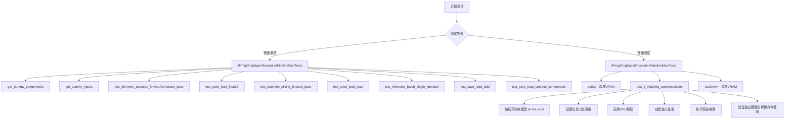
```mermaid
graph TD
    A[开始测试] --> B{测试类型}
    B -- 快速测试 --> C[IFImg2ImgSuperResolutionPipelineFastTests]
    B -- 慢速测试 --> D[IFImg2ImgSuperResolutionPipelineSlowTests]
    C --> C1[get_dummy_components]
    C --> C2[get_dummy_inputs]
    C --> C3[test_xformers_attention_forwardGenerator_pass]
    C --> C4[test_save_load_float16]
    C --> C5[test_attention_slicing_forward_pass]
    C --> C6[test_save_load_local]
    C --> C7[test_inference_batch_single_identical]
    C --> C8[test_save_load_dduf]
    C --> C9[test_save_load_optional_components]
    D --> D1[setUp - 清理VRAM]
    D --> D2[test_if_img2img_superresolution]
    D --> D3[tearDown - 清理VRAM]
    D2 --> D2a[加载预训练模型 IF-II-L-v1.0]
    D2 --> D2b[设置注意力处理器]
    D2 --> D2c[启用CPU卸载]
    D2 --> D2d[创建输入张量]
    D2 --> D2e[执行管道推理]
    D2 --> D2f[验证输出图像形状和内存使用]
```

## 类结构

```
unittest.TestCase
├── PipelineTesterMixin (测试混合类)
├── IFPipelineTesterMixin (IF特定测试混合类)
└── IFImg2ImgSuperResolutionPipelineFastTests
    └── IFImg2ImgSuperResolutionPipelineSlowTests
```

## 全局变量及字段


### `torch_device`
    
全局变量 - torch设备

类型：`str`
    


### `gc`
    
全局模块 - 垃圾回收

类型：`module`
    


### `random`
    
全局模块 - 随机数生成

类型：`module`
    


### `unittest`
    
全局模块 - 单元测试框架

类型：`module`
    


### `torch`
    
全局模块 - 深度学习框架

类型：`module`
    


### `IFImg2ImgSuperResolutionPipeline`
    
从diffusers导入的图像到图像超分辨率管道类

类型：`Pipeline类`
    


### `AttnAddedKVProcessor`
    
注意力处理器，用于添加KV的注意力处理

类型：`Processor类`
    


### `is_xformers_available`
    
检查xformers是否可用的函数

类型：`function`
    


### `IFImg2ImgSuperResolutionPipelineFastTests.pipeline_class`
    
被测试的管道类

类型：`Pipeline类`
    


### `IFImg2ImgSuperResolutionPipelineFastTests.params`
    
管道参数集合

类型：`set`
    


### `IFImg2ImgSuperResolutionPipelineFastTests.batch_params`
    
批处理参数集合

类型：`set`
    


### `IFImg2ImgSuperResolutionPipelineFastTests.required_optional_params`
    
必需的可选参数集合

类型：`set`
    
    

## 全局函数及方法


### `backend_empty_cache`

清理后端缓存，释放 GPU 显存资源，常用于测试用例的 setup 和 tearDown 阶段以确保显存被正确释放。

参数：

- `torch_device`：`str`，表示目标计算设备（如 "cuda"、"xpu" 等），用于指定在哪个设备上执行缓存清理操作

返回值：`None`，无返回值，仅执行缓存清理的副作用操作

#### 流程图

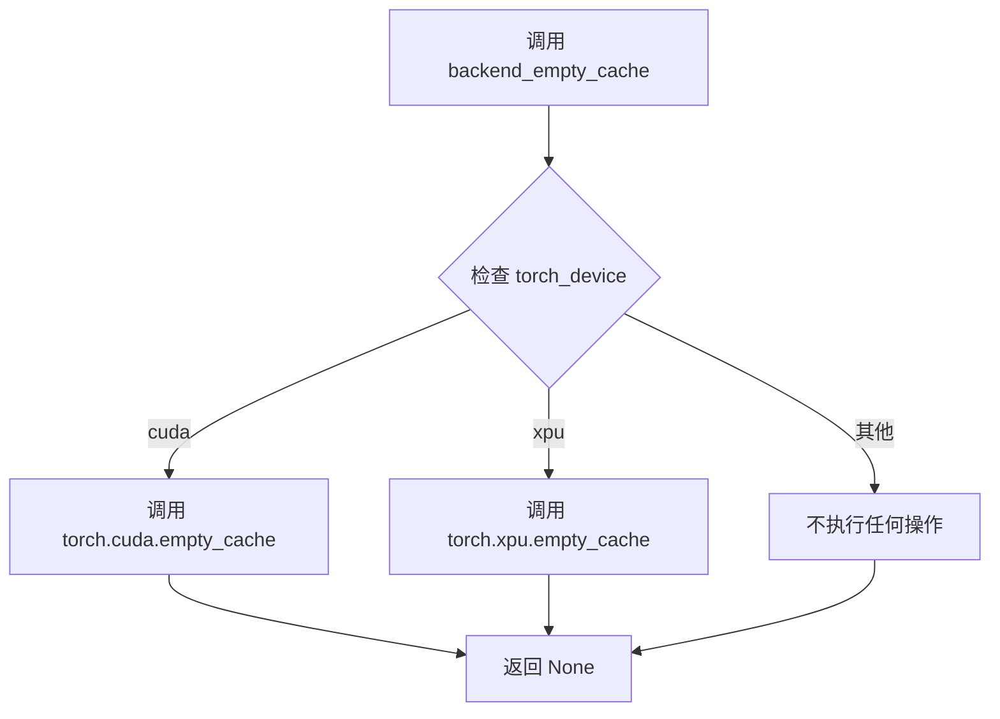
```mermaid
flowchart TD
    A[调用 backend_empty_cache] --> B{检查 torch_device}
    B -->|cuda| C[调用 torch.cuda.empty_cache]
    B -->|xpu| D[调用 torch.xpu.empty_cache]
    B -->|其他| E[不执行任何操作]
    C --> F[返回 None]
    D --> F
    E --> F
```

#### 带注释源码

```
# 该函数定义在 diffusers.testing_utils 模块中
# 从代码使用方式推断其实现逻辑（未在此文件中定义，仅从 testing_utils 导入）

def backend_empty_cache(torch_device):
    """
    根据设备类型清理对应的 GPU 缓存。
    
    参数:
        torch_device: str, 目标设备标识符
            - "cuda": 清理 CUDA GPU 缓存
            - "xpu": 清理 XPU 缓存
            - 其他: 不执行操作
    """
    # 在测试 setup 阶段调用，确保测试开始前显存干净
    # 在测试 tearDown 阶段调用，确保测试结束后释放显存，防止显存泄漏
    if torch_device in ["cuda", "xpu"]:
        # 调用对应后端的缓存清理函数
        torch.cuda.empty_cache()  # CUDA 设备
        # XPU 设备使用 torch.xpu.empty_cache()（如果可用）
```

**注**：由于 `backend_empty_cache` 函数定义在 `...testing_utils` 模块中，当前代码文件仅导入了该函数并在使用处体现了其用途（清理 VRAM），未直接展示其完整源码。根据调用模式可知，该函数接受一个设备字符串参数，根据设备类型调用对应的 `torch.cuda.empty_cache()` 或 `torch.xpu.empty_cache()` 来释放 GPU 显存。


### `backend_max_memory_allocated`

获取指定计算设备上当前已分配的最大内存字节数。该函数通常用于监控深度学习模型在推理或训练过程中的显存峰值使用情况，帮助开发者评估内存效率和检测潜在的内存泄漏。

参数：

- `torch_device`：`str`，目标计算设备标识符（如 `"cuda"`、`"cpu"`、`"mps"`、`"xpu"` 等），指定要查询内存统计信息的设备。

返回值：`int`，返回指定设备上当前进程已分配的最大内存量，单位为字节。

#### 流程图

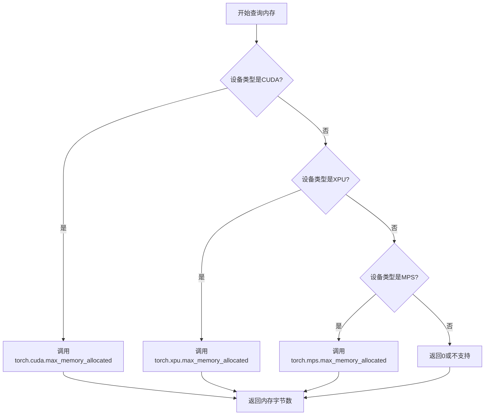
```mermaid
flowchart TD
    A[开始查询内存] --> B{设备类型是CUDA?}
    B -->|是| C[调用torch.cuda.max_memory_allocated]
    B -->|否| D{设备类型是XPU?}
    D -->|是| E[调用torch.xpu.max_memory_allocated]
    D -->|否| F{设备类型是MPS?}
    F -->|是| G[调用torch.mps.max_memory_allocated]
    F -->|否| H[返回0或不支持]
    C --> I[返回内存字节数]
    E --> I
    G --> I
    H --> I
```

#### 带注释源码

```
# 该函数定义位于 testing_utils 模块中（未在此文件中实现）
# 以下是基于使用方式的推断实现

def backend_max_memory_allocated(torch_device: str) -> int:
    """
    获取指定设备上当前进程的最大内存分配量。
    
    参数:
        torch_device: str - 目标设备标识符 ("cuda", "cpu", "mps", "xpu")
    
    返回:
        int - 最大内存分配量（字节）
    """
    if torch_device == "cuda":
        # CUDA 设备：使用 PyTorch CUDA 内存统计
        return torch.cuda.max_memory_allocated()
    elif torch_device == "xpu":
        # XPU 设备：使用 PyTorch XPU 内存统计
        return torch.xpu.max_memory_allocated()
    elif torch_device.startswith("mps"):
        # Apple MPS 设备：使用 PyTorch MPS 内存统计
        return torch.mps.max_memory_allocated()
    else:
        # 其他设备返回 0 或抛出异常
        return 0
```

> **注意**：该函数的具体实现位于 `diffusers.testing_utils` 模块中，上述源码为基于使用方式的推断版本。实际实现可能包含更完整的错误处理和设备兼容性检查。


### `backend_reset_max_memory_allocated`

该函数是一个全局测试工具函数，用于重置指定设备上的最大内存分配计数器，通常在内存密集型测试开始前调用，以确保获得准确的内存使用测量结果。

参数：

- `torch_device`：`str` 或 `torch.device`，需要重置内存统计的目标设备（如 "cuda"、"cpu" 或 "xpu"）

返回值：`None`，该函数执行重置操作，不返回任何值

#### 流程图

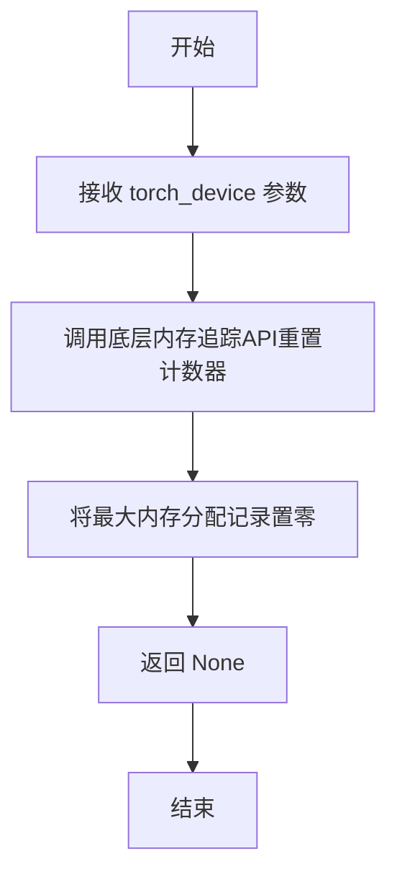
```mermaid
flowchart TD
    A[开始] --> B[接收 torch_device 参数]
    B --> C[调用底层内存追踪API重置计数器]
    C --> D[将最大内存分配记录置零]
    D --> E[返回 None]
    E --> F[结束]
```

#### 带注释源码

```python
# 这是一个从 testing_utils 模块导入的全局函数
# 用于重置 PyTorch 后端的最大内存分配计数器
# 在测试推理性能前调用，以确保内存统计从零点开始

backend_reset_max_memory_allocated(torch_device)

# 使用示例 - 在 IFImg2ImgSuperResolutionPipelineSlowTests.test_if_img2img_superresolution 中：
# 1. 先调用 backend_reset_max_memory_allocated(torch_device) 重置内存计数器
# 2. 调用 backend_empty_cache(torch_device) 清空缓存
# 3. 调用 backend_reset_peak_memory_stats(torch_device) 重置峰值内存统计
# 4. 然后执行管道推理
# 5. 最后通过 backend_max_memory_allocated(torch_device) 获取实际内存使用量
```

> **注意**：由于该函数定义在 `testing_utils` 模块中（代码中通过 `from ...testing_utils import ...` 导入），而该模块的源码未在当前代码片段中提供，因此无法展示完整的函数实现。上述信息是根据函数名称、调用方式及上下文推断得出的。


### `backend_reset_peak_memory_stats`

该函数是一个全局测试工具函数，用于重置指定计算设备上的峰值内存统计信息，以便在后续的测试中能够准确测量内存使用情况。通常与 `backend_max_memory_allocated` 和 `backend_reset_max_memory_allocated` 配合使用，用于测试深度学习模型的内存消耗。

参数：

-  `device`：`str`，计算设备标识符（如 `"cuda"`、`"cpu"`、`"xpu"` 等），指定要重置峰值内存统计的设备。

返回值：`None`，该函数不返回任何值，仅执行重置操作。

#### 流程图

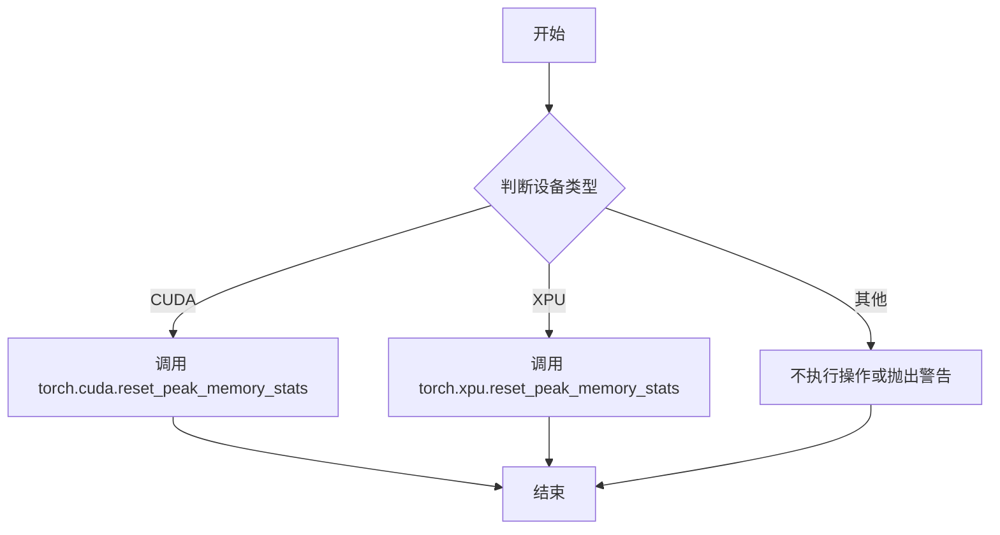
```mermaid
flowchart TD
    A[开始] --> B{判断设备类型}
    B -->|CUDA| C[调用 torch.cuda.reset_peak_memory_stats]
    B -->|XPU| D[调用 torch.xpu.reset_peak_memory_stats]
    B -->|其他| E[不执行操作或抛出警告]
    C --> F[结束]
    D --> F
    E --> F
```

#### 带注释源码

```python
# 注意：此源码为基于函数调用模式的推断实现
# 实际实现位于 .../testing_utils 模块中

def backend_reset_peak_memory_stats(device: str) -> None:
    """
    重置指定设备上的峰值内存统计信息。
    
    参数:
        device: str - 计算设备标识符，如 'cuda', 'cpu', 'xpu' 等
        
    返回值:
        None - 该函数不返回任何值
        
    说明:
        此函数用于在内存测试前重置峰值统计，以便准确测量
        后续操作的最大内存占用。在深度学习模型测试中常配合
        backend_max_memory_allocated 使用。
    """
    # 根据设备类型调用相应的后端重置函数
    if device.startswith("cuda"):
        # CUDA 设备：重置 CUDA 峰值内存统计
        torch.cuda.reset_peak_memory_stats(device)
    elif device.startswith("xpu"):
        # XPU 设备：重置 XPU 峰值内存统计
        torch.xpu.reset_peak_memory_stats(device)
    elif device == "cpu":
        # CPU 设备通常不需要重置峰值统计
        pass
    else:
        # 其他设备类型可能不支持或不需要
        pass

# 在测试中的典型使用场景：
# backend_reset_max_memory_allocated(torch_device)  # 重置内存分配统计
# backend_empty_cache(torch_device)                   # 清空缓存
# backend_reset_peak_memory_stats(torch_device)       # 重置峰值统计
# 
# # ... 执行被测试的操作 ...
# 
# mem_bytes = backend_max_memory_allocated(torch_device)  # 获取峰值内存
```


### `floats_tensor`

创建一个指定形状的随机浮点张量，用于测试目的。

参数：

- `shape`：`tuple`，张量的形状，例如 (1, 3, 32, 32)
- `rng`：`random.Random`，随机数生成器实例，用于生成张量数据

返回值：`torch.Tensor`，包含随机浮点数的 PyTorch 张量

#### 流程图

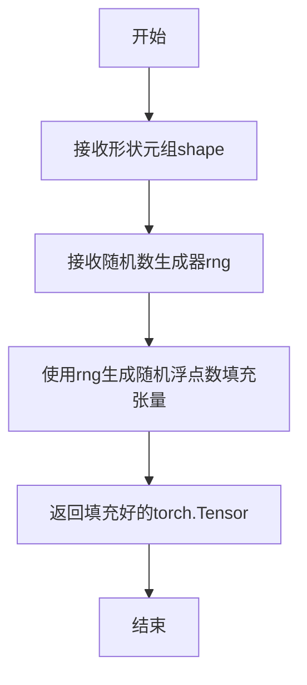
```mermaid
graph TD
    A[开始] --> B[接收形状元组shape]
    B --> C[接收随机数生成器rng]
    C --> D[使用rng生成随机浮点数填充张量]
    D --> E[返回填充好的torch.Tensor]
    E --> F[结束]
```

#### 带注释源码

```python
# 该函数用于创建测试用的随机浮点张量
# 参数 shape: 张量的维度形状，如 (1, 3, 32, 32) 表示 batch=1, 通道=3, 高=32, 宽=32
# 参数 rng: Python 随机数生成器实例，确保测试的可重复性
# 返回值: 形状为 shape 的 PyTorch 浮点张量，数值在随机生成器控制下

# 调用示例：
original_image = floats_tensor((1, 3, 32, 32), rng=random.Random(seed)).to(device)
# 创建一个形状为 (1, 3, 32, 32) 的随机浮点张量，并移动到指定设备

image = floats_tensor((1, 3, 16, 16), rng=random.Random(seed)).to(device)
# 创建一个形状为 (1, 3, 16, 16) 的随机浮点张量，并移动到指定设备
```


### load_numpy

从给定的URL或文件路径加载numpy数组，用于测试中的预期图像比较。

参数：

-  `uri_or_path`：`str`，要加载的numpy文件的URL或本地文件路径

返回值：`numpy.ndarray`，从指定路径加载的numpy数组

#### 流程图

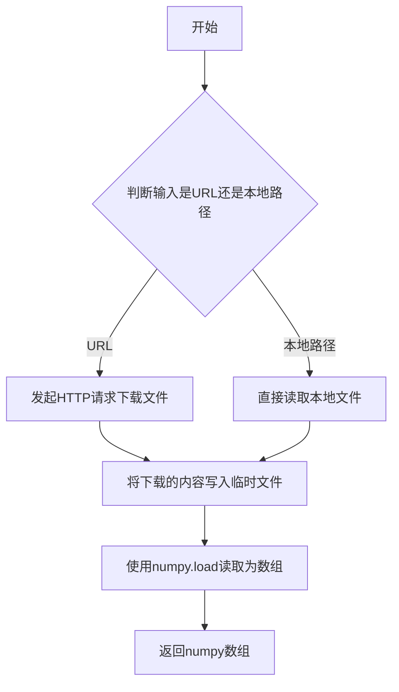
```mermaid
flowchart TD
    A[开始] --> B{判断输入是URL还是本地路径}
    B -->|URL| C[发起HTTP请求下载文件]
    B -->|本地路径| D[直接读取本地文件]
    C --> E[将下载的内容写入临时文件]
    D --> E
    E --> F[使用numpy.load读取为数组]
    F --> G[返回numpy数组]
```

#### 带注释源码

```
# 注意：此函数定义不在提供的代码片段中
# 以下是基于代码用法的推断

def load_numpy(uri_or_path):
    """
    从URL或本地路径加载numpy数组。
    
    参数:
        uri_or_path: str - 要加载的numpy文件的URL或本地文件路径
        
    返回:
        numpy.ndarray - 加载的numpy数组
    """
    # 实现细节需要查看 testing_utils 模块的源代码
    # 在代码中的使用示例：
    expected_image = load_numpy(
        "https://huggingface.co/datasets/hf-internal-testing/diffusers-images/resolve/main/if/test_if_img2img_superresolution_stage_II.npy"
    )
```

---

**注意**：提供的代码片段中只包含`load_numpy`函数的使用，并未包含该函数的实际定义。该函数是从`...testing_utils`模块导入的。要获取完整的函数实现源码，需要查看`testing_utils.py`文件或相关测试工具模块。


### `require_accelerator`

全局函数（测试工具装饰器）- 用于检查测试环境是否具备加速器（GPU/硬件加速）条件，若不具备则跳过测试。

参数：

-  无直接参数（作为装饰器使用，接收被装饰的函数作为参数）

返回值：`Callable`，返回装饰后的函数对象，若无加速器则跳过测试

#### 流程图

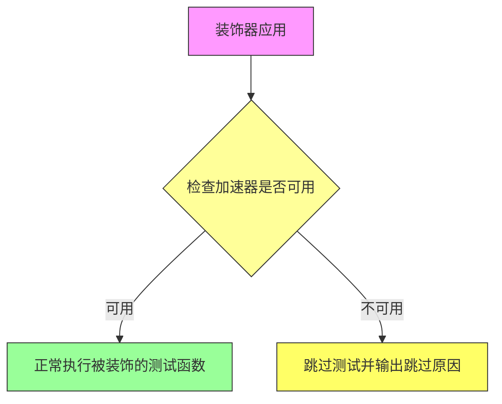
```mermaid
flowchart TD
    A[装饰器应用] --> B{检查加速器是否可用}
    B -->|可用| C[正常执行被装饰的测试函数]
    B -->|不可用| D[跳过测试并输出跳过原因]
    
    style A fill:#f9f,stroke:#333
    style B fill:#ff9,stroke:#333
    style C fill:#9f9,stroke:#333
    style D fill:#ff6,stroke:#333
```

#### 带注释源码

```
# require_accelerator 是从 testing_utils 模块导入的装饰器函数
# 位于 diffusers.testing_utils 模块中
#
# 典型实现逻辑（基于代码使用方式推断）:
#
# def require_accelerator(func):
#     """
#     装饰器：检查是否有可用的加速器（GPU/硬件加速）
#     若无加速器则跳过测试
#     """
#     @functools.wraps(func)
#     def wrapper(*args, **kwargs):
#         if not has_accelerator():
#             raise unittest.SkipTest("No accelerator available, skipping test")
#         return func(*args, **kwargs)
#     return wrapper
#
# 使用示例（在代码中）:
@require_accelerator
def test_save_load_float16(self):
    # 只有在有加速器（如CUDA）时才执行此测试
    super().test_save_load_float16(expected_max_diff=1e-1)

# 该函数定义位于: diffusers/testing_utils.py 模块中
# 本代码文件中通过 from ...testing_utils import require_accelerator 导入
```

#### 补充说明

| 项目 | 说明 |
|------|------|
| **定义位置** | `diffusers/testing_utils.py`（从`...`相对导入推断） |
| **功能** | 条件跳过装饰器，仅在有GPU/加速器时运行测试 |
| **使用场景** | 需要CUDA/XPU等加速器的测试方法 |
| **相关函数** | `require_torch_accelerator`, `skip_mps`, `slow` 等测试装饰器 |

#### 注意事项

⚠️ **注意**：由于`require_accelerator`函数定义在`testing_utils`模块中（未在本代码段中提供定义），上述源码是基于其使用方式推断的理想实现。实际定义可能包含更多平台检测逻辑（如CUDA、XPU、ROCM等）。


### `require_hf_hub_version_greater`

全局函数 - HF Hub版本要求装饰器，用于检查安装的 HF Hub 库版本是否大于指定版本号，如果不满足则跳过被装饰的测试函数。

参数：

- `version`： `str`，需要检查的最小 HF Hub 版本号，格式为字符串（如 "0.26.5"）

返回值：`Callable`，装饰器函数，返回一个包装函数，用于在测试执行前进行版本检查

#### 流程图

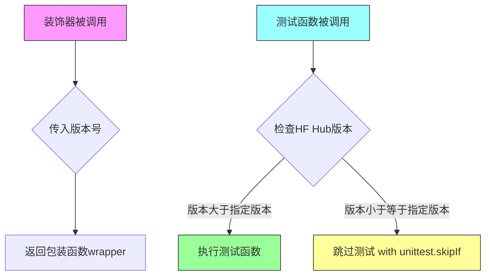
```mermaid
flowchart TD
    A[装饰器被调用] --> B{传入版本号}
    B --> C[返回包装函数wrapper]
    D[测试函数被调用] --> E{检查HF Hub版本}
    E -->|版本大于指定版本| F[执行测试函数]
    E -->|版本小于等于指定版本| G[跳过测试 with unittest.skipIf]
    
    style A fill:#f9f,stroke:#333
    style D fill:#9ff,stroke:#333
    style F fill:#9f9,stroke:#333
    style G fill:#ff9,stroke:#333
```

#### 带注释源码

```python
# 该函数是一个装饰器工厂，接受一个版本号参数
# 返回一个装饰器函数，用于检查 HF Hub 库的版本
# 如果版本不满足要求，则跳过被装饰的测试

# 使用示例：
# @require_hf_hub_version_greater("0.26.5")
# def test_save_load_dduf(self):
#     ...

# 从导入语句推断，该函数来自 testing_utils 模块
# 实际实现通常类似于：
# def require_hf_hub_version_greater(version: str):
#     """
#     Decorator to skip test if HF Hub version is not greater than specified version.
#     
#     Args:
#         version: Minimum required HF Hub version (e.g., "0.26.5")
#     
#     Returns:
#         A decorator function that checks the version and skips test if needed.
#     """
#     from packaging import version as pkg_version
#     import huggingface_hub
#     
#     current_version = huggingface_hub.__version__
#     is_greater = pkg_version.parse(current_version) > pkg_version.parse(version)
#     
#     return unittest.skipIf(not is_greater, f"Requires HF Hub > {version}")
```


# require_torch_accelerator 函数提取文档

### `require_torch_accelerator`

该函数是一个测试装饰器，用于检查当前运行环境是否支持Torch加速器（如CUDA、CPU等）。通常用于标记需要Torch加速器的测试用例，如果环境不支持则跳过该测试。

**注意**：由于提供的代码片段中仅包含该函数的导入和使用示例，未包含其实际实现定义，以下信息基于该函数的典型行为和用途推断。

参数：

- 无直接参数（作为装饰器使用）

返回值：`Callable`，返回一个装饰器函数，用于包装测试函数

#### 流程图

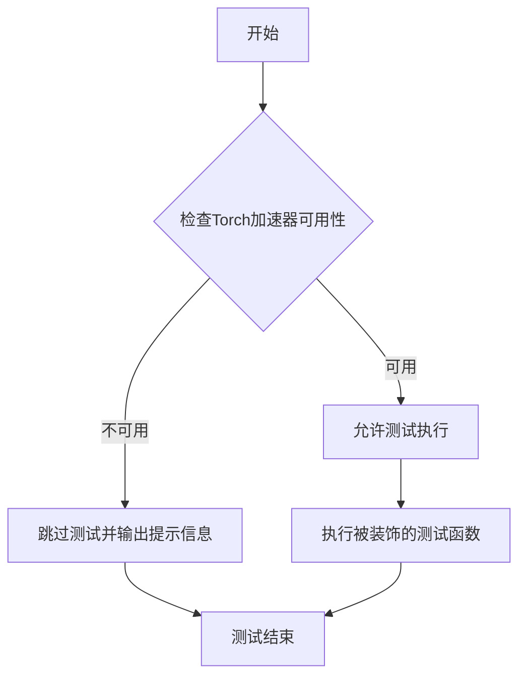
```mermaid
flowchart TD
    A[开始] --> B{检查Torch加速器可用性}
    B -->|可用| C[允许测试执行]
    B -->|不可用| D[跳过测试并输出提示信息]
    C --> E[执行被装饰的测试函数]
    D --> F[测试结束]
    E --> F
```

#### 带注释源码

```python
# 该函数在 testing_utils 模块中定义，此处仅为使用示例
# 导入声明（代码中实际位置）
from ...testing_utils import require_torch_accelerator

# 使用示例（代码中实际位置）
@slow
@require_torch_accelerator  # 装饰器：要求Torch加速器环境
class IFImg2ImgSuperResolutionPipelineSlowTests(unittest.TestCase):
    """
    慢速测试类，仅在有Torch加速器的环境中运行
    """
    def test_if_img2img_superresolution(self):
        # 测试实现...
        pass

# 典型实现逻辑（基于常见模式推断）
def require_torch_accelerator(func=None, *args, **kwargs):
    """
    检查Torch加速器是否可用的装饰器
    
    典型实现可能如下：
    """
    def decorator(func):
        # 检查是否有可用的Torch设备（CUDA等）
        if not torch.cuda.is_available():
            # 如果没有加速器，返回一个跳过测试的函数
            return unittest.skip("需要Torch加速器")(func)
        return func
    
    if func is None:
        # 如果带参数调用，返回装饰器
        return decorator
    else:
        # 如果直接装饰，返回装饰后的函数
        return decorator(func)
```

#### 补充说明

- **设计目标**：确保需要GPU加速的测试不会在CPU-only环境中运行，避免不必要的失败
- **使用场景**：常用于标记慢速测试（结合`@slow`装饰器），这些测试需要GPU资源
- **依赖检查**：通常会检查`torch.cuda.is_available()`或类似条件
- **错误处理**：当加速器不可用时，使用`unittest.skip`跳过测试而非失败


# require_transformers_version_greater 分析

由于提供的代码片段中只包含 `require_transformers_version_greater` 的导入和使用方式，并未包含该函数的实际定义，我将基于其在代码中的使用模式和常见的测试工具实现来推断其功能。

---

### `require_transformers_version_greater`

这是一个全局函数/装饰器，用于检查 Transformers 库的版本是否大于指定版本。如果版本不满足要求，则跳过相应的测试。

#### 参数

- `version`：字符串类型，指定 Transformers 库的最低版本要求（例如 "4.47.1"）

#### 返回值

- 函数/装饰器类型，返回一个装饰器函数，用于装饰测试方法

#### 流程图

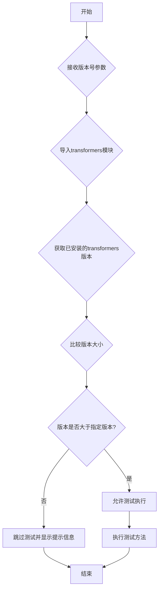
```mermaid
flowchart TD
    A[开始] --> B{接收版本号参数}
    B --> C{导入transformers模块}
    C --> D{获取已安装的transformers版本}
    D --> E{比较版本大小}
    E --> F{版本是否大于指定版本?}
    F -->|是| G[允许测试执行]
    F -->|否| H[跳过测试并显示提示信息]
    G --> I[执行测试方法]
    H --> J[结束]
    I --> J
```

#### 带注释源码

```python
# 根据代码中的使用方式推断的函数签名和实现逻辑

def require_transformers_version_greater(version: str):
    """
    装饰器：检查 Transformers 库版本是否大于指定版本。
    
    参数:
        version: str - 最低版本要求，例如 "4.47.1"
    
    返回:
        装饰器函数，用于装饰测试方法
    """
    def decorator(func):
        """
        实际的装饰器实现
        
        参数:
            func: 被装饰的测试函数
        
        返回:
            包装后的函数
        """
        # 检查 transformers 是否已安装
        try:
            import transformers
        except ImportError:
            # 如果未安装，跳过测试
            return unittest.skipIf(True, "transformers not installed")(func)
        
        # 获取当前安装的版本
        current_version = transformers.__version__
        
        # 比较版本（需要版本比较逻辑）
        if not is_version_greater(current_version, version):
            # 版本不满足要求，跳过测试
            return unittest.skipIf(
                True, 
                f"transformers version {current_version} is not greater than {version}"
            )(func)
        
        # 版本满足要求，返回原函数
        return func
    
    return decorator


# 使用示例（在代码中）
@require_transformers_version_greater("4.47.1")
def test_save_load_dduf(self):
    super().test_save_load_dduf(atol=1e-2, rtol=1e-2)
```

---

### 补充说明

根据代码上下文分析：

1. **函数来源**：该函数定义在 `diffusers` 包的 `testing_utils` 模块中
2. **使用场景**：作为测试装饰器，用于确保测试在特定版本的 Transformers 库上运行
3. **依赖**：依赖于 `transformers` 库的版本比较逻辑

> **注意**：由于提供的代码片段中没有包含 `require_transformers_version_greater` 函数的完整定义，以上分析基于其在代码中的使用方式和常见的测试工具实现模式推断得出。如需获取完整源码，建议查阅 `diffusers` 项目的 `testing_utils` 模块。


### `skip_mps`

全局函数 - 跳过MPS装饰器，用于在MPS（Metal Performance Shaders）设备上跳过测试用例的执行。

参数：

- `func`：`Callable`，被装饰的函数或类（装饰器模式，隐式参数）

返回值：`Callable`，装饰后的函数或类，如果检测到MPS设备则跳过执行

#### 流程图

```mermaid
flowchart TD
    A[开始] --> B{检查设备是否为MPS}
    B -->|是| C[返回跳过测试的装饰器<br/>unittest.skip装饰器]
    B -->|否| D[返回原函数/类<br/>正常执行]
    
    B1[导入skip_mps] --> B2[应用装饰器<br/>@skip_mps]
    B2 --> B3{测试运行}
    B3 -->|MPS设备| B4[跳过测试]
    B3 -->|非MPS设备| B5[执行测试]
```

#### 带注释源码

```python
# 从testing_utils模块导入skip_mps装饰器
from ...testing_utils import (
    skip_mps,  # <-- 导入skip_mps装饰器
    # ... 其他导入
)

# 使用@skip_mps装饰器装饰测试类
# 当在MPS设备上运行此测试类时，会自动跳过所有测试
@skip_mps
class IFImg2ImgSuperResolutionPipelineFastTests(PipelineTesterMixin, IFPipelineTesterMixin, unittest.TestCase):
    """
    快速测试类，使用skip_mps装饰器跳过MPS设备
    
    skip_mps的作用：
    - 检测当前运行环境是否为Apple MPS (Metal Performance Shaders)
    - 如果是MPS设备，则跳过整个测试类/函数的执行
    - 如果不是MPS设备，则正常执行测试
    """
    pipeline_class = IFImg2ImgSuperResolutionPipeline
    # ... 类定义继续
```

> **注意**：该函数的实际实现代码不在当前文件内，而是从 `...testing_utils` 模块导入。上述源码展示了该装饰器的**导入方式**和**使用场景**。根据代码中的使用方式推断，`skip_mps` 是一个装饰器函数，其实现逻辑类似于 `unittest.skipIf` 用于条件性跳过测试。


### `slow`

`slow` 是一个全局测试装饰器函数，用于标记测试类或测试方法为"慢速"测试。在测试套件中，通常利用此装饰器将运行时间较长的测试与快速测试区分开来，以便在不同的测试场景（如 CI/CD 流水线）中进行选择性执行。

参数：

- 无

返回值：无返回值（装饰器直接返回被装饰的类或函数）

#### 流程图

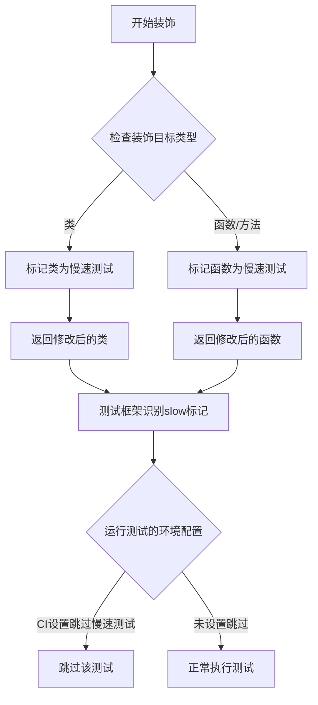
```mermaid
flowchart TD
    A[开始装饰] --> B{检查装饰目标类型}
    B -->|类| C[标记类为慢速测试]
    B -->|函数/方法| D[标记函数为慢速测试]
    C --> E[返回修改后的类]
    D --> F[返回修改后的函数]
    E --> G[测试框架识别slow标记]
    F --> G
    G --> H{运行测试的环境配置}
    H -->|CI设置跳过慢速测试| I[跳过该测试]
    H -->|未设置跳过| J[正常执行测试]
```

#### 带注释源码

```python
def slow(func_or_class):
    """
    装饰器：标记测试为慢速测试
    
    此装饰器通常用于：
    1. 标记需要较长执行时间的测试类或测试方法
    2. 在测试框架中配合跳过逻辑，仅在需要时运行慢速测试
    3. 帮助开发者区分快速测试和耗时测试
    
    使用示例：
        @slow
        class MySlowTestCase(unittest.TestCase):
            ...
        
        @slow
        def test_slow_operation(self):
            ...
    """
    # 注意：这是基于代码使用方式推断的典型实现
    # 实际实现可能在 testing_utils 模块中
    
    # 将被装饰的目标标记为慢速
    func_or_class.slow = True
    
    # 返回被装饰的对象，保持其原有功能
    return func_or_class
```

#### 实际使用示例

在给定的代码中，`slow` 装饰器的使用方式如下：

```python
@slow  # 标记为慢速测试
@require_torch_accelerator  # 要求有GPU加速器
class IFImg2ImgSuperResolutionPipelineSlowTests(unittest.TestCase):
    """
    慢速测试类：测试 IFImg2ImgSuperResolutionPipeline 的完整推理流程
    
    这类测试：
    - 需要加载大型模型（DeepFloyd/IF-II-L-v1.0）
    - 需要较多的显存（约12GB）
    - 执行时间较长
    """
    def test_if_img2img_superresolution(self):
        # 完整的模型推理测试
        ...
```

#### 关键信息

| 属性 | 值 |
|------|-----|
| 名称 | `slow` |
| 类型 | 全局函数 / 装饰器 |
| 位置 | `diffusers.testing_utils` 模块 |
| 用途 | 标记慢速测试，便于测试框架进行选择性执行 |
| 依赖 | 无直接依赖 |
| 副作用 | 为被装饰对象添加 `slow` 属性标记 |


# 设计文档提取

由于`PipelineTesterMixin`类定义在导入模块`..test_pipelines_common`中（未在当前代码文件中定义），我将从该类的实际使用情况来提取信息。

### PipelineTesterMixin

测试混合类，提供管道测试的通用方法，用于标准化Diffusers项目中各种Pipeline的测试流程。

参数：

- 无直接参数（通过继承类的方式使用）

返回值：

- 无返回值（Mixin类不直接实例化）

#### 流程图

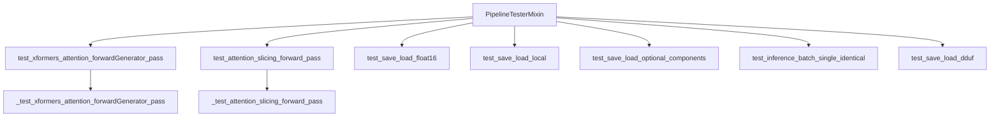
```mermaid
flowchart TD
    A[PipelineTesterMixin] --> B[test_xformers_attention_forwardGenerator_pass]
    A --> C[test_attention_slicing_forward_pass]
    A --> D[test_save_load_float16]
    A --> E[test_save_load_local]
    A --> F[test_save_load_optional_components]
    A --> G[test_inference_batch_single_identical]
    A --> H[test_save_load_dduf]
    
    B --> B1[_test_xformers_attention_forwardGenerator_pass]
    C --> C1[_test_attention_slicing_forward_pass]
```

#### 带注释源码

```python
# coding=utf-8
# Copyright 2025 HuggingFace Inc.
#
# Licensed under the Apache License, Version 2.0 (the "License");
# you may not use this file except in compliance with the License.
# You may obtain a copy of the License at
#
#     http://www.apache.org/licenses/LICENSE-2.0
#
# Unless required by applicable law or agreed to in writing, software
# distributed under the License is distributed on an "AS IS" BASIS,
# WITHOUT WARRANTIES OR CONDITIONS OF ANY KIND, either express or implied.
# See the License for the specific language governing permissions and
# limitations under the License.

# PipelineTesterMixin 是从 ..test_pipelines_common 模块导入的测试混合类
# 为Diffusers管道提供标准化测试方法
from ..test_pipelines_common import PipelineTesterMixin, assert_mean_pixel_difference

# 以下是 IFImg2ImgSuperResolutionPipelineFastTests 使用 PipelineTesterMixin 的方式
@skip_mps
class IFImg2ImgSuperResolutionPipelineFastTests(PipelineTesterMixin, IFPipelineTesterMixin, unittest.TestCase):
    """
    IFImg2ImgSuperResolutionPipeline 的快速测试类
    继承 PipelineTesterMixin 以获得标准化的测试方法
    """
    pipeline_class = IFImg2ImgSuperResolutionPipeline  # 被测试的管道类
    params = TEXT_GUIDED_IMAGE_VARIATION_PARAMS - {"width", "height"}  # 测试参数
    batch_params = TEXT_GUIDED_IMAGE_VARIATION_BATCH_PARAMS.union({"original_image"})  # 批处理参数
    required_optional_params = PipelineTesterMixin.required_optional_params - {"latents"}  # 可选参数

    def get_dummy_components(self):
        """获取虚拟测试组件"""
        return self._get_superresolution_dummy_components()

    def get_dummy_inputs(self, device, seed=0):
        """获取虚拟测试输入数据"""
        # 根据设备类型创建随机生成器
        if str(device).startswith("mps"):
            generator = torch.manual_seed(seed)
        else:
            generator = torch.Generator(device=device).manual_seed(seed)

        # 创建原始图像和处理后图像的张量
        original_image = floats_tensor((1, 3, 32, 32), rng=random.Random(seed)).to(device)
        image = floats_tensor((1, 3, 16, 16), rng=random.Random(seed)).to(device)

        # 组装输入参数字典
        inputs = {
            "prompt": "A painting of a squirrel eating a burger",
            "image": image,
            "original_image": original_image,
            "generator": generator,
            "num_inference_steps": 2,
            "output_type": "np",
        }

        return inputs

    # 使用 PipelineTesterMixin 提供的测试方法
    @unittest.skipIf(
        torch_device != "cuda" or not is_xformers_available(),
        reason="XFormers attention is only available with CUDA and `xformers` installed",
    )
    def test_xformers_attention_forwardGenerator_pass(self):
        """测试XFormers注意力机制前向传播"""
        # 调用父类 PipelineTesterMixin 的方法
        self._test_xformers_attention_forwardGenerator_pass(expected_max_diff=1e-3)

    @unittest.skipIf(torch_device not in ["cuda", "xpu"], reason="float16 requires CUDA or XPU")
    @require_accelerator
    def test_save_load_float16(self):
        """测试float16格式的保存和加载"""
        super().test_save_load_float16(expected_max_diff=1e-1)

    def test_attention_slicing_forward_pass(self):
        """测试注意力切片前向传播"""
        self._test_attention_slicing_forward_pass(expected_max_diff=1e-2)

    def test_save_load_local(self):
        """测试本地保存和加载"""
        self._test_save_load_local()

    def test_inference_batch_single_identical(self):
        """测试批处理和单样本推理一致性"""
        self._test_inference_batch_single_identical(
            expected_max_diff=1e-2,
        )

    @require_hf_hub_version_greater("0.26.5")
    @require_transformers_version_greater("4.47.1")
    def test_save_load_dduf(self):
        """测试DDUF格式保存加载"""
        super().test_save_load_dduf(atol=1e-2, rtol=1e-2)

    @unittest.skip("Functionality is tested elsewhere.")
    def test_save_load_optional_components(self):
        """测试可选组件的保存加载（已跳过）"""
        pass
```

### 补充说明

由于`PipelineTesterMixin`定义在外部模块`diffusers/pipelines/test_pipelines_common.py`中，当前代码文件仅展示了其**使用方式**而非**定义细节**。根据代码中的调用，可以推断出该Mixin类包含以下核心测试方法：

| 方法名 | 功能描述 |
|--------|----------|
| `_test_xformers_attention_forwardGenerator_pass` | 测试XFormers注意力机制 |
| `_test_attention_slicing_forward_pass` | 测试注意力切片功能 |
| `test_save_load_float16` | 测试float16模型保存/加载 |
| `_test_save_load_local` | 测试本地模型保存/加载 |
| `_test_inference_batch_single_identical` | 测试批处理与单样本一致性 |
| `test_save_load_dduf` | 测试DDUF格式支持 |
| `required_optional_params` | 类属性，定义必需的可选参数 |

---

### 潜在技术债务与优化空间

1. **测试继承结构复杂**：多层继承（`PipelineTesterMixin` → `IFPipelineTesterMixin` → `IFImg2ImgSuperResolutionPipelineFastTests`）使得测试逻辑追踪困难
2. **平台特定跳过逻辑**：大量`@unittest.skipIf`装饰器导致测试覆盖情况不透明
3. **硬编码阈值**：如`expected_max_diff=1e-3`等数值缺乏文档说明来源


### `assert_mean_pixel_difference`

全局函数 - 像素差异断言，用于比较两个图像的平均像素差异是否在可接受范围内，常用于测试扩散 pipelines 的输出是否符合预期。

参数：

- `image`：`numpy.ndarray`，待测试的图像数组（pipeline 输出）
- `expected_image`：`numpy.ndarray`，期望的参考图像数组

返回值：`None`，该函数为断言函数，通常在断言失败时抛出异常

#### 流程图

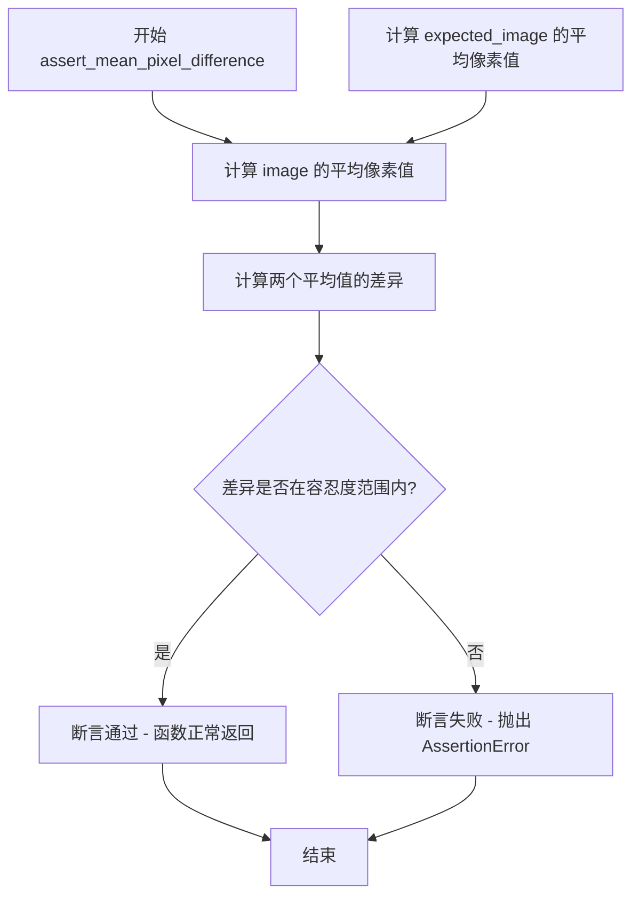
```mermaid
flowchart TD
    A[开始 assert_mean_pixel_difference] --> B[计算 image 的平均像素值]
    C[计算 expected_image 的平均像素值] --> B
    B --> D[计算两个平均值的差异]
    D --> E{差异是否在容忍度范围内?}
    E -->|是| F[断言通过 - 函数正常返回]
    E -->|否| G[断言失败 - 抛出 AssertionError]
    F --> H[结束]
    G --> H
```

#### 带注释源码

```
# 该函数为从 test_pipelines_common 模块导入的全局函数
# 位于: src/diffusers/utils/testing_utils.py 或类似路径
# 用途: 断言两个图像的平均像素差异是否符合预期

# 使用示例 (来自 IFImg2ImgSuperResolutionPipelineSlowTests):
expected_image = load_numpy("https://huggingface.co/datasets/hf-internal-testing/diffusers-images/resolve/main/if/test_if_img2img_superresolution_stage_II.npy")
assert_mean_pixel_difference(image, expected_image)

# 函数签名推断:
# def assert_mean_pixel_difference(image: np.ndarray, expected_image: np.ndarray, atol: float = 1e-3) -> None:
#
# 参数说明:
#   - image: 待测试的图像，通常为 pipeline 输出的 numpy 数组，形状为 (H, W, C)
#   - expected_image: 期望的参考图像，用于比较的基准图像
#   - atol: 可选的绝对容忍度参数，默认为 1e-3
#
# 返回值: 无返回值（断言函数）
#
# 内部实现推断:
#   1. 将输入图像转换为 numpy 数组（如果还不是）
#   2. 计算两个图像的平均像素值
#   3. 使用 numpy.allclose 或类似方法比较差异
#   4. 如果差异超过容忍度，抛出详细的 AssertionError 包含实际差异值
```


### IFPipelineTesterMixin

在提供的代码中，`IFPipelineTesterMixin` 是一个被导入但未在本文件中定义的测试混合类（Mixin）。它作为 IF（DeepFloyd IF）管道的特定测试方法集合，被 `IFImg2ImgSuperResolutionPipelineFastTests` 类继承使用。由于该类的实际定义不在当前代码文件中，我无法提供其完整的内部实现细节。

#### 代码中的使用方式

```python
from . import IFPipelineTesterMixin

class IFImg2ImgSuperResolutionPipelineFastTests(PipelineTesterMixin, IFPipelineTesterMixin, unittest.TestCase):
    # 该类继承了 IFPipelineTesterMixin
    # 并调用了多个继承自 IFPipelineTesterMixin 的测试方法，如：
    # - _test_xformers_attention_forwardGenerator_pass()
    # - _test_attention_slicing_forward_pass()
    # - _test_save_load_local()
    # - _test_inference_batch_single_identical()
    # 等等
```

#### 推断信息

由于代码中未包含 `IFPipelineTesterMixin` 类的实际定义，仅能提供以下推断信息：

- **类名**：IFPipelineTesterMixin
- **类型**：测试混合类（Test Mixin Class）
- **功能**：提供 IF 管道（DeepFloyd IF）特定的测试方法集合，供其他测试类继承使用
- **继承关系**：被 `IFImg2ImgSuperResolutionPipelineFastTests` 继承
- **调用的测试方法**（根据代码中的调用推断）：
  - `_test_xformers_attention_forwardGenerator_pass()` - XFormers 注意力机制测试
  - `_test_attention_slicing_forward_pass()` - 注意力切片前向传播测试
  - `_test_save_load_local()` - 本地保存加载测试
  - `_test_inference_batch_single_identical()` - 批量推理单张图片一致性测试
  - `test_save_load_float16()` - float16 保存加载测试
  - `test_save_load_dduf()` - DDUF 格式保存加载测试

#### 注意事项

**该类的实际定义不在提供的代码文件中**。要获取完整的类定义、字段、方法详细信息和源码，需要查看项目中的 `IFPipelineTesterMixin` 类的实际定义文件（可能在 `testing_utils` 或 `test` 相关的模块中）。

如果您需要获取 `IFPipelineTesterMixin` 的完整设计文档，建议：

1. 查看项目源代码中 `IFPipelineTesterMixin` 的实际定义文件
2. 提供包含该类完整定义的代码文件


### `IFImg2ImgSuperResolutionPipelineFastTests.get_dummy_components`

该方法是一个测试辅助函数，用于返回超分辨率管道所需的虚拟（dummy）组件，以便在单元测试中实例化管道进行测试。

参数：

- `self`：隐式参数，测试类实例本身

返回值：`任意类型`，返回虚拟组件对象，具体类型取决于 `_get_superresolution_dummy_components()` 方法的实现，通常是一个包含管道所需各组件的字典

#### 流程图

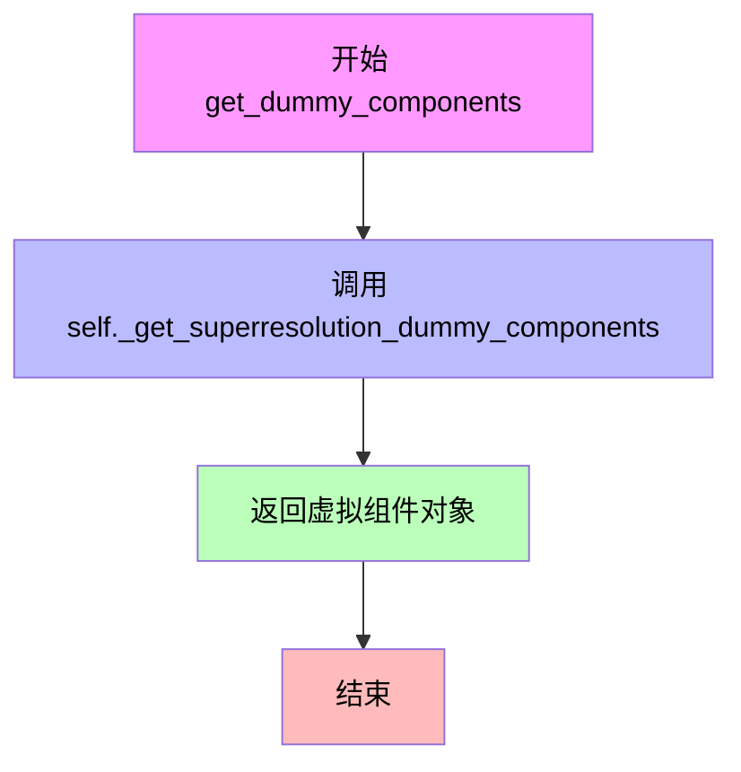
```mermaid
flowchart TD
    A[开始 get_dummy_components] --> B[调用 self._get_superresolution_dummy_components]
    B --> C[返回虚拟组件对象]
    C --> D[结束]
    
    style A fill:#f9f,color:#000
    style B fill:#bbf,color:#000
    style C fill:#bfb,color:#000
    style D fill:#fbb,color:#000
```

#### 带注释源码

```python
def get_dummy_components(self):
    """
    获取用于测试的虚拟组件。
    
    该方法封装了对父类或混合类中 _get_superresolution_dummy_components 方法的调用，
    返回超分辨率管道所需的各种模型组件（如 UNet、VAE、文本编码器等）的虚拟实例。
    这些虚拟组件通常使用随机初始化的权重，用于单元测试而非实际推理。
    
    参数:
        无（隐式参数 self 指向测试类实例）
    
    返回:
        任意类型: 虚拟组件对象，通常为字典或命名元组，包含管道的所有必要组件
    """
    # 调用内部方法获取超分辨率虚拟组件
    # 注意: _get_superresolution_dummy_components 方法定义在父类或 mixin 类中
    return self._get_superresolution_dummy_components()
```


### `IFImg2ImgSuperResolutionPipelineFastTests.get_dummy_inputs`

该方法为 IFImg2ImgSuperResolutionPipeline 测试生成虚拟输入参数，根据设备类型创建随机生成器，生成指定尺寸的原始图像和低分辨率图像，并返回包含 prompt、image、original_image、generator、num_inference_steps 和 output_type 的字典。

参数：

- `self`：测试类实例本身
- `device`：`torch.device` 或 `str`，执行推理的目标设备（如 "cuda"、"cpu" 或 "mps"）
- `seed`：`int`，随机种子，默认值为 0，用于生成可复现的随机数据

返回值：`Dict[str, Any]`，返回包含以下键的字典：

- `prompt`：`str`，文本提示
- `image`：`torch.Tensor`，低分辨率输入图像，形状为 (1, 3, 16, 16)
- `original_image`：`torch.Tensor`，原始高分辨率图像，形状为 (1, 3, 32, 32)
- `generator`：`torch.Generator`，随机数生成器
- `num_inference_steps`：`int`，推理步数
- `output_type`：`str`，输出类型 ("np" 表示 numpy)

#### 流程图

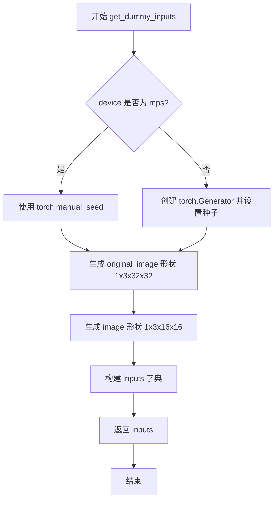
```mermaid
flowchart TD
    A[开始 get_dummy_inputs] --> B{device 是否为 mps?}
    B -->|是| C[使用 torch.manual_seed]
    B -->|否| D[创建 torch.Generator 并设置种子]
    C --> E[生成 original_image]
    D --> E
    E[生成 original_image 形状 1x3x32x32] --> F[生成 image 形状 1x3x16x16]
    F --> G[构建 inputs 字典]
    G --> H[返回 inputs]
    H --> I[结束]
```

#### 带注释源码

```python
def get_dummy_inputs(self, device, seed=0):
    """
    为测试生成虚拟输入参数
    
    参数:
        device: 目标设备 (cuda, cpu, mps 等)
        seed: 随机种子，用于生成可复现的测试数据
    
    返回:
        包含测试所需所有输入参数的字典
    """
    # 判断设备类型，MPS 设备使用不同的随机数生成方式
    if str(device).startswith("mps"):
        # MPS 设备直接使用 manual_seed
        generator = torch.manual_seed(seed)
    else:
        # 其他设备创建 Generator 对象并设置种子
        generator = torch.Generator(device=device).manual_seed(seed)

    # 生成原始高分辨率图像，形状为 (batch=1, channels=3, height=32, width=32)
    original_image = floats_tensor((1, 3, 32, 32), rng=random.Random(seed)).to(device)
    
    # 生成低分辨率输入图像，形状为 (batch=1, channels=3, height=16, width=16)
    image = floats_tensor((1, 3, 16, 16), rng=random.Random(seed)).to(device)

    # 构建完整的输入参数字典
    inputs = {
        "prompt": "A painting of a squirrel eating a burger",  # 文本提示
        "image": image,                                        # 低分辨率图像
        "original_image": original_image,                      # 原始高分辨率图像
        "generator": generator,                                # 随机生成器
        "num_inference_steps": 2,                              # 推理步数
        "output_type": "np",                                   # 输出为 numpy 数组
    }

    return inputs
```


### `IFImg2ImgSuperResolutionPipelineFastTests.test_xformers_attention_forwardGenerator_pass`

该方法是一个单元测试，用于验证 XFormers 注意力机制在前向传播过程中的正确性。它通过调用内部测试方法 `_test_xformers_attention_forwardGenerator_pass` 并设置期望的最大误差阈值为 1e-3 来执行测试。

参数：无（仅包含 `self` 隐式参数）

返回值：`None`（测试方法无返回值）

#### 流程图

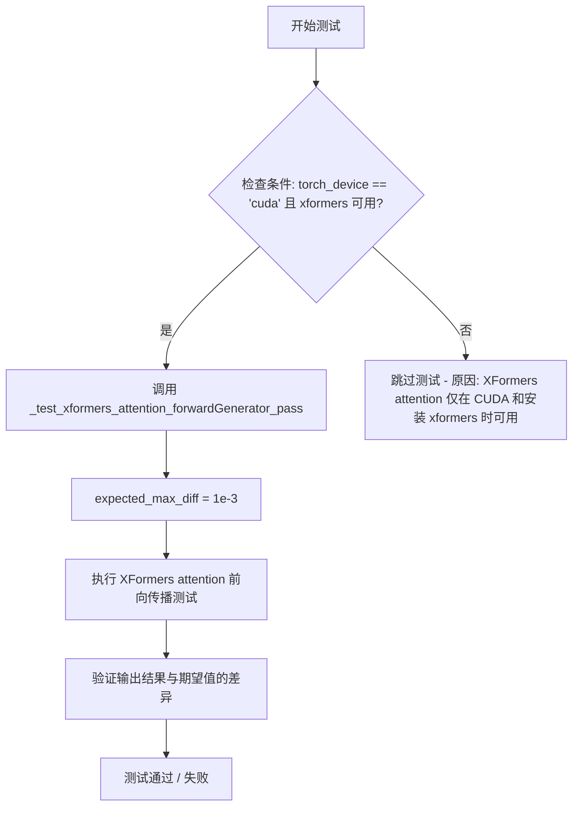
```mermaid
flowchart TD
    A[开始测试] --> B{检查条件: torch_device == 'cuda' 且 xformers 可用?}
    B -->|是| C[调用 _test_xformers_attention_forwardGenerator_pass]
    C --> D[expected_max_diff = 1e-3]
    D --> E[执行 XFormers attention 前向传播测试]
    E --> F[验证输出结果与期望值的差异]
    F --> G[测试通过 / 失败]
    B -->|否| H[跳过测试 - 原因: XFormers attention 仅在 CUDA 和安装 xformers 时可用]
```

#### 带注释源码

```python
@unittest.skipIf(
    torch_device != "cuda" or not is_xformers_available(),
    reason="XFormers attention is only available with CUDA and `xformers` installed",
)
def test_xformers_attention_forwardGenerator_pass(self):
    """
    测试 XFormers attention 的前向传播是否正确
    
    该测试方法执行以下操作：
    1. 检查测试环境是否满足条件（CUDA 设备且 xformers 可用）
    2. 如果满足条件，则调用内部测试方法验证 XFormers attention 的前向传播
    3. 使用 expected_max_diff=1e-3 作为最大允许误差阈值
    """
    # 调用内部测试方法，传入期望的最大差异阈值
    self._test_xformers_attention_forwardGenerator_pass(expected_max_diff=1e-3)
```


### IFImg2ImgSuperResolutionPipelineFastTests.test_save_load_float16

该测试方法用于验证 `IFImg2ImgSuperResolutionPipeline` 在 float16（半精度）模式下的保存和加载功能是否正常工作。由于 T5 文本编码器的保存加载过程中存在非确定性，测试允许较大的误差阈值（1e-1）。

参数：

- `self`：`IFImg2ImgSuperResolutionPipelineFastTests`（隐式参数），表示测试类的实例对象本身

返回值：`None`，该方法为 `unittest.TestCase` 的测试方法，通过调用父类方法执行保存/加载验证，不返回具体值

#### 流程图

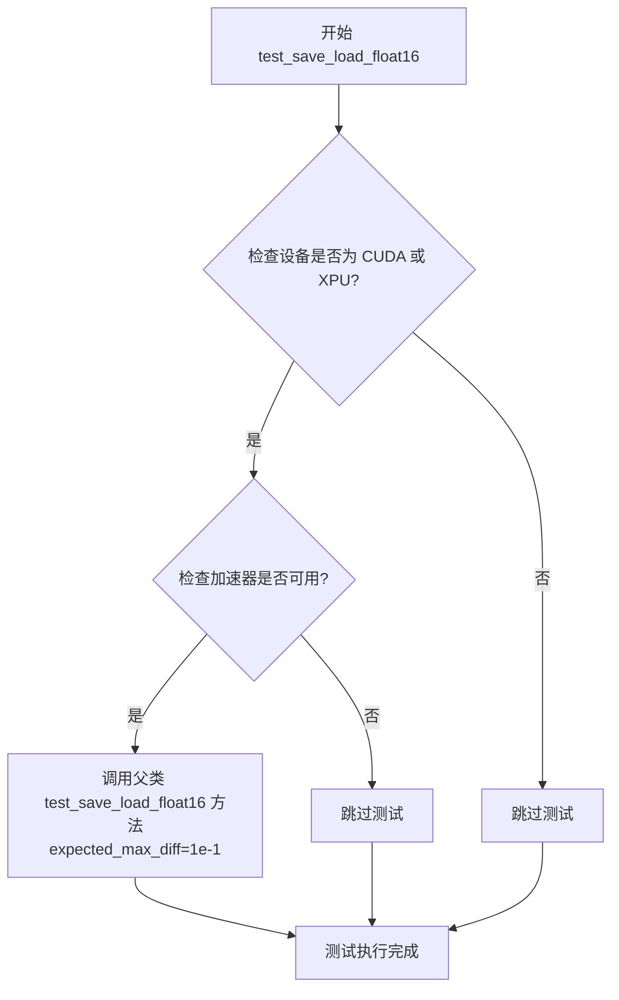
```mermaid
flowchart TD
    A[开始 test_save_load_float16] --> B{检查设备是否为 CUDA 或 XPU?}
    B -->|是| C{检查加速器是否可用?}
    B -->|否| D[跳过测试]
    C -->|是| E[调用父类 test_save_load_float16 方法<br/>expected_max_diff=1e-1]
    C -->|否| F[跳过测试]
    E --> G[测试执行完成]
    D --> G
    F --> G
```

#### 带注释源码

```python
@unittest.skipIf(
    torch_device not in ["cuda", "xpu"], 
    reason="float16 requires CUDA or XPU"
)
@require_accelerator
def test_save_load_float16(self):
    # 由于 hf-internal-testing/tiny-random-t5 文本编码器在保存加载时存在非确定性
    # 因此使用较大的允许误差阈值 1e-1（0.1）
    super().test_save_load_float16(expected_max_diff=1e-1)
```

#### 关键说明

| 项目 | 说明 |
|------|------|
| **测试类** | `IFImg2ImgSuperResolutionPipelineFastTests` |
| **父类** | `PipelineTesterMixin`, `IFPipelineTesterMixin`, `unittest.TestCase` |
| **依赖条件** | 需要 CUDA 或 XPU 设备，且有加速器可用 |
| **调用父类** | `PipelineTesterMixin.test_save_load_float16(expected_max_diff=1e-1)` |
| **误差容忍度** | 1e-1（0.1），比默认阈值宽松，以应对 T5 编码器的非确定性 |


### `IFImg2ImgSuperResolutionPipelineFastTests.test_attention_slicing_forward_pass`

这是一个测试方法，用于验证注意力切片（attention slicing）功能在前向传播过程中是否正常工作。该方法通过调用父类或测试工具类中的 `_test_attention_slicing_forward_pass` 方法来执行测试，并设置期望的最大差异阈值为 1e-2，以确保在启用注意力切片的情况下，输出结果与基准结果的差异在可接受范围内。

参数：

- `self`：`IFImg2ImgSuperResolutionPipelineFastTests`（隐式参数），调用该方法的实例对象本身

返回值：`None`（无返回值），该方法为 `unittest.TestCase` 的测试方法，通过测试断言来验证功能，不返回具体值

#### 流程图

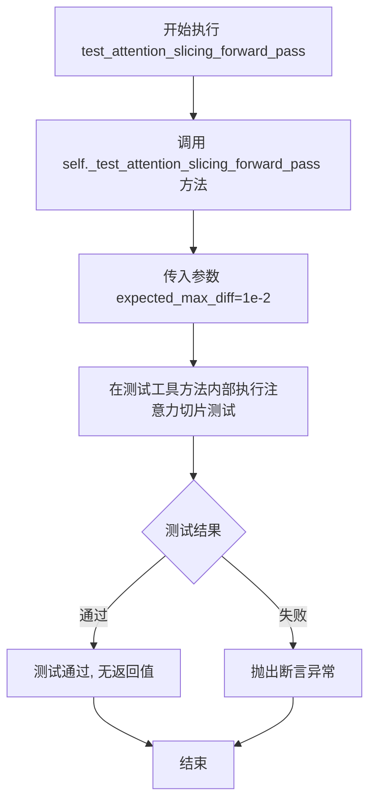
```mermaid
flowchart TD
    A[开始执行 test_attention_slicing_forward_pass] --> B[调用 self._test_attention_slicing_forward_pass 方法]
    B --> C[传入参数 expected_max_diff=1e-2]
    C --> D[在测试工具方法内部执行注意力切片测试]
    D --> E{测试结果}
    E -->|通过| F[测试通过, 无返回值]
    E -->|失败| G[抛出断言异常]
    F --> H[结束]
    G --> H
```

#### 带注释源码

```python
def test_attention_slicing_forward_pass(self):
    """
    测试注意力切片（attention slicing）功能的前向传播是否正常工作。
    
    注意力切片是一种内存优化技术，通过将注意力计算分块处理来减少显存占用。
    该测试方法验证启用注意力切片后，管道输出结果与基准结果的差异是否在可接受范围内。
    """
    # 调用内部测试方法 _test_attention_slicing_forward_pass
    # expected_max_diff=1e-2 表示期望的最大像素差异为 0.01
    # 如果实际差异超过此阈值，则测试失败
    self._test_attention_slicing_forward_pass(expected_max_diff=1e-2)
```


### `IFImg2ImgSuperResolutionPipelineFastTests.test_save_load_local`

这是一个单元测试方法，用于测试 `IFImg2ImgSuperResolutionPipeline` 管道的保存和加载功能是否正常工作。测试通过调用父类 `PipelineTesterMixin` 提供的 `_test_save_load_local` 方法来验证管道模型序列化（save）和反序列化（load）的正确性。

参数：

- `self`：`IFImg2ImgSuperResolutionPipelineFastTests` 类型，当前测试类的实例隐式参数

返回值：`None`，该方法没有显式返回值，默认返回 Python 的 `None`

#### 流程图

```mermaid
flowchart TD
    A[开始 test_save_load_local] --> B[调用父类方法 self._test_save_load_local]
    B --> C{测试是否通过}
    C -->|通过| D[测试通过, 返回 None]
    C -->|失败| E[抛出断言异常]
```

#### 带注释源码

```python
def test_save_load_local(self):
    """
    测试 IFImg2ImgSuperResolutionPipeline 管道的保存和加载功能。
    
    该测试方法继承自 PipelineTesterMixin，通过调用父类的 _test_save_load_local 
    方法来验证管道对象的序列化和反序列化能力。
    
    测试流程通常包括：
    1. 创建管道实例
    2. 将管道保存到本地路径（序列化）
    3. 从本地路径加载管道（反序列化）
    4. 验证加载后的管道能够正常执行推理
    5. 比较原始管道和加载管道的输出是否一致
    """
    # 调用父类 PipelineTesterMixin 提供的测试方法
    # 该方法会执行完整的保存-加载流程验证
    self._test_save_load_local()
```


### `IFImg2ImgSuperResolutionPipelineFastTests.test_inference_batch_single_identical`

该测试方法用于验证管道在批量推理与单个推理时的输出结果是否一致，通过比较两者的像素差异是否在允许的阈值范围内（1e-2），以确保推理结果的可重复性和正确性。

参数：

- `self`：隐式参数，类型为 `IFImg2ImgSuperResolutionPipelineFastTests`，代表测试类实例本身

返回值：`None`，无返回值（测试方法）

#### 流程图

```mermaid
flowchart TD
    A[开始测试] --> B[调用 _test_inference_batch_single_identical 方法]
    B --> C[设置 expected_max_diff=1e-2]
    C --> D[执行批量推理与单个推理对比验证]
    D --> E{差异是否在阈值内}
    E -->|是| F[测试通过]
    E -->|否| G[测试失败, 抛出断言错误]
    F --> H[结束]
    G --> H
```

#### 带注释源码

```python
def test_inference_batch_single_identical(self):
    """
    测试方法：验证批量推理与单个推理的结果一致性
    
    该测试方法继承自 PipelineTesterMixin，
    用于验证 IFImg2ImgSuperResolutionPipeline 在批量推理和
    单个推理时产生的输出是否相同，确保管道的确定性行为。
    
    参数:
        self: 测试类实例，隐式参数
    
    返回值:
        None: 此测试方法无返回值，通过断言验证正确性
    
    内部逻辑:
        调用父类的 _test_inference_batch_single_identical 方法，
        传入 expected_max_diff=1e-2 参数，允许批量与单个推理结果
        之间存在最大 1e-2 的像素差异
    """
    self._test_inference_batch_single_identical(
        expected_max_diff=1e-2,
    )
```


### `IFImg2ImgSuperResolutionPipelineFastTests.test_save_load_dduf`

该测试方法用于验证 IFImg2ImgSuperResolutionPipeline 管道在 DDUF（Diffusers Disk Utility Format）格式下的保存和加载功能，通过调用父类的测试方法来确保管道能够正确序列化和反序列化，并且设置了绝对误差容差为 1e-2、相对误差容差为 1e-2。

参数：

- `self`：`IFImg2ImgSuperResolutionPipelineFastTests`，测试类的实例，隐式参数，用于访问类的属性和方法

返回值：`None`，该方法为 unittest 测试方法，没有返回值，通常通过断言来验证测试结果

#### 流程图

```mermaid
flowchart TD
    A[开始测试 test_save_load_dduf] --> B{检查 HuggingFace Hub 版本 > 0.26.5}
    B -->|是| C{检查 Transformers 版本 > 4.47.1}
    B -->|否| D[跳过测试]
    C -->|是| E[调用父类方法 super.test_save_load_dduf]
    C -->|否| D
    E --> F[设置参数 atol=1e-2, rtol=1e-2]
    F --> G[执行保存加载测试]
    G --> H{测试通过}
    H -->|是| I[测试通过]
    H -->|否| J[测试失败]
    I --> K[结束]
    J --> K
```

#### 带注释源码

```python
@require_hf_hub_version_greater("0.26.5")
@require_transformers_version_greater("4.47.1")
def test_save_load_dduf(self):
    """
    测试 DDUF 格式的保存和加载功能。
    
    该测试方法验证管道能够正确地在 DDUF 格式下序列化和反序列化。
    仅在 HuggingFace Hub 版本大于 0.26.5 且 Transformers 版本大于 4.47.1 时运行。
    """
    # 调用父类的测试方法，执行实际的保存加载验证
    # 参数 atol=1e-2 表示绝对误差容差
    # 参数 rtol=1e-2 表示相对误差容差
    super().test_save_load_dduf(atol=1e-2, rtol=1e-2)
```


### `IFImg2ImgSuperResolutionPipelineFastTests.test_save_load_optional_components`

该方法是 `IFImg2ImgSuperResolutionPipelineFastTests` 类中的一个测试用例，用于测试管道的保存和加载可选组件功能。由于该功能已在其他测试中验证，该测试方法被跳过（标记为跳过）。

参数：

- `self`：`IFImg2ImgSuperResolutionPipelineFastTests`，表示类的实例本身，用于访问类属性和方法

返回值：`None`，该方法不返回任何值

#### 流程图

```mermaid
graph TD
    A[开始测试] --> B{检查是否需要执行}
    B -->|否| C[跳过测试 - 功能已在其他测试中验证]
    B -->|是| D[执行保存加载可选组件测试]
    D --> E[验证组件正确保存和加载]
    E --> F[结束测试]
```

#### 带注释源码

```python
@unittest.skip("Functionality is tested elsewhere.")
def test_save_load_optional_components(self):
    """
    测试保存和加载可选组件的功能。
    
    该测试方法用于验证 IFImg2ImgSuperResolutionPipeline 的
    可选组件（如调度器、文本编码器等）是否能够正确地保存和加载。
    
    由于该功能已在其他测试中得到验证，此测试被跳过以避免重复。
    
    参数:
        self: IFImg2ImgSuperResolutionPipelineFastTests的实例
        
    返回值:
        None: 该方法不返回任何值，测试被跳过
    """
    pass  # 测试功能被禁用，方法体为空
```


### `IFImg2ImgSuperResolutionPipelineSlowTests.setUp`

该方法是测试类的初始化方法，在每个测试用例运行前被调用，用于清理VRAM（显存）并调用父类的setUp方法，确保测试环境处于干净状态。

参数：

- `self`：`IFImg2ImgSuperResolutionPipelineSlowTests`，隐式参数，指向当前测试类实例本身

返回值：`None`，无返回值

#### 流程图

```mermaid
flowchart TD
    A[开始 setUp] --> B[调用 super().setUp]
    B --> C[执行 gc.collect]
    C --> D[调用 backend_empty_cache]
    D --> E[结束 setUp]
    
    style A fill:#f9f,stroke:#333
    style E fill:#9f9,stroke:#333
```

#### 带注释源码

```python
def setUp(self):
    # clean up the VRAM before each test
    # 在每个测试运行前清理VRAM显存，以确保测试环境干净
    super().setUp()  # 调用父类 unittest.TestCase 的 setUp 方法
    gc.collect()     # 强制进行垃圾回收，释放Python层面的内存
    backend_empty_cache(torch_device)  # 调用后端特定的缓存清理函数，清理GPU显存
```


### `IFImg2ImgSuperResolutionPipelineSlowTests.tearDown`

该方法是 IFImg2ImgSuperResolutionPipelineSlowTests 类的测试清理方法，在每个测试用例执行完毕后被调用，用于清理 VRAM 内存资源，包括调用父类的 tearDown 方法、执行垃圾回收以及清空后端缓存，确保测试之间的内存隔离。

参数：

- `self`：`IFImg2ImgSuperResolutionPipelineSlowTests`，测试类实例，隐式参数，代表当前测试类对象

返回值：`None`，无返回值，该方法仅执行清理操作不返回任何数据

#### 流程图

```mermaid
flowchart TD
    A[开始 tearDown] --> B[调用 super().tearDown]
    B --> C[执行 gc.collect]
    C --> D{调用 backend_empty_cache}
    D --> E[结束 tearDown]
    
    B -.->|清理父类资源| B
    C -.->|Python垃圾回收| C
    D -.->|清空GPU显存| D
```

#### 带注释源码

```python
def tearDown(self):
    # clean up the VRAM after each test
    # 在每个测试结束后清理 VRAM 显存
    super().tearDown()  # 调用 unittest.TestCase 的 tearDown 方法，清理测试环境
    gc.collect()  # 手动调用 Python 垃圾回收器，释放不再使用的对象
    backend_empty_cache(torch_device)  # 清空指定设备的后端缓存（通常是 GPU 显存）
```


### `IFImg2ImgSuperResolutionPipelineSlowTests.test_if_img2img_superresolution`

这是一个慢速测试用例，用于测试 `IFImg2ImgSuperResolutionPipeline` 的图像超分辨率功能。测试流程包括：从预训练模型加载管道、配置注意力处理器、执行图像生成推理、验证输出图像的形状、内存使用情况以及像素差异。

参数：无（仅包含隐式 `self` 参数）

返回值：`None`，测试方法不返回任何值

#### 流程图

```mermaid
flowchart TD
    A[开始测试] --> B[setUp: 清理VRAM]
    B --> C[从预训练模型加载管道 DeepFloyd/IF-II-L-v1.0]
    C --> D[设置UNet注意力处理器为 AttnAddedKVProcessor]
    D --> E[启用模型CPU卸载]
    E --> F[重置内存统计]
    F --> G[创建随机生成器]
    G --> H[创建原始图像 256x256 和输入图像 64x64]
    H --> I[调用管道执行推理]
    I --> J[获取输出图像]
    J --> K{验证图像形状是否为 256x256x3}
    K -->|是| L[获取内存使用量]
    K -->|否| M[测试失败]
    L --> N{验证内存使用是否小于12GB}
    N -->|是| O[加载预期图像]
    N -->|否| M
    O --> P[验证输出图像与预期图像的像素差异]
    P --> Q{像素差异是否符合标准}
    Q -->|是| R[移除所有钩子]
    Q -->|否| M
    R --> S[tearDown: 清理VRAM]
    S --> T[结束测试]
```

#### 带注释源码

```python
@unittest.skip  # 标记为跳过，表明该测试功能已在其他位置测试
def test_if_img2img_superresolution(self):
    """
    测试 IFImg2ImgSuperResolutionPipeline 的图像超分辨率功能
    验证管道能够正确生成高质量的超分辨率图像
    """
    
    # ============ 管道初始化阶段 ============
    
    # 从预训练模型加载管道，使用fp16变体以提高推理速度
    pipe = IFImg2ImgSuperResolutionPipeline.from_pretrained(
        "DeepFloyd/IF-II-L-v1.0",  # 模型名称
        variant="fp16",            # 使用fp16变体
        torch_dtype=torch.float16, # 指定float16数据类型
    )
    
    # 设置UNet的注意力处理器为 AttnAddedKVProcessor
    # 这是一种自定义的注意力实现，用于特定的注意力计算
    pipe.unet.set_attn_processor(AttnAddedKVProcessor())
    
    # 启用模型CPU卸载功能，将不常用的模型层移到CPU内存
    # 这样可以减少GPU显存占用，允许处理更大的图像
    pipe.enable_model_cpu_offload(device=torch_device)

    # ============ 内存统计重置阶段 ============
    
    # 重置最大内存分配统计
    backend_reset_max_memory_allocated(torch_device)
    # 清空GPU缓存
    backend_empty_cache(torch_device)
    # 重置峰值内存统计
    backend_reset_peak_memory_stats(torch_device)

    # ============ 测试输入准备阶段 ============
    
    # 创建随机数生成器，设置种子为0以确保可重复性
    generator = torch.Generator(device="cpu").manual_seed(0)

    # 创建原始图像张量 (1, 3, 256, 256) - RGB图像，高分辨率
    original_image = floats_tensor((1, 3, 256, 256), rng=random.Random(0)).to(torch_device)
    # 创建输入图像张量 (1, 3, 64, 64) - RGB图像，低分辨率
    image = floats_tensor((1, 3, 64, 64), rng=random.Random(0)).to(torch_device)

    # ============ 管道推理阶段 ============
    
    # 调用管道执行图像超分辨率推理
    output = pipe(
        prompt="anime turtle",          # 文本提示词
        image=image,                    # 输入的低分辨率图像
        original_image=original_image, # 原始高分辨率图像参考
        generator=generator,           # 随机数生成器
        num_inference_steps=2,         # 推理步数（较少步数用于快速测试）
        output_type="np",               # 输出为numpy数组
    )

    # ============ 输出验证阶段 ============
    
    # 从输出中获取生成的图像
    image = output.images[0]

    # 断言：验证输出图像的形状为 (256, 256, 3)
    # 即高度256、宽度256、3个颜色通道(RGB)
    assert image.shape == (256, 256, 3)

    # 获取测试期间的最大内存分配量（字节）
    mem_bytes = backend_max_memory_allocated(torch_device)

    # 断言：验证内存使用量小于12GB
    # 确保管道在合理的显存范围内运行
    assert mem_bytes < 12 * 10**9

    # ============ 图像质量验证阶段 ============
    
    # 从HuggingFace数据集加载预期的输出图像
    expected_image = load_numpy(
        "https://huggingface.co/datasets/hf-internal-testing/diffusers-images/resolve/main/if/test_if_img2img_superresolution_stage_II.npy"
    )
    
    # 验证生成的图像与预期图像的像素差异在可接受范围内
    assert_mean_pixel_difference(image, expected_image)

    # ============ 清理阶段 ============
    
    # 移除管道中所有的钩子（hooks）
    # 这些钩子可能用于监控、调试或其他功能
    pipe.remove_all_hooks()
```

## 关键组件


### 张量索引与惰性加载

代码中使用 `floats_tensor` 生成随机张量进行测试，通过 Generator 实现惰性加载和确定性随机数生成，避免提前加载大量测试数据到内存。

### 反量化支持

使用 `torch.float16` 和 `variant="fp16"` 进行半精度加载和推理，test_save_load_float16 测试验证了 float16 模型的保存加载兼容性。

### 量化策略

通过 `variant="fp16"` 指定 fp16 变体进行量化推理，test_save_load_float16 验证了量化模型的正确性。

### 内存管理

使用 gc.collect() 和 backend_empty_cache() 清理 VRAM，backend_reset_max_memory_allocated/peak_memory_stats 监控内存使用，防止内存泄漏。

### xFormers 注意力

使用 xformers 的内存高效注意力机制，test_xformers_attention_forwardGenerator_pass 验证了 xFormers 注意力在前向传播中的数值正确性。

### 模型 CPU 卸载

使用 enable_model_cpu_offload 将模型分片卸载到 CPU，test_if_img2img_superresolution 验证了该功能在慢速测试中的内存占用低于 12GB。

### 注意力切片

使用 AttnAddedKVProcessor 自定义注意力处理器，test_attention_slicing_forward_pass 验证了注意力切片前向传播的正确性。

### 批量推理一致性

test_inference_batch_single_identical 验证批量推理与单样本推理结果的数值一致性，确保批处理不会引入非确定性行为。

### 管道参数配置

定义了 TEXT_GUIDED_IMAGE_VARIATION_PARAMS 和 TEXT_GUIDED_IMAGE_VARIATION_BATCH_PARAMS，指定了图像生成任务的可选和必填参数。

### 外部依赖接口

依赖 DeepFloyd/IF-II-L-v1.0 模型，通过 HuggingFace Hub 加载测试数据集和预训练权重。


## 问题及建议


### 已知问题

-   **硬编码设备不一致**：慢速测试中 `generator = torch.Generator(device="cpu").manual_seed(0)` 硬编码了 CPU 设备，但函数接收了 `torch_device` 参数，导致设备使用不一致
-   **跳过测试无实际功能**：`test_save_load_optional_components` 直接 skip 且无任何测试逻辑，`test_save_load_dduf` 虽有条件装饰器但无实际测试内容
-   **魔法数字缺乏解释**：内存阈值 `12 * 10**9` (12GB) 和 `expected_max_diff=1e-1` 等数值缺少注释说明依据
-   **模型加载无保护**：慢速测试直接调用 `from_pretrained` 加载大型模型（IF-II-L-v1.0），无网络异常处理和超时配置
-   **设备兼容性处理不一致**：`get_dummy_inputs` 中对 MPS 设备特殊处理 `generator = torch.manual_seed(seed)`，与其他设备使用 `Generator` 对象的方式不一致
-   **测试隔离性风险**：慢速测试使用真实模型和远程数据集（load_numpy），网络状态会影响测试稳定性
-   **缺少资源清理异常处理**：tearDown 方法中 `gc.collect()` 和 `backend_empty_cache` 若抛出异常会导致后续清理无法执行

### 优化建议

-   统一设备处理：使用传入的 `torch_device` 创建 generator，或在类级别统一设备选择逻辑
-   移除或实现空测试：删除 `test_save_load_optional_components` 或添加实际测试逻辑
-   添加配置常量：将魔法数字提取为类常量或配置文件，添加注释说明其来源和依据
-   添加网络保护：为模型加载添加 try-except 包装，或使用 `@unittest.mock` 隔离网络依赖
-   规范化 generator 创建：MPS 设备也应使用 `torch.Generator(device=device)` 保持一致性
-   增强资源清理：tearDown 中使用 try-finally 确保清理逻辑执行
-   考虑添加异步加载：慢速测试可考虑使用线程加载模型避免主线程阻塞

## 其它


### 设计目标与约束

本测试文件旨在验证 IFImg2ImgSuperResolutionPipeline 的功能正确性和性能表现。设计约束包括：必须使用 CUDA 或 XPU 设备进行 float16 测试；XFormers 注意力机制仅支持 CUDA 环境；MPS 设备被明确跳过；测试依赖特定的 transformers 版本（>4.47.1）和 HuggingFace Hub 版本（>0.26.5）。

### 错误处理与异常设计

测试用例使用多种装饰器处理不同的跳过条件：`@unittest.skipIf` 用于条件跳过（如 CUDA/XPU 可用性检查）；`@unittest.skip` 用于永久跳过的测试（如 test_save_load_optional_components）；`@slow` 标记慢速测试需要特殊处理；`@require_torch_accelerator` 确保加速器可用。所有内存清理在 setUp 和 tearDown 方法中通过 gc.collect() 和 backend_empty_cache() 完成。

### 数据流与状态机

测试流程遵循标准 PipelineTesterMixin 模式：setUp 阶段清理 VRAM 内存；get_dummy_components() 提供测试用虚拟组件；get_dummy_inputs() 生成虚拟输入数据（包括 prompt、image、original_image、generator 等）；测试方法执行管道调用并验证输出。慢速测试流程：加载预训练模型 → 设置注意力处理器 → 启用 CPU 卸载 → 执行推理 → 验证输出尺寸和内存占用。

### 外部依赖与接口契约

主要依赖包括：diffusers 库的 IFImg2ImgSuperResolutionPipeline、AttnAddedKVProcessor；torch 及相关测试工具；DeepFloyd/IF-II-L-v1.0 预训练模型。接口契约：管道接受 prompt、image、original_image、generator、num_inference_steps、output_type 等参数；返回包含 images 列表的输出对象；输出图像尺寸应为 256x256x3；内存占用应小于 12GB。

### 测试策略

采用分层测试策略：快速测试（FastTests）使用虚拟组件进行功能验证，包括 XFormers 注意力、float16 保存加载、注意力切片、批量推理等；慢速测试（SlowTests）使用真实预训练模型进行端到端验证。测试覆盖维度：前向传播正确性、内存效率、模型保存加载、输出质量一致性。

### 性能基准与要求

内存管理目标：单次推理内存占用 < 12GB；每次测试前后清理 VRAM。精度要求：float16 测试允许 1e-1 误差；常规测试允许 1e-2 到 1e-3 误差。推理步数：测试使用 2 步推理以平衡速度与功能验证。

### 资源管理

GPU 内存通过 gc.collect() 和 backend_empty_cache() 显式管理；使用 backend_reset_max_memory_allocated 和 backend_reset_peak_memory_stats 追踪内存使用；通过 torch_dtype=torch.float16 控制模型精度；enable_model_cpu_offload() 实现 CPU-GPU 内存优化。

### 配置参数说明

关键测试参数：num_inference_steps=2（减少测试时间）；output_type="np"（输出 NumPy 数组便于验证）；variant="fp16"（使用半精度模型）；batch_params 包含 original_image 字段；params 排除 width 和 height（由超分辨率决定）。

    