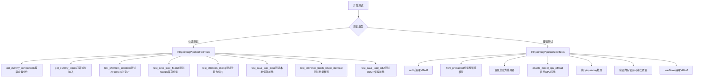
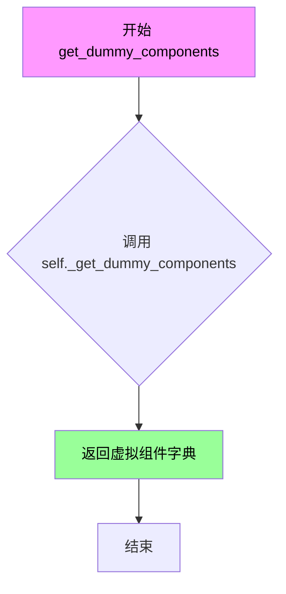
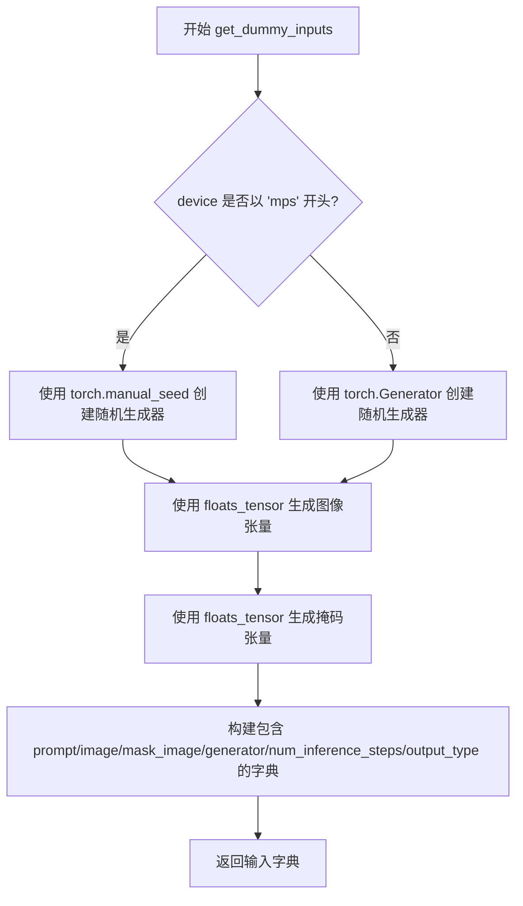
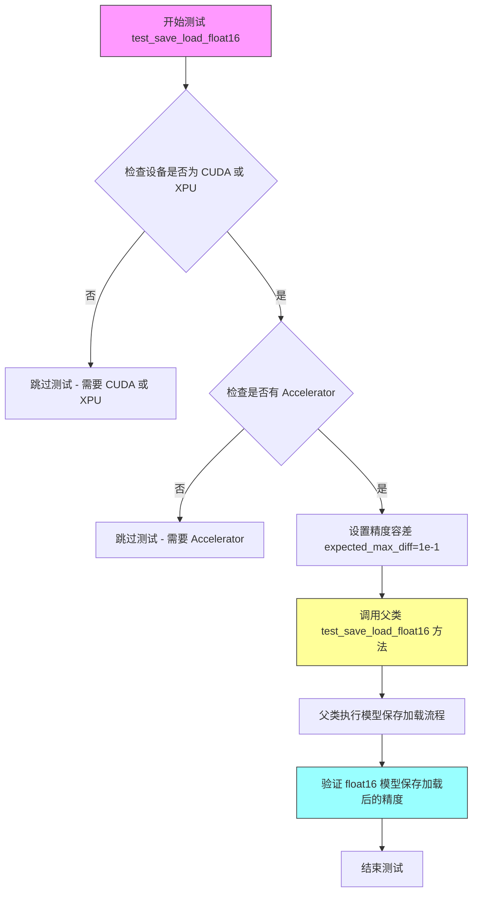
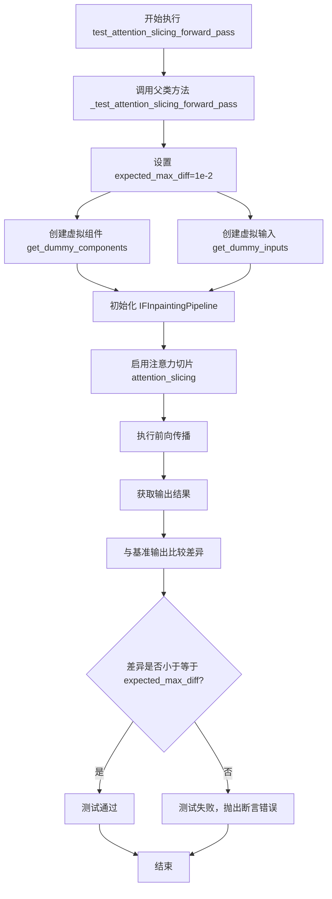
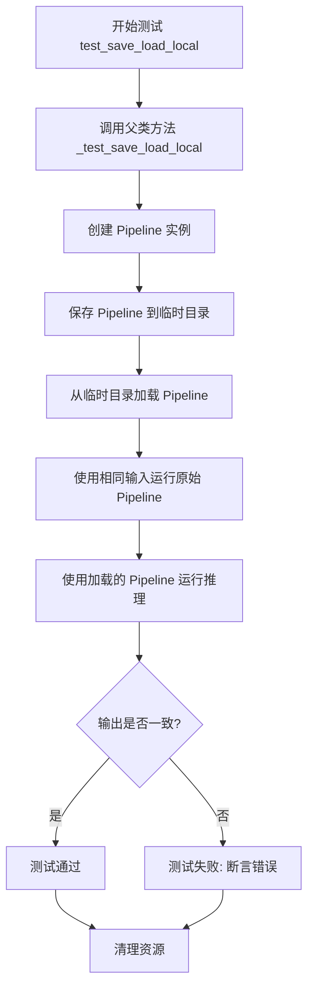
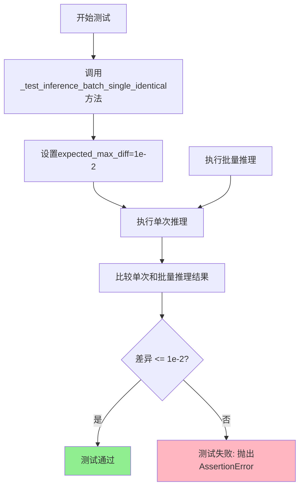
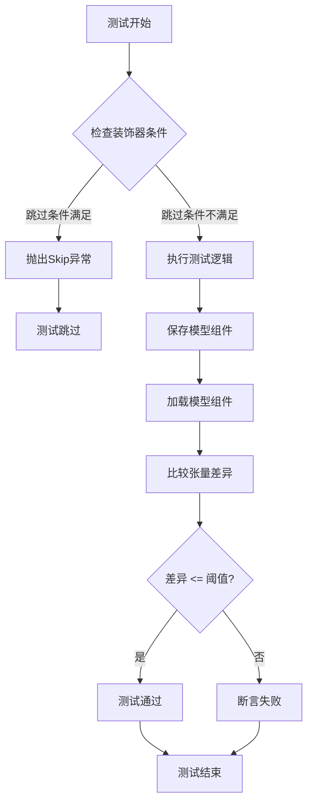
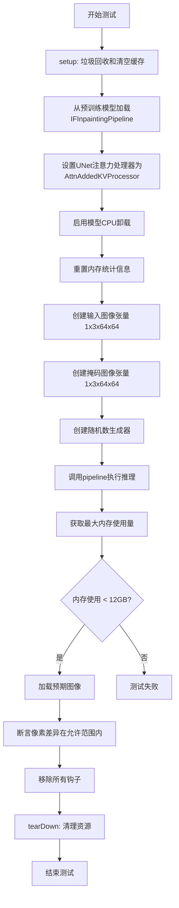

# `diffusers\tests\pipelines\deepfloyd_if\test_if_inpainting.py` 详细设计文档

该文件是DeepFloyd IF图像修复（Inpainting）管道的单元测试和集成测试文件，包含快速测试类和慢速测试类，用于验证管道的前向传播、模型保存加载、内存管理等功能。

## 整体流程



## 类结构

```
unittest.TestCase
├── IFInpaintingPipelineFastTests (PipelineTesterMixin, IFPipelineTesterMixin)
│   ├── 类字段: pipeline_class, params, batch_params, required_optional_params
│   └── 类方法: get_dummy_components, get_dummy_inputs, 多个test_*方法
└── IFInpaintingPipelineSlowTests (unittest.TestCase)
    └── 类方法: setUp, tearDown, test_if_inpainting
```

## 全局变量及字段


### `gc`
    
Python垃圾回收模块，用于内存管理

类型：`module`
    


### `random`
    
Python随机数生成模块

类型：`module`
    


### `unittest`
    
Python单元测试框架

类型：`module`
    


### `torch`
    
PyTorch深度学习库

类型：`module`
    


### `IFInpaintingPipeline`
    
DeepFloyd IF图像修复管道类

类型：`class`
    


### `AttnAddedKVProcessor`
    
添加KV的注意力处理器

类型：`class`
    


### `is_xformers_available`
    
检查xformers是否可用的函数

类型：`function`
    


### `backend_empty_cache`
    
清空GPU缓存的测试辅助函数

类型：`function`
    


### `backend_max_memory_allocated`
    
获取GPU最大分配内存的测试辅助函数

类型：`function`
    


### `backend_reset_max_memory_allocated`
    
重置最大内存分配统计的测试辅助函数

类型：`function`
    


### `backend_reset_peak_memory_stats`
    
重置峰值内存统计的测试辅助函数

类型：`function`
    


### `floats_tensor`
    
生成浮点张量的测试辅助函数

类型：`function`
    


### `load_numpy`
    
加载numpy数组的测试辅助函数

类型：`function`
    


### `require_accelerator`
    
要求加速器的装饰器

类型：`function`
    


### `require_hf_hub_version_greater`
    
要求HF Hub版本大于某值的装饰器

类型：`function`
    


### `require_torch_accelerator`
    
要求PyTorch加速器的装饰器

类型：`function`
    


### `require_transformers_version_greater`
    
要求Transformers版本大于某值的装饰器

类型：`function`
    


### `skip_mps`
    
跳过MPS设备的装饰器

类型：`function`
    


### `slow`
    
标记慢速测试的装饰器

类型：`function`
    


### `torch_device`
    
当前测试设备字符串

类型：`str`
    


### `PipelineTesterMixin`
    
管道测试混合类

类型：`class`
    


### `assert_mean_pixel_difference`
    
断言像素差异均值的函数

类型：`function`
    


### `IFPipelineTesterMixin`
    
IF管道测试混合类

类型：`class`
    


### `TEXT_GUIDED_IMAGE_INPAINTING_BATCH_PARAMS`
    
文本引导图像修复批量测试参数集合

类型：`set`
    


### `TEXT_GUIDED_IMAGE_INPAINTING_PARAMS`
    
文本引导图像修复测试参数集合

类型：`set`
    


### `IFInpaintingPipelineFastTests.IFInpaintingPipelineFastTests`
    
IF图像修复管道快速测试类

类型：`type`
    


### `IFInpaintingPipelineFastTests.pipeline_class`
    
指定测试的管道类为IFInpaintingPipeline

类型：`type`
    


### `IFInpaintingPipelineFastTests.params`
    
测试参数集合，去除了width和height

类型：`set`
    


### `IFInpaintingPipelineFastTests.batch_params`
    
批量测试参数集合

类型：`set`
    


### `IFInpaintingPipelineFastTests.required_optional_params`
    
必需的可选参数集合，去除了latents

类型：`set`
    


### `IFInpaintingPipelineFastTests.get_dummy_components`
    
获取虚拟组件用于测试

类型：`method`
    


### `IFInpaintingPipelineFastTests.get_dummy_inputs`
    
获取虚拟输入数据包括图像、mask、prompt等

类型：`method`
    


### `IFInpaintingPipelineFastTests.test_xformers_attention_forwardGenerator_pass`
    
测试XFormers注意力机制的前向传播

类型：`method`
    


### `IFInpaintingPipelineFastTests.test_save_load_float16`
    
测试float16精度下的模型保存和加载

类型：`method`
    


### `IFInpaintingPipelineFastTests.test_attention_slicing_forward_pass`
    
测试注意力切片前向传播

类型：`method`
    


### `IFInpaintingPipelineFastTests.test_save_load_local`
    
测试本地模型保存和加载

类型：`method`
    


### `IFInpaintingPipelineFastTests.test_inference_batch_single_identical`
    
测试批量推理与单次推理结果一致性

类型：`method`
    


### `IFInpaintingPipelineFastTests.test_save_load_dduf`
    
测试DDUF格式的模型保存和加载

类型：`method`
    


### `IFInpaintingPipelineFastTests.test_save_load_optional_components`
    
测试可选组件的保存加载（已跳过）

类型：`method`
    


### `IFInpaintingPipelineSlowTests.IFInpaintingPipelineSlowTests`
    
IF图像修复管道慢速测试类

类型：`type`
    


### `IFInpaintingPipelineSlowTests.setUp`
    
每个测试前的设置方法，清理VRAM

类型：`method`
    


### `IFInpaintingPipelineSlowTests.tearDown`
    
每个测试后的清理方法，清理VRAM

类型：`method`
    


### `IFInpaintingPipelineSlowTests.test_if_inpainting`
    
完整的IF图像修复功能测试

类型：`method`
    
    

## 全局函数及方法


### `IFInpaintingPipelineFastTests.get_dummy_components`

获取虚拟组件用于测试，返回一个包含测试所需的虚拟（dummy）组件的字典。

参数：
- `self`：隐式参数，`IFInpaintingPipelineFastTests` 实例本身，无需显式传递

返回值：`dict`，返回包含虚拟组件的字典，用于测试目的。该字典由父类或混入类的 `_get_dummy_components()` 方法生成，通常包含模型组件（如 UNet、VAE、Text Encoder 等）的虚拟实例。

#### 流程图



#### 带注释源码

```python
def get_dummy_components(self):
    """
    获取虚拟组件用于测试。
    
    该方法返回一个包含虚拟模型组件的字典，这些组件用于单元测试，
    无需加载真实的预训练模型，从而加快测试速度并减少资源消耗。
    
    Returns:
        dict: 包含虚拟组件的字典（如 UNet、VAE、TextEncoder 等）
    """
    # 调用父类或混入类中实现的 _get_dummy_components 方法
    # 该方法负责创建测试所需的虚拟组件
    return self._get_dummy_components()
```


### IFInpaintingPipelineFastTests.get_dummy_inputs

获取虚拟输入数据，包括图像、mask、prompt等，用于测试IFInpaintingPipeline的虚拟调用。

参数：

- `self`：隐式参数，测试类实例本身
- `device`：`str` 或 `torch.device`，目标设备，用于确定生成器和张量存放位置（如 "cuda", "cpu", "mps"）
- `seed`：`int`，随机数种子，默认为0，用于确保测试的可重复性

返回值：`dict`，包含以下键值对的字典：
- `prompt`（str）：文本提示
- `image`（torch.Tensor）：虚拟输入图像，形状 (1, 3, 32, 32)
- `mask_image`（torch.Tensor）：虚拟掩码图像，形状 (1, 3, 32, 32)
- `generator`（torch.Generator）：随机数生成器
- `num_inference_steps`（int）：推理步数
- `output_type`（str）：输出类型

#### 流程图



#### 带注释源码

```python
def get_dummy_inputs(self, device, seed=0):
    """
    生成用于测试 IFInpaintingPipeline 的虚拟输入数据
    
    参数:
        device: 目标设备（'cuda', 'cpu', 'mps'等）
        seed: 随机种子，用于确保测试可重复性
    
    返回:
        dict: 包含测试所需的输入参数字典
    """
    
    # 判断设备类型，MPS (Apple Silicon) 使用不同的随机数生成方式
    if str(device).startswith("mps"):
        # MPS 设备使用 torch.manual_seed
        generator = torch.manual_seed(seed)
    else:
        # 其他设备（CUDA, CPU等）使用 torch.Generator
        generator = torch.Generator(device=device).manual_seed(seed)

    # 生成虚拟输入图像：形状 (batch=1, channels=3, height=32, width=32)
    image = floats_tensor((1, 3, 32, 32), rng=random.Random(seed)).to(device)
    
    # 生成虚拟掩码图像：形状 (batch=1, channels=3, height=32, width=32)
    mask_image = floats_tensor((1, 3, 32, 32), rng=random.Random(seed)).to(device)

    # 组装输入字典，包含 pipeline 所需的所有参数
    inputs = {
        "prompt": "A painting of a squirrel eating a burger",  # 文本提示
        "image": image,                                        # 输入图像
        "mask_image": mask_image,                              # 掩码图像
        "generator": generator,                                # 随机生成器
        "num_inference_steps": 2,                             # 推理步数（测试用最小值）
        "output_type": "np",                                   # 输出类型为 numpy 数组
    }

    return inputs
```


### IFInpaintingPipelineFastTests.test_xformers_attention_forwardGenerator_pass

测试XFormers注意力机制的前向传播，验证在CUDA环境下使用XFormers注意力处理器时的前向传播是否正确运行。

参数：

- 无参数

返回值：`None`，无返回值（测试方法）

#### 流程图

```mermaid
flowchart TD
    A[开始测试] --> B{检查条件: torch_device == 'cuda' 且 is_xformers_available()}
    B -->|不满足| C[跳过测试]
    B -->|满足| D[调用 _test_xformers_attention_forwardGenerator_pass 方法]
    D --> E[expected_max_diff=1e-3]
    E --> F[执行注意力前向传播测试]
    F --> G[验证输出差异是否在预期范围内]
    G --> H[结束测试]
```

#### 带注释源码

```python
@unittest.skipIf(
    torch_device != "cuda" or not is_xformers_available(),
    reason="XFormers attention is only available with CUDA and `xformers` installed",
)
def test_xformers_attention_forwardGenerator_pass(self):
    """
    测试XFormers注意力机制的前向传播
    
    该测试方法执行以下操作：
    1. 检查测试环境是否满足条件（CUDA设备且xformers可用）
    2. 如果条件不满足，则跳过测试
    3. 如果条件满足，则调用内部测试方法验证XFormers注意力前向传播
    """
    # 调用内部测试方法，传入预期的最大差异阈值
    # expected_max_diff=1e-3 表示输出与参考值的最大差异应小于0.001
    self._test_xformers_attention_forwardGenerator_pass(expected_max_diff=1e-3)
```


### IFInpaintingPipelineFastTests.test_save_load_float16

测试 float16 精度下的模型保存和加载功能，验证模型在 float16 数据类型下进行序列化（save）和反序列化（load）后的一致性和数值精度。

参数：无显式参数（继承自父类测试框架）

返回值：`None`，无返回值（测试方法）

#### 流程图



#### 带注释源码

```python
@unittest.skipIf(
    torch_device not in ["cuda", "xpu"],  # 条件跳过：仅在 CUDA 或 XPU 设备上运行
    reason="float16 requires CUDA or XPU"  # 跳过原因：float16 需要 CUDA 或 XPU 支持
)
@require_accelerator  # 装饰器：要求存在 Accelerator 加速器
def test_save_load_float16(self):
    """
    测试 float16 精度下的模型保存和加载
    
    该测试方法验证 IFInpaintingPipeline 在 float16 数据类型下的
    模型序列化（save）和反序列化（load）功能是否正常工作。
    由于存在非确定性因素，设置了相对宽松的精度容差 (1e-1)。
    """
    # 由于 hf-internal-testing/tiny-random-t5 文本编码器在保存加载时
    # 存在非确定性问题，需要设置较大的精度容差
    super().test_save_load_float16(expected_max_diff=1e-1)
    # 调用父类 PipelineTesterMixin 的 test_save_load_float16 方法
    # expected_max_diff=1e-1 表示允许的最大像素差异为 0.1
```


### `IFInpaintingPipelineFastTests.test_attention_slicing_forward_pass`

测试注意力切片前向传播功能，验证在启用注意力切片优化时，Pipeline 仍能产生正确的输出结果（与基准输出的差异小于指定阈值）。

参数：

- `self`：`IFInpaintingPipelineFastTests`，测试类实例本身

返回值：`None`，无返回值，仅作为测试方法执行验证逻辑

#### 流程图



#### 带注释源码

```python
def test_attention_slicing_forward_pass(self):
    """
    测试注意力切片前向传播功能。
    
    该测试方法继承自 PipelineTesterMixin，调用父类的 _test_attention_slicing_forward_pass 方法
    来验证注意力切片优化功能是否正常工作。注意力切片是一种内存优化技术，通过将注意力计算
    分片处理来减少显存占用。
    
    参数:
        self: IFInpaintingPipelineFastTests 实例
        
    返回值:
        None: 无返回值，测试结果通过断言验证
        
    异常:
        AssertionError: 当输出差异超过 expected_max_diff 时抛出
    """
    # 调用父类的注意力切片测试方法
    # expected_max_diff=1e-2 表示允许的最大像素差异为 0.01
    self._test_attention_slicing_forward_pass(expected_max_diff=1e-2)
```


### `IFInpaintingPipelineFastTests.test_save_load_local`

测试本地模型保存和加载功能，验证 Pipeline 能够在本地文件系统中保存模型配置和权重，并成功重新加载它们，同时保持预期的一致性。

参数：
- 该方法无显式参数（仅包含隐式 `self` 参数）

返回值：`None`，无返回值（测试方法）

#### 流程图



#### 带注释源码

```python
def test_save_load_local(self):
    """
    测试本地模型保存和加载功能。
    
    该测试方法继承自 PipelineTesterMixin，调用父类的 _test_save_load_local 方法。
    测试流程如下：
    1. 使用 get_dummy_components 和 get_dummy_inputs 创建测试所需的虚拟组件和输入
    2. 创建 Pipeline 实例并执行推理
    3. 将 Pipeline 保存到临时本地目录（包含模型权重、配置文件等）
    4. 从保存的目录重新加载 Pipeline
    5. 使用相同的输入再次执行推理
    6. 比较两次推理的输出是否一致（允许一定的数值误差）
    
    注意：该测试依赖父类 PipelineTesterMixin 提供的 _test_save_load_local 实现，
    具体保存/加载逻辑在父类中定义。
    """
    # 调用父类的测试方法执行实际的保存/加载测试逻辑
    self._test_save_load_local()
```

#### 关键信息说明

| 项目 | 说明 |
|------|------|
| **所属类** | `IFInpaintingPipelineFastTests` |
| **父类提供方** | `PipelineTesterMixin` (来自 `..test_pipelines_common`) |
| **测试目标** | 验证 `IFInpaintingPipeline` 本地保存和加载功能 |
| **依赖方法** | `_test_save_load_local()` - 父类实现的通用保存/加载测试模板 |
| **测试设备** | 使用 `torch_device`（通常为 CPU 或 CUDA） |
| **关键断言** | 加载后的模型输出与原始输出的一致性比较 |


### `IFInpaintingPipelineFastTests.test_inference_batch_single_identical`

测试批量推理与单次推理结果一致性，验证在相同输入条件下，批量推理的输出与单次推理的输出差异在可接受范围内，确保Pipeline的确定性行为。

参数：

- `self`：`IFInpaintingPipelineFastTests`，测试类实例本身

返回值：`None`，测试方法无返回值，通过断言验证一致性

#### 流程图



#### 带注释源码

```python
def test_inference_batch_single_identical(self):
    """
    测试批量推理与单次推理结果一致性
    
    该测试方法继承自PipelineTesterMixin基类，通过调用
    _test_inference_batch_single_identical方法来验证：
    1. 相同的输入（prompt、image、mask_image等）进行单次推理
    2. 相同输入打包成batch进行推理
    3. 两种推理方式的结果应该一致（允许浮点误差）
    
    验证Pipeline的确定性行为，确保batch处理不会引入额外的不确定性。
    """
    # 调用父类测试方法，设置期望的最大差异阈值为1e-2
    # 这意味着批量推理和单次推理的像素差异平均值应小于0.01
    self._test_inference_batch_single_identical(
        expected_max_diff=1e-2,
    )
```

#### 关键信息说明

| 项目 | 说明 |
|------|------|
| **测试目标** | 验证IFInpaintingPipeline在批量推理和单次推理时结果的一致性 |
| **期望差异阈值** | 1e-2 (0.01)，允许由于浮点运算带来的微小差异 |
| **依赖基类方法** | `_test_inference_batch_single_identical` 来自 `PipelineTesterMixin` |
| **测试用例参数** | 使用 `get_dummy_inputs()` 方法生成的测试数据，包括prompt、image、mask_image等 |


### `IFInpaintingPipelineFastTests.test_save_load_dduf`

测试DDUF格式的模型保存和加载功能，验证管道在采用DDUF格式时的序列化和反序列化能力。

参数：

- `self`：隐式参数，测试类实例本身

返回值：`None`，无返回值（测试方法）

#### 流程图

```mermaid
flowchart TD
    A[开始 test_save_load_dduf] --> B{检查 HF Hub 版本 > 0.26.5}
    B -->|是| C{检查 Transformers 版本 > 4.47.1}
    B -->|否| D[跳过测试]
    C -->|是| E[调用 super().test_save_load_dduf]
    C -->|否| D
    E --> F[执行保存加载测试]
    F --> G[验证 atol=1e-2, rtol=1e-2]
    G --> H[结束测试]
```

#### 带注释源码

```python
@require_hf_hub_version_greater("0.26.5")  # 装饰器：要求HF Hub版本大于0.26.5
@require_transformers_version_greater("4.47.1")  # 装饰器：要求Transformers版本大于4.47.1
def test_save_load_dduf(self):
    """
    测试DDUF格式的模型保存和加载
    
    该测试方法验证IFInpaintingPipeline管道在DDUF（Diffusers Data Unit Format）
    格式下的序列化和反序列化功能。DDUF是一种用于保存和加载Diffusers模型的格式。
    
    测试通过调用父类的test_save_load_dduf方法执行实际的保存加载验证，
    使用了相对误差容差rtol=1e-2和绝对误差容差atol=1e-2来比较模型输出。
    """
    # 调用父类的测试方法进行DDUF格式的保存加载测试
    # 参数说明：
    # - atol: 绝对误差容差，允许的最大绝对差异
    # - rtol: 相对误差容差，允许的最大相对差异
    super().test_save_load_dduf(atol=1e-2, rtol=1e-2)
```


### IFInpaintingPipelineFastTests.test_save_load_optional_components

测试可选组件的保存加载功能（该测试已被跳过，具体实现位于其他位置）。

参数：

- `self`：无，Python 实例方法的隐式参数
- `expected_max_difference`：`float`，默认值 0.0001，保存加载前后张量允许的最大差异阈值

返回值：`None`，无返回值（测试方法）

#### 流程图



#### 带注释源码

```python
@unittest.skip("Test done elsewhere.")
def test_save_load_optional_components(self, expected_max_difference=0.0001):
    """
    测试可选组件的保存加载功能。
    
    注意：此测试已被跳过（@unittest.skip装饰器），实际测试逻辑
    已在其他位置实现。该方法仅保留接口定义。
    
    参数:
        expected_max_difference (float): 允许的最大差异阈值，默认为0.0001。
            用于比较保存前后的模型参数或张量差异。
    
    返回值:
        None: 此测试方法不返回任何值。
    
    异常:
        unittest.SkipTest: 当测试被跳过时抛出。
    """
    pass  # 空实现，测试逻辑在其他位置
```


### IFInpaintingPipelineSlowTests.setUp

该方法为测试类的前置准备函数，在每个测试方法执行前被调用，用于清理VRAM内存并完成父类的setUp操作，确保测试环境处于干净状态。

参数： 无

返回值： `None`，无返回值

#### 流程图

```mermaid
flowchart TD
    A[开始 setUp] --> B[调用 super().setUp]
    B --> C[调用 gc.collect 清理Python垃圾]
    C --> D[调用 backend_empty_cache 清理VRAM]
    D --> E[结束 setUp]
```

#### 带注释源码

```python
def setUp(self):
    # clean up the VRAM before each test
    # 在每个测试开始前清理VRAM内存
    super().setUp()
    # 调用父类的setUp方法，完成 unittest.TestCase 的标准初始化
    gc.collect()
    # 强制进行Python垃圾回收，释放不再使用的对象
    backend_empty_cache(torch_device)
    # 调用后端特定的缓存清理函数，释放GPU/设备显存
```


### `IFInpaintingPipelineSlowTests.tearDown`

测试后清理VRAM资源，确保每个测试用例执行完毕后释放GPU内存，防止内存泄漏。

参数：
- 无参数（除隐含的 `self`）

返回值：`None`，无返回值描述

#### 流程图

```mermaid
flowchart TD
    A[tearDown 开始] --> B[调用 super().tearDown]
    B --> C[执行 gc.collect]
    C --> D[调用 backend_empty_cache 清理GPU缓存]
    D --> E[tearDown 结束]
```

#### 带注释源码

```python
def tearDown(self):
    # 清理测试后的VRAM资源
    # 继承父类的tearDown方法，确保测试框架正确清理
    super().tearDown()
    
    # 手动调用Python垃圾回收器，释放不再使用的Python对象
    gc.collect()
    
    # 调用后端函数清空GPU显存缓存
    # torch_device 是全局变量，表示当前使用的计算设备
    backend_empty_cache(torch_device)
```


### `IFInpaintingPipelineSlowTests.test_if_inpainting`

完整的图像修复流程测试，包括模型加载、推理和结果验证

参数：

- 该方法没有显式参数

返回值：`None`，测试方法无返回值，通过断言验证结果

#### 流程图



#### 带注释源码

```python
# 测试类：IF图像修复流水线的慢速测试
@slow  # 标记为慢速测试
@require_torch_accelerator  # 需要GPU加速器
class IFInpaintingPipelineSlowTests(unittest.TestCase):
    """IF图像修复流水线的完整集成测试类"""

    def setUp(self):
        """测试前准备：清理VRAM内存"""
        # 清理垃圾回收
        gc.collect()
        # 清空后端缓存
        backend_empty_cache(torch_device)

    def tearDown(self):
        """测试后清理：释放VRAM内存"""
        # 清理垃圾回收
        gc.collect()
        # 清空后端缓存
        backend_empty_cache(torch_device)

    def test_if_inpainting(self):
        """完整的图像修复流程测试，包括模型加载、推理和结果验证"""
        
        # -----------------------------
        # 步骤1: 模型加载
        # -----------------------------
        # 从预训练模型加载IF图像修复管道
        # 使用fp16变体以提高推理速度
        pipe = IFInpaintingPipeline.from_pretrained(
            "DeepFloyd/IF-I-XL-v1.0",  # 模型名称
            variant="fp16",            # 使用fp16变体
            torch_dtype=torch.float16  # 指定数据类型
        )

        # -----------------------------
        # 步骤2: 配置注意力处理器
        # -----------------------------
        # 设置UNet的注意力处理器为AttnAddedKVProcessor
        pipe.unet.set_attn_processor(AttnAddedKVProcessor())

        # -----------------------------
        # 步骤3: 内存优化配置
        # -----------------------------
        # 启用模型CPU卸载以节省GPU显存
        pipe.enable_model_cpu_offload(device=torch_device)

        # 清空缓存并重置内存统计
        backend_empty_cache(torch_device)
        backend_reset_max_memory_allocated(torch_device)
        backend_reset_peak_memory_stats(torch_device)

        # -----------------------------
        # 步骤4: 准备输入数据
        # -----------------------------
        # 创建随机浮点输入图像 (1, 3, 64, 64)
        image = floats_tensor((1, 3, 64, 64), rng=random.Random(0)).to(torch_device)
        
        # 创建随机浮点掩码图像 (1, 3, 64, 64)
        mask_image = floats_tensor((1, 3, 64, 64), rng=random.Random(1)).to(torch_device)

        # -----------------------------
        # 步骤5: 执行推理
        # -----------------------------
        # 创建随机数生成器，种子为0
        generator = torch.Generator(device="cpu").manual_seed(0)
        
        # 调用管道进行图像修复推理
        output = pipe(
            prompt="anime prompts",      # 文本提示
            image=image,                 # 输入图像
            mask_image=mask_image,       # 掩码图像
            num_inference_steps=2,      # 推理步数
            generator=generator,         # 随机生成器
            output_type="np"             # 输出为numpy数组
        )
        
        # 获取输出图像
        image = output.images[0]

        # -----------------------------
        # 步骤6: 内存验证
        # -----------------------------
        # 获取GPU最大内存分配量
        mem_bytes = backend_max_memory_allocated(torch_device)
        
        # 断言内存使用小于12GB
        assert mem_bytes < 12 * 10**9

        # -----------------------------
        # 步骤7: 结果验证
        # -----------------------------
        # 从远程加载预期输出图像
        expected_image = load_numpy(
            "https://huggingface.co/datasets/hf-internal-testing/diffusers-images/resolve/main/if/test_if_inpainting.npy"
        )
        
        # 断言输出图像与预期图像的像素差异在允许范围内
        assert_mean_pixel_difference(image, expected_image)

        # -----------------------------
        # 步骤8: 清理钩子
        # -----------------------------
        # 移除所有预/后处理钩子
        pipe.remove_all_hooks()
```

## 关键组件


### 一段话描述

该代码是DeepFloyd IF图像修复（Inpainting）管道的单元测试文件，包含了快速测试和慢速测试两类测试用例，用于验证管道的前向传播、内存管理、模型保存加载等功能，并测试了xformers注意力机制和float16量化支持。

### 文件的整体运行流程

文件定义了两个测试类：`IFInpaintingPipelineFastTests`用于快速功能测试，包括注意力切片、批处理一致性、模型保存加载等；`IFInpaintingPipelineSlowTests`用于完整模型的实际推理测试，包含内存峰值检测和输出质量验证。测试通过pytest框架执行，使用diffusers库的测试工具函数管理内存和生成测试数据。

### 类的详细信息

#### IFInpaintingPipelineFastTests

**类字段：**

| 名称 | 类型 | 描述 |
|------|------|------|
| pipeline_class | type | IFInpaintingPipeline类引用 |
| params | set | 管道参数字段集合 |
| batch_params | set | 批处理参数字段集合 |
| required_optional_params | set | 可选必需参数字段集合 |

**类方法：**

| 方法名 | 参数 | 返回值 | 描述 |
|--------|------|--------|------|
| get_dummy_components | self | dict | 返回虚拟组件用于测试 |
| get_dummy_inputs | self, device, seed=0 | dict | 返回虚拟输入数据 |
| test_xformers_attention_forwardGenerator_pass | self | None | 测试xformers注意力前向传播 |
| test_save_load_float16 | self | None | 测试float16模型保存加载 |
| test_attention_slicing_forward_pass | self | None | 测试注意力切片前向传播 |
| test_save_load_local | self | None | 测试本地模型保存加载 |
| test_inference_batch_single_identical | self | None | 测试批处理与单样本输出一致性 |
| test_save_load_dduf | self | None | 测试DDUF格式保存加载 |

#### IFInpaintingPipelineSlowTests

**类字段：**

| 名称 | 类型 | 描述 |
|------|------|------|
| 无额外类字段 | - | - |

**类方法：**

| 方法名 | 参数 | 返回值 | 描述 |
|--------|------|--------|------|
| setUp | self | None | 测试前清理VRAM内存 |
| tearDown | self | None | 测试后清理VRAM内存 |
| test_if_inpainting | self | None | 执行完整IF图像修复推理测试 |

### 关键组件信息

### 张量索引与惰性加载

使用`floats_tensor`函数动态生成指定形状的随机浮点数张量，用于模拟图像和掩码输入，避免预加载大型测试数据。

### 反量化支持

`test_save_load_float16`方法验证float16量化模型在CUDA/XPU设备上的序列化和反序列化过程，确保量化权重正确保存和恢复。

### 量化策略

代码使用`torch.float16`作为推理数据类型，通过`variant="fp16"`加载预训练模型变体，配合`enable_model_cpu_offload`实现CPU-GPU内存优化。

### 内存管理

`gc.collect()`与`backend_empty_cache`组合使用，在每个慢速测试前后显式释放GPU内存，确保测试隔离性。

### 模型钩子管理

`pipe.remove_all_hooks()`在测试完成后清理所有注册的模型钩子，防止钩子状态污染后续测试。

### 潜在的技术债务或优化空间

1. **测试数据硬编码**：使用URL加载预期图像进行像素差异对比，存在网络依赖和版本失效风险
2. **设备兼容性判断**：多处使用`str(device).startswith("mps")`和`torch_device not in ["cuda", "xpu"]`进行设备判断，逻辑分散且易产生遗漏
3. **测试参数魔数**：内存阈值`12 * 10**9`、像素差异阈值`1e-3`等数值缺乏上下文说明
4. **异步加载未覆盖**：未测试管道组件的异步加载和初始化流程

### 其它项目

**设计目标与约束：**
- 快速测试运行时间控制在秒级，慢速测试运行时间较长（标记为@slow）
- 仅支持CUDA/XPU设备的float16测试
- MPS设备部分功能不兼容（使用@skip_mps跳过）

**错误处理与异常设计：**
- 使用`skipIf`装饰器跳过不可用的测试环境（xformers、MPS等）
- 使用`require_*`装饰器声明测试前置依赖条件

**数据流与状态机：**
- 测试数据流：prompt → image + mask_image → UNet推理 → output.images
- 状态转换：setUp(内存清理) → 测试执行 → tearDown(内存清理)

**外部依赖与接口契约：**
- 依赖DeepFloyd/IF-I-XL-v1.0模型
- 依赖hf-internal-testing/diffusers-images数据集的预期输出
- 依赖transformers≥4.47.1和hub≥0.26.5版本特性


## 问题及建议


### 已知问题

- **魔法数字和硬编码值**：多处使用硬编码值，如模型名称 `"DeepFloyd/IF-I-XL-v1.0"`、变体 `"fp16"`、内存阈值 `12 * 10**9`、图像尺寸 `64, 64` 等，缺乏常量定义，降低了可维护性。
- **设备兼容性逻辑不一致**：MPS 设备使用 `torch.manual_seed(seed)` 而其他设备使用 `torch.Generator(device=device).manual_seed(seed)`，这种差异可能导致测试结果在不同设备上的不一致性。
- **死代码**：`test_save_load_optional_components` 方法被完全跳过并标记为"Test done elsewhere"，但代码仍然保留，形成死代码。
- **资源清理风险**：在 `IFInpaintingPipelineSlowTests.test_if_inpainting` 中，如果 `from_pretrained` 或后续操作抛出异常，`tearDown` 仍会执行但可能无法正确清理资源。
- **测试方法缺少类型提示**：所有测试方法均无参数和返回值的类型注解，不利于静态分析和代码理解。
- **重复的内存管理逻辑**：在 `setUp` 和 `tearDown` 中手动调用 `gc.collect()` 和 `backend_empty_cache()`，暗示底层 Pipeline 可能存在内存泄漏问题。
- **条件跳过的脆弱性**：多个 `@unittest.skipIf` 和 `@require_*` 装饰器使用硬编码的设备名称字符串（如 `"cuda"`, `"xpu"`, `"mps"`），新设备支持时需要频繁修改。
- **外部网络依赖**：测试依赖 HuggingFace Hub 的远程 URL (`load_numpy` 加载外部 npy 文件)，在网络不稳定或远程资源变更时测试会失败。

### 优化建议

- **提取常量**：将模型名称、URL、阈值、图像尺寸等硬编码值提取为模块级常量或配置文件。
- **统一设备随机数生成**：使用统一的随机数生成策略，或通过抽象方法屏蔽设备差异。
- **移除死代码**：删除 `test_save_load_optional_components` 方法或补充实际实现。
- **添加异常处理**：在 slow test 中使用 try-finally 块确保资源清理，或使用上下文管理器。
- **补充类型注解**：为所有公共方法添加 Python 类型提示。
- **重构内存管理**：考虑将内存清理逻辑封装为 fixture 或基类方法，减少重复代码。
- **抽象设备检测**：使用 `diffusers.utils` 中已有的设备检测工具函数，避免硬编码设备字符串。
- **增加本地备选资源**：对外部 URL 依赖提供本地缓存或降级方案，提高测试离线运行能力。

## 其它


### 设计目标与约束

本测试模块的核心设计目标是验证IFInpaintingPipeline（DeepFloyd IF图像修复管道）的功能正确性和性能表现。快速测试类(FastTests)用于CI/CD流程中快速验证核心功能，要求在2个推理步骤内完成执行；慢速测试类(SlowTests)用于完整验证模型输出质量，使用完整的推理流程。测试约束包括：仅支持CUDA/XPU设备（float16需要CUDA或XPU），XFormers注意力机制需要CUDA和xformers库，MPS设备被明确跳过不支持。

### 错误处理与异常设计

测试类使用unittest框架的标准断言机制进行错误验证。关键错误处理包括：内存超限检查（assert mem_bytes < 12 * 10**9）用于检测VRAM泄漏；像素差异比较（assert_mean_pixel_difference）用于验证输出质量；条件跳过装饰器（@unittest.skipIf, @require_accelerator等）用于处理环境依赖不满足的情况。测试通过expected_max_diff参数控制数值误差容忍度，float16测试允许1e-1的差异（由于非确定性），常规测试使用1e-2或1e-3。

### 数据流与状态机

测试数据流遵循以下状态转换：设备初始化→模型加载（from_pretrained）→推理输入准备（floats_tensor生成）→管道执行（pipe()调用）→输出验证。慢速测试包含显式的内存状态管理：setUp阶段执行gc.collect()和backend_empty_cache()重置VRAM，tearDown阶段同样清理资源。推理过程遵循diffusers标准流程：prompt编码→图像编码→UNet去噪→解码器输出→后处理。

### 外部依赖与接口契约

核心依赖包括：torch设备（cuda/xpu/mps/cpu）、diffusers库（IFInpaintingPipeline、AttnAddedKVProcessor）、transformers库（版本需大于4.47.1）、xformers库（可选，用于注意力加速）、huggingface_hub（版本需大于0.26.5，用于DDUF测试）。外部资源依赖：DeepFloyd/IF-I-XL-v1.0模型（fp16变体）、hf-internal-testing/diffusers-images数据集（测试用参考图像numpy文件）。测试使用标准化的pipeline_params和testing_utils模块确保接口一致性。

### 性能考虑与基准

测试重点关注的性能指标包括：VRAM占用（慢速测试强制检查<12GB）、推理时间（通过num_inference_steps=2控制）、内存峰值（backend_max_memory_allocated监控）。快速测试关注功能正确性而非性能，允许1e-2至1e-3的数值误差。测试设计允许注意力切片（attention_slicing）和xformers两种优化路径，但默认使用标准注意力处理器。

### 安全性考虑

测试代码本身为开源Apache 2.0许可证，无直接安全风险。安全相关设计包括：模型加载使用variant="fp16"明确指定变体避免意外加载；CPU卸载（enable_model_cpu_offload）防止设备内存溢出；条件跳过机制避免在不支持环境运行导致错误。

### 可维护性与扩展性

代码结构采用mixin模式（PipelineTesterMixin, IFPipelineTesterMixin）实现测试逻辑复用。参数化设计（params, batch_params）便于扩展新测试用例。测试方法命名规范（test_*）符合unittest约定。潜在改进空间：当前硬编码的模型路径和参数可提取为配置；慢速测试缺少并行执行控制；可增加更多硬件平台的兼容性测试。

### 测试策略

采用分层测试策略：FastTests层验证基本功能正确性（保存加载、批处理一致性、注意力机制）；SlowTests层验证完整模型质量（输出像素级比较、资源使用）。测试覆盖：pipeline_params定义的TEXT_GUIDED_IMAGE_INPAINTING_PARAMS相关参数，排除width/height参数（IF模型固定分辨率）。条件测试覆盖：xformers注意力、float16精度、DDUF格式、attention slicing、局部加载等特性。

### 配置管理与版本兼容性

版本约束显式声明：transformers>4.47.1（test_save_load_dduf需要），huggingface_hub>0.26.5（DDUF支持需要）。设备兼容性通过装饰器动态判断：torch_device环境变量控制目标设备，is_xformers_available()检查可选依赖。测试参数配置集中于get_dummy_components()和get_dummy_inputs()方法，便于统一修改测试数据规格。

### 资源管理与生命周期

测试资源管理采用显式生命周期控制：gc.collect()和backend_empty_cache()在每个慢速测试前后强制清理GPU内存，防止测试间污染。Generator使用CPU设备生成随机种子确保可复现性。模型实例通过remove_all_hooks()清理钩子后释放。测试数据使用floats_tensor生成确定性的浮点张量，避免外部文件依赖（除参考图像外）。

### 日志与监控

测试使用unittest标准输出流，失败时自动显示差异数值。关键监控点：backend_max_memory_allocated追踪峰值显存；backend_reset_peak_memory_stats重置统计；assert_mean_pixel_difference提供量化差异报告。慢速测试包含显式的内存状态报告（mem_bytes变量），便于性能回归分析。

### 部署注意事项

此测试模块作为diffusers项目CI/CD的一部分运行，部署环境要求：CUDA>=11.0或XPU驱动、Python 3.8+、足够的VRAM（慢速测试建议>=12GB）。快速测试可在CPU环境运行（会跳过部分特性），完整测试套件需要GPU环境。建议在隔离的虚拟环境中运行避免依赖冲突，测试完成后显式调用cleanup机制。


    