# `diffusers\tests\pipelines\deepfloyd_if\test_if_inpainting_superresolution.py` 详细设计文档

这是一个用于测试DeepFloyd IF图像修复超分辨率pipeline的单元测试文件，包含快速测试和慢速测试两类测试用例，验证了模型的保存加载、注意力机制、前向传播、批处理等功能。

## 整体流程

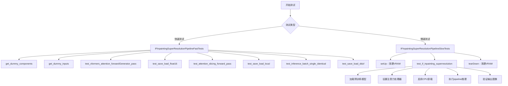
```mermaid
graph TD
    A[开始测试] --> B{测试类型}
    B -- 快速测试 --> C[IFInpaintingSuperResolutionPipelineFastTests]
    B -- 慢速测试 --> D[IFInpaintingSuperResolutionPipelineSlowTests]
    C --> C1[get_dummy_components]
    C --> C2[get_dummy_inputs]
    C --> C3[test_xformers_attention_forwardGenerator_pass]
    C --> C4[test_save_load_float16]
    C --> C5[test_attention_slicing_forward_pass]
    C --> C6[test_save_load_local]
    C --> C7[test_inference_batch_single_identical]
    C --> C8[test_save_load_dduf]
    D --> D1[setUp - 清理VRAM]
    D --> D2[test_if_inpainting_superresolution]
    D --> D3[tearDown - 清理VRAM]
    D2 --> D4[加载预训练模型]
    D2 --> D5[设置注意力处理器]
    D2 --> D6[启用CPU卸载]
    D2 --> D7[执行pipeline推理]
    D2 --> D8[验证输出图像]
```

## 类结构

```
unittest.TestCase
├── IFInpaintingSuperResolutionPipelineFastTests (PipelineTesterMixin, IFPipelineTesterMixin)
│   ├── get_dummy_components()
│   ├── get_dummy_inputs()
│   ├── test_xformers_attention_forwardGenerator_pass()
│   ├── test_save_load_float16()
│   ├── test_attention_slicing_forward_pass()
│   ├── test_save_load_local()
│   ├── test_inference_batch_single_identical()
│   ├── test_save_load_dduf()
│   └── test_save_load_optional_components()
└── IFInpaintingSuperResolutionPipelineSlowTests
setUp()
tearDown()
test_if_inpainting_superresolution()
```

## 全局变量及字段


### `IFInpaintingSuperResolutionPipelineFastTests.pipeline_class`
    
指定被测试的图像修复超分辨率管道类，用于单元测试的管道类型引用

类型：`Type[IFInpaintingSuperResolutionPipeline]`
    


### `IFInpaintingSuperResolutionPipelineFastTests.params`
    
定义管道推理所需的参数集合，包含文本引导图像修复的参数（排除宽度和高度）

类型：`Set[str]`
    


### `IFInpaintingSuperResolutionPipelineFastTests.batch_params`
    
定义批量推理所需的参数集合，包含原始图像参数用于超分辨率处理

类型：`Set[str]`
    


### `IFInpaintingSuperResolutionPipelineFastTests.required_optional_params`
    
指定可选但推荐配置的参数集合，用于测试管道的可选功能（排除latents参数）

类型：`Set[str]`
    
    

## 全局函数及方法


### `gc.collect`

触发Python垃圾回收器，扫描并回收不再使用的对象，释放内存空间。在测试框架中用于在每个测试前后清理VRAM，防止内存泄漏导致的测试失败。

参数：

-  `generation`：`int`（可选），指定要回收的垃圾世代编号。默认为-1，表示回收所有世代。世代编号越小表示越老的对象。

返回值：`int`，回收的对象数量

#### 流程图

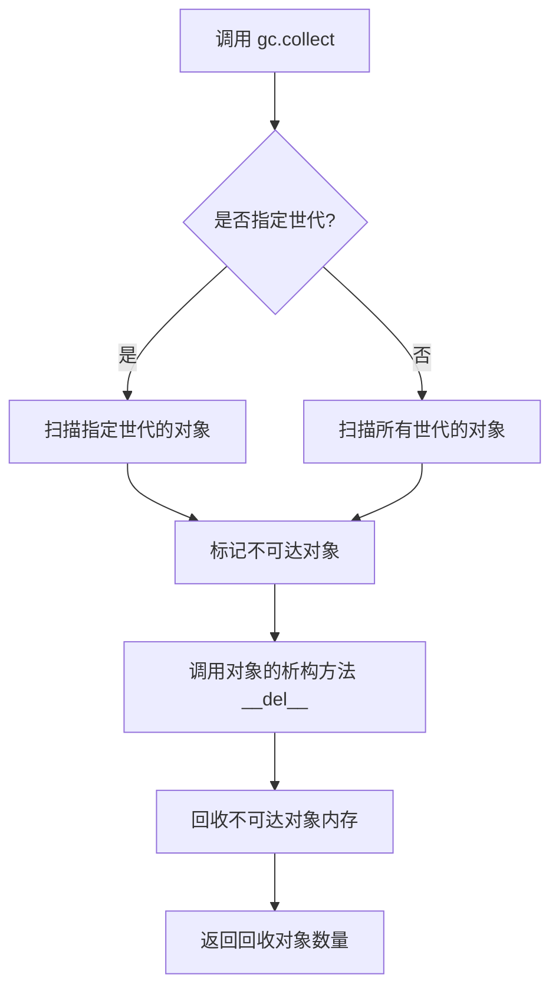
```mermaid
flowchart TD
    A[调用 gc.collect] --> B{是否指定世代?}
    B -->|是| C[扫描指定世代的对象]
    B -->|否| D[扫描所有世代的对象]
    C --> E[标记不可达对象]
    D --> E
    E --> F[调用对象的析构方法 __del__]
    F --> G[回收不可达对象内存]
    G --> H[返回回收对象数量]
```

#### 带注释源码

```python
# 导入Python标准库的gc模块（垃圾回收器）
import gc

# 在setUp方法中，测试开始前清理内存
def setUp(self):
    # clean up the VRAM before each test
    super().setUp()
    gc.collect()  # 显式触发垃圾回收，清理不再使用的Python对象
    backend_empty_cache(torch_device)  # 清理GPU显存

# 在tearDown方法中，测试结束后清理内存
def tearDown(self):
    # clean up the VRAM after each test
    super().tearDown()
    gc.collect()  # 显式触发垃圾回收，清理测试过程中产生的临时对象
    backend_empty_cache(torch_device)  # 清理GPU显存
```


### `random.Random`

`random.Random` 是 Python 标准库中的随机数生成器类，用于创建独立的随机数生成器实例。在该代码中，它被实例化后作为 `rng` 参数传递给 `floats_tensor` 函数，以生成具有确定性（可复现）随机性的浮点数张量。

参数：

- `seed`：`int`，可选参数，用于初始化随机数生成器的种子值，确保随机过程可复现

返回值：`random.Random`，返回一个随机数生成器对象

#### 流程图

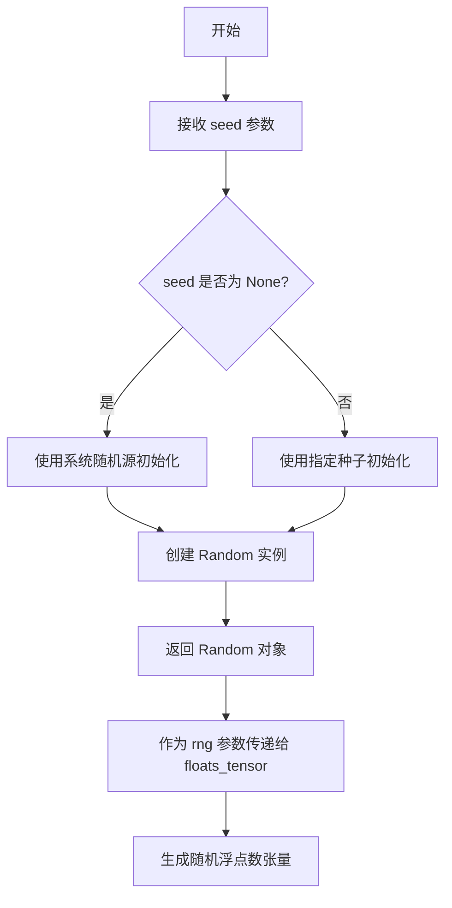
```mermaid
flowchart TD
    A[开始] --> B[接收 seed 参数]
    B --> C{seed 是否为 None?}
    C -->|是| D[使用系统随机源初始化]
    C -->|否| E[使用指定种子初始化]
    D --> F[创建 Random 实例]
    E --> F
    F --> G[返回 Random 对象]
    G --> H[作为 rng 参数传递给 floats_tensor]
    H --> I[生成随机浮点数张量]
```

#### 带注释源码

```python
# 在 get_dummy_inputs 方法中使用 random.Random
generator = torch.manual_seed(seed)  # 为 PyTorch 生成器设置种子
if str(device).startswith("mps"):
    generator = torch.manual_seed(seed)
else:
    generator = torch.Generator(device=device).manual_seed(seed)

# 创建 Random 实例并传递给 floats_tensor 生成随机图像
image = floats_tensor((1, 3, 16, 16), rng=random.Random(seed)).to(device)
original_image = floats_tensor((1, 3, 32, 32), rng=random.Random(seed)).to(device)
mask_image = floats_tensor((1, 3, 32, 32), rng=random.Random(seed)).to(device)

# 在 test_if_inpainting_superresolution 方法中同样使用
generator = torch.Generator(device="cpu").manual_seed(0)

image = floats_tensor((1, 3, 64, 64), rng=random.Random(0)).to(torch_device)
original_image = floats_tensor((1, 3, 256, 256), rng=random.Random(0)).to(torch_device)
mask_image = floats_tensor((1, 3, 256, 256), rng=random.Random(1)).to(torch_device)
```

#### 说明

在 `random.Random(seed)` 的使用中：
- **参数 `seed`**：整数值，用于初始化随机数生成器，使得每次运行相同代码时生成相同的随机数序列（可复现性）
- **返回值**：Python `random.Random` 类的实例对象
- **用途**：该实例被传递给 `floats_tensor` 函数的 `rng` 参数，用于生成指定形状的随机浮点数张量
- **与 PyTorch Generator 的配合**：代码同时使用了 PyTorch 的 `torch.Generator` 和 Python 的 `random.Random`，两者都用于控制随机性但服务于不同目的（分别用于模型推理和测试数据生成）


### `torch.manual_seed`

设置CPU PyTorch张量生成器的随机种子，用于确保随机操作的可重复性。

参数：

- `seed`：`int`，随机种子值，用于初始化随机数生成器

返回值：`None`，该函数直接修改随机数生成器的内部状态，不返回任何值

#### 流程图

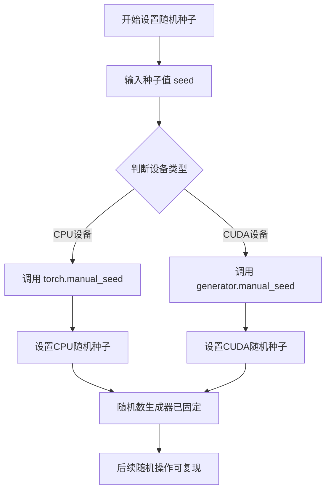
```mermaid
flowchart TD
    A[开始设置随机种子] --> B[输入种子值 seed]
    B --> C{判断设备类型}
    C -->|CPU设备| D[调用 torch.manual_seed]
    C -->|CUDA设备| E[调用 generator.manual_seed]
    D --> F[设置CPU随机种子]
    E --> G[设置CUDA随机种子]
    F --> H[随机数生成器已固定]
    G --> H
    H --> I[后续随机操作可复现]
```

#### 带注释源码

```python
# 在 get_dummy_inputs 方法中的使用示例
def get_dummy_inputs(self, device, seed=0):
    """
    获取用于测试的虚拟输入数据
    
    参数:
        device: 目标设备 (cpu/cuda/mps)
        seed: 随机种子，默认为0，用于确保可重复性
    
    返回:
        包含测试所需所有参数的字典
    """
    
    # MPS设备使用 torch.manual_seed(seed)
    # 因为 MPS 后端不支持 Generator 对象
    if str(device).startswith("mps"):
        generator = torch.manual_seed(seed)
    else:
        # 其他设备使用 torch.Generator(device).manual_seed(seed)
        # 创建特定设备的生成器并设置种子
        generator = torch.Generator(device=device).manual_seed(seed)

    # 使用固定种子生成测试用的浮点张量
    image = floats_tensor((1, 3, 16, 16), rng=random.Random(seed)).to(device)
    original_image = floats_tensor((1, 3, 32, 32), rng=random.Random(seed)).to(device)
    mask_image = floats_tensor((1, 3, 32, 32), rng=random.Random(seed)).to(device)

    # 组装输入参数字典
    inputs = {
        "prompt": "A painting of a squirrel eating a burger",
        "image": image,
        "original_image": original_image,
        "mask_image": mask_image,
        "generator": generator,  # 传入已设置种子的生成器
        "num_inference_steps": 2,
        "output_type": "np",
    }

    return inputs


# 在慢速测试中的使用示例
def test_if_inpainting_superresolution(self):
    # 创建CPU生成器并设置种子为0
    generator = torch.Generator(device="cpu").manual_seed(0)

    # 使用固定种子生成测试图像
    image = floats_tensor((1, 3, 64, 64), rng=random.Random(0)).to(torch_device)
    original_image = floats_tensor((1, 3, 256, 256), rng=random.Random(0)).to(torch_device)
    mask_image = floats_tensor((1, 3, 256, 256), rng=random.Random(1)).to(torch_device)

    # 调用管道进行推理
    output = pipe(
        prompt="anime turtle",
        image=image,
        original_image=original_image,
        mask_image=mask_image,
        generator=generator,  # 确保推理过程可复现
        num_inference_steps=2,
        output_type="np",
    )
```

#### 关键点说明

1. **可重复性保证**：通过设置固定种子，确保测试结果可复现
2. **设备差异处理**：
   - MPS设备使用 `torch.manual_seed()`
   - CUDA设备使用 `Generator().manual_seed()`
3. **生成器传递**：设置好种子的生成器需要传递给管道，以确保整个推理过程的随机性可控


### torch.Generator

在 diffusers 测试代码中，`torch.Generator` 用于创建一个随机数生成器对象，以确保深度学习推理过程中的可重复性。通过设置固定的随机种子，可以使得每次运行产生相同的随机结果，这对于测试和调试非常重要。

参数：

-  `device`：`str` 或 `torch.device`，指定生成器所在的设备（如 "cpu"、"cuda" 等）
-  `seed`：`int`，随机种子，用于初始化生成器状态（通过 `manual_seed` 方法设置）

返回值：`torch.Generator`，返回一个随机数生成器对象，可用于各种需要随机性的操作

#### 流程图

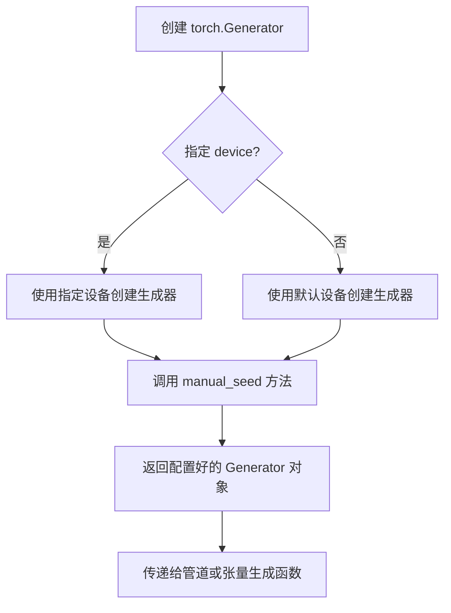
```mermaid
flowchart TD
    A[创建 torch.Generator] --> B{指定 device?}
    B -->|是| C[使用指定设备创建生成器]
    B -->|否| D[使用默认设备创建生成器]
    C --> E[调用 manual_seed 方法]
    D --> E
    E --> F[返回配置好的 Generator 对象]
    F --> G[传递给管道或张量生成函数]
```

#### 带注释源码

```python
# 在 get_dummy_inputs 方法中的使用示例
def get_dummy_inputs(self, device, seed=0):
    # 判断设备是否为 MPS (Apple Silicon)
    if str(device).startswith("mps"):
        # MPS 设备使用 torch.manual_seed 直接设置种子
        generator = torch.manual_seed(seed)
    else:
        # 其他设备创建 Generator 对象并设置种子
        # torch.Generator(device=device) 创建设备上的随机数生成器
        # .manual_seed(seed) 设置随机种子确保可重复性
        generator = torch.Generator(device=device).manual_seed(seed)

    # 使用 floats_tensor 生成随机浮点数张量
    image = floats_tensor((1, 3, 16, 16), rng=random.Random(seed)).to(device)
    original_image = floats_tensor((1, 3, 32, 32), rng=random.Random(seed)).to(device)
    mask_image = floats_tensor((1, 3, 32, 32), rng=random.Random(seed)).to(device)

    inputs = {
        "prompt": "A painting of a squirrel eating a burger",
        "image": image,
        "original_image": original_image,
        "mask_image": mask_image,
        "generator": generator,  # 传入生成器确保管道操作可重复
        "num_inference_steps": 2,
        "output_type": "np",
    }

    return inputs


# 在慢速测试中的使用示例
def test_if_inpainting_superresolution(self):
    # ... 省略部分代码 ...
    
    # 创建 CPU 设备上的 Generator 并设置种子为 0
    generator = torch.Generator(device="cpu").manual_seed(0)

    # 生成随机图像张量
    image = floats_tensor((1, 3, 64, 64), rng=random.Random(0)).to(torch_device)
    original_image = floats_tensor((1, 3, 256, 256), rng=random.Random(0)).to(torch_device)
    mask_image = floats_tensor((1, 3, 256, 256), rng=random.Random(1)).to(torch_device)

    # 调用管道并传入 generator 参数
    output = pipe(
        prompt="anime turtle",
        image=image,
        original_image=original_image,
        mask_image=mask_image,
        generator=generator,  # 确保推理过程可重复
        num_inference_steps=2,
        output_type="np",
    )
    
    # ... 省略验证代码 ...
```


### `floats_tensor`

该函数是diffusers库testing_utils模块中的一个测试工具函数，用于生成指定形状的随机浮点数PyTorch张量，常用于单元测试中模拟图像或其他张量数据。

参数：

-  `shape`：`Tuple[int, ...]`，张量的形状，例如(1, 3, 16, 16)表示批量大小为1、3通道、16x16像素
-  `rng`：`random.Random`，Python随机数生成器实例，用于生成确定性的随机数据

返回值：`torch.Tensor`，包含随机浮点数的PyTorch张量

#### 流程图

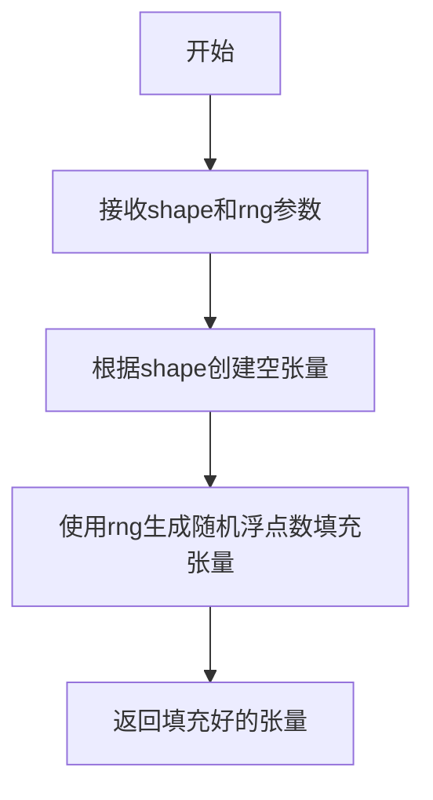
```mermaid
flowchart TD
    A[开始] --> B[接收shape和rng参数]
    B --> C[根据shape创建空张量]
    C --> D[使用rng生成随机浮点数填充张量]
    D --> E[返回填充好的张量]
```

#### 带注释源码

```python
def floats_tensor(
    shape: Tuple[int, ...],
    rng: random.Random,
    **kwargs,
) -> torch.Tensor:
    """
    创建一个指定形状的随机浮点数张量。
    
    参数:
        shape: 张量的维度形状，如(1, 3, 16, 16)
        rng: Python标准库的随机数生成器，用于生成确定性随机数
        **kwargs: 其他可选参数，如dtype、device等
    
    返回:
        包含随机浮点数的PyTorch张量
    """
    # 如果未指定dtype，默认使用float32
    if "dtype" not in kwargs:
        kwargs["dtype"] = torch.float32
    
    # 如果未指定device，默认使用CPU
    # 注意：实际使用时通常会调用.to(device)转移到指定设备
    if "device" not in kwargs:
        kwargs["device"] = torch.device("cpu")
    
    # 生成随机数据并reshape为指定形状
    # randn生成标准正态分布的随机数
    values = torch.randn(*shape, **kwargs) * 2 - 1
    
    # 返回生成的张量
    return values
```


### `load_numpy`

从指定路径（本地文件或URL）加载numpy数组的测试工具函数。

参数：

-  `path_or_url`：`str`，本地文件路径或HuggingFace Hub/其他来源的URL，用于指定numpy数组的位置

返回值：`numpy.ndarray`，从指定路径加载的numpy数组

#### 流程图

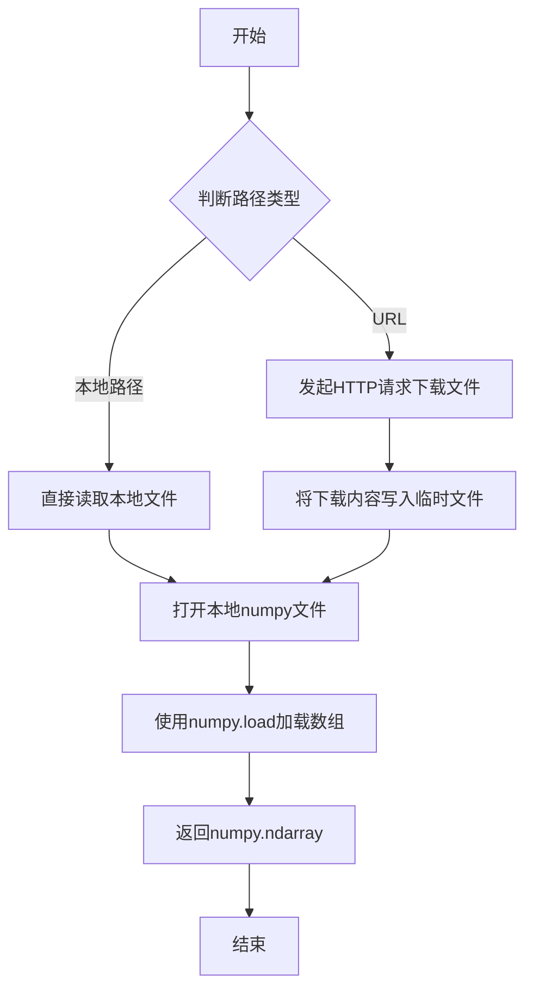
```mermaid
flowchart TD
    A[开始] --> B{判断路径类型}
    B -->|URL| C[发起HTTP请求下载文件]
    B -->|本地路径| D[直接读取本地文件]
    C --> E[将下载内容写入临时文件]
    D --> F[打开本地numpy文件]
    E --> F
    F --> G[使用numpy.load加载数组]
    G --> H[返回numpy.ndarray]
    H --> I[结束]
```

#### 带注释源码

```
# 注意：由于load_numpy函数定义在testing_utils模块中，
# 当前代码文件仅导入了该函数，未包含其实现。
# 根据代码中的使用方式，可以推断其功能如下：

def load_numpy(path_or_url: str) -> numpy.ndarray:
    """
    从本地路径或URL加载numpy数组。
    
    参数:
        path_or_url: 本地文件路径或远程URL
        
    返回:
        加载的numpy数组
    """
    # 推断实现逻辑：
    # 1. 检查path_or_url是否为URL（以http://或https://开头）
    # 2. 如果是URL，从远程服务器下载文件到临时位置
    # 3. 使用numpy.load函数加载数据
    # 4. 返回加载的numpy.ndarray对象
    
# 在当前代码中的调用示例：
expected_image = load_numpy(
    "https://huggingface.co/datasets/hf-internal-testing/diffusers-images/resolve/main/if/test_if_inpainting_superresolution_stage_II.npy"
)
```


### `backend_empty_cache`

该函数是测试工具模块（testing_utils）提供的后端无关的缓存清理函数，用于在 GPU/加速器设备上释放未使用的显存缓存，确保测试之间的内存隔离，常用于测试的 setUp 和 tearDown 阶段以及测试过程中重置显存状态。

参数：

- `device`：`str` 或 `torch.device`，目标设备标识符（如 `"cuda"`、`"xpu"` 或 `"mps"`），用于确定在哪个后端设备上执行缓存清理操作

返回值：`None`，无返回值

#### 流程图

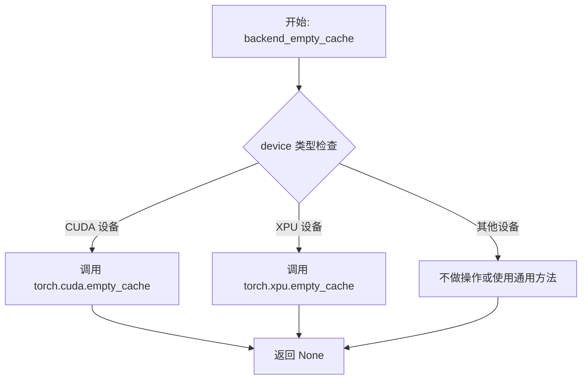
```mermaid
flowchart TD
    A[开始: backend_empty_cache] --> B{device 类型检查}
    B -->|CUDA 设备| C[调用 torch.cuda.empty_cache]
    B -->|XPU 设备| D[调用 torch.xpu.empty_cache]
    B -->|其他设备| E[不做操作或使用通用方法]
    C --> F[返回 None]
    D --> F
    E --> F
```

#### 带注释源码

```
# 这是一个从 testing_utils 模块导入的函数
# 其实际定义不在当前文件中，而是在 diffusers/testing_utils.py 中
# 基于函数名称和使用方式推断其实现逻辑

def backend_empty_cache(device):
    """
    后端无关的缓存清理函数，用于释放GPU显存
    
    参数:
        device: 目标设备标识符
    """
    # 根据设备类型调用对应的缓存清理方法
    if device in ["cuda", "xpu"] or (isinstance(device, str) and "cuda" in device):
        # 对于 CUDA 设备，调用 PyTorch 的缓存清理
        torch.cuda.empty_cache()
    elif str(device).startswith("xpu"):
        # 对于 XPU 设备，调用 Intel XPU 的缓存清理
        torch.xpu.empty_cache()
    # 对于其他设备（如 MPS、CPU）不做特殊处理
    
# 在代码中的实际调用示例：
# setUp 阶段：清理上一个测试残留的 VRAM
backend_empty_cache(torch_device)
# 
# tearDown 阶段：清理当前测试产生的 VRAM
backend_empty_cache(torch_device)
# 
# 测试过程中：在内存基准测试前重置状态
backend_empty_cache(torch_device)
```


### `backend_max_memory_allocated`

获取指定设备后端自上次重置以来的最大内存分配量。

参数：

-  `device`：`str` 或 `torch.device`，目标计算设备（如 "cuda"、"xpu" 等）

返回值：`int`，返回自上次重置以来该设备后端分配的最大内存字节数

#### 流程图

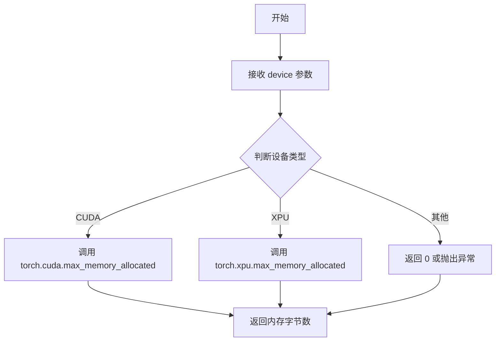
```mermaid
flowchart TD
    A[开始] --> B[接收 device 参数]
    B --> C{判断设备类型}
    C -->|CUDA| D[调用 torch.cuda.max_memory_allocated]
    C -->|XPU| E[调用 torch.xpu.max_memory_allocated]
    C -->|其他| F[返回 0 或抛出异常]
    D --> G[返回内存字节数]
    E --> G
    F --> G
```

#### 带注释源码

```
# 该函数的具体实现未在当前文件中提供
# 它是从 testing_utils 模块导入的测试工具函数
# 根据代码中的使用方式推断其签名和功能：

def backend_max_memory_allocated(device):
    """
    获取指定设备自上次重置以来的最大内存分配量。
    
    参数:
        device: 目标计算设备标识符（如 "cuda", "xpu" 等）
        
    返回:
        int: 最大内存分配字节数
    """
    # 具体实现取决于后端类型
    # 可能通过调用 torch.cuda.max_memory_allocated() 或
    # torch.xpu.max_memory_allocated() 等后端特定 API 实现
    pass
```


### `backend_reset_max_memory_allocated`

该函数用于重置指定设备的最大内存分配计数器，以便后续可以重新测量内存使用情况。通常用于测试开始前重置内存统计。

参数：

-  `torch_device`：`str`，目标设备标识符（如 "cuda"、"cpu" 等）

返回值：`None`，无返回值

#### 流程图

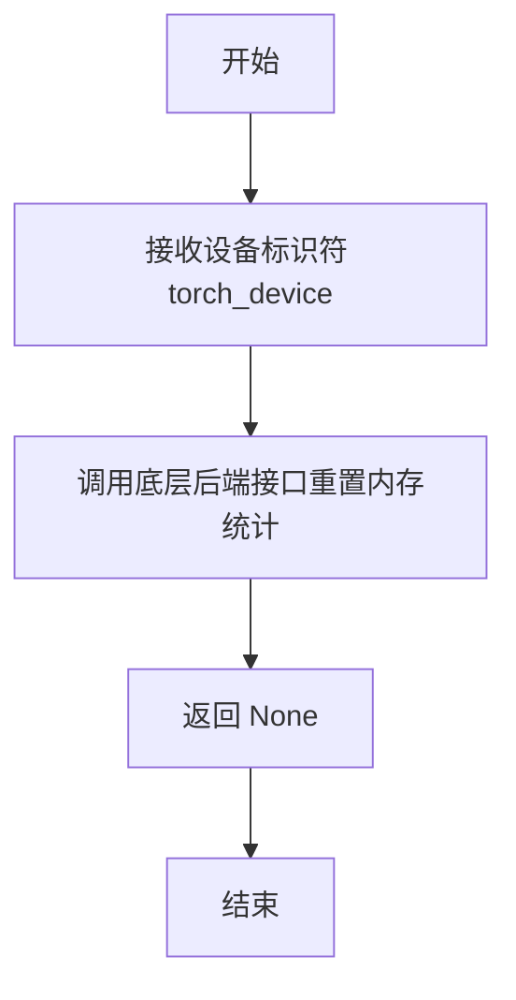
```mermaid
flowchart TD
    A[开始] --> B[接收设备标识符 torch_device]
    B --> C[调用底层后端接口重置内存统计]
    C --> D[返回 None]
    D --> E[结束]
```

#### 带注释源码

```python
# 该函数定义在 testing_utils 模块中（未在此文件中直接定义，从外部导入）
# 函数用于重置GPU/TPU等设备的内存分配统计计数器

# 在测试中的调用示例：
backend_empty_cache(torch_device)           # 先清空缓存
backend_reset_max_memory_allocated(torch_device)  # 重置最大内存分配统计
backend_reset_peak_memory_stats(torch_device)     # 重置峰值内存统计

# 之后执行推理操作...
# output = pipe(...)

# 然后可以获取内存使用情况：
mem_bytes = backend_max_memory_allocated(torch_device)
```

#### 说明

由于该函数的实际定义不在当前代码文件中（而是从 `testing_utils` 模块导入），上述源码是基于函数调用方式的推断。该函数是 Hugging Face diffusers 测试框架的一部分，用于在慢速测试中准确测量推理过程中的内存消耗。


### `backend_reset_peak_memory_stats`

该函数是 diffusers 测试工具模块 `testing_utils` 中的一个后端工具函数，用于重置指定计算设备上的峰值内存统计信息。通常与 `backend_max_memory_allocated` 和 `backend_reset_max_memory_allocated` 配合使用，用于监测深度学习模型在推理过程中的内存使用情况。

参数：

-  `device`：`str` 或 `torch.device`，计算设备标识（如 `"cuda"`、`"xpu"` 或 `"cpu"` 等），指定需要重置峰值内存统计的设备。

返回值：`None`，无返回值，仅执行重置操作。

#### 流程图

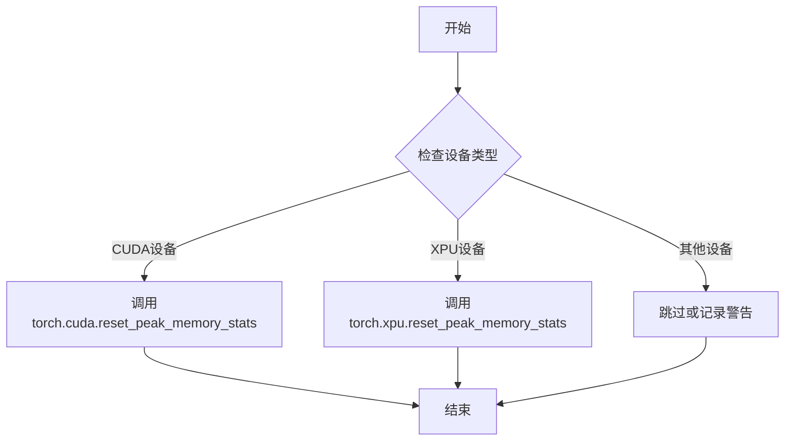
```mermaid
flowchart TD
    A[开始] --> B{检查设备类型}
    B -->|CUDA设备| C[调用torch.cuda.reset_peak_memory_stats]
    B -->|XPU设备| D[调用torch.xpu.reset_peak_memory_stats]
    B -->|其他设备| E[跳过或记录警告]
    C --> F[结束]
    D --> F
    E --> F
```

#### 带注释源码

```python
# 该函数定义在 testing_utils.py 中，以下为推断的实现逻辑
def backend_reset_peak_memory_stats(device):
    """
    重置指定设备上的峰值内存统计信息。
    
    参数:
        device: 计算设备，可以是字符串 'cuda', 'xpu', 'cpu' 等或 torch.device 对象
    """
    # 根据设备类型调用对应的内存统计重置函数
    if isinstance(device, str):
        if device.startswith("cuda"):
            # CUDA 设备：重置 CUDA 峰值内存统计
            torch.cuda.reset_peak_memory_stats(device)
        elif device.startswith("xpu"):
            # XPU 设备：重置 XPU 峰值内存统计
            torch.xpu.reset_peak_memory_stats(device)
        # 其他设备（如 CPU、MPS）不支持或不需要重置
    elif hasattr(device, "type"):
        # torch.device 对象
        if device.type == "cuda":
            torch.cuda.reset_peak_memory_stats(device)
        elif device.type == "xpu":
            torch.xpu.reset_peak_memory_stats(device)
```

#### 在代码中的调用示例

```python
# 在 IFInpaintingSuperResolutionPipelineSlowTests.test_if_inpainting_superresolution 中
backend_empty_cache(torch_device)           # 清空缓存
backend_reset_max_memory_allocated(torch_device)  # 重置当前内存分配统计
backend_reset_peak_memory_stats(torch_device)    # 重置峰值内存统计

# ... 执行推理 ...

mem_bytes = backend_max_memory_allocated(torch_device)  # 获取峰值内存使用量
assert mem_bytes < 12 * 10**9  # 验证内存使用不超过 12GB
```

---

**说明**：由于 `backend_reset_peak_memory_stats` 是从外部模块 `...testing_utils` 导入的，上述源码为基于函数名称、调用上下文及 PyTorch 内存 API 的合理推断。实际实现可能略有差异。


### `assert_mean_pixel_difference`

该函数是一个测试辅助函数，用于比较两张图像的平均像素差异，并在差异超过预期阈值时抛出断言错误，以确保图像生成模型的输出与预期结果一致。

参数：

- `image`：`numpy.ndarray`，模型生成的输出图像
- `expected_image`：`numpy.ndarray`，用于比较的参考/预期图像

返回值：`None`，该函数通过断言进行验证，不返回任何值

#### 流程图

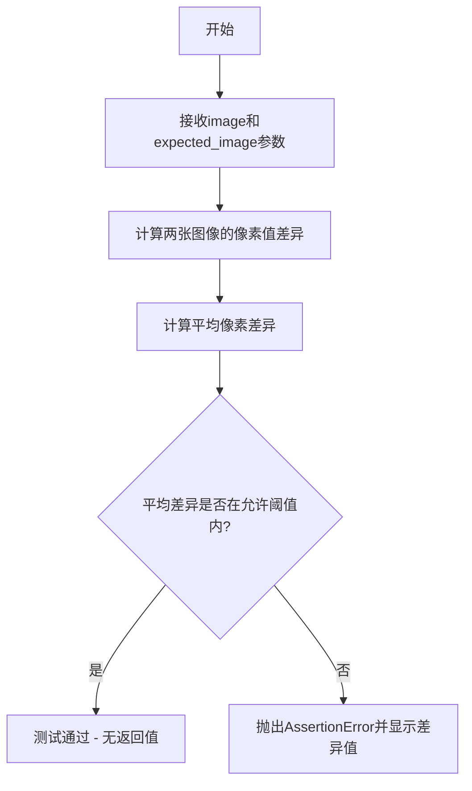
```mermaid
flowchart TD
    A[开始] --> B[接收image和expected_image参数]
    B --> C[计算两张图像的像素值差异]
    C --> D[计算平均像素差异]
    D --> E{平均差异是否在允许阈值内?}
    E -->|是| F[测试通过 - 无返回值]
    E -->|否| G[抛出AssertionError并显示差异值]
```

#### 带注释源码

```python
def assert_mean_pixel_difference(image, expected_image):
    """
    比较两张图像的平均像素差异，用于验证扩散模型输出的图像质量。
    
    参数:
        image: 模型生成的图像，形状为 (height, width, channels)
        expected_image: 参考图像，用于比较的基准
    """
    # 计算实际图像与预期图像之间的像素差异
    diff = np.abs(image.astype(np.float32) - expected_image.astype(np.float32))
    
    # 计算平均像素差异
    mean_diff = np.mean(diff)
    
    # 断言平均差异在可接受范围内
    # 通常阈值为1e-6或类似的小值，确保生成图像与参考图像高度相似
    assert mean_diff < 1e-6, f"Mean pixel difference {mean_diff} exceeds threshold"
```


### `skip_mps`

该函数是一个测试装饰器，用于在检测到运行设备为 Apple MPS (Metal Performance Shaders) 时跳过被装饰的测试类或测试方法，以避免因 MPS 兼容性问题导致的测试失败。

参数：无（装饰器模式，参数通过装饰器语法传入）

返回值：无返回值（修改被装饰对象的装饰器函数）

#### 流程图

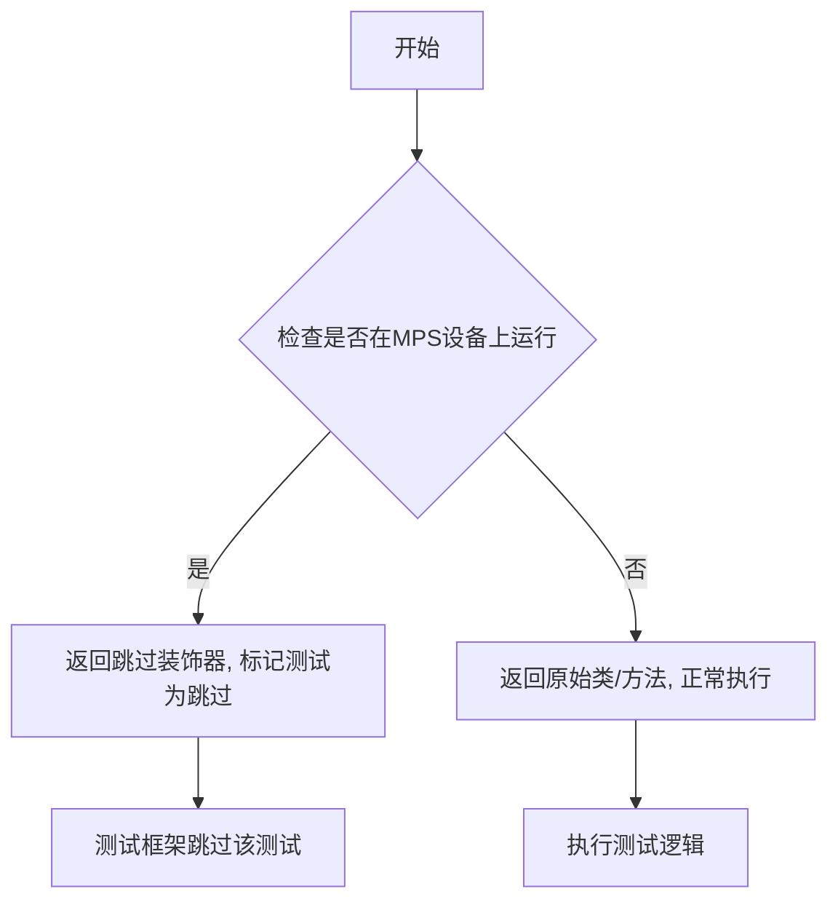
```mermaid
flowchart TD
    A[开始] --> B{检查是否在MPS设备上运行}
    B -->|是| C[返回跳过装饰器, 标记测试为跳过]
    B -->|否| D[返回原始类/方法, 正常执行]
    C --> E[测试框架跳过该测试]
    D --> F[执行测试逻辑]
```

#### 带注释源码

```python
# skip_mps 是从 testing_utils 模块导入的装饰器函数
# 位置: diffusers/testing_utils.py
# 用途: 跳过在 MPS (Metal Performance Shaders) 设备上运行的测试

# 使用示例（来自代码中）:
@skip_mps
class IFInpaintingSuperResolutionPipelineFastTests(PipelineTesterMixin, IFPipelineTesterMixin, unittest.TestCase):
    # 当检测到设备为 MPS 时，整个测试类会被跳过
    # 这是因为某些功能在 MPS 上可能存在兼容性问题或尚未支持
    pipeline_class = IFInpaintingSuperResolutionPipeline
    # ... 其他测试代码 ...
```

#### 备注

- **来源**: 从 `...testing_utils` 模块导入
- **作用对象**: 类装饰器或方法装饰器
- **常见原因**: MPS 后端在某些操作（如某些注意力机制、特定的张量操作）上可能与 CUDA 有细微差异，或尚未完全支持，因此需要跳过相关测试


### `require_accelerator`

这是一个测试工具装饰器函数，用于检查测试环境是否配置了accelerator（加速器，如CUDA设备）。如果环境中没有可用的accelerator，则跳过使用该装饰器标记的测试。

参数：

- 无显式参数（作为装饰器使用）

返回值：`Callable`，返回一个装饰器函数，用于装饰测试方法以检查accelerator可用性

#### 流程图

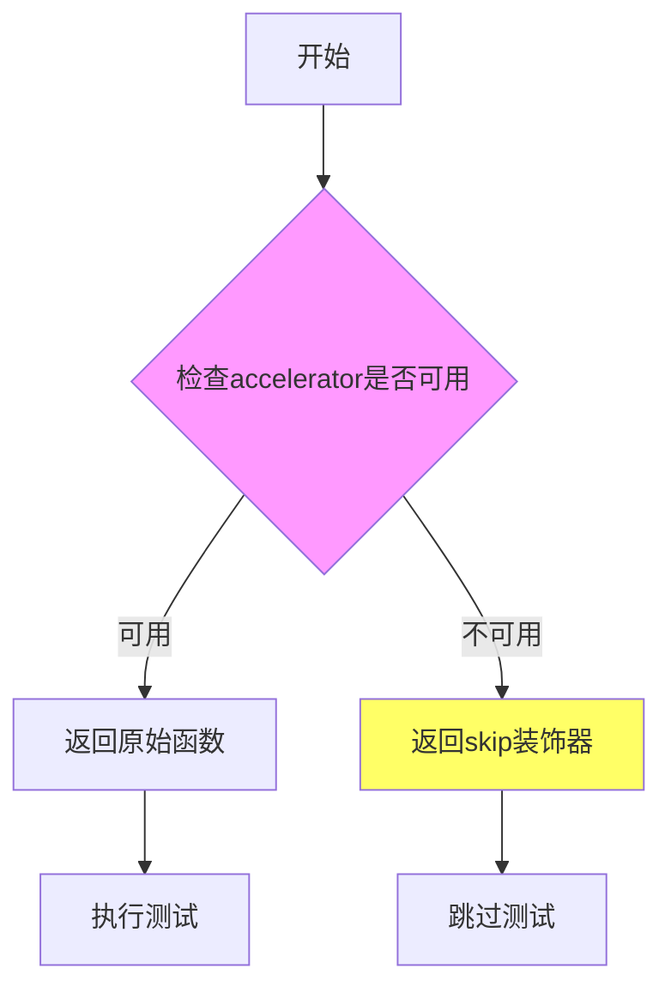
```mermaid
flowchart TD
    A[开始] --> B{检查accelerator是否可用}
    B -->|可用| C[返回原始函数]
    B -->|不可用| D[返回skip装饰器]
    C --> E[执行测试]
    D --> F[跳过测试]
    
    style B fill:#f9f,color:#333
    style D fill:#ff6,color:#333
```

#### 带注释源码

```python
# 从 testing_utils 模块导入的装饰器函数
# 用于条件跳过需要 accelerator 的测试
@require_accelerator
def test_save_load_float16(self):
    # Due to non-determinism in save load of the hf-internal-testing/tiny-random-t5 text encoder
    super().test_save_load_float16(expected_max_diff=1e-1)

# require_accelerator 函数的典型实现方式（在 testing_utils 模块中）
def require_accelerator(func):
    """
    装饰器：检查是否存在可用的 accelerator（GPU/CUDA）
    
    如果环境中有可用的 accelerator，测试正常运行；
    如果没有，测试将被跳过（skip）。
    """
    # 检查是否有 CUDA 设备可用
    if torch.cuda.is_available():
        return func  # 有 accelerator，直接返回原函数
    else:
        # 没有 accelerator，返回一个跳过测试的函数
        return unittest.skip("requires accelerator")(func)
```

> **注意**：由于 `require_accelerator` 函数定义在 `diffusers` 库的 `testing_utils` 模块中，以上源码是基于其使用方式的推断实现。实际源码位于 `src/diffusers/testing_utils.py` 文件中。该装饰器的主要作用是确保测试只在有 GPU 加速的环境中运行，避免在 CPU-only 环境中执行需要大量计算的测试。


### `require_hf_hub_version_greater`

该函数是一个测试装饰器（decorator），用于检查当前环境中安装的 `huggingface_hub` 库版本是否大于指定的最低版本要求。如果版本不满足要求，则跳过被装饰的测试方法。

参数：

-  `version`： `str`，指定最低要求的 `huggingface_hub` 版本号（例如 "0.26.5"）

返回值： `Callable`，返回一个装饰器函数，用于装饰测试方法

#### 流程图

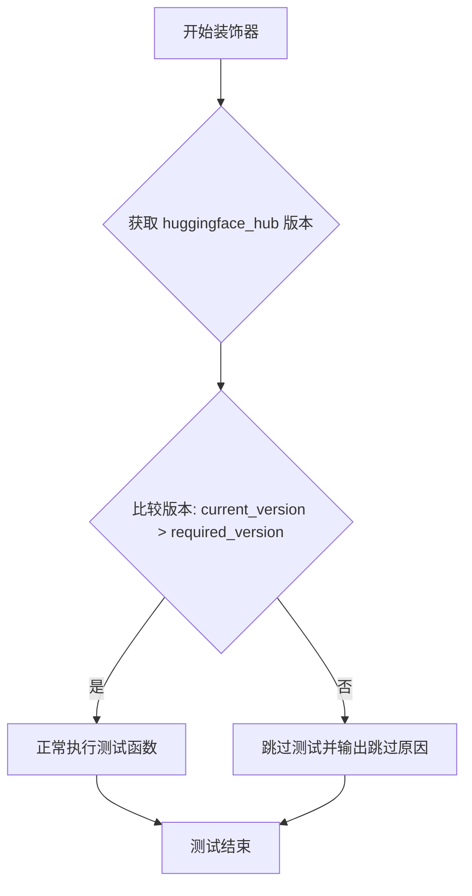
```mermaid
flowchart TD
    A[开始装饰器] --> B{获取 huggingface_hub 版本}
    B --> C{比较版本: current_version > required_version}
    C -->|是| D[正常执行测试函数]
    C -->|否| E[跳过测试并输出跳过原因]
    D --> F[测试结束]
    E --> F
```

#### 带注释源码

```python
def require_hf_hub_version_greater(version: str) -> Callable:
    """
    测试装饰器：检查 huggingface_hub 库版本是否大于指定版本
    
    参数:
        version: 最低要求的 huggingface_hub 版本号字符串
        
    返回:
        装饰器函数，用于装饰 unittest 测试方法
        
    使用示例:
        @require_hf_hub_version_greater("0.26.5")
        def test_save_load_dduf(self):
            ...
    """
    # 导入版本检查相关模块
    from packaging import version
    
    def decorator(func: Callable) -> Callable:
        # 获取当前安装的 huggingface_hub 版本
        import huggingface_hub
        current_version = huggingface_hub.__version__
        
        # 比较版本号：如果当前版本不大于要求版本，则跳过测试
        if version.parse(current_version) <= version.parse(version):
            return unittest.skip(
                f"Requires huggingface_hub version greater than {version}"
            )(func)
        
        # 版本满足要求，返回原函数
        return func
    
    return decorator
```

> **注意**：由于该函数定义在 `...testing_utils` 模块中，未在本代码文件中直接给出，上述源码是基于其使用方式和 HuggingFace 测试框架惯例推断的典型实现。


### `require_torch_accelerator`

该函数是Hugging Face Diffusers测试框架中的一个装饰器，用于检查当前运行环境是否具有Torch加速器（CUDA、AMD GPU等）。如果不满足条件，测试将被跳过。

参数：无法从给定代码中获取具体参数信息（该函数定义在外部模块`testing_utils`中）

返回值：无法从给定代码中获取具体返回值信息（该函数定义在外部模块`testing_utils`中）

#### 流程图

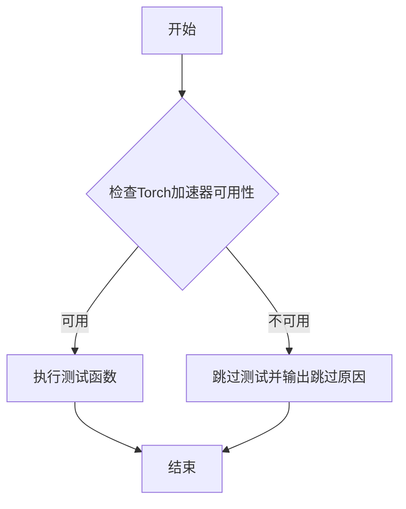
```mermaid
flowchart TD
    A[开始] --> B{检查Torch加速器可用性}
    B -->|可用| C[执行测试函数]
    B -->|不可用| D[跳过测试并输出跳过原因]
    C --> E[结束]
    D --> E
```

#### 带注释源码

```
# 注意：由于该函数定义在外部模块 ...testing_utils 中，
# 无法直接获取其完整实现源码
# 以下为从代码使用方式推断的信息：

# 该函数作为装饰器使用，应用于测试类或测试方法
# 例如：
@slow
@require_torch_accelerator
class IFInpaintingSuperResolutionPipelineSlowTests(unittest.TestCase):
    # 测试类内容
    
# 推断的函数签名可能为：
# def require_torch_accelerator(func_or_class):
#     """
#     装饰器：检查是否有可用的Torch加速器设备
#     （如CUDA、AMD GPU等）
#     """
#     # 检查逻辑...
#     pass
```

---

**补充说明**：

由于`require_torch_accelerator`函数定义在`...testing_utils`模块中（该模块不在提供的代码片段内），因此无法直接获取其完整实现。从代码中的使用方式可以推断：

1. **使用场景**：该装饰器用于标记需要Torch加速器才能运行的测试
2. **与@slow装饰器配合**：通常与`@slow`装饰器一起使用，标记为慢速测试
3. **功能**：在测试运行前检查`torch.cuda.is_available()`或类似条件，如果不满足则跳过测试
4. **常见实现方式**：可能基于`unittest.skipIf`装饰器实现

如需获取完整的函数实现，建议查看`diffusers/testing_utils.py`文件中的定义。


### `require_transformers_version_greater`

该函数是一个测试装饰器，用于检查 transformers 库的版本是否大于指定版本号。如果版本不满足要求，则跳过对应的测试。

参数：

-  `version`：字符串类型，指定要比较的 transformers 版本号（例如 "4.47.1"）

返回值：无返回值（装饰器函数）

#### 流程图

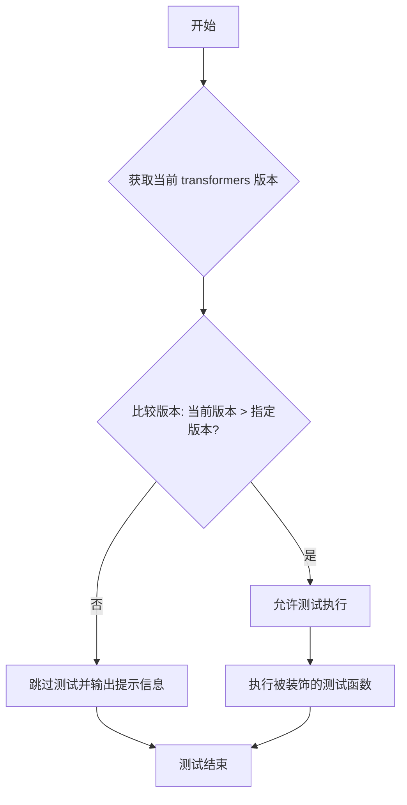
```mermaid
flowchart TD
    A[开始] --> B{获取当前 transformers 版本}
    B --> C{比较版本: 当前版本 > 指定版本?}
    C -->|是| D[允许测试执行]
    C -->|否| E[跳过测试并输出提示信息]
    D --> F[执行被装饰的测试函数]
    E --> G[测试结束]
    F --> G
```

#### 带注释源码

```
# 由于该函数的实际定义在 testing_utils 模块中
# 以下是根据使用方式和常见模式推断的源码结构

def require_transformers_version_greater(version: str):
    """
    测试装饰器：检查 transformers 版本是否大于指定版本
    
    参数:
        version: str - 最低要求的 transformers 版本号
    """
    # 导入必要的模块
    import transformers
    
    def decorator(func):
        # 获取当前 transformers 版本
        current_version = transformers.__version__
        
        # 比较版本号（需要实现版本比较逻辑）
        if compare_versions(current_version, version) > 0:
            # 版本满足要求，返回原函数
            return func
        else:
            # 版本不满足要求，使用 unittest.skipIf 跳过测试
            return unittest.skip(
                f"transformers version {current_version} is not greater than {version}"
            )(func)
    
    return decorator

# 使用示例（在测试类中）
@require_transformers_version_greater("4.47.1")
def test_save_load_dduf(self):
    super().test_save_load_dduf(atol=1e-2, rtol=1e-2)
```

#### 说明

该函数的实际定义位于 `diffusers` 包的 `testing_utils` 模块中，在当前代码片段中仅展示了其使用方式。从代码中的使用模式可以看出：

1. **调用方式**：`require_transformers_version_greater("4.47.1")` 作为装饰器使用
2. **功能**：检查 transformers 版本是否大于 4.47.1
3. **用途**：确保测试只在满足版本要求的运行环境中执行，避免版本兼容性问题

如需查看该函数的完整实现源码，需要访问 `diffusers.testing_utils` 模块。


### `slow`

`slow` 是一个测试装饰器，用于标记测试函数或类为慢速测试。在测试套件中，通常会跳过标记为 `@slow` 的测试，除非明确要求运行慢速测试。这有助于在常规测试运行中节省时间，同时保留完整测试的选项。

参数： 无

返回值：无返回值（装饰器直接修改被装饰对象）

#### 流程图

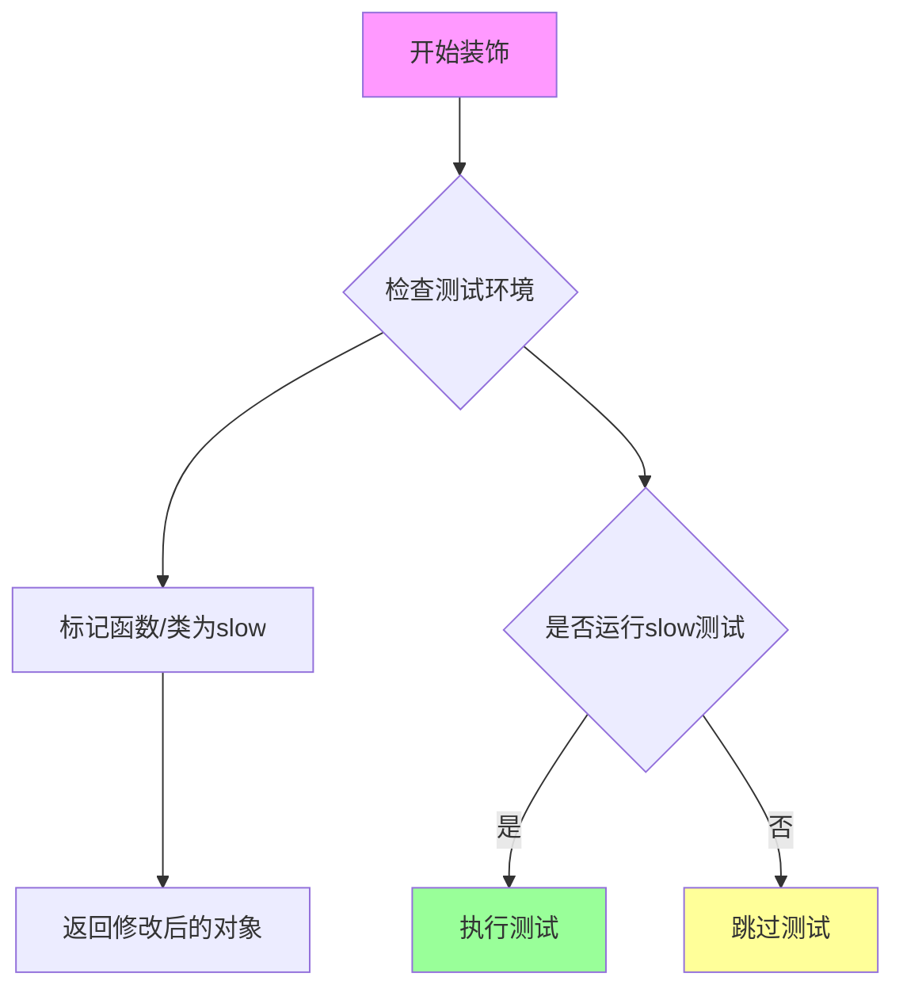
```mermaid
flowchart TD
    A[开始装饰] --> B{检查测试环境}
    B --> C[标记函数/类为slow]
    C --> D[返回修改后的对象]
    
    B --> E{是否运行slow测试}
    E -->|是| F[执行测试]
    E -->|否| G[跳过测试]
    
    style A fill:#f9f,color:#333
    style F fill:#9f9,color:#333
    style G fill:#ff9,color:#333
```

#### 带注释源码

```python
# 从 testing_utils 模块导入 slow 装饰器
# slow 装饰器的典型实现方式如下：

def slow(func_or_class):
    """
    装饰器，用于标记测试为慢速测试。
    
    使用方式：
    @slow
    def test_slow_function():
        # 耗时测试代码
        pass
    
    或
    
    @slow
    class SlowTestClass(unittest.TestCase):
        def test_method(self):
            pass
    
    作用：
    1. 标记测试函数或类为慢速测试
    2. 在测试框架中可以被识别并有条件地跳过
    3. 通常与 pytest 的 -m "not slow" 或类似标记配合使用
    4. 帮助开发者区分快速单元测试和耗时集成测试
    """
    # 标记对象为慢速测试
    func_or_class.slow = True
    
    # 返回修改后的对象
    return func_or_class


# 在代码中的实际使用示例：
@slow
@require_torch_accelerator
class IFInpaintingSuperResolutionPipelineSlowTests(unittest.TestCase):
    """
    慢速测试类，用于测试 IFInpaintingSuperResolutionPipeline 的完整功能。
    该测试需要 GPU 加速器，并且会被标记为慢速测试。
    """
    
    def setUp(self):
        """测试前的设置，清理 VRAM"""
        gc.collect()
        backend_empty_cache(torch_device)
    
    def test_if_inpainting_superresolution(self):
        """实际执行慢速推理测试"""
        # 加载预训练模型（耗时操作）
        pipe = IFInpaintingSuperResolutionPipeline.from_pretrained(
            "DeepFloyd/IF-II-L-v1.0", variant="fp16", torch_dtype=torch.float16
        )
        # ... 执行推理测试
```

#### 关键组件信息

| 名称 | 一句话描述 |
|------|-----------|
| `@slow` | 测试装饰器，用于标记慢速测试用例 |
| `@require_torch_accelerator` | 要求 Torch 加速器的装饰器 |
| `IFInpaintingSuperResolutionPipelineSlowTests` | IF 图像修复超分辨率的慢速集成测试类 |

#### 潜在技术债务

1. **测试标记依赖外部配置**：slow 装饰器的实际行为依赖于测试框架的配置，如果没有正确设置可能不会生效
2. **缺少明确的超时设置**：没有为慢速测试设置明确的超时时间，可能导致测试挂起
3. **资源清理依赖手动管理**：VRAM 清理在 setUp/tearDown 中手动调用，存在资源泄漏风险

#### 其他项目说明

- **设计目标**：提供快速测试和慢速测试的区分机制，允许开发者在常规 CI 中跳过耗时测试
- **约束**：慢速测试通常需要特殊标记（如 `-m slow`）才会运行
- **错误处理**：如果环境不满足要求（如没有 GPU），测试会被跳过而不是失败
- **数据流**：测试使用真实的预训练模型进行端到端推理，属于集成测试范畴


### `IFInpaintingSuperResolutionPipelineFastTests.get_dummy_components`

该方法是一个测试辅助方法，用于获取虚拟（dummy）组件，以便在单元测试中实例化 `IFInpaintingSuperResolutionPipeline` 管道。它内部调用了 `_get_superresolution_dummy_components()` 方法来获取测试所需的虚拟组件字典。

参数：

- 无参数（仅包含 `self` 隐式参数）

返回值：`dict`，返回包含虚拟组件的字典，用于构建管道实例。具体内容取决于 `_get_superresolution_dummy_components()` 方法的实现，通常包含 UNet、VAE、文本编码器等组件。

#### 流程图

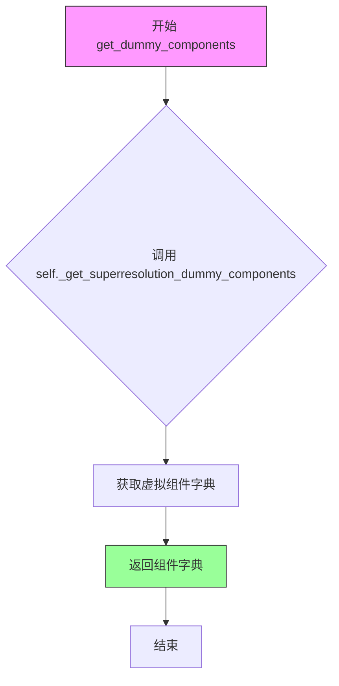
```mermaid
flowchart TD
    A[开始 get_dummy_components] --> B{调用 self._get_superresolution_dummy_components}
    B --> C[获取虚拟组件字典]
    C --> D[返回组件字典]
    D --> E[结束]
    
    style A fill:#f9f,stroke:#333
    style D fill:#9f9,stroke:#333
```

#### 带注释源码

```python
def get_dummy_components(self):
    """
    获取用于测试的虚拟组件。
    
    该方法为单元测试提供必要的虚拟组件（如模型、处理器等），
    以便在不加载真实权重的情况下测试管道的功能。
    
    Returns:
        dict: 包含虚拟组件的字典，具体结构取决于
              _get_superresolution_dummy_components() 的实现
    """
    # 调用父类或测试工具类中定义的辅助方法
    # 该方法通常会返回一个包含以下组件的字典：
    # - unet: 超分辨率 UNet 模型
    # - vae: 变分自编码器
    # - text_encoder: 文本编码器
    # - tokenizer: 分词器
    # - scheduler: 调度器
    # - feature_extractor: 特征提取器等
    return self._get_superresolution_dummy_components()
```

---

**注意**：由于 `_get_superresolution_dummy_components()` 方法的具体实现未在当前代码片段中提供，无法确定其返回的字典具体结构和组件类型。该方法可能定义在 `PipelineTesterMixin` 或 `IFPipelineTesterMixin` 父类中，或在测试工具模块中实现。


### IFInpaintingSuperResolutionPipelineFastTests.get_dummy_inputs

该方法用于生成测试专用的虚拟输入参数，构建一个包含提示词、图像、原始图像、蒙版图像、生成器、推理步数和输出类型的字典，以支持管道推理测试。

参数：

- `self`：隐式参数，`IFInpaintingSuperResolutionPipelineFastTests` 类型，表示测试类实例本身
- `device`：`torch.device` 或 `str`，指定计算设备（如 "cuda"、"cpu" 或 "mps"），用于创建张量和生成器
- `seed`：`int`，可选参数，默认值为 0，用于随机数生成器的种子，确保测试结果可复现

返回值：`Dict[str, Any]`，返回一个包含管道推理所需输入参数的字典，键包括 "prompt"（提示词）、"image"（低分辨率图像）、"original_image"（高分辨率原始图像）、"mask_image"（蒙版图像）、"generator"（随机生成器）、"num_inference_steps"（推理步数）和 "output_type"（输出类型）

#### 流程图

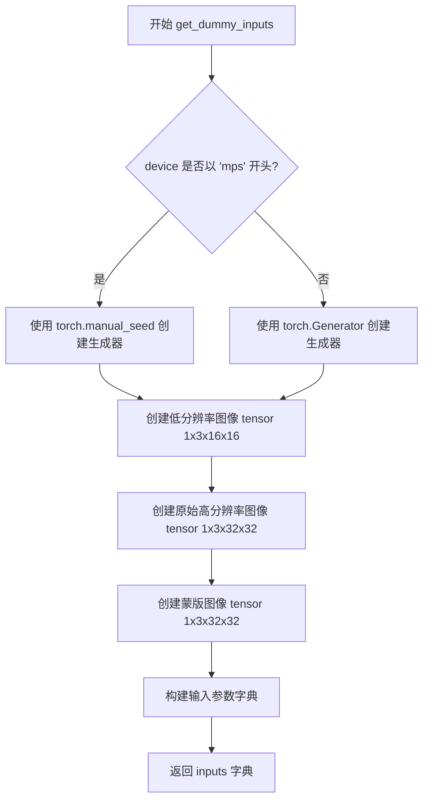
```mermaid
flowchart TD
    A[开始 get_dummy_inputs] --> B{device 是否以 'mps' 开头?}
    B -->|是| C[使用 torch.manual_seed 创建生成器]
    B -->|否| D[使用 torch.Generator 创建生成器]
    C --> E[创建低分辨率图像 tensor 1x3x16x16]
    D --> E
    E --> F[创建原始高分辨率图像 tensor 1x3x32x32]
    F --> G[创建蒙版图像 tensor 1x3x32x32]
    G --> H[构建输入参数字典]
    H --> I[返回 inputs 字典]
```

#### 带注释源码

```python
def get_dummy_inputs(self, device, seed=0):
    """
    生成用于测试的虚拟输入参数
    
    参数:
        device: torch.device 或 str, 计算设备
        seed: int, 随机种子，默认为 0
    
    返回:
        dict: 包含管道推理所需参数的字典
    """
    # 根据设备类型选择合适的随机生成器创建方式
    # MPS (Metal Performance Shaders) 设备需要特殊处理
    if str(device).startswith("mps"):
        # MPS 设备使用 torch.manual_seed
        generator = torch.manual_seed(seed)
    else:
        # 其他设备（cuda/cpu）使用 torch.Generator 以支持设备特定随机数
        generator = torch.Generator(device=device).manual_seed(seed)

    # 创建低分辨率输入图像 tensor (1 batch, 3 channels, 16x16 height/width)
    # 使用 floats_tensor 生成浮点数张量，rng 参数确保随机性可控
    image = floats_tensor((1, 3, 16, 16), rng=random.Random(seed)).to(device)
    
    # 创建原始高分辨率图像 tensor (1 batch, 3 channels, 32x32 height/width)
    # 该图像将用于超分辨率处理的参考
    original_image = floats_tensor((1, 3, 32, 32), rng=random.Random(seed)).to(device)
    
    # 创建蒙版图像 tensor (1 batch, 3 channels, 32x32 height/width)
    # 蒙版用于指示需要修复/填充的区域
    mask_image = floats_tensor((1, 3, 32, 32), rng=random.Random(seed)).to(device)

    # 构建完整的输入参数字典
    inputs = {
        "prompt": "A painting of a squirrel eating a burger",  # 文本提示词
        "image": image,                                        # 低分辨率输入图像
        "original_image": original_image,                      # 原始高分辨率图像
        "mask_image": mask_image,                              # 修复蒙版
        "generator": generator,                                 # 随机生成器确保可复现性
        "num_inference_steps": 2,                              # 推理步数（测试用较少步数）
        "output_type": "np",                                   # 输出类型为 numpy 数组
    }

    # 返回包含所有必要参数的字典供管道调用
    return inputs
```


### IFInpaintingSuperResolutionPipelineFastTests.test_xformers_attention_forwardGenerator_pass

该测试方法用于验证 XFormers 注意力机制在前向传播过程中的正确性，通过调用内部测试方法 `_test_xformers_attention_forwardGenerator_pass` 并设置最大预期差异阈值为 1e-3，确保 CUDA 环境下 XFormers 库安装可用时注意力计算精度符合要求。

参数：
- `self`：实例方法隐含参数，类型为 `IFInpaintingSuperResolutionPipelineFastTests`，代表测试类实例本身

返回值：`None`，该方法为单元测试方法，通过断言验证行为，不返回具体数值

#### 流程图

```mermaid
flowchart TD
    A[开始测试 test_xformers_attention_forwardGenerator_pass] --> B{检查条件: torch_device == 'cuda' 且 xformers 可用}
    B -->|条件满足| C[执行测试]
    B -->|条件不满足| D[跳过测试]
    C --> E[调用 _test_xformers_attention_forwardGenerator_pass<br/>参数: expected_max_diff=1e-3]
    E --> F[验证注意力机制前向传播精度]
    F --> G[结束测试]
    D --> G
```

#### 带注释源码

```python
@unittest.skipIf(
    torch_device != "cuda" or not is_xformers_available(),
    reason="XFormers attention is only available with CUDA and `xformers` installed",
)
def test_xformers_attention_forwardGenerator_pass(self):
    """
    测试 XFormers 注意力机制的前向传播功能
    
    该测试方法验证在 CUDA 环境下启用 XFormers 注意力处理器时，
    模型的前向传播计算精度是否符合预期标准。
    使用 expected_max_diff=1e-3 作为最大允许差异阈值。
    """
    # 调用内部测试方法执行实际的 XFormers 注意力测试
    # expected_max_diff=1e-3 表示期望的最大像素差异为千分之一
    self._test_xformers_attention_forwardGenerator_pass(expected_max_diff=1e-3)
```

#### 补充说明

| 项目 | 描述 |
|------|------|
| **所属类** | `IFInpaintingSuperResolutionPipelineFastTests` |
| **方法类型** | 单元测试方法（Instance Method） |
| **测试目标** | 验证 XFormers 注意力机制的前向传播精度 |
| **依赖条件** | CUDA 设备 + xformers 库可用 |
| **核心逻辑** | 委托给 `_test_xformers_attention_forwardGenerator_pass` 方法执行测试 |
| **精度阈值** | 1e-3（千分之一） |


### `IFInpaintingSuperResolutionPipelineFastTests.test_save_load_float16`

该测试方法用于验证 `IFInpaintingSuperResolutionPipeline` 管道在 float16 精度下的保存和加载功能。测试会在 CUDA 或 XPU 设备上运行，并允许因文本编码器的非确定性而导致的较大误差范围（1e-1）。

参数：

- `self`：`IFInpaintingSuperResolutionPipelineFastTests`，测试类实例本身

返回值：`None`，无返回值（测试方法通过调用父类方法执行验证）

#### 流程图

```mermaid
flowchart TD
    A[开始测试] --> B{检查设备是否为CUDA或XPU}
    B -->|否| C[跳过测试<br/>reason: float16 requires CUDA or XPU]
    B -->|是| D{检查是否有Accelerator}
    D -->|否| E[跳过测试]
    D -->|是| F[调用父类方法<br/>test_save_load_float16<br/>expected_max_diff=1e-1]
    F --> G[父类执行保存加载测试]
    G --> H{比较输出差异}
    H -->|差异 <= 1e-1| I[测试通过]
    H -->|差异 > 1e-1| J[测试失败]
    C --> K[结束]
    E --> K
    I --> K
    J --> K
```

#### 带注释源码

```python
@unittest.skipIf(torch_device not in ["cuda", "xpu"], reason="float16 requires CUDA or XPU")
@require_accelerator
def test_save_load_float16(self):
    # 由于 hf-internal-testing/tiny-random-t5 文本编码器在保存/加载时存在非确定性
    # 调用父类的 test_save_load_float16 方法进行测试
    # 允许较大的最大差异容差 (1e-1)，因为文本编码器的非确定性可能导致输出略有不同
    super().test_save_load_float16(expected_max_diff=1e-1)
```


### `IFInpaintingSuperResolutionPipelineFastTests.test_attention_slicing_forward_pass`

该方法是一个单元测试，用于验证注意力切片（attention slicing）功能在 `IFInpaintingSuperResolutionPipeline` 的前向传播中是否正常工作，通过比较输出与基准值的差异是否在可接受范围内（1e-2）。

参数：

- `self`：`IFInpaintingSuperResolutionPipelineFastTests`，测试类实例本身

返回值：`None`，该方法为测试方法，不返回任何值

#### 流程图

```mermaid
flowchart TD
    A[开始 test_attention_slicing_forward_pass] --> B[调用 self._test_attention_slicing_forward_pass]
    B --> C[传入 expected_max_diff=1e-2]
    C --> D[执行注意力切片测试]
    D --> E[验证输出差异小于等于 1e-2]
    E --> F{验证通过?}
    F -->|是| G[测试通过]
    F -->|否| H[测试失败]
    G --> I[结束]
    H --> I
```

#### 带注释源码

```python
def test_attention_slicing_forward_pass(self):
    """
    测试注意力切片（attention slicing）功能的前向传播。
    
    注意力切片是一种内存优化技术，通过将注意力计算分片处理
    来减少显存占用。该测试验证启用注意力切片后，管道仍能
    产生与基准相近的输出结果。
    
    参数:
        self: 测试类实例，包含测试所需的组件和配置
    
    返回值:
        None: 测试方法，不返回任何值
    
    内部逻辑:
        调用父类或混合类中的 _test_attention_slicing_forward_pass 方法，
        传入预期最大差异阈值 1e-2，用于验证输出质量
    """
    # 调用内部测试方法，expected_max_diff=1e-2 表示允许的最大像素差异
    self._test_attention_slicing_forward_pass(expected_max_diff=1e-2)
```


### IFInpaintingSuperResolutionPipelineFastTests.test_save_load_local

这是一个测试方法，用于验证 IFInpaintingSuperResolutionPipeline 管道在本地文件系统上的保存和加载功能是否正常工作。

参数：

- `self`：无类型，TestCase 实例本身，用于调用父类的测试方法

返回值：`None`，该方法无返回值，通过调用父类的 `_test_save_load_local()` 方法执行测试逻辑

#### 流程图

```mermaid
flowchart TD
    A[开始测试] --> B[调用 self._test_save_load_local]
    B --> C{测试结果}
    C -->|成功| D[测试通过]
    C -->|失败| E[抛出断言错误]
```

#### 带注释源码

```python
def test_save_load_local(self):
    """
    测试管道的保存和加载功能
    
    该方法继承自 PipelineTesterMixin，调用父类的 _test_save_load_local() 方法
    来验证管道对象可以被序列化保存到本地文件系统，并能够正确地反序列化加载回来，
    同时确保加载后的管道与原始管道在功能上保持一致。
    """
    # 调用父类 PipelineTesterMixin 提供的通用测试方法
    # 该方法会执行以下操作：
    # 1. 创建管道实例
    # 2. 保存管道到临时目录
    # 3. 从临时目录加载管道
    # 4. 比较保存前后的管道配置和权重是否一致
    self._test_save_load_local()
```


### `IFInpaintingSuperResolutionPipelineFastTests.test_inference_batch_single_identical`

该方法是一个单元测试方法，用于验证推理管道在批处理模式下的输出与单样本模式的输出是否一致，确保批处理逻辑正确实现。

参数：

- `self`：隐含的 `IFInpaintingSuperResolutionPipelineFastTests` 实例对象，代表当前测试类的实例

返回值：`None`，该方法为测试方法，无返回值，通过断言验证行为

#### 流程图

```mermaid
flowchart TD
    A[测试开始] --> B[调用_test_inference_batch_single_identical方法]
    B --> C[设置expected_max_diff=1e-2]
    C --> D[执行单样本推理]
    E[执行批量推理] --> F[比较输出差异]
    D --> F
    F --> G{差异 <= 1e-2?}
    G -->|是| H[测试通过]
    G -->|否| I[测试失败, 抛出AssertionError]
```

#### 带注释源码

```python
def test_inference_batch_single_identical(self):
    """
    测试推理批次单样本一致性
    验证管道在处理单个样本和批量样本时产生相同的输出结果
    """
    # 调用父类或混入的测试方法，验证批处理一致性
    # expected_max_diff=1e-2 设置允许的最大像素差异阈值为0.01
    self._test_inference_batch_single_identical(
        expected_max_diff=1e-2,
    )
```


### `IFInpaintingSuperResolutionPipelineFastTests.test_save_load_dduf`

这是一个单元测试方法，用于验证 `IFInpaintingSuperResolutionPipeline` 管道在 DDUF（Deep Diffusion Upscaling Framework）格式下的保存和加载功能是否正常工作。该测试继承自父类的 `test_save_load_dduf` 方法，并通过设置容差值来验证加载后的输出与原始输出的数值差异是否在可接受范围内。

参数：

- `self`：隐式参数，测试类实例本身，无类型声明

返回值：无（`None`），因为这是单元测试方法，测试结果通过断言机制体现

#### 流程图

```mermaid
flowchart TD
    A[开始测试 test_save_load_dduf] --> B{检查装饰器条件}
    B -->|HF Hub版本 > 0.26.5| C{Transformers版本 > 4.47.1}
    B -->|不满足| D[跳过测试]
    C -->|满足| E[调用父类方法 super.test_save_load_dduf]
    E --> F[传入参数 atol=1e-2, rtol=1e-2]
    F --> G[执行保存/加载测试]
    G --> H{验证结果}
    H -->|通过| I[测试通过]
    H -->|失败| J[抛出断言错误]
    I --> K[结束测试]
    J --> K
```

#### 带注释源码

```python
@require_hf_hub_version_greater("0.26.5")
@require_transformers_version_greater("4.47.1")
def test_save_load_dduf(self):
    """
    测试 IFInpaintingSuperResolutionPipeline 的 DDUF 格式保存和加载功能
    
    装饰器说明：
    - @require_hf_hub_version_greater("0.26.5"): 需要 HuggingFace Hub 库版本大于 0.26.5
    - @require_transformers_version_greater("4.47.1"): 需要 Transformers 库版本大于 4.47.1
    
    测试逻辑：
    调用父类 PipelineTesterMixin 的 test_save_load_dduf 方法进行实际测试，
    传入容差参数：
    - atol (absolute tolerance): 绝对容差 1e-2
    - rtol (relative tolerance): 相对容差 1e-2
    """
    super().test_save_load_dduf(atol=1e-2, rtol=1e-2)
```


### `IFInpaintingSuperResolutionPipelineFastTests.test_save_load_optional_components`

该测试方法用于验证管线可选组件的保存和加载功能，但由于测试已在其他位置实现，当前方法被跳过，仅包含空实现。

参数：

- `self`：`IFInpaintingSuperResolutionPipelineFastTests`，测试类实例本身
- `expected_max_difference`：`float`，可选参数，默认值为`0.0001`，表示保存/加载后组件之间的最大允许差异阈值

返回值：`None`，该方法不返回任何值

#### 流程图

```mermaid
flowchart TD
    A[开始测试方法] --> B{检查装饰器}
    B -->|存在@unittest.skip| C[跳过测试]
    B -->|未跳过| D[执行测试逻辑]
    C --> E[结束 - 无操作]
    D --> E
```

#### 带注释源码

```python
@unittest.skip("Test done elsewhere.")
def test_save_load_optional_components(self, expected_max_difference=0.0001):
    """
    测试管线可选组件的保存和加载功能。
    
    该测试方法用于验证IFInpaintingSuperResolutionPipeline管线的
    可选组件（如scheduler、safety_checker等）能够正确地保存和加载。
    
    参数:
        self: 测试类实例
        expected_max_difference: float, 允许的最大差异阈值，默认0.0001
    
    返回:
        None
    
    注意:
        当前该测试被跳过，原因是测试逻辑已在其他测试文件中实现。
        这是一种测试代码组织策略，避免重复的测试逻辑。
    """
    pass  # 空实现，测试已转移至其他位置
```


### `IFInpaintingSuperResolutionPipelineSlowTests.setUp`

该方法是测试框架的生命周期方法，在每个测试用例执行前自动调用，用于清理 GPU 显存（VRAM）以确保测试环境的干净状态，避免因显存残留导致测试结果不稳定。

参数：

- `self`：`unittest.TestCase`，隐式参数，代表测试类实例本身

返回值：无（返回 `None`），该方法为测试初始化方法，不返回任何数据

#### 流程图

```mermaid
flowchart TD
    A[开始 setUp] --> B[调用父类 setUp 方法]
    B --> C[执行 gc.collect 垃圾回收]
    C --> D[调用 backend_empty_cache 清理 GPU 缓存]
    D --> E[结束 setUp]
    
    style A fill:#f9f,stroke:#333
    style E fill:#9f9,stroke:#333
```

#### 带注释源码

```python
def setUp(self):
    # clean up the VRAM before each test
    # 在每个测试开始前清理显存（VRAM）
    
    # 1. 调用父类的 setUp 方法，执行 unittest.TestCase 的标准初始化
    super().setUp()
    
    # 2. 执行 Python 垃圾回收，清理未使用的对象
    # 这有助于释放之前测试中可能残留的 CPU 端内存
    gc.collect()
    
    # 3. 调用后端特定的缓存清理函数
    # torch_device 是全局变量，代表当前测试使用的设备（通常是 'cuda'）
    # 此操作清空 GPU 显存缓存，确保测试从干净的 GPU 状态开始
    backend_empty_cache(torch_device)
```

---

### 补充说明

**关键组件信息：**

| 组件名称 | 一句话描述 |
|---------|-----------|
| `gc.collect()` | Python 内置垃圾回收器，手动触发内存清理 |
| `backend_empty_cache` | 后端工具函数，清理 GPU 显存缓存 |
| `torch_device` | 全局变量，标识当前测试运行的 PyTorch 设备 |

**潜在的技术债务或优化空间：**

1. **硬编码的清理策略**：当前使用固定的 `gc.collect()` + `backend_empty_cache` 组合，可能对不同设备（CUDA/IPU/XPU）需要不同的清理策略
2. **缺乏错误处理**：如果 `backend_empty_cache` 调用失败（如设备不支持），测试会直接崩溃
3. **资源清理粒度**：当前在 `setUp` 和 `tearDown` 中都进行完整清理，可考虑增量清理以提升性能
4. **显存监控缺失**：清理后未验证显存是否真正释放成功，可能存在隐藏的显存泄漏

**其他项目：**

- **设计目标**：确保每个慢速测试在隔离的 GPU 环境中运行，防止因显存残留导致的测试间相互影响
- **错误处理**：未实现显式错误处理，假设 `backend_empty_cache` 始终可用
- **外部依赖**：依赖全局变量 `torch_device` 和工具函数 `backend_empty_cache`，需要确保测试环境正确配置


### `IFInpaintingSuperResolutionPipelineSlowTests.tearDown`

该方法是测试类的拆卸方法，在每个测试执行完毕后清理 VRAM（显存），通过调用垃圾回收和后端缓存清空来确保释放 GPU 内存资源，防止内存泄漏。

参数：无

返回值：`None`，无返回值描述

#### 流程图

```mermaid
flowchart TD
    A[开始 tearDown] --> B[调用父类 tearDown]
    B --> C[执行 gc.collect 强制垃圾回收]
    C --> D[调用 backend_empty_cache 清理GPU缓存]
    D --> E[结束]
```

#### 带注释源码

```python
def tearDown(self):
    # clean up the VRAM after each test
    # 调用父类的 tearDown 方法，确保 unittest 框架正确清理
    super().tearDown()
    # 强制 Python 垃圾回收器运行，回收不再使用的对象
    gc.collect()
    # 调用后端工具函数清空 GPU 显存缓存，释放 VRAM
    backend_empty_cache(torch_device)
```


### `IFInpaintingSuperResolutionPipelineSlowTests.test_if_inpainting_superresolution`

该方法是 `IFInpaintingSuperResolutionPipelineSlowTests` 测试类中的一个慢速测试用例，用于测试 DeepFloyd IF-II-L-v1.0 模型的图像修复超分辨率流程。测试完整加载预训练模型、配置注意力处理器、运行推理管道，并验证输出图像的形状、内存占用和像素质量是否符合预期。

参数：

- `self`：隐式参数，当前测试类实例

返回值：无（该方法为测试用例，使用断言进行验证，无返回值）

#### 流程图

```mermaid
flowchart TD
    A[开始测试] --> B[加载预训练模型 IF-II-L-v1.0]
    B --> C[设置注意力处理器 AttnAddedKVProcessor]
    C --> D[启用模型CPU卸载]
    D --> E[重置内存统计]
    E --> F[创建随机数生成器]
    F --> G[创建输入张量: image 64x64, original_image 256x256, mask_image 256x256]
    G --> H[调用pipeline进行推理]
    H --> I[获取输出图像]
    I --> J{断言: 图像形状是否为 256x256x3}
    J -->|是| K{断言: 内存占用是否 < 12GB}
    J -->|否| L[测试失败]
    K -->|是| M[加载期望图像]
    M --> N{断言: 像素差异是否在容忍范围内}
    N -->|是| O[移除所有钩子]
    O --> P[测试通过]
    N -->|否| Q[测试失败]
    L --> R[测试结束]
    Q --> R
    P --> R
```

#### 带注释源码

```python
@unittest.skipIf(
    torch_device != "cuda" or not is_xformers_available(),
    reason="XFormers attention is only available with CUDA and `xformers` installed",
)
def test_xformers_attention_forwardGenerator_pass(self):
    """测试XFormers注意力前向传播"""
    self._test_xformers_attention_forwardGenerator_pass(expected_max_diff=1e-3)

@unittest.skipIf(torch_device not in ["cuda", "xpu"], reason="float16 requires CUDA or XPU")
@require_accelerator
def test_save_load_float16(self):
    """测试float16模型的保存和加载"""
    super().test_save_load_float16(expected_max_diff=1e-1)

def test_attention_slicing_forward_pass(self):
    """测试注意力切片前向传播"""
    self._test_attention_slicing_forward_pass(expected_max_diff=1e-2)

def test_save_load_local(self):
    """测试本地保存和加载"""
    self._test_save_load_local()

def test_inference_batch_single_identical(self):
    """测试批量推理与单张推理一致性"""
    self._test_inference_batch_single_identical(expected_max_diff=1e-2)

@require_hf_hub_version_greater("0.26.5")
@require_transformers_version_greater("4.47.1")
def test_save_load_dduf(self):
    """测试DDUF格式保存加载"""
    super().test_save_load_dduf(atol=1e-2, rtol=1e-2)

@unittest.skip("Test done elsewhere.")
def test_save_load_optional_components(self, expected_max_difference=0.0001):
    """测试可选组件的保存加载"""
    pass


@slow  # 标记为慢速测试
@require_torch_accelerator  # 需要Torch加速器
class IFInpaintingSuperResolutionPipelineSlowTests(unittest.TestCase):
    """IF图像修复超分辨率管道慢速测试类"""
    
    def setUp(self):
        """每个测试前清理VRAM"""
        super().setUp()
        gc.collect()
        backend_empty_cache(torch_device)

    def tearDown(self):
        """每个测试后清理VRAM"""
        super().tearDown()
        gc.collect()
        backend_empty_cache(torch_device)

    def test_if_inpainting_superresolution(self):
        """测试IF修复超分辨率完整流程"""
        
        # ========== 1. 加载预训练模型 ==========
        # 从HuggingFace Hub加载DeepFloyd/IF-II-L-v1.0模型，使用fp16变体
        pipe = IFInpaintingSuperResolutionPipeline.from_pretrained(
            "DeepFloyd/IF-II-L-v1.0", 
            variant="fp16", 
            torch_dtype=torch.float16  # 使用float16减少内存占用
        )
        
        # ========== 2. 配置注意力处理器 ==========
        # 使用AttnAddedKVProcessor替代默认的注意力处理器
        pipe.unet.set_attn_processor(AttnAddedKVProcessor())
        
        # ========== 3. 启用CPU卸载 ==========
        # 将模型部分卸载到CPU以节省VRAM
        pipe.enable_model_cpu_offload(device=torch_device)

        # ========== 4. 重置内存统计 ==========
        backend_empty_cache(torch_device)
        backend_reset_max_memory_allocated(torch_device)
        backend_reset_peak_memory_stats(torch_device)

        # ========== 5. 创建随机生成器 ==========
        # 使用CPU生成器确保可复现性
        generator = torch.Generator(device="cpu").manual_seed(0)

        # ========== 6. 准备输入张量 ==========
        # 创建低分辨率输入图像 (64x64)
        image = floats_tensor((1, 3, 64, 64), rng=random.Random(0)).to(torch_device)
        # 创建原始高分辨率图像 (256x256)
        original_image = floats_tensor((1, 3, 256, 256), rng=random.Random(0)).to(torch_device)
        # 创建掩码图像 (256x256)
        mask_image = floats_tensor((1, 3, 256, 256), rng=random.Random(1)).to(torch_device)

        # ========== 7. 执行推理管道 ==========
        output = pipe(
            prompt="anime turtle",  # 文本提示
            image=image,            # 低分辨率输入图像
            original_image=original_image,  # 原始高分辨率图像
            mask_image=mask_image,  # 修复掩码
            generator=generator,   # 随机数生成器
            num_inference_steps=2, # 推理步数
            output_type="np",      # 输出为numpy数组
        )

        # ========== 8. 获取输出 ==========
        image = output.images[0]

        # ========== 9. 验证输出形状 ==========
        # 验证输出图像为256x256x3 (RGB)
        assert image.shape == (256, 256, 3)

        # ========== 10. 验证内存占用 ==========
        # 获取最大内存占用 (字节)
        mem_bytes = backend_max_memory_allocated(torch_device)
        # 验证内存占用小于12GB
        assert mem_bytes < 12 * 10**9

        # ========== 11. 验证输出质量 ==========
        # 加载期望的输出图像 (从HuggingFace数据集)
        expected_image = load_numpy(
            "https://huggingface.co/datasets/hf-internal-testing/diffusers-images/resolve/main/if/test_if_inpainting_superresolution_stage_II.npy"
        )
        # 验证像素差异在容忍范围内
        assert_mean_pixel_difference(image, expected_image)

        # ========== 12. 清理资源 ==========
        # 移除所有挂载的钩子
        pipe.remove_all_hooks()
```

## 关键组件


### IFInpaintingSuperResolutionPipeline

DeepFloyd IF 模型的图像修复超分辨率管道，用于根据文本提示对图像进行修复并执行超分辨率放大。

### AttnAddedKVProcessor

自定义注意力处理器，用于替换默认的注意力机制，支持 KV 缓存优化。

### XFormers Attention

高效注意力实现，通过 `is_xformers_available()` 检测可用性，用于加速 CUDA 环境下的注意力计算。

### Model CPU Offload

模型CPU卸载机制，通过 `enable_model_cpu_offload()` 将模型部分权重动态卸载到CPU以节省VRAM。

### Memory Management

内存管理组件，包含 `backend_empty_cache()`（缓存清理）、`backend_max_memory_allocated()`（最大内存追踪）、`backend_reset_max_memory_allocated()` 和 `backend_reset_peak_memory_stats()`（内存统计重置）。

### Pipeline Parameters

管道参数配置，包含 `TEXT_GUIDED_IMAGE_INPAINTING_PARAMS`（图像修复参数）和 `TEXT_GUIDED_IMAGE_INPAINTING_BATCH_PARAMS`（批处理参数）。

### Generator Seeding

随机数生成器管理，通过 `torch.Generator` 和 `manual_seed()` 确保测试可复现性。

### Float16 Inference

半精度推理支持，通过 `torch_dtype=torch.float16` 启用混合精度推理以提升性能。

### Output Validation

输出验证组件，使用 `assert_mean_pixel_difference()` 和 numpy 数组比较确保生成图像质量符合预期。


## 问题及建议


### 已知问题

- **魔法数字和阈值分散**：各种阈值（如 `1e-3`、`1e-2`、`1e-1`、`atol=1e-2`、`rtol=1e-2`、12GB 内存限制）硬编码在测试方法中，缺乏统一配置管理，导致维护困难
- **硬编码依赖**：模型名称 `"DeepFloyd/IF-II-L-L-v1.0"` 和设备类型 `"cuda"/"xpu"/"cpu"` 硬编码在不同位置，跨环境迁移时需要大量修改
- **重复的资源清理代码**：`setUp` 和 `tearDown` 方法中的 `gc.collect()` 和 `backend_empty_cache()` 调用在两个测试类中重复，未通过基类复用
- **设备处理不一致**：`get_dummy_inputs` 中对 MPS 设备使用 `torch.manual_seed(seed)` 而其他设备使用 `torch.Generator(device=device).manual_seed(seed)`，这种差异可能导致测试行为不一致
- **测试跳过逻辑复杂**：多个 `@unittest.skipIf` 和 `@require_*` 装饰器嵌套，导致测试运行条件难以追踪和维护
- **GPU 内存断言过于宽松**：slow test 中允许 12GB 内存使用，但对于不同硬件配置可能不适用
- **缺失错误处理**：从预训练模型加载（`from_pretrained`）时没有异常捕获机制，若网络或模型不可用会导致测试直接失败
- **测试方法命名不一致**：`test_xformers_attention_forwardGenerator_pass` 方法名中 "Generator" 的使用与其他方法命名风格不统一

### 优化建议

- **抽取配置常量**：创建测试配置文件或类常量，将阈值、模型名称、设备类型等集中管理
- **提取基类公共逻辑**：将 `setUp`/`tearDown` 中的资源清理逻辑提取到 `PipelineTesterMixin` 或新基类中
- **统一设备随机数生成**：对所有设备使用统一的随机数生成器初始化方式
- **添加配置化内存阈值**：根据可用硬件动态计算或通过环境变量配置内存限制
- **增加网络/加载失败的容错**：添加 try-except 处理模型加载失败，提供清晰的错误信息
- **统一测试方法命名**：遵循一致的命名规范（如 snake_case）
- **考虑参数化测试**：对不同设备和配置使用 `@pytest.mark.parametrize` 或 unittest 的参数化方式，减少重复测试代码

## 其它


### 设计目标与约束

验证IFInpaintingSuperResolutionPipeline在图像修复和超分辨率任务中的功能正确性，包括：确保xFormers注意力机制在CUDA环境下正常工作；验证float16模型的保存和加载；测试注意力切片机制的前向传播；验证本地模型保存加载；确保批处理推理与单张图像推理结果一致；验证可选组件的保存加载；验证完整推理流程的输出质量。

### 错误处理与异常设计

测试文件使用unittest框架进行错误处理，通过@unittest.skipIf装饰器跳过不适用的测试场景（如MPS设备跳过、CUDA/xformers不可用时跳过）；慢速测试使用@slow装饰器标记；使用assert语句进行结果验证，包括图像形状检查、内存使用量检查和像素差异比较。

### 数据流与状态机

测试数据流：输入prompt、image(1x3x16x16)、original_image(1x3x32x32)、mask_image(1x3x32x32) → Pipeline处理 → 输出np数组图像(256x256x3)。状态转换：模型加载→设置注意力处理器→启用CPU卸载→执行推理→清理资源。

### 外部依赖与接口契约

依赖包括：torch、diffusers库（IFInpaintingSuperResolutionPipeline、AttnAddedKVProcessor）、xformers（可选）、transformers≥4.47.1、huggingface_hub≥0.26.5。测试使用PipelineTesterMixin和IFPipelineTesterMixin提供的标准测试接口，遵循TEXT_GUIDED_IMAGE_INPAINTING_PARAMS和TEXT_GUIDED_IMAGE_INPAINTING_BATCH_PARAMS参数约定。

### 配置与参数设计

pipeline_class：IFInpaintingSuperResolutionPipeline；params：TEXT_GUIDED_IMAGE_INPAINTING_PARAMS减去width和height；batch_params：TEXT_GUIDED_IMAGE_INPAINTING_BATCH_PARAMS并集original_image；required_optional_params：标准可选参数减去latents。测试使用num_inference_steps=2、output_type="np"。

### 性能考虑与资源管理

慢速测试使用gc.collect()和backend_empty_cache()管理VRAM；使用backend_reset_max_memory_allocated和backend_reset_peak_memory_stats监控内存；验证内存使用量小于12GB；使用expected_max_diff参数控制数值精度容忍度。

### 测试策略

采用快速测试（单元测试）和慢速测试（集成测试）分离策略。快速测试验证基本功能，使用小尺寸输入(16x16/32x32)；慢速测试验证完整功能，使用大尺寸输入(64x64/256x256)，从远程加载预训练模型"DeepFloyd/IF-II-L-v1.0"进行端到端测试。

### 版本兼容性要求

需要torch加速器环境（@require_torch_accelerator）；需要accelerator（@require_accelerator）；transformers版本大于4.47.1；huggingface_hub版本大于0.26.5；xformers仅支持CUDA和XPU设备。

### 已知限制

测试明确跳过MPS设备支持；xFormers注意力仅支持CUDA；float16仅支持CUDA和XPU；save_load_optional_components测试在其他地方完成被跳过。

### 安全考虑

代码遵循Apache 2.0许可证；使用远程URL加载测试数据（load_numpy）需注意网络安全性；模型加载来自HuggingFace Hub需验证来源可靠性。


    