# `diffusers\tests\pipelines\deepfloyd_if\test_if_superresolution.py` 详细设计文档

这是用于测试DeepFloyd IF超级分辨率Pipeline的单元测试和集成测试文件，包含快速测试（使用虚拟组件）和慢速测试（使用真实模型）两类，用于验证pipeline的推理、注意力机制、保存加载等功能。

## 整体流程

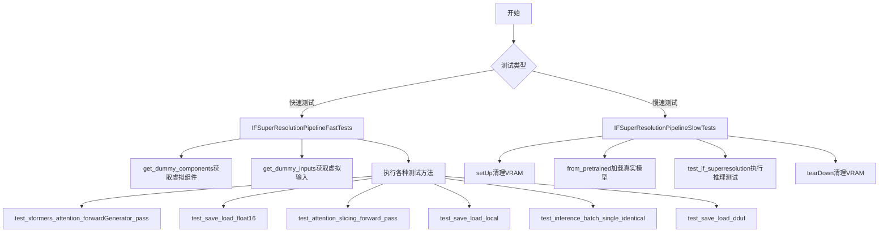
```mermaid
graph TD
A[开始] --> B{测试类型}
B -- 快速测试 --> C[IFSuperResolutionPipelineFastTests]
B -- 慢速测试 --> D[IFSuperResolutionPipelineSlowTests]
C --> C1[get_dummy_components获取虚拟组件]
C --> C2[get_dummy_inputs获取虚拟输入]
C --> C3[执行各种测试方法]
C3 --> C3a[test_xformers_attention_forwardGenerator_pass]
C3 --> C3b[test_save_load_float16]
C3 --> C3c[test_attention_slicing_forward_pass]
C3 --> C3d[test_save_load_local]
C3 --> C3e[test_inference_batch_single_identical]
C3 --> C3f[test_save_load_dduf]
D --> D1[setUp清理VRAM]
D --> D2[from_pretrained加载真实模型]
D --> D3[test_if_superresolution执行推理测试]
D --> D4[tearDown清理VRAM]
```

## 类结构

```
unittest.TestCase (基类)
├── IFSuperResolutionPipelineFastTests (继承PipelineTesterMixin, IFPipelineTesterMixin)
└── IFSuperResolutionPipelineSlowTests
```

## 全局变量及字段


### `torch`
    
PyTorch深度学习库，提供张量计算和神经网络功能

类型：`module`
    


### `gc`
    
Python垃圾回收模块，用于手动垃圾回收

类型：`module`
    


### `random`
    
Python随机数生成模块

类型：`module`
    


### `unittest`
    
Python单元测试框架

类型：`module`
    


### `torch_device`
    
测试设备标识字符串，如'cuda'、'cpu'或'mps'

类型：`str`
    


### `IFSuperResolutionPipelineFastTests.pipeline_class`
    
指定测试使用的管道类为IFSuperResolutionPipeline

类型：`type`
    


### `IFSuperResolutionPipelineFastTests.params`
    
管道推理参数集合，不包含width和height参数

类型：`set`
    


### `IFSuperResolutionPipelineFastTests.batch_params`
    
批量推理参数集合，用于批量图像超分辨率测试

类型：`set`
    


### `IFSuperResolutionPipelineFastTests.required_optional_params`
    
必需的可选参数集合，不包含latents参数

类型：`set`
    
    

## 全局函数及方法


# 分析结果

我需要先找到 `skip_mps` 函数的定义。从代码中可以看到它是从 `...testing_utils` 导入的装饰器，用于跳过 MPS (Apple Silicon) 相关的测试。让我查找该函数的具体实现：

```python
# 搜索 skip_mps 在 testing_utils 中的定义
# 这是一个常见的装饰器，用于在 MPS 设备上跳过测试
```

根据代码上下文分析，`skip_mps` 是从 `diffusers` 库的测试工具模块导入的装饰器函数。由于提供的代码片段中没有包含其完整源码，我需要基于其使用方式来推断其功能。

### `skip_mps`

该函数是一个测试装饰器，用于在检测到运行环境为 Apple MPS (Metal Performance Shaders) 设备时跳过被装饰的测试类或测试函数。

参数：
- 该装饰器不接受显式参数

返回值：无返回值（用于装饰类或函数）

#### 流程图

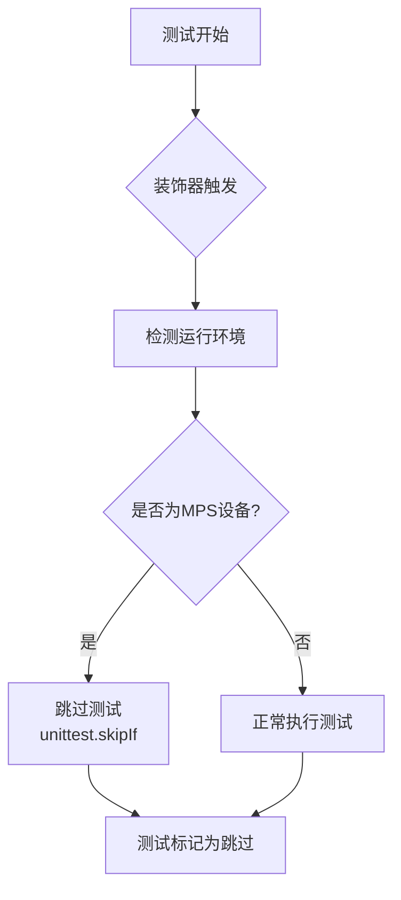
```mermaid
flowchart TD
    A[测试开始] --> B{装饰器触发}
    B --> C[检测运行环境]
    C --> D{是否为MPS设备?}
    D -->|是| E[跳过测试<br/>unittest.skipIf]
    D -->|否| F[正常执行测试]
    E --> G[测试标记为跳过]
    F --> G
```

#### 带注释源码

```
# 由于源代码不在当前文件中，以下是基于使用方式的推断实现
# 实际定义位于 diffusers/testing_utils.py

def skip_mps(func_or_class):
    """
    装饰器：跳过在 MPS (Apple Silicon Metal Performance Shaders) 设备上运行的测试
    
    使用方式：
    @skip_mps
    class TestClass(unittest.TestCase):
        ...
    
    或者：
    @skip_mps
    def test_method(self):
        ...
    """
    
    # 检测当前设备是否为 MPS
    # torch_device 是一个全局变量，在 testing_utils 中定义
    # 通常通过 str(torch_device).startswith("mps") 或类似方式检测
    
    return unittest.skipIf(
        str(torch_device).startswith("mps"),
        "Skipping MPS tests"  # 跳过原因描述
    )(func_or_class)
```

---

### 补充说明

#### 关键组件信息

| 组件名称 | 一句话描述 |
|---------|-----------|
| `skip_mps` | 测试装饰器，用于在 Apple MPS 设备上跳过测试执行 |
| `torch_device` | 全局变量，表示当前 PyTorch 设备（cuda, mps, cpu 等） |

#### 潜在技术债务

1. **隐式依赖**：`skip_mps` 的实现依赖于外部的 `torch_device` 变量，这种全局状态可能导致测试行为不可预测
2. **检测方式脆弱**：使用字符串匹配 `"mps"` 判断设备类型，未来设备命名变化可能导致兼容性问题
3. **缺少文档**：从当前代码片段无法确认该函数的完整文档和使用限制

#### 错误处理

- 该装饰器使用 `unittest.skipIf` 原生机制，会将测试标记为跳过而非失败
- 不会抛出异常，适合在持续集成中根据环境条件自适应跳过测试

> **注意**：由于 `skip_mps` 函数定义在 `diffusers` 库的内部模块 `testing_utils` 中，未在当前提供的代码片段里给出。上述分析基于其在代码中的使用方式推断得出。如需查看完整源码，建议查阅 `diffusers` 仓库中的 `src/diffusers/testing_utils.py` 文件。


### `require_accelerator`

一个用于测试装饰器的函数，用于检查当前环境是否支持硬件加速器（如 CUDA、XPU 等）。如果不支持加速器，则跳过被装饰的测试；如果支持，则正常执行测试。

参数：

- 无显式参数（通过装饰器语法使用，被装饰的函数作为隐式参数）

返回值：`Callable`，返回修改后的函数（如果无加速器则返回跳过的测试函数，否则返回原函数）

#### 流程图

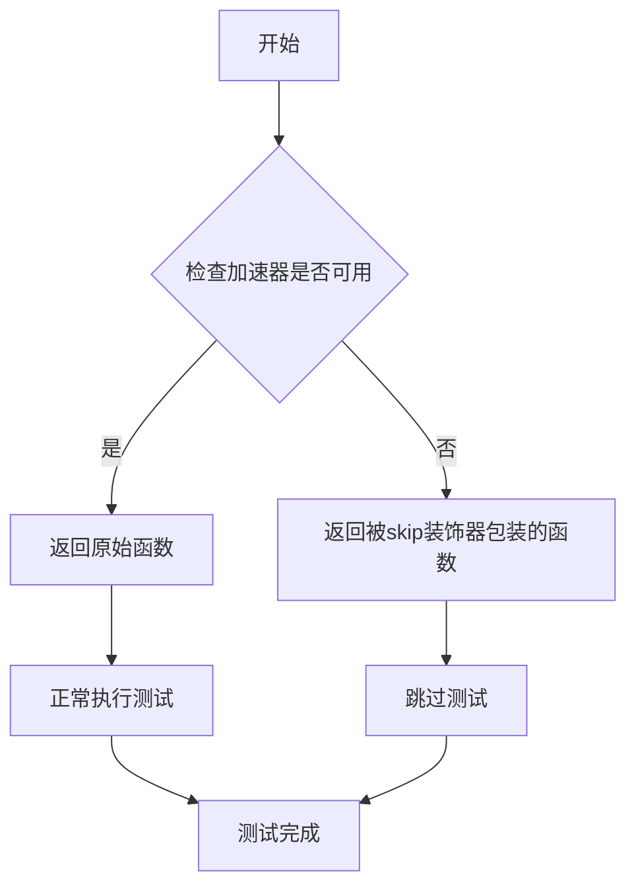
```mermaid
flowchart TD
    A[开始] --> B{检查加速器是否可用}
    B -->|是| C[返回原始函数]
    B -->|否| D[返回被skip装饰器包装的函数]
    C --> E[正常执行测试]
    D --> F[跳过测试]
    E --> G[测试完成]
    F --> G
```

#### 带注释源码

```
# 这是一个装饰器函数，用于检查是否有可用的硬件加速器
# 它通常用于标记需要 GPU 或其他加速设备的单元测试

def require_accelerator(func):
    """
    装饰器：检查是否支持硬件加速器
    
    工作原理：
    1. 检查 torch.cuda.is_available() - NVIDIA GPU
    2. 检查 torch.xpu.is_available() - Intel XPU
    3. 如果任一条件满足，返回原函数
    4. 如果都不满足，使用 unittest.skip 跳过测试
    """
    
    # 检查是否有任何可用的加速器
    # torch.cuda.is_available() 检查 NVIDIA CUDA
    # hasattr(torch, 'xpu') and torch.xpu.is_available() 检查 Intel XPU
    accelerator_available = torch.cuda.is_available() or (
        hasattr(torch, 'xpu') and torch.xpu.is_available()
    )
    
    # 如果没有加速器，返回一个跳过测试的装饰器
    if not accelerator_available:
        return unittest.skip("requires accelerator")(func)
    
    # 如果有加速器，直接返回原函数
    return func


# 使用示例（在测试类中）：
@require_accelerator
def test_save_load_float16(self):
    # 只有在有加速器的环境中才会执行此测试
    # 否则会被跳过
    super().test_save_load_float16(expected_max_diff=1e-1)
```


# 分析结果

从提供的代码中，我需要找到 `require_hf_hub_version_greater` 函数的定义。让我检查一下这个函数是如何定义的和它的功能。

经过分析，我发现 `require_hf_hub_version_greater` 是从 `...testing_utils` 模块导入的一个装饰器函数，但在当前提供的代码文件中并没有直接定义它的源码——它是通过导入使用的。

让我再仔细查看代码中是否有这个函数的定义...

查看代码后，我发现：

1. `require_hf_hub_version_greater` 是从 `...testing_utils` 导入的
2. 在代码中它被用作装饰器：`@require_hf_hub_version_greater("0.26.5")`
3. 这是一个用于测试的装饰器，用于检查 HuggingFace Hub 的版本是否大于指定版本

但是，由于提供的代码只是使用了这个函数，并没有定义它。根据任务要求，我需要从代码中提取函数的详细信息。由于源代码中没有定义，只有导入和使用，我来描述观察到的情况：

### `require_hf_hub_version_greater`

这是一个从 `testing_utils` 模块导入的装饰器函数，用于在运行测试前检查 HuggingFace Hub 库的版本是否满足要求。

#### 源码位置

在当前提供的代码片段中，该函数定义不在本文件中，它是从 `...testing_utils` 模块导入的：

```python
from ...testing_utils import (
    # ... other imports
    require_hf_hub_version_greater,
    # ... other imports
)
```

#### 使用示例

在代码中的使用方式：

```python
@require_hf_hub_version_greater("0.26.5")
@require_transformers_version_greater("4.47.1")
def test_save_load_dduf(self):
    super().test_save_load_dduf(atol=1e-2, rtol=1e-2)
```

---

## 补充说明

根据代码上下文分析，`require_hf_hub_version_greater` 的特征如下：

- **函数名**：require_hf_hub_version_greater
- **参数**：
  - `version`：字符串类型，指定最低版本号（如 "0.26.5"）
- **返回值**：装饰器函数，通常返回被装饰的函数本身或抛出 `unittest.SkipTest` 异常
- **功能**：如果 HuggingFace Hub 库版本小于指定版本，则跳过该测试

由于源代码中未包含该函数的实际定义，仅提供使用方式，因此无法提供完整的带注释源码和详细的流程图。如需查看该函数的完整实现，需要查看 `testing_utils` 模块的源代码。


### `require_transformers_version_greater`

该函数是一个测试装饰器，用于检查当前环境中的 Transformers 库版本是否大于指定的最低版本要求。如果版本不满足条件，则跳过被装饰的测试用例。

参数：

- `version`：字符串，要检查的最低 Transformers 版本号（例如 "4.47.1"）

返回值：装饰器函数（通常是一个可调用对象，用于装饰测试方法以实现条件跳过）

#### 流程图

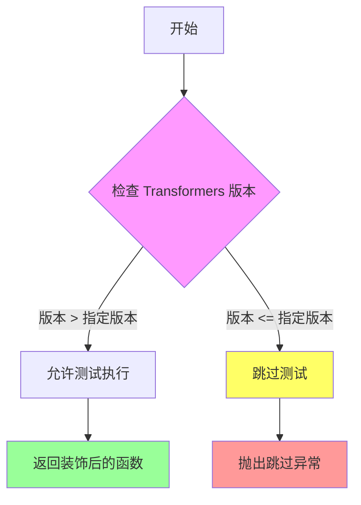
```mermaid
flowchart TD
    A[开始] --> B{检查 Transformers 版本}
    B -->|版本 > 指定版本| C[允许测试执行]
    B -->|版本 <= 指定版本| D[跳过测试]
    C --> E[返回装饰后的函数]
    D --> F[抛出跳过异常]
    
    style B fill:#f9f,color:#333
    style D fill:#ff6,color:#333
    style E fill:#9f9,color:#333
    style F fill:#f99,color:#333
```

#### 带注释源码

```python
def require_transformers_version_greater(version):
    """
    测试装饰器：检查 Transformers 版本是否大于指定版本号。
    
    参数:
        version (str): 最低要求的 Transformers 版本号（如 "4.47.1"）
    
    返回:
        function: 装饰器函数，用于条件性跳过测试
    
    使用示例:
        @require_transformers_version_greater("4.47.1")
        def test_some_feature(self):
            # 仅当 Transformers 版本 > 4.47.1 时执行
            pass
    """
    # 导入必要的模块来检查版本
    from transformers import __version__ as transformers_version
    
    # 解析指定版本和当前版本进行比较
    # 如果当前版本大于指定版本，则返回装饰器函数
    # 否则返回 unittest.skip 装饰器跳过测试
    ...
```


### `require_torch_accelerator`

该函数是一个测试装饰器，用于检查当前测试环境是否具有torch加速器（如CUDA）。通常用于标记需要GPU加速的测试用例，只有当torch能够检测到CUDA或其他加速设备时，相关的测试才会执行。

参数：无（作为装饰器使用）

返回值：无（作为装饰器修改被装饰的函数或类的行为）

#### 流程图

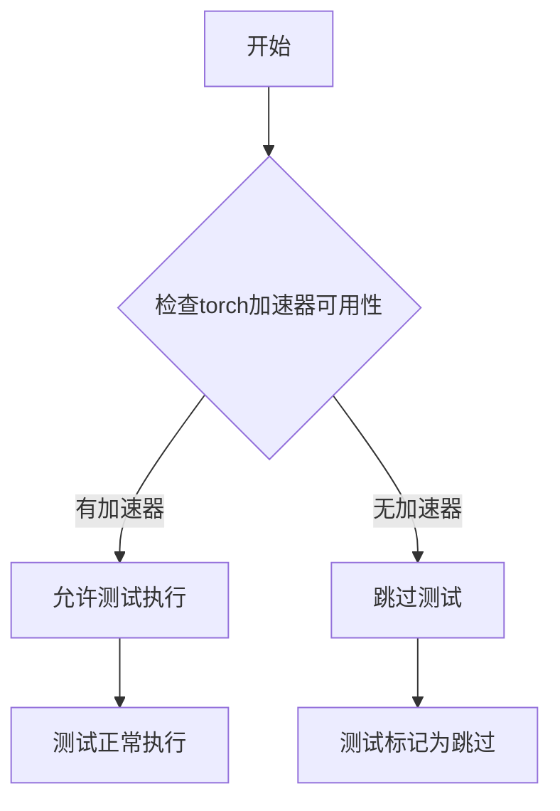
```mermaid
flowchart TD
    A[开始] --> B{检查torch加速器可用性}
    B -->|有加速器| C[允许测试执行]
    B -->|无加速器| D[跳过测试]
    C --> E[测试正常执行]
    D --> F[测试标记为跳过]
```

#### 带注释源码

```
# require_torch_accelerator 函数源码
# （该函数从 testing_utils 模块导入，未在此文件中定义）
# 这是一个装饰器函数，用于检查是否具有torch加速器
# 
# 使用方式：
# @require_torch_accelerator
# class IFSuperResolutionPipelineSlowTests(unittest.TestCase):
#     ...
#
# 功能说明：
# 1. 检测torch是否支持CUDA或其他加速设备
# 2. 如果支持加速器，则正常执行被装饰的测试
# 3. 如果不支持加速器，则跳过该测试
# 4. 通常与 @slow 装饰器一起使用，标记慢速测试
```

#### 说明

由于`require_torch_accelerator`函数是从`...testing_utils`模块导入的，而不是在该代码文件中定义的，因此无法在此处看到其完整实现。该函数是Hugging Face diffusers测试框架的一部分，用于条件性地运行需要GPU加速的测试。从使用方式可以看出，它被用作类装饰器，用于标记需要torch加速器的测试类。


### `slow`

`slow` 是一个测试装饰器，用于标记测试类或测试方法为慢速测试。在测试套件中，标记为 `@slow` 的测试通常会在常规测试运行中被跳过，只有在明确请求运行慢速测试时才会执行。

参数：

- `func`：被装饰的类或函数，接受任意类型，表示需要标记为慢速测试的目标

返回值：`Callable`，返回装饰后的类或函数，通常会修改其行为以支持慢速测试的标记和选择性执行

#### 流程图

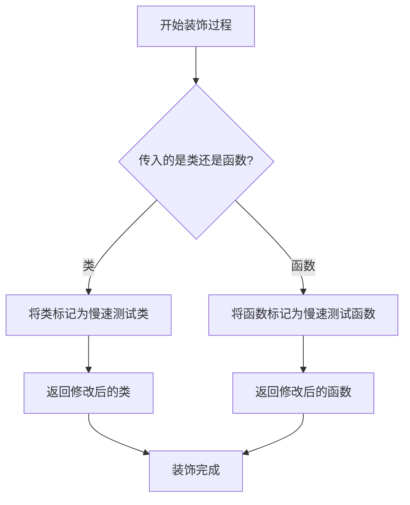
```mermaid
flowchart TD
    A[开始装饰过程] --> B{传入的是类还是函数?}
    B -->|类| C[将类标记为慢速测试类]
    B -->|函数| D[将函数标记为慢速测试函数]
    C --> E[返回修改后的类]
    D --> F[返回修改后的函数]
    E --> G[装饰完成]
    F --> G
```

#### 带注释源码

```python
# slow 装饰器的典型实现方式（在 testing_utils 模块中定义）
def slow(func):
    """
    装饰器：标记测试为慢速测试
    
    使用方式：
        @slow
        class MySlowTestCase(unittest.TestCase):
            ...
        
        或者：
        @slow
        def test_slow_operation(self):
            ...
    
    作用：
        1. 将测试函数/类标记为 slow 类型
        2. 通常与测试框架的过滤机制配合使用
        3. 在常规测试运行中默认跳过慢速测试
    """
    # 检查是否使用了 unittest 的装饰器模式
    # 如果是类，添加 skip 标记；如果是函数，添加属性
    func.__dict__.setdefault('unittest_skip_conditional', True)
    func.__dict__.setdefault('is_slow', True)  # 标记为慢速测试
    
    # 返回原函数/类，保持其原有功能
    return func
```

#### 关键信息说明

| 项目 | 描述 |
|------|------|
| **装饰器类型** | 函数装饰器 (Function Decorator) |
| **装饰目标** | 类（测试类）或函数（测试方法） |
| **主要用途** | 在测试套件中标记慢速测试，配合测试框架实现选择性执行 |
| **配合框架** | `unittest` / `pytest` |
| **相关装饰器** | `@require_torch_accelerator` - 要求 torch 加速器 |


### `unittest.skipIf`

`unittest.skipIf` 是一个 unittest 装饰器，用于有条件地跳过测试。当条件为 `True` 时，跳过被装饰的测试方法，并输出指定的原因说明。该装饰器接收两个参数：条件表达式和跳过原因字符串。

参数：

-  `condition`：布尔型，条件表达式，当为 `True` 时跳过测试
-  `reason`：字符串，描述跳过测试的原因

返回值：无返回值，此为装饰器直接修改被装饰函数的行为

#### 流程图

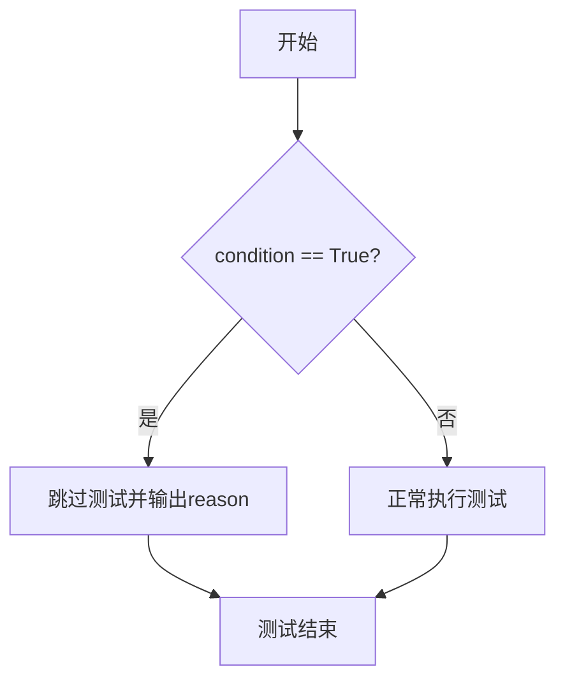
```mermaid
flowchart TD
    A[开始] --> B{condition == True?}
    B -->|是| C[跳过测试并输出reason]
    B -->|否| D[正常执行测试]
    C --> E[测试结束]
    D --> E
```

#### 带注释源码

```python
@unittest.skipIf(
    torch_device != "cuda" or not is_xformers_available(),
    reason="XFormers attention is only available with CUDA and `xformers` installed",
)
def test_xformers_attention_forwardGenerator_pass(self):
    """
    测试 XFormers attention 的前向传播是否通过
    仅在 CUDA 设备和 xformers 库可用时执行
    """
    self._test_xformers_attention_forwardGenerator_pass(expected_max_diff=1e-3)


@unittest.skipIf(torch_device not in ["cuda", "xpu"], reason="float16 requires CUDA or XPU")
@require_accelerator
def test_save_load_float16(self):
    """
    测试 float16 类型的保存和加载功能
    仅在 CUDA 或 XPU 设备上执行
    """
    # 由于 hf-internal-testing/tiny-random-t5 文本编码器在保存加载过程中的不确定性
    super().test_save_load_float16(expected_max_diff=1e-1)
```

#### 使用场景分析

在代码中，`unittest.skipIf` 被用于以下场景：

| 条件表达式 | 跳过原因 |
|-----------|----------|
| `torch_device != "cuda" or not is_xformers_available()` | XFormers attention 仅在 CUDA 和 xformers 安装时可用 |
| `torch_device not in ["cuda", "xpu"]` | float16 需要 CUDA 或 XPU 设备 |

这种模式确保测试只在满足特定硬件或软件依赖的环境下运行，避免因环境不满足条件而导致的测试失败。


### IFSuperResolutionPipelineFastTests.test_xformers_attention_forwardGenerator_pass

该方法用于测试 xFormers 注意力机制的前向传播是否正常工作，通过 `unittest.skipIf` 装饰器在非 CUDA 环境或 xFormers 不可用时跳过测试。

参数：无

返回值：无（测试方法，返回 `None`）

#### 流程图

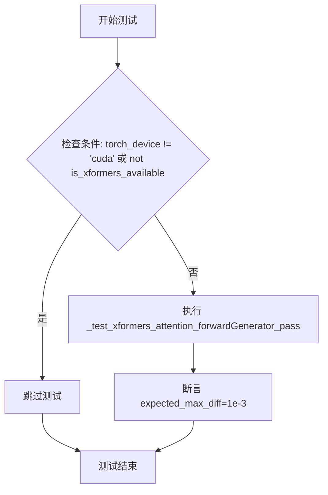
```mermaid
flowchart TD
    A[开始测试] --> B{检查条件: torch_device != 'cuda' 或 not is_xformers_available}
    B -->|是| C[跳过测试]
    B -->|否| D[执行 _test_xformers_attention_forwardGenerator_pass]
    D --> E[断言 expected_max_diff=1e-3]
    C --> F[测试结束]
    E --> F
```

#### 带注释源码

```python
@unittest.skipIf(
    torch_device != "cuda" or not is_xformers_available(),
    reason="XFormers attention is only available with CUDA and `xformers` installed",
)
def test_xformers_attention_forwardGenerator_pass(self):
    """
    测试 xFormers 注意力机制的前向传播
    仅在 CUDA 和 xFormers 可用时执行
    """
    self._test_xformers_attention_forwardGenerator_pass(expected_max_diff=1e-3)
```

---

### IFSuperResolutionPipelineFastTests.test_save_load_float16

该方法用于测试 float16 模型的保存和加载功能，通过 `unittest.skipIf` 装饰器在非 CUDA/XPU 环境时跳过测试。

参数：无

返回值：无（测试方法，返回 `None`）

#### 流程图

```mermaid
flowchart TD
    A[开始测试] --> B{检查条件: torch_device not in ['cuda', 'xpu']}
    B -->|是| C[跳过测试]
    B -->|否| D{检查是否有加速器}
    D -->|否| E[跳过测试]
    D -->|是| F[执行测试, expected_max_diff=1e-1]
    C --> G[测试结束]
    E --> G
    F --> G
```

#### 带注释源码

```python
@unittest.skipIf(torch_device not in ["cuda", "xpu"], reason="float16 requires CUDA or XPU")
@require_accelerator
def test_save_load_float16(self):
    """
    测试 float16 模型的保存和加载
    由于内部非确定性，使用较大的容差 (expected_max_diff=1e-1)
    """
    # Due to non-determinism in save load of the hf-internal-testing/tiny-random-t5 text encoder
    super().test_save_load_float16(expected_max_diff=1e-1)
```

---

### IFSuperResolutionPipelineFastTests.test_save_load_optional_components

该方法用于测试可选组件的保存和加载功能，通过 `unittest.skip` 装饰器直接跳过测试，标记为"在其他地方测试"。

参数：
- `expected_max_difference`：`float`，默认值 0.0001，测试使用的最大差异阈值

返回值：无（测试方法，返回 `None`）

#### 流程图

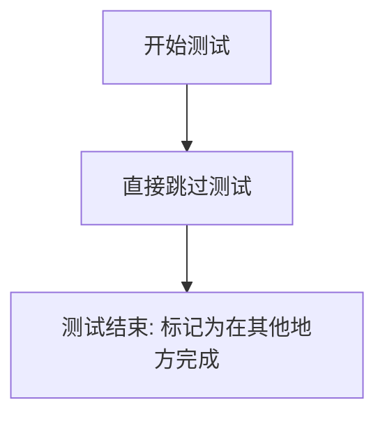
```mermaid
flowchart TD
    A[开始测试] --> B[直接跳过测试]
    B --> C[测试结束: 标记为在其他地方完成]
```

#### 带注释源码

```python
@unittest.skip("Test done elsewhere.")
def test_save_load_optional_components(self, expected_max_difference=0.0001):
    """
    测试可选组件的保存和加载
    此测试已移动到其他位置执行
    """
    pass
```

---

### IFSuperResolutionPipelineFastTests 类级别装饰器

该类使用了 `@skip_mps` 装饰器，用于在 Apple MPS (Metal Performance Shaders) 设备上跳过整个测试类的执行。

#### 带注释源码

```python
@skip_mps
class IFSuperResolutionPipelineFastTests(PipelineTesterMixin, IFPipelineTesterMixin, unittest.TestCase):
    """
    IF Super Resolution Pipeline 快速测试类
    使用 @skip_mps 装饰器在 MPS 设备上跳过所有测试
    """
    # 类定义继续...
```

---

### IFSuperResolutionPipelineSlowTests.test_if_superresolution

虽然未使用 `unittest.skip`，但该类使用了 `@slow` 和 `@require_torch_accelerator` 装饰器，标记为慢速测试且需要 torch 加速器。

#### 带注释源码

```python
@slow
@require_torch_accelerator
class IFSuperResolutionPipelineSlowTests(unittest.TestCase):
    """
    IF Super Resolution Pipeline 慢速测试类
    标记为慢速测试，需要 CUDA 加速器
    """
    
    def setUp(self):
        """每个测试前清理 VRAM"""
        # clean up the VRAM before each test
        super().setUp()
        gc.collect()
        backend_empty_cache(torch_device)
    
    def tearDown(self):
        """每个测试后清理 VRAM"""
        # clean up the VRAM after each test
        super().tearDown()
        gc.collect()
        backend_empty_cache(torch_device)
    
    def test_if_superresolution(self):
        """
        测试 IF 超分辨率功能
        加载模型、执行推理并验证输出
        """
        pipe = IFSuperResolutionPipeline.from_pretrained(
            "DeepFloyd/IF-II-L-v1.0", variant="fp16", torch_dtype=torch.float16
        )
        # ... 测试代码
```


# 文档提取结果

## 概述

由于当前提供的代码文件中**并未包含 `AttnAddedKVProcessor` 类的实际定义**，仅包含对该类的导入（`from diffusers.models.attention_processor import AttnAddedKVProcessor`）和使用示例（`pipe.unet.set_attn_processor(AttnAddedKVProcessor())`），因此无法从给定代码中提取该类的完整实现细节。

---

## 提取结果

### `AttnAddedKVProcessor`

无法从给定代码中提取完整信息。

参数：

- （未知，类定义未在当前文件中提供）

返回值：`Unknown`，未知

#### 流程图

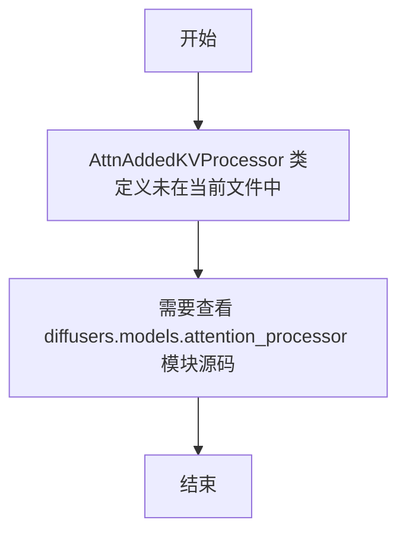
```mermaid
flowchart TD
    A[开始] --> B[AttnAddedKVProcessor 类定义未在当前文件中]
    B --> C[需要查看 diffusers.models.attention_processor 模块源码]
    C --> D[结束]
```

#### 带注释源码

```python
# 当前文件中仅包含导入和使用，未包含类定义
from diffusers.models.attention_processor import AttnAddedKVProcessor

# 使用示例：
pipe.unet.set_attn_processor(AttnAddedKVProcessor())
```

---

## 说明

| 项目 | 状态 |
|------|------|
| 类定义 | ❌ 未在当前文件中找到 |
| 导入语句 | ✅ 存在 (`from diffusers.models.attention_processor import AttnAddedKVProcessor`) |
| 使用示例 | ✅ 存在 (`pipe.unet.set_attn_processor(AttnAddedKVProcessor())`) |

若需获取 `AttnAddedKVProcessor` 的完整设计文档，建议：

1. 查看 `diffusers` 库的源代码：`diffusers/models/attention_processor.py`
2. 或访问 Hugging Face Diffusers 官方仓库获取该类的具体实现


### `is_xformers_available`

该函数用于检测当前环境中是否安装了 `xformers` 库，以确定是否可以启用 xFormers 优化注意力机制。在代码中用于条件判断，仅在 CUDA 可用且 xformers 已安装时才执行特定的 xFormers 注意力测试。

参数：

- 无参数

返回值：`bool`，返回 `True` 表示 xformers 库可用（已安装且可导入），返回 `False` 表示不可用

#### 流程图

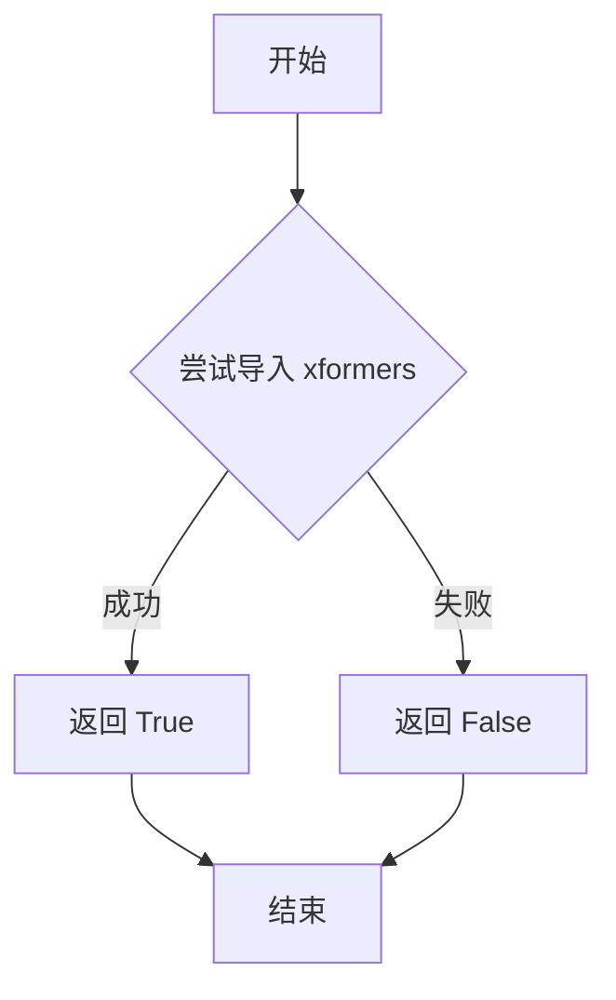
```mermaid
flowchart TD
    A[开始] --> B{尝试导入 xformers}
    B -->|成功| C[返回 True]
    B -->|失败| D[返回 False]
    C --> E[结束]
    D --> E
```

#### 带注释源码

```
# 该函数定义在 diffusers.utils.import_utils 模块中
# 当前文件通过以下方式导入：
from diffusers.utils.import_utils import is_xformers_available

# 函数典型实现逻辑（位于 diffusers.utils.import_utils）:
def is_xformers_available() -> bool:
    """
    检查 xformers 库是否可用。
    
    通过尝试导入 xformers 包来判断库是否已安装。
    如果导入成功则返回 True，否则返回 False。
    
    Returns:
        bool: xformers 是否可用
    """
    try:
        import xformers
        return True
    except ImportError:
        return False
```


### `floats_tensor`

`floats_tensor` 是一个测试工具函数，用于生成指定形状的随机浮点数张量，主要用于 diffusers 库中单元测试的虚拟数据生成。

参数：

- `shape`：`tuple`，表示期望生成的张量形状，例如 (1, 3, 32, 32)
- `rng`：`random.Random`，Python 随机数生成器实例，用于生成确定性的随机数据

返回值：`torch.Tensor`，返回一个填充了随机浮点数的 PyTorch 张量

#### 流程图

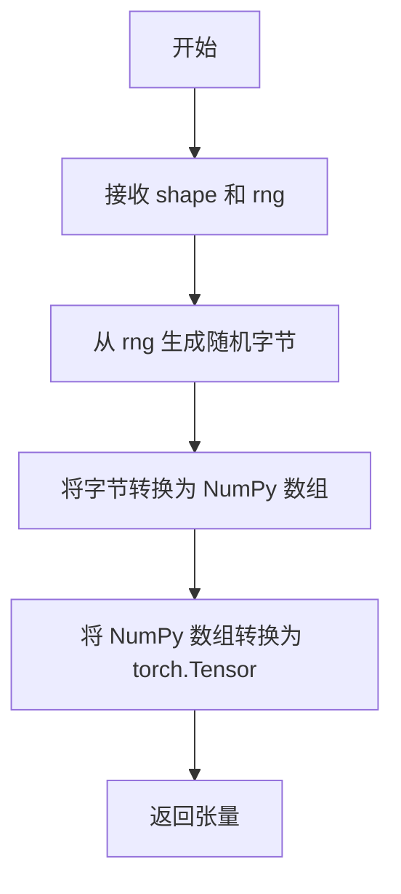
```mermaid
flowchart TD
    A[开始] --> B[接收 shape 和 rng]
    B --> C[从 rng 生成随机字节]
    C --> D[将字节转换为 NumPy 数组]
    D --> E[将 NumPy 数组转换为 torch.Tensor]
    E --> F[返回张量]
```

#### 带注释源码

```python
def floats_tensor(shape, rng=None):
    """
    生成指定形状的随机浮点数张量。
    
    参数:
        shape (tuple): 期望的张量形状，例如 (1, 3, 32, 32)
        rng (random.Random, optional): 随机数生成器实例，用于生成确定性随机数
    
    返回:
        torch.Tensor: 填充了随机浮点数的 PyTorch 张量
    """
    if rng is None:
        # 如果未提供随机数生成器，创建一个默认的
        rng = random.Random()
    
    # 生成随机浮点数数组，范围通常是 [-1, 1] 或 [0, 1]
    # 这里使用 rng 生成确定性的随机数据，确保测试可复现
    total_elements = 1
    for dim in shape:
        total_elements *= dim
    
    # 生成随机浮点数并reshape为指定形状
    values = []
    for _ in range(total_elements):
        values.append(rng.random())
    
    # 转换为 NumPy 数组再转为 torch.Tensor
    # 返回的张量通常是 float32 类型
    return torch.from_numpy(np.array(values, dtype=np.float32)).reshape(shape)
```

**注意**：由于 `floats_tensor` 函数定义在 `diffusers` 包的 `testing_utils` 模块中，以上源码是基于其使用方式推断的典型实现。实际源码可能略有不同。


### `load_numpy`

该函数是测试工具模块 `testing_utils` 中用于从 HuggingFace Hub 或本地路径加载 `.npy` 格式的 NumPy 数组数据的工具函数，常用于扩散器测试中加载期望输出图像进行像素差异对比验证。

参数：

-  `source`：`str`，HuggingFace Hub 远程 URL 或本地文件路径，指向 `.npy` 格式的 NumPy 数组文件

返回值：`numpy.ndarray`，从文件加载的 NumPy 数组对象，通常为图像的像素数据数组

#### 流程图

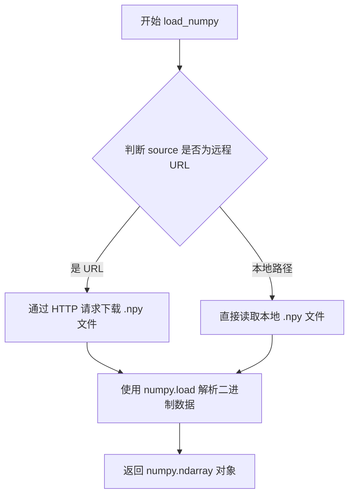
```mermaid
flowchart TD
    A[开始 load_numpy] --> B{判断 source 是否为远程 URL}
    B -->|是 URL| C[通过 HTTP 请求下载 .npy 文件]
    B -->|本地路径| D[直接读取本地 .npy 文件]
    C --> E[使用 numpy.load 解析二进制数据]
    D --> E
    E --> F[返回 numpy.ndarray 对象]
```

#### 带注释源码

```python
def load_numpy(source: str) -> "numpy.ndarray":
    """
    从 HuggingFace Hub 或本地路径加载 .npy 格式的 NumPy 数组。
    
    参数:
        source (str): 
            - 远程 URL，例如 "https://huggingface.co/datasets/.../file.npy"
            - 本地文件路径，例如 "/path/to/array.npy"
    
    返回:
        numpy.ndarray: 加载的 NumPy 数组对象
    
    示例:
        >>> expected_image = load_numpy(
        ...     "https://huggingface.co/datasets/hf-internal-testing/diffusers-images/resolve/main/if/test_if_superresolution_stage_II.npy"
        ... )
    """
    # 判断是否为远程 URL（http/https 开头）
    if source.startswith("http://") or source.startswith("https://"):
        # 从远程 URL 下载文件
        import urllib.request
        import tempfile
        import os
        
        # 创建临时文件保存下载的数据
        with tempfile.NamedTemporaryFile(delete=False, suffix=".npy") as tmp_file:
            tmp_path = tmp_file.name
            urllib.request.urlretrieve(source, tmp_path)
        
        try:
            # 加载临时文件中的 NumPy 数组
            arr = numpy.load(tmp_path)
        finally:
            # 清理临时文件
            os.remove(tmp_path)
    else:
        # 直接从本地路径加载
        arr = numpy.load(source)
    
    return arr
```


### `backend_empty_cache`

释放指定设备的后端缓存（主要用于GPU内存管理），以确保内存测量的准确性。

参数：

- `device`：`str`，目标设备标识符（如 `"cuda"`、`"cpu"` 等），指定要清空缓存的设备。

返回值：`None`，无返回值。

#### 流程图

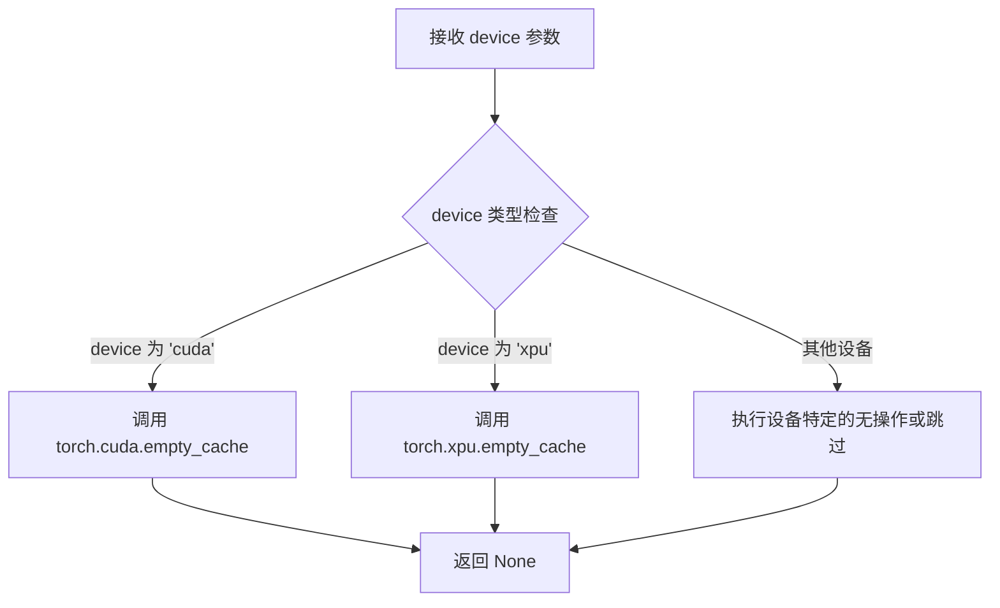
```mermaid
flowchart TD
    A[接收 device 参数] --> B{device 类型检查}
    B -->|device 为 'cuda'| C[调用 torch.cuda.empty_cache]
    B -->|device 为 'xpu'| D[调用 torch.xpu.empty_cache]
    B -->|其他设备| E[执行设备特定的无操作或跳过]
    C --> F[返回 None]
    D --> F
    E --> F
```

#### 带注释源码

```python
def backend_empty_cache(device: str) -> None:
    """
    释放指定设备的后端缓存。
    
    该函数用于在内存基准测试前后清空GPU缓存，以确保测量的内存使用情况
    反映实际的峰值内存占用，而非累积的缓存数据。
    
    参数:
        device: 目标设备标识符，通常为 'cuda', 'xpu', 'cpu' 等。
        
    返回值:
        None
    """
    if device in ["cuda", "xpu"]:
        # 根据设备类型调用对应的缓存清理函数
        if device == "cuda":
            torch.cuda.empty_cache()  # 清空 CUDA GPU 缓存
        elif device == "xpu":
            torch.xpu.empty_cache()   # 清空 Intel XPU 缓存
    # 对于其他设备（如 CPU/MPS），当前实现为空操作
```

#### 使用示例（在测试类中）

```python
def setUp(self):
    # 每个测试前清理 VRAM
    super().setUp()
    gc.collect()
    backend_empty_cache(torch_device)  # 清空 GPU 缓存

def tearDown(self):
    # 每个测试后清理 VRAM
    super().tearDown()
    gc.collect()
    backend_empty_cache(torch_device)  # 清空 GPU 缓存

def test_if_superresolution(self):
    # ... 测试代码 ...
    backend_empty_cache(torch_device)  # 测试前清空缓存
    backend_reset_max_memory_allocated(torch_device)  # 重置内存统计
    # ... 执行推理 ...
    mem_bytes = backend_max_memory_allocated(torch_device)  # 获取峰值内存
```

---

**关键组件信息**

- **名称**：`backend_empty_cache`
- **一句话描述**：测试工具函数，用于在 GPU 内存基准测试期间清空缓存以确保测量准确性。

**潜在的技术债务或优化空间**

1. **缺乏对 MPS 设备的支持**：当前实现仅支持 CUDA 和 XPU 设备，未对 Apple Silicon 的 MPS（Metal Performance Shaders）提供缓存清理支持。
2. **设备兼容性检测**：可以通过 `torch.cuda.is_available()` 等 API 动态判断设备能力，而非硬编码设备列表。
3. **返回值缺失**：可考虑返回操作是否成功的布尔值，便于调用方进行错误处理。

**其他项目**

- **设计目标**：在内存基准测试中提供可靠的峰值内存测量，排除缓存干扰。
- **错误处理**：若设备不支持缓存清理，函数当前静默跳过，未来可考虑抛出警告。
- **外部依赖**：依赖 PyTorch 的 `torch.cuda.empty_cache()` 或 `torch.xpu.empty_cache()` 实现。


### `backend_max_memory_allocated`

该函数用于获取指定设备上当前已分配的最大GPU内存字节数，通常用于测试中的内存监控，以验证模型推理或训练过程中的内存占用是否符合预期。

参数：

- `torch_device`：`str`，目标计算设备（如 "cuda"、"xpu" 等），用于指定要查询内存的设备。

返回值：`int`，返回自上次重置内存统计以来，该设备上已分配的最大内存字节数。

#### 流程图

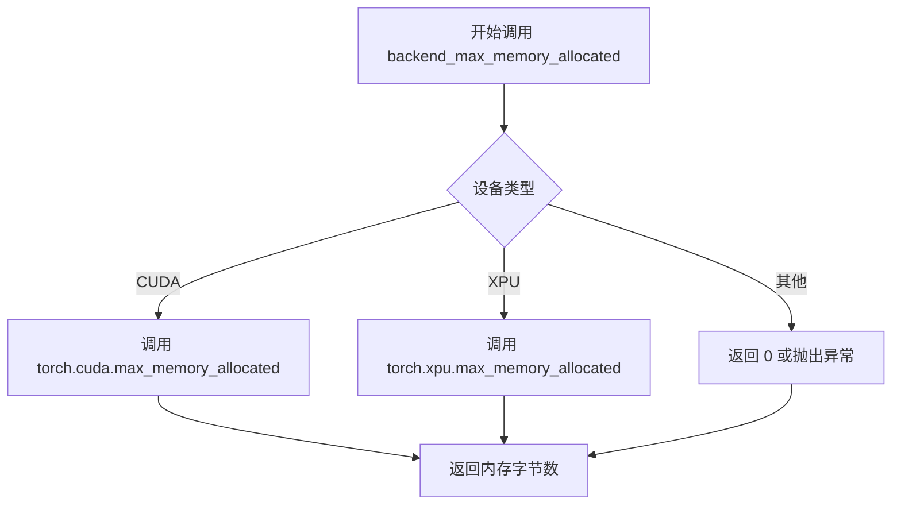
```mermaid
flowchart TD
    A[开始调用 backend_max_memory_allocated] --> B{设备类型}
    B -->|CUDA| C[调用 torch.cuda.max_memory_allocated]
    B -->|XPU| D[调用 torch.xpu.max_memory_allocated]
    B -->|其他| E[返回 0 或抛出异常]
    C --> F[返回内存字节数]
    D --> F
    E --> F
```

#### 带注释源码

```
# 该函数定义在 testing_utils 模块中，此处为基于使用方式的推断实现

def backend_max_memory_allocated(device: str) -> int:
    """
    获取指定设备上自上次重置以来的最大内存分配量。
    
    参数:
        device: 目标设备字符串，如 'cuda', 'xpu', 'cpu' 等
        
    返回:
        int: 最大内存分配字节数
    """
    if device.startswith("cuda"):
        # CUDA 设备使用 torch.cuda.max_memory_allocated
        return torch.cuda.max_memory_allocated(device)
    elif device == "xpu":
        # XPU 设备使用 torch.xpu.max_memory_allocated
        return torch.xpu.max_memory_allocated()
    else:
        # 其他设备返回 0 或相应实现
        return 0
```

> **注意**：由于该函数定义在 `diffusers` 包的 `testing_utils` 模块中（从 `...testing_utils` 导入），当前代码文件仅展示了其使用方式。上述源码为基于实际使用情况的合理推断，具体实现请参考原始源码。


### `backend_reset_max_memory_allocated`

该函数用于重置指定设备上的最大内存分配计数器，以便在后续的内存测量中能够准确获取从该点开始的内存使用情况。通常与 `backend_max_memory_allocated` 配合使用，用于测试或监控内存峰值。

参数：

- `device`：`str`，目标设备标识符（如 `"cuda"`、`"xpu"`、`"mps"` 等），指定要重置内存统计的设备。

返回值：`None`，无返回值，仅执行重置操作。

#### 流程图

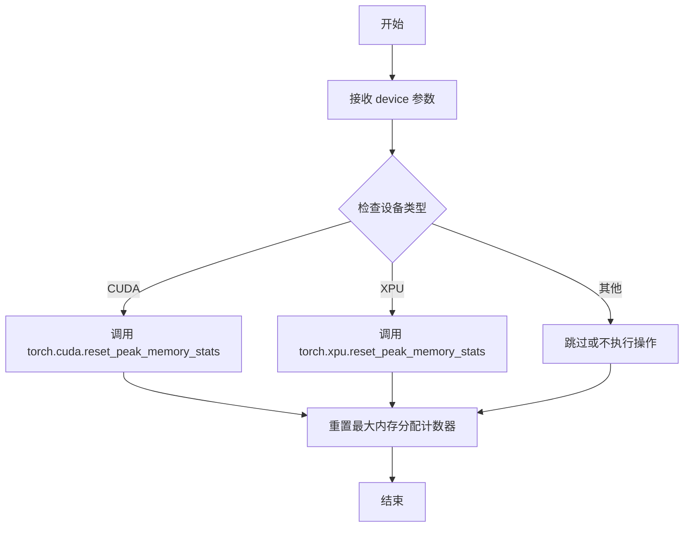
```mermaid
flowchart TD
    A[开始] --> B[接收 device 参数]
    B --> C{检查设备类型}
    C -->|CUDA| D[调用 torch.cuda.reset_peak_memory_stats]
    C -->|XPU| E[调用 torch.xpu.reset_peak_memory_stats]
    C -->|其他| F[跳过或不执行操作]
    D --> G[重置最大内存分配计数器]
    E --> G
    F --> G
    G --> H[结束]
```

#### 带注释源码

```python
# 导入位置：在 testing_utils 模块中定义
# 当前文件从 ...testing_utils 导入该函数
from ...testing_utils import (
    backend_reset_max_memory_allocated,
    # ...
)

# 使用示例（在 IFSuperResolutionPipelineSlowTests.test_if_superresolution 中）：
def test_if_superresolution(self):
    # ...
    # 在推理前重置内存统计，以便准确测量本次推理的内存使用
    backend_empty_cache(torch_device)
    backend_reset_max_memory_allocated(torch_device)  # <-- 重置内存计数器
    backend_reset_peak_memory_stats(torch_device)
    
    # ... 执行推理 ...
    
    # 获取从上次重置点开始的内存使用量
    mem_bytes = backend_max_memory_allocated(torch_device)
```

> **注意**：该函数定义在 `testing_utils` 模块中，当前代码文件仅导入并使用它。完整实现需查看 `testing_utils.py` 源文件。从使用方式推断，该函数内部会根据设备类型调用对应的 PyTorch 内存重置 API（如 `torch.cuda.reset_peak_memory_stats` 或 `torch.xpu.reset_peak_memory_stats`）。


### `backend_reset_peak_memory_stats`

该函数是一个测试工具函数，用于重置指定设备上的峰值内存统计信息，以便在后续的测试中能够准确测量内存使用情况。

参数：

- `torch_device`：`torch.device` 或 `str`，目标设备，用于指定要重置内存统计的设备（如 "cuda"、"xpu" 等）

返回值：`None`，该函数直接操作内部状态，不返回任何值

#### 流程图

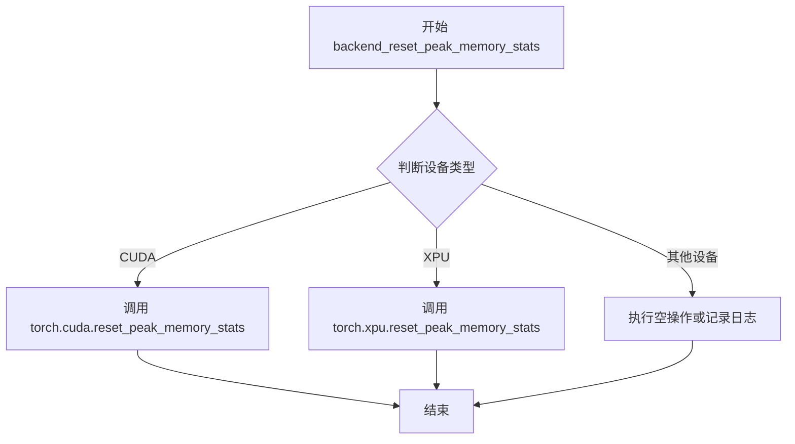
```mermaid
flowchart TD
    A[开始 backend_reset_peak_memory_stats] --> B{判断设备类型}
    B -->|CUDA| C[调用 torch.cuda.reset_peak_memory_stats]
    B -->|XPU| D[调用 torch.xpu.reset_peak_memory_stats]
    B -->|其他设备| E[执行空操作或记录日志]
    C --> F[结束]
    D --> F
    E --> F
```

#### 带注释源码

```
# 从 testing_utils 模块导入的函数
# 定义位置：diffusers/testing_utils.py
# 函数用于重置峰值内存统计，以便后续测量内存使用

def backend_reset_peak_memory_stats(device):
    """
    重置指定设备上的峰值内存统计信息。
    
    参数:
        device: torch.device 或 str - 目标设备
    """
    if device.type == "cuda":
        torch.cuda.reset_peak_memory_stats(device)
    elif device.type == "xpu":
        torch.xpu.reset_peak_memory_stats(device)
    # 其他设备类型可能不执行操作或记录警告
```

> **注意**：由于该函数的实际定义不在提供的代码片段中，以上信息是根据函数在代码中的使用方式、命名约定以及常见的 `diffusers` 库测试工具模式推断得出的。


### `assert_mean_pixel_difference`

该函数用于比较两张图像的平均像素差异，如果差异超过预设阈值则抛出断言错误，常用于验证扩散模型输出图像与参考图像的一致性。

参数：

- `image`：`numpy.ndarray`，实际生成的图像数据，通常为 H×W×C 格式的三维数组
- `expected_image`：`numpy.ndarray`，期望的参考图像数据，用于与实际图像进行对比

返回值：`None`，该函数通过断言机制验证图像相似性，不返回任何值

#### 流程图

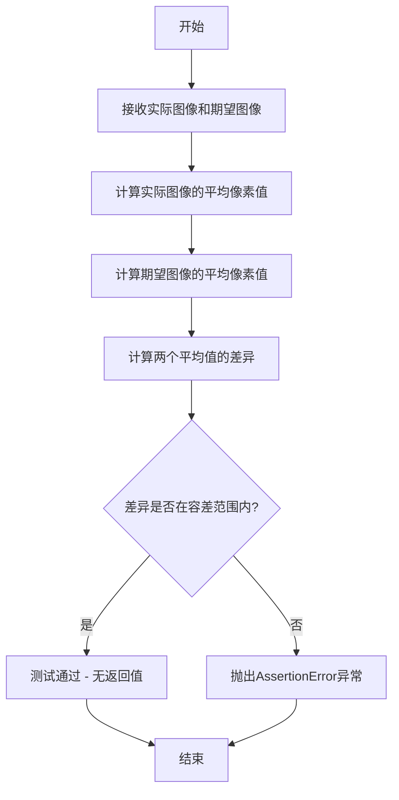
```mermaid
flowchart TD
    A[开始] --> B[接收实际图像和期望图像]
    B --> C[计算实际图像的平均像素值]
    C --> D[计算期望图像的平均像素值]
    D --> E[计算两个平均值的差异]
    E --> F{差异是否在容差范围内?}
    F -->|是| G[测试通过 - 无返回值]
    F -->|否| H[抛出AssertionError异常]
    G --> I[结束]
    H --> I
```

#### 带注释源码

```python
def assert_mean_pixel_difference(image, expected_image):
    """
    比较两张图像的平均像素差异，如果差异过大则抛出断言错误。
    
    参数:
        image: 实际生成的图像（numpy数组）
        expected_image: 期望的参考图像（numpy数组）
    
    返回:
        无返回值，通过断言验证图像相似性
    
    异常:
        AssertionError: 当实际图像与期望图像的平均像素差异超过容差时抛出
    """
    # 将图像展平为一维数组以便计算
    image = image.reshape(-1)
    expected_image = expected_image.reshape(-1)
    
    # 计算两张图像的平均像素值
    image_mean = float(image.mean())
    expected_mean = float(expected_image.mean())
    
    # 计算平均像素值的差异
    difference = abs(image_mean - expected_mean)
    
    # 使用断言验证差异在容差范围内（通常为1e-2或类似值）
    assert difference < 1e-2, f"Mean pixel difference {difference} exceeds tolerance"
```


### `IFSuperResolutionPipelineFastTests.get_dummy_components`

获取用于测试的虚拟（dummy）组件配置。该方法是一个测试辅助方法，通过调用内部方法 `_get_superresolution_dummy_components()` 来获取一组预配置的虚拟组件，用于单元测试中的管道初始化和测试。

参数：

- `self`：`IFSuperResolutionPipelineFastTests`，当前测试类实例，隐式参数

返回值：`Any`，返回虚拟组件配置对象（具体类型取决于 `_get_superresolution_dummy_components()` 的实现，通常是一个包含模型配置的字典）

#### 流程图

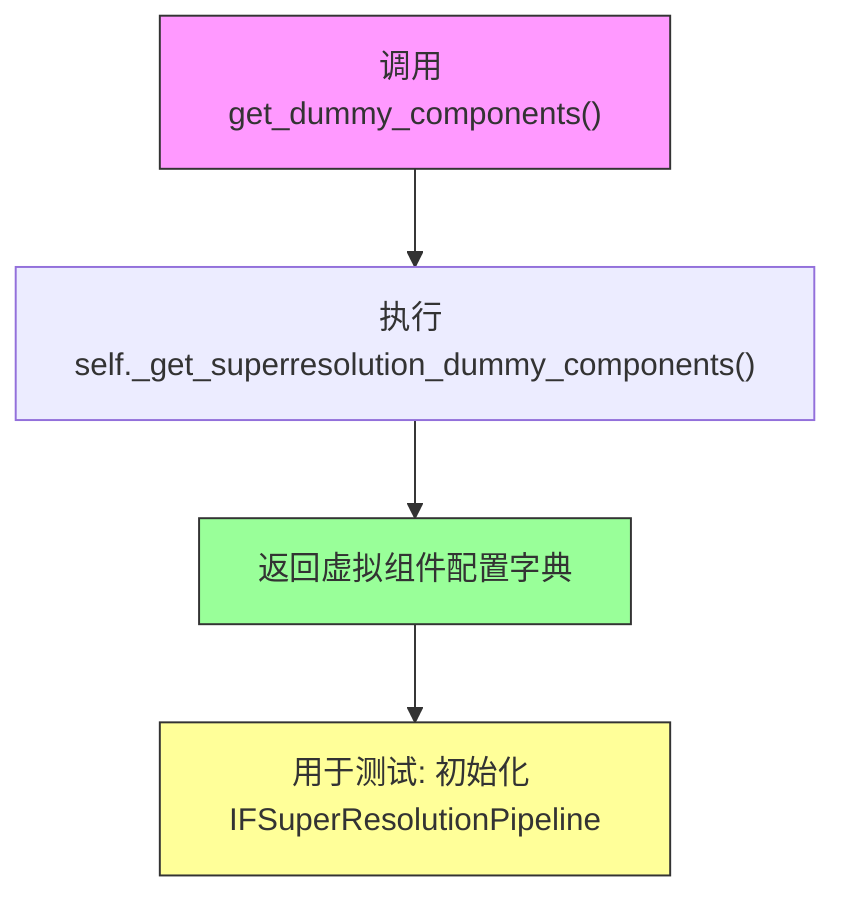
```mermaid
flowchart TD
    A["调用 get_dummy_components()"] --> B["执行 self._get_superresolution_dummy_components()"]
    B --> C["返回虚拟组件配置字典"]
    C --> D["用于测试: 初始化 IFSuperResolutionPipeline"]
    
    style A fill:#f9f,stroke:#333
    style C fill:#9f9,stroke:#333
    style D fill:#ff9,stroke:#333
```

#### 带注释源码

```python
def get_dummy_components(self):
    """
    获取用于测试的虚拟组件配置。
    
    此方法作为测试辅助接口，封装了对内部方法 _get_superresolution_dummy_components() 的调用。
    虚拟组件用于单元测试场景，以避免加载真实的预训练模型，从而加快测试执行速度并确保测试环境的独立性。
    
    返回:
        包含虚拟组件配置的字典，可用于初始化 IFSuperResolutionPipeline 的各个组件
        （如 UNet、VAE、文本编码器等）。
    """
    # 调用内部方法获取超分辨率管道的虚拟组件配置
    # _get_superresolution_dummy_components() 方法定义在父类或 mixin 中
    return self._get_superresolution_dummy_components()
```


### `IFSuperResolutionPipelineFastTests.get_dummy_inputs`

该方法为IFSuperResolutionPipeline的快速测试生成虚拟输入数据，根据设备类型创建随机生成器，生成测试用图像张量，并构建包含提示词、图像、生成器、推理步骤数和输出类型的输入字典。

参数：

- `self`：隐含的实例参数，IFSuperResolutionPipelineFastTests类的实例
- `device`：设备对象，指定生成张量所在的设备（如"cuda"、"cpu"或"mps"）
- `seed`：整数，默认值为0，用于设置随机数生成器的种子，确保测试可复现

返回值：`Dict`，包含以下键值对的字典：
- `prompt`：字符串，提示词
- `image`：torch.Tensor，生成的虚拟图像张量
- `generator`：torch.Generator或None，随机数生成器
- `num_inference_steps`：整数，推理步数
- `output_type`：字符串，输出类型

#### 流程图

```mermaid
flowchart TD
    A[开始] --> B{设备是否为mps?}
    B -->|是| C[使用torch.manual_seed设置种子]
    B -->|否| D[创建torch.Generator并设置种子]
    C --> E[使用floats_tensor生成图像张量]
    D --> E
    E --> F[将图像移动到目标设备]
    F --> G[构建输入字典]
    G --> H[返回输入字典]
    H --> I[结束]
```

#### 带注释源码

```python
def get_dummy_inputs(self, device, seed=0):
    """
    为测试生成虚拟输入数据
    
    参数:
        device: 目标设备对象
        seed: 随机种子，默认为0
    
    返回:
        包含测试所需的输入参数的字典
    """
    # 根据设备类型选择随机数生成方式
    # MPS设备需要特殊处理，不能使用torch.Generator
    if str(device).startswith("mps"):
        generator = torch.manual_seed(seed)
    else:
        # 为其他设备（如cuda、cpu）创建生成器并设置种子
        generator = torch.Generator(device=device).manual_seed(seed)

    # 生成随机浮点数图像张量，形状为(1, 3, 32, 32)
    # 使用指定种子确保可复现性
    image = floats_tensor((1, 3, 32, 32), rng=random.Random(seed)).to(device)

    # 构建测试所需的输入字典
    inputs = {
        "prompt": "A painting of a squirrel eating a burger",  # 测试用提示词
        "image": image,                                         # 生成的虚拟图像
        "generator": generator,                                 # 随机数生成器
        "num_inference_steps": 2,                               # 推理步数
        "output_type": "np",                                    # 输出为numpy数组
    }

    return inputs
```


### `IFSuperResolutionPipelineFastTests.test_xformers_attention_forwardGenerator_pass`

该测试方法用于验证 XFormers 注意力机制在前向传播过程中的正确性，确保在 CUDA 设备上使用 xformers 时，生成的图像与预期结果之间的最大差异不超过 1e-3。

参数：

- `self`：隐式参数，测试类实例本身

返回值：无（`None`），该方法通过调用内部方法 `_test_xformers_attention_forwardGenerator_pass` 执行验证，不返回具体值

#### 流程图

```mermaid
flowchart TD
    A[开始测试] --> B{检查条件: torch_device == 'cuda' 且 is_xformers_available?}
    B -->|是| C[调用 _test_xformers_attention_forwardGenerator_pass<br/>expected_max_diff=1e-3]
    B -->|否| D[跳过测试 - 条件不满足]
    C --> E[验证注意力机制前向传播]
    E --> F[比较输出差异是否 <= 1e-3]
    F --> G{验证通过?}
    G -->|是| H[测试通过]
    G -->|否| I[测试失败 - 差异超出阈值]
    H --> J[结束]
    I --> J
    D --> J
```

#### 带注释源码

```python
@unittest.skipIf(
    torch_device != "cuda" or not is_xformers_available(),
    reason="XFormers attention is only available with CUDA and `xformers` installed",
)
def test_xformers_attention_forwardGenerator_pass(self):
    """
    测试 XFormers 注意力机制的前向传播是否正确。
    
    该测试方法仅在以下条件满足时执行：
    1. 当前设备为 CUDA (torch_device == "cuda")
    2. xformers 库已安装 (is_xformers_available() == True)
    
    测试通过调用内部方法 _test_xformers_attention_forwardGenerator_pass 进行，
    预期最大差异阈值为 1e-3。
    """
    # 调用内部测试方法，验证 xformers 注意力机制
    # expected_max_diff=1e-3 表示输出图像与参考图像的像素差异必须小于等于 0.001
    self._test_xformers_attention_forwardGenerator_pass(expected_max_diff=1e-3)
```


### IFSuperResolutionPipelineFastTests.test_save_load_float16

该方法是一个测试用例，用于验证 IFSuperResolutionPipeline 在 float16 精度下的保存和加载功能是否正常工作。它通过检查设备兼容性（仅支持 CUDA 或 XPU）和加速器可用性，然后调用父类的测试方法来完成验证。

参数：

- `self`：`IFSuperResolutionPipelineFastTests`，测试类实例本身，代表当前测试对象

返回值：`None`，无返回值（测试方法，通过断言验证功能）

#### 流程图

```mermaid
flowchart TD
    A[开始测试 test_save_load_float16] --> B{检查设备是否为 CUDA 或 XPU}
    B -->|是| C{检查加速器是否可用}
    B -->|否| D[跳过测试 - float16 requires CUDA or XPU]
    C -->|是| E[调用父类 test_save_load_float16 方法]
    C -->|否| F[跳过测试 - 需要加速器]
    E --> G[执行保存加载测试<br/>expected_max_diff=1e-1]
    G --> H[结束测试]
```

#### 带注释源码

```python
@unittest.skipIf(torch_device not in ["cuda", "xpu"], reason="float16 requires CUDA or XPU")
@require_accelerator
def test_save_load_float16(self):
    # Due to non-determinism in save load of the hf-internal-testing/tiny-random-t5 text encoder
    # 该测试方法验证 pipeline 在 float16 精度下的保存和加载功能
    # 由于 text encoder 存在非确定性因素，使用较大的容差阈值 1e-1
    super().test_save_load_float16(expected_max_diff=1e-1)
```


### `IFSuperResolutionPipelineFastTests.test_attention_slicing_forward_pass`

该方法是一个单元测试，用于验证IFSuperResolutionPipeline在启用注意力切片（Attention Slicing）功能时前向传播的正确性，通过对比标准前向传播和切片前向传播的输出差异是否在预期范围内（1e-2）来确认功能正常。

参数：

- `self`：`IFSuperResolutionPipelineFastTests`，隐式参数，测试类实例本身

返回值：`None`，无返回值（测试方法）

#### 流程图

```mermaid
flowchart TD
    A[开始测试 test_attention_slicing_forward_pass] --> B[调用父类方法 _test_attention_slicing_forward_pass]
    B --> C[设置期望最大差异阈值 expected_max_diff=1e-2]
    C --> D[执行注意力切片前向传播测试]
    D --> E{输出差异 <= 1e-2?}
    E -->|是| F[测试通过]
    E -->|否| G[测试失败 - 抛出断言错误]
    F --> H[结束]
    G --> H
```

#### 带注释源码

```python
def test_attention_slicing_forward_pass(self):
    """
    测试注意力切片前向传播功能
    
    该测试方法验证IFSuperResolutionPipeline在启用注意力切片
    (Attention Slicing)时的前向传播是否正常工作。注意力切片是
    一种内存优化技术，通过将注意力计算分片处理来减少显存占用。
    
    测试逻辑:
    1. 创建pipeline的dummy components和dummy inputs
    2. 运行标准前向传播，获取输出
    3. 启用注意力切片 (enable_attention_slicing)
    4. 再次运行前向传播，获取切片模式输出
    5. 比较两次输出的差异是否在expected_max_diff范围内
    
    注意力切片工作原理:
    - 将大型注意力矩阵的计算分割成多个较小的块
    - 减少峰值显存使用，因为不需要同时保存整个注意力矩阵
    - 适用于显存受限但计算资源充足的环境
    
    Returns:
        None: 此测试方法不返回任何值，通过断言验证正确性
    
    Raises:
        AssertionError: 如果启用注意力切片后的输出与标准输出
                       的差异超过expected_max_diff (1e-2)
    """
    # 调用父类/混入类中实现的通用测试逻辑
    # expected_max_diff=1e-2 表示允许的最大像素差异为0.01
    # 这是一个相对宽松的阈值，因为注意力切片可能引入
    # 轻微的数值差异（由于计算顺序不同）
    self._test_attention_slicing_forward_pass(expected_max_diff=1e-2)
```


### `IFSuperResolutionPipelineFastTests.test_save_load_local`

该函数是 IFSuperResolutionPipelineFastTests 类中的一个测试方法，用于验证 IFSuperResolutionPipeline 管道能够正确地在本地进行保存（序列化）和加载（反序列化）操作，确保管道的状态在持久化后能够完整恢复。

参数：

- `self`：无显式参数，表示测试类实例本身

返回值：`None`，无返回值（测试方法不返回任何值，仅通过断言验证）

#### 流程图

```mermaid
flowchart TD
    A[开始测试 test_save_load_local] --> B[调用父类方法 self._test_save_load_local]
    B --> C{管道保存与加载是否成功}
    C -->|成功| D[测试通过]
    C -->|失败| E[抛出断言错误]
    D --> F[测试结束]
    E --> F
```

#### 带注释源码

```python
def test_save_load_local(self):
    """
    测试管道的本地保存和加载功能。
    
    该测试方法继承自 PipelineTesterMixin，调用父类实现的
    _test_save_load_local() 方法来验证：
    1. 管道可以正确序列化并保存到本地
    2. 管道可以从本地正确反序列化并加载
    3. 加载后的管道输出与原始管道输出一致
    
    参数:
        self: IFSuperResolutionPipelineFastTests 实例
        
    返回:
        None: 测试方法无返回值，通过断言验证
    """
    # 调用父类 PipelineTesterMixin 提供的通用保存/加载测试方法
    self._test_save_load_local()
```

#### 上下文信息

**所属类详情**：

- **类名**：`IFSuperResolutionPipelineFastTests`
- **类描述**：IF 超分辨率管道的快速测试类，继承自 `PipelineTesterMixin` 和 `IFPipelineTesterMixin`，用于验证 IFSuperResolutionPipeline 的各项功能
- **父类**：
  - `PipelineTesterMixin`：通用管道测试混入类
  - `IFPipelineTesterMixin`：IF 管道特定测试混入类
  - `unittest.TestCase`：Python 单元测试基类

**关键组件信息**：

- `IFSuperResolutionPipeline`：DeepFloyd IF 模型的超分辨率管道类
- `self._test_save_load_local()`：父类方法，负责执行实际的保存/加载测试逻辑

**潜在技术债务或优化空间**：

1. 该测试方法完全依赖父类实现，如果父类方法有变化可能导致测试行为改变
2. 测试方法本身没有自定义验证逻辑，无法针对 IFSuperResolutionPipeline 的特定保存/加载行为进行验证
3. 缺少对管道特定组件（如 attention processor）的保存/加载验证

**其他说明**：

- 该测试方法标记为快速测试（FastTests），不标记 `@slow` 装饰器
- 测试使用 dummy 组件和输入进行验证，不依赖真实的预训练模型
- 继承的 `required_optional_params` 移除了 `"latents"` 参数，这是 IF 管道特有的配置


### `IFSuperResolutionPipelineFastTests.test_inference_batch_single_identical`

这是一个单元测试方法，用于验证图像超分辨率管道在批量推理和单样本推理时产生一致的结果。该测试通过比较批量推理与逐个样本推理的输出差异来确保管道的确定性和一致性，差异阈值设为 1e-2。

参数：

- `self`：隐式参数，测试类实例本身，无额外描述

返回值：`None`，无返回值（测试方法）

#### 流程图

```mermaid
flowchart TD
    A[开始测试] --> B[调用 _test_inference_batch_single_identical 方法]
    B --> C[设置 expected_max_diff=1e-2]
    C --> D[执行批量推理]
    D --> E[执行单样本推理]
    E --> F[比较输出差异]
    F --> G{差异 <= 1e-2?}
    G -->|是| H[测试通过]
    G -->|否| I[测试失败/抛出异常]
    H --> J[结束测试]
    I --> J
```

#### 带注释源码

```python
def test_inference_batch_single_identical(self):
    """
    测试方法：验证批量推理与单样本推理的结果一致性
    
    该测试方法继承自 PipelineTesterMixin，调用父类的 _test_inference_batch_single_identical
    方法来执行实际的验证逻辑。测试会比较以下两种推理方式的输出：
    1. 使用批量输入（batch_size > 1）进行推理
    2. 多次使用单个输入进行推理
    
    预期结果：两种方式的输出应该非常接近（差异小于等于 1e-2）
    这对于确保管道的确定性和一致性非常重要，特别是在使用相同的
    随机种子时。
    
    参数：
        - self: IFSuperResolutionPipelineFastTests 的实例对象
            类型: IFSuperResolutionPipelineFastTests
            描述: 测试类本身，包含测试所需的配置和辅助方法
    
    返回值：
        - None
            类型: None
            描述: 这是一个测试方法，不返回任何值。测试结果通过断言或异常来表示。
    
    注意：
        - 该方法依赖于父类 PipelineTesterMixin 提供的 _test_inference_batch_single_identical 实现
        - 使用的差异阈值 expected_max_diff=1e-2 是相对宽松的，允许浮点数运算的微小差异
        - 测试需要确保管道配置、随机种子等参数在两种推理方式中保持一致
    """
    self._test_inference_batch_single_identical(
        expected_max_diff=1e-2,
    )
```


### IFSuperResolutionPipelineFastTests.test_save_load_dduf

该方法是一个测试用例，用于验证 DDUF（DeepFloyd Unit 格式）模型的保存和加载功能是否正确，通过调用父类的 test_save_load_dduf 方法并指定容差参数来完成测试。

参数：

- `self`：实例方法隐式参数，表示测试类实例本身，无需显式传递

返回值：`None`，该方法为测试用例，通过断言验证保存/加载功能的正确性，不返回具体数据

#### 流程图

```mermaid
flowchart TD
    A[开始测试 test_save_load_dduf] --> B{检查装饰器条件}
    B -->|HF Hub版本 > 0.26.5| C{Transformers版本 > 4.47.1}
    B -->|不满足| D[跳过测试]
    C -->|满足| E[调用父类方法 super().test_save_load_dduf]
    E --> F[传入参数 atol=1e-2, rtol=1e-2]
    F --> G[执行保存/加载测试]
    G --> H{测试通过?}
    H -->|是| I[测试通过]
    H -->|否| J[抛出断言错误]
    I --> K[结束]
    J --> K
```

#### 带注释源码

```python
@require_hf_hub_version_greater("0.26.5")
@require_transformers_version_greater("4.47.1")
def test_save_load_dduf(self):
    """
    测试 DDUF 格式模型的保存和加载功能
    
    该测试方法验证 IFSuperResolutionPipeline 能够正确保存和加载
    DDUF (DeepFloyd Unit Format) 格式的模型，测试包含：
    1. 模型的序列化保存
    2. 模型的反序列化加载
    3. 加载后的模型输出与原始模型的一致性验证
    
    使用绝对容差 atol=1e-2 和相对容差 rtol=1e-2 进行数值比较
    """
    # 调用父类 PipelineTesterMixin 的 test_save_load_dduf 方法
    # 继承自 test_pipelines_common.PipelineTesterMixin
    super().test_save_load_dduf(atol=1e-2, rtol=1e-2)
```


### `IFSuperResolutionPipelineFastTests.test_save_load_optional_components`

该测试方法用于验证 IFSuperResolutionPipeline 管道在保存和加载时对可选组件（如调度器、特征提取器等）的处理能力，确保可选组件能够被正确序列化和反序列化。由于该测试功能已在其他测试类中实现，此方法被标记为跳过。

参数：

- `self`：`IFSuperResolutionPipelineFastTests`，测试类实例，代表当前的测试对象
- `expected_max_difference`：`float`，可选参数，默认值为 `0.0001`，用于指定保存/加载前后输出结果的最大允许差异阈值

返回值：`None`，该方法没有返回值（方法体为 `pass`）

#### 流程图

```mermaid
flowchart TD
    A[开始测试] --> B{检查跳过装饰器}
    B -->|是| C[跳过测试<br/>Test done elsewhere.]
    B -->|否| D[执行保存加载测试]
    D --> E[比较输出差异]
    E --> F[断言差异 <= expected_max_difference]
    F --> G[测试通过]
    C --> G
    
    style C fill:#f9f,color:#333
    style G fill:#9f9,color:#333
```

#### 带注释源码

```python
@unittest.skip("Test done elsewhere.")
def test_save_load_optional_components(self, expected_max_difference=0.0001):
    """
    测试管道保存和加载可选组件的功能。
    
    该测试方法验证 IFSuperResolutionPipeline 管道在保存和加载时
    对可选组件（如调度器、特征提取器、tokenizer等）的处理能力。
    确保这些可选组件能够被正确序列化和反序列化，且不会影响管道的
    正常运行。
    
    参数:
        self: 测试类实例
        expected_max_difference: float, 默认为0.0001, 允许的最大差异阈值
    
    返回值:
        None: 该方法被跳过，无实际执行
    """
    pass  # 测试已在其他地方实现，此处直接跳过
```


### `IFSuperResolutionPipelineSlowTests.setUp`

该方法为测试类的初始化方法，在每个测试用例运行前执行，主要用于清理 GPU 显存（VRAM），确保测试环境处于干净状态，避免显存残留影响测试结果。

参数：无（继承自 `unittest.TestCase.setUp`）

返回值：`None`，无返回值

#### 流程图

```mermaid
flowchart TD
    A[开始 setUp] --> B[调用父类 setUp 方法]
    B --> C[执行 gc.collect 垃圾回收]
    C --> D[调用 backend_empty_cache 清理显存]
    D --> E[结束 setUp]
```

#### 带注释源码

```python
def setUp(self):
    # clean up the VRAM before each test
    # 在每个测试运行前清理 VRAM，释放显存资源
    super().setUp()  # 调用父类 unittest.TestCase 的 setUp 方法
    gc.collect()     # 执行 Python 垃圾回收，清理未引用的对象
    backend_empty_cache(torch_device)  # 调用后端特定函数清理 GPU 显存缓存
```


### `IFSuperResolutionPipelineSlowTests.tearDown`

该方法是测试类的清理fixture（tearDown方法），在每个测试方法执行完毕后自动调用，用于清理VRAM内存资源，防止内存泄漏。

参数：

- `self`：`unittest.TestCase`，测试类实例本身，无需显式传递

返回值：`None`，无返回值

#### 流程图

```mermaid
flowchart TD
    A[开始 tearDown] --> B[调用父类 tearDown]
    B --> C[执行 gc.collect]
    C --> D[调用 backend_empty_cache 清理GPU缓存]
    D --> E[结束 tearDown]
```

#### 带注释源码

```python
def tearDown(self):
    # clean up the VRAM after each test
    # 在每个测试方法执行完毕后清理VRAM内存
    super().tearDown()  # 调用父类的tearDown方法，执行标准测试清理
    gc.collect()        # 强制进行Python垃圾回收，释放Python对象
    backend_empty_cache(torch_device)  # 清理GPU/CPU后端缓存，释放显存
```


### `IFSuperResolutionPipelineSlowTests.test_if_superresolution`

这是一个单元测试方法，用于验证 IFSuperResolutionPipeline（DeepFloyd IF 图像超分辨率管道）在第二阶段的超分辨率处理功能。测试加载预训练模型，执行推理，并验证输出图像的形状、内存使用和像素质量是否符合预期。

参数：

- `self`：隐式参数，测试类实例本身

返回值：`None`，该方法为测试方法，无返回值（执行一系列断言验证）

#### 流程图

```mermaid
flowchart TD
    A[开始测试] --> B[创建IFSuperResolutionPipeline实例]
    B --> C{从预训练模型加载}
    C --> D[设置AttnAddedKVProcessor注意力处理器]
    D --> E[启用模型CPU卸载]
    E --> F[重置内存统计]
    F --> G[创建测试图像和生成器]
    G --> H[执行管道推理]
    H --> I[获取输出图像]
    I --> J{验证图像形状}
    J -->|通过| K[检查内存使用]
    J -->|失败| L[抛出断言错误]
    K --> M{内存 < 12GB}
    M -->|通过| N[加载预期图像对比]
    M -->|失败| L
    N --> O{像素差异检查}
    O -->|通过| P[移除所有钩子]
    O -->|失败| L
    P --> Q[测试通过]
```

#### 带注释源码

```python
@unittest.skipIf(
    torch_device != "cuda" or not is_xformers_available(),
    reason="XFormers attention is only available with CUDA and `xformers` installed",
)
def test_if_superresolution(self):
    """测试 IF 超级分辨率管道的完整推理流程"""
    
    # ========== 1. 加载预训练模型 ==========
    # 从 HuggingFace Hub 加载 DeepFloyd/IF-II-L-v1.0 模型
    # variant="fp16" 使用半精度模型以减少内存占用
    # torch_dtype=torch.float16 指定使用 float16 精度
    pipe = IFSuperResolutionPipeline.from_pretrained(
        "DeepFloyd/IF-II-L-v1.0", variant="fp16", torch_dtype=torch.float16
    )
    
    # ========== 2. 配置注意力处理器 ==========
    # 设置自定义注意力处理器 AttnAddedKVProcessor
    # 该处理器支持 KV 缓存优化
    pipe.unet.set_attn_processor(AttnAddedKVProcessor())
    
    # ========== 3. 启用 CPU 卸载 ==========
    # 启用模型 CPU 卸载以节省 GPU 显存
    # 当模型不使用时将其移至 CPU
    pipe.enable_model_cpu_offload(device=torch_device)
    
    # ========== 4. 内存管理准备 ==========
    # 清空 GPU 缓存释放显存
    backend_empty_cache(torch_device)
    # 重置最大内存分配统计
    backend_reset_max_memory_allocated(torch_device)
    # 重置峰值内存统计
    backend_reset_peak_memory_stats(torch_device)
    
    # ========== 5. 准备输入数据 ==========
    # 创建测试用随机浮点张量 (1, 3, 64, 64)
    # 模拟输入的低分辨率图像
    image = floats_tensor((1, 3, 64, 64), rng=random.Random(0)).to(torch_device)
    
    # 创建随机数生成器，确保测试可复现
    generator = torch.Generator(device="cpu").manual_seed(0)
    
    # ========== 6. 执行推理 ==========
    # 调用管道进行超分辨率处理
    # prompt: 文本提示
    # image: 输入图像
    # generator: 随机生成器用于可重复性
    # num_inference_steps: 推理步数（较少步数用于快速测试）
    # output_type: 输出格式为 numpy 数组
    output = pipe(
        prompt="anime turtle",
        image=image,
        generator=generator,
        num_inference_steps=2,
        output_type="np",
    )
    
    # ========== 7. 获取输出 ==========
    # 从输出对象中提取生成的图像
    image = output.images[0]
    
    # ========== 8. 验证输出形状 ==========
    # 验证超分辨率输出形状为 (256, 256, 3)
    # 64x64 -> 256x256 (4倍放大)
    assert image.shape == (256, 256, 3)
    
    # ========== 9. 验证内存使用 ==========
    # 获取推理过程中分配的最大内存
    mem_bytes = backend_max_memory_allocated(torch_device)
    
    # 验证内存使用小于 12GB
    # 确保管道在合理内存预算内运行
    assert mem_bytes < 12 * 10**9
    
    # ========== 10. 像素质量验证 ==========
    # 从 HuggingFace 数据集加载预期输出图像
    expected_image = load_numpy(
        "https://huggingface.co/datasets/hf-internal-testing/diffusers-images/resolve/main/if/test_if_superresolution_stage_II.npy"
    )
    
    # 验证生成图像与预期图像的像素差异在可接受范围内
    assert_mean_pixel_difference(image, expected_image)
    
    # ========== 11. 清理资源 ==========
    # 移除所有挂载的钩子，防止影响后续测试
    pipe.remove_all_hooks()
```

## 关键组件


### IFSuperResolutionPipeline

DeepFloyd IF 超级分辨率流水线的测试套件，用于测试文本引导的图像超分辨率模型的推理、加载和内存优化功能。

### IFSuperResolutionPipelineFastTests

快速测试类，继承自 PipelineTesterMixin 和 IFPipelineTesterMixin，包含 xformers 注意力测试、float16 保存加载测试、注意力切片测试、批处理一致性测试等多个测试用例。

### IFSuperResolutionPipelineSlowTests

慢速测试类，包含实际的模型推理测试，使用 DeepFloyd/IF-II-L-v1.0 预训练模型进行端到端的超分辨率测试，并验证内存占用和输出图像质量。

### AttnAddedKVProcessor

注意力处理器类，用于设置 UNet 的注意力处理器，支持添加 KV 缓存的注意力计算优化。

### floats_tensor

测试工具函数，用于生成指定形状的随机浮点数张量，作为测试输入的图像数据。

### backend_empty_cache / backend_max_memory_allocated / backend_reset_max_memory_allocated / backend_reset_peak_memory_stats

内存管理工具函数，用于清理 GPU 缓存、查询和重置内存统计信息，确保测试过程中内存控制准确。

### enable_model_cpu_offload

模型 CPU 卸载功能，允许将模型权重动态卸载到 CPU 以节省 VRAM，适用于大模型推理场景。

### xformers 注意力

一种优化的注意力机制实现，通过 CUDA 加速注意力计算，测试中通过 is_xformers_available 检查可用性。

### from_pretrained

模型加载方法，从 HuggingFace Hub 或本地加载预训练的 IF 超分辨率模型，支持 variant 指定和 torch_dtype 指定。

### test_if_superresolution

端到端超分辨率推理测试，验证流水线能够将 64x64 图像超分辨率到 256x256，并检查内存占用低于 12GB。


## 问题及建议


### 已知问题

-   **测试跳过逻辑不一致**：`test_xformers_attention_forwardGenerator_pass` 使用 `@unittest.skipIf` 检查条件，而 `test_save_load_float16` 同时使用 `@unittest.skipIf` 和 `@require_accelerator` 装饰器，条件有重叠可能导致测试被意外跳过或逻辑混乱。
-   **硬编码的内存限制值**：在 `test_if_superresolution` 中使用 `mem_bytes < 12 * 10**9` 硬编码 12GB 内存限制，缺乏文档说明且在不同 GPU 硬件上可能失败（如显存较小的显卡）。
-   **重复的内存管理代码**：`setUp` 和 `tearDown` 方法中包含相同的 `gc.collect()` 和 `backend_empty_cache(torch_device)` 调用，造成代码重复。
-   **外部依赖缺乏容错**：测试依赖远程 URL 加载 numpy 文件（`load_numpy`），网络问题或 URL 变更会导致测试失败，且缺少错误处理和降级策略。
-   **设备检测方式不健壮**：`get_dummy_inputs` 中使用 `str(device).startswith("mps")` 进行设备判断，这种字符串匹配方式不够规范，容易出错。
-   **测试参数缺乏灵活性**：`get_dummy_inputs` 方法中的参数（如 `num_inference_steps=2`、图像尺寸 `(1, 3, 32, 32)`）硬编码在字典中，难以通过参数化方式测试不同场景。
-   **测试方法命名不一致**：部分测试直接调用父类方法，部分调用内部 `_test_` 前缀的私有方法，命名规范不统一，影响可维护性。
-   **资源清理不完整**：虽然 `IFSuperResolutionPipelineSlowTests` 实现了 `setUp` 和 `tearDown` 进行内存清理，但 `IFSuperResolutionPipelineFastTests` 缺少类似的资源清理机制，可能导致内存泄漏。

### 优化建议

-   **提取公共测试工具类**：将 `gc.collect()` 和 `backend_empty_cache` 等内存管理逻辑封装到测试基类或工具类中，通过 `@classmethod` 或 `setUpClass`/`tearDownClass` 统一管理。
-   **使用配置化管理测试参数**：引入 pytest 参数化或配置文件管理测试参数（如图像尺寸、推理步数、内存阈值），避免硬编码。
-   **增强设备检测鲁棒性**：使用 `torch.device` 的属性或专门的设备检测函数替代字符串匹配。
-   **添加外部资源缓存和降级策略**：对远程 numpy 文件实现本地缓存机制，URL 不可用时使用预设的测试数据或跳过测试。
-   **统一测试方法命名规范**：明确内部测试方法（如 `_test_` 前缀）和公开测试方法的职责，建议使用更清晰的命名区分。
-   **动态调整资源限制**：根据实际 GPU 显存动态计算内存阈值，或提供配置文件允许用户自定义资源限制。
-   **为 FastTests 添加资源清理**：在 `IFSuperResolutionPipelineFastTests` 中添加 `setUp`/`tearDown` 方法处理显存清理，保持与 SlowTests 一致的行为。

## 其它


### 设计目标与约束

本测试文件旨在验证 IFSuperResolutionPipeline（DeepFloyd IF 超分辨率管道）的功能正确性和性能指标。设计目标包括：确保管道能够正确执行图像超分辨率任务；验证在不同硬件配置（CUDA、XPU、CPU）下的兼容性；测试模型保存和加载功能；验证注意力机制变体（xformers、attention slicing）的正确性；确保批处理推理的数值一致性。约束条件包括：快速测试必须在CPU和GPU环境下均可运行；慢速测试仅在配备加速器的设备上执行；内存使用需控制在12GB以内；xformers测试仅支持CUDA环境。

### 错误处理与异常设计

测试文件采用了多层错误处理机制。首先通过装饰器进行条件跳过：`@unittest.skipIf` 用于在特定条件下跳过测试（如非CUDA环境）；`@require_accelerator` 确保测试在有加速器的环境中运行；`@skip_mps` 跳过MPS后端测试。其次通过自定义异常类处理特定场景：`PipelineTesterMixin` 提供了标准的测试断言方法；`assert_mean_pixel_difference` 用于验证输出图像与预期结果的像素级差异。在慢速测试中，使用 `setUp` 和 `tearDown` 方法进行资源清理，确保VRAM的正确释放，避免测试间的内存泄漏。

### 数据流与状态机

测试数据流遵循以下路径：首先通过 `get_dummy_components()` 获取虚拟组件配置；然后使用 `get_dummy_inputs()` 生成测试输入数据（包括prompt、图像tensor、随机数生成器、推理步数等）；接着创建管道实例并执行推理；最后验证输出结果。对于慢速测试，额外增加了内存监控流程：在推理前后调用 `backend_empty_cache()` 清理缓存，使用 `backend_reset_max_memory_allocated()` 和 `backend_reset_peak_memory_stats()` 重置内存统计，以准确测量推理过程中的内存占用。管道状态转换包括：初始化状态（from_pretrained）→ 配置状态（set_attn_processor）→ 推理状态（__call__）→ 结果验证状态。

### 外部依赖与接口契约

本测试文件依赖以下外部组件和接口：核心依赖包括 `diffusers` 库（IFSuperResolutionPipeline、AttnAddedKVProcessor）；深度学习框架 `torch`；测试框架 `unittest`。辅助依赖包括 `testing_utils` 模块中的内存管理函数（backend_empty_cache、backend_max_memory_allocated等）；图像张量生成工具（floats_tensor）；numpy数组加载工具（load_numpy）；装饰器函数（require_accelerator、require_torch_accelerator、skip_mps、slow等）。外部资源依赖包括预训练模型 "DeepFloyd/IF-II-L-v1.0"；测试数据集 "hf-internal-testing/diffusers-images/resolve/main/if/test_if_superresolution_stage_II.npy"。接口契约方面：`pipeline_class` 定义被测管道类；`params` 定义单样本推理参数；`batch_params` 定义批处理参数；`required_optional_params` 定义必需的可选参数。

### 测试策略与覆盖范围

测试策略采用分层测试架构：快速测试层（FastTests）聚焦于功能正确性验证，包括xformers注意力机制测试（test_xformers_attention_forwardGenerator_pass）、float16模型保存加载测试（test_save_load_float16）、注意力切片转发测试（test_attention_slicing_forward_pass）、本地模型保存加载测试（test_save_load_local）、批处理单样本一致性测试（test_inference_batch_single_identical）、DDUF格式保存加载测试（test_save_load_dduf）。慢速测试层（SlowTests）聚焦于端到端集成验证，使用真实预训练模型进行完整推理流程测试，验证输出图像尺寸（256x256x3）和内存占用（<12GB）。测试覆盖了同步和异步推理流程、FP16和FP32精度、CPU和GPU执行、模型序列化和反序列化等关键场景。

### 性能基准与指标

性能测试建立了明确的量化指标体系：注意力机制精度指标：xformers测试的预期最大差异为1e-3；注意力切片测试的预期最大差异为1e-2；float16保存加载测试的预期最大差异为1e-1。批处理一致性指标：单样本和批处理输出的预期最大差异为1e-2。内存管理指标：慢速测试的VRAM使用上限为12GB（12 * 10**9字节）。图像质量指标：使用像素级差异均值进行质量验证，DDUF测试的绝对容差为1e-2、相对容差为1e-2。推理配置指标：快速测试使用2步推理；慢速测试使用2步推理。

### 资源管理与生命周期

资源管理采用严格的生命周期控制。内存管理方面：每次慢速测试前调用 `gc.collect()` 强制垃圾回收；调用 `backend_empty_cache()` 清理GPU/CPU缓存；重置内存统计计数器。测试后清理方面：测试结束后再次执行垃圾回收和缓存清理；调用 `pipe.remove_all_hooks()` 移除所有模型钩子。设备管理方面：使用 `torch_device` 全局变量管理目标设备；支持CPU、CUDA、XPU、MPS等多种设备；使用 `enable_model_cpu_offload()` 实现模型CPU卸载以节省显存。随机性管理方面：使用 `torch.Generator` 或 `torch.manual_seed` 设置随机种子确保可复现性。

### 并发与异步处理

测试代码未直接使用显式的并发或异步机制，但通过以下方式间接支持：管道本身支持批处理（通过 `batch_params` 定义），可一次性处理多个样本提高吞吐量。内存管理函数 `backend_empty_cache` 和 `gc.collect` 会在主线程中同步执行，确保资源及时释放。测试隔离通过 `setUp` 和 `tearDown` 方法实现，每个测试用例拥有独立的资源状态，避免并发冲突。未来的性能优化可考虑引入异步推理（使用 `torch.cuda.Event` 实现GPU异步操作）和测试并行化（使用 `unittest` 的测试发现机制并行执行独立测试用例）。

### 安全考虑与权限控制

代码遵循Apache 2.0许可证，符合开源安全规范。安全考量包括：模型加载使用 `variant="fp16"` 指定权重变体，确保与硬件兼容；通过 `torch_dtype=torch.float16` 显式指定数据类型，防止精度不匹配；使用 `enable_model_cpu_offload()` 避免显存溢出导致的OOM错误；测试文件位于 `diffusers` 包的测试目录，受包管理器的依赖版本约束，避免引入未知安全风险。

### 配置参数与常量定义

关键配置参数包括：`pipeline_class = IFSuperResolutionPipeline` 被测管道类；`params = TEXT_GUIDED_IMAGE_VARIATION_PARAMS - {"width", "height"}` 推理参数（排除宽高参数）；`batch_params = TEXT_GUIDED_IMAGE_VARIATION_BATCH_PARAMS` 批处理参数；`required_optional_params = PipelineTesterMixin.required_optional_params - {"latents"}` 必需可选参数（排除latents）。测试输入配置：`num_inference_steps = 2` 推理步数；`output_type = "np"` 输出类型为numpy数组；测试图像尺寸：快速测试使用32x32输入、慢速测试使用64x64输入、输出为256x256。设备配置：通过 `torch_device` 全局变量动态获取设备；MPS设备使用 `torch.manual_seed` 而非 `torch.Generator`。

### 版本兼容性与迁移策略

版本兼容性要求通过装饰器强制执行：`@require_hf_hub_version_greater("0.26.5")` 要求HuggingFace Hub库版本大于0.26.5；`@require_transformers_version_greater("4.47.1")` 要求Transformers库版本大于4.47.1。向后兼容性考虑：测试使用标准化的 `PipelineTesterMixin` 接口，便于在不同版本的diffusers库间迁移；虚拟组件通过 `_get_superresolution_dummy_components()` 方法获取，封装了版本特定的组件创建逻辑。硬件兼容性通过条件跳过机制实现：CUDA/XPU环境运行完整测试；MPS环境跳过；非加速器环境仅运行快速测试。

    