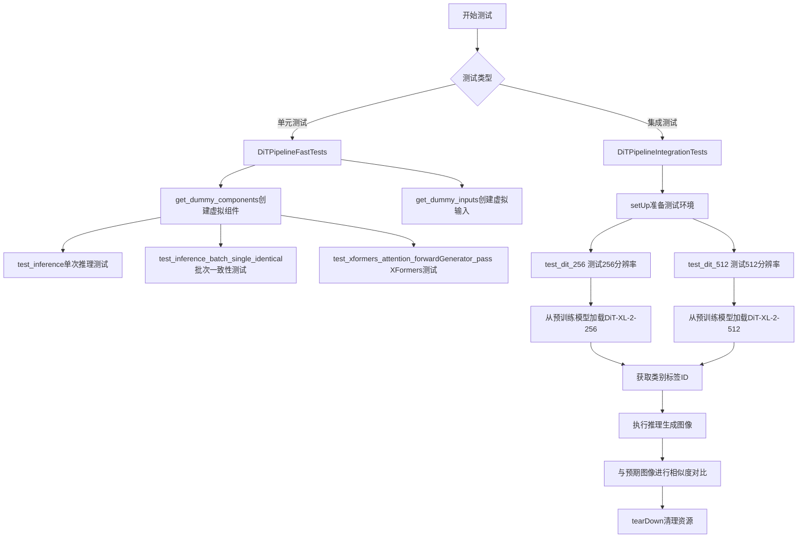
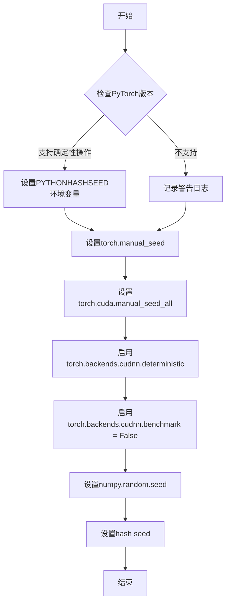
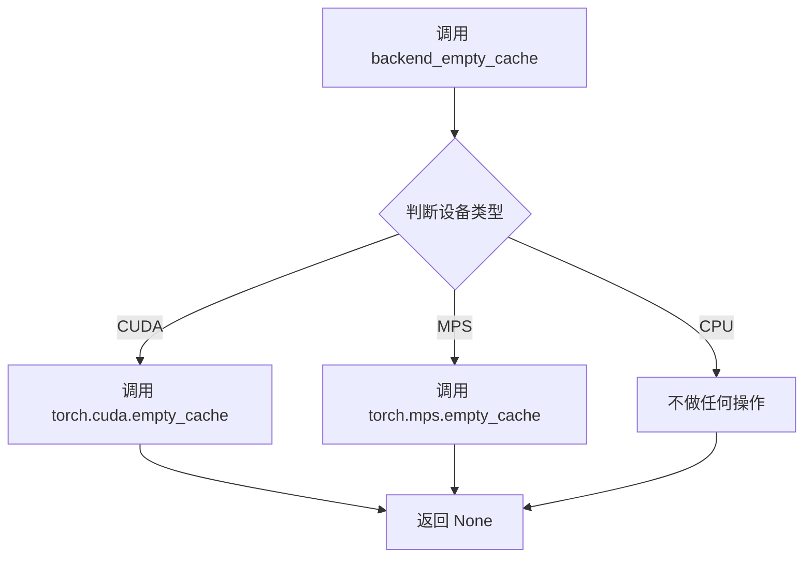
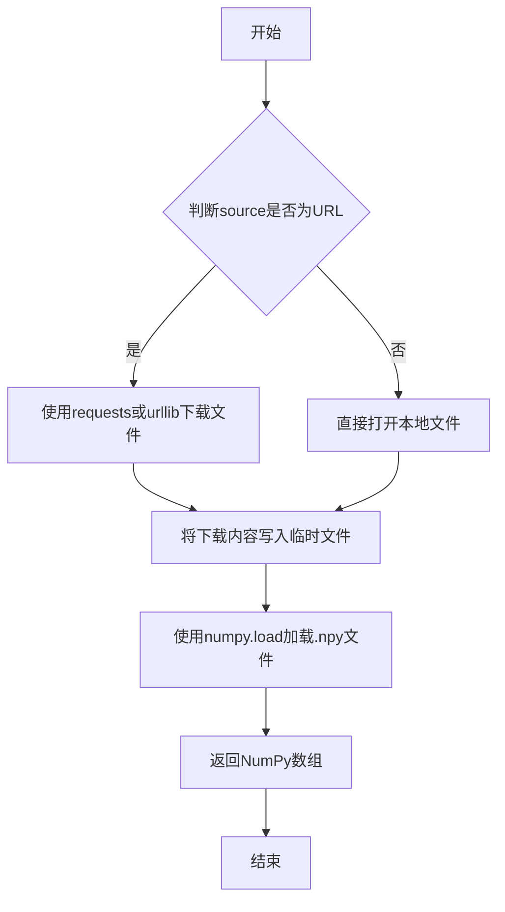
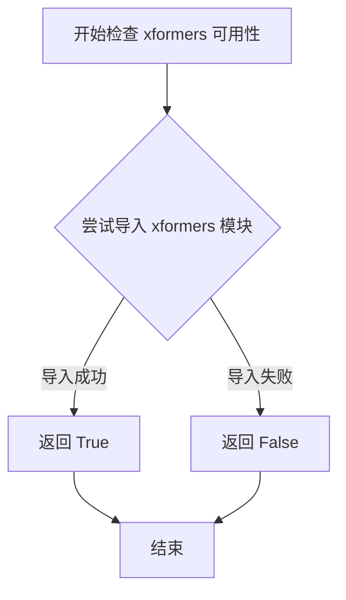
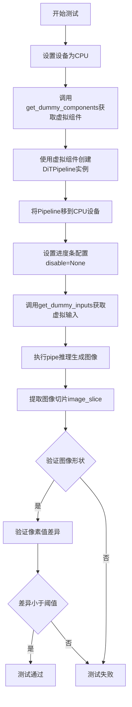
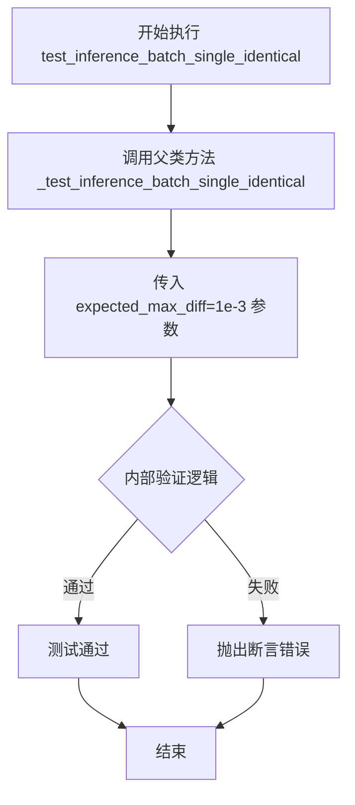
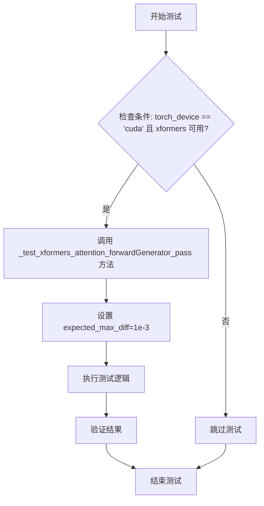
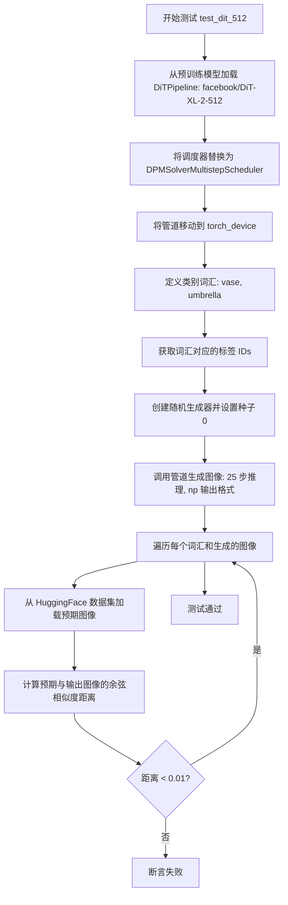

# `diffusers\tests\pipelines\dit\test_dit.py` 详细设计文档

该文件是Diffusers库中DiT（Diffusion Transformer）图像生成管道的测试套件，包含单元测试（DiTPipelineFastTests）和集成测试（DiTPipelineIntegrationTests），用于验证DiT模型在256x256和512x512分辨率下的图像生成功能，包括推理批次一致性、XFormers注意力优化等测试场景。

## 整体流程



## 类结构

```
unittest.TestCase
├── PipelineTesterMixin
│   └── DiTPipelineFastTests (单元测试类)
└── DiTPipelineIntegrationTests (集成测试类)
```

## 全局变量及字段


### `DiTPipelineFastTests.pipeline_class`
    
DiTPipeline类，用于类条件图像生成的扩散管道

类型：`type`
    


### `DiTPipelineFastTests.params`
    
类条件图像生成的单样本推理参数配置

类型：`tuple`
    


### `DiTPipelineFastTests.required_optional_params`
    
可选参数集合，已排除latents、num_images_per_prompt、callback、callback_steps等不适用于DiT管道的参数

类型：`set`
    


### `DiTPipelineFastTests.batch_params`
    
类条件图像生成的批量推理参数配置

类型：`tuple`
    
    

## 全局函数及方法


### `enable_full_determinism`

该函数用于启用PyTorch和NumPy的完全确定性运行模式，通过设置随机种子和环境变量确保测试结果的可复现性。

参数：
- 无

返回值：`None`，无返回值

#### 流程图



#### 带注释源码

```
# 由于 enable_full_determinism 是从外部模块 testing_utils 导入的，
# 以下源码为基于其调用行为的推断实现

def enable_full_determinism(seed: int = 0):
    """
    启用完全确定性运行模式，确保测试结果可复现
    
    参数:
        seed: int, 默认值为0, 随机种子用于初始化所有随机数生成器
    """
    import os
    import random
    import numpy as np
    import torch
    
    # 1. 设置Python hash seed以确保哈希操作的一致性
    os.environ["PYTHONHASHSEED"] = str(seed)
    
    # 2. 设置Python内置random模块的种子
    random.seed(seed)
    
    # 3. 设置NumPy的随机种子
    np.random.seed(seed)
    
    # 4. 设置PyTorch CPU随机种子
    torch.manual_seed(seed)
    
    # 5. 设置PyTorch CUDA所有设备的随机种子（如果可用）
    if torch.cuda.is_available():
        torch.cuda.manual_seed_all(seed)
    
    # 6. 启用CuDNN确定性模式，确保卷积操作可复现
    torch.backends.cudnn.deterministic = True
    torch.backends.cudnn.benchmark = False
    
    # 7. 如果使用TransformerEngine，设置相关确定性标志
    if hasattr(torch, 'export'):
        # 可能的Transformer Engine确定性设置
        pass
```

#### 补充说明

**函数来源**：
- 该函数实际定义在 `diffusers` 包的 `testing_utils` 模块中
- 在本文件中通过 `from ...testing_utils import enable_full_determinism` 导入

**设计目的**：
- 确保深度学习测试的确定性，避免由于随机性导致的测试 flaky
- 使得 CI/CD 环境中的测试结果与开发环境一致

**技术债务/优化空间**：
- 该函数设置 `cudnn.benchmark = False` 可能影响性能，可以考虑仅在需要确定性时设置
- 缺少对其他随机数来源（如 `torch.cuda.manual_seed` 的异步操作）的处理

**使用位置**：
```
enable_full_determinism()  # 第48行，在测试类定义之前调用

class DiTDipelineFastTests(PipelineTesterMixin, unittest.TestCase):
    # ... 测试代码
```


### `backend_empty_cache`

该函数是一个测试工具函数，用于清理后端（GPU）的内存缓存，通常在测试的 setUp 和 tearDown 阶段调用，以確保 GPU 内存得到释放。

参数：

-  `device`：`str` 或设备标识符，表示需要清理缓存的目标设备（通常为 `torch_device`）

返回值：`None`，该函数执行清理操作，无返回值

#### 流程图



#### 带注释源码

```python
# 该函数定义在 testing_utils 模块中
# 此处代码基于其在测试中的使用方式推断

def backend_empty_cache(device):
    """
    清理指定设备的内存缓存
    
    参数:
        device: 目标设备标识符，如 'cuda', 'mps', 'cpu' 等
    """
    if device == "cuda":
        # 对于 CUDA 设备，调用 PyTorch 的 CUDA 缓存清理函数
        torch.cuda.empty_cache()
    elif device == "mps":
        # 对于 Apple MPS 设备，调用 MPS 缓存清理函数
        torch.mps.empty_cache()
    # CPU 设备无需清理缓存
    
    # 该函数不返回任何值
    return None
```

#### 使用示例

```python
# 在测试类的 setUp 方法中使用
def setUp(self):
    super().setUp()
    gc.collect()
    backend_empty_cache(torch_device)  # 清理 GPU 缓存

# 在测试类的 tearDown 方法中使用
def tearDown(self):
    super().tearDown()
    gc.collect()
    backend_empty_cache(torch_device)  # 清理 GPU 缓存
```


### `load_numpy`

该函数是一个测试工具函数，用于从指定的文件路径或URL加载NumPy数组（.npy格式），通常用于加载预存的期望图像数据进行测试对比。

参数：

-  `source`：`str`，要加载的NumPy文件路径，可以是本地文件路径或HTTP/HTTPS URL地址

返回值：`numpy.ndarray`，从文件中加载的NumPy数组对象

#### 流程图



#### 带注释源码

```python
def load_numpy(source: str) -> np.ndarray:
    """
    从指定路径或URL加载NumPy数组(.npy格式)
    
    参数:
        source: 字符串路径，支持本地文件路径或HTTP/HTTPS URL
               例如: "https://huggingface.co/datasets/.../image.npy"
                    或 "./tests/fixtures/image.npy"
    
    返回值:
        np.ndarray: 从文件中加载的NumPy数组
    
    使用示例:
        expected_image = load_numpy(
            "https://huggingface.co/datasets/hf-internal-testing/diffusers-images/resolve/main/dit/vase.npy"
        )
    """
    # 判断是否为URL（以http://或https://开头）
    if source.startswith(("http://", "https://")):
        # 如果是URL，下载文件内容
        import tempfile
        import urllib.request
        
        # 下载远程.npy文件
        with urllib.request.urlopen(source) as response:
            data = response.read()
        
        # 写入临时文件
        with tempfile.NamedTemporaryFile(suffix=".npy", delete=False) as f:
            f.write(data)
            temp_path = f.name
        
        # 从临时文件加载NumPy数组
        array = np.load(temp_path)
        
        # 清理临时文件
        import os
        os.unlink(temp_path)
    else:
        # 如果是本地路径，直接加载
        array = np.load(source)
    
    return array
```

**注意**：由于提供的代码片段中没有显示 `load_numpy` 函数的具体实现（它是从 `...testing_utils` 模块导入的），以上源码是基于函数调用方式和常见模式进行的合理推断和重构。实际实现可能略有不同，但核心功能是从文件或URL加载NumPy数组。


# numpy_cosine_similarity_distance 文档

### numpy_cosine_similarity_distance

该函数是一个测试工具函数，用于计算两个numpy数组之间的余弦相似度距离（cosine similarity distance）。余弦相似度距离定义为 `1 - 余弦相似度`，其值范围通常在0到2之间，值越小表示两个向量越相似。在代码中用于验证生成图像与预期图像之间的相似度是否在可接受范围内。

参数：

- `arr1`：`numpy.ndarray`，第一个输入数组（通常是预期输出的flattened数组）
- `arr2`：`numpy.ndarray`，第二个输入数组（通常是实际输出的flattened数组）

返回值：`float`，余弦相似度距离值，范围通常为0到2，值越小表示两个数组越相似

#### 流程图

```mermaid
flowchart TD
    A[开始] --> B[接收两个numpy数组 arr1, arr2]
    B --> C[将数组展平为一维向量]
    C --> D[计算arr1的L2范数]
    C --> E[计算arr2的L2范数]
    D --> F[计算两个向量的点积]
    E --> F
    F --> G[计算余弦相似度: dot / (norm1 * norm2)]
    G --> H[计算余弦距离: 1 - cosine_similarity]
    H --> I[返回距离值]
```

#### 带注释源码

```python
# 由于该函数定义不在当前代码文件中
# 以下为基于函数名和用途的推断实现

def numpy_cosine_similarity_distance(arr1: np.ndarray, arr2: np.ndarray) -> float:
    """
    计算两个numpy数组之间的余弦相似度距离
    
    参数:
        arr1: 第一个numpy数组（预期输出）
        arr2: 第二个numpy数组（实际输出）
    
    返回:
        余弦相似度距离，值越小表示两个数组越相似
    """
    # 确保输入为numpy数组
    arr1 = np.asarray(arr1)
    arr2 = np.asarray(arr2)
    
    # 展平数组为一维向量
    arr1 = arr1.flatten()
    arr2 = arr2.flatten()
    
    # 计算向量的点积
    dot_product = np.dot(arr1, arr2)
    
    # 计算向量的L2范数（欧几里得范数）
    norm1 = np.linalg.norm(arr1)
    norm2 = np.linalg.norm(arr2)
    
    # 避免除零错误
    if norm1 == 0 or norm2 == 0:
        return 1.0  # 如果任一向量为零向量，返回最大距离
    
    # 计算余弦相似度
    cosine_similarity = dot_product / (norm1 * norm2)
    
    # 计算余弦距离（1 - 余弦相似度）
    # 值范围通常为0到2，0表示完全相同，2表示完全相反
    cosine_distance = 1.0 - cosine_similarity
    
    return float(cosine_distance)
```

**注意**：该函数实际定义在 `diffusers` 库的 `testing_utils` 模块中，上述代码为根据函数用途的推断实现。实际使用时通过以下方式导入：

```python
from ...testing_utils import numpy_cosine_similarity_distance
```


### `is_xformers_available`

该函数用于检测当前环境是否安装了 xformers 库，通常与 CUDA 设备检查结合使用，以确定是否可以使用 xformers 提供的优化注意力机制。

参数：该函数无参数

返回值：`bool`，返回 `True` 表示 xformers 可用，返回 `False` 表示不可用

#### 流程图



#### 带注释源码

```python
# 该函数定义在 diffusers.utils 模块中，此处为引用
# 函数用于检查 xformers 是否可用，通常配合 CUDA 设备检查使用
from diffusers.utils import is_xformers_available

# 使用示例（来自代码中的实际调用）
@unittest.skipIf(
    torch_device != "cuda" or not is_xformers_available(),
    reason="XFormers attention is only available with CUDA and `xformers` installed",
)
def test_xformers_attention_forwardGenerator_pass(self):
    self._test_xformers_attention_forwardGenerator_pass(expected_max_diff=1e-3)
```

---

### 补充说明

由于 `is_xformers_available` 函数定义在 `diffusers.utils` 模块中，未在当前代码文件中实现，因此无法直接获取其完整源码。以上信息基于：

1. **导入来源**：`from diffusers.utils import is_xformers_available`
2. **使用方式**：`not is_xformers_available()` - 返回值用于条件判断
3. **功能推断**：检查 xformers 库是否已安装可用

如需查看完整实现，建议查阅 `diffusers` 库的 `utils` 模块源码。


### `DiTPipelineFastTests.get_dummy_components`

该方法用于创建测试用的虚拟组件（dummy components），初始化并返回一个包含 DiTTransformer2DModel、AutoencoderKL 和 DDIMScheduler 三个组件的字典，以供后续单元测试使用。

参数：

- `self`：隐式参数，表示类实例本身，无类型描述

返回值：`Dict[str, Any]`，返回一个包含三个键值对的字典：
- `transformer`：DiTTransformer2DModel 实例，DiT 变换器模型
- `vae`：AutoencoderKL 实例，变分自编码器
- `scheduler`：DDIMScheduler 实例，DDIM 调度器

#### 流程图

```mermaid
flowchart TD
    A[开始 get_dummy_components] --> B[设置随机种子 torch.manual_seed(0)]
    B --> C[创建 DiTTransformer2DModel 实例]
    C --> D[创建 AutoencoderKL 实例]
    D --> E[创建 DDIMScheduler 实例]
    E --> F[组装 components 字典]
    F --> G[对 transformer 和 vae 调用 eval 方法]
    G --> H[返回 components 字典]
```

#### 带注释源码

```python
def get_dummy_components(self):
    """
    创建用于测试的虚拟组件。
    
    该方法初始化三个核心组件：DiT 变换器模型、VAE 编码器和解码器、
    以及 DDIM 调度器，用于单元测试中的快速推理测试。
    
    Returns:
        Dict[str, Any]: 包含三个组件的字典
            - transformer: DiTTransformer2DModel 实例
            - vae: AutoencoderKL 实例
            - scheduler: DDIMScheduler 实例
    """
    # 设置随机种子以确保测试结果可复现
    torch.manual_seed(0)
    
    # 创建 DiT Transformer 模型，配置如下：
    # - sample_size=16: 输入图像尺寸
    # - num_layers=2: 变换器层数
    # - patch_size=4: 图像分块大小
    # - attention_head_dim=8: 注意力头维度
    # - num_attention_heads=2: 注意力头数量
    # - in_channels=4: 输入通道数
    # - out_channels=8: 输出通道数
    # - attention_bias=True: 启用注意力偏置
    # - activation_fn="gelu-approximate": 激活函数
    # - num_embeds_ada_norm=1000: AdaNorm 嵌入数
    # - norm_type="ada_norm_zero": 归一化类型
    # - norm_elementwise_affine=False: 禁用元素级仿射
    transformer = DiTTransformer2DModel(
        sample_size=16,
        num_layers=2,
        patch_size=4,
        attention_head_dim=8,
        num_attention_heads=2,
        in_channels=4,
        out_channels=8,
        attention_bias=True,
        activation_fn="gelu-approximate",
        num_embeds_ada_norm=1000,
        norm_type="ada_norm_zero",
        norm_elementwise_affine=False,
    )
    
    # 创建变分自编码器 (VAE) 实例，使用默认配置
    vae = AutoencoderKL()
    
    # 创建 DDIM 调度器实例，用于扩散采样
    scheduler = DDIMScheduler()
    
    # 组装组件字典，并对模型设置为评估模式
    components = {"transformer": transformer.eval(), "vae": vae.eval(), "scheduler": scheduler}
    
    # 返回包含三个组件的字典
    return components
```


### `DiTPipelineFastTests.get_dummy_inputs`

该方法为 DiT（Diffusion Transformer）图像生成 pipeline 的单元测试提供虚拟输入参数，根据不同设备类型（MPS 或其他）创建随机数生成器，并返回包含类别标签、生成器、推理步数和输出类型等关键参数的字典。

参数：

- `self`：隐式参数，TestCase 实例本身
- `device`：`str` 或 `torch.device`，目标执行设备（如 "cpu"、"cuda"、"mps"）
- `seed`：`int`，默认值为 `0`，用于随机数生成器的种子，确保测试可复现

返回值：`dict`，包含虚拟输入参数字典，键为 `class_labels`（类别标签列表）、`generator`（PyTorch 随机数生成器）、`num_inference_steps`（推理步数）、`output_type`（输出类型）

#### 流程图

```mermaid
flowchart TD
    A[开始 get_dummy_inputs] --> B{检查 device 是否为 MPS?}
    B -->|是| C[使用 torch.manual_seed 创建生成器]
    B -->|否| D[使用 torch.Generator 创建设备相关生成器]
    C --> E[设置生成器种子为 seed]
    D --> E
    E --> F[构建 inputs 字典]
    F --> G[包含 class_labels: [1]]
    F --> H[包含 generator: 创建的生成器]
    F --> I[包含 num_inference_steps: 2]
    F --> J[包含 output_type: 'np']
    G --> K
    H --> K
    I --> K
    J --> K[返回 inputs 字典]
    K --> L[结束]
```

#### 带注释源码

```python
def get_dummy_inputs(self, device, seed=0):
    """
    为 DiT Pipeline 测试生成虚拟输入参数。
    
    Args:
        device: 目标执行设备，支持 CPU、CUDA、MPS 等
        seed: 随机种子，默认 0，用于确保测试结果可复现
    
    Returns:
        包含测试所需参数的字典
    """
    # 判断是否为 Apple MPS (Metal Performance Shaders) 设备
    if str(device).startswith("mps"):
        # MPS 设备不支持 torch.Generator，使用简化版本
        generator = torch.manual_seed(seed)
    else:
        # 其他设备（CPU/CUDA）使用设备相关的随机数生成器
        generator = torch.Generator(device=device).manual_seed(seed)
    
    # 构建虚拟输入参数字典
    inputs = {
        "class_labels": [1],              # 类别标签列表，测试用单标签
        "generator": generator,           # PyTorch 随机数生成器对象
        "num_inference_steps": 2,         # 推理步数，减少以加速测试
        "output_type": "np",              # 输出类型为 NumPy 数组
    }
    return inputs
```


### `DiTPipelineFastTests.test_inference`

该测试方法用于验证DiTPipeline在CPU设备上的基本推理功能，通过构建虚拟组件和输入，执行图像生成流程，并验证输出图像的形状和像素值是否符合预期。

参数：

- `self`：`DiTPipelineFastTests`，测试类的实例，隐含参数

返回值：`void`，无返回值，该方法为测试方法，通过断言进行验证而非返回结果

#### 流程图



#### 带注释源码

```python
def test_inference(self):
    # 1. 设置测试设备为CPU
    device = "cpu"

    # 2. 获取虚拟组件（transformer, vae, scheduler）
    components = self.get_dummy_components()
    
    # 3. 使用虚拟组件实例化DiTPipeline
    pipe = self.pipeline_class(**components)
    
    # 4. 将Pipeline移动到指定设备（CPU）
    pipe.to(device)
    
    # 5. 配置进度条，disable=None表示不禁用进度条
    pipe.set_progress_bar_config(disable=None)

    # 6. 获取虚拟输入参数
    # 包含: class_labels=[1], generator, num_inference_steps=2, output_type="np"
    inputs = self.get_dummy_inputs(device)
    
    # 7. 执行Pipeline推理，生成图像
    # 返回PipelineOutput对象，通过.images访问图像
    image = pipe(**inputs).images
    
    # 8. 提取图像切片用于验证
    # 图像形状为[1, 16, 16, 3]，取最后3x3像素块及最后一个通道
    image_slice = image[0, -3:, -3:, -1]

    # 9. 断言验证：图像形状应为(1, 16, 16, 3)
    self.assertEqual(image.shape, (1, 16, 16, 3))
    
    # 10. 定义期望的像素值切片
    expected_slice = np.array([0.2946, 0.6601, 0.4329, 0.3296, 0.4144, 0.5319, 0.7273, 0.5013, 0.4457])
    
    # 11. 计算实际输出与期望输出的最大绝对差异
    max_diff = np.abs(image_slice.flatten() - expected_slice).max()
    
    # 12. 断言验证：最大差异应小于等于1e-3
    self.assertLessEqual(max_diff, 1e-3)
```


### `DiTPipelineFastTests.test_inference_batch_single_identical`

这是一个单元测试方法，用于验证 DiT Pipeline 在批量推理时，单个样本的输出与批量中单个样本的输出一致性，确保批处理不会引入随机性或数值误差。

参数：

- `self`：`DiTPipelineFastTests`，测试类的实例，隐式参数，表示调用该方法的测试类对象

返回值：`None`，无返回值（测试方法）

#### 流程图



#### 带注释源码

```python
def test_inference_batch_single_identical(self):
    """
    测试批量推理时，单个样本的输出与批量中单个样本的输出一致性。
    该测试方法验证 Pipeline 在批处理模式下不会引入额外的随机性或数值误差。
    """
    # 调用父类 PipelineTesterMixin 提供的 _test_inference_batch_single_identical 方法
    # expected_max_diff=1e-3 表示期望的最大差异阈值为 0.001
    self._test_inference_batch_single_identical(expected_max_diff=1e-3)
```

---

### 补充说明

由于 `test_inference_batch_single_identical` 方法的实现细节在其父类 `PipelineTesterMixin` 中，以下是相关背景信息：

#### 全局变量和依赖

| 名称 | 类型 | 描述 |
|------|------|------|
| `PipelineTesterMixin` | 类 | 包含通用 Pipeline 测试方法的混合类 |
| `_test_inference_batch_single_identical` | 方法 | 父类中定义的批量一致性测试实现 |

#### 关键信息

- **测试目的**：验证 `DiTPipeline` 在批处理推理时，输出图像与单个样本推理时的结果保持一致（数值误差在 `expected_max_diff` 范围内）
- **测试阈值**：`1e-3`（0.001），允许微小的浮点数误差
- **继承关系**：该方法继承自 `PipelineTesterMixin` 类，由 `unittest.TestCase` 提供测试框架支持


### `DiTPipelineFastTests.test_xformers_attention_forwardGenerator_pass`

该测试方法用于验证 DiT Pipeline 中 xformers 注意力机制的前向传播是否正常工作，通过调用内部测试方法 `_test_xformers_attention_forwardGenerator_pass` 并设置期望的最大误差阈值为 1e-3。

参数：

- `self`：`DiTPipelineFastTests`，测试类的实例，隐式参数

返回值：`None`，该方法为测试方法，无返回值

#### 流程图



#### 带注释源码

```python
@unittest.skipIf(
    torch_device != "cuda" or not is_xformers_available(),
    reason="XFormers attention is only available with CUDA and `xformers` installed",
)
def test_xformers_attention_forwardGenerator_pass(self):
    """
    测试 xformers attention forward Generator 是否通过
    
    该测试方法用于验证 DiT Pipeline 中集成的 xformers 注意力机制
    是否能正确执行前向传播。测试仅在 CUDA 设备和 xformers 库
    可用时运行。
    """
    # 调用父类或测试类中的实际测试实现方法
    # expected_max_diff=1e-3 设置了期望的最大误差阈值
    self._test_xformers_attention_forwardGenerator_pass(expected_max_diff=1e-3)
```


### `DiTPipelineIntegrationTests.setUp`

该方法是 DiT Pipeline 集成测试类的初始化方法，用于在每个测试方法运行前清理和准备测试环境，确保测试隔离性并释放 GPU 内存资源。

参数：

- `self`：无参数，代表当前测试类实例本身（Python unittest 框架隐式传递）

返回值：`None`，无返回值，仅执行环境初始化操作

#### 流程图

```mermaid
flowchart TD
    A[开始 setUp] --> B[调用父类 super().setUp]
    B --> C[执行 gc.collect 垃圾回收]
    C --> D[调用 backend_empty_cache 清理后端缓存]
    D --> E[结束 setUp]
```

#### 带注释源码

```python
def setUp(self):
    """
    测试环境初始化方法，在每个测试方法执行前自动调用
    """
    # 调用父类 unittest.TestCase 的 setUp 方法
    # 确保测试框架的基础初始化逻辑被执行
    super().setUp()
    
    # 执行 Python 垃圾回收，释放未使用的内存对象
    # 避免测试间的内存泄漏和交叉影响
    gc.collect()
    
    # 清理深度学习后端（GPU/CPU）的缓存
    # torch_device 全局变量指定了当前使用的计算设备
    # 此操作确保显存/内存得到释放，为后续测试准备干净的环境
    backend_empty_cache(torch_device)
```


### `DiTPipelineIntegrationTests.tearDown`

该方法用于在每个集成测试结束后清理测试环境，通过调用垃圾回收和清空GPU缓存来释放资源，确保测试之间的独立性。

参数：无需参数

返回值：`None`，无返回值

#### 流程图

```mermaid
flowchart TD
    A[开始 tearDown] --> B[调用 super().tearDown]
    B --> C[执行 gc.collect 垃圾回收]
    C --> D[调用 backend_empty_cache 清理GPU缓存]
    D --> E[结束 tearDown]
```

#### 带注释源码

```python
def tearDown(self):
    """
    清理测试环境，释放GPU内存资源
    
    该方法在每个集成测试结束后自动调用，执行以下清理操作：
    1. 调用父类的tearDown方法
    2. 强制执行Python垃圾回收，释放未使用的对象
    3. 清空GPU/CUDA缓存，确保GPU内存被释放
    """
    # 调用父类的tearDown方法，完成unittest.TestCase的基础清理工作
    super().tearDown()
    
    # 强制执行垃圾回收，清理已删除的对象引用
    # 这有助于确保GPU内存被及时释放
    gc.collect()
    
    # 清空后端（GPU）的缓存，释放GPU显存
    # torch_device 是全局变量，表示当前使用的计算设备
    backend_empty_cache(torch_device)
```


### `DiTPipelineIntegrationTests.test_dit_256`

该方法是 DiTPipelineIntegrationTests 类的集成测试方法，用于验证 DiT-XL-2-256 模型在生成 256x256 图像时的正确性。测试通过加载预训练模型、生成指定类别标签的图像，并与预期结果进行数值对比来确保 pipeline 的功能完整性。

参数：

- `self`：unittest.TestCase，表示测试类实例本身

返回值：`None`，该方法为测试方法，无返回值，通过断言验证正确性

#### 流程图

```mermaid
flowchart TD
    A[开始测试 test_dit_256] --> B[创建随机数生成器 generator = torch.manual_seed(0)]
    B --> C[从预训练模型加载 DiTPipeline: facebook/DiT-XL-2-256]
    C --> D[将 pipeline 移动到 torch_device]
    D --> E[定义类别词汇列表: words = ['vase', 'umbrella', 'white shark', 'white wolf']]
    E --> F[调用 pipe.get_label_ids 获取标签 IDs]
    F --> G[调用 pipeline 生成图像: pipe(ids, generator=generator, num_inference_steps=40, output_type='np')]
    G --> H[遍历每个词汇和对应生成的图像]
    H --> I[从 HuggingFace 数据集加载预期图像]
    I --> J{判断 max_diff < 1e-2?}
    J -->|是| K[断言通过，继续下一个词汇]
    J -->|否| L[断言失败，抛出 AssertionError]
    K --> H
    H --> M[测试完成]
```

#### 带注释源码

```python
def test_dit_256(self):
    """
    测试 DiT-XL-2-256 模型生成 256x256 图像的功能
    
    该测试方法执行以下步骤：
    1. 创建随机数生成器以确保可重复性
    2. 加载预训练的 DiT-XL-2-256 模型
    3. 使用类别标签生成图像
    4. 验证生成图像与预期图像的差异在允许范围内
    """
    
    # 步骤1: 创建随机数生成器，设置种子为0确保可重复性
    generator = torch.manual_seed(0)

    # 步骤2: 从预训练模型加载 DiTPipeline
    # 使用 facebook/DiT-XL-2-256 模型，该模型支持 256x256 图像生成
    pipe = DiTPipeline.from_pretrained("facebook/DiT-XL-2-256")
    
    # 步骤3: 将 pipeline 移动到指定的设备（如 CUDA）
    pipe.to(torch_device)

    # 步骤4: 定义要生成的图像类别词汇列表
    words = ["vase", "umbrella", "white shark", "white wolf"]
    
    # 步骤5: 获取类别标签对应的 IDs
    # pipe.get_label_ids 方法将文本标签转换为模型可处理的数值 ID
    ids = pipe.get_label_ids(words)

    # 步骤6: 调用 pipeline 进行图像生成
    # 参数说明：
    # - ids: 类别标签 IDs
    # - generator: 随机数生成器，确保生成过程可复现
    # - num_inference_steps: 40 步推理迭代
    # - output_type: "np" 表示输出 NumPy 数组格式
    images = pipe(ids, generator=generator, num_inference_steps=40, output_type="np").images

    # 步骤7: 验证生成的图像
    # 遍历每个词汇及其对应的生成图像
    for word, image in zip(words, images):
        # 从 HuggingFace 数据集加载预期图像（作为基准参考）
        expected_image = load_numpy(
            f"https://huggingface.co/datasets/hf-internal-testing/diffusers-images/resolve/main/dit/{word}.npy"
        )
        
        # 断言：计算生成图像与预期图像的最大差异
        # 如果差异大于 1e-2，则测试失败
        assert np.abs((expected_image - image).max()) < 1e-2
```


### `DiTPipelineIntegrationTests.test_dit_512`

该测试方法用于验证 DiT-XL-2-512 模型在生成 512x512 分辨率图像时的正确性，通过加载预训练模型、生成图像并与预期结果进行余弦相似度对比来确保管道工作正常。

参数：

- `self`：测试类实例，无需显式传递

返回值：`None`，该方法为单元测试方法，通过断言验证功能，不返回任何值

#### 流程图



#### 带注释源码

```python
def test_dit_512(self):
    # 从预训练模型 "facebook/DiT-XL-2-512" 加载 DiTPipeline
    # 这是一个用于图像生成的 Diffusion Transformer 模型
    pipe = DiTPipeline.from_pretrained("facebook/DiT-XL-2-512")
    
    # 将默认调度器替换为 DPMSolverMultistepScheduler
    # DPM-Solver 是一种高效的采样方法，用于加速扩散模型的推理过程
    pipe.scheduler = DPMSolverMultistepScheduler.from_config(pipe.scheduler.config)
    
    # 将管道移动到指定的计算设备（如 CUDA）
    pipe.to(torch_device)

    # 定义要生成的类别标签词汇列表
    words = ["vase", "umbrella"]
    
    # 获取这些词汇对应的类别标签 ID
    # 这些 ID 将作为条件输入给模型
    ids = pipe.get_label_ids(words)

    # 创建随机生成器并设置固定种子 0，确保结果可复现
    generator = torch.manual_seed(0)
    
    # 调用管道进行图像生成
    # 参数: class_labels=ids, generator=generator, num_inference_steps=25, output_type="np"
    # 返回包含生成图像的 PipelineOutput 对象
    images = pipe(ids, generator=generator, num_inference_steps=25, output_type="np").images

    # 遍历每个词汇及其生成的图像进行验证
    for word, image in zip(words, images):
        # 从 HuggingFace 数据集加载预期图像用于对比
        expected_image = load_numpy(
            f"https://huggingface.co/datasets/hf-internal-testing/diffusers-images/resolve/main/dit/{word}_512.npy"
        )

        # 将图像展平成一维数组用于相似度计算
        expected_slice = expected_image.flatten()
        output_slice = image.flatten()

        # 断言：计算余弦相似度距离应小于 0.01
        # 这确保生成的图像与参考图像足够接近
        assert numpy_cosine_similarity_distance(expected_slice, output_slice) < 1e-2
```

## 关键组件


### DiTPipeline (DiT Pipeline)

DiTPipeline是Diffusers库中实现Diffusion Transformer (DiT)模型的图像生成管道，负责将类别标签条件化地生成图像。该管道整合了Transformer骨干网络、VAE解码器和调度器，提供了从潜在空间到图像的完整推理流程。

### DiTTransformer2DModel (DiT Transformer 2D模型)

DiTTransformer2DModel是DiT的Transformer骨干网络实现，采用patchify策略将输入转换为序列进行处理，支持AdaNorm零初始化等Transformer架构特性，用于学习类别条件的去噪过程。

### AutoencoderKL (VAE模型)

AutoencoderKL是变分自编码器实现，负责将潜在表示解码为RGB图像，同时在推理时将图像编码为潜在向量供Transformer处理。

### DDIMScheduler / DPMSolverMultistepScheduler (调度器)

调度器负责控制扩散模型的采样推理步骤，DDIMScheduler实现确定性采样，DPMSolverMultistepScheduler实现多步DPM-Solver加速采样算法，两者均管理噪声调度和去噪过程。

### class_labels条件生成机制

类别条件图像生成通过class_labels参数实现，将类别嵌入到Transformer的AdaNorm层，使模型能够根据指定类别标签生成相应类别的图像。

### get_label_ids方法

get_label_ids方法将文本类别名称转换为模型可处理的数字ID，支持单词到CLIP文本编码器对应类别索引的映射。

### xformers注意力优化

xformers注意力机制通过MemoryEfficientAttention实现，提供更高效的注意力计算，在保持精度的同时显著降低显存占用。

### 集成测试框架

集成测试验证管道在真实模型(facebook/DiT-XL-2-256和DiT-XL-2-512)上的端到端功能，包括从预训练模型加载、类别条件生成到结果一致性验证的完整流程。


## 问题及建议


### 已知问题

-   **测试方法命名不规范**：`test_xformers_attention_forwardGenerator_pass` 方法名中包含 `forwardGenerator` 大小写混合，应使用 Python 风格的 `forward_generator`
-   **缺少错误处理测试**：没有对无效输入（如空 `class_labels`、无效设备、负数 `num_inference_steps` 等边界条件）进行测试
-   **魔法数字缺乏解释**：`num_inference_steps=40`、`num_inference_steps=25` 等硬编码值没有注释说明其选择依据
-   **集成测试缺少内存优化**：集成测试方法没有使用 `@torch.no_grad()` 装饰器，会导致不必要的内存占用
-   **设备管理依赖全局状态**：测试依赖全局变量 `torch_device`，降低了测试的可移植性和确定性
-   **测试断言信息不足**：部分断言（如 `test_dit_512` 中的 cosine similarity 检查）缺少有意义的错误消息
-   **重复的资源清理代码**：`gc.collect()` 和 `backend_empty_cache` 在 `setUp` 和 `tearDown` 中重复，可以提取为 fixture 或使用 context manager
-   **快速测试未覆盖 `get_label_ids`**：集成测试使用了 `pipe.get_label_ids(words)`，但单元测试类中没有覆盖该方法的测试

### 优化建议

-   添加单元测试覆盖 `get_label_ids` 方法，或将该方法调用添加到现有快速测试中
-   为集成测试方法添加 `@torch.no_grad()` 装饰器以减少 GPU 内存占用
-   将魔法数字提取为类常量或模块级常量，并添加注释说明其用途
-   使用 pytest fixture 或 context manager 封装资源清理逻辑，减少代码重复
-   添加参数验证测试，验证 pipeline 对无效输入的异常处理
-   改进断言信息，例如使用 `self.assertLessEqual(max_diff, 1e-3, f"Image mismatch: max_diff={max_diff}")` 格式

## 其它


### 设计目标与约束

本测试代码的设计目标是为DiT（Diffusion Transformer）Pipeline提供全面的单元测试和集成测试覆盖，验证模型在CPU和GPU（CUDA）环境下的推理功能正确性。约束条件包括：必须支持xformers注意力加速（仅限CUDA）、需要确保推理结果的一致性（deterministic）、测试必须在nightly标记下运行以控制执行时间。

### 错误处理与异常设计

代码采用unittest框架进行错误处理，主要通过`self.assertEqual`、`self.assertLessEqual`和`np.abs`断言验证结果正确性。集成测试中通过`try-except`捕获网络加载异常，使用`assert`语句验证相似度阈值。条件跳过使用`@unittest.skipIf`装饰器处理环境不兼容情况（如非CUDA环境或xformers未安装）。

### 数据流与状态机

测试数据流为：get_dummy_components() → 初始化Pipeline → get_dummy_inputs() → 执行推理pipe(**inputs) → 验证输出图像。状态机转换包括：组件初始化状态 → Pipeline就绪状态 → 推理执行状态 → 结果验证状态。集成测试额外包含：模型加载状态 → 标签ID转换状态 → 推理执行状态 → 远程资源比对状态。

### 外部依赖与接口契约

主要依赖包括：diffusers库（DiTPipeline、DiTTransformer2DModel、AutoencoderKL、DDIMScheduler、DPMSolverMultistepScheduler）、torch、numpy、testing_utils模块（backend_empty_cache、enable_full_determinism、load_numpy、nightly、require_torch_accelerator、torch_device、numpy_cosine_similarity_distance）、pipeline_params模块。外部接口契约：DiTPipeline.from_pretrained()接受HuggingFace模型ID，get_label_ids()接受单词列表返回类别ID，pipeline调用返回包含images属性的对象。

### 配置与参数设计

关键配置参数包括：transformer配置（sample_size=16/256/512、num_layers=2、patch_size=4、attention_head_dim=8、num_attention_heads=2、in_channels=4、out_channels=8、norm_type="ada_norm_zero"）、scheduler配置（DDIMScheduler/DPMSolverMultistepScheduler）、推理步数（num_inference_steps=2/25/40）、输出类型（output_type="np"）、批处理参数（CLASS_CONDITIONED_IMAGE_GENERATION_*_PARAMS）。

### 性能考量与基准

性能测试关注点：xformers加速效果对比（test_xformers_attention_forwardGenerator_pass）、批处理一致性验证（test_inference_batch_single_identical）、GPU内存管理（gc.collect()、backend_empty_cache）。基准要求：推理结果与预期最大差异≤1e-3，集成分辨率256/512与远程资源相似度≥1e-2。

### 测试覆盖范围

单元测试覆盖：Pipeline初始化、虚拟组件推理、输出维度验证、数值精度验证、批处理一致性、xformers注意力。集成测试覆盖：256分辨率推理、512分辨率推理、远程资源加载比对、多标签处理。覆盖率缺口：缺少边界条件测试（如空标签、极大分辨率）、缺少并发/异步推理测试、缺少模型保存/加载测试。

### 版本兼容性与平台支持

支持的平台：CPU（device="cpu"）、CUDA GPU（torch_device=="cuda"）、Apple MPS（str(device).startswith("mps")）。版本约束：需要xformers库支持（可选）、需要diffusers库最新版本以支持DiTPipeline。Python版本：代码无显式限制，建议Python 3.8+。

### 安全考虑

代码无用户输入处理，不存在注入风险。远程资源加载通过HuggingFace Hub API，存在网络依赖和潜在的资源篡改风险（建议验证加载资源的hash）。测试数据为公开的ImageNet类别标签，无敏感信息。

### 部署与运维

测试执行方式：pytest或unittest框架，可通过`pytest tests/pipelines/dit/*.py`执行。Nightly测试通过`@nightly`装饰器标记，需单独运行。CI/CD集成建议：单元测试在PR阶段运行，集成测试在nightly build运行。资源清理：tearDown方法中执行gc.collect()和backend_empty_cache防止内存泄漏。


    