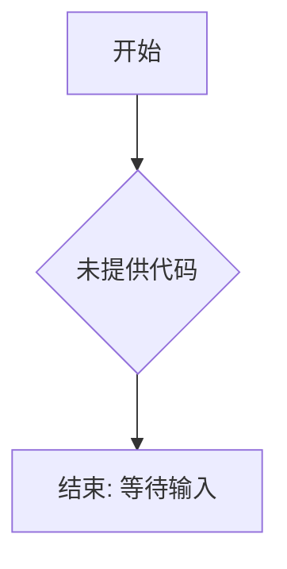

# `diffusers\tests\pipelines\easyanimate\__init__.py` 详细设计文档

未提供代码，无法生成描述。请提供需要分析的源代码。

## 整体流程



## 类结构

```
无类层次结构 - 代码未提供
```

## 全局变量及字段


    

## 全局函数及方法


## 关键组件


## 问题及建议


### 已知问题

-   代码未提供或代码块为空，无法进行技术债务和优化空间的分析

### 优化建议

-   请提供待分析的源代码，以便进行详细的技术债务识别和优化建议
-   提交包含具体业务逻辑的完整代码文件


## 其它


### 1. 一段话描述

（代码未提供，无法生成描述）

### 2. 文件的整体运行流程

（代码未提供，无法生成流程描述）

### 3. 类的详细信息

#### 3.1 类字段

（代码未提供，无法生成类字段信息）

#### 3.2 类方法

（代码未提供，无法生成类方法信息）

### 4. 全局变量和全局函数

#### 4.1 全局变量

（代码未提供，无法生成全局变量信息）

#### 4.2 全局函数

（代码未提供，无法生成全局函数信息）

### 5. 关键组件信息

（代码未提供，无法生成关键组件信息）

### 6. 潜在的技术债务或优化空间

（代码未提供，无法分析技术债务）

### 7. 其它项目

#### 7.1 设计目标与约束

（代码未提供，无法描述设计目标与约束）

#### 7.2 错误处理与异常设计

（代码未提供，无法描述错误处理机制）

#### 7.3 数据流与状态机

（代码未提供，无法描述数据流与状态机）

#### 7.4 外部依赖与接口契约

（代码未提供，无法描述外部依赖与接口契约）

#### 7.5 性能考虑与资源管理

（代码未提供，无法描述性能与资源管理）

#### 7.6 安全考虑与权限控制

（代码未提供，无法描述安全与权限控制）

#### 7.7 测试策略与覆盖范围

（代码未提供，无法描述测试策略）

#### 7.8 部署与配置要求

（代码未提供，无法描述部署配置）


    