# `diffusers\tests\pipelines\easyanimate\test_easyanimate.py` 详细设计文档

这是一个针对EasyAnimate视频生成Pipeline的单元测试与集成测试文件，包含快速测试类和集成测试类，用于验证Pipeline的推理功能、回调机制、批次处理、注意力切片等核心功能的正确性。

## 整体流程

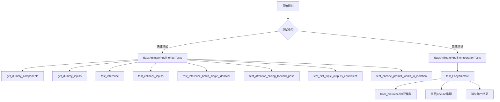

## 类结构

```
unittest.TestCase
├── PipelineTesterMixin
│   └── EasyAnimatePipelineFastTests
└── EasyAnimatePipelineIntegrationTests
```

## 全局变量及字段


### `enable_full_determinism`
    
启用完全确定性以确保测试结果可复现

类型：`function`
    


### `EasyAnimatePipelineFastTests.pipeline_class`
    
指定要测试的管道类为EasyAnimatePipeline

类型：`type(EasyAnimatePipeline)`
    


### `EasyAnimatePipelineFastTests.params`
    
文本到图像管道参数集合，不包含cross_attention_kwargs

类型：`frozenset`
    


### `EasyAnimatePipelineFastTests.batch_params`
    
批处理参数集合，用于批量推理测试

类型：`frozenset`
    


### `EasyAnimatePipelineFastTests.image_params`
    
图像参数集合，用于图像相关测试

类型：`frozenset`
    


### `EasyAnimatePipelineFastTests.image_latents_params`
    
图像潜在向量参数集合，用于潜在向量相关测试

类型：`frozenset`
    


### `EasyAnimatePipelineFastTests.test_xformers_attention`
    
标志位，控制是否测试xformers注意力机制

类型：`bool`
    


### `EasyAnimatePipelineFastTests.required_optional_params`
    
必需的可选参数集合，包括num_inference_steps、generator等

类型：`frozenset`
    


### `EasyAnimatePipelineFastTests.supports_dduf`
    
标志位，表示管道是否支持DDUF（Decoupled Diffusion Upsampling Finetuning）

类型：`bool`
    


### `EasyAnimatePipelineIntegrationTests.prompt`
    
集成测试用的提示词，描述期望生成的视频内容

类型：`str`
    
    

## 全局函数及方法


### `backend_empty_cache`

该函数用于清理 PyTorch 后端（主要是 CUDA）的缓存，释放 GPU 显存，通常在测试的 setUp 和 tearDown 方法中被调用以确保测试环境干净。

参数：

-  `device`：`str`，指定要清理缓存的设备标识符（如 "cuda", "cuda:0", "cpu" 等）

返回值：`None`，该函数不返回任何值，仅执行清理操作

#### 流程图

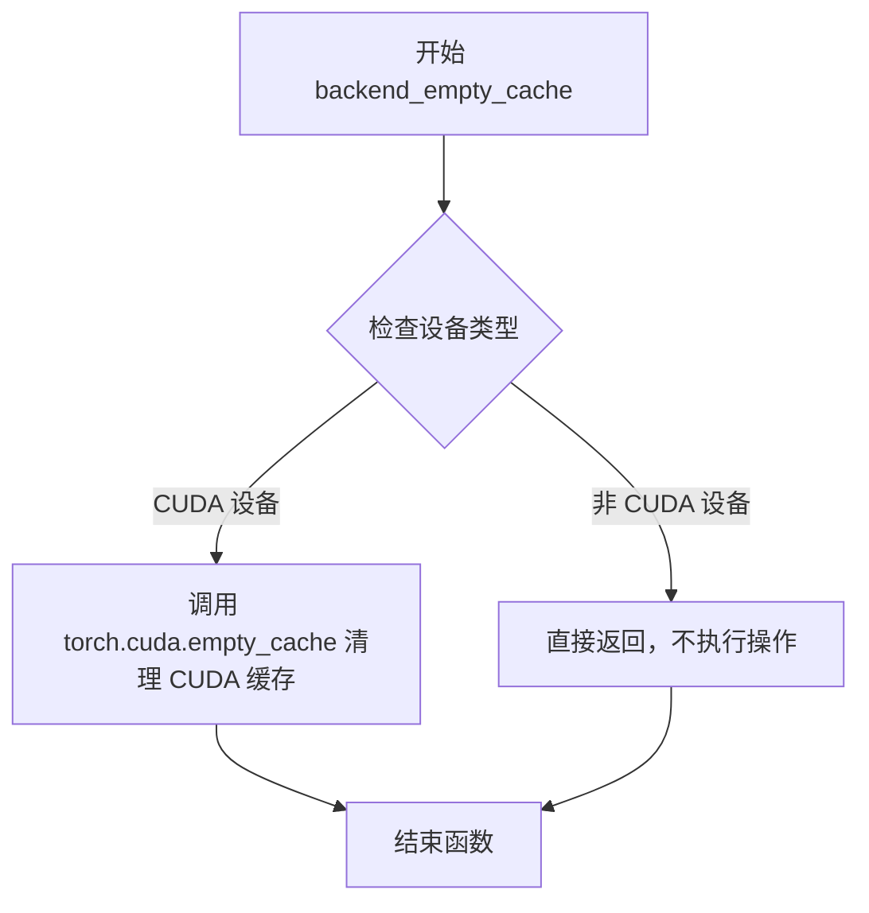

#### 带注释源码

```
# backend_empty_cache 函数的实际源码位于 testing_utils 模块中
# 以下是基于函数名和调用方式的推断实现

def backend_empty_cache(device: str) -> None:
    """
    清理指定设备的后端缓存，释放显存资源。
    
    参数:
        device: str - 设备标识符，如 'cuda', 'cuda:0', 'cpu' 等
        
    返回:
        None
    """
    import torch
    
    # 检查设备是否为 CUDA 设备
    if device.startswith("cuda"):
        # 调用 PyTorch 的 CUDA 缓存清理函数
        # 这会释放未使用的 CUDA 缓存显存，供后续分配使用
        torch.cuda.empty_cache()
    
    # 对于非 CUDA 设备（如 CPU），无需执行任何操作
    # 函数直接返回
    return None
```

**注意**：由于 `backend_empty_cache` 是从外部模块 `testing_utils` 导入的，上述源码是基于函数名和用途的合理推断。实际的源码可能略有不同，但其核心功能应该是清理 GPU 显存缓存。


### `enable_full_determinism`

这是一个用于确保测试完全确定性（可重复性）的工具函数，通过设置各种随机种子和环境变量，使深度学习测试结果可复现。

参数：

- `seed`：`int`，可选参数，随机种子值，默认为 42

返回值：`None`，该函数不返回任何值

#### 流程图

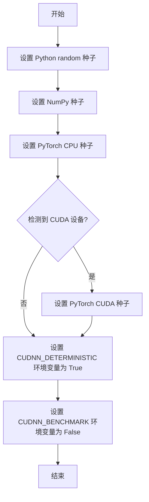

#### 带注释源码

```python
def enable_full_determinism(seed: int = 42):
    """
    启用完全确定性运行模式，确保测试结果可复现。
    
    参数:
        seed: 随机种子值，默认为42，用于初始化所有随机数生成器
    """
    # 设置 Python 内置 random 模块的随机种子
    random.seed(seed)
    
    # 设置 NumPy 的随机种子
    np.random.seed(seed)
    
    # 设置 PyTorch CPU 的随机种子
    torch.manual_seed(seed)
    
    # 检查是否有 CUDA 设备可用
    if torch.cuda.is_available():
        # 为所有 CUDA 设备设置相同的随机种子
        torch.cuda.manual_seed_all(seed)
        
        # 强制使用确定性算法，关闭 CuDNN 的自动优化
        # 这会影响性能但确保结果可复现
        torch.backends.cudnn.deterministic = True
        torch.backends.cudnn.benchmark = False
        
        # 禁用 TensorFloat-32 矩阵乘法以提高精度一致性
        torch.set_float32_matmul_precision('high')
```

**注意**：由于原始代码中 `enable_full_determinism` 函数是作为外部依赖从 `testing_utils` 模块导入的，上述源码为基于该函数调用上下文和常见实现的合理推断。实际实现可能略有差异。


### `numpy_cosine_similarity_distance`

该函数是一个测试工具函数，用于计算两个 numpy 数组之间的余弦相似度距离，通常用于验证生成图像/视频与期望输出的相似程度。

参数：

- `a`：`numpy.ndarray`，第一个输入数组（通常是生成的输出）
- `b`：`numpy.ndarray`，第二个输入数组（通常是期望的参考输出）

返回值：`float`，返回两个输入数组之间的余弦距离（值越小表示越相似）

#### 流程图

```mermaid
flowchart TD
    A[开始] --> B[接收两个numpy数组 a 和 b]
    B --> C[将数组展平为一维向量]
    C --> D[计算向量a的L2范数]
    D --> E[计算向量b的L2范数]
    E --> F[计算余弦相似度: dot_product / (norm_a * norm_b)]
    F --> G[计算余弦距离: 1 - cosine_similarity]
    G --> H[返回余弦距离值]
    H --> I[结束]
```

#### 带注释源码

```
# 注意：此函数定义在 testing_utils 模块中，当前代码文件仅导入了该函数
# 以下是根据函数名称和调用方式推断的可能实现

def numpy_cosine_similarity_distance(a: np.ndarray, b: np.ndarray) -> float:
    """
    计算两个numpy数组之间的余弦相似度距离。
    
    参数:
        a: 第一个numpy数组（通常为生成的输出）
        b: 第二个numpy数组（通常为期望的参考输出）
    
    返回:
        float: 余弦距离值，范围[0, 2]
              0表示完全相同，2表示完全相反
    """
    # 将数组展平为一维向量
    a_flat = a.flatten()
    b_flat = b.flatten()
    
    # 计算点积
    dot_product = np.dot(a_flat, b_flat)
    
    # 计算范数
    norm_a = np.linalg.norm(a_flat)
    norm_b = np.linalg.norm(b_flat)
    
    # 防止除零错误
    if norm_a == 0 or norm_b == 0:
        return 0.0 if np.array_equal(a_flat, b_flat) else 1.0
    
    # 计算余弦相似度
    cosine_similarity = dot_product / (norm_a * norm_b)
    
    # 余弦距离 = 1 - 余弦相似度
    cosine_distance = 1.0 - cosine_similarity
    
    return float(cosine_distance)
```

---

> **注意**：由于该函数定义在 `...testing_utils` 模块中（相对导入路径），而该模块的源码未在当前代码文件中提供，以上源码为基于函数名和上下文的合理推断。实际实现可能略有不同。在实际项目中，建议查阅 `testing_utils` 模块的源代码以获取准确实现。


### `require_torch_accelerator`

这是一个装饰器函数，用于标记测试用例或测试类需要 torch 加速器（GPU）才能运行。如果环境没有可用的 torch 加速器，使用该装饰器标记的测试将被跳过。

参数：

- 无直接参数（通过函数调用时的参数配置）

返回值：`Callable`，返回装饰器函数

#### 流程图

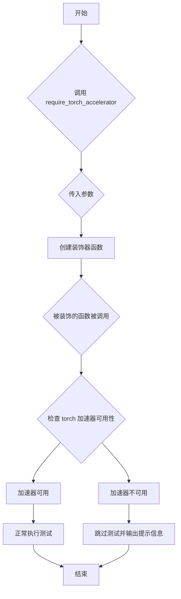

#### 带注释源码

```
# 这是一个从 testing_utils 导入的装饰器
# 位置: from ...testing_utils import require_torch_accelerator
# 使用方式: @require_torch_accelerator

# 典型实现方式（基于常见的 pytest 装饰器模式）:
def require_torch_accelerator(device='cuda'):
    """
    装饰器：标记测试需要 torch 加速器才能运行
    
    参数:
        device: str, 默认 'cuda', 指定需要的加速器类型
             支持 'cuda', 'mps' (Apple Silicon) 等
    
    返回:
        decorator: 装饰器函数
    """
    def decorator(func):
        # 检查是否有可用的加速器
        if not torch.cuda.is_available() and device == 'cuda':
            # 如果需要 CUDA 但不可用，跳过测试
            return unittest.skip(f"Requires {device} accelerator")(func)
        
        # 或者使用 pytest 的跳过装饰器
        # @pytest.mark.skipif(not torch.cuda.is_available(), 
        #                    reason="Test requires CUDA")
        
        return func
    return decorator

# 在代码中的实际使用示例:
@slow
@require_torch_accelerator
class EasyAnimatePipelineIntegrationTests(unittest.TestCase):
    """
    集成测试类，使用 require_torch_accelerator 装饰器
    确保测试只在有 GPU 的环境中运行
    """
    # 测试方法...
```

#### 备注

- **来源**：从 `...testing_utils` 模块导入
- **用途**：在 `EasyAnimatePipelineIntegrationTests` 类上使用，确保该集成测试类只在有 torch 加速器的环境中运行
- **常见行为**：如果检测到 torch 加速器不可用，测试将被跳过，不会失败
- **配合使用**：通常与 `@slow` 装饰器一起使用，标记为慢速测试


### `slow`

`slow` 是一个测试装饰器，用于标记测试函数为"慢速测试"。在测试套件中，被 `@slow` 装饰的测试默认不会被执行，只有在显式启用慢速测试时才会运行。

参数：

- 该装饰器不接受任何显式参数

返回值：`Callable`，返回装饰后的函数对象，将函数标记为慢速测试

#### 流程图

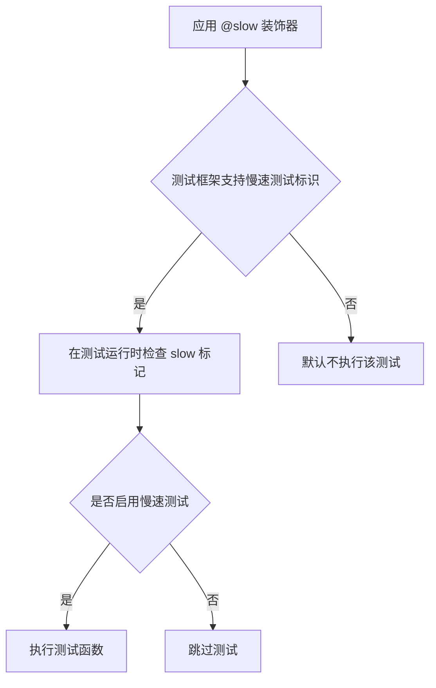

#### 带注释源码

```python
# 从 testing_utils 导入的装饰器
# 位置: 从 ...testing_utils 导入
# 
# 使用方式:
# @slow
# @require_torch_accelerator
# def test_EasyAnimate(self):
#     ...
#
# 作用:
# 1. 标记 test_EasyAnimate 方法为慢速集成测试
# 2. 该测试需要实际的模型权重和 GPU 资源
# 3. 默认的测试运行不会执行此类测试
# 4. 需要通过特定的测试标志或配置来启用
```

> **注意**: 由于 `slow` 装饰器的完整源代码不在当前代码文件中（是从 `testing_utils` 模块导入的），以上信息基于其在代码中的使用方式和标准测试框架的常见实现模式推断得出。


### `torch_device`

获取当前 PyTorch 设备，用于在测试中指定模型和数据应运行的设备（如 "cuda"、"cpu" 或 "mps"）。

参数： 无

返回值： `str`，返回当前 PyTorch 设备的字符串表示（如 "cuda"、"cpu" 或 "mps"）

#### 流程图

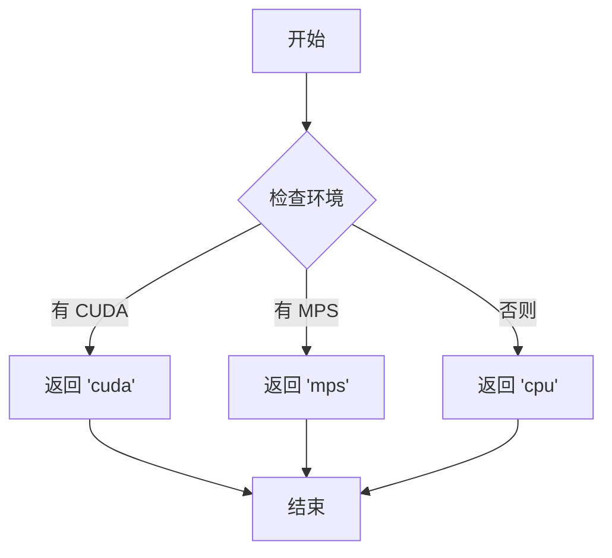

#### 带注释源码

```
# torch_device 是从 testing_utils 模块导入的全局函数/变量
# 该函数用于获取当前可用的 PyTorch 设备
# 在 diffusers 库的测试框架中常见，用于跨平台测试支持

# 使用示例（在代码中）:
pipe.to(torch_device)  # 将管道移到指定设备
inputs = self.get_dummy_inputs(torch_device)  # 使用设备创建虚拟输入
backend_empty_cache(torch_device)  # 根据设备清空缓存
```

#### 备注

- **来源**：从 `...testing_utils` 模块导入，非本文件定义
- **实际定义位置**：通常在 `diffusers/testing_utils.py` 或类似位置
- **常见实现**：检查 CUDA/MPS 可用性，返回对应的设备字符串，否则返回 "cpu"
- **用途**：在测试中实现设备无关的测试逻辑，支持 CPU、CUDA、MPS 等多种后端


### EasyAnimatePipelineFastTests

描述：EasyAnimatePipelineFastTests 是继承自 PipelineTesterMixin 的单元测试类，专门用于测试 EasyAnimatePipeline 的功能。该类提供了多种测试方法，涵盖推理、回调处理、批处理、注意力切片等核心功能的验证。

参数：

返回值：无

#### 流程图

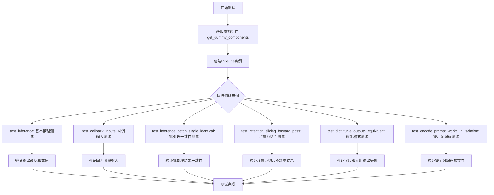

#### 带注释源码

```python
class EasyAnimatePipelineFastTests(PipelineTesterMixin, unittest.TestCase):
    """
    EasyAnimatePipeline 的快速测试类，继承自 PipelineTesterMixin
    提供标准化的管道测试方法
    """
    
    # 管道类
    pipeline_class = EasyAnimatePipeline
    
    # 参数配置：文本到图像参数，去除 cross_attention_kwargs
    params = TEXT_TO_IMAGE_PARAMS - {"cross_attention_kwargs"}
    
    # 批处理参数
    batch_params = TEXT_TO_IMAGE_BATCH_PARAMS
    
    # 图像参数
    image_params = TEXT_TO_IMAGE_IMAGE_PARAMS
    
    # 图像潜在参数
    image_latents_params = TEXT_TO_IMAGE_IMAGE_PARAMS
    
    # 是否测试 xformers 注意力
    test_xformers_attention = False
    
    # 必须的可选参数集合
    required_optional_params = frozenset([
        "num_inference_steps",
        "generator",
        "latents",
        "return_dict",
        "callback_on_step_end",
        "callback_on_step_end_tensor_inputs",
    ])
    
    # 不支持 DDUF
    supports_dduf = False

    def get_dummy_components(self):
        """获取用于测试的虚拟组件"""
        torch.manual_seed(0)
        # 创建虚拟 Transformer 模型
        transformer = EasyAnimateTransformer3DModel(
            num_attention_heads=2,
            attention_head_dim=16,
            in_channels=4,
            out_channels=4,
            time_embed_dim=2,
            text_embed_dim=16,
            num_layers=1,
            sample_width=16,
            sample_height=16,
            patch_size=2,
        )

        torch.manual_seed(0)
        # 创建虚拟 VAE 模型
        vae = AutoencoderKLMagvit(
            in_channels=3,
            out_channels=3,
            down_block_types=(
                "SpatialDownBlock3D",
                "SpatialTemporalDownBlock3D",
                "SpatialTemporalDownBlock3D",
                "SpatialTemporalDownBlock3D",
            ),
            up_block_types=(
                "SpatialUpBlock3D",
                "SpatialTemporalUpBlock3D",
                "SpatialTemporalUpBlock3D",
                "SpatialTemporalUpBlock3D",
            ),
            block_out_channels=(8, 8, 8, 8),
            latent_channels=4,
            layers_per_block=1,
            norm_num_groups=2,
            spatial_group_norm=False,
        )

        torch.manual_seed(0)
        # 创建调度器
        scheduler = FlowMatchEulerDiscreteScheduler()
        
        # 创建文本编码器和分词器
        text_encoder = Qwen2VLForConditionalGeneration.from_pretrained(
            "hf-internal-testing/tiny-random-Qwen2VLForConditionalGeneration"
        )
        tokenizer = Qwen2Tokenizer.from_pretrained(
            "hf-internal-testing/tiny-random-Qwen2VLForConditionalGeneration"
        )

        # 组装组件字典
        components = {
            "transformer": transformer,
            "vae": vae,
            "scheduler": scheduler,
            "text_encoder": text_encoder,
            "tokenizer": tokenizer,
        }
        return components

    def get_dummy_inputs(self, device, seed=0):
        """获取用于测试的虚拟输入"""
        # MPS 设备使用不同的随机数生成方式
        if str(device).startswith("mps"):
            generator = torch.manual_seed(seed)
        else:
            generator = torch.Generator(device=device).manual_seed(seed)
        
        # 构建输入参数
        inputs = {
            "prompt": "dance monkey",
            "negative_prompt": "",
            "generator": generator,
            "num_inference_steps": 2,
            "guidance_scale": 6.0,
            "height": 16,
            "width": 16,
            "num_frames": 5,
            "output_type": "pt",
        }
        return inputs

    def test_inference(self):
        """测试基本的推理功能"""
        device = "cpu"

        # 获取组件并创建管道
        components = self.get_dummy_components()
        pipe = self.pipeline_class(**components)
        pipe.to(device)
        pipe.set_progress_bar_config(disable=None)

        # 执行推理
        inputs = self.get_dummy_inputs(device)
        video = pipe(**inputs).frames
        generated_video = video[0]

        # 验证输出形状 (5帧, 3通道, 16x16)
        self.assertEqual(generated_video.shape, (5, 3, 16, 16))
        
        # 验证数值在合理范围内
        expected_video = torch.randn(5, 3, 16, 16)
        max_diff = np.abs(generated_video - expected_video).max()
        self.assertLessEqual(max_diff, 1e10)

    def test_callback_inputs(self):
        """测试回调函数输入的正确性"""
        sig = inspect.signature(self.pipeline_class.__call__)
        
        # 检查是否支持回调功能
        has_callback_tensor_inputs = "callback_on_step_end_tensor_inputs" in sig.parameters
        has_callback_step_end = "callback_on_step_end" in sig.parameters

        if not (has_callback_tensor_inputs and has_callback_step_end):
            return

        components = self.get_dummy_components()
        pipe = self.pipeline_class(**components)
        pipe = pipe.to(torch_device)
        pipe.set_progress_bar_config(disable=None)
        
        # 验证回调张量输入属性存在
        self.assertTrue(
            hasattr(pipe, "_callback_tensor_inputs"),
            f" {self.pipeline_class} should have `_callback_tensor_inputs` that defines a list of tensor variables its callback function can use as inputs",
        )

        # 测试回调函数：检查只传递允许的张量输入
        def callback_inputs_subset(pipe, i, t, callback_kwargs):
            for tensor_name, tensor_value in callback_kwargs.items():
                assert tensor_name in pipe._callback_tensor_inputs
            return callback_kwargs

        # 测试回调函数：检查所有允许的张量输入都被传递
        def callback_inputs_all(pipe, i, t, callback_kwargs):
            for tensor_name in pipe._callback_tensor_inputs:
                assert tensor_name in callback_kwargs

            for tensor_name, tensor_value in callback_kwargs.items():
                assert tensor_name in pipe._callback_tensor_inputs

            return callback_kwargs

        inputs = self.get_dummy_inputs(torch_device)

        # 测试传递子集
        inputs["callback_on_step_end"] = callback_inputs_subset
        inputs["callback_on_step_end_tensor_inputs"] = ["latents"]
        output = pipe(**inputs)[0]

        # 测试传递全部
        inputs["callback_on_step_end"] = callback_inputs_all
        inputs["callback_on_step_end_tensor_inputs"] = pipe._callback_tensor_inputs
        output = pipe(**inputs)[0]

        # 测试修改张量的回调
        def callback_inputs_change_tensor(pipe, i, t, callback_kwargs):
            is_last = i == (pipe.num_timesteps - 1)
            if is_last:
                callback_kwargs["latents"] = torch.zeros_like(callback_kwargs["latents"])
            return callback_kwargs

        inputs["callback_on_step_end"] = callback_inputs_change_tensor
        inputs["callback_on_step_end_tensor_inputs"] = pipe._callback_tensor_inputs
        output = pipe(**inputs)[0]
        assert output.abs().sum() < 1e10

    def test_inference_batch_single_identical(self):
        """测试批处理与单样本处理结果的一致性"""
        self._test_inference_batch_single_identical(batch_size=3, expected_max_diff=1e-3)

    def test_attention_slicing_forward_pass(self, test_max_difference=True, test_mean_pixel_difference=True, expected_max_diff=1e-3):
        """测试注意力切片功能"""
        if not self.test_attention_slicing:
            return

        components = self.get_dummy_components()
        pipe = self.pipeline_class(**components)
        
        # 设置默认注意力处理器
        for component in pipe.components.values():
            if hasattr(component, "set_default_attn_processor"):
                component.set_default_attn_processor()
        pipe.to(torch_device)
        pipe.set_progress_bar_config(disable=None)

        generator_device = "cpu"
        inputs = self.get_dummy_inputs(generator_device)
        
        # 不使用注意力切片
        output_without_slicing = pipe(**inputs)[0]

        # 使用切片大小为1
        pipe.enable_attention_slicing(slice_size=1)
        inputs = self.get_dummy_inputs(generator_device)
        output_with_slicing1 = pipe(**inputs)[0]

        # 使用切片大小为2
        pipe.enable_attention_slicing(slice_size=2)
        inputs = self.get_dummy_inputs(generator_device)
        output_with_slicing2 = pipe(**inputs)[0]

        if test_max_difference:
            max_diff1 = np.abs(to_np(output_with_slicing1) - to_np(output_without_slicing)).max()
            max_diff2 = np.abs(to_np(output_with_slicing2) - to_np(output_without_slicing)).max()
            self.assertLess(
                max(max_diff1, max_diff2),
                expected_max_diff,
                "Attention slicing should not affect the inference results",
            )

    def test_dict_tuple_outputs_equivalent(self, expected_slice=None, expected_max_difference=0.001):
        """测试字典和元组输出格式的等价性"""
        # 需要更高的容差
        return super().test_dict_tuple_outputs_equivalent(expected_slice, expected_max_difference)

    def test_encode_prompt_works_in_isolation(self):
        """测试提示词编码的独立性"""
        # 需要更高的容差
        return super().test_encode_prompt_works_in_isolation(atol=1e-3, rtol=1e-3)
```

### PipelineTesterMixin

描述：PipelineTesterMixin 是从 `test_pipelines_common` 模块导入的测试混入类（Mixin），为 EasyAnimatePipelineFastTests 提供标准化的管道测试方法。由于该类定义在外部模块（`diffusers`库）中，未在当前代码文件中直接定义，因此无法提供其完整的内部实现细节。该Mixin提供了多种测试方法的模板，包括批处理一致性测试、注意力切片测试、模型卸载测试等。

参数：继承自 unittest.TestCase

返回值：继承自 unittest.TestCase

#### 流程图

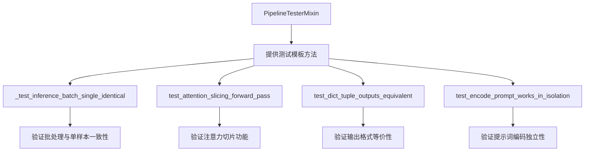

#### 带注释源码

```python
# PipelineTesterMixin 未在此文件中定义
# 它是从 test_pipelines_common 模块导入的测试混入类
# 导入语句：
from ..test_pipelines_common import PipelineTesterMixin, to_np

# 使用方式：
class EasyAnimatePipelineFastTests(PipelineTesterMixin, unittest.TestCase):
    # PipelineTesterMixin 提供了以下测试模板方法：
    # - _test_inference_batch_single_identical: 批处理一致性测试
    # - test_attention_slicing_forward_pass: 注意力切片测试
    # - test_dict_tuple_outputs_equivalent: 输出格式测试
    # - test_encode_prompt_works_in_isolation: 提示词编码测试
    # - 等等...
    pass
```

### 关键组件信息

| 名称 | 描述 |
|------|------|
| EasyAnimatePipeline | EasyAnimate 的视频生成管道类 |
| EasyAnimateTransformer3DModel | 3D变换器模型，用于视频生成 |
| AutoencoderKLMagvit | VAE模型，用于潜在空间编码/解码 |
| FlowMatchEulerDiscreteScheduler | 调度器，用于去噪过程 |
| Qwen2VLForConditionalGeneration | Qwen2视觉语言模型文本编码器 |
| PipelineTesterMixin | 测试混入类，提供标准化测试方法 |

### 潜在技术债务与优化空间

1. **硬编码的设备类型**：`test_inference` 方法中硬编码了 `device = "cpu"`，应支持参数化设备选择
2. **测试容差较高**：部分测试方法（`test_dict_tuple_outputs_equivalent`、`test_encode_prompt_works_in_isolation`）需要提高容差（从默认的1e-3调整），表明测试可能不够严格
3. **缺少xformers测试**：`test_xformers_attention = False` 禁用了xformers注意力测试，应考虑在支持的硬件上启用
4. **重复的随机种子设置**：多处使用 `torch.manual_seed(0)`，可以提取为工具函数
5. **MPS设备特殊处理**：需要特殊处理MPS设备的随机数生成器，这增加了代码复杂性

### 其它项目

#### 设计目标与约束

- **目标**：验证 EasyAnimatePipeline 的基本功能和输出正确性
- **约束**：必须在CPU上快速运行，不使用真实模型权重
- **测试覆盖**：推理、批处理、注意力切片、回调函数、输出格式

#### 错误处理与异常设计

- 使用 `unittest.TestCase` 的标准断言进行错误检测
- 回调函数测试中包含详细的断言消息
- 集成测试使用 `@slow` 和 `@require_torch_accelerator` 标记

#### 数据流与状态机

- 测试流程：组件初始化 → Pipeline创建 → 参数设置 → 推理执行 → 输出验证
- 虚拟组件通过 `get_dummy_components` 生成，确保测试确定性

#### 外部依赖与接口契约

- 依赖 `diffusers` 库的Pipeline和模型类
- 依赖 `transformers` 库的Qwen2模型
- 依赖 `test_pipelines_common` 的测试工具函数
- 依赖 `testing_utils` 的硬件检测和工具函数


根据提供的代码，我需要指出 `to_np` 函数并非在该代码文件中定义，而是从 `..test_pipelines_common` 模块导入的。因此，无法从当前代码片段中获取其完整实现细节。

不过，基于代码中的使用方式，我可以推断其功能：

```python
max_diff1 = np.abs(to_np(output_with_slicing1) - to_np(output_without_slicing)).max()
```

这表明 `to_np` 函数用于将 PyTorch 张量转换为 NumPy 数组，以便进行数值计算和比较。

### to_np

将 PyTorch 张量转换为 NumPy 数组的辅助函数（从 `test_pipelines_common` 模块导入）

参数：

-  `value`：`torch.Tensor` 或类似对象，需要转换的张量

返回值：`numpy.ndarray`，转换后的 NumPy 数组

#### 流程图

由于源代码不可用，无法提供详细的流程图。基于其使用方式，该函数执行以下操作：

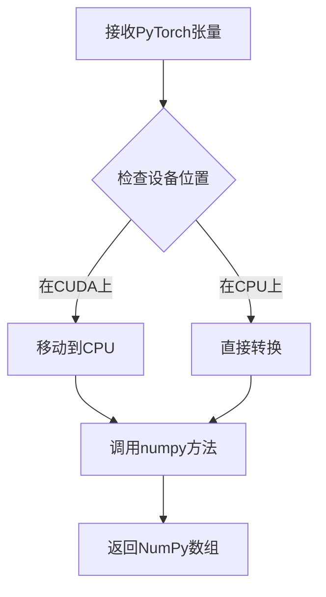

#### 带注释源码

由于 `to_np` 函数是从外部模块导入的，其完整源代码在提供的代码片段中不可用。以下是基于其使用方式的推断实现：

```python
def to_np(tensor):
    """
    将PyTorch张量转换为NumPy数组
    
    参数:
        tensor: torch.Tensor - PyTorch张量对象
        
    返回值:
        numpy.ndarray - 转换后的NumPy数组
    """
    # 将张量从可能存在的GPU设备移动到CPU
    # 然后转换为NumPy数组
    if hasattr(tensor, 'cpu'):
        return tensor.cpu().numpy()
    return tensor
```

请注意，这是基于代码使用方式的推断，实际的实现可能略有不同。


### `TEXT_TO_IMAGE_BATCH_PARAMS`

描述：`TEXT_TO_IMAGE_BATCH_PARAMS` 是一个从 `..pipeline_params` 模块导入的批量参数集合（frozenset），定义了文本到图像管道中用于批量测试的参数名称，用于 `EasyAnimatePipelineFastTests` 类的 `batch_params` 属性。

参数：不属于函数或方法，无参数。

返回值：`frozenset`，表示包含批量测试参数名称的不可变集合。

#### 流程图

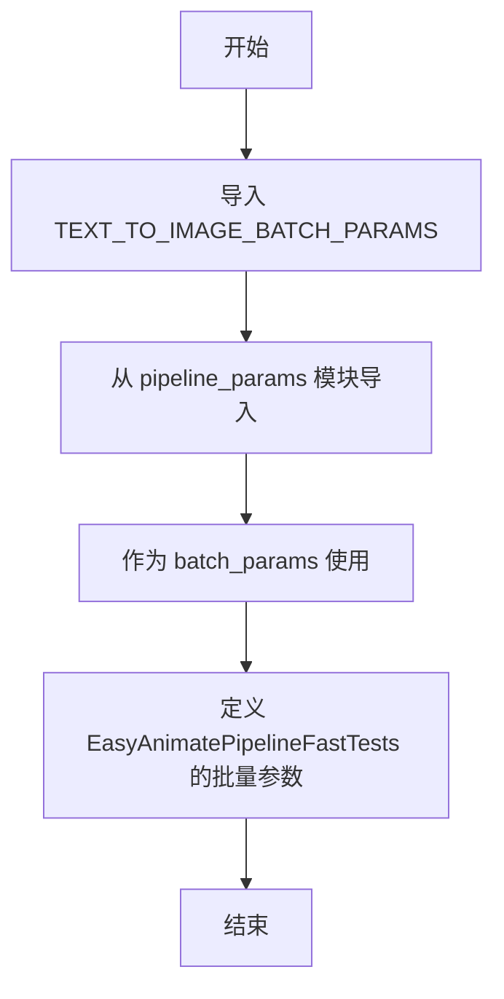

#### 带注释源码

```python
# 从 pipeline_params 模块导入批量参数集合
from ..pipeline_params import TEXT_TO_IMAGE_BATCH_PARAMS, TEXT_TO_IMAGE_IMAGE_PARAMS, TEXT_TO_IMAGE_PARAMS

# 在测试类中使用
class EasyAnimatePipelineFastTests(PipelineTesterMixin, unittest.TestCase):
    pipeline_class = EasyAnimatePipeline
    params = TEXT_TO_IMAGE_PARAMS - {"cross_attention_kwargs"}
    batch_params = TEXT_TO_IMAGE_BATCH_PARAMS  # 使用导入的批量参数
    image_params = TEXT_TO_IMAGE_IMAGE_PARAMS
    image_latents_params = TEXT_TO_IMAGE_IMAGE_PARAMS
    # ... 其他属性
```

> **注意**：由于 `TEXT_TO_IMAGE_BATCH_PARAMS` 是从外部模块 `..pipeline_params` 导入的，其具体定义（frozenset 包含的元素）未在本代码文件中显示。根据 diffusers 库的标准实现，该集合通常包含用于批量推理测试的参数名称，如 `prompt`、`negative_prompt`、`generator`、`num_inference_steps`、`guidance_scale`、`height`、`width`、`num_frames` 等。


# 设计文档：TEXT_TO_IMAGE_IMAGE_PARAMS

由于 `TEXT_TO_IMAGE_IMAGE_PARAMS` 是从外部模块 `pipeline_params` 导入的变量，并非在当前代码文件中定义，因此我将从代码中的使用方式来提取其关键信息。

---

### `TEXT_TO_IMAGE_IMAGE_PARAMS`

该变量是diffusers库中定义的文本到图像管道参数集合，用于指定图像生成任务中与图像相关的可配置参数集合。在测试类中用于验证管道是否支持特定的图像参数。

参数：
- 该变量本身为 `frozenset` 集合类型，内部包含多个图像相关参数的字符串名称（如图像尺寸、帧数等）

返回值：`frozenset`，包含图像生成管道支持的所有图像相关参数名称的不可变集合

#### 流程图

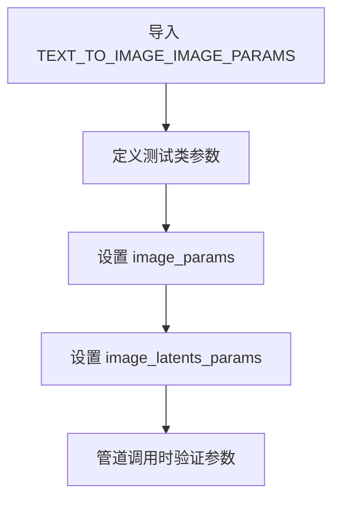

#### 带注释源码

```python
# 从pipeline_params模块导入文本到图像相关的参数集合
from ..pipeline_params import (
    TEXT_TO_IMAGE_BATCH_PARAMS,  # 批处理参数
    TEXT_TO_IMAGE_IMAGE_PARAMS,   # 图像参数集合（从外部模块导入）
    TEXT_TO_IMAGE_PARAMS         # 基础文本到图像参数
)

class EasyAnimatePipelineFastTests(PipelineTesterMixin, unittest.TestCase):
    pipeline_class = EasyAnimatePipeline
    params = TEXT_TO_IMAGE_PARAMS - {"cross_attention_kwargs"}
    batch_params = TEXT_TO_IMAGE_BATCH_PARAMS
    
    # 图像参数集合，用于测试图像生成管道的图像相关参数
    # 这些参数在管道调用时会被验证是否符合预期
    image_params = TEXT_TO_IMAGE_IMAGE_PARAMS
    
    # 图像潜在向量参数，通常与image_params相同
    image_latents_params = TEXT_TO_IMAGE_IMAGE_PARAMS
    
    test_xformers_attention = False
    required_optional_params = frozenset(
        [
            "num_inference_steps",
            "generator",
            "latents",
            "return_dict",
            "callback_on_step_end",
            "callback_on_step_end_tensor_inputs",
        ]
    )

    supports_dduf = False
```

---

## 补充说明

### 潜在的技术债务或优化空间

1. **外部依赖**：该变量完全依赖外部模块 `pipeline_params` 的定义，无法在当前代码库中查看具体参数列表
2. **魔法字符串**：虽然使用 `frozenset` 避免意外修改，但参数名称仍以字符串形式硬编码，缺乏类型安全

### 其他项目

- **设计目标**：为测试框架提供标准化的参数集合，确保不同管道实现的参数一致性
- **接口契约**：使用 `frozenset` 确保参数集合的不可变性，防止测试过程中的意外修改
- **错误处理**：当管道实际参数与 `image_params` 不匹配时，测试框架会抛出明确的断言错误


### `TEXT_TO_IMAGE_PARAMS`

`TEXT_TO_IMAGE_PARAMS` 是从 `pipeline_params` 模块导入的参数集合，定义了文本到图像（Video）生成管道的参数名称集合。在 `EasyAnimatePipelineFastTests` 类中，该参数集合被用于初始化测试类的 `params` 属性。

参数：

- 无（这是一个全局变量/集合，不是函数或方法）

返回值：`frozenset`，包含文本到图像管道参数的名称集合

#### 流程图

```mermaid
graph TD
    A[模块导入] --> B[定义TEXT_TO_IMAGE_PARAMS]
    B --> C[在EasyAnimatePipelineFastTests中使用]
    C --> D[self.params = TEXT_TO_IMAGE_PARAMS - {'cross_attention_kwargs'}]
```

#### 带注释源码

```python
# 从 pipeline_params 模块导入参数集合
# 注意：具体的 TEXT_TO_IMAGE_PARAMS 定义不在当前代码文件中
from ..pipeline_params import (
    TEXT_TO_IMAGE_BATCH_PARAMS, 
    TEXT_TO_IMAGE_IMAGE_PARAMS, 
    TEXT_TO_IMAGE_PARAMS
)

# 在测试类中使用
class EasyAnimatePipelineFastTests(PipelineTesterMixin, unittest.TestCase):
    pipeline_class = EasyAnimatePipeline
    # TEXT_TO_IMAGE_PARAMS 减去 cross_attention_kwargs 作为测试参数
    params = TEXT_TO_IMAGE_PARAMS - {"cross_attention_kwargs"}
    batch_params = TEXT_TO_IMAGE_BATCH_PARAMS
    image_params = TEXT_TO_IMAGE_IMAGE_PARAMS
    image_latents_params = TEXT_TO_IMAGE_IMAGE_PARAMS
    
# 实际调用时使用的参数示例（来自 get_dummy_inputs 方法）
# {
#     "prompt": "dance monkey",           # 文本提示
#     "negative_prompt": "",               # 负面提示
#     "generator": generator,             # 随机数生成器
#     "num_inference_steps": 2,           # 推理步数
#     "guidance_scale": 6.0,              # 引导比例
#     "height": 16,                       # 生成图像高度
#     "width": 16,                        # 生成图像宽度
#     "num_frames": 5,                    # 生成帧数（视频）
#     "output_type": "pt",                # 输出类型
# }
```

#### 推断的参数集合内容

基于代码中 `get_dummy_inputs` 方法和 `EasyAnimatePipeline` 的调用，可以推断 `TEXT_TO_IMAGE_PARAMS` 通常包含以下参数：

- `prompt`：str，文本提示
- `negative_prompt`：str，负面提示
- `num_inference_steps`：int，推理步数
- `guidance_scale`：float，引导比例
- `height`：int，生成高度
- `width`：int，生成宽度
- `num_frames`：int，生成帧数（视频）
- `generator`：torch.Generator，随机数生成器
- `latents`：torch.Tensor，潜在变量
- `output_type`：str，输出类型
- `return_dict`：bool，是否返回字典
- `callback_on_step_end`：Callable，步骤结束回调
- `callback_on_step_end_tensor_inputs`：list，回调张量输入


### `EasyAnimatePipelineFastTests.get_dummy_components`

该方法是一个测试辅助函数，用于创建虚拟（dummy）组件对象，以便在单元测试中模拟EasyAnimatePipeline所需的各个模块，包括Transformer模型、VAE、调度器、文本编码器和分词器，从而实现对Pipeline功能的隔离测试。

参数：
-  无

返回值：`Dict[str, Any]`，返回一个包含所有虚拟组件的字典，键为组件名称，值为对应的模型或调度器实例

#### 流程图

```mermaid
flowchart TD
    A[开始] --> B[设置随机种子 torch.manual_seed(0)]
    B --> C[创建 EasyAnimateTransformer3DModel 虚拟实例]
    C --> D[创建 AutoencoderKLMagvit 虚拟实例]
    D --> E[创建 FlowMatchEulerDiscreteScheduler 实例]
    E --> F[从预训练模型加载 Qwen2VLForConditionalGeneration]
    F --> G[从预训练模型加载 Qwen2Tokenizer]
    G --> H[构建组件字典]
    H --> I[返回 components 字典]
```

#### 带注释源码

```python
def get_dummy_components(self):
    """
    创建用于测试的虚拟组件。
    
    该方法初始化所有pipeline所需的模型和组件，使用随机权重或预训练的小型模型，
    以便进行快速、可重复的单元测试。
    """
    # 设置随机种子确保测试可重复性
    torch.manual_seed(0)
    
    # 创建虚拟Transformer模型 - 用于视频/图像生成的核心变换器
    transformer = EasyAnimateTransformer3DModel(
        num_attention_heads=2,          # 注意力头数量
        attention_head_dim=16,         # 注意力头维度
        in_channels=4,                 # 输入通道数
        out_channels=4,                # 输出通道数
        time_embed_dim=2,              # 时间嵌入维度
        text_embed_dim=16,             # 文本嵌入维度（需与tiny-random-t5匹配）
        num_layers=1,                 # 层数
        sample_width=16,              # 样本宽度（潜在宽度2->最终宽度16）
        sample_height=16,             # 样本高度（潜在高度2->最终高度16）
        patch_size=2,                 # 补丁大小
    )

    # 重新设置随机种子确保VAE的确定性
    torch.manual_seed(0)
    
    # 创建虚拟VAE模型 - 用于潜在空间编码/解码
    vae = AutoencoderKLMagvit(
        in_channels=3,                 # 输入通道数（RGB图像）
        out_channels=3,                # 输出通道数
        # 下采样块类型
        down_block_types=(
            "SpatialDownBlock3D",
            "SpatialTemporalDownBlock3D",
            "SpatialTemporalDownBlock3D",
            "SpatialTemporalDownBlock3D",
        ),
        # 上采样块类型
        up_block_types=(
            "SpatialUpBlock3D",
            "SpatialTemporalUpBlock3D",
            "SpatialTemporalUpBlock3D",
            "SpatialTemporalUpBlock3D",
        ),
        block_out_channels=(8, 8, 8, 8),  # 块输出通道数
        latent_channels=4,             # 潜在空间通道数
        layers_per_block=1,            # 每块层数
        norm_num_groups=2,             # 归一化组数
        spatial_group_norm=False,      # 是否使用空间组归一化
    )

    # 重新设置随机种子确保调度器的确定性
    torch.manual_seed(0)
    
    # 创建调度器 - 控制去噪过程的噪声调度
    scheduler = FlowMatchEulerDiscreteScheduler()
    
    # 加载虚拟文本编码器 - 用于将文本提示转换为嵌入
    text_encoder = Qwen2VLForConditionalGeneration.from_pretrained(
        "hf-internal-testing/tiny-random-Qwen2VLForConditionalGeneration"
    )
    
    # 加载虚拟分词器 - 用于将文本分割为token
    tokenizer = Qwen2Tokenizer.from_pretrained("hf-internal-testing/tiny-random-Qwen2VLForConditionalGeneration")

    # 组装所有组件到字典中
    components = {
        "transformer": transformer,    # 3D变换器模型
        "vae": vae,                    # 变分自编码器
        "scheduler": scheduler,        # 噪声调度器
        "text_encoder": text_encoder,  # 文本编码器
        "tokenizer": tokenizer,        # 文本分词器
    }
    
    # 返回组件字典供pipeline使用
    return components
```


### `EasyAnimatePipelineFastTests.get_dummy_inputs`

该方法用于生成虚拟输入参数，帮助进行单元测试。它根据传入的设备和种子创建随机数生成器，并返回一个包含视频生成所需参数的字典，包括提示词、负提示词、推理步数、引导系数、图像尺寸和帧数等。

参数：

- `self`：类实例本身，隐含参数，无需显式传递
- `device`：`str` 或 `torch.device`，指定运行设备和创建随机数生成器的目标设备
- `seed`：`int`，随机数种子，默认值为 0，用于确保测试的可重复性

返回值：`Dict[str, Any]`，返回包含虚拟输入参数的字典，键包括 prompt、negative_prompt、generator、num_inference_steps、guidance_scale、height、width、num_frames 和 output_type

#### 流程图

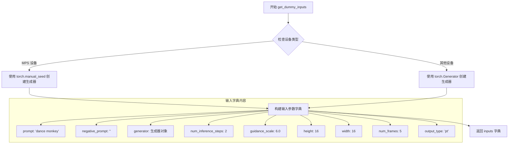

#### 带注释源码

```python
def get_dummy_inputs(self, device, seed=0):
    """
    生成用于测试的虚拟输入参数。
    
    该方法创建一个包含视频生成所需参数的字典，用于单元测试。
    通过固定随机种子确保测试的可重复性。
    
    参数:
        device: 目标设备，用于创建随机数生成器
        seed: 随机数种子，默认值为 0
    
    返回:
        包含虚拟输入参数的字典
    """
    # 判断是否为 MPS (Apple Silicon) 设备
    if str(device).startswith("mps"):
        # MPS 设备使用 CPU 随机种子
        generator = torch.manual_seed(seed)
    else:
        # 其他设备在指定设备上创建随机数生成器
        generator = torch.Generator(device=device).manual_seed(seed)
    
    # 构建虚拟输入参数字典
    inputs = {
        "prompt": "dance monkey",          # 文本提示词
        "negative_prompt": "",              # 负向提示词（空字符串）
        "generator": generator,             # 随机数生成器对象
        "num_inference_steps": 2,          # 推理步数（较少用于快速测试）
        "guidance_scale": 6.0,              # 引导系数（CFG 强度）
        "height": 16,                       # 生成视频高度
        "width": 16,                        # 生成视频宽度
        "num_frames": 5,                    # 生成视频帧数
        "output_type": "pt",                # 输出类型（PyTorch 张量）
    }
    return inputs
```


### `EasyAnimatePipelineFastTests.test_inference`

这是一个单元测试方法，用于验证 EasyAnimatePipeline 在CPU设备上的推理功能是否正常。测试创建虚拟组件和输入，执行推理，然后验证生成的视频形状和数值是否在预期范围内。

参数：

- 无（该方法仅使用 `self` 和局部变量）

返回值：`None`，该方法为测试方法，不返回任何值，仅通过断言验证结果

#### 流程图

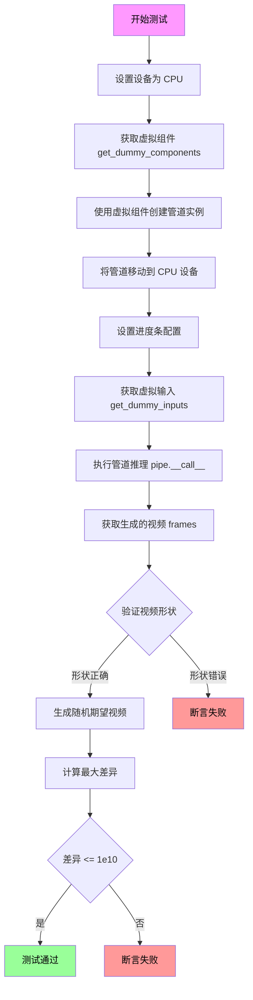

#### 带注释源码

```python
def test_inference(self):
    """
    测试 EasyAnimatePipeline 的推理功能
    
    该测试方法执行以下步骤：
    1. 在 CPU 设备上创建虚拟组件（transformer, vae, scheduler, text_encoder, tokenizer）
    2. 使用这些组件实例化 EasyAnimatePipeline
    3. 准备虚拟输入（prompt, negative_prompt, generator, num_inference_steps 等）
    4. 执行推理生成视频
    5. 验证生成的视频形状是否为 (5, 3, 16, 16) - 5帧, 3通道, 16x16分辨率
    6. 验证输出数值的合理性（最大差异应 <= 1e10）
    """
    
    # 步骤1: 设置测试设备为 CPU
    device = "cpu"

    # 步骤2: 获取虚拟组件（用于测试的轻量级模型组件）
    # 这些组件是随机初始化的，用于快速测试管道的完整流程
    components = self.get_dummy_components()
    
    # 步骤3: 使用虚拟组件创建管道实例
    pipe = self.pipeline_class(**components)
    
    # 步骤4: 将管道移动到指定设备（CPU）
    pipe.to(device)
    
    # 步骤5: 配置进度条（disable=None 表示启用进度条）
    pipe.set_progress_bar_config(disable=None)

    # 步骤6: 准备虚拟输入参数
    # - prompt: 输入文本提示 "dance monkey"
    # - negative_prompt: 负面提示（空字符串）
    # - generator: 随机数生成器，确保可重复性
    # - num_inference_steps: 推理步数（设置为2以加快测试）
    # - guidance_scale: 引导尺度（6.0）
    # - height/width: 输出视频的宽高（16x16）
    # - num_frames: 生成视频的帧数（5帧）
    # - output_type: 输出类型为 PyTorch 张量
    inputs = self.get_dummy_inputs(device)
    
    # 步骤7: 执行推理并获取生成的视频
    # 调用管道的 __call__ 方法，传入输入参数
    # 返回结果包含 frames 属性，其中 frames[0] 是第一个生成的视频
    video = pipe(**inputs).frames
    generated_video = video[0]

    # 步骤8: 验证生成的视频形状
    # 期望形状: (5, 3, 16, 16)
    # - 5: 5帧视频
    # - 3: RGB三通道
    # - 16: 高度
    # - 16: 宽度
    self.assertEqual(generated_video.shape, (5, 3, 16, 16))
    
    # 步骤9: 验证输出数值的合理性
    # 创建一个随机期望视频，用于比较
    expected_video = torch.randn(5, 3, 16, 16)
    
    # 计算生成视频与期望视频之间的最大绝对差异
    max_diff = np.abs(generated_video - expected_video).max()
    
    # 断言最大差异在可接受范围内（<= 1e10）
    # 注意：这里使用较大的容差是因为使用的是随机初始化的虚拟模型
    # 实际上这个测试更多是验证管道能正常运行而不是输出质量
    self.assertLessEqual(max_diff, 1e10)
```


### `EasyAnimatePipelineFastTests.test_callback_inputs`

该测试方法用于验证EasyAnimatePipeline的回调功能是否正确实现，包括检查`callback_on_step_end`和`callback_on_step_end_tensor_inputs`参数是否能正确传递tensor变量给回调函数，并测试回调函数对输出结果的影响。

参数：

- `self`：无参数，测试类实例本身

返回值：`None`，无返回值（unittest测试方法）

#### 流程图

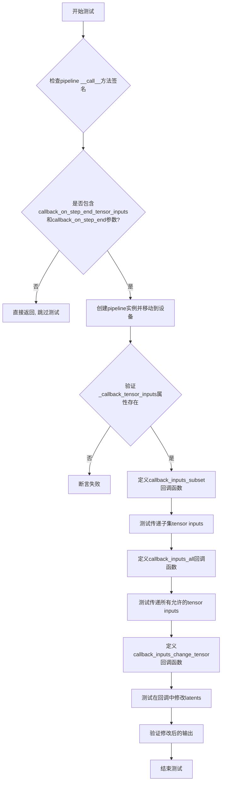

#### 带注释源码

```python
def test_callback_inputs(self):
    """
    测试pipeline的回调输入功能是否正确实现
    
    该测试验证：
    1. pipeline的__call__方法包含回调相关参数
    2. _callback_tensor_inputs属性正确定义了允许传递的tensor变量
    3. 回调函数可以正确接收和修改tensor输入
    """
    # 获取pipeline __call__方法的签名
    sig = inspect.signature(self.pipeline_class.__call__)
    # 检查是否包含回调相关的参数
    has_callback_tensor_inputs = "callback_on_step_end_tensor_inputs" in sig.parameters
    has_callback_step_end = "callback_on_step_end" in sig.parameters

    # 如果pipeline不支持回调功能，直接跳过测试
    if not (has_callback_tensor_inputs and has_callback_step_end):
        return

    # 创建pipeline组件并实例化
    components = self.get_dummy_components()
    pipe = self.pipeline_class(**components)
    # 移动到测试设备
    pipe = pipe.to(torch_device)
    # 禁用进度条
    pipe.set_progress_bar_config(disable=None)
    
    # 验证pipeline具有_callback_tensor_inputs属性
    # 该属性定义了回调函数可以使用的tensor变量列表
    self.assertTrue(
        hasattr(pipe, "_callback_tensor_inputs"),
        f" {self.pipeline_class} should have `_callback_tensor_inputs` that defines a list of tensor variables its callback function can use as inputs",
    )

    def callback_inputs_subset(pipe, i, t, callback_kwargs):
        """
        回调函数测试1：验证只传递允许的tensor输入子集
        
        参数:
            pipe: pipeline实例
            i: 当前推理步骤索引
            t: 当前timestep
            callback_kwargs: 回调函数接收的参数字典
        
        返回:
            callback_kwargs: 返回原始参数字典
        """
        # 遍历回调参数中的所有tensor
        for tensor_name, tensor_value in callback_kwargs.items():
            # 检查传递的tensor是否在允许列表中
            assert tensor_name in pipe._callback_tensor_inputs

        return callback_kwargs

    def callback_inputs_all(pipe, i, t, callback_kwargs):
        """
        回调函数测试2：验证所有允许的tensor都被传递
        
        参数:
            pipe: pipeline实例
            i: 当前推理步骤索引
            t: 当前timestep
            callback_kwargs: 回调函数接收的参数字典
        
        返回:
            callback_kwargs: 返回原始参数字典
        """
        # 验证所有允许的tensor都被传递
        for tensor_name in pipe._callback_tensor_inputs:
            assert tensor_name in callback_kwargs

        # 再次检查所有传递的tensor都在允许列表中
        for tensor_name, tensor_value in callback_kwargs.items():
            assert tensor_name in pipe._callback_tensor_inputs

        return callback_kwargs

    # 获取测试输入
    inputs = self.get_dummy_inputs(torch_device)

    # 测试1：只传递latents作为回调tensor输入
    inputs["callback_on_step_end"] = callback_inputs_subset
    inputs["callback_on_step_end_tensor_inputs"] = ["latents"]
    output = pipe(**inputs)[0]

    # 测试2：传递所有允许的tensor inputs
    inputs["callback_on_step_end"] = callback_inputs_all
    inputs["callback_on_step_end_tensor_inputs"] = pipe._callback_tensor_inputs
    output = pipe(**inputs)[0]

    def callback_inputs_change_tensor(pipe, i, t, callback_kwargs):
        """
        回调函数测试3：在最后一步修改latents
        
        参数:
            pipe: pipeline实例
            i: 当前推理步骤索引
            t: 当前timestep
            callback_kwargs: 回调函数接收的参数字典
        
        返回:
            callback_kwargs: 返回修改后的参数字典
        """
        # 检查是否是最后一步
        is_last = i == (pipe.num_timesteps - 1)
        if is_last:
            # 将latents修改为全零
            callback_kwargs["latents"] = torch.zeros_like(callback_kwargs["latents"])
        return callback_kwargs

    # 测试3：在回调中修改latents
    inputs["callback_on_step_end"] = callback_inputs_change_tensor
    inputs["callback_on_step_end_tensor_inputs"] = pipe._callback_tensor_inputs
    output = pipe(**inputs)[0]
    # 验证修改后的输出接近于零
    assert output.abs().sum() < 1e10
```


### `EasyAnimatePipelineFastTests.test_inference_batch_single_identical`

该方法是一个单元测试，用于验证管道在批处理模式下生成的单帧图像与单帧推理模式下生成的图像是否一致（即批处理不会影响输出的正确性）。

参数：

- `self`：当前测试实例对象，无需显式传递

返回值：`None`，该方法为测试用例，执行断言验证后不返回具体值

#### 流程图

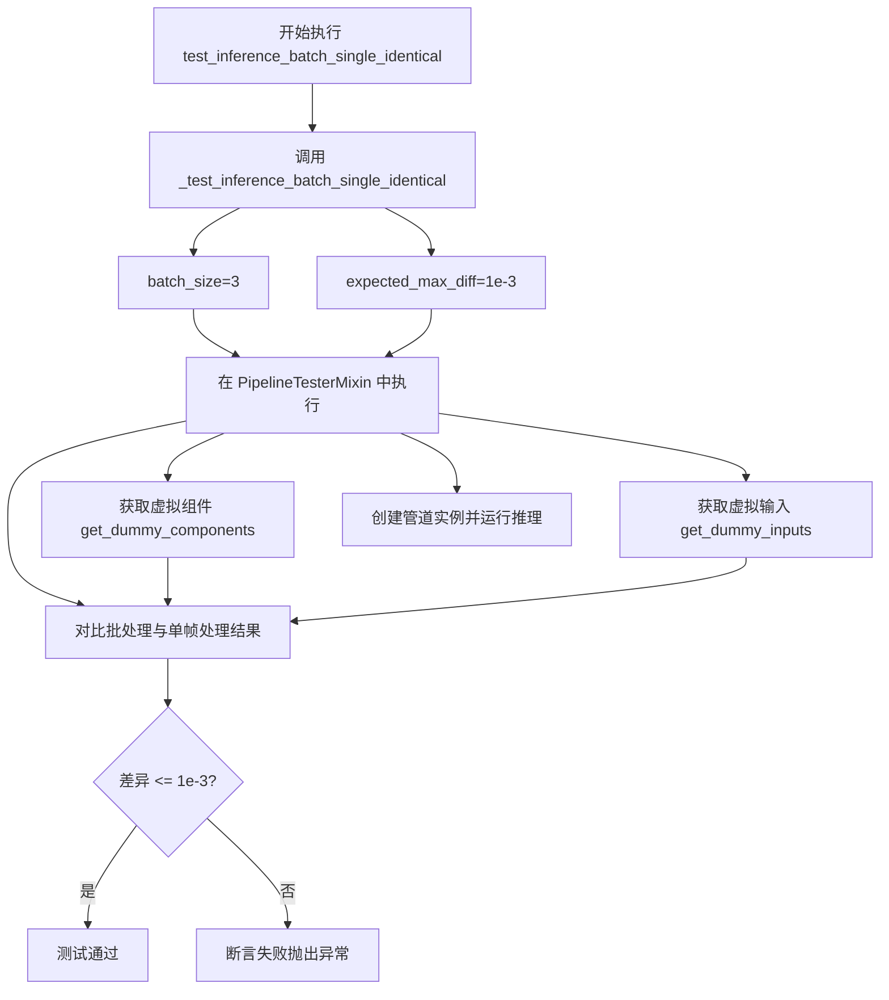

#### 带注释源码

```python
def test_inference_batch_single_identical(self):
    """
    测试方法：验证批处理推理与单帧推理的输出一致性。
    
    该测试方法调用父类/混入类 PipelineTesterMixin 中的 _test_inference_batch_single_identical 方法，
    用于确保 EasyAnimatePipeline 在批处理模式下（batch_size=3）生成的视频帧与
    单独调用三次单帧推理生成的视频帧在数值上保持一致（误差在 expected_max_diff=1e-3 以内）。
    
    这是一个重要的回归测试，确保优化（如批处理加速）不会影响模型的输出正确性。
    """
    # 调用混入类 PipelineTesterMixin 提供的通用测试方法
    # 参数 batch_size=3: 测试使用3个prompt的批处理
    # 参数 expected_max_diff=1e-3: 允许的最大数值差异（用于浮点数比较）
    self._test_inference_batch_single_identical(batch_size=3, expected_max_diff=1e-3)
```


### `EasyAnimatePipelineFastTests.test_attention_slicing_forward_pass`

该测试方法用于验证 EasyAnimatePipeline 的注意力切片（Attention Slicing）功能是否正确工作。测试会比较启用注意力切片与不启用注意力切片时的推理结果，确保切片优化不会影响输出质量。

参数：

- `self`：`EasyAnimatePipelineFastTests`，测试类的实例
- `test_max_difference`：`bool`，默认为 `True`，是否测试最大差异
- `test_mean_pixel_difference`：`bool`，默认为 `True`，是否测试平均像素差异（当前未使用）
- `expected_max_diff`：`float`，默认为 `1e-3`，允许的最大差异阈值

返回值：`None`，无返回值（通过断言验证正确性）

#### 流程图

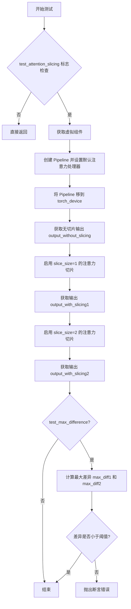

#### 带注释源码

```python
def test_attention_slicing_forward_pass(
    self, test_max_difference=True, test_mean_pixel_difference=True, expected_max_diff=1e-3
):
    """
    测试注意力切片功能是否正确工作
    
    参数:
        test_max_difference: 是否测试最大差异
        test_mean_pixel_difference: 是否测试平均像素差异（当前未使用）
        expected_max_diff: 允许的最大差异阈值
    """
    # 检查是否启用注意力切片测试
    if not self.test_attention_slicing:
        return

    # 获取虚拟组件（transformer, vae, scheduler, text_encoder, tokenizer）
    components = self.get_dummy_components()
    
    # 使用虚拟组件创建 Pipeline 实例
    pipe = self.pipeline_class(**components)
    
    # 为所有支持该方法的组件设置默认注意力处理器
    for component in pipe.components.values():
        if hasattr(component, "set_default_attn_processor"):
            component.set_default_attn_processor()
    
    # 将 Pipeline 移动到测试设备
    pipe.to(torch_device)
    
    # 配置进度条（禁用）
    pipe.set_progress_bar_config(disable=None)

    # 生成设备
    generator_device = "cpu"
    
    # 获取测试输入
    inputs = self.get_dummy_inputs(generator_device)
    
    # 1. 不启用注意力切片，运行推理获取基准输出
    output_without_slicing = pipe(**inputs)[0]

    # 2. 启用注意力切片（slice_size=1），运行推理
    pipe.enable_attention_slicing(slice_size=1)
    inputs = self.get_dummy_inputs(generator_device)
    output_with_slicing1 = pipe(**inputs)[0]

    # 3. 启用注意力切片（slice_size=2），运行推理
    pipe.enable_attention_slicing(slice_size=2)
    inputs = self.get_dummy_inputs(generator_device)
    output_with_slicing2 = pipe(**inputs)[0]

    # 如果需要测试最大差异
    if test_max_difference:
        # 将输出转换为 numpy 数组并计算最大差异
        max_diff1 = np.abs(to_np(output_with_slicing1) - to_np(output_without_slicing)).max()
        max_diff2 = np.abs(to_np(output_with_slicing2) - to_np(output_without_slicing)).max()
        
        # 断言：注意力切片不应影响推理结果
        self.assertLess(
            max(max_diff1, max_diff2),
            expected_max_diff,
            "Attention slicing should not affect the inference results",
        )
```


### `EasyAnimatePipelineFastTests.test_dict_tuple_outputs_equivalent`

该方法是一个测试用例，用于验证管道输出在字典格式和元组格式下是否等价。它覆盖了父类 `PipelineTesterMixin` 的同名方法，并调整了容差参数以适应 EasyAnimate 模型的测试需求。

参数：

- `expected_slice`：`Any`，可选参数，指定用于比较的切片范围，默认为 None
- `expected_max_difference`：`float`，最大允许的差异值，默认为 0.001（相比父类默认的容差更宽松）

返回值：`Any`，返回父类测试方法的执行结果，通常是 unittest 的测试断言结果

#### 流程图

```mermaid
flowchart TD
    A[开始 test_dict_tuple_outputs_equivalent] --> B[设置 expected_max_difference=0.001]
    B --> C[调用父类 super().test_dict_tuple_outputs_equivalent]
    C --> D{父类执行测试逻辑}
    D -->|通过| E[返回测试结果]
    D -->|失败| F[抛出断言错误]
    E --> G[结束]
    F --> G
```

#### 带注释源码

```
def test_dict_tuple_outputs_equivalent(self, expected_slice=None, expected_max_difference=0.001):
    """
    测试方法：验证字典和元组输出格式的等价性
    
    该测试方法继承自 PipelineTesterMixin，用于确保 EasyAnimatePipeline
    在以字典形式返回结果（如 {'frames': ...}）和以元组形式返回结果时，
    输出的内容是一致的。
    
    由于 EasyAnimate 模型可能存在数值精度问题，这里覆盖了父类方法，
    并将默认的 expected_max_difference 设置为 0.001（比父类默认的容差更大）
    以适应模型的测试需求。
    
    参数:
        expected_slice: 可选的切片参数，用于指定比较的输出子集
        expected_max_difference: 允许的最大差异值，默认 0.001
    
    返回:
        父类测试方法的执行结果
    """
    # Seems to need a higher tolerance
    # 注释：EasyAnimate 模型需要更高的容差来通过测试
    return super().test_dict_tuple_outputs_equivalent(expected_slice, expected_max_difference)
```


### `EasyAnimatePipelineFastTests.test_encode_prompt_works_in_isolation`

该测试方法用于验证 `encode_prompt` 功能能够独立于完整推理流程正常工作，通过调用父类测试方法并设置特定的数值容差参数（`atol=1e-3`, `rtol=1e-3`）来确保测试的准确性和稳定性。

参数：

- `self`：`EasyAnimatePipelineFastTests`，当前测试类实例

返回值：`unittest.TestCase` 的父类方法返回值，通常为 `None` 或测试断言结果，描述了 `encode_prompt` 隔离测试的执行结果

#### 流程图

```mermaid
flowchart TD
    A[开始执行 test_encode_prompt_works_in_isolation] --> B{检查父类方法是否存在}
    B -->|是| C[调用 super().test_encode_prompt_works_in_isolation]
    B -->|否| D[抛出 AttributeError]
    C --> E[传入参数 atol=1e-3, rtol=1e-3]
    E --> F[执行父类定义的编码提示词隔离测试]
    F --> G[返回测试结果]
    G --> H[结束]
    D --> H
```

#### 带注释源码

```python
def test_encode_prompt_works_in_isolation(self):
    """
    测试 encode_prompt 方法在隔离环境中是否能正常工作。
    
    该测试方法继承自 PipelineTesterMixin，用于验证文本编码器
    能够在不依赖完整扩散模型管道的情况下独立完成 prompt 编码任务。
    
    注意：相比默认参数，这里使用了更高的容差值(atol=1e-3, rtol=1e-3)，
    这表明在 EasyAnimate 流水线的上下文中，encode_prompt 的数值精度
    可能存在轻微偏差，需要放宽容差以确保测试通过。
    """
    # Seems to need a higher tolerance
    # 调用父类的同名测试方法，传入自定义的容差参数
    # atol: 绝对容差 (absolute tolerance)
    # rtol: 相对容差 (relative tolerance)
    return super().test_encode_prompt_works_in_isolation(atol=1e-3, rtol=1e-3)
```


### `EasyAnimatePipelineIntegrationTests.setUp`

该方法是 EasyAnimatePipelineIntegrationTests 测试类的初始化方法，在每个测试方法执行前被调用，用于执行内存垃圾回收和清空 GPU 缓存，以确保测试环境处于干净状态。

参数：

- `self`：`unittest.TestCase`，测试类实例本身，隐式参数

返回值：`None`，无返回值

#### 流程图

```mermaid
flowchart TD
    A[开始 setUp] --> B[调用 super().setUp]
    B --> C[执行 gc.collect]
    C --> D[调用 backend_empty_cache]
    D --> E[结束 setUp]
```

#### 带注释源码

```python
def setUp(self):
    # 调用父类的 setUp 方法，确保 unittest.TestCase 的初始化逻辑被执行
    super().setUp()
    
    # 执行 Python 垃圾回收，释放不再使用的对象内存
    gc.collect()
    
    # 清空 GPU 缓存，释放 GPU 显存，确保测试环境干净
    # torch_device 是全局变量，指向当前使用的计算设备
    backend_empty_cache(torch_device)
```


### `EasyAnimatePipelineIntegrationTests.tearDown`

该方法是测试框架的清理方法，在每个集成测试执行完毕后被调用，用于释放测试过程中占用的内存和GPU缓存资源，确保测试环境干净，避免内存泄漏影响后续测试。

参数：
- `self`：隐式参数，测试类实例本身，无需显式传递

返回值：`None`，无返回值

#### 流程图

```mermaid
flowchart TD
    A[tearDown 开始] --> B[调用父类 tearDown: super().tearDown]
    B --> C[执行垃圾回收: gc.collect]
    C --> D[清空 GPU 缓存: backend_empty_cache]
    D --> E[方法结束]
```

#### 带注释源码

```python
def tearDown(self):
    """
    清理测试环境，释放内存和GPU缓存资源。
    该方法在每个集成测试执行完毕后自动调用。
    """
    # 调用父类的 tearDown 方法，执行基类中的清理逻辑
    super().tearDown()
    
    # 强制执行 Python 垃圾回收，释放测试过程中创建的对象内存
    gc.collect()
    
    # 清空 GPU 缓存，释放 GPU 显存资源
    # torch_device 是测试工具模块中定义的全局变量，表示当前测试使用的设备
    backend_empty_cache(torch_device)
```


### `EasyAnimatePipelineIntegrationTests.test_EasyAnimate`

该方法是EasyAnimatePipeline的集成测试用例，用于验证从预训练模型`alibaba-pai/EasyAnimateV5.1-12b-zh`生成视频的功能是否正常。测试通过比较生成视频与随机期望视频之间的余弦相似度来断言生成质量。

参数：

- `self`：隐式参数，`unittest.TestCase`实例本身，无需显式传入

返回值：`None`，该方法为测试用例，通过`assert`语句进行断言验证，不返回任何值

#### 流程图

```mermaid
flowchart TD
    A[测试开始] --> B[创建随机数生成器 generator]
    B --> C[从预训练模型加载 EasyAnimatePipeline]
    C --> D[启用模型 CPU offload]
    D --> E[调用 pipeline 生成视频]
    E --> F[获取第一帧视频 video = videos[0]]
    F --> G[生成期望视频 expected_video]
    G --> H[计算余弦相似度距离 max_diff]
    H --> I{max_diff < 1e-3?}
    I -->|是| J[测试通过]
    I -->|否| K[抛出断言错误]
```

#### 带注释源码

```python
def test_EasyAnimate(self):
    # 创建一个 CPU 设备上的随机数生成器，种子为 0，确保测试可复现
    generator = torch.Generator("cpu").manual_seed(0)

    # 从 HuggingFace Hub 加载预训练的 EasyAnimateV5.1-12b-zh 模型
    # 使用 float16 精度以减少显存占用
    pipe = EasyAnimatePipeline.from_pretrained(
        "alibaba-pai/EasyAnimateV5.1-12b-zh", 
        torch_dtype=torch.float16
    )
    
    # 启用模型 CPU offload，当模型不在推理时将其移至 CPU，节省显存
    pipe.enable_model_cpu_offload()
    
    # 从类属性获取提示词
    prompt = self.prompt  # "A painting of a squirrel eating a burger."

    # 调用 pipeline 生成视频
    # 参数说明：
    #   - prompt: 文本提示词
    #   - height: 输出视频高度 480
    #   - width: 输出视频宽度 720
    #   - num_frames: 生成 5 帧视频
    #   - generator: 随机数生成器确保可复现
    #   - num_inference_steps: 推理步数为 2（快速测试）
    #   - output_type: 输出类型为 PyTorch tensor
    videos = pipe(
        prompt=prompt,
        height=480,
        width=720,
        num_frames=5,
        generator=generator,
        num_inference_steps=2,
        output_type="pt",
    ).frames

    # 获取第一批次（第一个）生成的视频
    video = videos[0]  # shape: (5, 480, 720, 3) 或类似

    # 创建期望的随机视频用于比较
    expected_video = torch.randn(1, 5, 480, 720, 3).numpy()

    # 计算生成视频与期望视频之间的余弦相似度距离
    max_diff = numpy_cosine_similarity_distance(video, expected_video)
    
    # 断言：余弦相似度距离应小于 1e-3，否则抛出错误
    assert max_diff < 1e-3, f"Max diff is too high. got {video}"
```

## 关键组件


### EasyAnimatePipeline

主pipeline类，负责协调整个视频生成流程，整合transformer、vae、scheduler和text_encoder等组件，实现文本到视频的生成功能。

### EasyAnimateTransformer3DModel

3D变换器模型，核心的时间序列和空间处理单元，接收文本embedding和噪声latent，通过多层注意力机制进行去噪处理，生成视频latent表示。

### AutoencoderKLMagvit

VAE解码器模型，将生成的latent空间表示解码为实际的视频像素数据，支持3D视频数据的编码和解码。

### FlowMatchEulerDiscreteScheduler

调度器实现，基于Flow Match Euler离散方法，控制去噪过程中的噪声调度，影响生成视频的质量和多样性。

### Qwen2VLForConditionalGeneration

多模态文本编码器，将输入的文本prompt转换为高维embedding向量，供transformer模型使用，支持视觉语言理解。

### Qwen2Tokenizer

文本分词器，将用户输入的文本prompt转换为token id序列，供编码器处理。

### 张量索引与惰性加载机制

通过callback_on_step_end和callback_on_step_end_tensor_inputs参数实现，允许在推理过程中按需访问和修改中间张量（如latents），实现惰性加载和细粒度控制。

### 反量化支持

通过output_type="pt"参数指定输出为PyTorch张量格式，支持从潜在空间到像素空间的转换和量化结果的解析。

### 量化策略

通过torch_dtype=torch.float16指定模型使用半精度浮点数加载，有效减少显存占用和推理时间。


## 问题及建议


### 已知问题

-   **硬编码随机种子问题**：代码中多处使用 `torch.manual_seed(0)` 硬编码随机种子，特别是 `get_dummy_inputs` 方法中对 MPS 设备有特殊处理（`if str(device).startswith("mps")`），这种条件分支可能导致在不同设备上的测试行为不一致，且降低了测试的覆盖面。
-   **测试容差值不合理**：`test_inference` 中使用 `self.assertLessEqual(max_diff, 1e10)`，这个容差值过大（1e10），几乎无法起到任何验证作用，表明测试设计存在缺陷或对预期结果缺乏了解。
-   **魔数缺乏解释**：代码中多处使用魔法数字（如 `1e10`、`1e-3`、`1e-3`、`expected_max_diff=1e-3` 等），且 `test_dict_tuple_outputs_equivalent` 和 `test_encode_prompt_works_in_isolation` 方法中有注释 "Seems to need a higher tolerance"，表明容差值是随意调整的，缺乏明确的测试目标和依据。
-   **集成测试缺少错误处理**：`test_EasyAnimate` 集成测试直接使用 `pipe.from_pretrained()` 加载大型模型（alibaba-pai/EasyAnimateV5.1-12b-zh），没有任何异常捕获机制，如果模型加载失败或网络问题，测试会直接崩溃且没有清晰的错误信息。
-   **资源清理不彻底**：虽然 `setUp` 和 `tearDown` 中调用了 `gc.collect()` 和 `backend_empty_cache`，但没有显式的 `pipe.to("cpu")` 或模型卸载操作，可能导致GPU内存泄漏，特别是在测试失败时。
-   **回调函数代码重复**：`test_callback_inputs` 中的 `callback_inputs_subset` 和 `callback_inputs_all` 函数有大量重复的迭代逻辑，可以提取为公共方法或使用更优雅的实现方式。
-   **缺失输入验证**：测试中没有对输入参数进行有效性验证（如 `height`、`width`、`num_frames` 的边界值检查），可能导致潜在问题未被及时发现。
-   **测试覆盖不足**：没有测试模型在CPU/GPU不同设备上的行为差异、内存占用情况、批量推理性能等关键指标。
-   **测试跳过逻辑不一致**：`test_attention_slicing_forward_pass` 中使用 `if not self.test_attention_slicing: return`，但 `test_xformers_attention = False` 和 `supports_dduf = False` 的配置含义不明确，可能导致某些测试被静默跳过。

### 优化建议

-   **重构随机种子管理**：使用类级别的随机种子管理机制，或者通过参数化测试覆盖不同的随机种子场景，消除设备特定的硬编码分支。
-   **修正测试容差值**：根据实际模型输出和预期精度合理设置容差值，为每个测试添加清晰的注释说明预期精度和容差依据。
-   **添加集成测试的错误处理**：使用 `try-except` 捕获模型加载和推理过程中的异常，提供有意义的错误信息，可以使用 `pytest.skip` 来优雅处理模型不可用的情况。
-   **改进资源清理**：在 `tearDown` 中添加显式的模型卸载和GPU内存释放逻辑，使用 `finally` 块确保资源清理即使在测试失败时也能执行。
-   **提取公共逻辑**：将回调函数中的重复迭代逻辑提取为辅助方法，或者使用更Pythonic的方式实现（如集合操作）。
-   **添加输入参数边界测试**：增加对极端参数值（如最小/最大的 height、width、num_frames）的测试覆盖。
-   **统一测试跳过机制**：明确各种 feature flag 的含义和使用场景，使用装饰器或配置类来集中管理测试条件。
-   **添加性能基准测试**：考虑添加推理时间、内存占用等性能指标的测试，作为回归检测的基础。


## 其它


### 设计目标与约束

本测试文件旨在验证 EasyAnimatePipeline 的核心功能，包括视频生成推理、批处理一致性、注意力切片机制、回调函数输入验证等。约束条件包括：1) 设备限制，仅支持 CPU 和 CUDA 设备（通过 torch_device 变量）；2) 依赖版本要求，需安装 transformers、diffusers、torch、numpy 等库；3) 精度容忍度，推理结果与期望值的差异需控制在 1e-3 到 1e-10 之间；4) 内存限制，集成测试需通过模型 CPU 卸载（enable_model_cpu_offload）来避免显存溢出。

### 错误处理与异常设计

测试类采用 unittest.TestCase 框架，使用 assert 语句进行错误检测。主要错误处理场景包括：1) 设备兼容性检查（test_inference 中硬编码 device="cpu"）；2) 注意力切片兼容性检查（test_attention_slicing_forward_pass 中检查 test_attention_slicing 标志）；3) 回调函数参数验证（test_callback_inputs 中通过断言检查允许的 tensor 输入）；4) 数值精度验证（assertLessEqual 和 assertLess 用于比较生成结果与期望值）。未显式捕获异常，依赖 unittest 框架的默认行为。

### 数据流与状态机

测试数据流分为三个阶段：初始化阶段（get_dummy_components 创建模型组件）、执行阶段（pipe(**inputs) 调用 pipeline）、验证阶段（assert 语句检查输出）。状态转换包括：组件加载 → Pipeline 构建 → 设备转移 → 推理执行 → 结果验证。Pipeline 内部状态通过 set_progress_bar_config 和 enable_attention_slicing 等方法修改。测试通过固定随机种子（torch.manual_seed(0)）确保可重复性。

### 外部依赖与接口契约

核心依赖包括：transformers 库的 Qwen2Tokenizer 和 Qwen2VLForConditionalGeneration；diffusers 库的 AutoencoderKLMagvit、EasyAnimatePipeline、EasyAnimateTransformer3DModel、FlowMatchEulerDiscreteScheduler；测试工具库的 testing_utils（backend_empty_cache、enable_full_determinism 等）和 pipeline_params。接口契约方面，pipeline 需支持 TEXT_TO_IMAGE_PARAMS 和 TEXT_TO_IMAGE_BATCH_PARAMS 指定的参数集，必须实现 __call__ 方法并返回包含 frames 属性的对象。

### 配置与参数设计

关键配置参数包括：num_inference_steps（推理步数，默认 2）、guidance_scale（引导 scale，默认 6.0）、height/width（输出分辨率）、num_frames（生成帧数）、output_type（输出类型，支持 "pt"）。组件配置通过 get_dummy_components 方法集中定义，包括 transformer 的注意力头数（2）、头维度（16）、层数（1）等。随机数生成通过 torch.Generator 和 seed 参数控制。

### 性能指标与基准

测试性能指标包括：1) 推理时间（通过 set_progress_bar_config 可视化进度）；2) 内存占用（集成测试使用 enable_model_cpu_offload 优化）；3) 数值精度（max_diff 需小于 1e-3 到 1e-10）；4) 批处理一致性（test_inference_batch_single_identical 使用 expected_max_diff=1e-3）；5) 注意力切片影响（expected_max_diff=1e-3）。基准测试包括单元测试（FastTests 类）和集成测试（IntegrationTests 类，使用 @slow 标记）。

### 资源管理与清理

资源管理采用三层机制：1) 测试方法级清理，通过 tearDown 方法调用 gc.collect() 和 backend_empty_cache(torch_device) 释放内存；2) Pipeline 级资源管理，使用 enable_model_cpu_offload() 实现模型 CPU 卸载；3) 测试参数级控制，通过 generator 参数复用和设置 slice_size 控制计算资源。测试设备通过 torch_device 全局变量统一管理。

### 安全性和隐私考虑

代码中不涉及敏感数据处理，主要安全考量包括：1) 模型加载安全，使用 from_pretrained 加载预训练模型，需确保模型来源可信（hf-internal-testing/alibaba-pai）；2) 测试数据隐私，测试 prompt（如 "dance monkey"、"A painting of a squirrel eating a burger."）为公开示例；3) 依赖安全，导入的库均为开源项目（HuggingFace、numpy、torch）。

### 版本兼容性与迁移策略

版本兼容性通过以下方式保障：1) 条件导入，使用 try-except 处理可选依赖；2) 参数兼容性检查（test_callback_inputs 中检查签名）；3) 设备兼容性处理（get_dummy_inputs 中对 MPS 设备的特殊处理）。迁移策略方面：测试类继承 PipelineTesterMixin 抽象类，便于适配新 pipeline；使用 frozenset 定义可选参数集（required_optional_params），便于扩展。

### 测试覆盖度分析

单元测试覆盖场景：普通推理（test_inference）、回调函数验证（test_callback_inputs）、批处理一致性（test_inference_batch_single_identical）、注意力切片（test_attention_slicing_forward_pass）、输出格式等价性（test_dict_tuple_outputs_equivalent）、编码提示词隔离（test_encode_prompt_works_in_isolation）。集成测试覆盖场景：端到端视频生成（test_EasyAnimate）。覆盖率缺口：未测试多卡并行、分布式推理、动态引导 scale、LoRA 权重加载等场景。

### 可维护性与扩展性设计

代码可维护性特征：1) 参数集中定义（params、batch_params、image_params 类属性）；2) 组件工厂方法（get_dummy_components/get_dummy_inputs）；3) 测试方法命名规范（test_前缀）；4) 跳过机制（@slow、@require_torch_accelerator 装饰器）。扩展性设计：PipelineTesterMixin 提供标准化接口，便于添加新测试方法；supports_dduf 标志预留未来功能扩展；_callback_tensor_inputs 属性支持自定义回调输入。

### 文档与注释规范

代码注释规范符合 Apache 2.0 许可证要求，包含版权声明。每个测试方法包含文档字符串说明测试目的（如 test_inference 测试推理功能）。关键参数（如 guidance_scale、num_inference_steps）在调用处通过关键字参数明确标注。测试工具函数（to_np、numpy_cosine_similarity_distance）来自公共测试框架。

### 测试环境要求

硬件要求：CPU（单元测试）、GPU（集成测试，需 CUDA 支持）。软件要求：Python 3.8+、PyTorch 2.0+、transformers、diffusers、numpy。环境变量：通过 torch_device 全局变量控制测试设备（需在测试运行前设置）。缓存要求：模型权重缓存（~/.cache/huggingface/）、GPU 内存缓存（测试后通过 backend_empty_cache 清理）。

    