# `diffusers\tests\pipelines\flux\test_pipeline_flux.py` 详细设计文档

这是一组针对Diffusers库中FluxPipeline的单元测试代码，包含快速测试（验证pipeline基本功能如不同提示词、QKV融合、输出形状、true_cfg等）和慢速测试（夜间运行，验证实际推理性能和IP适配器功能），通过使用虚拟组件和真实预训练模型进行全面的功能与性能验证。

## 整体流程

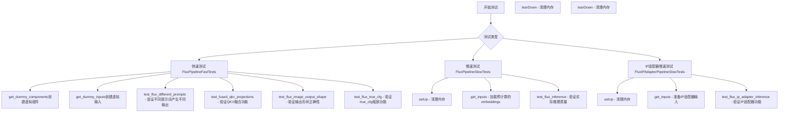

## 类结构

```
unittest.TestCase (基类)
├── FluxPipelineFastTests (多重继承测试类)
│   ├── PipelineTesterMixin
│   ├── FluxIPAdapterTesterMixin
│   ├── PyramidAttentionBroadcastTesterMixin
│   ├── FasterCacheTesterMixin
│   ├── FirstBlockCacheTesterMixin
│   ├── TaylorSeerCacheTesterMixin
│   └── MagCacheTesterMixin
├── FluxPipelineSlowTests (unittest.TestCase)
└── FluxIPAdapterPipelineSlowTests (unittest.TestCase)
```

## 全局变量及字段


### `FluxPipelineFastTests.pipeline_class`
    
The pipeline class being tested, set to FluxPipeline

类型：`Type[FluxPipeline]`
    


### `FluxPipelineFastTests.params`
    
Frozen set of pipeline parameters including prompt, height, width, guidance_scale, prompt_embeds, and pooled_prompt_embeds

类型：`frozenset[str]`
    


### `FluxPipelineFastTests.batch_params`
    
Frozen set of batch parameters, currently only contains 'prompt'

类型：`frozenset[str]`
    


### `FluxPipelineFastTests.test_xformers_attention`
    
Flag indicating whether to test xformers attention, set to False as Flux has no xformers processor

类型：`bool`
    


### `FluxPipelineFastTests.test_layerwise_casting`
    
Flag indicating whether to test layerwise casting, set to True

类型：`bool`
    


### `FluxPipelineFastTests.test_group_offloading`
    
Flag indicating whether to test group offloading, set to True

类型：`bool`
    


### `FluxPipelineFastTests.faster_cache_config`
    
Configuration object for faster caching with spatial attention block skip range, timestep skip range, and attention weight callback

类型：`FasterCacheConfig`
    


### `FluxPipelineSlowTests.pipeline_class`
    
The pipeline class being tested, set to FluxPipeline

类型：`Type[FluxPipeline]`
    


### `FluxPipelineSlowTests.repo_id`
    
Hugging Face repository identifier for the FLUX.1-schnell model

类型：`str`
    


### `FluxIPAdapterPipelineSlowTests.pipeline_class`
    
The pipeline class being tested, set to FluxPipeline

类型：`Type[FluxPipeline]`
    


### `FluxIPAdapterPipelineSlowTests.repo_id`
    
Hugging Face repository identifier for the FLUX.1-dev model

类型：`str`
    


### `FluxIPAdapterPipelineSlowTests.image_encoder_pretrained_model_name_or_path`
    
Pretrained model name or path for the image encoder used in IP adapter

类型：`str`
    


### `FluxIPAdapterPipelineSlowTests.weight_name`
    
Filename of the IP adapter weights file, set to ip_adapter.safetensors

类型：`str`
    


### `FluxIPAdapterPipelineSlowTests.ip_adapter_repo_id`
    
Hugging Face repository identifier for the IP adapter model

类型：`str`
    
    

## 全局函数及方法


### `FluxPipelineFastTests.get_dummy_components`

该方法用于创建虚拟（dummy）组件字典，以便在测试 FluxPipeline 时模拟完整的推理管线组件。它初始化了一个包含文本编码器、tokenizer、VAE、Transformer 和调度器等的虚拟对象集合，供单元测试使用。

参数：

- `num_layers`：`int`，可选，默认值为 1，指定 FluxTransformer2DModel 中的层数
- `num_single_layers`：`int`，可选，默认值为 1，指定 FluxTransformer2DModel 中的单层数量

返回值：`dict`，返回一个字典，包含以下键值对：
- `scheduler`：FlowMatchEulerDiscreteScheduler 实例
- `text_encoder`：CLIPTextModel 实例
- `text_encoder_2`：T5EncoderModel 实例
- `tokenizer`：CLIPTokenizer 实例
- `tokenizer_2`：AutoTokenizer 实例
- `transformer`：FluxTransformer2DModel 实例
- `vae`：AutoencoderKL 实例
- `image_encoder`：None
- `feature_extractor`：None

#### 流程图

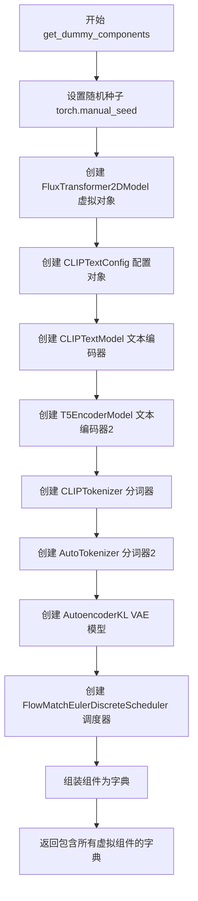

#### 带注释源码

```python
def get_dummy_components(self, num_layers: int = 1, num_single_layers: int = 1):
    """
    创建用于测试的虚拟组件字典
    
    参数:
        num_layers: Transformer模型层数,默认为1
        num_single_layers: 单层数量,默认为1
    返回:
        包含所有虚拟组件的字典
    """
    # 设置随机种子以确保测试可重复性
    torch.manual_seed(0)
    
    # 创建虚拟Transformer模型 - FluxTransformer2DModel
    transformer = FluxTransformer2DModel(
        patch_size=1,
        in_channels=4,
        num_layers=num_layers,
        num_single_layers=num_single_layers,
        attention_head_dim=16,
        num_attention_heads=2,
        joint_attention_dim=32,
        pooled_projection_dim=32,
        axes_dims_rope=[4, 4, 8],
    )
    
    # 创建CLIP文本编码器配置
    clip_text_encoder_config = CLIPTextConfig(
        bos_token_id=0,
        eos_token_id=2,
        hidden_size=32,
        intermediate_size=37,
        layer_norm_eps=1e-05,
        num_attention_heads=4,
        num_hidden_layers=5,
        pad_token_id=1,
        vocab_size=1000,
        hidden_act="gelu",
        projection_dim=32,
    )

    # 创建CLIP文本编码器
    torch.manual_seed(0)
    text_encoder = CLIPTextModel(clip_text_encoder_config)

    # 创建T5文本编码器 (从预训练模型加载)
    torch.manual_seed(0)
    text_encoder_2 = T5EncoderModel.from_pretrained("hf-internal-testing/tiny-random-t5")

    # 创建分词器
    tokenizer = CLIPTokenizer.from_pretrained("hf-internal-testing/tiny-random-clip")
    tokenizer_2 = AutoTokenizer.from_pretrained("hf-internal-testing/tiny-random-t5")

    # 创建VAE模型
    torch.manual_seed(0)
    vae = AutoencoderKL(
        sample_size=32,
        in_channels=3,
        out_channels=3,
        block_out_channels=(4,),
        layers_per_block=1,
        latent_channels=1,
        norm_num_groups=1,
        use_quant_conv=False,
        use_post_quant_conv=False,
        shift_factor=0.0609,
        scaling_factor=1.5035,
    )

    # 创建调度器
    scheduler = FlowMatchEulerDiscreteScheduler()

    # 返回包含所有组件的字典
    return {
        "scheduler": scheduler,
        "text_encoder": text_encoder,
        "text_encoder_2": text_encoder_2,
        "tokenizer": tokenizer,
        "tokenizer_2": tokenizer_2,
        "transformer": transformer,
        "vae": vae,
        "image_encoder": None,      # FluxPipeline不需要image_encoder
        "feature_extractor": None,   # FluxPipeline不需要feature_extractor
    }
```


### `FluxPipelineFastTests.get_dummy_inputs`

该方法用于生成 FluxPipeline 测试所需的虚拟输入参数，包括提示词、生成器、推理步数、引导系数、图像尺寸等配置。

参数：

- `self`：隐式参数，类实例本身
- `device`：`torch.device` 或 `str`，目标设备，用于判断是否为 MPS 设备
- `seed`：`int`，随机种子，默认为 0，用于生成器的随机初始化

返回值：`Dict[str, Any]`，包含以下键值对：
- `prompt`：提示词文本
- `generator`：PyTorch 随机生成器
- `num_inference_steps`：推理步数
- `guidance_scale`：引导系数
- `height`：生成图像高度
- `width`：生成图像宽度
- `max_sequence_length`：最大序列长度
- `output_type`：输出类型

#### 流程图

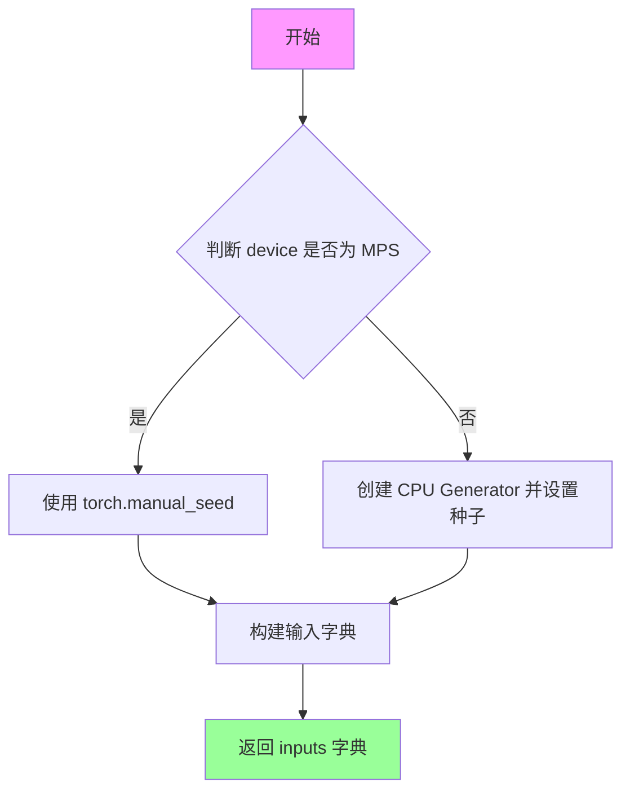

#### 带注释源码

```python
def get_dummy_inputs(self, device, seed=0):
    """
    生成用于 FluxPipeline 测试的虚拟输入参数。
    
    参数:
        device: 目标设备，用于判断是否为 MPS 架构
        seed: 随机种子，确保测试可复现
    
    返回:
        包含完整推理参数的字典
    """
    # 判断设备是否为 Apple MPS (Metal Performance Shaders)
    if str(device).startswith("mps"):
        # MPS 设备使用 torch.manual_seed 直接设置种子
        generator = torch.manual_seed(seed)
    else:
        # 其他设备（如 CPU、CUDA）使用 CPU 上的 Generator
        generator = torch.Generator(device="cpu").manual_seed(seed)

    # 构建完整的输入参数字典
    inputs = {
        "prompt": "A painting of a squirrel eating a burger",  # 测试用提示词
        "generator": generator,                                  # 随机生成器
        "num_inference_steps": 2,                               # 推理步数（测试用最小值）
        "guidance_scale": 5.0,                                   # Classifier-free guidance 系数
        "height": 8,                                             # 输出图像高度
        "width": 8,                                              # 输出图像宽度
        "max_sequence_length": 48,                              # 文本嵌入最大长度
        "output_type": "np",                                     # 输出为 numpy 数组
    }
    return inputs
```


### `FluxPipelineFastTests.test_flux_different_prompts`

该测试方法验证 FluxPipeline 在使用不同提示词时能够产生不同的输出结果，确保多提示词功能正常工作。

参数：

- `self`：无需显式传递，测试方法的标准参数，表示类实例本身

返回值：`None`，该方法为测试方法，通过 `assert` 语句验证逻辑，不返回任何值

#### 流程图

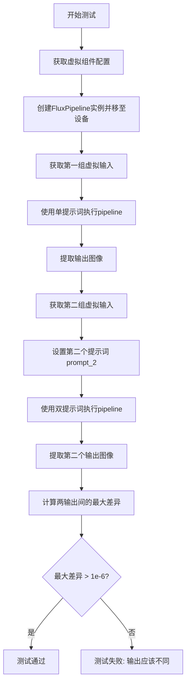

#### 带注释源码

```python
def test_flux_different_prompts(self):
    """
    测试 FluxPipeline 在使用不同提示词时是否能产生不同的输出。
    
    该测试验证：
    1. pipeline 能正确处理单提示词输入
    2. pipeline 能正确处理多提示词输入（prompt 和 prompt_2）
    3. 不同的提示词应产生明显不同的输出
    """
    # 使用虚拟组件配置创建 pipeline 实例并移至指定设备
    # get_dummy_components() 返回包含所有必要组件的字典（transformer, vae, text_encoder 等）
    pipe = self.pipeline_class(**self.get_dummy_components()).to(torch_device)

    # 获取第一组虚拟输入（使用默认提示词 "A painting of a squirrel eating a burger"）
    inputs = self.get_dummy_inputs(torch_device)
    # 执行 pipeline 获取输出图像
    output_same_prompt = pipe(**inputs).images[0]

    # 获取第二组虚拟输入（重置随机种子以确保可重复性）
    inputs = self.get_dummy_inputs(torch_device)
    # 设置第二个不同的提示词
    inputs["prompt_2"] = "a different prompt"
    # 再次执行 pipeline（此时使用两个不同的提示词）
    output_different_prompts = pipe(**inputs).images[0]

    # 计算两个输出图像之间每个像素的绝对差值，并取最大值
    max_diff = np.abs(output_same_prompt - output_different_prompts).max()

    # 断言：验证不同提示词确实产生了不同的输出
    # 使用 1e-6 作为最小差异阈值（而非 0），因为某些实现可能产生微小差异
    self.assertGreater(max_diff, 1e-6, "Outputs should be different for different prompts.")
```


### `FluxPipelineFastTests.test_fused_qkv_projections`

该测试方法用于验证 FluxPipeline 中 Transformer 模型的 QKV（Query-Key-Value）投影融合功能。测试通过比较融合前后以及解除融合后的图像输出，验证融合操作不会影响模型的推理结果。

参数：

- `self`：测试类的实例方法，无需显式传递

返回值：`None`，测试方法无返回值，通过 unittest 断言验证正确性

#### 流程图

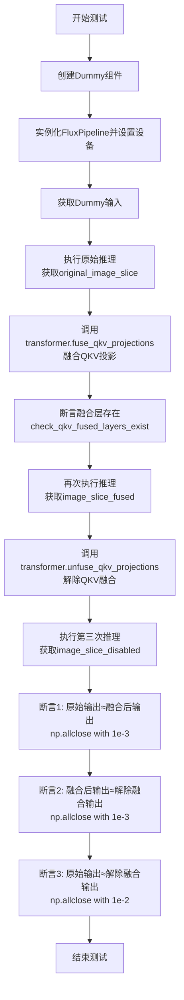

#### 带注释源码

```python
def test_fused_qkv_projections(self):
    """测试 Flux Pipeline 中 Transformer 的 QKV 投影融合功能
    
    该测试验证以下场景:
    1. 原始推理（未融合）的输出
    2. 融合 QKV 投影后的输出
    3. 解除融合后的输出
    确保三种情况的输出在容差范围内一致
    """
    # 使用 CPU 设备确保确定性结果
    device = "cpu"
    
    # 获取测试所需的虚拟组件
    components = self.get_dummy_components()
    
    # 使用虚拟组件实例化 FluxPipeline
    pipe = self.pipeline_class(**components)
    pipe = pipe.to(device)  # 移动到指定设备
    pipe.set_progress_bar_config(disable=None)  # 配置进度条
    
    # 获取虚拟输入数据
    inputs = self.get_dummy_inputs(device)
    
    # 执行第一次推理（原始/未融合状态）
    image = pipe(**inputs).images
    # 提取图像最后3x3区域的最后一个通道作为比较基准
    original_image_slice = image[0, -3:, -3:, -1]
    
    # 调用 fuse_qkv_projections() 融合 QKV 投影
    # 这会将分离的 q, k, v 投影合并为一个联合投影以提高效率
    pipe.transformer.fuse_qkv_projections()
    
    # 验证融合操作成功：检查是否存在 'to_qkv' 融合层
    self.assertTrue(
        check_qkv_fused_layers_exist(pipe.transformer, ["to_qkv"]),
        ("Something wrong with the fused attention layers. Expected all the attention projections to be fused."),
    )
    
    # 使用相同输入执行第二次推理（QKV已融合）
    inputs = self.get_dummy_inputs(device)
    image = pipe(**inputs).images
    image_slice_fused = image[0, -3:, -3:, -1]
    
    # 解除 QKV 融合，恢复到原始状态
    pipe.transformer.unfuse_qkv_projections()
    
    # 执行第三次推理（QKV已解除融合）
    inputs = self.get_dummy_inputs(device)
    image = pipe(**inputs).images
    image_slice_disabled = image[0, -3:, -3:, -1]
    
    # 断言1: 融合后的输出应与原始输出相同（严格容差 1e-3）
    self.assertTrue(
        np.allclose(original_image_slice, image_slice_fused, atol=1e-3, rtol=1e-3),
        ("Fusion of QKV projections shouldn't affect the outputs."),
    )
    
    # 断言2: 融合后与解除融合的输出应相同（严格容差 1e-3）
    self.assertTrue(
        np.allclose(image_slice_fused, image_slice_disabled, atol=1e-3, rtol=1e-3),
        ("Outputs, with QKV projection fusion enabled, shouldn't change when fused QKV projections are disabled."),
    )
    
    # 断言3: 原始输出应与解除融合后的输出匹配（宽松容差 1e-2）
    # 使用更宽松的容差因为是两次独立推理
    self.assertTrue(
        np.allclose(original_image_slice, image_slice_disabled, atol=1e-2, rtol=1e-2),
        ("Original outputs should match when fused QKV projections are disabled."),
    )
```


### `FluxPipelineFastTests.test_flux_image_output_shape`

该测试方法验证 FluxPipeline 在不同输入尺寸下的输出图像形状是否正确，通过计算预期尺寸（输入尺寸减去 VAE 缩放因子模值）并与实际输出尺寸进行比对，确保管道正确处理图像尺寸对齐。

参数：

- `self`：`FluxPipelineFastTests`，测试类实例本身

返回值：`None`，无返回值（测试方法，通过断言验证）

#### 流程图

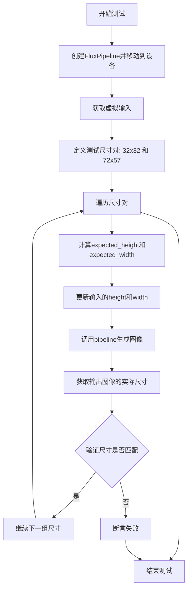

#### 带注释源码

```python
def test_flux_image_output_shape(self):
    """
    测试 FluxPipeline 输出图像形状是否与预期匹配
    验证管道正确处理不同输入尺寸的图像生成
    """
    # 创建 FluxPipeline 并移动到测试设备
    pipe = self.pipeline_class(**self.get_dummy_components()).to(torch_device)
    # 获取虚拟输入参数
    inputs = self.get_dummy_inputs(torch_device)

    # 定义测试用的 height/width 组合列表
    height_width_pairs = [(32, 32), (72, 57)]
    for height, width in height_width_pairs:
        # 计算预期的输出高度和宽度
        # 减去 VAE 缩放因子 * 2 的模，确保输出尺寸是 VAE 兼容的
        expected_height = height - height % (pipe.vae_scale_factor * 2)
        expected_width = width - width % (pipe.vae_scale_factor * 2)

        # 更新输入参数中的 height 和 width
        inputs.update({"height": height, "width": width})
        # 调用管道生成图像
        image = pipe(**inputs).images[0]
        # 获取输出图像的实际高度、宽度和通道数
        output_height, output_width, _ = image.shape
        # 断言输出形状是否与预期形状匹配
        self.assertEqual(
            (output_height, output_width),
            (expected_height, expected_width),
            f"Output shape {image.shape} does not match expected shape {(expected_height, expected_width)}",
        )
```


### `FluxPipelineFastTests.test_flux_true_cfg`

该方法用于测试 FluxPipeline 的 true_cfg（True Classifier-Free Guidance）功能，验证当设置 `true_cfg_scale` 参数时，模型的输出应与不设置该参数时的输出不同。

参数：

- `self`：隐式参数，TestCase 实例本身

返回值：`None`，该方法为测试方法，通过断言验证功能，不返回具体值

#### 流程图

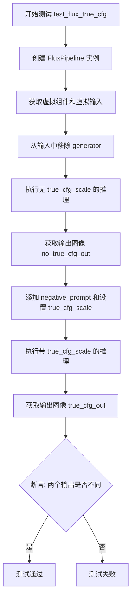

#### 带注释源码

```python
def test_flux_true_cfg(self):
    """
    测试 FluxPipeline 的 true_cfg_scale 功能。
    验证当设置 true_cfg_scale 时，输出应与不设置时不同。
    """
    # 使用虚拟组件创建 FluxPipeline 并移至测试设备
    pipe = self.pipeline_class(**self.get_dummy_components()).to(torch_device)
    
    # 获取虚拟输入参数
    inputs = self.get_dummy_inputs(torch_device)
    
    # 移除 generator 参数以使用默认随机生成
    inputs.pop("generator")
    
    # 第一次推理：不使用 true_cfg_scale
    # 使用固定种子确保可重复性
    no_true_cfg_out = pipe(**inputs, generator=torch.manual_seed(0)).images[0]
    
    # 添加负面提示词和设置 true_cfg_scale 参数
    inputs["negative_prompt"] = "bad quality"
    inputs["true_cfg_scale"] = 2.0
    
    # 第二次推理：使用 true_cfg_scale
    # 使用相同种子确保可比性
    true_cfg_out = pipe(**inputs, generator=torch.manual_seed(0)).images[0]
    
    # 断言：两次输出的图像应有所不同
    # 如果两者完全相同，说明 true_cfg_scale 未生效
    self.assertFalse(
        np.allclose(no_true_cfg_out, true_cfg_out), 
        "Outputs should be different when true_cfg_scale is set."
    )
```


### `FluxPipelineSlowTests.setUp`

该方法是测试类的初始化方法，在每个测试方法运行前被调用，用于清理内存缓存并重置测试环境，确保测试之间的隔离性。

参数：

- `self`：当前测试实例对象，无需显式传递

返回值：`None`，该方法不返回任何值

#### 流程图

```mermaid
flowchart TD
    A[开始 setUp] --> B[调用 super().setUp]
    B --> C[执行 gc.collect 垃圾回收]
    C --> D[调用 backend_empty_cache 清理后端缓存]
    D --> E[结束 setUp]
```

#### 带注释源码

```python
def setUp(self):
    """
    测试用例初始化方法，在每个测试方法执行前自动调用
    用于准备测试环境和清理资源
    """
    # 调用父类的 setUp 方法，确保 unittest 框架正确初始化
    super().setUp()
    
    # 手动触发 Python 垃圾回收，释放不再使用的对象内存
    gc.collect()
    
    # 清理 GPU/后端缓存，确保测试之间不会相互影响
    # torch_device 是全局变量，指定了测试使用的设备
    backend_empty_cache(torch_device)
```

---

### `FluxIPAdapterPipelineSlowTests.setUp`

该方法同样是测试类的初始化方法，与上述方法功能完全一致，用于在 IP Adapter 管道测试前清理内存和缓存资源。

参数：

- `self`：当前测试实例对象，无需显式传递

返回值：`None`，该方法不返回任何值

#### 流程图

```mermaid
flowchart TD
    A[开始 setUp] --> B[调用 super().setUp]
    B --> C[执行 gc.collect 垃圾回收]
    C --> D[调用 backend_empty_cache 清理后端缓存]
    D --> E[结束 setUp]
```

#### 带注释源码

```python
def setUp(self):
    """
    测试用例初始化方法，在每个测试方法执行前自动调用
    用于准备测试环境和清理资源
    """
    # 调用父类的 setUp 方法，确保 unittest 框架正确初始化
    super().setUp()
    
    # 手动触发 Python 垃圾回收，释放不再使用的对象内存
    gc.collect()
    
    # 清理 GPU/后端缓存，确保测试之间不会相互影响
    # torch_device 是全局变量，指定了测试使用的设备
    backend_empty_cache(torch_device)
```


### `FluxPipelineSlowTests.tearDown`

清理测试环境，释放GPU内存并运行垃圾回收

参数： 无

返回值： `None`，无返回值

#### 流程图

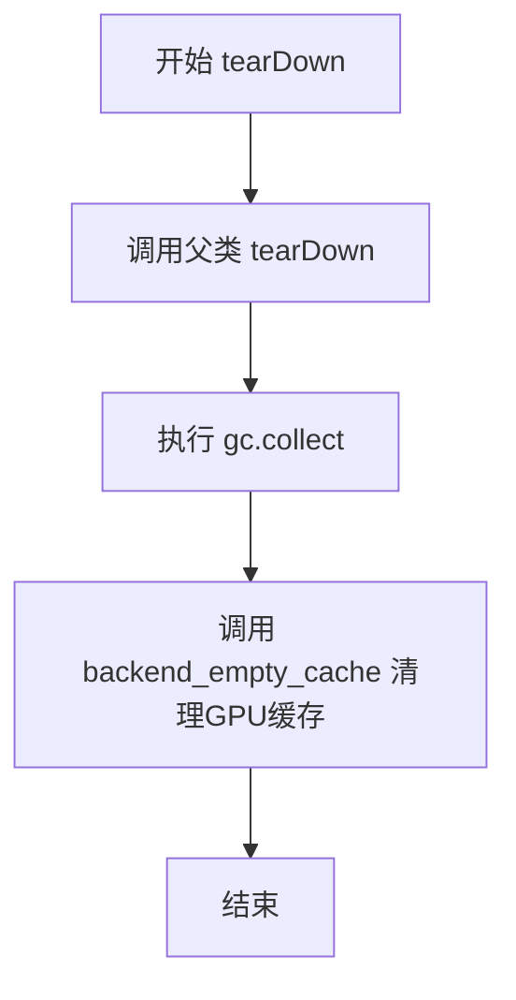

#### 带注释源码

```python
def tearDown(self):
    # 调用父类的 tearDown 方法，执行 unittest.TestCase 的标准清理逻辑
    super().tearDown()
    # 手动触发 Python 垃圾回收，释放不再使用的对象
    gc.collect()
    # 调用后端特定函数清理 GPU/加速器内存缓存
    backend_empty_cache(torch_device)
```

---

### `FluxIPAdapterPipelineSlowTests.tearDown`

清理测试环境，释放GPU内存并运行垃圾回收

参数： 无

返回值： `None`，无返回值

#### 流程图


#### 带注释源码

```python
def tearDown(self):
    # 调用父类的 tearDown 方法，执行 unittest.TestCase 的标准清理逻辑
    super().tearDown()
    # 手动触发 Python 垃圾回收，释放不再使用的对象
    gc.collect()
    # 调用后端特定函数清理 GPU/加速器内存缓存
    backend_empty_cache(torch_device)
```


### FluxPipelineSlowTests.get_inputs

该方法用于为 FluxPipeline 慢速测试准备输入参数，从 Hugging Face Hub 下载预计算的文本嵌入（prompt_embeds 和 pooled_prompt_embeds），并构建包含推理所需全部参数的字典。

参数：

-  `self`：隐式参数，测试类实例本身
-  `device`：`str`，目标设备标识符（如 "cuda"、"cpu" 等）
-  `seed`：`int`（默认值：0），随机数生成器的种子，用于保证测试的可重复性

返回值：`Dict[str, Any]`，包含以下键的字典：
-  `prompt_embeds`：预计算的文本嵌入张量
-  `pooled_prompt_embeds`：池化后的文本嵌入张量
-  `num_inference_steps`：推理步数（固定为 2）
-  `guidance_scale`：引导比例（固定为 0.0）
-  `max_sequence_length`：最大序列长度（固定为 256）
-  `output_type`：输出类型（固定为 "np"）
-  `generator`：PyTorch 随机数生成器

#### 流程图

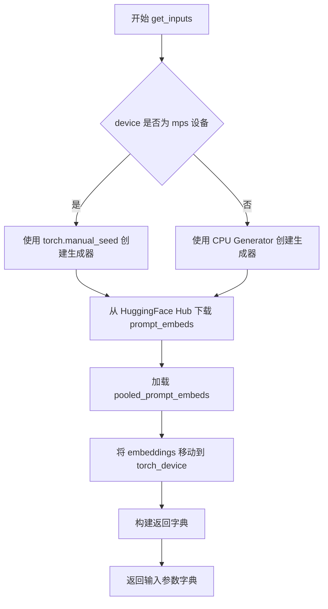

#### 带注释源码

```python
def get_inputs(self, device, seed=0):
    # 根据设备类型创建随机数生成器
    # MPS 设备使用 torch.manual_seed，其他设备使用 CPU Generator
    generator = torch.Generator(device="cpu").manual_seed(seed)

    # 从 HuggingFace Hub 下载预计算的 prompt embeddings
    # 用于避免在慢速测试中重复进行耗时的文本编码
    prompt_embeds = torch.load(
        hf_hub_download(repo_id="diffusers/test-slices", repo_type="dataset", filename="flux/prompt_embeds.pt")
    ).to(torch_device)
    
    # 下载池化后的 prompt embeddings
    pooled_prompt_embeds = torch.load(
        hf_hub_download(
            repo_id="diffusers/test-slices", repo_type="dataset", filename="flux/pooled_prompt_embeds.pt"
        )
    ).to(torch_device)
    
    # 返回包含所有推理所需参数的字典
    return {
        "prompt_embeds": prompt_embeds,
        "pooled_prompt_embeds": pooled_prompt_embeds,
        "num_inference_steps": 2,
        "guidance_scale": 0.0,
        "max_sequence_length": 256,
        "output_type": "np",
        "generator": generator,
    }
```

---

### FluxIPAdapterPipelineSlowTests.get_inputs

该方法用于为 Flux IP-Adapter 管道慢速测试准备输入参数，与前者相比增加了负向文本嵌入和 IP-Adapter 图像的处理，以支持图像提示适配功能的测试。

参数：

-  `self`：隐式参数，测试类实例本身
-  `device`：`str`，目标设备标识符
-  `seed`：`int`（默认值：0），随机数生成器种子

返回值：`Dict[str, Any]`，包含以下键的字典：
-  `prompt_embeds`：预计算的文本嵌入张量
-  `pooled_prompt_embeds`：池化后的文本嵌入张量
-  `negative_prompt_embeds`：负向文本嵌入（全零张量）
-  `negative_pooled_prompt_embeds`：负向池化嵌入（全零张量）
-  `ip_adapter_image`：用于 IP-Adapter 的输入图像（全零图像）
-  `num_inference_steps`：推理步数（固定为 2）
-  `guidance_scale`：引导比例（固定为 3.5）
-  `true_cfg_scale`：真实CFG比例（固定为 4.0）
-  `max_sequence_length`：最大序列长度（固定为 256）
-  `output_type`：输出类型（固定为 "np"）
-  `generator`：PyTorch 随机数生成器

#### 流程图

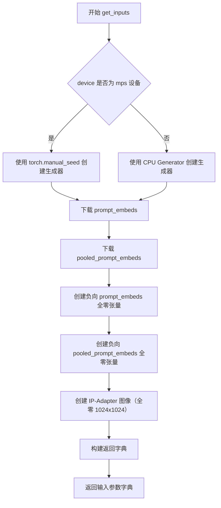

#### 带注释源码

```python
def get_inputs(self, device, seed=0):
    # 根据设备类型选择随机数生成方式
    # MPS 设备使用 torch.manual_seed，其他设备使用 CPU Generator
    if str(device).startswith("mps"):
        generator = torch.manual_seed(seed)
    else:
        generator = torch.Generator(device="cpu").manual_seed(seed)

    # 从 HuggingFace Hub 下载预计算的文本嵌入
    # 这些嵌入来自预训练模型，用于加速测试
    prompt_embeds = torch.load(
        hf_hub_download(repo_id="diffusers/test-slices", repo_type="dataset", filename="flux/prompt_embeds.pt")
    )
    pooled_prompt_embeds = torch.load(
        hf_hub_download(
            repo_id="diffusers/test-slices", repo_type="dataset", filename="flux/pooled_prompt_embeds.pt"
        )
    )
    
    # 创建负向提示嵌入（全零），用于 classifier-free guidance
    negative_prompt_embeds = torch.zeros_like(prompt_embeds)
    negative_pooled_prompt_embeds = torch.zeros_like(pooled_prompt_embeds)
    
    # 创建 IP-Adapter 使用的输入图像（全零图像）
    # 实际测试中会被替换为真实的条件图像
    ip_adapter_image = np.zeros((1024, 1024, 3), dtype=np.uint8)
    
    # 返回完整的输入参数字典
    return {
        "prompt_embeds": prompt_embeds,
        "pooled_prompt_embeds": pooled_prompt_embeds,
        "negative_prompt_embeds": negative_prompt_embeds,
        "negative_pooled_prompt_embeds": negative_pooled_prompt_embeds,
        "ip_adapter_image": ip_adapter_image,
        "num_inference_steps": 2,
        "guidance_scale": 3.5,
        "true_cfg_scale": 4.0,
        "max_sequence_length": 256,
        "output_type": "np",
        "generator": generator,
    }
```


### `FluxPipelineSlowTests.test_flux_inference`

该方法是一个集成测试用例，用于验证 FluxPipeline 在真实硬件加速器上的推理功能是否正常。它通过加载预训练模型、执行推理并比对输出图像切片与预期值来确保 pipeline 的正确性。

参数：无（unittest.TestCase 的实例方法，self 为隐式参数）

返回值：无（返回值为 None，测试结果通过 unittest 断言机制判定）

#### 流程图

```mermaid
graph TD
    A[开始 test_flux_inference] --> B[从预训练仓库加载 FluxPipeline]
    B --> C[将模型移至 torch_device]
    C --> D[调用 get_inputs 获取测试输入]
    D --> E[执行 pipe 推理生成图像]
    E --> F[提取图像切片 image[0, :10, :10]]
    F --> G[根据设备获取预期切片 expected_slice]
    G --> H[计算余弦相似度距离]
    H --> I{距离 < 1e-4?}
    I -->|是| J[断言通过 - 测试成功]
    I -->|否| K[断言失败 - 抛出 AssertionError]
```

#### 带注释源码

```python
def test_flux_inference(self):
    """
    集成测试：验证 FluxPipeline 在真实硬件加速器上的推理功能。
    通过比对输出图像切片与预期值来确保模型正确运行。
    """
    # 从预训练仓库加载 FluxPipeline，使用 bfloat16 精度，跳过 text_encoder 以加速加载
    pipe = self.pipeline_class.from_pretrained(
        self.repo_id,                    # 预训练模型仓库 ID: "black-forest-labs/FLUX.1-schnell"
        torch_dtype=torch.bfloat16,      # 使用 bfloat16 精度以节省显存并提升推理速度
        text_encoder=None,               # 跳过 text_encoder 加载（测试环境简化）
        text_encoder_2=None              # 跳过 text_encoder_2 加载
    ).to(torch_device)                   # 将模型移至指定设备（如 cuda/xpu）

    # 获取测试输入，包含 prompt_embeds、pooled_prompt_embeds 等
    inputs = self.get_inputs(torch_device)

    # 执行推理，生成图像
    image = pipe(**inputs).images[0]     # 提取第一张生成的图像
    image_slice = image[0, :10, :10]     # 提取图像左上角 10x10 像素块

    # 根据不同设备（cuda/xpu）和后端配置定义预期输出切片
    expected_slices = Expectations(
        {
            # CUDA 设备、None 后端的预期值
            ("cuda", None): np.array([0.3242, 0.3203, 0.3164, 0.3164, 0.3125, 0.3125, 
                                       0.3281, 0.3242, 0.3203, 0.3301, 0.3262, 0.3242, 
                                       0.3281, 0.3242, 0.3203, 0.3262, 0.3262, 0.3164, 
                                       0.3262, 0.3281, 0.3184, 0.3281, 0.3281, 0.3203, 
                                       0.3281, 0.3281, 0.3164, 0.3320, 0.3320, 0.3203], 
                                      dtype=np.float32),
            # XPU 设备、3 号后端的预期值
            ("xpu", 3): np.array([0.3301, 0.3281, 0.3359, 0.3203, 0.3203, 0.3281, 
                                  0.3281, 0.3301, 0.3340, 0.3281, 0.3320, 0.3359, 
                                  0.3281, 0.3301, 0.3320, 0.3242, 0.3301, 0.3281, 
                                  0.3242, 0.3320, 0.3320, 0.3281, 0.3320, 0.3320, 
                                  0.3262, 0.3320, 0.3301, 0.3301, 0.3359, 0.3320], 
                                 dtype=np.float32),
        }
    )
    # 根据当前测试环境获取对应的预期切片
    expected_slice = expected_slices.get_expectation()

    # 计算实际输出与预期输出的余弦相似度距离
    max_diff = numpy_cosine_similarity_distance(expected_slice.flatten(), image_slice.flatten())
    
    # 断言：距离应小于 1e-4，否则报告图像切片差异
    self.assertLess(
        max_diff, 1e-4, 
        f"Image slice is different from expected slice: {image_slice} != {expected_slice}"
    )
```


### `FluxIPAdapterPipelineSlowTests.test_flux_ip_adapter_inference`

这是一个使用 IP Adapter 的 Flux Pipeline 推理测试方法，用于验证 Flux 模型在加载 IP Adapter 并进行图像生成时的正确性。该测试通过比较生成的图像切片与预期切片来确认推理流程正常工作。

参数：

- `self`：实例方法的标准参数，表示测试类实例本身

返回值：无返回值（`None`），该方法为单元测试方法，通过 `unittest.TestCase` 的断言来验证结果

#### 流程图

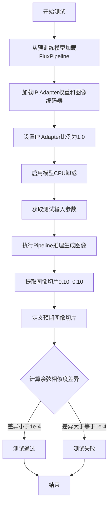

#### 带注释源码

```python
def test_flux_ip_adapter_inference(self):
    """
    测试 Flux Pipeline 加载 IP Adapter 后的推理功能
    
    该测试方法验证：
    1. FluxPipeline 能正确从预训练模型加载
    2. IP Adapter 能正确加载并集成到 pipeline
    3. 图像生成推理能正常工作
    4. 生成的图像与预期结果匹配
    """
    
    # 步骤1: 从预训练模型加载 FluxPipeline
    # 参数说明:
    # - self.repo_id: 模型仓库ID ("black-forest-labs/FLUX.1-dev")
    # - torch_dtype: 使用 bfloat16 精度以提高推理速度并减少内存
    # - text_encoder/text_encoder_2: 设为None，使用预计算的embeddings
    pipe = self.pipeline_class.from_pretrained(
        self.repo_id, 
        torch_dtype=torch.bfloat16, 
        text_encoder=None, 
        text_encoder_2=None
    )
    
    # 步骤2: 加载 IP Adapter
    # IP Adapter 是一种让模型能够参考输入图像进行生成的技术
    # 参数说明:
    # - self.ip_adapter_repo_id: IP Adapter模型仓库 ("XLabs-AI/flux-ip-adapter")
    # - weight_name: 权重文件名 ("ip_adapter.safetensors")
    # - image_encoder_pretrained_model_name_or_path: 图像编码器路径 ("openai/clip-vit-large-patch14")
    pipe.load_ip_adapter(
        self.ip_adapter_repo_id,
        weight_name=self.weight_name,
        image_encoder_pretrained_model_name_or_path=self.image_encoder_pretrained_model_name_or_path,
    )
    
    # 步骤3: 设置 IP Adapter 的影响比例
    # 1.0 表示完全使用 IP Adapter 的图像特征
    pipe.set_ip_adapter_scale(1.0)
    
    # 步骤4: 启用模型CPU卸载
    # 将不常用的模型层卸载到CPU以节省GPU显存
    pipe.enable_model_cpu_offload()
    
    # 步骤5: 获取测试输入参数
    # 包括: prompt_embeds, pooled_prompt_embeds, negative_prompt_embeds,
    #       negative_pooled_prompt_embeds, ip_adapter_image, num_inference_steps等
    inputs = self.get_inputs(torch_device)
    
    # 步骤6: 执行推理
    # 使用加载的 IP Adapter 和输入参数生成图像
    # 返回的 images 是一个数组，取第一个元素得到生成的图像
    image = pipe(**inputs).images[0]
    
    # 步骤7: 提取图像切片用于验证
    # 取图像左上角 10x10 的区域
    image_slice = image[0, :10, :10]
    
    # 步骤8: 定义预期结果
    # 这是预先计算好的正确输出，用于验证推理正确性
    expected_slice = np.array(
        [0.1855, 0.1680, 0.1406, 0.1953, 0.1699, 0.1465, 0.2012, 0.1738, 0.1484, 
         0.2051, 0.1797, 0.1523, 0.2012, 0.1719, 0.1445, 0.2070, 0.1777, 0.1465, 
         0.2090, 0.1836, 0.1484, 0.2129, 0.1875, 0.1523, 0.2090, 0.1816, 0.1484, 
         0.2110, 0.1836, 0.1543],
        dtype=np.float32,
    )
    
    # 步骤9: 验证结果
    # 使用余弦相似度距离比较生成的图像与预期图像
    # 差异必须小于 1e-4 才算通过
    max_diff = numpy_cosine_similarity_distance(expected_slice.flatten(), image_slice.flatten())
    self.assertLess(
        max_diff, 
        1e-4, 
        f"Image slice is different from expected slice: {image_slice} != {expected_slice}"
    )
```


### `FluxPipelineFastTests.get_dummy_components`

该方法用于生成虚拟（测试用）组件字典，包含FluxPipeline所需的文本编码器、VAE、Transformer、分词器和调度器等所有核心组件，以便在单元测试中创建完整的pipeline实例进行功能验证。

参数：

- `num_layers`：`int`，可选，默认值为1，设置Transformer模型的层数
- `num_single_layers`：`int`，可选，默认值为1，设置Transformer模型的单层（独立层）数量

返回值：`Dict[str, Any]`，返回一个包含所有pipeline组件的字典，包括scheduler、text_encoder、text_encoder_2、tokenizer、tokenizer_2、transformer、vae、image_encoder和feature_extractor

#### 流程图

```mermaid
flowchart TD
    A[开始] --> B[设置随机种子 torch.manual_seed(0)]
    B --> C[创建FluxTransformer2DModel]
    C --> D[创建CLIPTextConfig文本编码器配置]
    D --> E[创建CLIPTextModel文本编码器]
    E --> F[从预训练模型加载T5EncoderModel]
    F --> G[加载CLIPTokenizer和AutoTokenizer]
    G --> H[创建AutoencoderKL VAE模型]
    H --> I[创建FlowMatchEulerDiscreteScheduler调度器]
    I --> J[组装组件为字典]
    J --> K[设置image_encoder和feature_extractor为None]
    K --> L[返回组件字典]
```

#### 带注释源码

```python
def get_dummy_components(self, num_layers: int = 1, num_single_layers: int = 1):
    """
    生成用于测试的虚拟组件字典
    
    参数:
        num_layers: Transformer模型的层数，默认1
        num_single_layers: Transformer模型的单层数量，默认1
    
    返回:
        包含所有pipeline组件的字典
    """
    # 设置随机种子以确保测试可复现性
    torch.manual_seed(0)
    
    # 创建FluxTransformer2DModel transformer模型
    # 参数: patch_size=1, in_channels=4, num_layers层数, num_single_layers单层数
    # attention_head_dim=16, num_attention_heads=2, joint_attention_dim=32
    transformer = FluxTransformer2DModel(
        patch_size=1,
        in_channels=4,
        num_layers=num_layers,
        num_single_layers=num_single_layers,
        attention_head_dim=16,
        num_attention_heads=2,
        joint_attention_dim=32,
        pooled_projection_dim=32,
        axes_dims_rope=[4, 4, 8],
    )
    
    # 创建CLIP文本编码器配置
    # 包含: bos_token_id=0, eos_token_id=2, hidden_size=32
    # intermediate_size=37, layer_norm_eps=1e-05, num_attention_heads=4
    # num_hidden_layers=5, pad_token_id=1, vocab_size=1000
    clip_text_encoder_config = CLIPTextConfig(
        bos_token_id=0,
        eos_token_id=2,
        hidden_size=32,
        intermediate_size=37,
        layer_norm_eps=1e-05,
        num_attention_heads=4,
        num_hidden_layers=5,
        pad_token_id=1,
        vocab_size=1000,
        hidden_act="gelu",
        projection_dim=32,
    )

    # 使用配置创建CLIPTextModel文本编码器
    torch.manual_seed(0)
    text_encoder = CLIPTextModel(clip_text_encoder_config)

    # 从预训练模型加载T5EncoderModel作为第二个文本编码器
    torch.manual_seed(0)
    text_encoder_2 = T5EncoderModel.from_pretrained("hf-internal-testing/tiny-random-t5")

    # 加载CLIPTokenizer和AutoTokenizer分词器
    tokenizer = CLIPTokenizer.from_pretrained("hf-internal-testing/tiny-random-clip")
    tokenizer_2 = AutoTokenizer.from_pretrained("hf-internal-testing/tiny-random-t5")

    # 创建AutoencoderKL VAE模型
    # 参数: sample_size=32, in_channels=3, out_channels=3
    # block_out_channels=(4,), layers_per_block=1, latent_channels=1
    torch.manual_seed(0)
    vae = AutoencoderKL(
        sample_size=32,
        in_channels=3,
        out_channels=3,
        block_out_channels=(4,),
        layers_per_block=1,
        latent_channels=1,
        norm_num_groups=1,
        use_quant_conv=False,
        use_post_quant_conv=False,
        shift_factor=0.0609,
        scaling_factor=1.5035,
    )

    # 创建FlowMatchEulerDiscreteScheduler调度器
    scheduler = FlowMatchEulerDiscreteScheduler()

    # 组装并返回所有组件的字典
    return {
        "scheduler": scheduler,
        "text_encoder": text_encoder,
        "text_encoder_2": text_encoder_2,
        "tokenizer": tokenizer,
        "tokenizer_2": tokenizer_2,
        "transformer": transformer,
        "vae": vae,
        "image_encoder": None,       # IP-Adapter图像编码器，测试时设为None
        "feature_extractor": None,    # 特征提取器，测试时设为None
    }
```


### `FluxPipelineFastTests.get_dummy_inputs`

该方法用于生成虚拟的输入参数字典，主要服务于 FluxPipeline 的单元测试。它根据传入的设备和随机种子创建一个包含提示词、生成器、推理步数、引导_scale、图像尺寸等参数的字典，以支持管道的一致性测试。

参数：

- `self`：隐式参数，测试类实例本身
- `device`：设备对象（torch.device 或 str），目标设备，用于确定生成器的设备
- `seed`：int，默认为 0，用于设置随机数生成器的种子，确保测试可重复性

返回值：`Dict`，返回包含虚拟输入参数的字典，包括 prompt、generator、num_inference_steps、guidance_scale、height、width、max_sequence_length 和 output_type

#### 流程图

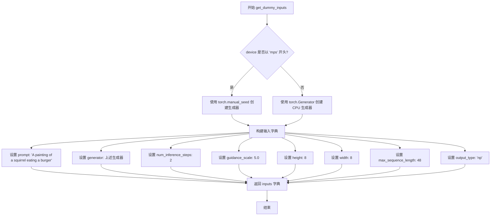

#### 带注释源码

```python
def get_dummy_inputs(self, device, seed=0):
    """
    生成用于 FluxPipeline 测试的虚拟输入参数。
    
    参数:
        device: 目标设备 (torch.device 或 str)
        seed: 随机种子，用于确保测试的可重复性
    
    返回:
        包含测试所需输入参数的字典
    """
    # 针对 Apple MPS 设备使用特殊的随机数生成方式
    if str(device).startswith("mps"):
        # MPS 设备使用 torch.manual_seed 直接设置 CPU 生成器
        generator = torch.manual_seed(seed)
    else:
        # 其他设备使用 CPU 上的 torch.Generator 以确保确定性
        generator = torch.Generator(device="cpu").manual_seed(seed)

    # 构建完整的输入参数字典
    inputs = {
        # 测试用的提示词，描述期望生成的图像内容
        "prompt": "A painting of a squirrel eating a burger",
        # 随机数生成器，用于确保扩散过程的可重复性
        "generator": generator,
        # 推理步数，数值越小测试越快
        "num_inference_steps": 2,
        # 引导 scale，控制文本提示对生成图像的影响程度
        "guidance_scale": 5.0,
        # 输出图像的高度（像素单位，经过 VAE 处理）
        "height": 8,
        # 输出图像的宽度（像素单位，经过 VAE 处理）
        "width": 8,
        # 文本嵌入的最大序列长度
        "max_sequence_length": 48,
        # 输出类型，'np' 表示返回 NumPy 数组
        "output_type": "np",
    }
    return inputs
```


### `FluxPipelineFastTests.test_flux_different_prompts`

该测试方法用于验证FluxPipeline在处理不同提示词时能够产生不同的输出图像，确保管道正确处理多提示词场景。

参数：
- 该方法无显式参数（仅包含隐式`self`）

返回值：`None`，测试方法通过断言验证输出差异

#### 流程图

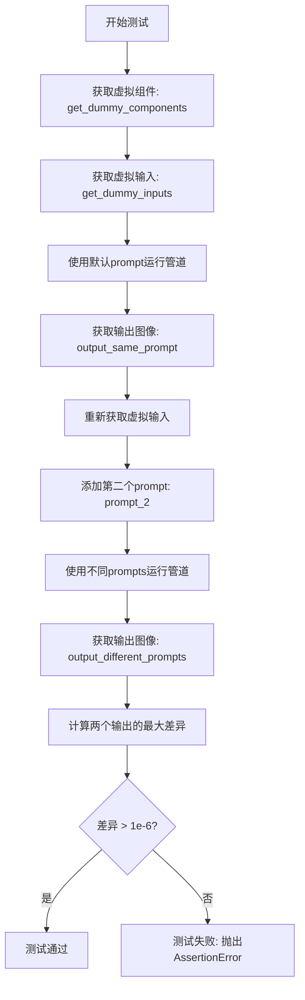

#### 带注释源码

```python
def test_flux_different_prompts(self):
    """测试FluxPipeline对不同提示词的响应差异"""
    
    # 步骤1: 创建管道实例
    # 使用get_dummy_components获取虚拟组件（transformer, text_encoder, vae等）
    # 并将管道移动到指定的torch设备上
    pipe = self.pipeline_class(**self.get_dummy_components()).to(torch_device)

    # 步骤2: 获取默认虚拟输入
    # 包含prompt: "A painting of a squirrel eating a burger"
    # 以及其他参数: generator, num_inference_steps=2, guidance_scale=5.0等
    inputs = self.get_dummy_inputs(torch_device)
    
    # 步骤3: 使用相同prompt运行管道，获取第一次输出
    # output_same_prompt 将是形状为 [height, width, channels] 的numpy数组
    output_same_prompt = pipe(**inputs).images[0]

    # 步骤4: 重新获取输入并添加第二个不同的prompt
    inputs = self.get_dummy_inputs(torch_device)
    inputs["prompt_2"] = "a different prompt"  # 添加第二个提示词
    
    # 步骤5: 使用两个不同的prompts运行管道
    # 管道应分别处理两个prompt并产生不同的输出
    output_different_prompts = pipe(**inputs).images[0]

    # 步骤6: 计算两个输出之间的最大绝对差异
    max_diff = np.abs(output_same_prompt - output_different_prompts).max()

    # 步骤7: 验证输出确实不同
    # 由于某些原因，即使prompts不同，差异也可能不大
    # 因此阈值设为1e-6（相对较小的值）
    self.assertGreater(
        max_diff, 
        1e-6, 
        "Outputs should be different for different prompts."
    )
```

#### 关键组件信息

| 组件名称 | 描述 |
|---------|------|
| `FluxPipeline` | Flux模型的生成管道，负责协调文本编码、transformer处理和VAE解码 |
| `get_dummy_components` | 辅助方法，创建用于测试的虚拟模型组件 |
| `get_dummy_inputs` | 辅助方法，创建用于测试的虚拟输入参数 |
| `torch_device` | 全局变量，指定PyTorch设备（CPU/CUDA） |

#### 潜在技术债务或优化空间

1. **测试断言阈值过低**：当前使用`1e-6`作为差异阈值，这个值非常小，可能无法有效捕捉某些细微的bug。建议根据实际场景调整阈值。
2. **缺少边界情况测试**：未测试空字符串prompt、极长prompt、特殊字符等边界情况。
3. **重复代码**：获取输入的代码重复了两次，可提取为独立方法减少冗余。
4. **缺少性能基准**：测试未包含推理时间等性能指标的验证。

#### 其它项目

**设计目标与约束**：
- 验证FluxPipeline正确处理多提示词输入（通过`prompt_2`参数）
- 确保不同的提示词能够产生有意义的输出差异

**错误处理与异常设计**：
- 使用`assertGreater`进行断言，若失败会抛出`AssertionError`并附带描述信息

**数据流与状态机**：
- 输入状态：单prompt → 双prompt
- 处理流程：文本编码 → Transformer处理 → VAE解码 → 图像输出
- 验证状态：比较两个输出的差异性

**外部依赖与接口契约**：
- 依赖`diffusers`库的`FluxPipeline`类
- 依赖`get_dummy_components()`和`get_dummy_inputs()`提供的测试数据
- 使用全局配置`torch_device`确定计算设备


### `FluxPipelineFastTests.test_fused_qkv_projections`

该测试方法用于验证 FluxPipeline 中 Transformer 模块的 QKV（Query、Key、Value）投影融合功能是否正常工作，确保融合前后的输出结果在数值上保持一致（容差范围内）。

参数：

- `self`：无参数，测试类实例本身

返回值：`None`，该方法为 unittest 测试方法，通过断言验证功能正确性，无显式返回值

#### 流程图

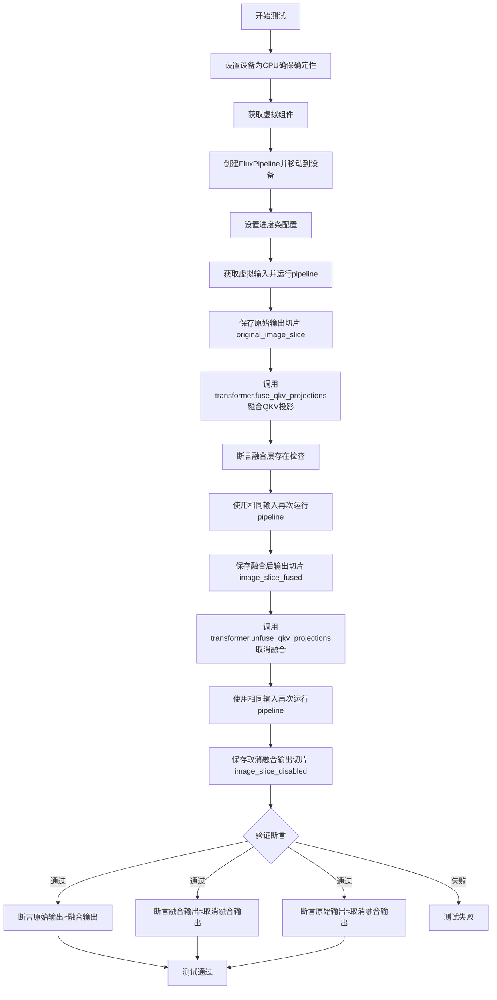

#### 带注释源码

```python
def test_fused_qkv_projections(self):
    # 设置设备为CPU，确保torch.Generator的确定性（避免设备依赖性）
    device = "cpu"
    
    # 获取预定义的虚拟组件（transformer、text_encoder、vae等）
    components = self.get_dummy_components()
    
    # 使用虚拟组件创建FluxPipeline实例
    pipe = self.pipeline_class(**components)
    
    # 将pipeline移动到指定设备
    pipe = pipe.to(device)
    
    # 配置进度条（disable=None表示不禁用）
    pipe.set_progress_bar_config(disable=None)

    # 获取虚拟输入参数（包含prompt、generator、num_inference_steps等）
    inputs = self.get_dummy_inputs(device)
    
    # 第一次运行pipeline，获取原始（未融合QKV）输出
    image = pipe(**inputs).images
    
    # 提取图像最后3x3像素区域作为对比基准
    original_image_slice = image[0, -3:, -3:, -1]

    # 调用transformer的fuse_qkv_projections方法，将QKV投影融合为单一矩阵运算
    # 这是为了优化推理性能，减少矩阵乘法次数
    pipe.transformer.fuse_qkv_projections()
    
    # 断言验证：确保融合操作成功，检查是否存在"to_qkv"融合层
    self.assertTrue(
        check_qkv_fused_layers_exist(pipe.transformer, ["to_qkv"]),
        ("Something wrong with the fused attention layers. Expected all the attention projections to be fused."),
    )

    # 使用相同输入再次运行pipeline（此时QKV已融合）
    inputs = self.get_dummy_inputs(device)
    image = pipe(**inputs).images
    
    # 提取融合后的输出切片
    image_slice_fused = image[0, -3:, -3:, -1]

    # 取消QKV投影融合，恢复到原始状态
    pipe.transformer.unfuse_qkv_projections()
    
    # 再次运行pipeline（QKV已取消融合）
    inputs = self.get_dummy_inputs(device)
    image = pipe(**inputs).images
    
    # 提取取消融合后的输出切片
    image_slice_disabled = image[0, -3:, -3:, -1]

    # 断言1：融合QKV投影不应改变输出结果（容差1e-3）
    self.assertTrue(
        np.allclose(original_image_slice, image_slice_fused, atol=1e-3, rtol=1e-3),
        ("Fusion of QKV projections shouldn't affect the outputs."),
    )
    
    # 断言2：融合状态切换回非融合状态后输出应一致（容差1e-3）
    self.assertTrue(
        np.allclose(image_slice_fused, image_slice_disabled, atol=1e-3, rtol=1e-3),
        ("Outputs, with QKV projection fusion enabled, shouldn't change when fused QKV projections are disabled."),
    )
    
    # 断言3：原始输出与取消融合后的输出应匹配（容差1e-2，容忍度稍大）
    self.assertTrue(
        np.allclose(original_image_slice, image_slice_disabled, atol=1e-2, rtol=1e-2),
        ("Original outputs should match when fused QKV projections are disabled."),
    )
```


### `FluxPipelineFastTests.test_flux_image_output_shape`

该测试方法用于验证 FluxPipeline 在给定不同高度和宽度参数时，输出的图像形状是否符合预期的 VAE 缩放因子对齐要求。测试遍历多组高度宽度组合，确保输出图像的尺寸被正确调整为 VAE 比例因子的偶数倍。

参数：
- `self`：`unittest.TestCase`，测试类实例本身，包含测试所需的状态和方法

返回值：无（`None`），该方法为单元测试方法，通过 `assertEqual` 断言验证图像输出形状，不返回任何值

#### 流程图

```mermaid
flowchart TD
    A[开始测试] --> B[创建FluxPipeline实例]
    B --> C[获取虚拟输入参数]
    C --> D[定义测试用例: height_width_pairs = [(32, 32), (72, 57)]]
    D --> E[遍历height和width组合]
    E --> F[计算expected_height = height - height % (vae_scale_factor * 2)]
    F --> G[计算expected_width = width - width % (vae_scale_factor * 2)]
    G --> H[更新inputs字典中的height和width]
    H --> I[调用pipe执行推理获取图像]
    I --> J[从结果中提取output_height, output_width]
    J --> K{断言: (output_height, output_width) == (expected_height, expected_width)}
    K -->|通过| L{是否还有更多组合?}
    K -->|失败| M[抛出AssertionError]
    L -->|是| E
    L -->|否| N[测试通过]
    M --> N
```

#### 带注释源码

```python
def test_flux_image_output_shape(self):
    """
    测试FluxPipeline在不同高度和宽度输入下的图像输出形状是否符合预期。
    
    该测试方法验证管道能够正确处理各种尺寸的输入，并确保输出图像
    的高度和宽度被调整为VAE缩放因子的偶数倍，以满足VAE的输入要求。
    """
    # 使用虚拟组件创建FluxPipeline实例并移动到测试设备
    # pipeline_class = FluxPipeline
    pipe = self.pipeline_class(**self.get_dummy_components()).to(torch_device)
    
    # 获取虚拟输入参数，包含prompt、generator、num_inference_steps等
    inputs = self.get_dummy_inputs(torch_device)

    # 定义测试用例：不同的高度-宽度组合
    # (32, 32): 标准小尺寸
    # (72, 57): 非方形尺寸，用于验证宽高比的正确处理
    height_width_pairs = [(32, 32), (72, 57)]
    
    # 遍历每组高度宽度进行测试
    for height, width in height_width_pairs:
        # 计算预期高度：减去余数使其能被vae_scale_factor*2整除
        # VAE通常要求输入尺寸为某个因子的倍数，这里是vae_scale_factor*2
        expected_height = height - height % (pipe.vae_scale_factor * 2)
        expected_width = width - width % (pipe.vae_scale_factor * 2)

        # 更新输入参数中的高度和宽度
        inputs.update({"height": height, "width": width})
        
        # 执行管道推理，获取生成的图像
        # 返回的images是一个数组，取第一个元素得到单张图像
        image = pipe(**inputs).images[0]
        
        # 从图像张量中提取高度和宽度
        # 图像形状为 [height, width, channels]
        output_height, output_width, _ = image.shape
        
        # 断言验证输出形状是否与预期形状匹配
        # 如果不匹配，抛出详细的AssertionError包含实际和预期形状
        self.assertEqual(
            (output_height, output_width),
            (expected_height, expected_width),
            f"Output shape {image.shape} does not match expected shape {(expected_height, expected_width)}",
        )
```


### `FluxPipelineFastTests.test_flux_true_cfg`

该方法用于测试 FluxPipeline 的真实分类器自由引导（True CFG）功能，验证在启用 `true_cfg_scale` 参数时，输出图像与不使用该参数时的输出存在差异。

参数：

- `self`：隐式参数，`FluxPipelineFastTests` 类的实例方法，无需显式传递

返回值：`None`，该方法为单元测试方法，通过 `assertFalse` 断言验证行为，不返回任何值

#### 流程图

```mermaid
flowchart TD
    A[开始测试] --> B[创建FluxPipeline实例]
    B --> C[获取虚拟输入参数]
    C --> D[移除generator参数]
    D --> E[不使用TrueCFG生成图像]
    E --> F[保存输出结果: no_true_cfg_out]
    F --> G[添加negative_prompt]
    G --> H[设置true_cfg_scale=2.0]
    H --> I[使用TrueCFG生成图像]
    I --> J[保存输出结果: true_cfg_out]
    J --> K{断言: 两个输出是否不同}
    K -->|是| L[测试通过]
    K -->|否| M[测试失败]
    L --> N[结束]
    M --> N
```

#### 带注释源码

```python
def test_flux_true_cfg(self):
    """
    测试 FluxPipeline 的 True CFG (Classifier-Free Guidance) 功能。
    验证当设置 true_cfg_scale 参数时，输出图像与不设置该参数时的输出不同。
    """
    # 1. 创建 FluxPipeline 实例，使用虚拟组件并移动到测试设备
    # get_dummy_components() 返回包含 scheduler, text_encoder, text_encoder_2,
    # tokenizer, tokenizer_2, transformer, vae 等组件的字典
    pipe = self.pipeline_class(**self.get_dummy_components()).to(torch_device)
    
    # 2. 获取虚拟输入参数
    # 返回包含 prompt, generator, num_inference_steps, guidance_scale,
    # height, width, max_sequence_length, output_type 的字典
    inputs = self.get_dummy_inputs(torch_device)
    
    # 3. 移除 generator 参数，后续使用手动创建的 generator
    inputs.pop("generator")
    
    # 4. 不使用 TrueCFG 模式生成图像
    # 使用 torch.manual_seed(0) 确保可重复性
    # pipe() 返回 PipelineOutput 对象，包含 images 列表
    # .images[0] 获取第一张图像（numpy 数组）
    no_true_cfg_out = pipe(**inputs, generator=torch.manual_seed(0)).images[0]
    
    # 5. 添加负向提示词
    inputs["negative_prompt"] = "bad quality"
    
    # 6. 设置 true_cfg_scale 参数为 2.0，启用 True CFG
    inputs["true_cfg_scale"] = 2.0
    
    # 7. 使用 TrueCFG 模式生成图像
    # 使用相同的随机种子确保可比较性
    true_cfg_out = pipe(**inputs, generator=torch.manual_seed(0)).images[0]
    
    # 8. 断言验证：两种模式的输出应该不同
    # np.allclose() 返回 True 如果两个数组在容差范围内相等
    # assertFalse 期望输出不同
    self.assertFalse(
        np.allclose(no_true_cfg_out, true_cfg_out), 
        "Outputs should be different when true_cfg_scale is set."
    )
```


### `FluxPipelineSlowTests.setUp`

这是 FluxPipeline 慢速测试类的初始化方法，用于在每个测试方法执行前设置测试环境，包括垃圾回收和清空 GPU 缓存。

参数：

- `self`：`unittest.TestCase`，测试用例实例本身

返回值：`None`，该方法不返回任何值，仅执行初始化操作

#### 流程图

```mermaid
flowchart TD
    A[开始 setUp] --> B[调用父类 setUp]
    B --> C[执行 gc.collect 垃圾回收]
    C --> D[调用 backend_empty_cache 清理 GPU 缓存]
    D --> E[结束 setUp]
```

#### 带注释源码

```python
def setUp(self):
    # 调用父类的 setUp 方法，确保 unittest.TestCase 的初始化逻辑被执行
    super().setUp()
    
    # 执行 Python 垃圾回收，释放未使用的内存对象
    gc.collect()
    
    # 清空 GPU 缓存，释放 GPU 显存，为测试准备干净的硬件环境
    backend_empty_cache(torch_device)
```


### `FluxPipelineSlowTests.tearDown`

该方法是测试用例的清理方法，用于在每个测试方法执行完毕后进行资源释放，包括调用父类的tearDown方法、强制进行Python垃圾回收以及清理GPU/CUDA缓存，以确保测试环境不会因为残留的GPU内存或其他资源而影响后续测试。

参数：
- `self`：`unittest.TestCase`，调用此方法的测试用例实例本身

返回值：`None`，该方法不返回任何值，仅执行清理操作

#### 流程图

```mermaid
flowchart TD
    A[开始 tearDown] --> B[调用父类 tearDown 方法]
    B --> C[执行 gc.collect 强制垃圾回收]
    C --> D[调用 backend_empty_cache 清理后端缓存]
    D --> E[结束 tearDown]
```

#### 带注释源码

```python
def tearDown(self):
    """
    测试用例清理方法，在每个测试方法执行完毕后被调用
    """
    # 调用父类（unittest.TestCase）的tearDown方法，执行基类定义的清理逻辑
    super().tearDown()
    
    # 强制进行Python垃圾回收，释放不再使用的对象
    gc.collect()
    
    # 清理GPU/CUDA缓存，释放GPU显存资源
    backend_empty_cache(torch_device)
```


### `FluxPipelineSlowTests.get_inputs`

该方法用于为 FluxPipeline 推理测试准备输入参数。它从 Hugging Face Hub 下载预计算的文本嵌入向量，并结合生成器、推理步数、引导比例等参数构建完整的输入字典，以支持 FluxPipeline 的离线推理测试。

参数：

- `self`：隐式参数，FluxPipelineSlowTests 测试类实例
- `device`：`torch.device`，指定运行设备（虽然代码中未直接使用，仅在调用时传入 torch_device）
- `seed`：`int`，随机种子，默认为 0，用于初始化生成器

返回值：`Dict[str, Any]`，包含以下键值的字典：
- `prompt_embeds`：`torch.Tensor`，预计算的提示词嵌入向量
- `pooled_prompt_embeds`：`torch.Tensor`，预计算的池化提示词嵌入向量
- `num_inference_steps`：`int`，推理步数，固定为 2
- `guidance_scale`：`float`，引导比例，固定为 0.0（无分类器自由引导）
- `max_sequence_length`：`int`，最大序列长度，固定为 256
- `output_type`：`str`，输出类型，固定为 "np"（NumPy 数组）
- `generator`：`torch.Generator`，PyTorch 随机数生成器

#### 流程图

```mermaid
flowchart TD
    A[开始 get_inputs] --> B[创建随机数生成器]
    B --> C[从 Hugging Face Hub 下载 prompt_embeds]
    C --> D[将 prompt_embeds 移至 torch_device]
    E[从 Hugging Face Hub 下载 pooled_prompt_embeds]
    D --> F[将 pooled_prompt_embeds 移至 torch_device]
    F --> G[构建输入参数字典]
    G --> H[返回包含所有输入参数的字典]
```

#### 带注释源码

```python
def get_inputs(self, device, seed=0):
    """
    为 FluxPipeline 推理测试准备输入参数。
    
    参数:
        device: torch.device, 运行设备（此方法中未直接使用）
        seed: int, 随机种子，用于生成器初始化
    
    返回:
        Dict[str, Any]: 包含推理所需所有参数的字典
    """
    # 使用 CPU 设备创建随机数生成器，并用种子初始化
    # 选择 CPU 是为了确保跨设备的一致性和确定性
    generator = torch.Generator(device="cpu").manual_seed(seed)

    # 从 Hugging Face Hub 下载预计算的提示词嵌入向量
    # repo_id="diffusers/test-slices" 是测试数据集仓库
    # filename="flux/prompt_embeds.pt" 是嵌入向量文件
    prompt_embeds = torch.load(
        hf_hub_download(repo_id="diffusers/test-slices", repo_type="dataset", filename="flux/prompt_embeds.pt")
    ).to(torch_device)
    
    # 下载预计算的池化提示词嵌入向量（经过注意力池化处理的文本表示）
    pooled_prompt_embeds = torch.load(
        hf_hub_download(
            repo_id="diffusers/test-slices", repo_type="dataset", filename="flux/pooled_prompt_embeds.pt"
        )
    ).to(torch_device)
    
    # 构建并返回完整的输入参数字典
    # 包含：嵌入向量、推理步数、引导比例、最大序列长度、输出类型和生成器
    return {
        "prompt_embeds": prompt_embeds,
        "pooled_prompt_embeds": pooled_prompt_embeds,
        "num_inference_steps": 2,
        "guidance_scale": 0.0,
        "max_sequence_length": 256,
        "output_type": "np",
        "generator": generator,
    }
```


### `FluxPipelineSlowTests.test_flux_inference`

该方法是 FluxPipeline 慢速测试类的推理测试方法，用于验证 FluxPipeline 从预训练模型加载后能否正确执行图像生成推理，并通过与预期输出进行相似度比较来确保推理结果的准确性。

参数：

- 无显式参数（继承自 unittest.TestCase，使用 self）

返回值：`None`，该方法为测试方法，通过 unittest 断言验证推理结果，不返回实际数据

#### 流程图

```mermaid
flowchart TD
    A[开始 test_flux_inference] --> B[从预训练模型加载 FluxPipeline]
    B --> C[设置 torch_dtype 为 bfloat16]
    C --> D[将 pipeline 移动到 torch_device]
    D --> E[调用 get_inputs 获取推理参数]
    E --> F[执行 pipeline 推理生成图像]
    F --> G[提取图像切片 image[0, :10, :10]]
    H[加载期望切片数据 Expectations] --> I[获取期望切片 expected_slice]
    G --> I
    I --> J[计算 numpy_cosine_similarity_distance]
    J --> K{max_diff < 1e-4?}
    K -->|是| L[测试通过]
    K -->|否| M[测试失败, 抛出断言错误]
```

#### 带注释源码

```python
def test_flux_inference(self):
    """测试 FluxPipeline 的推理功能，验证生成图像与预期结果的一致性"""
    
    # 从预训练模型加载 FluxPipeline
    # 使用 bfloat16 精度以减少显存占用
    # text_encoder 和 text_encoder_2 设为 None 以加速加载
    pipe = self.pipeline_class.from_pretrained(
        self.repo_id, torch_dtype=torch.bfloat16, text_encoder=None, text_encoder_2=None
    ).to(torch_device)

    # 获取推理所需的输入参数
    # 包括 prompt_embeds, pooled_prompt_embeds, num_inference_steps 等
    inputs = self.get_inputs(torch_device)

    # 执行推理，生成图像
    # 返回 PipelineOutput 对象，包含 images 列表
    image = pipe(**inputs).images[0]
    
    # 提取图像的一个切片用于验证
    # 取第一张图像的 0:10 行和 0:10 列
    image_slice = image[0, :10, :10]
    # fmt: off

    # 定义不同设备和配置下的期望输出切片
    expected_slices = Expectations(
        {
            # CUDA 设备，无特定版本
            ("cuda", None): np.array([0.3242, 0.3203, 0.3164, 0.3164, 0.3125, 0.3125, 0.3281, 0.3242, 0.3203, 0.3301, 0.3262, 0.3242, 0.3281, 0.3242, 0.3203, 0.3262, 0.3262, 0.3164, 0.3262, 0.3281, 0.3184, 0.3281, 0.3281, 0.3203, 0.3281, 0.3281, 0.3164, 0.3320, 0.3320, 0.3203], dtype=np.float32,),
            # XPU 设备，版本 3
            ("xpu", 3): np.array([0.3301, 0.3281, 0.3359, 0.3203, 0.3203, 0.3281, 0.3281, 0.3301, 0.3340, 0.3281, 0.3320, 0.3359, 0.3281, 0.3301, 0.3320, 0.3242, 0.3301, 0.3281, 0.3242, 0.3320, 0.3320, 0.3281, 0.3320, 0.3320, 0.3262, 0.3320, 0.3301, 0.3301, 0.3359, 0.3320], dtype=np.float32,),
        }
    )
    # 根据当前环境获取对应的期望切片
    expected_slice = expected_slices.get_expectation()
    # fmt: on

    # 计算生成图像切片与期望切片的余弦相似度距离
    max_diff = numpy_cosine_similarity_distance(expected_slice.flatten(), image_slice.flatten())
    
    # 断言：余弦相似度距离应小于 1e-4
    # 确保推理结果与预期一致
    self.assertLess(
        max_diff, 1e-4, f"Image slice is different from expected slice: {image_slice} != {expected_slice}"
    )
```


### `FluxIPAdapterPipelineSlowTests.setUp`

该方法是 FluxIPAdapterPipelineSlowTests 测试类的初始化方法，在每个测试方法运行前被调用，用于执行测试环境的准备工作，包括调用父类的 setUp 方法、显式触发垃圾回收以及清空后端缓存，以确保测试环境的一致性和充足的内存资源。

参数：

- `self`：`FluxIPAdapterPipelineSlowTests`，测试类的实例本身

返回值：`None`，该方法不返回任何值，仅执行副作用操作（清理内存）

#### 流程图

```mermaid
flowchart TD
    A[开始 setUp] --> B[调用父类 setUp 方法: super().setUp]
    B --> C[执行垃圾回收: gc.collect]
    C --> D[清空后端缓存: backend_empty_cache]
    D --> E[结束 setUp]
```

#### 带注释源码

```python
def setUp(self):
    # 调用 unittest.TestCase 的 setUp 方法，执行基类初始化逻辑
    super().setUp()
    # 显式触发 Python 垃圾回收，释放未使用的内存对象
    gc.collect()
    # 清空 GPU/后端缓存，确保测试开始时显存/内存处于干净状态
    backend_empty_cache(torch_device)
```


### `FluxIPAdapterPipelineSlowTests.tearDown`

该方法是测试类的清理方法，在每个测试方法执行完毕后被调用，用于清理Python垃圾回收和GPU显存，确保测试环境干净，避免内存泄漏。

参数：

- `self`：`FluxIPAdapterPipelineSlowTests`，表示调用该方法的实例对象本身

返回值：`None`，该方法不返回任何值，仅执行清理操作

#### 流程图

```mermaid
flowchart TD
    A[开始 tearDown] --> B[调用 super().tearDown]
    B --> C[执行 gc.collect]
    C --> D[调用 backend_empty_cache]
    D --> E[结束 tearDown]
```

#### 带注释源码

```python
def tearDown(self):
    """
    测试结束后的清理方法
    
    该方法在每个测试方法执行完毕后自动调用，
    用于清理测试过程中产生的内存占用和GPU缓存。
    """
    # 调用父类的tearDown方法，确保父类的清理逻辑也被执行
    super().tearDown()
    
    # 强制进行Python垃圾回收，释放测试过程中创建的对象
    gc.collect()
    
    # 清理GPU/后端缓存，释放GPU显存
    backend_empty_cache(torch_device)
```


### `FluxIPAdapterPipelineSlowTests.get_inputs`

该方法是 Flux IP Adapter Pipeline 慢速测试的输入准备函数，用于生成管道推理所需的完整输入参数字典，包括预计算的 prompt embeddings、IP Adapter 图像、负样本 embeddings 以及推理配置参数。

参数：

- `self`：`FluxIPAdapterPipelineSlowTests`，测试类实例本身
- `device`：`str`，目标设备标识符，用于判断是否需要创建特定设备的随机数生成器（如 "mps" 设备使用 `torch.manual_seed`，其他设备使用 CPU 生成器）
- `seed`：`int`（默认值 0），随机种子，用于初始化随机数生成器以确保结果可复现

返回值：`Dict[str, Any]`，包含以下键值对的字典：
- `prompt_embeds`：`torch.Tensor`，从远程数据集下载的预计算 prompt embeddings
- `pooled_prompt_embeds`：`torch.Tensor`，从远程数据集下载的预计算 pooled prompt embeddings
- `negative_prompt_embeds`：`torch.Tensor`，与 prompt_embeds 形状相同的零张量，作为负样本 prompt embeddings
- `negative_pooled_prompt_embeds`：`torch.Tensor`，与 pooled_prompt_embeds 形状相同的零张量，作为负样本 pooled embeddings
- `ip_adapter_image`：`numpy.ndarray`，形状为 (1024, 1024, 3) 的全零 uint8 数组，作为 IP Adapter 的输入图像
- `num_inference_steps`：`int`，推理步数，固定为 2
- `guidance_scale`：`float`，CFG 引导强度，固定为 3.5
- `true_cfg_scale`：`float`，True CFG 缩放因子，固定为 4.0
- `max_sequence_length`：`int`，最大序列长度，固定为 256
- `output_type`：`str`，输出类型，固定为 "np"（NumPy 数组）
- `generator`：`torch.Generator`，PyTorch 随机数生成器实例

#### 流程图

```mermaid
flowchart TD
    A[开始 get_inputs] --> B{device 是否以 'mps' 开头?}
    B -->|是| C[使用 torch.manual_seed 生成器]
    B -->|否| D[使用 CPU Generator 创建随机生成器]
    C --> E[从 HuggingFace Hub 下载 prompt_embeds]
    D --> E
    E --> F[从 HuggingFace Hub 下载 pooled_prompt_embeds]
    F --> G[创建 negative_prompt_embeds 零张量]
    G --> H[创建 negative_pooled_prompt_embeds 零张量]
    H --> I[创建 1024x1024x3 全零图像数组]
    I --> J[构建并返回参数字典]
    J --> K[结束]
```

#### 带注释源码

```python
def get_inputs(self, device, seed=0):
    """
    准备 Flux IP Adapter Pipeline 推理所需的输入参数。
    
    参数:
        device: 目标设备字符串标识符
        seed: 随机种子，默认为 0
    
    返回:
        包含所有管道推理参数的字典
    """
    # 根据设备类型选择随机数生成器创建方式
    # MPS 设备使用 torch.manual_seed，其他设备使用 CPU 生成器
    if str(device).startswith("mps"):
        generator = torch.manual_seed(seed)
    else:
        generator = torch.Generator(device="cpu").manual_seed(seed)

    # 从 HuggingFace Hub 下载预计算的 prompt embeddings
    # 这些是预先编码的文本嵌入，用于加速测试
    prompt_embeds = torch.load(
        hf_hub_download(repo_id="diffusers/test-slices", repo_type="dataset", filename="flux/prompt_embeds.pt")
    )
    # 下载预计算的 pooled prompt embeddings
    pooled_prompt_embeds = torch.load(
        hf_hub_download(
            repo_id="diffusers/test-slices", repo_type="dataset", filename="flux/pooled_prompt_embeds.pt"
        )
    )
    # 创建负样本 prompt embeddings（零张量）
    negative_prompt_embeds = torch.zeros_like(prompt_embeds)
    # 创建负样本 pooled prompt embeddings（零张量）
    negative_pooled_prompt_embeds = torch.zeros_like(pooled_prompt_embeds)
    # 创建 IP Adapter 输入图像（全零 RGB 图像）
    ip_adapter_image = np.zeros((1024, 1024, 3), dtype=np.uint8)
    
    # 返回完整的输入参数字典
    return {
        "prompt_embeds": prompt_embeds,
        "pooled_prompt_embeds": pooled_prompt_embeds,
        "negative_prompt_embeds": negative_prompt_embeds,
        "negative_pooled_prompt_embeds": negative_pooled_prompt_embeds,
        "ip_adapter_image": ip_adapter_image,
        "num_inference_steps": 2,
        "guidance_scale": 3.5,
        "true_cfg_scale": 4.0,
        "max_sequence_length": 256,
        "output_type": "np",
        "generator": generator,
    }
```


### `FluxIPAdapterPipelineSlowTests.test_flux_ip_adapter_inference`

这是一个集成测试方法，用于验证 Flux 模型的 IP Adapter 推理功能是否正常工作。测试流程包括：加载预训练模型、加载 IP Adapter 权重、设置适配器参数、执行推理，并验证输出图像与预期结果的一致性。

参数：

- `self`：隐式参数，类型为 `FluxIPAdapterPipelineSlowTests`，表示测试类实例本身

返回值：`None`，无返回值（测试方法）

#### 流程图

```mermaid
flowchart TD
    A[开始测试] --> B[从预训练模型加载FluxPipeline]
    B --> C[加载IP Adapter权重和图像编码器]
    C --> D[设置IP Adapter比例为1.0]
    D --> E[启用模型CPU卸载]
    E --> F[获取测试输入数据]
    F --> G[执行管道推理生成图像]
    G --> H[提取图像切片]
    H --> I[计算预期切片与实际切片的余弦相似度距离]
    I --> J{差异小于阈值?}
    J -->|是| K[测试通过]
    J -->|否| L[测试失败，抛出断言错误]
```

#### 带注释源码

```python
def test_flux_ip_adapter_inference(self):
    """
    测试 Flux IP Adapter 的推理功能。
    验证使用 IP Adapter 时模型能够正确生成图像，并且输出与预期结果一致。
    """
    # 步骤1: 从预训练模型创建 FluxPipeline
    # 使用 bfloat16 精度，text_encoder 和 text_encoder_2 设为 None（使用预计算的 embeddings）
    pipe = self.pipeline_class.from_pretrained(
        self.repo_id,  # "black-forest-labs/FLUX.1-dev"
        torch_dtype=torch.bfloat16,
        text_encoder=None,
        text_encoder_2=None
    )
    
    # 步骤2: 加载 IP Adapter
    # 从 HuggingFace Hub 下载并加载 IP Adapter 权重和图像编码器
    pipe.load_ip_adapter(
        self.ip_adapter_repo_id,  # "XLabs-AI/flux-ip-adapter"
        weight_name=self.weight_name,  # "ip_adapter.safetensors"
        image_encoder_pretrained_model_name_or_path=self.image_encoder_pretrained_model_name_or_path,  # "openai/clip-vit-large-patch14"
    )
    
    # 步骤3: 设置 IP Adapter 的权重比例
    # 1.0 表示完全使用 IP Adapter 的影响
    pipe.set_ip_adapter_scale(1.0)
    
    # 步骤4: 启用模型 CPU 卸载
    # 将模型分片加载到 CPU 以节省 GPU 显存
    pipe.enable_model_cpu_offload()
    
    # 步骤5: 获取测试输入数据
    # 包括 prompt embeddings、IP Adapter 图像、推理步数等参数
    inputs = self.get_inputs(torch_device)
    
    # 步骤6: 执行推理
    # 使用加载的模型和输入数据生成图像
    # 返回的 images 是一个列表，取第一个元素得到生成的图像
    image = pipe(**inputs).images[0]
    
    # 步骤7: 提取图像切片
    # 取图像的第一个通道的左上角 10x10 区域用于验证
    image_slice = image[0, :10, :10]
    
    # 步骤8: 定义预期输出切片
    # 这是一个预先计算好的预期图像切片
    expected_slice = np.array(
        [0.1855, 0.1680, 0.1406, 0.1953, 0.1699, 0.1465, 0.2012, 0.1738, 0.1484, 0.2051, 0.1797, 0.1523, 0.2012, 0.1719, 0.1445, 0.2070, 0.1777, 0.1465, 0.2090, 0.1836, 0.1484, 0.2129, 0.1875, 0.1523, 0.2090, 0.1816, 0.1484, 0.2110, 0.1836, 0.1543],
        dtype=np.float32,
    )
    
    # 步骤9: 计算相似度并验证
    # 使用余弦相似度距离比较预期切片和实际切片
    # 差异必须小于 1e-4，否则测试失败
    max_diff = numpy_cosine_similarity_distance(expected_slice.flatten(), image_slice.flatten())
    self.assertLess(
        max_diff, 1e-4, f"Image slice is different from expected slice: {image_slice} != {expected_slice}"
    )
```

## 关键组件


### FluxPipeline

FluxPipeline是Black Forest Labs开发的FLUX.1图像生成模型的核心管道类，负责协调文本编码、图像transformer处理和VAE解码，生成高质量图像。

### FasterCacheConfig

快速缓存配置类，用于设置推理过程中的各种缓存优化参数，包括空间注意力跳过范围、时间步跳过范围、无条件批处理跳过范围以及注意力权重回调函数，支持指导蒸馏模式。

### FluxTransformer2DModel

Flux图像生成的Transformer模型，处理潜在空间的图像特征，执行自注意力操作，是生成过程的核心组件。

### CLIPTextModel和T5EncoderModel

CLIP文本编码器和T5编码器，分别用于将文本提示转换为语义嵌入，为图像生成提供文本条件信息。

### AutoencoderKL

变分自编码器（VAE），负责将潜在空间表示解码为最终图像，并可将图像编码回潜在空间进行压缩。

### FlowMatchEulerDiscreteScheduler

流匹配欧拉离散调度器，用于控制扩散模型的去噪推理过程，管理噪声调度和采样步骤。

### PipelineTesterMixin

管道测试混入类，提供通用测试方法，验证pipeline的基本功能如输出形状、参数处理等。

### FluxIPAdapterTesterMixin

Flux IP适配器测试混入类，专门测试图像提示适配器功能，允许使用图像作为条件引导生成。

### FasterCacheTesterMixin

快速缓存测试混入类，测试FasterCache优化策略，验证推理加速和内存优化效果。

### FirstBlockCacheTesterMixin

首块缓存测试混入类，测试transformer首块的缓存优化，减少重复计算。

### TaylorSeerCacheTesterMixin

Taylor Seer缓存测试混入类，测试高阶缓存策略，使用泰勒展开近似优化注意力计算。

### MagCacheTesterMixin

Mag缓存测试混入类，测试MAG缓存机制，一种针对Transformer的内存高效注意力缓存方法。

### PyramidAttentionBroadcastTesterMixin

金字塔注意力广播测试混入类，测试金字塔式注意力广播优化，提高大规模图像生成效率。

### check_qkv_fused_layers_exist

辅助函数，用于检查Transformer中QKV投影是否已融合，用于验证注意力层优化。

### test_flux_different_prompts

测试函数，验证相同pipeline对不同提示词产生不同输出，确保文本条件正确影响生成结果。

### test_fused_qkv_projections

测试函数，验证QKV投影融合优化不影响输出质量，测试融合/解融操作的功能正确性。

### test_flux_true_cfg

测试函数，验证真实分类器自由引导（true_cfg）功能，允许更精细的条件控制生成。

### 量化策略与反量化支持

代码中使用torch_dtype=torch.bfloat16指定推理精度，支持不同硬件的量化推理。

### 惰性加载与缓存

使用hf_hub_download进行预计算嵌入的惰性加载，通过各种Cache配置实现推理优化。

### 设备管理与内存优化

使用enable_model_cpu_offload()进行CPU卸载，backend_empty_cache()管理GPU内存，gc.collect()清理内存。


## 问题及建议


### 已知问题

-   **重复代码**：两个 Slow 测试类（`FluxPipelineSlowTests` 和 `FluxIPAdapterPipelineSlowTests`）的 `setUp` 和 `tearDown` 方法几乎完全相同，造成代码冗余。
-   **魔法数字和硬编码值**：多处使用硬编码的数值如 `num_layers=1`、`num_single_layers=1`、`num_inference_steps=2`、`height=8`、`width=8` 等，缺乏配置化和参数化。
-   **测试配置硬编码**：`test_xformers_attention = False` 和 `FasterCacheConfig` 中的参数（如 `spatial_attention_block_skip_range=2`）是硬编码的，可能不适用于所有测试场景。
-   **资源管理不完善**：Slow 测试中直接加载大型预训练模型（`T5EncoderModel.from_pretrained`），未使用 `@torch.no_grad()` 装饰器来减少内存占用，可能导致内存泄漏或 OOM。
-   **设备兼容性处理不一致**：MPS 设备使用 `torch.manual_seed(seed)`，而其他设备使用 `torch.Generator(device="cpu")`，这种不一致可能导致行为差异。
-   **测试隔离性问题**：测试类继承了大量 mixin（`PipelineTesterMixin`、`FluxIPAdapterTesterMixin` 等），增加了测试的复杂性和耦合度，某个 mixin 的变更可能影响所有测试。
-   **异常处理缺失**：代码中未对模型加载失败、文件不存在等异常情况进行处理。
-   **测试覆盖不足**：部分测试如 `test_flux_true_cfg` 仅验证输出不同，未验证 `true_cfg_scale` 的具体效果是否正确。

### 优化建议

-   **提取公共基类**：将 `setUp` 和 `tearDown` 方法提取到公共基类中，减少重复代码。
-   **参数化配置**：使用配置文件或类属性来管理测试参数（如 `num_layers`、`num_inference_steps` 等），提高测试的灵活性。
-   **添加资源管理**：在 Slow 测试方法上添加 `@torch.no_grad()` 装饰器，并在模型加载后及时释放不再需要的资源。
-   **统一设备处理**：封装设备判断逻辑，统一随机数生成器的创建方式，避免设备相关的行为差异。
-   **增加错误处理**：在模型加载和推理过程中添加 try-except 块，处理可能的异常情况。
-   **优化测试断言**：为关键测试添加更详细的断言信息，验证具体功能而非仅验证"不同"。

## 其它


### 设计目标与约束

本代码旨在对 FluxPipeline 进行全面的单元测试验证，确保 Flux 模型在不同配置下的推理功能正常工作。测试类遵循以下约束：快速测试使用虚拟组件（dummy components）进行，不依赖外部模型权重；慢速测试需要加载真实模型权重，仅在有大型加速器（如 GPU、XPU）且标记为 nightly 或 slow 时运行。

### 错误处理与异常设计

测试用例通过 `unittest.TestCase` 的断言方法进行错误验证。主要包括：`assertGreater` 用于验证不同 prompt 产生不同输出；`assertTrue` 与 `np.allclose` 结合验证 QKV 融合投影功能的正确性；`assertEqual` 验证输出形状符合预期；`assertLess` 通过余弦相似度距离验证图像输出与期望值的差异在容差范围内。

### 数据流与状态机

测试数据流遵循以下路径：首先通过 `get_dummy_components()` 或 `get_inputs()` 准备组件和输入参数；然后创建 Pipeline 实例并移至目标设备；接着调用 Pipeline 的 `__call__` 方法执行推理；最后验证输出的图像或嵌入。状态转换包括：Pipeline 创建 → 模型加载 → 参数设置 → 推理执行 → 结果验证。

### 外部依赖与接口契约

本代码依赖以下核心外部包：`diffusers` 提供 FluxPipeline、FluxTransformer2DModel、AutoencoderKL 等组件；`transformers` 提供 CLIPTextModel、CLIPTokenizer、T5EncoderModel；`huggingface_hub` 用于下载测试数据集；`numpy` 用于数值比较；`torch` 用于张量操作。接口契约要求 Pipeline 必须支持 `prompt`、`guidance_scale`、`num_inference_steps`、`output_type` 等标准参数。

### 性能考虑与优化空间

代码中包含多种缓存和加速配置测试：FasterCacheConfig 用于测试注意力缓存优化；IP-Adapter 测试包含 `enable_model_cpu_offload()` 调用以优化内存使用；`gc.collect()` 和 `backend_empty_cache()` 用于在测试前后管理 GPU 内存。潜在优化空间包括：减少重复的模型加载、增加更多量化配置测试、添加推理时间基准测试。

### 测试覆盖范围

测试覆盖以下场景：不同 prompt 产生不同输出验证；QKV 融合与解融的正确性；不同分辨率下的输出形状验证；True CFG 机制的有效性；完整模型推理（慢速测试）；IP-Adapter 图像条件生成（慢速测试）。继承自多个 Mixin 类以获得更全面的测试覆盖，包括 FasterCache、FirstBlockCache、TaylorSeerCache、MagCache 等缓存机制的测试。

### 版本兼容性

代码使用 `torch_dtype=torch.bfloat16` 进行模型加载，表明需要支持半精度浮点的 GPU。测试对设备类型有特定处理：MPS 设备使用 `torch.manual_seed`，其他设备使用 `torch.Generator`。需要 Python 3.8+、PyTorch 2.0+、diffusers 0.30.0+ 版本支持。

### 安全考虑

测试代码本身不涉及敏感操作，但加载外部模型权重时应注意：使用官方认证的模型仓库（black-forest-labs、hf-internal-testing、XLabs-AI 等）；测试数据集来自 diffusers 官方测试切片；IP-Adapter 测试中加载 CLIP 视觉模型用于图像编码。


    