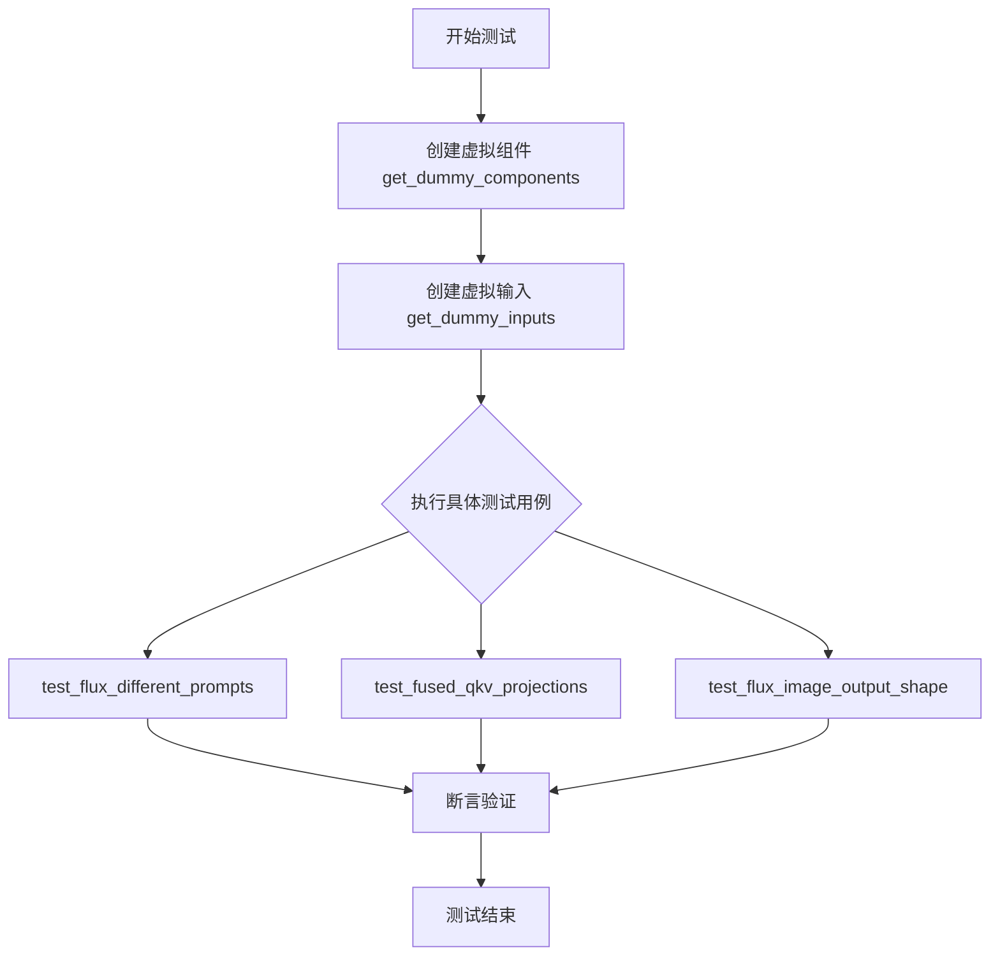
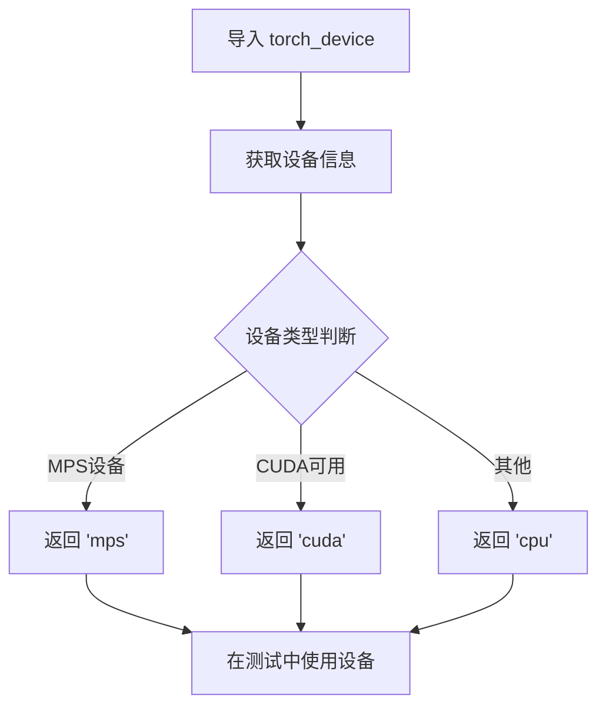
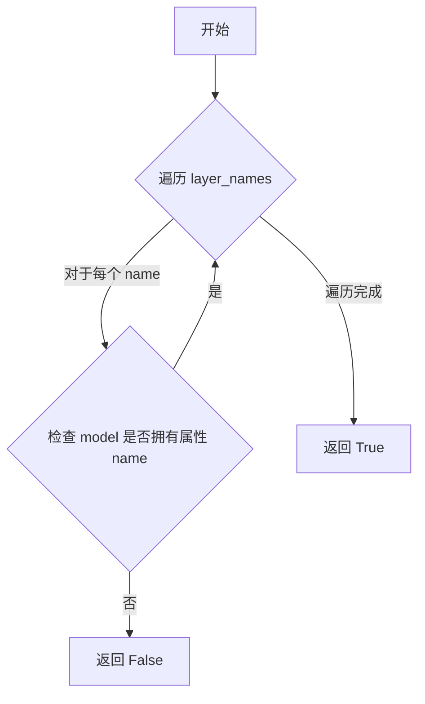
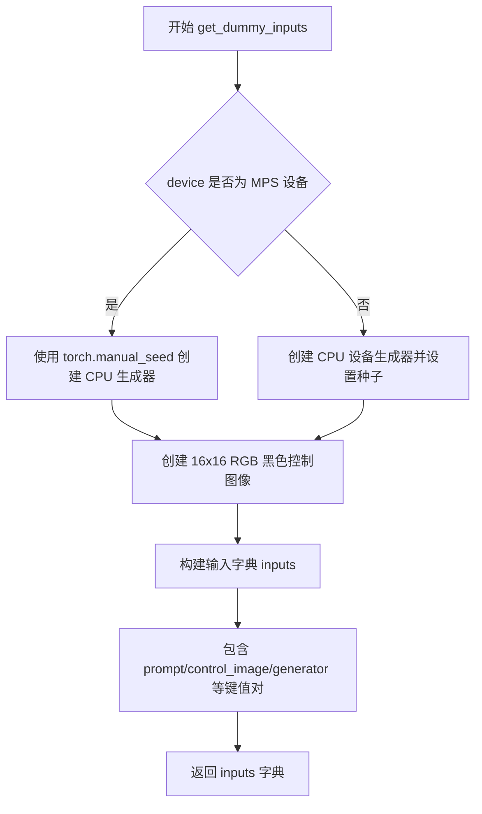
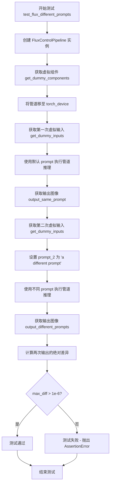
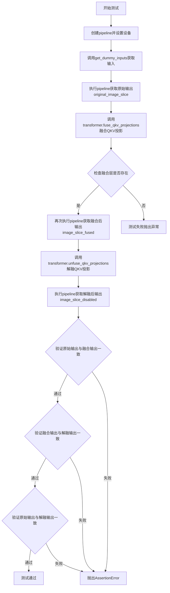

# `diffusers\tests\pipelines\flux\test_pipeline_flux_control.py` 详细设计文档

该文件是一个针对FluxControlPipeline的单元测试类，继承自unittest.TestCase和PipelineTesterMixin，用于验证Flux控制管道的各项功能，包括不同提示词处理、QKV投影融合以及图像输出形状等核心功能。

## 整体流程



## 类结构

```
FluxControlPipelineFastTests (unittest.TestCase + PipelineTesterMixin)
├── 类属性: pipeline_class, params, batch_params, test_xformers_attention, test_layerwise_casting, test_group_offloading
└── 方法: get_dummy_components, get_dummy_inputs, test_flux_different_prompts, test_fused_qkv_projections, test_flux_image_output_shape
```

## 全局变量及字段


### `FluxControlPipelineFastTests.pipeline_class`
    
指定测试所用的管道类，即 FluxControlPipeline，用于图像生成任务

类型：`type[FluxControlPipeline]`
    


### `FluxControlPipelineFastTests.params`
    
包含管道参数的不可变集合，定义了可配置的输入参数如 prompt、height、width 等

类型：`frozenset[str]`
    


### `FluxControlPipelineFastTests.batch_params`
    
包含支持批处理的参数集合，目前仅包含 prompt 用于批量图像生成测试

类型：`frozenset[str]`
    


### `FluxControlPipelineFastTests.test_xformers_attention`
    
标识是否测试 xformers 注意力机制，Flux 模型无 xformers 处理器因此设为 False

类型：`bool`
    


### `FluxControlPipelineFastTests.test_layerwise_casting`
    
标识是否测试逐层类型转换功能，设为 True 以验证层间数据类型转换的正确性

类型：`bool`
    


### `FluxControlPipelineFastTests.test_group_offloading`
    
标识是否测试模型组卸载功能，设为 True 以验证模型分组的内存释放和加载逻辑

类型：`bool`
    
    

## 全局函数及方法


### `torch_device` (导入)

`torch_device` 是从 `testing_utils` 模块导入的设备标识符，用于指定 PyTorch 张量和模型的计算设备（如 "cpu"、"cuda" 等）。它是一个模块级变量或函数，在测试中用于确保管道和输入数据在正确的设备上运行。

#### 参数信息

由于 `torch_device` 是从外部模块导入的变量/函数，其具体参数需要查看 `testing_utils` 模块的源码。根据代码中的使用方式，可以推断：

- 在 `pipe.to(torch_device)` 中：无需额外参数
- 在 `get_dummy_inputs(torch_device)` 中：作为参数传入

#### 返回值

- `torch.device` 或 `str`，返回 PyTorch 设备对象或设备字符串（如 "cpu"、"cuda"、"cuda:0"）

#### 流程图



#### 带注释源码

```python
# 从 testing_utils 模块导入 torch_device
# 这个模块级变量/函数用于获取当前测试环境支持的 PyTorch 设备
from ...testing_utils import torch_device

# 使用示例 1: 将管道移动到指定设备
pipe = self.pipeline_class(**self.get_dummy_components()).to(torch_device)

# 使用示例 2: 作为参数传递给获取虚拟输入的函数
inputs = self.get_dummy_inputs(torch_device)

# torch_device 的可能实现逻辑（推测）:
# def torch_device():
#     if torch.backends.mps.is_available():
#         return "mps"
#     elif torch.cuda.is_available():
#         return "cuda"
#     else:
#         return "cpu"
```


### `check_qkv_fused_layers_exist`

该函数是一个辅助测试函数，用于验证深度学习模型（特别是 Transformer 模型）中是否成功融合了 QKV（Query、Key、Value）投影层。它通过检查模型属性来确认指定的层是否存在融合版本，确保融合操作已正确执行。

参数：

- `model`：`object`，需要检查的模型对象（例如 `pipe.transformer`）。
- `layer_names`：`list[str]`，包含需要检查的层名称的列表（例如 `["to_qkv"]`）。

返回值：`bool`，如果模型中所有指定的层都存在融合版本，则返回 `True`；否则返回 `False`。

#### 流程图



#### 带注释源码

由于该函数是从 `..test_pipelines_common` 模块导入的，而在当前代码片段中未提供其实现，因此无法直接展示源码。以下为基于函数调用逻辑的假设实现：

```python
def check_qkv_fused_layers_exist(model, layer_names):
    """
    检查模型中是否存在融合的 QKV 层。

    参数:
        model: 要检查的模型对象。
        layer_names: 层名称列表。

    返回:
        bool: 如果所有层都存在则返回 True，否则返回 False。
    """
    for name in layer_names:
        # 检查模型是否具有指定的属性（融合层）
        if not hasattr(model, name):
            return False
    return True
```

**注意**：此实现为基于上下文的推测，实际实现可能有所不同。


### `FluxControlPipelineFastTests.get_dummy_components`

该方法用于创建 FluxControlPipeline 的虚拟测试组件，初始化并返回一个包含文本编码器、分词器、Transformer 模型、VAE 和调度器等核心组件的字典，以供单元测试使用。

参数：无（仅包含隐式参数 `self`）

返回值：`Dict[str, Any]`，返回一个包含 FluxControlPipeline 所需全部组件的字典，包括调度器、两个文本编码器、两个分词器、Transformer 模型和 VAE

#### 流程图

```mermaid
flowchart TD
    A[开始 get_dummy_components] --> B[设置随机种子 torch.manual_seed(0)]
    B --> C[创建 FluxTransformer2DModel]
    C --> D[创建 CLIPTextConfig]
    D --> E[使用配置创建 CLIPTextModel]
    E --> F[从预训练创建 T5EncoderModel]
    F --> G[从预训练创建 CLIPTokenizer 和 AutoTokenizer]
    G --> H[创建 AutoencoderKL]
    H --> I[创建 FlowMatchEulerDiscreteScheduler]
    I --> J[组装并返回包含所有组件的字典]
    
    C -.-> C1[patch_size=1, in_channels=8, out_channels=4]
    C -.-> C2[num_layers=1, num_single_layers=1]
    C -.-> C3[attention_head_dim=16, num_attention_heads=2]
    C -.-> C4[joint_attention_dim=32, pooled_projection_dim=32]
    
    D -.-> D1[hidden_size=32, vocab_size=1000]
    D -.-> D2[num_attention_heads=4, num_hidden_layers=5]
```

#### 带注释源码

```python
def get_dummy_components(self):
    """
    创建用于测试的虚拟 FluxControlPipeline 组件
    
    该方法初始化所有必需的组件，包括：
    - Transformer 模型 (FluxTransformer2DModel)
    - 文本编码器 (CLIPTextModel, T5EncoderModel)
    - 分词器 (CLIPTokenizer, AutoTokenizer)
    - VAE (AutoencoderKL)
    - 调度器 (FlowMatchEulerDiscreteScheduler)
    
    Returns:
        dict: 包含所有组件的字典，用于实例化 FluxControlPipeline
    """
    # 设置随机种子以确保测试的可重复性
    torch.manual_seed(0)
    
    # 创建 FluxTransformer2DModel - 核心变换器模型
    # 参数说明:
    #   - patch_size: 1, 每个补丁的大小
    #   - in_channels: 8, 输入通道数
    #   - out_channels: 4, 输出通道数
    #   - num_layers: 1, 变换器层数
    #   - num_single_layers: 1, 单层数量
    #   - attention_head_dim: 16, 注意力头维度
    #   - num_attention_heads: 2, 注意力头数量
    #   - joint_attention_dim: 32, 联合注意力维度
    #   - pooled_projection_dim: 32, 池化投影维度
    #   - axes_dims_rope: [4, 4, 8], RoPE 轴维度
    transformer = FluxTransformer2DModel(
        patch_size=1,
        in_channels=8,
        out_channels=4,
        num_layers=1,
        num_single_layers=1,
        attention_head_dim=16,
        num_attention_heads=2,
        joint_attention_dim=32,
        pooled_projection_dim=32,
        axes_dims_rope=[4, 4, 8],
    )
    
    # 创建 CLIP 文本编码器配置
    # 参数说明:
    #   - bos_token_id/eos_token_id: 句子开始/结束标记 ID
    #   - hidden_size: 32, 隐藏层维度
    #   - intermediate_size: 37, 中间层维度
    #   - layer_norm_eps: 1e-05, 层归一化 epsilon
    #   - num_attention_heads: 4, 注意力头数
    #   - num_hidden_layers: 5, 隐藏层数
    #   - pad_token_id: 1, 填充标记 ID
    #   - vocab_size: 1000, 词汇表大小
    #   - hidden_act: "gelu", 激活函数
    #   - projection_dim: 32, 投影维度
    clip_text_encoder_config = CLIPTextConfig(
        bos_token_id=0,
        eos_token_id=2,
        hidden_size=32,
        intermediate_size=37,
        layer_norm_eps=1e-05,
        num_attention_heads=4,
        num_hidden_layers=5,
        pad_token_id=1,
        vocab_size=1000,
        hidden_act="gelu",
        projection_dim=32,
    )

    # 使用配置创建 CLIPTextModel
    torch.manual_seed(0)
    text_encoder = CLIPTextModel(clip_text_encoder_config)

    # 创建 T5 文本编码器 - 从预训练的小型模型加载
    # 用于双文本编码器架构 (CLIP + T5)
    torch.manual_seed(0)
    text_encoder_2 = T5EncoderModel.from_pretrained("hf-internal-testing/tiny-random-t5")

    # 创建分词器 - CLIP 分词器和 T5 分词器
    tokenizer = CLIPTokenizer.from_pretrained("hf-internal-testing/tiny-random-clip")
    tokenizer_2 = AutoTokenizer.from_pretrained("hf-internal-testing/tiny-random-t5")

    # 创建 VAE (变分自编码器)
    # 参数说明:
    #   - sample_size: 32, 样本大小
    #   - in_channels/out_channels: 3, 通道数
    #   - block_out_channels: (4,), 块输出通道
    #   - layers_per_block: 1, 每层块数
    #   - latent_channels: 1, 潜在通道
    #   - norm_num_groups: 1, 归一化组数
    #   - use_quant_conv/use_post_quant_conv: False, 量化卷积
    #   - shift_factor/scaling_factor: 潜在空间缩放参数
    torch.manual_seed(0)
    vae = AutoencoderKL(
        sample_size=32,
        in_channels=3,
        out_channels=3,
        block_out_channels=(4,),
        layers_per_block=1,
        latent_channels=1,
        norm_num_groups=1,
        use_quant_conv=False,
        use_post_quant_conv=False,
        shift_factor=0.0609,
        scaling_factor=1.5035,
    )

    # 创建调度器 - FlowMatch 欧拉离散调度器
    # 用于控制扩散模型的推理步骤
    scheduler = FlowMatchEulerDiscreteScheduler()

    # 返回包含所有组件的字典
    # 键名与 FluxControlPipeline 的构造函数参数对应
    return {
        "scheduler": scheduler,
        "text_encoder": text_encoder,
        "text_encoder_2": text_encoder_2,
        "tokenizer": tokenizer,
        "tokenizer_2": tokenizer_2,
        "transformer": transformer,
        "vae": vae,
    }
```


### `FluxControlPipelineFastTests.get_dummy_inputs`

该方法为 Flux 控制管道（Flux Control Pipeline）生成虚拟输入数据（dummy inputs），主要用于单元测试。它根据传入的设备和种子创建随机数生成器、控制图像，以及包含推理参数（如提示词、推理步数、引导比例、图像尺寸等）的字典，为管道测试提供标准化的测试数据。

参数：

- `self`：隐式参数，`FluxControlPipelineFastTests` 类的实例
- `device`：`str` 或 `torch.device`，目标设备，用于确定随机数生成器的设备，若为 MPS 设备则使用 CPU 生成器
- `seed`：`int`，随机数种子，默认值为 0，用于确保测试的可重复性

返回值：`dict`，包含以下键值对的字典：

- `"prompt"`：`str`，提示词文本
- `"control_image"`：`PIL.Image.Image`，控制图像（16x16 RGB 黑色图像）
- `generator`：`torch.Generator`，随机数生成器
- `"num_inference_steps"`：`int`，推理步数（值为 2）
- `"guidance_scale"`：`float`，引导比例（值为 5.0）
- `"height"`：`int`，生成图像高度（值为 8）
- `"width"`：`int`，生成图像宽度（值为 8）
- `"max_sequence_length"`：`int`，最大序列长度（值为 48）
- `"output_type"`：`str`，输出类型（值为 "np"，即 NumPy 数组）

#### 流程图



#### 带注释源码

```python
def get_dummy_inputs(self, device, seed=0):
    """
    为 Flux 控制管道生成虚拟输入数据，用于测试目的。

    参数:
        device: 目标设备，用于确定随机数生成器的设备
        seed: 随机数种子，默认值为 0，确保测试可重复性

    返回:
        包含管道推理所需参数的字典
    """
    # 判断设备是否为 MPS (Apple Silicon)
    if str(device).startswith("mps"):
        # MPS 设备使用 CPU 生成器并设置种子
        generator = torch.manual_seed(seed)
    else:
        # 其他设备创建 CPU 设备上的生成器并设置种子
        generator = torch.Generator(device="cpu").manual_seed(seed)

    # 创建 16x16 黑色 RGB 控制图像
    control_image = Image.new("RGB", (16, 16), 0)

    # 构建完整的输入参数字典
    inputs = {
        "prompt": "A painting of a squirrel eating a burger",  # 文本提示词
        "control_image": control_image,                        # 控制图像
        "generator": generator,                                # 随机数生成器
        "num_inference_steps": 2,                              # 推理步数
        "guidance_scale": 5.0,                                 # CFG 引导比例
        "height": 8,                                           # 输出高度
        "width": 8,                                            # 输出宽度
        "max_sequence_length": 48,                             # 最大序列长度
        "output_type": "np",                                   # 输出为 NumPy 数组
    }
    return inputs
```


### `FluxControlPipelineFastTests.test_flux_different_prompts`

该测试方法用于验证 FluxControlPipeline 在使用不同 prompt（`prompt` 和 `prompt_2`）时能够生成不同的图像输出。通过比较两次推理结果的差异，断言输出图像之间存在可感知的差异（max_diff > 1e-6）。

参数：
- 无（仅包含 self 参数）

返回值：`None`，该方法为测试方法，使用 assert 语句进行验证，无显式返回值

#### 流程图



#### 带注释源码

```python
def test_flux_different_prompts(self):
    """
    测试当使用不同的 prompt 时，FluxControlPipeline 生成的图像应该不同。
    
    该测试验证管道能够正确处理双 prompt 输入（prompt 和 prompt_2），
    并确保不同的 prompt 导致不同的输出结果。
    """
    
    # 步骤1: 创建 FluxControlPipeline 实例
    # 使用 get_dummy_components() 获取虚拟组件（transformer, text_encoder, vae 等）
    # 并将管道移至指定的 torch_device（CPU/CUDA）
    pipe = self.pipeline_class(**self.get_dummy_components()).to(torch_device)

    # 步骤2: 第一次推理 - 使用相同的 prompt
    # 获取虚拟输入参数（包含默认 prompt: "A painting of a squirrel eating a burger"）
    inputs = self.get_dummy_inputs(torch_device)
    # 执行管道推理，获取输出图像
    output_same_prompt = pipe(**inputs).images[0]

    # 步骤3: 第二次推理 - 使用不同的 prompt
    # 重新获取虚拟输入（重置 generator 种子以保证可重复性）
    inputs = self.get_dummy_inputs(torch_device)
    # 设置 prompt_2 为不同的 prompt
    inputs["prompt_2"] = "a different prompt"
    # 执行管道推理，获取使用不同 prompt 的输出图像
    output_different_prompts = pipe(**inputs).images[0]

    # 步骤4: 计算两次输出的差异
    # 使用 numpy 计算两个图像数组的绝对差异的最大值
    max_diff = np.abs(output_same_prompt - output_different_prompts).max()

    # 步骤5: 断言验证
    # 注释说明：输出应该不同，但由于某些原因，差异不是很大
    # 验证最大差异大于设定的阈值（1e-6）
    assert max_diff > 1e-6
```


### `FluxControlPipelineFastTests.test_fused_qkv_projections`

该测试方法用于验证 FluxControlPipeline 中 transformer 模块的 QKV（Query-Key-Value）投影融合功能是否正常工作。测试通过比较融合前后的输出图像像素值，确保 QKV 投影融合不会改变模型的输出结果，同时验证融合与解融操作不会影响输出质量。

参数：

- `self`：隐式参数，测试类实例本身

返回值：`None`，该方法为测试方法，通过 assert 语句进行断言验证，不返回任何值

#### 流程图



#### 带注释源码

```python
def test_fused_qkv_projections(self):
    """测试FluxControlPipeline中transformer的QKV投影融合功能"""
    
    # 设置设备为CPU以确保随机数生成器的一致性
    device = "cpu"  # ensure determinism for the device-dependent torch.Generator
    
    # 获取虚拟组件配置
    components = self.get_dummy_components()
    
    # 使用虚拟组件创建pipeline实例
    pipe = self.pipeline_class(**components)
    
    # 将pipeline移动到指定设备
    pipe = pipe.to(device)
    
    # 设置进度条配置（disable=None表示不禁用进度条）
    pipe.set_progress_bar_config(disable=None)

    # 获取虚拟输入数据
    inputs = self.get_dummy_inputs(device)
    
    # 执行pipeline获取原始（未融合）输出图像
    image = pipe(**inputs).images
    
    # 提取图像最后3x3像素区域用于比较（取最后一个通道）
    original_image_slice = image[0, -3:, -3:, -1]

    # TODO (sayakpaul): will refactor this once `fuse_qkv_projections()` has been added
    # to the pipeline level.
    # 调用transformer的fuse_qkv_projections方法融合QKV投影
    pipe.transformer.fuse_qkv_projections()
    
    # 断言验证融合后的attention层中是否包含to_qkv层
    self.assertTrue(
        check_qkv_fused_layers_exist(pipe.transformer, ["to_qkv"]),
        ("Something wrong with the fused attention layers. Expected all the attention projections to be fused."),
    )

    # 使用相同的虚拟输入再次执行pipeline获取融合后的输出
    inputs = self.get_dummy_inputs(device)
    image = pipe(**inputs).images
    
    # 提取融合后图像的最后3x3像素区域
    image_slice_fused = image[0, -3:, -3:, -1]

    # 调用unfuse_qkv_projections方法解融QKV投影
    pipe.transformer.unfuse_qkv_projections()
    
    # 获取解融后的输出
    inputs = self.get_dummy_inputs(device)
    image = pipe(**inputs).images
    
    # 提取解融后图像的最后3x3像素区域
    image_slice_disabled = image[0, -3:, -3:, -1]

    # 断言：融合QKV投影不应该影响输出结果
    # 比较原始输出和融合后输出，容差为相对误差1e-3或绝对误差1e-3
    assert np.allclose(original_image_slice, image_slice_fused, atol=1e-3, rtol=1e-3), (
        "Fusion of QKV projections shouldn't affect the outputs."
    )
    
    # 断言：融合后再解融，输出应该与融合时一致
    assert np.allclose(image_slice_fused, image_slice_disabled, atol=1e-3, rtol=1e-3), (
        "Outputs, with QKV projection fusion enabled, shouldn't change when fused QKV projections are disabled."
    )
    
    # 断言：原始输出与解融后的输出应该匹配（容差稍大）
    assert np.allclose(original_image_slice, image_slice_disabled, atol=1e-2, rtol=1e-2), (
        "Original outputs should match when fused QKV projections are disabled."
    )
```


### `FluxControlPipelineFastTests.test_flux_image_output_shape`

该测试方法验证 FluxControlPipeline 在不同输入尺寸下输出的图像形状是否符合预期的 VAE 缩放后尺寸，确保高度和宽度都能被 VAE 缩放因子的两倍整除。

参数：无（仅使用 `self` 继承的属性和方法）

返回值：无（`None`），该方法通过 `assert` 语句进行断言验证

#### 流程图

```mermaid
flowchart TD
    A[开始测试] --> B[创建FluxControlPipeline实例并移至torch_device]
    C[获取虚拟输入get_dummy_inputs]
    
    B --> C
    C --> D[定义测试尺寸列表: [(32, 32), (72, 57)]]
    D --> E{遍历height_width_pairs}
    
    E -->|取出height, width| F[计算期望高度和宽度]
    F --> G[更新输入字典中的height和width]
    G --> H[调用pipeline生成图像]
    H --> I[获取输出图像的形状]
    I --> J{断言输出尺寸是否匹配期望尺寸}
    J -->|是| K{是否还有更多尺寸对}
    J -->|否| L[抛出AssertionError]
    K -->|是| E
    K -->|否| M[测试通过]
    
    style F fill:#f9f,color:#333
    style J fill:#ff9,color:#333
    style L fill:#f99,color:#333
```

#### 带注释源码

```python
def test_flux_image_output_shape(self):
    """
    测试 FluxControlPipeline 输出图像的形状是否符合 VAE 缩放后的预期尺寸
    
    测试目标：
    - 验证不同输入尺寸 (height, width) 生成的图像尺寸正确
    - 确保输出尺寸经过 VAE 缩放因子调整后能被整除
    """
    # 步骤1: 创建 FluxControlPipeline 实例
    # 使用虚拟组件配置创建管道并移至测试设备 (torch_device)
    pipe = self.pipeline_class(**self.get_dummy_components()).to(torch_device)
    
    # 步骤2: 获取虚拟输入参数
    # 包含 prompt、control_image、generator、num_inference_steps 等
    inputs = self.get_dummy_inputs(torch_device)
    
    # 步骤3: 定义测试用的尺寸对列表
    # 包含 (32, 32) 和 (72, 57) 两组不同的宽高尺寸
    height_width_pairs = [(32, 32), (72, 57)]
    
    # 步骤4: 遍历每组尺寸进行测试
    for height, width in height_width_pairs:
        # 计算期望的输出高度和宽度
        # 规则: 从原始尺寸中减去不能被 (vae_scale_factor * 2) 整除的余数
        # 这是因为 Flux 模型的特性要求输入尺寸满足此约束
        expected_height = height - height % (pipe.vae_scale_factor * 2)
        expected_width = width - width % (pipe.vae_scale_factor * 2)
        
        # 步骤5: 更新输入参数中的高度和宽度
        inputs.update({"height": height, "width": width})
        
        # 步骤6: 调用 pipeline 生成图像
        # **inputs 解包参数字典传递给 pipeline
        image = pipe(**inputs).images[0]
        
        # 步骤7: 获取输出图像的形状
        # 图像形状为 (height, width, channels)
        output_height, output_width, _ = image.shape
        
        # 步骤8: 断言验证输出尺寸是否与期望尺寸匹配
        # 如果不匹配会抛出 AssertionError
        assert (output_height, output_width) == (expected_height, expected_width)
```

## 关键组件


### FluxControlPipeline

核心控制管道类，负责协调文本编码器、Transformer、VAE和调度器来完成条件图像生成任务。

### FluxTransformer2DModel

Flux图像生成Transformer模型，处理潜空间表示并进行去噪计算，支持QKV投影融合以优化推理性能。

### CLIPTextModel

CLIP文本编码器，将文本提示转换为语义嵌入向量，提供文本条件信息给生成模型。

### T5EncoderModel

T5文本编码器，提供额外的文本特征表示，与CLIP编码器联合使用增强文本理解能力。

### AutoencoderKL

变分自编码器模型，负责将图像编码为潜空间表示并进行重建，支持图像的压缩与重构。

### FlowMatchEulerDiscreteScheduler

Flow Match欧拉离散调度器，控制去噪过程中的噪声调度策略，影响生成图像的质量和多样性。

### PipelineTesterMixin

管道测试混入类，提供通用的管道测试方法与断言工具，确保管道实现的正确性。

### DummyComponentsFactory

get_dummy_components方法创建测试所需的全部虚拟组件，包括各模型实例、调度器和分词器。

### DummyInputsFactory

get_dummy_inputs方法生成测试用的虚拟输入参数，包括提示词、控制图像、推理步数和引导系数等。


## 问题及建议


### 已知问题

-   **硬编码的设备依赖**：`get_dummy_inputs` 方法中对 MPS 设备有特殊处理逻辑，但 `torch_device` 是外部导入的全局变量，来源不明确，可能导致跨设备测试时的不确定性
-   **魔法数字缺乏解释**：多处使用容差值（如 `atol=1e-3, rtol=1e-3`、`atol=1e-2, rtol=1e-2`、`max_diff > 1e-6`）但没有注释说明这些数值的选取依据
-   **TODO 待完成**：代码中存在 TODO 注释表明 `fuse_qkv_projections()` 方法尚未在 pipeline 级别实现，这是已知的功能缺失
- **测试断言过于宽松**：`test_flux_different_prompts` 中使用 `max_diff > 1e-6` 作为断言条件，对于不同的提示词输出差异验证可能不够严格
- **资源管理缺失**：测试中多次创建 pipeline 实例但未显式管理内存或显式释放资源，在资源受限环境下可能导致内存积累

### 优化建议

-   **提取魔法数字为常量**：将容差值、阈值等硬编码数值提取为类级别常量或配置文件，并添加注释说明其业务含义
-   **统一设备处理逻辑**：重构 `get_dummy_inputs` 方法，使用统一的设备检测和处理方式，避免设备特定的分支逻辑
-   **补充负向测试用例**：添加对无效输入（如空提示词、负数维度、无效的 guidance_scale 等）的异常处理测试
-   **实现设备无关的随机种子**：确保在不同计算设备上测试的一致性，当前对 MPS 的特殊处理可扩展为统一的随机数生成策略
-   **添加测试隔离机制**：在测试方法结束时显式清理 pipeline 和相关资源，确保测试间不产生状态污染

## 其它


### 设计目标与约束

本测试类旨在验证 FluxControlPipeline 的核心功能，包括：
- 支持不同的提示词生成不同的图像输出
- 验证 QKV 投影融合功能的正确性
- 验证图像输出形状符合 VAE 缩放因子的要求

主要约束包括：
- 不支持 xformers 处理器（Flux 架构特性）
- 支持 layerwise_casting 和 group_offloading
- 使用固定随机种子确保测试可复现性

### 错误处理与异常设计

测试类通过 unittest 框架进行断言验证：
- 使用 assert 语句验证输出差异性、数值近似性（np.allclose）
- 检查融合层是否存在（check_qkv_fused_layers_exist）
- 验证输出图像尺寸与预期尺寸的匹配性
- 对于 MPS 设备使用特殊的随机数生成器处理

### 数据流与状态机

测试数据流：
1. get_dummy_components() 创建所有模型组件（transformer、text_encoder、text_encoder_2、vae、scheduler）
2. get_dummy_inputs() 构建测试输入（prompt、control_image、generator、inference 参数）
3. pipeline 执行推理并返回图像结果
4. 验证输出图像的数值和形状特性

### 外部依赖与接口契约

主要依赖：
- torch：深度学习框架
- numpy：数值计算
- PIL：图像处理
- transformers：CLIPTextModel、CLIPTokenizer、T5EncoderModel
- diffusers：AutoencoderKL、FlowMatchEulerDiscreteScheduler、FluxControlPipeline、FluxTransformer2DModel

接口契约：
- pipeline_class：FluxControlPipeline
- params：prompt、height、width、guidance_scale、prompt_embeds、pooled_prompt_embeds
- batch_params：prompt

### 性能考虑与优化建议

- 使用固定的随机种子确保测试可复现性
- 虚拟设备使用 CPU 进行确定性测试
- 测试使用较小的模型参数（num_layers=1、num_attention_heads=2）以加快执行速度
- 建议：可增加性能基准测试对比融合前后的推理速度

### 安全考虑

- 测试代码不涉及实际用户数据
- 使用虚拟的 tiny-random 模型进行测试
- 无敏感信息处理

### 配置管理

- 通过 get_dummy_components 集中管理组件配置
- 通过 get_dummy_inputs 集中管理输入参数
- 使用类属性定义测试参数（params、batch_params）

### 测试策略

- 单元测试：每个测试方法验证特定功能
- 集成测试：PipelineTesterMixin 提供通用管道测试方法
- 参数化测试：通过不同的输入验证不同场景

### 版本兼容性

- 测试针对 diffusers 库的特定版本设计
- 依赖 transformers 库的特定模型类
- 需要与 PyTorch 版本兼容

### 部署注意事项

- 作为单元测试模块，需要集成到 CI/CD 流程
- 需要安装所有依赖包（torch、numpy、PIL、transformers、diffusers）
- 测试设备通过 torch_device 变量配置

### 监控与日志

- 使用 set_progress_bar_config 配置进度条
- 测试输出通过 unittest 框架的断言结果展示
- 可通过 disable=None 启用进度条显示

### 资源管理

- 使用 Generator 管理随机状态
- 设备使用 CPU 确保确定性
- 模型使用小规模配置减少资源占用

### 并发处理

- 测试按顺序执行，无并发需求
- 每次测试独立创建新的 pipeline 实例避免状态污染

### 扩展性设计

- 可通过添加新的测试方法扩展测试覆盖
- get_dummy_components 和 get_dummy_inputs 可灵活配置测试场景
- PipelineTesterMixin 提供通用的测试接口便于扩展

### 代码规范与约定

- 使用下划线命名法（snake_case）
- 类名遵循 PascalCase
- 测试方法以 test_ 开头
- 遵循 unittest 框架约定


    