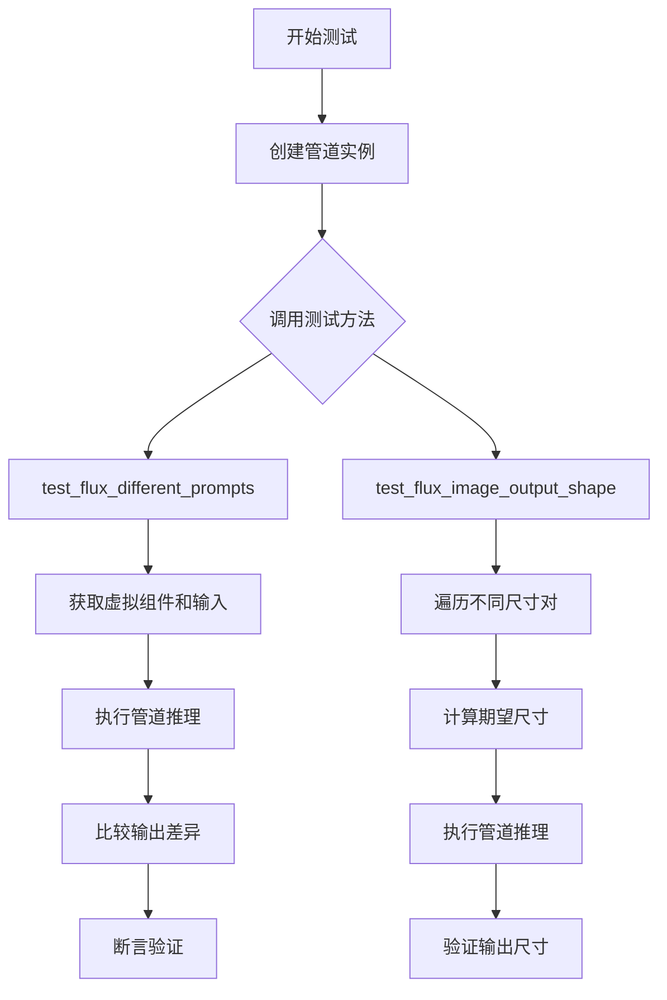
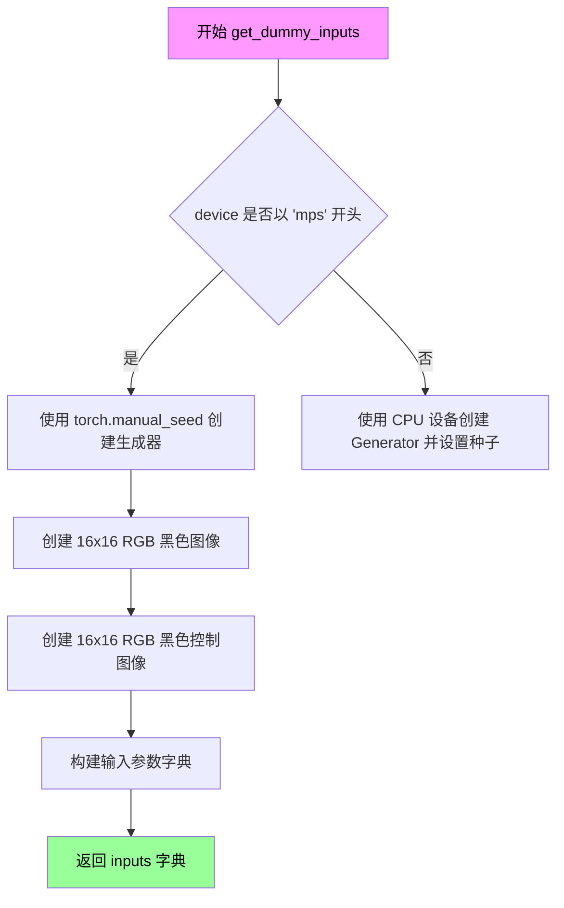
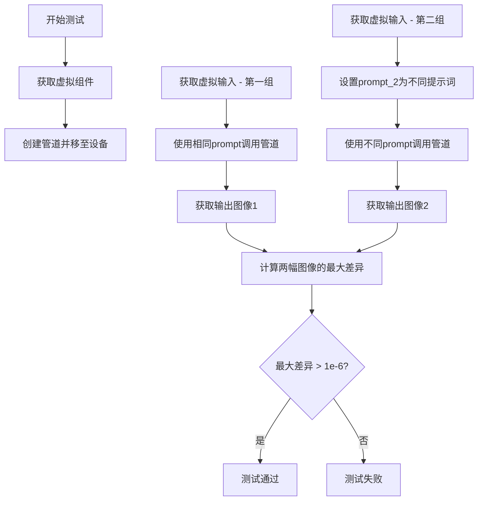

# `diffusers\tests\pipelines\flux\test_pipeline_flux_control_img2img.py` 详细设计文档

这是一个用于测试 FluxControlImg2ImgPipeline（Flux控制图像到图像扩散管道）的单元测试文件，验证管道在不同提示词下的输出差异以及输出图像尺寸的正确性。

## 整体流程



## 类结构

```
unittest.TestCase
└── PipelineTesterMixin (混合基类)
    └── FluxControlImg2ImgPipelineFastTests
```

## 全局变量及字段


### `enable_full_determinism`
    
启用完全确定性测试的函数，确保测试结果可复现

类型：`function`
    


### `torch_device`
    
测试使用的设备常量，通常为'cuda'或'cpu'

类型：`str`
    


### `PipelineTesterMixin`
    
管道测试混合基类，提供管道测试的通用方法和断言

类型：`class`
    


### `FluxControlImg2ImgPipelineFastTests.pipeline_class`
    
测试使用的管道类，即FluxControlImg2ImgPipeline

类型：`type`
    


### `FluxControlImg2ImgPipelineFastTests.params`
    
管道参数集合，定义管道接受的参数名称

类型：`frozenset`
    


### `FluxControlImg2ImgPipelineFastTests.batch_params`
    
批处理参数集合，定义支持批量处理的参数

类型：`frozenset`
    


### `FluxControlImg2ImgPipelineFastTests.test_xformers_attention`
    
是否测试xformers注意力机制，设为False表示禁用

类型：`bool`
    
    

## 全局函数及方法


### `FluxControlImg2ImgPipelineFastTests.get_dummy_components`

该方法是一个测试辅助函数，用于创建FluxControlImg2ImgPipeline所需的虚拟（dummy）组件，包括FluxTransformer2DModel、CLIPTextModel、T5EncoderModel、AutoencoderKL、CLIPTokenizer等模型和调度器，以便在单元测试中进行快速、可控的推理测试，而无需加载真实的预训练模型。

参数：
- `self`：隐式参数，指向类实例本身

返回值：`Dict[str, Any]`，返回一个包含所有虚拟组件的字典，包括scheduler、text_encoder、text_encoder_2、tokenizer、tokenizer_2、transformer和vae，用于初始化FluxControlImg2ImgPipeline。

#### 流程图

```mermaid
flowchart TD
    A[开始 get_dummy_components] --> B[设置随机种子 torch.manual_seed(0)]
    B --> C[创建 FluxTransformer2DModel]
    C --> D[创建 CLIPTextConfig 配置]
    D --> E[创建 CLIPTextModel]
    E --> F[从预训练加载 T5EncoderModel]
    F --> G[从预训练加载 CLIPTokenizer]
    G --> H[从预训练加载 AutoTokenizer for T5]
    H --> I[创建 AutoencoderKL]
    I --> J[创建 FlowMatchEulerDiscreteScheduler]
    J --> K[构建组件字典]
    K --> L[返回包含所有组件的字典]
```

#### 带注释源码

```python
def get_dummy_components(self):
    """
    创建用于测试的虚拟组件，包括各种模型和调度器。
    使用固定随机种子确保测试的可重复性。
    """
    # 设置随机种子为0，确保每次运行生成相同的权重
    torch.manual_seed(0)
    
    # 创建FluxTransformer2DModel虚拟实例
    # 参数：patch_size=1, in_channels=8, out_channels=4, num_layers=1等
    # 这是一个轻量级的Transformer模型用于Flux图像生成
    transformer = FluxTransformer2DModel(
        patch_size=1,
        in_channels=8,
        out_channels=4,
        num_layers=1,
        num_single_layers=1,
        attention_head_dim=16,
        num_attention_heads=2,
        joint_attention_dim=32,
        pooled_projection_dim=32,
        axes_dims_rope=[4, 4, 8],
    )
    
    # 配置CLIPTextModel的结构参数
    # 使用小型配置以加快测试速度
    clip_text_encoder_config = CLIPTextConfig(
        bos_token_id=0,
        eos_token_id=2,
        hidden_size=32,
        intermediate_size=37,
        layer_norm_eps=1e-05,
        num_attention_heads=4,
        num_hidden_layers=5,
        pad_token_id=1,
        vocab_size=1000,
        hidden_act="gelu",
        projection_dim=32,
    )

    # 使用上述配置创建CLIPTextModel
    # 再次设置随机种子确保可重复性
    torch.manual_seed(0)
    text_encoder = CLIPTextModel(clip_text_encoder_config)

    # 从预训练加载T5EncoderModel的微小版本
    # 用于文本编码，测试时使用hf-internal-testing/tiny-random-t5
    torch.manual_seed(0)
    text_encoder_2 = T5EncoderModel.from_pretrained("hf-internal-testing/tiny-random-t5")

    # 加载CLIPTokenizer和T5的AutoTokenizer
    tokenizer = CLIPTokenizer.from_pretrained("hf-internal-testing/tiny-random-clip")
    tokenizer_2 = AutoTokenizer.from_pretrained("hf-internal-testing/tiny-random-t5")

    # 创建AutoencoderKL用于图像的编码和解码
    # 轻量级配置：sample_size=32, in_channels=3等
    torch.manual_seed(0)
    vae = AutoencoderKL(
        sample_size=32,
        in_channels=3,
        out_channels=3,
        block_out_channels=(4,),
        layers_per_block=1,
        latent_channels=1,
        norm_num_groups=1,
        use_quant_conv=False,
        use_post_quant_conv=False,
        shift_factor=0.0609,
        scaling_factor=1.5035,
    )

    # 创建FlowMatchEulerDiscreteScheduler调度器
    # 用于控制去噪采样过程
    scheduler = FlowMatchEulerDiscreteScheduler()

    # 返回包含所有组件的字典
    # 键名必须与FluxControlImg2ImgPipeline的构造函数参数匹配
    return {
        "scheduler": scheduler,
        "text_encoder": text_encoder,
        "text_encoder_2": text_encoder_2,
        "tokenizer": tokenizer,
        "tokenizer_2": tokenizer_2,
        "transformer": transformer,
        "vae": vae,
    }
```


### `FluxControlImg2ImgPipelineFastTests.get_dummy_inputs`

该方法用于创建虚拟输入字典，为 FluxControlImg2ImgPipeline 的单元测试提供必要的参数，包括文本提示、图像、控制图像、生成器以及推理相关的配置参数。

参数：

- `self`：隐式参数，测试类实例，代表 FluxControlImg2ImgPipelineFastTests 类的当前实例
- `device`：`str` 或 `torch.device`，目标设备，用于确定生成器的设备和处理 MPS 设备特殊情况
- `seed`：`int`，默认值为 0，用于设置随机种子以确保测试的可重复性

返回值：`dict`，返回包含 pipeline 输入参数的字典，包括 prompt、image、control_image、generator、num_inference_steps、guidance_scale、height、width、max_sequence_length、strength 和 output_type 等键值对。

#### 流程图

```mermaid
flowchart TD
    A[开始 get_dummy_inputs] --> B{device 以 'mps' 开头?}
    B -->|是| C[使用 torch.manual_seed(seed)]
    B -->|否| D[创建 torch.Generator device='cpu']
    D --> E[调用 generator.manual_seed(seed)]
    C --> F[创建 RGB 图像 Image.new]
    E --> F
    F --> G[创建 control_image RGB 图像]
    G --> H[构建 inputs 字典]
    H --> I[包含 prompt/image/control_image/generator 等参数]
    I --> J[返回 inputs 字典]
```

#### 带注释源码

```python
def get_dummy_inputs(self, device, seed=0):
    """
    创建用于测试 FluxControlImg2ImgPipeline 的虚拟输入字典
    
    参数:
        device: 目标设备，用于判断是否需要特殊处理 MPS 设备
        seed: 随机种子，确保测试结果可重复
    
    返回:
        包含所有 pipeline 输入参数的字典
    """
    
    # 判断是否为 Apple MPS 设备
    # MPS 设备不支持 torch.Generator，需要使用 torch.manual_seed 代替
    if str(device).startswith("mps"):
        # MPS 设备：直接使用 manual_seed 创建生成器
        generator = torch.manual_seed(seed)
    else:
        # 其他设备（CPU/CUDA）：创建 CPU 上的生成器并设置种子
        generator = torch.Generator(device="cpu").manual_seed(seed)

    # 创建虚拟的输入图像（16x16 黑色 RGB 图像）
    # 用于模拟 controlnet 输入的控制图像
    image = Image.new("RGB", (16, 16), 0)
    
    # 创建虚拟的控制图像（16x16 黑色 RGB 图像）
    # 用于提供 ControlNet 控制条件
    control_image = Image.new("RGB", (16, 16), 0)

    # 构建完整的输入参数字典
    inputs = {
        "prompt": "A painting of a squirrel eating a burger",  # 文本提示
        "image": image,                                        # 输入图像
        "control_image": control_image,                        # 控制图像
        "generator": generator,                                # 随机生成器
        "num_inference_steps": 2,                              # 推理步数
        "guidance_scale": 5.0,                                 # 引导 scale
        "height": 8,                                           # 输出高度
        "width": 8,                                            # 输出宽度
        "max_sequence_length": 48,                            # 最大序列长度
        "strength": 0.8,                                       # 控制图像强度
        "output_type": "np",                                   # 输出类型为 numpy
    }
    
    # 返回输入字典供 pipeline 调用
    return inputs
```


### `FluxControlImg2ImgPipelineFastTests.test_flux_different_prompts`

验证不同提示词（prompt）会产生不同输出的测试方法，确保图像生成管道对文本输入敏感

参数：

-  `self`：隐式参数，测试类实例本身

返回值：`None`，无返回值（通过断言验证测试结果）

#### 流程图

```mermaid
flowchart TD
    A[开始测试] --> B[初始化管道: pipeline_class(**get_dummy_components()).to torch_device]
    B --> C[获取默认输入: get_dummy_inputs]
    C --> D[使用相同提示词调用管道]
    D --> E[保存输出: output_same_prompt]
    E --> F[重新获取输入: get_dummy_inputs]
    F --> G[设置不同提示词: prompt_2 = 'a different prompt']
    G --> H[使用不同提示词调用管道]
    H --> I[保存输出: output_different_prompts]
    I --> J[计算最大差异: max_diff = np.abs - ]
    J --> K{断言: max_diff > 1e-6?}
    K -->|是| L[测试通过]
    K -->|否| M[测试失败]
    L --> N[结束]
    M --> N
```

#### 带注释源码

```python
def test_flux_different_prompts(self):
    """
    测试不同提示词是否产生不同输出
    
    验证逻辑：
    1. 使用相同样本图像和控制图像
    2. 分别使用相同提示词和不同提示词调用管道
    3. 断言两次输出的差异大于阈值（确保模型对文本输入敏感）
    """
    
    # 第一步：创建管道实例
    # 使用虚拟组件初始化 FluxControlImg2ImgPipeline 并移至测试设备
    pipe = self.pipeline_class(**self.get_dummy_components()).to(torch_device)

    # 第二步：使用相同提示词生成图像
    # 获取默认的虚拟输入参数（包含提示词 "A painting of a squirrel eating a burger"）
    inputs = self.get_dummy_inputs(torch_device)
    # 调用管道进行图像生成，获取第一张图像
    output_same_prompt = pipe(**inputs).images[0]

    # 第三步：使用不同提示词生成图像
    # 重新获取输入参数
    inputs = self.get_dummy_inputs(torch_device)
    # 修改提示词为不同的内容
    inputs["prompt_2"] = "a different prompt"
    # 再次调用管道生成图像
    output_different_prompts = pipe(**inputs).images[0]

    # 第四步：计算两次输出的差异
    # 使用 NumPy 计算两张图像之间的最大绝对差值
    max_diff = np.abs(output_same_prompt - output_different_prompts).max()

    # 第五步：验证差异
    # Outputs should be different here
    # For some reasons, they don't show large differences
    # 断言：不同提示词生成的图像应该存在可检测的差异
    # 阈值设为 1e-6 远小于像素值范围（通常 0-255 或 0-1）
    assert max_diff > 1e-6
```

#### 关键组件信息

| 组件名称 | 一句话描述 |
|---------|-----------|
| `FluxControlImg2ImgPipeline` | Flux 控制图像到图像的生成管道，支持根据文本提示词和控制图像生成目标图像 |
| `get_dummy_components()` | 初始化虚拟（dummy）组件的工厂方法，返回包含 transformer、text_encoder、vae 等的字典 |
| `get_dummy_inputs()` | 生成测试用虚拟输入参数的工厂方法，包含 prompt、image、control_image 等 |
| `torch_device` | 全局变量，指定测试使用的 PyTorch 设备（CPU/CUDA） |

#### 潜在技术债务或优化空间

1. **测试注释与实际断言矛盾**：代码注释 `For some reasons, they don't show large differences` 表明测试设计者意识到可能存在问题，但仍然使用较小的阈值 `1e-6`，这可能导致测试在实际问题存在时仍然通过
2. **缺少错误处理**：管道调用失败时没有适当的异常捕获和错误信息
3. **硬编码的测试参数**：`num_inference_steps=2` 硬编码在 `get_dummy_inputs` 中，降低了测试的灵活性

#### 其它项目

- **测试目标**：验证 FluxControlImg2ImgPipeline 对文本提示词的敏感性，确保不同提示词能够产生可区分的输出
- **设计约束**：使用最小化配置（1层transformer、2个attention head等）以加快测试执行速度
- **数据流**：测试数据流为：提示词 → 文本编码器 → 提示词嵌入 → Transformer → VAE 解码 → 图像输出
- **外部依赖**：依赖 diffusers 库中的 FluxControlImg2ImgPipeline、FlowMatchEulerDiscreteScheduler 等组件


### `FluxControlImg2ImgPipelineFastTests.test_flux_image_output_shape`

该测试方法用于验证 FluxControlImg2ImgPipeline 管道输出的图像尺寸是否符合 VAE 缩放因子的约束。测试通过调整输入高度和宽度参数，检查输出图像是否被正确调整为符合 `vae_scale_factor * 2` 模数要求的尺寸。

参数：

- `self`：`FluxControlImg2ImgPipelineFastTests`，测试类实例本身，包含管道配置和测试环境信息

返回值：`None`，该方法为单元测试方法，通过 `assert` 断言验证输出尺寸，不返回具体值

#### 流程图

```mermaid
flowchart TD
    A[开始测试] --> B[创建Pipeline实例]
    B --> C[获取虚拟输入参数]
    C --> D[定义测试尺寸对: (32,32) 和 (72,57)]
    D --> E{遍历 height_width_pairs}
    E -->|取出第一对| F[计算期望高度: height - height % (vae_scale_factor * 2)]
    E -->|取出第二对| F
    F --> G[计算期望宽度: width - width % (vae_scale_factor * 2)]
    G --> H[更新输入参数: height 和 width]
    H --> I[执行管道推理]
    I --> J[获取输出图像]
    J --> K[提取输出高度和宽度]
    K --> L{断言: (output_height, output_width) == (expected_height, expected_width)}
    L -->|通过| M{是否还有更多尺寸对}
    L -->|失败| N[抛出 AssertionError]
    M -->|是| E
    M -->|否| O[测试通过]
    
    style N fill:#ffcccc
    style O fill:#ccffcc
```

#### 带注释源码

```python
def test_flux_image_output_shape(self):
    """
    测试管道输出图像尺寸是否符合VAE缩放因子的要求
    
    该测试验证 FluxControlImg2ImgPipeline 在给定不同输入尺寸时，
    输出图像的尺寸会被正确调整为符合 vae_scale_factor * 2 模数要求的尺寸
    """
    # 1. 创建管道实例
    # 使用测试类的 pipeline_class (FluxControlImg2ImgPipeline)
    # 并通过 get_dummy_components() 获取虚拟组件配置
    pipe = self.pipeline_class(**self.get_dummy_components()).to(torch_device)
    
    # 2. 获取虚拟输入参数
    # 包含提示词、图像、控制图像、生成器、推理步数等配置
    inputs = self.get_dummy_inputs(torch_device)
    
    # 3. 定义测试用的宽高对列表
    # 测试两种不同尺寸: (32, 32) 和 (72, 57)
    height_width_pairs = [(32, 32), (72, 57)]
    
    # 4. 遍历每组尺寸进行测试
    for height, width in height_width_pairs:
        # 5. 计算期望的输出尺寸
        # 输出尺寸必须能被 vae_scale_factor * 2 整除
        # 计算方式: 原始尺寸减去余数
        expected_height = height - height % (pipe.vae_scale_factor * 2)
        expected_width = width - width % (pipe.vae_scale_factor * 2)
        
        # 6. 更新输入参数中的高度和宽度
        inputs.update({"height": height, "width": width})
        
        # 7. 执行管道推理获取输出图像
        image = pipe(**inputs).images[0]
        
        # 8. 提取输出图像的实际尺寸
        output_height, output_width, _ = image.shape
        
        # 9. 断言验证输出尺寸是否符合预期
        # 这是测试的核心验证逻辑
        assert (output_height, output_width) == (expected_height, expected_width)
```


### `FluxControlImg2ImgPipelineFastTests.get_dummy_components`

该方法创建了一套虚拟的模型组件（包括 FluxTransformer2DModel、CLIPTextModel、T5EncoderModel、AutoencoderKL 等），用于 FluxControlImg2ImgPipeline 的单元测试，通过固定的随机种子确保测试结果的可重复性。

参数：
- （无显式参数，仅隐式 `self`）

返回值：`Dict`，返回包含以下键值对的字典：
- `scheduler`：`FlowMatchEulerDiscreteScheduler`，调度器实例
- `text_encoder`：`CLIPTextModel`，CLIP 文本编码器实例
- `text_encoder_2`：`T5EncoderModel`，T5 文本编码器实例
- `tokenizer`：`CLIPTokenizer`，CLIP 分词器实例
- `tokenizer_2`：`AutoTokenizer`，T5 分词器实例
- `transformer`：`FluxTransformer2DModel`，Flux Transformer 模型实例
- `vae`：`AutoencoderKL`，变分自编码器实例

#### 流程图

```mermaid
flowchart TD
    A[开始 get_dummy_components] --> B[设置随机种子 torch.manual_seed(0)]
    B --> C[创建 FluxTransformer2DModel 虚拟组件]
    C --> D[创建 CLIPTextConfig 配置]
    D --> E[创建 CLIPTextModel 文本编码器]
    E --> F[创建 T5EncoderModel 文本编码器]
    F --> G[创建 CLIPTokenizer 分词器]
    G --> H[创建 AutoTokenizer 分词器]
    H --> I[创建 AutoencoderKL 变分自编码器]
    I --> J[创建 FlowMatchEulerDiscreteScheduler 调度器]
    J --> K[组装并返回组件字典]
    K --> L[结束]
```

#### 带注释源码

```python
def get_dummy_components(self):
    """
    创建虚拟模型组件用于测试
    """
    # 设置随机种子确保测试可重复性
    torch.manual_seed(0)
    
    # 创建 Flux Transformer 模型配置
    transformer = FluxTransformer2DModel(
        patch_size=1,                # 补丁大小
        in_channels=8,               # 输入通道数
        out_channels=4,              # 输出通道数
        num_layers=1,                # 层数
        num_single_layers=1,         # 单层数量
        attention_head_dim=16,       # 注意力头维度
        num_attention_heads=2,       # 注意力头数量
        joint_attention_dim=32,      # 联合注意力维度
        pooled_projection_dim=32,    # 池化投影维度
        axes_dims_rope=[4, 4, 8],    # RoPE 轴维度
    )
    
    # 配置 CLIP 文本编码器参数
    clip_text_encoder_config = CLIPTextConfig(
        bos_token_id=0,              # 起始 token ID
        eos_token_id=2,              # 结束 token ID
        hidden_size=32,             # 隐藏层大小
        intermediate_size=37,       # 中间层大小
        layer_norm_eps=1e-05,       # LayerNorm epsilon
        num_attention_heads=4,      # 注意力头数量
        num_hidden_layers=5,        # 隐藏层数量
        pad_token_id=1,             # 填充 token ID
        vocab_size=1000,            # 词汇表大小
        hidden_act="gelu",          # 激活函数
        projection_dim=32,          # 投影维度
    )

    # 创建 CLIP 文本编码器（使用相同种子确保可重复性）
    torch.manual_seed(0)
    text_encoder = CLIPTextModel(clip_text_encoder_config)

    # 创建 T5 文本编码器（从预训练模型加载微型版本）
    torch.manual_seed(0)
    text_encoder_2 = T5EncoderModel.from_pretrained("hf-internal-testing/tiny-random-t5")

    # 创建分词器（从预训练模型加载）
    tokenizer = CLIPTokenizer.from_pretrained("hf-internal-testing/tiny-random-clip")
    tokenizer_2 = AutoTokenizer.from_pretrained("hf-internal-testing/tiny-random-t5")

    # 创建 VAE（变分自编码器）
    torch.manual_seed(0)
    vae = AutoencoderKL(
        sample_size=32,              # 样本大小
        in_channels=3,               # 输入通道数
        out_channels=3,              # 输出通道数
        block_out_channels=(4,),    # 块输出通道数
        layers_per_block=1,         # 每块层数
        latent_channels=1,          # 潜在通道数
        norm_num_groups=1,          # 归一化组数
        use_quant_conv=False,       # 是否使用量化卷积
        use_post_quant_conv=False,  # 是否使用后量化卷积
        shift_factor=0.0609,         # 偏移因子
        scaling_factor=1.5035,      # 缩放因子
    )

    # 创建调度器
    scheduler = FlowMatchEulerDiscreteScheduler()

    # 返回包含所有组件的字典
    return {
        "scheduler": scheduler,
        "text_encoder": text_encoder,
        "text_encoder_2": text_encoder_2,
        "tokenizer": tokenizer,
        "tokenizer_2": tokenizer_2,
        "transformer": transformer,
        "vae": vae,
    }
```


### `FluxControlImg2ImgPipelineFastTests.get_dummy_inputs`

该方法用于生成虚拟输入数据，为 FluxControlImg2ImgPipeline 图像到图像控制转换测试准备必要的参数，包括提示词、图像、控制图像、生成器及其他推理配置。

参数：

- `self`：隐式参数，测试类实例本身
- `device`：`str` 或设备对象，指定生成随机数的设备
- `seed`：`int`，随机种子，默认为 0，用于确保测试的可重复性

返回值：`dict`，包含以下键值对的字典：
- `prompt`：`str`，文本提示词
- `image`：`PIL.Image.Image`，输入图像
- `control_image`：`PIL.Image.Image`，控制图像
- `generator`：`torch.Generator`，随机数生成器
- `num_inference_steps`：`int`，推理步数
- `guidance_scale`：`float`，引导尺度
- `height`：`int`，输出图像高度
- `width`：`int`，输出图像宽度
- `max_sequence_length`：`int`，最大序列长度
- `strength`：`float`，转换强度
- `output_type`：`str`，输出类型

#### 流程图



#### 带注释源码

```python
def get_dummy_inputs(self, device, seed=0):
    """
    生成虚拟输入数据用于 FluxControlImg2ImgPipeline 测试
    
    参数:
        device: 目标设备，可以是 'cuda', 'cpu', 'mps' 等
        seed: 随机种子，用于确保测试结果可重复
    
    返回:
        dict: 包含测试所需的全部输入参数
    """
    # 根据设备类型选择合适的随机数生成器创建方式
    # MPS (Metal Performance Shaders) 设备使用 torch.manual_seed
    if str(device).startswith("mps"):
        generator = torch.manual_seed(seed)
    else:
        # 其他设备（如 CPU、CUDA）使用 Generator 对象
        generator = torch.Generator(device="cpu").manual_seed(seed)

    # 创建虚拟输入图像（16x16 黑色 RGB 图像）
    image = Image.new("RGB", (16, 16), 0)
    
    # 创建虚拟控制图像（16x16 黑色 RGB 图像）
    control_image = Image.new("RGB", (16, 16), 0)

    # 组装测试所需的完整输入参数字典
    inputs = {
        "prompt": "A painting of a squirrel eating a burger",  # 文本提示词
        "image": image,              # 输入图像
        "control_image": control_image,  # 控制图像（用于控制生成结果）
        "generator": generator,      # 随机数生成器
        "num_inference_steps": 2,    # 推理步数（较少以加快测试速度）
        "guidance_scale": 5.0,       # CFG 引导强度
        "height": 8,                 # 输出高度
        "width": 8,                  # 输出宽度
        "max_sequence_length": 48,   # 文本嵌入的最大序列长度
        "strength": 0.8,             # 图像转换强度（0-1之间）
        "output_type": "np",         # 输出格式为 numpy 数组
    }
    return inputs
```


### `FluxControlImg2ImgPipelineFastTests.test_flux_different_prompts`

测试使用不同提示词（prompt 和 prompt_2）时，FluxControlImg2ImgPipeline 管道生成的图像是否存在差异，验证管道能够正确处理多提示词输入并产生不同的输出结果。

参数：无（测试方法通过类方法 `get_dummy_components()` 和 `get_dummy_inputs()` 获取测试数据和组件）

返回值：`None`（该测试方法无返回值，通过 `assert` 断言验证逻辑）

#### 流程图



#### 带注释源码

```python
def test_flux_different_prompts(self):
    """
    测试使用不同提示词时管道输出的差异性
    
    该测试验证：
    1. 管道能够正确处理包含 prompt 和 prompt_2 的输入
    2. 使用不同提示词时，生成的图像应该存在可检测的差异
    """
    
    # 步骤1: 获取虚拟组件并创建管道实例
    # 使用 get_dummy_components() 方法创建测试所需的全部组件
    # 包括: transformer, text_encoder, text_encoder_2, tokenizer, tokenizer_2, vae, scheduler
    pipe = self.pipeline_class(**self.get_dummy_components()).to(torch_device)

    # 步骤2: 获取第一组虚拟输入（使用默认提示词）
    # 默认提示词: "A painting of a squirrel eating a burger"
    inputs = self.get_dummy_inputs(torch_device)
    
    # 步骤3: 使用相同提示词调用管道，获取输出图像
    # 这里作为基准输出，用于后续比较
    output_same_prompt = pipe(**inputs).images[0]

    # 步骤4: 获取第二组虚拟输入，并修改提示词
    inputs = self.get_dummy_inputs(torch_device)
    
    # 设置 prompt_2 为不同的提示词
    # 这将导致管道使用不同的条件信息生成图像
    inputs["prompt_2"] = "a different prompt"
    
    # 步骤5: 使用不同提示词调用管道，获取输出图像
    output_different_prompts = pipe(**inputs).images[0]

    # 步骤6: 计算两幅图像之间的最大差异
    # 使用 NumPy 计算绝对差值并取最大值
    max_diff = np.abs(output_same_prompt - output_different_prompts).max()

    # 步骤7: 验证输出存在差异
    # 阈值设为 1e-6（远小于像素值范围，用于检测数值级差异）
    # 注意: 代码注释提到"For some reasons, they don't show large differences"
    # 表明开发者观察到差异小于预期
    assert max_diff > 1e-6
```


### `FluxControlImg2ImgPipelineFastTests.test_flux_image_output_shape`

该测试方法用于验证 FluxControlImg2ImgPipeline 图像转换输出的高度和宽度是否符合预期，确保输出尺寸根据 VAE 缩放因子正确调整。

参数：

- `self`：隐式参数，`FluxControlImg2ImgPipelineFastTests` 类的实例，表示当前测试对象

返回值：`None`，该方法为单元测试方法，没有显式返回值，通过 `assert` 语句进行断言验证

#### 流程图

```mermaid
flowchart TD
    A[开始测试] --> B[创建 pipeline 实例并移至设备]
    C[获取 dummy inputs] --> D[定义测试尺寸对: 32x32 和 72x57]
    D --> E{还有更多尺寸对?}
    E -->|是| F[取出 height, width]
    F --> G[计算期望尺寸: expected_height = height - height % (vae_scale_factor * 2)]
    G --> H[更新 inputs 中的 height 和 width]
    H --> I[调用 pipeline: pipe(**inputs)]
    I --> J[获取输出图像]
    J --> K[从图像中获取 output_height, output_width]
    K --> L{输出尺寸 == 期望尺寸?}
    L -->|是| E
    L -->|否| M[断言失败]
    E -->|否| N[测试结束]
    M --> N
```

#### 带注释源码

```python
def test_flux_image_output_shape(self):
    """
    测试 FluxControlImg2ImgPipeline 输出的图像尺寸是否正确。
    验证输出尺寸根据 VAE 缩放因子正确调整。
    """
    # 1. 使用虚拟组件创建 pipeline 实例并移至测试设备
    pipe = self.pipeline_class(**self.get_dummy_components()).to(torch_device)
    
    # 2. 获取虚拟输入参数
    inputs = self.get_dummy_inputs(torch_device)

    # 3. 定义测试用的 (height, width) 尺寸对列表
    # 第一个: 标准尺寸 32x32
    # 第二个: 非标准尺寸 72x57，用于测试边界情况
    height_width_pairs = [(32, 32), (72, 57)]
    
    # 4. 遍历每一组尺寸进行测试
    for height, width in height_width_pairs:
        # 计算期望的输出高度
        # 需要减去 height % (vae_scale_factor * 2) 以确保尺寸能被 VAE 正确处理
        # VAE 的下采样率通常是 2 的幂，这里乘以 2 是因为 transformer 内部可能也有下采样
        expected_height = height - height % (pipe.vae_scale_factor * 2)
        
        # 计算期望的输出宽度
        expected_width = width - width % (pipe.vae_scale_factor * 2)

        # 5. 更新输入参数字典中的高度和宽度
        inputs.update({"height": height, "width": width})
        
        # 6. 调用 pipeline 执行推理
        # 返回包含图像的结果对象
        image = pipe(**inputs).images[0]
        
        # 7. 从输出图像中获取高度和宽度
        # 输出格式为 (height, width, channels) 的 numpy 数组
        output_height, output_width, _ = image.shape
        
        # 8. 断言验证输出尺寸是否与期望尺寸一致
        # 如果不匹配会抛出 AssertionError
        assert (output_height, output_width) == (expected_height, expected_width)
```

## 关键组件


### FluxControlImg2ImgPipeline

这是测试 FluxControlImg2ImgPipeline 的单元测试类，继承自 unittest.TestCase 和 PipelineTesterMixin，用于验证 Flux 控制图像到图像生成管道的功能正确性。

### FluxTransformer2DModel

FluxTransformer2DModel 是核心的 Transformer 模型，用于图像变换，配置了单层Transformer结构，包含2个注意力头和16的注意力维度。

### CLIPTextModel 和 CLIPTextConfig

CLIPTextModel 是基于 CLIPTextConfig 配置的文本编码器，用于将文本提示编码为向量表示，包含5层隐藏层和4个注意力头。

### T5EncoderModel

T5EncoderModel 是第二个文本编码器模型（使用预训练的小型T5模型），与CLIP文本编码器联合使用提供双文本编码支持。

### AutoencoderKL

AutoencoderKL 是变分自编码器(VAE)模型，用于图像的潜空间编码和解码，支持图像的压缩和重建。

### FlowMatchEulerDiscreteScheduler

FlowMatchEulerDiscreteScheduler 是基于欧拉离散方法的流匹配调度器，用于控制扩散模型的采样过程。

### PipelineTesterMixin

PipelineTesterMixin 是测试混入类，提供管道测试的通用方法和断言工具。

### get_dummy_components

创建虚拟（dummy）组件的工厂方法，初始化所有管道依赖的模型和配置，使用固定随机种子确保可复现性。

### get_dummy_inputs

创建虚拟测试输入的工厂方法，生成测试用的提示词、图像、控制图像和推理参数，支持MPS设备特殊处理。

### test_flux_different_prompts

测试管道对不同提示词的处理能力，验证使用不同prompt时生成的图像存在差异，确保文本编码器正常工作。

### test_flux_image_output_shape

测试管道输出的图像尺寸是否符合VAE缩放因子的对齐要求，验证不同输入尺寸下的输出尺寸计算逻辑。

### 虚拟图像生成

使用 PIL.Image.new 创建 RGB 格式的虚拟图像（16x16 黑色图像），用于测试pipeline的图像处理流程。


## 问题及建议


### 已知问题

- **设备处理不一致**：`get_dummy_inputs` 方法中对 MPS 设备有特殊处理（使用 `torch.manual_seed(seed)`），但对其他设备使用 `torch.Generator(device="cpu")`，这种不一致可能导致在不同设备上测试行为不一致
- **硬编码的随机种子**：多次调用 `torch.manual_seed(0)` 创建组件，可能导致测试之间的隐式依赖，破坏测试的独立性
- **魔法数字缺乏解释**：阈值 `max_diff > 1e-6` 和 `strength=0.8` 等数值没有注释说明其意图
- **注释语法错误**：注释中存在 "For some reasons, they don't show large differences"，语法不规范
- **重复初始化**：每次测试都通过 `self.get_dummy_components()` 重新创建完整的 pipeline 组件，计算资源浪费
- **输入参数覆盖不完整**：`test_flux_image_output_shape` 使用 `inputs.update()` 更新参数，但未重置可能遗留的状态
- **缺失的设备迁移检查**：pipeline 创建后使用 `.to(torch_device)`，但未验证模型是否真正迁移到目标设备
- **测试覆盖不足**：仅有两个测试方法，对错误处理、边界情况（如负数尺寸、极端 guidance_scale）的覆盖缺失

### 优化建议

- 考虑使用 pytest fixtures 或 setUp 方法来缓存 pipeline 实例，减少重复初始化开销
- 将设备相关的逻辑提取为独立的辅助方法，统一设备处理方式
- 为关键数值（如阈值、参数）添加常量或配置，提高可维护性
- 增加更多测试用例覆盖边界条件和错误处理场景
- 使用参数化测试（@pytest.mark.parametrize）简化相似测试场景的编写

## 其它


### 设计目标与约束

验证 FluxControlImg2ImgPipeline 在不同提示词下的输出差异性，以及在不同尺寸输入下的输出图像形状正确性。约束条件：测试使用虚拟组件（tiny-random模型），不依赖真实预训练权重，以确保测试环境的可重复性和快速执行。

### 错误处理与异常设计

测试中未显式处理异常，主要通过 unittest 框架的断言机制捕获失败情况。当管道输出形状不符合预期或不同提示词产生相同输出时，assert 语句会抛出 AssertionError。

### 数据流与状态机

测试数据流：get_dummy_components() 创建虚拟模型组件 → get_dummy_inputs() 准备输入数据（包含 prompt、image、control_image、generator 等）→ 调用 pipeline(**inputs) 执行推理 → 验证输出图像。无复杂状态机设计。

### 外部依赖与接口契约

依赖项包括：unittest（测试框架）、numpy（数值计算）、torch（深度学习）、PIL（图像处理）、transformers（CLIPTextModel、T5EncoderModel、CLIPTokenizer、AutoTokenizer）、diffusers（AutoencoderKL、FlowMatchEulerDiscreteScheduler、FluxControlImg2ImgPipeline、FluxTransformer2DModel）。接口契约：pipeline 接受 prompt、image、control_image、generator、num_inference_steps、guidance_scale、height、width、max_sequence_length、strength、output_type 等参数，返回包含 images 的对象。

### 配置与参数说明

关键配置参数：patch_size=1, in_channels=8, out_channels=4, num_layers=1, num_single_layers=1, attention_head_dim=16, num_attention_heads=2, joint_attention_dim=32, pooled_projection_dim=32, axes_dims_rope=[4,4,8]（Transformer 配置）；hidden_size=32, intermediate_size=37, num_attention_heads=4, num_hidden_layers=5, vocab_size=1000（CLIP 文本编码器配置）；sample_size=32, in_channels=3, out_channels=3, block_out_channels=(4,), layers_per_block=1, latent_channels=1（VAE 配置）。

### 测试用例设计

包含两个核心测试用例：test_flux_different_prompts 验证相同管道对不同提示词产生不同输出，通过比较输出图像差异的 max_diff 是否大于 1e-6；test_flux_image_output_shape 验证不同输入尺寸下的输出形状符合 VAE 缩放因子约束（height - height % (vae_scale_factor * 2)）。

### 性能基准与评估

测试未包含性能基准测试，仅验证功能正确性。潜在性能指标包括推理时间、内存占用等，当前通过 num_inference_steps=2 保持快速执行。

### 版本兼容性

依赖 diffusers 库需支持 FluxControlImg2ImgPipeline、FlowMatchEulerDiscreteScheduler；transformers 库需支持 CLIPTextModel、T5EncoderModel 及对应 Config 类。

### 资源需求

测试在 CPU 设备上运行（torch_device），使用 torch.Generator(device="cpu") 生成随机数。图像尺寸较小（16x16 或 32x32 级别），计算资源需求较低。

### 安全性与隐私

测试使用虚拟/随机模型，不涉及真实用户数据或敏感信息。管道处理的是程序生成的空白图像（Image.new("RGB", (16,16), 0)），无隐私风险。

### 维护与扩展

代码结构清晰，易于扩展新测试用例。潜在改进空间：添加更多测试场景（如 guidance_scale 敏感性测试、strength 参数测试）、添加性能基准测试、考虑跨平台兼容性（已对 MPS 设备做特殊处理）。

    