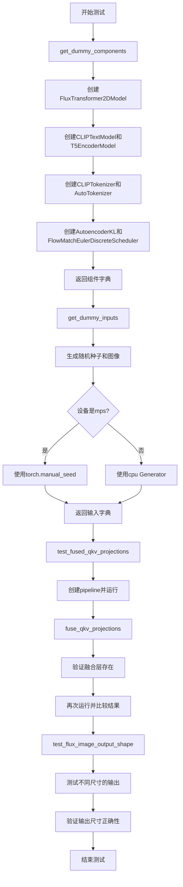
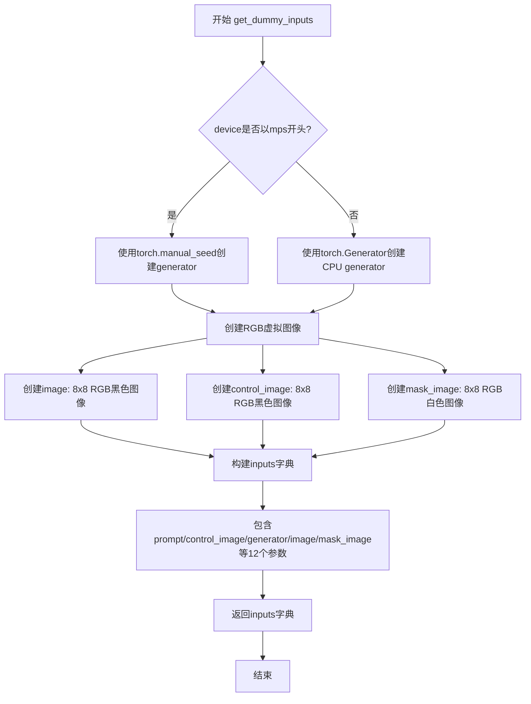
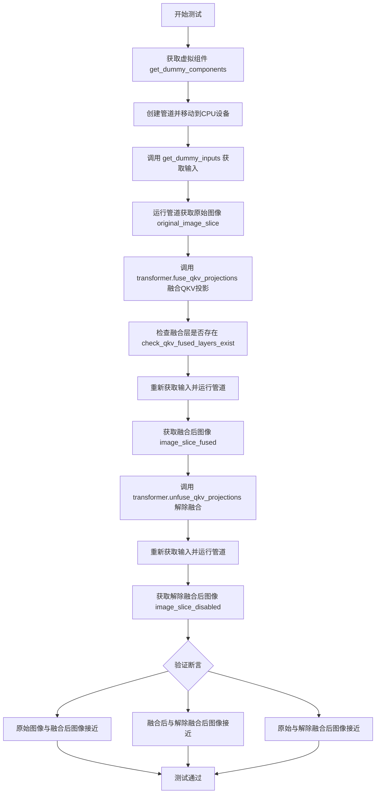
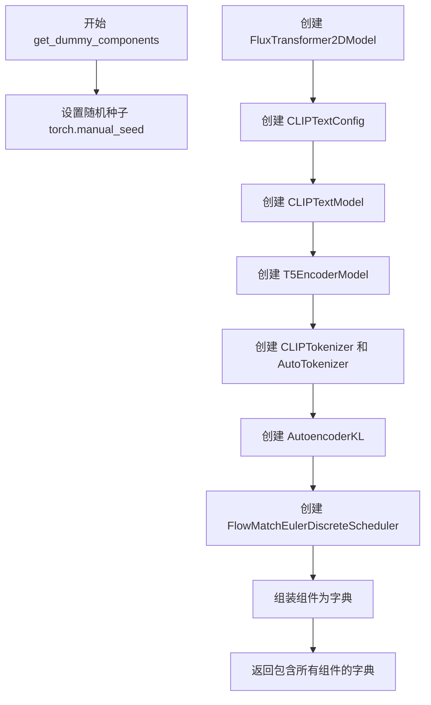
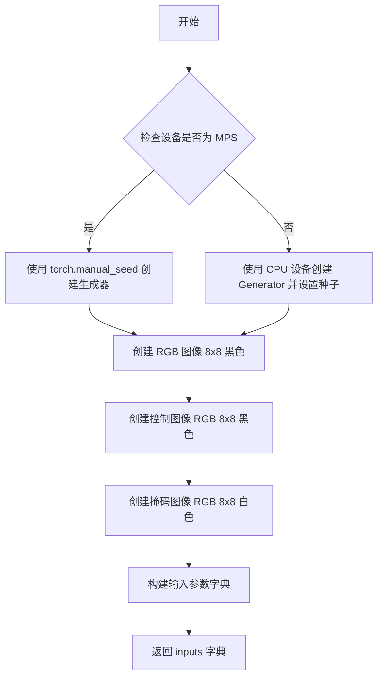
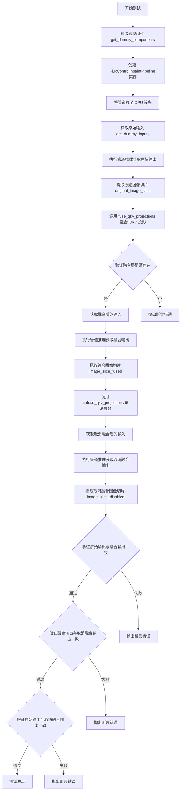
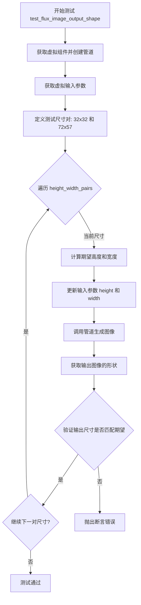

# `diffusers\tests\pipelines\flux\test_pipeline_flux_control_inpaint.py` 详细设计文档

This file contains unit tests for the FluxControlInpaintPipeline, which is a diffusion model pipeline for controlled image inpainting. It tests fused QKV projections and output shape validation using dummy components and inputs.

## 整体流程



## 类结构

```
unittest.TestCase
└── PipelineTesterMixin
    └── FluxControlInpaintPipelineFastTests
```

## 全局变量及字段


### `FluxControlInpaintPipelineFastTests.pipeline_class`
    
要测试的管道类

类型：`type`
    


### `FluxControlInpaintPipelineFastTests.params`
    
管道参数集合

类型：`frozenset`
    


### `FluxControlInpaintPipelineFastTests.batch_params`
    
批处理参数集合

类型：`frozenset`
    


### `FluxControlInpaintPipelineFastTests.test_xformers_attention`
    
是否测试xformers注意力

类型：`bool`
    
    

## 全局函数及方法


### `FluxControlInpaintPipelineFastTests.get_dummy_components`

该方法创建并返回一组虚拟的Flux pipeline组件（包括transformer、text_encoder、text_encoder_2、tokenizer、tokenizer_2、vae和scheduler），用于单元测试目的，通过预设的随机种子确保测试结果的可重复性。

参数：
- 无显式参数（隐含参数 `self`：实例本身）

返回值：`Dict[str, Any]`，返回一个包含7个虚拟组件的字典，用于初始化FluxControlInpaintPipeline进行测试

#### 流程图

```mermaid
flowchart TD
    A[开始 get_dummy_components] --> B[设置随机种子 torch.manual_seed(0)]
    B --> C[创建 FluxTransformer2DModel 虚拟实例]
    C --> D[创建 CLIPTextConfig 配置对象]
    D --> E[创建 CLIPTextModel 文本编码器]
    E --> F[创建 T5EncoderModel 文本编码器2]
    F --> G[创建 CLIPTokenizer 分词器]
    G --> H[创建 AutoTokenizer 分词器2]
    H --> I[创建 AutoencoderKL VAE模型]
    I --> J[创建 FlowMatchEulerDiscreteScheduler 调度器]
    J --> K[构建并返回包含所有组件的字典]
```

#### 带注释源码

```python
def get_dummy_components(self):
    """创建并返回虚拟的Flux pipeline组件用于测试"""
    
    # 设置随机种子以确保测试结果的可重复性
    torch.manual_seed(0)
    
    # 创建虚拟的Transformer模型
    # 参数: patch_size=1, in_channels=8, out_channels=4, num_layers=1等
    transformer = FluxTransformer2DModel(
        patch_size=1,
        in_channels=8,
        out_channels=4,
        num_layers=1,
        num_single_layers=1,
        attention_head_dim=16,
        num_attention_heads=2,
        joint_attention_dim=32,
        pooled_projection_dim=32,
        axes_dims_rope=[4, 4, 8],
    )
    
    # 配置CLIP文本编码器的参数
    clip_text_encoder_config = CLIPTextConfig(
        bos_token_id=0,
        eos_token_id=2,
        hidden_size=32,
        intermediate_size=37,
        layer_norm_eps=1e-05,
        num_attention_heads=4,
        num_hidden_layers=5,
        pad_token_id=1,
        vocab_size=1000,
        hidden_act="gelu",
        projection_dim=32,
    )

    # 使用随机种子创建CLIP文本编码器模型
    torch.manual_seed(0)
    text_encoder = CLIPTextModel(clip_text_encoder_config)

    # 使用预训练的小型T5模型作为第二个文本编码器
    torch.manual_seed(0)
    text_encoder_2 = T5EncoderModel.from_pretrained("hf-internal-testing/tiny-random-t5")

    # 加载分词器
    tokenizer = CLIPTokenizer.from_pretrained("hf-internal-testing/tiny-random-clip")
    tokenizer_2 = AutoTokenizer.from_pretrained("hf-internal-testing/tiny-random-t5")

    # 创建虚拟的VAE模型
    torch.manual_seed(0)
    vae = AutoencoderKL(
        sample_size=32,
        in_channels=3,
        out_channels=3,
        block_out_channels=(4,),
        layers_per_block=1,
        latent_channels=1,
        norm_num_groups=1,
        use_quant_conv=False,
        use_post_quant_conv=False,
        shift_factor=0.0609,
        scaling_factor=1.5035,
    )

    # 创建调度器
    scheduler = FlowMatchEulerDiscreteScheduler()

    # 返回包含所有组件的字典
    return {
        "scheduler": scheduler,
        "text_encoder": text_encoder,
        "text_encoder_2": text_encoder_2,
        "tokenizer": tokenizer,
        "tokenizer_2": tokenizer_2,
        "transformer": transformer,
        "vae": vae,
    }
```

#### 关键组件信息

| 组件名称 | 类型 | 描述 |
|---------|------|------|
| `transformer` | FluxTransformer2DModel | Flux变换器模型，用于图像生成的核心组件 |
| `text_encoder` | CLIPTextModel | CLIP文本编码器，将文本提示编码为嵌入向量 |
| `text_encoder_2` | T5EncoderModel | T5文本编码器，提供额外的文本理解能力 |
| `tokenizer` | CLIPTokenizer | CLIP分词器，用于文本分词 |
| `tokenizer_2` | AutoTokenizer | T5分词器，用于文本分词 |
| `vae` | AutoencoderKL | 变分自编码器，用于图像的编码和解码 |
| `scheduler` | FlowMatchEulerDiscreteScheduler | 调度器，控制扩散过程的噪声调度 |

#### 潜在的技术债务或优化空间

1. **硬编码的随机种子**：多次调用`torch.manual_seed(0)`可能导致组件之间的相关性，建议在每个组件创建时使用不同的种子或使用更清晰的随机初始化策略
2. **魔法数字**：许多参数（如`hidden_size=32`、`num_attention_heads=4`等）是硬编码的魔法数字，应提取为类常量或配置参数以提高可维护性
3. **重复的随机种子设置**：在创建不同组件前都设置了相同的种子，这可能是为了确保一致性，但代码意图不够明确
4. **缺少类型注解**：方法缺少返回类型注解，建议添加`-> Dict[str, Any]`以提高代码可读性
5. **外部模型依赖**：`T5EncoderModel.from_pretrained`需要网络连接才能下载模型，在离线环境下可能导致测试失败

#### 其它项目

**设计目标与约束**：
- 目标是创建轻量级的虚拟组件用于快速单元测试
- 组件使用最小的参数配置以加快测试执行速度
- 使用预训练的小型模型（hf-internal-testing/tiny-random-*）以减少资源消耗

**错误处理与异常设计**：
- 未包含显式的错误处理机制
- 依赖外部库（transformers、diffusers）的异常传播
- 建议在生产环境中添加模型加载失败的处理逻辑

**数据流与状态机**：
- 该方法是纯函数式的，不涉及状态管理
- 返回的字典作为不可变配置传递给pipeline构造函数

**外部依赖与接口契约**：
- 依赖`transformers`库提供CLIP和T5模型
- 依赖`diffusers`库提供Flux特定组件
- 返回的字典键必须与`FluxControlInpaintPipeline`的构造函数参数匹配


### `FluxControlInpaintPipelineFastTests.get_dummy_inputs`

该方法用于创建并返回虚拟的pipeline输入参数，主要功能是根据设备类型创建随机生成器，生成虚拟的RGB图像（输入图像、控制图像、掩码图像），并构建包含提示词、图像、推理参数等完整输入字典，以供测试FluxControlInpaintPipeline使用。

参数：

- `device`：`str` 或 `torch.device`，执行推理的目标设备，用于判断是否使用MPS设备并创建相应类型的随机生成器
- `seed`：`int`，默认值为0，用于设置随机数生成器的种子，确保测试的可重复性

返回值：`dict`，包含虚拟pipeline输入参数的字典，包括prompt（文本提示）、control_image（控制图像）、image（输入图像）、mask_image（掩码图像）、generator（随机生成器）、strength（强度）、num_inference_steps（推理步数）、guidance_scale（引导系数）、height（高度）、width（宽度）、max_sequence_length（最大序列长度）、output_type（输出类型）

#### 流程图



#### 带注释源码

```python
def get_dummy_inputs(self, device, seed=0):
    """
    创建并返回虚拟的pipeline输入参数，用于测试FluxControlInpaintPipeline
    
    参数:
        device: 目标设备，用于判断是否使用MPS
        seed: 随机种子，默认值为0
    
    返回:
        dict: 包含虚拟输入参数的字典
    """
    # 根据设备类型选择随机生成器创建方式
    # MPS (Apple Silicon) 设备使用torch.manual_seed，其他设备使用torch.Generator
    if str(device).startswith("mps"):
        generator = torch.manual_seed(seed)
    else:
        generator = torch.Generator(device="cpu").manual_seed(seed)

    # 创建虚拟输入图像 (8x8 RGB, 黑色)
    image = Image.new("RGB", (8, 8), 0)
    
    # 创建虚拟控制图像 (8x8 RGB, 黑色)
    control_image = Image.new("RGB", (8, 8), 0)
    
    # 创建虚拟掩码图像 (8x8 RGB, 白色 - 表示完全保留)
    mask_image = Image.new("RGB", (8, 8), 255)

    # 构建完整的虚拟输入参数字典
    inputs = {
        "prompt": "A painting of a squirrel eating a burger",  # 文本提示
        "control_image": control_image,  # 控制图像（用于控制生成）
        "generator": generator,  # 随机生成器，确保可重复性
        "image": image,  # 输入图像（inpainting目标图像）
        "mask_image": mask_image,  # 掩码图像（定义需要修复的区域）
        "strength": 0.8,  # 强度参数（0-1之间，控制图像影响程度）
        "num_inference_steps": 2,  # 推理步数（较少步数用于快速测试）
        "guidance_scale": 30.0,  # 引导系数（高值增强文本相关性）
        "height": 8,  # 输出高度
        "width": 8,  # 输出宽度
        "max_sequence_length": 48,  # 最大序列长度
        "output_type": "np",  # 输出类型（numpy数组）
    }
    return inputs
```


### `FluxControlInpaintPipelineFastTests.test_fused_qkv_projections`

验证transformer的QKV投影融合功能正确工作，确保融合QKV投影前后输出结果一致，且融合与解除融合后输出也应一致。

参数：
- `self`：`FluxControlInpaintPipelineFastTests`，测试类实例本身

返回值：`None`，无返回值（测试方法，通过断言验证）

#### 流程图



#### 带注释源码

```python
def test_fused_qkv_projections(self):
    """
    测试 QKV 投影融合功能
    验证 transformer 的融合/解除融合操作不会影响输出结果的一致性
    """
    # 使用 CPU 设备确保确定性，便于复现
    device = "cpu"
    
    # 获取测试所需的虚拟组件（transformer, vae, text_encoder 等）
    components = self.get_dummy_components()
    
    # 创建 FluxControlInpaintPipeline 实例
    pipe = self.pipeline_class(**components)
    
    # 将管道移动到指定设备
    pipe = pipe.to(device)
    
    # 配置进度条（disable=None 表示不禁用）
    pipe.set_progress_bar_config(disable=None)

    # 获取虚拟输入（包含 prompt、图像、mask 等）
    inputs = self.get_dummy_inputs(device)
    
    # 第一次运行管道，获取未融合 QKV 时的输出
    image = pipe(**inputs).images
    # 提取图像右下角 3x3 区域用于后续比较
    original_image_slice = image[0, -3:, -3:, -1]

    # 调用 transformer 的 fuse_qkv_projections 方法融合 QKV 投影
    pipe.transformer.fuse_qkv_projections()
    
    # 验证融合后的层是否存在，确保融合操作成功
    self.assertTrue(
        check_qkv_fused_layers_exist(pipe.transformer, ["to_qkv"]),
        ("Something wrong with the fused attention layers. Expected all the attention projections to be fused."),
    )

    # 使用相同输入再次运行管道，获取融合后的输出
    inputs = self.get_dummy_inputs(device)
    image = pipe(**inputs).images
    image_slice_fused = image[0, -3:, -3:, -1]

    # 调用 unfuse_qkv_projections 解除 QKV 投影融合
    pipe.transformer.unfuse_qkv_projections()
    
    # 再次运行管道，获取解除融合后的输出
    inputs = self.get_dummy_inputs(device)
    image = pipe(**inputs).images
    image_slice_disabled = image[0, -3:, -3:, -1]

    # 断言1：原始输出与融合后输出应接近（融合不影响结果）
    assert np.allclose(original_image_slice, image_slice_fused, atol=1e-3, rtol=1e-3), (
        "Fusion of QKV projections shouldn't affect the outputs."
    )
    
    # 断言2：融合后与解除融合后输出应接近（融合与解除是可逆的）
    assert np.allclose(image_slice_fused, image_slice_disabled, atol=1e-3, rtol=1e-3), (
        "Outputs, with QKV projection fusion enabled, shouldn't change when fused QKV projections are disabled."
    )
    
    # 断言3：原始与解除融合后输出应接近（解除融合应恢复原始行为）
    assert np.allclose(original_image_slice, image_slice_disabled, atol=1e-2, rtol=1e-2), (
        "Original outputs should match when fused QKV projections are disabled."
    )
```


### `FluxControlInpaintPipelineFastTests.test_flux_image_output_shape`

验证 FluxControlInpaintPipeline 对于不同尺寸输入能够产生正确的输出尺寸，确保输出图像高度和宽度按照 VAE 缩放因子和管道内部处理逻辑正确调整。

参数：

- `self`：测试类实例本身，无需外部传入

返回值：`None`（测试方法无返回值，通过 assert 断言验证正确性）

#### 流程图

```mermaid
flowchart TD
    A[开始测试 test_flux_image_output_shape] --> B[创建 FluxControlInpaintPipeline 实例并移动到设备]
    B --> C[获取虚拟输入 get_dummy_inputs]
    C --> D[定义测试尺寸对: [(32, 32), (72, 57)]]
    D --> E{遍历 height_width_pairs}
    E -->|当前 pair| F[计算期望输出高度和宽度]
    F --> G[更新 inputs 中的 height 和 width]
    G --> H[调用 pipe 执行推理: pipe\*\*inputs]
    H --> I[获取输出图像并解包尺寸]
    I --> J{断言输出尺寸 == 期望尺寸}
    J -->|是| K{是否还有更多尺寸对}
    J -->|否| L[抛出 AssertionError 并报告实际输出尺寸]
    K -->|是| E
    K -->|否| M[测试通过]
```

#### 带注释源码

```python
def test_flux_image_output_shape(self):
    """
    测试函数：验证 FluxControlInpaintPipeline 输出形状的正确性
    
    测试逻辑：
    1. 创建管道实例并配置到指定设备
    2. 准备虚拟输入参数
    3. 使用多组不同的 (height, width) 进行测试
    4. 验证输出图像尺寸与预期尺寸匹配
    """
    
    # 步骤1: 创建管道实例，使用虚拟组件配置，并移动到计算设备
    # torch_device 是测试工具函数，返回当前测试环境的设备（如 'cuda' 或 'cpu'）
    pipe = self.pipeline_class(**self.get_dummy_components()).to(torch_device)
    
    # 步骤2: 获取虚拟输入参数，包含提示词、图像、掩码等
    # 这些是用于测试的虚拟/dummy 数据
    inputs = self.get_dummy_inputs(torch_device)
    
    # 步骤3: 定义要测试的 (height, width) 尺寸对列表
    # 选取不同比例的尺寸用于验证管道的尺寸处理逻辑
    height_width_pairs = [(32, 32), (72, 57)]
    
    # 步骤4: 遍历每组尺寸进行测试
    for height, width in height_width_pairs:
        # 计算期望的输出尺寸：
        # 输出高度 = 输入高度 - (输入高度 % (VAE缩放因子 * 2))
        # 这样确保输出尺寸是 VAE 缩放因子*2 的整数倍，符合管道内部处理逻辑
        expected_height = height - height % (pipe.vae_scale_factor * 2)
        expected_width = width - width % (pipe.vae_scale_factor * 2)
        
        # 更新输入参数中的高度和宽度
        inputs.update({"height": height, "width": width})
        
        # 执行管道推理，获取生成的图像
        # pipe(**inputs) 返回一个包含 images 的对象
        # images[0] 取第一张生成的图像
        image = pipe(**inputs).images[0]
        
        # 解包输出图像的形状：(高度, 宽度, 通道数)
        output_height, output_width, _ = image.shape
        
        # 断言验证输出尺寸是否符合预期
        # 如果不匹配会抛出 AssertionError
        assert (output_height, output_width) == (expected_height, expected_width), \
            f"Expected ({expected_height}, {expected_width}) but got ({output_height}, {output_width})"
```

#### 关键实现细节

| 项目 | 详情 |
|------|------|
| **VAE 缩放因子** | `pipe.vae_scale_factor`（继承自 `FluxControlInpaintPipeline`） |
| **期望尺寸计算公式** | `expected = input - input % (vae_scale_factor * 2)` |
| **测试尺寸对** | (32, 32) - 正方形， (72, 57) - 非标准比例 |
| **输出类型** | NumPy 数组 (`output_type="np"` 在 `get_dummy_inputs` 中设置) |

#### 潜在技术债务或优化空间

1. **硬编码测试尺寸**: `height_width_pairs` 是硬编码的列表，可考虑参数化或从外部配置读取
2. **缺少边界测试**: 未测试极端小尺寸（如 1x1）或超大尺寸的情况
3. **断言信息可优化**: 断言失败时的错误信息可以包含更多调试上下文（如 VAE 缩放因子值）
4. **测试独立性**: 每次迭代都重复创建管道实例，可考虑复用（但需注意状态管理）


### `FluxControlInpaintPipelineFastTests.get_dummy_components`

该方法用于创建虚拟（dummy）组件字典，为 FluxControlInpaintPipeline 的单元测试提供所需的各种模型组件，包括 Transformer、文本编码器、VAE 和调度器等。

参数： 无（仅包含隐式参数 `self`）

返回值：`dict`，返回一个包含虚拟组件的字典，用于初始化管道进行测试

#### 流程图



#### 带注释源码

```
def get_dummy_components(self):
    """创建虚拟组件用于 FluxControlInpaintPipeline 测试"""
    
    # 1. 设置随机种子以确保可重复性
    torch.manual_seed(0)
    
    # 2. 创建 FluxTransformer2DModel - 主要的变换器模型
    transformer = FluxTransformer2DModel(
        patch_size=1,
        in_channels=8,
        out_channels=4,
        num_layers=1,
        num_single_layers=1,
        attention_head_dim=16,
        num_attention_heads=2,
        joint_attention_dim=32,
        pooled_projection_dim=32,
        axes_dims_rope=[4, 4, 8],
    )
    
    # 3. 配置 CLIP 文本编码器
    clip_text_encoder_config = CLIPTextConfig(
        bos_token_id=0,
        eos_token_id=2,
        hidden_size=32,
        intermediate_size=37,
        layer_norm_eps=1e-05,
        num_attention_heads=4,
        num_hidden_layers=5,
        pad_token_id=1,
        vocab_size=1000,
        hidden_act="gelu",
        projection_dim=32,
    )

    # 4. 创建第一个文本编码器 (CLIP)
    torch.manual_seed(0)
    text_encoder = CLIPTextModel(clip_text_encoder_config)

    # 5. 创建第二个文本编码器 (T5)
    torch.manual_seed(0)
    text_encoder_2 = T5EncoderModel.from_pretrained("hf-internal-testing/tiny-random-t5")

    # 6. 创建分词器
    tokenizer = CLIPTokenizer.from_pretrained("hf-internal-testing/tiny-random-clip")
    tokenizer_2 = AutoTokenizer.from_pretrained("hf-internal-testing/tiny-random-t5")

    # 7. 创建 VAE (变分自编码器)
    torch.manual_seed(0)
    vae = AutoencoderKL(
        sample_size=32,
        in_channels=3,
        out_channels=3,
        block_out_channels=(4,),
        layers_per_block=1,
        latent_channels=1,
        norm_num_groups=1,
        use_quant_conv=False,
        use_post_quant_conv=False,
        shift_factor=0.0609,
        scaling_factor=1.5035,
    )

    # 8. 创建调度器
    scheduler = FlowMatchEulerDiscreteScheduler()

    # 9. 返回包含所有组件的字典
    return {
        "scheduler": scheduler,
        "text_encoder": text_encoder,
        "text_encoder_2": text_encoder_2,
        "tokenizer": tokenizer,
        "tokenizer_2": tokenizer_2,
        "transformer": transformer,
        "vae": vae,
    }
```


### `FluxControlInpaintPipelineFastTests.get_dummy_inputs`

创建虚拟输入用于测试 FluxControlInpaintPipeline 管道，生成包含提示词、图像、控制图像、掩码图像及推理参数的测试字典。

参数：

- `device`：`torch.device`，目标设备，用于确定生成器的设备类型
- `seed`：`int`，随机种子，默认值为 0，用于确保测试的可重复性

返回值：`dict`，包含以下键值对的字典：
- `prompt`：提示词文本
- `control_image`：控制图像（PIL.Image）
- `generator`：PyTorch 随机数生成器
- `image`：输入图像（PIL.Image）
- `mask_image`：掩码图像（PIL.Image）
- `strength`：扩散强度
- `num_inference_steps`：推理步数
- `guidance_scale`：引导尺度
- `height`：生成图像高度
- `width`：生成图像宽度
- `max_sequence_length`：最大序列长度
- `output_type`：输出类型

#### 流程图



#### 带注释源码

```python
def get_dummy_inputs(self, device, seed=0):
    """
    创建虚拟输入用于测试 FluxControlInpaintPipeline 管道
    
    参数:
        device: 目标设备，用于确定随机生成器的创建方式
        seed: 随机种子，确保测试结果的可重复性
    
    返回:
        包含所有管道推理所需参数的字典
    """
    # 针对 Apple MPS 设备使用特殊的随机种子处理方式
    if str(device).startswith("mps"):
        # MPS 设备使用 torch.manual_seed 创建生成器
        generator = torch.manual_seed(seed)
    else:
        # 其他设备使用 CPU 设备创建生成器并设置种子
        generator = torch.Generator(device="cpu").manual_seed(seed)

    # 创建虚拟输入图像 (黑色 RGB 图像 8x8)
    image = Image.new("RGB", (8, 8), 0)
    # 创建虚拟控制图像 (黑色 RGB 图像 8x8)
    control_image = Image.new("RGB", (8, 8), 0)
    # 创建虚拟掩码图像 (白色 RGB 图像 8x8)
    mask_image = Image.new("RGB", (8, 8), 255)

    # 组装完整的测试输入参数
    inputs = {
        "prompt": "A painting of a squirrel eating a burger",  # 测试用提示词
        "control_image": control_image,  # 控制图像用于引导生成
        "generator": generator,  # 随机生成器确保确定性
        "image": input_image,  # 需要修复的原始图像
        "mask_image": mask_image,  # 掩码图像定义修复区域
        "strength": 0.8,  # 扩散强度 (0-1)
        "num_inference_steps": 2,  # 推理步数
        "guidance_scale": 30.0,  # Classifier-free guidance 强度
        "height": 8,  # 输出高度
        "width": 8,  # 输出宽度
        "max_sequence_length": 48,  # 文本编码器最大序列长度
        "output_type": "np",  # 输出格式为 numpy 数组
    }
    return inputs
```


### `FluxControlInpaintPipelineFastTests.test_fused_qkv_projections`

该测试方法用于验证 FluxControlInpaintPipeline 中 Transformer 的 QKV（Query、Key、Value）投影融合功能是否正常工作。通过对比融合前后的输出图像，确认识别融合操作不会影响模型的推理结果。

参数：

- `self`：隐式参数，测试类实例本身

返回值：`None`，无返回值（测试方法）

#### 流程图



#### 带注释源码

```python
def test_fused_qkv_projections(self):
    """测试 QKV 投影融合功能，确保融合操作不影响输出结果"""
    
    # 步骤1: 设置设备为 CPU 以确保确定性（避免设备依赖的随机性）
    device = "cpu"
    
    # 步骤2: 获取用于测试的虚拟（dummy）组件
    # 包括: transformer, text_encoder, text_encoder_2, tokenizer, tokenizer_2, vae, scheduler
    components = self.get_dummy_components()
    
    # 步骤3: 使用虚拟组件实例化 FluxControlInpaintPipeline 管道
    pipe = self.pipeline_class(**components)
    
    # 步骤4: 将管道移至指定设备（CPU）
    pipe = pipe.to(device)
    
    # 步骤5: 配置进度条（disable=None 表示不禁用进度条）
    pipe.set_progress_bar_config(disable=None)
    
    # 步骤6: 获取测试输入参数
    # 包含: prompt, control_image, generator, image, mask_image, 
    #       strength, num_inference_steps, guidance_scale, height, width, max_sequence_length, output_type
    inputs = self.get_dummy_inputs(device)
    
    # 步骤7: 执行管道推理，获取原始输出图像
    image = pipe(**inputs).images
    
    # 步骤8: 提取原始图像的最后3x3像素切片用于后续比较
    # 选择最后一个通道（通常是 alpha 通道）的切片
    original_image_slice = image[0, -3:, -3:, -1]
    
    # 步骤9: 调用 Transformer 的 fuse_qkv_projections 方法
    # 将 Query、Key、Value 的投影矩阵融合为一个统一的矩阵以优化推理性能
    pipe.transformer.fuse_qkv_projections()
    
    # 步骤10: 验证融合操作是否成功
    # 检查融合后的层中是否包含 'to_qkv' 融合层
    self.assertTrue(
        check_qkv_fused_layers_exist(pipe.transformer, ["to_qkv"]),
        ("Something wrong with the fused attention layers. Expected all the attention projections to be fused."),
    )
    
    # 步骤11: 使用相同的输入参数再次获取融合后的输出
    inputs = self.get_dummy_inputs(device)
    image = pipe(**inputs).images
    
    # 步骤12: 提取融合后的图像切片
    image_slice_fused = image[0, -3:, -3:, -1]
    
    # 步骤13: 取消 QKV 投影融合，恢复原始状态
    pipe.transformer.unfuse_qkv_projections()
    
    # 步骤14: 再次获取取消融合后的输出
    inputs = self.get_dummy_inputs(device)
    image = pipe(**inputs).images
    
    # 步骤15: 提取取消融合后的图像切片
    image_slice_disabled = image[0, -3:, -3:, -1]
    
    # 步骤16: 验证断言
    # 验证1: 原始输出与融合后的输出应在容差范围内一致
    assert np.allclose(original_image_slice, image_slice_fused, atol=1e-3, rtol=1e-3), (
        "Fusion of QKV projections shouldn't affect the outputs."
    )
    
    # 验证2: 融合后的输出与取消融合的输出应一致
    assert np.allclose(image_slice_fused, image_slice_disabled, atol=1e-3, rtol=1e-3), (
        "Outputs, with QKV projection fusion enabled, shouldn't change when fused QKV projections are disabled."
    )
    
    # 验证3: 原始输出与取消融合的输出应在较大容差范围内一致
    assert np.allclose(original_image_slice, image_slice_disabled, atol=1e-2, rtol=1e-2), (
        "Original outputs should match when fused QKV projections are disabled."
    )
```


### `FluxControlInpaintPipelineFastTests.test_flux_image_output_shape`

该测试方法用于验证 FluxControlInpaintPipeline 图像输出形状的正确性，通过使用虚拟组件构建管道并测试不同高度/宽度参数下的输出，确保输出图像尺寸符合 VAE 缩放因子的预期（高度和宽度都会减去对 vae_scale_factor * 2 的模值）。

参数：无（该方法仅使用 self 隐式引用）

返回值：`None`，无返回值（测试方法）

#### 流程图



#### 带注释源码

```python
def test_flux_image_output_shape(self):
    """
    测试 FluxControlInpaintPipeline 的图像输出形状是否符合预期。
    验证输出图像的高度和宽度会根据 VAE 缩放因子进行调整。
    """
    # 步骤1: 使用虚拟组件创建 FluxControlInpaintPipeline 管道并移至测试设备
    # get_dummy_components() 返回包含 transformer, text_encoder, vae 等的字典
    pipe = self.pipeline_class(**self.get_dummy_components()).to(torch_device)
    
    # 步骤2: 获取虚拟输入参数（包含 prompt, image, mask_image 等）
    inputs = self.get_dummy_inputs(torch_device)
    
    # 步骤3: 定义要测试的 height-width 尺寸对列表
    # (32, 32) 测试方形图像，(72, 57) 测试非方形图像
    height_width_pairs = [(32, 32), (72, 57)]
    
    # 步骤4: 遍历每对尺寸进行测试
    for height, width in height_width_pairs:
        # 计算期望的输出尺寸：减去对 (vae_scale_factor * 2) 的模值
        # 这是因为 VAE 在处理图像时会进行下采样，需要确保尺寸是缩放因子的倍数
        expected_height = height - height % (pipe.vae_scale_factor * 2)
        expected_width = width - width % (pipe.vae_scale_factor * 2)
        
        # 更新输入参数中的高度和宽度
        inputs.update({"height": height, "width": width})
        
        # 调用管道生成图像，images[0] 获取第一张生成的图像
        image = pipe(**inputs).images[0]
        
        # 从输出图像中提取高度和宽度（图像为 HWC 格式）
        output_height, output_width, _ = image.shape
        
        # 断言验证输出尺寸是否与期望尺寸匹配
        assert (output_height, output_width) == (expected_height, expected_width)
```

## 关键组件


### FluxControlInpaintPipeline

FluxControlInpaintPipeline是Flux系列的控制图像修复管道核心类，负责协调文本编码器、图像编码器（VAE）、Transformer模型和调度器，完成基于文本提示和控制图像的条件图像修复生成任务。

### FluxTransformer2DModel

FluxTransformer2DModel是Flux的Transformer模型，接收文本嵌入和潜在表示，进行去噪处理，支持QKV投影融合以优化注意力计算性能，是扩散模型的核心推理组件。

### AutoencoderKL

AutoencoderKL是变分自编码器（VAE），负责将图像编码为潜在表示并在生成后将潜在表示解码回图像，支持量化相关参数（use_quant_conv、use_post_quant_conv）用于推理优化。

### CLIPTextModel与T5EncoderModel

CLIPTextModel和T5EncoderModel是双文本编码器架构，分别负责将文本提示编码为CLIP文本嵌入和T5文本嵌入，为生成过程提供多模态条件信息。

### FlowMatchEulerDiscreteScheduler

FlowMatchEulerDiscreteScheduler是欧拉离散调度器，实现Flow Match采样策略，控制扩散模型的去噪步骤和噪声调度，是生成过程的时间控制器。

### QKV投影融合机制

QKV投影融合（fuse_qkv_projections/unfuse_qkv_projections）通过融合查询、键、值的投影矩阵来优化Transformer的注意力计算，减少内存占用和计算延迟，是一种推理优化技术。

### VAE缩放因子与图像尺寸对齐

VAE缩放因子（vae_scale_factor）用于将输入图像尺寸对齐到合适的输出分辨率，通过height - height % (pipe.vae_scale_factor * 2)计算确保输出尺寸符合VAE的潜在空间要求。

### 潜在通道与块结构

潜在通道（latent_channels=1）和块结构（block_out_channels、layers_per_block）定义了VAE的架构配置，影响潜在空间的维度和模型的表示能力。

### 图像输出格式与张量索引

输出图像格式（output_type="np"）指定返回numpy数组，并通过张量切片（image[0, -3:, -3:, -1]）提取特定区域进行结果验证。


## 问题及建议


### 已知问题

-   **硬编码的随机种子**：多处使用 `torch.manual_seed(0)`，可能导致测试结果过于依赖特定随机状态，降低测试的健壮性和可移植性
-   **设备处理不一致**：`test_fused_qkv_projections` 固定使用 CPU，而 `test_flux_image_output_shape` 使用 `torch_device`，导致测试行为因环境而异
-   **TODO 技术债务**：代码中有 TODO 注释表明 `fuse_qkv_projections()` 尚未在 pipeline 级别实现，这是已知未完成的功能
-   **魔数缺乏文档**：大量硬编码参数（如 `strength=0.8`、`guidance_scale=30.0`、`atol=1e-3`）没有解释其选择依据
-   **重复代码模式**：`get_dummy_inputs` 中多次创建相同尺寸的图像（`Image.new("RGB", (8, 8), ...)`），存在代码重复
-   **断言精度不一致**：最后的断言使用 `atol=1e-2`，比前面的 `atol=1e-3` 宽松 10 倍，暗示对某些行为的不确定性
-   **缺少边界条件测试**：没有对 invalid device、invalid image sizes、type errors 等异常输入的处理测试
-   **外部依赖风险**：依赖外部预训练模型 URL（`hf-internal-testing/tiny-random-*`），可能在网络不稳定时失败

### 优化建议

-   **消除硬编码种子**：使用可配置的随机种子或依赖测试框架的随机控制
-   **统一设备处理**：提取设备选择逻辑到共享方法，确保测试在不同设备上行为一致
-   **完成 TODO 项**：实现 pipeline 级别的 `fuse_qkv_projections()` 方法
-   **提取魔法数字**：将关键参数定义为类常量或配置属性，添加文档说明
-   **提取图像工厂方法**：创建共享的 `create_dummy_image()` 方法减少重复
-   **统一断言精度**：使用相同的容差值，或为不同场景明确说明为何使用不同精度
-   **增加异常测试**：添加针对无效输入、边界条件的负面测试用例
-   **本地化依赖或 Mock**：考虑将外部模型下载到本地或使用 mock 减少网络依赖

## 其它


### 设计目标与约束

本测试文件旨在验证FluxControlInpaintPipeline的两个核心功能：1）融合QKV投影的正确性，确保融合/不融合时输出结果一致；2）图像输出形状的正确性，确保输出尺寸符合VAE尺度因子的约束。测试环境约束包括：Flux无xformers处理器支持，需使用CPU设备以保证确定性随机数生成，测试使用微小模型（tiny-random）以降低计算资源需求。

### 错误处理与异常设计

代码主要通过assert语句进行断言验证，未实现显式的异常捕获机制。test_fused_qkv_projections方法中对三种情况进行了断言：原始输出与融合后输出一致性、融合后输出与取消融合后输出一致性、原始输出与取消融合后输出一致性。潜在错误场景包括：设备不兼容时使用mps需特殊处理generator、图像尺寸不符合VAE尺度因子倍数时的自动裁剪行为未明确验证。

### 数据流与状态机

测试数据流如下：get_dummy_components创建虚拟模型组件（transformer、text_encoder、text_encoder_2、tokenizer、tokenizer_2、vae、scheduler）→ get_dummy_inputs生成包含prompt、control_image、mask_image、generator及推理参数的字典 → pipeline接收参数执行推理。状态转换主要体现在transformer的fuse_qkv_projections()和unfuse_qkv_projections()两种状态间的切换。

### 外部依赖与接口契约

核心依赖包括：unittest测试框架、numpy数值计算、torch深度学习框架、PIL图像处理、transformers库（CLIPTextModel、CLIPTokenizer、T5EncoderModel）、diffusers库（AutoencoderKL、FlowMatchEulerDiscreteScheduler、FluxControlInpaintPipeline、FluxTransformer2DModel）。接口契约：pipeline_class指向FluxControlInpaintPipeline，params定义单次推理参数（prompt、height、width等），batch_params定义批处理参数（prompt），test_xformers_attention标记xformers不支持。

### 配置与参数说明

get_dummy_components中transformer配置：patch_size=1、in_channels=8、out_channels=4、num_layers=1、num_single_layers=1、attention_head_dim=16、num_attention_heads=2、joint_attention_dim=32、pooled_projection_dim=32、axes_dims_rope=[4,4,8]。text_encoder使用CLIPTextConfig（hidden_size=32、num_hidden_layers=5），text_encoder_2使用T5 tiny模型。vae配置：sample_size=32、latent_channels=1、shift_factor=0.0609、scaling_factor=1.5035。get_dummy_inputs参数：strength=0.8、num_inference_steps=2、guidance_scale=30.0、max_sequence_length=48、output_type="np"。

### 性能考虑与基准

测试使用最小化配置（单层transformer、tiny模型）以快速执行。test_flux_image_output_shape测试两种尺寸对(32,32)和(72,57)，验证不同分辨率下的自动裁剪逻辑。QKV融合测试涉及三次完整pipeline调用（原始、融合后、取消融合后），在CPU上执行可能耗时较长但保证了确定性结果。

### 版本兼容性与迁移说明

代码中存在TODO注释（sayakpaul标记）：等待fuse_qkv_projections()方法在pipeline级别实现，当前需直接访问transformer进行融合。FlowMatchEulerDiscreteScheduler为Flux系列专用调度器，与传统扩散模型调度器不兼容。测试未覆盖xformers注意力加速，因Flux架构无对应processor实现。

### 测试覆盖范围与边界条件

当前测试覆盖：1）QKV投影融合功能正确性；2）图像输出尺寸与输入尺寸对应关系。边界条件测试包括：图像尺寸非VAE倍数时的裁剪行为（height%16和width%16的处理）。未覆盖场景：negative_prompt引导、control_image与mask_image不匹配、num_inference_steps为0或极大值、guidance_scale边界值、batch_size>1的多图像推理。

    