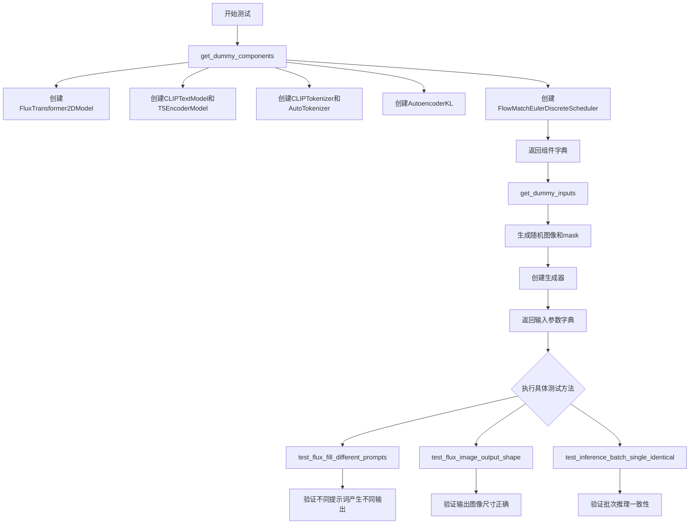
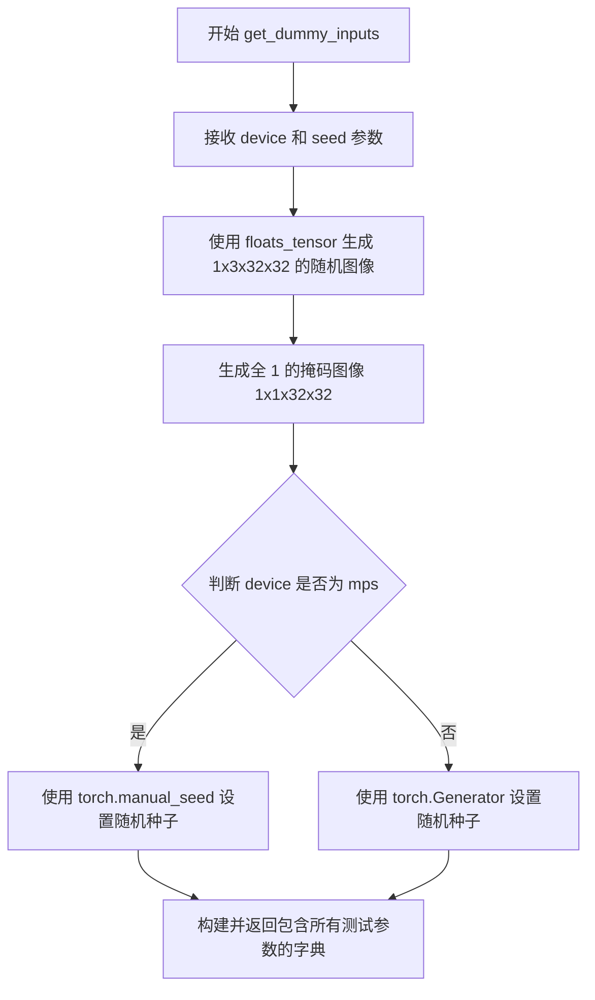
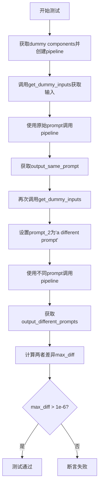
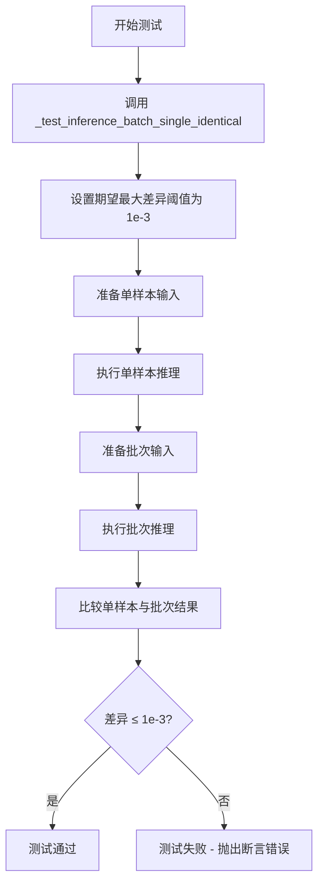
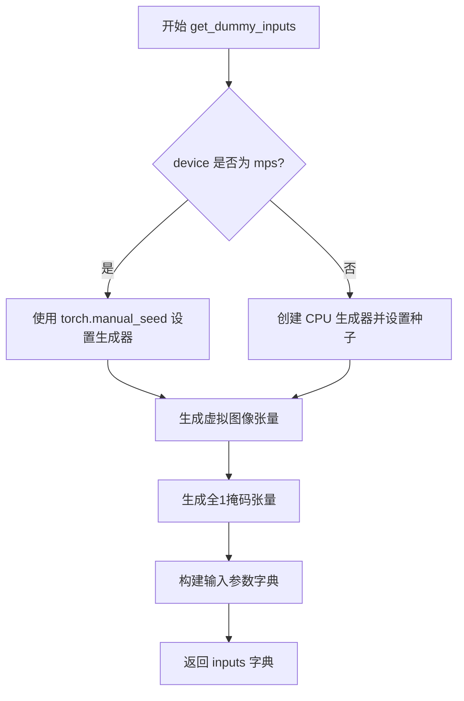
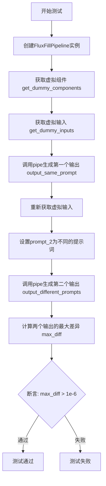
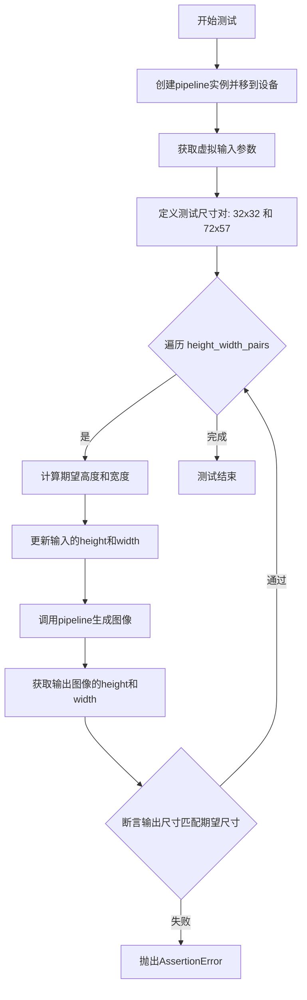
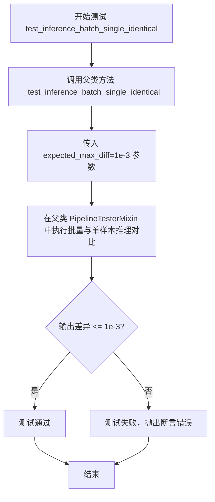

# `diffusers\tests\pipelines\flux\test_pipeline_flux_fill.py` 详细设计文档

这是一个针对 FluxFillPipeline（图像修复/填充扩散管道）的单元测试类，包含了多个测试方法用于验证管道在不同场景下的功能正确性，包括不同提示词的处理、输出图像尺寸验证以及批次推理一致性测试等。

## 整体流程



## 类结构

```
unittest.TestCase
└── FluxFillPipelineFastTests (继承PipelineTesterMixin)
    ├── 类属性: pipeline_class, params, batch_params, test_xformers_attention, test_layerwise_casting, test_group_offloading
    └── 测试方法: get_dummy_components, get_dummy_inputs, test_flux_fill_different_prompts, test_flux_image_output_shape, test_inference_batch_single_identical
```

## 全局变量及字段


### `random`
    
Python标准库随机数生成模块

类型：`module`
    


### `unittest`
    
Python标准库单元测试框架

类型：`module`
    


### `numpy as np`
    
数值计算库

类型：`module`
    


### `torch`
    
PyTorch深度学习框架

类型：`module`
    


### `AutoTokenizer`
    
HuggingFace Transformers分词器

类型：`class`
    


### `CLIPTextConfig`
    
CLIP文本配置类

类型：`class`
    


### `CLIPTextModel`
    
CLIP文本编码器模型

类型：`class`
    


### `CLIPTokenizer`
    
CLIP分词器类

类型：`class`
    


### `T5EncoderModel`
    
T5编码器模型

类型：`class`
    


### `AutoencoderKL`
    
变分自编码器KL散度

类型：`class`
    


### `FlowMatchEulerDiscreteScheduler`
    
流匹配欧拉离散调度器

类型：`class`
    


### `FluxFillPipeline`
    
Flux图像填充管道

类型：`class`
    


### `FluxTransformer2DModel`
    
Flux 2D变换器模型

类型：`class`
    


### `enable_full_determinism`
    
启用完全确定性测试的辅助函数

类型：`function`
    


### `floats_tensor`
    
生成浮点张量的辅助函数

类型：`function`
    


### `torch_device`
    
PyTorch设备常量

类型：`variable`
    


### `FluxFillPipelineFastTests.pipeline_class`
    
指定测试的管道类

类型：`type`
    


### `FluxFillPipelineFastTests.params`
    
包含管道参数集合

类型：`frozenset`
    


### `FluxFillPipelineFastTests.batch_params`
    
包含批次参数集合

类型：`frozenset`
    


### `FluxFillPipelineFastTests.test_xformers_attention`
    
是否测试xformers注意力

类型：`bool`
    


### `FluxFillPipelineFastTests.test_layerwise_casting`
    
是否测试逐层类型转换

类型：`bool`
    


### `FluxFillPipelineFastTests.test_group_offloading`
    
是否测试组卸载

类型：`bool`
    
    

## 全局函数及方法


### `FluxFillPipelineFastTests.get_dummy_components`

该函数用于创建并返回一个包含所有虚拟组件的字典，这些虚拟组件用于测试 FluxFillPipeline，包括 transformer、text_encoder、text_encoder_2、tokenizer、tokenizer_2、vae 和 scheduler 等关键组件。

参数：无

返回值：`Dict[str, Any]`，返回包含以下键的字典：
- `scheduler`：调度器实例
- `text_encoder`：CLIP 文本编码器模型
- `text_encoder_2`：T5 文本编码器模型
- `tokenizer`：CLIP 分词器
- `tokenizer_2`：T5 分词器
- `transformer`：Flux Transformer 2D 模型
- `vae`：自编码器模型

#### 流程图

```mermaid
flowchart TD
    A[开始 get_dummy_components] --> B[设置随机种子 torch.manual_seed(0)]
    B --> C[创建 FluxTransformer2DModel 实例 transformer]
    C --> D[配置 CLIPTextConfig]
    D --> E[创建 CLIPTextModel 实例 text_encoder]
    E --> F[从预训练模型加载 T5EncoderModel 实例 text_encoder_2]
    F --> G[加载 CLIPTokenizer 和 AutoTokenizer]
    G --> H[创建 AutoencoderKL 实例 vae]
    H --> I[创建 FlowMatchEulerDiscreteScheduler 实例 scheduler]
    I --> J[组装字典包含所有组件]
    J --> K[返回字典]
```

#### 带注释源码

```python
def get_dummy_components(self):
    """
    创建并返回包含所有虚拟组件的字典，用于测试 FluxFillPipeline
    """
    # 设置随机种子以确保结果可重复
    torch.manual_seed(0)
    
    # 创建 FluxTransformer2DModel 实例
    # 参数: patch_size=1, in_channels=20, out_channels=8, num_layers=1 等
    transformer = FluxTransformer2DModel(
        patch_size=1,
        in_channels=20,
        out_channels=8,
        num_layers=1,
        num_single_layers=1,
        attention_head_dim=16,
        num_attention_heads=2,
        joint_attention_dim=32,
        pooled_projection_dim=32,
        axes_dims_rope=[4, 4, 8],
    )
    
    # 配置 CLIP 文本编码器参数
    clip_text_encoder_config = CLIPTextConfig(
        bos_token_id=0,
        eos_token_id=2,
        hidden_size=32,
        intermediate_size=37,
        layer_norm_eps=1e-05,
        num_attention_heads=4,
        num_hidden_layers=5,
        pad_token_id=1,
        vocab_size=1000,
        hidden_act="gelu",
        projection_dim=32,
    )

    # 设置随机种子并创建 CLIPTextModel
    torch.manual_seed(0)
    text_encoder = CLIPTextModel(clip_text_encoder_config)

    # 从预训练模型加载 T5EncoderModel
    torch.manual_seed(0)
    text_encoder_2 = T5EncoderModel.from_pretrained("hf-internal-testing/tiny-random-t5")

    # 加载分词器
    tokenizer = CLIPTokenizer.from_pretrained("hf-internal-testing/tiny-random-clip")
    tokenizer_2 = AutoTokenizer.from_pretrained("hf-internal-testing/tiny-random-t5")

    # 设置随机种子并创建 AutoencoderKL (VAE)
    torch.manual_seed(0)
    vae = AutoencoderKL(
        sample_size=32,
        in_channels=3,
        out_channels=3,
        block_out_channels=(4,),
        layers_per_block=1,
        latent_channels=2,
        norm_num_groups=1,
        use_quant_conv=False,
        use_post_quant_conv=False,
        shift_factor=0.0609,
        scaling_factor=1.5035,
    )

    # 创建调度器
    scheduler = FlowMatchEulerDiscreteScheduler()

    # 返回包含所有组件的字典
    return {
        "scheduler": scheduler,
        "text_encoder": text_encoder,
        "text_encoder_2": text_encoder_2,
        "tokenizer": tokenizer,
        "tokenizer_2": tokenizer_2,
        "transformer": transformer,
        "vae": vae,
    }
```


### `FluxFillPipelineFastTests.get_dummy_inputs`

创建并返回一个包含测试输入参数的字典，用于 FluxFillPipeline 的单元测试。该方法生成虚拟的图像、掩码图像、生成器等输入，确保测试的可重复性。

参数：

- `self`：隐含的类实例参数，无需传入
- `device`：`str`，目标设备（如 "cuda"、"cpu" 或 "mps"），用于将张量移动到指定设备
- `seed`：`int`，随机种子，默认值为 `0`，用于控制生成器和其他随机操作的可重复性

返回值：`Dict[str, Any]`，包含以下键的字典：

- `prompt`：str，测试用的文本提示
- `image`：torch.Tensor，输入图像张量
- `mask_image`：torch.Tensor，掩码图像张量
- `generator`：torch.Generator，用于控制随机数生成
- `num_inference_steps`：int，推理步数
- `guidance_scale`：float，引导比例
- `height`：int，图像高度
- `width`：int，图像宽度
- `max_sequence_length`：int，最大序列长度
- `output_type`：str，输出类型

#### 流程图



#### 带注释源码

```python
def get_dummy_inputs(self, device, seed=0):
    """
    生成用于测试 FluxFillPipeline 的虚拟输入参数。
    
    参数:
        device: 目标设备字符串，用于将张量移动到该设备
        seed: 随机种子，默认值为 0，确保测试可重复
    
    返回:
        包含所有管道输入参数的字典
    """
    # 使用 floats_tensor 辅助函数生成形状为 (1, 3, 32, 32) 的随机浮点图像张量
    # 并将其移动到指定设备
    image = floats_tensor((1, 3, 32, 32), rng=random.Random(seed)).to(device)
    
    # 创建全 1 的掩码图像，形状为 (1, 1, 32, 32)，表示不遮挡任何区域
    mask_image = torch.ones((1, 1, 32, 32)).to(device)
    
    # 针对 mps 设备使用特殊的随机种子生成方式
    # 因为某些 mps 设备不支持 torch.Generator
    if str(device).startswith("mps"):
        generator = torch.manual_seed(seed)
    else:
        # 其他设备使用 CPU 生成器并设置随机种子
        generator = torch.Generator(device="cpu").manual_seed(seed)

    # 组装所有输入参数为字典
    inputs = {
        "prompt": "A painting of a squirrel eating a burger",  # 测试用文本提示
        "image": image,                                        # 输入图像
        "mask_image": mask_image,                              # 掩码图像
        "generator": generator,                                # 随机生成器
        "num_inference_steps": 2,                              # 推理步数（较小用于快速测试）
        "guidance_scale": 5.0,                                 # classifier-free guidance 比例
        "height": 32,                                          # 输出高度
        "width": 32,                                            # 输出宽度
        "max_sequence_length": 48,                             # 文本编码最大序列长度
        "output_type": "np",                                   # 输出类型为 numpy 数组
    }
    return inputs
```


### `FluxFillPipelineFastTests.test_flux_fill_different_prompts`

该测试方法用于验证 FluxFillPipeline 在使用不同提示词（prompt）时能够产生不同的图像输出，确保文本提示对图像生成具有实际影响。

参数：

- `self`：测试类实例本身，无需显式传递

返回值：无返回值（测试方法，通过 `assert` 断言验证）

#### 流程图



#### 带注释源码

```python
def test_flux_fill_different_prompts(self):
    """
    测试函数：验证使用不同提示词时管道输出不同
    
    测试逻辑：
    1. 使用相同参数调用pipeline获取第一次输出
    2. 修改prompt_2为不同提示词，再次调用pipeline获取第二次输出
    3. 比较两次输出的差异，验证模型对不同提示词有响应
    """
    # 使用dummy组件创建FluxFillPipeline实例并移动到测试设备
    pipe = self.pipeline_class(**self.get_dummy_components()).to(torch_device)

    # 获取第一次测试的dummy输入（包含默认prompt）
    inputs = self.get_dummy_inputs(torch_device)
    # 调用pipeline获取输出（使用默认prompt）
    output_same_prompt = pipe(**inputs).images[0]

    # 获取第二次测试的dummy输入
    inputs = self.get_dummy_inputs(torch_device)
    # 修改prompt_2为不同的提示词
    inputs["prompt_2"] = "a different prompt"
    # 再次调用pipeline获取输出（使用不同的prompt）
    output_different_prompts = pipe(**inputs).images[0]

    # 计算两次输出之间的最大绝对差异
    max_diff = np.abs(output_same_prompt - output_different_prompts).max()

    # 断言：输出应该不同（差异大于阈值1e-6）
    # 注意：注释提到"Outputs should be different here, For some reasons, they don't show large differences"
    assert max_diff > 1e-6
```


### `FluxFillPipelineFastTests.test_flux_image_output_shape`

验证 FluxFillPipeline 输出图像的尺寸符合 VAE 缩放因子的要求，确保输出高度和宽度都是 `vae_scale_factor * 2` 的整数倍。

参数：

- `self`：隐式参数，测试类实例

返回值：`None`，无返回值（测试函数）

#### 流程图

```mermaid
flowchart TD
    A[开始测试] --> B[创建 FluxFillPipeline 实例并移至 torch_device]
    C[获取 dummy_inputs] --> D[定义 height_width_pairs = [(32, 32), (72, 57)]]
    B --> D
    D --> E{遍历 height_width_pairs}
    E -->|当前 pair| F[计算 expected_height = height - height % (pipe.vae_scale_factor * 2)]
    F --> G[计算 expected_width = width - width % (pipe.vae_scale_factor * 2)]
    G --> H[更新 inputs 的 height 和 width]
    H --> I[调用 pipe(**inputs) 获取图像]
    I --> J[获取输出图像的 shape]
    J --> K{断言 (output_height, output_width) == (expected_height, expected_width)}
    K -->|通过| L{是否还有更多 pairs}
    K -->|失败| M[抛出 AssertionError]
    L -->|是| E
    L -->|否| N[结束测试]
```

#### 带注释源码

```python
def test_flux_image_output_shape(self):
    """
    测试 FluxFillPipeline 输出图像的形状是否符合 VAE 缩放因子的要求
    
    VAE 在编码和解码图像时会进行下采样/上采样，缩放因子通常为 8。
    为了确保 pipeline 能正确处理图像尺寸，需要将输入尺寸调整为
    vae_scale_factor * 2 的整数倍，以确保 VAE 处理后的输出尺寸正确。
    """
    # 创建 FluxFillPipeline 实例，使用 dummy 组件并移至测试设备
    pipe = self.pipeline_class(**self.get_dummy_components()).to(torch_device)
    
    # 获取默认的 dummy 输入参数
    inputs = self.get_dummy_inputs(torch_device)

    # 定义测试用的 height-width 对列表
    # (32, 32): 标准尺寸，应该不需要调整
    # (72, 57): 非标准尺寸，需要向下调整到最近的合法尺寸
    height_width_pairs = [(32, 32), (72, 57)]
    
    # 遍历每对 height-width 进行测试
    for height, width in height_width_pairs:
        # 计算期望的输出高度：减去余数，使结果为 vae_scale_factor * 2 的整数倍
        # VAE 的实际缩放因子存储在 pipe.vae_scale_factor 中
        expected_height = height - height % (pipe.vae_scale_factor * 2)
        
        # 计算期望的输出宽度：同样进行向下取整对齐
        expected_width = width - width % (pipe.vae_scale_factor * 2)

        # 更新输入参数中的 height 和 width
        inputs.update({"height": height, "width": width})
        
        # 调用 pipeline 生成图像
        image = pipe(**inputs).images[0]
        
        # 获取输出图像的形状 (height, width, channels)
        output_height, output_width, _ = image.shape
        
        # 断言输出尺寸与期望尺寸一致
        assert (output_height, output_width) == (expected_height, expected_width)
```


### `FluxFillPipelineFastTests.test_inference_batch_single_identical`

该测试方法用于验证 FluxFillPipeline 在单样本推理与批次推理模式下输出结果的一致性，确保管道在两种推理方式下产生相同的图像输出。

参数：
- 无显式参数（继承自父类 PipelineTesterMixin）

返回值：无返回值（测试方法，通过断言验证）

#### 流程图



#### 带注释源码

```python
def test_inference_batch_single_identical(self):
    """
    测试方法：验证单样本推理与批次推理结果一致性
    
    该测试继承自 PipelineTesterMixin，通过调用父类的 _test_inference_batch_single_identical 方法
    来确保管道在单样本和批次模式下产生一致的输出。这是 Diffusion Pipeline 的重要质量保证测试，
    因为用户可能需要使用相同的管道进行单次生成或批量生成。
    
    参数:
        无（使用类内部的 get_dummy_components 和 get_dummy_inputs 方法获取测试所需的组件和输入）
    
    返回值:
        无（通过断言验证一致性，测试失败时抛出 AssertionError）
    
    预期行为:
        - 创建 FluxFillPipeline 的实例
        - 准备虚拟输入（单样本和批次）
        - 分别执行单样本和批次推理
        - 比较两者的输出图像差异
        - 若差异超过 expected_max_diff (1e-3)，则断言失败
    """
    # 调用父类的通用批次一致性测试方法
    # expected_max_diff=1e-3 表示允许的最大像素差异为 0.001
    # 这确保了数值精度在可接受范围内
    self._test_inference_batch_single_identical(expected_max_diff=1e-3)
```


### `FluxFillPipelineFastTests.get_dummy_components`

此方法用于创建虚拟组件字典，以便在测试 FluxFillPipeline 时使用。它初始化所有必需的模型组件，包括 Transformer、文本编码器（CLIP 和 T5）、VAE 编码器以及调度器，并设置固定的随机种子以确保测试的可重复性和确定性结果。

参数：

- 无参数（仅隐含 `self` 参数）

返回值：`Dict[str, Any]`，返回包含以下键的字典：
- `scheduler`: FlowMatchEulerDiscreteScheduler 实例
- `text_encoder`: CLIPTextModel 实例
- `text_encoder_2`: T5EncoderModel 实例
- `tokenizer`: CLIPTokenizer 实例
- `tokenizer_2`: AutoTokenizer 实例
- `transformer`: FluxTransformer2DModel 实例
- `vae`: AutoencoderKL 实例

#### 流程图

```mermaid
flowchart TD
    A([开始]) --> B[设置随机种子 torch.manual_seed(0)]
    B --> C[创建 FluxTransformer2DModel]
    C --> D[创建 CLIPTextConfig 配置对象]
    D --> E[使用配置创建 CLIPTextModel]
    E --> F[从预训练加载 T5EncoderModel]
    F --> G[从预训练加载 CLIPTokenizer]
    G --> H[从预训练加载 AutoTokenizer]
    H --> I[创建 AutoencoderKL]
    I --> J[创建 FlowMatchEulerDiscreteScheduler]
    J --> K[组装并返回包含所有组件的字典]
    K --> L([结束])
```

#### 带注释源码

```python
def get_dummy_components(self):
    """
    创建虚拟组件字典，用于测试 FluxFillPipeline
    """
    # 设置随机种子为 0，确保测试的可重复性
    torch.manual_seed(0)
    
    # 1. 创建 FluxTransformer2DModel（图像变换模型）
    # patch_size: 补丁大小, in_channels: 输入通道数, out_channels: 输出通道数
    # num_layers: 层数, num_single_layers: 单层数
    # attention_head_dim: 注意力头维度, num_attention_heads: 注意力头数量
    # joint_attention_dim: 联合注意力维度, pooled_projection_dim: 池化投影维度
    # axes_dims_rope: RoPE 轴维度
    transformer = FluxTransformer2DModel(
        patch_size=1,
        in_channels=20,
        out_channels=8,
        num_layers=1,
        num_single_layers=1,
        attention_head_dim=16,
        num_attention_heads=2,
        joint_attention_dim=32,
        pooled_projection_dim=32,
        axes_dims_rope=[4, 4, 8],
    )
    
    # 2. 创建 CLIP 文本编码器配置
    # bos_token_id: 句子开始标记 ID, eos_token_id: 句子结束标记 ID
    # hidden_size: 隐藏层大小, intermediate_size: 中间层大小
    # layer_norm_eps: 层归一化 epsilon, num_attention_heads: 注意力头数
    # num_hidden_layers: 隐藏层数, pad_token_id: 填充标记 ID
    # vocab_size: 词汇表大小, hidden_act: 激活函数, projection_dim: 投影维度
    clip_text_encoder_config = CLIPTextConfig(
        bos_token_id=0,
        eos_token_id=2,
        hidden_size=32,
        intermediate_size=37,
        layer_norm_eps=1e-05,
        num_attention_heads=4,
        num_hidden_layers=5,
        pad_token_id=1,
        vocab_size=1000,
        hidden_act="gelu",
        projection_dim=32,
    )

    # 3. 使用配置创建 CLIP 文本编码器模型
    torch.manual_seed(0)
    text_encoder = CLIPTextModel(clip_text_encoder_config)

    # 4. 从预训练模型加载 T5 编码器（文本编码器 2）
    torch.manual_seed(0)
    text_encoder_2 = T5EncoderModel.from_pretrained("hf-internal-testing/tiny-random-t5")

    # 5. 从预训练模型加载 CLIP 分词器
    tokenizer = CLIPTokenizer.from_pretrained("hf-internal-testing/tiny-random-clip")
    
    # 6. 从预训练模型加载 T5 分词器
    tokenizer_2 = AutoTokenizer.from_pretrained("hf-internal-testing/tiny-random-t5")

    # 7. 创建 VAE（变分自编码器）模型
    # sample_size: 样本尺寸, in_channels: 输入通道, out_channels: 输出通道
    # block_out_channels: 块输出通道, layers_per_block: 每块层数
    # latent_channels: 潜在通道, norm_num_groups: 归一化组数
    # use_quant_conv: 是否使用量化卷积, use_post_quant_conv: 是否使用后量化卷积
    # shift_factor: 偏移因子, scaling_factor: 缩放因子
    torch.manual_seed(0)
    vae = AutoencoderKL(
        sample_size=32,
        in_channels=3,
        out_channels=3,
        block_out_channels=(4,),
        layers_per_block=1,
        latent_channels=2,
        norm_num_groups=1,
        use_quant_conv=False,
        use_post_quant_conv=False,
        shift_factor=0.0609,
        scaling_factor=1.5035,
    )

    # 8. 创建调度器（基于 Flow Match 的 Euler 离散调度器）
    scheduler = FlowMatchEulerDiscreteScheduler()

    # 9. 返回包含所有虚拟组件的字典
    return {
        "scheduler": scheduler,
        "text_encoder": text_encoder,
        "text_encoder_2": text_encoder_2,
        "tokenizer": tokenizer,
        "tokenizer_2": tokenizer_2,
        "transformer": transformer,
        "vae": vae,
    }
```


### `FluxFillPipelineFastTests.get_dummy_inputs`

该方法是一个测试辅助函数，用于生成虚拟输入参数（包含图像、掩码、生成器、推理步数等），以支持 FluxFillPipeline 管道推理测试。

参数：

- `self`：隐式参数，指向测试类实例本身
- `device`：`str`，目标计算设备（如 "cuda"、"cpu" 或 "mps"）
- `seed`：`int`，随机种子，默认为 0，用于确保测试可复现

返回值：`Dict[str, Any]`，包含以下键值对的字典：

- `prompt`：测试用提示词文本
- `image`：虚拟输入图像张量
- `mask_image`：虚拟掩码图像张量
- `generator`：PyTorch 随机数生成器
- `num_inference_steps`：推理步数
- `guidance_scale`：引导系数
- `height`、`width`：输出图像尺寸
- `max_sequence_length`：最大序列长度
- `output_type`：输出类型

#### 流程图



#### 带注释源码

```python
def get_dummy_inputs(self, device, seed=0):
    """
    生成用于测试的虚拟输入参数。

    参数:
        device: 目标计算设备
        seed: 随机种子，确保测试可复现

    返回:
        包含管道推理所需参数的字典
    """
    # 使用 floats_tensor 生成指定形状的随机浮点数张量
    # 形状为 (1, 3, 32, 32)，对应批次大小1、通道数3、图像尺寸32x32
    image = floats_tensor((1, 3, 32, 32), rng=random.Random(seed)).to(device)
    
    # 创建全1掩码张量，形状 (1, 1, 32, 32)
    mask_image = torch.ones((1, 1, 32, 32)).to(device)
    
    # 根据设备类型选择随机生成器的创建方式
    # MPS (Apple Silicon) 设备使用 torch.manual_seed
    if str(device).startswith("mps"):
        generator = torch.manual_seed(seed)
    else:
        # 其他设备（CPU/CUDA）创建显式的 Generator 对象
        generator = torch.Generator(device="cpu").manual_seed(seed)

    # 构建完整的输入参数字典
    inputs = {
        "prompt": "A painting of a squirrel eating a burger",  # 测试用提示词
        "image": image,                # 输入图像张量
        "mask_image": mask_image,      # 掩码张量
        "generator": generator,        # 随机生成器确保可复现性
        "num_inference_steps": 2,      # 推理步数（测试用小值）
        "guidance_scale": 5.0,         # Classifier-free guidance 系数
        "height": 32,                  # 输出高度
        "width": 32,                   # 输出宽度
        "max_sequence_length": 48,     # 文本编码最大序列长度
        "output_type": "np",           # 输出格式为 NumPy 数组
    }
    return inputs
```


### `FluxFillPipelineFastTests.test_flux_fill_different_prompts`

该测试方法用于验证 FluxFillPipeline 在使用不同提示词（prompt 和 prompt_2）时能够生成明显不同的图像输出，确保模型对不同文本提示的响应具有区分性。

参数：

- `self`：`FluxFillPipelineFastTests`，测试类的实例，包含测试所需的配置和方法

返回值：`None`，该测试方法通过断言验证结果，不返回任何值

#### 流程图



#### 带注释源码

```python
def test_flux_fill_dummy_prompts(self):
    """
    测试不同提示词是否产生不同的输出
    验证FluxFillPipeline对文本提示的敏感性
    """
    
    # 步骤1: 使用虚拟组件创建FluxFillPipeline实例并移至测试设备
    # get_dummy_components() 返回包含 transformer, text_encoder, vae 等的字典
    pipe = self.pipeline_class(**self.get_dummy_components()).to(torch_device)

    # 步骤2: 获取虚拟输入参数（包含默认提示词 "A painting of a squirrel eating a burger"）
    inputs = self.get_dummy_inputs(torch_device)
    
    # 步骤3: 使用相同的提示词调用管道，获取第一个输出
    # pipe() 返回一个包含 images 的对象，images[0] 是第一张生成的图像
    output_same_prompt = pipe(**inputs).images[0]

    # 步骤4: 重新获取虚拟输入，准备测试不同提示词
    inputs = self.get_dummy_inputs(torch_device)
    
    # 步骤5: 修改提示词，添加第二个不同的提示词
    # 这将测试管道是否能够区分不同的文本提示
    inputs["prompt_2"] = "a different prompt"
    
    # 步骤6: 使用不同的提示词调用管道，获取第二个输出
    output_different_prompts = pipe(**inputs).images[0]

    # 步骤7: 计算两个输出之间的最大绝对差异
    # 使用numpy计算矩阵差异的最大值
    max_diff = np.abs(output_same_prompt - output_different_prompts).max()

    # 步骤8: 断言验证
    # 期望：不同提示词应该产生明显不同的输出
    # 注意：代码注释提到 "For some reasons, they don't show large differences"
    # 因此阈值设置为 1e-6（一个相对较小的值）
    assert max_diff > 1e-6
```


### `FluxFillPipelineFastTests.test_flux_image_output_shape`

该测试方法用于验证 FluxFillPipeline 在不同高度和宽度输入下输出的图像形状是否正确，通过计算期望的高度和宽度（考虑 VAE 缩放因子的影响），并使用断言确保实际输出与期望尺寸匹配。

参数：

- `self`：无显式参数，类实例本身

返回值：`None`，该方法为测试方法，通过断言验证图像形状，无显式返回值

#### 流程图



#### 带注释源码

```python
def test_flux_image_output_shape(self):
    """
    测试 FluxFillPipeline 输出的图像形状是否符合预期
    验证在不同输入尺寸下，VAE 缩放因子是否正确应用于输出尺寸
    """
    # 创建 pipeline 实例并移动到指定设备
    pipe = self.pipeline_class(**self.get_dummy_components()).to(torch_device)
    
    # 获取虚拟输入参数（包含图像、mask、生成器等）
    inputs = self.get_dummy_inputs(torch_device)

    # 定义测试用的高度-宽度对列表
    height_width_pairs = [(32, 32), (72, 57)]
    
    # 遍历每组尺寸进行测试
    for height, width in height_width_pairs:
        # 计算期望高度：输入高度减去 VAE 缩放因子 * 2 的余数
        # 这是因为 VAE 会将图像下采样一定倍数
        expected_height = height - height % (pipe.vae_scale_factor * 2)
        
        # 计算期望宽度：输入宽度减去 VAE 缩放因子 * 2 的余数
        expected_width = width - width % (pipe.vae_scale_factor * 2)

        # 更新输入参数中的高度和宽度
        inputs.update({"height": height, "width": width})
        
        # 调用 pipeline 进行推理，获取生成的图像
        image = pipe(**inputs).images[0]
        
        # 从输出图像中获取实际的高度和宽度（第三个维度是通道数）
        output_height, output_width, _ = image.shape
        
        # 断言：验证实际输出尺寸是否与期望尺寸匹配
        assert (output_height, output_width) == (expected_height, expected_width)
```


### `FluxFillPipelineFastTests.test_inference_batch_single_identical`

该测试方法用于验证 FluxFillPipeline 在批量推理（batch inference）与单样本推理（single inference）时的输出结果一致性，确保模型在不同推理模式下产生相同的输出。

参数：

- `expected_max_diff`：`float`，期望的最大差异阈值，设为 `1e-3`，用于判断批量推理与单样本推理的输出差异是否在可接受范围内

返回值：`None`，该方法为测试方法，无返回值，通过断言验证一致性

#### 流程图



#### 带注释源码

```python
def test_inference_batch_single_identical(self):
    """
    测试方法：验证批量推理与单样本推理的输出一致性
    
    该方法继承自 unittest.TestCase，作为 FluxFillPipeline 的集成测试。
    主要目的是确保在使用相同的输入参数时，批量推理模式（一次处理多个样本）
    与单样本推理模式（多次处理单个样本）能够产生数值上相近的输出结果。
    
    参数:
        expected_max_diff: float, 默认为 1e-3
            允许的最大绝对差异值。如果批量推理与单样本推理的输出差异
            超过此阈值，则测试失败。这考虑到浮点数运算的精度误差。
    
    返回值:
        None
    
    内部逻辑:
        1. 调用父类 PipelineTesterMixin._test_inference_batch_single_identical 方法
        2. 父类方法会：
           - 获取虚拟组件 (get_dummy_components)
           - 获取虚拟输入 (get_dummy_inputs)
           - 执行单样本推理
           - 将输入转换为批量形式 (batch_size > 1)
           - 执行批量推理
           - 比较两种推理模式的输出差异
           - 使用 assert 验证差异小于 expected_max_diff
    """
    # 调用父类的测试方法，验证批量推理与单样本推理的一致性
    # expected_max_diff=1e-3 表示允许的 最大差异阈值为 0.001
    self._test_inference_batch_single_identical(expected_max_diff=1e-3)
```

## 关键组件


### FluxFillPipeline

FluxFillPipeline 是核心的图像填充管道，整合了文本编码器、Transformer模型和VAE，用于根据prompt和mask图像生成填充后的图像。

### FluxTransformer2DModel

FluxTransformer2DModel 是图像处理的Transformer模型，接收latent特征和文本embedding，通过多层注意力机制进行特征处理，支持patch嵌入和位置编码。

### CLIPTextModel

CLIPTextModel是基于CLIP架构的文本编码器，将文本prompt编码为高维特征向量，支持联合注意力机制。

### T5EncoderModel

T5EncoderModel是基于T5架构的文本编码器，用于处理额外的文本输入，提供双文本编码器支持以增强文本理解能力。

### AutoencoderKL

AutoencoderKL是变分自编码器模型，负责图像的编码和解码，支持潜在空间的压缩与重建，包含量化卷积块配置。

### FlowMatchEulerDiscreteScheduler

FlowMatchEulerDiscreteScheduler是离散欧拉调度器，用于控制去噪推理过程中的噪声调度，支持扩散模型的迭代采样。

### 张量索引与形状处理

通过floats_tensor生成随机张量，配合VAE的scale_factor进行高度和宽度的对齐处理，确保输出尺寸符合VAE的下采样比例。

### 量化策略支持

AutoencoderKL包含use_quant_conv和use_post_quant_conv参数，支持量化卷积操作以优化推理效率。

### 批处理与推理配置

通过batch_params和params定义批处理参数，支持单次推理和批量推理，包含guidance_scale、num_inference_steps等关键配置。

### 设备兼容性处理

代码支持多种设备（cuda、mps、cpu），针对mps设备使用torch.manual_seed，其他设备使用Generator进行随机种子管理。


## 问题及建议


### 已知问题

- **硬编码的随机种子重复调用**：在 `get_dummy_components` 方法中多次调用 `torch.manual_seed(0)`，导致配置对象初始化时的随机性被消除，测试之间可能产生隐藏的依赖关系
- **Magic Number 缺乏解释**：`test_inference_batch_single_identical` 中的 `expected_max_diff=1e-3` 以及 `test_flux_fill_different_prompts` 中的 `1e-6` 阈值没有常量定义，后续维护困难
- **设备兼容性处理不优雅**：`get_dummy_inputs` 中使用 `if str(device).startswith("mps")` 进行设备判断，字符串比较方式脆弱且不易扩展
- **测试参数硬编码**：`num_inference_steps=2` 和 `guidance_scale=5.0` 等关键参数在 `get_dummy_inputs` 中写死，无法灵活配置不同测试场景
- **导入冗余**：`random` 模块被导入但实际未使用（使用 `floats_tensor` 替代），`unittest` 也可考虑使用 pytest 替代以获得更丰富的断言
- **缺少类型注解**：方法参数和返回值缺乏类型提示，影响代码可读性和静态分析工具的有效性
- **测试隔离性问题**：全局函数 `enable_full_determinism()` 在模块加载时即执行，可能影响其他测试用例的随机行为
- **mixin 依赖隐式**：`PipelineTesterMixin` 依赖继承链传递，测试方法的实现细节对子类不透明，调试困难
- **配置参数未封装**：大量配置参数（如 `patch_size=1`, `attention_head_dim=16` 等）以字典形式返回，缺乏配置类或数据类封装

### 优化建议

- 提取关键阈值（如 `1e-3`, `1e-6`）为类级别常量或配置文件，提升可维护性
- 将设备判断封装为工具函数，使用 `torch.device` 的属性或 `match` 表达式处理
- 考虑使用 `@dataclass` 或 Pydantic 模型封装 `get_dummy_components` 返回的配置，提高类型安全和可读性
- 在 `get_dummy_inputs` 中为 `num_inference_steps` 等参数添加默认参数或从类属性读取，增强测试灵活性
- 添加类型注解（使用 `typing` 模块或 Python 3.10+ 语法），如 `def get_dummy_components(self) -> dict[str, Any]:`
- 清理未使用的导入，考虑使用 pytest 替代 unittest 以获得更好的 fixture 管理和参数化支持
- 将 `enable_full_determinism` 调用移至 `setUp` 方法中，确保测试隔离性
- 为 `PipelineTesterMixin` 添加抽象方法定义或文档说明，明确子类需要实现的方法契约

## 其它


### 设计目标与约束

本测试代码旨在验证 FluxFillPipeline 的核心功能，包括多提示词处理、图像输出形状正确性、批处理一致性以及层wise类型转换和组卸载功能。测试采用固定的随机种子（torch.manual_seed(0)）确保可复现性，测试环境支持 CPU、CUDA 和 MPS 设备。

### 错误处理与异常设计

代码通过 unittest 框架进行错误捕获，使用 assert 语句验证输出正确性。对于 MPS 设备使用 torch.manual_seed 而其他设备使用 CPU Generator。测试中捕获 numpy 数组差异（max_diff）来判断输出是否符合预期，对于浮点数比较使用容差（1e-6 和 1e-3）。

### 数据流与状态机

数据流为：get_dummy_components() → 初始化所有模型组件 → get_dummy_inputs() → 生成测试输入（图像、mask、提示词等）→ pipe(**inputs) → 执行推理流程 → 返回输出图像。状态机涉及：组件初始化状态 → 输入准备状态 → 推理执行状态 → 输出验证状态。

### 外部依赖与接口契约

主要依赖包括：diffusers 库（FluxFillPipeline、FlowMatchEulerDiscreteScheduler、AutoencoderKL、FluxTransformer2DModel）、transformers 库（CLIPTextModel、CLIPTokenizer、AutoTokenizer、T5EncoderModel、CLIPTextConfig）、torch、numpy、random。接口契约：pipeline_class 必须是 FluxFillPipeline，params 和 batch_params 定义可配置参数，get_dummy_components 返回包含所有必需组件的字典，get_dummy_inputs 返回符合 pipeline 调用签名的参数字典。

### 配置与参数说明

关键配置参数包括：patch_size=1、in_channels=20、out_channels=8、num_layers=1、num_attention_heads=2、joint_attention_dim=32、pooled_projection_dim=32、axes_dims_rope=[4,4,8] 用于 transformer；hidden_size=32、intermediate_size=37、num_attention_heads=4、num_hidden_layers=5 用于 CLIP 文本编码器；vae_scale_factor 影响输出尺寸计算；num_inference_steps=2、guidance_scale=5.0 用于推理控制。

### 测试覆盖范围

当前测试覆盖：不同提示词输出差异性验证（test_flux_fill_different_prompts）、多尺寸图像输出形状正确性验证（test_flux_image_output_shape）、批处理单样本一致性验证（test_inference_batch_single_identical）。继承自 PipelineTesterMixin 的测试包括：xformers 注意力层测试、层wise类型转换测试、组卸载测试。

### 性能考量与基准

测试采用最小化配置（num_layers=1、num_single_layers=1、hidden_size=32）以加快执行速度。推理步骤仅使用 2 步（num_inference_steps=2）。VAE 使用小尺寸配置（sample_size=32、block_out_channels=(4,)、layers_per_block=1）。预期最大差异容差为 1e-3 用于验证数值一致性。

### 版本兼容性与环境要求

代码需要 torch、numpy、transformers、diffusers 库。支持设备：torch_device（CPU、CUDA、MPS）。测试使用特定的预训练模型变体（hf-internal-testing/tiny-random-*）以便快速执行。

### 潜在技术债务与优化空间

测试缺少对梯度传播、内存泄漏、并发调用、长时间推理稳定性的验证。未测试负面提示词、图像修复后的后处理、CFG 调度策略变化、VAE 缓存优化等高级功能。get_dummy_components 中多次调用 torch.manual_seed(0) 可提取为独立的种子设置函数以提高可维护性。

### 安全考虑

测试代码不涉及真实用户数据或敏感信息。使用公开的 tiny-random 模型进行测试，避免下载大型预训练模型。测试环境应与生产环境隔离。

### 可维护性与扩展性

建议将硬编码的测试参数（尺寸、种子、阈值）提取为类常量或配置文件。get_dummy_components 和 get_dummy_inputs 可考虑参数化以支持不同配置的测试。添加类型注解以提高代码可读性和 IDE 支持。


    