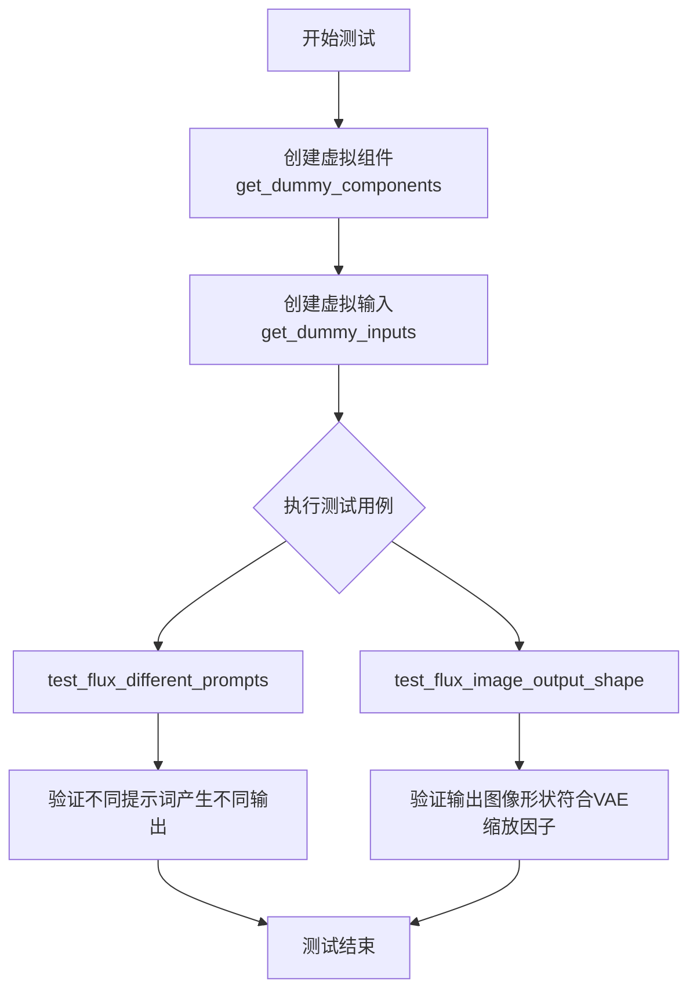
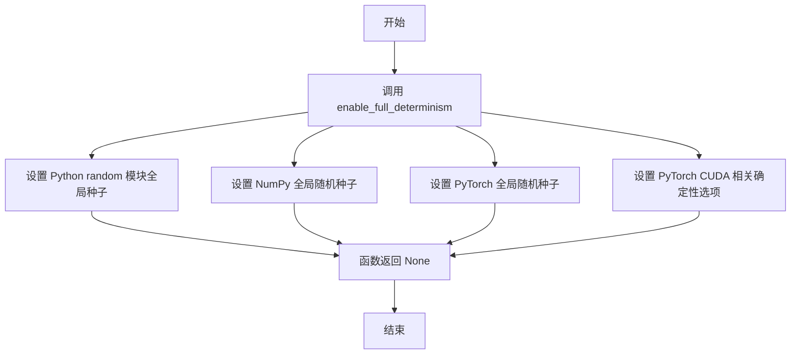
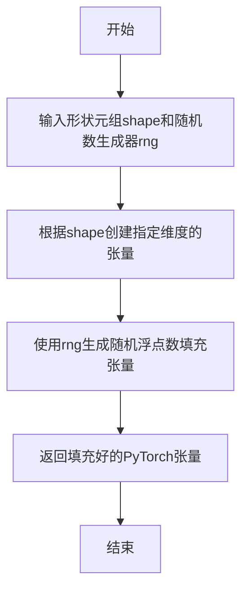
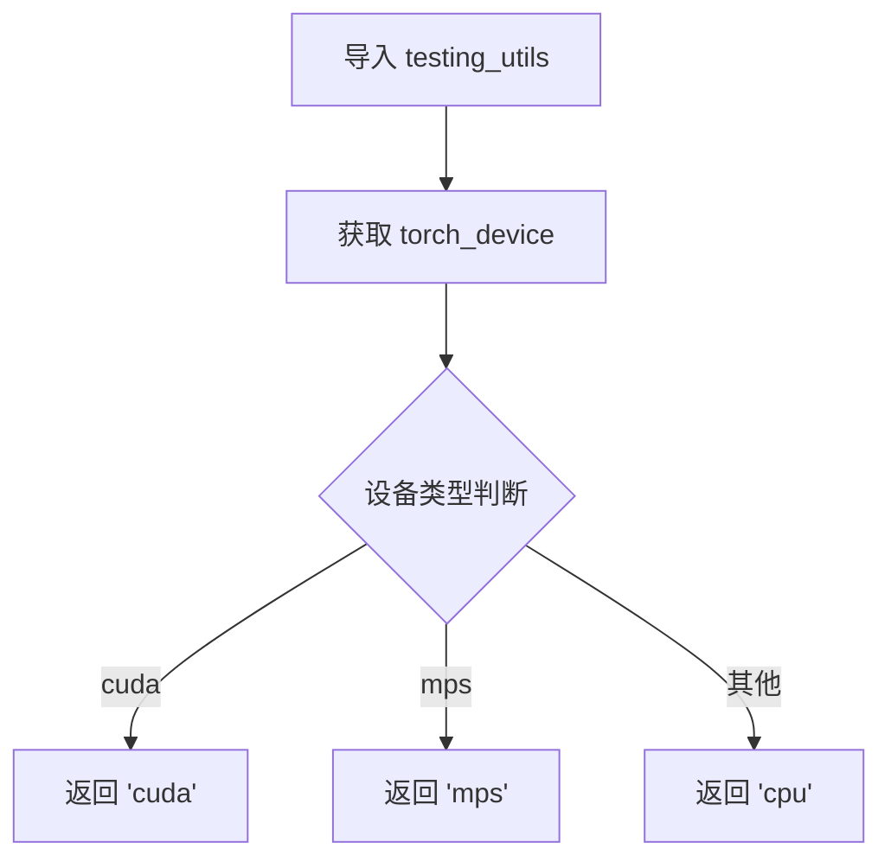
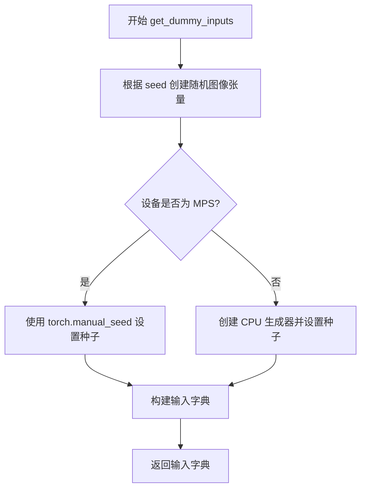

# `diffusers\tests\pipelines\flux\test_pipeline_flux_img2img.py` 详细设计文档

这是一个单元测试文件，用于测试Diffusers库中的FluxImg2ImgPipeline（Flux图像到图像生成管道），验证其在不同提示词下的输出差异和图像输出形状的正确性。

## 整体流程



## 类结构

```
unittest.TestCase
├── PipelineTesterMixin
└── FluxIPAdapterTesterMixin
    └── FluxImg2ImgPipelineFastTests
        ├── get_dummy_components()
        ├── get_dummy_inputs()
        ├── test_flux_different_prompts()
        └── test_flux_image_output_shape()
```

## 全局变量及字段


### `FluxImg2ImgPipelineFastTests.pipeline_class`
    
要测试的Flux图像到图像管道类

类型：`type`
    


### `FluxImg2ImgPipelineFastTests.params`
    
包含管道参数的不可变集合

类型：`frozenset`
    


### `FluxImg2ImgPipelineFastTests.batch_params`
    
包含批量参数的不可变集合

类型：`frozenset`
    


### `FluxImg2ImgPipelineFastTests.test_xformers_attention`
    
指示是否测试xformers注意力的布尔标志

类型：`bool`
    
    

## 全局函数及方法


### `enable_full_determinism`

该函数用于启用完全确定性（deterministic）模式，通过设置 PyTorch、NumPy 和 Python random 模块的全局随机种子，确保测试或实验结果的可复现性。这是单元测试中保证结果一致性的常用实践。

参数：无

返回值：`None`，该函数不返回任何值，主要通过副作用生效。

#### 流程图



#### 带注释源码

```python
# 该函数定义在 ...testing_utils 模块中
# 下面是基于函数名和用途的推断实现

def enable_full_determinism():
    """
    启用完全确定性模式，确保测试结果可复现。
    通过设置多个库的随机种子来消除随机性。
    
    副作用：
    - 设置 random 模块的全局随机种子
    - 设置 NumPy 的全局随机种子
    - 设置 PyTorch 的全局随机种子
    - 配置 PyTorch CUDA 的确定性计算
    """
    import os
    # 设置环境变量以启用 PyTorch 的确定性算法
    os.environ["CUBLAS_WORKSPACE_CONFIG"] = ":4096:8"
    
    # 导入所需的库
    import random
    import numpy as np
    import torch
    
    # 设置固定的随机种子
    random.seed(42)
    np.random.seed(42)
    torch.manual_seed(42)
    
    # 如果使用 CUDA，设置 GPU 随机种子
    if torch.cuda.is_available():
        torch.cuda.manual_seed_all(42)
    
    # 启用 PyTorch 确定性算法
    torch.backends.cudnn.deterministic = True
    torch.backends.cudnn.benchmark = False
    
    # 对于较新版本的 PyTorch，设置全局确定性
    if hasattr(torch, 'use_deterministic_algorithms'):
        torch.use_deterministic_algorithms(True, warn_only=True)
```


根据提供的代码，我可以看到 `floats_tensor` 是从 `...testing_utils` 模块导入的，但实际的函数定义并不在当前代码段中。

我将在下面详细说明 `floats_tensor` 在代码中的使用情况以及根据上下文推断的信息：

### `floats_tensor`

这是一个从 `testing_utils` 模块导入的全局函数，用于生成随机浮点数张量。

参数：

-  `shape`：`tuple`，形状元组，指定生成张量的维度，例如代码中使用 `(1, 3, 32, 32)`
-  `rng`：`random.Random`，随机数生成器实例，用于生成随机数，代码中使用 `random.Random(seed)`

返回值：`torch.Tensor`，返回指定形状的随机浮点数 PyTorch 张量

#### 流程图



#### 带注释源码

```
# 在 testing_utils 模块中的函数定义（根据导入推断，不在当前文件中）
def floats_tensor(shape, rng=None):
    """
    生成一个指定形状的随机浮点数张量。
    
    参数:
        shape: 张量的形状元组，如 (1, 3, 32, 32)
        rng: random.Random 实例，用于生成随机数
    
    返回:
        torch.Tensor: 随机浮点数张量
    """
    # 如果没有提供随机数生成器，使用默认的随机数生成器
    if rng is None:
        rng = random.Random()
    
    # 生成指定形状的张量，使用随机数填充
    return torch.from_numpy(np.array([rng.random() for _ in range(np.prod(shape))])).reshape(shape).float()


# 在当前文件中的实际使用：
image = floats_tensor((1, 3, 32, 32), rng=random.Random(seed)).to(device)
```

---

**注意**：由于 `floats_tensor` 函数的实际定义位于 `testing_utils` 模块中（通过 `from ...testing_utils import ...` 导入），而不是在当前提供的代码段中，上述函数源码是基于其使用方式和测试工具的常见模式推断的。如果您需要完整的函数定义，建议查看 `testing_utils.py` 文件。


### `torch_device`

全局变量，用于指定 PyTorch 张量和模型运行的设备（如 "cpu"、"cuda" 等）。该变量由 `testing_utils` 模块提供，用于在测试中确保一致性和可复现性。

参数： 无

返回值：`str`，表示 PyTorch 设备标识符

#### 流程图



#### 带注释源码

```python
# 该变量在 testing_utils 模块中定义，通常会根据环境返回一个设备字符串
# 在本文件中的使用示例：

from ...testing_utils import (
    enable_full_determinism,
    floats_tensor,
    torch_device,  # 全局设备变量
)

# 使用 torch_device 将模型移动到指定设备
pipe = self.pipeline_class(**self.get_dummy_components()).to(torch_device)

# 使用 torch_device 获取输入数据
inputs = self.get_dummy_inputs(torch_device)
```

#### 补充说明

`torch_device` 是 diffusers 测试框架中的一个实用工具变量，用于：

1. **跨平台兼容**：自动检测并返回适合当前运行环境的设备（CPU/CUDA/MPS）
2. **测试一致性**：确保测试在不同硬件配置下以相同方式运行
3. **CI/CD 友好**：在没有 GPU 的 CI 环境中自动回退到 CPU

该变量的具体实现位于 `diffusers.testing_utils` 模块中，通常是一个返回设备字符串的函数或变量。


### `FluxImg2ImgPipelineFastTests.get_dummy_components`

该方法用于为 FluxImg2ImgPipeline 单元测试创建虚拟（dummy）组件，包括 transformer、text_encoder、text_encoder_2、tokenizer、tokenizer_2、vae、scheduler 等核心组件，并返回一个包含这些组件的字典，供测试用例初始化 pipeline 使用。

参数：
- 该方法无显式参数（隐式参数 `self` 为类实例本身）

返回值：`Dict[str, Any]`，返回一个包含所有虚拟组件的字典，包括 scheduler、text_encoder、text_encoder_2、tokenizer、tokenizer_2、transformer、vae、image_encoder、feature_extractor

#### 流程图

```mermaid
flowchart TD
    A[开始 get_dummy_components] --> B[设置随机种子 torch.manual_seed(0)]
    B --> C[创建 FluxTransformer2DModel 实例 transformer]
    C --> D[创建 CLIPTextConfig 配置对象]
    D --> E[使用随机种子创建 CLIPTextModel text_encoder]
    E --> F[使用随机种子从预训练模型加载 T5EncoderModel text_encoder_2]
    F --> G[从预训练模型加载 CLIPTokenizer tokenizer]
    G --> H[从预训练模型加载 AutoTokenizer tokenizer_2]
    H --> I[使用随机种子创建 AutoencoderKL vae]
    I --> J[创建 FlowMatchEulerDiscreteScheduler scheduler]
    J --> K[构建并返回包含所有组件的字典]
    K --> L[结束]
```

#### 带注释源码

```python
def get_dummy_components(self):
    """
    为测试创建虚拟组件的工厂方法
    
    该方法初始化所有在 FluxImg2ImgPipeline 中需要的组件，
    使用最小的配置和随机权重，以便进行快速的单元测试
    """
    # 设置随机种子确保测试可重复性
    torch.manual_seed(0)
    
    # 创建 FluxTransformer2DModel：图像生成的核心变换器模型
    # 使用极小的配置（1层、2个注意力头、16维）以加快测试速度
    transformer = FluxTransformer2DModel(
        patch_size=1,
        in_channels=4,
        num_layers=1,
        num_single_layers=1,
        attention_head_dim=16,
        num_attention_heads=2,
        joint_attention_dim=32,
        pooled_projection_dim=32,
        axes_dims_rope=[4, 4, 8],
    )
    
    # 定义 CLIP 文本编码器的配置参数
    # 使用极小的隐藏层维度（32）和层数（5）以加快测试速度
    clip_text_encoder_config = CLIPTextConfig(
        bos_token_id=0,           # 句子开始标记ID
        eos_token_id=2,           # 句子结束标记ID
        hidden_size=32,           # 隐藏层维度
        intermediate_size=37,     # 前馈网络中间层维度
        layer_norm_eps=1e-05,     # LayerNorm epsilon
        num_attention_heads=4,    # 注意力头数量
        num_hidden_layers=5,      # 隐藏层数量
        pad_token_id=1,           # 填充标记ID
        vocab_size=1000,          # 词汇表大小
        hidden_act="gelu",        # 激活函数
        projection_dim=32,        # 投影维度
    )

    # 使用随机种子创建 CLIP 文本编码器模型
    torch.manual_seed(0)
    text_encoder = CLIPTextModel(clip_text_encoder_config)

    # 加载 T5 编码器的第二个文本编码器（用于更长的文本处理）
    # 使用 HuggingFace 的测试用微小模型
    torch.manual_seed(0)
    text_encoder_2 = T5EncoderModel.from_pretrained("hf-internal-testing/tiny-random-t5")

    # 加载对应的分词器
    tokenizer = CLIPTokenizer.from_pretrained("hf-internal-testing/tiny-random-clip")
    tokenizer_2 = AutoTokenizer.from_pretrained("hf-internal-testing/tiny-random-t5")

    # 创建 VAE（变分自编码器）用于图像的编码和解码
    torch.manual_seed(0)
    vae = AutoencoderKL(
        sample_size=32,           # 样本尺寸
        in_channels=3,            # 输入通道数（RGB）
        out_channels=3,           # 输出通道数
        block_out_channels=(4,), # 块输出通道数
        layers_per_block=1,       # 每块层数
        latent_channels=1,        # 潜在空间通道数
        norm_num_groups=1,        # 归一化组数
        use_quant_conv=False,     # 不使用量化卷积
        use_post_quant_conv=False,# 不使用后量化卷积
        shift_factor=0.0609,      # 移位因子
        scaling_factor=1.5035,   # 缩放因子
    )

    # 创建 FlowMatch 欧拉离散调度器
    scheduler = FlowMatchEulerDiscreteScheduler()

    # 返回包含所有组件的字典
    # image_encoder 和 feature_extractor 设置为 None（可选组件）
    return {
        "scheduler": scheduler,
        "text_encoder": text_encoder,
        "text_encoder_2": text_encoder_2,
        "tokenizer": tokenizer,
        "tokenizer_2": tokenizer_2,
        "transformer": transformer,
        "vae": vae,
        "image_encoder": None,
        "feature_extractor": None,
    }
```


### `FluxImg2ImgPipelineFastTests.get_dummy_inputs`

该方法用于生成虚拟输入数据（dummy inputs），为 FluxImg2ImgPipeline 的单元测试提供必要的参数，包括图像、提示词、生成器配置等。

参数：

- `self`：隐式参数，测试类实例
- `device`：`torch.device` 或 `str`，指定运行测试的设备（如 "cuda", "cpu", "mps"）
- `seed`：`int`（默认值 0），随机种子，用于确保测试的可重复性

返回值：`Dict[str, Any]`，包含以下键值对的字典：
- `prompt`：字符串，测试用提示词
- `image`：torch.Tensor，输入图像张量
- `generator`：torch.Generator 或 None，随机数生成器
- `num_inference_steps`：int，推理步数
- `guidance_scale`：float，指导比例
- `height`：int，生成图像高度
- `width`：int，生成图像宽度
- `max_sequence_length`：int，最大序列长度
- `strength`：float，图像变换强度
- `output_type`：str，输出类型（"np" 表示 numpy）

#### 流程图



#### 带注释源码

```python
def get_dummy_inputs(self, device, seed=0):
    """
    生成用于测试的虚拟输入参数
    
    参数:
        device: 运行设备
        seed: 随机种子
    
    返回:
        包含测试所需所有参数的字典
    """
    # 使用 floats_tensor 创建形状为 (1, 3, 32, 32) 的随机浮点数图像张量
    # rng=random.Random(seed) 确保图像内容可重现
    image = floats_tensor((1, 3, 32, 32), rng=random.Random(seed)).to(device)
    
    # MPS 设备使用 torch.manual_seed，其他设备使用 Generator
    if str(device).startswith("mps"):
        # MPS 设备不支持 Generator，使用 torch.manual_seed
        generator = torch.manual_seed(seed)
    else:
        # 创建 CPU 生成器并设置种子以确保可重复性
        generator = torch.Generator(device="cpu").manual_seed(seed)

    # 构建完整的输入参数字典
    inputs = {
        "prompt": "A painting of a squirrel eating a burger",  # 测试用提示词
        "image": image,                                        # 输入图像
        "generator": generator,                                 # 随机生成器
        "num_inference_steps": 2,                               # 推理步数（较少用于快速测试）
        "guidance_scale": 5.0,                                  # CFG 指导比例
        "height": 8,                                            # 输出高度
        "width": 8,                                              # 输出宽度
        "max_sequence_length": 48,                              # 文本编码最大长度
        "strength": 0.8,                                        # 图像到图像转换强度
        "output_type": "np",                                    # 输出为 numpy 数组
    }
    return inputs
```


### `FluxImg2ImgPipelineFastTests.test_flux_different_prompts`

该测试函数用于验证 FluxImg2ImgPipeline 在使用不同提示词（prompt 和 prompt_2）时能够生成不同的图像输出，确保模型能够正确处理多提示词输入。

参数：此测试函数无显式参数（隐式参数 `self` 为 `FluxImg2ImgPipelineFastTests` 类实例）

返回值：`None`，该函数为单元测试函数，通过 `assert` 断言验证逻辑，不返回具体值

#### 流程图

```mermaid
flowchart TD
    A[开始测试] --> B[创建管道实例: pipe = pipeline_class(**get_dummy_components)]
    B --> C[获取dummy输入: inputs = get_dummy_inputs]
    C --> D[调用管道生成图像: output_same_prompt = pipe(**inputs)]
    D --> E[重新获取dummy输入]
    E --> F[设置prompt_2为不同提示词: inputs['prompt_2'] = 'a different prompt']
    F --> G[调用管道生成图像: output_different_prompts = pipe(**inputs)]
    G --> H[计算输出差异: max_diff = np.abs(output_same_prompt - output_different_prompts).max]
    H --> I{断言: max_diff > 1e-6}
    I -->|通过| J[测试通过]
    I -->|失败| K[测试失败]
```

#### 带注释源码

```python
def test_flux_different_prompts(self):
    """
    测试 FluxImg2ImgPipeline 在使用不同提示词时是否能生成不同的图像
    """
    # 步骤1: 使用虚拟组件创建管道实例并移至指定设备
    # pipeline_class = FluxImg2ImgPipeline
    # get_dummy_components() 返回包含 scheduler, text_encoder, text_encoder_2, 
    # tokenizer, tokenizer_2, transformer, vae 等组件的字典
    pipe = self.pipeline_class(**self.get_dummy_components()).to(torch_device)

    # 步骤2: 获取第一批虚拟输入（包含相同提示词）
    # get_dummy_inputs 返回字典: prompt, image, generator, num_inference_steps, 
    # guidance_scale, height, width, max_sequence_length, strength, output_type
    inputs = self.get_dummy_inputs(torch_device)
    
    # 步骤3: 使用相同提示词调用管道，获取输出图像
    # pipe(**inputs) 返回 PipelineOutput 对象，包含 images 属性
    output_same_prompt = pipe(**inputs).images[0]

    # 步骤4: 重新获取第二批虚拟输入
    inputs = self.get_dummy_inputs(torch_device)
    
    # 步骤5: 添加第二个提示词（不同的提示词）
    # prompt_2 是用于双提示词处理的参数
    inputs["prompt_2"] = "a different prompt"
    
    # 步骤6: 使用不同提示词调用管道，获取输出图像
    output_different_prompts = pipe(**inputs).images[0]

    # 步骤7: 计算两个输出之间的最大绝对差异
    # 预期：使用不同提示词应该产生明显不同的图像
    max_diff = np.abs(output_same_prompt - output_different_prompts).max()

    # 步骤8: 断言验证输出确实不同
    # 阈值设为 1e-6，因为某些情况下差异可能较小
    # Outputs should be different here
    # For some reasons, they don't show large differences
    assert max_diff > 1e-6
```


### `FluxImg2ImgPipelineFastTests.test_flux_image_output_shape`

该测试方法用于验证 FluxImg2ImgPipeline 在给定不同高度和宽度参数时，输出的图像形状是否符合预期（考虑 VAE 缩放因子后的正确尺寸）。

#### 参数

- `self`：隐式参数，TestCase 实例本身，无额外描述

#### 返回值

无显式返回值（测试方法，通过 `assert` 断言验证）

#### 流程图

```mermaid
flowchart TD
    A[开始测试] --> B[创建 Pipeline 实例]
    B --> C[获取虚拟输入 get_dummy_inputs]
    C --> D[定义测试尺寸对: (32,32) 和 (72,57)]
    D --> E{遍历 height_width_pairs}
    E -->|当前尺寸| F[计算期望高度: height - height % (vae_scale_factor * 2)]
    F --> G[计算期望宽度: width - width % (vae_scale_factor * 2)]
    G --> H[更新输入字典的 height 和 width]
    H --> I[调用 pipeline 生成图像]
    I --> J[获取输出图像的实际形状]
    J --> K{验证实际尺寸 == 期望尺寸}
    K -->|是| E
    K -->|否| L[断言失败]
    E --> M[测试完成]
```

#### 带注释源码

```python
def test_flux_image_output_shape(self):
    """
    测试 FluxImg2ImgPipeline 输出的图像形状是否与预期相符。
    验证在给定不同高度和宽度时，管道能正确处理 VAE 缩放因子。
    """
    # 步骤1: 使用虚拟组件创建 FluxImg2ImgPipeline 实例并移至测试设备
    pipe = self.pipeline_class(**self.get_dummy_components()).to(torch_device)
    
    # 步骤2: 获取虚拟输入参数（包含默认的图像、提示词、生成器等）
    inputs = self.get_dummy_inputs(torch_device)
    
    # 步骤3: 定义测试用的 height-width 尺寸对列表
    # 选取非对齐尺寸以验证取模运算是否正确工作
    height_width_pairs = [(32, 32), (72, 57)]
    
    # 步骤4: 遍历每一组尺寸进行测试
    for height, width in height_width_pairs:
        # 计算期望的输出高度：减去不能被 vae_scale_factor*2 整除的部分
        # 这确保输出高度是 VAE 下采样倍数的整数倍
        expected_height = height - height % (pipe.vae_scale_factor * 2)
        
        # 计算期望的输出宽度：同上
        expected_width = width - width % (pipe.vae_scale_factor * 2)
        
        # 更新输入参数中的高度和宽度
        inputs.update({"height": height, "width": width})
        
        # 调用 pipeline 执行推理，获取生成的图像
        image = pipe(**inputs).images[0]
        
        # 从输出图像中提取实际的高度和宽度（第三维为通道数）
        output_height, output_width, _ = image.shape
        
        # 断言验证实际输出尺寸是否与期望尺寸一致
        assert (output_height, output_width) == (expected_height, expected_width)
```

## 关键组件


### FluxImg2ImgPipeline

Flux图像到图像转换管道，负责将输入图像根据文本提示进行风格转换和内容修改，支持多提示词输入和引导尺度控制。

### FlowMatchEulerDiscreteScheduler

流匹配欧拉离散调度器，用于控制扩散模型的推理步骤和噪声调度，是Flux模型的核心时间步调度组件。

### FluxTransformer2DModel

Flux变换器2D模型，是图像生成的主干网络，处理潜在空间的特征表示，支持patch化处理和联合注意力机制。

### AutoencoderKL

变分自编码器(VAE)模型，负责图像的编码和解码，将输入图像转换为潜在表示，并在生成完成后将潜在表示转回图像。

### CLIPTextModel

CLIP文本编码器，将文本提示转换为文本嵌入向量，为图像生成提供语义指导，支持CLIP架构的双向注意力。

### T5EncoderModel

T5文本编码器，提供额外的文本编码能力，支持更长的序列长度(max_sequence_length)，与CLIP文本编码形成互补。

### 图像强度控制(Strength Parameter)

通过strength参数控制图像转换强度，范围0-1，值越大表示对原始图像的改变越显著，直接影响推理步骤的应用程度。

### VAE尺度因子

VAE的下采样因子(vae_scale_factor)，用于计算输出图像尺寸，确保输出尺寸是潜在空间尺度的整数倍，保持尺寸对齐。

### 多提示词支持

支持prompt和prompt_2双提示词输入，可为管道提供不同的文本条件，测试验证不同提示词产生不同输出结果。

### 推理步骤与引导尺度

num_inference_steps控制推理步数，guidance_scale控制 classifier-free guidance 的强度，两者共同决定生成图像的质量和多样性。


## 问题及建议


### 已知问题

- **测试断言阈值过低**：`test_flux_different_prompts` 中使用 `max_diff > 1e-6` 作为断言条件，这个阈值极小，对于图像输出比较来说几乎无法有效检测差异，可能导致测试无法捕捉到实际的回归问题
- **测试注释暴露潜在缺陷**：代码注释"For some reasons, they don't show large differences"表明测试编写者已经意识到测试可能无法有效区分不同prompt的输出，这是一个已知但未解决的测试设计问题
- **重复的随机种子设置**：`torch.manual_seed(0)` 在 `get_dummy_components()` 中被多次调用（至少4次），这些调用分散在不同组件的初始化中，应该在函数开头统一设置一次
- **设备兼容性处理不一致**：对 MPS 设备使用了特殊处理（`generator = torch.manual_seed(seed)`），但对其他设备使用 `torch.Generator(device="cpu").manual_seed(seed)`，这种差异可能导致在不同设备上测试行为不一致
- **缺少错误处理测试**：没有针对无效输入（如负数尺寸、None值、超出范围guidance_scale等）的异常测试用例
- **测试类继承结构复杂**：继承了 `PipelineTesterMixin` 和 `FluxIPAdapterTesterMixin`，但 `image_encoder` 和 `feature_extractor` 均设置为 `None`，这些 mixin 的相关测试可能无法有效执行或会被跳过

### 优化建议

- **提高断言阈值**：将 `max_diff > 1e-6` 改为更合理的值（如 `max_diff > 0.01` 或根据实际输出分布确定），或使用相对误差比较
- **统一随机种子管理**：在 `get_dummy_components()` 函数开头统一调用一次 `torch.manual_seed(0)`，而不是在每个组件初始化前分别调用
- **添加边界测试用例**：增加对无效输入的测试，如负数height/width、guidance_scale为0或负数、num_inference_steps为0等异常情况
- **简化设备处理逻辑**：考虑使用统一的随机数生成器策略，或添加设备特定的测试标记（pytest.mark）来区分不同设备的测试行为
- **清理无用继承**：如果 `FluxIPAdapterTesterMixin` 的功能不需要，应将其从继承中移除，避免混淆
- **添加断言消息**：为关键断言添加描述性错误消息，便于调试失败的测试

## 其它


### 设计目标与约束

本测试文件的设计目标是验证FluxImg2ImgPipeline（Flux图像到图像转换管道）的核心功能是否正常工作。约束条件包括：使用固定随机种子（torch.manual_seed(0)）确保测试可复现性，使用最小的虚拟模型和配置以加快测试速度，测试在CPU和GPU环境均可运行（通过torch_device参数适配）。

### 错误处理与异常设计

测试代码主要通过assert语句进行断言验证。test_flux_different_prompts中使用max_diff > 1e-6验证不同提示词产生不同输出；test_flux_image_output_shape中验证输出图像尺寸符合VAE缩放因子要求。当断言失败时，unittest框架会自动捕获并报告错误信息。

### 数据流与状态机

测试数据流为：get_dummy_components()创建虚拟组件（Transformer、TextEncoder、VAE等）→ get_dummy_inputs()生成包含prompt、image、generator等参数的输入字典 → 调用pipeline(**inputs)执行推理 → 验证输出图像的形状和内容。状态机涉及测试环境的初始化（enable_full_determinism设置）、组件创建和输入准备。

### 外部依赖与接口契约

主要依赖包括：torch（深度学习框架）、numpy（数值计算）、transformers（Hugging Face文本编码器）、diffusers（扩散模型管道）、testing_utils（测试工具函数）。接口契约方面，pipeline_class必须实现FluxImg2ImgPipeline，组件字典需包含scheduler、text_encoder、text_encoder_2、tokenizer、tokenizer_2、transformer、vae等关键组件。

### 配置管理与参数说明

关键配置参数包括：num_inference_steps=2（推理步数，极简设置）、guidance_scale=5.0（引导 scale）、height=8、width=8（输出尺寸）、max_sequence_length=48（最大序列长度）、strength=0.8（图像变换强度）、output_type="np"（输出为numpy数组）。VAE相关参数：vae_scale_factor由pipe.vae_scale_factor自动获取。

### 性能基准与测试覆盖

当前测试覆盖范围：不同提示词处理、图像输出形状验证。缺失的测试覆盖包括：相同提示词一致性测试、批处理功能测试、IP-Adapter功能测试（继承FluxIPAdapterTesterMixin但未使用）、xformers注意力优化测试（test_xformers_attention=False）、float16/bfloat16精度测试、调度器兼容性测试。

### 兼容性考虑

代码考虑了多种兼容性：设备兼容性（torch_device支持CUDA、MPS、CPU）、MPS设备特殊处理（使用torch.manual_seed而非Generator）、VAE缩放因子自动计算（支持不同尺寸输入）。transformer配置使用axes_dims_rope=[4,4,8]支持旋转位置编码（RoPE）。

### 版本依赖与兼容性

依赖的transformers版本需支持CLIPTextConfig、CLIPTextModel、T5EncoderModel；diffusers版本需支持FlowMatchEulerDiscreteScheduler、FluxImg2ImgPipeline、FluxTransformer2DModel、AutoencoderKL。测试使用HF内部测试模型（hf-internal-testing/tiny-random-*）确保轻量级测试环境。

### 测试用例设计原则

测试采用最小化原则：使用单层Transformer（num_layers=1, num_single_layers=1）、最小词汇表（vocab_size=1000）、最小图像分辨率（32x32）以加快测试速度。随机种子固定确保可复现性，同时允许通过seed参数调整。

### 代码组织与模块化

测试类继承结构：FluxImg2ImgPipelineFastTests → PipelineTesterMixin（通用管道测试） + FluxIPAdapterTesterMixin（IP-Adapter测试） + unittest.TestCase（单元测试框架）。这种设计实现了测试逻辑的复用和模块化。

    