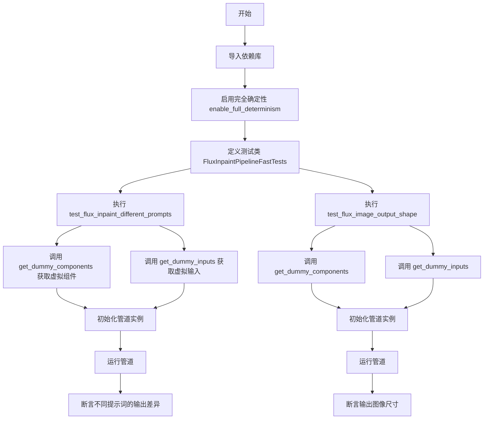
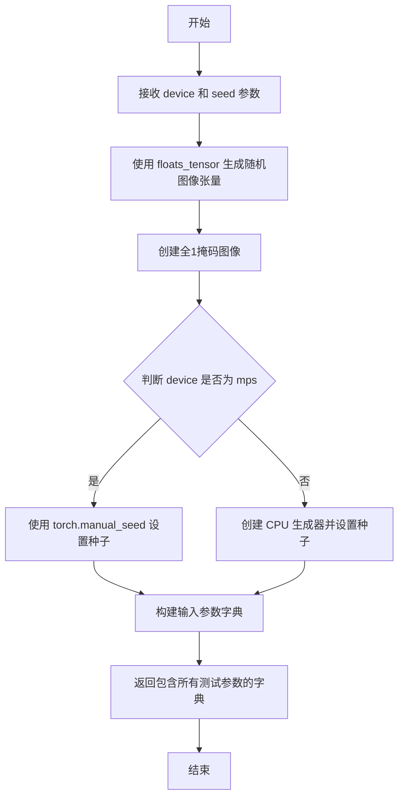
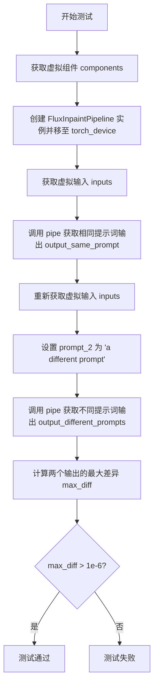

# `diffusers\tests\pipelines\flux\test_pipeline_flux_inpaint.py` 详细设计文档

这是一个用于测试 FluxInpaintPipeline（Flux图像修复管道）的单元测试类，通过设置虚拟组件和输入，验证管道在不同提示词下的输出差异以及输出图像的尺寸是否符合VAE的倍数要求。

## 整体流程



## 类结构

```
unittest.TestCase (基类)
└── FluxInpaintPipelineFastTests (测试类)
    ├── PipelineTesterMixin (验证混入)
    └── FluxIPAdapterTesterMixin (IP适配器验证混入)
```

## 全局变量及字段


### `FluxInpaintPipelineFastTests.pipeline_class`
    
指定测试的管道类为 FluxInpaintPipeline

类型：`type`
    


### `FluxInpaintPipelineFastTests.params`
    
包含 prompt, height, width 等参数

类型：`frozenset`
    


### `FluxInpaintPipelineFastTests.batch_params`
    
包含 prompt 批处理参数

类型：`frozenset`
    


### `FluxInpaintPipelineFastTests.test_xformers_attention`
    
是否测试 xformers 注意力

类型：`bool`
    
    

## 全局函数及方法


### `FluxInpaintPipelineFastTests.get_dummy_components`

该方法用于创建虚拟（dummy）模型组件，返回一个包含 FluxInpaintPipeline 所需的所有模型组件的字典，主要用于单元测试场景。

参数：

- 无（仅包含 `self` 隐式参数）

返回值：`Dict[str, Any]`，返回包含虚拟模型组件的字典，包括调度器、文本编码器、 tokenizer、Transformer、VAE 等，用于测试 FluxInpaintPipeline。

#### 流程图

```mermaid
flowchart TD
    A[开始 get_dummy_components] --> B[设置随机种子 torch.manual_seed(0)]
    B --> C[创建 FluxTransformer2DModel]
    C --> D[创建 CLIPTextConfig]
    D --> E[创建 CLIPTextModel]
    E --> F[创建 T5EncoderModel]
    F --> G[创建 CLIPTokenizer 和 AutoTokenizer]
    G --> H[创建 AutoencoderKL VAE]
    H --> I[创建 FlowMatchEulerDiscreteScheduler]
    I --> J[组装并返回组件字典]
    J --> K[结束]
```

#### 带注释源码

```python
def get_dummy_components(self):
    """创建虚拟模型组件用于测试"""
    # 设置随机种子以确保可重复性
    torch.manual_seed(0)
    
    # 创建 FluxTransformer2DModel - Flux 图像修复管道的核心 Transformer 模型
    transformer = FluxTransformer2DModel(
        patch_size=1,                 # 补丁大小
        in_channels=8,                # 输入通道数
        num_layers=1,                # Transformer 层数
        num_single_layers=1,         # 单 Transformer 层数
        attention_head_dim=16,       # 注意力头维度
        num_attention_heads=2,       # 注意力头数量
        joint_attention_dim=32,      # 联合注意力维度
        pooled_projection_dim=32,    # 池化投影维度
        axes_dims_rope=[4, 4, 8],   # RoPE 轴维度
    )
    
    # 创建 CLIP 文本编码器配置
    clip_text_encoder_config = CLIPTextConfig(
        bos_token_id=0,              # 句子开始 token ID
        eos_token_id=2,              # 句子结束 token ID
        hidden_size=32,              # 隐藏层大小
        intermediate_size=37,        # 中间层大小
        layer_norm_eps=1e-05,        # 层归一化 epsilon
        num_attention_heads=4,       # 注意力头数量
        num_hidden_layers=5,         # 隐藏层数量
        pad_token_id=1,              # 填充 token ID
        vocab_size=1000,             # 词汇表大小
        hidden_act="gelu",           # 激活函数
        projection_dim=32,          # 投影维度
    )

    # 设置随机种子并创建 CLIP 文本编码器
    torch.manual_seed(0)
    text_encoder = CLIPTextModel(clip_text_encoder_config)

    # 创建 T5 文本编码器（从预训练模型加载小型版本）
    torch.manual_seed(0)
    text_encoder_2 = T5EncoderModel.from_pretrained("hf-internal-testing/tiny-random-t5")

    # 创建 tokenizers（从预训练模型加载）
    tokenizer = CLIPTokenizer.from_pretrained("hf-internal-testing/tiny-random-clip")
    tokenizer_2 = AutoTokenizer.from_pretrained("hf-internal-testing/tiny-random-t5")

    # 创建 VAE（变分自编码器）
    torch.manual_seed(0)
    vae = AutoencoderKL(
        sample_size=32,              # 样本大小
        in_channels=3,               # 输入通道数
        out_channels=3,              # 输出通道数
        block_out_channels=(4,),    # 块输出通道数
        layers_per_block=1,          # 每块层数
        latent_channels=2,           # 潜在空间通道数
        norm_num_groups=1,           # 归一化组数
        use_quant_conv=False,        # 是否使用量化卷积
        use_post_quant_conv=False,   # 是否使用后量化卷积
        shift_factor=0.0609,         # 移位因子
        scaling_factor=1.5035,       # 缩放因子
    )

    # 创建调度器（基于 Flow Match 的 Euler 离散调度器）
    scheduler = FlowMatchEulerDiscreteScheduler()

    # 返回包含所有组件的字典
    return {
        "scheduler": scheduler,              # 噪声调度器
        "text_encoder": text_encoder,        # CLIP 文本编码器
        "text_encoder_2": text_encoder_2,    # T5 文本编码器
        "tokenizer": tokenizer,              # CLIP 分词器
        "tokenizer_2": tokenizer_2,          # T5 分词器
        "transformer": transformer,          # Flux Transformer 模型
        "vae": vae,                          # 变分自编码器
        "image_encoder": None,               # 图像编码器（未使用）
        "feature_extractor": None,           # 特征提取器（未使用）
    }
```


### `FluxInpaintPipelineFastTests.get_dummy_inputs`

该方法用于创建虚拟输入数据，为 FluxInpaintPipeline 图像修复测试生成模拟的输入参数，包括图像、掩码图像、生成器、推理步数、引导 scale、图像尺寸等关键配置信息。

参数：

- `self`：隐式参数，测试类实例本身
- `device`：`str`，目标设备类型（如 "cuda"、"cpu"、"mps"），用于将张量移动到指定设备
- `seed`：`int`，随机种子，默认值为 0，用于确保测试的可重复性

返回值：`dict`，包含以下键值对：
- `prompt`：str，测试用的文本提示
- `image`：torch.Tensor，模拟输入图像，形状为 (1, 3, 32, 32)
- `mask_image`：torch.Tensor，掩码图像，形状为 (1, 1, 32, 32)，全1表示完全保留
- `generator`：torch.Generator，用于控制随机数生成，确保可重复性
- `num_inference_steps`：int，推理步数，设为 2
- `guidance_scale`：float，引导 scale，设为 5.0
- `height`：int，图像高度，设为 32
- `width`：int，图像宽度，设为 32
- `max_sequence_length`：int，最大序列长度，设为 48
- `strength`：float，强度参数，设为 0.8
- `output_type`：str，输出类型，设为 "np"（numpy 数组）

#### 流程图



#### 带注释源码

```python
def get_dummy_inputs(self, device, seed=0):
    """
    创建用于测试 FluxInpaintPipeline 的虚拟输入数据
    
    参数:
        device: str, 目标设备类型（如 "cuda", "cpu", "mps"）
        seed: int, 随机种子，用于确保测试的可重复性，默认值为 0
    
    返回:
        dict: 包含图像修复所需的所有测试参数
    """
    # 使用 floats_tensor 生成随机浮点数图像张量，形状为 (1, 3, 32, 32)
    # 使用 random.Random(seed) 确保图像内容的随机性可控制
    image = floats_tensor((1, 3, 32, 32), rng=random.Random(seed)).to(device)
    
    # 创建全1掩码图像，形状为 (1, 1, 32, 32)
    # 全1表示图像所有区域都被保留（不进行掩码处理）
    mask_image = torch.ones((1, 1, 32, 32)).to(device)
    
    # 根据设备类型选择不同的随机生成器初始化方式
    # MPS (Metal Performance Shaders) 设备需要特殊处理
    if str(device).startswith("mps"):
        # MPS 设备直接使用 torch.manual_seed 设置种子
        generator = torch.manual_seed(seed)
    else:
        # 其他设备创建 CPU 生成器并设置种子
        # 使用 "cpu" 设备确保跨平台兼容性
        generator = torch.Generator(device="cpu").manual_seed(seed)
    
    # 构建完整的输入参数字典，包含图像修复所需的所有配置
    inputs = {
        "prompt": "A painting of a squirrel eating a burger",  # 测试用文本提示
        "image": image,                                         # 输入图像张量
        "mask_image": mask_image,                               # 掩码图像张量
        "generator": generator,                                 # 随机生成器
        "num_inference_steps": 2,                               # 推理步数（较少以加快测试）
        "guidance_scale": 5.0,                                  # Classifier-free guidance scale
        "height": 32,                                           # 输出图像高度
        "width": 32,                                             # 输出图像宽度
        "max_sequence_length": 48,                              # 文本编码器的最大序列长度
        "strength": 0.8,                                        # 图像修复强度（0-1之间）
        "output_type": "np",                                    # 输出为 numpy 数组
    }
    
    # 返回包含所有测试参数的字典
    return inputs
```


### `FluxInpaintPipelineFastTests.test_flux_inpaint_different_prompts`

该测试方法用于验证 FluxInpaintPipeline 能够根据不同的提示词（prompt 和 prompt_2）生成具有差异性的图像输出，确保多提示词功能正常工作。

参数：

- `self`：unittest.TestCase 实例，测试类本身

返回值：`None`，通过 assert 断言验证（无显式返回值）

#### 流程图



#### 带注释源码

```python
def test_flux_inpaint_different_prompts(self):
    # 获取虚拟组件配置，用于创建测试用的 pipeline
    pipe = self.pipeline_class(**self.get_dummy_components()).to(torch_device)

    # 第一次获取输入，使用默认提示词 "A painting of a squirrel eating a burger"
    inputs = self.get_dummy_inputs(torch_device)
    # 调用 pipeline 获取输出（相同提示词）
    output_same_prompt = pipe(**inputs).images[0]

    # 第二次获取输入
    inputs = self.get_dummy_inputs(torch_device)
    # 设置第二个提示词为不同的内容
    inputs["prompt_2"] = "a different prompt"
    # 调用 pipeline 获取输出（不同提示词）
    output_different_prompts = pipe(**inputs).images[0]

    # 计算两个输出之间的最大绝对差异
    max_diff = np.abs(output_same_prompt - output_different_prompts).max()

    # 断言：不同提示词应该产生不同的输出
    # 注意：这里使用了较小的阈值 1e-6，因为某些情况下差异可能不大
    assert max_diff > 1e-6
```


### `FluxInpaintPipelineFastTests.test_flux_image_output_shape`

该测试方法用于验证 FluxInpaintPipeline（Flux图像修复管道）在不同输入尺寸下的输出图像形状是否符合预期，通过计算VAE缩放因子来调整期望的输出尺寸，并使用断言确保输出高度和宽度与预期一致。

参数：
- 该方法无显式参数（隐式参数 `self` 表示测试类实例）

返回值：
- `None`（该方法为测试方法，使用 assert 语句进行断言验证，不返回任何值）

#### 流程图

```mermaid
flowchart TD
    A[开始测试] --> B[创建管道实例并移至设备]
    B --> C[获取虚拟输入]
    C --> D[定义高度宽度对列表: [(32, 32), (72, 57)]]
    D --> E[遍历高度宽度对]
    E --> F{还有更多对?}
    F -->|是| G[计算期望高度和宽度]
    G --> H[考虑VAE缩放因子进行对齐]
    H --> I[更新输入的height和width]
    I --> J[调用管道生成图像]
    J --> K{输出形状是否匹配?}
    K -->|是| L[继续下一个测试对]
    K -->|否| M[抛出AssertionError]
    L --> F
    F -->|否| N[测试完成]
    M --> N
```

#### 带注释源码

```python
def test_flux_image_output_shape(self):
    """
    测试 FluxInpaintPipeline 在不同尺寸下的输出图像形状是否符合预期。
    验证 VAE 缩放因子对输出尺寸的影响。
    """
    # 1. 创建管道实例并移至测试设备
    # 使用虚拟组件初始化 FluxInpaintPipeline
    pipe = self.pipeline_class(**self.get_dummy_components()).to(torch_device)
    
    # 2. 获取虚拟输入参数
    # 包含 prompt、image、mask_image、generator 等管道所需参数
    inputs = self.get_dummy_inputs(torch_device)
    
    # 3. 定义测试用的 height-width 组合列表
    # 测试 (32, 32) 和 (72, 57) 两种尺寸
    height_width_pairs = [(32, 32), (72, 57)]
    
    # 4. 遍历每组高度宽度进行测试
    for height, width in height_width_pairs:
        # 5. 计算期望的输出尺寸
        # VAE 在处理图像时会进行下采样，需要对齐到 VAE 缩放因子的整数倍
        # pipe.vae_scale_factor 表示 VAE 的缩放因子
        # 公式: expected_size = input_size - (input_size % (vae_scale_factor * 2))
        expected_height = height - height % (pipe.vae_scale_factor * 2)
        expected_width = width - width % (pipe.vae_scale_factor * 2)
        
        # 6. 更新输入参数中的高度和宽度
        inputs.update({"height": height, "width": width})
        
        # 7. 调用管道生成图像
        # **inputs 解包字典传递所有参数
        image = pipe(**inputs).images[0]
        
        # 8. 获取输出图像的形状
        # 图像形状为 [height, width, channels]
        output_height, output_width, _ = image.shape
        
        # 9. 断言验证输出尺寸是否符合预期
        # 如果不匹配会抛出 AssertionError
        assert (output_height, output_width) == (expected_height, expected_width)
```

## 关键组件


### FluxInpaintPipeline

核心图像修复管道类，集成FluxTransformer2DModel、AutoencoderKL VAE、双文本编码器（CLIP和T5）以及FlowMatchEulerDiscreteScheduler，实现基于文本提示的图像修复推理。

### FlowMatchEulerDiscreteScheduler

流匹配离散调度器，用于 diffusion 过程的噪声调度，控制推理步骤中的噪声去除策略。

### FluxTransformer2DModel

Flux架构的2D Transformer模型，接收潜在表示和文本嵌入，输出去噪后的潜在表示，配置包括patch_size、attention_head_dim、joint_attention_dim等参数。

### AutoencoderKL

变分自编码器（VAE）模型，负责图像的编码（压缩为潜在表示）和解码（从潜在表示重建图像），支持latent_channels=2的潜在空间。

### CLIPTextModel + CLIPTokenizer

CLIP文本编码器及其分词器，将文本提示编码为32维的文本嵌入向量，支持bos_token_id、eos_token_id等配置。

### T5EncoderModel + AutoTokenizer

T5编码器模型及其分词器，提供额外的文本嵌入（pooled_prompt_embeds），支持更长的max_sequence_length=48。

### 张量索引与图像尺寸对齐

通过`pipe.vae_scale_factor * 2`计算VAE下采样因子，确保输出图像尺寸对齐（height - height % factor），处理潜在空间与像素空间的尺寸转换。

### 多提示词支持

test_flux_inpaint_different_prompts测试方法验证了双提示词（prompt和prompt_2）输入的支持，输出应基于不同提示词产生不同结果。

### 图像修复掩码处理

get_dummy_inputs生成mask_image（全1掩码），配合原始image输入管道，实现指定区域的图像修复，strength参数控制修复强度。

### 随机数与可重现性

通过torch.manual_seed和generator.manual_seed确保测试的确定性，enable_full_determinism配置全确定性模式。

### 测试基础设施

PipelineTesterMixin和FluxIPAdapterTesterMixin提供通用测试方法，floats_tensor生成随机张量，torch_device处理设备迁移。


## 问题及建议


### 已知问题

- **魔法数字和硬编码值**：代码中存在大量硬编码的配置值（如`num_inference_steps=2`、`guidance_scale=5.0`、`height=32`、`width=32`、`max_sequence_length=48`、`strength=0.8`、`seed=0`等），这些值分散在各个方法中，降低了代码的可维护性和可配置性
- **重复的随机种子设置**：在`get_dummy_components()`方法中多次调用`torch.manual_seed(0)`，这种做法可能导致测试之间的隐式依赖，在并行测试执行时可能产生不确定性问题
- **设备兼容性处理不一致**：对MPS设备使用了特殊的随机数生成器处理逻辑（`if str(device).startswith("mps")`），这种字符串匹配方式脆弱且缺乏文档说明
- **测试用例注释自相矛盾**：在`test_flux_inpaint_different_prompts`方法中，注释写道"Outputs should be different here"但紧接着又说"For some reasons, they don't show large differences"，表明测试预期不明确或测试逻辑存在问题
- **测试隔离性不足**：测试方法创建Pipeline后未显式进行资源清理（虽然Python GC会处理，但最佳实践应显式释放GPU内存）
- **全局可变状态**：`enable_full_determinism()`在模块导入时全局启用，可能影响其他测试用例的独立性

### 优化建议

- 将硬编码的配置值提取为类级别的常量或fixture，提高可维护性
- 使用`@pytest.fixture`或`unittest`的`setUp`方法集中管理随机种子，避免在多个位置重复设置
- 封装设备检测逻辑到辅助函数中，统一处理不同硬件平台的兼容性
- 明确测试预期行为，移除或修正模糊矛盾的注释
- 在测试方法结束时显式调用`del pipe`并使用`torch.cuda.empty_cache()`（如适用）清理GPU资源
- 考虑将`enable_full_determinism`的调用移到测试框架的setup阶段，避免全局副作用影响其他测试

## 其它


### 设计目标与约束

本测试文件的核心目标是验证FluxInpaintPipeline在不同提示词、图像输出形状等场景下的正确性。设计约束包括：必须继承PipelineTesterMixin和FluxIPAdapterTesterMixin以复用通用测试逻辑；使用固定随机种子(0)确保测试可复现；仅测试基本功能，不覆盖xformers注意力机制(test_xformers_attention=False)；测试环境为CPU或CUDA设备，通过torch_device变量控制。

### 错误处理与异常设计

测试中未显式处理异常，主要依赖unittest框架的断言机制。max_diff断言确保不同提示词产生不同输出；output_height和output_width断言验证输出形状符合VAE缩放因子要求。建议在真实场景中添加异常捕获以处理模型加载失败、内存不足、CUDA错误等情况。

### 数据流与状态机

测试数据流：get_dummy_components()创建虚拟模型组件→get_dummy_inputs()生成虚拟输入(图像、掩码、提示词等)→pipeline执行推理→验证输出。状态转换：组件初始化状态→输入准备状态→推理执行状态→输出验证状态。无复杂状态机，主要为线性流程。

### 外部依赖与接口契约

关键依赖包括：transformers库(CLIPTextModel、CLIPTokenizer、T5EncoderModel)、diffusers库(AutoencoderKL、FlowMatchEulerDiscreteScheduler、FluxInpaintPipeline、FluxTransformer2DModel)、numpy、torch。接口契约：pipeline_class必须为FluxInpaintPipeline；params必须包含prompt、height、width等7个参数；batch_params必须包含prompt；get_dummy_components()返回包含12个键的字典；get_dummy_inputs()返回包含11个键的字典。

### 性能考量与基准测试

本测试未包含性能基准测试。实际应用中应关注：推理时间(ms)、内存占用(MB)、GPU利用率(%)。当前配置(num_inference_steps=2)为快速测试模式，生产环境需使用更大步数以提升生成质量。

### 安全性考虑

测试使用hf-internal-testing/tiny-random-*系列模型，不涉及真实模型权重或敏感数据。代码中未发现命令注入、路径遍历等安全风险。生产部署时需验证模型来源可信性。

### 版本兼容性

依赖库版本需兼容：transformers≥4.35.0、diffusers≥0.31.0、torch≥2.0.0、numpy≥1.24.0。代码使用Python 3.8+语法(类型注解可选)。CLIPTextConfig、FlowMatchEulerDiscreteScheduler等API需匹配对应版本。

### 配置管理

所有配置通过get_dummy_components()和get_dummy_inputs()硬编码管理。生产环境应支持YAML/JSON配置文件，实现模型路径、推理参数、种子值等的动态配置。

### 资源管理

当前代码未显式管理资源。建议：使用torch.no_grad()减少显存占用；推理完成后显式调用del释放中间张量；使用torch.cuda.empty_cache()清理CUDA缓存；支持批处理大小配置以适应不同硬件。

### 测试覆盖范围

当前覆盖：不同提示词测试、图像输出形状测试。缺失覆盖：文本编码器组合测试、 Guidance Scale参数测试、Strength参数测试、VAE分块推理测试、CPU卸载测试、ONNX导出测试。

### 已知限制

1. test_xformers_attention=False，未测试xformers优化；2. 仅使用2步推理，生成质量有限；3. 使用虚拟模型，无法验证真实生成效果；4. 未测试多提示词、负面提示词等高级功能；5. 未测试图像修复中的掩码边界处理。

    