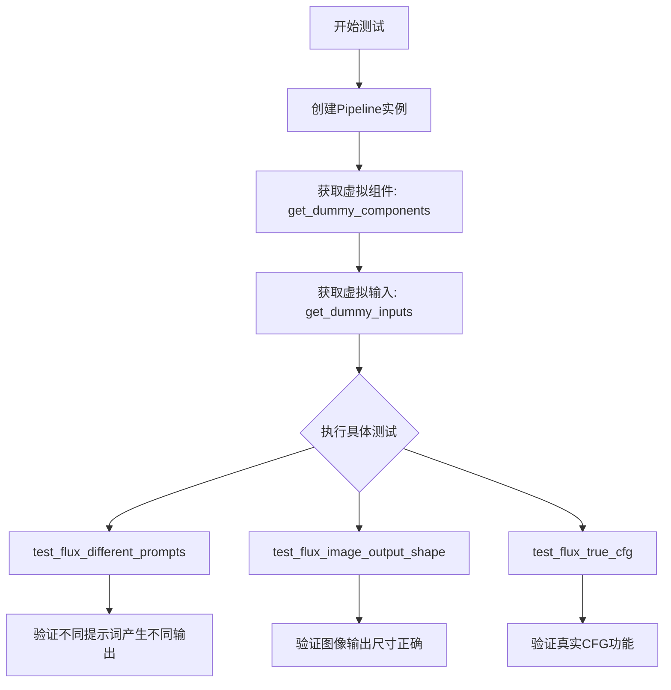
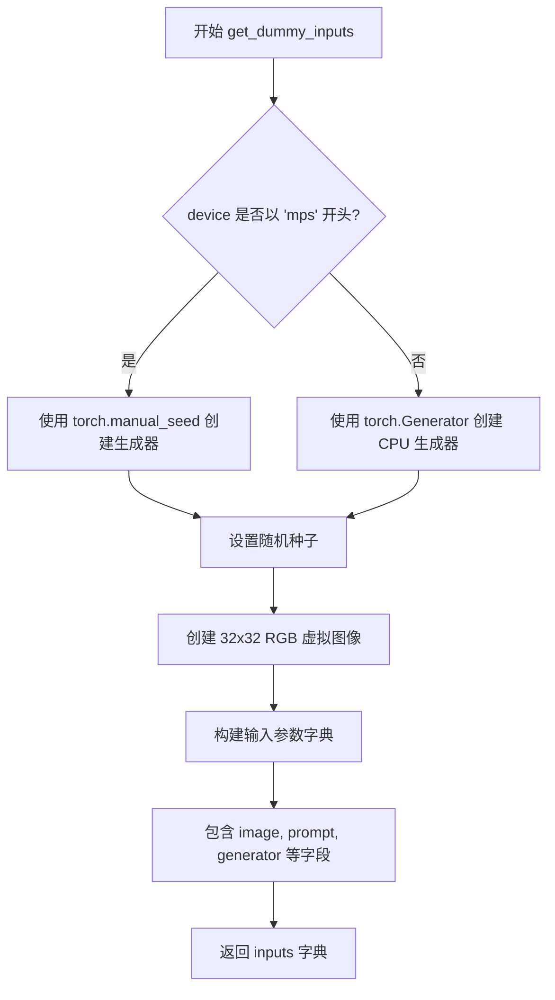
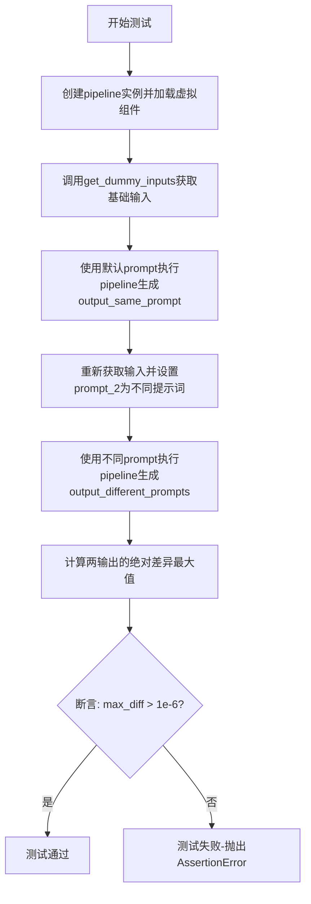
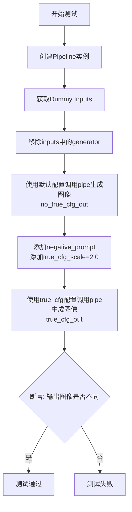

# `diffusers\tests\pipelines\flux\test_pipeline_flux_kontext.py` 详细设计文档

这是一个用于测试 FluxKontextPipeline 功能的单元测试文件，包含了针对不同提示词、图像输出形状和真实CFG配置的测试用例，验证pipeline在各种场景下的正确性和稳定性。

## 整体流程



## 类结构

```
FluxKontextPipelineFastTests (unittest.TestCase)
├── 继承自 PipelineTesterMixin
├── 继承自 FluxIPAdapterTesterMixin
├── 继承自 PyramidAttentionBroadcastTesterMixin
└── 继承自 FasterCacheTesterMixin
```

## 全局变量及字段


### `FluxKontextPipelineFastTests.pipeline_class`
    
待测试的Pipeline类

类型：`type`
    


### `FluxKontextPipelineFastTests.params`
    
Pipeline参数集合

类型：`frozenset`
    


### `FluxKontextPipelineFastTests.batch_params`
    
批处理参数集合

类型：`frozenset`
    


### `FluxKontextPipelineFastTests.test_xformers_attention`
    
xformers注意力测试标志

类型：`bool`
    


### `FluxKontextPipelineFastTests.test_layerwise_casting`
    
层级别类型转换测试标志

类型：`bool`
    


### `FluxKontextPipelineFastTests.test_group_offloading`
    
组卸载测试标志

类型：`bool`
    


### `FluxKontextPipelineFastTests.faster_cache_config`
    
快速缓存配置

类型：`FasterCacheConfig`
    


### `FluxKontextPipelineFastTests.get_dummy_components`
    
获取虚拟组件字典

类型：`method`
    


### `FluxKontextPipelineFastTests.get_dummy_inputs`
    
获取虚拟输入字典

类型：`method`
    


### `FluxKontextPipelineFastTests.test_flux_different_prompts`
    
测试不同提示词产生不同输出

类型：`method`
    


### `FluxKontextPipelineFastTests.test_flux_image_output_shape`
    
测试图像输出形状正确性

类型：`method`
    


### `FluxKontextPipelineFastTests.test_flux_true_cfg`
    
测试真实CFG配置功能

类型：`method`
    
    

## 全局函数及方法


### `FluxKontextPipelineFastTests.get_dummy_components`

该方法用于生成虚拟（dummy）组件字典，主要为 Flux 图像生成流水线的单元测试提供所需的全部模型组件和分词器，包括 Transformer、文本编码器、VAE、调度器等，以便在不依赖真实预训练权重的情况下执行测试。

#### 参数

- `num_layers`：`int`，transformer 模型的总层数（默认为 1）
- `num_single_layers`：`int`，单层 transformer 的数量（默认为 1）

#### 返回值

- `dict`，返回包含虚拟组件的字典，键包括 `scheduler`、`text_encoder`、`text_encoder_2`、`tokenizer`、`tokenizer_2`、`transformer`、`vae`、`image_encoder`、`feature_extractor`

#### 流程图

```mermaid
flowchart TD
    A[开始 get_dummy_components] --> B[设置随机种子 torch.manual_seed(0)]
    B --> C[创建 FluxTransformer2DModel 虚拟模型]
    C --> D[创建 CLIPTextConfig 配置对象]
    D --> E[使用配置创建 CLIPTextModel 虚拟文本编码器]
    E --> F[从预训练创建 T5EncoderModel 虚拟模型]
    F --> G[从预训练创建 CLIPTokenizer 和 AutoTokenizer]
    G --> H[创建 AutoencoderKL 虚拟 VAE 模型]
    H --> I[创建 FlowMatchEulerDiscreteScheduler 调度器]
    I --> J[构建并返回包含所有组件的字典]
    J --> K[结束]
```

#### 带注释源码

```python
def get_dummy_components(self, num_layers: int = 1, num_single_layers: int = 1):
    """
    生成虚拟组件字典，用于测试 FluxKontextPipeline 流水线。
    
    参数:
        num_layers: int, transformer 模型的总层数
        num_single_layers: int, 单层 transformer 的数量
    返回:
        dict: 包含所有虚拟组件的字典
    """
    # 设置随机种子以确保结果可复现
    torch.manual_seed(0)
    
    # 创建虚拟的 FluxTransformer2DModel
    # 参数包括: patch_size, in_channels, num_layers, num_single_layers 等
    transformer = FluxTransformer2DModel(
        patch_size=1,
        in_channels=4,
        num_layers=num_layers,
        num_single_layers=num_single_layers,
        attention_head_dim=16,
        num_attention_heads=2,
        joint_attention_dim=32,
        pooled_projection_dim=32,
        axes_dims_rope=[4, 4, 8],
    )
    
    # 配置 CLIP 文本编码器的参数
    clip_text_encoder_config = CLIPTextConfig(
        bos_token_id=0,
        eos_token_id=2,
        hidden_size=32,
        intermediate_size=37,
        layer_norm_eps=1e-05,
        num_attention_heads=4,
        num_hidden_layers=5,
        pad_token_id=1,
        vocab_size=1000,
        hidden_act="gelu",
        projection_dim=32,
    )

    # 使用配置创建虚拟 CLIP 文本编码器
    torch.manual_seed(0)
    text_encoder = CLIPTextModel(clip_text_encoder_config)

    # 创建虚拟 T5 文本编码器（从预训练小模型加载）
    torch.manual_seed(0)
    text_encoder_2 = T5EncoderModel.from_pretrained("hf-internal-testing/tiny-random-t5")

    # 加载虚拟分词器
    tokenizer = CLIPTokenizer.from_pretrained("hf-internal-testing/tiny-random-clip")
    tokenizer_2 = AutoTokenizer.from_pretrained("hf-internal-testing/tiny-random-t5")

    # 创建虚拟 VAE 模型
    torch.manual_seed(0)
    vae = AutoencoderKL(
        sample_size=32,
        in_channels=3,
        out_channels=3,
        block_out_channels=(4,),
        layers_per_block=1,
        latent_channels=1,
        norm_num_groups=1,
        use_quant_conv=False,
        use_post_quant_conv=False,
        shift_factor=0.0609,
        scaling_factor=1.5035,
    )

    # 创建调度器
    scheduler = FlowMatchEulerDiscreteScheduler()

    # 返回包含所有虚拟组件的字典
    return {
        "scheduler": scheduler,
        "text_encoder": text_encoder,
        "text_encoder_2": text_encoder_2,
        "tokenizer": tokenizer,
        "tokenizer_2": tokenizer_2,
        "transformer": transformer,
        "vae": vae,
        "image_encoder": None,
        "feature_extractor": None,
    }
```


### `FluxKontextPipelineFastTests.get_dummy_inputs`

该方法用于生成虚拟输入字典，为 Flux 图像生成管道的单元测试提供必要的输入参数。根据设备类型（MPS 或其他）创建不同类型的随机数生成器，并初始化图像、提示词、推理步数、引导系数等关键参数。

参数：

- `self`：隐式参数，测试类实例本身
- `device`：`torch.device` 或 `str`，目标设备，用于判断是否使用 MPS 设备
- `seed`：`int`，随机种子，默认值为 0，用于控制生成器的随机性

返回值：`Dict[str, Any]`，包含测试所需的虚拟输入参数字典

#### 流程图



#### 带注释源码

```python
def get_dummy_inputs(self, device, seed=0):
    # 判断设备是否为 MPS (Apple Silicon)
    if str(device).startswith("mps"):
        # MPS 设备使用 torch.manual_seed 直接设置种子
        generator = torch.manual_seed(seed)
    else:
        # 其他设备创建 CPU 上的生成器并设置种子
        generator = torch.Generator(device="cpu").manual_seed(seed)

    # 创建 32x32 的黑色虚拟 RGB 图像
    image = PIL.Image.new("RGB", (32, 32), 0)
    
    # 构建完整的虚拟输入参数字典
    inputs = {
        "image": image,                          # 输入图像
        "prompt": "A painting of a squirrel eating a burger",  # 文本提示
        "generator": generator,                 # 随机数生成器
        "num_inference_steps": 2,                # 推理步数
        "guidance_scale": 5.0,                   # 引导系数 (CFG)
        "height": 8,                             # 输出高度
        "width": 8,                              # 输出宽度
        "max_area": 8 * 8,                       # 最大面积限制
        "max_sequence_length": 48,               # 最大序列长度
        "output_type": "np",                     # 输出类型为 numpy
        "_auto_resize": False,                   # 禁用自动调整大小
    }
    
    # 返回包含所有测试参数的字典
    return inputs
```


### `FluxKontextPipelineFastTests.test_flux_different_prompts`

该测试方法用于验证 Flux 图像生成管道对不同提示词（prompt）产生不同输出的能力，确保模型能够根据提示词的变化生成差异化的图像结果。

参数：此方法无显式参数（通过 `self` 访问类属性和方法）

返回值：`None`（通过断言验证，无返回值）

#### 流程图



#### 带注释源码

```python
def test_flux_different_prompts(self):
    """
    测试不同提示词产生不同输出的功能
    验证 Flux 模型能够根据提示词变化生成差异化图像
    """
    # 步骤1: 创建 pipeline 实例，使用虚拟组件并移至测试设备
    pipe = self.pipeline_class(**self.get_dummy_components()).to(torch_device)

    # 步骤2: 获取虚拟输入参数（包含图像、提示词、生成器等）
    inputs = self.get_dummy_inputs(torch_device)
    
    # 步骤3: 使用第一个提示词执行 pipeline 并获取输出图像
    # 默认 prompt: "A painting of a squirrel eating a burger"
    output_same_prompt = pipe(**inputs).images[0]

    # 步骤4: 重新获取输入并添加第二个不同的提示词
    inputs = self.get_dummy_inputs(torch_device)
    inputs["prompt_2"] = "a different prompt"  # 设置不同的提示词
    
    # 步骤5: 使用不同提示词执行 pipeline 获取输出
    output_different_prompts = pipe(**inputs).images[0]

    # 步骤6: 计算两个输出图像之间的最大绝对差异
    max_diff = np.abs(output_same_prompt - output_different_prompts).max()

    # 步骤7: 断言验证
    # 由于 Flux 模型对提示词敏感，不同提示词应产生可检测的差异
    # 注意: 差异可能小于预期，因为模型在某些情况下可能产生相似输出
    assert max_diff > 1e-6
```


### `FluxKontextPipelineFastTests.test_flux_image_output_shape`

该测试方法用于验证 FluxKontextPipeline 图像输出形状的正确性，通过传入不同的 height/width 组合，确保管道输出的图像尺寸与基于 VAE scale factor 计算的预期尺寸一致。

参数：

- `self`：`FluxKontextPipelineFastTests`，测试类的实例，隐式参数，用于访问类属性和方法

返回值：`None`，该方法为测试方法，通过 assert 语句进行断言验证，不返回任何值

#### 流程图

```mermaid
flowchart TD
    A[开始测试] --> B[创建Pipeline实例]
    B --> C[获取虚拟输入参数]
    C --> D[定义测试尺寸对: (32,32) 和 (72,57)]
    D --> E{遍历 height_width_pairs}
    E -->|取出第一组| F[计算预期高度: height - height % (vae_scale_factor * 2)]
    F --> G[计算预期宽度: width - width % (vae_scale_factor * 2)]
    G --> H[更新输入参数: height, width, max_area]
    H --> I[调用 pipeline 生成图像]
    I --> J[获取输出图像的实际尺寸]
    J --> K{断言: (output_height, output_width) == (expected_height, expected_width)}
    K -->|通过| L{是否还有下一组}
    K -->|失败| M[抛出 AssertionError]
    L -->|是| E
    L -->|否| N[测试通过]
    E -->|第二组| F
    N --> O[结束测试]
```

#### 带注释源码

```python
def test_flux_image_output_shape(self):
    """
    测试图像输出形状的正确性
    
    该测试方法验证 FluxKontextPipeline 在不同输入尺寸下，
    输出图像的尺寸是否符合预期的计算规则（基于 VAE scale factor）。
    """
    # 使用测试类的 pipeline_class 创建管道实例，并传入虚拟组件
    # get_dummy_components() 返回包含 transformer, vae, scheduler 等的字典
    pipe = self.pipeline_class(**self.get_dummy_components()).to(torch_device)
    
    # 获取虚拟输入参数，包含图像、提示词、生成器、推理步数等
    inputs = self.get_dummy_inputs(torch_device)
    
    # 定义测试用的 height-width 组合列表
    # (32, 32): 标准方形尺寸
    # (72, 57): 非标准尺寸，用于测试边界情况
    height_width_pairs = [(32, 32), (72, 57)]
    
    # 遍历每一组尺寸进行测试
    for height, width in height_width_pairs:
        # 计算 VAE 的缩放因子（通常为 8）
        vae_scale_factor = pipe.vae_scale_factor
        
        # 计算预期输出高度：确保高度是 (vae_scale_factor * 2) 的倍数
        # 这是因为 VAE 通常会将图像下采样 vae_scale_factor 倍，
        # 而 Flow Match 等机制可能需要额外的 2 倍下采样
        expected_height = height - height % (vae_scale_factor * 2)
        
        # 计算预期输出宽度：同样确保宽度是 (vae_scale_factor * 2) 的倍数
        expected_width = width - width % (vae_scale_factor * 2)
        
        # 更新输入参数，设置当前测试的高度、宽度和最大面积
        inputs.update({"height": height, "width": width, "max_area": height * width})
        
        # 调用管道进行推理，获取输出的第一张图像
        image = pipe(**inputs).images[0]
        
        # 从输出图像中获取实际的高度和宽度（图像为 HWC 格式）
        output_height, output_width, _ = image.shape
        
        # 断言验证输出尺寸是否符合预期
        # 如果不匹配，抛出 AssertionError 导致测试失败
        assert (output_height, output_width) == (expected_height, expected_width)
```


### `FluxKontextPipelineFastTests.test_flux_true_cfg`

该测试方法用于验证 Flux 管道中真实CFG（Classifier-Free Guidance）配置功能的正确性。通过对比启用 `true_cfg_scale` 与不启用时的输出图像，断言两者存在差异，从而确保真实CFG配置能够正常工作。

参数：无需显式传入参数（使用类属性 `torch_device` 和继承的测试框架设施）

返回值：`None`，该方法为单元测试方法，通过断言进行验证，无返回值

#### 流程图



#### 带注释源码

```python
def test_flux_true_cfg(self):
    """
    测试真实CFG配置功能。
    验证当提供 true_cfg_scale 参数时，输出图像与不使用 true_cfg 时的输出不同。
    """
    # 步骤1: 创建FluxKontextPipeline实例，使用虚拟组件配置
    # 并将管道移动到测试设备（CPU/CUDA）
    pipe = self.pipeline_class(**self.get_dummy_components()).to(torch_device)
    
    # 步骤2: 获取虚拟输入参数（包含图像、prompt、推理步数等）
    inputs = self.get_dummy_inputs(torch_device)
    
    # 步骤3: 移除预定义的generator，确保测试可重复性
    # 后续将在每次调用时单独设置generator种子
    inputs.pop("generator")
    
    # 步骤4: 不使用true_cfg配置运行管道
    # 使用固定种子0确保可重复性
    # 获取第一张生成的图像
    no_true_cfg_out = pipe(**inputs, generator=torch.manual_seed(0)).images[0]
    
    # 步骤5: 添加负面提示词和真实CFG比例参数
    # negative_prompt: 指定不希望出现的质量特征
    # true_cfg_scale: 真实CFG的强度因子（2.0）
    inputs["negative_prompt"] = "bad quality"
    inputs["true_cfg_scale"] = 2.0
    
    # 步骤6: 使用true_cfg配置再次运行管道
    # 使用相同种子确保可比性
    true_cfg_out = pipe(**inputs, generator=torch.manual_seed(0)).images[0]
    
    # 步骤7: 断言验证
    # 确保启用true_cfg后的输出与不启用时的输出存在差异
    # 如果两者完全相同，则说明true_cfg配置未生效
    assert not np.allclose(no_true_cfg_out, true_cfg_out)
```

## 关键组件


### FluxKontextPipeline

FluxKontextPipeline 是一个基于 Flux 架构的图像生成管道，支持文本到图像的生成任务，集成了 FasterCache 加速、IP-Adapter 和 PyramidAttentionBroadcast 等高级特性。

### FasterCacheConfig

FasterCacheConfig 是缓存加速配置类，用于控制 Flux 管道的推理加速策略，包含空间注意力块跳过范围、时间步跳过范围、无条件批次跳过、注意力权重回调和引导蒸馏等参数。

### FluxTransformer2DModel

FluxTransformer2DModel 是 Flux 变换器模型，负责处理潜在空间的图像特征变换，支持 patch 嵌入、注意力机制和联合注意力维度配置。

### FlowMatchEulerDiscreteScheduler

FlowMatchEulerDiscreteScheduler 是基于 Flow Matching 的欧拉离散调度器，用于控制扩散模型的采样过程。

### AutoencoderKL

AutoencoderKL 是变分自编码器，用于将图像编码到潜在空间和解码回像素空间，支持量化卷积和后量化卷积的开关配置。

### CLIPTextModel 与 T5EncoderModel

CLIPTextModel 和 T5EncoderModel 是双文本编码器，分别基于 CLIP 和 T5 架构，用于将文本提示编码为语义嵌入，支持联合注意力机制。

### 测试混合类

PipelineTesterMixin、FluxIPAdapterTesterMixin、PyramidAttentionBroadcastTesterMixin 和 FasterCacheTesterMixin 是四个测试混入类，分别负责管道通用测试、IP-Adapter 测试、金字塔注意力广播测试和 FasterCache 加速测试。

### 量化策略配置

代码中 use_quant_conv=False 和 use_post_quant_conv=False 表示禁用了量化卷积和后量化卷积，shift_factor=0.0609 和 scaling_factor=1.5035 用于 VAE 的潜在空间缩放。

### 张量索引与形状处理

test_flux_image_output_shape 测试方法展示了图像尺寸的自动对齐逻辑，通过 pipe.vae_scale_factor 计算期望的高度和宽度，确保输出尺寸是 VAE 缩放因子的整数倍。

### 惰性加载与组件初始化

get_dummy_components 方法使用 torch.manual_seed(0) 确保组件初始化的可重现性，transformer、text_encoder、vae 等组件通过 from_pretrained 或直接初始化创建，支持后续的设备转移和推理。


## 问题及建议


### 已知问题

-   **硬编码的魔数（Magic Numbers）**：多处使用硬编码的数值如 `num_inference_steps=2`、`guidance_scale=5.0`、`height=8`、`width=8`、`max_sequence_length=48`、`spatial_attention_timestep_skip_range=(-1, 901)` 中的 `901`，缺乏可配置性，降低了测试的可维护性。
-   **重复代码**：在每个测试方法中都重复调用 `self.pipeline_class(**self.get_dummy_components()).to(torch_device)`，未使用 `setUp` 方法进行复用违反 DRY 原则。
-   **设备处理不一致**：对 MPS 设备使用 `torch.manual_seed(generator)` 而其他设备使用 CPU 生成器 `torch.Generator(device="cpu")`，可能导致在不同设备上的测试行为不一致。
-   **测试断言过于宽松**：`test_flux_different_prompts` 中使用 `max_diff > 1e-6` 作为判断标准过于宽松，可能无法有效检测出 prompts 差异导致的实际输出差异问题。
-   **缺失错误验证**：`test_flux_true_cfg` 测试仅验证 `not np.allclose()` 但未验证 true_cfg_scale 参数的实际影响是否正确实现，缺乏正向验证。
-   **测试数据未参数化**：`get_dummy_components` 方法接受 `num_layers` 和 `num_single_layers` 参数但测试中均使用默认值 1，未覆盖不同层数配置的测试场景。
-   **注释暗示潜在问题**：代码注释 `# For some reasons, they don't show large differences` 表明测试作者对某些行为存在不确定性但未进一步调查。

### 优化建议

-   将重复的 pipeline 创建逻辑提取到 `setUp` 方法中，使用 `setUp` 或 `setUpClass` 复用组件。
-   将魔数提取为类常量或配置常量，提高可维护性。
-   统一设备处理逻辑，使用传入的 `device` 参数创建 generator 或统一使用 CPU generator。
-   加强断言，为 `test_flux_true_cfg` 添加对 true_cfg_scale 正确行为的具体验证。
-   使用参数化测试覆盖不同的 `num_layers` 和 `num_single_layers` 配置。
-   调查并修复注释中提到的问题，确认为已知限制还是潜在 bug。

## 其它


### 设计目标与约束

该测试类旨在验证FluxKontextPipeline在多种场景下的功能正确性，包括不同提示词处理、图像输出形状验证和TrueCFG功能。设计约束包括：不支持xformers处理器（因Flux架构无对应实现）、支持layerwise casting和group offloading测试、使用固定的参数集合（prompt、image、height、width等）进行测试。

### 错误处理与异常设计

测试类采用unittest框架的标准断言机制进行错误检测。使用assert语句验证输出差异（max_diff > 1e-6）、图像尺寸匹配、TrueCFG功能差异等。对于MPS设备特殊处理generator对象，其他设备使用CPU generator。异常情况通过测试失败直观反馈，未实现复杂的异常捕获机制。

### 数据流与状态机

数据流分为三个主要阶段：组件初始化阶段通过get_dummy_components方法构建完整的pipeline组件字典（包含scheduler、text_encoder、text_encoder_2、tokenizer、tokenizer_2、transformer、vae等）；输入准备阶段通过get_dummy_inputs方法生成包含image、prompt、generator、num_inference_steps等参数的输入字典；执行验证阶段将输入传递给pipeline执行并验证返回的images属性。状态转换通过测试方法独立控制，每个测试方法创建新的pipeline实例。

### 外部依赖与接口契约

核心依赖包括：transformers库提供CLIPTextModel、CLIPTokenizer、T5EncoderModel、AutoTokenizer；diffusers库提供AutoencoderKL、FlowMatchEulerDiscreteScheduler、FluxKontextPipeline、FluxTransformer2DModel、FasterCacheConfig；其他依赖包括numpy数值计算、PIL图像处理、torch深度学习框架。Pipeline接口接受dict参数并返回包含images属性的对象，期望images[0]为numpy数组且形状为(height, width, channels)。

### 测试策略

采用单元测试模式，使用dummy数据隔离外部依赖。测试覆盖三类场景：功能正确性测试（test_flux_different_prompts验证多提示词处理）、输出格式验证（test_flux_image_output_shape验证尺寸对齐逻辑）、特性功能测试（test_flux_true_cfg验证TrueCFG缩放效果）。通过mixin类继承实现测试代码复用和接口统一。

### 配置管理

FasterCacheConfig定义关键性能优化参数：spatial_attention_block_skip_range=2、spatial_attention_timestep_skip_range=(-1, 901)、unconditional_batch_skip_range=2、attention_weight_callback使用lambda函数返回0.5、is_guidance_distilled=True。模型配置通过CLIPTextConfig、FluxTransformer2DModel参数化定义隐藏层维度、注意力头数、层数等超参数。随机种子通过torch.manual_seed统一控制确保可复现性。

### 性能考虑与优化空间

faster_cache_config中的attention_weight_callback使用固定lambda返回0.5，可考虑动态策略。test_group_offloading和test_layerwise_casting测试表明支持多种显存优化技术。测试使用极少的推理步数(num_inference_steps=2)和小的图像尺寸(8x8, 32x32)，适合快速验证但不代表生产性能。建议增加大规模参数的性能基准测试。

### 资源管理与设备适配

通过torch_device变量实现设备抽象，支持CPU、CUDA、MPS等多种设备。get_dummy_inputs方法针对MPS设备特殊处理generator对象（MPS不支持Generator类），其他设备使用CPU Generator。图像创建使用PIL.Image.new固定尺寸和颜色。随机种子管理确保测试确定性。

    