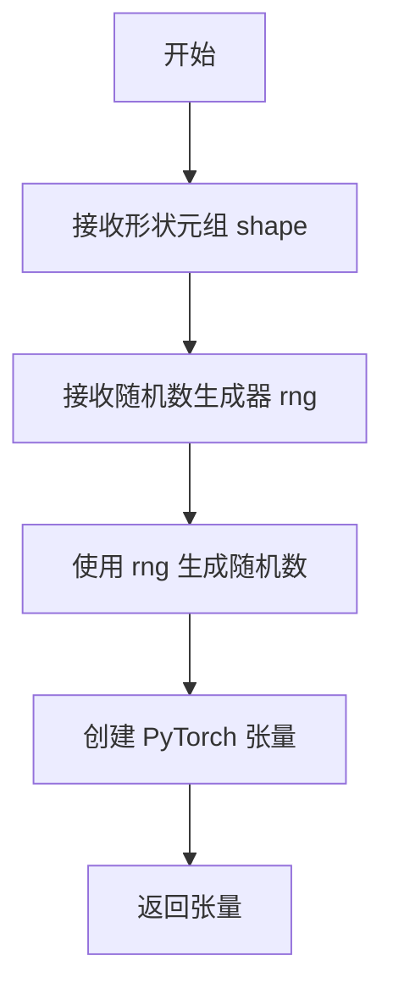
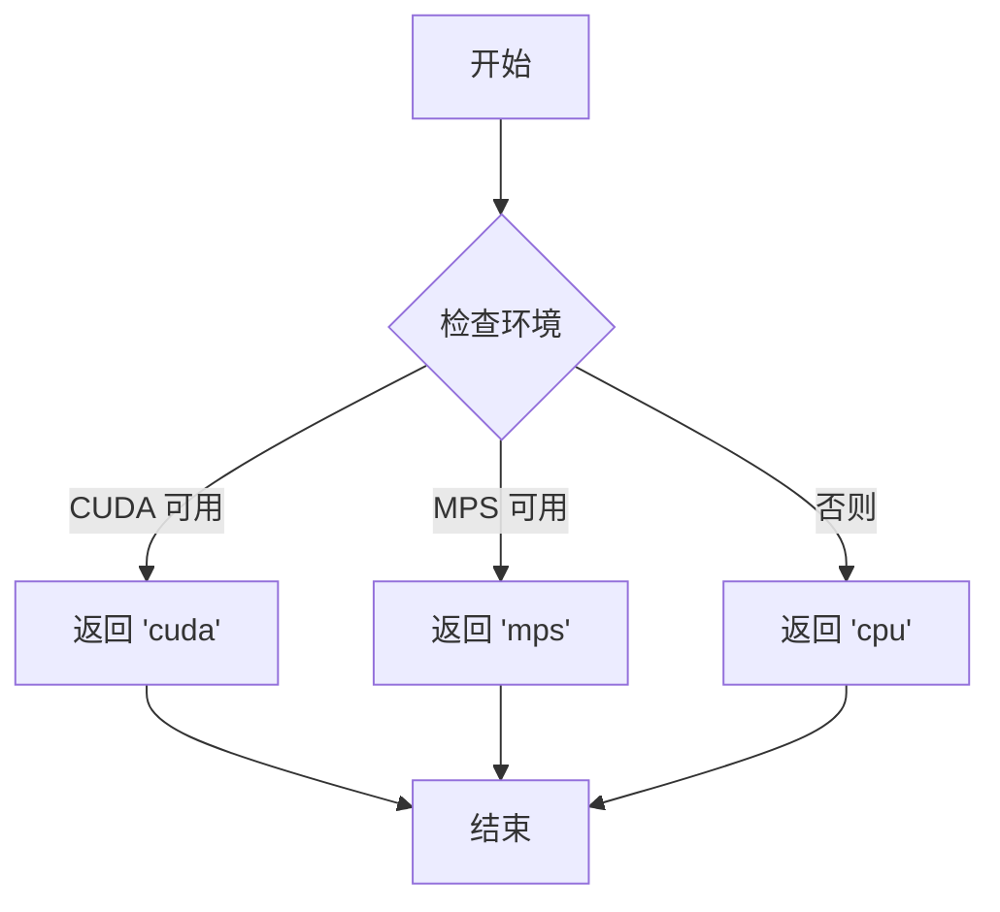
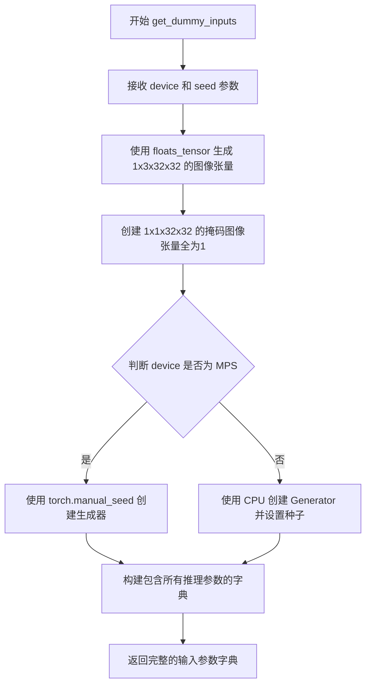
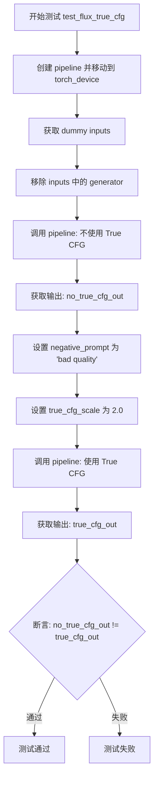

# `diffusers\tests\pipelines\flux\test_pipeline_flux_kontext_inpaint.py` 详细设计文档

这是一个用于测试 FluxKontextInpaintPipeline（图像修复管道）的单元测试文件，主要验证模型在不同提示词下的输出差异、图像输出尺寸的VAE缩放适配以及True CFG（无分类器指导）的功能正确性。

## 整体流程

```mermaid
graph TD
    A[开始测试] --> B[初始化测试类: FluxKontextInpaintPipelineFastTests]
    B --> C[执行 test_flux_inpaint_different_prompts]
    C --> C1[调用 get_dummy_components 构建虚拟模型组件]
    C1 --> C2[实例化 FluxKontextInpaintPipeline]
    C2 --> C3[调用 get_dummy_inputs 获取虚拟输入 (图像, mask, prompt)]
    C3 --> C4[运行管道: prompt='A painting of a squirrel...']
    C4 --> C5[运行管道: prompt='a different prompt']
    C5 --> C6[断言: 两次输出差异 > 1e-6]
    B --> D[执行 test_flux_image_output_shape]
    D --> D1[循环不同的高宽组合 (32x32, 72x56)]
    D1 --> D2[计算期望的 VAE 缩放后尺寸]
    D2 --> D3[运行管道并获取输出图像]
    D3 --> D4[断言: 输出尺寸 == 期望尺寸]
    B --> E[执行 test_flux_true_cfg]
    E --> E1[运行无 True CFG 的管道]
    E1 --> E2[运行有 True CFG (scale=2.0) 的管道]
    E2 --> E3[断言: 两者输出不完全相同]
    E3 --> F[结束测试]
```

## 类结构

```
unittest.TestCase (Python 标准库)
├── PipelineTesterMixin (Diffusers 测试基类)
├── FluxIPAdapterTesterMixin (IP Adapter 测试混入)
├── PyramidAttentionBroadcastTesterMixin (注意力机制测试混入)
├── FasterCacheTesterMixin (加速缓存测试混入)
└── FluxKontextInpaintPipelineFastTests (待测测试类)
```

## 全局变量及字段


### `FluxKontextInpaintPipelineFastTests.pipeline_class`
    
指向 FluxKontextInpaintPipeline

类型：`type`
    


### `FluxKontextInpaintPipelineFastTests.params`
    
管道参数集合

类型：`frozenset`
    


### `FluxKontextInpaintPipelineFastTests.batch_params`
    
批处理参数集合

类型：`frozenset`
    


### `FluxKontextInpaintPipelineFastTests.test_xformers_attention`
    
是否测试 xformers

类型：`bool`
    


### `FluxKontextInpaintPipelineFastTests.test_layerwise_casting`
    
是否测试逐层类型转换

类型：`bool`
    


### `FluxKontextInpaintPipelineFastTests.test_group_offloading`
    
是否测试组卸载

类型：`bool`
    


### `FluxKontextInpaintPipelineFastTests.faster_cache_config`
    
加速缓存配置

类型：`FasterCacheConfig`
    
    

## 全局函数及方法


### `floats_tensor`

生成指定形状的随机浮点数张量，用于测试目的。

参数：

- `shape`：`Tuple[int, ...]`，张量的形状，例如 `(1, 3, 32, 32)`
- `rng`：`random.Random`，随机数生成器实例，用于生成随机数

返回值：`torch.Tensor`，包含随机浮点数的 PyTorch 张量

#### 流程图



#### 带注释源码

```
# 该函数定义在 testing_utils 模块中，此处仅展示调用方式
# 函数签名（推断）：floats_tensor(shape: Tuple[int, ...], rng: random.Random) -> torch.Tensor

# 示例调用 1（来自 get_dummy_inputs 方法）
image = floats_tensor((1, 3, 32, 32), rng=random.Random(seed)).to(device)
# 生成一个形状为 (1, 3, 32, 32) 的随机浮点张量，并移动到指定设备

# 示例调用 2（来自 test_flux_image_output_shape 方法）
image = floats_tensor((1, 3, height, width), rng=random.Random(0)).to(torch_device)
# 生成一个形状为 (1, 3, height, width) 的随机浮点张量，使用固定种子 0
```

---

**注意**：由于 `floats_tensor` 函数定义在 `...testing_utils` 模块中（该模块未在当前代码片段中显示），以上信息是基于代码中的使用方式推断得出的。如需完整的函数定义源码，建议查看 `testing_utils.py` 文件。


### `torch_device`

`torch_device` 是从 `testing_utils` 导入的一个全局变量（或函数），用于获取当前测试环境的 PyTorch 设备字符串（如 "cuda"、"cpu" 或 "mps"），以确保测试在合适的设备上运行。

参数：无需参数（全局变量/函数）

返回值：`str`，返回 PyTorch 设备字符串（如 "cuda", "cpu", "mps"）

#### 流程图



#### 带注释源码

```
# torch_device 是从 testing_utils 模块导入的
# 根据代码使用方式推断其实现类似如下：

def get_torch_device():
    """
    获取当前测试环境的首选 PyTorch 设备。
    
    优先级: cuda > mps > cpu
    这样可以确保测试在支持 GPU 加速的环境下运行，
    同时保持对 CPU-only 环境的兼容性。
    """
    if torch.cuda.is_available():
        return "cuda"
    # 检查 Apple Silicon MPS (Metal Performance Shaders)
    elif hasattr(torch.backends, 'mps') and torch.backends.mps.is_available():
        return "mps"
    else:
        return "cpu"

# 在测试中的典型使用方式：
# 1. 将模型移动到设备
pipe = self.pipeline_class(...).to(torch_device)  # 等同于 .to("cuda")
# 2. 将张量移动到设备
image = floats_tensor(...).to(torch_device)
# 3. 在指定设备上创建生成器
generator = torch.Generator(device=torch_device).manual_seed(seed)
```


### `FluxKontextInpaintPipelineFastTests.get_dummy_components`

该方法用于创建并返回Flux图像修复Pipeline测试所需的虚拟（dummy）组件集合，包括Transformer模型、文本编码器、VAE、调度器等，以便在不依赖真实预训练权重的情况下进行单元测试。

参数：

- `num_layers`：`int`，可选参数，默认值为 `1`，指定Transformer模型的层数
- `num_single_layers`：`int`，可选参数，默认值为 `1`，指定Transformer模型的单层数量

返回值：`Dict[str, Any]`，返回一个包含以下键的字典：
- `scheduler`：调度器实例
- `text_encoder`：CLIP文本编码器
- `text_encoder_2`：T5文本编码器
- `tokenizer`：CLIP分词器
- `tokenizer_2`：T5分词器
- `transformer`：FluxTransformer2DModel模型
- `vae`：AutoencoderKL模型
- `image_encoder`：图像编码器（值为 `None`）
- `feature_extractor`：特征提取器（值为 `None`）

#### 流程图

```mermaid
flowchart TD
    A[开始 get_dummy_components] --> B[设置随机种子 torch.manual_seed(0)]
    B --> C[创建 FluxTransformer2DModel]
    C --> D[创建 CLIPTextConfig 配置]
    D --> E[创建 CLIPTextModel 文本编码器]
    E --> F[创建 T5EncoderModel 文本编码器]
    F --> G[创建 CLIPTokenizer 和 AutoTokenizer]
    G --> H[创建 AutoencoderKL VAE]
    H --> I[创建 FlowMatchEulerDiscreteScheduler]
    I --> J[构建组件字典]
    J --> K[返回包含所有组件的字典]
    
    C -.-> C1[patch_size=1, in_channels=4, num_layers, num_single_layers, attention_head_dim=16, num_attention_heads=2, joint_attention_dim=32, pooled_projection_dim=32, axes_dims_rope=[4,4,8]]
    D -.-> D1[hidden_size=32, num_hidden_layers=5, vocab_size=1000, projection_dim=32]
    H -.-> H1[sample_size=32, in_channels=3, out_channels=3, latent_channels=1]
```

#### 带注释源码

```python
def get_dummy_components(self, num_layers: int = 1, num_single_layers: int = 1):
    """
    生成用于测试的虚拟组件字典
    
    参数:
        num_layers: Transformer模型的层数，默认值为1
        num_single_layers: Transformer模型的单层数量，默认值为1
    
    返回:
        包含所有pipeline组件的字典
    """
    # 设置随机种子以确保测试可重复性
    torch.manual_seed(0)
    
    # 创建FluxTransformer2DModel虚拟模型
    # 参数说明:
    # - patch_size: 补丁大小
    # - in_channels: 输入通道数
    # - num_layers: 主注意力层数
    # - num_single_layers: 单层数量
    # - attention_head_dim: 注意力头维度
    # - num_attention_heads: 注意力头数量
    # - joint_attention_dim: 联合注意力维度
    # - pooled_projection_dim: 池化投影维度
    # - axes_dims_rope: RoPE轴维度
    transformer = FluxTransformer2DModel(
        patch_size=1,
        in_channels=4,
        num_layers=num_layers,
        num_single_layers=num_single_layers,
        attention_head_dim=16,
        num_attention_heads=2,
        joint_attention_dim=32,
        pooled_projection_dim=32,
        axes_dims_rope=[4, 4, 8],
    )
    
    # 创建CLIP文本编码器配置
    clip_text_encoder_config = CLIPTextConfig(
        bos_token_id=0,           # 句子开始token ID
        eos_token_id=2,           # 句子结束token ID
        hidden_size=32,           # 隐藏层维度
        intermediate_size=37,     # FFN中间层维度
        layer_norm_eps=1e-05,     # LayerNorm epsilon
        num_attention_heads=4,    # 注意力头数
        num_hidden_layers=5,      # 隐藏层数
        pad_token_id=1,           # 填充token ID
        vocab_size=1000,          # 词汇表大小
        hidden_act="gelu",        # 激活函数
        projection_dim=32,        # 投影维度
    )

    # 使用随机种子创建CLIP文本编码器
    torch.manual_seed(0)
    text_encoder = CLIPTextModel(clip_text_encoder_config)

    # 加载预训练的T5EncoderModel (使用HF测试用tiny模型)
    torch.manual_seed(0)
    text_encoder_2 = T5EncoderModel.from_pretrained("hf-internal-testing/tiny-random-t5")

    # 加载分词器
    tokenizer = CLIPTokenizer.from_pretrained("hf-internal-testing/tiny-random-clip")
    tokenizer_2 = AutoTokenizer.from_pretrained("hf-internal-testing/tiny-random-t5")

    # 创建AutoencoderKL (VAE) 模型
    torch.manual_seed(0)
    vae = AutoencoderKL(
        sample_size=32,           # 样本大小
        in_channels=3,            # 输入通道数 (RGB)
        out_channels=3,           # 输出通道数
        block_out_channels=(4,), # 块输出通道数
        layers_per_block=1,       # 每块的层数
        latent_channels=1,       # 潜在空间通道数
        norm_num_groups=1,        # 归一化组数
        use_quant_conv=False,     # 不使用量化卷积
        use_post_quant_conv=False,# 不使用后量化卷积
        shift_factor=0.0609,      # 移位因子
        scaling_factor=1.5035,    # 缩放因子
    )

    # 创建Flow Match Euler离散调度器
    scheduler = FlowMatchEulerDiscreteScheduler()

    # 返回包含所有组件的字典
    return {
        "scheduler": scheduler,           # 调度器
        "text_encoder": text_encoder,     # CLIP文本编码器
        "text_encoder_2": text_encoder_2, # T5文本编码器
        "tokenizer": tokenizer,           # CLIP分词器
        "tokenizer_2": tokenizer_2,       # T5分词器
        "transformer": transformer,       # Transformer模型
        "vae": vae,                       # VAE模型
        "image_encoder": None,            # 图像编码器 (未使用)
        "feature_extractor": None,        # 特征提取器 (未使用)
    }
```


### `FluxKontextInpaintPipelineFastTests.get_dummy_inputs`

该方法用于生成虚拟输入参数，为 Flux 上下文修复管道的单元测试提供测试数据。它创建包含图像、掩码图像、生成器和推理参数的字典，用于验证管道的功能和输出。

参数：

- `self`：隐式参数，`FluxKontextInpaintPipelineFastTests` 类的实例方法
- `device`：`str` 或 `torch.device`，指定张量应放置的计算设备（如 "cuda"、"cpu" 或 "mps"）
- `seed`：`int`，随机数生成器的种子，默认值为 0，用于确保测试结果的可重复性

返回值：`Dict[str, Any]`，包含以下键的字典：
- `prompt`：文本提示
- `image`：输入图像张量
- `mask_image`：掩码图像张量
- `generator`：随机数生成器
- `num_inference_steps`：推理步数
- `guidance_scale`：引导 scale
- `height` 和 `width`：图像尺寸
- `max_sequence_length`：最大序列长度
- `strength`：强度参数
- `output_type`：输出类型
- `_auto_resize`：是否自动调整大小

#### 流程图



#### 带注释源码

```python
def get_dummy_inputs(self, device, seed=0):
    """
    生成用于测试 FluxKontextInpaintPipeline 的虚拟输入参数。
    
    参数:
        device: 计算设备，用于将张量移动到指定设备
        seed: 随机种子，确保测试结果可重复
    
    返回:
        包含图像、掩码、生成器和推理参数的字典
    """
    # 使用 floats_tensor 生成形状为 (1, 3, 32, 32) 的随机图像张量
    # rng=random.Random(seed) 确保使用固定的随机种子
    image = floats_tensor((1, 3, 32, 32), rng=random.Random(seed)).to(device)
    
    # 创建全为 1 的掩码图像，形状为 (1, 1, 32, 32)
    # 用于指定需要修复的区域
    mask_image = torch.ones((1, 1, 32, 32)).to(device)
    
    # 根据设备类型选择不同的随机数生成器创建方式
    # MPS (Apple Silicon) 设备使用 torch.manual_seed
    # 其他设备使用 CPU 上的 Generator
    if str(device).startswith("mps"):
        generator = torch.manual_seed(seed)
    else:
        generator = torch.Generator(device="cpu").manual_seed(seed)

    # 构建完整的输入参数字典，包含所有管道推理所需的参数
    inputs = {
        "prompt": "A painting of a squirrel eating a burger",  # 文本提示
        "image": image,              # 输入图像
        "mask_image": mask_image,    # 修复掩码
        "generator": generator,      # 随机生成器确保可重复性
        "num_inference_steps": 2,    # 推理步数，测试用较少步数
        "guidance_scale": 5.0,       # CFG 引导强度
        "height": 32,                # 输出图像高度
        "width": 32,                 # 输出图像宽度
        "max_sequence_length": 48,   # 文本编码器的最大序列长度
        "strength": 0.8,             # 图像修复强度 (0-1)
        "output_type": "np",         # 输出类型为 numpy 数组
        "_auto_resize": False,       # 禁用自动调整大小
    }
    return inputs  # 返回包含所有参数的字典供管道使用
```


### `FluxKontextInpaintPipelineFastTests.test_flux_inpaint_different_prompts`

该测试方法用于验证 Flux 上下文修复管道在处理不同提示词时能够生成不同的输出。它创建两个管道调用，一个使用相同提示词，另一个使用不同的提示词（通过 `prompt_2` 参数），然后断言两者的输出差异大于设定的阈值。

参数：

- `self`：隐式参数，测试类实例本身

返回值：`None`，该方法为测试用例，通过断言验证逻辑，不返回具体数据

#### 流程图

```mermaid
flowchart TD
    A[开始测试] --> B[获取虚拟组件并创建pipeline<br/>pipeline_class(**get_dummy_components()).totorch_device]
    B --> C[获取虚拟输入<br/>get_dummy_inputs]
    C --> D[使用默认prompt调用pipeline<br/>pipe(**inputs)]
    D --> E[获取output_same_prompt<br/>output.images0]
    E --> F[再次获取虚拟输入<br/>get_dummy_inputs]
    F --> G[设置prompt_2为不同提示词<br/>inputs['prompt_2'] = 'a different prompt']
    G --> H[使用不同prompt调用pipeline<br/>pipe(**inputs)]
    H --> I[获取output_different_prompts<br/>output.images0]
    I --> J[计算输出差异<br/>max_diff = np.absoutput_same_prompt - output_different_prompts.max]
    J --> K{断言检查<br/>max_diff > 1e-6}
    K -->|通过| L[测试通过]
    K -->|失败| M[测试失败抛出异常]
```

#### 带注释源码

```python
def test_flux_inpaint_different_prompts(self):
    """
    测试 Flux 上下文修复管道在使用不同提示词时生成不同输出的能力
    
    该测试验证：
    1. 管道能够正确处理多个提示词参数（prompt 和 prompt_2）
    2. 不同的提示词应该产生不同的图像输出
    """
    # 步骤1：获取虚拟组件配置并创建管道实例
    # get_dummy_components() 返回包含 transformer、text_encoder、vae 等的字典
    pipe = self.pipeline_class(**self.get_dummy_components()).to(torch_device)

    # 步骤2：获取默认的虚拟输入参数
    # 包含 prompt: "A painting of a squirrel eating a burger"
    # image, mask_image, generator, num_inference_steps 等
    inputs = self.get_dummy_inputs(torch_device)

    # 步骤3：使用默认提示词调用管道，获取第一次输出
    # **inputs 将字典展开为关键字参数
    output_same_prompt = pipe(**inputs).images[0]

    # 步骤4：重新获取输入参数（因为管道调用可能会修改内部状态）
    inputs = self.get_dummy_inputs(torch_device)

    # 步骤5：设置第二个提示词为不同的内容
    # prompt_2 是 Flux 管道支持的多提示词参数
    inputs["prompt_2"] = "a different prompt"

    # 步骤6：使用不同的提示词调用管道，获取第二次输出
    output_different_prompts = pipe(**inputs).images[0]

    # 步骤7：计算两个输出之间的最大绝对差异
    # 使用 numpy 计算张量差异的最大值
    max_diff = np.abs(output_same_prompt - output_different_prompts).max()

    # 步骤8：断言验证
    # 输出应该有所不同（差异大于最小阈值 1e-6）
    # 注意：代码注释指出"由于某些原因，它们没有显示出很大的差异"
    # 所以阈值设置为很小的值 1e-6
    assert max_diff > 1e-6
```


### `FluxKontextInpaintPipelineFastTests.test_flux_image_output_shape`

该测试方法用于验证 FluxKontextInpaintPipeline 在不同输入尺寸下的输出图像形状是否正确，通过检查输出高度和宽度是否与根据 VAE 缩放因子计算的预期尺寸相匹配。

参数：

- `self`：`FluxKontextInpaintPipelineFastTests`，测试类实例本身，用于访问类属性和方法

返回值：`None`，该方法为测试方法，无返回值，通过断言验证输出形状的正确性

#### 流程图

```mermaid
flowchart TD
    A[开始测试] --> B[创建Pipeline实例并移动到设备]
    B --> C[获取虚拟输入参数]
    C --> D[定义测试尺寸对: (32, 32) 和 (72, 56)]
    D --> E{遍历尺寸对}
    E -->|是| F[计算预期输出尺寸]
    F --> G[创建测试图像和掩码张量]
    G --> H[更新输入参数]
    H --> I[调用Pipeline进行推理]
    I --> J[获取输出图像]
    J --> K[提取输出高度和宽度]
    K --> L{断言输出尺寸是否匹配}
    L -->|是| E
    L -->|否| M[抛出断言错误]
    E -->|否| N[测试完成]
```

#### 带注释源码

```python
def test_flux_image_output_shape(self):
    """
    测试 Flux 图像修复管道在不同输入尺寸下的输出形状是否正确。
    验证输出图像的尺寸会根据 VAE 缩放因子进行调整。
    """
    # 使用测试类的 pipeline_class 创建管道实例
    # 并传入虚拟组件（通过 get_dummy_components 获取）
    pipe = self.pipeline_class(**self.get_dummy_components()).to(torch_device)
    
    # 获取默认的虚拟输入参数
    inputs = self.get_dummy_inputs(torch_device)

    # 定义要测试的多个高度和宽度组合
    height_width_pairs = [(32, 32), (72, 56)]
    
    # 遍历每组尺寸进行测试
    for height, width in height_width_pairs:
        # 计算预期的输出高度和宽度
        # 需要减去 height % (pipe.vae_scale_factor * 2) 以对齐到 VAE 网格
        expected_height = height - height % (pipe.vae_scale_factor * 2)
        expected_width = width - width % (pipe.vae_scale_factor * 2)
        
        # 创建指定尺寸的测试图像张量 (1, 3, height, width)
        image = floats_tensor((1, 3, height, width), rng=random.Random(0)).to(torch_device)
        
        # 创建对应的掩码图像张量 (1, 1, height, width)
        mask_image = torch.ones((1, 1, height, width)).to(torch_device)

        # 更新输入参数字典，添加/覆盖以下键值
        inputs.update(
            {
                "height": height,          # 请求的输出高度
                "width": width,            # 请求的输出宽度
                "max_area": height * width,  # 最大区域限制
                "image": image,            # 输入图像
                "mask_image": mask_image,  # 修复掩码
            }
        )
        
        # 调用管道进行推理，获取输出结果
        image = pipe(**inputs).images[0]
        
        # 从输出图像中提取高度和宽度（图像为 HWC 格式）
        output_height, output_width, _ = image.shape
        
        # 断言输出尺寸是否与预期尺寸匹配
        assert (output_height, output_width) == (expected_height, expected_width)
```


### `FluxKontextInpaintPipelineFastTests.test_flux_true_cfg`

这是一个单元测试方法，用于测试 Flux 模型的真实分类器自由引导（True CFG）功能，通过比较启用和未启用 True CFG 时的输出差异来验证功能正确性。

参数：

- `self`：隐式参数，测试类实例

返回值：`None`，无返回值（测试方法，使用 assert 语句进行验证）

#### 流程图



#### 带注释源码

```
def test_flux_true_cfg(self):
    # 创建 FluxKontextInpaintPipeline 实例，使用虚拟组件并移动到指定设备
    pipe = self.pipeline_class(**self.get_dummy_components()).to(torch_device)
    
    # 获取虚拟输入数据
    inputs = self.get_dummy_inputs(torch_device)
    
    # 从输入字典中移除 generator，因为后续会单独传入
    inputs.pop("generator")
    
    # 不使用 True CFG 模式的推理
    # 使用固定的随机种子确保可复现性
    no_true_cfg_out = pipe(**inputs, generator=torch.manual_seed(0)).images[0]
    
    # 设置 negative_prompt 用于指导生成方向
    inputs["negative_prompt"] = "bad quality"
    
    # 设置 True CFG 比例因子，启用 True CFG 模式
    inputs["true_cfg_scale"] = 2.0
    
    # 使用 True CFG 模式的推理
    # 同样使用固定随机种子确保可复现性
    true_cfg_out = pipe(**inputs, generator=torch.manual_seed(0)).images[0]
    
    # 断言：True CFG 和非 True CFG 的输出应该不同
    # 如果输出完全相同，则说明 True CFG 功能未正常工作
    assert not np.allclose(no_true_cfg_out, true_cfg_out)
```

## 关键组件


### FluxKontextInpaintPipeline

Flux图像修复管道测试类，继承多个测试mixin，用于测试Flux模型的图像修复功能，包括不同提示词、输出形状和真实CFG等功能。

### FasterCacheConfig

快速缓存配置类，用于优化Flux模型的推理性能，包含空间注意力块跳过范围、时间步跳过范围、无条件批次跳过范围和注意力权重回调等参数。

### FlowMatchEulerDiscreteScheduler

流匹配欧拉离散调度器，用于 diffusion 模型的噪声调度。

### FluxTransformer2DModel

Flux 2D变换器模型，用于图像生成的骨干网络，支持patch嵌入、联合注意力等特性。

### AutoencoderKL

变分自编码器模型，用于图像的潜在空间编码和解码，支持量化卷积和后量化卷积（当前测试中禁用）。

### CLIPTextModel & T5EncoderModel

文本编码器模型，分别用于CLIP和T5文本编码，生成文本嵌入向量供扩散模型使用。

### get_dummy_components

测试辅助方法，创建虚拟的模型组件用于单元测试，包括transformer、text_encoder、vae等。

### get_dummy_inputs

测试辅助方法，创建虚拟的输入数据，包括图像、mask图像、生成器、推理步数等参数。

### test_flux_inpaint_different_prompts

测试方法，验证不同提示词产生不同输出的功能。

### test_flux_image_output_shape

测试方法，验证输出图像形状与输入尺寸的对应关系，考虑VAE缩放因子。

### test_flux_true_cfg

测试方法，验证真实CFG（Classifier-Free Guidance）功能，测试负面提示词和CFG缩放效果。


## 问题及建议


### 已知问题

- **重复的测试设置代码**：get_dummy_inputs方法在多个测试方法中被调用并反复修改参数，导致代码冗余，可维护性差
- **魔法数字和硬编码值**：代码中存在大量未解释的魔法数字（如1e-6、0.8、2.0、901等）和硬编码参数（如num_layers=1），缺乏配置化
- **设备处理不一致**：对mps设备有特殊处理逻辑（generator初始化方式不同），但这种条件判断方式不够优雅，增加了测试的复杂性
- **测试隔离性不足**：多个测试方法共享torch.manual_seed(0)，可能导致测试之间存在隐式依赖，破坏测试的独立性
- **缺少错误处理和边界条件测试**：没有测试无效输入（如负数尺寸、None值、类型错误等）的错误处理逻辑
- **文档严重缺失**：类和方法缺少文档字符串（docstring），难以理解每个测试方法的意图和预期行为
- **参数验证缺失**：test_flux_image_output_shape中使用的max_area参数在get_dummy_inputs中未定义，依赖于后续的update调用，这种隐式参数依赖容易导致错误
- **测试覆盖不全面**：缺少对性能、资源清理、并发调用等场景的测试

### 优化建议

- **提取测试fixture**：使用unittest的setUp方法或pytest的fixture来集中管理测试数据和配置，减少重复代码
- **配置化参数**：将硬编码的测试参数提取为类常量或配置文件，提高代码的可维护性和可读性
- **统一设备处理**：封装设备检测逻辑为工具函数，消除mps设备的特殊处理分支
- **增强测试独立性**：每个测试方法使用不同的随机种子或独立的初始化逻辑，确保测试之间相互独立
- **补充错误处理测试**：添加对无效输入的异常测试，验证pipeline的错误处理能力
- **添加文档字符串**：为类和方法添加详细的文档说明，包括参数说明、返回值和测试目的
- **明确参数依赖**：避免使用隐式的参数更新方式，优先在get_dummy_inputs中定义所有需要的参数
- **扩展测试覆盖**：增加边界条件测试、性能基准测试和资源清理验证

## 其它


### 设计目标与约束

本测试代码旨在验证FluxKontextInpaintPipeline在图像修复任务中的正确性，包括不同提示词处理、输出形状验证和TrueCFG功能测试。约束条件包括：使用FasterCacheConfig进行加速测试、需要GPU环境支持、测试xformers因Flux架构特性被禁用。

### 错误处理与异常设计

测试代码主要通过assert语句进行断言验证，包括输出差异性检查（max_diff > 1e-6）、输出形状匹配验证、图像输出与预期尺寸对比。异常情况包括设备兼容性处理（如mps设备的特殊generator处理）、VAE缩放因子计算导致的尺寸调整等。

### 数据流与状态机

测试流程为：初始化pipeline组件 → 准备dummy输入数据 → 执行pipeline推理 → 验证输出结果。状态转换包括：组件构建状态（get_dummy_components）→ 输入准备状态（get_dummy_inputs）→ 推理执行状态（pipe调用）→ 结果验证状态（assert断言）。

### 外部依赖与接口契约

主要依赖包括：diffusers库（FluxKontextInpaintPipeline、AutoencoderKL等）、transformers库（CLIPTextModel、T5EncoderModel、AutoTokenizer）、torch和numpy。接口契约要求pipeline接受prompt、image、mask_image、guidance_scale等参数，返回包含images的结果对象。

### 配置管理

使用FasterCacheConfig进行缓存优化配置，包括spatial_attention_block_skip_range、spatial_attention_timestep_skip_range、unconditional_batch_skip_range等参数。pipeline参数通过params和batch_params两个frozenset进行定义和约束。

### 性能考虑

测试使用了简化的模型配置（num_layers=1, num_single_layers=1）以降低计算开销。采用FasterCacheConfig进行推理加速，attention_weight_callback使用lambda函数动态调整注意力权重。测试仅使用2个inference_steps减少推理时间。

### 安全性考虑

测试代码主要关注功能正确性，安全性考虑包括：模型加载使用预训练权重（hf-internal-testing/tiny-random-*系列）、测试环境隔离（使用固定随机种子确保可复现性）、无敏感数据处理。

### 版本兼容性

代码依赖特定版本的diffusers库（需支持FluxKontextInpaintPipeline和FlowMatchEulerDiscreteScheduler）、transformers库（CLIPTextModel、T5EncoderModel）、torch及numpy。需确保Python环境满足这些依赖包的版本要求。

### 测试覆盖范围

测试覆盖了核心功能：不同提示词处理（test_flux_inpaint_different_prompts）、输出形状验证（test_flux_image_output_shape）、TrueCFG功能（test_flux_true_cfg）。通过继承多个TesterMixin类间接覆盖了更多测试场景。

### 部署注意事项

测试代码用于CI/CD流程中的单元测试验证，部署时需确保测试环境具备GPU资源、安装所有依赖包、配置好transformers和diffusers的模型缓存目录。测试应在隔离环境中运行以避免资源竞争。

### 关键组件信息

FluxKontextInpaintPipeline: 主pipeline类，负责图像修复推理流程。FluxTransformer2DModel: Transformer模型，处理潜在空间表示。AutoencoderKL: VAE编码器-解码器。CLIPTextModel/T5EncoderModel: 文本编码器。FlowMatchEulerDiscreteScheduler: 调度器。

    