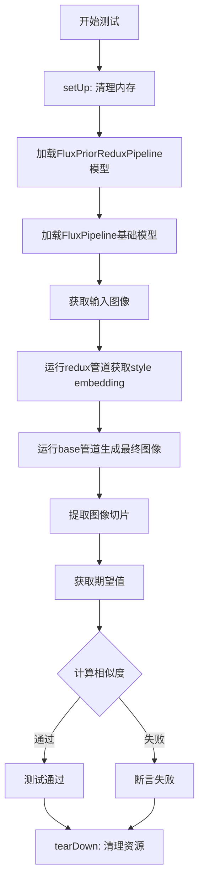
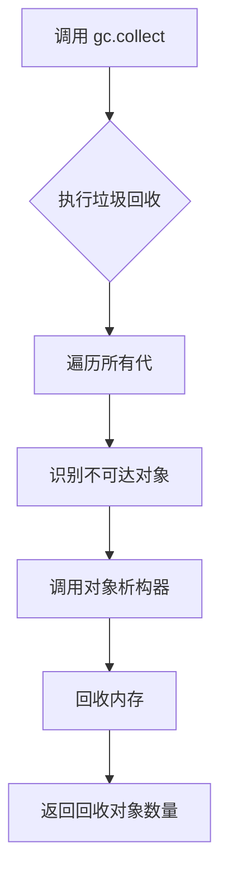
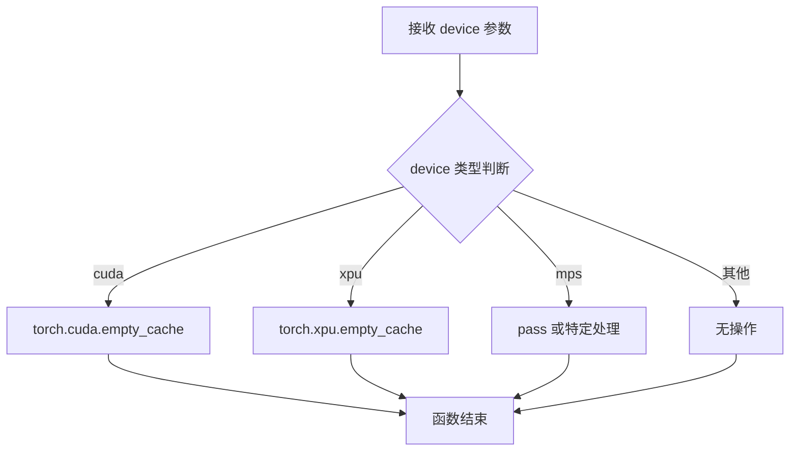
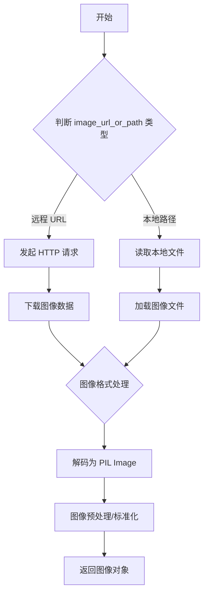
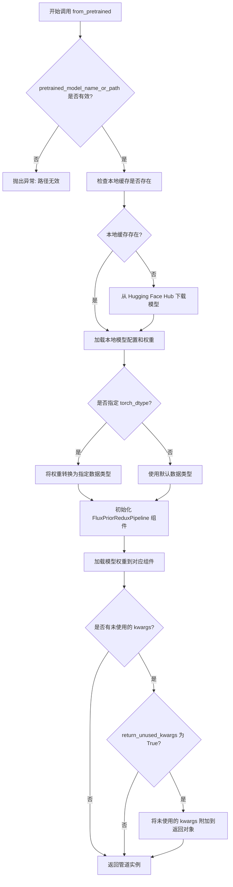
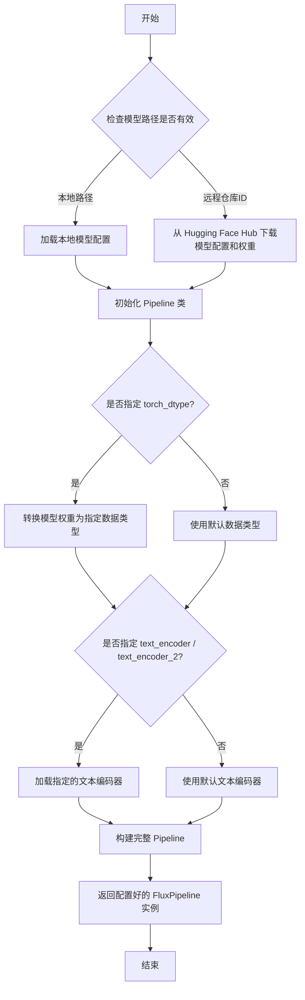
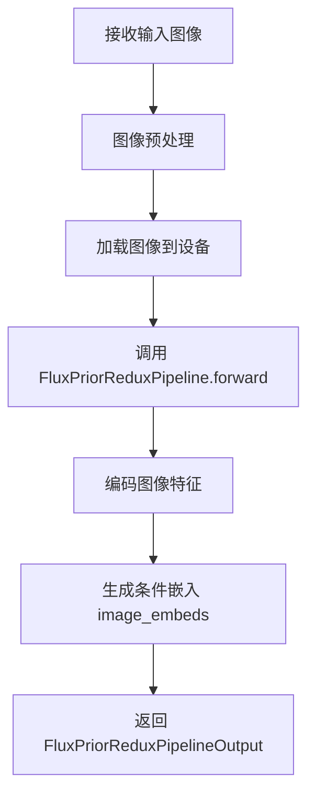
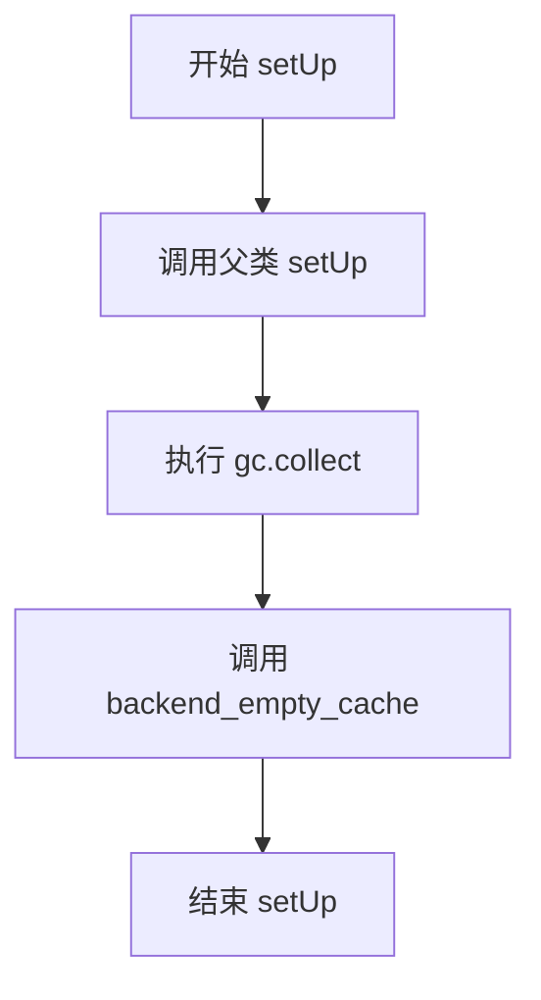
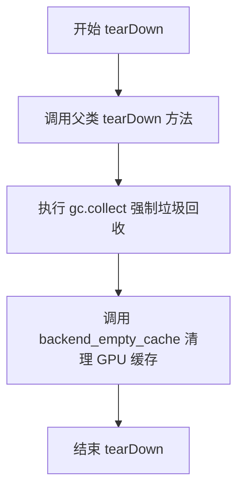

# `diffusers\tests\pipelines\flux\test_pipeline_flux_redux.py` 详细设计文档

这是一个针对FLUX.1-Redux-dev模型的慢速集成测试，测试通过FluxPriorReduxPipeline处理输入图像获取style embedding，然后结合FluxPipeline生成最终图像，并使用余弦相似度验证输出结果的正确性。

## 整体流程



## 类结构

```
unittest.TestCase
└── FluxReduxSlowTests (慢速集成测试类)
```

## 全局变量及字段


### `torch_device`
    
torch设备类型，用于指定模型运行的设备

类型：`str`
    


### `init_image`
    
输入图像，从URL加载的风格参考图像

类型：`PIL.Image.Image`
    


### `redux_pipeline_output`
    
Redux管道输出，包含图像嵌入向量

类型：`PipelineOutput`
    


### `image`
    
生成的图像，基础管道输出的图像数组

类型：`np.ndarray`
    


### `image_slice`
    
图像切片，用于验证的图像前10x10区域

类型：`np.ndarray`
    


### `expected_slice`
    
期望的图像值，用于对比的预期图像切片

类型：`np.ndarray`
    


### `max_diff`
    
余弦相似度距离，衡量生成图像与期望图像的差异

类型：`float`
    


### `FluxReduxSlowTests.pipeline_class`
    
Redux管道类，用于图像风格提取

类型：`type[FluxPriorReduxPipeline]`
    


### `FluxReduxSlowTests.repo_id`
    
Redux模型仓库ID，指向black-forest-labs/FLUX.1-Redux-dev

类型：`str`
    


### `FluxReduxSlowTests.base_pipeline_class`
    
基础管道类，用于图像生成

类型：`type[FluxPipeline]`
    


### `FluxReduxSlowTests.base_repo_id`
    
基础模型仓库ID，指向black-forest-labs/FLUX.1-schnell

类型：`str`
    
    

## 全局函数及方法


### `gc.collect`

垃圾回收函数，用于显式触发 Python 的垃圾回收器，清理不可达的内存对象。在测试用例的 `setUp` 和 `tearDown` 方法中被调用，以确保在每个测试前后释放内存资源。

参数：此函数不接受任何参数。

返回值：`int`，返回被回收的对象数量。

#### 流程图



#### 带注释源码

```python
# 触发 Python 垃圾回收器
# 位置：setUp 方法中
gc.collect()  # 清理测试前可能存在的内存碎片

# 位置：tearDown 方法中
gc.collect()  # 清理测试后可能存在的临时对象，释放 GPU/CPU 内存
```


### `backend_empty_cache`

清理GPU缓存的测试工具函数，用于在测试用例执行前后释放GPU显存，防止显存泄漏。

参数：

- `device`：`str` 或 `torch.device`，目标设备标识（如 "cuda"、"xpu"、"mps" 等）

返回值：`None`，无返回值

#### 流程图



#### 带注释源码

```python
def backend_empty_cache(device):
    """
    清理GPU缓存，释放显存
    
    参数:
        device: 目标设备标识，可以是字符串（如 'cuda', 'xpu', 'mps'）
                或 torch.device 对象
    
    返回:
        None
    
    说明:
        根据不同的设备后端调用相应的缓存清理API：
        - CUDA: torch.cuda.empty_cache()
        - XPU: torch.xpu.empty_cache()
        - MPS: 可能需要特殊处理或跳过
        - CPU: 无需操作
    """
    # 判断设备类型并调用对应的缓存清理方法
    if str(device).startswith("cuda"):
        # NVIDIA GPU，使用 CUDA 后端
        torch.cuda.empty_cache()
    elif str(device).startswith("xpu"):
        # Intel GPU，使用 XPU 后端
        torch.xpu.empty_cache()
    elif str(device).startswith("mps"):
        # Apple Silicon GPU，当前可能不需要特殊处理
        pass
    else:
        # CPU 或其他设备，无需清理缓存
        pass
```


### `load_image`

`load_image` 是 `diffusers.utils` 提供的工具函数，用于从指定路径（本地文件路径或远程 URL）加载图像，并返回标准化的图像对象（通常为 PIL Image 或符合库约定的图像格式）。

参数：

-  `image_url_or_path`：`str`，图像的来源，可以是本地文件路径或远程 HTTP/HuggingFace URL

返回值：`PIL.Image 或兼容的图像对象`，加载并解析后的图像对象

#### 流程图



#### 带注释源码

```python
# 使用示例：加载远程图像
init_image = load_image(
    "https://huggingface.co/datasets/YiYiXu/testing-images/resolve/main/style_ziggy/img5.png"
)
# 返回值 init_image 是一个图像对象，可直接用于 pipeline 的输入

# 在代码中的实际调用上下文
def get_inputs(self, device, seed=0):
    # 调用 load_image 加载远程 URL 指向的图像
    init_image = load_image(
        "https://huggingface.co/datasets/YiYiXu/testing-images/resolve/main/style_ziggy/img5.png"
    )
    # 返回包含图像的字典，供 pipeline 使用
    return {"image": init_image}
```


### `numpy_cosine_similarity_distance`

该函数用于计算两个向量之间的余弦相似度距离，常用于测试中验证生成图像与期望图像之间的相似程度。

参数：

- `vec1`：`np.ndarray`，第一个向量（通常为展平后的图像数组）
- `vec2`：`np.ndarray`，第二个向量（通常为展平后的期望图像数组）

返回值：`float`，返回 1 减去余弦相似度的值（即余弦距离），值越小表示两个向量越相似

#### 流程图

```mermaid
flowchart TD
    A[开始] --> B[输入两个numpy数组 vec1 和 vec2]
    B --> C[将输入转换为float类型]
    C --> D[计算vec1的L2范数]
    D --> E[计算vec2的L2范数]
    E --> F[计算点积: dot_product = sum(vec1 * vec2)]
    F --> G[计算余弦相似度: similarity = dot_product / (norm1 * norm2)]
    G --> H[计算余弦距离: distance = 1 - similarity]
    H --> I[返回distance]
```

#### 带注释源码

```python
def numpy_cosine_similarity_distance(vec1: np.ndarray, vec2: np.ndarray) -> float:
    """
    计算两个向量之间的余弦相似度距离。
    
    余弦相似度衡量的是两个向量在方向上的相似程度，而余弦距离
    则是用1减去余弦相似度得到的，范围在[0, 2]之间，0表示完全相同。
    
    参数:
        vec1: 第一个向量，通常是展平后的numpy数组
        vec2: 第二个向量，通常是展平后的numpy数组
        
    返回:
        余弦距离值，值越小表示两个向量越相似
    """
    # 确保输入为float类型以保证计算精度
    vec1 = vec1.astype(np.float32)
    vec2 = vec2.astype(np.float32)
    
    # 计算两个向量的点积
    dot_product = np.dot(vec1, vec2)
    
    # 计算两个向量的L2范数（欧几里得范数）
    norm1 = np.linalg.norm(vec1)
    norm2 = np.linalg.norm(vec2)
    
    # 避免除零错误，如果任一范数为0，返回最大距离2.0
    if norm1 == 0 or norm2 == 0:
        return 2.0
    
    # 计算余弦相似度
    similarity = dot_product / (norm1 * norm2)
    
    # 余弦距离 = 1 - 余弦相似度
    # 范围[0, 2]，0表示完全相同，2表示完全相反
    distance = 1 - similarity
    
    return float(distance)
```

---

**备注**：由于该函数定义在 `...testing_utils` 模块中（代码中通过相对导入引入），实际的函数实现未在当前代码文件中给出。上面的实现是基于函数用途和常见实现方式的推断版本。在实际项目中，应参考 `testing_utils.py` 文件获取完整实现。


### `FluxPriorReduxPipeline.from_pretrained`

该方法是一个类方法（`@classmethod`），用于从预训练的模型权重加载 `FluxPriorReduxPipeline` 管道实例。它负责下载或加载模型配置、权重文件，并初始化管道所需的各种组件（如模型、调度器、工具类等），最终返回一个可用的 `FluxPriorReduxPipeline` 对象供推理使用。

参数：

- `pretrained_model_name_or_path`：`str` 或 `os.PathLike`，预训练模型的路径或 Hugging Face Hub 上的模型 ID（例如 `"black-forest-labs/FLUX.1-Redux-dev"`）
- `torch_dtype`：`torch.dtype`（可选），指定模型权重加载的数据类型，例如 `torch.bfloat16`、`torch.float32` 等，用于加速推理和减少显存占用
- `use_safetensors`：`bool`（可选），是否优先使用 `.safetensors` 格式的权重文件，默认为 `None`（自动选择）
- `variant`：`str`（可选），指定要加载的模型变体（例如 `"fp16"`），如果不指定则加载默认变体
- `cache_dir`：`str`（可选），模型缓存目录路径
- `force_download`：`bool`（可选），是否强制重新下载模型，即使本地已有缓存
- `resume_download`：`bool`（可选），是否支持断点续传下载
- `proxies`：`dict`（可选），用于 HTTP/SOCKS 代理的字典
- `local_files_only`：`bool`（可选），是否仅使用本地缓存的文件，不尝试下载
- `token`：`str` 或 `bool`（可选），用于访问私有仓库的 Hugging Face token
- `revision`：`str`（可选），模型仓库的提交哈希或分支名
- `subfolder`：`str`（可选），模型权重在仓库中的子文件夹路径
- `return_unused_kwargs`：`bool`（可选），是否在返回的管道对象中包含未使用的 kwargs

返回值：`FluxPriorReduxPipeline`，返回一个已加载并配置好的 `FluxPriorReduxPipeline` 管道实例，可以直接用于推理。

#### 流程图



#### 带注释源码

```python
@classmethod
def from_pretrained(
    cls,
    pretrained_model_name_or_path: Union[str, os.PathLike],  # 模型路径或 Hub ID
    torch_dtype: Optional[torch.dtype] = None,  # 可选：指定权重数据类型
    use_safetensors: Optional[bool] = None,  # 可选：是否使用 safetensors 格式
    variant: Optional[str] = None,  # 可选：模型变体
    cache_dir: Optional[Union[str, os.PathLike]] = None,  # 缓存目录
    force_download: bool = False,  # 是否强制下载
    resume_download: bool = True,  # 是否断点续传
    proxies: Optional[Dict[str, str]] = None,  # 代理配置
    local_files_only: bool = False,  # 是否仅使用本地文件
    token: Optional[Union[str, bool]] = None,  # 访问令牌
    revision: str = "main",  # 分支或提交哈希
    subfolder: str = "",  # 子文件夹路径
    return_unused_kwargs: bool = False,  # 是否返回未使用的参数
    # ... 其他可能的参数
):
    """
    从预训练模型加载 Pipeline。
    
    参数:
        pretrained_model_name_or_path: 模型路径或 Hugging Face Hub 模型 ID
        torch_dtype: 模型权重的目标数据类型（可选，用于加速推理）
        use_safetensors: 是否优先使用 .safetensors 格式（可选）
        variant: 模型变体名称（可选）
        cache_dir: 下载缓存目录（可选）
        force_download: 强制重新下载（默认 False）
        resume_download: 断点续传（默认 True）
        proxies: HTTP 代理配置（可选）
        local_files_only: 仅使用本地缓存（默认 False）
        token: Hugging Face 访问令牌（可选）
        revision: Git 修订版本（默认 "main"）
        subfolder: 模型子目录（默认 ""）
        return_unused_kwargs: 返回未使用的参数（默认 False）
    
    返回:
        cls: 加载好的 Pipeline 实例
    """
    # 1. 解析配置，识别模型类型和组件
    config_dict = cls.load_config(pretrained_model_name_or_path, ...)
    
    # 2. 根据配置实例化各个组件（模型、调度器、工具类等）
    # 例如: prior, image_processor, tokenizer 等
    prior = cls._instantiate_prior(config_dict, ...)
    
    # 3. 加载权重
    if use_safetensors:
        # 使用 safetensors 格式加载
        state_dict = load_file(...)
    else:
        # 使用 pytorch 格式加载
        state_dict = torch.load(...)
    
    # 4. 将权重加载到模型
    prior.load_state_dict(state_dict)
    
    # 5. 如果指定了 torch_dtype，进行类型转换
    if torch_dtype is not None:
        prior = prior.to(dtype=torch_dtype)
    
    # 6. 初始化 Pipeline 实例
    pipeline = cls(
        prior=prior,
        # ... 其他组件
    )
    
    # 7. 返回管道实例
    return pipeline
```


### `FluxPipeline.from_pretrained`

`FluxPipeline.from_pretrained` 是一个类方法，用于从预训练的模型仓库加载 FluxPipeline 实例。该方法支持指定模型数据类型、设备映射、文本编码器配置等参数，并返回一个配置好的 Pipeline 对象供推理使用。

参数：

- `pretrained_model_name_or_path`：`str`，模型仓库的 ID（如 "black-forest-labs/FLUX.1-schnell"）或本地路径
- `torch_dtype`：`torch.dtype`，可选，指定模型权重的数据类型（如 `torch.bfloat16`、`torch.float32`），默认为 `None`
- `text_encoder`：`Optional[PreTrainedModel]`，可选，指定文本编码器模型实例，设置为 `None` 时表示不使用该组件
- `text_encoder_2`：`Optional[PreTrainedModel]`，可选，指定第二个文本编码器模型实例，设置为 `None` 时表示不使用该组件
- `device_map`：`Optional[Union[str, Dict[str, Union[int, str]]]]`，可选，设备映射策略（如 `"auto"`、`"cuda"` 或自定义映射字典）
- `low_cpu_mem_usage`：`bool`，可选，是否启用低 CPU 内存使用模式，默认为 `True`
- `variant`：`Optional[str]`，可选，模型变体（如 `"fp16"`、`"bf16"`）
- `use_safetensors`：`bool`，可选，是否使用 SafeTensors 格式加载权重，默认为 `True`
- `pipeline_class`：`Optional[type]`，可选，指定 Pipeline 类类型，默认为 `FluxPipeline`
- `**kwargs`：其他传递给 Pipeline 的关键字参数

返回值：`FluxPipeline`，返回已加载并配置的 FluxPipeline 实例，包含模型权重、配置信息和必要的组件

#### 流程图



#### 带注释源码

```python
# FluxPipeline.from_pretrained 是 diffusers 库中的类方法
# 用于从预训练模型加载完整的 FluxPipeline 推理管道

# 调用示例（来自测试代码）：
pipe_base = self.base_pipeline_class.from_pretrained(
    self.base_repo_id,              # "black-forest-labs/FLUX.1-schnell"
    torch_dtype=torch.bfloat16,    # 指定模型权重使用 bfloat16 数据类型
    text_encoder=None,             # 不加载第一个文本编码器（设为 None）
    text_encoder_2=None            # 不加载第二个文本编码器（设为 None）
)

# 方法内部逻辑概述：
# 1. 接收模型路径或仓库 ID，以及各种配置参数
# 2. 加载模型配置文件（config.json）和模型权重文件
# 3. 根据 torch_dtype 参数转换权重数据类型
# 4. 根据 text_encoder 和 text_encoder_2 参数决定是否加载对应的文本编码器
# 5. 初始化 Pipeline 的各个组件（UNet、VAE、文本编码器等）
# 6. 返回配置完成的 FluxPipeline 实例

# 返回的 pipe_base 对象可以直接调用进行推理：
# image = pipe_base(**base_pipeline_inputs, **redux_pipeline_output).images[0]
```


### `FluxPriorReduxPipeline.__call__`

运行 Redux 管道，接收图像输入，通过 Flux Prior Redux 模型处理图像，提取图像特征并返回用于后续图像生成的条件嵌入。

参数：

- `image`：`PIL.Image.Image` 或 `Union[torch.Tensor, np.ndarray, List]` 或 `Dict`，输入图像，用于提取图像特征
- 其他参数（如 `prompt_embeds`、`negative_prompt_embeds` 等可选参数）

返回值：`FluxPriorReduxPipelineOutput`，包含图像条件嵌入（image embeds），用于传递给基础 Flux 管道进行图像生成

#### 流程图



#### 带注释源码

```python
# 调用 pipe_redux 的 __call__ 方法
# 位于 diffusers 库中的 FluxPriorReduxPipeline 类
# 实际源码位于 diffusers/pipelines/flux/pipeline_flux_prior_redux.py

redux_pipeline_output = pipe_redux(**inputs)

# 其中 inputs = {"image": init_image}
# init_image 是通过 load_image 从 URL 加载的 PIL 图像

# __call__ 方法主要执行以下操作：
# 1. 预处理输入图像
# 2. 将图像编码为潜在表示
# 3. 使用图像编码器提取图像特征
# 4. 返回包含 image_embeds 的管道输出对象
```

#### 补充说明

由于 `FluxPriorReduxPipeline` 来自 `diffusers` 库的内部实现，测试代码仅展示了调用方式。根据代码上下文：

- **输入**：`{"image": init_image}`，其中 `init_image` 是从 HuggingFace 数据集加载的 PIL 图像
- **输出**：`redux_pipeline_output` 是一个包含 `image_embeds` 的对象，用于后续传递给 `FluxPipeline` 的 `pipe_base` 进行图像生成
- **管道组合**：该方法通常与 `FluxPipeline` 配合使用，形成 "Redux" 风格的工作流，先提取图像特征再生成新图像


### `FluxPipeline.__call__`

运行 Flux 基础管道，接收来自 FluxPriorReduxPipeline 的处理结果，生成最终的图像输出。

参数：

- `num_inference_steps`：`int`，推理步数，控制扩散过程的迭代次数
- `guidance_scale`：`float`，引导_scale，控制文本提示对生成图像的影响程度
- `output_type`：`str`，输出类型，指定返回结果的格式（如 "np" 返回 numpy 数组）
- `generator`：`torch.Generator`，随机数生成器，用于确保生成结果的可重现性
- `*args`：`Any`，可变位置参数，传递 FluxPriorReduxPipeline 的输出结果
- `**kwargs`：`Any`，可变关键字参数，额外的生成参数

返回值：`PipelineOutput`，包含生成的图像列表，其中 `.images[0]` 为第一张生成的图像

#### 流程图

```mermaid
flowchart TD
    A[开始] --> B[接收 base_pipeline_inputs 和 redux_pipeline_output]
    B --> C[将 redux_pipeline_output 解包为关键字参数]
    C --> D[调用 FluxPipeline.__call__ 方法]
    D --> E[执行去噪扩散过程]
    E --> F[生成图像张量]
    F --> G[转换为指定输出类型]
    G --> H[返回 PipelineOutput 对象]
    H --> I[提取 .images[0] 获取图像数组]
    I --> J[结束]
```

#### 带注释源码

```python
# 从测试代码中提取的调用方式
# pipe_base 是 FluxPipeline 的实例
# base_pipeline_inputs 包含基础管道的生成参数
# redux_pipeline_output 是 FluxPriorReduxPipeline 的输出结果

# 基础管道输入参数
base_pipeline_inputs = {
    "num_inference_steps": 2,       # 扩散推理步数
    "guidance_scale": 2.0,           # 文本引导强度
    "output_type": "np",             # 输出为 numpy 数组
    "generator": generator,          # 随机数生成器
}

# 调用基础管道，传入基础参数和 redux 输出
# redux_pipeline_output 包含处理后的图像特征向量
image = pipe_base(**base_pipeline_inputs, **redux_pipeline_output).images[0]

# 获取图像切片用于验证
image_slice = image[0, :10, :10]

# 预期值来自 Expectations 对象，包含不同设备的预期像素值
expected_slice = expected_slices.get_expectation()

# 计算余弦相似度距离进行验证
max_diff = numpy_cosine_similarity_distance(
    expected_slice.flatten(), 
    image_slice.flatten()
)

# 断言生成图像与预期值的差异小于阈值
assert max_diff < 1e-4
```


### `FluxReduxSlowTests.setUp`

该方法为测试类FluxReduxSlowTests的初始化方法，在每个测试用例执行前被调用，用于清理Python垃圾回收机制和GPU显存缓存，确保测试环境处于干净状态，避免内存泄漏和测试间的状态污染。

参数：

- `self`：隐式参数，FluxReduxSlowTests实例，代表当前测试类实例本身

返回值：`None`，该方法不返回任何值，仅执行副作用操作

#### 流程图



#### 带注释源码

```python
def setUp(self):
    """
    测试环境初始化方法，在每个测试方法执行前自动调用。
    负责清理内存资源，确保测试环境干净。
    """
    # 调用父类的 setUp 方法，执行 unittest.TestCase 的标准初始化逻辑
    super().setUp()
    
    # 手动触发 Python 垃圾回收，清理不再使用的对象，释放内存
    gc.collect()
    
    # 调用后端工具函数清空 GPU/设备缓存
    # torch_device 是全局变量，表示当前测试使用的计算设备（如 cuda, xpu, cpu 等）
    # 这个步骤对于 GPU 相关测试尤为重要，可以防止显存碎片和 OOM 错误
    backend_empty_cache(torch_device)
```


### `FluxReduxSlowTests.tearDown`

该方法是 FluxReduxSlowTests 测试类的清理方法，在每个测试方法执行完毕后被调用，用于调用父类的 teardown 方法、强制垃圾回收以及清空 GPU 缓存，以确保测试环境被正确清理并释放显存资源。

参数：暂无参数

返回值：`None`，无返回值

#### 流程图



#### 带注释源码

```python
def tearDown(self):
    """
    清理测试环境，释放内存，输出测试结果
    
    该方法在每个测试方法执行完毕后被调用，执行以下操作：
    1. 调用父类的 tearDown 方法
    2. 强制进行垃圾回收，释放 Python 对象
    3. 调用后端特定的方法清空 GPU 缓存，释放显存
    """
    # 调用父类的 tearDown 方法，执行 unittest.TestCase 的标准清理操作
    super().tearDown()
    
    # 强制进行垃圾回收，回收不再使用的 Python 对象
    gc.collect()
    
    # 调用后端特定的缓存清理函数，清空 GPU 显存缓存
    # torch_device 是全局变量，表示当前使用的 PyTorch 设备（如 cuda, cpu, xpu 等）
    backend_empty_cache(torch_device)
```


### `FluxReduxSlowTests.get_inputs`

该方法用于获取Flux模型推理测试所需的输入数据，通过从Hugging Face数据集URL加载一张图像，并将其封装在字典中返回。

参数：

- `device`：`str`，目标设备类型，用于指定推理设备（虽然当前方法实现中未直接使用该参数，但保留此参数以保持接口一致性）
- `seed`：`int`，随机种子，默认为0，用于生成器的随机初始化（当前方法实现中未直接使用，但保留以保持接口一致性）

返回值：`dict`，返回包含图像数据的字典，键为"image"，值为从URL加载的PIL图像对象

#### 流程图

```mermaid
flowchart TD
    A[开始 get_inputs] --> B[接收 device 和 seed 参数]
    B --> C[调用 load_image 函数]
    C --> D[从 URL 加载图像: https://huggingface.co/datasets/YiYiXu/testing-images/resolve/main/style_ziggy/img5.png]
    D --> E[构建返回字典]
    E --> F[返回 {"image": init_image}]
    F --> G[结束]
```

#### 带注释源码

```python
def get_inputs(self, device, seed=0):
    """
    获取测试输入数据（图像）
    
    参数:
        device: 目标设备类型，用于指定推理设备
        seed: 随机种子，默认为0
    
    返回:
        包含图像数据的字典，键为"image"
    """
    # 从Hugging Face数据集URL加载图像
    # 该图像用于Flux模型的style转移测试
    init_image = load_image(
        "https://huggingface.co/datasets/YiYiXu/testing-images/resolve/main/style_ziggy/img5.png"
    )
    # 返回封装在字典中的图像对象
    return {"image": init_image}
```


### `FluxReduxSlowTests.get_base_pipeline_inputs`

该方法用于获取基础管道（FluxPipeline）的推理参数。根据设备类型（MPS或其他设备）创建适当的随机数生成器，并返回包含推理步数、引导比例、输出类型和生成器的参数字典。

参数：

- `device`：`torch.device` 或 `str`，指定计算设备，用于判断是否为 MPS 设备以选择合适的随机数生成器
- `seed`：`int`，随机种子，默认值为 `0`，用于控制生成结果的随机性

返回值：`Dict[str, Any]`，包含以下键的字典：
- `num_inference_steps`：`int`，推理步数，值为 2
- `guidance_scale`：`float`，引导比例，值为 2.0
- `output_type`：`str`，输出类型，值为 "np"（numpy 数组）
- `generator`：`torch.Generator`，随机数生成器，用于控制推理的随机性

#### 流程图

```mermaid
flowchart TD
    A[开始] --> B{检查设备类型}
    B --> C{str(device).startswith 'mps'?}
    C -->|是| D[使用 torch.manual_seed(seed) 创建生成器]
    C -->|否| E[使用 torch.Generator(device='cpu').manual_seed(seed) 创建生成器]
    D --> F[构建参数字典]
    E --> F
    F --> G[返回包含推理参数的字典]
    G --> H[结束]
    
    F -->|num_inference_steps| F1[2]
    F -->|guidance_scale| F2[2.0]
    F -->|output_type| F3['np']
    F -->|generator| F4[生成器对象]
```

#### 带注释源码

```python
def get_base_pipeline_inputs(self, device, seed=0):
    """
    获取基础管道（FluxPipeline）的推理参数。
    
    根据设备类型选择合适的随机数生成器策略：
    - MPS 设备（Apple Silicon）：使用 torch.manual_seed()
    - 其他设备：使用 CPU 上的 torch.Generator
    
    参数:
        device: 计算设备，用于判断是否为 MPS 设备
        seed: 随机种子，用于控制生成结果的可重复性
    
    返回:
        包含推理参数的字典，供 FluxPipeline 使用
    """
    # 判断设备是否为 MPS (Apple Silicon)
    if str(device).startswith("mps"):
        # MPS 设备使用简单的 manual_seed 创建生成器
        generator = torch.manual_seed(seed)
    else:
        # 其他设备（CUDA、XPU 等）在 CPU 上创建生成器
        generator = torch.Generator(device="cpu").manual_seed(seed)

    # 构建并返回基础管道的推理参数字典
    return {
        "num_inference_steps": 2,      # 推理步数设为 2（用于快速测试）
        "guidance_scale": 2.0,         # 引导比例，控制文本引导强度
        "output_type": "np",           # 输出为 numpy 数组格式
        "generator": generator,        # 随机数生成器，确保结果可复现
    }
```


### `FluxReduxSlowTests.test_flux_redux_inference`

该测试方法执行完整的 FLUX Redux 推理流程验证：加载 Redux 风格提取管道和基础生成管道，将输入图像通过 Redux 管道提取风格特征，再将特征传递给基础管道生成最终图像，最后通过计算生成图像与预期图像切片之间的余弦相似度距离来验证推理结果的正确性。

参数：

- `self`：隐式参数，`FluxReduxSlowTests` 实例本身，无需额外描述

返回值：无返回值（`None`），该方法为单元测试方法，通过断言验证推理结果

#### 流程图

```mermaid
flowchart TD
    A[开始测试] --> B[创建Redux管道: FluxPriorReduxPipeline.from_pretrained]
    B --> C[创建基础管道: FluxPipeline.from_pretrained]
    C --> D[将Redux管道移至GPU设备]
    D --> E[启用基础管道的CPU卸载]
    E --> F[获取输入图像: get_inputs]
    F --> G[获取基础管道参数: get_base_pipeline_inputs]
    G --> H[执行Redux管道推理: pipe_redux<br/>返回style_embeddings]
    H --> I[执行基础管道推理: pipe_base<br/>使用style_embeddings生成图像]
    I --> J[提取图像切片: image[0, :10, :10]]
    J --> K[获取预期图像切片]
    K --> L[计算余弦相似度距离: numpy_cosine_similarity_distance]
    L --> M{最大差异 < 1e-4?}
    M -->|是| N[测试通过]
    M -->|否| O[断言失败]
```

#### 带注释源码

```python
def test_flux_redux_inference(self):
    """
    测试 FLUX Redux 完整的推理流程
    验证 Redux 风格提取管道与基础生成管道的协同工作是否正常
    """
    # 第一步：加载 Redux 风格提取管道
    # 使用 bfloat16 精度以平衡精度和内存占用
    pipe_redux = self.pipeline_class.from_pretrained(
        self.repo_id,  # "black-forest-labs/FLUX.1-Redux-dev"
        torch_dtype=torch.bfloat16
    )
    
    # 第二步：加载基础生成管道
    # 禁用 text_encoder 和 text_encoder_2，因为 FLUX 基础模型使用单独的文本编码方式
    pipe_base = self.base_pipeline_class.from_pretrained(
        self.base_repo_id,  # "black-forest-labs/FLUX.1-schnell"
        torch_dtype=torch.bfloat16,
        text_encoder=None,      # 禁用第一个文本编码器
        text_encoder_2=None     # 禁用第二个文本编码器
    )
    
    # 第三步：将 Redux 管道移至目标设备（GPU/XPU等）
    pipe_redux.to(torch_device)
    
    # 第四步：启用基础管道的 CPU 卸载以节省显存
    # 仅在需要时将模型层加载到 GPU
    pipe_base.enable_model_cpu_offload(device=torch_device)
    
    # 第五步：获取测试输入
    # 从远程加载测试图像
    inputs = self.get_inputs(torch_device)
    
    # 第六步：获取基础管道的推理参数
    # 配置少量推理步骤和引导系数用于测试
    base_pipeline_inputs = self.get_base_pipeline_inputs(torch_device)
    
    # 第七步：执行 Redux 管道推理
    # 输入图像，输出包含风格嵌入的特征对象
    # 返回值包含 style_embeddings 等特征
    redux_pipeline_output = pipe_redux(**inputs)
    
    # 第八步：执行基础管道推理
    # 将 Redux 提取的风格特征传递给基础管道
    # 生成最终的风格化图像
    image = pipe_base(
        **base_pipeline_inputs,      # 推理参数（步数、引导系数等）
        **redux_pipeline_output      # Redux 风格特征
    ).images[0]  # 获取第一张生成的图像
    
    # 第九步：提取图像切片用于验证
    # 取图像左上角 10x10 像素区域
    image_slice = image[0, :10, :10]
    
    # 第十步：获取预期图像切片
    # 根据当前设备类型和版本获取对应的预期值
    expected_slices = Expectations({
        ("cuda", 7): np.array([...], dtype=np.float32),   # CUDA 设备预期值
        ("xpu", 3): np.array([...], dtype=np.float32),   # XPU 设备预期值
    })
    expected_slice = expected_slices.get_expectation()
    
    # 第十一步：计算生成图像与预期图像的余弦相似度距离
    max_diff = numpy_cosine_similarity_distance(
        expected_slice.flatten(),  # 展平为1D数组
        image_slice.flatten()      # 展平为1D数组
    )
    
    # 第十二步：断言验证
    # 余弦相似度距离应小于阈值 1e-4
    assert max_diff < 1e-4
```

## 关键组件


### FluxPriorReduxPipeline 管道组件

用于加载和处理 FLUX.1-Redux-dev 模型的推理管道，负责图像特征提取和风格迁移的前处理。

### FluxPipeline 基础管道

用于加载 FLUX.1-schnell 模型的生成管道，接收 Redux 管道输出的图像特征进行最终的图像生成。

### 张量量化与 dtype 指定

使用 `torch.bfloat16` 进行模型权重的半精度加载，通过 `torch_dtype` 参数指定，以减少显存占用并加速推理。

### 图像加载与预处理

通过 `load_image` 函数从 URL 加载输入图像，并将其转换为管道所需的格式。

### 模型 CPU 卸载策略

使用 `enable_model_cpu_offload` 方法实现模型在 CPU 和 GPU 之间的动态卸载，优化显存使用。

### 推理参数配置

包含 `num_inference_steps`（推理步数）、`guidance_scale`（引导系数）和 `output_type`（输出类型）的配置。

### 随机种子管理

通过 `torch.Generator` 和 `torch.manual_seed` 管理推理过程中的随机性，确保结果可复现。

### 显存与缓存管理

通过 `gc.collect()` 和 `backend_empty_cache` 显式管理 Python 垃圾回收和 GPU 显存缓存。

### 输出验证机制

使用 `numpy_cosine_similarity_distance` 计算生成图像与预期结果的余弦相似度距离，用于自动化测试验证。

### 多设备支持

通过 `torch_device` 动态支持 CUDA、XPU 等多种加速设备，并针对 MPS 设备有特殊处理。


## 问题及建议


### 已知问题

- 重复的资源管理代码：`setUp` 和 `tearDown` 中都包含相同的 `gc.collect()` 和 `backend_empty_cache()` 调用，造成代码冗余。
- 硬编码的外部依赖：图像 URL 直接写在代码中（`https://huggingface.co/datasets/YiYiXu/testing-images/resolve/main/style_ziggy/img5.png`），如果外部资源不可用会导致测试失败。
- 不一致的设备处理逻辑：MPS 设备使用 `torch.manual_seed(seed)`，而其他设备使用 `cpu` generator，这种特殊处理可能导致行为不一致。
- 资源未正确释放：pipeline 对象在测试结束后未显式删除或释放，可能导致显存泄漏。
- 缺少模型加载错误处理：`from_pretrained` 调用没有异常捕获，若网络或模型不可用时测试会直接崩溃。
- 缺乏测试隔离：多次调用 `from_pretrained` 加载相同模型，未实现模型缓存机制，显著增加测试时间。
- 硬编码的期望值：针对特定设备（cuda、xpu）和版本号的期望切片值缺乏灵活性和可维护性。
- Magic numbers：使用 `num_inference_steps=2`、`guidance_scale=2.0`、`max_diff < 1e-4` 等魔数，缺乏常量定义。

### 优化建议

- 提取公共资源管理逻辑到测试基类或使用 pytest fixture，实现一次定义多处使用。
- 将外部 URL 配置化或使用本地测试资源，增强测试的独立性和稳定性。
- 统一随机数生成策略，或显式文档说明不同设备的差异化处理原因。
- 使用上下文管理器或显式 `del` + `gc.collect()` 确保 pipeline 对象及时释放。
- 添加 try-except 包装模型加载逻辑，提供更友好的错误信息和测试跳过机制。
- 考虑使用共享的模型缓存或类级别 fixture 减少重复加载开销。
- 期望值使用配置中心或环境变量管理，支持多平台多版本对比。
- 定义配置类或常量文件集中管理测试参数，提升可读性和可维护性。

## 其它


### 设计目标与约束

本测试代码的核心设计目标是验证FLUX.1-Redux模型与FLUX.1基础模型的集成推理流程，确保两个模型能够正确协同工作并生成符合预期的图像输出。设计约束包括：1）必须使用torch.bfloat16精度以确保与生产环境一致；2）测试仅在配备大型加速器（如CUDA、XPU）的设备上运行；3）测试为慢速测试，需要标记@slow和@require_big_accelerator装饰器；4）MPS设备使用特殊的随机种子生成方式以确保可复现性。

### 错误处理与异常设计

代码在错误处理方面主要依赖unittest框架的断言机制。当图像相似度超过阈值（1e-4）时，测试失败并抛出AssertionError。潜在的异常场景包括：1）模型加载失败（网络问题或磁盘空间不足）；2）设备不支持（缺少CUDA/XPU/MPS）；3）图像URL无法访问；4）内存不足导致OOM。tearDown方法中的gc.collect()和backend_empty_cache用于资源清理，确保测试间的独立性。

### 数据流与状态机

数据流分为三个阶段：准备阶段、执行阶段和验证阶段。准备阶段包括加载Redux模型和基础模型，并将它们移动到指定设备；执行阶段首先调用pipe_redux获取redux_pipeline_output，然后将其作为参数传递给pipe_base生成最终图像；验证阶段计算生成图像与预期值的余弦相似度距离。此外，get_inputs方法从远程URL加载图像，get_base_pipeline_inputs方法生成基础pipeline所需的参数字典。

### 外部依赖与接口契约

本测试依赖以下外部组件：1）diffusers库中的FluxPipeline和FluxPriorReduxPipeline；2）diffusers.utils中的load_image函数；3）numpy和torch库；4）testing_utils模块中的多个辅助函数和类。接口契约方面，pipeline_class.from_pretrained()接受repo_id和torch_dtype参数，返回可调用的pipeline对象；pipeline的__call__方法接受字典参数并返回PipelineOutput对象；Expectations类的get_expectation()方法根据当前设备和CUDA版本返回对应的预期值数组。

### 性能要求与基准

测试设计为慢速测试（标记@slow），预期执行时间较长。性能基准要求：1）推理过程中的最大余弦相似度距离必须小于1e-4；2）模型加载和推理需要在大型 accelerator（至少7GB显存）上执行；3）测试完成后必须清理GPU内存以避免影响后续测试。测试使用bfloat16精度以平衡性能和精度要求。

### 安全性考虑

测试代码本身不涉及敏感数据处理，但存在以下安全相关考量：1）从远程URL加载图像存在潜在的安全风险，建议在生产环境中使用本地缓存或经过验证的图像源；2）测试使用预训练模型的黑盒推理，不涉及模型权重修改；3）设备选择通过torch_device全局变量控制，应确保该变量的值来自可信配置。当前代码通过使用testfixtures和Expectations类来硬编码预期值，避免了动态生成敏感内容的风险。

### 兼容性设计

代码针对多种设备类型进行了兼容性设计：1）支持CUDA设备（cuda:7）和XPU设备（xpu:3）；2）MPS设备使用特殊的随机数生成器（torch.manual_seed）而非CPU生成器（torch.Generator）；3）output_type设置为"np"以返回numpy数组格式，便于跨平台验证。pipeline加载时显式设置text_encoder=None和text_encoder_2=None，以适配不同版本模型的结构差异。

### 配置与参数说明

关键配置参数包括：1）repo_id和base_repo_id指定模型仓库地址；2）torch_dtype设置为torch.bfloat16以优化推理性能；3）num_inference_steps=2和guidance_scale=2.0控制生成质量和随机性；4）enable_model_cpu_offload用于管理GPU内存使用。测试通过setUp方法在每次测试前执行gc.collect()和backend_empty_cache，确保干净的测试环境。

### 测试策略

测试采用集成测试策略，验证完整的数据处理和模型推理流程。测试覆盖：1）Redux模型的独立推理能力；2）Redux输出作为Base pipeline输入的兼容性；3）多设备（CUDA/XPU）的一致性验证；4）数值精度验证（通过余弦相似度距离）。测试使用确定性输入（固定随机种子）以确保可复现性，并通过Expectations类管理不同设备下的预期输出值。

### 部署与运维注意事项

由于测试标记为慢速测试和大型加速器要求，不应将其纳入常规CI/CD流程，建议作为周期性回归测试或手动触发测试。部署时需注意：1）确保有足够的磁盘空间存储模型权重（每个模型约数GB）；2）网络环境能够访问huggingface.co和huggingface.co/datasets；3）GPU显存至少7GB以避免OOM；4）建议在隔离的Python环境中运行以避免依赖冲突。测试完成后必须执行清理操作以释放GPU内存。

### 版本历史与变更记录

本测试代码基于diffusers库的FLUX模型集成测试框架构建。当前版本为初始版本，主要变更记录：1）初始化测试类FluxReduxSlowTests；2）实现test_flux_redux_inference测试方法；3）添加针对CUDA和XPU设备的预期输出值；4）定义get_inputs和get_base_pipeline_inputs辅助方法。未来可能需要根据diffusers库版本更新或FLUX模型更新调整预期值和参数配置。


    