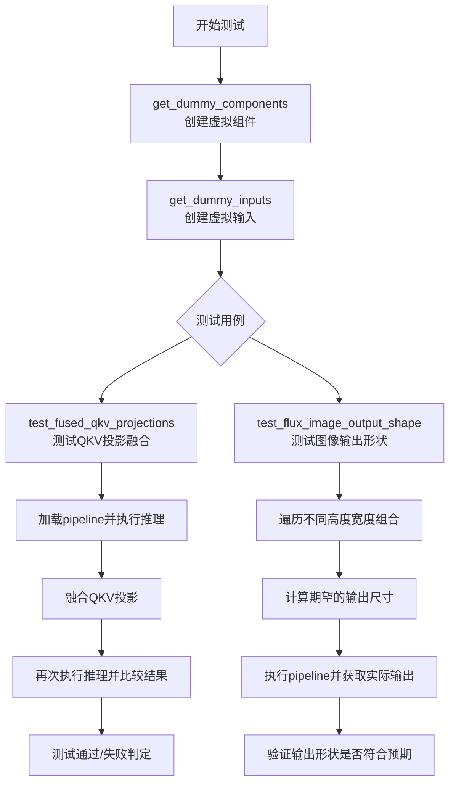
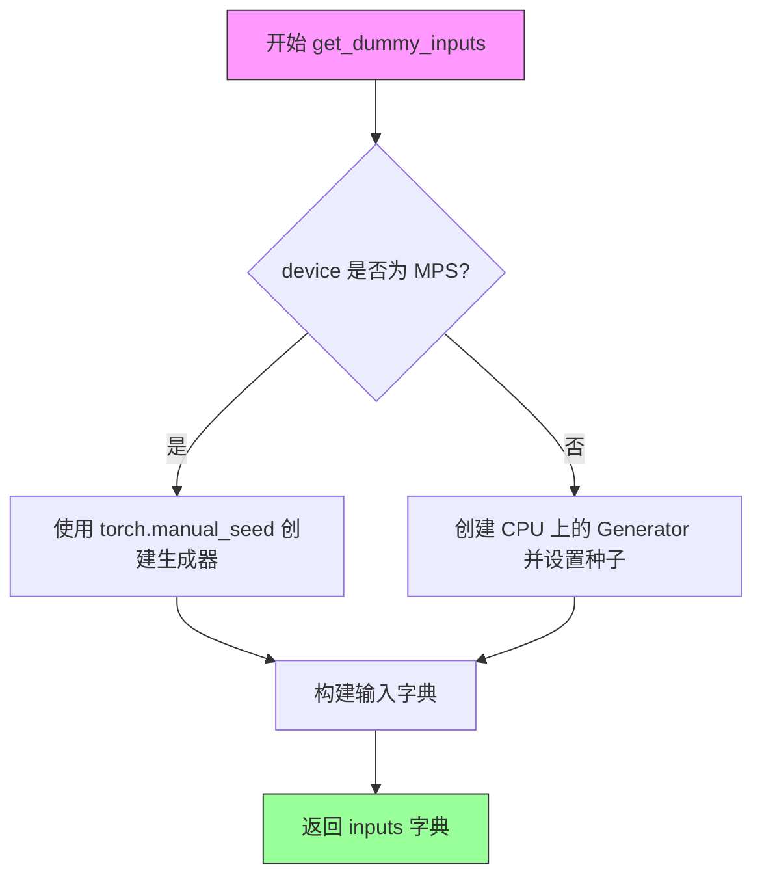
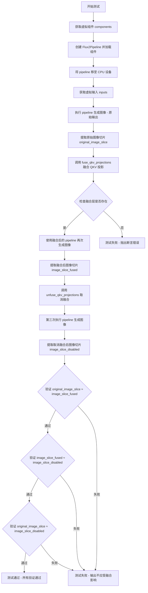

# `diffusers\tests\pipelines\flux2\test_pipeline_flux2.py` 详细设计文档

这是一个针对Flux2Pipeline（Flux 2图像生成pipeline）的单元测试文件，包含多个测试方法用于验证pipeline的组件配置、推理输入、QKV投影融合功能以及图像输出形状等核心功能。

## 整体流程



## 类结构

```
unittest.TestCase
└── Flux2PipelineFastTests (PipelineTesterMixin)
    ├── 字段: pipeline_class, params, batch_params
    ├── 字段: test_xformers_attention, test_layerwise_casting, test_group_offloading
    ├── 字段: supports_dduf
    └── 方法: get_dummy_components, get_dummy_inputs, test_fused_qkv_projections, test_flux_image_output_shape
```

## 全局变量及字段


### `Flux2PipelineFastTests.pipeline_class`
    
Flux2Pipeline类引用，用于指定被测试的管道类

类型：`type`
    


### `Flux2PipelineFastTests.params`
    
包含prompt/height/width/guidance_scale/prompt_embeds参数的frozenset类型，用于指定管道测试参数

类型：`frozenset`
    


### `Flux2PipelineFastTests.batch_params`
    
包含prompt参数的frozenset类型，用于指定批处理测试参数

类型：`frozenset`
    


### `Flux2PipelineFastTests.test_xformers_attention`
    
是否测试xformers注意力的bool类型标志

类型：`bool`
    


### `Flux2PipelineFastTests.test_layerwise_casting`
    
是否测试分层类型转换的bool类型标志

类型：`bool`
    


### `Flux2PipelineFastTests.test_group_offloading`
    
是否测试组卸载的bool类型标志

类型：`bool`
    


### `Flux2PipelineFastTests.supports_dduf`
    
是否支持DDUF的bool类型标志

类型：`bool`
    
    

## 全局函数及方法


### `Flux2PipelineFastTests.get_dummy_components`

该方法用于创建虚拟组件字典，为Flux2Pipeline测试提供所需的模拟组件，包括Transformer、文本编码器、Tokenizer、VAE和调度器等。

参数：

- `num_layers`：`int`，可选参数，默认值为1，控制Transformer模型的层数
- `num_single_layers`：`int`，可选参数，默认值为1，控制Transformer模型的单层数量

返回值：`dict`，返回一个包含scheduler、text_encoder、tokenizer、transformer和vae等虚拟组件的字典，用于测试目的

#### 流程图

```mermaid
flowchart TD
    A[开始] --> B[设置随机种子 torch.manual_seed(0)]
    B --> C[创建Flux2Transformer2DModel]
    C --> D[创建Mistral3Config]
    D --> E[设置随机种子 torch.manual_seed(0)]
    E --> F[创建Mistral3ForConditionalGeneration作为text_encoder]
    F --> G[从预训练模型加载AutoProcessor作为tokenizer]
    G --> H[设置随机种子 torch.manual_seed(0)]
    H --> I[创建AutoencoderKLFlux2作为vae]
    I --> J[创建FlowMatchEulerDiscreteScheduler作为scheduler]
    J --> K[组装组件到字典]
    K --> L[返回组件字典]
```

#### 带注释源码

```
def get_dummy_components(self, num_layers: int = 1, num_single_layers: int = 1):
    """
    创建虚拟组件字典用于测试
    
    参数:
        num_layers: Transformer模型的层数，默认1
        num_single_layers: Transformer模型的单层数量，默认1
    
    返回:
        包含测试所需虚拟组件的字典
    """
    # 设置随机种子以确保可重复性
    torch.manual_seed(0)
    
    # 创建虚拟Transformer模型
    transformer = Flux2Transformer2DModel(
        patch_size=1,
        in_channels=4,
        num_layers=num_layers,
        num_single_layers=num_single_layers,
        attention_head_dim=16,
        num_attention_heads=2,
        joint_attention_dim=16,
        timestep_guidance_channels=256,  # 硬编码在原始代码中
        axes_dims_rope=[4, 4, 4, 4],
    )

    # 创建Mistral3配置对象
    config = Mistral3Config(
        text_config={
            "model_type": "mistral",
            "vocab_size": 32000,
            "hidden_size": 16,
            "intermediate_size": 37,
            "max_position_embeddings": 512,
            "num_attention_heads": 4,
            "num_hidden_layers": 1,
            "num_key_value_heads": 2,
            "rms_norm_eps": 1e-05,
            "rope_theta": 1000000000.0,
            "sliding_window": None,
            "bos_token_id": 2,
            "eos_token_id": 3,
            "pad_token_id": 4,
        },
        vision_config={
            "model_type": "pixtral",
            "hidden_size": 16,
            "num_hidden_layers": 1,
            "num_attention_heads": 4,
            "intermediate_size": 37,
            "image_size": 30,
            "patch_size": 6,
            "num_channels": 3,
        },
        bos_token_id=2,
        eos_token_id=3,
        pad_token_id=4,
        model_dtype="mistral3",
        image_seq_length=4,
        vision_feature_layer=-1,
        image_token_index=1,
    )
    
    # 重新设置随机种子
    torch.manual_seed(0)
    
    # 创建虚拟文本编码器
    text_encoder = Mistral3ForConditionalGeneration(config)
    
    # 从预训练模型加载Tokenizer/Processor
    tokenizer = AutoProcessor.from_pretrained(
        "hf-internal-testing/Mistral-Small-3.1-24B-Instruct-2503-only-processor"
    )

    # 重新设置随机种子
    torch.manual_seed(0)
    
    # 创建虚拟VAE模型
    vae = AutoencoderKLFlux2(
        sample_size=32,
        in_channels=3,
        out_channels=3,
        down_block_types=("DownEncoderBlock2D",),
        up_block_types=("UpDecoderBlock2D",),
        block_out_channels=(4,),
        layers_per_block=1,
        latent_channels=1,
        norm_num_groups=1,
        use_quant_conv=False,
        use_post_quant_conv=False,
    )

    # 创建调度器
    scheduler = FlowMatchEulerDiscreteScheduler()

    # 返回包含所有虚拟组件的字典
    return {
        "scheduler": scheduler,
        "text_encoder": text_encoder,
        "tokenizer": tokenizer,
        "transformer": transformer,
        "vae": vae,
    }
```


### `Flux2PipelineFastTests.get_dummy_inputs`

该方法用于创建虚拟输入字典，为 Flux2Pipeline 单元测试提供测试数据。根据设备类型（MPS 或其他）采用不同的随机数生成策略，并返回包含提示词、生成器、推理步数、引导_scale、图像尺寸等参数的字典。

参数：

- `device`：`str`，目标设备，用于判断是否需要使用 MPS (Apple Silicon) 设备
- `seed`：`int`，随机种子，默认值为 0，用于确保测试的可重复性

返回值：`Dict[str, Any]`，包含以下键值的字典：
- `prompt`：字符串，测试用提示词
- `generator`：torch.Generator 或 None，随机数生成器
- `num_inference_steps`：整数，推理步数
- `guidance_scale`：浮点数，引导_scale
- `height`：整数，生成图像高度
- `width`：整数，生成图像宽度
- `max_sequence_length`：整数，最大序列长度
- `output_type`：字符串，输出类型
- `text_encoder_out_layers`：元组，文本编码器输出层

#### 流程图



#### 带注释源码

```python
def get_dummy_inputs(self, device, seed=0):
    """
    创建虚拟输入字典用于测试
    
    参数:
        device: 目标设备，用于判断是否使用 MPS
        seed: 随机种子，默认 0
    
    返回:
        包含测试参数的字典
    """
    # 判断设备类型：如果是 MPS (Apple Silicon) 设备
    if str(device).startswith("mps"):
        # MPS 设备使用 torch.manual_seed 直接设置种子
        generator = torch.manual_seed(seed)
    else:
        # 其他设备（如 CPU/CUDA）创建显式的 Generator 对象
        generator = torch.Generator(device="cpu").manual_seed(seed)
    
    # 构建测试用的输入参数字典
    inputs = {
        "prompt": "a dog is dancing",          # 文本提示词
        "generator": generator,                 # 随机生成器确保可重复性
        "num_inference_steps": 2,               # 扩散模型推理步数
        "guidance_scale": 5.0,                  # Classifier-free guidance 参数
        "height": 8,                            # 生成图像高度
        "width": 8,                             # 生成图像宽度
        "max_sequence_length": 8,               # 文本嵌入最大序列长度
        "output_type": "np",                    # 输出类型为 numpy 数组
        "text_encoder_out_layers": (1,),        # 文本编码器输出层索引
    }
    return inputs
```


### `Flux2PipelineFastTests.test_fused_qkv_projections`

该测试方法验证 Flux2Pipeline 中 QKV（Query、Key、Value）投影融合功能的正确性。测试通过比较融合前、融合后和取消融合后的输出来确保融合操作不会影响模型的推理结果，同时验证融合层是否正确创建。

参数：

- `self`：`Flux2PipelineFastTests`，测试类实例本身，包含测试所需的配置和方法

返回值：`None`，该方法为单元测试方法，通过 `assertTrue` 断言验证条件，不返回任何值

#### 流程图



#### 带注释源码

```python
def test_fused_qkv_projections(self):
    """
    测试 QKV 投影融合功能。
    验证融合操作不影响输出质量，且融合/取消融合操作可逆。
    """
    # 步骤1: 设置设备为 CPU，确保随机数生成器的确定性
    device = "cpu"  # ensure determinism for the device-dependent torch.Generator
    
    # 步骤2: 获取虚拟组件（transformer, vae, text_encoder, tokenizer, scheduler）
    components = self.get_dummy_components()
    
    # 步骤3: 使用虚拟组件创建 Flux2Pipeline 实例
    pipe = self.pipeline_class(**components)
    
    # 步骤4: 将 pipeline 移至指定设备（CPU）
    pipe = pipe.to(device)
    
    # 步骤5: 禁用进度条显示
    pipe.set_progress_bar_config(disable=None)

    # 步骤6: 获取虚拟输入参数（prompt, generator, num_inference_steps 等）
    inputs = self.get_dummy_inputs(device)
    
    # 步骤7: 第一次执行 pipeline，获取未融合 QKV 投影时的输出
    image = pipe(**inputs).images
    
    # 步骤8: 提取图像右下角 3x3 像素区域用于后续比较
    original_image_slice = image[0, -3:, -3:, -1]

    # 步骤9: 在 transformer 中融合 QKV 投影
    # 将分别的 Q、K、V 投影合并为单一的 QKV 投影以优化计算
    pipe.transformer.fuse_qkv_projections()
    
    # 步骤10: 验证融合层是否正确创建
    # check_qkv_fused_layers_exist 检查是否存在 'to_qkv' 融合层
    self.assertTrue(
        check_qkv_fused_layers_exist(pipe.transformer, ["to_qkv"]),
        ("Something wrong with the fused attention layers. Expected all the attention projections to be fused."),
    )

    # 步骤11: 使用融合后的 pipeline 第二次执行推理
    inputs = self.get_dummy_inputs(device)
    image = pipe(**inputs).images
    
    # 步骤12: 提取融合后的图像切片
    image_slice_fused = image[0, -3:, -3:, -1]

    # 步骤13: 取消 QKV 投影融合
    pipe.transformer.unfuse_qkv_projections()
    
    # 步骤14: 第三次执行 pipeline（取消融合后）
    inputs = self.get_dummy_inputs(device)
    image = pipe(**inputs).images
    
    # 步骤15: 提取取消融合后的图像切片
    image_slice_disabled = image[0, -3:, -3:, -1]

    # 步骤16: 验证融合前后输出一致（容差 1e-3）
    # 确保 QKV 融合不会改变模型的输出结果
    self.assertTrue(
        np.allclose(original_image_slice, image_slice_fused, atol=1e-3, rtol=1e-3),
        ("Fusion of QKV projections shouldn't affect the outputs."),
    )
    
    # 步骤17: 验证融合与取消融合后输出一致
    # 确保融合操作完全可逆
    self.assertTrue(
        np.allclose(image_slice_fused, image_slice_disabled, atol=1e-3, rtol=1e-3),
        ("Outputs, with QKV projection fusion enabled, shouldn't change when fused QKV projections are disabled."),
    )
    
    # 步骤18: 验证原始输出与取消融合后输出一致（容差 1e-2，较宽松）
    self.assertTrue(
        np.allclose(original_image_slice, image_slice_disabled, atol=1e-2, rtol=1e-2),
        ("Original outputs should match when fused QKV projections are disabled."),
    )
```


### `Flux2PipelineFastTests.test_flux_image_output_shape`

验证 Flux2Pipeline 在不同输入尺寸下产生的图像输出形状是否符合预期（考虑 VAE 缩放因子和 2 倍下采样的影响）。

参数：

- `self`：隐式参数，测试类实例本身

返回值：无返回值（测试方法，通过 `self.assertEqual` 断言验证形状正确性）

#### 流程图

```mermaid
flowchart TD
    A[开始测试] --> B[创建Flux2Pipeline实例并移至torch_device]
    C[获取dummy_inputs] --> B
    B --> D[定义测试尺寸对: (32,32) 和 (72,57)]
    D --> E{还有未测试的尺寸对?}
    E -->|是| F[取出当前尺寸对 height, width]
    F --> G[计算期望高度: expected_height = height - height % (vae_scale_factor * 2)]
    H[计算期望宽度: expected_width = width - width % (vae_scale_factor * 2)]
    G --> H
    H --> I[更新inputs字典中的height和width]
    I --> J[调用pipe执行推理获取图像]
    J --> K[从图像数组中获取output_height和output_width]
    K --> L[断言: output_shape == expected_shape]
    L --> E
    E -->|否| M[测试结束]
```

#### 带注释源码

```python
def test_flux_image_output_shape(self):
    """
    测试 Flux2Pipeline 图像输出形状的正确性。
    验证在不同输入尺寸下，输出图像的形状考虑了 VAE 缩放因子和 2 倍下采样的影响。
    """
    # 创建 Flux2Pipeline 实例并移至计算设备
    # 使用 get_dummy_components() 获取虚拟组件（transformer, vae, text_encoder 等）
    pipe = self.pipeline_class(**self.get_dummy_components()).to(torch_device)
    
    # 获取虚拟输入参数，包括 prompt、generator、num_inference_steps 等
    inputs = self.get_dummy_inputs(torch_device)

    # 定义测试用的 (height, width) 尺寸对列表
    # 32x32: 标准尺寸
    # 72x57: 非对称尺寸，用于测试边界情况
    height_width_pairs = [(32, 32), (72, 57)]
    
    # 遍历每一组尺寸进行测试
    for height, width in height_width_pairs:
        # 计算期望的输出高度：减去不能被 vae_scale_factor * 2 整除的余数
        # VAE 通常有下采样因子（如 8），管道可能额外有 2 倍下采样
        # 这里假设总下采样因子为 vae_scale_factor * 2
        expected_height = height - height % (pipe.vae_scale_factor * 2)
        
        # 计算期望的输出宽度（与高度相同的逻辑）
        expected_width = width - width % (pipe.vae_scale_factor * 2)

        # 更新输入参数字典中的高度和宽度
        inputs.update({"height": height, "width": width})
        
        # 调用 pipeline 执行推理，返回包含图像的结果对象
        # 访问 .images[0] 获取第一张图像（numpy 数组格式）
        image = pipe(**inputs).images[0]
        
        # 从图像数组中提取输出的高度和宽度（图像为 HWC 格式）
        output_height, output_width, _ = image.shape
        
        # 断言验证输出形状是否与期望形状匹配
        # 如果不匹配，抛出详细的错误信息包含实际和期望的形状
        self.assertEqual(
            (output_height, output_width),
            (expected_height, expected_width),
            f"Output shape {image.shape} does not match expected shape {(expected_height, expected_width)}",
        )
```

## 关键组件


### Flux2Pipeline

主pipeline类，负责协调各个组件完成图像生成任务，包含文本编码、Transformer去噪和VAE解码的完整流程。

### Flux2Transformer2DModel

Transformer模型，继承自Diffusers的Transformer2DModel，用于去噪过程的核心计算，支持QKV投影融合优化。

### AutoencoderKLFlux2

变分自编码器模型，负责将图像编码到潜在空间以及从潜在空间解码回图像，支持量化相关配置。

### Mistral3ForConditionalGeneration

文本编码器，基于Mistral3配置的多模态模型，用于将文本提示编码为embedding向量。

### FlowMatchEulerDiscreteScheduler

调度器，实现基于Flow Match的欧拉离散调度，用于控制去噪过程的噪声调度。

### AutoProcessor

处理器，用于预处理输入数据（包括文本和图像），从预训练模型加载。

### get_dummy_components方法

创建虚拟组件用于测试，初始化Transformer、文本编码器、VAE、调度器等关键组件的测试配置。

### get_dummy_inputs方法

生成测试用的虚拟输入数据，包括提示词、随机生成器、推理步数、引导 scale 等参数。

### test_fused_qkv_projections

测试QKV投影融合功能，验证融合后的输出与未融合时一致，确保融合不影响生成结果。

### test_flux_image_output_shape

测试pipeline输出图像形状，验证输出高度和宽度是否符合VAE缩放因子的对齐要求。

### 张量索引操作

代码中使用 `image[0, -3:, -3:, -1]` 进行张量切片操作，获取图像的最后3x3区域用于输出对比。

### 量化配置

VAE组件中 `use_quant_conv=False` 和 `use_post_quant_conv=False` 参数表明当前禁用了量化相关卷积层。

### 设备兼容性处理

代码对 MPS 设备特殊处理，使用 `torch.manual_seed` 而非 `torch.Generator` 以确保兼容性。

### VAE缩放因子

通过 `pipe.vae_scale_factor` 获取VAE的缩放因子，用于计算输出图像尺寸的对齐。


## 问题及建议


### 已知问题

-   **硬编码的配置值**：`timestep_guidance_channels=256` 带有 "Hardcoded in original code" 注释，表明该值应该在配置中参数化而非硬编码
-   **设备处理不一致**：测试代码中混合使用了 `torch_device` 和硬编码的 `"cpu"` 设备（如 `device = "cpu"`），导致测试行为可能与预期不符
-   **TODO 待办项**：`test_fused_qkv_projections` 方法中存在 TODO 注释，表明 `fuse_qkv_projections()` 的 pipeline 级实现需要重构
-   **测试覆盖不足**：`test_flux_image_output_shape` 仅测试了两种 height/width 组合，缺乏边界情况和更多参数组合的测试
-   **MPS 设备特殊处理**：`get_dummy_inputs` 方法中对 MPS 设备进行了特殊判断和处理，增加了代码复杂度和潜在的平台兼容性问题
-   **数值容差设置不一致**：在 `test_fused_qkv_projections` 中使用了不同的容差值（`atol=1e-3, rtol=1e-3` 和 `atol=1e-2, rtol=1e-2`），缺乏明确的说明
-   **缺少错误处理测试**：没有对无效输入（如负数尺寸、非法的 guidance_scale 等）的测试用例
-   **外部依赖风险**：`AutoProcessor.from_pretrained` 依赖于远程模型 "hf-internal-testing/Mistral-Small-3.1-24B-Instruct-2503-only-processor"，若该模型不可用会导致测试失败

### 优化建议

-   将 `timestep_guidance_channels` 等硬编码值提取为配置参数或常量
-   统一设备管理，所有测试使用相同的设备选择逻辑
-   补充更多测试用例，包括边界条件、错误输入处理和多种参数组合
-   移除 MPS 设备的特殊处理逻辑，或将其封装为独立的辅助方法
-   为数值容差添加注释说明，解释为何不同断言使用不同的容差值
-   考虑使用本地 mock 或 fixture 替代远程预训练模型依赖，提高测试的独立性和稳定性
-   补充测试文档，说明各测试用例的设计意图和预期行为

## 其它


### 设计目标与约束

本测试类的设计目标是验证Flux2Pipeline在各种配置下的功能正确性，包括QKV投影融合、图像输出形状处理等核心功能。设计约束包括：仅支持CPU设备以确保确定性，测试使用虚拟组件而非真实模型以保持测试速度，限制推理步数为2以加快测试执行，并禁用xformers注意力优化以确保测试一致性。

### 错误处理与异常设计

代码主要依赖unittest框架的标准断言机制进行错误检测。关键检查点包括：QKV融合层存在性验证使用`check_qkv_fused_layers_exist`函数；数值精度比较使用`np.allclose`并设置合理的atol和rtol阈值；输出形状验证使用`assertEqual`进行精确匹配。当测试失败时，unittest会自动捕获并报告详细的差异信息。

### 数据流与状态机

测试数据流遵循以下路径：首先通过`get_dummy_components`创建虚拟组件字典，然后通过`get_dummy_inputs`生成虚拟输入参数，最后调用pipeline的`__call__`方法执行推理。对于QKV融合测试，流程为：基础推理→融合QKV→融合后推理→取消融合→恢复推理，每个阶段都保存输出用于比较验证。

### 外部依赖与接口契约

代码依赖以下核心外部库：numpy用于数值比较，torch用于张量操作，transformers库提供Mistral3文本编码器配置和处理，diffusers库提供Flux2Pipeline、Flux2Transformer2DModel、AutoencoderKLFlux2等核心组件。测试还依赖项目内部的testing_utils模块和test_pipelines_common模块。

### 配置与参数说明

关键配置参数包括：patch_size=1和in_channels=4用于Transformer配置；num_layers和num_single_layers控制层数；attention_head_dim=16和num_attention_heads=2控制注意力机制；guidance_scale=5.0控制引导强度；num_inference_steps=2设置推理步数；height和width控制输出图像尺寸；max_sequence_length=8限制序列长度。

### 测试策略与覆盖率

测试采用黑盒验证策略，通过检查输出来验证功能正确性。覆盖场景包括：融合QKV投影的功能正确性验证、多种输出尺寸的形状验证、VAE缩放因子的隐式测试。测试标志包括test_xformers_attention=False、test_layerwise_casting=True、test_group_offloading=True，用于控制特定测试行为。

### 性能考虑与基准

测试设计优先考虑执行速度而非真实性能，使用极少的推理步数（2步）和虚拟组件。设备使用CPU确保测试确定性，避免GPU相关的不稳定性。生成器固定种子确保结果可复现。

### 版本兼容性与迁移说明

代码引用了TODO注释，表明QKV融合功能未来可能从模型级别迁移到管道级别。timestep_guidance_channels=256在注释中标明为硬编码值，未来可能需要参数化。test_group_offloading=True表明支持模型组卸载功能。

### 安全考虑

测试代码本身不涉及敏感数据处理，主要关注功能验证。生成的虚拟输入使用固定的随机种子，确保测试的可重复性和安全性。

### 部署与运行环境要求

运行环境需要安装torch、numpy、transformers和diffusers库。设备支持包括CPU和MPS（Apple Silicon），代码中通过`str(device).startswith("mps")`进行了特殊处理。测试可以通过pytest或python -m unittest执行。

    