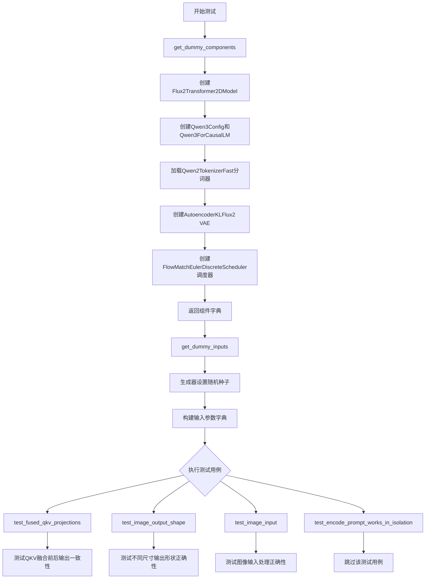
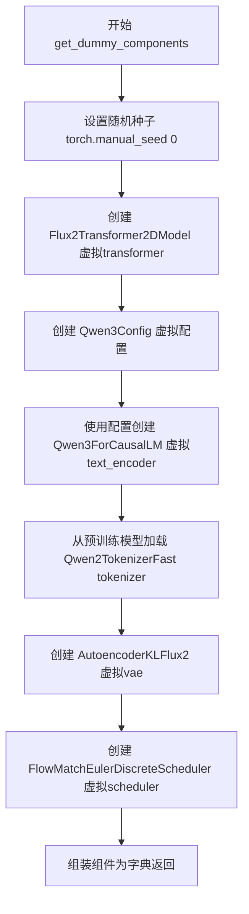
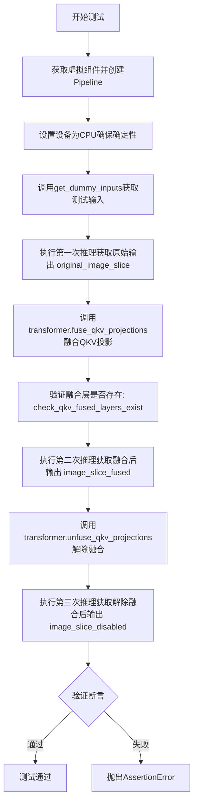
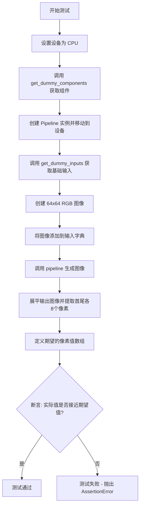
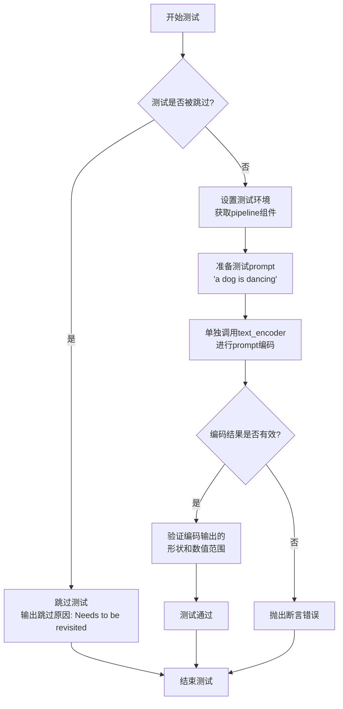
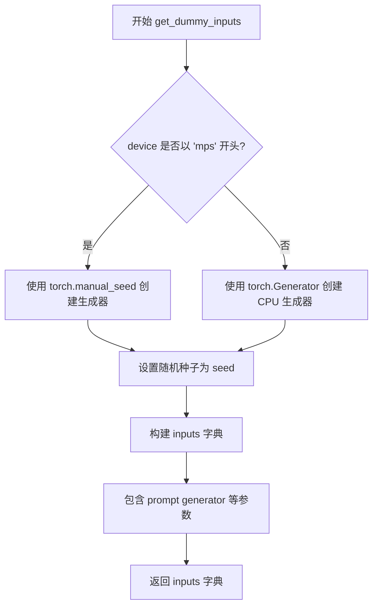
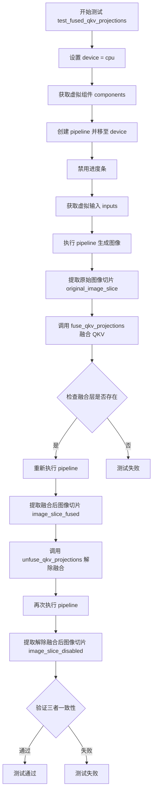
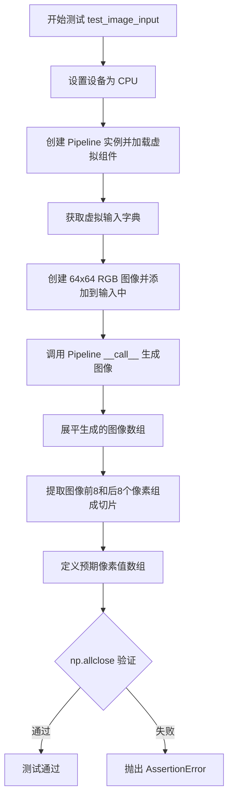
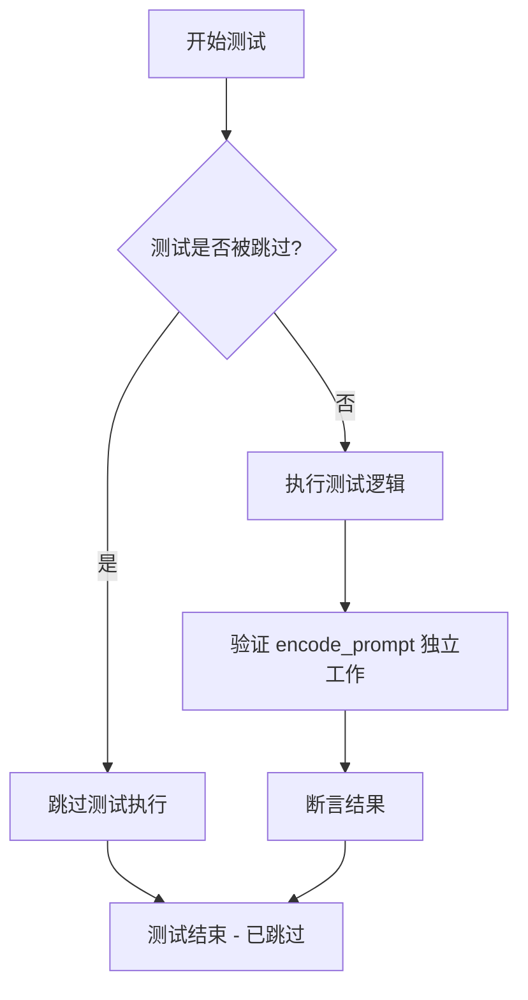

# `diffusers\tests\pipelines\flux2\test_pipeline_flux2_klein.py` 详细设计文档

这是一个Flux2KleinPipeline的单元测试文件，用于测试图像生成管道的各项功能，包括QKV投影融合、输出图像形状验证和图像输入处理等核心功能。

## 整体流程



## 类结构

```
unittest.TestCase
└── Flux2KleinPipelineFastTests (继承PipelineTesterMixin)
    ├── get_dummy_components()
    ├── get_dummy_inputs()
    ├── test_fused_qkv_projections()
    ├── test_image_output_shape()
    ├── test_image_input()
    └── test_encode_prompt_works_in_isolation()
```

## 全局变量及字段


### `unittest`
    
单元测试框架模块

类型：`module`
    


### `np`
    
NumPy数值计算库

类型：`module`
    


### `torch`
    
PyTorch深度学习框架

类型：`module`
    


### `Image`
    
PIL图像处理类

类型：`class`
    


### `Qwen2TokenizerFast`
    
Qwen2快速分词器

类型：`class`
    


### `Qwen3Config`
    
Qwen3模型配置类

类型：`class`
    


### `Qwen3ForCausalLM`
    
Qwen3因果语言模型

类型：`class`
    


### `AutoencoderKLFlux2`
    
Flux2变分自编码器

类型：`class`
    


### `FlowMatchEulerDiscreteScheduler`
    
Flow Match欧拉离散调度器

类型：`class`
    


### `Flux2KleinPipeline`
    
Flux2克莱因管道

类型：`class`
    


### `Flux2Transformer2DModel`
    
Flux2二维Transformer模型

类型：`class`
    


### `torch_device`
    
测试设备标识

类型：`str`
    


### `PipelineTesterMixin`
    
管道测试混入类

类型：`class`
    


### `check_qkv_fused_layers_exist`
    
检查QKV融合层存在性

类型：`function`
    


### `Flux2KleinPipelineFastTests.pipeline_class`
    
Flux2KleinPipeline管道类

类型：`type`
    


### `Flux2KleinPipelineFastTests.params`
    
包含prompt/height/width/guidance_scale/prompt_embeds等参数

类型：`frozenset`
    


### `Flux2KleinPipelineFastTests.batch_params`
    
包含prompt批处理参数

类型：`frozenset`
    


### `Flux2KleinPipelineFastTests.test_xformers_attention`
    
xformers注意力测试标志

类型：`bool`
    


### `Flux2KleinPipelineFastTests.test_layerwise_casting`
    
层级别类型转换测试标志

类型：`bool`
    


### `Flux2KleinPipelineFastTests.test_group_offloading`
    
组卸载测试标志

类型：`bool`
    


### `Flux2KleinPipelineFastTests.supports_dduf`
    
DUD支持标志

类型：`bool`
    
    

## 全局函数及方法


### `Flux2KleinPipelineFastTests.get_dummy_components`

该方法用于创建测试用虚拟组件（Transformer、TextEncoder、Tokenizer、VAE、Scheduler），返回一个包含所有 pipeline 组件的字典，供单元测试使用。

参数：

- `num_layers`：`int`，可选，默认值为 `1`，控制 Transformer 模型的层数
- `num_single_layers`：`int`，可选，默认值为 `1`，控制 Transformer 模型的单层数量

返回值：`Dict[str, Any]`，返回包含 `scheduler`、`text_encoder`、`tokenizer`、`transformer`、`vae` 五个组件的字典，用于初始化 `Flux2KleinPipeline` 进行测试

#### 流程图



#### 带注释源码

```python
def get_dummy_components(self, num_layers: int = 1, num_single_layers: int = 1):
    """
    创建测试用虚拟组件
    
    参数:
        num_layers: Transformer模型层数，默认1
        num_single_layers: Transformer单层数，默认1
    
    返回:
        包含scheduler、text_encoder、tokenizer、transformer、vae的字典
    """
    # 设置随机种子确保测试可重复性
    torch.manual_seed(0)
    
    # 创建虚拟Transformer模型（Flux2Transformer2DModel）
    # 用于测试扩散模型的变换器骨干网络
    transformer = Flux2Transformer2DModel(
        patch_size=1,
        in_channels=4,
        num_layers=num_layers,
        num_single_layers=num_single_layers,
        attention_head_dim=16,
        num_attention_heads=2,
        joint_attention_dim=16,
        timestep_guidance_channels=256,
        axes_dims_rope=[4, 4, 4, 4],
        guidance_embeds=False,
    )

    # 创建最小化的Qwen3配置
    # 用于文本编码器的虚拟配置
    config = Qwen3Config(
        intermediate_size=16,
        hidden_size=16,
        num_hidden_layers=2,
        num_attention_heads=2,
        num_key_value_heads=2,
        vocab_size=151936,
        max_position_embeddings=512,
    )
    
    # 使用配置创建虚拟文本编码器Qwen3ForCausalLM
    torch.manual_seed(0)
    text_encoder = Qwen3ForCausalLM(config)

    # 加载预训练的分词器用于测试
    # 使用tiny-random模型以加快测试速度
    tokenizer = Qwen2TokenizerFast.from_pretrained(
        "hf-internal-testing/tiny-random-Qwen2VLForConditionalGeneration"
    )

    # 创建虚拟VAE模型（AutoencoderKLFlux2）
    # 用于图像的编码和解码
    torch.manual_seed(0)
    vae = AutoencoderKLFlux2(
        sample_size=32,
        in_channels=3,
        out_channels=3,
        down_block_types=("DownEncoderBlock2D",),
        up_block_types=("UpDecoderBlock2D",),
        block_out_channels=(4,),
        layers_per_block=1,
        latent_channels=1,
        norm_num_groups=1,
        use_quant_conv=False,
        use_post_quant_conv=False,
    )

    # 创建调度器用于扩散过程的时间步调度
    scheduler = FlowMatchEulerDiscreteScheduler()

    # 返回包含所有组件的字典
    return {
        "scheduler": scheduler,
        "text_encoder": text_encoder,
        "tokenizer": tokenizer,
        "transformer": transformer,
        "vae": vae,
    }
```


### `Flux2KleinPipelineFastTests.get_dummy_inputs`

该方法用于构建 Flux2KleinPipeline 的测试用虚拟输入参数，根据设备类型（MPS 或其他）创建适当随机数生成器，并返回包含 prompt、generator、推理步数、引导 scale、图像尺寸等完整输入字典，用于管道测试。

参数：

- `self`：`Flux2KleinPipelineFastTests`，测试类实例本身
- `device`：`str`，目标设备标识，用于判断是否为 MPS 设备
- `seed`：`int`，随机种子，默认为 0，用于控制生成器的随机性

返回值：`Dict[str, Any]`，包含测试所需的所有输入参数的字典

#### 流程图

```mermaid
flowchart TD
    A[开始 get_dummy_inputs] --> B{device 是否以 'mps' 开头?}
    B -->|是| C[使用 torch.manual_seed(seed)]
    B -->|否| D[创建 torch.Generator device='cpu']
    C --> E[generator = 随机种子]
    D --> F[generator.manual_seed(seed)]
    E --> G[构建 inputs 字典]
    F --> G
    G --> H[返回 inputs 字典]
    
    G --> G1[prompt: 'a dog is dancing']
    G --> G2[generator: 随机生成器]
    G --> G3[num_inference_steps: 2]
    G --> G4[guidance_scale: 4.0]
    G --> G5[height: 8]
    G --> G6[width: 8]
    G --> G7[max_sequence_length: 64]
    G --> G8[output_type: 'np']
    G --> G9[text_encoder_out_layers: (1,)]
```

#### 带注释源码

```python
def get_dummy_inputs(self, device, seed=0):
    """
    构建用于 Flux2KleinPipeline 测试的虚拟输入参数。
    
    参数:
        device: 目标设备标识，用于判断是否为 MPS 设备
        seed: 随机种子，用于控制生成器的随机性
    
    返回:
        包含测试所需所有输入参数的字典
    """
    
    # 判断是否为 MPS (Apple Silicon) 设备
    if str(device).startswith("mps"):
        # MPS 设备使用 torch.manual_seed() 直接设置种子
        # 返回一个 torch.Generator 对象
        generator = torch.manual_seed(seed)
    else:
        # 其他设备（如 CPU、CUDA）创建明确的 Generator 对象
        # 固定使用 CPU 设备以确保测试的可重复性
        generator = torch.Generator(device="cpu").manual_seed(seed)

    # 构建完整的输入参数字典
    inputs = {
        "prompt": "a dog is dancing",              # 文本提示词
        "generator": generator,                     # 随机数生成器
        "num_inference_steps": 2,                   # 推理步数（测试用最小值）
        "guidance_scale": 4.0,                      # CFG 引导强度
        "height": 8,                                # 生成图像高度
        "width": 8,                                 # 生成图像宽度
        "max_sequence_length": 64,                  # 文本编码器最大序列长度
        "output_type": "np",                        # 输出类型为 NumPy 数组
        "text_encoder_out_layers": (1,),            # 文本编码器输出层索引元组
    }
    
    return inputs
```


### `Flux2KleinPipelineFastTests.test_fused_qkv_projections`

该测试方法用于验证 Flux2KleinPipeline 中 QKV（Query-Key-Value）投影融合功能对输出一致性的影响，通过对比融合前后的图像输出，确认融合操作不会改变模型的计算结果。

参数：

- 该方法无显式参数（使用类实例方法和 `self`）

返回值：`None`，通过 `unittest` 断言验证功能正确性

#### 流程图



#### 带注释源码

```python
def test_fused_qkv_projections(self):
    """
    测试QKV投影融合功能对输出一致性的影响
    
    该测试验证：
    1. QKV投影融合后输出与原始输出一致
    2. 融合后再解除融合输出与融合输出一致
    3. 原始输出与解除融合后输出一致
    """
    # 使用CPU设备确保确定性，避免GPU随机性影响测试结果
    device = "cpu"
    
    # 获取虚拟组件（transformer, vae, text_encoder, tokenizer, scheduler）
    components = self.get_dummy_components()
    
    # 创建Pipeline实例并移动到指定设备
    pipe = self.pipeline_class(**components)
    pipe = pipe.to(device)
    
    # 禁用进度条以确保测试输出一致性
    pipe.set_progress_bar_config(disable=None)

    # 获取测试输入：包含prompt、generator、推理步数等参数
    inputs = self.get_dummy_inputs(device)
    
    # 第一次推理：获取原始（未融合）输出
    image = pipe(**inputs).images
    # 提取图像右下角3x3区域用于对比（减少对比数据量）
    original_image_slice = image[0, -3:, -3:, -1]

    # 执行QKV投影融合：将分离的Q、K、V投影合并为单一投影
    pipe.transformer.fuse_qkv_projections()
    
    # 验证融合操作成功：检查融合层是否存在
    self.assertTrue(
        check_qkv_fused_layers_exist(pipe.transformer, ["to_qkv"]),
        ("Something wrong with the fused attention layers. Expected all the attention projections to be fused."),
    )

    # 第二次推理：获取融合后的输出
    inputs = self.get_dummy_inputs(device)  # 重新获取输入以确保一致性
    image = pipe(**inputs).images
    image_slice_fused = image[0, -3:, -3:, -1]

    # 解除QKV投影融合：恢复分离的Q、K、V投影
    pipe.transformer.unfuse_qkv_projections()
    
    # 第三次推理：获取解除融合后的输出
    inputs = self.get_dummy_inputs(device)
    image = pipe(**inputs).images
    image_slice_disabled = image[0, -3:, -3:, -1]

    # 断言1：融合前后输出应一致（容差1e-3）
    self.assertTrue(
        np.allclose(original_image_slice, image_slice_fused, atol=1e-3, rtol=1e-3),
        ("Fusion of QKV projections shouldn't affect the outputs."),
    )
    
    # 断言2：融合与解除融合输出应一致（容差1e-3）
    self.assertTrue(
        np.allclose(image_slice_fused, image_slice_disabled, atol=1e-3, rtol=1e-3),
        ("Outputs, with QKV projection fusion enabled, shouldn't change when fused QKV projections are disabled."),
    )
    
    # 断言3：原始输出与解除融合输出一致（容差1e-2，稍宽松）
    self.assertTrue(
        np.allclose(original_image_slice, image_slice_disabled, atol=1e-2, rtol=1e-2),
        ("Original outputs should match when fused QKV projections are disabled."),
    )
```


### `Flux2KleinPipelineFastTests.test_image_output_shape`

该测试方法用于验证 Flux2KleinPipeline 在不同尺寸输入下的输出形状正确性，通过测试 (32,32) 和 (72,57) 两种尺寸对，确保输出图像的高度和宽度符合 VAE 缩放因子的对齐要求。

参数：

- `self`：`Flux2KleinPipelineFastTests` 类型，测试类实例本身

返回值：`None`，该方法为单元测试方法，通过 `assertEqual` 断言验证输出形状，无显式返回值

#### 流程图

```mermaid
flowchart TD
    A[开始测试] --> B[创建 Pipeline 实例并移至设备]
    C[获取测试输入参数] --> D[定义测试尺寸对: (32,32) 和 (72,57)]
    D --> E{遍历尺寸对}
    E -->|当前尺寸对| F[计算期望高度和宽度]
    F --> G[更新输入参数的 height 和 width]
    G --> H[执行 Pipeline 推理获取图像]
    H --> I[从输出图像中提取实际高度和宽度]
    I --> J{断言: 实际尺寸 == 期望尺寸?}
    J -->|是| K{是否还有更多尺寸对?}
    J -->|否| L[抛出 AssertionError 报告不匹配详情]
    K -->|是| E
    K -->|否| M[测试通过]
    
    style L fill:#ffcccc
    style M fill:#ccffcc
```

#### 带注释源码

```python
def test_image_output_shape(self):
    """
    测试不同尺寸输入对应的输出形状正确性
    
    测试逻辑：
    1. 创建 Flux2KleinPipeline 管道实例
    2. 定义两组测试尺寸：(32,32) 和 (72,57)
    3. 对每组尺寸计算期望的输出尺寸（考虑 VAE 缩放因子和填充对齐）
    4. 执行管道推理并验证输出图像尺寸与期望尺寸匹配
    """
    # 创建 Pipeline 实例并移至测试设备（CPU 或 CUDA）
    pipe = self.pipeline_class(**self.get_dummy_components()).to(torch_device)
    
    # 获取默认的测试输入参数
    inputs = self.get_dummy_inputs(torch_device)

    # 定义测试用的尺寸对列表
    height_width_pairs = [(32, 32), (72, 57)]
    
    # 遍历每组尺寸进行测试
    for height, width in height_width_pairs:
        # 计算期望的输出高度和宽度
        # 公式：height - height % (pipe.vae_scale_factor * 2)
        # 解释：输出尺寸需要按 vae_scale_factor * 2 的倍数对齐（通常是 16 的倍数）
        expected_height = height - height % (pipe.vae_scale_factor * 2)
        expected_width = width - width % (pipe.vae_scale_factor * 2)

        # 更新输入参数中的高度和宽度
        inputs.update({"height": height, "width": width})
        
        # 执行管道推理，获取生成的图像
        # pipe(**inputs) 返回 PipelineOutput 对象，包含 .images 属性
        image = pipe(**inputs).images[0]
        
        # 从输出图像中提取实际的高度和宽度（图像为 HWC 格式）
        output_height, output_width, _ = image.shape
        
        # 断言验证输出形状是否与期望形状匹配
        self.assertEqual(
            (output_height, output_width),
            (expected_height, expected_width),
            f"Output shape {image.shape} does not match expected shape {(expected_height, expected_width)}",
        )
```


### `Flux2KleinPipelineFastTests.test_image_input`

该测试函数用于验证 Flux2KleinPipeline 管道对输入图像的处理能力。测试创建一个 64x64 的 RGB 图像作为输入，传递给管道生成图像，然后验证输出的图像数据切片是否与预期值匹配。

参数：

- `self`：隐含参数，测试类实例本身

返回值：无返回值（测试函数，使用 `assert` 断言验证结果）

#### 流程图



#### 带注释源码

```python
def test_image_input(self):
    """测试管道对输入图像的处理能力"""
    # 1. 设置设备为 CPU（确保确定性行为）
    device = "cpu"
    
    # 2. 创建管道实例，使用虚拟组件
    pipe = self.pipeline_class(**self.get_dummy_components()).to(device)
    
    # 3. 获取虚拟输入参数
    inputs = self.get_dummy_inputs(device)
    
    # 4. 创建一个 64x64 的 RGB 测试图像
    # Image.new("RGB", (64, 64)) 创建一个空的RGB图像
    inputs["image"] = Image.new("RGB", (64, 64))
    
    # 5. 调用管道进行推理，获取生成的图像
    # pipe(**inputs) 会返回包含 images 属性的对象
    image = pipe(**inputs).images.flatten()
    
    # 6. 提取图像的前8个和后8个像素值，组成16个值的切片
    # 用于与预期值进行比对
    generated_slice = np.concatenate([image[:8], image[-8:]])
    
    # 7. 定义期望的像素值数组（来自已知正确输出）
    # fmt: off
    expected_slice = np.array(
        [
            0.8255048 , 0.66054785, 0.6643694 , 0.67462724, 
            0.5494932 , 0.3480271 , 0.52535003, 0.44510138, 
            0.23549396, 0.21372932, 0.21166152, 0.63198495, 
            0.49942136, 0.39147034, 0.49156153, 0.3916
        ]
    )
    # fmt: on
    
    # 8. 验证生成的图像切片是否与期望值匹配
    # 使用 np.allclose 进行近似比较（容差为 1e-4 相对误差和绝对误差）
    assert np.allclose(expected_slice, generated_slice, atol=1e-4, rtol=1e-4)
```


### `Flux2KleinPipelineFastTests.test_encode_prompt_works_in_isolation`

该测试方法用于验证提示编码器（prompt encoder）在隔离环境下能够正确工作，即单独测试文本编码功能而不依赖完整的扩散管道流程。当前该测试被跳过，标记为"Needs to be revisited"，需要后续重新审视和完善。

参数：

- `self`：`Flux2KleinPipelineFastTests`（隐式参数），表示测试类实例本身

返回值：`None`，该方法不返回任何值（方法体仅为 `pass`）

#### 流程图



#### 带注释源码

```python
@unittest.skip("Needs to be revisited")  # 跳过装饰器，标记该测试需要后续重新审视
def test_encode_prompt_works_in_isolation(self):
    """
    测试提示编码器在隔离环境下工作。
    
    该测试方法旨在验证 Flux2KleinPipeline 中的 text_encoder 
    组件能够独立于完整的扩散管道流程，正确地对文本提示进行编码。
    测试内容应包括：
    1. 验证编码输出的形状是否符合预期
    2. 验证编码输出的数值范围是否合理
    3. 验证不同prompt产生的编码向量之间的差异性
    4. 验证编码器对空字符串或特殊字符的处理
    
    当前实现：方法体为空（pass），测试被跳过
    原因：需要重新审视测试逻辑和预期行为
    """
    pass  # 测试方法占位符，实际测试逻辑待实现
```

#### 上下文信息

**所属类详细信息**：

- **类名**：`Flux2KleinPipelineFastTests`
- **父类**：`PipelineTesterMixin`, `unittest.TestCase`
- **核心功能**：针对 Flux2KleinPipeline 的单元测试类，包含多个测试方法验证管道的各个功能模块
- **关键属性**：
  - `pipeline_class`：指定测试的管道类为 `Flux2KleinPipeline`
  - `params`：管道参数集合 `frozenset(["prompt", "height", "width", "guidance_scale", "prompt_embeds"])`
  - `batch_params`：批处理参数集合 `frozenset(["prompt"])`
  - `test_xformers_attention`：是否测试 xformers 注意力机制（默认 False）
  - `test_layerwise_casting`：是否测试逐层类型转换（默认 True）
  - `test_group_offloading`：是否测试组卸载（默认 True）
  - `supports_dduf`：是否支持 DDUF（默认 False）

**相关方法**：

- `get_dummy_components(num_layers, num_single_layers)`：创建测试用的虚拟组件，包括 transformer、text_encoder(Qwen3ForCausalLM)、tokenizer(Qwen2TokenizerFast)、vae(AutoencoderKLFlux2) 和 scheduler(FlowMatchEulerDiscreteScheduler)
- `get_dummy_inputs(device, seed)`：生成测试输入参数
- `test_fused_qkv_projections()`：测试 QKV 投影融合功能
- `test_image_output_shape()`：测试图像输出形状
- `test_image_input()`：测试图像输入功能

#### 技术债务与优化空间

1. **未实现的测试方法**：`test_encode_prompt_works_in_isolation` 目前仅为占位符，需要完整实现以验证提示编码器的隔离工作能力
2. **跳过标记的临时性**：使用 `@unittest.skip` 装饰器跳过测试，应在后续迭代中完成测试逻辑并移除跳过标记
3. **缺少边界情况测试**：待实现的测试应覆盖空 prompt、极长 prompt、特殊字符、 multilingual prompt 等边界情况

#### 设计目标与约束

- **设计目标**：验证 text_encoder 组件能够独立于 VAE、transformer 等其他管道组件正确执行文本编码任务
- **约束条件**：测试应在 CPU 设备上运行以确保确定性结果

#### 外部依赖与接口契约

- 依赖 `Qwen3ForCausalLM` 文本编码器模型
- 依赖 `Qwen2TokenizerFast` 分词器
- 接口契约：编码器应接受文本 prompt 并返回固定维度的文本嵌入向量


### `Flux2KleinPipelineFastTests.get_dummy_components`

该方法用于创建虚拟（dummy）组件字典，以便在测试 Flux2KleinPipeline 时使用。它初始化并返回一个包含调度器、文本编码器、分词器、Transformer 模型和 VAE 的字典，所有组件都使用最小的配置以加快测试速度。

参数：

- `num_layers`：`int`，默认值=1，Transformer 模型中的层数
- `num_single_layers`：`int`，默认值=1，Transformer 模型中的单层数量

返回值：`dict`，返回包含虚拟组件的字典，包括 scheduler（调度器）、text_encoder（文本编码器）、tokenizer（分词器）、transformer（Transformer 模型）和 vae（VAE 模型）

#### 流程图

```mermaid
flowchart TD
    A[Start get_dummy_components] --> B[Set torch.manual_seed(0)]
    B --> C[Create Flux2Transformer2DModel with num_layers and num_single_layers]
    C --> D[Create Qwen3Config with minimal dimensions]
    D --> E[Create Qwen3ForCausalLM text encoder]
    E --> F[Create Qwen2TokenizerFast from pretrained model]
    F --> G[Create AutoencoderKLFlux2 VAE]
    G --> H[Create FlowMatchEulerDiscreteScheduler]
    H --> I[Return components dictionary]
```

#### 带注释源码

```python
def get_dummy_components(self, num_layers: int = 1, num_single_layers: int = 1):
    """
    生成用于测试的虚拟组件字典。
    
    参数:
        num_layers: Transformer 模型中的层数
        num_single_layers: Transformer 模型中的单层数量
    返回:
        包含所有 pipeline 组件的字典
    """
    # 设置随机种子以确保可重复性
    torch.manual_seed(0)
    
    # 创建 Flux2 Transformer 模型，使用传入的层数参数
    transformer = Flux2Transformer2DModel(
        patch_size=1,
        in_channels=4,
        num_layers=num_layers,
        num_single_layers=num_single_layers,
        attention_head_dim=16,
        num_attention_heads=2,
        joint_attention_dim=16,
        timestep_guidance_channels=256,
        axes_dims_rope=[4, 4, 4, 4],
        guidance_embeds=False,
    )

    # 创建最小的 Qwen3 配置用于测试
    config = Qwen3Config(
        intermediate_size=16,
        hidden_size=16,
        num_hidden_layers=2,
        num_attention_heads=2,
        num_key_value_heads=2,
        vocab_size=151936,
        max_position_embeddings=512,
    )
    
    # 使用配置创建 Qwen3 文本编码器
    torch.manual_seed(0)
    text_encoder = Qwen3ForCausalLM(config)

    # 加载一个小型分词器用于测试
    tokenizer = Qwen2TokenizerFast.from_pretrained(
        "hf-internal-testing/tiny-random-Qwen2VLForConditionalGeneration"
    )

    # 创建最小的 VAE 模型用于测试
    torch.manual_seed(0)
    vae = AutoencoderKLFlux2(
        sample_size=32,
        in_channels=3,
        out_channels=3,
        down_block_types=("DownEncoderBlock2D",),
        up_block_types=("UpDecoderBlock2D",),
        block_out_channels=(4,),
        layers_per_block=1,
        latent_channels=1,
        norm_num_groups=1,
        use_quant_conv=False,
        use_post_quant_conv=False,
    )

    # 创建调度器
    scheduler = FlowMatchEulerDiscreteScheduler()

    # 返回包含所有组件的字典
    return {
        "scheduler": scheduler,
        "text_encoder": text_encoder,
        "tokenizer": tokenizer,
        "transformer": transformer,
        "vae": vae,
    }
```


### `Flux2KleinPipelineFastTests.get_dummy_inputs`

该方法用于生成 Flux2KleinPipeline 测试所需的虚拟输入参数，根据设备类型（MPS 或其他）创建不同类型的随机数生成器，并返回一个包含提示词、生成器、推理步数、引导比例、图像尺寸等完整测试参数的字典。

参数：

- `self`：隐式参数，测试类实例本身
- `device`：`str`，目标设备字符串，用于判断是否为 MPS 设备以选择合适的随机数生成器
- `seed`：`int`，随机种子，默认为 0，用于初始化随机数生成器确保测试可复现

返回值：`dict`，包含以下键值对的字典：
- `"prompt"`：测试用的提示词字符串
- `generator`：PyTorch 随机数生成器实例
- `num_inference_steps`：推理步数（值为 2）
- `guidance_scale`：引导比例（值为 4.0）
- `height`：生成图像高度（值为 8）
- `width`：生成图像宽度（值为 8）
- `max_sequence_length`：最大序列长度（值为 64）
- `output_type`：输出类型（值为 "np"）
- `text_encoder_out_layers`：文本编码器输出层元组（值为 (1,)）

#### 流程图



#### 带注释源码

```python
def get_dummy_inputs(self, device, seed=0):
    """
    生成用于管道测试的虚拟输入参数。

    参数:
        device: 目标设备字符串，用于判断是否为 MPS 设备
        seed: 随机种子，默认值为 0，用于确保测试可复现

    返回:
        包含测试所需所有参数的字典
    """
    # 判断设备类型，MPS (Apple Silicon) 需要特殊处理
    if str(device).startswith("mps"):
        # MPS 设备使用 torch.manual_seed 创建生成器
        generator = torch.manual_seed(seed)
    else:
        # 其他设备（如 cpu, cuda）使用 CPU 生成器
        generator = torch.Generator(device="cpu").manual_seed(seed)

    # 构建完整的测试输入参数字典
    inputs = {
        "prompt": "a dog is dancing",  # 测试用提示词
        "generator": generator,  # 随机数生成器，确保扩散过程可复现
        "num_inference_steps": 2,  # 推理步数，测试时使用最小值加快速度
        "guidance_scale": 4.0,  # classifier-free guidance 引导比例
        "height": 8,  # 生成图像高度（像素）
        "width": 8,  # 生成图像宽度（像素）
        "max_sequence_length": 64,  # 文本编码器最大序列长度
        "output_type": "np",  # 输出类型为 NumPy 数组
        "text_encoder_out_layers": (1,),  # 文本编码器输出层索引元组
    }
    return inputs
```


### `Flux2KleinPipelineFastTests.test_fused_qkv_projections`

该测试方法用于验证 Flux2KleinPipeline 中 transformer 的 QKV（Query-Key-Value）投影融合功能是否正常工作。通过对比融合前、融合后以及解除融合后的图像输出，确保融合操作不会改变模型的计算结果。

参数：该方法无显式参数（继承自 unittest.TestCase，self 为隐式参数）

返回值：`None`，该方法为单元测试，无返回值

#### 流程图



#### 带注释源码

```python
def test_fused_qkv_projections(self):
    """
    测试 Flux2KleinPipeline 中 transformer 的 QKV 投影融合功能。
    验证 fuse_qkv_projections() 和 unfuse_qkv_projections() 方法
    不会影响最终的图像输出结果。
    """
    # 使用 CPU 设备确保随机数生成的可确定性
    device = "cpu"  # ensure determinism for the device-dependent torch.Generator
    
    # 获取虚拟组件（transformer, text_encoder, tokenizer, vae, scheduler）
    components = self.get_dummy_components()
    
    # 使用虚拟组件创建 pipeline 实例
    pipe = self.pipeline_class(**components)
    
    # 将 pipeline 移至指定设备
    pipe = pipe.to(device)
    
    # 配置进度条（disable=None 表示不禁用）
    pipe.set_progress_bar_config(disable=None)

    # 获取测试用的虚拟输入参数
    inputs = self.get_dummy_inputs(device)
    
    # 执行 pipeline 生成图像
    image = pipe(**inputs).images
    
    # 提取原始图像的右下角 3x3 像素切片（保留最后一个通道）
    original_image_slice = image[0, -3:, -3:, -1]

    # 调用 transformer 的 fuse_qkv_projections 方法
    # 将 Q、K、V 三个独立的投影层融合为一个联合投影层
    pipe.transformer.fuse_qkv_projections()
    
    # 断言：验证融合后的模型中确实存在名为 "to_qkv" 的融合层
    self.assertTrue(
        check_qkv_fused_layers_exist(pipe.transformer, ["to_qkv"]),
        ("Something wrong with the fused attention layers. Expected all the attention projections to be fused."),
    )

    # 使用相同的输入再次执行 pipeline（此时 QKV 已融合）
    inputs = self.get_dummy_inputs(device)
    image = pipe(**inputs).images
    
    # 提取融合后生成的图像切片
    image_slice_fused = image[0, -3:, -3:, -1]

    # 调用 unfuse_qkv_projections 恢复非融合状态
    pipe.transformer.unfuse_qkv_projections()
    
    # 再次执行 pipeline（此时 QKV 已解除融合）
    inputs = self.get_dummy_inputs(device)
    image = pipe(**inputs).images
    
    # 提取解除融合后的图像切片
    image_slice_disabled = image[0, -3:, -3:, -1]

    # 断言1：原始输出与融合后输出应一致（容差 1e-3）
    self.assertTrue(
        np.allclose(original_image_slice, image_slice_fused, atol=1e-3, rtol=1e-3),
        ("Fusion of QKV projections shouldn't affect the outputs."),
    )
    
    # 断言2：融合后与解除融合的输出应一致（容差 1e-3）
    self.assertTrue(
        np.allclose(image_slice_fused, image_slice_disabled, atol=1e-3, rtol=1e-3),
        ("Outputs, with QKV projection fusion enabled, shouldn't change when fused QKV projections are disabled."),
    )
    
    # 断言3：原始输出与解除融合后的输出应一致（容差 1e-2，较宽松）
    self.assertTrue(
        np.allclose(original_image_slice, image_slice_disabled, atol=1e-2, rtol=1e-2),
        ("Original outputs should match when fused QKV projections are disabled."),
    )
```


### `Flux2KleinPipelineFastTests.test_image_output_shape`

该测试方法用于验证 Flux2KleinPipeline 管道在给定不同高度和宽度参数时，输出的图像形状是否符合预期的计算规则（确保输出尺寸是 VAE 缩放因子的整数倍）。

参数：

- `self`：实例方法，隐式参数，类型为 `Flux2KleinPipelineFastTests`，表示测试类实例本身

返回值：`None`，该方法为测试方法，无返回值，通过断言验证图像输出形状的正确性

#### 流程图

```mermaid
flowchart TD
    A[开始测试 test_image_output_shape] --> B[创建 Pipeline 实例并移动到设备]
    B --> C[获取虚拟输入参数]
    C --> D[定义测试尺寸对: (32, 32) 和 (72, 57)]
    D --> E{遍历 height_width_pairs}
    E -->|当前 pair| F[计算 expected_height 和 expected_width]
    F --> G[更新 inputs 中的 height 和 width]
    G --> H[调用 pipe 生成图像]
    H --> I[获取输出图像的 height 和 width]
    I --> J{断言输出尺寸是否匹配}
    J -->|是| K{是否还有更多尺寸对}
    J -->|否| L[测试失败: 抛出 AssertionError]
    K -->|是| E
    K -->|否| M[测试通过]
```

#### 带注释源码

```python
def test_image_output_shape(self):
    """
    测试图像输出形状是否符合预期。
    验证管道在不同输入尺寸下，输出图像的尺寸是 VAE 缩放因子的整数倍。
    """
    # 创建 Pipeline 实例，使用虚拟组件并移动到指定设备
    pipe = self.pipeline_class(**self.get_dummy_components()).to(torch_device)
    
    # 获取虚拟输入参数
    inputs = self.get_dummy_inputs(torch_device)

    # 定义测试用的 height-width 尺寸对列表
    height_width_pairs = [(32, 32), (72, 57)]
    
    # 遍历每一组尺寸进行测试
    for height, width in height_width_pairs:
        # 计算期望的输出高度：减去不能被 VAE 缩放因子*2 整除的部分
        # pipe.vae_scale_factor 获取 VAE 的缩放因子
        expected_height = height - height % (pipe.vae_scale_factor * 2)
        
        # 计算期望的输出宽度：减去不能被 VAE 缩放因子*2 整除的部分
        expected_width = width - width % (pipe.vae_scale_factor * 2)

        # 更新输入参数中的高度和宽度
        inputs.update({"height": height, "width": width})
        
        # 调用管道生成图像，获取第一张图像
        image = pipe(**inputs).images[0]
        
        # 从图像 shape 中解构出输出高度和宽度 (H, W, C)
        output_height, output_width, _ = image.shape
        
        # 断言验证输出尺寸是否与期望尺寸匹配
        self.assertEqual(
            (output_height, output_width),
            (expected_height, expected_width),
            f"Output shape {image.shape} does not match expected shape {(expected_height, expected_width)}",
        )
```


### `Flux2KleinPipelineFastTests.test_image_input`

该测试方法用于验证 Flux2KleinPipeline 在接收图像输入时能否正确生成图像，并通过与预期像素值数组进行比较来确认输出是否符合预期。

参数：

- `self`：隐式参数，测试类实例本身

返回值：`None`，该方法为测试方法，无返回值，通过断言验证逻辑

#### 流程图



#### 带注释源码

```python
def test_image_input(self):
    """
    测试图像输入功能：验证 Pipeline 能正确处理图像输入并生成符合预期的输出
    
    测试步骤：
    1. 创建 Pipeline 实例，使用虚拟组件
    2. 准备包含图像的输入参数
    3. 执行推理生成图像
    4. 验证生成图像的像素值与预期值匹配
    """
    # 设置计算设备为 CPU（确保测试的确定性）
    device = "cpu"
    
    # 创建 Pipeline 实例：
    # - 通过 get_dummy_components() 获取虚拟组件（transformer, vae, text_encoder, tokenizer, scheduler）
    # - 将所有组件移至指定设备
    pipe = self.pipeline_class(**self.get_dummy_components()).to(device)
    
    # 获取基础虚拟输入：
    # 包含 prompt="a dog is dancing", generator, num_inference_steps=2, 
    # guidance_scale=4.0, height=8, width=8, max_sequence_length=64 等参数
    inputs = self.get_dummy_inputs(device)
    
    # 将测试图像添加到输入参数中：
    # 创建一个 64x64 的空白 RGB 图像作为输入条件图像
    inputs["image"] = Image.new("RGB", (64, 64))
    
    # 执行 Pipeline 推理：
    # 调用 Pipeline 的 __call__ 方法，传入所有输入参数
    # 返回包含生成的图像列表的对象，取第一张图像
    image = pipe(**inputs).images.flatten()
    
    # 提取图像切片用于验证：
    # 将展平后的图像数组的前8个和后8个元素拼接
    # 形成16个元素的验证切片（用于减少验证的计算量）
    generated_slice = np.concatenate([image[:8], image[-8:]])
    
    # 定义预期输出切片：
    # 这些是预先计算好的期望像素值，用于验证输出正确性
    # fmt: off
    expected_slice = np.array(
        [
            0.8255048 , 0.66054785, 0.6643694 , 0.67462724, 
            0.5494932 , 0.3480271 , 0.52535003, 0.44510138, 
            0.23549396, 0.21372932, 0.21166152, 0.63198495, 
            0.49942136, 0.39147034, 0.49156153, 0.3713916
        ]
    )
    # fmt: on
    
    # 断言验证：
    # 使用 np.allclose 比较生成切片与预期切片
    # atol=1e-4: 绝对误差容限
    # rtol=1e-4: 相对误差容限
    # 如果不匹配则抛出 AssertionError
    assert np.allclose(expected_slice, generated_slice, atol=1e-4, rtol=1e-4)
```


### `Flux2KleinPipelineFastTests.test_encode_prompt_works_in_isolation`

该测试方法用于验证 `encode_prompt` 函数能否独立于完整管道执行而正确工作。当前该测试被标记为跳过（`@unittest.skip("Needs to be revisited")`），表明该功能尚未完成或需要重新审视。

参数：
- 无

返回值：`None`，无返回值

#### 流程图



#### 带注释源码

```python
@unittest.skip("Needs to be revisited")
def test_encode_prompt_works_in_isolation(self):
    """
    测试 encode_prompt 方法能否独立工作。
    
    该测试用于验证文本编码功能可以脱离完整 diffusion 管道单独测试，
    确保 prompt embedding 的生成逻辑正确无误。
    
    当前状态: 已跳过 - 需要重新审视该测试的实现
    """
    pass
```

## 关键组件


### Flux2KleinPipeline

核心推理管道类，整合text_encoder、tokenizer、transformer、vae和scheduler完成文本到图像的生成流程。

### Flux2Transformer2DModel

图像生成的Transformer模型，支持patch嵌入、joint attention和QKV投影融合，用于处理去噪过程中的潜在表示。

### Qwen3ForCausalLM

基于Qwen3架构的文本编码器，将输入prompt编码为文本嵌入向量，提供给pipeline进行条件生成。

### AutoencoderKLFlux2

变分自编码器(VAE)模型，负责将潜在空间表示解码为最终图像，支持latent通道数和量化卷积配置。

### FlowMatchEulerDiscreteScheduler

基于Flow Match的欧拉离散调度器，控制去噪过程中的噪声调度和时间步进。

### 张量索引操作

代码中多处使用numpy数组和PyTorch张量的切片索引操作，如`image[0, -3:, -3:, -1]`用于提取图像特定区域进行对比验证。

### 量化配置策略

通过`use_quant_conv=False`和`use_post_quant_conv=False`参数控制是否使用量化卷积层，当前测试配置为禁用量化卷积。

### QKV投影融合机制

提供`fuse_qkv_projections()`和`unfuse_qkv_projections()`方法用于融合/解融attention的QKV投影，以优化推理性能并验证输出一致性。

### 图像尺寸对齐逻辑

通过`pipe.vae_scale_factor * 2`计算下采样比例，确保输出图像尺寸符合VAE的缩放要求并处理非对齐尺寸。

### 调度器与生成器配置

支持通过`generator`参数控制随机种子，通过`num_inference_steps`和`guidance_scale`控制推理步数和CFG引导强度。


## 问题及建议


### 已知问题

- **硬编码设备不一致**：测试中混合使用了`"cpu"`、`torch_device`和`str(device).startswith("mps")`三种设备处理方式，导致在不同硬件平台上运行结果可能不一致
- **Magic Number 缺乏解释**：`height_width_pairs = [(32, 32), (72, 57)]`和`vae_scale_factor * 2`等数值缺乏业务逻辑说明，后续维护困难
- **重复的随机种子设置**：`torch.manual_seed(0)`在`get_dummy_components`中多次调用，且未作为可配置参数提取，测试用例缺乏可控性
- **测试被跳过且空实现**：`test_encode_prompt_works_in_isolation`使用`@unittest.skip`装饰器且方法体为`pass`，导致该功能未被测试验证
- **断言风格不统一**：混合使用了`self.assertTrue`、`assert`和`np.allclose`的复杂嵌套，错误信息可读性差
- **外部依赖未隔离**：`Qwen2TokenizerFast.from_pretrained("hf-internal-testing/tiny-random-Qwen2VLForConditionalGeneration")`依赖远程模型，网络不可用时测试会失败
- **输入字典状态污染**：`test_image_output_shape`中使用`inputs.update()`修改字典，可能对后续测试产生副作用
- **硬编码期望值缺乏维护性**：`test_image_input`中的`expected_slice`是硬编码的numpy数组，模型更新会导致测试脆弱性

### 优化建议

- **统一设备管理**：创建设备工厂方法或使用测试夹具（fixture）统一处理设备选择逻辑，消除硬编码的`"cpu"`字符串
- **参数化测试数据**：将magic number提取为类常量或配置对象，添加注释说明业务含义（如VAE下采样因子）
- **抽取随机种子为测试参数**：使用`@parameterized`或pytest的`parametrize`装饰器实现多种子测试，提高覆盖率
- **实现或移除被跳过的测试**：补全`test_encode_prompt_works_in_isolation`的测试逻辑，或将其从测试类中移除以避免混淆
- **统一断言风格**：使用`np.testing.assert_allclose`替代多层嵌套的`assertTrue`，提供更清晰的失败信息
- **使用本地模拟tokenizer**：考虑创建内存中的mock tokenizer或使用本地小模型，避免网络依赖
- **避免状态共享**：每次测试前重新构造`inputs`字典，或使用`copy.deepcopy`隔离修改
- **使用参数化验证期望值**：将`expected_slice`改为基于实际输出的动态计算，或添加容差范围的参数化测试

## 其它


### 设计目标与约束

本测试类旨在验证Flux2KleinPipeline的核心功能正确性，包括图像生成、QKV投影融合、输入输出格式校验等。测试需在CPU设备上保证确定性结果，支持PyTorch设备适配，测试用例设计遵循unittest框架规范。

### 错误处理与异常设计

测试中使用np.allclose进行数值精度校验，设置atol和rtol阈值判断计算结果一致性。对于设备相关操作（如随机数生成器），针对MPS设备进行特殊处理。当测试失败时，unittest框架自动捕获AssertionError并输出详细的错误信息，包括实际值与期望值的对比。

### 数据流与状态机

测试数据流：get_dummy_components()创建虚拟组件→get_dummy_inputs()生成测试输入→pipeline执行推理→验证输出图像。状态转换：组件初始化→设备转移→推理执行→结果校验。测试覆盖pipeline的完整生命周期，包括QKV融合/解融合状态的切换。

### 外部依赖与接口契约

依赖库：unittest（测试框架）、numpy（数值计算）、torch（深度学习）、PIL（图像处理）、transformers（Qwen2/3模型）、diffusers（扩散模型）。关键接口：pipeline_class指定待测pipeline类型，params和batch_params定义可测试参数集，get_dummy_components返回组件字典，get_dummy_inputs返回符合pipeline签名的输入字典。

### 配置与参数说明

num_layers和num_single_layers控制transformer层数，patch_size=1和in_channels=4定义输入格式，attention_head_dim=16和num_attention_heads=2配置注意力机制，height/width控制输出分辨率，guidance_scale=4.0设置引导强度，num_inference_steps=2限制推理步数（测试优化），max_sequence_length=64限制文本序列长度。

### 测试覆盖范围

test_fused_qkv_projections：验证QKV投影融合功能正确性及融合/解融合状态切换。test_image_output_shape：验证不同分辨率下的输出形状计算逻辑。test_image_input：验证图像输入处理能力。test_encode_prompt_works_in_isolation：提示待实现的prompt编码隔离测试（当前跳过）。

### 性能考虑

使用num_inference_steps=2减少推理计算量。使用小尺寸图像（8x8、32x32、72x57）和最小化模型配置（num_layers=1、hidden_size=16）降低测试耗时。test_layerwise_casting和test_group_offloading标志表明支持层별类型转换和组卸载优化。

### 版本兼容性与限制

test_xformers_attention=False表明不支持xFormers注意力优化。supports_dduf=False表明不支持DDUF功能。测试跳过条件：MPS设备使用torch.manual_seed而非Generator。test_encode_prompt_works_in_isolation标记为skip，需后续重新审视实现。

### 关键技术细节

vae_scale_factor用于输出尺寸对齐计算。text_encoder_out_layers=(1,)指定文本编码器输出层。check_qkv_fused_layers_exist辅助函数验证融合层存在性。PipelineTesterMixin提供通用pipeline测试方法。

    