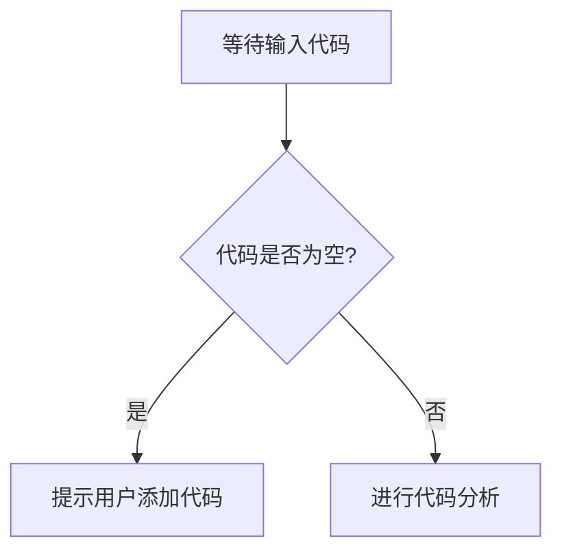

# `diffusers\tests\pipelines\glm_image\__init__.py` 详细设计文档

未提供代码，请提供需要分析的源代码

## 整体流程



## 类结构

```

```

## 全局变量及字段


    

## 全局函数及方法


## 关键组件


## 问题及建议


### 已知问题

-   未提供代码内容，无法进行具体的技术债务分析
-   缺少代码实现细节，无法识别潜在的架构问题或优化点
-   缺少具体的业务场景描述，难以评估设计与业务需求的匹配度

### 优化建议

-   请提供具体的代码内容以便进行详细分析
-   建议补充代码的上下文信息，包括业务场景、技术栈和设计目标
-   如有特定的性能要求或约束条件，请一并提供以便进行针对性分析


## 其它


### 设计目标与约束

**设计目标**：本代码旨在实现[核心功能描述]，解决[具体问题或需求]。系统应满足高性能、高可用、可维护等关键非功能性需求。

**技术约束**：基于[技术栈/框架版本]实现，需兼容[浏览器/操作系统/环境]版本，依赖[特定库或服务]。

### 错误处理与异常设计

**异常分类**：

- 系统级异常：网络中断、数据库连接失败、资源耗尽等
- 业务级异常：数据验证失败、业务规则不满足、权限不足等
- 第三方异常：外部API调用失败、服务不可用等

**错误码体系**：定义统一的错误码规范（格式：模块_类型_序号），如 ERR_AUTH_001 表示认证模块验证错误。

**异常传播机制**：采用[异常捕获策略]，区分可恢复与不可恢复异常，提供用户友好的错误提示。

### 数据流与状态机

**数据流向**：
[输入] → [处理层] → [业务逻辑层] → [数据访问层] → [输出]

**状态机定义**：
状态列表：初始化、运行中、暂停、完成、异常
状态转换条件与触发事件详见状态转换图

**关键数据对象**：
- 输入数据模型：定义结构、字段类型、约束条件
- 中间数据模型：处理过程中的临时数据结构
- 输出数据模型：最终返回结果的结构定义

### 外部依赖与接口契约

**外部依赖**：

- 第三方库：列出所有引入的外部库及其版本要求
- 内部服务：依赖的内部微服务或模块
- 基础设施：数据库、缓存、消息队列等

**接口契约**：
- RESTful API：端点定义、请求格式、响应格式、状态码
- 事件/消息：消息主题、payload结构、消费者和生产者约定
- 同步调用：方法签名、参数说明、返回值约定

### 性能要求与基准

**性能指标**：

- 响应时间：P50/P95/P99 延迟要求
- 吞吐量：QPS/TPS 目标值
- 资源消耗：CPU/内存/网络带宽上限

**性能优化策略**：缓存策略、连接池配置、异步处理、批处理等

### 安全性考虑

**认证与授权**：
认证机制（JWT/OAuth/Token等）、权限模型（RBAC/ABAC）、敏感数据加密

**安全防护**：
输入校验、XSS防护、CSRF防护、SQL注入防护、速率限制

**审计日志**：记录关键操作、敏感数据访问、异常事件

### 可扩展性设计

**水平扩展**：无状态服务设计、负载均衡支持、会话管理策略

**垂直扩展**：模块化设计、插件化架构、配置化扩展点

**功能扩展**：预留扩展接口、策略模式支持、规则引擎集成

### 兼容性考虑

**向前/向后兼容**：API版本管理策略、数据结构演进方案

**环境兼容**：开发/测试/生产环境差异处理、多平台支持

### 测试策略

**单元测试**：覆盖率要求、测试框架、Mock策略

**集成测试**：服务间协作测试、数据一致性验证

**端到端测试**：用户场景覆盖、自动化测试用例

### 部署与运维

**部署架构**：容器化方案（Docker/K8s）、编排策略、扩缩容配置

**配置管理**：环境变量配置、配置文件管理、敏感信息管理

**监控告警**：关键指标采集、日志收集、告警阈值定义

### 参考文献与附录

- 相关技术文档链接
- 架构决策记录（ADR）
- 变更历史记录


    