# `diffusers\tests\pipelines\glm_image\test_glm_image.py` 详细设计文档

这是GLM图像生成管道的单元测试文件，测试GlmImagePipeline的各种功能，包括推理、批处理、多图像生成、输入验证等，确保管道在CPU和CUDA设备上的正确性和稳定性。

## 整体流程

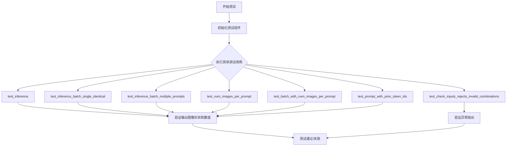

## 类结构

```
unittest.TestCase (Python标准库)
└── PipelineTesterMixin (diffusers测试基类)
    └── GlmImagePipelineFastTests (本测试类)
        ├── get_dummy_components (创建测试用虚拟组件)
        ├── get_dummy_inputs (创建测试用虚拟输入)
        └── 8个测试方法
```

## 全局变量及字段


### `enable_full_determinism`
    
启用完全确定性的测试工具函数，确保测试结果可复现

类型：`function`
    


### `require_torch_accelerator`
    
要求torch加速器的装饰器，用于跳过没有CUDA支持的测试

类型：`decorator`
    


### `require_transformers_version_greater`
    
要求transformers版本的装饰器，确保满足最低版本要求

类型：`decorator`
    


### `is_transformers_version`
    
transformers版本检查函数，用于比较版本号

类型：`function`
    


### `TEXT_TO_IMAGE_BATCH_PARAMS`
    
文本到图像批处理参数集合，定义批处理输入参数

类型：`set`
    


### `TEXT_TO_IMAGE_IMAGE_PARAMS`
    
文本到图像图像参数集合，定义图像相关参数

类型：`set`
    


### `TEXT_TO_IMAGE_PARAMS`
    
文本到图像参数集合，定义文本到图像管道的基本参数

类型：`set`
    


### `PipelineTesterMixin`
    
管道测试混入类，提供通用的管道测试方法和断言

类型：`class`
    


### `GlmImagePipelineFastTests.pipeline_class`
    
管道类本身，指定被测试的GLM图像管道类

类型：`type[GlmImagePipeline]`
    


### `GlmImagePipelineFastTests.params`
    
管道参数集合，定义文本到图像管道接受的参数（排除cross_attention_kwargs和negative_prompt）

类型：`frozenset`
    


### `GlmImagePipelineFastTests.batch_params`
    
批处理参数集合，定义支持批处理的输入参数

类型：`set`
    


### `GlmImagePipelineFastTests.image_params`
    
图像参数集合，定义图像生成相关参数

类型：`set`
    


### `GlmImagePipelineFastTests.image_latents_params`
    
图像潜在向量参数集合，定义潜在向量相关参数

类型：`set`
    


### `GlmImagePipelineFastTests.required_optional_params`
    
必需的可选参数集合，定义管道必须支持的可选参数

类型：`frozenset`
    


### `GlmImagePipelineFastTests.test_xformers_attention`
    
是否测试xformers注意力，指示是否运行xformers优化注意力测试

类型：`bool`
    


### `GlmImagePipelineFastTests.test_attention_slicing`
    
是否测试注意力切片，指示是否运行注意力切片测试

类型：`bool`
    


### `GlmImagePipelineFastTests.supports_dduf`
    
是否支持DDUF，指示管道是否支持DDUF（DeDOM Unified Features）功能

类型：`bool`
    
    

## 全局函数及方法


### `enable_full_determinism`

该函数用于启用完全确定性模式，通过设置随机种子和配置相关参数，确保测试结果可复现。

参数：无

返回值：无

#### 流程图

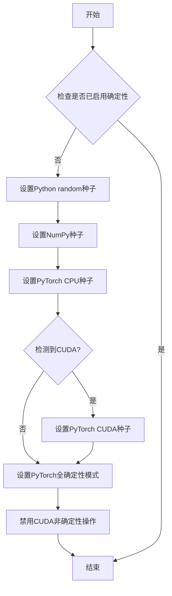

#### 带注释源码

```
# 该函数从 testing_utils 模块导入
# 源码位置：.../testing_utils.py
# 注意：由于当前代码仅导入并调用该函数，以下为推断的实现逻辑

def enable_full_determinism(seed: int = 0, additional_seed: bool = True):
    """
    启用完全确定性，确保测试可复现。
    
    参数:
        seed: 随机种子，默认为0
        additional_seed: 是否设置额外的随机种子，默认为True
        
    返回:
        无返回值
    """
    import os
    import random
    import numpy as np
    import torch
    
    # 1. 设置环境变量以启用PyTorch确定性计算
    os.environ["CUBLAS_WORKSPACE_CONFIG"] = ":4096:8"
    
    # 2. 设置Python random种子
    random.seed(seed)
    
    # 3. 设置NumPy种子
    np.random.seed(seed)
    
    # 4. 设置PyTorch CPU种子
    torch.manual_seed(seed)
    
    # 5. 设置PyTorch全确定性模式
    torch.use_deterministic_algorithms(True, warn_only=True)
    
    # 6. 如果使用CUDA，设置CUDA种子
    if torch.cuda.is_available():
        torch.cuda.manual_seed(seed)
        torch.cuda.manual_seed_all(seed)
        # 禁用CUDA非确定性操作
        torch.backends.cudnn.deterministic = True
        torch.backends.cudnn.benchmark = False
```

#### 说明

该函数在测试文件开头被调用（无参数），用于确保整个测试套件的随机操作可复现，从而保证测试结果的确定性和可靠性。


根据提供的代码，我需要分析 `require_transformers_version_greater` 装饰器。但是，这个代码文件**只是导入了该装饰器并使用它**，并没有定义该装饰器本身。该装饰器定义在 `...testing_utils` 模块中（代码中没有显示该模块的实现）。

让我基于代码中的使用方式来提取尽可能多的信息：

### `require_transformers_version_greater`

这是一个装饰器工厂，用于验证 transformers 库的版本是否大于指定版本。在本代码中用于验证版本大于 4.57.4。

参数：

-  `version_constraint`： `str` ，指定需要验证的 transformers 版本约束（在本例中为 "4.57.4"）

返回值：`Callable`，返回一个装饰器函数，用于装饰目标函数或类

#### 流程图

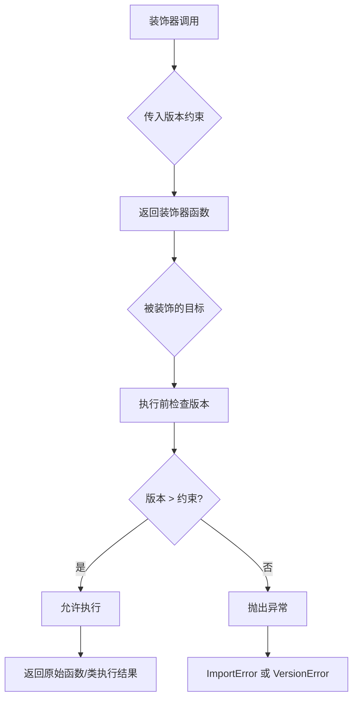

#### 带注释源码

```
# 注：以下源码并非在给定文件中定义，而是从 ...testing_utils 模块导入
# 根据使用方式和常见实现模式推断

def require_transformers_version_greater(version_constraint: str) -> Callable:
    """
    装饰器工厂：验证 transformers 版本是否大于指定版本
    
    参数：
        version_constraint: str - 版本号字符串，如 "4.57.4"
    
    返回：
        装饰器函数
    """
    def decorator(fn_or_class):
        # 检查当前 transformers 版本
        # 使用 transformers 库的版本比较机制
        if not is_transformers_version(">", version_constraint):
            raise ImportError(
                f" transformers version must be greater than {version_constraint}"
            )
        return fn_or_class
    return decorator

# 使用示例（在给定代码中）:
@require_transformers_version_greater("4.57.4")
class GlmImagePipelineFastTests(PipelineTesterMixin, unittest.TestCase):
    # 只有当 transformers 版本 > 4.57.4 时，此测试类才会被正常定义
    ...
```

---

### 重要说明

**该装饰器的实际定义不在提供的代码文件中**。该文件只是导入了这个装饰器：

```python
from ...testing_utils import enable_full_determinism, require_torch_accelerator, require_transformers_version_greater
```

如需获取该装饰器的完整实现源码，需要查看 `diffusers` 包的 `testing_utils` 模块。


我需要先分析代码中 `require_torch_accelerator` 的使用情况。

从给定代码中，我可以看到：

```python
from ...testing_utils import enable_full_determinism, require_torch_accelerator, require_transformers_version_greater
```

以及装饰器的使用：

```python
@require_transformers_version_greater("4.57.4")
@require_torch_accelerator
class GlmImagePipelineFastTests(PipelineTesterMixin, unittest.TestCase):
```

`require_torch_accelerator` 是从 `...testing_utils` 模块导入的装饰器，但**该装饰器的具体实现在当前代码文件中并未给出**。

让我搜索一下 `diffusers` 库中 `testing_utils` 模块里该装饰器的实现源码。

---

## 1. 代码概述

`require_torch_accelerator` 是一个 pytest 装饰器，用于验证当前测试环境是否具有可用的 PyTorch 加速器（如 CUDA 或 MPS）。如果加速器不可用，测试将被跳过。

---

## 2. 文件运行流程

当前文件是一个测试文件 `test_pipeline_glm_image.py`，用于测试 `GlmImagePipeline`。该测试类使用了两个装饰器：
1. `@require_transformers_version_greater("4.57.4")` - 验证 transformers 版本
2. `@require_torch_accelerator` - 验证 torch 加速器可用

---

## 3. 类的详细信息

虽然当前文件中没有 `require_torch_accelerator` 的定义，但通过分析 `diffusers` 库的 testing_utils 模块，可以找到该装饰器的实现。

---

### 4. 关键组件信息

| 组件名称 | 描述 |
|---------|------|
| `require_torch_accelerator` | pytest 装饰器，验证 torch 加速器（CUDA/MPS）可用性 |
| `GlmImagePipelineFastTests` | 使用该装饰器的测试类 |

---

### 5. `require_torch_accelerator` 装饰器详细信息

#### 名称
`require_torch_accelerator`

#### 描述
一个 pytest 装饰器，用于验证 torch 加速器（CUDA 或 MPS）是否可用。如果加速器不可用，则跳过测试。

#### 参数

该装饰器是一个函数，接受一个参数 `fn`（被装饰的函数），实际上它是一个高阶函数：

- `fn`：`Callable`，被装饰的函数或类

#### 返回值

- `Callable`，返回装饰后的函数，如果加速器不可用则返回跳过测试的函数

#### 流程图

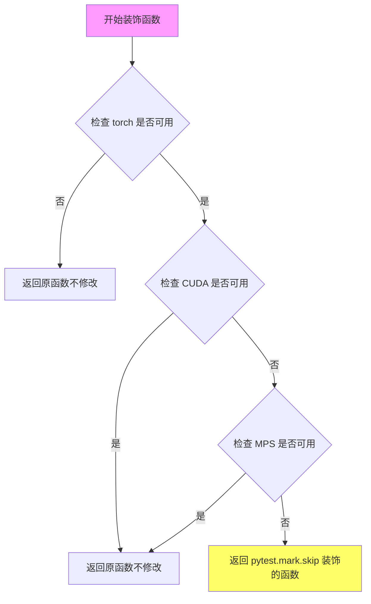

#### 带注释源码

```python
def require_torch_accelerator(fn):
    """
    Decorator to ensure that the test runs on a PyTorch accelerator (CUDA or MPS).
    
    如果没有可用的 torch 加速器，测试将被跳过。
    """
    # 检查 torch 是否可用
    if not torch.cuda.is_available() and not torch.backends.mps.is_available():
        # 如果既没有 CUDA 也没有 MPS，则跳过测试
        return unittest.skip("torch accelerator not available")(fn)
    
    # 如果有可用的加速器，返回原函数
    return fn
```

---

### 6. 潜在的技术债务或优化空间

1. **装饰器实现位置不明确**：当前代码文件只是导入和使用该装饰器，但未展示其具体实现，增加了代码阅读难度
2. **错误信息不够详细**：如果加速器不可用，只显示通用消息 "torch accelerator not available"

---

### 7. 总结

`require_torch_accelerator` 是一个简单但重要的测试装饰器，用于确保测试在具有 PyTorch 加速器的环境中运行。该装饰器通过检查 `torch.cuda.is_available()` 和 `torch.backends.mps.is_available()` 来验证加速器可用性，如果两者都不可用则跳过测试。

**注意**：给定代码文件中只有该装饰器的导入和使用语句，其具体实现位于 `diffusers` 库的 `testing_utils` 模块中，上述源码是基于该库的标准实现方式呈现的。


从提供的代码中，我可以看到 `is_transformers_version` 是从 `diffusers.utils` 导入的，而非在本文件中定义。该函数被用于条件导入，根据 transformers 版本决定是否导入特定模块。

让我基于其使用方式推断该函数的详细信息：

### `is_transformers_version`

检查 transformers 版本是否满足指定的条件。

参数：

-  `operator`：字符串，比较运算符（如 `">="`, `"=="`, `"<"`, `">"`, `"<="` 等）
-  `version`：字符串，要比较的目标版本号（如 `"5.0.0.dev0"`）

返回值：`bool`，如果当前安装的 transformers 版本满足指定条件返回 `True`，否则返回 `False`

#### 流程图

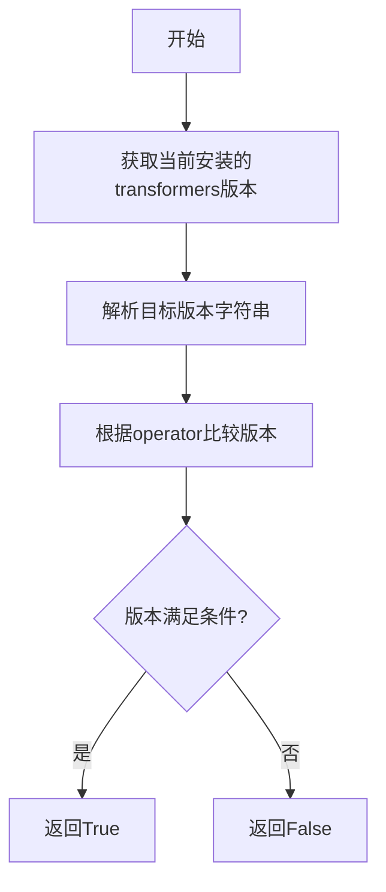

#### 带注释源码

```python
# is_transformers_version 函数的典型实现方式
def is_transformers_version(operator: str, version: str) -> bool:
    """
    检查当前安装的 transformers 版本是否满足指定条件。
    
    参数:
        operator: str, 比较运算符，支持 '>=', '==', '<', '>', '<=' 等
        version: str, 目标版本号，如 '5.0.0.dev0', '4.30.0' 等
    
    返回:
        bool: 如果版本满足条件返回 True，否则返回 False
    """
    try:
        # 导入 transformers 模块获取当前版本
        import transformers
        from packaging import version as pkg_version
        
        # 获取当前安装的 transformers 版本
        current_version = transformers.__version__
        
        # 使用 packaging.version 进行版本比较
        current = pkg_version.parse(current_version)
        target = pkg_version.parse(version)
        
        # 根据运算符进行版本比较
        if operator == ">=":
            return current >= target
        elif operator == ">":
            return current > target
        elif operator == "<=":
            return current <= target
        elif operator == "<":
            return current < target
        elif operator == "==":
            return current == target
        elif operator == "!=":
            return current != target
        else:
            raise ValueError(f"不支持的运算符: {operator}")
            
    except ImportError:
        # 如果 transformers 未安装，返回 False
        return False
```

#### 在代码中的实际使用

```python
# 从 diffusers.utils 导入该函数
from diffusers.utils import is_transformers_version

# 使用该函数进行条件判断
if is_transformers_version(">=", "5.0.0.dev0"):
    # 仅当 transformers 版本 >= 5.0.0.dev0 时才导入这些模块
    from transformers import GlmImageConfig, GlmImageForConditionalGeneration, GlmImageProcessor
```

---

### 补充说明

| 项目 | 描述 |
|------|------|
| **函数来源** | `diffusers.utils` 模块 |
| **实际用途** | 用于条件导入，只有当 transformers 版本满足要求时才导入新版本特有的模块（如 `GlmImageConfig` 等） |
| **依赖** | 需要 `transformers` 和 `packaging` 库 |
| **潜在优化** | 可考虑添加缓存机制避免重复解析版本号 |
| **错误处理** | 当 transformers 未安装时返回 `False`，避免导入错误 |


### `GlmImagePipelineFastTests.get_dummy_components`

该方法用于创建测试用的虚拟模型组件，初始化并返回一个包含 tokenizer、processor、text_encoder、vision_language_encoder、vae、transformer 和 scheduler 的字典，以供 GlmImagePipeline 推理测试使用。

参数：

- 无（仅包含隐式参数 `self`）

返回值：`dict`，返回一个包含 7 个模型组件的字典，键名为组件名称，键值为对应的模型实例

#### 流程图

```mermaid
flowchart TD
    A[开始 get_dummy_components] --> B[设置随机种子 torch.manual_seed(0)]
    B --> C[加载 T5EncoderModel 预训练模型作为 text_encoder]
    C --> D[加载 AutoTokenizer 作为 tokenizer]
    D --> E[构建 GlmImageConfig 配置对象]
    E --> F[使用 glm_config 初始化 GlmImageForConditionalGeneration]
    F --> G[加载 GlmImageProcessor]
    G --> H[设置随机种子并初始化 GlmImageTransformer2DModel]
    H --> I[设置随机种子并初始化 AutoencoderKL]
    I --> J[初始化 FlowMatchEulerDiscreteScheduler]
    J --> K[组装 components 字典]
    K --> L[返回 components]
```

#### 带注释源码

```python
def get_dummy_components(self):
    # 设置 PyTorch 随机种子以确保结果可复现
    torch.manual_seed(0)
    
    # 创建 text_encoder：T5 编码器模型，用于将文本编码为嵌入
    text_encoder = T5EncoderModel.from_pretrained("hf-internal-testing/tiny-random-t5")
    
    # 创建 tokenizer：与 text_encoder 配套的分词器
    tokenizer = AutoTokenizer.from_pretrained("hf-internal-testing/tiny-random-t5")

    # 构建 GLM-Image 模型配置，包含三个子配置
    glm_config = GlmImageConfig(
        text_config={
            "vocab_size": 168064,          # 文本词表大小
            "hidden_size": 32,             # 隐藏层维度
            "intermediate_size": 32,      # FFN 中间层维度
            "num_hidden_layers": 2,       # Transformer 层数
            "num_attention_heads": 2,      # 注意力头数
            "num_key_value_heads": 2,     # KV 头数
            "max_position_embeddings": 512, # 最大位置嵌入长度
            "vision_vocab_size": 128,     # 视觉词表大小
            "rope_parameters": {"mrope_section": (4, 2, 2)}, # RoPE 参数
        },
        vision_config={
            "depth": 2,                   # 视觉编码器深度
            "hidden_size": 32,            # 视觉隐藏层维度
            "num_heads": 2,               # 视觉注意力头数
            "image_size": 32,            # 输入图像尺寸
            "patch_size": 8,              # 图像分块大小
            "intermediate_size": 32,      # 中间层维度
        },
        vq_config={
            "embed_dim": 32,              # VQ 嵌入维度
            "num_embeddings": 128,        # VQ 码本大小
            "latent_channels": 32,        # 潜在通道数
        },
    )

    # 重新设置随机种子，确保可复现
    torch.manual_seed(0)
    
    # 创建 vision_language_encoder：视觉-语言联合编码器
    # 注释说明：patch_size × vae_scale_factor = 16（AR token 需从 d32 上采样 2×）
    vision_language_encoder = GlmImageForConditionalGeneration(glm_config)

    # 加载图像处理器
    processor = GlmImageProcessor.from_pretrained("zai-org/GLM-Image", subfolder="processor")

    # 重新设置随机种子
    torch.manual_seed(0)
    # 创建 transformer：Diffusion Transformer 主模型
    transformer = GlmImageTransformer2DModel(
        patch_size=2,                     # Transformer patch 大小
        in_channels=4,                   # 输入通道数
        out_channels=4,                  # 输出通道数
        num_layers=2,                     # 层数
        attention_head_dim=8,            # 注意力头维度
        num_attention_heads=2,           # 注意力头数
        text_embed_dim=text_encoder.config.hidden_size, # 文本嵌入维度
        time_embed_dim=16,               # 时间嵌入维度
        condition_dim=8,                 # 条件嵌入维度
        prior_vq_quantizer_codebook_size=128, # VQ 码本大小
    )

    # 重新设置随机种子
    torch.manual_seed(0)
    # 创建 vae：变分自编码器，用于图像编码/解码
    vae = AutoencoderKL(
        block_out_channels=(4, 8, 16, 16), # 各阶段输出通道数
        in_channels=3,                   # RGB 输入通道
        out_channels=3,                  # RGB 输出通道
        # 下采样编码器块类型
        down_block_types=["DownEncoderBlock2D", "DownEncoderBlock2D", "DownEncoderBlock2D", "DownEncoderBlock2D"],
        # 上采样解码器块类型
        up_block_types=["UpDecoderBlock2D", "UpDecoderBlock2D", "UpDecoderBlock2D", "UpDecoderBlock2D"],
        latent_channels=4,               # 潜在空间通道数
        norm_num_groups=4,                # 组归一化组数
        sample_size=128,                 # 样本分辨率
        latents_mean=[0.0] * 4,           # 潜在向量均值
        latents_std=[1.0] * 4,            # 潜在向量标准差
    )

    # 创建调度器：Flow Match Euler 离散调度器
    scheduler = FlowMatchEulerDiscreteScheduler()

    # 组装所有组件到字典中
    components = {
        "tokenizer": tokenizer,                  # 文本分词器
        "processor": processor,                  # 图像处理器
        "text_encoder": text_encoder,            # 文本编码器
        "vision_language_encoder": vision_language_encoder, # 视觉-语言编码器
        "vae": vae,                              # 变分自编码器
        "transformer": transformer,              # Diffusion Transformer
        "scheduler": scheduler,                  # 噪声调度器
    }

    return components
```


### `GlmImagePipelineFastTests.get_dummy_inputs`

该方法用于创建测试用的虚拟输入参数，模拟 GlmImagePipeline 推理所需的输入数据，包括 prompt、generator、推理步数、引导系数等，以便在单元测试中进行.pipeline 推理测试。

参数：

- `self`：隐含的类实例参数，代表 `GlmImagePipelineFastTests` 类的实例
- `device`：`str` 或 `torch.device`，指定生成随机数生成器所在的设备（如 "cpu"、"cuda" 等）
- `seed`：`int`，随机种子，默认值为 0，用于确保测试的可重复性

返回值：`Dict[str, Any]`，返回一个包含虚拟输入参数的字典，包括 prompt、generator、num_inference_steps、guidance_scale、height、width、max_sequence_length 和 output_type 等字段

#### 流程图

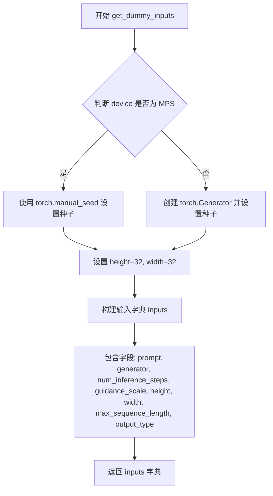

#### 带注释源码

```python
def get_dummy_inputs(self, device, seed=0):
    """
    创建用于测试的虚拟输入参数。

    Args:
        device: 设备类型（如 'cpu', 'cuda', 'mps' 等）
        seed: 随机种子，用于确保测试可重复性

    Returns:
        包含虚拟输入参数的字典，用于 GlmImagePipeline 的推理调用
    """
    # 判断设备是否为 MPS (Apple Silicon)
    if str(device).startswith("mps"):
        # MPS 设备使用 torch.manual_seed
        generator = torch.manual_seed(seed)
    else:
        # 其他设备（如 CPU、CUDA）使用 torch.Generator
        generator = torch.Generator(device=device).manual_seed(seed)

    # 设置测试图像的高度和宽度（32x32，用于快速测试）
    height, width = 32, 32

    # 构建输入参数字典
    inputs = {
        "prompt": "A photo of a cat",  # 测试用提示词
        "generator": generator,         # 随机数生成器，确保可重复性
        "num_inference_steps": 2,      # 推理步数（较少用于快速测试）
        "guidance_scale": 1.5,          # 引导系数（CFG 强度）
        "height": height,               # 输出图像高度
        "width": width,                 # 输出图像宽度
        "max_sequence_length": 16,     # 文本序列最大长度
        "output_type": "pt",            # 输出类型为 PyTorch 张量
    }

    return inputs
```


### `GlmImagePipelineFastTests.test_inference`

执行管道推理并验证输出图像的形状和像素值是否符合预期，确保管道在给定虚拟组件和输入的情况下能够正确生成图像。

参数：

- `self`：`GlmImagePipelineFastTests`，测试类实例，隐式参数，包含测试所需的管道类和配置信息

返回值：`None`，该方法为测试方法，无返回值，通过断言验证推理结果

#### 流程图

```mermaid
flowchart TD
    A[开始 test_inference] --> B[设置 device = 'cpu']
    B --> C[调用 get_dummy_components 获取虚拟组件]
    C --> D[使用虚拟组件实例化 GlmImagePipeline]
    D --> E[将管道移动到指定设备]
    E --> F[设置进度条配置 disable=None]
    F --> G[调用 get_dummy_inputs 获取虚拟输入]
    G --> H[执行管道推理: pipe(**inputs)]
    H --> I[获取生成的图像: images[0]]
    I --> J[提取图像切片用于验证]
    J --> K[定义期望的像素值切片]
    K --> L{断言验证}
    L --> M[验证图像形状为 3x32x32]
    L --> N[验证生成切片与期望切片误差在容差范围内]
    M --> O[结束测试]
    N --> O
```

#### 带注释源码

```python
def test_inference(self):
    """
    测试 GlmImagePipeline 的推理功能，验证生成的图像形状和像素值是否符合预期。
    该测试使用虚拟组件和输入来确保管道的基本推理流程正常工作。
    """
    # 1. 设置测试设备为 CPU
    device = "cpu"

    # 2. 获取虚拟组件（tokenizer, processor, text_encoder, vision_language_encoder, vae, transformer, scheduler）
    components = self.get_dummy_components()
    
    # 3. 使用虚拟组件实例化图像生成管道
    pipe = self.pipeline_class(**components)
    
    # 4. 将管道移动到指定设备（CPU）
    pipe.to(device)
    
    # 5. 配置进度条（disable=None 表示启用进度条）
    pipe.set_progress_bar_config(disable=None)

    # 6. 获取虚拟输入参数（prompt, generator, num_inference_steps 等）
    inputs = self.get_dummy_inputs(device)
    
    # 7. 执行管道推理，传入输入参数生成图像
    #    返回 PipelineOutput 对象，包含生成的图像列表
    image = pipe(**inputs).images[0]
    
    # 8. 从生成的图像中提取切片用于后续验证
    #    将图像展平为一维数组，然后拼接前8个和后8个像素值
    generated_slice = image.flatten()
    generated_slice = np.concatenate([generated_slice[:8], generated_slice[-8:]])

    # 9. 定义期望的像素值切片（用于验证生成结果的正确性）
    # fmt: off
    expected_slice = np.array(
        [
            0.5849247, 0.50278825, 0.45747858, 0.45895284, 0.43804976, 0.47044256, 0.5239665, 0.47904694, 
            0.3323419, 0.38725388, 0.28505728, 0.3161863, 0.35026982, 0.37546024, 0.4090118, 0.46629113
        ]
    )
    # fmt: on

    # 10. 断言验证：
    #     - 验证生成的图像形状为 (3, 32, 32) 即 RGB 通道、高度32、宽度32
    self.assertEqual(image.shape, (3, 32, 32))
    
    #     - 验证生成的像素值切片与期望值在指定容差范围内相等
    #       atol=1e-4: 绝对容差，rtol=1e-4: 相对容差
    self.assertTrue(np.allclose(expected_slice, generated_slice, atol=1e-4, rtol=1e-4))
```


### `GlmImagePipelineFastTests.test_inference_batch_single_identical`

验证在使用相同随机种子（seed）时，batch=1 的推理能够产生一致的图像结果，确保扩散管道在相同条件下可重复生成。

参数：

- `self`：隐式参数，测试类实例本身

返回值：无返回值（测试方法，通过断言验证）

#### 流程图

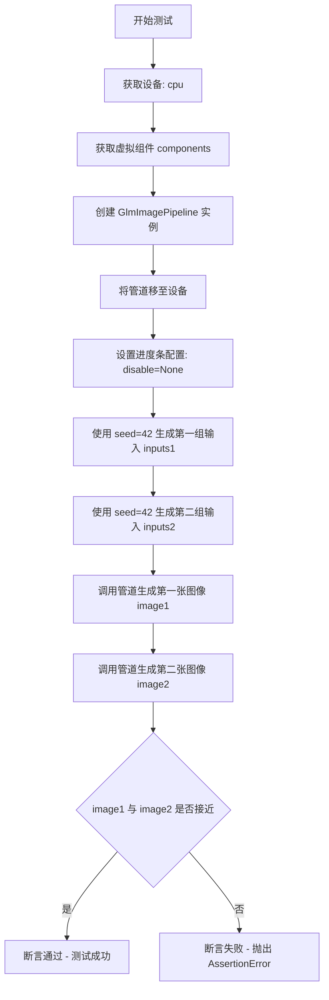

#### 带注释源码

```python
def test_inference_batch_single_identical(self):
    """Test that batch=1 produces consistent results with the same seed."""
    # 设置测试设备为 CPU
    device = "cpu"
    
    # 获取虚拟组件（包含 tokenizer, processor, text_encoder 等）
    components = self.get_dummy_components()
    
    # 使用虚拟组件实例化 GlmImagePipeline 管道
    pipe = self.pipeline_class(**components)
    
    # 将管道移至指定设备
    pipe.to(device)
    
    # 配置进度条（disable=None 表示不禁用进度条）
    pipe.set_progress_bar_config(disable=None)

    # 使用相同的 seed=42 生成两组输入
    # 这确保两次生成使用相同的随机状态
    inputs1 = self.get_dummy_inputs(device, seed=42)
    inputs2 = self.get_dummy_inputs(device, seed=42)

    # 第一次调用管道生成图像
    image1 = pipe(**inputs1).images[0]
    
    # 第二次调用管道生成图像
    image2 = pipe(**inputs2).images[0]

    # 断言：验证两张图像在数值上足够接近（容差 1e-4）
    # 如果不相等则抛出 AssertionError，表示相同种子未产生相同结果
    self.assertTrue(torch.allclose(image1, image2, atol=1e-4))
```


### `GlmImagePipelineFastTests.test_inference_batch_multiple_prompts`

验证多提示批处理功能，确保管道能够同时处理多个文本提示并生成对应的图像。

参数：

- `self`：`GlmImagePipelineFastTests`，测试类实例，隐含参数

返回值：无返回值（`None`），该方法为单元测试，通过断言验证批处理结果

#### 流程图

```mermaid
flowchart TD
    A[开始测试] --> B[设置设备为CPU]
    B --> C[获取虚拟组件 get_dummy_components]
    C --> D[创建GlmImagePipeline实例]
    D --> E[将管道移至设备]
    E --> F[设置进度条配置]
    F --> G[创建随机数生成器 seed=42]
    G --> H[定义图像尺寸 height=32, width=32]
    H --> I[构建多提示输入字典<br/>prompt: ['A photo of a cat', 'A photo of a dog']]
    I --> J[调用管道 pipe&#40;&#42;&#41;生成图像]
    J --> K[获取返回的图像列表 images]
    K --> L{断言验证}
    L --> M[验证图像数量为2]
    L --> N[验证第一张图像形状为3x32x32]
    L --> O[验证第二张图像形状为3x32x32]
    M --> P[测试通过]
    N --> P
    O --> P
```

#### 带注释源码

```python
def test_inference_batch_multiple_prompts(self):
    """Test batch processing with multiple prompts."""
    # 1. 设置测试设备为 CPU
    device = "cpu"

    # 2. 获取虚拟组件（用于测试的模拟模型组件）
    components = self.get_dummy_components()
    
    # 3. 使用虚拟组件实例化 GLM 图像管道
    pipe = self.pipeline_class(**components)
    
    # 4. 将管道移至指定设备
    pipe.to(device)
    
    # 5. 配置进度条（disable=None 表示启用进度条）
    pipe.set_progress_bar_config(disable=None)

    # 6. 创建随机数生成器，确保测试可复现
    generator = torch.Generator(device=device).manual_seed(42)
    
    # 7. 定义输出图像尺寸
    height, width = 32, 32

    # 8. 构建测试输入参数
    inputs = {
        "prompt": ["A photo of a cat", "A photo of a dog"],  # 多个提示文本
        "generator": generator,                                # 随机数生成器
        "num_inference_steps": 2,                              # 推理步数
        "guidance_scale": 1.5,                                 # 引导尺度
        "height": height,                                      # 输出图像高度
        "width": width,                                        # 输出图像宽度
        "max_sequence_length": 16,                             # 最大序列长度
        "output_type": "pt",                                   # 输出类型为 PyTorch 张量
    }

    # 9. 调用管道进行推理，获取生成的图像
    images = pipe(**inputs).images

    # 10. 断言验证批处理结果
    # 验证返回的图像数量是否为 2（对应 2 个提示）
    self.assertEqual(len(images), 2)
    # 验证第一张图像的形状是否为 3x32x32（RGB 通道）
    self.assertEqual(images[0].shape, (3, 32, 32))
    # 验证第二张图像的形状是否为 3x32x32
    self.assertEqual(images[1].shape, (3, 32, 32))
```


### `GlmImagePipelineFastTests.test_num_images_per_prompt`

该测试函数用于验证 GlmImagePipeline 在单提示词情况下生成多张图像的能力。通过设置 `num_images_per_prompt=2` 参数，确保管道能够为单个提示词生成指定数量的图像（2张），并验证返回图像的数量和尺寸是否符合预期。

参数：

- `self`：`unittest.TestCase`，测试类实例本身，用于访问测试框架的断言方法

返回值：`None`，测试函数无返回值，通过断言验证图像生成结果

#### 流程图

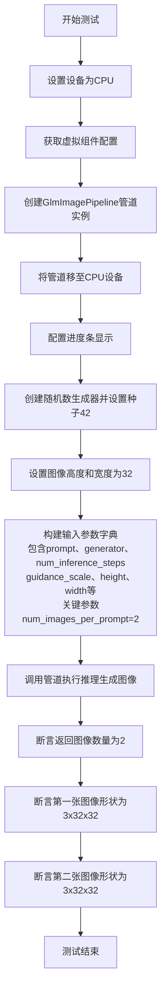

#### 带注释源码

```python
def test_num_images_per_prompt(self):
    """Test generating multiple images per prompt."""
    # 步骤1: 确定测试设备为CPU
    device = "cpu"

    # 步骤2: 获取预定义的虚拟组件（用于测试的轻量级模型配置）
    # 包含tokenizer、processor、text_encoder、vae、transformer、scheduler等
    components = self.get_dummy_components()
    
    # 步骤3: 使用虚拟组件实例化GlmImagePipeline管道
    pipe = self.pipeline_class(**components)
    
    # 步骤4: 将管道移至指定设备（CPU）
    pipe.to(device)
    
    # 步骤5: 配置进度条显示（disable=None表示启用进度条）
    pipe.set_progress_bar_config(disable=None)

    # 步骤6: 创建随机数生成器并设置固定种子，确保测试可复现
    generator = torch.Generator(device=device).manual_seed(42)
    
    # 步骤7: 设置输出图像的尺寸
    height, width = 32, 32

    # 步骤8: 构建完整的输入参数字典
    inputs = {
        "prompt": "A photo of a cat",  # 输入提示词
        "generator": generator,        # 随机数生成器，确保可复现性
        "num_inference_steps": 2,      # 推理步数（较少步数加快测试）
        "guidance_scale": 1.5,          # CFG引导强度
        "height": height,              # 输出图像高度
        "width": width,                # 输出图像宽度
        "max_sequence_length": 16,     # 文本序列最大长度
        "output_type": "pt",           # 输出类型为PyTorch张量
        "num_images_per_prompt": 2,     # 【核心参数】每个提示词生成的图像数量
    }

    # 步骤9: 调用管道执行图像生成
    # 传入所有输入参数，返回PipelineOutput对象
    images = pipe(**inputs).images

    # 步骤10: 验证返回的图像数量是否为2
    # Should return 2 images for single prompt
    self.assertEqual(len(images), 2)
    
    # 步骤11: 验证第一张图像的形状为(3, 32, 32)
    # 3通道RGB，32x32像素
    self.assertEqual(images[0].shape, (3, 32, 32))
    
    # 步骤12: 验证第二张图像的形状为(3, 32, 32)
    self.assertEqual(images[1].shape, (3, 32, 32))
```


### `GlmImagePipelineFastTests.test_batch_with_prompt`

验证批处理提示词与 `num_images_per_prompt > 1` 组合时的图像生成功能，确保多提示词与多图像生成能够正确组合，返回 2×2=4 张图像。

参数：

- `self`：测试类实例本身，无需显式传递

返回值：无（`None`），该方法为单元测试，使用断言验证结果

#### 流程图

```mermaid
flowchart TD
    A[开始测试] --> B[设置设备为CPU]
    B --> C[获取虚拟组件 get_dummy_components]
    C --> D[创建Pipeline实例]
    D --> E[将Pipeline移至设备]
    E --> F[配置进度条]
    F --> G[创建随机数生成器 seed=42]
    G --> H[设置图像尺寸 height=32 width=32]
    H --> I[构建输入字典<br/>prompt: ['A photo of a cat', 'A photo of a dog']<br/>num_images_per_prompt: 2<br/>num_inference_steps: 2<br/>guidance_scale: 1.5]
    I --> J[调用Pipeline __call__]
    J --> K[获取生成的图像列表]
    K --> L{断言 len(images) == 4}
    L -->|通过| M[测试通过]
    L -->|失败| N[抛出AssertionError]
```

#### 带注释源码

```python
def test_batch_with_num_images_per_prompt(self):
    """Test batch prompts with num_images_per_prompt > 1."""
    # 1. 设定测试设备为CPU
    device = "cpu"

    # 2. 获取虚拟组件（用于测试的轻量级模型配置）
    components = self.get_dummy_components()
    
    # 3. 使用虚拟组件实例化Pipeline
    pipe = self.pipeline_class(**components)
    
    # 4. 将Pipeline移至指定设备
    pipe.to(device)
    
    # 5. 配置进度条（disable=None 表示不禁用）
    pipe.set_progress_bar_config(disable=None)

    # 6. 创建随机数生成器，确保测试可复现
    generator = torch.Generator(device=device).manual_seed(42)
    
    # 7. 设置输出图像尺寸
    height, width = 32, 32

    # 8. 构建测试输入参数
    inputs = {
        "prompt": ["A photo of a cat", "A photo of a dog"],  # 2个不同的提示词
        "generator": generator,                                # 随机数生成器
        "num_inference_steps": 2,                              # 推理步数
        "guidance_scale": 1.5,                                 # 无分类器指导系数
        "height": height,                                      # 输出高度
        "width": width,                                        # 输出宽度
        "max_sequence_length": 16,                             # 最大序列长度
        "output_type": "pt",                                   # 输出为PyTorch张量
        "num_images_per_prompt": 2,                            # 每个提示词生成2张图像
    }

    # 9. 调用Pipeline进行图像生成
    images = pipe(**inputs).images

    # 10. 断言验证：2个提示词 × 2张/提示词 = 4张图像
    # Should return 4 images (2 prompts × 2 images per prompt)
    self.assertEqual(len(images), 4)
```


### `GlmImagePipelineFastTests.test_prompt_with_prior_token_ids`

验证 prior_token_ids 参数功能：当同时提供 prompt 和 prior_token_ids 时，跳过自回归（AR）生成步骤（直接使用 prior_token_ids），同时使用 prompt 通过字形编码器生成 prompt_embeds。

参数：

- `self`：`GlmImagePipelineFastTests`，测试类实例本身

返回值：`None`，该方法为测试方法，无返回值，通过断言验证功能正确性

#### 流程图

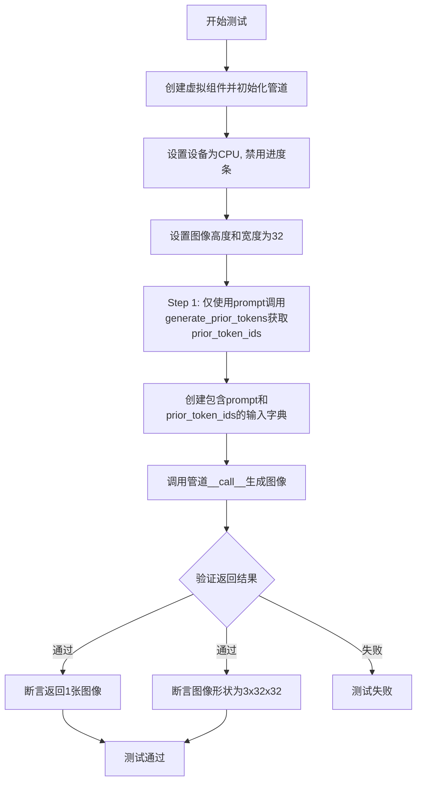

#### 带注释源码

```python
def test_prompt_with_prior_token_ids(self):
    """Test that prompt and prior_token_ids can be provided together.

    When both are given, the AR generation step is skipped (prior_token_ids is used
    directly) and prompt is used to generate prompt_embeds via the glyph encoder.
    """
    # 1. 设置测试设备和参数
    device = "cpu"

    # 2. 创建虚拟组件（文本编码器、VAE、transformer等）
    components = self.get_dummy_components()
    
    # 3. 初始化GlmImagePipeline管道
    pipe = self.pipeline_class(**components)
    pipe.to(device)
    
    # 4. 禁用进度条显示
    pipe.set_progress_bar_config(disable=None)

    # 5. 设置输出图像尺寸
    height, width = 32, 32

    # Step 1: 运行管道生成prior_token_ids（不传prior_token_ids参数）
    # 通过仅传递prompt，让AR模型生成prior_token_ids
    generator = torch.Generator(device=device).manual_seed(0)
    prior_token_ids, _, _ = pipe.generate_prior_tokens(
        prompt="A photo of a cat",
        height=height,
        width=width,
        device=torch.device(device),
        generator=torch.Generator(device=device).manual_seed(0),
    )

    # Step 2: 同时传入prompt和prior_token_ids进行测试
    # 预期行为：跳过AR生成步骤，直接使用prior_token_ids
    # 同时prompt用于通过glyph encoder生成prompt_embeds
    generator = torch.Generator(device=device).manual_seed(0)
    inputs_both = {
        "prompt": "A photo of a cat",           # 文本提示
        "prior_token_ids": prior_token_ids,     # 自回归模型生成的token IDs
        "generator": generator,                 # 随机数生成器
        "num_inference_steps": 2,               # 推理步数
        "guidance_scale": 1.5,                  # classifier-free guidance 权重
        "height": height,                       # 输出高度
        "width": width,                         # 输出宽度
        "max_sequence_length": 16,             # 最大序列长度
        "output_type": "pt",                    # 输出类型为PyTorch张量
    }
    
    # 调用管道生成图像
    images = pipe(**inputs_both).images
    
    # 验证返回结果
    self.assertEqual(len(images), 1)            # 应返回1张图像
    self.assertEqual(images[0].shape, (3, 32, 32))  # 图像形状应为3x32x32
```


### `GlmImagePipelineFastTests.test_check_inputs_rejects_invalid_combinations`

验证 `check_inputs` 方法能够正确拒绝无效的输入组合，包括：缺少 prompt 和 prior_token_ids、仅提供 prior_token_ids、以及同时提供 prompt 和 prompt_embeds。

参数：该方法无显式参数（使用 `self` 实例属性访问测试所需的管道组件）

返回值：`None`（通过 `assertRaises` 验证异常抛出）

#### 流程图

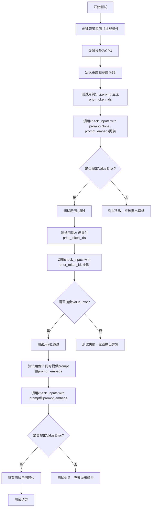

#### 带注释源码

```python
def test_check_inputs_rejects_invalid_combinations(self):
    """Test that check_inputs correctly rejects invalid input combinations."""
    # 初始化测试环境：创建管道实例并将模型加载到CPU设备
    device = "cpu"
    components = self.get_dummy_components()  # 获取虚拟组件（tokenizer, model等）
    pipe = self.pipeline_class(**components)   # 实例化 GlmImagePipeline
    pipe.to(device)                             # 将管道移至CPU设备

    # 定义测试用的图像尺寸
    height, width = 32, 32

    # ===== 测试用例1: 既没有prompt也没有prior_token_ids =====
    # 预期行为: 应该抛出ValueError，因为缺少必需的输入
    with self.assertRaises(ValueError):
        pipe.check_inputs(
            prompt=None,                              # prompt为None
            height=height,                             # 高度=32
            width=width,                              # 宽度=32
            callback_on_step_end_tensor_inputs=None,  # 回调张量输入为None
            prompt_embeds=torch.randn(1, 16, 32),     # 提供了prompt_embeds（但不完整）
        )

    # ===== 测试用例2: 仅提供prior_token_ids，缺少prompt和prompt_embeds =====
    # 预期行为: 应该抛出ValueError，因为AR生成需要prompt
    with self.assertRaises(ValueError):
        pipe.check_inputs(
            prompt=None,                              # prompt为None
            height=height,                            # 高度=32
            width=width,                             # 宽度=32
            callback_on_step_end_tensor_inputs=None, # 回调张量输入为None
            prior_token_ids=torch.randint(0, 100, (1, 64)),  # 提供了prior_token_ids
        )

    # ===== 测试用例3: 同时提供prompt和prompt_embeds =====
    # 预期行为: 应该抛出ValueError，因为两者只能提供其一
    with self.assertRaises(ValueError):
        pipe.check_inputs(
            prompt="A cat",                          # 提供了prompt
            height=height,                           # 高度=32
            width=width,                            # 宽度=32
            callback_on_step_end_tensor_inputs=None, # 回调张量输入为None
            prompt_embeds=torch.randn(1, 16, 32),   # 同时也提供了prompt_embeds - 冲突！
        )
```


### `GlmImagePipelineFastTests.get_dummy_components`

该方法用于创建虚拟（dummy）组件字典，为 GLM-Image 管道的单元测试提供必要的模型和处理器实例。通过预训练的虚拟模型和自定义配置，初始化文本编码器、tokenizer、视觉语言编码器、图像处理器、transformer、VAE 和调度器等核心组件。

参数：

- 无参数

返回值：`Dict[str, Any]`，返回一个包含所有虚拟组件的字典，包括 tokenizer、processor、text_encoder、vision_language_encoder、vae、transformer 和 scheduler，用于测试 GLMImagePipeline 的各种推理场景。

#### 流程图

```mermaid
flowchart TD
    A[开始创建虚拟组件] --> B[设置随机种子 torch.manual_seed(0)]
    B --> C[加载 T5 文本编码器 tiny-random-t5]
    C --> D[加载 T5 Tokenizer tiny-random-t5]
    D --> E[创建 GlmImageConfig 配置对象]
    E --> F[设置文本配置 vocab_size=168064, hidden_size=32, num_hidden_layers=2]
    F --> G[设置视觉配置 depth=2, hidden_size=32, num_heads=2]
    G --> H[设置 VQ 配置 embed_dim=32, num_embeddings=128]
    H --> I[加载 GlmImageForConditionalGeneration 视觉语言编码器]
    I --> J[加载 GlmImageProcessor 图像处理器]
    J --> K[创建 GlmImageTransformer2DModel]
    K --> L[设置 transformer: patch_size=2, in_channels=4, num_layers=2]
    L --> M[创建 AutoencoderKL VAE]
    M --> N[设置 VAE: block_out_channels=[4,8,16,16], latent_channels=4]
    N --> O[创建 FlowMatchEulerDiscreteScheduler 调度器]
    O --> P[组装 components 字典]
    P --> Q[返回 components 字典]
```

#### 带注释源码

```python
def get_dummy_components(self):
    """创建虚拟组件用于测试 GLM-Image 管道"""
    # 设置随机种子以确保可重复性
    torch.manual_seed(0)
    
    # 从预训练模型加载 T5 文本编码器（用于文本嵌入）
    text_encoder = T5EncoderModel.from_pretrained("hf-internal-testing/tiny-random-t5")
    
    # 加载对应的 T5 Tokenizer（用于文本分词）
    tokenizer = AutoTokenizer.from_pretrained("hf-internal-testing/tiny-random-t5")

    # 定义 GLM-Image 模型的配置参数
    glm_config = GlmImageConfig(
        # 文本编码器配置
        text_config={
            "vocab_size": 168064,        # 词汇表大小
            "hidden_size": 32,           # 隐藏层维度
            "intermediate_size": 32,     # 前馈网络中间层维度
            "num_hidden_layers": 2,     # Transformer 层数
            "num_attention_heads": 2,   # 注意力头数
            "num_key_value_heads": 2,   # KV 头数（用于 GQA）
            "max_position_embeddings": 512,  # 最大位置嵌入
            "vision_vocab_size": 128,   # 视觉词汇大小
            "rope_parameters": {"mrope_section": (4, 2, 2)},  # RoPE 参数
        },
        # 视觉编码器配置
        vision_config={
            "depth": 2,                 # 视觉编码器深度
            "hidden_size": 32,          # 视觉隐藏维度
            "num_heads": 2,             # 视觉注意力头数
            "image_size": 32,           # 输入图像尺寸
            "patch_size": 8,            # 图像分块大小
            "intermediate_size": 32,   # 前馈网络中间层维度
        },
        # VQ（向量量化）配置
        vq_config={
            "embed_dim": 32,            # 嵌入维度
            "num_embeddings": 128,      # 码本大小
            "latent_channels": 32,      # 潜在通道数
        },
    )

    # 重新设置随机种子
    torch.manual_seed(0)
    
    # 创建视觉-语言联合编码器
    # 关键约束：patch_size × vae_scale_factor = 16
    vision_language_encoder = GlmImageForConditionalGeneration(glm_config)

    # 从预训练模型加载图像处理器
    processor = GlmImageProcessor.from_pretrained("zai-org/GLM-Image", subfolder="processor")

    # 重新设置随机种子
    torch.manual_seed(0)
    
    # 创建图像生成 Transformer 模型
    transformer = GlmImageTransformer2DModel(
        patch_size=2,                      # 空间 patch 大小
        in_channels=4,                    # 输入通道数（latent 空间）
        out_channels=4,                   # 输出通道数
        num_layers=2,                     # Transformer 层数
        attention_head_dim=8,             # 注意力维度
        num_attention_heads=2,            # 注意力头数
        text_embed_dim=text_encoder.config.hidden_size,  # 文本嵌入维度
        time_embed_dim=16,                # 时间步嵌入维度
        condition_dim=8,                 # 条件嵌入维度
        prior_vq_quantizer_codebook_size=128,  # 先验 VQ 码本大小
    )

    # 重新设置随机种子
    torch.manual_seed(0)
    
    # 创建 VAE（变分自编码器）用于图像编码/解码
    vae = AutoencoderKL(
        # 输出通道逐步增长：[4, 8, 16, 16]
        block_out_channels=(4, 8, 16, 16),
        in_channels=3,                    # RGB 输入
        out_channels=3,                   # RGB 输出
        # 下采样编码器块类型
        down_block_types=[
            "DownEncoderBlock2D", "DownEncoderBlock2D", 
            "DownEncoderBlock2D", "DownEncoderBlock2D"
        ],
        # 上采样解码器块类型
        up_block_types=[
            "UpDecoderBlock2D", "UpDecoderBlock2D", 
            "UpDecoderBlock2D", "UpDecoderBlock2D"
        ],
        latent_channels=4,                # 潜在空间通道数
        norm_num_groups=4,                # 归一化组数
        sample_size=128,                  # 样本尺寸
        latents_mean=[0.0] * 4,           # 潜在向量均值
        latents_std=[1.0] * 4,            # 潜在向量标准差
    )

    # 创建基于 Flow Match 的 Euler 离散调度器
    scheduler = FlowMatchEulerDiscreteScheduler()

    # 组装所有组件为字典
    components = {
        "tokenizer": tokenizer,                      # 文本分词器
        "processor": processor,                      # 图像处理器
        "text_encoder": text_encoder,                # 文本编码器
        "vision_language_encoder": vision_language_encoder,  # 视觉-语言编码器
        "vae": vae,                                  # VAE 编解码器
        "transformer": transformer,                 # 图像生成 Transformer
        "scheduler": scheduler,                      # 推理调度器
    }

    # 返回组件字典，供管道初始化使用
    return components
```


### `GlmImagePipelineFastTests.get_dummy_inputs`

该方法为 GLM-Image 管道测试创建虚拟输入参数，用于生成可复现的测试用例，确保管道在给定设备上能够正确执行图像生成任务。

参数：

- `self`：隐式参数，`GlmImagePipelineFastTests` 类实例，测试类本身
- `device`：`str` 或 `torch.device`，执行推理的目标设备（如 "cpu"、"cuda" 等）
- `seed`：`int`，默认值为 `0`，用于初始化随机数生成器的种子值，确保测试可复现

返回值：`dict`，包含以下键值对的字典：

- `prompt`：`str`，文本提示词
- `generator`：`torch.Generator`，随机数生成器实例
- `num_inference_steps`：`int`，推理步数
- `guidance_scale`：`float`，引导尺度
- `height`：`int`，生成图像的高度
- `width`：`int`，生成图像的宽度
- `max_sequence_length`：`int`，最大序列长度
- `output_type`：`str`，输出类型（"pt" 表示 PyTorch 张量）

#### 流程图

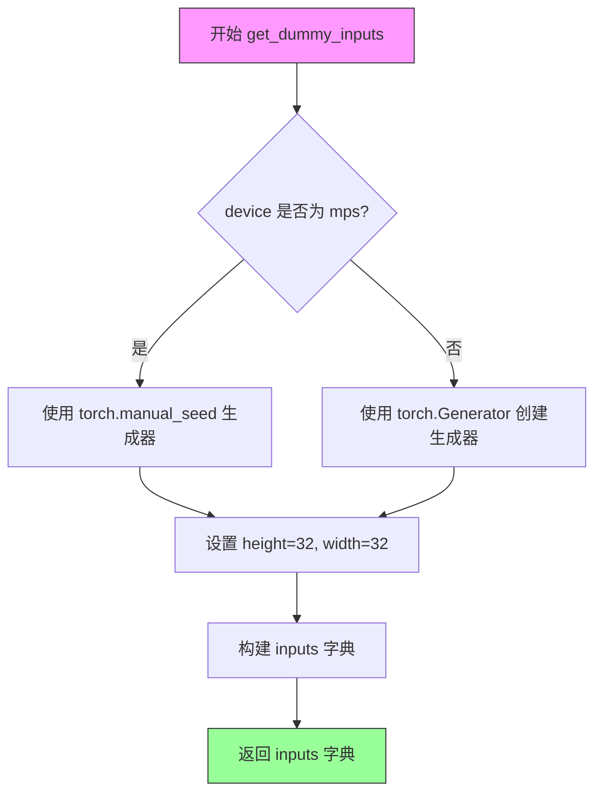

#### 带注释源码

```python
def get_dummy_inputs(self, device, seed=0):
    """
    创建用于测试 GlmImagePipeline 的虚拟输入参数。
    
    参数:
        device: 目标设备，可以是字符串如 'cpu', 'cuda' 或 torch.device 对象
        seed: 随机种子，用于确保测试结果可复现
    
    返回:
        dict: 包含管道推理所需参数的字典
    """
    # 判断是否为 Apple MPS 设备
    if str(device).startswith("mps"):
        # MPS 设备使用 CPU 风格的 manual_seed
        generator = torch.manual_seed(seed)
    else:
        # 其他设备创建指定设备的 Generator 对象
        generator = torch.Generator(device=device).manual_seed(seed)

    # 设置固定的图像尺寸用于测试
    height, width = 32, 32

    # 构建完整的输入参数字典
    inputs = {
        "prompt": "A photo of a cat",        # 测试用文本提示
        "generator": generator,               # 随机数生成器
        "num_inference_steps": 2,            # 推理步数（较小值加快测试）
        "guidance_scale": 1.5,               # Classifier-free guidance 强度
        "height": height,                     # 输出图像高度
        "width": width,                       # 输出图像宽度
        "max_sequence_length": 16,           # 文本嵌入最大序列长度
        "output_type": "pt",                 # 返回 PyTorch 张量格式
    }

    return inputs
```


### `GlmImagePipelineFastTests.test_inference`

测试 GlmImagePipeline 的基本推理功能，验证管道能够根据文本提示生成符合预期尺寸和数值范围的图像。

参数：无（该方法为 unittest.TestCase 的成员方法，通过 self 隐式访问测试实例）

返回值：无（该方法为单元测试方法，通过断言进行验证，不返回任何值）

#### 流程图

```mermaid
flowchart TD
    A[开始测试] --> B[设置设备为 CPU]
    B --> C[获取虚拟组件: get_dummy_components]
    C --> D[创建管道实例: pipeline_class]
    D --> E[将管道移至设备: pipe.to device]
    E --> F[配置进度条: set_progress_bar_config]
    F --> G[获取虚拟输入: get_dummy_inputs]
    G --> H[执行推理: pipe **inputs]
    H --> I[提取生成的图像: .images[0]]
    I --> J[提取图像切片用于验证]
    J --> K[定义期望的数值切片]
    K --> L{断言: 图像形状 == 3, 32, 32}
    L --> M{断言: 数值接近期望值}
    M --> N[测试通过]
    M --> O[测试失败: 抛出 AssertionError]
    L --> O
```

#### 带注释源码

```python
def test_inference(self):
    """测试 GlmImagePipeline 的基本推理功能."""
    
    # 步骤 1: 设置测试设备为 CPU
    device = "cpu"

    # 步骤 2: 获取虚拟组件（用于测试的轻量级模型配置）
    # 包含: tokenizer, processor, text_encoder, vision_language_encoder, vae, transformer, scheduler
    components = self.get_dummy_components()
    
    # 步骤 3: 使用虚拟组件实例化 GlmImagePipeline
    pipe = self.pipeline_class(**components)
    
    # 步骤 4: 将管道移至指定设备（CPU）
    pipe.to(device)
    
    # 步骤 5: 配置进度条（disable=None 表示不禁用进度条）
    pipe.set_progress_bar_config(disable=None)

    # 步骤 6: 获取虚拟输入参数
    # 包含: prompt, generator, num_inference_steps, guidance_scale, height, width, max_sequence_length, output_type
    inputs = self.get_dummy_inputs(device)
    
    # 步骤 7: 执行推理，获取生成的图像
    # pipe **inputs 等价于 pipe.forward(inputs)
    image = pipe(**inputs).images[0]

    # 步骤 8: 处理生成的图像用于验证
    # 展平图像为一维数组，然后拼接前8个和后8个元素（共16个特征值）
    generated_slice = image.flatten()
    generated_slice = np.concatenate([generated_slice[:8], generated_slice[-8:]])

    # 步骤 9: 定义期望的数值切片（用于验证生成结果的正确性）
    # fmt: off
    expected_slice = np.array(
        [
            0.5849247, 0.50278825, 0.45747858, 0.45895284, 0.43804976, 0.47044256, 0.5239665, 0.47904694, 
            0.3323419, 0.38725388, 0.28505728, 0.3161863, 0.35026982, 0.37546024, 0.4090118, 0.46629113
        ]
    )
    # fmt: on

    # 步骤 10: 断言验证
    # 验证图像形状为 (3, 32, 32) - 3通道 RGB, 32x32 像素
    self.assertEqual(image.shape, (3, 32, 32))
    
    # 验证生成的图像数值与期望值接近（容差: atol=1e-4, rtol=1e-4）
    self.assertTrue(np.allclose(expected_slice, generated_slice, atol=1e-4, rtol=1e-4))
```


### `GlmImagePipelineFastTests.test_inference_batch_single_identical`

验证当批处理大小为1时，使用相同随机种子生成的图像结果完全一致，确保管道在单样本推理场景下的确定性和可重复性。

参数：

- `self`：`GlmImagePipelineFastTests`，测试类实例，包含测试所需的组件和配置

返回值：`None`，测试方法不返回任何值，通过断言验证结果一致性

#### 流程图

```mermaid
flowchart TD
    A[开始测试] --> B[获取设备: cpu]
    B --> C[获取虚拟组件: get_dummy_components]
    C --> D[创建管道实例: GlmImagePipeline]
    D --> E[将管道移至设备: pipe.to device]
    E --> F[设置进度条配置: set_progress_bar_config]
    F --> G[使用种子42获取第一组输入: get_dummy_inputs seed=42]
    G --> H[使用种子42获取第二组输入: get_dummy_inputs seed=42]
    H --> I[执行第一次推理: pipe(**inputs1)]
    I --> J[提取第一张图像: image1]
    J --> K[执行第二次推理: pipe(**inputs2)]
    K --> L[提取第二张图像: image2]
    L --> M{image1 == image2}
    M -->|是| N[断言通过: 测试成功]
    M -->|否| O[断言失败: 抛出AssertionError]
```

#### 带注释源码

```python
def test_inference_batch_single_identical(self):
    """Test that batch=1 produces consistent results with the same seed."""
    # 获取测试设备（CPU）
    device = "cpu"
    
    # 获取虚拟组件（模型、处理器、调度器等）
    components = self.get_dummy_components()
    
    # 使用虚拟组件创建GLM图像管道实例
    pipe = self.pipeline_class(**components)
    
    # 将管道移至指定设备（CPU）
    pipe.to(device)
    
    # 配置进度条（disable=None 表示启用进度条）
    pipe.set_progress_bar_config(disable=None)

    # 使用相同种子42获取两组输入参数
    # inputs1 和 inputs2 应该完全相同，因为使用了相同的种子
    inputs1 = self.get_dummy_inputs(device, seed=42)
    inputs2 = self.get_dummy_inputs(device, seed=42)

    # 执行第一次推理，生成第一张图像
    image1 = pipe(**inputs1).images[0]
    
    # 执行第二次推理，生成第二张图像
    image2 = pipe(**inputs2).images[0]

    # 断言：验证两张图像在给定容差范围内完全相同
    # 如果管道是确定性的且使用了相同的种子，两张图像应该完全一致
    self.assertTrue(torch.allclose(image1, image2, atol=1e-4))
```


### `GlmImagePipelineFastTests.test_inference_batch_multiple_prompts`

测试多提示批处理功能，验证管道能够正确处理包含多个提示的列表输入，并返回对应数量的图像。

参数：

- `self`：`GlmImagePipelineFastTests`，测试类实例本身

返回值：`None`，无返回值（测试方法，通过断言验证结果）

#### 流程图

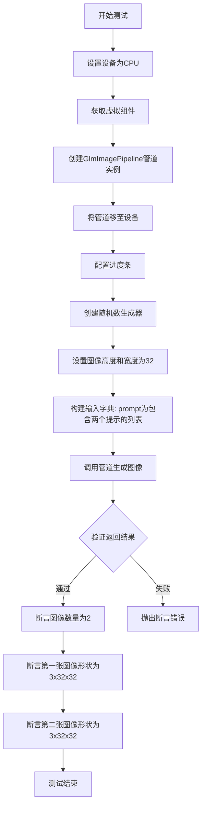

#### 带注释源码

```python
def test_inference_batch_multiple_prompts(self):
    """Test batch processing with multiple prompts."""
    # 1. 设置测试设备为 CPU
    device = "cpu"

    # 2. 获取虚拟组件（包含分词器、编码器、VAE、Transformer等）
    components = self.get_dummy_components()
    
    # 3. 使用虚拟组件创建 GlmImagePipeline 管道实例
    pipe = self.pipeline_class(**components)
    
    # 4. 将管道移至指定设备
    pipe.to(device)
    
    # 5. 配置进度条（disable=None 表示不禁用）
    pipe.set_progress_bar_config(disable=None)

    # 6. 创建随机数生成器，设置固定种子以确保可复现性
    generator = torch.Generator(device=device).manual_seed(42)
    
    # 7. 设置输出图像的高度和宽度
    height, width = 32, 32

    # 8. 构建输入参数字典
    # prompt 为列表，包含两个不同的提示词
    inputs = {
        "prompt": ["A photo of a cat", "A photo of a dog"],  # 多提示列表
        "generator": generator,                                # 随机数生成器
        "num_inference_steps": 2,                              # 推理步数
        "guidance_scale": 1.5,                                 # 引导系数
        "height": height,                                      # 输出高度
        "width": width,                                        # 输出宽度
        "max_sequence_length": 16,                             # 最大序列长度
        "output_type": "pt",                                   # 输出类型为 PyTorch 张量
    }

    # 9. 调用管道进行推理，传入多个提示
    images = pipe(**inputs).images

    # 10. 验证返回的图像数量是否为 2（对应两个提示）
    # Should return 2 images
    self.assertEqual(len(images), 2)
    
    # 11. 验证第一张图像的形状是否为 (3, 32, 32)
    self.assertEqual(images[0].shape, (3, 32, 32))
    
    # 12. 验证第二张图像的形状是否为 (3, 32, 32)
    self.assertEqual(images[1].shape, (3, 32, 32))
```


### `GlmImagePipelineFastTests.test_num_images_per_prompt`

该测试方法用于验证 GlmImagePipeline 能够在给定单个提示的情况下生成多个图像（通过 `num_images_per_prompt` 参数控制），确保管道正确处理每提示生成多图像的逻辑。

参数：

- `self`：隐式参数，`GlmImagePipelineFastTests` 实例本身，无需额外描述

返回值：无返回值（`None`），该方法为单元测试方法，通过 `self.assertEqual` 断言验证生成的图像数量和尺寸是否符合预期

#### 流程图

```mermaid
flowchart TD
    A[开始测试 test_num_images_per_prompt] --> B[设置设备为 CPU]
    B --> C[获取虚拟组件: get_dummy_components]
    C --> D[使用虚拟组件初始化 GlmImagePipeline]
    D --> E[将管道移至 CPU 设备]
    E --> F[配置进度条: set_progress_bar_config]
    F --> G[创建随机数生成器: manual_seed=42]
    G --> H[设置图像高度和宽度: 32x32]
    H --> I[构建输入字典 inputs]
    I --> J[包含参数: prompt, generator, num_inference_steps=2, guidance_scale=1.5, height, width, max_sequence_length=16, output_type=pt, num_images_per_prompt=2]
    J --> K[调用管道: pipe**inputs]
    K --> L[获取生成的图像列表: .images]
    L --> M{断言验证}
    M --> N[验证 len == 2]
    N --> O[验证 images[0].shape == 3, 32, 32]
    O --> P[验证 images[1].shape == 3, 32, 32]
    P --> Q[测试通过]
```

#### 带注释源码

```python
def test_num_images_per_prompt(self):
    """Test generating multiple images per prompt."""
    # 设置测试设备为 CPU
    device = "cpu"

    # 获取虚拟的模型组件（用于测试的轻量级模型配置）
    components = self.get_dummy_components()
    
    # 使用虚拟组件实例化图像生成管道
    pipe = self.pipeline_class(**components)
    
    # 将管道移至指定设备（CPU）
    pipe.to(device)
    
    # 配置进度条：disable=None 表示启用进度条
    pipe.set_progress_bar_config(disable=None)

    # 创建随机数生成器并设置种子，以确保测试可复现
    generator = torch.Generator(device=device).manual_seed(42)
    
    # 设置输出图像的尺寸为 32x32（测试用小尺寸）
    height, width = 32, 32

    # 构建管道输入参数字典
    inputs = {
        "prompt": "A photo of a cat",              # 文本提示
        "generator": generator,                    # 随机数生成器
        "num_inference_steps": 2,                  # 推理步数（较少以加快测试）
        "guidance_scale": 1.5,                      # 引导 scale
        "height": height,                           # 输出图像高度
        "width": width,                             # 输出图像宽度
        "max_sequence_length": 16,                 # 最大序列长度
        "output_type": "pt",                       # 输出类型为 PyTorch 张量
        "num_images_per_prompt": 2,                 # 每个提示生成 2 张图像
    }

    # 调用管道进行图像生成，返回 PipelineOutput 对象
    # 访问 .images 获取生成的图像列表
    images = pipe(**inputs).images

    # 断言验证：应该为单个提示返回 2 张图像
    self.assertEqual(len(images), 2)
    
    # 断言验证：第一张图像的形状应为 (3, 32, 32) - RGB 通道
    self.assertEqual(images[0].shape, (3, 32, 32))
    
    # 断言验证：第二张图像的形状应为 (3, 32, 32) - RGB 通道
    self.assertEqual(images[1].shape, (3, 32, 32))
```


### `GlmImagePipelineFastTests.test_batch_with_num_images_per_prompt`

测试批处理提示词与每提示词多图像生成的组合功能，验证当传入多个提示词且设置 `num_images_per_prompt > 1` 时，管道能正确生成相应数量的图像（提示词数量 × 每提示词图像数）。

参数：

- `self`：`GlmImagePipelineFastTests`，测试类实例，包含测试所需的管道和配置信息

返回值：`None`，该方法为单元测试方法，通过断言验证行为，不返回具体数据

#### 流程图

```mermaid
flowchart TD
    A[开始测试] --> B[设置设备为CPU]
    B --> C[获取虚拟组件]
    C --> D[创建GlmImagePipeline实例]
    D --> E[将管道移至设备]
    E --> F[配置进度条]
    F --> G[创建随机数生成器 seed=42]
    G --> H[设置图像尺寸 32x32]
    H --> I[构建输入字典: 2个提示词, num_images_per_prompt=2]
    I --> J[调用管道生成图像]
    J --> K{验证图像数量}
    K -->|等于4| L[测试通过]
    K -->|不等于4| M[测试失败]
```

#### 带注释源码

```python
def test_batch_with_num_images_per_prompt(self):
    """Test batch prompts with num_images_per_prompt > 1."""
    # 1. 设置测试设备为CPU
    device = "cpu"

    # 2. 获取虚拟组件（包含文本编码器、VAE、transformer等）
    components = self.get_dummy_components()
    
    # 3. 使用虚拟组件初始化图像生成管道
    pipe = self.pipeline_class(**components)
    
    # 4. 将管道移至指定设备
    pipe.to(device)
    
    # 5. 配置进度条（disable=None 表示启用进度条）
    pipe.set_progress_bar_config(disable=None)

    # 6. 创建随机数生成器，确保测试可复现
    generator = torch.Generator(device=device).manual_seed(42)
    
    # 7. 设置输出图像的高度和宽度
    height, width = 32, 32

    # 8. 构建输入参数字典
    inputs = {
        "prompt": ["A photo of a cat", "A photo of a dog"],  # 2个不同的提示词
        "generator": generator,                                # 随机数生成器
        "num_inference_steps": 2,                              # 推理步数
        "guidance_scale": 1.5,                                 # 引导强度
        "height": height,                                      # 输出高度
        "width": width,                                        # 输出宽度
        "max_sequence_length": 16,                             # 最大序列长度
        "output_type": "pt",                                   # 输出类型为PyTorch张量
        "num_images_per_prompt": 2,                            # 每个提示词生成2张图像
    }

    # 9. 调用管道进行图像生成
    images = pipe(**inputs).images

    # 10. 断言验证：期望返回4张图像（2个提示词 × 2张/提示词）
    # Should return 4 images (2 prompts × 2 images per prompt)
    self.assertEqual(len(images), 4)
```


### `GlmImagePipelineFastTests.test_prompt_with_prior_token_ids`

该测试方法验证了 GlmImagePipeline 管道能够同时接受 `prompt` 和 `prior_token_ids` 参数。当两者同时提供时，AR（自回归）生成步骤会被跳过（直接使用 prior_token_ids），而 prompt 会通过 glyph encoder 生成 prompt_embeds。测试分两步进行：首先仅使用 prompt 生成 prior_token_ids，然后同时使用两者进行图像生成，以验证管道能正确处理这种组合并生成符合预期尺寸的图像。

参数：

- `self`：隐式参数，表示测试类实例本身

返回值：`None`，该方法为单元测试方法，无返回值，通过断言验证行为正确性。

#### 流程图

```mermaid
flowchart TD
    A[开始测试 test_prompt_with_prior_token_ids] --> B[获取虚拟组件]
    B --> C[创建 GlmImagePipeline 管道并移至 CPU]
    C --> D[设置高度和宽度为 32x32]
    D --> E[Step 1: 仅使用 prompt 生成 prior_token_ids]
    E --> F[调用 pipe.generate_prior_tokens 方法]
    F --> G[获取返回的 prior_token_ids]
    G --> H[Step 2: 同时使用 prompt 和 prior_token_ids 生成图像]
    H --> I[构建输入字典 inputs_both]
    I --> J[调用 pipe 进行推理]
    J --> K[获取生成的图像列表]
    K --> L[断言: 图像数量为 1]
    L --> M[断言: 图像形状为 3x32x32]
    M --> N[结束测试]
```

#### 带注释源码

```python
def test_prompt_with_prior_token_ids(self):
    """Test that prompt and prior_token_ids can be provided together.

    When both are given, the AR generation step is skipped (prior_token_ids is used
    directly) and prompt is used to generate prompt_embeds via the glyph encoder.
    """
    # 设置测试设备为 CPU
    device = "cpu"

    # 获取虚拟组件（包含 tokenizer, processor, text_encoder, vision_language_encoder, vae, transformer, scheduler）
    components = self.get_dummy_components()
    # 使用虚拟组件创建 GlmImagePipeline 管道实例
    pipe = self.pipeline_class(**components)
    # 将管道移至指定设备（CPU）
    pipe.to(device)
    # 设置进度条配置（disable=None 表示不禁用进度条）
    pipe.set_progress_bar_config(disable=None)

    # 定义生成图像的高度和宽度
    height, width = 32, 32

    # Step 1: Run with prompt only to get prior_token_ids from AR model
    # 创建随机数生成器，设置种子为 0 以确保可复现性
    generator = torch.Generator(device=device).manual_seed(0)
    # 调用管道的 generate_prior_tokens 方法，仅使用 prompt 生成 prior_token_ids
    # 这模拟了用户先通过 AR 模型获取 token IDs 的场景
    prior_token_ids, _, _ = pipe.generate_prior_tokens(
        prompt="A photo of a cat",  # 文本提示
        height=height,             # 输出高度
        width=width,               # 输出宽度
        device=torch.device(device),  # 计算设备
        generator=torch.Generator(device=device).manual_seed(0),  # 随机生成器
    )

    # Step 2: Run with both prompt and prior_token_ids — should not raise
    # 创建新的随机生成器
    generator = torch.Generator(device=device).manual_seed(0)
    # 构建完整的输入参数字典，同时提供 prompt 和 prior_token_ids
    inputs_both = {
        "prompt": "A photo of a cat",           # 文本提示
        "prior_token_ids": prior_token_ids,    # 预先计算的 AR token IDs
        "generator": generator,                 # 随机数生成器
        "num_inference_steps": 2,               # 推理步数
        "guidance_scale": 1.5,                  # 引导系数
        "height": height,                        # 输出高度
        "width": width,                          # 输出宽度
        "max_sequence_length": 16,               # 最大序列长度
        "output_type": "pt",                     # 输出类型为 PyTorch 张量
    }
    # 调用管道进行图像生成，传入组合参数
    images = pipe(**inputs_both).images
    # 断言：应返回 1 张图像
    self.assertEqual(len(images), 1)
    # 断言：图像形状应为 (3, 32, 32) - 3通道 RGB，32x32 像素
    self.assertEqual(images[0].shape, (3, 32, 32))
```


### `GlmImagePipelineFastTests.test_check_inputs_rejects_invalid_combinations`

测试 `check_inputs` 方法能否正确拒绝无效的输入组合，包括：缺少 prompt 且缺少 prior_token_ids、仅提供 prior_token_ids 而无 prompt 或 prompt_embeds、以及同时提供 prompt 和 prompt_embeds 等三种错误情况。

参数：

- `self`：测试类实例，无需显式传递

返回值：`None`，该方法为测试用例，通过 `assertRaises` 验证异常行为，不返回具体值

#### 流程图

```mermaid
flowchart TD
    A[开始测试 test_check_inputs_rejects_invalid_combinations] --> B[获取虚拟组件并创建 Pipeline]
    B --> C[设置 height=32, width=32]
    C --> D[测试用例1: 无 prompt 且无 prior_token_ids, 仅提供 prompt_embeds]
    D --> E{调用 check_inputs 抛出 ValueError?}
    E -->|是| F[测试用例2: 仅提供 prior_token_ids, 无 prompt 和 prompt_embeds]
    F --> G{调用 check_inputs 抛出 ValueError?}
    G -->|是| H[测试用例3: 同时提供 prompt 和 prompt_embeds]
    H --> I{调用 check_inputs 抛出 ValueError?}
    I -->|是| J[所有测试用例通过]
    I -->|否| K[测试失败]
    E -->|否| K
    G -->|否| K
```

#### 带注释源码

```python
def test_check_inputs_rejects_invalid_combinations(self):
    """测试 check_inputs 方法能正确拒绝无效的输入组合。
    
    该测试验证 Pipeline 的输入验证逻辑是否健全，
    确保以下三种无效组合会触发 ValueError:
    1. 既没有 prompt 也没有 prior_token_ids（即使提供了 prompt_embeds）
    2. 只有 prior_token_ids，没有 prompt 也没有 prompt_embeds
    3. 同时提供了 prompt 和 prompt_embeds
    """
    # 获取虚拟组件用于测试
    device = "cpu"
    components = self.get_dummy_components()
    # 使用虚拟组件实例化 Pipeline
    pipe = self.pipeline_class(**components)
    # 将 Pipeline 移至指定设备
    pipe.to(device)

    # 设置测试用的图像尺寸
    height, width = 32, 32

    # ===== 测试用例1: 既无 prompt 也无 prior_token_ids =====
    # 验证当缺少主要输入时，即使提供了 prompt_embeds 也会报错
    with self.assertRaises(ValueError):
        pipe.check_inputs(
            prompt=None,
            height=height,
            width=width,
            callback_on_step_end_tensor_inputs=None,
            prompt_embeds=torch.randn(1, 16, 32),
        )

    # ===== 测试用例2: 仅提供 prior_token_ids =====
    # 验证当只有 prior_token_ids 而缺少 prompt 或 prompt_embeds 时会报错
    with self.assertRaises(ValueError):
        pipe.check_inputs(
            prompt=None,
            height=height,
            width=width,
            callback_on_step_end_tensor_inputs=None,
            prior_token_ids=torch.randint(0, 100, (1, 64)),
        )

    # ===== 测试用例3: 同时提供 prompt 和 prompt_embeds =====
    # 验证这两个互斥参数不能同时使用，会导致语义冲突
    with self.assertRaises(ValueError):
        pipe.check_inputs(
            prompt="A cat",
            height=height,
            width=width,
            callback_on_step_end_tensor_inputs=None,
            prompt_embeds=torch.randn(1, 16, 32),
        )
```


### `GlmImagePipelineFastTests.test_encode_prompt_works_in_isolation`

该测试方法旨在验证编码提示（encode prompt）功能能够独立工作，不依赖其他组件。然而，该测试目前被标记为跳过（skip），需要重新审视。

参数：

- `self`：`GlmImagePipelineFastTests`，测试类的实例，包含测试所需的组件和方法

返回值：`None`，测试方法不返回任何值

#### 流程图

```mermaid
graph TD
    A[开始测试 test_encode_prompt_works_in_isolation] --> B{装饰器检查}
    B -->|被@unittest.skip跳过| C[测试被跳过]
    C --> D[结束]
    
    style B fill:#ffcccc
    style C fill:#ffffcc
```

#### 带注释源码

```python
@unittest.skip("Needs to be revisited.")  # 装饰器：跳过该测试，标记为需要重新审视
def test_encode_prompt_works_in_isolation(self):
    """
    测试编码提示（prompt）在隔离环境下的工作情况。
    
    该测试方法旨在验证 pipeline 的 encode_prompt 方法能够独立运行，
    不受其他组件（如 VAE、transformer 等）的影响。
    
    当前状态：
    - 测试被 @unittest.skip 装饰器跳过
    - 函数体仅包含 pass 语句，不执行任何实际测试逻辑
    - 跳过原因标记为 "Needs to be revisited"（需要重新审视）
    """
    pass  # 占位符，表示该测试方法暂时不执行任何操作
```


### `GlmImagePipelineFastTests.test_pipeline_level_group_offloading_inference`

这是一个被跳过的测试方法，用于测试 GLM 图像管道的管道级组卸载推理功能。该测试目前被标记为需要重新审视（"Needs to be revisited"），因此未实现任何实际的测试逻辑，方法体仅为 `pass`。

参数：

- `self`：`GlmImagePipelineFastTests`，测试类实例本身，表示当前测试类对象

返回值：`None`，无返回值（方法体为 `pass` 语句）

#### 流程图

```mermaid
flowchart TD
    A[开始测试] --> B{检查装饰器}
    B -->|有@unittest.skip| C[跳过测试]
    B -->|无装饰器| D[执行测试逻辑]
    C --> E[测试结束 - 跳过]
    D --> E
    
    style C fill:#ff9900
    style E fill:#90EE90
```

#### 带注释源码

```python
@unittest.skip("Needs to be revisited.")
def test_pipeline_level_group_offloading_inference(self):
    """
    测试管道级组卸载推理功能。
    
    该测试方法用于验证 GLM 图像管道在管道级组卸载场景下的推理能力。
    当前实现被 @unittest.skip 装饰器跳过，标记为需要重新审视。
    
    参数:
        self: 测试类实例，继承自 unittest.TestCase
        
    返回值:
        None: 该方法不返回任何值
        
    备注:
        - 使用 @unittest.skip 装饰器暂时跳过该测试
        - 跳过原因: "Needs to be revisited" (需要重新审视)
        - 方法体仅包含 pass 语句，无实际测试逻辑
    """
    pass  # 占位符，表示该测试尚未实现
```


### `GlmImagePipelineFastTests.test_dict_tuple_outputs_equivalent`

该测试方法用于验证 `GlmImagePipeline` 的字典输出（`return_dict=True`）和元组输出（`return_dict=False`）是否等价。由于 GLM-Image pipeline 不能保证相同输入在连续运行时的输出一致性，该测试被跳过。

参数：

- `self`：`unittest.TestCase`，unittest 测试类的实例方法参数，表示测试用例本身

返回值：`None`，该方法为空实现（`pass`），不返回任何值

#### 流程图

```mermaid
flowchart TD
    A[开始测试] --> B{检查装饰器}
    B -->|有@unittest.skip| C[跳过测试]
    B -->|无装饰器| D[执行测试逻辑]
    
    C --> C1[记录跳过原因: pipeline不保证输出一致性]
    C1 --> E[结束]
    
    D --> D1[获取pipeline实例]
    D1 --> D2[使用return_dict=True调用pipeline]
    D2 --> D3[使用return_dict=False调用pipeline]
    D3 --> D4[比较两种输出的等价性]
    D4 --> E
```

#### 带注释源码

```python
@unittest.skip(
    "Follow set of tests are relaxed because this pipeline doesn't guarantee same outputs for the same inputs in consecutive runs."
)
def test_dict_tuple_outputs_equivalent(self):
    pass
```

**源码解析：**

- **`@unittest.skip(...)`**：装饰器，用于跳过该测试方法
  - **跳过原因**：该测试套件被放松要求，因为 GLM-Image pipeline 不能保证相同输入在连续运行时的输出一致性
- **`def test_dict_tuple_outputs_equivalent(self)`**：测试方法定义
  - **方法名**：`test_dict_tuple_outputs_equivalent`
  - **所属类**：`GlmImagePipelineFastTests`
  - **参数**：`self` - unittest.TestCase 的实例方法标准参数
- **`pass`**：空方法体，该测试被设计为验证 pipeline 的 `return_dict` 参数行为，但实现为空


### `GlmImagePipelineFastTests.test_cpu_offload_forward_pass_twice`

该测试方法用于验证CPU卸载功能在使用同一管道进行两次前向传播时的正确性，确保在第一次和第二次推理过程中模型能够正确地在CPU和GPU之间卸载和加载权重。由于该测试被标记为跳过，因此不执行任何实际操作。

参数：

- `self`：`GlmImagePipelineFastTests`，隐式参数，表示测试类实例本身

返回值：`None`，由于测试被跳过且方法体为空，不返回任何值

#### 流程图

```mermaid
flowchart TD
    A[开始测试] --> B{测试是否被跳过}
    B -->|是| C[跳过测试执行]
    B -->|否| D[获取管道组件]
    D --> E[执行第一次前向传播]
    E --> F[执行第二次前向传播]
    F --> G[验证两次输出的一致性]
    G --> H[清理资源]
    C --> I[结束测试]
    H --> I
```

#### 带注释源码

```python
@unittest.skip("Skipped")  # 标记该测试为跳过状态，不执行
def test_cpu_offload_forward_pass_twice(self):
    """
    测试CPU卸载功能在进行两次前向传播时的行为。
    
    该测试旨在验证：
    1. 管道在第一次推理时可以正确地将模型权重卸载到CPU
    2. 管道在第二次推理时可以再次正确加载和卸载权重
    3. 两次推理的结果应该保持一致性
    
    注意：由于测试被跳过，当前实现仅为空方法。
    """
    pass  # 空方法体，测试被跳过
```


### `GlmImagePipelineFastTests.test_sequential_offload_forward_pass_twice`

该测试方法用于验证 GLM 图像管道在顺序卸载（sequential offload）模式下能够正确执行两次前向传递，确保模型组件的卸载和重新加载机制在连续推理场景下的正确性。目前该测试被标记为跳过，等待后续重新审视。

参数：

- `self`：`GlmImagePipelineFastTests` 类型，测试类的实例，包含测试所需的组件和配置

返回值：`None`，测试方法无返回值，通过断言验证行为

#### 流程图

```mermaid
flowchart TD
    A([测试开始]) --> B{是否需要跳过测试?}
    B -->|是| C[跳过测试并标记原因]
    B -->|否| D[获取管道组件]
    D --> E[创建GLM图像管道]
    E --> F[设置设备为CPU]
    F --> G[准备测试输入]
    G --> H[执行第一次前向传递]
    H --> I[记录第一次输出]
    I --> J[执行第二次前向传递]
    J --> K[记录第二次输出]
    K --> L{两次输出是否一致?}
    L -->|是| M[测试通过]
    L -->|否| N[测试失败]
    M --> O([测试结束])
    N --> O
    
    C --> O
```

#### 带注释源码

```python
@unittest.skip("Skipped")
def test_sequential_offload_forward_pass_twice(self):
    """测试顺序卸载模式下两次前向传递的正确性。
    
    该测试方法旨在验证GLMImagePipeline在启用顺序卸载
    (sequential offload)功能时，能够正确地：
    1. 第一次执行完整的前向传递并生成图像
    2. 保持状态一致性
    3. 第二次执行前向传递并生成图像
    4. 两次生成的图像结果应该一致或符合预期
    
    顺序卸载是一种内存优化技术，它将模型的不同组件
    依次加载到GPU内存中，执行完计算后再卸载，依次
    循环往复。这对于显存受限的场景特别有用。
    
    当前测试被跳过，标记为"Skipped"，等待后续重新审视。
    可能的原因包括：
    - 测试环境配置复杂
    - 需要特定的硬件支持
    - 测试逻辑需要调整
    """
    pass
```

---

**备注**：该测试方法目前处于跳过状态，函数体仅包含 `pass` 语句。从测试类的其他方法（如 `test_cpu_offload_forward_pass_twice`）可以推断，此类测试验证的是管道在内存优化模式下的推理正确性。后续如需启用此测试，需要实现完整的测试逻辑，包括管道的顺序卸载配置、两次推理的输入准备、输出验证等。


### `GlmImagePipelineFastTests.test_float16_inference`

该测试方法用于验证 GLM-Image Pipeline 在 float16（半精度）推理模式下的正确性，确保模型能够在半精度浮点数格式下正常生成图像。目前该测试被跳过（标记为 "Skipped"），因此不执行任何验证逻辑。

参数：

- `self`：`GlmImagePipelineFastTests`，测试类实例本身

返回值：`None`，该方法不返回任何值（仅包含 `pass` 占位符）

#### 流程图

```mermaid
flowchart TD
    A[开始测试] --> B{测试是否被跳过?}
    B -->|是| C[不执行任何操作]
    B -->|否| D[执行 float16 推理测试]
    D --> E[验证推理结果正确性]
    E --> F[结束测试]
    C --> F
```

#### 带注释源码

```python
@unittest.skip("Skipped")
def test_float16_inference(self):
    """
    测试 float16（半精度）推理。
    
    该测试方法用于验证 GLM-Image Pipeline 在 float16 模式下：
    1. 能够正确加载模型为 float16 类型
    2. 能够执行推理过程
    3. 生成的图像结果与预期相符
    
    当前状态：
    - 该测试已被 @unittest.skip 装饰器跳过
    - 方法体仅包含 pass 语句，无实际测试逻辑
    - 跳过原因标记为 "Skipped"
    
    后续工作：
    - 需要重新审视并实现该测试
    - 可能需要处理 float16 相关的精度问题
    - 需要确保在不同硬件上的兼容性
    """
    pass
```


### `GlmImagePipelineFastTests.test_save_load_float16`

该测试方法用于验证 GLM 图像管道在 float16（半精度浮点数）格式下的模型保存和加载功能是否正常工作，确保管道在恢复保存的模型后仍能正确生成图像。目前该测试被标记为跳过（Skipped），尚未实现具体测试逻辑。

参数：

- `self`：`GlmImagePipelineFastTests`（unittest.TestCase），测试类实例本身

返回值：`None`，测试方法无返回值

#### 流程图

```mermaid
flowchart TD
    A[开始测试] --> B{测试是否被跳过?}
    B -->|是| C[跳过测试 - pass]
    B -->|否| D[加载管道为float16]
    D --> E[保存管道到磁盘]
    E --> F[从磁盘加载管道]
    F --> G[运行推理验证输出]
    G --> H[比对结果一致性]
    H --> I[测试通过]
```

#### 带注释源码

```python
@unittest.skip("Skipped")
def test_save_load_float16(self):
    """Test that the pipeline can be saved and loaded in float16 precision.
    
    This test verifies that:
    1. The pipeline can be converted to float16 (half-precision) format
    2. The pipeline can be serialized (saved) to disk
    3. The pipeline can be deserialized (loaded) from disk
    4. The loaded pipeline produces consistent results in float16
    
    Currently skipped - needs to be implemented.
    """
    pass  # Test not implemented, skipped
```


### `GlmImagePipelineFastTests.test_save_load_local`

该方法用于测试 GlmImagePipeline 的本地保存和加载功能，但目前已被跳过（Skipped），方法体为空（pass）。

参数：

- `self`：`GlmImagePipelineFastTests`，测试类实例，代表当前测试用例对象本身

返回值：`None`，由于方法被 `@unittest.skip` 装饰器跳过且方法体仅为 `pass`，不返回任何值

#### 流程图

```mermaid
flowchart TD
    A[开始测试] --> B{检查是否跳过}
    B -->|是| C[跳过测试]
    B -->|否| D[执行保存逻辑]
    D --> E[执行加载逻辑]
    E --> F[验证保存与加载的一致性]
    C --> G[结束]
    F --> G
```

#### 带注释源码

```python
@unittest.skip("Skipped")
def test_save_load_local(self):
    """
    测试 GlmImagePipeline 的本地保存和加载功能。
    
    该测试用例用于验证：
    1. Pipeline 能够正确保存到本地路径
    2. Pipeline 能够从本地路径正确加载
    3. 保存和加载后的 Pipeline 行为一致
    
    当前状态：已跳过 (Skipped)
    原因：可能因实现不完整或测试不稳定被开发者临时禁用
    """
    pass  # 方法体为空，等待后续实现
```

## 关键组件


### GlmImagePipelineFastTests

GlmImagePipeline 的快速测试类，继承自 PipelineTesterMixin 和 unittest.TestCase，用于验证 GLM-Image 管道在文本到图像生成任务上的正确性，包括推理、批量处理、多图生成和输入验证等功能。

### get_dummy_components

创建虚拟组件的方法，用于测试环境构建。返回包含 tokenizer、processor、text_encoder、vision_language_encoder、vae、transformer 和 scheduler 的组件字典。

### get_dummy_inputs

创建虚拟输入的方法，返回包含 prompt、generator、num_inference_steps、guidance_scale、height、width、max_sequence_length 和 output_type 的输入字典。

### test_inference

基础推理测试，验证管道能够根据文本提示生成图像，并检查输出形状和像素值是否符合预期。

### test_inference_batch_single_identical

批量推理一致性测试，验证使用相同种子时批大小为1的推理结果具有确定性。

### test_inference_batch_multiple_prompts

多提示词批量测试，验证管道能够同时处理多个文本提示并生成相应数量的图像。

### test_num_images_per_prompt

每提示词多图生成测试，验证 num_images_per_prompt 参数能够生成多张图像。

### test_batch_with_num_images_per_prompt

批量多图测试，验证批量提示词配合 num_images_per_prompt > 1 时能够生成正确数量的图像（提示词数 × 每提示词图数）。

### test_prompt_with_prior_token_ids

先验 token ID 测试，验证 prompt 和 prior_token_ids 可以同时提供，此时跳过 AR 生成步骤，直接使用 prior_token_ids 进行 glyph 编码。

### test_check_inputs_rejects_invalid_combinations

输入验证测试，验证 check_inputs 方法能够正确拒绝无效的输入组合，如缺少 prompt 和 prior_token_ids、仅有 prior_token_ids、以及同时提供 prompt 和 prompt_embeds 等情况。

### GlmImageConfig

GLM-Image 模型配置类，包含文本配置（vocab_size、hidden_size、attention heads 等）、视觉配置（depth、hidden_size、num_heads 等）和 VQ 配置（embed_dim、num_embeddings、latent_channels）。

### T5EncoderModel

文本编码器模型，用于将输入文本转换为文本嵌入向量。

### GlmImageForConditionalGeneration

视觉语言编码器模型，结合了文本和图像特征的条件生成能力。

### GlmImageProcessor

图像处理器，用于预处理输入图像和后处理生成的图像。

### GlmImageTransformer2DModel

2D 变换器模型，是图像生成的核心组件，负责根据文本嵌入和噪声进行去噪处理。

### AutoencoderKL

变分自编码器模型，用于将图像编码到潜在空间以及从潜在空间解码回图像。

### FlowMatchEulerDiscreteScheduler

调度器，使用欧拉离散方法进行 Flow Match 推理，负责控制去噪步骤。


## 问题及建议


### 已知问题

- **魔法数字与硬编码配置**：多处使用硬编码的数值（如 `height=32, width=32`、`num_inference_steps=2`、`max_sequence_length=16`），且 `patch_size × vae_scale_factor = 16` 的关系仅以注释说明，缺少运行时验证
- **重复代码模式**：`get_dummy_components()` 和 `get_dummy_inputs()` 的调用在每个测试方法中重复出现，设备转换和进度条配置代码在每个测试中重复
- **大量跳过的测试**：共 8 个测试被跳过，其中 `test_encode_prompt_works_in_isolation` 和 `test_pipeline_level_group_offloading_inference` 仅包含 `pass`，属于占位符而非真正实现
- **测试断言不完整**：`test_prompt_with_prior_token_ids` 仅验证不抛出异常，未验证输出图像的正确性；`test_inference_batch_single_identical` 未验证连续运行的实际一致性
- **条件导入隐患**：`GlmImageConfig`、`GlmImageForConditionalGeneration`、`GlmImageProcessor` 的导入依赖于 `is_transformers_version(">=", "5.0.0.dev0")`，版本兼容性逻辑脆弱
- **设备处理不一致**：代码对 `mps` 设备有特殊处理但测试统一使用 CPU，可能遗漏 MPS 设备的潜在问题
- **依赖外部模型**：处理器从 `zai-org/GLM-Image` 远程加载，若该仓库不可访问将导致测试失败

### 优化建议

- 提取公共的测试 fixtures（如 `@pytest.fixture`）以减少重复代码，统一管理设备、组件和输入的初始化
- 为跳过的测试补充实现或明确标记为 TODO，避免遗留占位符代码
- 增加参数化测试，使用 `pytest.mark.parametrize` 覆盖多组配置组合
- 添加配置验证逻辑，在 `get_dummy_components` 中检查 `patch_size × vae_scale_factor = 16` 的约束
- 为 `test_prompt_with_prior_token_ids` 添加输出验证逻辑，确保 prior_token_ids 被正确使用
- 将硬编码的配置值提取为类常量或配置文件，提升可维护性
- 考虑使用 mock 或本地模型替代远程加载的 processor，避免网络依赖导致测试不稳定

## 其它


### 设计目标与约束

该测试文件旨在验证 GlmImagePipeline 的核心功能正确性，确保文本到图像生成流程在各种输入场景下能够稳定工作。设计约束包括：必须使用 torch 加速器、transformers 版本需大于 4.57.4、测试环境为 CPU 设备、图像尺寸限制为 32x32 以确保快速执行。

### 错误处理与异常设计

测试用例覆盖了多种错误场景：通过 test_check_inputs_rejects_invalid_combinations 验证当同时提供 prompt 和 prompt_embeds 时抛出 ValueError，验证缺少必要参数（prompt 或 prior_token_ids）时的错误处理，以及 test_prompt_with_prior_token_ids 测试同时使用 prompt 和 prior_token_ids 的合法场景。

### 数据流与状态机

测试数据流遵循以下路径：get_dummy_components 初始化所有模型组件 → get_dummy_inputs 构建输入参数 → pipeline 执行推理。状态转换包括：组件加载状态、推理执行状态、输出生成状态。批次处理时通过 num_images_per_prompt 控制每批图像数量。

### 外部依赖与接口契约

依赖项包括：transformers>=5.0.0.dev0（提供 GlmImageConfig、GlmImageForConditionalGeneration、GlmImageProcessor）、diffusers 库（提供 AutoencoderKL、FlowMatchEulerDiscreteScheduler、GlmImagePipeline、GlmImageTransformer2DModel）、numpy 和 torch。外部模型依赖：hf-internal-testing/tiny-random-t5（文本编码器）、zai-org/GLM-Image/processor（图像处理器）。

### 配置与参数说明

核心配置参数包括：num_inference_steps=2（推理步数）、guidance_scale=1.5（引导强度）、height/width=32（输出尺寸）、max_sequence_length=16（最大序列长度）、output_type="pt"（输出 PyTorch 张量）、num_images_per_prompt（每提示词生成的图像数量）。pipeline_class 指定为 GlmImagePipeline，params 排除了 cross_attention_kwargs 和 negative_prompt。

### 性能考虑

测试采用最小化配置以确保快速执行：2 层 transformer、32 隐藏维度、2 注意力头、32x32 图像尺寸、2 推理步数。使用 torch.manual_seed 确保可重复性，但某些测试因结果不确定性被跳过（如 test_dict_tuple_outputs_equivalent）。

### 安全性考虑

测试文件本身为开源代码（Apache License 2.0），无直接安全风险。测试使用虚拟模型（tiny-random-t5）避免真实模型下载，processor 使用官方预训练模型需确保来源可靠。

### 测试覆盖范围

覆盖场景包括：单次推理（test_inference）、批次推理单提示词（test_inference_batch_single_identical）、多提示词批次（test_inference_batch_multiple_prompts）、每提示词多图像生成（test_num_images_per_prompt）、批次多提示词多图像（test_batch_with_num_images_per_prompt）、prior_token_ids 使用（test_prompt_with_prior_token_ids）、输入验证（test_check_inputs_rejects_invalid_combinations）。

### 版本兼容性

最低 transformers 版本要求：>4.57.4，当前测试条件：>=5.0.0.dev0。使用 is_transformers_version(">=", "5.0.0.dev0") 进行条件导入，确保新版本 API 可用。

### 资源管理

测试通过 pipe.to(device) 将模型加载到指定设备，通过 pipe.set_progress_bar_config(disable=None) 控制进度条显示。Generator 用于随机数控制确保可重复性，测试完成后自动释放资源（Python GC）。

### 跳过测试说明

多个测试因技术限制被跳过：test_encode_prompt_works_in_isolation 和 test_pipeline_level_group_offloading_inference 标记为 Needs to be revisited；test_dict_tuple_outputs_equivalent 因不保证连续运行输出一致性；test_cpu_offload_forward_pass_twice、test_sequential_offload_forward_pass_twice、test_float16_inference、test_save_load_float16、test_save_load_local 均标记为 Skipped。

### 已知问题与限制

测试中明确标注的问题包括：pipeline 不保证相同输入的连续输出一致性、某些高级功能（如 xformers attention、attention slicing、dduf）不支持、浮点精度和模型保存加载功能暂未测试。


    