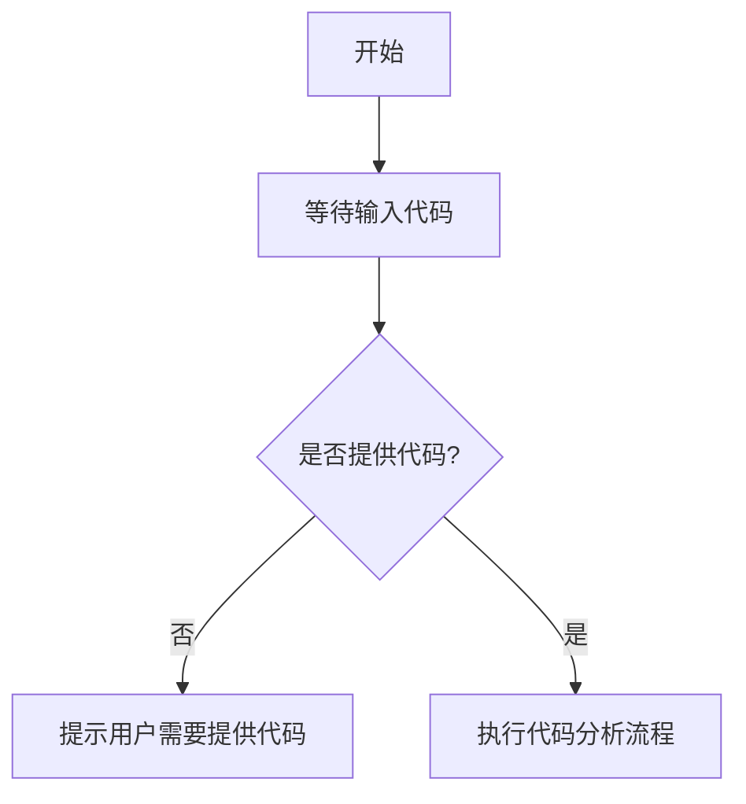

# `diffusers\tests\pipelines\hidream_image\__init__.py` 详细设计文档

未提供源代码，无法进行分析。请提供需要分析的代码。

## 整体流程



## 类结构

```

```

## 全局变量及字段


    

## 全局函数及方法


## 关键组件


### 错误说明

未提供源代码，无法进行架构分析和文档生成。代码部分为空，请提供需要分析的代码。


## 问题及建议


### 已知问题

-   未提供待分析的源代码，无法进行技术债务和优化空间的分析

### 优化建议

-   请提供需要分析的源代码，以便进行详细的技术债务识别和优化建议


## 其它


### 设计目标与约束
未提供代码，无法确定具体的设计目标与约束。一般包括性能指标、可扩展性要求、兼容性约束等。

### 错误处理与异常设计
未提供代码，无法分析具体的错误处理机制。一般包括异常类型、错误码定义、日志记录策略等。

### 数据流与状态机
未提供代码，无法绘制数据流图或状态机图。一般包括数据流向、状态转换条件、关键节点等。

### 外部依赖与接口契约
未提供代码，无法列举外部依赖和接口。一般包括第三方库、API接口、通信协议等。

### 性能考虑
未提供代码，无法分析性能瓶颈。一般包括计算复杂度、内存使用、响应时间等。

### 安全性考虑
未提供代码，无法分析安全漏洞。一般包括身份验证、授权、数据加密等。

### 可测试性
未提供代码，无法评估可测试性。一般包括单元测试、集成测试、测试覆盖率等。

### 部署和运维
未提供代码，无法提供部署细节。一般包括部署环境、配置文件、监控告警等。

### 版本控制和变更日志
未提供代码，无法提供版本信息。一般包括版本号、变更记录、兼容性说明等。

### 附录和参考资料
未提供代码，无法提供参考资料。一般包括相关文档、链接、术语表等。

    