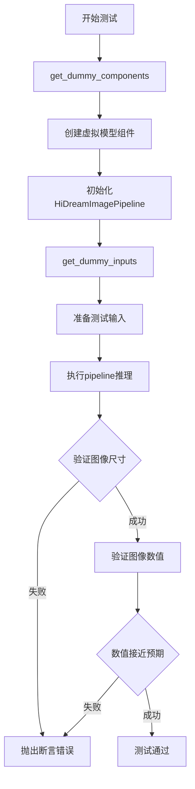
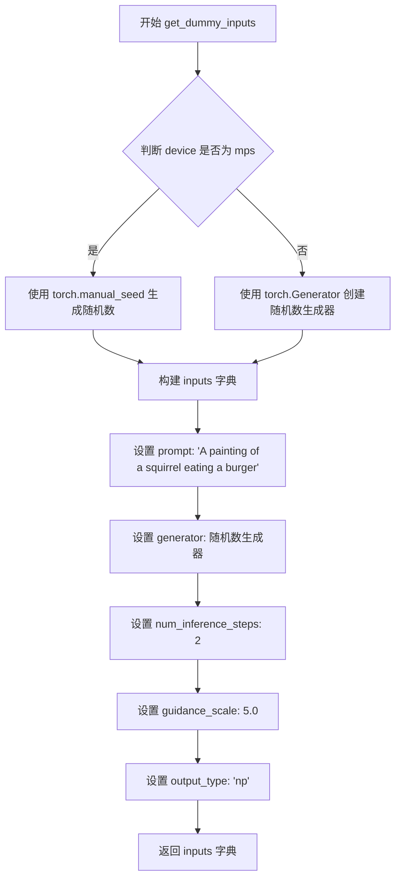
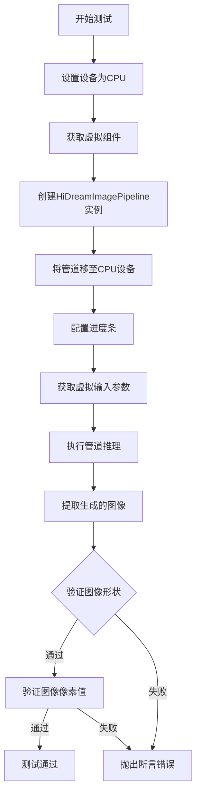
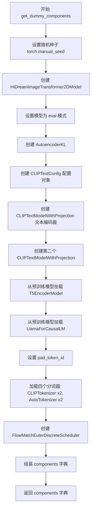
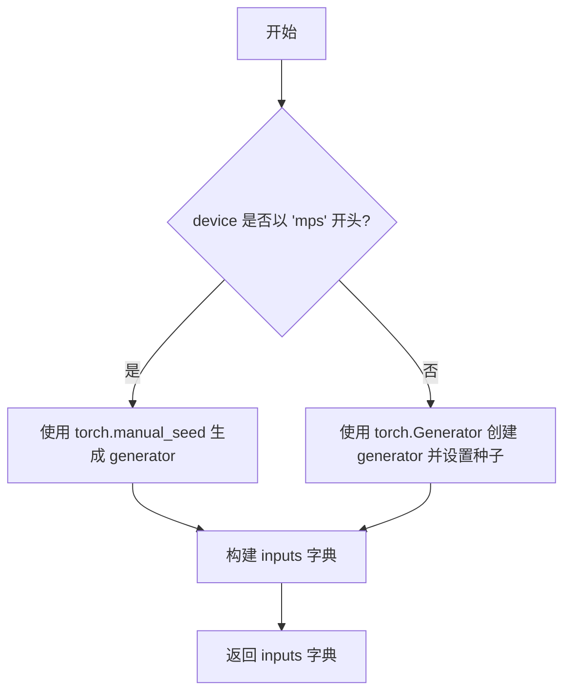
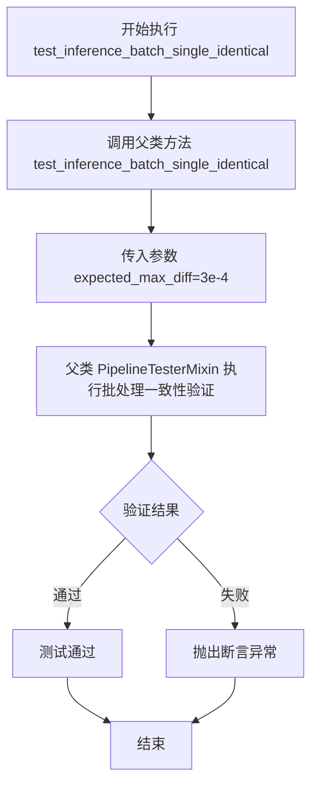

# `diffusers\tests\pipelines\hidream_image\test_pipeline_hidream.py` 详细设计文档

这是一个用于测试HiDreamImagePipeline的单元测试文件，测试了图像生成pipeline的推理功能，包括单次推理和批量推理测试，验证生成的图像尺寸和数值正确性。

## 整体流程



## 类结构

```
HiDreamImagePipelineFastTests (测试类)
└── 继承: PipelineTesterMixin, unittest.TestCase
```

## 全局变量及字段


### `enable_full_determinism`
    
启用完整确定性以确保测试可重复性的函数

类型：`function`
    


### `HiDreamImagePipelineFastTests.pipeline_class`
    
待测试的HiDream图像管道类

类型：`type[HiDreamImagePipeline]`
    


### `HiDreamImagePipelineFastTests.params`
    
文本到图像管道的参数集合（排除cross_attention_kwargs、prompt_embeds、negative_prompt_embeds）

类型：`set`
    


### `HiDreamImagePipelineFastTests.batch_params`
    
批处理参数集合，用于批量推理测试

类型：`set`
    


### `HiDreamImagePipelineFastTests.image_params`
    
图像输出参数集合

类型：`set`
    


### `HiDreamImagePipelineFastTests.image_latents_params`
    
图像潜在向量参数集合

类型：`set`
    


### `HiDreamImagePipelineFastTests.required_optional_params`
    
管道可选参数的必要子集

类型：`set`
    


### `HiDreamImagePipelineFastTests.test_xformers_attention`
    
是否测试xformers优化的注意力机制

类型：`bool`
    


### `HiDreamImagePipelineFastTests.test_layerwise_casting`
    
是否测试逐层类型转换功能

类型：`bool`
    


### `HiDreamImagePipelineFastTests.supports_dduf`
    
管道是否支持DDUF（Decoder-side Dilated Upsampling Flow）

类型：`bool`
    
    

## 全局函数及方法


### `HiDreamImagePipelineFastTests.get_dummy_components`

该方法用于创建并返回 HiDreamImagePipeline 所需的所有虚拟测试组件，包括图像变换器、VAE 编码器、多个文本编码器（CLIP、T5、LLaMA）、对应的分词器以及调度器，并设置相同的随机种子以确保测试的可重复性。

参数：

- `self`：隐式参数，TestCase 实例本身，无需额外描述

返回值：`Dict[str, Any]`，返回一个包含 pipeline 所有组件的字典，包括 scheduler、vae、text_encoder、tokenizer、text_encoder_2、tokenizer_2、text_encoder_3、tokenizer_3、text_encoder_4、tokenizer_4、transformer

#### 流程图

```mermaid
flowchart TD
    A[开始] --> B[设置随机种子 torch.manual_seed(0)]
    B --> C[创建 HiDreamImageTransformer2DModel]
    C --> D[创建 AutoencoderKL]
    D --> E[创建 CLIPTextConfig]
    E --> F[创建 CLIPTextModelWithProjection text_encoder]
    F --> G[创建另一个 CLIPTextModelWithProjection text_encoder_2]
    G --> H[创建 T5EncoderModel text_encoder_3]
    H --> I[创建 LlamaForCausalLM text_encoder_4]
    I --> J[创建 CLIPTokenizer tokenizer 和 tokenizer_2]
    J --> K[创建 AutoTokenizer tokenizer_3 和 tokenizer_4]
    K --> L[创建 FlowMatchEulerDiscreteScheduler]
    L --> M[组装 components 字典]
    M --> N[返回 components]
    N --> O[结束]
```

#### 带注释源码

```python
def get_dummy_components(self):
    """
    创建并返回用于测试的虚拟组件集合
    """
    # 设置随机种子以确保测试可重复性
    torch.manual_seed(0)
    
    # 创建图像变换器模型 - HiDreamImageTransformer2DModel
    # 参数：patch_size=2, in_channels=4, out_channels=4, num_layers=1, 
    # num_single_layers=1, attention_head_dim=8, num_attention_heads=4
    transformer = HiDreamImageTransformer2DModel(
        patch_size=2,
        in_channels=4,
        out_channels=4,
        num_layers=1,
        num_single_layers=1,
        attention_head_dim=8,
        num_attention_heads=4,
        caption_channels=[32, 16],
        text_emb_dim=64,
        num_routed_experts=4,
        num_activated_experts=2,
        axes_dims_rope=(4, 2, 2),
        max_resolution=(32, 32),
        llama_layers=(0, 1),
    ).eval()  # 设置为评估模式
    
    # 重新设置随机种子
    torch.manual_seed(0)
    
    # 创建 VAE 变分自编码器
    # scaling_factor 和 shift_factor 用于图像潜在空间的归一化
    vae = AutoencoderKL(scaling_factor=0.3611, shift_factor=0.1159)
    
    # 创建 CLIP 文本编码器配置
    clip_text_encoder_config = CLIPTextConfig(
        bos_token_id=0,
        eos_token_id=2,
        hidden_size=32,
        intermediate_size=37,
        layer_norm_eps=1e-05,
        num_attention_heads=4,
        num_hidden_layers=5,
        pad_token_id=1,
        vocab_size=1000,
        hidden_act="gelu",
        projection_dim=32,
        max_position_embeddings=128,
    )
    
    # 重新设置随机种子，创建第一个 CLIP 文本编码器
    torch.manual_seed(0)
    text_encoder = CLIPTextModelWithProjection(clip_text_encoder_config)
    
    # 创建第二个 CLIP 文本编码器（使用相同配置）
    torch.manual_seed(0)
    text_encoder_2 = CLIPTextModelWithProjection(clip_text_encoder_config)
    
    # 创建 T5 文本编码器（从预训练模型加载）
    torch.manual_seed(0)
    text_encoder_3 = T5EncoderModel.from_pretrained("hf-internal-testing/tiny-random-t5")
    
    # 创建 LLaMA 因果语言模型作为第四个文本编码器
    torch.manual_seed(0)
    text_encoder_4 = LlamaForCausalLM.from_pretrained("hf-internal-testing/tiny-random-LlamaForCausalLM")
    text_encoder_4.generation_config.pad_token_id = 1  # 设置填充 token ID
    
    # 创建对应的分词器
    tokenizer = CLIPTokenizer.from_pretrained("hf-internal-testing/tiny-random-clip")
    tokenizer_2 = CLIPTokenizer.from_pretrained("hf-internal-testing/tiny-random-clip")
    tokenizer_3 = AutoTokenizer.from_pretrained("hf-internal-testing/tiny-random-t5")
    tokenizer_4 = AutoTokenizer.from_pretrained("hf-internal-testing/tiny-random-LlamaForCausalLM")
    
    # 创建调度器 - FlowMatchEulerDiscreteScheduler
    scheduler = FlowMatchEulerDiscreteScheduler()
    
    # 组装所有组件到字典中
    components = {
        "scheduler": scheduler,
        "vae": vae,
        "text_encoder": text_encoder,
        "tokenizer": tokenizer,
        "text_encoder_2": text_encoder_2,
        "tokenizer_2": tokenizer_2,
        "text_encoder_3": text_encoder_3,
        "tokenizer_3": tokenizer_3,
        "text_encoder_4": text_encoder_4,
        "tokenizer_4": tokenizer_4,
        "transformer": transformer,
    }
    
    # 返回组件字典
    return components
```


### `HiDreamImagePipelineFastTests.get_dummy_inputs`

这是一个用于生成虚拟输入的测试辅助方法，为HiDreamImagePipeline的推理测试准备必要的参数，包括提示词、随机数生成器、推理步数、引导 scale 和输出类型。

参数：

- `self`：隐式参数，测试类实例本身
- `device`：`torch.device` 或 `str`，用于指定运行设备（如 "cpu"、"cuda" 等）
- `seed`：`int`，随机种子，默认值为 0，用于确保测试结果的可重复性

返回值：`Dict[str, Any]`，返回包含以下键的字典：
- `prompt`：`str`，输入提示词
- `generator`：`torch.Generator`，随机数生成器实例
- `num_inference_steps`：`int`，推理步数
- `guidance_scale`：`float`，引导 scale 值
- `output_type`：`str`，输出类型（"np" 表示 numpy 数组）

#### 流程图



#### 带注释源码

```python
def get_dummy_inputs(self, device, seed=0):
    """
    生成用于pipeline推理测试的虚拟输入参数。
    
    参数:
        device: 运行设备，用于创建随机数生成器
        seed: 随机种子，确保测试结果可重复
    
    返回:
        包含pipeline推理所需参数的字典
    """
    # 判断设备是否为Apple MPS (Metal Performance Shaders)
    # MPS设备不支持torch.Generator，需要使用torch.manual_seed替代
    if str(device).startswith("mps"):
        # 对于MPS设备，使用简化的随机种子设置
        generator = torch.manual_seed(seed)
    else:
        # 对于CPU/CUDA设备，创建指定设备的随机数生成器
        generator = torch.Generator(device=device).manual_seed(seed)
    
    # 构建输入参数字典，包含pipeline所需的全部配置
    inputs = {
        "prompt": "A painting of a squirrel eating a burger",  # 测试用提示词
        "generator": generator,  # 随机数生成器，确保扩散过程可重复
        "num_inference_steps": 2,  # 推理步数，测试时使用最小值加快速度
        "guidance_scale": 5.0,  # Classifier-free guidance scale
        "output_type": "np",  # 输出为numpy数组格式
    }
    return inputs
```


### `HiDreamImagePipelineFastTests.test_inference`

这是一个单元测试函数，用于验证 HiDreamImagePipeline（图像生成管道）的推理功能是否正确。测试通过使用虚拟组件构建管道，执行图像生成流程，并验证生成的图像尺寸和像素值是否符合预期。

参数：无（仅包含隐式参数 `self`，表示测试类实例本身）

返回值：无（测试函数无返回值，通过 `assert` 语句进行断言验证）

#### 流程图



#### 带注释源码

```python
def test_inference(self):
    """测试 HiDreamImagePipeline 的推理功能"""
    
    # 设置测试设备为 CPU
    device = "cpu"

    # 获取虚拟组件（用于测试的模拟模型组件）
    # 包含：transformer、vae、多个text_encoder、tokenizer、scheduler等
    components = self.get_dummy_components()
    
    # 使用虚拟组件实例化 HiDreamImagePipeline 管道
    pipe = self.pipeline_class(**components)
    
    # 将管道移至指定设备（CPU）
    pipe.to(device)
    
    # 配置进度条：disable=None 表示不禁用进度条
    pipe.set_progress_bar_config(disable=None)

    # 获取虚拟输入参数
    # 包含：prompt、generator、num_inference_steps、guidance_scale、output_type
    inputs = self.get_dummy_inputs(device)
    
    # 执行管道推理，传入所有输入参数
    # 返回值为元组，第一个元素是生成的图像列表
    image = pipe(**inputs)[0]
    
    # 提取第一张生成的图像
    generated_image = image[0]
    
    # 断言验证：生成的图像形状必须为 (128, 128, 3)
    # 128x128像素，3通道（RGB）
    self.assertEqual(generated_image.shape, (128, 128, 3))

    # 定义预期的像素值切片（用于数值验证）
    # fmt: off  # 关闭代码格式化
    expected_slice = np.array([0.4507, 0.5256, 0.4205, 0.5791, 0.4848, 0.4831, 
                               0.4443, 0.5107, 0.6586, 0.3163, 0.7318, 0.5933, 
                               0.6252, 0.5512, 0.5357, 0.5983])
    # fmt: on  # 恢复代码格式化

    # 将生成的图像展平为一维数组
    generated_slice = generated_image.flatten()
    
    # 提取前8个和后8个像素值（共16个）
    generated_slice = np.concatenate([generated_slice[:8], generated_slice[-8:]])
    
    # 断言验证：生成的像素值与预期值的差异必须在容忍范围内（1e-3）
    self.assertTrue(np.allclose(generated_slice, expected_slice, atol=1e-3))
```


### `HiDreamImagePipelineFastTests.test_inference_batch_single_identical`

该测试方法继承自 `PipelineTesterMixin` 基类，用于验证图像生成管道在批处理模式和单样本模式下生成结果的一致性，确保批处理推理不会引入额外的随机性或偏差。

参数：该方法无显式参数（继承自父类）

返回值：`None`，该方法为测试用例，通过断言验证结果一致性

#### 流程图

```mermaid
flowchart TD
    A[开始测试 test_inference_batch_single_identical] --> B[调用父类方法 super().test_inference_batch_single_identical]
    B --> C[传入 expected_max_diff=3e-4 参数]
    C --> D[父类 PipelineTesterMixin.test_inference_batch_single_identical 执行]
    D --> E[创建单样本输入和批处理输入]
    E --> F[分别运行管道生成图像]
    F --> G[比较单样本和批处理生成结果的差异]
    G --> H{差异 <= 3e-4?}
    H -->|是| I[测试通过]
    H -->|否| J[测试失败，抛出断言错误]
```

#### 带注释源码

```python
def test_inference_batch_single_identical(self):
    """
    测试批处理推理和单样本推理的结果一致性。
    
    该测试方法继承自 PipelineTesterMixin，用于验证：
    1. 管道在批处理模式下生成的图像与单样本模式下生成的图像一致
    2. 批处理不会引入额外的数值误差或随机性
    3. expected_max_diff 参数设定了允许的最大差异阈值
    """
    # 调用父类的测试方法，expected_max_diff=3e-4 表示
    # 批处理和单样本生成结果之间的最大允许差异
    super().test_inference_batch_single_identical(expected_max_diff=3e-4)
```


### `HiDreamImagePipelineFastTests.get_dummy_components`

该方法用于创建并返回一个包含HiDreamImagePipeline所需的所有虚拟组件（dummy components）的字典，包括变换器模型、VAE、多个文本编码器及其对应的分词器、调度器等，用于单元测试目的。

参数：该方法无显式参数（`self` 为隐含的实例参数）

返回值：`Dict[str, Any]`，返回一个包含以下键的字典：
- `scheduler`：调度器实例
- `vae`：变分自编码器实例
- `text_encoder`、`text_encoder_2`：CLIP文本编码器实例
- `tokenizer`、`tokenizer_2`：CLIP分词器实例
- `text_encoder_3`：T5编码器实例
- `tokenizer_3`：T5分词器实例
- `text_encoder_4`：Llama因果语言模型实例
- `tokenizer_4`：Llama分词器实例
- `transformer`：HiDream图像变换器模型实例

#### 流程图



#### 带注释源码

```python
def get_dummy_components(self):
    """
    创建并返回用于测试的虚拟组件集合。
    包含图像变换器、VAE、文本编码器、分词器和调度器。
    """
    # 设置随机种子确保测试可重复性
    torch.manual_seed(0)
    
    # 创建HiDream图像变换器模型，配置参数用于快速测试
    transformer = HiDreamImageTransformer2DModel(
        patch_size=2,              # 图像分块大小
        in_channels=4,             # 输入通道数
        out_channels=4,            # 输出通道数
        num_layers=1,              # Transformer层数
        num_single_layers=1,       # 单层数量
        attention_head_dim=8,      # 注意力头维度
        num_attention_heads=4,     # 注意力头数量
        caption_channels=[32, 16], # _caption特征通道数
        text_emb_dim=64,           # 文本嵌入维度
        num_routed_experts=4,      # 路由专家数量
        num_activated_experts=2,   # 激活专家数量
        axes_dims_rope=(4, 2, 2),  # RoPE轴维度
        max_resolution=(32, 32),   # 最大分辨率
        llama_layers=(0, 1),       # Llama层配置
    ).eval()  # 设置为评估模式
    
    # 重新设置随机种子
    torch.manual_seed(0)
    
    # 创建变分自编码器 (VAE)
    vae = AutoencoderKL(
        scaling_factor=0.3611,     # 缩放因子
        shift_factor=0.1159        # 平移因子
    )
    
    # 创建CLIP文本编码器配置
    clip_text_encoder_config = CLIPTextConfig(
        bos_token_id=0,            # 句子开始token ID
        eos_token_id=2,            # 句子结束token ID
        hidden_size=32,            # 隐藏层大小
        intermediate_size=37,      # 中间层大小
        layer_norm_eps=1e-05,      # LayerNorm epsilon
        num_attention_heads=4,     # 注意力头数量
        num_hidden_layers=5,       # 隐藏层数量
        pad_token_id=1,            # 填充token ID
        vocab_size=1000,           # 词汇表大小
        hidden_act="gelu",         # 激活函数
        projection_dim=32,         # 投影维度
        max_position_embeddings=128 # 最大位置嵌入数
    )
    
    # 创建第一个CLIP文本编码器
    torch.manual_seed(0)
    text_encoder = CLIPTextModelWithProjection(clip_text_encoder_config)
    
    # 创建第二个CLIP文本编码器（用于双文本编码器场景）
    torch.manual_seed(0)
    text_encoder_2 = CLIPTextModelWithProjection(clip_text_encoder_config)
    
    # 加载T5编码器（第三个文本编码器）
    torch.manual_seed(0)
    text_encoder_3 = T5EncoderModel.from_pretrained("hf-internal-testing/tiny-random-t5")
    
    # 加载Llama因果语言模型（第四个文本编码器）
    torch.manual_seed(0)
    text_encoder_4 = LlamaForCausalLM.from_pretrained("hf-internal-testing/tiny-random-LlamaForCausalLM")
    text_encoder_4.generation_config.pad_token_id = 1  # 设置填充token ID
    
    # 加载对应的分词器
    tokenizer = CLIPTokenizer.from_pretrained("hf-internal-testing/tiny-random-clip")
    tokenizer_2 = CLIPTokenizer.from_pretrained("hf-internal-testing/tiny-random-clip")
    tokenizer_3 = AutoTokenizer.from_pretrained("hf-internal-testing/tiny-random-t5")
    tokenizer_4 = AutoTokenizer.from_pretrained("hf-internal-testing/tiny-random-LlamaForCausalLM")
    
    # 创建调度器
    scheduler = FlowMatchEulerDiscreteScheduler()
    
    # 组装所有组件到字典中
    components = {
        "scheduler": scheduler,
        "vae": vae,
        "text_encoder": text_encoder,
        "tokenizer": tokenizer,
        "text_encoder_2": text_encoder_2,
        "tokenizer_2": tokenizer_2,
        "text_encoder_3": text_encoder_3,
        "tokenizer_3": tokenizer_3,
        "text_encoder_4": text_encoder_4,
        "tokenizer_4": tokenizer_4,
        "transformer": transformer,
    }
    
    return components
```


### `HiDreamImagePipelineFastTests.get_dummy_inputs`

该方法是一个测试辅助函数，用于生成虚拟输入字典，模拟 `HiDreamImagePipeline` 所需的输入参数，以便进行图像生成推理测试。

参数：

- `device`：`torch.device` 或 `str`，指定运行设备（如 "cpu"、"cuda" 等）
- `seed`：`int`，随机种子，默认值为 `0`，用于生成可复现的随机数

返回值：`Dict`，包含以下键值对的字典：
- `prompt`：`str`，文本提示
- `generator`：`torch.Generator`，随机数生成器
- `num_inference_steps`：`int`，推理步数
- `guidance_scale`：`float`，引导系数
- `output_type`：`str`，输出类型

#### 流程图



#### 带注释源码

```python
def get_dummy_inputs(self, device, seed=0):
    """
    生成用于测试的虚拟输入参数。
    
    参数:
        device: 运行设备，可以是 'cpu', 'cuda', 'mps' 等
        seed: 随机种子，用于生成可复现的结果
    
    返回:
        包含 pipeline 所需输入参数的字典
    """
    # 针对 Apple Silicon 的 MPS 设备，使用 torch.manual_seed
    if str(device).startswith("mps"):
        generator = torch.manual_seed(seed)
    else:
        # 对于其他设备（如 CPU、CUDA），使用 torch.Generator 并设置种子
        generator = torch.Generator(device=device).manual_seed(seed)
    
    # 构建输入参数字典
    inputs = {
        "prompt": "A painting of a squirrel eating a burger",  # 文本提示
        "generator": generator,  # 随机数生成器，确保可复现性
        "num_inference_steps": 2,  # 推理步数，测试时使用较小值加快速度
        "guidance_scale": 5.0,  # Classifier-free guidance scale
        "output_type": "np",  # 输出类型为 numpy 数组
    }
    return inputs
```


### `HiDreamImagePipelineFastTests.test_inference`

该测试方法用于验证 HiDreamImagePipeline 推理流程的正确性，通过创建虚拟组件和输入，执行文本到图像的生成，并断言生成的图像尺寸和像素值是否符合预期。

参数：无（仅包含 `self` 隐式参数）

返回值：无（`None`），该方法为测试用例，通过断言验证而非返回值

#### 流程图

```mermaid
flowchart TD
    A[开始测试] --> B[设置设备为 CPU]
    B --> C[获取虚拟组件: get_dummy_components]
    C --> D[创建管道实例: HiDreamImagePipeline]
    D --> E[将管道移至设备: pipe.to]
    E --> F[设置进度条配置]
    F --> G[获取虚拟输入: get_dummy_inputs]
    G --> H[执行推理: pipe(**inputs)]
    H --> I[提取生成的图像]
    I --> J[断言图像形状: (128, 128, 3)]
    J --> K[定义期望像素切片]
    K --> L[提取生成图像的像素切片]
    L --> M[断言像素值接近期望值: atol=1e-3]
    M --> N[测试通过]
```

#### 带注释源码

```python
def test_inference(self):
    """测试 HiDreamImagePipeline 的推理功能，验证图像生成是否正确"""
    
    # 步骤1: 设置测试设备为 CPU
    device = "cpu"

    # 步骤2: 获取虚拟组件（模型、tokenizer、scheduler等）
    # 这些是用于测试的轻量级虚拟模型
    components = self.get_dummy_components()
    
    # 步骤3: 使用虚拟组件实例化 HiDreamImagePipeline
    pipe = self.pipeline_class(**components)
    
    # 步骤4: 将管道移至指定设备（CPU）
    pipe.to(device)
    
    # 步骤5: 配置进度条（disable=None 表示不禁用）
    pipe.set_progress_bar_config(disable=None)

    # 步骤6: 获取虚拟输入参数
    # 包含: prompt, generator, num_inference_steps, guidance_scale, output_type
    inputs = self.get_dummy_inputs(device)
    
    # 步骤7: 执行管道推理，生成图像
    # 返回值为元组，第一个元素是生成的图像
    image = pipe(**inputs)[0]
    
    # 步骤8: 提取第一张生成的图像
    generated_image = image[0]
    
    # 步骤9: 断言验证 - 图像形状必须为 (128, 128, 3)
    # 128x128 像素，3 通道（RGB）
    self.assertEqual(generated_image.shape, (128, 128, 3))

    # 步骤10: 定义期望的像素值切片
    # 用于验证生成图像的像素值是否在误差范围内
    # fmt: off
    expected_slice = np.array([
        0.4507, 0.5256, 0.4205, 0.5791, 0.4848, 0.4831, 
        0.4443, 0.5107, 0.6586, 0.3163, 0.7318, 0.5933, 
        0.6252, 0.5512, 0.5357, 0.5983
    ])
    # fmt: on

    # 步骤11: 提取生成图像的像素切片
    # 将图像展平并取前8个和后8个元素（共16个）
    generated_slice = generated_image.flatten()
    generated_slice = np.concatenate([generated_slice[:8], generated_slice[-8:]])
    
    # 步骤12: 断言验证 - 像素值必须在期望值的 1e-3 误差范围内
    self.assertTrue(np.allclose(generated_slice, expected_slice, atol=1e-3))
```


### `HiDreamImagePipelineFastTests.test_inference_batch_single_identical`

该方法是一个测试用例，用于验证批处理推理与单样本推理的结果一致性，确保批处理生成的单张图像与单独生成的图像在像素级别上保持一致（允许的最大差异为 3e-4）。

参数：

- `self`：隐含的实例参数，类型为 `HiDreamImagePipelineFastTests`，表示测试类实例本身
- `expected_max_diff`：`float`，期望的最大差异阈值，用于判断批处理与单样本生成的图像差异是否在可接受范围内，默认值为 `3e-4` (0.0003)

返回值：无（`None`），该方法为测试用例，通过 unittest 框架的断言机制验证结果，不返回具体数值

#### 流程图



#### 带注释源码

```python
def test_inference_batch_single_identical(self):
    """
    测试方法：验证批处理推理与单样本推理的结果一致性
    
    该测试方法继承自 PipelineTesterMixin，用于确保在使用批处理
    (batch_size > 1) 生成图像时，其中单张图像的质量与单独使用
    num_prompts=1 生成的图像保持一致。这是图像生成管道的关键
    质量保证测试之一。
    
    参数:
        expected_max_diff: float, 允许的最大像素差异阈值
                          设置为 3e-4 (0.0003) 以确保高精度一致性
    
    返回值:
        None: 该方法为 unittest 测试用例，通过断言验证结果
    """
    # 调用父类 (PipelineTesterMixin) 的测试方法
    # 父类方法会执行以下操作:
    # 1. 使用相同的输入分别进行批处理和单样本推理
    # 2. 提取批处理结果中的第一张图像
    # 3. 比较两张图像的像素差异
    # 4. 断言差异小于等于 expected_max_diff
    super().test_inference_batch_single_identical(expected_max_diff=3e-4)
```

## 关键组件


### HiDreamImagePipeline

主图像生成流水线类，整合变换器模型、VAE、多个文本编码器和调度器，实现文本到图像的生成功能。

### HiDreamImageTransformer2DModel

图像变换器模型，采用patch嵌入、注意力机制、RoPE位置编码和路由专家混合（MoE）架构，用于处理图像特征。

### AutoencoderKL

变分自编码器（VAE），用于将图像编码到潜在空间并从潜在空间解码重建图像，支持潜在表示的缩放和偏移。

### CLIPTextModelWithProjection

CLIP文本编码器（text_encoder, text_encoder_2），将文本提示编码为embedding表示，并输出投影维度用于条件生成。

### T5EncoderModel

T5文本编码器（text_encoder_3），提供额外的文本编码能力，增强多模态条件信息的丰富度。

### LlamaForCausalLM

Llama因果语言模型（text_encoder_4），作为第四个文本编码器，提供更强大的文本理解和表示能力。

### FlowMatchEulerDiscreteScheduler

流匹配欧拉离散调度器，控制去噪扩散过程中的噪声调度和采样步骤。

### 多个分词器

CLIPTokenizer（tokenizer, tokenizer_2）、AutoTokenizer（tokenizer_3, tokenizer_4），分别用于对不同文本编码器的输入进行分词处理。

### PipelineTesterMixin

测试混入类，提供通用的流水线测试方法，包括批处理测试、xformers注意力测试、分层类型转换测试等通用测试接口。

### 张量索引与惰性加载

代码中通过generator参数实现随机数生成器的显式控制，支持可重复的图像生成过程，体现了对张量操作的精细控制。

### 多编码器架构

支持4个不同类型的文本编码器（CLIP x2、T5、Llama）并行处理文本提示，每个编码器配备独立的分词器，实现多模态条件信息的融合。


## 问题及建议


### 已知问题

- **硬编码的测试标志缺少文档说明**：`test_xformers_attention = False`、`test_layerwise_casting = True`、`supports_dduf = False` 被硬编码，但没有任何注释解释为何启用或禁用这些特性
- **随机种子设置方式不可靠**：大量使用 `torch.manual_seed(0)` 设置随机种子，在多线程或CUDA环境下可能导致不确定性，且无法保证与其它模块的种子隔离
- **外部测试模型依赖**：从 `hf-internal-testing/tiny-random-*` 加载模型，这些是外部测试模型，可能存在版本变化风险，且无版本锁定
- **设备兼容性处理不完整**：对 MPS 设备有特殊处理 (`if str(device).startswith("mps")`)，但对其他设备（如 Vulkan、CUDA）的边界情况处理可能不足
- **数值精度阈值缺乏说明**：`np.allclose(generated_slice, expected_slice, atol=1e-3)` 中的阈值选择依据未注释，且在某些硬件上可能导致误报
- **参数集合修改缺少文档**：`params = TEXT_TO_IMAGE_PARAMS - {"cross_attention_kwargs", "prompt_embeds", "negative_prompt_embeds"}` 排除了某些参数，但未说明原因
- **缺少异常处理**：模型加载和推理过程缺少 try-except 包装，测试失败时难以定位根因

### 优化建议

- 为所有硬编码的测试标志添加 docstring 或注释，说明功能开关的原因和测试覆盖意图
- 使用 `torch.cuda.manual_seed_all()` 和 `torch.manual_seed()` 组合，或引入全局种子管理模块以确保跨平台一致性
- 考虑将外部测试模型替换为本地 mock 对象，或在代码中明确标注版本号以确保可复现性
- 扩展设备检测逻辑，使用 `diffusers.utils` 提供的设备检测工具统一处理各类硬件
- 将魔法数字（如 VAE 的 scaling_factor、shift_factor）提取为常量或配置文件，并添加注释说明其物理意义
- 在参数集合修改处添加注释说明，排除特定参数是出于测试简化还是功能限制的考量
- 在关键路径添加异常捕获和更详细的错误信息，例如在模型加载失败时打印完整的堆栈跟踪

## 其它


### 设计目标与约束

本测试文件旨在验证HiDreamImagePipeline的核心功能，确保图像生成流程在给定虚拟组件配置下能够正确执行。设计约束包括：1）仅使用CPU设备进行测试；2）使用固定的随机种子确保测试可重复性；3）测试图像尺寸限制为128x128；4）依赖diffusers库的PipelineTesterMixin标准测试框架。

### 错误处理与异常设计

测试代码未显式实现复杂的错误处理机制，主要依赖unittest框架的断言来验证功能正确性。当图像尺寸不匹配、数值精度超出容差范围或组件配置错误时，测试将失败并抛出AssertionError。潜在的改进方向包括：为不同设备（CPU/MPS/GPU）添加更细粒度的异常捕获，以及在测试失败时提供更详细的诊断信息。

### 数据流与状态机

测试数据流遵循以下路径：首先通过get_dummy_components()创建虚拟的transformer、VAE、多个text_encoder和tokenizer组件；然后将这些组件传递给pipeline_class构造函数初始化管道；接着通过get_dummy_inputs()生成包含prompt、generator、num_inference_steps和guidance_scale的输入字典；最后调用管道执行推理并验证输出图像。状态转换主要包括：组件初始化→管道构建→推理执行→结果验证。

### 外部依赖与接口契约

本测试文件依赖于以下外部包和接口：1）transformers库提供CLIPTextModelWithProjection、LlamaForCausalLM、T5EncoderModel和AutoTokenizer；2）diffusers库提供HiDreamImagePipeline、HiDreamImageTransformer2DModel、AutoencoderKL和FlowMatchEulerDiscreteScheduler；3）numpy和torch用于数值计算和张量操作。管道类需遵循PipelineTesterMixin定义的接口契约，包括required_optional_params属性和特定的批处理测试方法。

### 性能考量与基准测试

当前测试配置使用了极简的模型配置（num_layers=1, num_attention_heads=4, num_inference_steps=2）以确保快速执行。测试中的性能基准通过expected_slice数组定义，允许的数值误差容差为atol=1e-3，批处理测试的expected_max_diff为3e-4。测试设计为快速失败模式（FastTests），不适合作为性能基准测试。

### 安全性考虑

测试代码不涉及敏感数据处理，所有组件均为虚拟模型（tiny-random-*）。代码遵循Apache 2.0许可证，不存在明显的安全漏洞。测试环境应确保torch和numpy的确定性模式已启用（通过enable_full_determinism），以避免由于浮点数运算顺序导致的非确定性结果。

### 兼容性设计

测试代码针对不同设备提供兼容处理：对于MPS设备使用torch.manual_seed()，其他设备使用torch.Generator(device=device)。支持的输出类型为"np"（numpy数组）。pipeline_class的params配置通过集合差运算排除了cross_attention_kwargs、prompt_embeds和negative_prompt_embeds参数，表明该管道可能不完全支持这些高级功能。

    