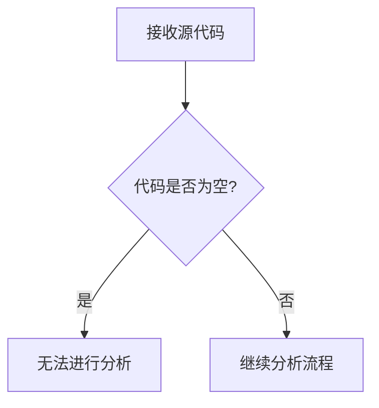

# `diffusers\tests\pipelines\hunyuan_image_21\__init__.py` 详细设计文档

未提供代码，无法生成描述

## 整体流程



## 类结构

```
无法确定类层次结构
```

## 全局变量及字段


    

## 全局函数及方法


## 关键组件


## 问题及建议


### 已知问题

-   缺少待分析的代码：用户未提供任何代码内容，无法进行技术债务或优化空间的分析。

### 优化建议

-   请提供需要分析的源代码，以便进行详细的技术债务识别和优化建议的生成。
-   确保提供的代码完整且包含必要的上下文信息。


## 其它


### 设计目标与约束
描述系统的核心设计目标，如性能、可扩展性、安全性、兼容性等，以及所面临的约束条件，例如技术栈限制、预算、时间表、 regulatory compliance 等。

### 错误处理与异常设计
说明系统如何处理错误和异常，包括错误码定义、异常分类、日志记录策略、用户友好的错误信息呈现、降级策略等。

### 数据流与状态机
描绘数据在系统中的流转过程，包括数据输入、处理、存储和输出的完整路径；若涉及状态机，则描述状态转换条件、触发事件和动作。

### 外部依赖与接口契约
列出系统所依赖的外部服务、库、API 等，并详细说明接口契约，包括请求/响应格式、认证机制、速率限制、版本管理等。

### 安全性考虑
阐述系统在身份验证、授权、数据加密、输入验证、防护措施（如 XSS、SQL 注入）等安全方面的设计。

### 性能要求
明确系统的性能指标，如响应时间、吞吐量、并发用户数、资源利用率等，以及性能测试策略。

### 配置管理
说明系统配置的管理方式，包括配置来源、存储方式、热更新机制、环境差异处理等。

### 测试策略
描述单元测试、集成测试、系统测试、端到端测试的策略与工具，以及测试覆盖率目标。

### 部署模型
说明系统的部署架构，包括部署环境、容器化方案、负载均衡、高可用性设计、灾难恢复等。

### 监控与日志
阐述系统监控指标、日志收集与分析、告警机制、性能追踪（APM）等运维相关内容。

### 版本控制与变更管理
说明代码版本控制策略、变更流程、发布管理、回滚计划等。

### 文档与维护
描述系统文档的维护计划，包括 API 文档、架构图、运维手册、培训材料等，以及长期维护策略。

    