# `diffusers\tests\pipelines\hunyuan_image_21\test_hunyuanimage.py` 详细设计文档

这是HunyuanImagePipeline的单元测试文件，包含多个测试用例验证图像生成管道的核心功能，包括基础推理、带引导的推理、蒸馏引导缩放和VAE平铺等技术特性。

## 整体流程

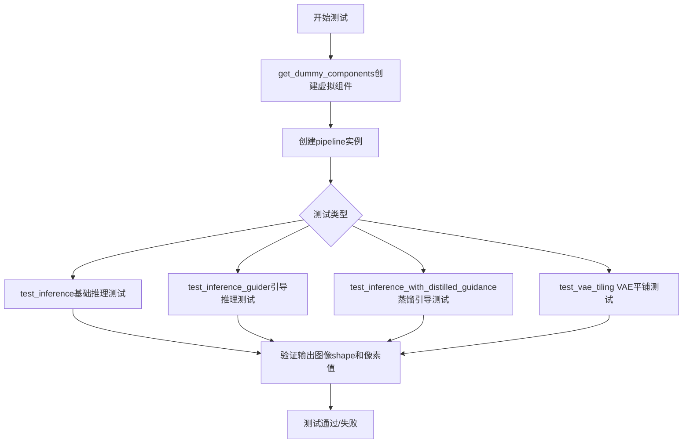

## 类结构

```
HunyuanImagePipelineFastTests (测试类)
├── 继承自 PipelineTesterMixin
├── 继承自 FirstBlockCacheTesterMixin
└── 继承自 unittest.TestCase
```

## 全局变量及字段


### `enable_full_determinism`
    
启用完全确定性模式的函数，确保测试结果可复现

类型：`Callable`
    


### `to_np`
    
将PyTorch张量或PIL图像转换为NumPy数组的辅助函数

类型：`Callable`
    


### `PipelineTesterMixin`
    
管道测试的通用测试用例混入类，提供标准化的管道测试方法

类型：`Type[unittest.TestCase]`
    


### `FirstBlockCacheTesterMixin`
    
首块缓存测试的混入类，用于测试Transformer首块缓存功能

类型：`Type[unittest.TestCase]`
    


### `HunyuanImagePipelineFastTests.pipeline_class`
    
被测试的HunyuanImagePipeline管道类

类型：`Type[HunyuanImagePipeline]`
    


### `HunyuanImagePipelineFastTests.params`
    
管道推理时需要传递的参数集合，包括prompt、height、width

类型：`frozenset[str]`
    


### `HunyuanImagePipelineFastTests.batch_params`
    
支持批量处理的参数集合，包括prompt和negative_prompt

类型：`frozenset[str]`
    


### `HunyuanImagePipelineFastTests.required_optional_params`
    
可选的必需参数集合，包括推理步数、生成器、潜在向量等

类型：`frozenset[str]`
    


### `HunyuanImagePipelineFastTests.test_xformers_attention`
    
标志位，指示是否测试xFormers注意力机制（当前设为False）

类型：`bool`
    


### `HunyuanImagePipelineFastTests.test_layerwise_casting`
    
标志位，指示是否测试层级类型转换功能（当前设为True）

类型：`bool`
    


### `HunyuanImagePipelineFastTests.test_group_offloading`
    
标志位，指示是否测试模型组卸载功能（当前设为True）

类型：`bool`
    


### `HunyuanImagePipelineFastTests.test_attention_slicing`
    
标志位，指示是否测试注意力切片功能（当前设为False）

类型：`bool`
    


### `HunyuanImagePipelineFastTests.supports_dduf`
    
标志位，指示管道是否支持DDUF（Decoder-only Diffusion Upsampling Fusion）

类型：`bool`
    
    

## 全局函数及方法


### `HunyuanImagePipelineFastTests.get_dummy_components`

该函数用于创建HunyuanImagePipeline测试所需的虚拟（dummy）组件，包括图像变换器（transformer）、VAE模型、调度器、文本编码器（两个）以及可选的引导器组件。这些组件通过固定随机种子确保测试的可重复性。

参数：

- `num_layers`：`int`，transformer模型的主层数，默认为1
- `num_single_layers`：`int`，transformer模型的单独层数，默认为1
- `guidance_embeds`：`bool`，是否启用guidance嵌入，默认为False

返回值：`Dict[str, Any]`，返回包含所有虚拟组件的字典，键名包括"transformer"、"vae"、"scheduler"、"text_encoder"、"text_encoder_2"、"tokenizer"、"tokenizer_2"、"guider"和"ocr_guider"

#### 流程图

```mermaid
flowchart TD
    A[开始 get_dummy_components] --> B[设置随机种子 torch.manual_seed(0)]
    B --> C[创建 HunyuanImageTransformer2DModel]
    C --> D[设置随机种子 torch.manual_seed(0)]
    D --> E[创建 AutoencoderKLHunyuanImage]
    E --> F[设置随机种子 torch.manual_seed(0)]
    F --> G[创建 FlowMatchEulerDiscreteScheduler]
    G --> H{guidance_embeds?}
    H -->|False| I[创建 AdaptiveProjectedMixGuider]
    I --> J[创建第二个 AdaptiveProjectedMixGuidance]
    H -->|True| K[guider 和 ocr_guider 设为 None]
    J --> L[设置随机种子 torch.manual_seed(0)]
    K --> L
    L --> M[创建 Qwen2_5_VLConfig]
    M --> N[创建 Qwen2_5_VLForConditionalGeneration]
    N --> O[创建 Qwen2Tokenizer]
    O --> P[设置随机种子 torch.manual_seed(0)]
    P --> Q[创建 T5Config]
    Q --> R[创建 T5EncoderModel]
    R --> S[创建 ByT5Tokenizer]
    S --> T[组装 components 字典]
    T --> U[返回 components]
```

#### 带注释源码

```python
def get_dummy_components(self, num_layers: int = 1, num_single_layers: int = 1, guidance_embeds: bool = False):
    """
    创建用于测试的虚拟组件集合
    
    参数:
        num_layers: transformer模型的主层数，控制模型深度
        num_single_layers: transformer模型的单独层数
        guidance_embeds: 是否启用guidance嵌入，为True时guider组件为None
    
    返回:
        包含所有pipeline组件的字典
    """
    # 使用固定随机种子确保测试可重复性
    torch.manual_seed(0)
    # 创建图像变换器模型，配置注意力头、层数、patch大小等参数
    transformer = HunyuanImageTransformer2DModel(
        in_channels=4,
        out_channels=4,
        num_attention_heads=4,
        attention_head_dim=8,
        num_layers=num_layers,
        num_single_layers=num_single_layers,
        num_refiner_layers=1,
        patch_size=(1, 1),
        guidance_embeds=guidance_embeds,
        text_embed_dim=32,
        text_embed_2_dim=32,
        rope_axes_dim=(4, 4),
    )

    # 重新设置随机种子确保VAE初始化可重复
    torch.manual_seed(0)
    # 创建VAE模型，用于图像的编码和解码
    vae = AutoencoderKLHunyuanImage(
        in_channels=3,
        out_channels=3,
        latent_channels=4,
        block_out_channels=(32, 64, 64, 64),
        layers_per_block=1,
        scaling_factor=0.476986,
        spatial_compression_ratio=8,
        sample_size=128,
    )

    # 创建调度器，控制扩散过程的噪声调度
    torch.manual_seed(0)
    scheduler = FlowMatchEulerDiscreteScheduler(shift=7.0)

    # 根据guidance_embeds标志决定是否创建引导器
    if not guidance_embeds:
        torch.manual_seed(0)
        # 创建主要的引导器，用于条件生成控制
        guider = AdaptiveProjectedMixGuidance(adaptive_projected_guidance_start_step=2)
        # 创建OCR专用的引导器
        ocr_guider = AdaptiveProjectedMixGuidance(adaptive_projected_guidance_start_step=3)
    else:
        # 当启用guidance_embeds时，引导器由transformer内部处理
        guider = None
        ocr_guider = None
    
    # 配置Qwen2.5视觉语言模型的参数
    torch.manual_seed(0)
    config = Qwen2_5_VLConfig(
        text_config={
            "hidden_size": 32,
            "intermediate_size": 32,
            "num_hidden_layers": 2,
            "num_attention_heads": 2,
            "num_key_value_heads": 2,
            "rope_scaling": {
                "mrope_section": [2, 2, 4],
                "rope_type": "default",
                "type": "default",
            },
            "rope_theta": 1000000.0,
        },
        vision_config={
            "depth": 2,
            "hidden_size": 32,
            "intermediate_size": 32,
            "num_heads": 2,
            "out_hidden_size": 32,
        },
        hidden_size=32,
        vocab_size=152064,
        vision_end_token_id=151653,
        vision_start_token_id=151652,
        vision_token_id=151654,
    )
    # 实例化Qwen2.5多模态文本编码器
    text_encoder = Qwen2_5_VLForConditionalGeneration(config)
    # 加载对应的分词器
    tokenizer = Qwen2Tokenizer.from_pretrained("hf-internal-testing/tiny-random-Qwen2VLForConditionalGeneration")

    # 配置T5文本编码器（用于额外文本处理）
    torch.manual_seed(0)
    t5_config = T5Config(
        d_model=32,
        d_kv=4,
        d_ff=16,
        num_layers=2,
        num_heads=2,
        relative_attention_num_buckets=8,
        relative_attention_max_distance=32,
        vocab_size=256,
        feed_forward_proj="gated-gelu",
        dense_act_fn="gelu_new",
        is_encoder_decoder=False,
        use_cache=False,
        tie_word_embeddings=False,
    )
    # 实例化T5编码器模型
    text_encoder_2 = T5EncoderModel(t5_config)
    # 加载字节级T5分词器
    tokenizer_2 = ByT5Tokenizer()

    # 组装所有组件到统一字典中
    components = {
        "transformer": transformer,
        "vae": vae,
        "scheduler": scheduler,
        "text_encoder": text_encoder,
        "text_encoder_2": text_encoder_2,
        "tokenizer": tokenizer,
        "tokenizer_2": tokenizer_2,
        "guider": guider,
        "ocr_guider": ocr_guider,
    }
    return components
```


### `HunyuanImagePipelineFastTests.get_dummy_inputs`

该方法用于生成用于图像生成 pipeline 测试的虚拟输入参数。它根据设备类型（MPS 或其他）初始化随机数生成器，并返回一个包含提示词、生成器、推理步数、图像尺寸和输出类型的字典。

参数：

- `self`：`HunyuanImagePipelineFastTests`，类的实例本身
- `device`：`str` 或 `torch.device`，运行设备，用于创建随机数生成器
- `seed`：`int`，随机种子，默认为 0，用于保证测试的可重复性

返回值：`Dict[str, Any]`，包含以下键值对：
- `prompt`（str）：测试用的提示词
- `generator`（torch.Generator）：PyTorch 随机数生成器
- `num_inference_steps`（int）：推理步数
- `height`（int）：生成图像的高度
- `width`（int）：生成图像的宽度
- `output_type`（str）：输出类型，此处为 "pt"（PyTorch 张量）

#### 流程图

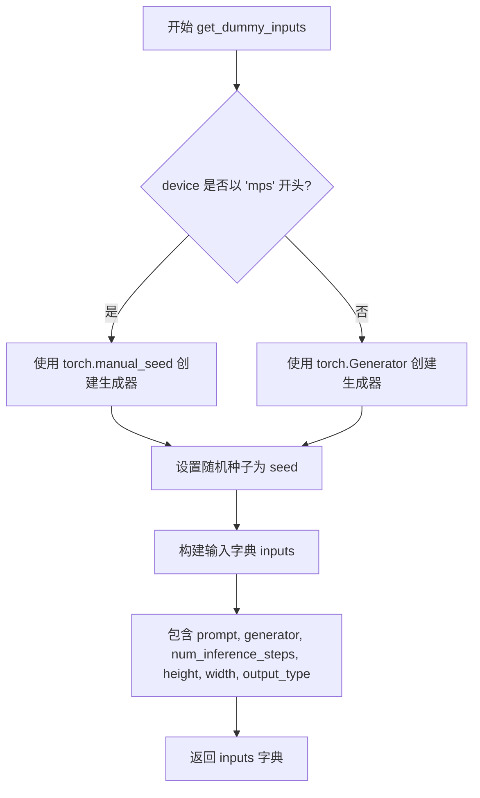

#### 带注释源码

```python
def get_dummy_inputs(self, device, seed=0):
    """
    生成用于测试的虚拟输入参数。
    
    Args:
        self: HunyuanImagePipelineFastTests 类的实例
        device: 运行设备，用于创建随机数生成器
        seed: 随机种子，默认为 0，用于保证测试的可重复性
    
    Returns:
        dict: 包含测试所需的输入参数字典
    """
    # 判断设备是否为 Apple MPS (Metal Performance Shaders)
    if str(device).startswith("mps"):
        # MPS 设备不支持 torch.Generator，使用 torch.manual_seed 代替
        generator = torch.manual_seed(seed)
    else:
        # 其他设备（CPU/CUDA）使用 torch.Generator 创建随机数生成器
        generator = torch.Generator(device=device).manual_seed(seed)

    # 构建测试输入字典，包含 pipeline 所需的所有参数
    inputs = {
        "prompt": "A painting of a squirrel eating a burger",  # 测试用提示词
        "generator": generator,                                  # 随机数生成器
        "num_inference_steps": 5,                                # 推理步数
        "height": 16,                                            # 生成图像高度
        "width": 16,                                             # 生成图像宽度
        "output_type": "pt",                                     # 输出为 PyTorch 张量
    }
    return inputs
```


### `HunyuanImagePipelineFastTests.test_inference`

该方法是一个单元测试函数，用于测试 `HunyuanImagePipeline` 图像生成管道的推理功能。它通过创建虚拟组件（transformer、vae、scheduler等）构建管道，执行图像生成推理，并验证生成图像的形状和像素值是否符合预期。

参数：

- `self`：隐式参数，类型为 `HunyuanImagePipelineFastTests`（unittest.TestCase），代表测试类实例本身

返回值：`None`，该方法为单元测试方法，无返回值，通过断言验证推理结果的正确性

#### 流程图

```mermaid
flowchart TD
    A[开始测试] --> B[设置设备为CPU]
    B --> C[调用get_dummy_components获取虚拟组件]
    C --> D[使用虚拟组件实例化HunyuanImagePipeline]
    D --> E[将管道移至CPU设备]
    E --> F[配置进度条显示]
    F --> G[调用get_dummy_inputs获取测试输入]
    G --> H[执行管道推理: pipe(**inputs)]
    H --> I[提取生成的图像: image[0]]
    I --> J[断言图像形状为3x16x16]
    J --> K[定义期望的像素值数组expected_slice_np]
    K --> L[提取图像右下角3x3区域并展平]
    L --> M[断言输出与期望值的最大差异小于1e-3]
    M --> N[测试结束]
```

#### 带注释源码

```python
def test_inference(self):
    """
    测试HunyuanImagePipeline的基本推理功能
    
    该测试方法验证管道能够：
    1. 正确加载和配置各个组件（transformer, vae, scheduler等）
    2. 根据文本提示生成图像
    3. 输出正确形状的图像张量
    4. 生成具有合理像素值范围的图像
    """
    # 设置测试设备为CPU
    device = "cpu"

    # 获取虚拟组件配置，用于构建测试用的管道
    # 这些是轻量级的dummy模型，配置了极小的参数以便快速测试
    components = self.get_dummy_components()
    
    # 使用pipeline_class (HunyuanImagePipeline) 和虚拟组件实例化管道
    pipe = self.pipeline_class(**components)
    
    # 将管道移至指定设备（CPU）上运行
    pipe.to(device)
    
    # 配置进度条显示，disable=None表示使用默认设置
    pipe.set_progress_bar_config(disable=None)

    # 获取测试输入参数，包括提示词、随机种子、推理步数等
    inputs = self.get_dummy_inputs(device)
    
    # 执行管道推理，传入输入参数，获取生成的图像结果
    # pipe(**inputs)返回一个对象，其images属性包含生成的图像列表
    image = pipe(**inputs).images
    
    # 提取第一张生成的图像（batch中只有一个）
    generated_image = image[0]
    
    # 断言验证：生成的图像形状应为(3, 16, 16)
    # 3表示RGB三通道，16x16表示图像高度和宽度
    self.assertEqual(generated_image.shape, (3, 16, 16))

    # 定义期望的图像像素值数组（用于验证输出正确性）
    # 这些值是通过已知正确实现预先计算得出的基准值
    expected_slice_np = np.array(
        [0.6252659, 0.51482046, 0.60799813, 0.59267783, 0.488082, 0.5857634, 0.523781, 0.58028054, 0.5674121]
    )
    
    # 提取生成图像右下角3x3区域的像素值并展平为一维数组
    # [0, -3:, -3:] 表示选择第一个通道的最后3行和最后3列
    output_slice = generated_image[0, -3:, -3:].flatten().cpu().numpy()

    # 断言验证：输出像素值与期望值的最大绝对误差应小于1e-3
    # 如果误差过大，说明管道实现存在问题或产生了不确定的结果
    self.assertTrue(
        np.abs(output_slice - expected_slice_np).max() < 1e-3,
        f"output_slice: {output_slice}, expected_slice_np: {expected_slice_np}",
    )
```


### `HunyuanImagePipelineFastTests.test_inference_guider`

该方法是一个单元测试，用于验证 HunyuanImagePipeline 在使用 guider（引导器）进行推理时的正确性。测试通过设置较高的 guidance_scale（1000），确保引导器能够正确影响图像生成过程，并验证生成的图像形状和像素值是否符合预期。

参数：

- `self`：隐式参数，类型为 `HunyuanImagePipelineFastTests`（测试类实例），表示测试用例本身的引用

返回值：`None`，该方法为测试用例，无返回值，通过 `self.assertEqual` 和 `self.assertTrue` 断言验证推理结果的正确性

#### 流程图

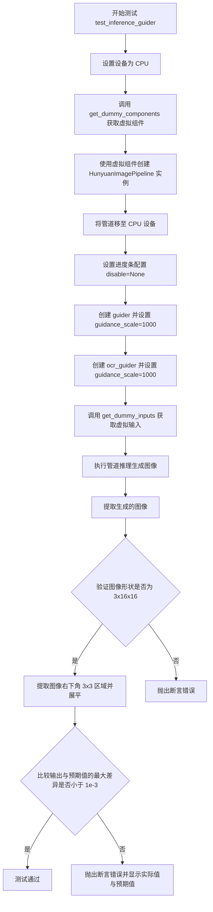

#### 带注释源码

```python
def test_inference_guider(self):
    """
    测试使用 guider 进行推理的功能。
    验证管道在 guidance_scale=1000 时能够正确生成图像。
    """
    # 1. 设置测试设备为 CPU
    device = "cpu"

    # 2. 获取虚拟组件（transformer, vae, scheduler, tokenizer 等）
    components = self.get_dummy_components()
    
    # 3. 使用虚拟组件实例化 HunyuanImagePipeline 管道
    pipe = self.pipeline_class(**components)
    
    # 4. 将管道移至 CPU 设备
    pipe.to(device)
    
    # 5. 设置进度条配置，disable=None 表示启用进度条
    pipe.set_progress_bar_config(disable=None)

    # 6. 重新创建 guider 并设置高 guidance_scale
    # guidance_scale=1000 表示强引导，用于测试引导器功能
    pipe.guider = pipe.guider.new(guidance_scale=1000)
    
    # 7. 重新创建 ocr_guider（OCR 引导器）并设置高 guidance_scale
    pipe.ocr_guider = pipe.ocr_guider.new(guidance_scale=1000)

    # 8. 获取虚拟输入（包含 prompt, generator, num_inference_steps 等）
    inputs = self.get_dummy_inputs(device)
    
    # 9. 执行管道推理，生成图像
    # **inputs 将字典解包为关键字参数传递给管道
    image = pipe(**inputs).images
    
    # 10. 提取第一张生成的图像
    generated_image = image[0]
    
    # 11. 断言验证图像形状为 (3, 16, 16) - 3通道 RGB，16x16 像素
    self.assertEqual(generated_image.shape, (3, 16, 16))

    # 12. 定义预期的像素值数组（来自已知正确的输出）
    expected_slice_np = np.array(
        [0.61494756, 0.49616697, 0.60327923, 0.6115793, 0.49047345, 0.56977504, 0.53066164, 0.58880305, 0.5570612]
    )
    
    # 13. 提取图像右下角 3x3 区域并展平为一维数组
    output_slice = generated_image[0, -3:, -3:].flatten().cpu().numpy()

    # 14. 断言验证输出像素值与预期值的最大差异小于 1e-3
    self.assertTrue(
        np.abs(output_slice - expected_slice_np).max() < 1e-3,
        f"output_slice: {output_slice}, expected_slice_np: {expected_slice_np}",
    )
```


### `HunyuanImagePipelineFastTests.test_inference_with_distilled_guidance`

该测试方法用于验证 HunyuanImagePipeline 在使用蒸馏 guidance（ distilled guidance）功能时的推理流程是否正确。测试通过创建带有 guidance_embeds=True 的组件，设置蒸馏 guidance scale 为 3.5，执行推理并验证生成图像的形状和像素值是否与预期一致。

参数：

- `self`：测试类实例本身，包含测试所需的上下文和断言方法

返回值：`None`，该方法为测试方法，无返回值，通过 `self.assertEqual` 和 `self.assertTrue` 进行验证

#### 流程图

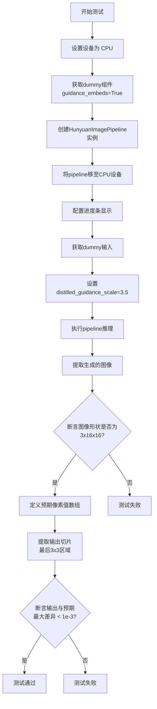

#### 带注释源码

```python
def test_inference_with_distilled_guidance(self):
    """测试使用蒸馏guidance的推理功能"""
    
    # 步骤1: 设置测试设备为CPU
    device = "cpu"

    # 步骤2: 获取测试所需的虚拟组件
    # guidance_embeds=True 表示启用guidance嵌入功能
    components = self.get_dummy_components(guidance_embeds=True)
    
    # 步骤3: 使用获取的组件实例化HunyuanImagePipeline
    pipe = self.pipeline_class(**components)
    
    # 步骤4: 将pipeline移至指定设备（CPU）
    pipe.to(device)
    
    # 步骤5: 配置进度条（disable=None表示不禁用）
    pipe.set_progress_bar_config(disable=None)

    # 步骤6: 获取虚拟输入参数
    inputs = self.get_dummy_inputs(device)
    
    # 步骤7: 添加蒸馏guidance的缩放因子
    # 该参数控制蒸馏guidance对生成过程的影响程度
    inputs["distilled_guidance_scale"] = 3.5
    
    # 步骤8: 执行推理，获取生成的图像
    # 返回值为PipelineOutput对象，包含images属性
    image = pipe(**inputs).images
    
    # 步骤9: 提取第一张生成的图像
    generated_image = image[0]
    
    # 步骤10: 断言验证生成图像的形状
    # 期望形状为 (3, 16, 16) - 通道数为3，高度宽度各为16
    self.assertEqual(generated_image.shape, (3, 16, 16))

    # 步骤11: 定义期望的像素值数组（用于数值验证）
    # 这些值是在确定性条件下预期的输出切片
    expected_slice_np = np.array(
        [0.63667065, 0.5187377, 0.66757566, 0.6320319, 0.4913387, 0.54813194, 0.5335031, 0.5736143, 0.5461346]
    )
    
    # 步骤12: 提取生成图像的最后3x3区域并展平
    # 取 [0, -3:, -3:] 表示取第一张图像的右下角3x3区域
    output_slice = generated_image[0, -3:, -3:].flatten().cpu().numpy()

    # 步骤13: 断言验证输出数值的准确性
    # 确保输出切片与期望值的最大绝对误差小于1e-3
    self.assertTrue(
        np.abs(output_slice - expected_slice_np).max() < 1e-3,
        f"output_slice: {output_slice}, expected_slice_np: {expected_slice_np}",
    )
```


### `HunyuanImagePipelineFastTests.test_vae_tiling`

测试VAE（变分自编码器）的tiling（分块）功能，确保启用tiling后不会显著影响图像生成的推理结果。该测试通过比较启用和未启用tiling模式的输出差异来验证功能的正确性。

参数：

- `self`：测试类实例本身
- `expected_diff_max`：`float`，默认为0.2，期望最大差异阈值，用于判断tiling是否影响输出质量

返回值：`None`，无返回值（测试函数通过assert断言验证结果）

#### 流程图

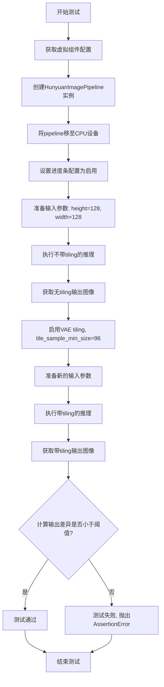

#### 带注释源码

```python
def test_vae_tiling(self, expected_diff_max: float = 0.2):
    """
    测试VAE tiling功能
    
    参数:
        expected_diff_max: float, 期望最大差异阈值, 默认为0.2
    """
    # 设置生成器设备为CPU
    generator_device = "cpu"
    
    # 获取虚拟组件配置, 用于测试
    components = self.get_dummy_components()

    # 使用组件创建HunyuanImagePipeline实例
    pipe = self.pipeline_class(**components)
    
    # 将pipeline移至CPU设备
    pipe.to("cpu")
    
    # 设置进度条配置, disable=None表示启用进度条
    pipe.set_progress_bar_config(disable=None)

    # ====== 不使用tiling的推理 ======
    # 获取虚拟输入数据
    inputs = self.get_dummy_inputs(generator_device)
    
    # 设置较大的图像尺寸用于测试tiling效果
    inputs["height"] = inputs["width"] = 128
    
    # 执行推理并获取输出(索引[0]获取图像数组)
    output_without_tiling = pipe(**inputs)[0]

    # ====== 使用tiling的推理 ======
    # 启用VAE tiling, 设置最小tile样本大小为96
    pipe.vae.enable_tiling(tile_sample_min_size=96)
    
    # 获取新的虚拟输入数据(重置generator seed)
    inputs = self.get_dummy_inputs(generator_device)
    
    # 设置相同的图像尺寸
    inputs["height"] = inputs["width"] = 128
    
    # 执行带tiling的推理并获取输出
    output_with_tiling = pipe(**inputs)[0]

    # 验证: 比较两个输出的差异是否在可接受范围内
    # 使用to_np将输出转换为numpy数组进行计算
    self.assertLess(
        (to_np(output_without_tiling) - to_np(output_with_tiling)).max(),
        expected_diff_max,
        "VAE tiling should not affect the inference results"
    )
```


### `HunyuanImagePipelineFastTests.test_encode_prompt_works_in_isolation`

该测试函数用于验证`encode_prompt`方法能够独立工作，不受其他组件影响。然而，该测试目前被跳过，因为需要调整以支持guiders。

参数：

- `self`：`HunyuanImagePipelineFastTests`类型，当前测试类实例的隐式参数

返回值：`None`，该函数不返回任何值（被跳过的测试）

#### 流程图

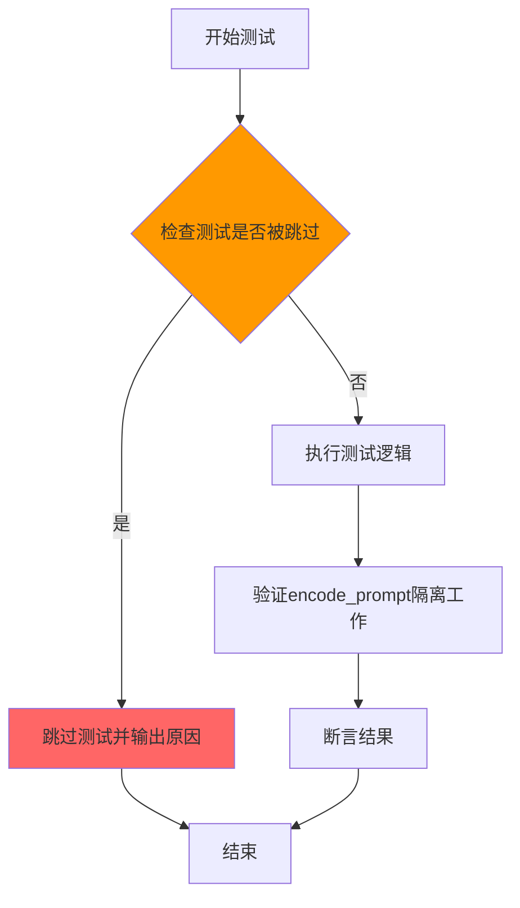

#### 带注释源码

```python
@unittest.skip("TODO: Test not supported for now because needs to be adjusted to work with guiders.")
def test_encode_prompt_works_in_isolation(self):
    """
    测试encode_prompt方法能够独立工作，不受pipeline中其他组件（如guiders）的影响。
    
    注意：该测试目前被跳过，因为需要调整以支持guiders。
    当guiders被正确集成后，此测试应该被重新启用并实现。
    """
    pass
```


### `enable_full_determinism`

该函数用于设置随机种子和环境变量，以确保测试或运行过程能够完全确定性执行，从而保证结果的可重复性。

参数：无需参数

返回值：`None`，该函数不返回任何值，主要通过副作用（设置全局随机种子和环境变量）来生效。

#### 流程图

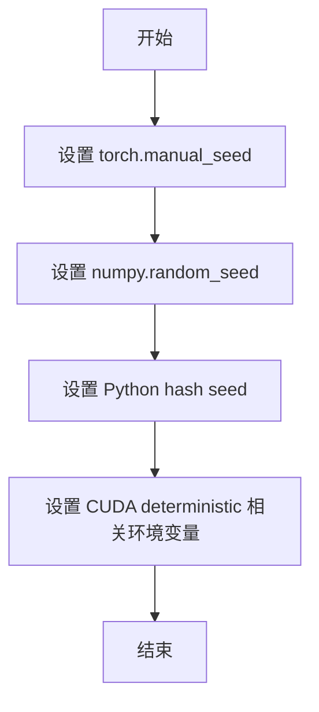

#### 带注释源码

```python
# 该函数定义位于 testing_utils 模块中
# 当前文件通过相对导入引用: from ...testing_utils import enable_full_determinism
# 函数在模块加载时立即调用，确保后续所有随机操作都是确定性的

enable_full_determinism()  # 启用完全确定性模式
```


### `to_np`

`to_np` 是一个从 `test_pipelines_common` 模块导入的工具函数，用于将 PyTorch 张量（Tensor）转换为 NumPy 数组，以便进行数值比较或后续处理。在当前代码中，它用于比较 VAE 分块（Tiling）前后的输出差异。

参数：

-  `tensor`：`torch.Tensor`，待转换的 PyTorch 张量，通常是模型输出的图像数据。

返回值：`numpy.ndarray`，转换后的 NumPy 数组。

#### 流程图

由于 `to_np` 函数未在当前代码文件中定义（而是从 `..test_pipelines_common` 导入），无法直接提取其内部逻辑。以下流程图基于其使用场景推断：

```mermaid
graph TD
    A[开始] --> B{输入类型是 torch.Tensor?}
    B -- 是 --> C[调用 tensor.cpu.detach().numpy]
    B -- 否 --> D[直接返回输入]
    C --> E[返回 NumPy 数组]
    D --> E
```

#### 带注释源码

由于 `to_np` 函数定义不在当前代码文件中，以下源码基于其典型实现推断（实际定义需参考 `diffusers` 库的测试工具模块）：

```python
def to_np(tensor):
    """
    将 PyTorch 张量转换为 NumPy 数组。
    
    参数:
        tensor (torch.Tensor): 输入的 PyTorch 张量。
    
    返回值:
        numpy.ndarray: 转换后的 NumPy 数组。
    """
    # 如果张量在 GPU 上，移到 CPU
    # 分离计算图，避免梯度影响
    # 转换为 NumPy 数组
    return tensor.cpu().detach().numpy()
```


### `HunyuanImagePipelineFastTests.get_dummy_components`

该函数用于生成测试所需的虚拟组件，初始化并配置HunyuanImage图像生成管道所需的所有模型组件（包括Transformer、VAE、调度器、文本编码器等），返回一个包含所有组件的字典供测试使用。

参数：

- `self`：隐式参数，类型为`HunyuanImagePipelineFastTests`实例，表示测试类本身
- `num_layers`：`int`，可选，默认值为`1`，指定Transformer模型的主体层数
- `num_single_layers`：`int`，可选，默认值为`1`，指定Transformer模型的单独层数
- `guidance_embeds`：`bool`，可选，默认值为`False`，指定是否使用guidance嵌入

返回值：`dict`，返回包含所有虚拟组件的字典，包括transformer、vae、scheduler、text_encoder、text_encoder_2、tokenizer、tokenizer_2、guider和ocr_guider

#### 流程图

```mermaid
flowchart TD
    A[开始 get_dummy_components] --> B[设置随机种子 torch.manual_seed(0)]
    B --> C[创建 HunyuanImageTransformer2DModel]
    C --> D[设置随机种子 torch.manual_seed(0)]
    D --> E[创建 AutoencoderKLHunyuanImage]
    E --> F[设置随机种子 torch.manual_seed(0)]
    F --> G[创建 FlowMatchEulerDiscreteScheduler]
    G --> H{guidance_embeds?}
    H -->|False| I[设置随机种子并创建 AdaptiveProjectedMixGuidance]
    H -->|True| J[guider和ocr_guider设为None]
    I --> K[设置随机种子 torch.manual_seed(0)]
    J --> K
    K --> L[创建 Qwen2_5_VLConfig]
    L --> M[创建 Qwen2_5_VLForConditionalGeneration]
    M --> N[从预训练模型加载 Qwen2Tokenizer]
    N --> O[设置随机种子 torch.manual_seed(0)]
    O --> P[创建 T5Config]
    P --> Q[创建 T5EncoderModel]
    Q --> R[创建 ByT5Tokenizer]
    R --> S[组装 components 字典]
    S --> T[返回 components]
```

#### 带注释源码

```python
def get_dummy_components(self, num_layers: int = 1, num_single_layers: int = 1, guidance_embeds: bool = False):
    """
    生成用于测试的虚拟组件。
    
    参数:
        num_layers: Transformer模型的主体层数，默认值为1
        num_single_layers: Transformer模型的单独层数，默认值为1
        guidance_embeds: 是否使用guidance嵌入，默认值为False
    
    返回:
        包含所有虚拟组件的字典
    """
    # 设置随机种子以确保测试的可重复性
    torch.manual_seed(0)
    
    # 创建HunyuanImageTransformer2DModel（图像变换器模型）
    transformer = HunyuanImageTransformer2DModel(
        in_channels=4,              # 输入通道数
        out_channels=4,             # 输出通道数
        num_attention_heads=4,      # 注意力头数量
        attention_head_dim=8,       # 注意力头维度
        num_layers=num_layers,      # 主体层数（可配置）
        num_single_layers=num_single_layers,  # 单独层数（可配置）
        num_refiner_layers=1,      # 精炼层数量
        patch_size=(1, 1),         # 补丁大小
        guidance_embeds=guidance_embeds,  # 是否使用guidance嵌入
        text_embed_dim=32,         # 文本嵌入维度
        text_embed_2_dim=32,       # 文本嵌入2维度
        rope_axes_dim=(4, 4),      # RoPE轴维度
    )

    # 重新设置随机种子
    torch.manual_seed(0)
    
    # 创建AutoencoderKLHunyuanImage（VAE变分自编码器）
    vae = AutoencoderKLHunyuanImage(
        in_channels=3,              # 输入通道数（RGB图像）
        out_channels=3,            # 输出通道数
        latent_channels=4,         # 潜在空间通道数
        block_out_channels=(32, 64, 64, 64),  # 输出通道列表
        layers_per_block=1,        # 每块的层数
        scaling_factor=0.476986,   # 缩放因子
        spatial_compression_ratio=8,  # 空间压缩比
        sample_size=128,           # 样本大小
    )

    # 重新设置随机种子
    torch.manual_seed(0)
    
    # 创建FlowMatchEulerDiscreteScheduler（调度器）
    scheduler = FlowMatchEulerDiscreteScheduler(shift=7.0)

    # 根据guidance_embeds条件创建guider组件
    if not guidance_embeds:
        # 如果不使用guidance_embeds，则创建AdaptiveProjectedMixGuidance
        torch.manual_seed(0)
        guider = AdaptiveProjectedMixGuidance(adaptive_projected_guidance_start_step=2)
        ocr_guider = AdaptiveProjectedMixGuidance(adaptive_projected_guidance_start_step=3)
    else:
        # 如果使用guidance_embeds，则将guider设为None
        guider = None
        ocr_guider = None
    
    # 重新设置随机种子
    torch.manual_seed(0)
    
    # 创建Qwen2_5_VLConfig配置对象
    config = Qwen2_5_VLConfig(
        text_config={
            "hidden_size": 32,
            "intermediate_size": 32,
            "num_hidden_layers": 2,
            "num_attention_heads": 2,
            "num_key_value_heads": 2,
            "rope_scaling": {
                "mrope_section": [2, 2, 4],
                "rope_type": "default",
                "type": "default",
            },
            "rope_theta": 1000000.0,
        },
        vision_config={
            "depth": 2,
            "hidden_size": 32,
            "intermediate_size": 32,
            "num_heads": 2,
            "out_hidden_size": 32,
        },
        hidden_size=32,
        vocab_size=152064,
        vision_end_token_id=151653,
        vision_start_token_id=151652,
        vision_token_id=151654,
    )
    
    # 创建Qwen2_5_VLForConditionalGeneration文本编码器
    text_encoder = Qwen2_5_VLForConditionalGeneration(config)
    
    # 从预训练模型加载Qwen2Tokenizer
    tokenizer = Qwen2Tokenizer.from_pretrained("hf-internal-testing/tiny-random-Qwen2VLForConditionalGeneration")

    # 重新设置随机种子
    torch.manual_seed(0)
    
    # 创建T5Config配置对象
    t5_config = T5Config(
        d_model=32,
        d_kv=4,
        d_ff=16,
        num_layers=2,
        num_heads=2,
        relative_attention_num_buckets=8,
        relative_attention_max_distance=32,
        vocab_size=256,
        feed_forward_proj="gated-gelu",
        dense_act_fn="gelu_new",
        is_encoder_decoder=False,
        use_cache=False,
        tie_word_embeddings=False,
    )
    
    # 创建T5EncoderModel作为第二个文本编码器
    text_encoder_2 = T5EncoderModel(t5_config)
    
    # 创建ByT5Tokenizer
    tokenizer_2 = ByT5Tokenizer()

    # 组装所有组件到字典中
    components = {
        "transformer": transformer,           # 图像变换器模型
        "vae": vae,                           # VAE变分自编码器
        "scheduler": scheduler,               # 调度器
        "text_encoder": text_encoder,         # Qwen2文本编码器
        "text_encoder_2": text_encoder_2,     # T5文本编码器
        "tokenizer": tokenizer,               # Qwen2分词器
        "tokenizer_2": tokenizer_2,           # ByT5分词器
        "guider": guider,                     # 自适应投影引导
        "ocr_guider": ocr_guider,             # OCR自适应投影引导
    }
    
    # 返回包含所有组件的字典
    return components
```


### `HunyuanImagePipelineFastTests.get_dummy_inputs`

该方法是一个测试辅助函数，用于生成图像生成 pipeline 的虚拟输入参数。它根据指定的设备和随机种子创建一个包含提示词、生成器、推理步数、图像尺寸和输出类型等参数的字典，以支持pipeline的单元测试。

参数：

- `device`：`torch.device | str`，目标设备，用于创建随机生成器和指定张量所在设备
- `seed`：`int`，随机种子，默认值为0，用于确保测试的可重复性

返回值：`Dict[str, Any]`，返回包含以下键的字典：
- `prompt`：字符串，测试用的提示词
- `generator`：`torch.Generator`，随机生成器对象
- `num_inference_steps`：整数，推理步数
- `height`：整数，生成图像的高度
- `width`：整数，生成图像的宽度
- `output_type`：字符串，输出类型（"pt"表示PyTorch张量）

#### 流程图

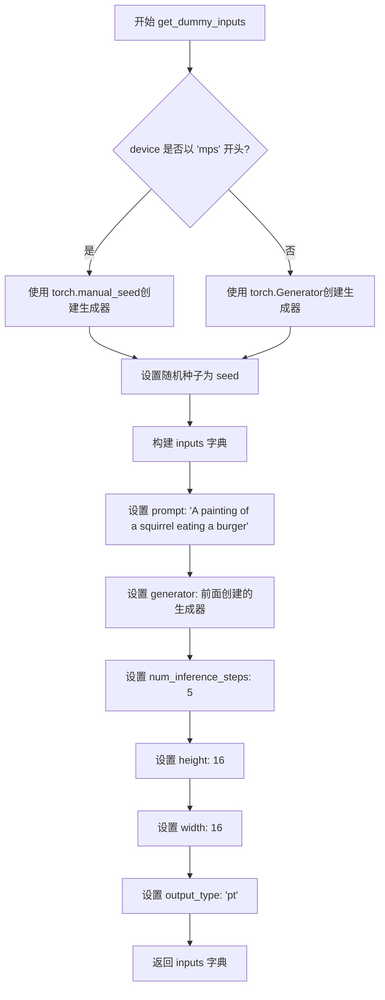

#### 带注释源码

```python
def get_dummy_inputs(self, device, seed=0):
    """
    生成用于测试的虚拟输入参数。
    
    参数:
        device: 目标设备 (如 'cpu', 'cuda', 'mps')
        seed: 随机种子，用于确保测试结果可重复
    
    返回:
        包含 pipeline 输入参数的字典
    """
    # 针对 Apple Silicon M系列芯片的特殊处理
    # MPS (Metal Performance Shaders) 不支持 torch.Generator，需要使用 torch.manual_seed
    if str(device).startswith("mps"):
        generator = torch.manual_seed(seed)
    else:
        # 为其他设备 (cpu/cuda) 创建标准的随机生成器
        generator = torch.Generator(device=device).manual_seed(seed)

    # 构建测试用的输入参数字典
    inputs = {
        "prompt": "A painting of a squirrel eating a burger",  # 测试用提示词
        "generator": generator,                                  # 随机生成器，确保可重复性
        "num_inference_steps": 5,                               # 推理步数，较小值加快测试
        "height": 16,                                           # 生成图像高度（低分辨率加快测试）
        "width": 16,                                            # 生成图像宽度
        "output_type": "pt",                                    # 输出为 PyTorch 张量
    }
    return inputs
```


### `HunyuanImagePipelineFastTests.test_inference`

该方法是针对 HunyuanImagePipeline 的核心推理功能测试用例。它验证管道能够根据文本提示生成指定尺寸的图像，并通过数值断言确保生成图像的像素值与预期值在允许的误差范围内匹配。

参数：

- `self`：测试类实例，包含测试所需的状态和方法

返回值：`None`，该方法为测试用例，通过断言验证推理结果，无返回值

#### 流程图

```mermaid
flowchart TD
    A[开始测试 test_inference] --> B[设置设备为 CPU]
    B --> C[调用 get_dummy_components 获取虚拟组件]
    C --> D[使用虚拟组件实例化 HunyuanImagePipeline]
    D --> E[将管道移至 CPU 设备]
    E --> F[配置进度条 disable=None]
    F --> G[调用 get_dummy_inputs 获取虚拟输入]
    G --> H[执行管道推理: pipe(**inputs)]
    H --> I[从返回结果中提取图像: image = result.images]
    I --> J[获取第一张生成的图像: generated_image = image[0]]
    J --> K[断言验证图像形状为 (3, 16, 16)]
    K --> L[定义预期像素值数组 expected_slice_np]
    L --> M[提取生成的图像右下角 3x3 区域并展平]
    M --> N[计算输出与预期值的最大绝对误差]
    N --> O{误差 < 1e-3?}
    O -->|是| P[测试通过]
    O -->|否| Q[测试失败并输出详细信息]
    P --> R[结束测试]
    Q --> R
```

#### 带注释源码

```python
def test_inference(self):
    """
    测试 HunyuanImagePipeline 的核心推理功能。
    验证管道能够根据文本提示生成正确尺寸和像素值的图像。
    """
    # 1. 设置测试设备为 CPU
    device = "cpu"

    # 2. 获取虚拟组件（transformer, vae, scheduler, text_encoder 等）
    # 这些组件是使用随机初始化的模型，用于快速测试
    components = self.get_dummy_components()
    
    # 3. 使用虚拟组件实例化 HunyuanImagePipeline 管道
    pipe = self.pipeline_class(**components)
    
    # 4. 将管道移至指定设备（CPU）
    pipe.to(device)
    
    # 5. 配置进度条，disable=None 表示启用进度条
    pipe.set_progress_bar_config(disable=None)

    # 6. 获取虚拟输入参数，包括：
    # - prompt: 文本提示 "A painting of a squirrel eating a burger"
    # - generator: 随机数生成器（用于可重复性）
    # - num_inference_steps: 5 步推理
    # - height: 16, width: 16 指定输出图像尺寸
    # - output_type: "pt" 表示输出 PyTorch 张量
    inputs = self.get_dummy_inputs(device)
    
    # 7. 执行管道推理，调用 __call__ 方法生成图像
    # 返回类型默认是 PipelineOutput，包含 images 属性
    image = pipe(**inputs).images
    
    # 8. 获取第一张生成的图像（batch 中取第一个）
    generated_image = image[0]
    
    # 9. 断言验证：生成的图像必须是 3 通道（RGB）、16x16 像素
    # 如果形状不匹配，测试将失败
    self.assertEqual(generated_image.shape, (3, 16, 16))

    # 10. 定义预期的像素值切片（来自已知正确输出的参考值）
    # 这些值是预先计算的正确输出，用于验证推理结果的一致性
    expected_slice_np = np.array(
        [0.6252659, 0.51482046, 0.60799813, 0.59267783, 0.488082, 0.5857634, 0.523781, 0.58028054, 0.5674121]
    )
    
    # 11. 提取生成的图像右下角 3x3 区域并展平为一维数组
    # 使用 [0, -3:, -3:] 选取第一张图像的右下角区域
    output_slice = generated_image[0, -3:, -3:].flatten().cpu().numpy()

    # 12. 断言验证：输出图像像素值与预期值的最大绝对误差必须小于 1e-3
    # 这是确保管道输出稳定性和确定性的关键检查
    self.assertTrue(
        np.abs(output_slice - expected_slice_np).max() < 1e-3,
        f"output_slice: {output_slice}, expected_slice_np: {expected_slice_np}",
    )
```


### `HunyuanImagePipelineFastTests.test_inference_guider`

该测试方法用于验证 HunyuanImagePipeline 在使用 guider（引导器）进行图像推理时的功能正确性。测试通过创建虚拟组件、配置 guider 的 guidance_scale 参数、执行推理流程，并验证生成的图像形状和像素值是否符合预期，从而确保引导机制在图像生成过程中正常工作。

参数：

- `self`：`unittest.TestCase`，测试类实例本身，隐含参数

返回值：`None`，该方法为单元测试方法，通过 assert 语句进行断言验证，不返回任何值

#### 流程图

```mermaid
flowchart TD
    A[开始测试 test_inference_guider] --> B[设置设备为 CPU]
    B --> C[获取虚拟组件配置]
    C --> D[创建 HunyuanImagePipeline 管道实例]
    D --> E[将管道移至 CPU 设备]
    E --> F[配置进度条显示]
    F --> G[创建新的 guider 和 ocr_guider<br/>设置 guidance_scale=1000]
    G --> H[获取虚拟输入参数]
    H --> I[执行管道推理生成图像]
    I --> J{断言图像形状是否为 (3, 16, 16)}
    J -->|是| K[提取预期数值切片]
    K --> L[提取实际输出数值切片]
    L --> M{断言输出与预期差异 < 1e-3}
    M -->|是| N[测试通过]
    M -->|否| O[抛出断言错误]
    J -->|否| O
```

#### 带注释源码

```python
def test_inference_guider(self):
    """测试使用 guider 进行图像推理的单元测试方法"""
    
    # 步骤 1: 设置测试设备为 CPU
    device = "cpu"

    # 步骤 2: 获取预定义的虚拟组件配置
    # 包含 transformer, VAE, scheduler, text_encoder, tokenizer 等
    components = self.get_dummy_components()
    
    # 步骤 3: 使用虚拟组件创建 HunyuanImagePipeline 管道实例
    pipe = self.pipeline_class(**components)
    
    # 步骤 4: 将管道移至指定设备 (CPU)
    pipe.to(device)
    
    # 步骤 5: 配置进度条显示 (disable=None 表示启用进度条)
    pipe.set_progress_bar_config(disable=None)

    # 步骤 6: 重新创建 guider 和 ocr_guider
    # 设置 guidance_scale=1000 来测试高引导强度下的图像生成
    pipe.guider = pipe.guider.new(guidance_scale=1000)
    pipe.ocr_guider = pipe.ocr_guider.new(guidance_scale=1000)

    # 步骤 7: 获取虚拟输入参数
    # 包含 prompt, generator, num_inference_steps, height, width 等
    inputs = self.get_dummy_inputs(device)
    
    # 步骤 8: 执行管道推理
    # 调用 __call__ 方法生成图像
    image = pipe(**inputs).images
    
    # 步骤 9: 获取生成的图像
    generated_image = image[0]
    
    # 步骤 10: 断言验证图像形状
    # 预期形状为 (3, 16, 16) - 3通道, 16x16 像素
    self.assertEqual(generated_image.shape, (3, 16, 16))

    # 步骤 11: 定义预期数值切片
    # 这是在特定 guidance_scale=1000 下的预期输出数值
    expected_slice_np = np.array(
        [0.61494756, 0.49616697, 0.60327923, 0.6115793, 0.49047345, 0.56977504, 0.53066164, 0.58880305, 0.5570612]
    )
    
    # 步骤 12: 提取实际输出的右下角 3x3 区域并展平
    output_slice = generated_image[0, -3:, -3:].flatten().cpu().numpy()

    # 步骤 13: 断言验证输出数值精度
    # 确保输出与预期值的最大误差小于 1e-3
    self.assertTrue(
        np.abs(output_slice - expected_slice_np).max() < 1e-3,
        f"output_slice: {output_slice}, expected_slice_np: {expected_slice_np}",
    )
```


### `HunyuanImagePipelineFastTests.test_inference_with_distilled_guidance`

该测试方法用于验证 HunyuanImagePipeline 在使用蒸馏引导（distilled guidance）技术进行图像生成推理时的功能正确性。它通过构造带有 `guidance_embeds=True` 的虚拟组件和输入参数，执行推理流程，并断言生成的图像形状和像素值是否与预期值相符。

参数：

- `self`：隐式参数，`unittest.TestCase` 实例方法的标准第一个参数，表示测试类实例本身

返回值：无明确返回值（`None`），该方法为 `unittest.TestCase` 的测试方法，通过 `self.assertEqual` 和 `self.assertTrue` 进行断言验证

#### 流程图

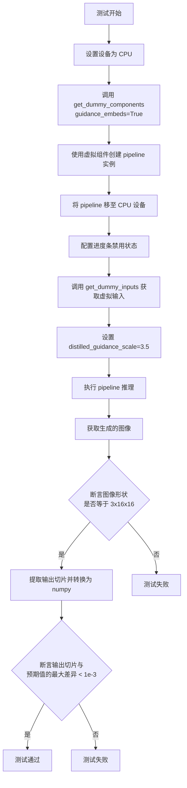

#### 带注释源码

```python
def test_inference_with_distilled_guidance(self):
    """测试使用蒸馏引导的推理功能"""
    device = "cpu"  # 设置测试设备为 CPU

    # 获取虚拟组件，启用 guidance_embeds（文本嵌入引导）
    components = self.get_dummy_components(guidance_embeds=True)
    
    # 使用虚拟组件实例化 HunyuanImagePipeline 管道
    pipe = self.pipeline_class(**components)
    
    # 将管道移至 CPU 设备
    pipe.to(device)
    
    # 配置进度条，disable=None 表示不禁用进度条
    pipe.set_progress_bar_config(disable=None)

    # 获取虚拟输入参数（包含 prompt、generator、num_inference_steps 等）
    inputs = self.get_dummy_inputs(device)
    
    # 设置蒸馏引导的缩放因子为 3.5
    inputs["distilled_guidance_scale"] = 3.5
    
    # 执行管道推理，获取生成的图像
    image = pipe(**inputs).images
    
    # 获取第一张生成的图像
    generated_image = image[0]
    
    # 断言：验证生成的图像形状为 (3, 16, 16) - 通道数为 3，分辨率为 16x16
    self.assertEqual(generated_image.shape, (3, 16, 16))

    # 定义预期的像素值切片（用于验证输出正确性）
    expected_slice_np = np.array(
        [0.63667065, 0.5187377, 0.66757566, 0.6320319, 0.4913387, 0.54813194, 0.5335031, 0.5736143, 0.5461346]
    )
    
    # 提取图像右下角 3x3 区域的像素值，并展平为一维数组
    output_slice = generated_image[0, -3:, -3:].flatten().cpu().numpy()

    # 断言：验证输出切片与预期值的最大差异小于 1e-3
    self.assertTrue(
        np.abs(output_slice - expected_slice_np).max() < 1e-3,
        f"output_slice: {output_slice}, expected_slice_np: {expected_slice_np}",
    )
```


### `HunyuanImagePipelineFastTests.test_vae_tiling`

该测试方法用于验证 VAE（变分自编码器）的 Tiling（分块）功能是否正常工作。测试通过比较启用和未启用 VAE tiling 两种模式下的图像输出差异，确保 tiling 不会对推理结果产生显著影响（差异需小于指定的阈值），从而验证分块策略的正确性和一致性。

参数：

- `self`：`HunyuanImagePipelineFastTests`，unittest 测试类的实例，包含测试所需的断言方法
- `expected_diff_max`：`float`，可选参数，默认值为 `0.2`，表示启用和未启用 tiling 两种模式输出之间的最大允许差异

返回值：`None`，该方法为测试方法，通过 `self.assertLess` 断言验证结果，无返回值

#### 流程图

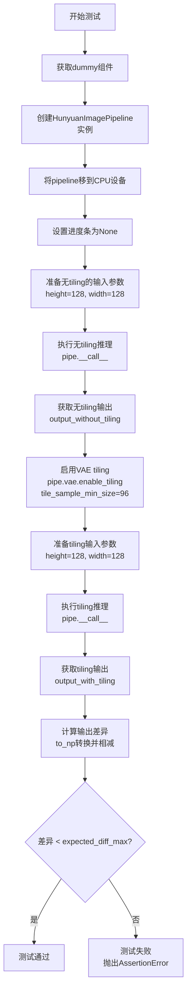

#### 带注释源码

```python
def test_vae_tiling(self, expected_diff_max: float = 0.2):
    """
    测试 VAE tiling 功能是否正常工作
    
    VAE tiling 是一种内存优化技术，将大图像分割成小块分别编码/解码，
    然后拼接成完整图像。该测试确保启用 tiling 后输出结果与不启用时
    保持一致（差异在可接受范围内）。
    
    参数:
        expected_diff_max: float, 允许的最大差异值，默认 0.2
        
    返回:
        None: 通过断言验证，无返回值
    """
    # 设置生成器设备为 CPU
    generator_device = "cpu"
    
    # 获取用于测试的虚拟（dummy）组件
    # 包括 transformer, vae, scheduler, text_encoder, tokenizer 等
    components = self.get_dummy_components()
    
    # 使用获取的组件实例化 HunyuanImagePipeline
    pipe = self.pipeline_class(**components)
    
    # 将 pipeline 移动到 CPU 设备
    # 注意：diffusers pipeline 默认可能在 GPU 上，需要显式移到 CPU
    pipe.to("cpu")
    
    # 设置进度条配置为 None，禁用推理过程中的进度条显示
    # 避免在测试输出中打印进度条信息
    pipe.set_progress_bar_config(disable=None)
    
    # ===== 步骤 1: 不使用 tiling 的推理 =====
    # 获取默认的虚拟输入参数
    inputs = self.get_dummy_inputs(generator_device)
    
    # 设置输入图像尺寸为 128x128
    # 较大的尺寸可以更好地测试 tiling 功能
    inputs["height"] = inputs["width"] = 128
    
    # 执行推理并获取输出图像
    # 使用索引 [0] 获取第一张图像（因为返回的是图像列表）
    output_without_tiling = pipe(**inputs)[0]
    
    # ===== 步骤 2: 启用 VAE tiling 并推理 =====
    # 启用 VAE 的 tiling 功能
    # tile_sample_min_size=96 表示每个分块的最小尺寸为 96 像素
    # VAE 会自动将图像分割成多个 96x96 的小块进行处理
    pipe.vae.enable_tiling(tile_sample_min_size=96)
    
    # 重新获取虚拟输入参数（确保随机种子等状态重置）
    inputs = self.get_dummy_inputs(generator_device)
    
    # 同样设置图像尺寸为 128x128
    inputs["height"] = inputs["width"] = 128
    
    # 执行启用 tiling 后的推理
    output_with_tiling = pipe(**inputs)[0]
    
    # ===== 步骤 3: 验证结果一致性 =====
    # 使用 to_np 工具函数将 PyTorch tensor 转换为 numpy 数组
    # 计算两种输出之间的最大差异
    difference = (to_np(output_without_tiling) - to_np(output_with_tiling)).max()
    
    # 断言：差异应该小于指定的阈值
    # 如果差异过大，说明 VAE tiling 实现存在问题
    self.assertLess(
        difference,
        expected_diff_max,
        "VAE tiling should not affect the inference results",
    )
```


### `HunyuanImagePipelineFastTests.test_encode_prompt_works_in_isolation`

该测试函数用于验证 `encode_prompt` 方法能否在隔离环境下正常工作（即不依赖其他组件或状态），但该测试目前被跳过，原因是需要调整以适应 guiders 的工作方式。

参数：

- `self`：`unittest.TestCase`，测试类的实例，包含测试所需的状态和方法

返回值：`None`，由于函数体为 `pass` 语句，无实际返回值

#### 流程图

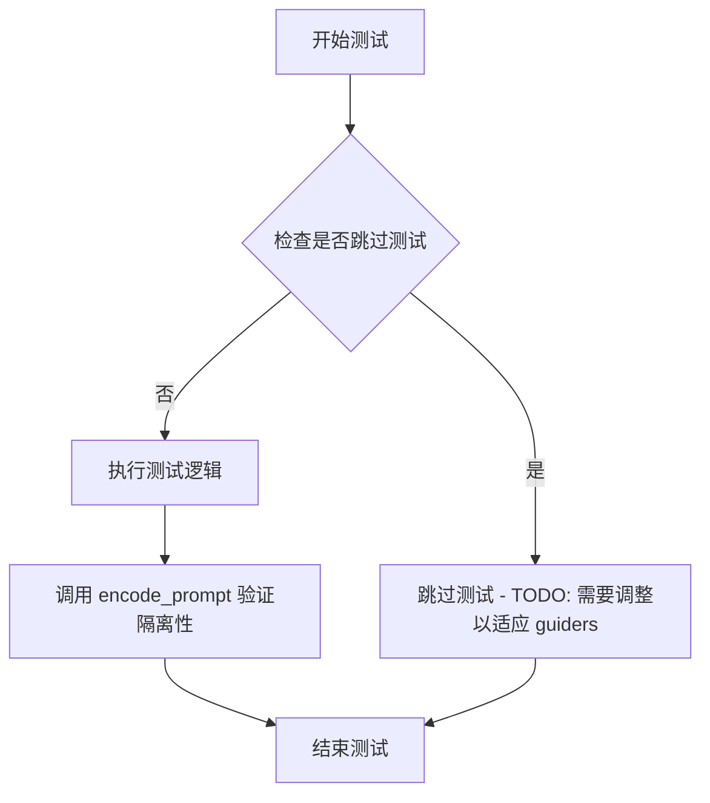

> **注意**：由于该函数被 `@unittest.skip` 装饰器跳过且内部只有 `pass` 语句，流程图展示的是理想情况下的测试流程，而非实际执行的逻辑。

#### 带注释源码

```python
@unittest.skip("TODO: Test not supported for now because needs to be adjusted to work with guiders.")
def test_encode_prompt_works_in_isolation(self):
    """
    测试在隔离环境下 encode_prompt 是否能正常工作。
    
    该测试目前被跳过，原因是：
    1. 需要调整以适应 guiders（引导器）的工作方式
    2. 尚未完全实现测试逻辑
    """
    pass  # 测试逻辑未实现，仅作为占位符
```

## 关键组件


### HunyuanImagePipeline

主pipeline类，整合了transformer、VAE、scheduler和文本编码器，执行图像生成流程。测试文件验证了其基本推理、带guider的推理、蒸馏guidance推理以及VAE tiling功能。

### HunyuanImageTransformer2DModel

图像变换器模型，负责去噪过程的核心计算。配置包括in_channels、out_channels、num_attention_heads、attention_head_dim、num_layers、num_single_layers、num_refiner_layers等参数，支持guidance_embeds和双文本嵌入。

### AutoencoderKLHunyuanImage

变分自编码器(VAE)模型，用于图像的潜空间编码和解码。支持tiling功能以处理高分辨率图像，配置包括latent_channels、block_out_channels、layers_per_block、scaling_factor、spatial_compression_ratio等。

### FlowMatchEulerDiscreteScheduler

基于Flow Match的Euler离散调度器，控制去噪步长和噪声调度。配置参数shift=7.0影响采样轨迹。

### AdaptiveProjectedMixGuidance

自适应投影混合引导器，提供分类器-free引导功能。支持adaptive_projected_guidance_start_step参数控制引导开始步骤，可通过new()方法动态设置guidance_scale。

### Qwen2_5_VLForConditionalGeneration

Qwen2.5-VL多模态文本编码器，包含vision_config和text_config，处理文本和视觉token。配置包括hidden_size、vocab_size、rope_scaling、vision_start_token_id等。

### T5EncoderModel

T5编码器作为第二文本编码器，使用ByT5Tokenizer。配置包括d_model、d_ff、num_layers、num_heads、relative_attention_num_buckets等参数。

### 关键测试组件

- **test_inference**: 验证基本图像生成功能
- **test_inference_guider**: 验证guider引导生成
- **test_inference_with_distilled_guidance**: 验证蒸馏guidance
- **test_vae_tiling**: 验证VAE tiling对结果的影响
- **get_dummy_components**: 创建测试用虚拟组件
- **get_dummy_inputs**: 创建测试用虚拟输入


## 问题及建议


### 已知问题

-   **硬编码随机种子**：多处使用 `torch.manual_seed(0)`，在多线程或不同环境中可能导致测试结果不稳定，且无法验证代码对随机性的正确处理
-   **被跳过的测试未完成**：`test_encode_prompt_works_in_isolation` 使用 `@unittest.skip` 标记但未实现，导致该功能测试覆盖缺失
-   **测试配置不一致**：如 `test_attention_slicing = False`、`supports_dduf = False` 与其他 pipeline 测试配置不同，缺乏注释说明原因
-   **魔法数字缺乏解释**：`expected_diff_max: float = 0.2`、`num_layers=1`、`num_single_layers=1` 等阈值和参数选择缺乏业务含义说明
-   **设备判断方式不优雅**：使用 `str(device).startswith("mps")` 判断设备类型，扩展性差
-   **缺少参数验证测试**：未测试负样本提示（negative_prompt）、guidance_scale 等关键参数的边界情况和异常输入处理
-   **VAE tiling 测试阈值过宽**：`expected_diff_max = 0.2` 可能无法有效检测回归问题
-   **缺少 GPU/CUDA 设备测试**：仅测试 CPU 和 MPS 设备，主流 GPU 环境覆盖不足
-   **测试断言可读性差**：大量硬编码的 `expected_slice_np` 数值缺少来源说明和注释

### 优化建议

-   使用 pytest fixture 或 mock 替代全局随机种子设置，增强测试隔离性
-   实现或移除被跳过的测试，并添加明确的 TODO 注释说明原因
-   将魔法数字提取为类常量或配置文件，添加文档说明其业务含义
-   封装设备判断逻辑为工具函数，如 `is_mps_device(device)` 或使用 `torch.backends.mps.is_available()`
-   增加参数边界测试：负样本提示为空/None、guidance_scale 为负数/0、超大分辨率等
-   收紧 VAE tiling 差异阈值至 0.01-0.05，或添加相对误差检测
-   添加 CUDA 设备的条件测试：`@unittest.skipIf(not torch.cuda.is_available(), "CUDA not available")`
-   为期望输出数值添加注释说明来源（如参考输出文件哈希或生成命令）

## 其它


### 设计目标与约束

本测试文件旨在验证HunyuanImagePipeline的核心功能，确保图像生成管线在各种配置下能正确运行。测试覆盖了标准推理、带引导的推理、蒸馏引导推理以及VAE平铺等功能点。测试设计遵循单元测试最佳实践，使用固定随机种子确保可复现性，同时通过对比输出与预期值验证功能正确性。

### 错误处理与异常设计

测试代码通过assert语句验证各个关键环节的正确性，包括输出图像尺寸验证、数值精度验证（允许1e-3的误差范围）、VAE平铺功能的前后一致性验证（允许0.2的最大差异）。当测试失败时，会输出具体的输出值与预期值用于调试。skip装饰器用于标记暂不支持的测试用例（如test_encode_prompt_works_in_isolation），避免CI失败。

### 数据流与状态机

测试数据流如下：get_dummy_components方法创建完整的pipeline组件（包括transformer、VAE、scheduler、text_encoder、text_encoder_2、tokenizer、tokenizer_2、guider、ocr_guider），get_dummy_inputs方法生成符合pipeline要求的输入参数（prompt、generator、num_inference_steps、height、width、output_type），最后通过pipe(**inputs)调用pipeline的__call__方法执行推理。测试覆盖了三种主要的推理模式：无引导推理、带guider的推理、以及带蒸馏引导的推理。

### 外部依赖与接口契约

主要依赖包括：transformers库提供的ByT5Tokenizer、Qwen2_5_VLConfig、Qwen2_5_VLForConditionalGeneration、Qwen2Tokenizer、T5Config、T5EncoderModel；diffusers库提供的AdaptiveProjectedMixGuidance、AutoencoderKLHunyuanImage、FlowMatchEulerDiscreteScheduler、HunyuanImagePipeline、HunyuanImageTransformer2DModel；测试框架unittest以及numpy、torch。pipeline_class字段定义了被测试的pipeline类，params、batch_params、required_optional_params定义了pipeline接受的参数契约。

### 性能基准与测试覆盖

测试覆盖了以下功能场景：基础推理功能（test_inference）、带引导的推理（test_inference_guider）、蒸馏引导推理（test_inference_with_distilled_guidance）、VAE平铺功能（test_vae_tiling）。测试使用小尺寸图像（16x16和128x128）以加快测试速度，同时使用固定随机种子确保结果可复现。测试还验证了与xformers attention、layerwise casting、group offloading、attention slicing等优化功能的兼容性。

### 配置与参数说明

get_dummy_components方法中定义了多个关键配置：transformer配置包含4个输入输出通道、4个注意力头、8的注意力头维度、1层单层Transformer；VAE配置包含3通道输入输出、4通道潜在空间、32-64-64-64的块输出通道；scheduler使用shift=7.0的FlowMatchEulerDiscreteScheduler；text_encoder使用Qwen2_5_VL模型，text_encoder_2使用T5EncoderModel。测试参数使用num_inference_steps=5、height=16、width=16的轻量级配置。

### 安全性考虑

测试代码本身不直接涉及安全敏感操作，但验证了pipeline在各种配置下的稳定性。测试使用dummy模型和随机初始化权重，不涉及真实用户数据或敏感信息。代码遵循Apache 2.0许可证，符合开源安全规范。

### 版本兼容性

测试代码针对特定的transformers和diffusers版本设计，依赖的模型类（Qwen2_5_VLForConditionalGeneration、ByT5Tokenizer等）需要相应版本的transformers库支持。test_layerwise_casting、test_group_offloading等测试标志表明需要兼容特定版本的PyTorch特性。测试还特别处理了MPS设备的兼容性（通过不同的generator初始化方式）。

### 部署相关说明

本测试文件主要用于开发阶段的单元测试，不直接用于生产部署。测试验证的HunyuanImagePipeline在实际部署时需要考虑GPU内存管理（通过VAE tiling优化）、推理速度（通过test_attention_slicing等标志验证优化兼容性）、模型加载策略（支持半精度、accelerate等部署优化）。测试代码可作为集成测试或端到端测试的参考模板。
    