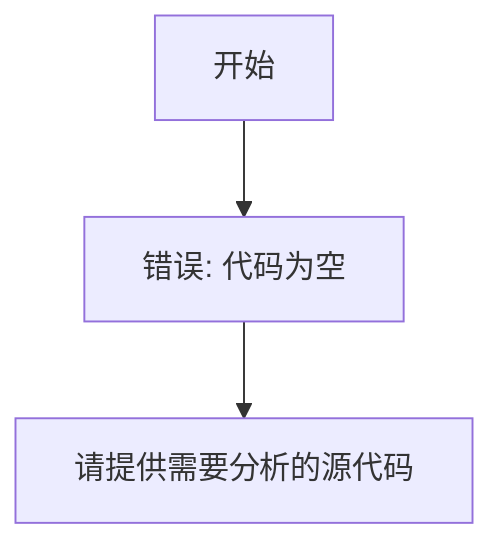

# `diffusers\tests\pipelines\hunyuan_video\__init__.py` 详细设计文档

未提供代码内容，无法进行分析

## 整体流程



## 类结构

```

```

## 全局变量及字段


    

## 全局函数及方法


## 关键组件


无关键组件信息可提供。

**原因**: 用户未在代码部分提供待分析的源代码。当前代码块为空，因此无法识别张量索引与惰性加载、反量化支持、量化策略等关键组件，也无法生成相应的设计文档。

**建议**: 请在代码部分粘贴需要分析的源代码后，再提交分析请求。


## 问题及建议


### 已知问题

-   代码内容为空，无法进行具体分析
-   缺少代码实现，无法识别具体的技术债务

### 优化建议

-   请提供待分析的代码内容，以便进行详细的技术债务和优化空间分析
-   如需通用的架构设计审查框架或代码规范模板，请明确说明需求


## 其它


### 设计目标与约束

描述该模块的设计目标，包括功能目标、性能目标、可靠性目标等，以及技术约束、团队约束、时间约束等。

### 错误处理与异常设计

描述系统如何处理错误和异常，包括错误码定义、异常类型、错误传播机制、降级策略等。

### 数据流与状态机

描述数据在系统中的流动过程，包括数据输入、数据处理、数据输出，以及可能的状态转换和状态管理。

### 外部依赖与接口契约

描述该模块的所有外部依赖，包括第三方库、服务、数据库等，以及对外提供的接口契约，包括接口规范、版本管理、兼容性策略等。

### 性能考虑与优化空间

描述系统的性能考量，包括并发处理、内存使用、缓存策略、I/O优化等，以及可能的性能优化方向。

### 安全设计

描述系统的安全考量，包括认证授权、输入验证、数据加密、审计日志等安全机制。

### 可扩展性设计

描述系统的可扩展性设计，包括水平扩展、垂直扩展、模块化设计、插件机制等。

### 部署架构

描述系统的部署方式，包括运行环境、容器化、集群部署、负载均衡等部署相关的内容。

### 版本兼容性

描述版本管理策略，包括API版本控制、向后兼容性维护、版本升级路径等。

### 测试策略

描述测试相关的内容，包括单元测试、集成测试、性能测试、安全测试等测试策略和覆盖率目标。


    