# `diffusers\tests\pipelines\hunyuan_video\test_hunyuan_image2video.py` 详细设计文档

这是一个针对HunyuanVideoImageToVideoPipeline的单元测试文件，用于测试图像到视频生成的推理流程，包括各种配置下的推理、回调机制、注意力切片和VAE平铺等功能。

## 整体流程

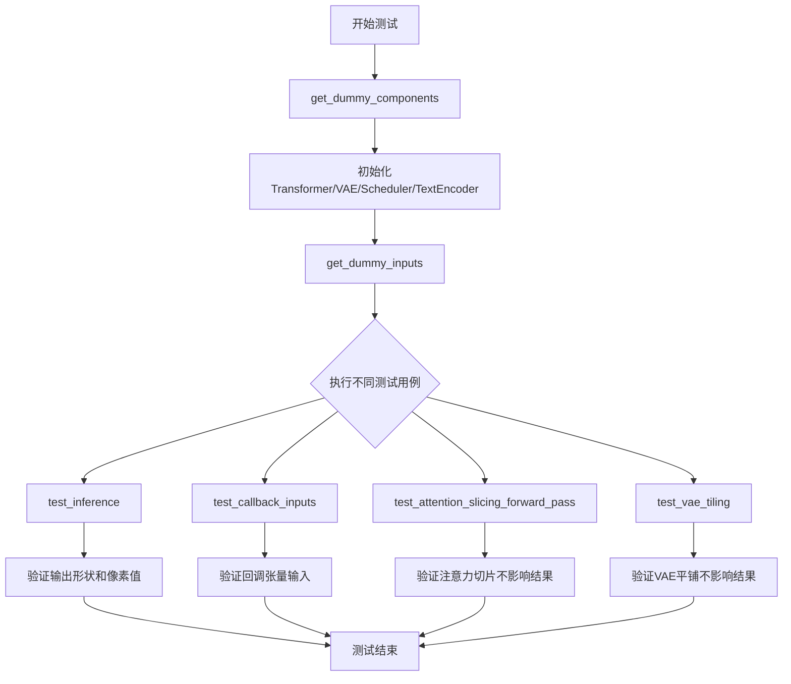

## 类结构

```
unittest.TestCase
├── PipelineTesterMixin
├── PyramidAttentionBroadcastTesterMixin
└── HunyuanVideoImageToVideoPipelineFastTests
```

## 全局变量及字段


### `enable_full_determinism`
    
启用完全确定性以确保测试结果可复现

类型：`function`
    


### `HunyuanVideoImageToVideoPipelineFastTests.pipeline_class`
    
被测试的Hunyuan Video图像到视频管道类

类型：`type[HunyuanVideoImageToVideoPipeline]`
    


### `HunyuanVideoImageToVideoPipelineFastTests.params`
    
管道调用时需要传递的参数集合

类型：`frozenset`
    


### `HunyuanVideoImageToVideoPipelineFastTests.batch_params`
    
支持批处理的参数集合

类型：`frozenset`
    


### `HunyuanVideoImageToVideoPipelineFastTests.required_optional_params`
    
可选但仍被测试框架视为必需的参数集合

类型：`frozenset`
    


### `HunyuanVideoImageToVideoPipelineFastTests.supports_dduf`
    
指示该管道是否支持DDUF（Decoupled Diffusion Upsampling Flow）

类型：`bool`
    


### `HunyuanVideoImageToVideoPipelineFastTests.test_xformers_attention`
    
指示是否运行xformers注意力机制的测试

类型：`bool`
    


### `HunyuanVideoImageToVideoPipelineFastTests.test_layerwise_casting`
    
指示是否测试逐层类型转换（layerwise casting）功能

类型：`bool`
    


### `HunyuanVideoImageToVideoPipelineFastTests.test_group_offloading`
    
指示是否测试模型组卸载（group offloading）功能

类型：`bool`
    
    

## 全局函数及方法


### HunyuanVideoImageToVideoPipelineFastTests.get_dummy_components

该方法用于创建测试用的虚拟组件（模型、VAE、调度器、文本编码器等），为管道测试提供必要的初始化参数。

参数：

- `self`：类的实例本身
- `num_layers`：`int`，Transformer的层数，默认为1
- `num_single_layers`：`int`，单层数，默认为1

返回值：`dict`，包含所有组件的字典（transformer, vae, scheduler, text_encoder, text_encoder_2, tokenizer, tokenizer_2, image_processor）

#### 流程图

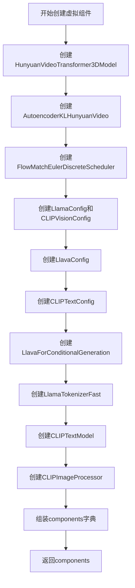

#### 带注释源码

```python
def get_dummy_components(self, num_layers: int = 1, num_single_layers: int = 1):
    """
    创建用于测试的虚拟组件
    
    参数:
        num_layers: Transformer的层数
        num_single_layers: 单层数
    
    返回:
        dict: 包含所有模型组件的字典
    """
    torch.manual_seed(0)
    # 创建3D视频Transformer模型
    transformer = HunyuanVideoTransformer3DModel(
        in_channels=2 * 4 + 1,
        out_channels=4,
        num_attention_heads=2,
        attention_head_dim=10,
        num_layers=num_layers,
        num_single_layers=num_single_layers,
        num_refiner_layers=1,
        patch_size=1,
        patch_size_t=1,
        guidance_embeds=False,
        text_embed_dim=16,
        pooled_projection_dim=8,
        rope_axes_dim=(2, 4, 4),
        image_condition_type="latent_concat",
    )

    torch.manual_seed(0)
    # 创建VAE模型用于潜在空间编码/解码
    vae = AutoencoderKLHunyuanVideo(
        in_channels=3,
        out_channels=3,
        latent_channels=4,
        down_block_types=(
            "HunyuanVideoDownBlock3D",
            "HunyuanVideoDownBlock3D",
            "HunyuanVideoDownBlock3D",
            "HunyuanVideoDownBlock3D",
        ),
        up_block_types=(
            "HunyuanVideoUpBlock3D",
            "HunyuanVideoUpBlock3D",
            "HunyuanVideoUpBlock3D",
            "HunyuanVideoUpBlock3D",
        ),
        block_out_channels=(8, 8, 8, 8),
        layers_per_block=1,
        act_fn="silu",
        norm_num_groups=4,
        scaling_factor=0.476986,
        spatial_compression_ratio=8,
        temporal_compression_ratio=4,
        mid_block_add_attention=True,
    )

    torch.manual_seed(0)
    # 创建调度器用于推理步骤
    scheduler = FlowMatchEulerDiscreteScheduler(shift=7.0)

    # 创建文本配置
    text_config = LlamaConfig(
        bos_token_id=0,
        eos_token_id=2,
        hidden_size=16,
        intermediate_size=37,
        layer_norm_eps=1e-05,
        num_attention_heads=4,
        num_hidden_layers=2,
        pad_token_id=100,
        vocab_size=1000,
        hidden_act="gelu",
        projection_dim=32,
    )
    vision_config = CLIPVisionConfig(
        hidden_size=8,
        intermediate_size=37,
        projection_dim=32,
        num_attention_heads=4,
        num_hidden_layers=2,
        image_size=224,
    )
    # 创建Llava配置（结合视觉和文本配置）
    llava_text_encoder_config = LlavaConfig(vision_config, text_config, pad_token_id=100, image_token_index=101)

    clip_text_encoder_config = CLIPTextConfig(
        bos_token_id=0,
        eos_token_id=2,
        hidden_size=8,
        intermediate_size=37,
        layer_norm_eps=1e-05,
        num_attention_heads=4,
        num_hidden_layers=2,
        pad_token_id=1,
        vocab_size=1000,
        hidden_act="gelu",
        projection_dim=32,
    )

    torch.manual_seed(0)
    # 创建Llava文本编码器
    text_encoder = LlavaForConditionalGeneration(llava_text_encoder_config)
    tokenizer = LlamaTokenizerFast.from_pretrained("finetrainers/dummy-hunyaunvideo", subfolder="tokenizer")

    torch.manual_seed(0)
    # 创建CLIP文本编码器
    text_encoder_2 = CLIPTextModel(clip_text_encoder_config)
    tokenizer_2 = CLIPTokenizer.from_pretrained("hf-internal-testing/tiny-random-clip")

    torch.manual_seed(0)
    # 创建图像处理器
    image_processor = CLIPImageProcessor(
        crop_size=224,
        do_center_crop=True,
        do_normalize=True,
        do_resize=True,
        image_mean=[0.48145466, 0.4578275, 0.40821073],
        image_std=[0.26862954, 0.26130258, 0.27577711],
        resample=3,
        size=224,
    )

    # 组装所有组件
    components = {
        "transformer": transformer,
        "vae": vae,
        "scheduler": scheduler,
        "text_encoder": text_encoder,
        "text_encoder_2": text_encoder_2,
        "tokenizer": tokenizer,
        "tokenizer_2": tokenizer_2,
        "image_processor": image_processor,
    }
    return components
```

---

### HunyuanVideoImageToVideoPipelineFastTests.get_dummy_inputs

该方法用于创建测试用的虚拟输入参数，包含图像、提示词、生成器等，为管道推理提供完整的输入数据。

参数：

- `self`：类的实例本身
- `device`：`str`，目标设备（如"cpu"、"cuda"等）
- `seed`：`int`，随机种子，默认为0

返回值：`dict`，包含所有输入参数的字典（image, prompt, prompt_template, generator, num_inference_steps, guidance_scale, height, width, num_frames, max_sequence_length, output_type）

#### 流程图

```mermaid
flowDiagram
    A[开始创建虚拟输入] --> B{设备是否是MPS}
    B -->|是| C[使用torch.manual_seed创建生成器]
    B -->|否| D[使用torch.Generator创庺生成器]
    C --> E[设置图像高度和宽度]
    D --> E
    E --> F[创建RGB测试图像]
    F --> G[构建输入参数字典]
    G --> H[包含prompt/生成器/推理步数等]
    H --> I[返回输入字典]
```

#### 带注释源码

```python
def get_dummy_inputs(self, device, seed=0):
    """
    创建用于测试的虚拟输入参数
    
    参数:
        device: 目标设备
        seed: 随机种子
    
    返回:
        dict: 包含推理所需所有输入参数的字典
    """
    # 根据设备类型选择合适的随机生成器
    if str(device).startswith("mps"):
        # MPS设备使用torch.manual_seed
        generator = torch.manual_seed(seed)
    else:
        # 其他设备使用torch.Generator
        generator = torch.Generator(device=device).manual_seed(seed)

    # 设置测试图像尺寸
    image_height = 16
    image_width = 16
    # 创建测试用的RGB图像
    image = Image.new("RGB", (image_width, image_height))
    
    # 构建完整的输入参数字典
    inputs = {
        "image": image,  # 输入图像
        "prompt": "dance monkey",  # 提示词
        "prompt_template": {  # 提示词模板配置
            "template": "{}",
            "crop_start": 0,
            "image_emb_len": 49,
            "image_emb_start": 5,
            "image_emb_end": 54,
            "double_return_token_id": 0,
        },
        "generator": generator,  # 随机生成器
        "num_inference_steps": 2,  # 推理步数
        "guidance_scale": 4.5,  # 引导尺度
        "height": image_height,  # 输出高度
        "width": image_width,  # 输出宽度
        "num_frames": 9,  # 帧数
        "max_sequence_length": 64,  # 最大序列长度
        "output_type": "pt",  # 输出类型（PyTorch张量）
    }
    return inputs
```

---

### HunyuanVideoImageToVideoPipeline.__call__ (通过inspect.signature提取)

该方法是管道的主推理方法，接收图像和提示词，生成视频帧序列。使用inspect.signature提取的参数如下：

参数：

- `self`：管道实例本身
- `image`：`PIL.Image.Image` 或 `torch.Tensor`，输入图像
- `prompt`：`str`，文本提示词
- `prompt_template`：`dict`，提示词模板配置（可选）
- `height`：`int`，生成图像的高度（可选）
- `width`：`int`，生成图像的宽度（可选）
- `num_frames`：`int`，生成的帧数（可选）
- `num_inference_steps`：`int`，推理步数（可选）
- `guidance_scale`：`float`，引导尺度，用于控制文本引导强度（可选）
- `negative_prompt`：`str`，负面提示词（可选）
- `prompt_embeds`：`torch.Tensor`，预计算的提示词嵌入（可选）
- `negative_prompt_embeds`：`torch.Tensor`，预计算的负面提示词嵌入（可选）
- `pooled_prompt_embeds`：`torch.Tensor`，池化后的提示词嵌入（可选）
- `negative_pooled_prompt_embeds`：`torch.Tensor`，池化后的负面提示词嵌入（可选）
- `latents`：`torch.Tensor`，初始潜在变量（可选）
- `generator`：`torch.Generator`，随机生成器（可选）
- `max_sequence_length`：`int`，最大序列长度（可选）
- `output_type`：`str`，输出类型（可选）
- `return_dict`：`bool`，是否返回字典格式（可选）
- `callback_on_step_end`：`callable`，每步结束时的回调函数（可选）
- `callback_on_step_end_tensor_inputs`：`list`，回调函数可用的张量输入列表（可选）

返回值：根据return_dict参数，返回`PipelineOutput`或`tuple`，包含生成的视频帧

#### 流程图

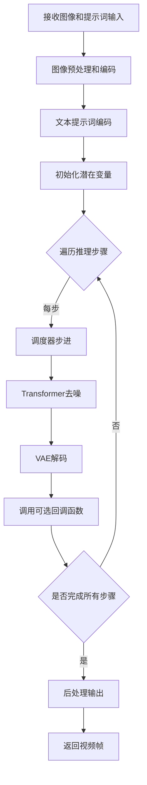

#### 带注释源码

```python
# 由于这是通过inspect.signature提取的方法签名，实际源码位于transformers库中
# 以下是基于测试代码推断的调用流程和参数说明

def __call__(
    self,
    image: Union[PIL.Image.Image, torch.Tensor],  # 输入图像
    prompt: str,  # 文本提示词
    prompt_template: Optional[dict] = None,  # 提示词模板配置
    height: Optional[int] = None,  # 生成高度
    width: Optional[int] = None,  # 生成宽度
    num_frames: Optional[int] = None,  # 生成帧数
    num_inference_steps: int = 50,  # 推理步数
    guidance_scale: float = 7.0,  # CFG引导尺度
    negative_prompt: Optional[str] = None,  # 负面提示词
    prompt_embeds: Optional[torch.Tensor] = None,  # 预计算提示词嵌入
    negative_prompt_embeds: Optional[torch.Tensor] = None,  # 预计算负面提示词嵌入
    pooled_prompt_embeds: Optional[torch.Tensor] = None,  # 池化提示词嵌入
    negative_pooled_prompt_embeds: Optional[torch.Tensor] = None,  # 池化负面提示词嵌入
    latents: Optional[torch.Tensor] = None,  # 初始潜在变量
    generator: Optional[torch.Generator] = None,  # 随机生成器
    max_sequence_length: int = 256,  # 最大序列长度
    output_type: Optional[str] = "pil",  # 输出类型
    return_dict: bool = True,  # 是否返回字典
    callback_on_step_end: Optional[Callable] = None,  # 步骤结束回调
    callback_on_step_end_tensor_inputs: Optional[List[str]] = None,  # 回调可用张量
) -> Union[PipelineOutput, tuple]:
    """
    HunyuanVideoImageToVideoPipeline的主推理方法
    
    参数:
        image: 输入图像（PIL图像或张量）
        prompt: 文本提示词
        prompt_template: 提示词模板配置字典
        height: 生成图像高度
        width: 生成图像宽度
        num_frames: 生成帧数
        num_inference_steps: 扩散模型推理步数
        guidance_scale: 无分类器引导强度
        negative_prompt: 负面提示词
        prompt_embeds: 预计算的文本嵌入
        negative_prompt_embeds: 预计算的负面文本嵌入
        pooled_prompt_embeds: 池化后的文本嵌入
        negative_pooled_prompt_embeds: 池化后的负面文本嵌入
        latents: 初始潜在变量，可用于控制生成
        generator: 随机生成器，用于可重复生成
        max_sequence_length: 文本序列最大长度
        output_type: 输出格式（pil/pt/numpy）
        return_dict: 是否返回字典格式结果
        callback_on_step_end: 每步结束后调用的回调函数
        callback_on_step_end_tensor_inputs: 回调函数可访问的张量列表
    
    返回:
        PipelineOutput或tuple: 生成的视频帧序列
    """
    # 方法实现位于diffusers库中
    pass
```


### `to_np`

该函数 `to_np` 是从 `..test_pipelines_common` 模块导入的工具函数，用于将 PyTorch 张量（Tensor）转换为 NumPy 数组，以便于使用 NumPy 进行数值比较和断言验证。

参数：

-  `x`：`torch.Tensor` 或类似对象，需要转换的张量输入

返回值：`numpy.ndarray`，转换后的 NumPy 数组

#### 流程图

```mermaid
flowchart TD
    A[开始: 接收输入 x] --> B{判断 x 是否为 torch.Tensor}
    B -- 是 --> C[调用 x.cpu.detach().numpy]
    B -- 否 --> D[直接返回 x]
    C --> E[返回 NumPy 数组]
    D --> E
```

#### 带注释源码

```
# 注意: 此源码为基于使用方式的推断实现
# 实际定义位于 test_pipelines_common 模块中

def to_np(x):
    """
    将 PyTorch 张量转换为 NumPy 数组。
    
    参数:
        x: torch.Tensor - PyTorch 张量对象
        
    返回:
        numpy.ndarray - 转换后的 NumPy 数组
    """
    # 如果输入是 PyTorch 张量，
    # 则分离计算图(detach)、移到CPU(cpu)、
    # 然后转换为NumPy数组(numpy)
    if isinstance(x, torch.Tensor):
        return x.cpu().detach().numpy()
    # 如果不是张量，直接返回（可能是已经是numpy数组）
    return x
```

> **注意**：由于 `to_np` 函数定义在外部模块 `test_pipelines_common` 中，未在此代码文件中直接给出实体定义。以上源码为基于该函数在代码中的使用方式进行的合理推断。实际实现可能略有差异，建议查阅 `diffusers` 库中 `test_pipelines_common.py` 文件获取正确定义。


### `torch_device`

`torch_device` 是从 `testing_utils` 模块导入的全局变量，用于指定 PyTorch 计算设备（通常是 "cpu" 或 "cuda"），确保测试在不同硬件环境下正确运行。

参数： 无

返回值： `str`，返回当前配置的 PyTorch 设备字符串（如 "cpu"、"cuda" 等）

#### 流程图

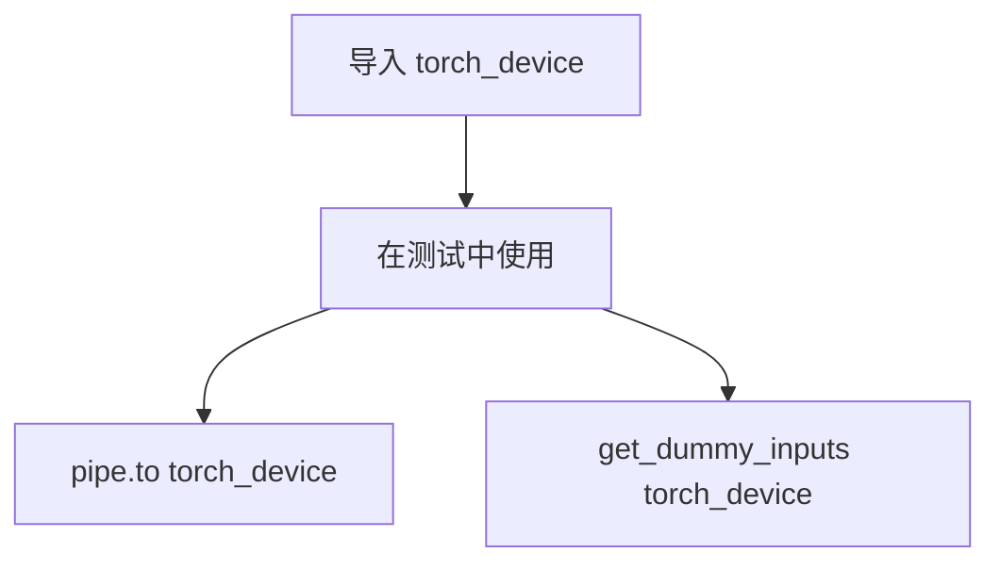

#### 带注释源码

```python
# 这是一个从 testing_utils 模块导入的全局变量
# 源代码不在当前文件中，因此无法直接显示
# 以下是它在当前文件中的使用示例：

from ...testing_utils import enable_full_determinism, torch_device

# 在 test_callback_inputs 方法中使用
pipe = pipe.to(torch_device)  # 将管道移动到指定设备
inputs = self.get_dummy_inputs(torch_device)  # 获取在指定设备上的输入

# 在 test_attention_slicing_forward_pass 方法中使用
pipe.to(torch_device)  # 将管道移动到指定设备
```

#### 备注

由于 `torch_device` 是从外部模块导入的变量而非当前文件定义的函数，其实际定义位于 `testing_utils` 模块中。从代码使用方式来看，它是一个全局配置的设备字符串，用于确保测试在正确的设备上运行，这是实现跨平台测试的关键机制。


### `enable_full_determinism`

该函数用于在测试环境中启用完全确定性执行，通过设置随机种子（numpy、torch、python random等）来确保深度学习测试结果的可复现性。

参数： 无

返回值： 无

#### 流程图

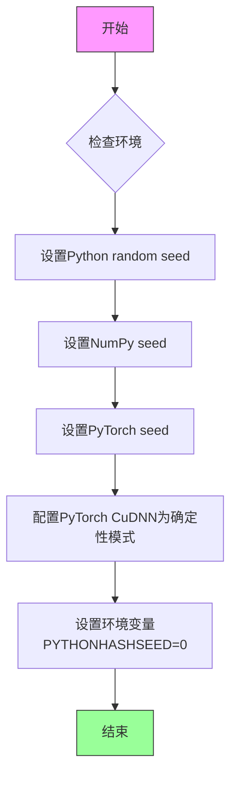

#### 带注释源码

```
# 由于 enable_full_determinism 是从外部模块 testing_utils 导入的，
# 当前文件中没有该函数的完整实现。以下是基于其功能用途的推断代码：

def enable_full_determinism(seed: int = 0):
    """
    启用完全确定性执行，确保测试结果可复现。
    
    参数:
        seed: 随机种子值，默认为0
    """
    import os
    import random
    import numpy as np
    import torch
    
    # 1. 设置Python内置random模块的随机种子
    random.seed(seed)
    
    # 2. 设置NumPy的随机种子
    np.random.seed(seed)
    
    # 3. 设置PyTorch的随机种子
    torch.manual_seed(seed)
    
    # 4. 如果使用CUDA，设置GPU随机种子
    if torch.cuda.is_available():
        torch.cuda.manual_seed(seed)
        torch.cuda.manual_seed_all(seed)
    
    # 5. 强制PyTorch使用确定性算法
    # 这会导致计算速度降低，但确保结果可复现
    torch.backends.cudnn.deterministic = True
    torch.backends.cudnn.benchmark = False
    
    # 6. 设置环境变量确保Python哈希随机化固定
    os.environ['PYTHONHASHSEED'] = str(seed)

# 在测试文件开头调用，确保所有后续随机操作都是确定性的
enable_full_determinism()
```

> **注意**：由于该函数定义在 `...testing_utils` 模块中，以上源码为基于函数功能的推断实现。实际实现可能包含更多平台特定的确定性配置（如AMD GPU、TensorFlow等）。


### `HunyuanVideoImageToVideoPipelineFastTests.get_dummy_components`

该方法为 `HunyuanVideoImageToVideoPipelineFastTests` 测试类提供核心支持，负责构建并返回一个包含管道所需的所有虚拟组件（如 Transformer、VAE、调度器、文本编码器等）的字典。这些组件使用随机初始化的权重或微小的测试配置，旨在无需下载大型预训练模型的情况下，快速执行推理测试，确保测试环境的隔离性和一致性。

参数：

- `num_layers`：`int`，默认值 1，用于配置 Transformer 模型的层数。
- `num_single_layers`：`int`，默认值 1，用于配置 Transformer 模型的单层（single layer）数量。

返回值：`dict`，返回一个键值对字典，包含以下键对应的虚拟组件实例：`transformer`, `vae`, `scheduler`, `text_encoder`, `text_encoder_2`, `tokenizer`, `tokenizer_2`, `image_processor`。

#### 流程图

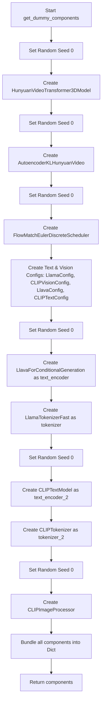

#### 带注释源码

```python
def get_dummy_components(self, num_layers: int = 1, num_single_layers: int = 1):
    """
    生成用于测试的虚拟组件。
    
    参数:
        num_layers (int): Transformer模型的层数。
        num_single_layers (int): Transformer模型的单层数。
    返回:
        dict: 包含所有管道组件的字典。
    """
    # 1. 初始化 Transformer (HunyuanVideoTransformer3DModel)
    # 设置随机种子以确保结果可复现
    torch.manual_seed(0)
    transformer = HunyuanVideoTransformer3DModel(
        in_channels=2 * 4 + 1,
        out_channels=4,
        num_attention_heads=2,
        attention_head_dim=10,
        num_layers=num_layers,
        num_single_layers=num_single_layers,
        num_refiner_layers=1,
        patch_size=1,
        patch_size_t=1,
        guidance_embeds=False,
        text_embed_dim=16,
        pooled_projection_dim=8,
        rope_axes_dim=(2, 4, 4),
        image_condition_type="latent_concat",
    )

    # 2. 初始化 VAE (AutoencoderKLHunyuanVideo)
    torch.manual_seed(0)
    vae = AutoencoderKLHunyuanVideo(
        in_channels=3,
        out_channels=3,
        latent_channels=4,
        down_block_types=(
            "HunyuanVideoDownBlock3D",
            "HunyuanVideoDownBlock3D",
            "HunyuanVideoDownBlock3D",
            "HunyuanVideoDownBlock3D",
        ),
        up_block_types=(
            "HunyuanVideoUpBlock3D",
            "HunyuanVideoUpBlock3D",
            "HunyuanVideoUpBlock3D",
            "HunyuanVideoUpBlock3D",
        ),
        block_out_channels=(8, 8, 8, 8),
        layers_per_block=1,
        act_fn="silu",
        norm_num_groups=4,
        scaling_factor=0.476986,
        spatial_compression_ratio=8,
        temporal_compression_ratio=4,
        mid_block_add_attention=True,
    )

    # 3. 初始化调度器 (FlowMatchEulerDiscreteScheduler)
    torch.manual_seed(0)
    scheduler = FlowMatchEulerDiscreteScheduler(shift=7.0)

    # 4. 配置文本编码器和视觉编码器
    # 配置 Llama 作为文本编码器的后端
    text_config = LlamaConfig(
        bos_token_id=0,
        eos_token_id=2,
        hidden_size=16,
        intermediate_size=37,
        layer_norm_eps=1e-05,
        num_attention_heads=4,
        num_hidden_layers=2,
        pad_token_id=100,
        vocab_size=1000,
        hidden_act="gelu",
        projection_dim=32,
    )
    # 配置 CLIP Vision
    vision_config = CLIPVisionConfig(
        hidden_size=8,
        intermediate_size=37,
        projection_dim=32,
        num_attention_heads=4,
        num_hidden_layers=2,
        image_size=224,
    )
    # 配置 Llava (结合视觉和文本)
    llava_text_encoder_config = LlavaConfig(vision_config, text_config, pad_token_id=100, image_token_index=101)

    # 配置第二个文本编码器 (CLIP)
    clip_text_encoder_config = CLIPTextConfig(
        bos_token_id=0,
        eos_token_id=2,
        hidden_size=8,
        intermediate_size=37,
        layer_norm_eps=1e-05,
        num_attention_heads=4,
        num_hidden_layers=2,
        pad_token_id=1,
        vocab_size=1000,
        hidden_act="gelu",
        projection_dim=32,
    )

    # 5. 初始化文本编码器 (Llava)
    torch.manual_seed(0)
    text_encoder = LlavaForConditionalGeneration(llava_text_encoder_config)
    # 加载分词器 (此处为 dummy 路径)
    tokenizer = LlamaTokenizerFast.from_pretrained("finetrainers/dummy-hunyaunvideo", subfolder="tokenizer")

    # 6. 初始化第二个文本编码器 (CLIP Text)
    torch.manual_seed(0)
    text_encoder_2 = CLIPTextModel(clip_text_encoder_config)
    tokenizer_2 = CLIPTokenizer.from_pretrained("hf-internal-testing/tiny-random-clip")

    # 7. 初始化图像处理器
    torch.manual_seed(0)
    image_processor = CLIPImageProcessor(
        crop_size=224,
        do_center_crop=True,
        do_normalize=True,
        do_resize=True,
        image_mean=[0.48145466, 0.4578275, 0.40821073],
        image_std=[0.26862954, 0.26130258, 0.27577711],
        resample=3,
        size=224,
    )

    # 8. 组装并返回组件字典
    components = {
        "transformer": transformer,
        "vae": vae,
        "scheduler": scheduler,
        "text_encoder": text_encoder,
        "text_encoder_2": text_encoder_2,
        "tokenizer": tokenizer,
        "tokenizer_2": tokenizer_2,
        "image_processor": image_processor,
    }
    return components
```

### 类的详细信息

**类名**: `HunyuanVideoImageToVideoPipelineFastTests`

**类字段**:

- `pipeline_class`：指定该测试类对应的管道类为 `HunyuanVideoImageToVideoPipeline`。
- `params`：管道调用所需的参数集合（`frozenset`），包括 `image`, `prompt`, `height` 等。
- `batch_params`：支持批处理的参数集合。
- `required_optional_params`：可选参数的集合。
- `supports_dduf`：布尔值，表示不支持 DDUF。
- `test_xformers_attention`：布尔值，标记是否测试 xformers 注意力（此处为 False）。
- `test_layerwise_casting`：布尔值，标记是否测试分层类型转换（此处为 True）。
- `test_group_offloading`：布尔值，标记是否测试组卸载（此处为 True）。

### 关键组件信息

- **HunyuanVideoTransformer3DModel**: 核心的 Diffusion Transformer 模型，负责潜在空间的去噪过程。
- **AutoencoderKLHunyuanVideo**: VAE 模型，负责将图像编码为潜在向量或将潜在向量解码为视频帧。
- **FlowMatchEulerDiscreteScheduler**: 调度器，使用 Euler 方法离散化 Flow Matching 积分。
- **LlavaForConditionalGeneration**: 多模态文本编码器，结合了视觉特征和文本嵌入。
- **CLIPTextModel**: 辅助文本编码器，用于编码额外的文本提示。
- **CLIPImageProcessor**: 图像预处理组件，用于调整图像大小、归一化等。

### 潜在的技术债务或优化空间

1.  **重复的随机种子设置**: 代码中在初始化每个组件前都调用了 `torch.manual_seed(0)`。虽然这保证了每个组件初始化的确定性，但在每个组件前都重置种子可能掩盖组件间潜在的随机性交互，或者在复杂测试场景中显得冗余。优化方案：可以在函数开始设置一次种子，或者利用 `torch.manual_seed` 的机制确保全局确定性。
2.  **硬编码的虚拟路径**: `tokenizer` 加载使用了路径 `"finetrainers/dummy-hunyaunvideo"`。如果该路径在测试环境中不存在，会导致测试失败。优化方案：可以使用内存中的 `tokenizer` 或者确保测试资源准备脚本正确下载了这些 dummy 数据。
3.  **极小的模型配置**: 为了“Fast Tests”，使用了极小的层数（`num_layers=1`）和隐藏维度（如 16, 8）。这可能导致某些逻辑分支（如深层网络的 attention pattern）未被测试覆盖。

### 其它项目

- **设计目标与约束**: 旨在提供一种快速、轻量级的方式来验证 `HunyuanVideoImageToVideoPipeline` 的基本推理逻辑，无需 GPU 资源或大型模型权重。
- **错误处理与异常设计**: 该方法本身不包含复杂的错误处理，主要依赖于 `diffusers` 库内部对输入参数（如 `num_layers` 类型错误）的校验。
- **外部依赖与接口契约**: 返回的 `components` 字典直接传递给 `HunyuanVideoImageToVideoPipeline` 的构造函数。因此，该方法必须严格遵守管道类的 `__init__` 方法所期望的参数签名（键名和类型）。


### `HunyuanVideoImageToVideoPipelineFastTests.get_dummy_inputs`

该方法是一个测试辅助函数，用于生成虚拟输入数据（dummy inputs），以便对 `HunyuanVideoImageToVideoPipeline` 管道进行单元测试。它创建虚拟的图像、提示词和生成器参数，模拟真实的推理输入场景。

参数：

- `self`：隐式参数，`HunyuanVideoImageToVideoPipelineFastTests` 类的实例
- `device`：`str`，目标设备（如 "cpu"、"cuda"），用于创建 PyTorch 生成器
- `seed`：`int`，随机种子，默认为 0，用于确保测试结果的可重复性

返回值：`Dict[str, Any]`，返回一个包含管道推理所需所有参数的字典，包括图像、提示词、生成器、推理步数、引导 scale、尺寸、帧数和输出类型等。

#### 流程图

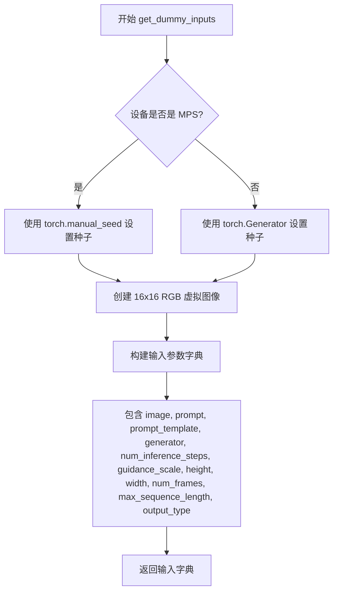

#### 带注释源码

```python
def get_dummy_inputs(self, device, seed=0):
    """
    生成用于测试的虚拟输入参数。

    参数:
        device: 目标设备字符串
        seed: 随机种子用于生成器

    返回:
        包含所有管道推理参数的字典
    """
    # 根据设备类型选择随机数生成方式
    # MPS (Apple Silicon) 使用 torch.manual_seed
    if str(device).startswith("mps"):
        generator = torch.manual_seed(seed)
    else:
        # 其他设备使用 torch.Generator 并设置种子
        generator = torch.Generator(device=device).manual_seed(seed)

    # 设置虚拟图像的尺寸
    image_height = 16
    image_width = 16
    # 创建一个纯 RGB 图像用于测试
    image = Image.new("RGB", (image_width, image_height))

    # 构建完整的输入参数字典
    inputs = {
        "image": image,  # 输入图像
        "prompt": "dance monkey",  # 文本提示词
        # 提示词模板配置，包含图像嵌入相关参数
        "prompt_template": {
            "template": "{}",
            "crop_start": 0,
            "image_emb_len": 49,
            "image_emb_start": 5,
            "image_emb_end": 54,
            "double_return_token_id": 0,
        },
        "generator": generator,  # PyTorch 随机生成器
        "num_inference_steps": 2,  # 推理步数
        "guidance_scale": 4.5,  # 引导比例
        "height": image_height,  # 输出高度
        "width": image_width,  # 输出宽度
        "num_frames": 9,  # 生成帧数
        "max_sequence_length": 64,  # 最大序列长度
        "output_type": "pt",  # 输出类型为 PyTorch 张量
    }
    return inputs
```


### `HunyuanVideoImageToVideoPipelineFastTests.test_inference`

这是一个单元测试方法，用于测试 `HunyuanVideoImageToVideoPipeline` 图像转视频管道的推理功能。该测试通过创建虚拟组件和输入数据，验证管道能够正确生成视频，并检查生成视频的形状（帧数、通道数、高度、宽度）以及像素值是否符合预期。

参数：

- `self`：隐式参数，测试类实例本身

返回值：`None`，该方法为 unittest 测试方法，不返回任何值，通过断言验证结果

#### 流程图

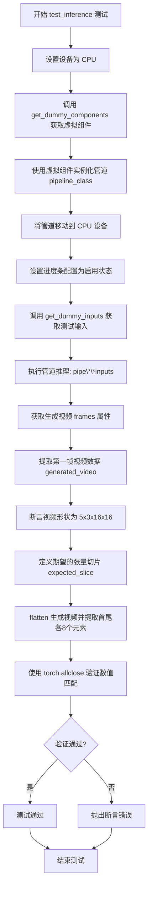

#### 带注释源码

```python
def test_inference(self):
    """测试 HunyuanVideoImageToVideoPipeline 的推理功能"""
    
    # 步骤1: 设置测试设备为 CPU
    device = "cpu"

    # 步骤2: 获取虚拟组件（transformer, vae, scheduler, text_encoder等）
    components = self.get_dummy_components()
    
    # 步骤3: 使用虚拟组件实例化图像转视频管道
    pipe = self.pipeline_class(**components)
    
    # 步骤4: 将管道移动到指定设备（CPU）
    pipe.to(device)
    
    # 步骤5: 配置进度条（disable=None 表示启用进度条）
    pipe.set_progress_bar_config(disable=None)

    # 步骤6: 获取虚拟输入数据（包含图像、prompt、生成器等）
    inputs = self.get_dummy_inputs(device)
    
    # 步骤7: 执行管道推理，调用 __call__ 方法生成视频
    # 返回值包含 frames 属性存储生成的视频帧
    video = pipe(**inputs).frames
    
    # 步骤8: 获取第一批次生成的视频（索引0）
    generated_video = video[0]
    
    # 步骤9: 断言验证生成视频的形状
    # 预期: 5帧 x 3通道(RGB) x 16高度 x 16宽度
    # 注: 原始输入为9帧，管道内部会丢弃4帧
    self.assertEqual(generated_video.shape, (5, 3, 16, 16))

    # 步骤10: 定义期望的视频像素值切片（用于数值验证）
    # fmt: off
    expected_slice = torch.tensor([
        0.444, 0.479, 0.4485, 0.5752, 0.3539, 0.1548, 
        0.2706, 0.3593, 0.5323, 0.6635, 0.6795, 0.5255, 
        0.5091, 0.345, 0.4276, 0.4128
    ])
    # fmt: on

    # 步骤11: 从生成视频中提取用于对比的切片
    # 将视频展平为一维，然后取前8个和后8个元素（共16个）
    generated_slice = generated_video.flatten()
    generated_slice = torch.cat([generated_slice[:8], generated_slice[-8:]])
    
    # 步骤12: 验证生成视频的像素值与期望值是否接近
    # 使用 atol=1e-3（绝对容差）进行比较
    self.assertTrue(
        torch.allclose(generated_slice, expected_slice, atol=1e-3),
        "The generated video does not match the expected slice."
    )
```


### `HunyuanVideoImageToVideoPipelineFastTests.test_callback_inputs`

该测试方法用于验证 HunyuanVideoImageToVideoPipeline 管道中的回调功能是否正确工作，特别是检查 `callback_on_step_end` 和 `callback_on_step_end_tensor_inputs` 参数是否能正确地将张量传递给回调函数，并允许回调函数修改这些张量。

参数：

- `self`：隐式参数，测试类实例本身

返回值：`None`，该方法为测试方法，不返回任何值（通过 `unittest.TestCase` 框架执行）

#### 流程图

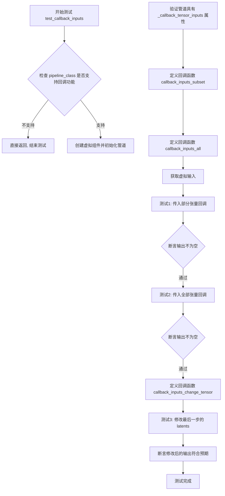

#### 带注释源码

```python
def test_callback_inputs(self):
    # 获取管道 __call__ 方法的签名
    sig = inspect.signature(self.pipeline_class.__call__)
    # 检查是否存在回调相关的参数
    has_callback_tensor_inputs = "callback_on_step_end_tensor_inputs" in sig.parameters
    has_callback_step_end = "callback_on_step_end" in sig.parameters

    # 如果管道不支持回调功能，则直接返回（跳过测试）
    if not (has_callback_tensor_inputs and has_callback_step_end):
        return

    # 创建虚拟组件并初始化管道
    components = self.get_dummy_components()
    pipe = self.pipeline_class(**components)
    pipe = pipe.to(torch_device)
    pipe.set_progress_bar_config(disable=None)
    
    # 断言管道具有 _callback_tensor_inputs 属性
    # 该属性定义了回调函数可以使用的张量变量列表
    self.assertTrue(
        hasattr(pipe, "_callback_tensor_inputs"),
        f" {self.pipeline_class} should have `_callback_tensor_inputs` that defines a list of tensor variables its callback function can use as inputs",
    )

    # 定义回调函数：验证只传递了允许的张量输入子集
    # 参数 pipe: 管道实例
    # 参数 i: 当前推理步骤索引
    # 参数 t: 当前时间步
    # 参数 callback_kwargs: 包含张量的字典
    def callback_inputs_subset(pipe, i, t, callback_kwargs):
        # 遍历回调参数
        for tensor_name, tensor_value in callback_kwargs.items():
            # 检查是否只传递了允许的张量输入
            assert tensor_name in pipe._callback_tensor_inputs

        return callback_kwargs

    # 定义回调函数：验证传递了所有允许的张量输入
    def callback_inputs_all(pipe, i, t, callback_kwargs):
        # 验证 _callback_tensor_inputs 中的每个张量都在 callback_kwargs 中
        for tensor_name in pipe._callback_tensor_inputs:
            assert tensor_name in callback_kwargs

        # 遍历回调参数，再次验证
        for tensor_name, tensor_value in callback_kwargs.items():
            # 检查是否只传递了允许的张量输入
            assert tensor_name in pipe._callback_tensor_inputs

        return callback_kwargs

    # 获取虚拟输入
    inputs = self.get_dummy_inputs(torch_device)

    # 测试1：传入部分张量（仅 latents）
    inputs["callback_on_step_end"] = callback_inputs_subset
    inputs["callback_on_step_end_tensor_inputs"] = ["latents"]
    output = pipe(**inputs)[0]

    # 测试2：传入所有张量
    inputs["callback_on_step_end"] = callback_inputs_all
    inputs["callback_on_step_end_tensor_inputs"] = pipe._callback_tensor_inputs
    output = pipe(**inputs)[0]

    # 定义回调函数：在最后一步将 latents 修改为零张量
    def callback_inputs_change_tensor(pipe, i, t, callback_kwargs):
        # 判断是否为最后一步
        is_last = i == (pipe.num_timesteps - 1)
        if is_last:
            # 将 latents 修改为零张量
            callback_kwargs["latents"] = torch.zeros_like(callback_kwargs["latents"])
        return callback_kwargs

    # 测试3：修改最后一步的 latents
    inputs["callback_on_step_end"] = callback_inputs_change_tensor
    inputs["callback_on_step_end_tensor_inputs"] = pipe._callback_tensor_inputs
    output = pipe(**inputs)[0]
    
    # 断言修改后的输出符合预期（输出绝对值之和小于 1e10）
    assert output.abs().sum() < 1e10
```


### `HunyuanVideoImageToVideoPipelineFastTests.test_attention_slicing_forward_pass`

该测试方法用于验证 HunyuanVideo 图像到视频管道的注意力切片（Attention Slicing）功能是否正常工作。它通过比较启用和不启用注意力切片时的推理结果，确保注意力切片优化不会影响输出质量。

参数：

- `self`：`HunyuanVideoImageToVideoPipelineFastTests`，测试类的实例
- `test_max_difference`：`bool`，默认为 `True`，控制是否测试输出之间的最大差异
- `test_mean_pixel_difference`：`bool`，默认为 `True`，控制是否测试平均像素差异（当前未被使用）
- `expected_max_diff`：`float`，默认为 `1e-3`，允许的最大差异阈值

返回值：`None`，该方法是一个单元测试方法，不返回任何值，主要通过断言来验证功能

#### 流程图

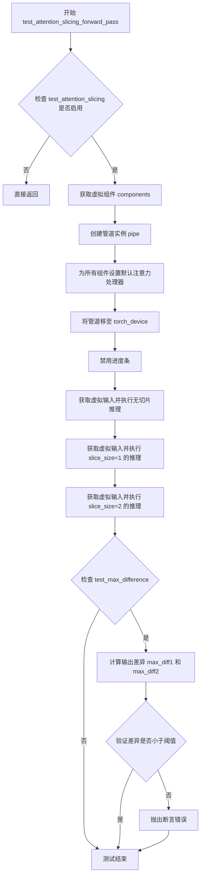

#### 带注释源码

```python
def test_attention_slicing_forward_pass(
    self, test_max_difference=True, test_mean_pixel_difference=True, expected_max_diff=1e-3
):
    """测试注意力切片功能是否正确工作，确保切片不影响推理结果"""
    
    # 如果测试类未启用注意力切片测试，则直接返回
    if not self.test_attention_slicing:
        return

    # 获取虚拟组件配置（transformer, vae, scheduler, text_encoder等）
    components = self.get_dummy_components()
    
    # 使用虚拟组件实例化管道
    pipe = self.pipeline_class(**components)
    
    # 遍历所有组件，为支持该方法的组件设置默认注意力处理器
    for component in pipe.components.values():
        if hasattr(component, "set_default_attn_processor"):
            component.set_default_attn_processor()
    
    # 将管道移至测试设备（CPU或GPU）
    pipe.to(torch_device)
    
    # 设置进度条配置，disable=None 表示启用进度条
    pipe.set_progress_bar_config(disable=None)

    # 设置生成器设备为 CPU
    generator_device = "cpu"
    
    # 获取虚拟输入（包含图像、prompt、生成器等配置）
    inputs = self.get_dummy_inputs(generator_device)
    
    # 执行不带注意力切片的推理，获取基准输出
    output_without_slicing = pipe(**inputs)[0]

    # 启用注意力切片，slice_size=1 表示每个切片处理1个token
    pipe.enable_attention_slicing(slice_size=1)
    
    # 使用相同的虚拟输入执行推理
    inputs = self.get_dummy_inputs(generator_device)
    output_with_slicing1 = pipe(**inputs)[0]

    # 更改切片大小为2，再次执行推理
    pipe.enable_attention_slicing(slice_size=2)
    inputs = self.get_dummy_inputs(generator_device)
    output_with_slicing2 = pipe(**inputs)[0]

    # 如果启用了最大差异测试
    if test_max_difference:
        # 计算无切片与 slice_size=1 输出的最大差异
        max_diff1 = np.abs(to_np(output_with_slicing1) - to_np(output_without_slicing)).max()
        
        # 计算无切片与 slice_size=2 输出的最大差异
        max_diff2 = np.abs(to_np(output_with_slicing2) - to_np(output_without_slicing)).max()
        
        # 断言：注意力切片不应影响推理结果，差异应小于预期阈值
        self.assertLess(
            max(max_diff1, max_diff2),
            expected_max_diff,
            "Attention slicing should not affect the inference results",
        )
```


### `HunyuanVideoImageToVideoPipelineFastTests.test_vae_tiling`

该测试方法用于验证 HunyuanVideo 图像到视频管道的 VAE 分块（tiling）功能是否正常工作。通过比较启用分块与未启用分块时的模型输出差异，确保分块操作不会显著影响推理结果。

参数：

- `self`：`unittest.TestCase`，测试类的隐式实例参数
- `expected_diff_max`：`float`，允许的最大差异阈值，默认值为 0.2（实际测试中内部重新赋值为 0.6）

返回值：`None`，该方法为测试用例，通过断言验证结果而非返回数据

#### 流程图

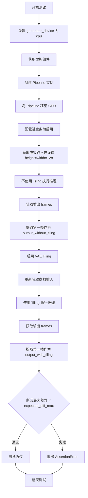

#### 带注释源码

```python
def test_vae_tiling(self, expected_diff_max: float = 0.2):
    """
    测试 VAE tiling 功能是否正常。
    
    VAE tiling 是一种将大图像分割成小块进行处理的技术，
    用于减少显存占用。该测试验证启用 tiling 后
    的输出结果与不启用时的差异在可接受范围内。
    
    参数:
        expected_diff_max: float, 允许的最大差异阈值，默认 0.2
    """
    # 该测试需要比其他测试更高的容差，因为 tiling 引入的误差较大
    # 内部重新赋值为 0.6 以适应测试需求
    expected_diff_max = 0.6
    
    # 设置设备为 CPU
    generator_device = "cpu"
    
    # 获取虚拟组件（transformer, vae, scheduler, text_encoder 等）
    components = self.get_dummy_components()

    # 使用虚拟组件实例化 Pipeline
    pipe = self.pipeline_class(**components)
    
    # 将 Pipeline 移至 CPU 设备
    pipe.to("cpu")
    
    # 配置进度条（disable=None 表示启用进度条）
    pipe.set_progress_bar_config(disable=None)

    # --- 第一次推理：不启用 tiling ---
    
    # 获取虚拟输入数据
    inputs = self.get_dummy_inputs(generator_device)
    
    # 设置输入图像尺寸为 128x128（较大的尺寸会触发 tiling 需求）
    inputs["height"] = inputs["width"] = 128
    
    # 执行推理并获取结果（frames 是返回的元组，取第一个元素）
    output_without_tiling = pipe(**inputs)[0]

    # --- 第二次推理：启用 tiling ---
    
    # 为 VAE 启用 tiling 功能
    # tile_sample_min_height/width: 最小分块高度/宽度
    # tile_sample_stride_height/width: 分块采样步长
    pipe.vae.enable_tiling(
        tile_sample_min_height=96,
        tile_sample_min_width=96,
        tile_sample_stride_height=64,
        tile_sample_stride_width=64,
    )
    
    # 重新获取虚拟输入数据
    inputs = self.get_dummy_inputs(generator_device)
    inputs["height"] = inputs["width"] = 128
    
    # 再次执行推理（此时启用 tiling）
    output_with_tiling = pipe(**inputs)[0]

    # --- 验证结果 ---
    
    # 断言：启用 tiling 与不启用 tiling 的输出差异应小于阈值
    # 使用 to_np 将 PyTorch tensor 转换为 numpy array
    self.assertLess(
        (to_np(output_without_tiling) - to_np(output_with_tiling)).max(),
        expected_diff_max,
        "VAE tiling should not affect the inference results",
    )
```


### `HunyuanVideoImageToVideoPipelineFastTests.test_inference_batch_consistent`

这是一个被跳过的单元测试方法，用于验证 HunyuanVideo 图像到视频管道的批处理推理一致性。由于快速测试使用非常小的词汇表，除了空默认提示外，任何其他提示都会导致嵌入查找错误，因此该测试被跳过。

参数：

- `self`：`HunyuanVideoImageToVideoPipelineFastTests`，测试类实例，隐式参数，表示调用该方法的类实例本身

返回值：`None`，该方法没有返回值（函数体为 `pass`）

#### 流程图

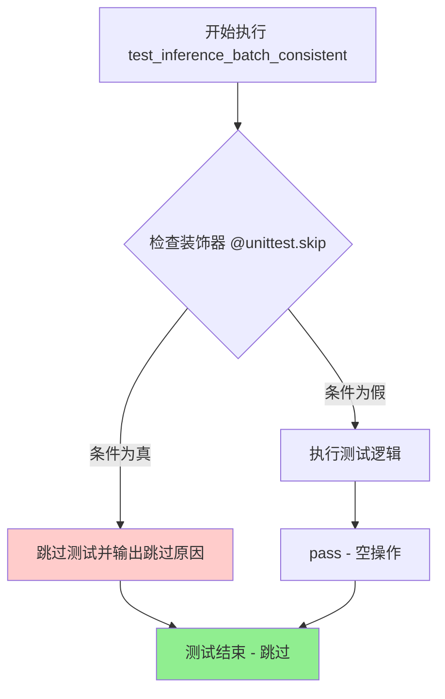

#### 带注释源码

```python
@unittest.skip(
    "A very small vocab size is used for fast tests. So, Any kind of prompt other than the empty default used in other tests will lead to a embedding lookup error. This test uses a long prompt that causes the error."
)
def test_inference_batch_consistent(self):
    """
    测试 HunyuanVideo 图像到视频管道的批处理推理一致性。
    
    该测试方法用于验证在使用批处理输入时，管道生成的视频结果应该与单次推理结果一致。
    由于测试使用虚拟组件（词汇表大小非常小），任何非空提示都会导致嵌入查找错误，
    因此该测试被 @unittest.skip 装饰器跳过。
    
    Args:
        self: HunyuanVideoImageToVideoPipelineFastTests 实例
        
    Returns:
        None: 该方法没有返回值
        
    Note:
        - 该测试原本意图是验证批处理推理的一致性
        - 跳过原因：快速测试环境使用的虚拟 tokenizer 词汇表太小（vocab_size=1000）
        - 如果需要启用该测试，需要使用更大词汇表的虚拟组件或真实组件
    """
    pass  # 空实现，由于被跳过装饰器跳过，不会执行任何逻辑
```


### `HunyuanVideoImageToVideoPipelineFastTests.test_inference_batch_single_identical`

该方法是一个单元测试，用于验证批量推理时单张图像与批量推理结果的一致性。由于测试使用较小的词汇表（vocab size），任何非空的默认提示词都会导致嵌入查找错误，因此该测试被跳过。

参数：

- `self`：`HunyuanVideoImageToVideoPipelineFastTests`，代表测试类实例本身

返回值：`None`，该方法被 `@unittest.skip` 装饰器跳过，没有实际执行逻辑

#### 流程图

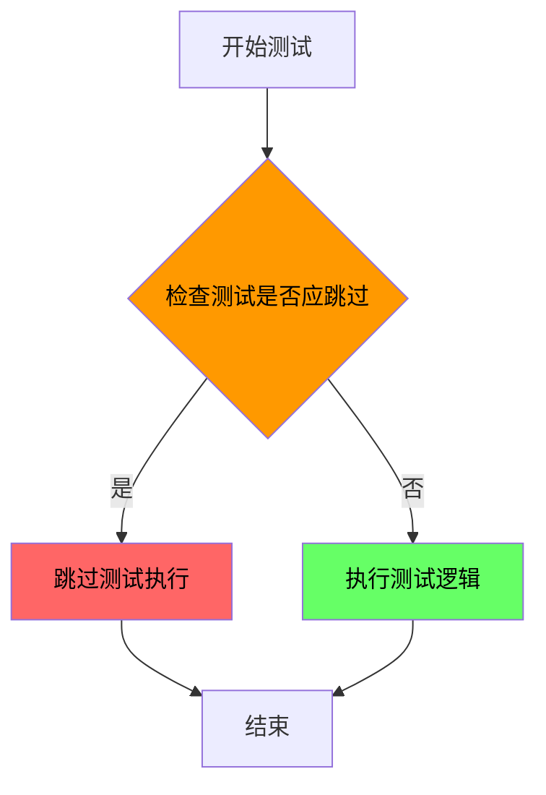

#### 带注释源码

```python
@unittest.skip(
    "A very small vocab size is used for fast tests. So, Any kind of prompt other than the empty default used in other tests will lead to a embedding lookup error. This test uses a long prompt that causes the error."
)
def test_inference_batch_single_identical(self):
    """
    测试批量推理时单张图像推理结果与批量推理结果的一致性。
    
    该测试方法用于验证：
    1. 批量推理时，单个样本的结果应与单独推理该样本的结果一致
    2. 验证pipeline的批次处理逻辑正确性
    
    当前状态：由于使用较小的词汇表（vocab size=1000），长提示词会导致
    嵌入查找错误，因此该测试被跳过。
    """
    pass  # 方法体为空，测试被跳过
```


### `HunyuanVideoImageToVideoPipelineFastTests.test_encode_prompt_works_in_isolation`

该测试方法用于验证 `encode_prompt` 是否能够在隔离环境下独立工作（即不依赖图像处理器生成的图像嵌入），但由于当前实现中 `encode_prompt` 需要图像嵌入，该测试被跳过。

参数：

-  `self`：`HunyuanVideoImageToVideoPipelineFastTests`，测试类的实例对象

返回值：`None`，无返回值（方法体为 `pass`）

#### 流程图

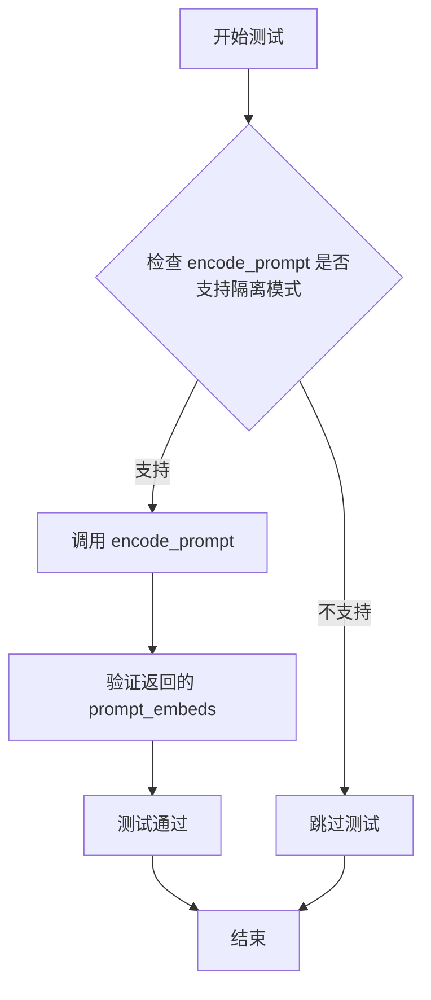

#### 带注释源码

```python
@unittest.skip(
    "Encode prompt currently does not work in isolation because of requiring image embeddings from image processor. The test does not handle this case, or we need to rewrite encode_prompt."
)
def test_encode_prompt_works_in_isolation(self):
    """
    测试 encode_prompt 方法是否能够在隔离环境下独立工作。
    
    理想情况下，该测试应该：
    1. 不依赖图像处理器生成的图像嵌入
    2. 单独测试文本提示编码功能
    3. 验证返回的 prompt_embeds 和 pooled_prompt_embeds 的正确性
    
    当前状态：该测试被跳过，因为：
    - encode_prompt 方法依赖于图像嵌入
    - 需要重写 encode_prompt 以支持隔离模式
    """
    pass
```

## 关键组件


### HunyuanVideoImageToVideoPipeline

核心视频生成pipeline类，负责图像到视频的条件生成，支持文本提示引导和多种推理参数配置。

### HunyuanVideoTransformer3DModel

3D视频变换器模型，处理时空注意力机制，支持图像条件注入和潜变量预测，是视频生成的核心神经网络架构。

### AutoencoderKLHunyuanVideo

变分自编码器(VAE)模型，负责图像/视频与潜变量空间之间的编解码，支持平铺(tiling)策略以处理高分辨率输出。

### FlowMatchEulerDiscreteScheduler

基于欧拉离散方法的Flow Match调度器，控制扩散推理过程中的时间步长采样和噪声调度策略。

### LlavaForConditionalGeneration

Llava配置的文本编码器，结合视觉和文本模态特征，生成多模态prompt嵌入用于条件生成。

### CLIPTextModel

CLIP文本编码器，生成文本提示的语义嵌入，与Llava编码器互补提供双文本编码器支持。

### CLIPImageProcessor

CLIP图像预处理器，负责图像的裁剪、归一化和尺寸调整，将输入图像转换为模型所需格式。

### PipelineTesterMixin

通用pipeline测试混入类，提供标准化测试框架，包括参数验证、推理一致性检查等基础测试方法。

### PyramidAttentionBroadcastTesterMixin

金字塔注意力广播测试混入类，验证跨帧注意力机制的效率和正确性实现。

### Attention Slicing

注意力切片优化技术，通过将注意力计算分片处理降低显存占用，适用于资源受限环境。

### VAE Tiling

VAE平铺策略，允许分块处理大尺寸图像/视频潜变量，避免显存溢出问题。

### Callback机制

推理回调系统，支持在每个推理步骤结束后访问和修改中间状态(如latents)，增强pipeline的可扩展性和调试能力。


## 问题及建议


### 已知问题

-   **硬编码的配置值**：在`get_dummy_components`方法中存在大量硬编码的模型配置参数（如`num_layers=1`、`num_single_layers=1`、`patch_size=1`等），这些值可能无法充分测试模型的各个功能路径
-   **多个测试被跳过**：`test_inference_batch_consistent`、`test_inference_batch_single_identical`和`test_encode_prompt_works_in_isolation`三个测试方法因已知问题被永久跳过，表明某些功能未完全实现或存在未解决的bug
-   **TODO未完成**：代码中有TODO注释"# TODO(aryan): Create a dummy gemma model with smol vocab size"，但尚未实现，可能导致测试覆盖不完整
-   **Magic Numbers缺乏解释**：多处使用魔数如`image_height = 16`、`num_frames = 9`以及注释中提到的"expected video has 4 lesser frames"，缺少对数值来源和逻辑的解释
-   **测试断言容差过大**：VAE tiling测试中`expected_diff_max = 0.6`的容差设置远高于其他测试的`0.2`，可能导致实际问题被掩盖
-   **外部依赖风险**：测试依赖外部预训练模型路径（如"finetrainers/dummy-hunyaunvideo"），当模型不可用时测试会失败
-   **设备兼容性处理**：通过字符串匹配`str(device).startswith("mps")`判断设备类型，这种方式脆弱且不够优雅
-   **缺乏错误处理**：测试代码中没有对异常输入（如无效的prompt、图像尺寸等）的测试，也没有参数验证

### 优化建议

-   **重构配置生成**：将硬编码的配置值提取为可配置的参数或使用参数化测试，增加测试的覆盖面
-   **实现跳过的测试**：优先解决导致测试被跳过的问题，补充完整的batch处理和prompt编码测试
-   **增加注释和文档**：为关键逻辑（如帧数减少原因、容差设置）添加解释性注释，提高代码可维护性
-   **统一容差标准**：将VAE tiling测试的容差调整为与其他测试一致的标准，或提供明确的理由
-   **改进设备检测**：使用更可靠的方式检测设备类型，或依赖transformers/diffusers提供的设备检测方法
-   **添加边界测试**：增加对异常输入、极端参数值和边界情况的测试覆盖
-   **减少外部依赖**：考虑使用本地mock或fixture替代外部模型依赖，提高测试的独立性和稳定性

## 其它


### 设计目标与约束

本测试文件旨在验证HunyuanVideoImageToVideoPipeline的功能正确性，包括图像到视频的转换推理、注意力切片、VAE平铺等特性。测试采用dummy components进行快速验证，约束条件包括：使用小规模模型和少量推理步数（2步）、固定随机种子确保可重复性、 vocab size限制为1000以避免embedding lookup错误。

### 错误处理与异常设计

测试中包含多个被跳过的测试用例（@unittest.skip装饰器），主要处理以下错误场景：1）vocab size过小导致的embedding lookup error；2）encode_prompt无法独立工作因为需要image embeddings。测试通过检查pipeline的__call__方法签名来验证callback相关参数的存在性，并使用assert语句进行断言验证。

### 数据流与状态机

测试数据流：get_dummy_inputs生成包含image、prompt、generator等参数的字典 → pipeline_class实例化（传入components）→ 调用pipe(**inputs)执行推理 → 返回VideoPipelineOutput对象（包含frames）。测试覆盖的pipeline状态转换包括：普通推理模式、attention slicing模式（slice_size=1和2）、VAE tiling模式。

### 外部依赖与接口契约

本测试依赖以下外部组件：transformers库（CLIPImageProcessor、CLIPTextModel、CLIPTokenizer、LlamaTokenizerFast等）、diffusers库（HunyuanVideoImageToVideoPipeline、AutoencoderKLHunyuanVideo、FlowMatchEulerDiscreteScheduler等）、PIL库（Image）、numpy、torch。接口契约要求pipeline必须支持callback_on_step_end和callback_on_step_end_tensor_inputs参数，且具有_callback_tensor_inputs属性。

### 性能考虑与基准

测试中的性能基准包括：test_attention_slicing_forward_pass验证attention slicing引入的差异应小于1e-3；test_vae_tiling验证VAE tiling引入的差异应小于0.6（由于 tiling 特殊性使用更高容忍度）。测试使用CPU设备进行快速验证，图像尺寸限制为16x16，帧数为9。

### 安全性考虑

测试代码无用户输入处理，不涉及敏感数据。随机数生成使用固定种子确保可重复性。依赖的模型和分词器从预训练路径加载（hf-internal-testing/tiny-random-clip、finetrainers/dummy-hunyaunvideo），均为测试用途的dummy模型。

### 测试策略

采用分层测试策略：1）基础功能测试（test_inference）验证输出shape和数值正确性；2）回调函数测试（test_callback_inputs）验证callback机制；3）性能特性测试（attention slicing、VAE tiling）；4）批量一致性测试（被跳过）。测试继承PipelineTesterMixin和PyramidAttentionBroadcastTesterMixin以复用通用测试框架。

### 配置管理与参数约束

关键配置参数：num_inference_steps=2（快速测试）、guidance_scale=4.5、height/width=16、num_frames=9、max_sequence_length=64。params和batch_params定义可配置参数集合，required_optional_params定义可选参数。pipeline支持output_type="pt"输出PyTorch张量。


    