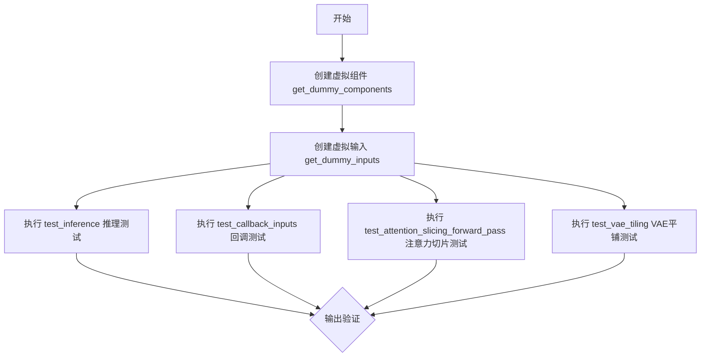
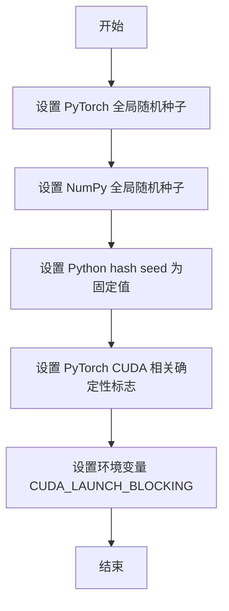
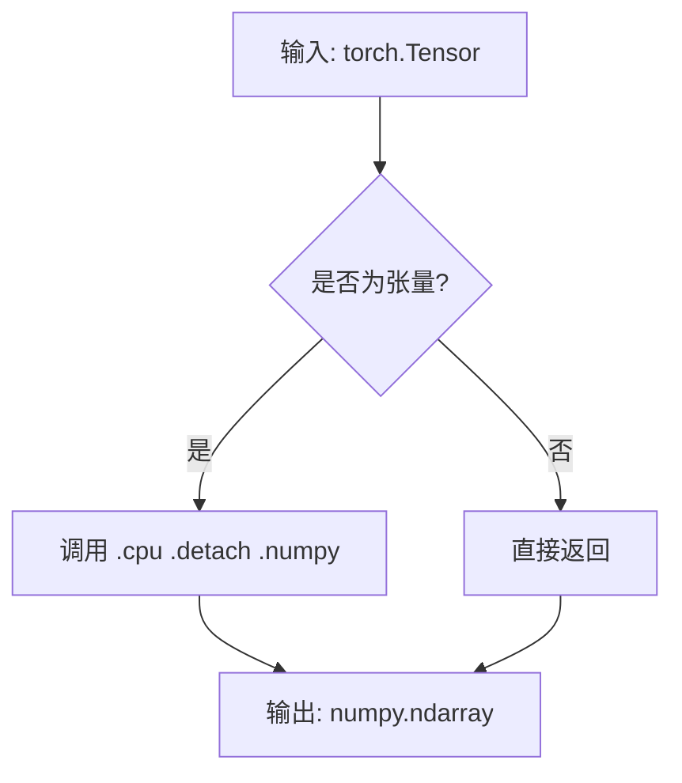
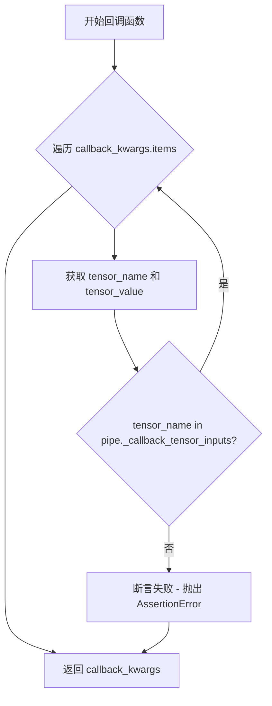
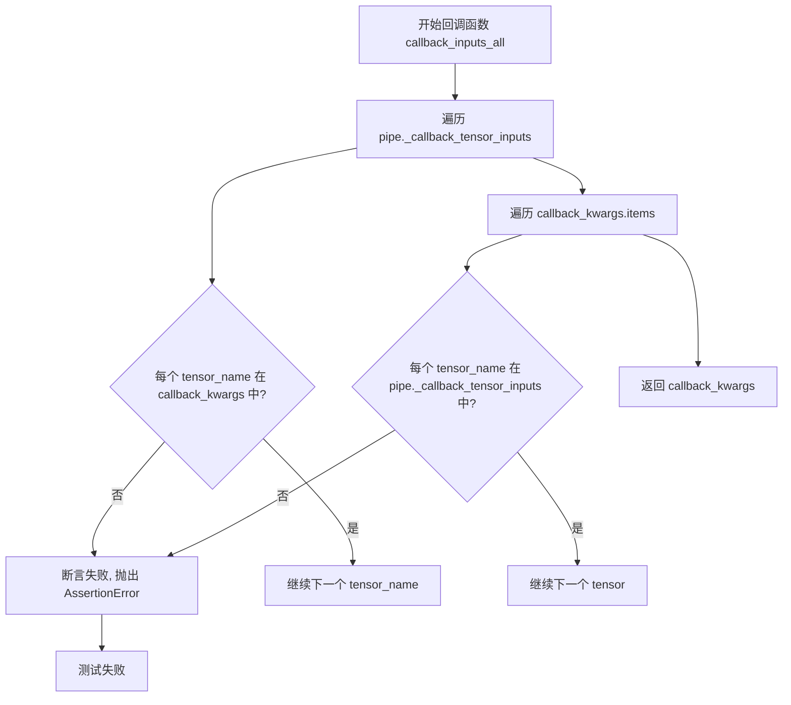
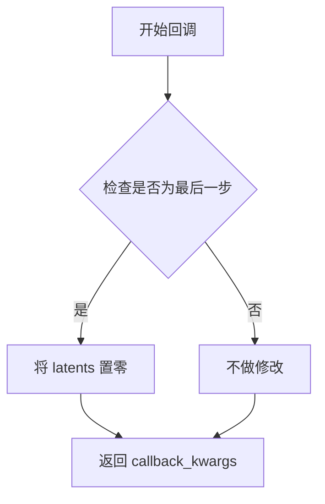
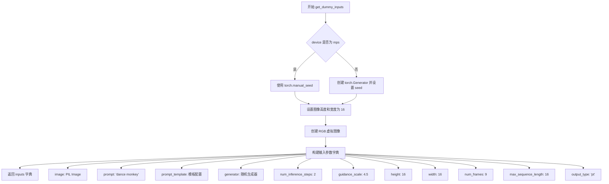
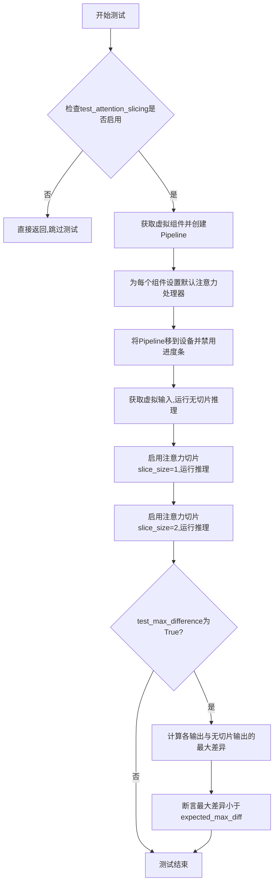
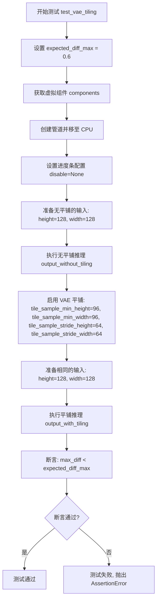

# `diffusers\tests\pipelines\hunyuan_video\test_hunyuan_skyreels_image2video.py` 详细设计文档

这是一个针对HunyuanSkyreelsImageToVideoPipeline的单元测试文件，继承自unittest.TestCase，用于测试图像到视频生成pipeline的推理、回调、注意力切片和VAE平铺等功能，确保pipeline在各种配置下的正确性和性能。

## 整体流程



## 类结构

```
unittest.TestCase
├── PipelineTesterMixin (混入类)
├── PyramidAttentionBroadcastTesterMixin (混入类)
└── HunyuanSkyreelsImageToVideoPipelineFastTests
```

## 全局变量及字段


### `transformer`
    
HunyuanVideo Transformer 3D模型实例，用于视频生成的Transformer架构

类型：`HunyuanVideoTransformer3DModel`
    


### `vae`
    
HunyuanVideo变分自编码器实例，用于潜在空间的编码和解码

类型：`AutoencoderKLHunyuanVideo`
    


### `scheduler`
    
Flow Match欧拉离散调度器实例，控制去噪扩散过程的步骤

类型：`FlowMatchEulerDiscreteScheduler`
    


### `text_encoder`
    
Llama文本编码器模型实例，用于将文本提示编码为嵌入向量

类型：`LlamaModel`
    


### `text_encoder_2`
    
CLIP文本编码器模型实例，提供额外的文本嵌入表示

类型：`CLIPTextModel`
    


### `tokenizer`
    
Llama分词器实例，用于将文本转换为token序列

类型：`LlamaTokenizer`
    


### `tokenizer_2`
    
CLIP分词器实例，用于第二文本编码器的token化

类型：`CLIPTokenizer`
    


### `image`
    
输入的PIL图像实例，作为图像到视频转换的源图像

类型：`PIL.Image`
    


### `video`
    
管道生成的视频帧序列

类型：`List[np.ndarray]`
    


### `expected_slice`
    
期望输出的张量切片，用于验证生成结果

类型：`torch.Tensor`
    


### `generated_slice`
    
实际生成的张量切片，用于与期望值比较

类型：`torch.Tensor`
    


### `HunyuanSkyreelsImageToVideoPipelineFastTests.pipeline_class`
    
保存HunyuanSkyreelsImageToVideoPipeline类的引用

类型：`type`
    


### `HunyuanSkyreelsImageToVideoPipelineFastTests.params`
    
测试参数集合，定义管道调用时需要传递的参数

类型：`frozenset`
    


### `HunyuanSkyreelsImageToVideoPipelineFastTests.batch_params`
    
批量参数集合，定义支持批量处理的参数

类型：`frozenset`
    


### `HunyuanSkyreelsImageToVideoPipelineFastTests.required_optional_params`
    
必需的可选参数集合，定义管道可选但测试需要的参数

类型：`frozenset`
    


### `HunyuanSkyreelsImageToVideoPipelineFastTests.supports_dduf`
    
标志位，表示管道是否支持DDUF（Decoupled Diffusion Upsampling Flow）

类型：`bool`
    


### `HunyuanSkyreelsImageToVideoPipelineFastTests.test_xformers_attention`
    
标志位，指示是否测试xformers内存高效注意力机制

类型：`bool`
    


### `HunyuanSkyreelsImageToVideoPipelineFastTests.test_layerwise_casting`
    
标志位，指示是否测试层级类型转换功能

类型：`bool`
    


### `HunyuanSkyreelsImageToVideoPipelineFastTests.test_group_offloading`
    
标志位，指示是否测试模型组卸载功能

类型：`bool`
    
    

## 全局函数及方法


### `enable_full_determinism`

该函数用于启用完全确定性（full determinism），确保深度学习模型在运行时使用固定的随机种子，从而使测试结果可复现。

参数： 无

返回值：`None`，该函数无返回值，主要通过设置全局随机种子和环境变量来保证确定性。

#### 流程图



#### 带注释源码

```python
# 从 testing_utils 模块导入的函数
# 该函数在测试文件开头被调用，用于确保测试的完全确定性
from ...testing_utils import enable_full_determinism, torch_device

# 调用该函数，不传递任何参数
# 其作用是设置各种随机种子和环境变量
# 以确保测试结果在不同运行中是可复现的
enable_full_determinism()
```


根据代码分析，`to_np` 函数是从 `..test_pipelines_common` 模块导入的外部依赖函数，在当前代码文件中没有定义。根据其使用方式（将 PyTorch 张量转换为 NumPy 数组），我提供以下信息：

### `to_np`

将 PyTorch 张量转换为 NumPy 数组的实用函数。

参数：

-  `tensor`：`torch.Tensor`，PyTorch 张量，需要转换的张量对象

返回值：`numpy.ndarray`，转换后的 NumPy 数组

#### 流程图



#### 带注释源码

由于 `to_np` 是从外部模块导入的，以下是根据其使用方式推断的典型实现：

```python
def to_np(tensor):
    """
    将 PyTorch 张量转换为 NumPy 数组。
    
    参数:
        tensor: PyTorch 张量对象
        
    返回:
        NumPy 数组
    """
    # 如果输入不是张量，直接返回
    if not isinstance(tensor, torch.Tensor):
        return tensor
    
    # 从计算图中分离，移动到 CPU，转换为 NumPy 数组
    return tensor.cpu().detach().numpy()
```

#### 备注

- **来源**：`..test_pipelines_common` 模块（test_pipelines_common.py）
- **用途**：在测试中比较 PyTorch 输出与预期值
- **依赖**：PyTorch (`torch`) 和 NumPy (`numpy`)
- **实际源码位置**：该函数定义在 `diffusers` 库的测试工具模块中


### `callback_inputs_subset`

该回调函数用于验证管道是否正确处理用户仅传递回调张量输入子集的情况，通过检查回调参数中的所有张量是否都在允许的 `_callback_tensor_inputs` 列表中，确保只有授权的张量被传递给回调函数。

参数：

- `pipe`：`HunyuanSkyreelsImageToVideoPipeline`，管道实例，用于访问 `_callback_tensor_inputs` 属性获取允许的回调张量列表
- `i`：`int`，当前推理步骤的索引
- `t`：`torch.Tensor`，当前推理的时间步
- `callback_kwargs`：`Dict[str, torch.Tensor]`，回调函数接收的张量参数字典，键为张量名称，值为张量对象

返回值：`Dict[str, torch.Tensor]`，返回未经修改的 callback_kwargs 字典，供后续处理使用

#### 流程图



#### 带注释源码

```python
def callback_inputs_subset(pipe, i, t, callback_kwargs):
    """
    回调函数子集测试 - 验证仅传递部分回调张量输入时的正确性
    
    参数:
        pipe: HunyuanSkyreelsImageToVideoPipeline 管道实例
        i: int - 当前推理步骤索引
        t: torch.Tensor - 当前时间步
        callback_kwargs: Dict[str, torch.Tensor] - 回调函数接收的张量参数字典
    
    返回:
        Dict[str, torch.Tensor] - 未经修改的 callback_kwargs
    """
    # 遍历回调参数中的所有张量
    for tensor_name, tensor_value in callback_kwargs.items():
        # 检查每个张量是否都在允许的回调张量输入列表中
        # pipe._callback_tensor_inputs 定义了回调函数可以使用的张量变量列表
        assert tensor_name in pipe._callback_tensor_inputs

    # 返回原始的 callback_kwargs，不做任何修改
    return callback_kwargs
```


### `callback_inputs_all`

这是一个回调函数，用于验证所有允许的张量输入是否都存在于回调参数中。它检查管道定义的 `_callback_tensor_inputs` 与回调函数实际接收的 `callback_kwargs` 是否完全匹配，确保回调函数只能访问被允许的张量变量。

参数：

- `pipe`：`Pipeline` 对象，HunyuanSkyreelsImageToVideoPipeline 管道实例，包含 `_callback_tensor_inputs` 属性定义了回调函数允许使用的张量列表
- `i`：`int`，当前推理步骤的索引
- `t`：`torch.Tensor`，当前的时间步张量
- `callback_kwargs`：`Dict[str, Any]`（字典），回调函数接收的关键字参数，包含管道传递的张量数据

返回值：`Dict[str, Any]`（字典），直接返回传入的 `callback_kwargs`，在验证通过后将其传递回管道继续执行

#### 流程图



#### 带注释源码

```python
def callback_inputs_all(pipe, i, t, callback_kwargs):
    """
    完整的回调函数测试，验证所有允许的张量输入都被正确传递。
    
    参数:
        pipe: HunyuanSkyreelsImageToVideoPipeline 管道实例
        i: 当前推理步骤索引
        t: 当前时间步张量
        callback_kwargs: 回调函数接收的参数字典
    """
    
    # 步骤1: 验证管道允许的所有张量都在回调参数中
    # 遍历管道定义的 _callback_tensor_inputs 列表
    for tensor_name in pipe._callback_tensor_inputs:
        # 断言每个张量名称都存在于 callback_kwargs 中
        assert tensor_name in callback_kwargs

    # 步骤2: 验证回调参数中只包含允许的张量
    # 遍历回调函数实际接收的所有参数
    for tensor_name, tensor_value in callback_kwargs.items():
        # 检查每个参数名称是否在允许列表中，防止传递不允许的张量
        assert tensor_name in pipe._callback_tensor_inputs

    # 验证通过后返回原始的 callback_kwargs
    # 管道将使用这个字典继续处理
    return callback_kwargs
```


### `callback_inputs_change_tensor`

该函数是一个回调函数，用于在扩散模型推理过程的最后一个时间步将 `latents` 张量置零，以测试回调机制能否正确修改中间状态并影响最终输出结果。

参数：

- `pipe`：`HunyuanSkyreelsImageToVideoPipeline`，管道对象，包含 `num_timesteps` 属性用于判断当前是否为最后一个推理步骤
- `i`：`int`，当前推理步骤的索引（从 0 开始）
- `t`：`torch.Tensor`，当前时间步（timestep）张量
- `callback_kwargs`：`Dict[str, torch.Tensor]`，回调函数可访问的张量变量字典，包含 `latents`、`prompt_embeds` 等

返回值：`Dict[str, torch.Tensor]`，返回修改后的回调参数字典

#### 流程图



#### 带注释源码

```python
def callback_inputs_change_tensor(pipe, i, t, callback_kwargs):
    """
    回调函数：在推理最后一步将 latents 张量置零
    
    参数:
        pipe: HunyuanSkyreelsImageToVideoPipeline 管道实例
        i: int，当前推理步骤索引
        t: torch.Tensor，当前时间步
        callback_kwargs: dict，包含可用的张量变量（如 latents、prompt_embeds 等）
    
    返回:
        dict: 修改后的 callback_kwargs
    """
    # 判断当前步骤是否为推理的最后一步
    is_last = i == (pipe.num_timesteps - 1)
    
    # 仅在最后一步执行 latents 置零操作
    if is_last:
        # 使用 torch.zeros_like 创建与原 latents 形状相同的零张量
        # 并替换 callback_kwargs 中的 latents
        callback_kwargs["latents"] = torch.zeros_like(callback_kwargs["latents"])
    
    # 返回修改后的回调参数，供管道继续使用
    return callback_kwargs
```


### `HunyuanSkyreelsImageToVideoPipelineFastTests.get_dummy_components`

该方法是一个测试辅助函数，用于创建虚拟（dummy）模型组件，以便在单元测试中实例化 `HunyuanSkyreelsImageToVideoPipeline` 管道。该函数初始化了 transformer、VAE、scheduler、文本编码器（Llama 和 CLIP）以及对应的分词器等核心组件，所有组件均使用随机种子固定以确保测试的可重复性。

参数：

- `num_layers`：`int`，可选参数，默认值为 `1`，指定 Transformer 模型的总层数
- `num_single_layers`：`int`，可选参数，默认值为 `1`，指定 Transformer 模型中单层（single layers）的数量

返回值：`dict`，返回包含以下键的字典：
- `transformer`：HunyuanVideoTransformer3DModel 实例
- `vae`：AutoencoderKLHunyuanVideo 实例
- `scheduler`：FlowMatchEulerDiscreteScheduler 实例
- `text_encoder`：LlamaModel 实例
- `text_encoder_2`：CLIPTextModel 实例
- `tokenizer`：LlamaTokenizer 实例
- `tokenizer_2`：CLIPTokenizer 实例

#### 流程图

```mermaid
flowchart TD
    A[开始 get_dummy_components] --> B[设置随机种子 torch.manual_seed(0)]
    B --> C[创建 HunyuanVideoTransformer3DModel]
    C --> D[设置随机种子 torch.manual_seed(0)]
    D --> E[创建 AutoencoderKLHunyuanVideo]
    E --> F[设置随机种子 torch.manual_seed(0)]
    F --> G[创建 FlowMatchEulerDiscreteScheduler]
    G --> H[创建 LlamaConfig 和 CLIPTextConfig]
    H --> I[设置随机种子创建 LlamaModel 文本编码器]
    I --> J[加载 LlamaTokenizer]
    J --> K[设置随机种子创建 CLIPTextModel 文本编码器]
    K --> L[加载 CLIPTokenizer]
    L --> M[组装 components 字典]
    M --> N[返回 components]
```

#### 带注释源码

```python
def get_dummy_components(self, num_layers: int = 1, num_single_layers: int = 1):
    """
    创建虚拟模型组件用于测试
    
    参数:
        num_layers: Transformer 模型层数，默认 1
        num_single_layers: Transformer 单层数，默认 1
    
    返回:
        dict: 包含所有模型组件的字典
    """
    # 使用固定随机种子确保测试可重复性
    torch.manual_seed(0)
    
    # 初始化 3D 视频 Transformer 模型
    transformer = HunyuanVideoTransformer3DModel(
        in_channels=8,              # 输入通道数
        out_channels=4,            # 输出通道数
        num_attention_heads=2,     # 注意力头数量
        attention_head_dim=10,     # 注意力头维度
        num_layers=num_layers,     # 动态层数参数
        num_single_layers=num_single_layers,  # 动态单层数参数
        num_refiner_layers=1,      # Refiner 层数
        patch_size=1,              # 空间分块大小
        patch_size_t=1,            # 时间分块大小
        guidance_embeds=True,     # 启用引导嵌入
        text_embed_dim=16,         # 文本嵌入维度
        pooled_projection_dim=8,   # 池化投影维度
        rope_axes_dim=(2, 4, 4),  # RoPE 轴维度
    )

    torch.manual_seed(0)
    
    # 初始化 VAE 变分自编码器
    vae = AutoencoderKLHunyuanVideo(
        in_channels=3,             # RGB 图像输入通道
        out_channels=3,            # RGB 图像输出通道
        latent_channels=4,         # 潜在空间通道数
        down_block_types=(         # 下采样块类型
            "HunyuanVideoDownBlock3D",
            "HunyuanVideoDownBlock3D",
            "HunyuanVideoDownBlock3D",
            "HunyuanVideoDownBlock3D",
        ),
        up_block_types=(           # 上采样块类型
            "HunyuanVideoUpBlock3D",
            "HunyuanVideoUpBlock3D",
            "HunyuanVideoUpBlock3D",
            "HunyuanVideoUpBlock3D",
        ),
        block_out_channels=(8, 8, 8, 8),  # 块输出通道
        layers_per_block=1,       # 每块层数
        act_fn="silu",            # 激活函数
        norm_num_groups=4,        # 归一化组数
        scaling_factor=0.476986,  # 缩放因子
        spatial_compression_ratio=8,   # 空间压缩比
        temporal_compression_ratio=4,  # 时间压缩比
        mid_block_add_attention=True,  # 中间块添加注意力
    )

    torch.manual_seed(0)
    
    # 初始化 Flow Match Euler 离散调度器
    scheduler = FlowMatchEulerDiscreteScheduler(shift=7.0)

    # 配置 Llama 文本编码器参数
    llama_text_encoder_config = LlamaConfig(
        bos_token_id=0,
        eos_token_id=2,
        hidden_size=16,            # 隐藏层维度
        intermediate_size=37,      # 中间层维度
        layer_norm_eps=1e-05,      # LayerNorm epsilon
        num_attention_heads=4,     # 注意力头数
        num_hidden_layers=2,      # 隐藏层数
        pad_token_id=1,            # 填充 token ID
        vocab_size=1000,           # 词汇表大小
        hidden_act="gelu",         # 隐藏层激活函数
        projection_dim=32,         # 投影维度
    )
    
    # 配置 CLIP 文本编码器参数
    clip_text_encoder_config = CLIPTextConfig(
        bos_token_id=0,
        eos_token_id=2,
        hidden_size=8,
        intermediate_size=37,
        layer_norm_eps=1e-05,
        num_attention_heads=4,
        num_hidden_layers=2,
        pad_token_id=1,
        vocab_size=1000,
        hidden_act="gelu",
        projection_dim=32,
    )

    torch.manual_seed(0)
    
    # 创建 Llama 文本编码器模型
    text_encoder = LlamaModel(llama_text_encoder_config)
    
    # 从预训练路径加载 Llama 分词器
    tokenizer = LlamaTokenizer.from_pretrained("finetrainers/dummy-hunyaunvideo", subfolder="tokenizer")

    torch.manual_seed(0)
    
    # 创建 CLIP 文本编码器模型
    text_encoder_2 = CLIPTextModel(clip_text_encoder_config)
    
    # 从预训练路径加载 CLIP 分词器
    tokenizer_2 = CLIPTokenizer.from_pretrained("hf-internal-testing/tiny-random-clip")

    # 组装所有组件到字典中
    components = {
        "transformer": transformer,
        "vae": vae,
        "scheduler": scheduler,
        "text_encoder": text_encoder,
        "text_encoder_2": text_encoder_2,
        "tokenizer": tokenizer,
        "tokenizer_2": tokenizer_2,
    }
    
    return components
```


### `HunyuanSkyreelsImageToVideoPipelineFastTests.get_dummy_inputs`

该方法为 HunyuanSkyreels 图像到视频管道生成虚拟输入数据，用于单元测试。它根据传入的设备和种子创建随机数生成器，生成虚拟图像和完整的推理参数字典，包含提示词、引导系数、帧数等配置信息，以支持管道进行快速的确定性推理测试。

参数：

- `self`：隐式参数，测试类实例本身
- `device`：`str`，目标计算设备（如 "cpu"、"cuda" 或 "mps"）
- `seed`：`int`，随机种子，默认为 0，用于确保测试的可重复性

返回值：`Dict[str, Any]`，包含管道推理所需的所有输入参数的字典

#### 流程图



#### 带注释源码

```python
def get_dummy_inputs(self, device, seed=0):
    """
    生成用于测试的虚拟输入数据。
    
    参数:
        device: 目标计算设备字符串
        seed: 随机种子，用于确保测试可重复性
    
    返回:
        包含管道推理所需参数的字典
    """
    # 根据设备类型选择随机数生成方式
    # MPS (Apple Silicon) 需要特殊处理
    if str(device).startswith("mps"):
        # MPS 设备使用 torch.manual_seed
        generator = torch.manual_seed(seed)
    else:
        # 其他设备（CPU/CUDA）使用指定设备的 Generator
        generator = torch.Generator(device=device).manual_seed(seed)

    # 设置虚拟图像的分辨率
    image_height = 16
    image_width = 16
    
    # 创建虚拟 RGB 图像（所有像素为黑色）
    image = Image.new("RGB", (image_width, image_height))
    
    # 构建完整的输入参数字典
    inputs = {
        # 输入图像
        "image": image,
        # 文本提示词
        "prompt": "dance monkey",
        # 提示词模板配置
        "prompt_template": {
            "template": "{}",       # 简单模板，直接使用提示词
            "crop_start": 0,        # 裁剪起始位置
        },
        # 随机数生成器，确保确定性输出
        "generator": generator,
        # 推理步数，较小的值用于快速测试
        "num_inference_steps": 2,
        #引导尺度，控制文本 prompt 对生成的影响程度
        "guidance_scale": 4.5,
        # 输出视频的高度
        "height": 16,
        # 输出视频的宽度
        "width": 16,
        # 生成视频的帧数（4*k+1 格式，推荐值为 9）
        "num_frames": 9,
        # 文本嵌入的最大序列长度
        "max_sequence_length": 16,
        # 输出类型：'pt' 表示 PyTorch 张量
        "output_type": "pt",
    }
    return inputs
```


### `HunyuanSkyreelsImageToVideoPipelineFastTests.test_inference`

该测试方法用于验证 HunyuanSkyreels 图像到视频（Image-to-Video）生成管道的核心推理功能是否正常工作。测试通过创建虚拟（dummy）组件和输入数据，执行管道推理，并验证生成视频的形状（9帧、3通道、16x16分辨率）以及像素值是否与预期值匹配，确保管道在基本场景下能够正确生成视频内容。

参数：
- `self`：测试类实例本身，包含测试所需的所有方法和属性

返回值：`None`，该方法为单元测试方法，通过断言验证结果而非返回值

#### 流程图

```mermaid
flowchart TD
    A[开始测试 test_inference] --> B[设置设备为 CPU]
    B --> C[调用 get_dummy_components 获取虚拟组件]
    C --> D[使用虚拟组件实例化管道 HunyuanSkyreelsImageToVideoPipeline]
    D --> E[将管道移动到 CPU 设备]
    E --> F[设置进度条配置 disable=None]
    F --> G[调用 get_dummy_inputs 获取虚拟输入]
    G --> H[执行管道推理: pipe**inputs]
    H --> I[获取生成视频: frames = pipe**inputs.frames]
    I --> J[提取第一个视频结果: generated_video = frames0]
    J --> K[断言验证视频形状: (9, 3, 16, 16)]
    K --> L[定义期望的像素值张量 expected_slice]
    L --> M[展平生成的视频并提取首尾各8个像素]
    M --> N[断言验证生成像素与期望值匹配 atol=1e-3]
    N --> O[测试通过]
```

#### 带注释源码

```python
def test_inference(self):
    """
    测试 HunyuanSkyreelsImageToVideoPipeline 的基本推理功能
    验证管道能够正确生成指定尺寸的视频帧
    """
    # 步骤1: 设置测试设备为 CPU
    device = "cpu"

    # 步骤2: 获取虚拟组件（transformer, vae, scheduler, text_encoder等）
    # 这些是用于测试的轻量级dummy模型
    components = self.get_dummy_components()
    
    # 步骤3: 使用虚拟组件实例化图像到视频管道
    pipe = self.pipeline_class(**components)
    
    # 步骤4: 将管道移动到指定设备（CPU）
    pipe.to(device)
    
    # 步骤5: 配置进度条（disable=None 表示启用进度条）
    pipe.set_progress_bar_config(disable=None)

    # 步骤6: 获取虚拟输入参数
    # 包含: image, prompt, prompt_template, generator, num_inference_steps等
    inputs = self.get_dummy_inputs(device)
    
    # 步骤7: 执行管道推理，生成视频
    # 返回的frames是一个列表，frames[0]是生成的视频张量
    video = pipe(**inputs).frames
    generated_video = video[0]
    
    # 步骤8: 断言验证生成视频的形状
    # 期望形状: (9帧, 3通道, 16高度, 16宽度)
    self.assertEqual(generated_video.shape, (9, 3, 16, 16))

    # 步骤9: 定义期望的像素值切片（用于结果验证）
    # 这些值是在特定随机种子下生成的预期输出
    # fmt: off
    expected_slice = torch.tensor([0.5832, 0.5498, 0.4839, 0.4744, 0.4515, 0.4832, 0.496, 0.563, 0.5918, 0.5979, 0.5101, 0.6168, 0.6613, 0.536, 0.55, 0.5775])
    # fmt: on

    # 步骤10: 处理生成的视频数据
    # 展平视频张量并提取首尾各8个像素用于对比
    generated_slice = generated_video.flatten()
    generated_slice = torch.cat([generated_slice[:8], generated_slice[-8:]])
    
    # 步骤11: 断言验证生成结果与期望值的接近程度
    # 使用 torch.allclose 进行近似比较，允许最大误差为 1e-3
    self.assertTrue(
        torch.allclose(generated_slice, expected_slice, atol=1e-3),
        "The generated video does not match the expected slice.",
    )
```


### `HunyuanSkyreelsImageToVideoPipelineFastTests.test_callback_inputs`

该测试方法用于验证图像转视频管道中的回调函数（callback）功能是否正常工作，包括回调张量输入的传递、验证和修改能力。

参数：

- `self`：`unittest.TestCase`，测试类的实例方法，包含测试逻辑的上下文

返回值：`None`，该方法为测试方法，不返回任何值，主要通过断言验证回调功能

#### 流程图

```mermaid
flowchart TD
    A[开始测试] --> B{检查pipeline是否有callback参数}
    B -->|缺少参数| C[直接返回, 跳过测试]
    B -->|参数存在| D[创建pipeline实例并移动到设备]
    D --> E[断言pipeline有_callback_tensor_inputs属性]
    E --> F[定义callback_inputs_subset回调函数<br/>验证只传递允许的张量输入]
    F --> G[定义callback_inputs_all回调函数<br/>验证所有允许的张量输入都被传递]
    G --> H[定义callback_inputs_change_tensor回调函数<br/>测试在最后一步修改latents]
    H --> I[测试子集模式<br/>callback_on_step_end=callback_inputs_subset<br/>tensor_inputs=['latents']]
    I --> J[测试完整模式<br/>callback_on_step_end=callback_inputs_all<br/>tensor_inputs=全部允许的张量]
    J --> K[测试修改模式<br/>callback_on_step_end=callback_inputs_change_tensor<br/>将最后一步的latents置零]
    K --> L[验证修改后的输出]
    L --> M[结束测试]
```

#### 带注释源码

```python
def test_callback_inputs(self):
    """
    测试回调函数输入功能
    验证pipeline支持callback_on_step_end和callback_on_step_end_tensor_inputs参数
    """
    # 获取pipeline __call__ 方法的签名
    sig = inspect.signature(self.pipeline_class.__call__)
    
    # 检查pipeline是否支持回调张量输入和步骤结束回调
    has_callback_tensor_inputs = "callback_on_step_end_tensor_inputs" in sig.parameters
    has_callback_step_end = "callback_on_step_end" in sig.parameters

    # 如果pipeline不支持这些参数，则跳过测试
    if not (has_callback_tensor_inputs and has_callback_step_end):
        return

    # 创建虚拟组件并实例化pipeline
    components = self.get_dummy_components()
    pipe = self.pipeline_class(**components)
    pipe = pipe.to(torch_device)
    pipe.set_progress_bar_config(disable=None)
    
    # 断言pipeline定义了_callback_tensor_inputs列表
    # 该列表指定了回调函数可以使用的张量变量
    self.assertTrue(
        hasattr(pipe, "_callback_tensor_inputs"),
        f" {self.pipeline_class} should have `_callback_tensor_inputs` that defines a list of tensor variables its callback function can use as inputs",
    )

    # ====== 回调函数1: 验证子集模式 ======
    def callback_inputs_subset(pipe, i, t, callback_kwargs):
        """
        回调函数子集验证
        验证传入回调的张量都是允许的（位于_callback_tensor_inputs中）
        """
        # 遍历回调参数中的所有张量
        for tensor_name, tensor_value in callback_kwargs.items():
            # 检查只传递了允许的张量输入
            assert tensor_name in pipe._callback_tensor_inputs
        return callback_kwargs

    # ====== 回调函数2: 验证完整模式 ======
    def callback_inputs_all(pipe, i, t, callback_kwargs):
        """
        回调函数完整验证
        验证所有允许的张量都被传递
        """
        # 检查所有允许的张量都在回调参数中
        for tensor_name in pipe._callback_tensor_inputs:
            assert tensor_name in callback_kwargs

        # 再次验证只传递了允许的张量
        for tensor_name, tensor_value in callback_kwargs.items():
            assert tensor_name in pipe._callback_tensor_inputs
        return callback_kwargs

    # 获取测试输入
    inputs = self.get_dummy_inputs(torch_device)

    # ====== 测试1: 子集模式 ======
    # 只请求latents作为回调张量输入
    inputs["callback_on_step_end"] = callback_inputs_subset
    inputs["callback_on_step_end_tensor_inputs"] = ["latents"]
    output = pipe(**inputs)[0]

    # ====== 测试2: 完整模式 ======
    # 请求所有允许的张量作为回调输入
    inputs["callback_on_step_end"] = callback_inputs_all
    inputs["callback_on_step_end_tensor_inputs"] = pipe._callback_tensor_inputs
    output = pipe(**inputs)[0]

    # ====== 回调函数3: 修改张量模式 ======
    def callback_inputs_change_tensor(pipe, i, t, callback_kwargs):
        """
        回调函数修改张量
        在最后一步将latents置零，验证回调可以修改中间结果
        """
        # 判断是否为最后一步
        is_last = i == (pipe.num_timesteps - 1)
        if is_last:
            # 将latents置零
            callback_kwargs["latents"] = torch.zeros_like(callback_kwargs["latents"])
        return callback_kwargs

    # ====== 测试3: 修改模式 ======
    inputs["callback_on_step_end"] = callback_inputs_change_tensor
    inputs["callback_on_step_end_tensor_inputs"] = pipe._callback_tensor_inputs
    output = pipe(**inputs)[0]
    
    # 验证修改后的输出仍然有效（数值在合理范围内）
    assert output.abs().sum() < 1e10
```


### `HunyuanSkyreelsImageToVideoPipelineFastTests.test_attention_slicing_forward_pass`

该测试方法用于验证注意力切片（Attention Slicing）功能在图像转视频管道中是否正常工作，通过对比不启用切片、启用 slice_size=1 和 slice_size=2 三种情况下的推理结果，确保启用注意力切片后输出结果与原始结果保持一致（差异在预期阈值内）。

参数：

- `self`：测试类实例本身
- `test_max_difference`：`bool` 类型，默认值 `True`，是否测试最大差异
- `test_mean_pixel_difference`：`bool` 类型，默认值 `True`，是否测试平均像素差异
- `expected_max_diff`：`float` 类型，默认值 `1e-3`，预期的最大差异阈值

返回值：无返回值（`None`），该方法为单元测试方法，通过 `self.assertLess` 断言验证结果正确性

#### 流程图



#### 带注释源码

```python
def test_attention_slicing_forward_pass(
    self, test_max_difference=True, test_mean_pixel_difference=True, expected_max_diff=1e-3
):
    """
    测试注意力切片前向传播是否正确工作
    
    参数:
        test_max_difference: 是否测试最大差异
        test_mean_pixel_difference: 是否测试平均像素差异(当前未使用)
        expected_max_diff: 允许的最大差异阈值
    """
    # 检查是否启用注意力切片测试(继承自测试mixin)
    if not self.test_attention_slicing:
        return

    # 步骤1: 获取虚拟组件(transformer, vae, scheduler, text_encoder等)
    components = self.get_dummy_components()
    
    # 步骤2: 创建Pipeline实例
    pipe = self.pipeline_class(**components)
    
    # 步骤3: 为每个支持attention processor的组件设置默认处理器
    for component in pipe.components.values():
        if hasattr(component, "set_default_attn_processor"):
            component.set_default_attn_processor()
    
    # 步骤4: 将Pipeline移到测试设备并配置进度条
    pipe.to(torch_device)
    pipe.set_progress_bar_config(disable=None)

    # 步骤5: 获取虚拟输入并在CPU生成器上运行(不使用GPU以确保确定性)
    generator_device = "cpu"
    inputs = self.get_dummy_inputs(generator_device)
    
    # 步骤6: 执行无注意力切片的推理,获取基准输出
    output_without_slicing = pipe(**inputs)[0]

    # 步骤7: 启用注意力切片(slice_size=1),运行推理
    pipe.enable_attention_slicing(slice_size=1)
    inputs = self.get_dummy_inputs(generator_device)
    output_with_slicing1 = pipe(**inputs)[0]

    # 步骤8: 启用注意力切片(slice_size=2),运行推理
    pipe.enable_attention_slicing(slice_size=2)
    inputs = self.get_dummy_inputs(generator_device)
    output_with_slicing2 = pipe(**inputs)[0]

    # 步骤9: 如果需要测试最大差异,则比较输出差异
    if test_max_difference:
        # 计算slice_size=1与无切片的差异
        max_diff1 = np.abs(to_np(output_with_slicing1) - to_np(output_without_slicing)).max()
        # 计算slice_size=2与无切片的差异
        max_diff2 = np.abs(to_np(output_with_slicing2) - to_np(output_without_slicing)).max()
        
        # 断言:注意力切片不应该影响推理结果
        self.assertLess(
            max(max_diff1, max_diff2),
            expected_max_diff,
            "Attention slicing should not affect the inference results",
        )
```


### `HunyuanSkyreelsImageToVideoPipelineFastTests.test_vae_tiling`

该测试方法用于验证 VAE 平铺（tiling）功能是否正常工作。平铺技术通过将大图像分割成较小的块进行处理，以减少内存占用。测试会比较启用平铺与未启用平铺的推理结果差异，确保差异在可接受的阈值范围内。

参数：

- `self`：`HunyuanSkyreelsImageToVideoPipelineFastTests`，测试类实例本身
- `expected_diff_max`：`float`，默认值 0.2，测试中实际使用 0.6，允许的最大差异阈值

返回值：`None`，无返回值（测试方法通过断言验证行为）

#### 流程图



#### 带注释源码

```python
def test_vae_tiling(self, expected_diff_max: float = 0.2):
    # 该测试方法验证 VAE 平铺功能
    # 平铺技术用于在处理大图像时减少内存占用
    
    # 似乎需要比其他测试更高的容差
    # 将预期最大差异从 0.2 调整为 0.6
    expected_diff_max = 0.6
    
    # 获取设备（测试中使用 CPU）
    generator_device = "cpu"
    
    # 获取虚拟组件（包含 transformer, VAE, scheduler, text_encoder 等）
    components = self.get_dummy_components()

    # 使用虚拟组件创建 HunyuanSkyreelsImageToVideoPipeline 管道实例
    pipe = self.pipeline_class(**components)
    
    # 将管道移至 CPU 设备
    pipe.to("cpu")
    
    # 设置进度条配置，disable=None 表示不禁用进度条
    pipe.set_progress_bar_config(disable=None)

    # ====== 步骤 1: 无平铺模式的推理 ======
    # 准备输入参数
    inputs = self.get_dummy_inputs(generator_device)
    # 设置较大的图像尺寸以测试平铺功能
    inputs["height"] = inputs["width"] = 128
    
    # 执行无平铺推理，获取基准输出
    output_without_tiling = pipe(**inputs)[0]

    # ====== 步骤 2: 启用平铺并再次推理 ======
    # 启用 VAE 平铺功能，设置平铺参数：
    # - tile_sample_min_height: 平铺最小高度 96 像素
    # - tile_sample_min_width: 平铺最小宽度 96 像素
    # - tile_sample_stride_height: 垂直步长 64 像素（相邻平铺重叠区域）
    # - tile_sample_stride_width: 水平步长 64 像素
    pipe.vae.enable_tiling(
        tile_sample_min_height=96,
        tile_sample_min_width=96,
        tile_sample_stride_height=64,
        tile_sample_stride_width=64,
    )
    
    # 准备相同尺寸的输入
    inputs = self.get_dummy_inputs(generator_device)
    inputs["height"] = inputs["width"] = 128
    
    # 执行启用平铺后的推理
    output_with_tiling = pipe(**inputs)[0]

    # ====== 步骤 3: 验证结果差异 ======
    # 将 PyTorch 张量转换为 NumPy 数组并计算最大差异
    # 断言：平铺与非平铺输出的差异应小于预期最大差异阈值
    self.assertLess(
        (to_np(output_without_tiling) - to_np(output_with_tiling)).max(),
        expected_diff_max,
        "VAE tiling should not affect the inference results",
    )
    # 如果差异超过阈值，测试失败并抛出 AssertionError
```

## 关键组件


### HunyuanSkyreelsImageToVideoPipeline

HunyuanSkyreelsImageToVideoPipeline 是核心的图像到视频生成管道类，封装了完整的文本到视频生成流程，包括文本编码、潜在空间采样、3D transformer 推理和 VAE 解码过程。

### HunyuanVideoTransformer3DModel

HunyuanVideoTransformer3DModel 是3D视频变换器模型，负责在潜在空间中进行去噪处理，支持时空注意力机制和多层堆叠结构。

### AutoencoderKLHunyuanVideo

AutoencoderKLHunyuanVideo 是变分自编码器模型，负责将图像编码到潜在空间并从潜在空间解码生成视频帧，支持3D卷积和时空压缩。

### FlowMatchEulerDiscreteScheduler

FlowMatchEulerDiscreteScheduler 是基于流匹配的去噪调度器，采用欧拉离散方法进行采样，支持shift参数控制生成过程。

### LlamaModel (text_encoder)

LlamaModel 是基于Llama架构的文本编码器，将文本提示转换为文本嵌入表示，支持可变长度序列处理。

### CLIPTextModel (text_encoder_2)

CLIPTextModel 是基于CLIP架构的文本编码器，与LlamaModel协同工作提供双文本编码器支持，增强文本理解的丰富性。

### 文本分词器 (tokenizer, tokenizer_2)

LlamaTokenizer 和 CLIPTokenizer 分别用于对输入文本进行分词，将自然语言转换为模型可处理的token序列。

### 潜在技术债务与优化空间

代码中使用了大量的 unittest.skip 装饰器跳过某些测试，表明存在一些已知问题（如词汇表大小限制导致的嵌入查找错误）。此外，测试中使用硬编码的期望值（如 expected_slice）缺乏灵活性，难以适应模型更新。

### 设计约束与外部依赖

该pipeline依赖于 HuggingFace Transformers 库（Llama、CLIP）和 Diffusers 库（AutoencoderKL、Scheduler等），版本兼容性是重要的约束因素。测试设备支持 CPU 和 MPS (Apple Silicon)，但未明确支持 GPU 加速测试。

### 错误处理与回调机制

代码实现了完整的回调机制（callback_on_step_end 和 callback_on_step_end_tensor_inputs），允许用户在每个推理步骤结束时干预中间状态（如修改 latents）。这种设计提供了灵活的错误恢复和状态监控能力。


## 问题及建议


### 已知问题

- **硬编码的测试跳过**：两个批量推理测试被永久跳过，使用了 `@unittest.skip` 装饰器而没有提供替代实现方案，这是一个已知的功能缺失。
- **变量重复赋值**：`test_vae_tiling` 方法中 `expected_diff_max` 先被声明为参数 `0.2`，随后在方法内部又被重新赋值为 `0.6`，这种模式容易造成混淆。
- **设备处理不一致**：`test_inference` 方法硬编码使用 `"cpu"` 设备，而其他测试方法使用 `torch_device`，设备选择不统一。
- **外部依赖脆弱性**：tokenizer 加载依赖外部路径 `"finetrainers/dummy-hunyaunvideo"`，若该路径不可用会导致测试失败。
- **随机种子管理混乱**：多次调用 `torch.manual_seed(0)` 而没有明确的初始化顺序说明，可能导致测试结果不稳定。
- **TODO 标记未完成**：代码中存在 TODO 注释提到需要创建 dummy gemma 模型，但当前未实现，导致长提示词的测试无法运行。

### 优化建议

- 将被跳过的测试改为条件跳过，或实现能在小词汇表下正常工作的版本。
- 统一设备选择逻辑，移除 `test_vae_tiling` 中的冗余变量赋值。
- 考虑使用 mock 或本地虚拟 tokenizer 替代外部依赖，提高测试的独立性。
- 添加明确的随机种子管理文档或工具类，统一管理测试随机性。
- 将 TODO 事项纳入项目待办，或使用更明确的占位符实现。

## 其它


### 设计目标与约束

本测试文件旨在验证 HunyuanSkyreelsImageToVideoPipeline 图像转视频管道在各种场景下的功能正确性和性能表现。测试覆盖推理流程、注意力切片、VAE平铺等核心功能，使用虚拟组件进行快速测试，不依赖真实模型权重。

### 错误处理与异常设计

测试中通过 unittest 框架的断言机制进行错误检测。对于缺失的回调函数参数，使用 return 直接退出测试。vocab size 过小导致的嵌入查找错误通过 @unittest.skip 装饰器跳过相关测试，避免测试失败。

### 数据流与状态机

测试数据流：get_dummy_components() 创建虚拟 transformer/VAE/scheduler/text_encoder -> get_dummy_inputs() 构建测试输入（含图像、prompt、生成器等）-> pipe(**inputs) 执行推理 -> 验证输出 frames 的 shape 和数值正确性。状态机体现为测试方法间的独立性，每个测试方法重新初始化管道。

### 外部依赖与接口契约

依赖包括：transformers 库的 LlamaModel/CLIPTextModel/LlamaTokenizer/CLIPTokenizer，diffusers 库的 AutoencoderKLHunyuanVideo/FlowMatchEulerDiscreteScheduler/HunyuanSkyreelsImageToVideoPipeline/HunyuanVideoTransformer3DModel，以及 PIL/numpy/torch。接口契约由 pipeline_class.__call__ 的签名定义，支持 callback_on_step_end 和 callback_on_step_end_tensor_inputs 参数。

### 性能评估基准

test_inference 验证输出数值与预期 slice 的接近程度（atol=1e-3）。test_attention_slicing_forward_pass 要求注意力切片前后最大差异小于 1e-3。test_vae_tiling 要求 VAE 平铺前后差异小于 0.6。这些指标确保优化功能不显著影响生成质量。

### 配置管理

测试使用硬编码的虚拟配置：LlamaConfig(hidden_size=16, intermediate_size=37, num_hidden_layers=2)，CLIPTextConfig(hidden_size=8)，transformer(num_attention_heads=2, attention_head_dim=10)，VAE(block_out_channels=[8,8,8,8])。这些配置在 get_dummy_components 中通过 torch.manual_seed(0) 保证可复现性。

### 测试覆盖范围

覆盖场景：基础推理、回调函数输入验证、注意力切片、VAE 平铺。跳过的场景：批处理一致性、批处理单样本相同性（因虚拟模型 vocab size 过小）。未覆盖场景：多 GPU 分布式推理、ONNX 导出、CPU 卸载等。

### 并发与资源管理

测试在 CPU 设备上执行（device="cpu"），通过 torch.manual_seed/Generator.manual_seed 管理随机性。测试顺序独立，无资源争用。mps 设备有特殊处理分支。

### 可维护性与扩展性

get_dummy_components 采用参数化设计（num_layers, num_single_layers），便于扩展测试深度。测试方法命名规范（test_功能名），便于理解和添加新测试。继承 PipelineTesterMixin 和 PyramidAttentionBroadcastTesterMixin 复用通用测试模式。

### 版本兼容性考虑

代码引用了 enable_full_determinism 和 torch_device 等测试工具函数，表明需要配套的 testing_utils 模块。部分测试依赖 pipeline 类的特定方法（如 _callback_tensor_inputs），需确保被测管道实现这些接口。

    