# `diffusers\tests\pipelines\hunyuan_video\test_hunyuan_video.py` 详细设计文档

这是一个针对HunyuanVideoPipeline（腾讯混元视频生成管道）的单元测试文件，用于测试视频生成管道的各项功能，包括推理、回调输入、注意力切片和VAE平铺等。

## 整体流程

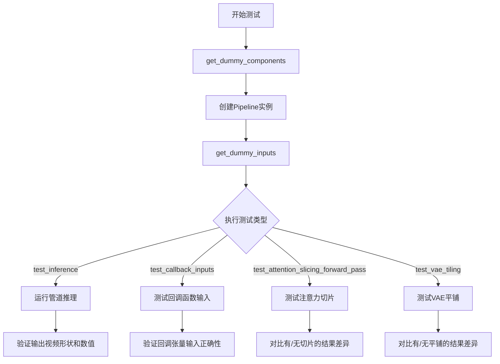

## 类结构

```
unittest.TestCase
└── HunyuanVideoPipelineFastTests (多继承测试类)
    ├── PipelineTesterMixin
    ├── PyramidAttentionBroadcastTesterMixin
    ├── FasterCacheTesterMixin
    ├── FirstBlockCacheTesterMixin
    └── TaylorSeerCacheTesterMixin
```

## 全局变量及字段


### `HunyuanVideoPipelineFastTests.pipeline_class`
    
指定HunyuanVideoPipeline管道类，作为测试的目标类。

类型：`type`
    


### `HunyuanVideoPipelineFastTests.params`
    
包含推理时需要传递的参数名称的不可变集合，如prompt、height、width等。

类型：`frozenset`
    


### `HunyuanVideoPipelineFastTests.batch_params`
    
包含批处理时使用的参数名称的不可变集合，目前仅包含prompt。

类型：`frozenset`
    


### `HunyuanVideoPipelineFastTests.required_optional_params`
    
包含可选但常用的参数名称的不可变集合，如num_inference_steps、generator、latents等。

类型：`frozenset`
    


### `HunyuanVideoPipelineFastTests.test_xformers_attention`
    
指示是否测试xformers注意力的布尔值，当前设置为False，因为Flux没有xformers处理器。

类型：`bool`
    


### `HunyuanVideoPipelineFastTests.test_layerwise_casting`
    
指示是否测试逐层类型转换的布尔值，当前设置为True。

类型：`bool`
    


### `HunyuanVideoPipelineFastTests.test_group_offloading`
    
指示是否测试组卸载的布尔值，当前设置为True。

类型：`bool`
    


### `HunyuanVideoPipelineFastTests.faster_cache_config`
    
配置更快缓存的参数，包括空间注意力跳过范围、时间步跳过范围、无条件批处理跳过范围和注意力权重回调等，用于优化推理速度。

类型：`FasterCacheConfig`
    
    

## 全局函数及方法


### `enable_full_determinism`

该函数用于确保测试或运行过程中的完全确定性，通过设置随机种子和环境变量来保证结果的可重复性。

参数：無

返回值：`None`，无返回值

#### 流程图

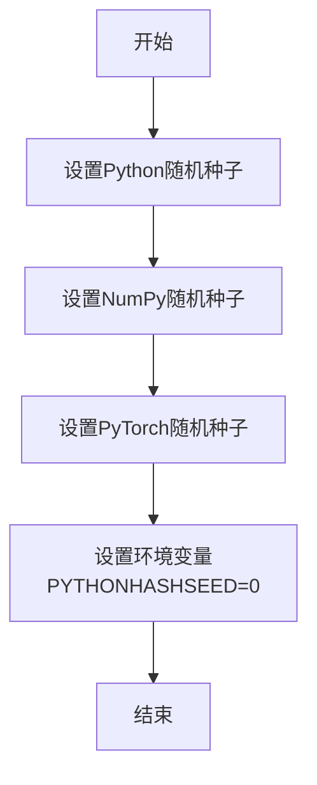

#### 带注释源码

```python
# 从 testing_utils 模块导入的函数
# 该函数用于确保测试的完全确定性
# 通过设置各种随机种子和环境变量来消除随机性
enable_full_determinism()
```

> **注意**：该函数的实际定义位于 `testing_utils` 模块中，当前文件仅导入了该函数并进行了调用。从调用方式来看：
> - 函数不接受任何参数
> - 函数不返回任何值（返回 None）
> - 其主要作用是配置随机数生成器以确保可重复的测试结果


根据代码分析，`to_np` 函数是从 `..test_pipelines_common` 模块导入的，它并非在当前文件中定义。让我基于代码中的使用方式来推断其功能：

### `to_np`

将 PyTorch 张量转换为 NumPy 数组的辅助函数。

参数：

-  `tensor`：`torch.Tensor`，PyTorch 张量，需要转换为 NumPy 数组的张量对象

返回值：`numpy.ndarray`，转换后的 NumPy 数组

#### 流程图

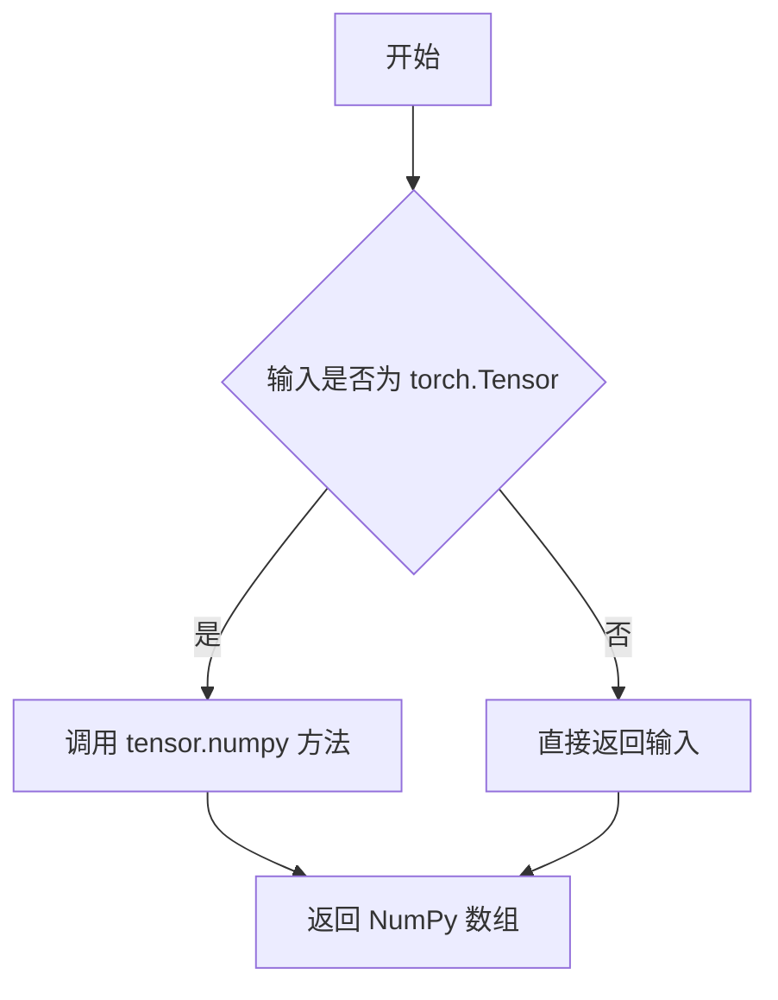

#### 带注释源码

```
# to_np 函数定义于 test_pipelines_common 模块中
# 当前文件中通过以下方式导入:
# from ..test_pipelines_common import to_np

# 函数功能推断（基于使用方式）:
def to_np(tensor):
    """
    将 PyTorch 张量转换为 NumPy 数组。
    
    参数:
        tensor: torch.Tensor - PyTorch 张量
        
    返回:
        numpy.ndarray - 转换后的 NumPy 数组
    """
    # 如果输入已经是张量，转换为 NumPy 数组
    if isinstance(tensor, torch.Tensor):
        return tensor.detach().cpu().numpy()
    # 如果已经是 NumPy 数组，直接返回
    return tensor

# 在代码中的使用示例:
# max_diff1 = np.abs(to_np(output_with_slicing1) - to_np(output_without_slicing)).max()
# (to_np(output_without_tiling) - to_np(output_with_tiling)).max()
```

---

**注意**：由于 `to_np` 函数定义在 `..test_pipelines_common` 模块中，当前代码文件仅导入了该函数而未直接定义。上述源码是基于函数在代码中的使用方式推断得出的。


### HunyuanVideoPipeline

从提供的代码中可以看到，`HunyuanVideoPipeline` 是从 `diffusers` 库导入的一个视频生成管道类。该代码文件是一个测试文件，测试 `HunyuanVideoPipeline` 的功能。代码中没有直接定义 `HunyuanVideoPipeline` 类本身，而是通过导入使用，并创建了一个测试类 `HyuanVideoPipelineFastTests` 来验证该管道的各项功能。

参数：

- `prompt`：`str`，输入的文本提示（描述想要生成的视频内容）
- `height`：`int`，生成视频的高度
- `width`：`int`，生成视频的宽度
- `guidance_scale`：`float`，引导尺度，控制文本提示对生成结果的影响程度
- `prompt_embeds`：`tensor`，预计算的文本嵌入（可选）
- `pooled_prompt_embeds`：`tensor`，池化后的文本嵌入（可选）
- `num_inference_steps`：`int`，推理步数
- `generator`：`torch.Generator`，随机数生成器（可选）
- `latents`：`tensor`，初始潜在向量（可选）
- `return_dict`：`bool`，是否返回字典格式的结果
- `callback_on_step_end`：`callable`，每步结束时的回调函数（可选）
- `callback_on_step_end_tensor_inputs`：`list`，回调函数可使用的张量输入列表（可选）
- `num_frames`：`int`，要生成的帧数
- `max_sequence_length`：`int`，最大序列长度
- `output_type`：`str`，输出类型（如 "pt" 表示 PyTorch 张量）
- `prompt_template`：`dict`，提示词模板配置（可选）

返回值：`PipelineOutput` 或 `tuple`，包含生成的视频帧

#### 流程图

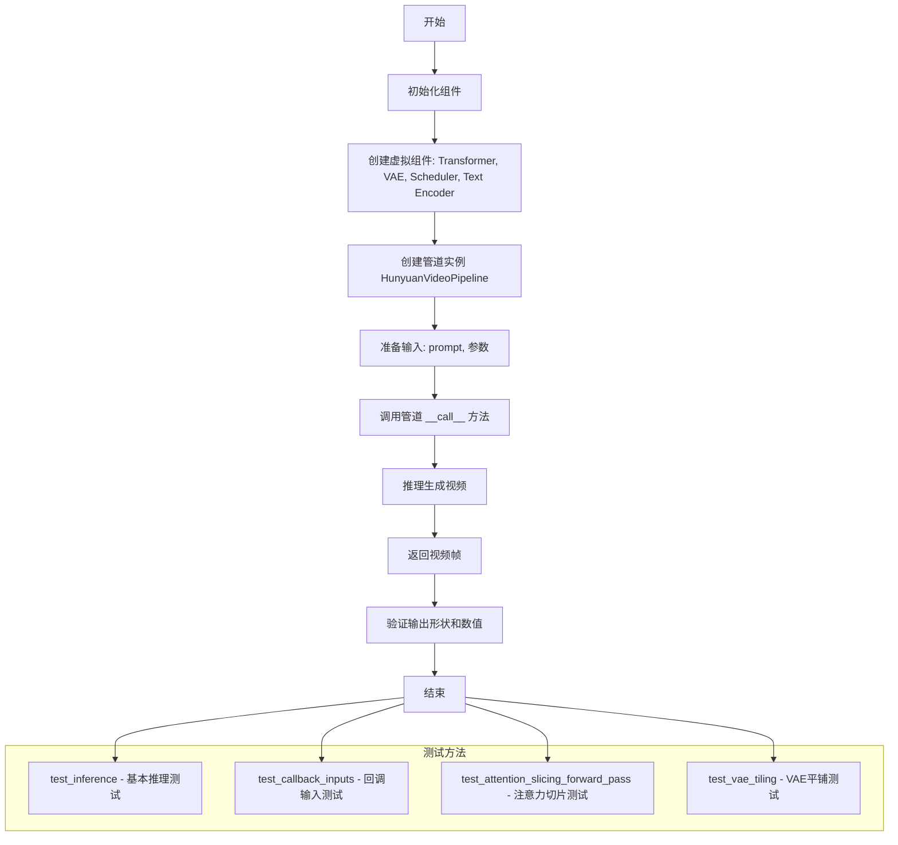

#### 带注释源码

```python
# 测试类定义，继承多个测试Mixin和unittest.TestCase
class HunyuanVideoPipelineFastTests(
    PipelineTesterMixin,
    PyramidAttentionBroadcastTesterMixin,
    FasterCacheTesterMixin,
    FirstBlockCacheTesterMixin,
    TaylorSeerCacheTesterMixin,
    unittest.TestCase,
):
    # 指定被测试的管道类
    pipeline_class = HunyuanVideoPipeline
    
    # 定义测试参数
    params = frozenset(["prompt", "height", "width", "guidance_scale", "prompt_embeds", "pooled_prompt_embeds"])
    batch_params = frozenset(["prompt"])
    required_optional_params = frozenset(
        [
            "num_inference_steps",
            "generator",
            "latents",
            "return_dict",
            "callback_on_step_end",
            "callback_on_step_end_tensor_inputs",
        ]
    )

    # 测试配置标志
    test_xformers_attention = False
    test_layerwise_casting = True
    test_group_offloading = True

    # Faster Cache配置
    faster_cache_config = FasterCacheConfig(
        spatial_attention_block_skip_range=2,
        spatial_attention_timestep_skip_range=(-1, 901),
        unconditional_batch_skip_range=2,
        attention_weight_callback=lambda _: 0.5,
        is_guidance_distilled=True,
    )

    # 创建虚拟组件用于测试
    def get_dummy_components(self, num_layers: int = 1, num_single_layers: int = 1):
        torch.manual_seed(0)
        # 创建Transformer模型
        transformer = HunyuanVideoTransformer3DModel(
            in_channels=4,
            out_channels=4,
            num_attention_heads=2,
            attention_head_dim=10,
            num_layers=num_layers,
            num_single_layers=num_single_layers,
            num_refiner_layers=1,
            patch_size=1,
            patch_size_t=1,
            guidance_embeds=True,
            text_embed_dim=16,
            pooled_projection_dim=8,
            rope_axes_dim=(2, 4, 4),
        )

        torch.manual_seed(0)
        # 创建VAE模型
        vae = AutoencoderKLHunyuanVideo(
            in_channels=3,
            out_channels=3,
            latent_channels=4,
            down_block_types=(
                "HunyuanVideoDownBlock3D",
                "HunyuanVideoDownBlock3D",
                "HunyuanVideoDownBlock3D",
                "HunyuanVideoDownBlock3D",
            ),
            up_block_types=(
                "HunyuanVideoUpBlock3D",
                "HunyuanVideoUpBlock3D",
                "HunyuanVideoUpBlock3D",
                "HunyuanVideoUpBlock3D",
            ),
            block_out_channels=(8, 8, 8, 8),
            layers_per_block=1,
            act_fn="silu",
            norm_num_groups=4,
            scaling_factor=0.476986,
            spatial_compression_ratio=8,
            temporal_compression_ratio=4,
            mid_block_add_attention=True,
        )

        torch.manual_seed(0)
        # 创建调度器
        scheduler = FlowMatchEulerDiscreteScheduler(shift=7.0)

        # 创建Llama文本编码器配置
        llama_text_encoder_config = LlamaConfig(
            bos_token_id=0,
            eos_token_id=2,
            hidden_size=16,
            intermediate_size=37,
            layer_norm_eps=1e-05,
            num_attention_heads=4,
            num_hidden_layers=2,
            pad_token_id=1,
            vocab_size=1000,
            hidden_act="gelu",
            projection_dim=32,
        )
        
        # 创建CLIP文本编码器配置
        clip_text_encoder_config = CLIPTextConfig(
            bos_token_id=0,
            eos_token_id=2,
            hidden_size=8,
            intermediate_size=37,
            layer_norm_eps=1e-05,
            num_attention_heads=4,
            num_hidden_layers=2,
            pad_token_id=1,
            vocab_size=1000,
            hidden_act="gelu",
            projection_dim=32,
        )

        torch.manual_seed(0)
        # 创建文本编码器
        text_encoder = LlamaModel(llama_text_encoder_config)
        tokenizer = LlamaTokenizer.from_pretrained("finetrainers/dummy-hunyaunvideo", subfolder="tokenizer")

        torch.manual_seed(0)
        text_encoder_2 = CLIPTextModel(clip_text_encoder_config)
        tokenizer_2 = CLIPTokenizer.from_pretrained("hf-internal-testing/tiny-random-clip")

        # 组装组件字典
        components = {
            "transformer": transformer,
            "vae": vae,
            "scheduler": scheduler,
            "text_encoder": text_encoder,
            "text_encoder_2": text_encoder_2,
            "tokenizer": tokenizer,
            "tokenizer_2": tokenizer_2,
        }
        return components

    # 创建虚拟输入参数
    def get_dummy_inputs(self, device, seed=0):
        if str(device).startswith("mps"):
            generator = torch.manual_seed(seed)
        else:
            generator = torch.Generator(device=device).manual_seed(seed)

        inputs = {
            "prompt": "dance monkey",
            "prompt_template": {
                "template": "{}",
                "crop_start": 0,
            },
            "generator": generator,
            "num_inference_steps": 2,
            "guidance_scale": 4.5,
            "height": 16,
            "width": 16,
            "num_frames": 9,  # 4 * k + 1 是推荐值
            "max_sequence_length": 16,
            "output_type": "pt",
        }
        return inputs

    # 测试基本推理功能
    def test_inference(self):
        device = "cpu"

        components = self.get_dummy_components()
        pipe = self.pipeline_class(**components)  # 创建管道实例
        pipe.to(device)
        pipe.set_progress_bar_config(disable=None)

        inputs = self.get_dummy_inputs(device)
        video = pipe(**inputs).frames  # 调用管道生成视频
        generated_video = video[0]
        self.assertEqual(generated_video.shape, (9, 3, 16, 16))

        # 验证生成的视频数值
        expected_slice = torch.tensor([0.3946, 0.4649, 0.3196, 0.4569, 0.3312, 0.3687, 0.3216, 0.3972, 0.4469, 0.3888, 0.3929, 0.3802, 0.3479, 0.3888, 0.3825, 0.3542])

        generated_slice = generated_video.flatten()
        generated_slice = torch.cat([generated_slice[:8], generated_slice[-8:]])
        self.assertTrue(
            torch.allclose(generated_slice, expected_slice, atol=1e-3),
            "The generated video does not match the expected slice.",
        )

    # 测试回调输入功能
    def test_callback_inputs(self):
        sig = inspect.signature(self.pipeline_class.__call__)
        has_callback_tensor_inputs = "callback_on_step_end_tensor_inputs" in sig.parameters
        has_callback_step_end = "callback_on_step_end" in sig.parameters

        if not (has_callback_tensor_inputs and has_callback_step_end):
            return

        components = self.get_dummy_components()
        pipe = self.pipeline_class(**components)
        pipe = pipe.to(torch_device)
        pipe.set_progress_bar_config(disable=None)
        self.assertTrue(
            hasattr(pipe, "_callback_tensor_inputs"),
            f" {self.pipeline_class} should have `_callback_tensor_inputs` that defines a list of tensor variables its callback function can use as inputs",
        )

        # 测试回调函数 - 只传递子集
        def callback_inputs_subset(pipe, i, t, callback_kwargs):
            for tensor_name, tensor_value in callback_kwargs.items():
                assert tensor_name in pipe._callback_tensor_inputs
            return callback_kwargs

        # 测试回调函数 - 传递所有
        def callback_inputs_all(pipe, i, t, callback_kwargs):
            for tensor_name in pipe._callback_tensor_inputs:
                assert tensor_name in callback_kwargs
            for tensor_name, tensor_value in callback_kwargs.items():
                assert tensor_name in pipe._callback_tensor_inputs
            return callback_kwargs

        inputs = self.get_dummy_inputs(torch_device)

        # 测试传递子集
        inputs["callback_on_step_end"] = callback_inputs_subset
        inputs["callback_on_step_end_tensor_inputs"] = ["latents"]
        output = pipe(**inputs)[0]

        # 测试传递所有
        inputs["callback_on_step_end"] = callback_inputs_all
        inputs["callback_on_step_end_tensor_inputs"] = pipe._callback_tensor_inputs
        output = pipe(**inputs)[0]

        # 测试修改张量
        def callback_inputs_change_tensor(pipe, i, t, callback_kwargs):
            is_last = i == (pipe.num_timesteps - 1)
            if is_last:
                callback_kwargs["latents"] = torch.zeros_like(callback_kwargs["latents"])
            return callback_kwargs

        inputs["callback_on_step_end"] = callback_inputs_change_tensor
        inputs["callback_on_step_end_tensor_inputs"] = pipe._callback_tensor_inputs
        output = pipe(**inputs)[0]
        assert output.abs().sum() < 1e10

    # 测试注意力切片前向传播
    def test_attention_slicing_forward_pass(
        self, test_max_difference=True, test_mean_pixel_difference=True, expected_max_diff=1e-3
    ):
        if not self.test_attention_slicing:
            return

        components = self.get_dummy_components()
        pipe = self.pipeline_class(**components)
        for component in pipe.components.values():
            if hasattr(component, "set_default_attn_processor"):
                component.set_default_attn_processor()
        pipe.to(torch_device)
        pipe.set_progress_bar_config(disable=None)

        generator_device = "cpu"
        inputs = self.get_dummy_inputs(generator_device)
        output_without_slicing = pipe(**inputs)[0]

        pipe.enable_attention_slicing(slice_size=1)
        inputs = self.get_dummy_inputs(generator_device)
        output_with_slicing1 = pipe(**inputs)[0]

        pipe.enable_attention_slicing(slice_size=2)
        inputs = self.get_dummy_inputs(generator_device)
        output_with_slicing2 = pipe(**inputs)[0]

        if test_max_difference:
            max_diff1 = np.abs(to_np(output_with_slicing1) - to_np(output_without_slicing)).max()
            max_diff2 = np.abs(to_np(output_with_slicing2) - to_np(output_without_slicing)).max()
            self.assertLess(
                max(max_diff1, max_diff2),
                expected_max_diff,
                "Attention slicing should not affect the inference results",
            )

    # 测试VAE平铺
    def test_vae_tiling(self, expected_diff_max: float = 0.2):
        expected_diff_max = 0.6  # 需要更高的容差
        generator_device = "cpu"
        components = self.get_dummy_components()

        pipe = self.pipeline_class(**components)
        pipe.to("cpu")
        pipe.set_progress_bar_config(disable=None)

        # 不使用平铺
        inputs = self.get_dummy_inputs(generator_device)
        inputs["height"] = inputs["width"] = 128
        output_without_tiling = pipe(**inputs)[0]

        # 使用平铺
        pipe.vae.enable_tiling(
            tile_sample_min_height=96,
            tile_sample_min_width=96,
            tile_sample_stride_height=64,
            tile_sample_stride_width=64,
        )
        inputs = self.get_dummy_inputs(generator_device)
        inputs["height"] = inputs["width"] = 128
        output_with_tiling = pipe(**inputs)[0]

        self.assertLess(
            (to_np(output_without_tiling) - to_np(output_with_tiling)).max(),
            expected_diff_max,
            "VAE tiling should not affect the inference results",
        )
```


# HunyuanVideoTransformer3DModel 详细设计文档

## 概述

`HunyuanVideoTransformer3DModel` 是腾讯混文（HunyuanVideo）项目的核心3D视频变换器模型，负责在潜在空间中执行视频生成的噪声预测任务。该模型继承自 `diffusers` 库的基础变换器架构，集成了时空注意力机制、旋转位置编码（RoPE）和文本条件嵌入处理能力，支持视频扩散管道的端到端生成流程。

## 1. 核心功能描述

`HunyuanVideoTransformer3DModel` 是一个用于视频生成的3D变换器模型，接收噪声潜在表示、文本嵌入和时间步信息，通过多层自注意力和交叉注意力机制处理时空数据，输出预测的去噪噪声，实现从随机噪声到连贯视频的生成过程。

## 2. 文件整体运行流程

```
┌─────────────────────────────────────────────────────────────────────────────┐
│                          HunyuanVideoPipeline 测试流程                        │
├─────────────────────────────────────────────────────────────────────────────┤
│                                                                             │
│  ┌──────────────────┐     ┌──────────────────────────────────────────┐    │
│  │ get_dummy_       │────▶│ HunyuanVideoTransformer3DModel 实例化     │    │
│  │ components()     │     │ - in_channels=4                           │    │
│  └──────────────────┘     │ - out_channels=4                          │    │
│         │                  │ - num_attention_heads=2                  │    │
│         ▼                  │ - attention_head_dim=10                 │    │
│  ┌──────────────────┐     │ - num_layers=num_layers                  │    │
│  │ 创建各组件:       │     │ - num_single_layers=num_single_layers    │    │
│  │ - transformer    │     │ - patch_size=1, patch_size_t=1           │    │
│  │ - vae            │     │ - text_embed_dim=16                      │    │
│  │ - scheduler      │     │ - pooled_projection_dim=8                │    │
│  │ - text_encoder   │     └──────────────────────────────────────────┘    │
│  │ - tokenizer      │                      │                            │
│  └──────────────────┘                      ▼                            │
│                              ┌──────────────────────────────────┐        │
│                              │ AutoencoderKLHunyuanVideo        │        │
│                              │ (VAE 编码器/解码器)               │        │
│                              └──────────────────────────────────┘        │
│                                              │                            │
│                                              ▼                            │
│                              ┌──────────────────────────────────┐        │
│                              │ FlowMatchEulerDiscreteScheduler  │        │
│                              │ (扩散调度器)                      │        │
│                              └──────────────────────────────────┘        │
│                                              │                            │
│                                              ▼                            │
│  ┌──────────────────┐              ┌──────────────────────────────────┐  │
│  │ get_dummy_       │────────────▶│ HunyuanVideoPipeline.__call__()  │  │
│  │ inputs()         │              │ - prompt="dance monkey"          │  │
│  └──────────────────┘              │ - num_frames=9                   │  │
│         │                          │ - height=16, width=16            │  │
│         ▼                          │ - guidance_scale=4.5             │  │
│  ┌──────────────────┐              └──────────────────────────────────┘  │
│  │ 测试验证:        │                            │                         │
│  │ - test_inference │                            ▼                         │
│  │ - test_attention │              ┌──────────────────────────────────┐  │
│  │   _slicing       │              │ 输出: 9 帧, 3 通道, 16x16        │  │
│  │ - test_vae_tiling│              │ 视频张量 (batch, frames, c, h, w)│  │
│  └──────────────────┘              └──────────────────────────────────┘  │
│                                                                             │
└─────────────────────────────────────────────────────────────────────────────┘
```

## 3. 类详细信息

### 3.1 HunyuanVideoTransformer3DModel 类

#### 3.1.1 类字段（构造函数参数）

| 字段名称 | 类型 | 描述 |
|---------|------|------|
| `in_channels` | `int` | 输入潜在表示的通道数，对于视频潜在表示通常为4 |
| `out_channels` | `int` | 输出预测噪声的通道数，通常与输入通道数相同 |
| `num_attention_heads` | `int` | 注意力机制中使用的多头数量 |
| `attention_head_dim` | `int` | 每个注意力头的维度 |
| `num_layers` | `int` | 主干网络中Transformer块的数量 |
| `num_single_layers` | `int` | 单层Transformer块的数量（用于处理特定任务） |
| `num_refiner_layers` | `int` | 精炼层（refiner）的数量，用于提升生成质量 |
| `patch_size` | `int` | 空间维度的patch大小，用于将图像分割为小块 |
| `patch_size_t` | `int` | 时间维度的patch大小，用于将视频帧分割为小块 |
| `guidance_embeds` | `bool` | 是否启用指导嵌入（用于分类器自由引导） |
| `text_embed_dim` | `int` | 文本嵌入的维度 |
| `pooled_projection_dim` | `int` | 池化投影层的输出维度 |
| `rope_axes_dim` | `tuple` | 旋转位置编码（RoPE）的轴维度配置 |

#### 3.1.2 类方法

由于 `HunyuanVideoTransformer3DModel` 是从 `diffusers` 库导入的外部类，以下是基于代码使用模式推断的方法签名：

| 方法名称 | 描述 |
|---------|------|
| `__init__` | 构造函数，初始化模型参数和子模块 |
| `forward` | 前向传播，执行噪声预测 |
| `encode_text` | 编码文本输入为嵌入向量 |

### 3.2 HunyuanVideoPipeline 类

#### 3.2.1 类字段

| 字段名称 | 类型 | 描述 |
|---------|------|------|
| `pipeline_class` | `type` | 管道类类型 |
| `params` | `frozenset` | 管道可接受的主要参数集合 |
| `batch_params` | `frozenset` | 支持批量处理的参数集合 |
| `required_optional_params` | `frozenset` | 可选但推荐设置的参数集合 |
| `test_xformers_attention` | `bool` | 是否测试xFormers注意力 |
| `test_layerwise_casting` | `bool` | 是否测试层级类型转换 |
| `test_group_offloading` | `bool` | 是否测试组卸载 |
| `faster_cache_config` | `FasterCacheConfig` | 快速缓存配置对象 |

#### 3.2.2 类方法

| 方法名称 | 描述 |
|---------|------|
| `get_dummy_components` | 创建用于测试的虚拟组件 |
| `get_dummy_inputs` | 创建用于测试的虚拟输入 |
| `test_inference` | 测试推理功能 |
| `test_callback_inputs` | 测试回调输入 |
| `test_attention_slicing_forward_pass` | 测试注意力切片前向传播 |
| `test_vae_tiling` | 测试VAE平铺 |

### 3.3 全局变量和函数

| 名称 | 类型 | 描述 |
|-----|------|------|
| `enable_full_determinism` | 函数 | 启用完全确定性模式，确保测试可重复 |
| `torch_device` | 变量 | 指定PyTorch设备（CPU/CUDA） |
| `to_np` | 函数 | 将PyTorch张量转换为NumPy数组 |

## 4. HunyuanVideoTransformer3DModel 详细信息

### 4.1 构造函数参数详情

```
名称：HunyuanVideoTransformer3DModel.__init__

参数：
- in_channels: int，输入通道数，视频潜在表示的通道维度
- out_channels: int，输出通道数，预测噪声的通道维度  
- num_attention_heads: int，注意力头数量，决定并行注意力计算的数量
- attention_head_dim: int，注意力头维度，每个头的查询/键/值向量维度
- num_layers: int，主干网络层数，Transformer块的堆叠数量
- num_single_layers: int，单层数量，用于特定处理任务的独立层
- num_refiner_layers: int，精炼层层数，用于提升输出质量的额外层
- patch_size: int，空间patch大小，将空间维度分块的尺寸
- patch_size_t: int，时间patch大小，将时间维度分块的尺寸
- guidance_embeds: bool，指导嵌入标志，控制是否使用分类器自由引导
- text_embed_dim: int，文本嵌入维度，文本编码器的输出维度
- pooled_projection_dim: int，池化投影维度，用于文本池化表示的投影
- rope_axes_dim: tuple，RoPE轴维度，旋转位置编码的维度配置

返回值：HunyuanVideoTransformer3DModel 实例化对象
```

### 4.2 流程图

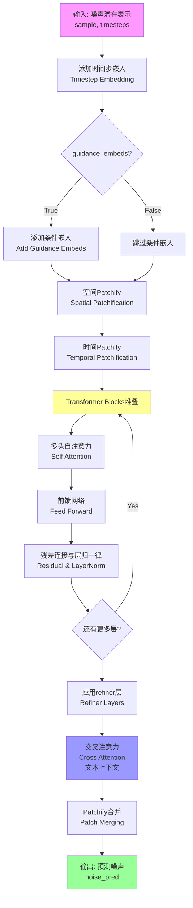

### 4.3 带注释源码

```python
# HunyuanVideoTransformer3DModel 在测试中的使用方式
# 来源: HunyuanVideoPipelineFastTests.get_dummy_components()

# 实例化3D视频变换器模型
torch.manual_seed(0)  # 设置随机种子确保可重复性
transformer = HunyuanVideoTransformer3DModel(
    # === 输入输出配置 ===
    in_channels=4,           # 输入潜在空间的通道数 (Latent space channels)
                            # 通常为4，对应RGB三通道+alpha通道的潜在表示
    
    out_channels=4,          # 输出预测噪声的通道数
                            # 必须与in_channels匹配以确保维度兼容
    
    # === 注意力机制配置 ===
    num_attention_heads=2,   # 多头注意力的头数量
                            # 2个头用于并行计算不同的注意力模式
    
    attention_head_dim=10,   # 每个注意力头的维度
                            # 总注意力维度 = num_attention_heads * attention_head_dim = 20
    
    # === 网络结构配置 ===
    num_layers=num_layers,   # 主干Transformer块的数量
                            # 可配置用于实验不同深度的模型
    
    num_single_layers=num_single_layers,  # 单层块数量
                            # 用于处理不需要完整Transformer堆叠的任务
    
    num_refiner_layers=1,    # 精炼层数量
                            # 额外的处理层用于提升生成质量
    
    # === Patch嵌入配置 ===
    patch_size=1,            # 空间维度的patch大小
                            # 1表示每个像素作为一个patch（无空间下采样）
    
    patch_size_t=1,          # 时间维度的patch大小
                            # 1表示每帧作为一个时间patch（无时间下采样）
    
    # === 条件嵌入配置 ===
    guidance_embeds=True,    # 启用分类器自由引导(Classifier-Free Guidance)嵌入
                            # 允许模型在推理时根据引导强度调整生成
    
    text_embed_dim=16,       # 文本嵌入的维度
                            # 对应文本编码器(CLIP/Llama)的输出维度
    
    pooled_projection_dim=8, # 池化投影层输出维度
                            # 用于将[CLS]标记投影到更低维空间
    
    # === 位置编码配置 ===
    rope_axes_dim=(2, 4, 4), # 旋转位置编码(RoPE)的轴维度
                            # (2, 4, 4)表示不同轴使用不同维度的位置编码
                            # 可能对应: (时间轴, 高度轴, 宽度轴)
)
```

## 5. 关键组件信息

| 组件名称 | 描述 |
|---------|------|
| **HunyuanVideoTransformer3DModel** | 核心3D视频变换器，执行去噪预测 |
| **AutoencoderKLHunyuanVideo** | 变分自编码器，负责潜在空间与像素空间的相互转换 |
| **FlowMatchEulerDiscreteScheduler** | 基于欧拉离散方法的Flow Match扩散调度器 |
| **LlamaModel** | Llama文本编码器，将文本转换为语义嵌入 |
| **CLIPTextModel** | CLIP文本编码器，提供额外的文本表示 |
| **HunyuanVideoPipeline** | 端到端视频生成管道，协调所有组件 |

## 6. 技术债务与优化空间

### 6.1 当前技术债务

1. **测试依赖外部模型配置**: `get_dummy_components` 中硬编码了多个超参数（如`text_embed_dim=16`），缺乏灵活的配置机制。

2. **词汇表大小限制**: 代码注释提到使用小词汇表进行快速测试，导致某些提示会引发嵌入查找错误。

3. **魔法数字**: 代码中存在硬编码的数值如`num_frames=9`（4*k+1推荐值）、`shift=7.0`，缺乏文档说明其来源。

4. **重复的随机种子设置**: 多处使用`torch.manual_seed(0)`，可以考虑封装为工具函数。

### 6.2 优化空间

1. **参数化配置**: 将`HunyuanVideoTransformer3DModel`的参数提取为可配置的@dataclass或配置文件。

2. **缓存机制**: 当前测试每次都重新创建组件，可以引入测试级别的组件缓存。

3. **性能基准测试**: 建议添加推理时间、内存占用等性能指标测试。

4. **端到端测试覆盖**: 补充更多场景如多帧生成、高分辨率生成、批量生成等的测试。

## 7. 其它项目信息

### 7.1 设计目标与约束

- **目标**: 提供可复现的HunyuanVideo模型单元测试
- **约束**: 
  - 使用最小化的模型配置以加快测试速度
  - 词汇表限制为1000（测试用），实际部署需要更大词汇表
  - 必须支持多种缓存优化策略的测试

### 7.2 错误处理与异常设计

- 测试使用`unittest.skip`装饰器跳过已知问题（如小词汇表导致的嵌入错误）
- 注意力切片测试包含条件判断`if not self.test_attention_slicing: return`
- 使用`torch.allclose`进行浮点数近似比较，允许数值误差

### 7.3 数据流与状态机

```
输入数据流:
prompt → tokenizer → text_encoder → text_embed_dim嵌入
                           ↓
                    pooled_projection → pooled_prompt_embeds
                           
潜在空间流:
随机噪声 → VAE编码 → 潜在表示 → Transformer去噪 → VAE解码 → 视频帧

调度器状态机:
Noise Schedule: t=0(纯噪声) → ... → t=T(接近原始数据)
```

### 7.4 外部依赖与接口契约

| 依赖项 | 版本要求 | 用途 |
|-------|---------|------|
| `transformers` | 最新稳定版 | CLIPTextModel, LlamaModel, CLIPTokenizer, LlamaTokenizer |
| `diffusers` | 最新稳定版 | 管道和模型基类 |
| `torch` | CUDA兼容版本 | 张量计算 |
| `numpy` | 最新稳定版 | 数值计算 |

### 7.5 关键接口契约

- **Pipeline输入**: 
  - `prompt`: 文本提示
  - `num_frames`: 生成帧数
  - `height`, `width`: 空间分辨率
  - `guidance_scale`: 引导强度
  
- **Pipeline输出**: 
  - `frames`: 视频帧序列，形状为`(batch, frames, channels, height, width)`


### `AutoencoderKLHunyuanVideo`

AutoencoderKLHunyuanVideo 是 HunyuanVideo 项目的变分自编码器 (VAE) 模型，专门用于视频的编码和解码。它将输入视频压缩到潜在空间，然后再从潜在空间重建视频，支持 3D 卷积块进行时空联合压缩。

参数：

- `in_channels`：`int`，输入视频的通道数（通常为 3，对应 RGB）
- `out_channels`：`int`，输出视频的通道数
- `latent_channels`：`int`，潜在空间的通道数，用于压缩表示
- `down_block_types`：`Tuple[str, ...]`，下采样块的类型列表，指定用于编码的 3D 下采样块
- `up_block_types`：`Tuple[str, ...]`，上采样块的类型列表，指定用于解码的 3D 上采样块
- `block_out_channels`：`Tuple[int, ...]`，每个块输出的通道数列表
- `layers_per_block`：`int`，每个块中包含的层数
- `act_fn`：`str`，激活函数类型（如 "silu"）
- `norm_num_groups`：`int`，分组归一化的组数
- `scaling_factor`：`float`，潜在空间的缩放因子
- `spatial_compression_ratio`：`int`，空间压缩比（宽度和高度的压缩比例）
- `temporal_compression_ratio`：`int`，时间压缩比（帧数的压缩比例）
- `mid_block_add_attention`：`bool`，是否在中间块添加注意力机制

返回值：`torch.nn.Module`，返回一个 PyTorch 模块，即配置好的视频 VAE 模型

#### 流程图

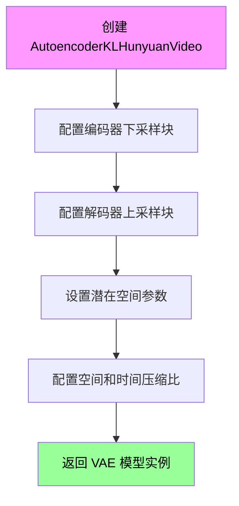

#### 带注释源码

```python
# 在 get_dummy_components 方法中实例化 VAE
torch.manual_seed(0)
vae = AutoencoderKLHunyuanVideo(
    in_channels=3,  # 输入为 RGB 3通道视频
    out_channels=3,  # 输出为 RGB 3通道视频
    latent_channels=4,  # 潜在空间使用 4 通道表示
    down_block_types=(  # 定义 4 个 3D 下采样编码器块
        "HunyuanVideoDownBlock3D",
        "HunyuanVideoDownBlock3D",
        "HunyuanVideoDownBlock3D",
        "HunyuanVideoDownBlock3D",
    ),
    up_block_types=(  # 定义 4 个 3D 上采样解码器块
        "HunyuanVideoUpBlock3D",
        "HunyuanVideoUpBlock3D",
        "HunyuanVideoUpBlock3D",
        "HunyuanVideoUpBlock3D",
    ),
    block_out_channels=(8, 8, 8, 8),  # 每个块的输出通道数
    layers_per_block=1,  # 每个块包含 1 层
    act_fn="silu",  # 使用 SiLU 激活函数
    norm_num_groups=4,  # 分组归一化，组数为 4
    scaling_factor=0.476986,  # 潜在空间缩放因子
    spatial_compression_ratio=8,  # 空间压缩比 8x8
    temporal_compression_ratio=4,  # 时间压缩比 4x
    mid_block_add_attention=True,  # 中间块添加注意力机制
)
```


### FlowMatchEulerDiscreteScheduler

这是从 `diffusers` 库导入的调度器类，在代码中通过 `get_dummy_components` 方法进行实例化，用于视频生成管道的调度器配置。

参数：

-  `shift`：`float`，时间步偏移参数，控制 Flow Match 调度的时间步变换

返回值：`FlowMatchEulerDiscreteScheduler`，返回配置好的调度器实例

#### 流程图

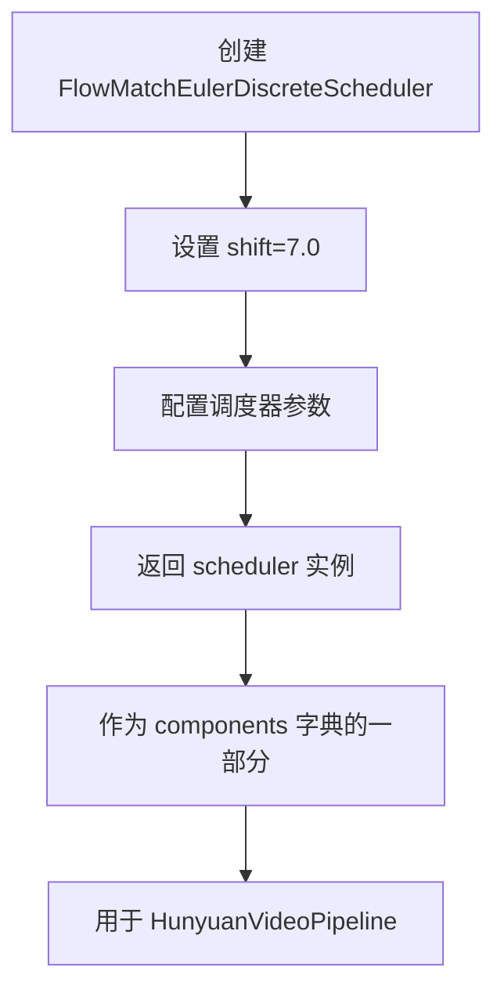

#### 带注释源码

```python
# 从 diffusers 库导入 FlowMatchEulerDiscreteScheduler
from diffusers import (
    FlowMatchEulerDiscreteScheduler,
    # ... 其他导入
)

# 在 get_dummy_components 方法中实例化调度器
torch.manual_seed(0)
scheduler = FlowMatchEulerDiscreteScheduler(shift=7.0)

# 将调度器添加到组件字典中
components = {
    "transformer": transformer,
    "vae": vae,
    "scheduler": scheduler,  # 调度器作为管道组件之一
    "text_encoder": text_encoder,
    "text_encoder_2": text_encoder_2,
    "tokenizer": tokenizer,
    "tokenizer_2": tokenizer_2,
}
```

---

**注意**：该代码片段中 `FlowMatchEulerDiscreteScheduler` 是从外部库（`diffusers`）导入的类，代码中仅展示了其**使用方式**（实例化并传入 `shift=7.0` 参数），并未包含该类的完整定义源码。该类的具体实现位于 `diffusers` 库中。

如需获取 `FlowMatchEulerDiscreteScheduler` 的完整源码和详细设计文档，建议查阅 [diffusers 官方 GitHub 仓库](https://github.com/huggingface/diffusers) 中的 `src/diffusers/schedulers/scheduling_flow_match_euler_discrete.py` 文件。


# LlamaModel 分析文档

## 1. 一段话描述

`LlamaModel` 是从 Hugging Face `transformers` 库导入的预训练语言模型类，在此代码中作为文本编码器（text_encoder）使用，将文本提示转换为文本嵌入向量，供视频生成管道使用。

## 2. 文件的整体运行流程

此文件是一个测试文件（`test_hunyuan_video_pipeline.py`），用于测试 `HunyuanVideoPipeline` 的功能。整体流程如下：

1. **测试类定义**：定义 `HunyuanVideoPipelineFastTests` 继承自多个测试混入类
2. **组件初始化**：通过 `get_dummy_components` 方法创建虚拟组件，包括 Transformer、VAE、调度器、文本编码器等
3. **输入构建**：`get_dummy_inputs` 方法构建测试输入参数
4. **测试执行**：执行各种测试方法验证管道功能

## 3. 类的详细信息

### 3.1 全局变量和导入

| 名称 | 类型 | 描述 |
|------|------|------|
| `LlamaModel` | class | 从 transformers 库导入的 Llama 模型类，用于文本编码 |
| `LlamaConfig` | class | 从 transformers 库导入的 Llama 配置类 |
| `LlamaTokenizer` | class | 从 transformers 库导入的 Llama 分词器类 |

### 3.2 HunyuanVideoPipelineFastTests 类

| 名称 | 类型 | 描述 |
|------|------|------|
| `pipeline_class` | type | 待测试的管道类（HunyuanVideoPipeline） |
| `params` | frozenset | 管道参数集合 |
| `batch_params` | frozenset | 批量参数集合 |
| `required_optional_params` | frozenset | 必需的可选参数集合 |
| `test_xformers_attention` | bool | 是否测试 xformers 注意力 |
| `test_layerwise_casting` | bool | 是否测试分层类型转换 |
| `test_group_offloading` | bool | 是否测试组卸载 |
| `faster_cache_config` | FasterCacheConfig | 快速缓存配置 |

### 3.3 方法详细信息

#### 3.3.1 get_dummy_components

**参数：**
- `num_layers`：`int`，Transformer 层数，默认为 1
- `num_single_layers`：`int`，单层数量，默认为 1

**返回值：**
- `dict`，包含所有虚拟组件的字典

**mermaid 流程图：**

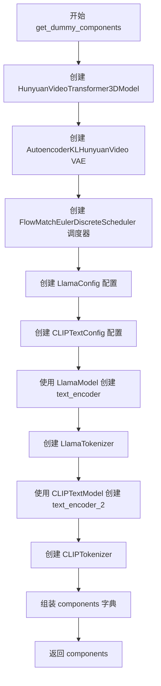

**带注释源码：**

```python
def get_dummy_components(self, num_layers: int = 1, num_single_layers: int = 1):
    """创建虚拟组件用于测试"""
    torch.manual_seed(0)
    # 创建 Transformer 模型
    transformer = HunyuanVideoTransformer3DModel(
        in_channels=4,
        out_channels=4,
        num_attention_heads=2,
        attention_head_dim=10,
        num_layers=num_layers,
        num_single_layers=num_single_layers,
        num_refiner_layers=1,
        patch_size=1,
        patch_size_t=1,
        guidance_embeds=True,
        text_embed_dim=16,
        pooled_projection_dim=8,
        rope_axes_dim=(2, 4, 4),
    )

    torch.manual_seed(0)
    # 创建 VAE 模型
    vae = AutoencoderKLHunyuanVideo(
        in_channels=3,
        out_channels=3,
        latent_channels=4,
        down_block_types=(
            "HunyuanVideoDownBlock3D",
            "HunyuanVideoDownBlock3D",
            "HunyuanVideoDownBlock3D",
            "HunyuanVideoDownBlock3D",
        ),
        up_block_types=(
            "HunyuanVideoUpBlock3D",
            "HunyuanVideoUpBlock3D",
            "HunyuanVideoUpBlock3D",
            "HunyuanVideoUpBlock3D",
        ),
        block_out_channels=(8, 8, 8, 8),
        layers_per_block=1,
        act_fn="silu",
        norm_num_groups=4,
        scaling_factor=0.476986,
        spatial_compression_ratio=8,
        temporal_compression_ratio=4,
        mid_block_add_attention=True,
    )

    torch.manual_seed(0)
    # 创建调度器
    scheduler = FlowMatchEulerDiscreteScheduler(shift=7.0)

    # 创建 Llama 文本编码器配置
    llama_text_encoder_config = LlamaConfig(
        bos_token_id=0,
        eos_token_id=2,
        hidden_size=16,
        intermediate_size=37,
        layer_norm_eps=1e-05,
        num_attention_heads=4,
        num_hidden_layers=2,
        pad_token_id=1,
        vocab_size=1000,
        hidden_act="gelu",
        projection_dim=32,
    )
    # 创建 CLIP 文本编码器配置
    clip_text_encoder_config = CLIPTextConfig(
        bos_token_id=0,
        eos_token_id=2,
        hidden_size=8,
        intermediate_size=37,
        layer_norm_eps=1e-05,
        num_attention_heads=4,
        num_hidden_layers=2,
        pad_token_id=1,
        vocab_size=1000,
        hidden_act="gelu",
        projection_dim=32,
    )

    torch.manual_seed(0)
    # 使用 LlamaModel 创建文本编码器
    text_encoder = LlamaModel(llama_text_encoder_config)
    # 创建 Llama 分词器
    tokenizer = LlamaTokenizer.from_pretrained("finetrainers/dummy-hunyaunvideo", subfolder="tokenizer")

    torch.manual_seed(0)
    # 使用 CLIPTextModel 创建第二个文本编码器
    text_encoder_2 = CLIPTextModel(clip_text_encoder_config)
    # 创建 CLIP 分词器
    tokenizer_2 = CLIPTokenizer.from_pretrained("hf-internal-testing/tiny-random-clip")

    # 组装所有组件
    components = {
        "transformer": transformer,
        "vae": vae,
        "scheduler": scheduler,
        "text_encoder": text_encoder,  # LlamaModel 实例
        "text_encoder_2": text_encoder_2,
        "tokenizer": tokenizer,
        "tokenizer_2": tokenizer_2,
    }
    return components
```

#### 3.3.2 get_dummy_inputs

**参数：**
- `device`：`str`，目标设备
- `seed`：`int`，随机种子，默认为 0

**返回值：**
- `dict`，包含测试输入参数的字典

**mermaid 流程图：**

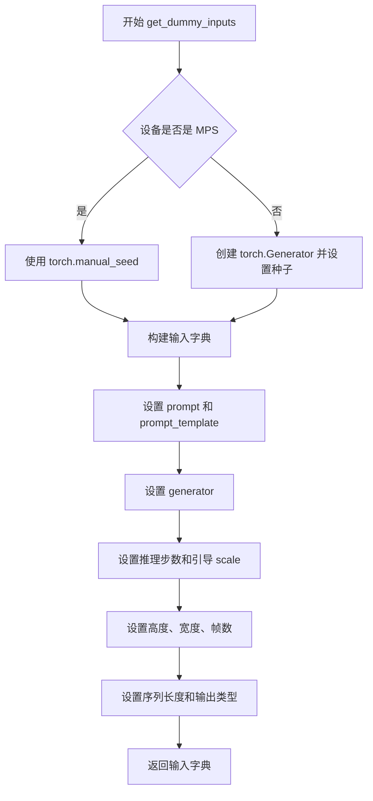

**带注释源码：**

```python
def get_dummy_inputs(self, device, seed=0):
    """构建虚拟测试输入"""
    # 根据设备类型创建随机数生成器
    if str(device).startswith("mps"):
        generator = torch.manual_seed(seed)
    else:
        generator = torch.Generator(device=device).manual_seed(seed)

    # 构建输入参数字典
    inputs = {
        "prompt": "dance monkey",  # 文本提示
        "prompt_template": {
            "template": "{}",       # 提示模板
            "crop_start": 0,        # 裁剪起始位置
        },
        "generator": generator,    # 随机数生成器
        "num_inference_steps": 2,  # 推理步数
        "guidance_scale": 4.5,     # 引导 scale
        "height": 16,              # 生成图像高度
        "width": 16,               # 生成图像宽度
        "num_frames": 9,           # 生成帧数（4*k+1 推荐）
        "max_sequence_length": 16, # 最大序列长度
        "output_type": "pt",       # 输出类型（PyTorch）
    }
    return inputs
```

## 4. LlamaModel 在代码中的使用

### 4.1 LlamaModel 实例化

| 名称 | 类型 | 描述 |
|------|------|------|
| `llama_text_encoder_config` | LlamaConfig | Llama 模型配置对象 |
| `text_encoder` | LlamaModel | 使用 LlamaConfig 创建的 LlamaModel 实例 |

### 4.2 LlamaModel 使用流程

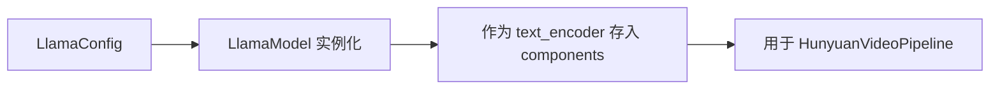

## 5. 关键组件信息

| 组件名称 | 描述 |
|----------|------|
| HunyuanVideoTransformer3DModel | Hunyuan 视频生成的 Transformer 模型 |
| AutoencoderKLHunyuanVideo | VAE 变分自编码器用于视频潜空间编码 |
| FlowMatchEulerDiscreteScheduler | 基于 Flow Match 的 Euler 离散调度器 |
| **LlamaModel** | **Llama 文本编码器（核心关注点）** |
| CLIPTextModel | CLIP 文本编码器 |
| LlamaTokenizer | Llama 分词器 |
| CLIPTokenizer | CLIP 分词器 |

## 6. 潜在的技术债务或优化空间

1. **硬编码的模型路径**：`LlamaTokenizer.from_pretrained` 和 `CLIPTokenizer.from_pretrained` 使用了特定的预训练路径，在实际测试环境中可能不可用
2. **虚拟组件的局限性**：使用虚拟组件（dummy components）可能导致测试覆盖不全，无法发现真实模型集成问题
3. **测试跳过**：`test_inference_batch_consistent` 和 `test_inference_batch_single_identical` 被跳过，理由是小词汇表会导致嵌入查找错误
4. **依赖外部库**：`LlamaModel` 来自 `transformers` 库，版本兼容性可能存在问题

## 7. 其它项目

### 7.1 设计目标与约束

- **目标**：测试 `HunyuanVideoPipeline` 的基本推理功能和各种优化特性
- **约束**：使用小词汇表（vocab_size=1000）和少量层数以加快测试速度

### 7.2 错误处理与异常设计

- 使用 `unittest.skip` 装饰器跳过已知问题的测试
- 使用 `torch.allclose` 进行浮点数近似比较

### 7.3 数据流与状态机

```
用户输入 (prompt) 
    → Tokenizer 分词 
    → LlamaModel/CLIPTextModel 编码 
    → Transformer 生成潜空间 
    → VAE 解码 
    → 视频 frames 输出
```

### 7.4 外部依赖与接口契约

| 依赖库 | 用途 |
|--------|------|
| `transformers` | LlamaModel, LlamaConfig, LlamaTokenizer, CLIPTextModel, CLIPTextConfig, CLIPTokenizer |
| `diffusers` | HunyuanVideoPipeline, HunyuanVideoTransformer3DModel, AutoencoderKLHunyuanVideo, FlowMatchEulerDiscreteScheduler, FasterCacheConfig |
| `torch` | 深度学习框架 |
| `numpy` | 数值计算 |
| `unittest` | 测试框架 |

### 7.5 LlamaModel 的接口契约（从 transformers 库）

由于 `LlamaModel` 来自外部库 `transformers`，以下是其在此代码中的使用方式：

```python
# 配置创建
llama_text_encoder_config = LlamaConfig(
    bos_token_id=0,
    eos_token_id=2,
    hidden_size=16,
    intermediate_size=37,
    layer_norm_eps=1e-05,
    num_attention_heads=4,
    num_hidden_layers=2,
    pad_token_id=1,
    vocab_size=1000,
    hidden_act="gelu",
    projection_dim=32,
)

# 模型实例化
text_encoder = LlamaModel(llama_text_encoder_config)

# 使用（通过 pipeline 间接调用）
# pipeline 会调用 text_encoder 进行文本嵌入
```

**注意**：完整的 `LlamaModel` 源码来自 Hugging Face `transformers` 库，不在此代码文件中定义。如需查看完整源码，请参考 [transformers 库的 LlamaModel 实现](https://github.com/huggingface/transformers)。


根据对提供代码的分析，代码中并未定义 `CLIPTextModel` 类，而是从 `transformers` 库导入了已存在的 `CLIPTextModel`。代码中仅使用了 `CLIPTextModel` 来创建文本编码器实例。

以下是在 `get_dummy_components` 方法中使用 `CLIPTextModel` 的相关信息：

---

### `get_dummy_components` 中创建 `text_encoder_2` (CLIPTextModel 实例)

该方法用于创建虚拟测试组件，其中 `text_encoder_2` 是一个 `CLIPTextModel` 实例，用于处理双文本编码器场景下的第二个文本编码器（CLIP）。

参数：

- 无直接参数（该方法为类方法，通过 `self` 调用）

返回值：`dict`，包含所有虚拟组件的字典

#### 流程图

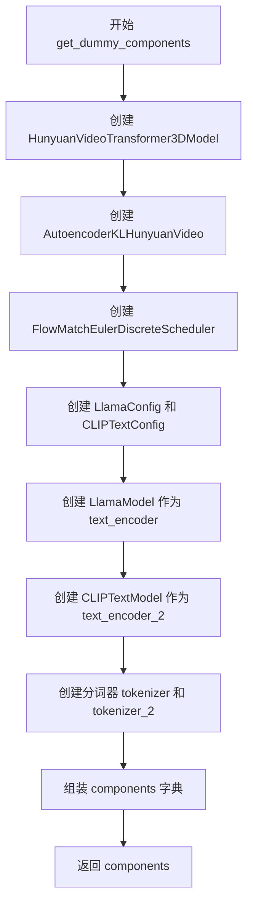

#### 带注释源码

```python
def get_dummy_components(self, num_layers: int = 1, num_single_layers: int = 1):
    # ... 前面的 transformer, vae, scheduler 创建代码 ...
    
    # 创建 CLIP 文本编码器配置
    clip_text_encoder_config = CLIPTextConfig(
        bos_token_id=0,
        eos_token_id=2,
        hidden_size=8,
        intermediate_size=37,
        layer_norm_eps=1e-05,
        num_attention_heads=4,
        num_hidden_layers=2,
        pad_token_id=1,
        vocab_size=1000,
        hidden_act="gelu",
        projection_dim=32,
    )
    
    # 使用 CLIPTextModel 创建第二个文本编码器
    # CLIPTextModel 是从 transformers 库导入的预训练模型
    # 这里使用虚拟配置创建用于测试
    torch.manual_seed(0)
    text_encoder_2 = CLIPTextModel(clip_text_encoder_config)
    
    # 创建第二个分词器
    tokenizer_2 = CLIPTokenizer.from_pretrained("hf-internal-testing/tiny-random-clip")
    
    # 组装所有组件
    components = {
        "transformer": transformer,
        "vae": vae,
        "scheduler": scheduler,
        "text_encoder": text_encoder,      # LlamaModel
        "text_encoder_2": text_encoder_2,  # CLIPTextModel
        "tokenizer": tokenizer,
        "tokenizer_2": tokenizer_2,
    }
    return components
```

---

## 补充说明

### 关键组件信息

- **text_encoder_2 (CLIPTextModel)**：用于将文本提示转换为嵌入向量的第二个文本编码器（CLIP架构）

### 潜在技术债务

1. **硬编码的模型路径**：`tokenizer` 使用了硬编码路径 `"finetrainers/dummy-hunyaunvideo"`，测试可能在无网络环境下失败
2. **随机种子设置**：多处使用 `torch.manual_seed(0)`，虽然保证可复现性但可能导致测试覆盖不足
3. **测试跳过**：`test_inference_batch_consistent` 和 `test_inference_batch_single_identical` 被跳过，原因是词汇表太小

### 注意事项

代码中 `CLIPTextModel` 是从 HuggingFace Transformers 库导入的外部预训练模型类，并非在此代码文件中定义。如需了解 `CLIPTextModel` 的详细架构和内部方法，请参考 Transformers 库官方文档。


### `LlamaTokenizer`

该函数是 HuggingFace Transformers 库中的 `LlamaTokenizer` 类，用于对 LLaMA 模型的文本进行分词（Tokenization）处理，将输入文本转换为模型可处理的 token ID 序列，或将 token ID 序列解码为文本。在代码中通过 `from_pretrained` 方法从指定路径加载预训练的 tokenizer。

参数：

- `pretrained_model_name_or_path`：`str`，HuggingFace Hub 上的模型 ID 或本地模型目录路径（如 `"finetrainers/dummy-hunyaunvideo"`）
- `subfolder`：`str`（可选），本地模型目录中的子文件夹路径（如 `"tokenizer"`）
- `*args`：可变位置参数，用于传递其他参数
- `**kwargs`：可变关键字参数，用于传递其他配置参数（如 `trust_remote_code`、`use_fast` 等）

返回值：返回 `LlamaTokenizer` 对象（实际类型为 `PreTrainedTokenizer`），该对象包含词汇表、分词器配置等信息，用于后续的 `encode`、`decode`、`__call__` 等操作。

#### 流程图

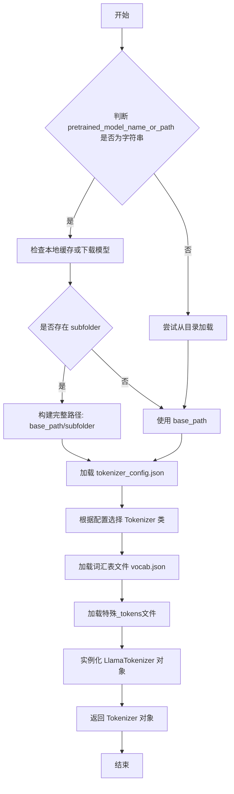

#### 带注释源码

```python
# 在 get_dummy_components 方法中调用 LlamaTokenizer
tokenizer = LlamaTokenizer.from_pretrained(
    "finetrainers/dummy-hunyaunvideo",  # 预训练模型名称或路径
    subfolder="tokenizer"                # tokenizer 文件所在的子文件夹
)
```

```python
# LlamaTokenizer 类的基本用法示例（来自 transformers 库）
# 假设 tokenizer 是已加载的 LlamaTokenizer 对象

# 1. 编码：将文本转换为 token IDs
input_ids = tokenizer.encode("Hello, world!", return_tensors="pt")

# 2. 分词：将文本分词（不转换为 IDs）
tokens = tokenizer.tokenize("Hello, world!")

# 3. 解码：将 token IDs 转换回文本
text = tokenizer.decode(input_ids[0])

# 4. 使用 __call__ 方法（最常用）
inputs = tokenizer(
    "Hello, world!",
    padding=True,
    truncation=True,
    max_length=512,
    return_tensors="pt"
)
```


### `CLIPTokenizer`

CLIPTokenizer 是 Hugging Face Transformers 库中的一个分词器类，用于将文本转换为模型可处理的 token 序列。该类基于 BPE（Byte Pair Encoding）算法实现，支持从预训练模型加载分词器配置，并提供 encode、decode 等方法进行文本与 token 之间的转换。

参数：

- `vocab_file`：str，可选，预训练词汇表文件路径
- `merges_file`：str，可选，BPE 合并文件路径
- `bos_token`：str，可选，序列开始标记
- `eos_token`：str，可选，序列结束标记
- `unk_token`：str，可选，未知标记
- `pad_token`：str，可选，填充标记

返回值：CLIPTokenizer 实例

#### 流程图

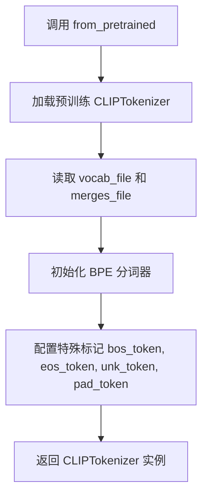

#### 带注释源码

```python
# 从 transformers 库导入 CLIPTokenizer 类
from transformers import CLIPTokenizer, CLIPTextModel, CLIPTextConfig

# 在 HunyuanVideoPipelineFastTests 类的 get_dummy_components 方法中使用
torch.manual_seed(0)
text_encoder_2 = CLIPTextModel(clip_text_encoder_config)
# 加载预训练的 CLIPTokenizer，用于将文本编码为 token 序列
tokenizer_2 = CLIPTokenizer.from_pretrained("hf-internal-testing/tiny-random-clip")

# tokenizer_2 可以用于以下操作：
# 1. 将文本编码为 token IDs
# input_text = "a photo of a cat"
# tokens = tokenizer_2(input_text, return_tensors="pt")
# 
# 2. 将 token IDs 解码为文本
# text = tokenizer_2.decode(tokens["input_ids"][0])
#
# 3. 获取词汇表大小
# vocab_size = tokenizer_2.vocab_size
```

### `HunyuanVideoPipelineFastTests.get_dummy_components`

获取用于测试的虚拟组件字典，包含 transformer、VAE、scheduler、text_encoder 等 diffusion pipeline 所需的所有组件。

参数：

- `num_layers`：`int`，Transformer 模型的层数，默认为 1
- `num_single_layers`：`int`，单层数量，默认为 1

返回值：`dict`，包含以下键的组件字典：
- `transformer`：HunyuanVideoTransformer3DModel 实例
- `vae`：AutoencoderKLHunyuanVideo 实例
- `scheduler`：FlowMatchEulerDiscreteScheduler 实例
- `text_encoder`：LlamaModel 实例
- `text_encoder_2`：CLIPTextModel 实例
- `tokenizer`：LlamaTokenizer 实例
- `tokenizer_2`：CLIPTokenizer 实例

#### 流程图

```mermaid
graph TD
    A[get_dummy_components] --> B[设置随机种子 torch.manual_seed(0)]
    B --> C[创建 HunyuanVideoTransformer3DModel]
    C --> D[创建 AutoencoderKLHunyuanVideo]
    D --> E[创建 FlowMatchEulerDiscreteScheduler]
    E --> F[创建 LlamaConfig 和 CLIPTextConfig]
    F --> G[创建 LlamaModel 和 CLIPTextModel]
    G --> H[加载 LlamaTokenizer 和 CLIPTokenizer]
    H --> I[组装 components 字典]
    I --> J[返回 components]
```

#### 带注释源码

```python
def get_dummy_components(self, num_layers: int = 1, num_single_layers: int = 1):
    """
    生成用于测试的虚拟组件
    
    参数:
        num_layers: Transformer 层数
        num_single_layers: 单层数量
    返回:
        包含所有 pipeline 组件的字典
    """
    # 设置随机种子以确保可重复性
    torch.manual_seed(0)
    
    # 初始化 3D 视频 Transformer 模型
    transformer = HunyuanVideoTransformer3DModel(
        in_channels=4,
        out_channels=4,
        num_attention_heads=2,
        attention_head_dim=10,
        num_layers=num_layers,
        num_single_layers=num_single_layers,
        num_refiner_layers=1,
        patch_size=1,
        patch_size_t=1,
        guidance_embeds=True,
        text_embed_dim=16,
        pooled_projection_dim=8,
        rope_axes_dim=(2, 4, 4),
    )

    torch.manual_seed(0)
    # 初始化 VAE 自编码器
    vae = AutoencoderKLHunyuanVideo(
        in_channels=3,
        out_channels=3,
        latent_channels=4,
        down_block_types=(...),  # 下采样块类型
        up_block_types=(...),    # 上采样块类型
        block_out_channels=(8, 8, 8, 8),
        layers_per_block=1,
        act_fn="silu",
        norm_num_groups=4,
        scaling_factor=0.476986,
        spatial_compression_ratio=8,
        temporal_compression_ratio=4,
        mid_block_add_attention=True,
    )

    torch.manual_seed(0)
    # 初始化调度器
    scheduler = FlowMatchEulerDiscreteScheduler(shift=7.0)

    # 配置 Llama 文本编码器
    llama_text_encoder_config = LlamaConfig(
        bos_token_id=0,
        eos_token_id=2,
        hidden_size=16,
        intermediate_size=37,
        layer_norm_eps=1e-05,
        num_attention_heads=4,
        num_hidden_layers=2,
        pad_token_id=1,
        vocab_size=1000,
        hidden_act="gelu",
        projection_dim=32,
    )
    
    # 配置 CLIP 文本编码器
    clip_text_encoder_config = CLIPTextConfig(
        bos_token_id=0,
        eos_token_id=2,
        hidden_size=8,
        intermediate_size=37,
        layer_norm_eps=1e-05,
        num_attention_heads=4,
        num_hidden_layers=2,
        pad_token_id=1,
        vocab_size=1000,
        hidden_act="gelu",
        projection_dim=32,
    )

    torch.manual_seed(0)
    # 创建 Llama 文本编码器模型
    text_encoder = LlamaModel(llama_text_encoder_config)
    # 加载 Llama 分词器
    tokenizer = LlamaTokenizer.from_pretrained("finetrainers/dummy-hunyaunvideo", subfolder="tokenizer")

    torch.manual_seed(0)
    # 创建 CLIP 文本编码器模型
    text_encoder_2 = CLIPTextModel(clip_text_encoder_config)
    # 加载 CLIP 分词器 - 关键组件
    tokenizer_2 = CLIPTokenizer.from_pretrained("hf-internal-testing/tiny-random-clip")

    # 组装所有组件
    components = {
        "transformer": transformer,
        "vae": vae,
        "scheduler": scheduler,
        "text_encoder": text_encoder,
        "text_encoder_2": text_encoder_2,
        "tokenizer": tokenizer,
        "tokenizer_2": tokenizer_2,
    }
    return components
```


### `HunyuanVideoPipelineFastTests.get_dummy_components`

该方法用于生成用于测试的虚拟（dummy）组件，包括HunyuanVideoTransformer3DModel、AutoencoderKLHunyuanVideo、FlowMatchEulerDiscreteScheduler、文本编码器（LlamaModel和CLIPTextModel）以及对应的分词器，为HunyuanVideoPipeline的单元测试提供必要的模型组件。

参数：

- `num_layers`：`int`，默认值=1，指定transformer模型的主层数
- `num_single_layers`：`int`，默认值=1，指定transformer模型的单层数

返回值：`Dict[str, Any]`，返回一个包含所有虚拟组件的字典，包括transformer、vae、scheduler、text_encoder、text_encoder_2、tokenizer和tokenizer_2

#### 流程图

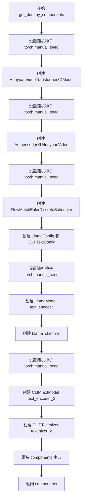

#### 带注释源码

```python
def get_dummy_components(self, num_layers: int = 1, num_single_layers: int = 1):
    """
    生成用于测试的虚拟组件
    
    参数:
        num_layers: transformer模型的主层数，默认值为1
        num_single_layers: transformer模型的单层数，默认值为1
    
    返回:
        包含所有虚拟组件的字典
    """
    # 设置随机种子确保测试可重复性
    torch.manual_seed(0)
    # 创建3D视频Transformer模型，包含指定的层数和注意力头配置
    transformer = HunyuanVideoTransformer3DModel(
        in_channels=4,              # 输入通道数
        out_channels=4,             # 输出通道数
        num_attention_heads=2,      # 注意力头数量
        attention_head_dim=10,      # 注意力头维度
        num_layers=num_layers,      # 主层数（可配置）
        num_single_layers=num_single_layers,  # 单层数（可配置）
        num_refiner_layers=1,       # 精炼层数量
        patch_size=1,               # 空间patch大小
        patch_size_t=1,              # 时间patch大小
        guidance_embeds=True,        # 启用引导嵌入
        text_embed_dim=16,          # 文本嵌入维度
        pooled_projection_dim=8,    # 池化投影维度
        rope_axes_dim=(2, 4, 4),    # 旋转位置编码轴维度
    )

    # 重新设置随机种子，确保VAE的初始化独立
    torch.manual_seed(0)
    # 创建变分自编码器用于视频的压缩和解压缩
    vae = AutoencoderKLHunyuanVideo(
        in_channels=3,              # RGB图像输入通道
        out_channels=3,             # RGB图像输出通道
        latent_channels=4,          # 潜在空间通道数
        down_block_types=(          # 下采样块类型
            "HunyuanVideoDownBlock3D",
            "HunyuanVideoDownBlock3D",
            "HunyuanVideoDownBlock3D",
            "HunyuanVideoDownBlock3D",
        ),
        up_block_types=(            # 上采样块类型
            "HunyuanVideoUpBlock3D",
            "HunyuanVideoUpBlock3D",
            "HunyuanVideoUpBlock3D",
            "HunyuanVideoUpBlock3D",
        ),
        block_out_channels=(8, 8, 8, 8),  # 块输出通道数
        layers_per_block=1,        # 每个块的层数
        act_fn="silu",             # 激活函数
        norm_num_groups=4,         # 规范化组数
        scaling_factor=0.476986,   # 缩放因子
        spatial_compression_ratio=8,   # 空间压缩比
        temporal_compression_ratio=4,  # 时间压缩比
        mid_block_add_attention=True,  # 中间块添加注意力
    )

    # 重新设置随机种子，确保调度器初始化独立
    torch.manual_seed(0)
    # 创建基于欧拉离散方法的流匹配调度器
    scheduler = FlowMatchEulerDiscreteScheduler(shift=7.0)

    # 配置Llama文本编码器的结构参数
    llama_text_encoder_config = LlamaConfig(
        bos_token_id=0,             # 句子开始token ID
        eos_token_id=2,             # 句子结束token ID
        hidden_size=16,            # 隐藏层维度
        intermediate_size=37,       # 中间层维度
        layer_norm_eps=1e-05,      # 层归一化epsilon
        num_attention_heads=4,     # 注意力头数量
        num_hidden_layers=2,       # 隐藏层数量
        pad_token_id=1,            # 填充token ID
        vocab_size=1000,           # 词汇表大小
        hidden_act="gelu",         # 隐藏层激活函数
        projection_dim=32,          # 投影维度
    )
    # 配置CLIP文本编码器的结构参数
    clip_text_encoder_config = CLIPTextConfig(
        bos_token_id=0,
        eos_token_id=2,
        hidden_size=8,
        intermediate_size=37,
        layer_norm_eps=1e-05,
        num_attention_heads=4,
        num_hidden_layers=2,
        pad_token_id=1,
        vocab_size=1000,
        hidden_act="gelu",
        projection_dim=32,
    )

    # 重新设置随机种子，确保文本编码器初始化独立
    torch.manual_seed(0)
    # 创建Llama文本编码器模型
    text_encoder = LlamaModel(llama_text_encoder_config)
    # 从预训练路径加载Llama分词器
    tokenizer = LlamaTokenizer.from_pretrained("finetrainers/dummy-hunyaunvideo", subfolder="tokenizer")

    # 重新设置随机种子，确保CLIP文本编码器初始化独立
    torch.manual_seed(0)
    # 创建CLIP文本编码器模型
    text_encoder_2 = CLIPTextModel(clip_text_encoder_config)
    # 从预训练路径加载CLIP分词器
    tokenizer_2 = CLIPTokenizer.from_pretrained("hf-internal-testing/tiny-random-clip")

    # 组装所有组件到字典中返回
    components = {
        "transformer": transformer,        # 3D视频Transformer模型
        "vae": vae,                         # 变分自编码器
        "scheduler": scheduler,            # 调度器
        "text_encoder": text_encoder,      # Llama文本编码器
        "text_encoder_2": text_encoder_2,   # CLIP文本编码器
        "tokenizer": tokenizer,             # Llama分词器
        "tokenizer_2": tokenizer_2,         # CLIP分词器
    }
    return components
```


### `HunyuanVideoPipelineFastTests.get_dummy_inputs`

该方法用于生成测试用的虚拟输入参数，构建一个包含提示词、生成器、推理步数、引导系数、图像尺寸、帧数等关键参数的字典，以支持视频生成Pipeline的单元测试。

参数：

- `device`：设备对象或字符串，指定生成随机数的设备（如"cpu"、"cuda"等）
- `seed`：整型，默认值为 `0`，用于设置随机数生成器的种子，确保测试可重复性

返回值：`Dict`，返回包含视频生成所需的所有虚拟输入参数的字典

#### 流程图

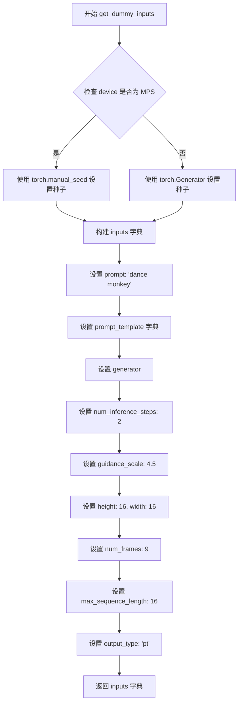

#### 带注释源码

```python
def get_dummy_inputs(self, device, seed=0):
    """
    生成用于测试的虚拟输入参数字典。
    
    参数:
        device: 目标设备，用于创建随机数生成器
        seed: 随机种子，默认值为0，确保测试可重复性
    
    返回:
        包含视频生成所需参数的字典
    """
    # 判断是否为Apple MPS设备，根据设备类型选择不同的随机数生成方式
    if str(device).startswith("mps"):
        # MPS设备使用torch.manual_seed直接设置CPU随机种子
        generator = torch.manual_seed(seed)
    else:
        # 其他设备（如CPU/CUDA）使用torch.Generator创建设备特定的随机生成器
        generator = torch.Generator(device=device).manual_seed(seed)

    # 构建完整的虚拟输入参数字典
    inputs = {
        "prompt": "dance monkey",  # 文本提示词
        "prompt_template": {      # 提示词模板配置
            "template": "{}",     # 简单的模板格式
            "crop_start": 0,       # 裁剪起始位置
        },
        "generator": generator,   # 随机数生成器，确保可重复性
        "num_inference_steps": 2, # 推理步数，测试用最小值
        "guidance_scale": 4.5,    # 引导系数，控制文本提示的影响程度
        "height": 16,            # 生成图像高度
        "width": 16,             # 生成图像宽度
        # 4 * k + 1 is the recommendation  # 注释：推荐帧数为4的倍数加1
        "num_frames": 9,         # 生成视频的帧数
        "max_sequence_length": 16, # 最大序列长度
        "output_type": "pt",     # 输出类型为PyTorch张量
    }
    return inputs
```


### `HunyuanVideoPipelineFastTests.test_inference`

这是一个单元测试方法，用于验证 HunyuanVideoPipeline 的推理功能是否正确。测试通过创建虚拟组件和输入，执行视频生成推理，并验证生成视频的形状和像素值是否符合预期。

参数：

- `self`：隐式参数，测试类实例本身

返回值：`None`，无返回值（测试方法）

#### 流程图

```mermaid
flowchart TD
    A[开始测试] --> B[设置设备为CPU]
    B --> C[调用get_dummy_components获取虚拟组件]
    C --> D[使用虚拟组件初始化HunyuanVideoPipeline管道]
    D --> E[将管道移至CPU设备]
    E --> F[设置进度条配置disable=None]
    F --> G[调用get_dummy_inputs获取虚拟输入]
    G --> H[执行管道推理: pipe\*\*inputs]
    H --> I[从结果中提取frames]
    I --> J[获取第一个生成的视频: video[0]]
    J --> K{验证视频形状是否为9x3x16x16}
    K -->|是| L[创建期望的tensor切片]
    K -->|否| M[抛出断言错误]
    L --> N[扁平化生成的视频并提取首尾各8个元素]
    N --> O{验证生成的切片与期望切片的差距是否在1e-3以内}
    O -->|是| P[测试通过]
    O -->|否| Q[抛出断言错误: 生成的视频与期望切片不匹配]
```

#### 带注释源码

```python
def test_inference(self):
    """测试HunyuanVideoPipeline的推理功能"""
    
    # 步骤1: 设置设备为CPU
    device = "cpu"

    # 步骤2: 获取虚拟组件（transformer, vae, scheduler, text_encoder等）
    components = self.get_dummy_components()
    
    # 步骤3: 使用虚拟组件初始化管道
    pipe = self.pipeline_class(**components)
    
    # 步骤4: 将管道移至指定设备
    pipe.to(device)
    
    # 步骤5: 设置进度条配置（disable=None表示启用进度条）
    pipe.set_progress_bar_config(disable=None)

    # 步骤6: 获取虚拟输入（包含prompt, generator, num_inference_steps等）
    inputs = self.get_dummy_inputs(device)
    
    # 步骤7: 执行管道推理，传入输入参数
    # 返回值是一个PipelineOutput对象，包含frames属性
    video = pipe(**inputs).frames
    
    # 步骤8: 获取生成的第一个视频（batch中只有一个）
    generated_video = video[0]
    
    # 步骤9: 断言验证生成的视频形状是否为(9, 3, 16, 16)
    # 9帧, 3通道, 16x16分辨率
    self.assertEqual(generated_video.shape, (9, 3, 16, 16))

    # 步骤10: 定义期望的输出切片值（用于数值验证）
    # fmt: off
    expected_slice = torch.tensor([0.3946, 0.4649, 0.3196, 0.4569, 0.3312, 0.3687, 0.3216, 0.3972, 0.4469, 0.3888, 0.3929, 0.3802, 0.3479, 0.3888, 0.3825, 0.3542])
    # fmt: on

    # 步骤11: 扁平化生成的视频张量
    generated_slice = generated_video.flatten()
    
    # 步骤12: 连接首8个和末8个元素（共16个元素），与expected_slice对比
    generated_slice = torch.cat([generated_slice[:8], generated_slice[-8:]])
    
    # 步骤13: 断言验证生成的切片与期望切片是否接近（容差1e-3）
    self.assertTrue(
        torch.allclose(generated_slice, expected_slice, atol=1e-3),
        "The generated video does not match the expected slice.",
    )
```


### `HunyuanVideoPipelineFastTests.test_callback_inputs`

该测试方法用于验证 HunyuanVideoPipeline 的回调功能是否正确实现，包括检查回调张量输入（callback_on_step_end_tensor_inputs）和步骤结束回调（callback_on_step_end）参数是否被正确支持，以及回调函数是否能正确接收和修改管道执行过程中的张量数据。

参数：

- `self`：隐式参数，类型为 `HunyuanVideoPipelineFastTests`，表示测试类实例本身

返回值：`None`，该方法为单元测试方法，通过 `assert` 语句验证结果，不返回具体数值

#### 流程图

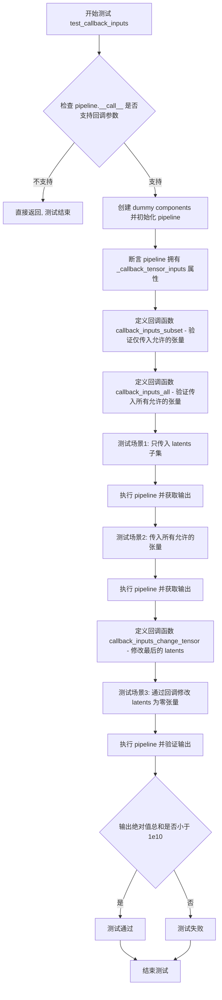

#### 带注释源码

```python
def test_callback_inputs(self):
    """
    测试 pipeline 的回调输入功能是否正确实现。
    验证 callback_on_step_end 和 callback_on_step_end_tensor_inputs 参数的支持情况。
    """
    # 获取 pipeline __call__ 方法的签名
    sig = inspect.signature(self.pipeline_class.__call__)
    # 检查是否存在回调张量输入参数
    has_callback_tensor_inputs = "callback_on_step_end_tensor_inputs" in sig.parameters
    # 检查是否存在步骤结束回调参数
    has_callback_step_end = "callback_on_step_end" in sig.parameters

    # 如果 pipeline 不支持这些回调参数，则直接返回（跳过测试）
    if not (has_callback_tensor_inputs and has_callback_step_end):
        return

    # 创建虚拟组件用于测试
    components = self.get_dummy_components()
    # 使用虚拟组件初始化 pipeline
    pipe = self.pipeline_class(**components)
    # 将 pipeline 移动到测试设备
    pipe = pipe.to(torch_device)
    # 设置进度条配置（禁用进度条）
    pipe.set_progress_bar_config(disable=None)
    
    # 断言 pipeline 必须具有 _callback_tensor_inputs 属性
    # 该属性定义了回调函数可以使用的张量变量列表
    self.assertTrue(
        hasattr(pipe, "_callback_tensor_inputs"),
        f" {self.pipeline_class} should have `_callback_tensor_inputs` that defines a list of tensor variables its callback function can use as inputs",
    )

    # 定义回调函数：验证只传入允许的张量子集
    def callback_inputs_subset(pipe, i, t, callback_kwargs):
        # 遍历回调参数中的所有张量
        for tensor_name, tensor_value in callback_kwargs.items():
            # 检查是否只传入了允许的张量输入
            assert tensor_name in pipe._callback_tensor_inputs
        return callback_kwargs

    # 定义回调函数：验证传入所有允许的张量
    def callback_inputs_all(pipe, i, t, callback_kwargs):
        # 遍历所有允许的张量输入
        for tensor_name in pipe._callback_tensor_inputs:
            # 验证每个允许的张量都存在于回调参数中
            assert tensor_name in callback_kwargs
        # 遍历回调参数中的所有张量
        for tensor_name, tensor_value in callback_kwargs.items():
            # 检查是否只传入了允许的张量输入
            assert tensor_name in pipe._callback_tensor_inputs
        return callback_kwargs

    # 获取虚拟输入数据
    inputs = self.get_dummy_inputs(torch_device)

    # 测试场景1：只传入 latents 作为回调张量
    inputs["callback_on_step_end"] = callback_inputs_subset
    inputs["callback_on_step_end_tensor_inputs"] = ["latents"]
    # 执行 pipeline 并获取第一帧输出
    output = pipe(**inputs)[0]

    # 测试场景2：传入所有允许的张量到回调函数
    inputs["callback_on_step_end"] = callback_inputs_all
    inputs["callback_on_step_end_tensor_inputs"] = pipe._callback_tensor_inputs
    # 执行 pipeline 并获取第一帧输出
    output = pipe(**inputs)[0]

    # 定义回调函数：在最后一步将 latents 修改为零张量
    def callback_inputs_change_tensor(pipe, i, t, callback_kwargs):
        # 判断是否为最后一步
        is_last = i == (pipe.num_timesteps - 1)
        if is_last:
            # 将 latents 修改为与原张量形状相同的零张量
            callback_kwargs["latents"] = torch.zeros_like(callback_kwargs["latents"])
        return callback_kwargs

    # 测试场景3：通过回调修改 latents 为零，验证输出
    inputs["callback_on_step_end"] = callback_inputs_change_tensor
    inputs["callback_on_step_end_tensor_inputs"] = pipe._callback_tensor_inputs
    # 执行 pipeline 并获取第一帧输出
    output = pipe(**inputs)[0]
    # 验证修改后的输出绝对值总和小于阈值
    assert output.abs().sum() < 1e10
```


### `HunyuanVideoPipelineFastTests.test_attention_slicing_forward_pass`

该测试方法用于验证 HunyuanVideoPipeline 的注意力切片（Attention Slicing）功能是否正常工作。注意力切片是一种内存优化技术，通过将注意力计算分片处理来降低显存占用。该测试会比较启用不同切片大小（slice_size=1 和 slice_size=2）时的推理结果与不启用切片时的结果，确保切片优化不会影响最终的输出质量。

参数：

- `test_max_difference`：`bool`，默认值为 `True`，指定是否测试最大像素差异
- `test_mean_pixel_difference`：`bool`，默认值为 `True`，指定是否测试平均像素差异
- `expected_max_diff`：`float`，默认值为 `1e-3`，允许的最大差异阈值

返回值：`None`，该方法为测试方法，无返回值，通过 assert 断言验证结果

#### 流程图

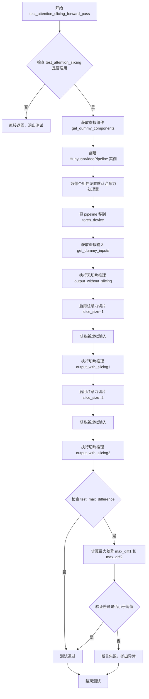

#### 带注释源码

```python
def test_attention_slicing_forward_pass(
    self, test_max_difference=True, test_mean_pixel_difference=True, expected_max_diff=1e-3
):
    """
    测试注意力切片功能的前向传播是否正确。
    
    注意力切片是一种内存优化技术，通过将注意力计算分块处理来减少显存占用。
    该测试确保启用切片后不会影响模型的输出质量。
    
    参数:
        test_max_difference: 是否测试最大像素差异
        test_mean_pixel_difference: 是否测试平均像素差异（当前未使用）
        expected_max_diff: 允许的最大差异阈值
    """
    # 检查是否需要执行注意力切片测试
    # 如果 test_attention_slicing 为 False，则跳过该测试
    if not self.test_attention_slicing:
        return

    # 获取虚拟组件（用于测试的模拟模型组件）
    components = self.get_dummy_components()
    
    # 使用虚拟组件创建 HunyuanVideoPipeline 实例
    pipe = self.pipeline_class(**components)
    
    # 为每个可训练组件设置默认的注意力处理器
    # 确保使用标准的注意力机制而非其他优化版本
    for component in pipe.components.values():
        if hasattr(component, "set_default_attn_processor"):
            component.set_default_attn_processor()
    
    # 将 pipeline 移动到指定的计算设备
    pipe.to(torch_device)
    
    # 配置进度条（disable=None 表示启用进度条）
    pipe.set_progress_bar_config(disable=None)

    # 获取生成器设备（CPU）
    generator_device = "cpu"
    
    # 获取虚拟输入参数
    inputs = self.get_dummy_inputs(generator_device)
    
    # 执行不启用注意力切片的基准推理
    output_without_slicing = pipe(**inputs)[0]

    # 启用注意力切片，slice_size=1 表示将注意力计算分成1块
    pipe.enable_attention_slicing(slice_size=1)
    
    # 使用新的随机种子获取新输入（确保测试独立性）
    inputs = self.get_dummy_inputs(generator_device)
    
    # 执行启用切片（slice_size=1）的推理
    output_with_slicing1 = pipe(**inputs)[0]

    # 启用注意力切片，slice_size=2 表示将注意力计算分成2块
    pipe.enable_attention_slicing(slice_size=2)
    
    # 获取新的虚拟输入
    inputs = self.get_dummy_inputs(generator_device)
    
    # 执行启用切片（slice_size=2）的推理
    output_with_slicing2 = pipe(**inputs)[0]

    # 如果需要测试最大差异
    if test_max_difference:
        # 计算 slice_size=1 与无切片的差异
        max_diff1 = np.abs(to_np(output_with_slicing1) - to_np(output_without_slicing)).max()
        
        # 计算 slice_size=2 与无切片的差异
        max_diff2 = np.abs(to_np(output_with_slicing2) - to_np(output_without_slicing)).max()
        
        # 断言：注意力切片不应影响推理结果
        # 两个差异中的最大值应小于预期阈值
        self.assertLess(
            max(max_diff1, max_diff2),
            expected_max_diff,
            "Attention slicing should not affect the inference results",
        )
```


### `HunyuanVideoPipelineFastTests.test_vae_tiling`

该方法用于测试 HunyuanVideoPipeline 的 VAE Tiling（VAE 分块）功能。通过对比启用分块与未启用分块两种情况下的推理输出差异，验证 VAE 分块机制不会对生成结果产生显著影响，从而确保分块优化策略的有效性。

参数：

- `expected_diff_max`：`float`，默认值 `0.2`，期望输出之间的最大差异值（方法内部实际覆盖为 0.6）

返回值：`None`，无返回值。该方法通过 `unittest.TestCase.assertLess` 断言来验证结果，而非通过返回值传递。

#### 流程图

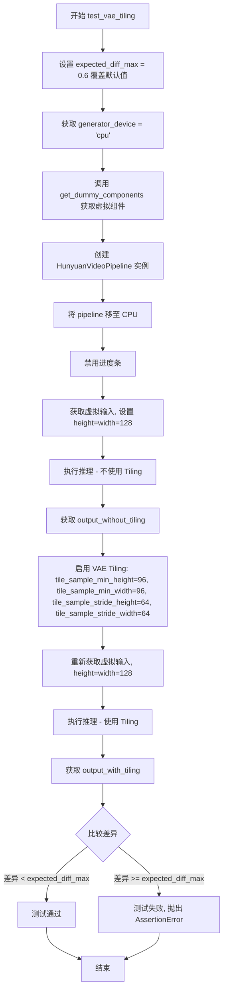

#### 带注释源码

```python
def test_vae_tiling(self, expected_diff_max: float = 0.2):
    # 该测试方法的预期最大差异默认值为 0.2，但实际测试需要更高的容差
    # 这里覆盖为 0.6 以适应更宽松的数值比较需求
    expected_diff_max = 0.6
    
    # 设置生成器设备为 CPU
    generator_device = "cpu"
    
    # 获取用于测试的虚拟组件（transformer, vae, scheduler, text_encoder 等）
    components = self.get_dummy_components()

    # 使用虚拟组件实例化 HunyuanVideoPipeline 管道
    pipe = self.pipeline_class(**components)
    
    # 将管道移至 CPU 设备
    pipe.to("cpu")
    
    # 配置进度条为禁用状态（不显示推理进度）
    pipe.set_progress_bar_config(disable=None)

    # --- 第一次推理：未启用 Tiling ---
    # 获取虚拟输入参数（包含 prompt, generator, num_inference_steps 等）
    inputs = self.get_dummy_inputs(generator_device)
    
    # 设置较高的分辨率 128x128 以测试 Tiling 效果
    inputs["height"] = inputs["width"] = 128
    
    # 执行推理，获取不使用 Tiling 的输出结果
    output_without_tiling = pipe(**inputs)[0]

    # --- 启用 VAE Tiling ---
    # 配置 VAE 分块参数：
    # - tile_sample_min_height/width: 最小分块高度/宽度
    # - tile_sample_stride_height/width: 分块滑动步长
    pipe.vae.enable_tiling(
        tile_sample_min_height=96,
        tile_sample_min_width=96,
        tile_sample_stride_height=64,
        tile_sample_stride_width=64,
    )
    
    # 重新获取虚拟输入（确保使用新的随机种子生成新的潜在向量）
    inputs = self.get_dummy_inputs(generator_device)
    inputs["height"] = inputs["width"] = 128
    
    # 执行推理，获取使用 Tiling 的输出结果
    output_with_tiling = pipe(**inputs)[0]

    # --- 验证结果 ---
    # 将 PyTorch 张量转换为 NumPy 数组计算差异
    # 断言：使用 Tiling 和不使用 Tiling 的输出差异应小于预期最大差异
    # 这样可以确保 VAE Tiling 优化不会显著影响生成质量
    self.assertLess(
        (to_np(output_without_tiling) - to_np(output_with_tiling)).max(),
        expected_diff_max,
        "VAE tiling should not affect the inference results",
    )
```


### `HunyuanVideoPipelineFastTests.test_inference_batch_consistent`

这是一个被跳过的测试方法，用于验证 HunyuanVideoPipeline 在批量推理时的一致性。由于测试使用的是小词汇量的虚拟模型，长提示词会导致嵌入查找错误，因此该测试被禁用。

参数：

- `self`：无，测试类实例本身

返回值：无，该方法没有返回值（`None`）

#### 流程图

```mermaid
flowchart TD
    A[开始] --> B{检查是否需要跳过测试}
    B -->|是| C[跳过测试 - pass]
    B -->|否| D[执行批量一致性测试逻辑]
    C --> E[结束]
    D --> E
    
    style A fill:#f9f,color:#000
    style E fill:#f9f,color:#000
    style C fill:#ccc,color:#000
    style D fill:#ffc,color:#000
```

#### 带注释源码

```python
@unittest.skip(
    "A very small vocab size is used for fast tests. So, Any kind of prompt other than the empty default used in other tests will lead to a embedding lookup error. This test uses a long prompt that causes the error."
)
def test_inference_batch_consistent(self):
    """
    测试批量推理一致性。
    
    该测试方法旨在验证 HunyuanVideoPipeline 在处理批量提示词时，
    单个提示词的输出应与批量中对应位置的输出完全一致。
    
    但由于测试环境使用的虚拟模型词汇量极小（vocab_size=1000），
    任何非默认的空提示词都会导致嵌入查找错误，因此该测试被跳过。
    """
    pass
```

---

#### 补充信息

| 项目 | 描述 |
|------|------|
| **所属类** | `HunyuanVideoPipelineFastTests` |
| **方法类型** | 测试方法（unittest） |
| **跳过原因** | 虚拟模型词汇量太小（vocab_size=1000），长提示词会导致 `embedding lookup error` |
| **设计意图** | 验证批量推理时单提示词与批量中对应提示词的输出一致性 |
| **技术债务** | 需要创建一个具有足够词汇量的虚拟模型来支持此测试 |


### `HunyuanVideoPipelineFastTests.test_inference_batch_single_identical`

这是一个被跳过的测试方法，用于验证批量推理时单张图像的输出与单独推理时的输出是否一致。由于测试使用极小的词汇表，任何非默认的prompt都会导致embedding查找错误，因此该测试被跳过。

参数：

- `self`：`HunyuanVideoPipelineFastTests` 类型，指向测试类实例本身

返回值：`None`，无返回值（测试方法被跳过且未实现）

#### 流程图

```mermaid
flowchart TD
    A[开始测试] --> B{检查词汇表大小}
    B -->|词汇表过小| C[跳过测试]
    B -->|词汇表正常| D[执行批量推理]
    D --> E[执行单独推理]
    E --> F[比较输出结果]
    F --> G[断言一致性]
    
    style C fill:#ffcccc
    style G fill:#ccffcc
```

#### 带注释源码

```python
@unittest.skip(
    "A very small vocab size is used for fast tests. So, Any kind of prompt other than the empty default used in other tests will lead to a embedding lookup error. This test uses a long prompt that causes the error."
)
def test_inference_batch_single_identical(self):
    """
    测试批量推理时，单个样本的结果应与单独推理时的结果完全一致。
    
    该测试用于验证pipeline的确定性和批次处理的一致性，
    确保batch_size=1时的输出与单独调用pipe()的输出相同。
    
    注意：由于dummy模型使用的词汇表非常小(1000)，
    而该测试使用的长prompt会导致embedding查找越界，
    因此该测试被暂时跳过。
    """
    pass
```

## 关键组件


### HunyuanVideoPipeline

HunyuanVideoPipeline是腾讯混元视频生成管道的核心类，封装了从文本提示生成视频的完整流程，包括文本编码、latent空间采样、Transformer去噪、VAE解码等步骤。

### HunyuanVideoTransformer3DModel

3D视频变换器模型，负责在latent空间进行去噪处理，支持空间和时间维度的注意力机制。

### AutoencoderKLHunyuanVideo

混合视频VAE编码器-解码器模型，支持tiling分块解码以处理高分辨率视频，将RGB视频编码到latent空间并解码回归。

### FlowMatchEulerDiscreteScheduler

基于Flow Matching的Euler离散调度器，用于去噪过程中的时间步调度，支持shift参数控制采样轨迹。

### FasterCacheConfig

快速缓存配置类，定义了空间注意力块跳过范围、时间步跳过范围、无条件批次跳过策略以及注意力权重回调函数，用于加速推理。

### PipelineTesterMixin

管道测试混合基类，提供了推理一致性、批次处理、回调输入等通用测试方法。

### FasterCacheTesterMixin

快速缓存测试混合类，验证FasterCache优化策略的正确性和性能影响。

### 文本编码器双通道

LlamaModel和CLIPTextModel分别作为主文本编码器和辅助文本编码器，将文本提示转换为高维embedding，支持 classifier-free guidance。

### Attention Slicing机制

通过set_default_attn_processor和enable_attention_slicing方法，将注意力计算分片处理以降低显存峰值。

### VAE Tiling机制

通过enable_tiling方法实现分块编码/解码，支持tile_sample_min_height/width和stride参数配置，处理超大分辨率视频。

### Callback回调机制

支持callback_on_step_end和callback_on_step_end_tensor_inputs参数，允许在每个推理步骤结束时自定义处理latents等张量。

### Test Configuration

包含faster_cache_config预配置、test_layerwise_casting、test_group_offloading等测试标志，用于验证不同优化策略。


## 问题及建议


### 已知问题

-   **硬编码的魔法数字**：代码中存在多个未加注释的硬编码值，如`num_frames = 9`（注释仅为"4 * k + 1 is the recommendation"）、`expected_diff_max = 0.6`、`tile_sample_min_height=96`等，这些值散落在各处难以维护。
-   **测试跳过未提供替代方案**：`test_inference_batch_consistent`和`test_inference_batch_single_identical`两个测试被跳过，理由是小词汇表会导致embedding lookup错误，但未提供任何替代测试用例来覆盖批量推理场景。
-   **TODO未完成**：`# TODO(aryan): Create a dummy gemma model with smol vocab size`表明存在待完成的工作，但长期未实现，导致相关测试无法运行。
-   **资源加载使用硬编码路径**：`LlamaTokenizer.from_pretrained("finetrainers/dummy-hunyaunvideo", subfolder="tokenizer")`和`CLIPTokenizer.from_pretrained("hf-internal-testing/tiny-random-clip")`使用固定外部路径，测试环境无网络时会失败。
-   **设备处理不一致**：使用`str(device).startswith("mps")`进行特殊判断，这种字符串匹配方式脆弱且易出错，应使用统一的设备枚举或配置。
-   **命名不一致**：项目中同时存在"HunyuanVideo"和"hunyaunvideo"（大小写）、"dummy"和"finetrainers"（数据源命名）等不一致的命名约定。
-   **动态API检查冗余**：`test_callback_inputs`中使用`inspect.signature`和字符串参数名检查来验证API，这种动态检查不如静态类型检查可靠，且每次运行都有性能开销。

### 优化建议

-   **提取配置常量**：将所有魔法数字和硬编码配置值提取到类级别常量或配置类中，如`NUM_FRAMES = 9`、`DEFAULT_TILE_STRIDE = 64`等，并添加文档注释说明其含义和来源。
-   **实现批量测试或使用mock**：创建基于mock的dummy text encoder以支持小词汇表，或使用更合理的词汇表大小配置来替代跳过批量测试。
-   **添加本地dummy模型**：将外部依赖的tokenizer和text encoder模型替换为本地生成的dummy组件，或在测试套件中提供离线fallback机制。
-   **统一设备处理逻辑**：引入设备辅助函数或使用transformers/diffusers库提供的标准设备枚举来处理MPS、CUDA、CPU等设备差异。
-   **统一命名规范**：建立并遵循项目命名规范，统一使用HunyuanVideo（或hunyuan_video）命名风格，数据源命名保持一致。
-   **使用skipIf替代动态return**：对于条件跳过测试，使用`@unittest.skipIf`装饰器而非在方法内部使用`return`，使测试意图更明确。
-   **补充文档**：为`get_dummy_components`和`get_dummy_inputs`方法添加文档说明，解释各参数的测试用途和约束条件。

## 其它


### 设计目标与约束

本测试文件的设计目标是通过单元测试验证HunyuanVideoPipeline的核心功能正确性，包括视频生成推理、注意力切片、VAE平铺、缓存机制等。主要约束包括：1) 使用虚拟（dummy）组件而非真实模型以加速测试；2) 词汇表大小限制导致部分批处理测试被跳过；3) 针对CPU设备进行测试；4) 使用特定的随机种子确保可重复性。

### 错误处理与异常设计

测试中使用了`@unittest.skip`装饰器处理两类预期错误：1) `test_inference_batch_consistent`和`test_inference_batch_single_identical`因虚拟模型词汇表过小（仅1000），长prompt会导致embedding lookup错误而被跳过；2) 测试通过`torch.allclose`进行数值误差检查，使用`atol=1e-3`的容差范围；3) VAE tiling测试使用更大的容差（0.6）以适应不同实现。

### 外部依赖与接口契约

主要依赖包括：1) `diffusers`库提供的HunyuanVideoPipeline、AutoencoderKLHunyuanVideo、FlowMatchEulerDiscreteScheduler等；2) `transformers`库提供的CLIPTextConfig、CLIPTextModel、LlamaConfig、LlamaModel等；3) 测试框架unittest、numpy、torch。接口契约方面，pipeline接受特定的参数集合（prompt、height、width、guidance_scale等），并返回包含frames的输出对象。

### 测试覆盖范围

测试覆盖了以下功能模块：1) 基础推理功能（test_inference）；2) 回调机制（test_callback_inputs）；3) 注意力切片（test_attention_slicing_forward_pass）；4) VAE平铺（test_vae_tiling）；5) FasterCache缓存机制（通过FasterCacheTesterMixin）；6) PyramidAttentionBroadcast（通过PyramidAttentionBroadcastTesterMixin）；7) FirstBlockCache（通过FirstBlockCacheTesterMixin）；8) TaylorSeerCache（通过TaylorSeerCacheTesterMixin）。

### 性能基准与配置

关键性能配置包括：1) FasterCacheConfig配置了spatial_attention_block_skip_range=2、spatial_attention_timestep_skip_range=(-1, 901)等优化参数；2) 测试使用num_inference_steps=2以加速测试；3) 生成视频规格为9帧、3通道、16x16分辨率；4) guidance_scale=4.5用于引导生成；5) 使用torch.manual_seed(0)确保确定性。

### 测试环境要求

测试环境要求包括：1) 设备支持：主要针对CPU设备测试，MPS设备有特殊处理；2) Python依赖：需要numpy、torch、transformers、diffusers；3) 内存要求：虚拟组件使用较小的配置（hidden_size=16, intermediate_size=37等）以降低内存占用；4) 磁盘空间：需要加载dummy tokenizer模型。

### 测试数据规范

测试使用的输入输出规范：1) prompt示例："dance monkey"；2) prompt_template格式：{"template": "{}", "crop_start": 0}；3) 输出格式：torch tensor，shape为(9, 3, 16, 16)；4) 期望slice用于验证：16个浮点数值用于结果校验；5) num_frames=9（满足4*k+1的推荐格式）；6) max_sequence_length=16。

### 组件初始化流程

组件初始化流程遵循特定顺序：1) 首先创建HunyuanVideoTransformer3DModel；2) 然后创建AutoencoderKLHunyuanVideo；3) 创建FlowMatchEulerDiscreteScheduler；4) 创建LlamaConfig和CLIPTextConfig；5) 基于配置创建LlamaModel和CLIPTextModel；6) 加载tokenizers；7) 组装components字典返回。

### 关键配置参数

关键配置参数说明：1) transformer: in_channels=4, out_channels=4, num_attention_heads=2, attention_head_dim=10；2) vae: latent_channels=4, spatial_compression_ratio=8, temporal_compression_ratio=4；3) scheduler: shift=7.0；4) text_encoder: hidden_size=16, projection_dim=32, vocab_size=1000；5) FasterCache: attention_weight_callback使用lambda函数返回0.5。

### 测试方法继承结构

测试类通过多重继承组合了多个测试mixin：1) PipelineTesterMixin - 基础pipeline测试；2) PyramidAttentionBroadcastTesterMixin - 金字塔注意力广播测试；3) FasterCacheTesterMixin - 快速缓存测试；4) FirstBlockCacheTesterMixin - 首块缓存测试；5) TaylorSeerCacheTesterMixin - TaylorSeer缓存测试。这种设计允许复用通用测试逻辑，同时保持测试类的职责分离。


    