# `diffusers\tests\pipelines\hunyuan_video\test_hunyuan_video_framepack.py` 详细设计文档

这是一个针对HunyuanVideoFramepackPipeline（腾讯混元视频生成管道）的单元测试文件，包含了多个测试用例以验证视频生成管道的核心功能，包括推理、注意力切片、VAE平铺、浮点精度等关键特性的正确性。

## 整体流程

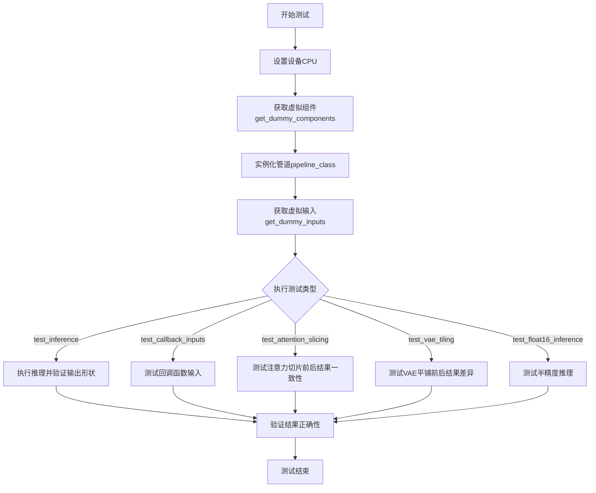

## 类结构

```
unittest.TestCase
└── HunyuanVideoFramepackPipelineFastTests (继承PipelineTesterMixin, PyramidAttentionBroadcastTesterMixin, FasterCacheTesterMixin)
```

## 全局变量及字段


### `enable_full_determinism`
    
启用完全确定性以确保测试可复现性

类型：`function`
    


### `HunyuanVideoFramepackPipelineFastTests.pipeline_class`
    
待测试的管道类

类型：`type[HunyuanVideoFramepackPipeline]`
    


### `HunyuanVideoFramepackPipelineFastTests.params`
    
管道调用参数集合

类型：`frozenset`
    


### `HunyuanVideoFramepackPipelineFastTests.batch_params`
    
批量参数集合

类型：`frozenset`
    


### `HunyuanVideoFramepackPipelineFastTests.required_optional_params`
    
可选必需参数集合

类型：`frozenset`
    


### `HunyuanVideoFramepackPipelineFastTests.supports_dduf`
    
是否支持DDUF

类型：`bool`
    


### `HunyuanVideoFramepackPipelineFastTests.test_xformers_attention`
    
是否测试xformers注意力

类型：`bool`
    


### `HunyuanVideoFramepackPipelineFastTests.test_layerwise_casting`
    
是否测试分层类型转换

类型：`bool`
    


### `HunyuanVideoFramepackPipelineFastTests.test_group_offloading`
    
是否测试组卸载

类型：`bool`
    


### `HunyuanVideoFramepackPipelineFastTests.faster_cache_config`
    
快速缓存配置

类型：`FasterCacheConfig`
    
    

## 全局函数及方法


### `enable_full_determinism`

该函数用于启用完全确定性测试配置，通过设置随机种子和环境变量确保测试结果的可复现性。

参数：**无参数**

返回值：**无返回值**（`None`）

#### 流程图

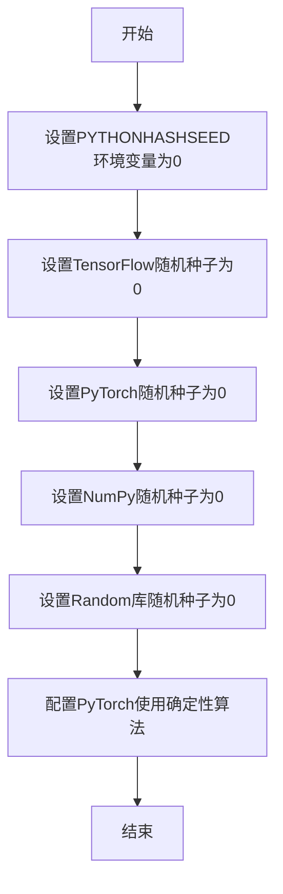

#### 带注释源码

```
# 该函数定义位于 testing_utils 模块中，当前文件通过导入调用
# 当前代码中调用方式如下：

enable_full_determinism()

# 函数调用位置在类定义之前，确保后续所有测试用例都在确定性环境下运行
```

---

**注意**：提供的代码片段中仅包含该函数的导入和调用语句，函数的具体定义（源码）位于 `testing_utils` 模块中，未在此代码文件中展示。从调用方式 `enable_full_determinism()` 可以推断该函数不接受任何参数，且不返回任何值（返回 `None`）。


### `to_np`

将 PyTorch 张量（Tensor）转换为 NumPy 数组的辅助函数，主要用于测试中比较模型输出与预期结果。

参数：

-  `tensor`：`torch.Tensor`，需要转换的 PyTorch 张量对象

返回值：`numpy.ndarray`，转换后的 NumPy 数组

#### 流程图

```mermaid
flowchart TD
    A[开始] --> B{输入是否为torch.Tensor}
    B -- 是 --> C[调用tensor.cpu.detach().numpy]
    B -- 否 --> D[直接返回输入]
    C --> E[返回NumPy数组]
    D --> E
```

#### 带注释源码

```
# 该函数定义在 test_pipelines_common 模块中
# 由于代码中未显示完整源码，以下为推断的实现逻辑：

def to_np(tensor):
    """
    将 PyTorch 张量转换为 NumPy 数组
    
    参数:
        tensor: torch.Tensor - PyTorch 张量
        
    返回值:
        numpy.ndarray - 转换后的 NumPy 数组
    """
    # 如果输入已经是 NumPy 数组，直接返回
    if isinstance(tensor, np.ndarray):
        return tensor
    
    # 确保张量在 CPU 上，并分离计算图，转换为 NumPy
    return tensor.cpu().detach().numpy()
```

#### 使用示例

在代码中的实际使用：

```python
# 在 test_attention_slicing_forward_pass 方法中
max_diff1 = np.abs(to_np(output_with_slicing1) - to_np(output_without_slicing)).max()

# 在 test_vae_tiling 方法中
(to_np(output_without_tiling) - to_np(output_with_tiling)).max()
```

#### 注意事项

1. **设备处理**：使用 `.cpu()` 确保张量从 GPU 移动到 CPU
2. **梯度分离**：使用 `.detach()` 分离计算图，避免影响梯度计算
3. **类型判断**：如果输入已经是 NumPy 数组，直接返回避免重复转换


### `torch_device`

获取测试设备配置，用于在测试中指定模型和数据所使用的计算设备（如 CPU、CUDA、MPS 等）。

参数： 无

返回值：`str`，返回测试设备字符串，如 "cpu"、"cuda" 或 "mps"

#### 流程图

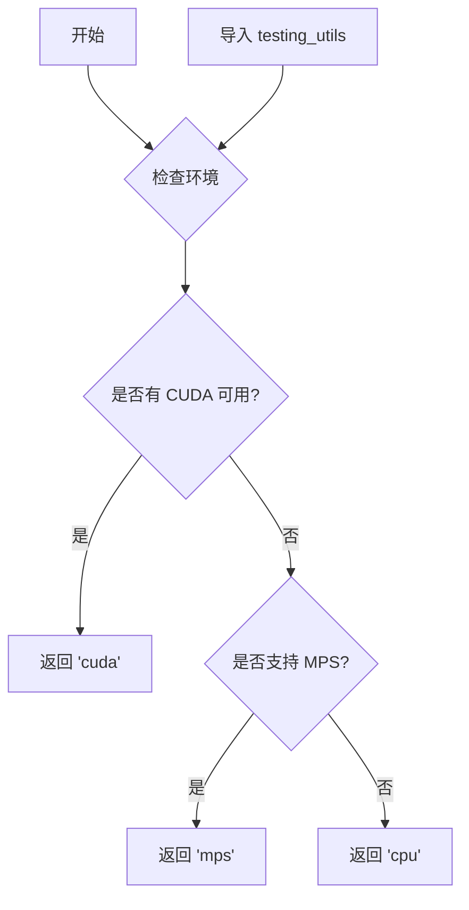

#### 带注释源码

```
# 从 testing_utils 模块导入 torch_device
# 这个函数/变量在 testing_utils.py 中定义
# 代码文件本身没有直接定义 torch_device，而是从外部导入
from ...testing_utils import (
    enable_full_determinism,
    torch_device,  # <-- 从外部模块导入的设备配置
)
```

#### 使用示例源码

```python
def test_callback_inputs(self):
    # ...
    pipe = pipe.to(torch_device)  # 将管道移动到 torch_device 指定的设备
    pipe.set_progress_bar_config(disable=None)
    # ...

def test_attention_slicing_forward_pass(self, ...):
    # ...
    pipe.to(torch_device)  # 同样使用 torch_device 将管道移动到测试设备
    # ...
```

#### 说明

由于 `torch_device` 是从 `...testing_utils` 模块导入的外部函数/变量，其完整源代码不在当前文件中。根据命名约定和代码中的使用方式，它应该是一个返回测试设备字符串的函数或全局变量。在 HuggingFace diffusers 项目中，`torch_device` 通常用于根据环境自动选择最合适的测试设备（优先 CUDA，其次 MPS，最后 CPU），以确保测试能够在可用的硬件上运行。


### `HunyuanVideoFramepackPipelineFastTests.get_dummy_components`

该方法用于创建虚拟管道组件，为单元测试提供所需的各类模型和配置，包括Transformer、VAE、Scheduler、Text Encoder等核心组件。

参数：

- `num_layers`：`int`，可选，默认为1，指定Transformer模型的层数
- `num_single_layers`：`int`，可选，默认为1，指定Transformer模型的单层数量

返回值：`dict`，包含虚拟管道所有组件的字典，包括transformer、vae、scheduler、text_encoder、text_encoder_2、tokenizer、tokenizer_2、feature_extractor和image_encoder

#### 流程图

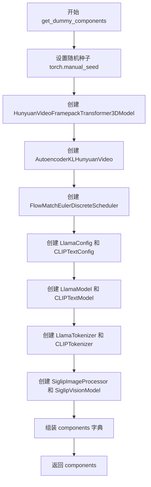

#### 带注释源码

```python
def get_dummy_components(self, num_layers: int = 1, num_single_layers: int = 1):
    """
    创建虚拟管道组件用于测试
    
    参数:
        num_layers: Transformer模型的层数，默认为1
        num_single_layers: Transformer模型的单层数量，默认为1
    
    返回:
        dict: 包含所有虚拟组件的字典
    """
    # 设置随机种子以确保可重复性
    torch.manual_seed(0)
    
    # 创建3D变换器模型配置
    transformer = HunyuanVideoFramepackTransformer3DModel(
        in_channels=4,              # 输入通道数
        out_channels=4,             # 输出通道数
        num_attention_heads=2,      # 注意力头数量
        attention_head_dim=10,      # 注意力头维度
        num_layers=num_layers,      # 模型层数
        num_single_layers=num_single_layers,  # 单层数量
        num_refiner_layers=1,       # Refiner层数
        patch_size=2,               # 空间patch大小
        patch_size_t=1,             # 时间patch大小
        guidance_embeds=True,       # 是否使用guidance嵌入
        text_embed_dim=16,          # 文本嵌入维度
        pooled_projection_dim=8,    # 池化投影维度
        rope_axes_dim=(2, 4, 4),    # RoPE轴维度
        image_condition_type=None,  # 图像条件类型
        has_image_proj=True,        # 是否有图像投影
        image_proj_dim=32,          # 图像投影维度
        has_clean_x_embedder=True,  # 是否有clean x embedder
    )

    # 设置随机种子
    torch.manual_seed(0)
    
    # 创建VAE模型配置
    vae = AutoencoderKLHunyuanVideo(
        in_channels=3,              # RGB输入通道
        out_channels=3,             # RGB输出通道
        latent_channels=4,          # 潜在空间通道数
        down_block_types=(          # 下采样块类型
            "HunyuanVideoDownBlock3D",
            "HunyuanVideoDownBlock3D",
            "HunyuanVideoDownBlock3D",
            "HunyuanVideoDownBlock3D",
        ),
        up_block_types=(            # 上采样块类型
            "HunyuanVideoUpBlock3D",
            "HunyuanVideoUpBlock3D",
            "HunyuanVideoUpBlock3D",
            "HunyuanVideoUpBlock3D",
        ),
        block_out_channels=(8, 8, 8, 8),  # 块输出通道
        layers_per_block=1,         # 每块层数
        act_fn="silu",              # 激活函数
        norm_num_groups=4,          # 归一化组数
        scaling_factor=0.476986,    # 缩放因子
        spatial_compression_ratio=8,   # 空间压缩比
        temporal_compression_ratio=4,  # 时间压缩比
        mid_block_add_attention=True,  # 中间块是否加注意力
    )

    # 设置随机种子
    torch.manual_seed(0)
    
    # 创建调度器
    scheduler = FlowMatchEulerDiscreteScheduler(shift=7.0)

    # 创建Llama文本编码器配置
    llama_text_encoder_config = LlamaConfig(
        bos_token_id=0,             # 开始 token id
        eos_token_id=2,             # 结束 token id
        hidden_size=16,             # 隐藏层大小
        intermediate_size=37,       # 中间层大小
        layer_norm_eps=1e-05,       # 层归一化epsilon
        num_attention_heads=4,      # 注意力头数量
        num_hidden_layers=2,        # 隐藏层数量
        pad_token_id=1,             # 填充token id
        vocab_size=1000,            # 词汇表大小
        hidden_act="gelu",          # 隐藏层激活函数
        projection_dim=32,          # 投影维度
    )
    
    # 创建CLIP文本编码器配置
    clip_text_encoder_config = CLIPTextConfig(
        bos_token_id=0,
        eos_token_id=2,
        hidden_size=8,
        intermediate_size=37,
        layer_norm_eps=1e-05,
        num_attention_heads=4,
        num_hidden_layers=2,
        pad_token_id=1,
        vocab_size=1000,
        hidden_act="gelu",
        projection_dim=32,
    )

    # 设置随机种子并创建文本编码器
    torch.manual_seed(0)
    text_encoder = LlamaModel(llama_text_encoder_config)
    
    # 加载分词器
    tokenizer = LlamaTokenizer.from_pretrained("finetrainers/dummy-hunyaunvideo", subfolder="tokenizer")

    # 设置随机种子并创建第二个文本编码器
    torch.manual_seed(0)
    text_encoder_2 = CLIPTextModel(clip_text_encoder_config)
    tokenizer_2 = CLIPTokenizer.from_pretrained("hf-internal-testing/tiny-random-clip")

    # 加载图像处理器和图像编码器
    feature_extractor = SiglipImageProcessor.from_pretrained(
        "hf-internal-testing/tiny-random-SiglipVisionModel", 
        size={"height": 30, "width": 30}
    )
    image_encoder = SiglipVisionModel.from_pretrained("hf-internal-testing/tiny-random-SiglipVisionModel")

    # 组装所有组件到字典中
    components = {
        "transformer": transformer,
        "vae": vae,
        "scheduler": scheduler,
        "text_encoder": text_encoder,
        "text_encoder_2": text_encoder_2,
        "tokenizer": tokenizer,
        "tokenizer_2": tokenizer_2,
        "feature_extractor": feature_extractor,
        "image_encoder": image_encoder,
    }
    
    # 返回组件字典
    return components
```


### `HunyuanVideoFramepackPipelineFastTests.get_dummy_inputs`

该方法用于创建虚拟输入数据（dummy inputs），为 `HunyuanVideoFramepackPipeline` 管道测试生成包含图像、提示词、生成器及各种推理参数的测试数据集，确保测试在受控的随机条件下运行。

参数：

- `device`：`torch.device`，指定生成张量所在的设备（如 "cpu"、"cuda" 等）
- `seed`：`int`，随机种子，默认值为 0，用于确保测试的可重复性

返回值：`Dict`，包含以下键值对的字典：

| 键名 | 类型 | 描述 |
|------|------|------|
| `image` | `PIL.Image.Image` | RGB 格式的虚拟图像 |
| `prompt` | `str` | 输入提示词 |
| `prompt_template` | `Dict` | 提示词模板配置 |
| `generator` | `torch.Generator` | 随机数生成器 |
| `num_inference_steps` | `int` | 推理步数 |
| `guidance_scale` | `float` | 引导系数 |
| `height` | `int` | 生成图像高度 |
| `width` | `int` | 生成图像宽度 |
| `num_frames` | `int` | 生成帧数 |
| `latent_window_size` | `int` | 潜在窗口大小 |
| `max_sequence_length` | `int` | 最大序列长度 |
| `output_type` | `str` | 输出类型 |

#### 流程图

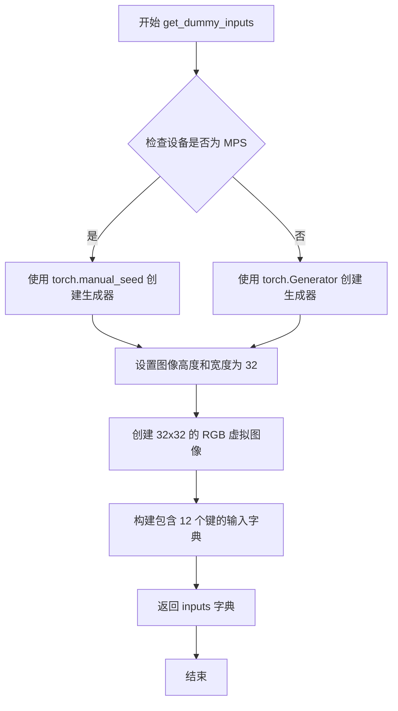

#### 带注释源码

```python
def get_dummy_inputs(self, device, seed=0):
    """
    生成用于测试的虚拟输入数据
    
    参数:
        device: torch.device - 计算设备
        seed: int - 随机种子，默认 0
    
    返回:
        Dict: 包含管道推理所需的所有输入参数
    """
    # 判断是否为 Apple MPS 设备，MPS 不支持 torch.Generator
    if str(device).startswith("mps"):
        # MPS 设备使用简化的随机数生成方式
        generator = torch.manual_seed(seed)
    else:
        # 其他设备（CPU/CUDA）使用完整的 Generator 对象
        generator = torch.Generator(device=device).manual_seed(seed)

    # 设置虚拟图像的尺寸（测试用小尺寸）
    image_height = 32
    image_width = 32
    
    # 创建一个 32x32 的 RGB 虚拟图像（所有像素为黑色）
    image = Image.new("RGB", (image_width, image_height))
    
    # 构建完整的输入参数字典
    inputs = {
        "image": image,                              # 输入图像
        "prompt": "dance monkey",                    # 文本提示
        "prompt_template": {                         # 提示词模板配置
            "template": "{}",                        # 简单模板
            "crop_start": 0,                         # 裁剪起始位置
        },
        "generator": generator,                      # 随机生成器
        "num_inference_steps": 2,                    # 推理步数（测试用小值）
        "guidance_scale": 4.5,                       # Classifier-free guidance 系数
        "height": image_height,                      # 输出高度
        "width": image_width,                        # 输出宽度
        "num_frames": 9,                             # 生成帧数
        "latent_window_size": 3,                     # 潜在空间窗口大小
        "max_sequence_length": 256,                  # 最大序列长度
        "output_type": "pt",                         # 输出为 PyTorch 张量
    }
    return inputs
```


### `HunyuanVideoFramepackPipelineFastTests.test_inference`

这是一个单元测试方法，用于验证 HunyuanVideoFramepackPipeline 的基本推理功能。测试通过创建虚拟组件和输入，执行视频生成推理，并验证生成视频的形状和像素值是否符合预期，确保管道核心功能正常工作。

参数：
- `self`：实例方法隐含参数，类型为 `HunyuanVideoFramepackPipelineFastTests`，表示测试类实例本身

返回值：`None`，因为 unittest 测试方法不返回值，结果通过断言验证

#### 流程图

```mermaid
flowchart TD
    A[开始 test_inference] --> B[设置设备为 CPU]
    B --> C[调用 get_dummy_components 获取虚拟组件]
    C --> D[使用虚拟组件初始化 pipeline_class]
    D --> E[将管道移动到 CPU 设备]
    E --> F[设置进度条配置]
    F --> G[调用 get_dummy_inputs 获取虚拟输入]
    G --> H[执行管道推理: pipe(**inputs)]
    H --> I[获取生成的视频帧: .frames]
    I --> J[提取第一个视频: video[0]]
    J --> K[断言视频形状为 (13, 3, 32, 32)]
    K --> L[创建期望的像素值张量]
    L --> M[提取生成视频的切片]
    M --> N[断言生成切片与期望值接近]
    N --> O{断言通过?}
    O -->|是| P[测试通过]
    O -->|否| Q[抛出断言错误]
    P --> R[结束]
    Q --> R
```

#### 带注释源码

```python
def test_inference(self):
    """
    测试 HunyuanVideoFramepackPipeline 的基本推理功能。
    验证管道能够正确处理虚拟输入并生成预期形状和内容的视频。
    """
    # 1. 设置计算设备为 CPU（用于测试环境）
    device = "cpu"

    # 2. 获取虚拟组件（transformer, vae, scheduler, text_encoder 等）
    # 这些是测试专用的轻量级模型配置
    components = self.get_dummy_components()
    
    # 3. 使用虚拟组件实例化管道
    pipe = self.pipeline_class(**components)
    
    # 4. 将管道移至指定设备（CPU）
    pipe.to(device)
    
    # 5. 配置进度条（disable=None 表示不禁用）
    pipe.set_progress_bar_config(disable=None)

    # 6. 获取虚拟输入参数
    # 包含: image, prompt, generator, num_inference_steps, guidance_scale,
    #       height, width, num_frames, latent_window_size, max_sequence_length, output_type
    inputs = self.get_dummy_inputs(device)
    
    # 7. 执行管道推理，**inputs 将字典展开为关键字参数
    # 返回 PipelineOutput 对象，包含生成的视频帧
    video = pipe(**inputs).frames
    
    # 8. 获取第一个生成的视频（批量为1，所以取索引0）
    # 形状应为: (num_frames, channels, height, width)
    generated_video = video[0]
    
    # 9. 断言验证：生成的视频形状必须为 (13, 3, 32, 32)
    # 13帧 x 3通道(RGB) x 32高度 x 32宽度
    self.assertEqual(generated_video.shape, (13, 3, 32, 32))

    # 10. 定义期望的像素值切片（用于结果验证）
    # 这些值是通过已知正确配置生成的参考输出
    # fmt: off
    expected_slice = torch.tensor([
        0.363, 0.3384, 0.3426, 0.3512, 0.3372, 0.3276, 
        0.417, 0.4061, 0.5221, 0.467, 0.4813, 0.4556, 
        0.4107, 0.3945, 0.4049, 0.4551
    ])
    # fmt: on

    # 11. 提取生成视频的切片进行对比
    # 先展平整个视频张量，然后取前8个和后8个像素值（共16个）
    generated_slice = generated_video.flatten()
    generated_slice = torch.cat([generated_slice[:8], generated_slice[-8:]])
    
    # 12. 断言验证：生成内容与期望值的接近程度
    # 使用 atol=1e-3 的绝对容差进行浮点数比较
    self.assertTrue(
        torch.allclose(generated_slice, expected_slice, atol=1e-3),
        "The generated video does not match the expected slice.",
    )
```


### `HunyuanVideoFramepackPipelineFastTests.test_callback_inputs`

该测试方法用于验证回调函数输入验证，测试 pipeline 的回调机制是否正确处理 `callback_on_step_end` 和 `callback_on_step_end_tensor_inputs` 参数，确保传递给回调函数的张量输入符合 `_callback_tensor_inputs` 定义的允许列表。

参数：
- `self`：测试类实例，无需外部传入

返回值：`None`，该方法为测试方法，无返回值（测试断言通过/失败表示结果）

#### 流程图

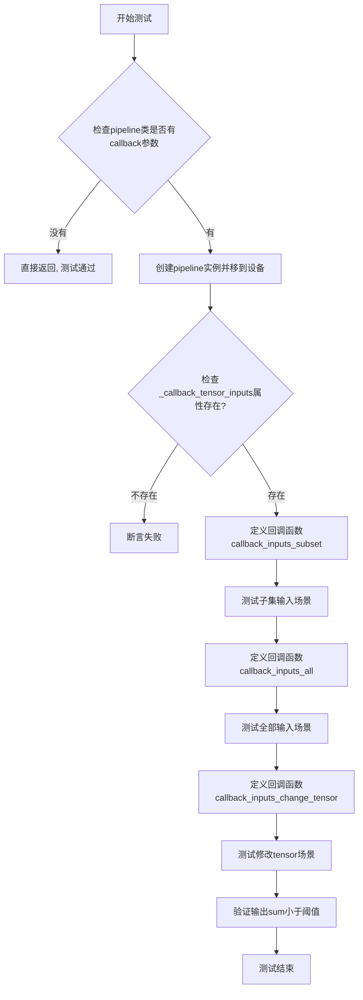

#### 带注释源码

```python
def test_callback_inputs(self):
    """
    测试回调函数输入验证
    验证pipeline的回调机制是否正确处理callback_on_step_end和
    callback_on_step_end_tensor_inputs参数
    """
    # 获取pipeline类的__call__方法签名
    sig = inspect.signature(self.pipeline_class.__call__)
    # 检查是否存在回调相关参数
    has_callback_tensor_inputs = "callback_on_step_end_tensor_inputs" in sig.parameters
    has_callback_step_end = "callback_on_step_end" in sig.parameters

    # 如果pipeline不支持回调功能，直接返回
    if not (has_callback_tensor_inputs and has_callback_step_end):
        return

    # 创建pipeline组件并实例化
    components = self.get_dummy_components()
    pipe = self.pipeline_class(**components)
    pipe = pipe.to(torch_device)
    pipe.set_progress_bar_config(disable=None)
    
    # 断言pipeline具有_callback_tensor_inputs属性
    # 该属性定义了回调函数可以使用的tensor变量列表
    self.assertTrue(
        hasattr(pipe, "_callback_tensor_inputs"),
        f" {self.pipeline_class} should have `_callback_tensor_inputs` that defines a list of tensor variables its callback function can use as inputs",
    )

    # 定义回调函数：验证只传递允许的tensor输入子集
    def callback_inputs_subset(pipe, i, t, callback_kwargs):
        # 遍历回调参数
        for tensor_name, tensor_value in callback_kwargs.items():
            # 检查只传递了允许的tensor输入
            assert tensor_name in pipe._callback_tensor_inputs
        return callback_kwargs

    # 定义回调函数：验证所有允许的tensor输入都被传递
    def callback_inputs_all(pipe, i, t, callback_kwargs):
        # 验证所有_callback_tensor_inputs中的tensor都被传递
        for tensor_name in pipe._callback_tensor_inputs:
            assert tensor_name in callback_kwargs

        # 遍历回调参数验证只传递允许的输入
        for tensor_name, tensor_value in callback_kwargs.items():
            assert tensor_name in pipe._callback_tensor_inputs
        return callback_kwargs

    # 获取测试输入
    inputs = self.get_dummy_inputs(torch_device)

    # 场景1：测试只传递子集（只传递latents）
    inputs["callback_on_step_end"] = callback_inputs_subset
    inputs["callback_on_step_end_tensor_inputs"] = ["latents"]
    output = pipe(**inputs)[0]

    # 场景2：测试传递所有允许的tensor输入
    inputs["callback_on_step_end"] = callback_inputs_all
    inputs["callback_on_step_end_tensor_inputs"] = pipe._callback_tensor_inputs
    output = pipe(**inputs)[0]

    # 定义回调函数：在最后一步修改latents为零张量
    def callback_inputs_change_tensor(pipe, i, t, callback_kwargs):
        is_last = i == (pipe.num_timesteps - 1)
        if is_last:
            # 将latents修改为零张量
            callback_kwargs["latents"] = torch.zeros_like(callback_kwargs["latents"])
        return callback_kwargs

    # 场景3：测试通过回调修改tensor
    inputs["callback_on_step_end"] = callback_inputs_change_tensor
    inputs["callback_on_step_end_tensor_inputs"] = pipe._callback_tensor_inputs
    output = pipe(**inputs)[0]
    # 验证修改后的输出sum小于阈值
    assert output.abs().sum() < 1e10
```


### `HunyuanVideoFramepackPipelineFastTests.test_attention_slicing_forward_pass`

测试注意力切片（Attention Slicing）功能对 HunyuanVideoFramepackPipeline 推理结果的影响，验证启用不同大小的注意力切片（slice_size=1 和 slice_size=2）时，输出结果与未启用切片时的结果差异在预期范围内，确保注意力切片优化不会影响生成质量。

参数：

-  `self`：隐式参数，测试类实例本身
-  `test_max_difference`：`bool`，是否测试最大差异，默认为 `True`
-  `test_mean_pixel_difference`：`bool`，是否测试平均像素差异（当前未使用），默认为 `True`
-  `expected_max_diff`：`float`，允许的最大差异阈值，默认为 `1e-3`

返回值：`None`，该方法为单元测试方法，通过 `assertLess` 断言验证结果

#### 流程图

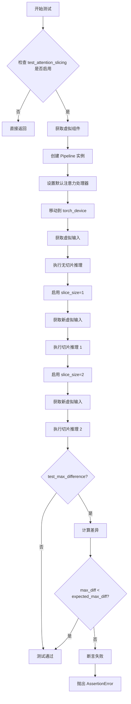

#### 带注释源码

```python
def test_attention_slicing_forward_pass(
    self, test_max_difference=True, test_mean_pixel_difference=True, expected_max_diff=1e-3
):
    """
    测试注意力切片前向传播，验证注意力切片优化不会影响推理结果
    
    参数:
        test_max_difference: 是否测试最大差异
        test_mean_pixel_difference: 是否测试平均像素差异（当前未使用）
        expected_max_diff: 允许的最大差异阈值
    """
    # 检查是否启用了注意力切片测试
    if not self.test_attention_slicing:
        return

    # 获取虚拟组件（transformer, vae, scheduler, text_encoder 等）
    components = self.get_dummy_components()
    
    # 使用虚拟组件创建 Pipeline 实例
    pipe = self.pipeline_class(**components)
    
    # 遍历所有组件，设置默认注意力处理器
    for component in pipe.components.values():
        if hasattr(component, "set_default_attn_processor"):
            component.set_default_attn_processor()
    
    # 将 Pipeline 移动到指定设备（CPU 或 CUDA）
    pipe.to(torch_device)
    
    # 配置进度条（disable=None 表示不禁用）
    pipe.set_progress_bar_config(disable=None)

    # 设置生成器设备为 CPU
    generator_device = "cpu"
    
    # 获取虚拟输入参数（包含图像、prompt、生成器等）
    inputs = self.get_dummy_inputs(generator_device)
    
    # 执行无注意力切片的推理，获取基准输出
    output_without_slicing = pipe(**inputs)[0]

    # 启用注意力切片，slice_size=1
    pipe.enable_attention_slicing(slice_size=1)
    
    # 重新获取虚拟输入（使用新的随机种子）
    inputs = self.get_dummy_inputs(generator_device)
    
    # 执行启用切片（slice_size=1）的推理
    output_with_slicing1 = pipe(**inputs)[0]

    # 修改切片大小为 2
    pipe.enable_attention_slicing(slice_size=2)
    
    # 再次获取虚拟输入
    inputs = self.get_dummy_inputs(generator_device)
    
    # 执行启用切片（slice_size=2）的推理
    output_with_slicing2 = pipe(**inputs)[0]

    # 如果需要测试最大差异
    if test_max_difference:
        # 将输出转换为 numpy 数组并计算差异
        max_diff1 = np.abs(to_np(output_with_slicing1) - to_np(output_without_slicing)).max()
        max_diff2 = np.abs(to_np(output_with_slicing2) - to_np(output_without_slicing)).max()
        
        # 断言：注意力切片不应影响推理结果
        self.assertLess(
            max(max_diff1, max_diff2),
            expected_max_diff,
            "Attention slicing should not affect the inference results",
        )
```


### `HunyuanVideoFramepackPipelineFastTests.test_vae_tiling`

测试 VAE（变分自编码器）的平铺（tiling）功能，验证在启用平铺与未启用平铺两种情况下，VAE 输出的差异应在可接受范围内，以确保平铺功能不会影响推理结果的正确性。

参数：

- `expected_diff_max`：`float`，最大允许的差异阈值（默认为 0.2，内部实际设置为 0.6 以适应更高容忍度）

返回值：`None`，该方法为测试方法，无返回值，通过断言验证结果

#### 流程图

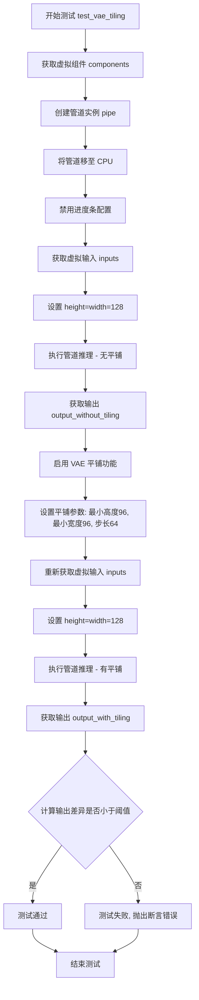

#### 带注释源码

```python
def test_vae_tiling(self, expected_diff_max: float = 0.2):
    """
    测试 VAE 平铺功能
    
    该测试验证启用 VAE 平铺（tiling）后，模型的输出结果应与未启用平铺时
    保持一致（差异在可接受范围内）。平铺技术用于处理大分辨率图像，通过
    将图像分块处理来避免内存溢出。
    
    参数:
        expected_diff_max: float, 允许的最大差异阈值（默认0.2，内部实际使用0.6）
    """
    # Seems to require higher tolerance than the other tests
    # 由于 VAE 平铺涉及多次分块处理，数值误差会累积，需要更高的容忍度
    expected_diff_max = 0.6
    
    # 设置测试设备为 CPU
    generator_device = "cpu"
    
    # 获取预定义的虚拟组件（transformer, vae, scheduler, text_encoder 等）
    components = self.get_dummy_components()

    # 使用虚拟组件实例化 HunyuanVideoFramepackPipeline 管道
    pipe = self.pipeline_class(**components)
    
    # 将管道移至 CPU 设备
    pipe.to("cpu")
    
    # 配置进度条（disable=None 表示启用进度条）
    pipe.set_progress_bar_config(disable=None)

    # ====== 步骤1: 不启用平铺的推理 ======
    # 获取默认虚拟输入
    inputs = self.get_dummy_inputs(generator_device)
    
    # 设置测试图像分辨率为 128x128（需要足够大以触发平铺逻辑）
    inputs["height"] = inputs["width"] = 128
    
    # 执行推理并获取第一帧结果（[0] 表示取第一个视频结果）
    output_without_tiling = pipe(**inputs)[0]

    # ====== 步骤2: 启用平铺的推理 ======
    # 启用 VAE 平铺功能，并配置分块参数
    pipe.vae.enable_tiling(
        tile_sample_min_height=96,    # 最小分块高度
        tile_sample_min_width=96,     # 最小分块宽度
        tile_sample_stride_height=64, # 垂直方向分块步长
        tile_sample_stride_width=64,  # 水平方向分块步长
    )
    
    # 重新获取虚拟输入（确保生成器状态重置）
    inputs = self.get_dummy_inputs(generator_device)
    
    # 同样设置测试图像分辨率为 128x128
    inputs["height"] = inputs["width"] = 128
    
    # 执行推理并获取第一帧结果
    output_with_tiling = pipe(**inputs)[0]

    # ====== 步骤3: 验证结果一致性 ======
    # 计算两种方式的输出差异，并验证差异是否在允许范围内
    # to_np() 将 PyTorch tensor 转换为 numpy 数组
    self.assertLess(
        (to_np(output_without_tiling) - to_np(output_with_tiling)).max(),
        expected_diff_max,
        "VAE tiling should not affect the inference results"
    )
```


### `HunyuanVideoFramepackPipelineFastTests.test_float16_inference`

测试半精度（float16）推理功能，验证模型在float16数据类型下的推理结果与float32结果的差异是否在可接受范围内。

参数：

- `self`：`HunyuanVideoFramepackPipelineFastTests`，测试用例实例本身
- `expected_max_diff`：`float`，期望的最大差异阈值，默认为 `0.2`

返回值：`Any`，继承自父类 `test_float16_inference` 的返回值，通常为 `None`（unittest 测试方法）

#### 流程图

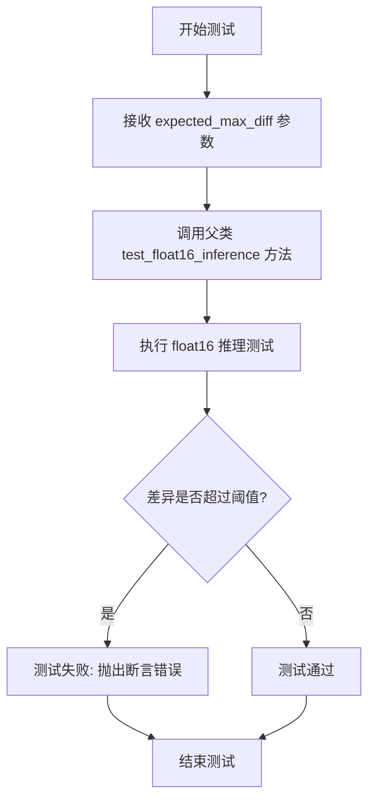

#### 带注释源码

```python
def test_float16_inference(self, expected_max_diff=0.2):
    # NOTE: this test needs a higher tolerance because of multiple forwards through
    # the model, which compounds the overall fp32 vs fp16 numerical differences. It
    # shouldn't be expected that the results are the same, so we bump the tolerance.
    # 注释说明：
    # - 由于模型需要进行多次前向传播，fp32 与 fp16 之间的数值差异会累积
    # - 因此使用更高的容差阈值（0.2）而不是默认的较小值
    # - 不应期望 float16 和 float32 的结果完全相同
    return super().test_float16_inference(expected_max_diff)
    # 调用父类 PipelineTesterMixin 的 test_float16_inference 方法
    # 传递修改后的 expected_max_diff 参数以适应复合误差情况
```


### `HunyuanVideoFramepackPipelineFastTests.test_sequential_cpu_offload_forward_pass`

该测试方法用于验证 HunyuanVideoFramepackPipeline 在 CPU 卸载（sequential CPU offload）场景下的前向传播能力，但由于 `image_encoder` 使用了 `SiglipVisionModel`，其内部使用 `torch.nn.MultiheadAttention` 实现，无法支持 CPU 卸载功能，因此该测试被无条件跳过。

参数：

- `self`：隐式参数，`HunyuanVideoFramepackPipelineFastTests` 类的实例，无需额外描述

返回值：无返回值（方法体仅包含 `pass` 语句）

#### 流程图

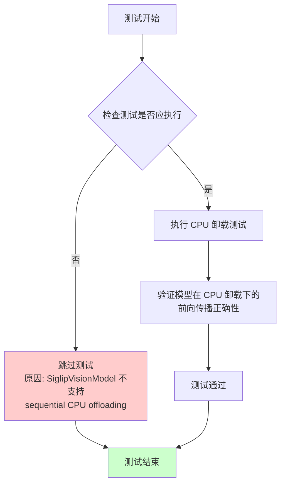

#### 带注释源码

```python
@unittest.skip("The image_encoder uses SiglipVisionModel, which does not support sequential CPU offloading.")
def test_sequential_cpu_offload_forward_pass(self):
    # https://github.com/huggingface/transformers/blob/21cb353b7b4f77c6f5f5c3341d660f86ff416d04/src/transformers/models/siglip/modeling_siglip.py#L803
    # This is because it instantiates it's attention layer from torch.nn.MultiheadAttention, which calls to
    # `torch.nn.functional.multi_head_attention_forward` with the weights and bias. Since the hook is never
    # triggered with a forward pass call, the weights stay on the CPU. There are more examples where we skip
    # this test because of MHA (example: HunyuanDiT because of AttentionPooling layer).
    pass
```

**代码说明：**

- `@unittest.skip(...)`：装饰器，无条件跳过该测试，原因是 `image_encoder` 使用的 `SiglipVisionModel` 不支持 CPU 卸载
- 方法体仅有 `pass` 语句，表明该测试方法内部逻辑未实现
- 注释解释了跳过原因：`SiglipVisionModel` 使用 `torch.nn.MultiheadAttention`，该实现调用 `torch.nn.functional.multi_head_attention_forward`，但由于钩子（hook）从未被触发，权重会停留在 CPU 上，导致 CPU 卸载功能无法正常工作


### HunyuanVideoFramepackPipelineFastTests.test_sequential_offload_forward_pass_twice

该测试方法用于验证 HunyuanVideoFramepackPipeline 的双重 CPU 卸载（sequential CPU offloading）转发功能是否正常工作。由于 `image_encoder` 使用的 `SiglipVisionModel` 不支持 CPU 卸载（其内部使用 `torch.nn.MultiheadAttention` 导致权重卸载钩子无法触发），该测试已被跳过。

参数：无（该方法不接受任何参数）

返回值：无（测试被 `@unittest.skip` 装饰器跳过，不执行任何逻辑，无返回值）

#### 流程图

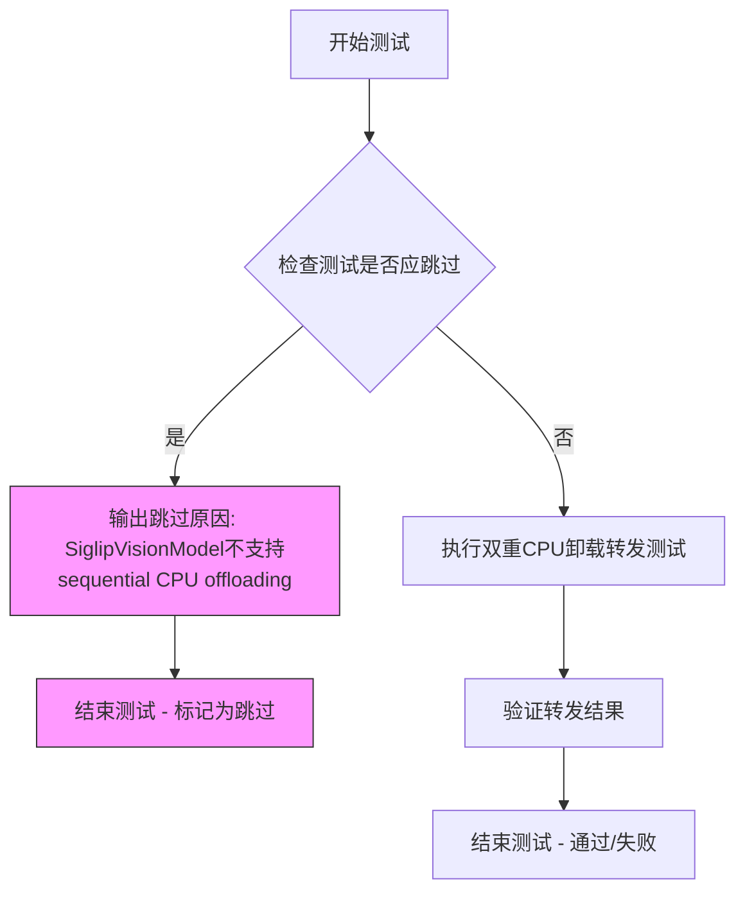

#### 带注释源码

```python
@unittest.skip("The image_encoder uses SiglipVisionModel, which does not support sequential CPU offloading.")
def test_sequential_offload_forward_pass_twice(self):
    """
    测试双重CPU卸载转发（已跳过）。
    
    该测试旨在验证在启用了sequential CPU offload的情况下，
    pipeline能够连续执行两次前向传播并且模型权重能够正确地
    在CPU和GPU之间迁移。
    
    跳过原因：
    - SiglipVisionModel使用了torch.nn.MultiheadAttention
    - MultiheadAttention内部调用torch.nn.functional.multi_head_attention_forward
    - 该调用的权重卸载钩子无法被触发，导致权重始终停留在CPU上
    - 类似的限制也出现在HunyuanDiT的AttentionPooling层等场景
    
    相关问题: https://github.com/huggingface/transformers/blob/21cb353b7b4f77c6f5f5c3341d660f86ff416d04/src/transformers/models/siglip/modeling_siglip.py#L803
    """
    pass
```


### `HunyuanVideoFramepackPipelineFastTests.test_inference_batch_consistent`

测试批量推理一致性（已被跳过）

参数：

- `self`：隐式参数，`HunyuanVideoFramepackPipelineFastTests`，类的实例本身

返回值：`None`，该方法不返回任何值（被跳过的测试方法，仅包含`pass`语句）

#### 流程图

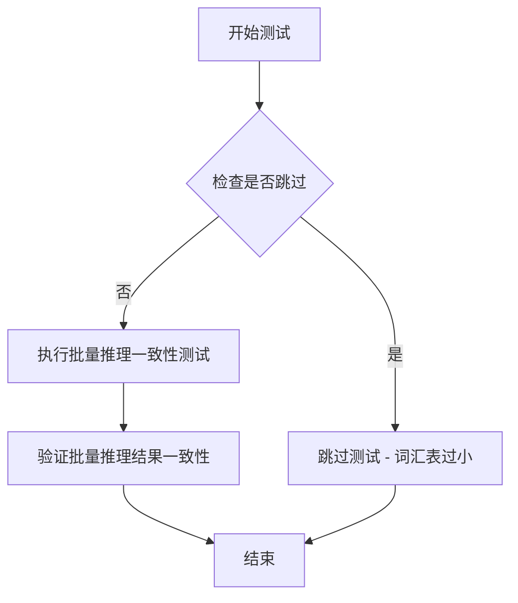

#### 带注释源码

```python
@unittest.skip(
    "A very small vocab size is used for fast tests. So, Any kind of prompt other than the empty default used in other tests will lead to a embedding lookup error. This test uses a long prompt that causes the error."
)
def test_inference_batch_consistent(self):
    """
    测试批量推理一致性
    
    该测试方法用于验证管道在批量推理时的一致性，即相同的输入（不同批次）应产生相同的输出。
    由于测试使用非常小的词汇表，除了空默认提示词外，任何其他提示词都会导致嵌入查找错误，
    因此该测试被跳过。
    
    Args:
        self: HunyuanVideoFramepackPipelineFastTests类的实例
        
    Returns:
        None: 该方法不返回任何值，仅包含pass语句
        
    Note:
        被跳过的原因：词汇表过小，长提示词会导致embedding lookup error
    """
    pass  # 测试逻辑未实现，方法被跳过
```


### `HunyuanVideoFramepackPipelineFastTests.test_inference_batch_single_identical`

这是一个测试方法，用于验证 HunyuanVideoFramepackPipeline 在批量推理与单样本推理时的输出一致性。由于测试环境使用极小的词汇表，任何非空的提示都会导致嵌入查找错误，因此该测试被跳过。

参数：

- `self`：`HunyuanVideoFramepackPipelineFastTests`，测试类实例，隐含的 `self` 参数

返回值：`None`，该方法为空实现（`pass`），不返回任何值

#### 流程图

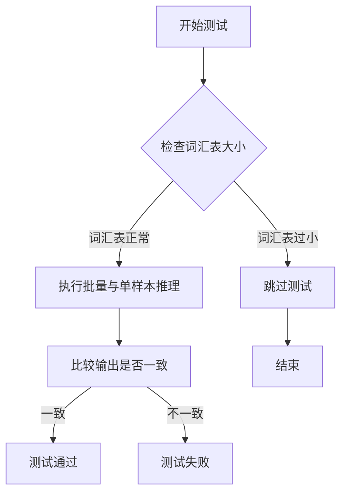

#### 带注释源码

```python
@unittest.skip(
    "A very small vocab size is used for fast tests. So, Any kind of prompt other than the empty default used in other tests will lead to a embedding lookup error. This test uses a long prompt that causes the error."
)
def test_inference_batch_single_identical(self):
    """
    测试批量推理与单样本推理的输出一致性。
    
    该测试旨在验证当使用批量输入和单个输入时，管道生成的视频帧是否一致。
    由于测试环境使用极小的词汇表（vocab_size=1000），长提示会导致嵌入查找错误，
    因此该测试被跳过。
    """
    pass
```

#### 关键组件信息

- **HunyuanVideoFramepackPipeline**：视频生成管道，负责根据提示和图像生成视频帧
- **HunyuanVideoFramepackTransformer3DModel**：3D 变换器模型，用于视频生成
- **AutoencoderKLHunyuanVideo**：变分自编码器，用于视频的潜在空间编码和解码

#### 潜在的技术债务或优化空间

1. **测试环境限制**：测试使用极小的词汇表（vocab_size=1000），导致无法测试实际的批量推理一致性场景
2. **测试覆盖不足**：由于测试被跳过，无法验证批量推理的正确性，这是视频生成管道的重要质量保证

#### 其它项目

- **设计目标**：确保批量推理与单样本推理的数学一致性，即 f(batch) 的结果应与 f(single) 的结果在各个单独元素上相同
- **约束条件**：测试使用虚拟组件（dummy components）以加快测试速度，但虚拟组件的词汇表过小导致测试无法执行
- **错误处理**：当前通过 `@unittest.skip` 装饰器跳过测试，未来需要解决词汇表限制问题以启用此测试

## 关键组件


### HunyuanVideoFramepackPipeline

HunyuanVideoFramepackPipeline 是基于 HunyuanVideo 的视频生成管道，支持通过图像提示和文本提示生成视频。该管道整合了 3D 变换器模型、VAE 编码器/解码器、多个文本编码器（Llama 和 CLIP）以及图像编码器（Siglip），并采用 FlowMatchEulerDiscreteScheduler 进行扩散采样。

### FasterCacheConfig

FasterCacheConfig 是用于配置加速缓存的关键组件，定义了空间注意力块跳过范围、时间步跳过范围、无条件批处理跳过范围以及注意力权重回调函数等参数。该配置支持 is_guidance_distilled=True，表明其设计用于指导蒸馏场景下的推理加速。

### HunyuanVideoFramepackTransformer3DModel

HunyuanVideoFramepackTransformer3DModel 是核心的 3D 视频变换器模型，负责处理视频生成的注意力计算。模型配置包含 4 个输入通道和 4 个输出通道，2 个注意力头，注意力头维度为 10，支持图像条件嵌入和 ROPE 位置编码。

### AutoencoderKLHunyuanVideo

AutoencoderKLHunyuanVideo 是用于视频潜在空间编码和解码的变分自编码器模型，支持空间压缩比 8:1 和时间压缩比 4:1。该 VAE 包含 HunyuanVideoDownBlock3D 和 HunyuanVideoUpBlock3D 块，并启用了瓦片（tiling）功能以支持高分辨率视频生成。

### FlowMatchEulerDiscreteScheduler

FlowMatchEulerDiscreteScheduler 是基于欧拉离散方法的流匹配调度器，配置 shift=7.0 用于控制噪声调度策略。该调度器在推理过程中生成时间步序列，指导模型从噪声逐步去噪生成视频帧。

### PipelineTesterMixin / FasterCacheTesterMixin / PyramidAttentionBroadcastTesterMixin

测试混合类提供了管道功能测试的基础设施，包括注意力切片测试、VAE 瓦片测试、浮点精度测试、CPU 卸载测试以及更快的缓存策略测试。这些 mixin 支持检查管道对不同推理优化技术的兼容性。

### 文本编码器组件 (LlamaModel / CLIPTextModel / Tokenizer)

双文本编码器架构包含 LlamaModel 和 CLIPTextModel，分别配合 LlamaTokenizer 和 CLIPTokenizer 使用。该设计支持文本提示的嵌入提取和池化提示嵌入生成，用于条件视频生成。

### SiglipVisionModel 图像编码器

SiglipVisionModel 是用于图像提示编码的视觉模型，从图像中提取特征作为视频生成的条件输入。该编码器与 SiglipImageProcessor 配合使用，支持图像到特征的转换。

### test_inference / test_attention_slicing_forward_pass / test_vae_tiling

推理测试方法验证管道输出的正确性，注意力切片测试验证分块注意力优化不影响结果一致性，VAE 瓦片测试验证图像分块处理对输出质量的影响。这些测试方法覆盖了管道的主要功能和优化特性。

## 问题及建议


### 已知问题

- **硬编码的外部模型依赖**：代码依赖多个外部预训练模型（如`finetrainers/dummy-hunyaunvideo`、`hf-internal-testing/tiny-random-clip`等），这些外部依赖可能导致测试在网络不稳定或模型不可用时失败，缺乏离线测试能力。
- **多个被跳过的测试**：`test_sequential_cpu_offload_forward_pass`、`test_sequential_offload_forward_pass_twice`、`test_inference_batch_consistent`、`test_inference_batch_single_identical`等测试被跳过，导致测试覆盖不完整，特别是CPU卸载功能完全未验证。
- **Magic Numbers遍布代码**：图像尺寸(32)、推理步数(2)、guidance_scale(4.5)、各种容差值(1e-3、0.2、0.6)等硬编码在各处，缺乏统一的配置管理。
- **测试逻辑不完整**：`test_float16_inference`直接调用`super()`返回而没有实际执行任何验证逻辑；`test_vae_tiling`在内部修改预期最大差值变量(`expected_diff_max = 0.6`)导致语义混乱。
- **TODO未完成**：存在`TODO(aryan)`注释但未实现相关功能。
- **空的测试方法体**：部分被跳过的测试仅包含`pass`语句，缺乏实现或适当的跳过原因说明。
- **硬编码的expected_slice**：期望的输出张量值硬编码，在不同硬件或PyTorch版本上可能因浮点精度导致测试不稳定。
- **重复的设备处理逻辑**：`get_dummy_inputs`中对MPS设备的特殊处理与主代码库中的类似逻辑重复。

### 优化建议

- **提取配置常量**：将所有Magic Numbers提取为类常量或配置文件，提高可维护性和可读性。
- **完善被跳过的测试**：实现或移除被跳过的测试，特别是CPU卸载相关的测试，以提供完整的测试覆盖。
- **增加离线测试能力**：考虑使用本地dummy模型或mock对象替代外部模型依赖，提高测试的稳定性和CI/CD流程的可靠性。
- **重构test_float16_inference**：移除空的`return super().test_float16_inference(expected_max_diff)`调用，添加实际的验证逻辑或使用pytest.mark.skipwith说明。
- **统一容差管理**：创建专门的测试配置类来管理不同测试场景下的容差值，避免在测试方法内部修改预期值。
- **清理TODO**：完成`TODO(aryan)`任务或将其移至项目待办事项中，避免代码中存在未完成的任务标记。
- **参数化测试**：对于需要不同参数组合的测试，考虑使用pytest参数化减少代码重复。
- **添加设备兼容性检查**：在测试开始前添加设备可用性检查，对不支持的设备使用pytest.skip而非条件分支。

## 其它


### 设计目标与约束

本测试文件旨在验证HunyuanVideoFramepackPipeline的核心功能正确性，包括视频生成推理、注意力切片、VAE平铺、浮点精度等功能。由于使用小型虚拟模型（dummy models）和极小词汇表（vocab_size=1000），部分涉及长文本prompt的测试被跳过，以避免embedding查找错误。

### 错误处理与异常设计

代码中通过unittest框架的assert语句进行错误检测。例如在test_callback_inputs中验证回调函数只传递允许的tensor输入；在test_attention_slicing_forward_pass和test_vae_tiling中比较输出差异确保功能正确性。部分测试因已知限制（如SiglipVisionModel不支持顺序CPU卸载）使用@unittest.skip装饰器跳过。

### 数据流与状态机

测试数据流：get_dummy_components()创建虚拟组件 → get_dummy_inputs()生成测试输入 → pipe(**inputs)执行推理 → 验证输出frames的shape和数值正确性。状态机主要由Pipeline内部管理，测试主要验证其正向传播行为。

### 外部依赖与接口契约

依赖包括：transformers(CLIPTextModel, LlamaModel, SiglipVisionModel), diffusers(HunyuanVideoFramepackPipeline等), PIL, numpy, torch。接口契约通过pipeline_class.__call__的签名检查（inspect.signature）验证回调参数（callback_on_step_end, callback_on_step_end_tensor_inputs）的存在性。

### 性能考虑

测试涵盖性能优化功能的正确性验证：1) attention_slicing通过分块计算降低显存占用；2) vae_tiling通过分块解码处理高分辨率图像；3) faster_cache_config验证缓存优化策略。test_float16_inference使用更高容差(0.2)因为多 forward 过程会累积数值误差。

### 测试覆盖范围

覆盖场景：1) 基础推理（test_inference）；2) 回调机制（test_callback_inputs）；3) 注意力切片（test_attention_slicing_forward_pass）；4) VAE平铺（test_vae_tiling）；5) 半精度推理（test_float16_inference）；6) 跳过的测试：顺序CPU卸载（因MHA限制）、批处理一致性（因小词汇表限制）。

### 配置管理

faster_cache_config定义缓存优化参数：spatial_attention_block_skip_range=2, spatial_attention_timestep_skip_range=(-1, 901), unconditional_batch_skip_range=2, attention_weight_callback, is_guidance_distilled=True。pipeline参数通过params/batch_params/required_optional_params frozenset定义。

### 资源清理

测试使用torch.manual_seed(0)确保可复现性，未显式释放GPU资源（由框架自动管理）。Generator设备处理MPS和CUDA差异：MPS使用torch.manual_seed，CUDA使用torch.Generator(device=device)。

### 版本兼容性与限制

1) SiglipVisionModel因使用torch.nn.MultiheadAttention不支持顺序CPU卸载，相关测试被跳过；2) 小词汇表(1000)导致长prompt测试被跳过；3) test_float16_inference重写以使用更高容差处理累积误差。

    