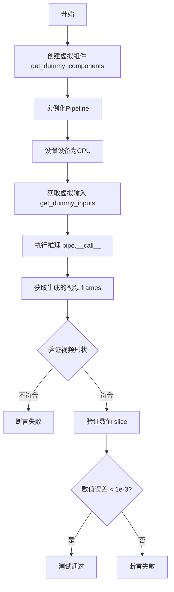
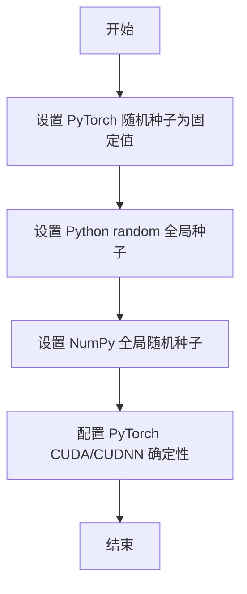
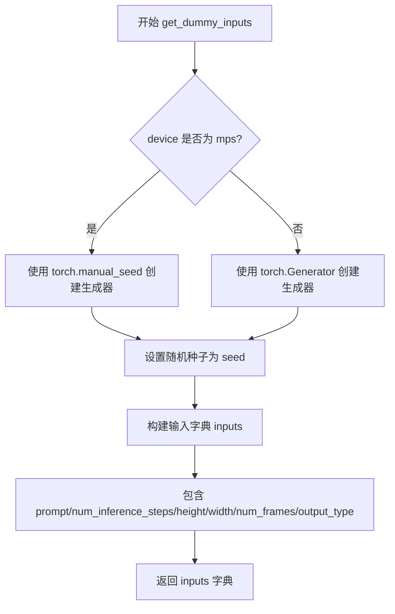
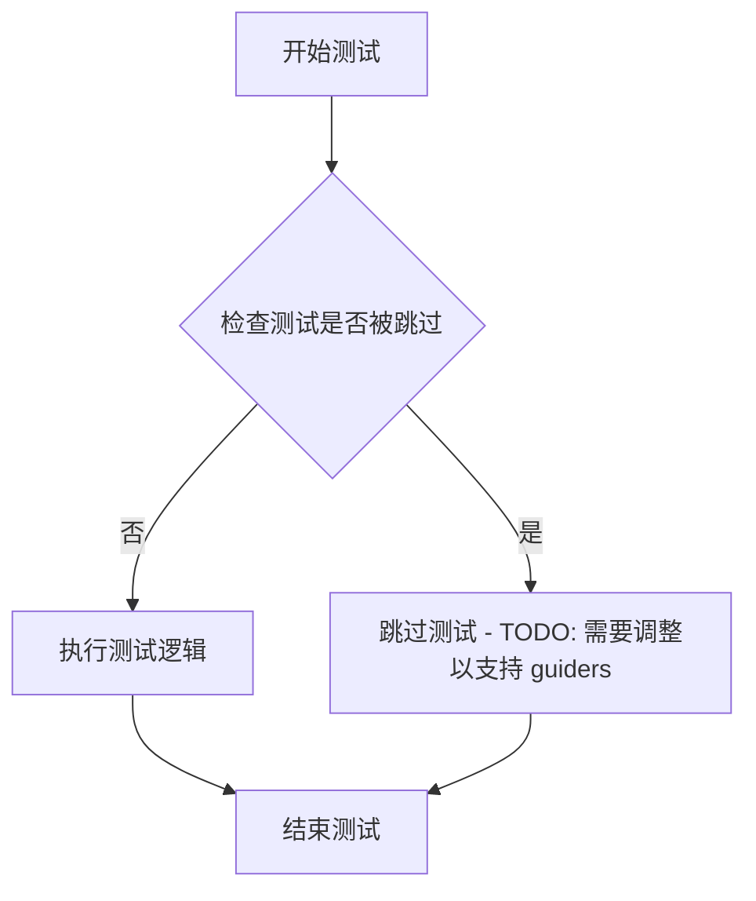
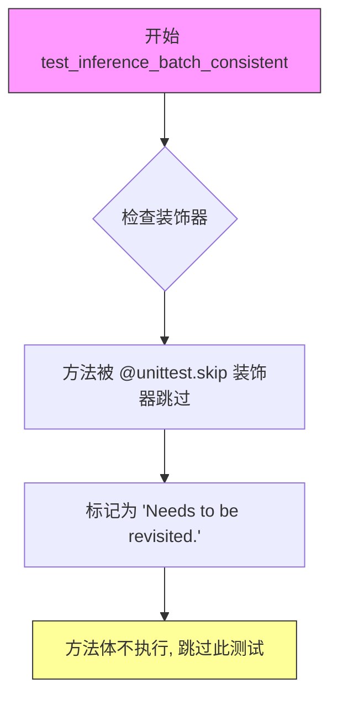

# `diffusers\tests\pipelines\hunyuan_video1_5\test_hunyuan_1_5.py` 详细设计文档

这是一个用于测试HunyuanVideo15Pipeline（字节跳动的HunyuanVideo视频生成管道）的单元测试文件，通过创建虚拟组件、设置测试参数、执行推理并验证生成的视频张量形状和数值是否符合预期来确保视频生成pipeline的正确性。

## 整体流程



## 类结构

```
unittest.TestCase
└── HunyuanVideo15PipelineFastTests (继承 PipelineTesterMixin)
    ├── 字段 (类属性)
    └── 方法 (实例方法)
```

## 全局变量及字段


### `unittest`
    
Python标准库单元测试框架

类型：`module`
    


### `torch`
    
PyTorch深度学习库

类型：`module`
    


### `ByT5Tokenizer`
    
Google的ByT5分词器，用于字符级tokenization

类型：`class`
    


### `Qwen2_5_VLTextConfig`
    
Qwen2.5-VL文本配置类，定义模型架构参数

类型：`class`
    


### `Qwen2_5_VLTextModel`
    
Qwen2.5-VL文本编码器模型，用于处理文本输入

类型：`class`
    


### `Qwen2Tokenizer`
    
Qwen2分词器，用于文本tokenization

类型：`class`
    


### `T5EncoderModel`
    
Google的T5编码器模型，用于文本编码

类型：`class`
    


### `AutoencoderKLHunyuanVideo15`
    
HunyuanVideo的变分自编码器模型，用于视频潜在空间编码和解码

类型：`class`
    


### `FlowMatchEulerDiscreteScheduler`
    
Flow Match欧拉离散调度器，用于扩散模型的去噪调度

类型：`class`
    


### `HunyuanVideo15Pipeline`
    
HunyuanVideo 1.5版本的完整推理pipeline，整合所有模型组件

类型：`class`
    


### `HunyuanVideo15Transformer3DModel`
    
HunyuanVideo 1.5的3D变换器模型，处理视频生成的核心网络

类型：`class`
    


### `ClassifierFreeGuidance`
    
无分类器引导Guidance实现，用于控制生成内容

类型：`class`
    


### `enable_full_determinism`
    
启用完全确定性模式的测试工具函数

类型：`function`
    


### `HunyuanVideo15PipelineFastTests.pipeline_class`
    
指定测试使用的pipeline类为HunyuanVideo15Pipeline

类型：`type`
    


### `HunyuanVideo15PipelineFastTests.params`
    
定义pipeline推理所需的参数集合，包括prompt、negative_prompt、height、width等

类型：`frozenset`
    


### `HunyuanVideo15PipelineFastTests.batch_params`
    
定义支持批处理的参数列表，仅包含prompt和negative_prompt

类型：`frozenset`
    


### `HunyuanVideo15PipelineFastTests.required_optional_params`
    
定义可选的必填参数集合，包括num_inference_steps、generator、latents、return_dict

类型：`frozenset`
    


### `HunyuanVideo15PipelineFastTests.test_attention_slicing`
    
标记是否测试attention slicing优化

类型：`bool`
    


### `HunyuanVideo15PipelineFastTests.test_xformers_attention`
    
标记是否测试xformers内存优化attention

类型：`bool`
    


### `HunyuanVideo15PipelineFastTests.test_layerwise_casting`
    
标记是否测试逐层类型转换优化

类型：`bool`
    


### `HunyuanVideo15PipelineFastTests.test_group_offloading`
    
标记是否测试模型分组卸载功能

类型：`bool`
    


### `HunyuanVideo15PipelineFastTests.supports_dduf`
    
标记pipeline是否支持DDUF（Decoupled DiffUpscale Finetuning）

类型：`bool`
    
    

## 全局函数及方法


### `enable_full_determinism`

该函数用于设置 PyTorch、Python 和 NumPy 的全局随机种子，以确保深度学习测试的完全可重复性（determinism）。通过固定所有随机源，它能够使测试结果在任何运行环境下保持一致。

参数：该函数没有参数。

返回值：`None`，无返回值。

#### 流程图



#### 带注释源码

```python
# 该函数定义在 diffusers.testing_utils 模块中
# 位置：diffusers/testing_utils.py
def enable_full_determinism(seed: int = 0, worker_seed: Optional[int] = None):
    """
    启用完全确定性运行模式，确保测试结果可重复。
    
    参数:
        seed: 基础随机种子，默认为 0
        worker_seed: 用于 DataLoader worker 的种子，如果为 None 则自动计算
    
    返回值:
        None
    """
    # 1. 设置 PyTorch CPU/CUDA 全局随机种子
    torch.manual_seed(seed)
    if torch.cuda.is_available():
        torch.cuda.manual_seed_all(seed)
    
    # 2. 设置 Python random 模块的全局种子
    random.seed(seed)
    
    # 3. 设置 NumPy 全局随机种子
    np.random.seed(seed)
    
    # 4. 强制 PyTorch 使用确定性算法（牺牲一定性能以保证可重复性）
    torch.backends.cudnn.deterministic = True
    torch.backends.cudnn.benchmark = False
    
    # 5. 如果使用 DataLoader，设置 worker_seed
    if worker_seed is not None:
        # 配置 DataLoader worker 的种子生成方式
        def worker_init_fn(worker_id):
            worker_seed = worker_seed + worker_id
            np.random.seed(worker_seed)
            random.seed(worker_seed)
        
        # 此配置会传递给 DataLoader 的 worker_init_fn 参数
```

注意：由于原始代码中该函数是通过 `from ...testing_utils import enable_full_determinism` 导入的，上述源码是基于该函数功能的推断实现，实际源码位于 `diffusers/testing_utils.py` 文件中。在测试代码中，直接调用 `enable_full_determinism()` 不传入任何参数，使用默认种子值 0 来确保测试的可重复性。


### `HunyuanVideo15PipelineFastTests.get_dummy_components`

该方法是一个测试辅助函数，用于创建用于单元测试的虚拟（dummy）组件。它初始化并返回一个包含 HunyuanVideo15 视频生成管道所需的所有模型和配置组件的字典，包括 transformer、VAE 调度器、文本编码器和 guider 等，便于进行隔离的管道推理测试。

参数：

- `num_layers`：`int`，可选参数（默认值为 1），指定 Transformer 模型的网络层数，用于控制模型复杂度

返回值：`dict`，返回包含以下键值对的字典：
- `transformer`：`HunyuanVideo15Transformer3DModel`，3D 变换器模型
- `vae`：`AutoencoderKLHunyuanVideo15`，变分自编码器模型
- `scheduler`：`FlowMatchEulerDiscreteScheduler`，调度器
- `text_encoder`：`Qwen2_5_VLTextModel`，第一个文本编码器
- `text_encoder_2`：`T5EncoderModel`，第二个文本编码器（T5）
- `tokenizer`：`Qwen2Tokenizer`，第一个分词器
- `tokenizer_2`：`ByT5Tokenizer`，第二个分词器（字节级 T5）
- `guider`：`ClassifierFreeGuidance`，无分类器引导器

#### 流程图

```mermaid
flowchart TD
    A[开始 get_dummy_components] --> B[设置随机种子 torch.manual_seed(0)]
    B --> C[创建 HunyuanVideo15Transformer3DModel]
    C --> D[设置随机种子 torch.manual_seed(0)]
    D --> E[创建 AutoencoderKLHunyuanVideo15 VAE]
    E --> F[设置随机种子 torch.manual_seed(0)]
    F --> G[创建 FlowMatchEulerDiscreteScheduler]
    G --> H[设置随机种子 torch.manual_seed(0)]
    H --> I[创建 Qwen2_5_VLTextConfig]
    I --> J[创建 Qwen2_5_VLTextModel 和 Qwen2Tokenizer]
    J --> K[设置随机种子 torch.manual_seed(0)]
    K --> L[创建 T5EncoderModel 和 ByT5Tokenizer]
    L --> M[创建 ClassifierFreeGuidance]
    M --> N[组装 components 字典]
    N --> O[返回 components 字典]
```

#### 带注释源码

```python
def get_dummy_components(self, num_layers: int = 1):
    """
    创建用于测试的虚拟组件
    
    参数:
        num_layers: Transformer模型的层数，默认值为1
    
    返回:
        dict: 包含管道所有组件的字典
    """
    # 设置随机种子以确保可重复性
    torch.manual_seed(0)
    
    # 创建3D变换器模型 - 视频生成的核心组件
    transformer = HunyuanVideo15Transformer3DModel(
        in_channels=9,              # 输入通道数
        out_channels=4,            # 输出通道数
        num_attention_heads=2,     # 注意力头数量
        attention_head_dim=8,      # 注意力头维度
        num_layers=num_layers,     # 网络层数（参数传入）
        num_refiner_layers=1,      # 精炼器层数
        mlp_ratio=2.0,             # MLP扩展比率
        patch_size=1,              # 空间patch大小
        patch_size_t=1,            # 时间patch大小
        text_embed_dim=16,         # 文本嵌入维度
        text_embed_2_dim=32,       # 第二文本嵌入维度
        image_embed_dim=12,        # 图像嵌入维度
        rope_axes_dim=(2, 2, 4),   # RoPE轴维度
        target_size=16,            # 目标尺寸
        task_type="t2v",           # 任务类型：text-to-video
    )

    # 重新设置随机种子确保VAE的独立性
    torch.manual_seed(0)
    # 创建变分自编码器用于视频压缩和解压
    vae = AutoencoderKLHunyuanVideo15(
        in_channels=3,             # RGB图像通道
        out_channels=3,            # 输出通道
        latent_channels=4,         # 潜在空间通道数
        block_out_channels=(16, 16), # 输出通道列表
        layers_per_block=1,       # 每块层数
        spatial_compression_ratio=4,   # 空间压缩比
        temporal_compression_ratio=2,  # 时间压缩比
        downsample_match_channel=False, # 下采样匹配通道
        upsample_match_channel=False,   # 上采样匹配通道
    )

    # 设置调度器随机种子
    torch.manual_seed(0)
    # 创建基于流匹配的单步离散调度器
    scheduler = FlowMatchEulerDiscreteScheduler(shift=7.0)

    # 配置Qwen2.5-VL文本编码器
    torch.manual_seed(0)
    qwen_config = Qwen2_5_VLTextConfig(
        **{
            "hidden_size": 16,           # 隐藏层大小
            "intermediate_size": 16,     # 中间层大小
            "num_hidden_layers": 2,     # 隐藏层数量
            "num_attention_heads": 2,   # 注意力头数
            "num_key_value_heads": 2,   # KV头数
            "rope_scaling": {           # RoPE缩放配置
                "mrope_section": [1, 1, 2],
                "rope_type": "default",
                "type": "default",
            },
            "rope_theta": 1000000.0,    # RoPE基础频率
        }
    )
    # 创建Qwen2.5-VL文本模型
    text_encoder = Qwen2_5_VLTextModel(qwen_config)
    # 加载小型随机Qwen2VL分词器
    tokenizer = Qwen2Tokenizer.from_pretrained("hf-internal-testing/tiny-random-Qwen2VLForConditionalGeneration")

    # 创建T5文本编码器（第二个文本编码器）
    torch.manual_seed(0)
    text_encoder_2 = T5EncoderModel.from_pretrained("hf-internal-testing/tiny-random-t5")
    # 使用字节级T5分词器
    tokenizer_2 = ByT5Tokenizer()

    # 创建无分类器引导器用于条件生成
    guider = ClassifierFreeGuidance(guidance_scale=1.0)

    # 组装所有组件到字典中
    components = {
        "transformer": transformer.eval(),      # 设置为评估模式
        "vae": vae.eval(),                       # 设置为评估模式
        "scheduler": scheduler,                 # 调度器
        "text_encoder": text_encoder.eval(),   # 设置为评估模式
        "text_encoder_2": text_encoder_2.eval(), # 设置为评估模式
        "tokenizer": tokenizer,                 # 主分词器
        "tokenizer_2": tokenizer_2,             # 辅助分词器
        "guider": guider,                       # 引导器
    }
    return components
```


### `HunyuanVideo15PipelineFastTests.get_dummy_inputs`

该方法为 HunyuanVideo15Pipeline 推理测试生成虚拟输入参数，根据设备类型（MPS 或其他）创建随机数生成器，并返回一个包含提示词、生成器、推理步数、视频尺寸等信息的字典，用于pipeline的单元测试。

参数：

- `device`：`torch.device`，执行推理的目标设备（如 cpu, mps, cuda）
- `seed`：`int`，随机种子，默认为 0，用于保证测试结果的可复现性

返回值：`Dict[str, Any]`，包含以下键值对的字典：
- `prompt`：提示词字符串
- `generator`：PyTorch 随机数生成器
- `num_inference_steps`：推理步数
- `height`：生成视频的高度
- `width`：生成视频的宽度
- `num_frames`：生成视频的帧数
- `output_type`：输出类型

#### 流程图



#### 带注释源码

```python
def get_dummy_inputs(self, device, seed=0):
    """
    生成用于 HunyuanVideo15Pipeline 测试的虚拟输入参数。
    
    参数:
        device: 目标设备 (cpu/mps/cuda)
        seed: 随机种子，默认 0
    
    返回:
        包含测试所需输入参数的字典
    """
    # MPS 设备不支持 torch.Generator，需要使用 torch.manual_seed
    if str(device).startswith("mps"):
        generator = torch.manual_seed(seed)
    else:
        # 其他设备使用 torch.Generator 以支持更精细的随机控制
        generator = torch.Generator(device=device).manual_seed(seed)

    # 构建测试输入字典
    inputs = {
        "prompt": "monkey",              # 测试用简短提示词
        "generator": generator,          # 随机数生成器确保可复现性
        "num_inference_steps": 2,        # 减少推理步数加速测试
        "height": 16,                    # 16x16 像素
        "width": 16,
        "num_frames": 9,                 # 9 帧视频
        "output_type": "pt",             # 返回 PyTorch 张量
    }
    return inputs
```


### `HunyuanVideo15PipelineFastTests.test_inference`

该方法是 HunyuanVideo15 管道推理功能的集成测试用例，用于验证视频生成管道能否正确执行推理并生成预期尺寸和数值范围的视频帧。

参数：
- 无显式参数（仅隐含 `self` 参数）

返回值：无显式返回值（通过断言验证生成视频的正确性）

#### 流程图

```mermaid
flowchart TD
    A[开始测试] --> B[设置设备为 CPU]
    B --> C[调用 get_dummy_components 获取虚拟组件]
    C --> D[使用虚拟组件实例化 HunyuanVideo15Pipeline]
    D --> E[将管道移动到 CPU 设备]
    E --> F[设置进度条配置 disable=None]
    F --> G[调用 get_dummy_inputs 获取虚拟输入]
    G --> H[执行管道推理: pipe\*\*inputs]
    H --> I[从结果中提取生成的视频 frames]
    I --> J[验证视频形状为 (9, 3, 16, 16)]
    J --> K[提取视频切片用于数值验证]
    K --> L[对比生成切片与预期切片]
    L --> M{差异 < 1e-3?}
    M -->|是| N[测试通过]
    M -->|否| O[抛出断言错误]
```

#### 带注释源码

```python
def test_inference(self):
    """测试 HunyuanVideo15Pipeline 的推理功能"""
    # 1. 设置测试设备为 CPU
    device = "cpu"

    # 2. 获取虚拟组件（用于测试的简化模型配置）
    components = self.get_dummy_components()
    
    # 3. 使用虚拟组件实例化管道
    pipe = self.pipeline_class(**components)
    
    # 4. 将管道移动到指定设备
    pipe.to(device)
    
    # 5. 配置进度条（disable=None 表示不禁用进度条）
    pipe.set_progress_bar_config(disable=None)

    # 6. 获取虚拟输入参数
    inputs = self.get_dummy_inputs(device)
    
    # 7. 执行管道推理，获取结果
    result = pipe(**inputs)
    
    # 8. 从结果中提取生成的视频帧
    video = result.frames

    # 9. 获取第一个（唯一的）生成的视频
    generated_video = video[0]
    
    # 10. 验证视频形状：(帧数, 通道数, 高度, 宽度)
    # 预期: 9帧, 3通道(RGB), 16x16 像素
    self.assertEqual(generated_video.shape, (9, 3, 16, 16))
    
    # 11. 展平视频并拼接首尾各8个像素值用于快速验证
    generated_slice = generated_video.flatten()
    generated_slice = torch.cat([generated_slice[:8], generated_slice[-8:]])

    # 12. 定义预期的输出数值切片（用于回归测试）
    # fmt: off
    expected_slice = torch.tensor([0.4296, 0.5549, 0.3088, 0.9115, 0.5049, 0.7926, 0.5549, 0.8618, 0.5091, 0.5075, 0.7117, 0.5292, 0.7053, 0.4864, 0.5206, 0.3878])
    # fmt: on

    # 13. 验证生成结果与预期值的差异在容差范围内
    self.assertTrue(
        torch.abs(generated_slice - expected_slice).max() < 1e-3,
        f"output_slice: {generated_slice}, expected_slice: {expected_slice}",
    )
```


### `HunyuanVideo15PipelineFastTests.test_encode_prompt_works_in_isolation`

该方法是一个单元测试，用于验证 `encode_prompt` 方法能够独立工作，不依赖其他组件。然而，该测试目前被跳过，标记为 TODO，因为需要调整以支持 guiders 功能。

参数：

-  `self`：`HunyuanVideo15PipelineFastTests`，隐含的实例引用

返回值：`None`，方法体为 `pass`，无实际返回值

#### 流程图



#### 带注释源码

```python
@unittest.skip("TODO: Test not supported for now because needs to be adjusted to work with guiders.")
def test_encode_prompt_works_in_isolation(self):
    """
    测试 encode_prompt 方法能够独立工作。
    
    注意: 该测试目前被跳过，原因是需要调整以支持 guiders。
    测试框架会跳过此方法，不执行任何断言。
    """
    pass
```


### `HunyuanVideo15PipelineFastTests.test_inference_batch_consistent`

该方法是一个单元测试用例，用于验证 HunyuanVideo15 视频生成管道在批量推理时的一致性（即多次推理或不同批量大小的结果应保持一致），但目前该测试被跳过，需要后续重新审视。

参数：

- `self`：`HunyuanVideo15PipelineFastTests`，当前测试类实例，代表测试用例本身

返回值：`None`，该方法调用父类方法 `super().test_inference_batch_consistent()`，不返回任何值

#### 流程图



#### 带注释源码

```python
@unittest.skip("Needs to be revisited.")
def test_inference_batch_consistent(self):
    """测试批量推理一致性（当前被跳过，需重新审视）"""
    # @unittest.skip 装饰器：跳过该测试执行，原因是测试需要重新审视
    # 调用父类 PipelineTesterMixin 的 test_inference_batch_consistent 方法
    # 父类方法负责验证批量推理时结果的一致性
    super().test_inference_batch_consistent()
```


### `HunyuanVideo15PipelineFastTests.test_inference_batch_single_identical`

该方法是一个测试用例，用于验证批量推理时单个样本的结果应与单独推理时完全一致，以确保批处理的正确性。由于当前实现被标记为跳过并调用父类方法，因此实际测试逻辑由父类 `PipelineTesterMixin` 提供。

参数：

- `self`：隐式参数，`HunyuanVideo15PipelineFastTests` 实例，表示测试类本身

返回值：`None`，该方法为测试用例，通过 `unittest` 框架的断言来验证行为，不返回值。

#### 流程图

```mermaid
flowchart TD
    A[开始执行 test_inference_batch_single_identical] --> B{检查装饰器}
    B --> C[方法被 @unittest.skip 标记为跳过]
    C --> D[调用 super().test_inference_batch_single_identical]
    D --> E[由父类 PipelineTesterMixin 执行实际测试逻辑]
    E --> F[结束]
    
    style C fill:#ff9999
    style D fill:#ffcc99
```

#### 带注释源码

```python
@unittest.skip("Needs to be revisited.")
def test_inference_batch_single_identical(self):
    """
    测试批量推理的一致性：验证批量推理时单个样本的结果
    应与单独推理时的结果完全一致。
    
    注意：当前该测试被跳过，调用父类方法进行实际测试。
    """
    # 调用父类 PipelineTesterMixin 的同名方法
    # 由于当前被跳过，实际不会执行任何测试逻辑
    super().test_inference_batch_single_identical()
```

## 关键组件


### HunyuanVideo15Pipeline

HunyuanVideo15Pipeline是核心视频生成管道，封装了transformer、vae、scheduler、text_encoder、text_encoder_2、tokenizer、tokenizer_2和guider等组件，协调文本编码、latent生成和视频解码的完整推理流程。

### HunyuanVideo15Transformer3DModel

3D变换器模型，负责根据文本embeddings和噪声latent进行去噪，生成视频内容的latent表示，支持t2v（文本到视频）任务类型。

### AutoencoderKLHunyuanVideo15

变分自编码器（VAE）模型，负责将像素空间与latent空间相互转换，支持空间和时间维度的压缩（spatial_compression_ratio=4, temporal_compression_ratio=2）。

### FlowMatchEulerDiscreteScheduler

基于Flow Matching的欧拉离散调度器，使用shift=7.0参数控制去噪过程的噪声调度策略。

### 双文本编码器架构

使用Qwen2_5_VLTextModel作为主文本编码器（支持视觉语言任务），T5EncoderModel作为辅助文本编码器，两者分别配合Qwen2Tokenizer和ByT5Tokenizer使用。

### ClassifierFreeGuidance

无分类器引导器，通过guidance_scale=1.0参数增强prompt对生成结果的影响力度。

### PipelineTesterMixin

测试混入类，提供pipeline通用测试接口（test_inference等），支持批量一致性测试和xformers注意力测试。

### 张量索引与惰性加载

通过result.frames返回生成视频，使用索引video[0]获取batch中第一个样本，实现按需加载和内存优化。

### 潜在技术债务

test_encode_prompt_works_in_isolation被skip标记为TODO，test_inference_batch_consistent和test_inference_batch_single_identical被skip标记为Needs to be revisited，表明批量推理一致性存在问题需后续修复。


## 问题及建议


### 已知问题

- **多个测试被跳过**：有3个测试方法（`test_encode_prompt_works_in_isolation`、`test_inference_batch_consistent`、`test_inference_batch_single_identical`）被 `@unittest.skip` 装饰器跳过，表明pipeline的某些功能（如提示词编码隔离测试、批处理一致性）可能未完全实现或存在问题
- **硬编码的随机种子**：多次使用 `torch.manual_seed(0)` 重复设置随机种子，这不仅降低测试性能，还可能在测试顺序改变时引入隐藏的依赖关系
- **测试覆盖不完整**：`test_attention_slicing = False` 和 `test_xformers_attention = False` 被明确禁用，表明这些常见的推理优化功能可能未在此pipeline中支持或测试
- **设备兼容性处理不统一**：`get_dummy_inputs` 中对 MPS 设备有特殊处理，但主测试仅在 CPU 上运行，缺少对 GPU 和 MPS 设备的实际测试覆盖
- **魔法数字和硬编码值**：测试中使用大量硬编码数值（如 `shift=7.0`、`num_layers=1`、期望输出的浮点数组），缺乏对这些参数选择原因的文档说明

### 优化建议

- **移除或修复跳过的测试**：要么实现被跳过的功能测试，要么将其删除并添加明确的 TODO 注释说明原因
- **使用 pytest fixture 管理随机种子**：改用 pytest 的随机种子管理机制或为每个测试方法独立设置种子，避免全局状态污染
- **增加参数化测试**：对设备类型（cpu、cuda、mps）、不同的推理步数等参数化测试，提高测试覆盖面
- **提取魔法数字为常量**：将硬编码的配置值提取为类常量或配置文件，增强代码可读性和可维护性
- **补充文档注释**：为关键配置参数（如 `rope_scaling`、`mlp_ratio` 等）添加注释，说明其在测试中的用途和预期影响
- **启用更多集成测试**：在确认功能正常后，启用 `test_attention_slicing` 和 `test_xformers_attention` 测试，确保推理优化功能正常工作

## 其它


### 设计目标与约束

本测试文件旨在验证HunyuanVideo15Pipeline的核心视频生成功能，确保pipeline能够正确处理文本提示并生成指定尺寸和帧数的视频。测试约束包括：仅支持CPU设备测试、使用固定的随机种子确保可重复性、跳过某些需要进一步适配的测试用例。

### 错误处理与异常设计

测试中的错误处理主要通过unittest框架的断言机制实现。test_inference方法中使用了torch.abs().max() < 1e-3的数值精度断言来验证生成结果与预期值的一致性。对于不支持的功能（如test_encode_prompt_works_in_isolation），使用@unittest.skip装饰器跳过测试。

### 数据流与状态机

测试数据流遵循以下路径：首先通过get_dummy_components方法初始化所有模型组件（transformer、vae、scheduler、text_encoder、text_encoder_2、tokenizer、tokenizer_2、guider），然后通过get_dummy_inputs方法准备输入参数（prompt、generator、num_inference_steps、height、width、num_frames、output_type），最后调用pipeline的__call__方法执行推理并获取结果frames。

### 外部依赖与接口契约

本测试依赖以下外部组件：transformers库提供的ByT5Tokenizer、Qwen2_5_VLTextConfig、Qwen2_5_VLTextModel、Qwen2Tokenizer、T5EncoderModel；diffusers库提供的AutoencoderKLHunyuanVideo15、FlowMatchEulerDiscreteScheduler、HunyuanVideo15Pipeline、HunyuanVideo15Transformer3DModel以及ClassifierFreeGuidance。pipeline_class属性明确指定了被测试的pipeline类为HunyuanVideo15Pipeline。

### 配置参数说明

params定义了pipeline的必需参数集，包括prompt、negative_prompt、height、width、prompt_embeds、prompt_embeds_mask、negative_prompt_embeds、negative_prompt_embeds_mask、prompt_embeds_2、prompt_embeds_mask_2、negative_prompt_embeds_2、negative_prompt_embeds_mask_2。batch_params指定支持批处理的参数为prompt和negative_prompt。required_optional_params指定可选的必需参数包括num_inference_steps、generator、latents、return_dict。

### 测试覆盖范围

当前测试覆盖了单次推理功能（test_inference），验证了输出视频的形状为(9, 3, 16, 16)以及数值精度。由于实现限制，跳过了批处理一致性测试（test_inference_batch_consistent）、批处理单样本identical测试（test_inference_batch_single_identical）以及prompt编码隔离测试（test_encode_prompt_works_in_isolation）。

### 性能基准与预期

测试使用num_inference_steps=2进行快速验证，期望生成视频的数值slice与预期值（torch.tensor([0.4296, 0.5549, 0.3088, 0.9115, 0.5049, 0.7926, 0.5549, 0.8618, 0.5091, 0.5075, 0.7117, 0.5292, 0.7053, 0.4864, 0.5206, 0.3878])）的最大绝对误差小于1e-3。

### 资源管理与清理

测试使用torch.manual_seed(0)在每个组件创建前设置随机种子，确保测试的可重复性。测试设备限制为CPU（device = "cpu"），对于MPS设备使用特殊的generator处理方式。

### 版本兼容性说明

本测试文件适用于diffusers库中HunyuanVideo15Pipeline的实现，依赖于特定版本的transformers和torch库。测试中的模型配置（qwen_config）使用了特定的rope_scaling参数以匹配目标版本的API。

### 潜在改进空间

当前测试缺少对以下功能的覆盖：attention slicing（test_attention_slicing = False）、xformers attention（test_xformers_attention = False）、group offloading（test_group_offloading = False）、DDUF支持（supports_dduf = False）以及layerwise casting的部分测试（test_layerwise_casting = True）。这些功能的测试需要在后续版本中实现。

### 关键组件信息

HunyuanVideo15Transformer3DModel：视频生成的核心transformer模型，输入通道9，输出通道4，2个注意力头，注意力头维度8，1层transformer层，1层refiner层。AutoencoderKLHunyuanVideo15：变分自编码器，用于视频的潜在空间压缩和解压，输入输出通道均为3，潜在通道4。FlowMatchEulerDiscreteScheduler：调度器，使用shift=7.0的流匹配欧拉离散调度。ClassifierFreeGuidance：分类器-free引导，guidance_scale=1.0。Qwen2_5_VLTextModel和T5EncoderModel：双文本编码器，分别处理不同类型的文本输入。

### 全局变量与函数

enable_full_determinism：来自testing_utils模块的函数，用于启用完全确定性模式。PipelineTesterMixin：来自test_pipelines_common模块的mixin类，提供pipeline测试的通用方法。


    