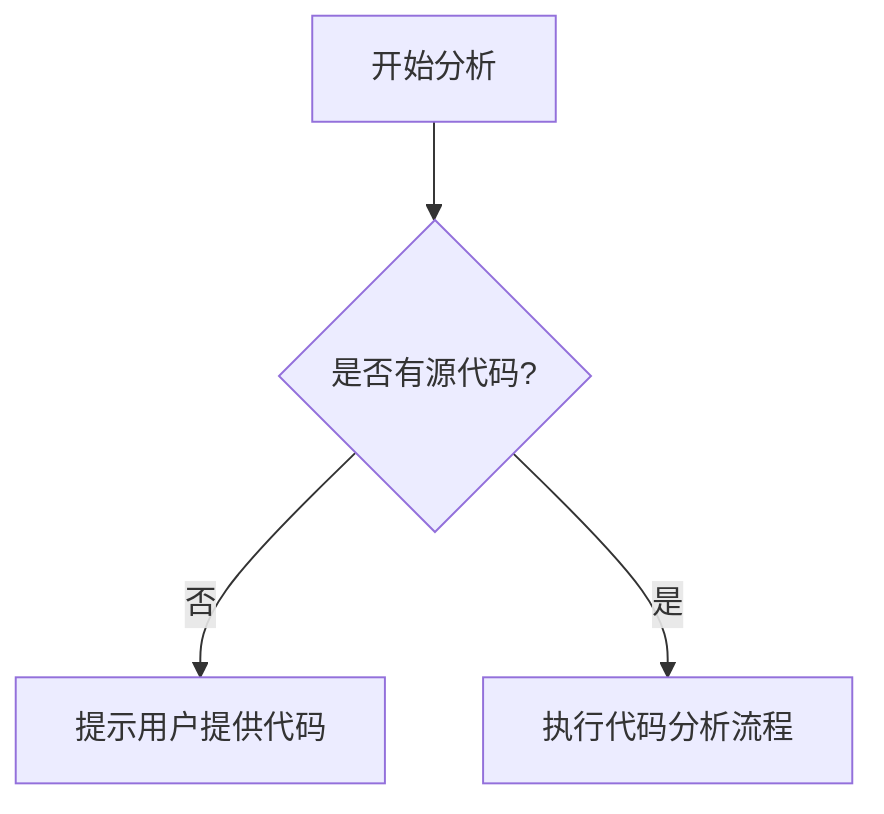

# `diffusers\tests\pipelines\hunyuandit\__init__.py` 详细设计文档

未提供源代码，无法进行分析

## 整体流程



## 类结构

```

```

## 全局变量及字段


    

## 全局函数及方法


## 关键组件


## 问题及建议


### 已知问题

-   代码块为空，未提供待分析的源代码

### 优化建议

-   请在代码块中提供需要分析的源代码，以便进行技术债务识别和优化建议


## 其它


### 设计目标与约束

描述该代码的设计目标、性能要求、约束条件、技术选型理由等。

### 错误处理与异常设计

描述代码中的异常分类、错误码定义、异常处理策略、日志记录机制等。

### 数据流与状态机

描述数据在系统中的流转过程，状态转换逻辑，状态机的定义和实现。

### 外部依赖与接口契约

描述与外部系统或模块的接口定义、API契约、数据格式约定、协议版本等。

### 安全设计考虑

描述身份认证、授权控制、数据加密、输入验证、SQL注入防护等安全机制。

### 性能要求与优化

描述性能指标要求、瓶颈分析、缓存策略、并发控制、资源管理等。

### 兼容性设计

描述向前/向后兼容性、版本演进策略、API版本管理、多平台支持等。

### 测试策略

描述单元测试、集成测试策略、测试覆盖率要求、Mock对象使用等。

### 部署和运维考虑

描述环境配置、热更新机制、监控告警、备份恢复、容量规划等。

### 变更历史和版本管理

描述版本号规则、变更记录、关键版本说明、升级指南等。


    