# `diffusers\tests\pipelines\hunyuandit\test_hunyuan_dit.py` 详细设计文档

这是一个用于测试HunyuanDiT文生图Pipeline的单元测试和集成测试文件，包含了Pipeline的推理测试、批处理测试、前向分块测试、QKV融合测试、模型保存加载测试以及集成测试，验证了Pipeline的核心功能正确性和性能表现。

## 整体流程

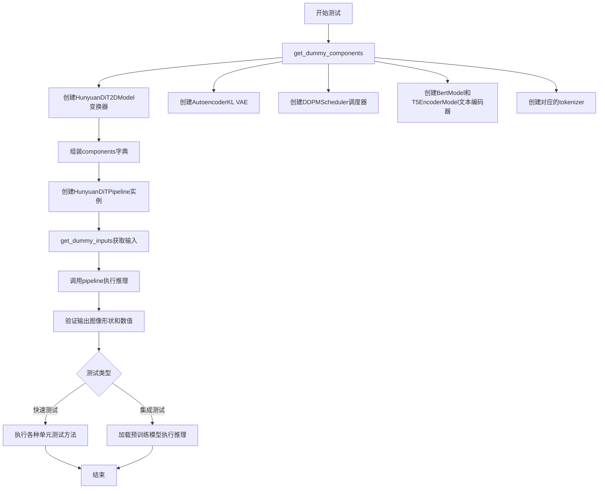

## 类结构

```
unittest.TestCase
├── HunyuanDiTPipelineFastTests (继承PipelineTesterMixin)
│   ├── get_dummy_components()
│   ├── get_dummy_inputs()
│   ├── test_inference()
│   ├── test_inference_batch_single_identical()
│   ├── test_feed_forward_chunking()
│   ├── test_fused_qkv_projections()
│   └── test_save_load_optional_components()
└── HunyuanDiTPipelineIntegrationTests
    ├── setUp()
    ├── tearDown()
    └── test_hunyuan_dit_1024()
```

## 全局变量及字段


### `enable_full_determinism`
    
启用完全确定性测试的函数，确保测试结果可复现

类型：`function`
    


### `HunyuanDiTPipelineFastTests.pipeline_class`
    
被测试的管道类，类型为HunyuanDiTPipeline

类型：`type[HunyuanDiTPipeline]`
    


### `HunyuanDiTPipelineFastTests.params`
    
文本到图像参数集合，已移除cross_attention_kwargs

类型：`set`
    


### `HunyuanDiTPipelineFastTests.batch_params`
    
批处理参数集合，用于批量推理测试

类型：`set`
    


### `HunyuanDiTPipelineFastTests.image_params`
    
图像参数集合，用于图像输出验证

类型：`set`
    


### `HunyuanDiTPipelineFastTests.image_latents_params`
    
图像潜在向量参数集合，用于潜在向量测试

类型：`set`
    


### `HunyuanDiTPipelineFastTests.required_optional_params`
    
必需的可选参数集合，来自PipelineTesterMixin

类型：`set`
    


### `HunyuanDiTPipelineFastTests.test_layerwise_casting`
    
是否测试逐层类型转换的标志

类型：`bool`
    


### `HunyuanDiTPipelineIntegrationTests.prompt`
    
集成测试使用的中文提示词，用于生成图像测试

类型：`str`
    
    

## 全局函数及方法


### `HunyuanDiTPipelineFastTests.get_dummy_components`

该函数用于创建用于测试的虚拟模型组件，初始化并返回一个包含HunyuanDiT2DModel transformer、VAE、调度器、文本编码器和分词器等所有pipeline所需组件的字典，以支持单元测试的进行。

参数：该方法无显式参数（隐式参数`self`为测试类实例）

返回值：`Dict[str, Any]`，返回一个包含以下键的字典：
- `transformer`：HunyuanDiT2DModel实例
- `vae`：AutoencoderKL实例
- `scheduler`：DDPMScheduler实例
- `text_encoder`：BertModel实例
- `tokenizer`：AutoTokenizer实例
- `text_encoder_2`：T5EncoderModel实例
- `tokenizer_2`：AutoTokenizer实例
- `safety_checker`：None
- `feature_extractor`：None

#### 流程图

```mermaid
flowchart TD
    A[开始 get_dummy_components] --> B[设置随机种子 torch.manual_seed(0)]
    B --> C[创建 HunyuanDiT2DModel transformer]
    C --> D[设置随机种子 torch.manual_seed(0)]
    D --> E[创建 AutoencoderKL vae]
    E --> F[创建 DDPMScheduler scheduler]
    F --> G[加载 BertModel 作为 text_encoder]
    G --> H[加载 AutoTokenizer 作为 tokenizer]
    H --> I[加载 T5EncoderModel 作为 text_encoder_2]
    I --> J[加载 AutoTokenizer 作为 tokenizer_2]
    J --> K[构建组件字典 components]
    K --> L[返回 components 字典]
    
    style A fill:#f9f,color:#000
    style L fill:#9f9,color:#000
```

#### 带注释源码

```python
def get_dummy_components(self):
    """
    创建用于测试的虚拟模型组件
    
    该方法初始化一个完整的HunyuanDiT Pipeline所需的所有模型组件，
    用于单元测试目的。所有的模型都是轻量级的随机初始化版本。
    """
    # 设置随机种子以确保测试可重复性
    torch.manual_seed(0)
    
    # 创建HunyuanDiT2DModel transformer模型
    # 参数配置：16x16图像尺寸，2层，2x2 patch，8维attention头
    transformer = HunyuanDiT2DModel(
        sample_size=16,          # 输入样本尺寸
        num_layers=2,            # Transformer层数
        patch_size=2,           # Patch大小
        attention_head_dim=8,   # 每个attention头的维度
        num_attention_heads=3,  # Attention头数量
        in_channels=4,          # 输入通道数
        cross_attention_dim=32, # 跨注意力维度
        cross_attention_dim_t5=32, # T5跨注意力维度
        pooled_projection_dim=16, # 池化投影维度
        hidden_size=24,         # 隐藏层大小
        activation_fn="gelu-approximate", # 激活函数
    )
    
    # 重新设置随机种子，确保VAE与transformer的初始化独立
    torch.manual_seed(0)
    
    # 创建变分自编码器(VAE)模型
    vae = AutoencoderKL()
    
    # 创建DDPMScheduler调度器用于扩散过程
    scheduler = DDPMScheduler()
    
    # 加载轻量级BERT模型作为文本编码器
    text_encoder = BertModel.from_pretrained("hf-internal-testing/tiny-random-BertModel")
    
    # 加载对应的分词器
    tokenizer = AutoTokenizer.from_pretrained("hf-internal-testing/tiny-random-BertModel")
    
    # 加载T5编码器作为第二个文本编码器（用于双文本编码器架构）
    text_encoder_2 = T5EncoderModel.from_pretrained("hf-internal-testing/tiny-random-t5")
    
    # 加载T5对应的分词器
    tokenizer_2 = AutoTokenizer.from_pretrained("hf-internal-testing/tiny-random-t5")
    
    # 将所有组件组装成字典
    # 注意：safety_checker和feature_extractor设为None（可选组件）
    components = {
        "transformer": transformer.eval(),     # 设置为评估模式
        "vae": vae.eval(),                     # 设置为评估模式
        "scheduler": scheduler,
        "text_encoder": text_encoder,
        "tokenizer": tokenizer,
        "text_encoder_2": text_encoder_2,
        "tokenizer_2": tokenizer_2,
        "safety_checker": None,                # 可选安全检查器
        "feature_extractor": None,             # 可选特征提取器
    }
    
    # 返回包含所有组件的字典，供pipeline初始化使用
    return components
```


### `HunyuanDiTPipelineFastTests.get_dummy_inputs`

该方法用于创建用于测试的虚拟输入参数，为 HunyuanDiT2D 管道生成一组标准的测试输入，包括提示词、生成器、推理步数、引导比例等，便于在单元测试中统一复用。

参数：

- `self`：隐式参数，测试类实例本身
- `device`：`str` 或 `torch.device`，目标设备，用于创建随机生成器
- `seed`：`int`，默认值为 `0`，随机种子，用于保证测试可复现性

返回值：`dict`，包含以下键值对的字典：
- `prompt`（str）：测试用提示词
- `generator`（torch.Generator）：随机数生成器
- `num_inference_steps`（int）：推理步数
- `guidance_scale`（float）：引导比例
- `output_type`（str）：输出类型
- `use_resolution_binning`（bool）：是否启用分辨率分箱

#### 流程图

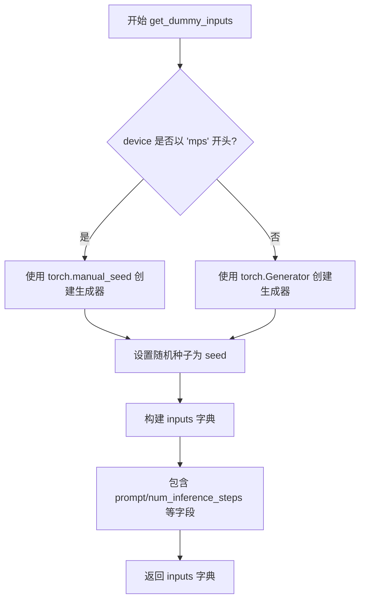

#### 带注释源码

```python
def get_dummy_inputs(self, device, seed=0):
    """
    创建用于测试的虚拟输入参数。
    
    Args:
        device: 目标设备，用于判断是否使用 MPS 后端
        seed: 随机种子，用于保证测试结果可复现
    
    Returns:
        dict: 包含管道推理所需参数的字典
    """
    # 判断设备是否为 Apple MPS (Metal Performance Shaders)
    if str(device).startswith("mps"):
        # MPS 设备不支持 torch.Generator，使用 torch.manual_seed 替代
        generator = torch.manual_seed(seed)
    else:
        # 其他设备使用 torch.Generator 获取可复现的随机数
        generator = torch.Generator(device=device).manual_seed(seed)
    
    # 构建测试所需的输入参数字典
    inputs = {
        "prompt": "A painting of a squirrel eating a burger",  # 测试用英文提示词
        "generator": generator,                                 # 随机数生成器
        "num_inference_steps": 2,                               # 推理步数（较少以加快测试速度）
        "guidance_scale": 5.0,                                  # Classifier-free guidance 引导比例
        "output_type": "np",                                    # 输出为 numpy 数组
        "use_resolution_binning": False,                        # 禁用分辨率分箱以简化测试
    }
    return inputs
```


### `test_inference`

测试 HunyuanDiT Pipeline 的基础推理功能，验证模型能够根据文本提示生成图像，并检查输出图像的形状和像素值是否符合预期。

参数：

- `self`：隐式参数，unittest.TestCase 实例本身

返回值：`None`（无返回值），该方法为测试方法，通过断言验证功能正确性

#### 流程图

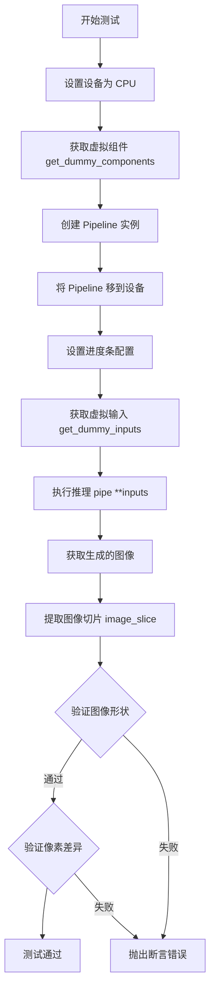

#### 带注释源码

```python
def test_inference(self):
    """测试 HunyuanDiT Pipeline 的基础推理功能"""
    # 1. 设置测试设备为 CPU
    device = "cpu"

    # 2. 获取虚拟组件（用于测试的轻量级模型组件）
    components = self.get_dummy_components()
    
    # 3. 使用虚拟组件创建 Pipeline 实例
    pipe = self.pipeline_class(**components)
    
    # 4. 将 Pipeline 移至指定设备（CPU）
    pipe.to(device)
    
    # 5. 配置进度条（disable=None 表示启用进度条）
    pipe.set_progress_bar_config(disable=None)

    # 6. 获取虚拟输入参数
    inputs = self.get_dummy_inputs(device)
    
    # 7. 执行推理，获取生成的图像结果
    image = pipe(**inputs).images
    
    # 8. 提取图像右下角 3x3 像素块用于验证
    image_slice = image[0, -3:, -3:, -1]

    # 9. 断言验证：图像形状应为 (1, 16, 16, 3)
    # 1 张图片，16x16 分辨率，3 通道（RGB）
    self.assertEqual(image.shape, (1, 16, 16, 3))
    
    # 10. 定义预期像素值（基于确定性随机种子）
    expected_slice = np.array(
        [0.56939435, 0.34541583, 0.35915792, 0.46489206, 0.38775963, 
         0.45004836, 0.5957267, 0.59481275, 0.33287364]
    )
    
    # 11. 计算实际输出与预期输出的最大差异
    max_diff = np.abs(image_slice.flatten() - expected_slice).max()
    
    # 12. 断言验证：最大差异应小于等于 0.001（1e-3）
    self.assertLessEqual(max_diff, 1e-3)
```


### `HunyuanDiTPipelineFastTests.test_inference_batch_single_identical`

该测试方法用于验证 HunyuanDiT Pipeline 在批处理模式（batch）和单张图像模式（single）下的输出一致性，确保模型在两种推理方式下生成相同的图像结果。

参数：

- `self`：`HunyuanDiTPipelineFastTests`，测试类实例，隐式参数

返回值：`None`，测试方法无返回值，通过断言验证一致性

#### 流程图

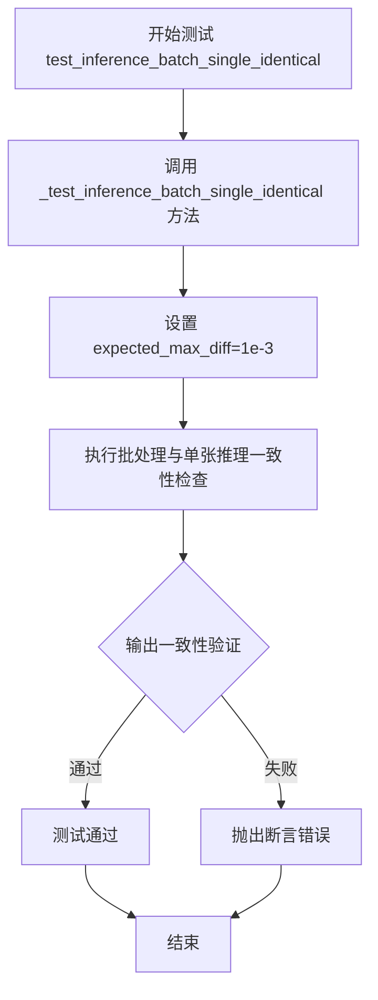

#### 带注释源码

```python
def test_inference_batch_single_identical(self):
    """
    测试批处理和单张图像推理的一致性。
    
    该测试方法验证在使用相同的输入参数时，Pipeline 对单张图像的推理结果
    与对批处理（batch_size=1）的推理结果保持一致。这是确保模型行为确定性
    的重要测试用例。
    
    测试逻辑：
    1. 调用父类/混入的 _test_inference_batch_single_identical 方法
    2. 设置预期最大差异阈值为 1e-3
    3. 内部会分别进行单张推理和批量推理，然后比较输出差异
    """
    # 调用测试混入类提供的批处理一致性测试方法
    # expected_max_diff=1e-3 表示批处理和单张输出的最大允许差异
    self._test_inference_batch_single_identical(
        expected_max_diff=1e-3,
    )
```


### `HunyuanDiTPipelineFastTests.test_feed_forward_chunking`

该测试方法用于验证 HunyuanDiT Pipeline 的前向分块（forward chunking）功能是否正常工作。测试通过比较启用分块与未启用分块两种情况下的输出图像，确保分块处理不会影响最终的生成结果，从而验证前向分块功能的正确性。

参数：

- `self`：HunyuanDiTPipelineFastTests，隐含的测试类实例参数，代表当前测试用例对象

返回值：`None`，无返回值。该测试方法通过 `self.assertLess` 断言来验证分块与不分块输出的差异是否在可接受范围内，若验证失败则抛出异常。

#### 流程图

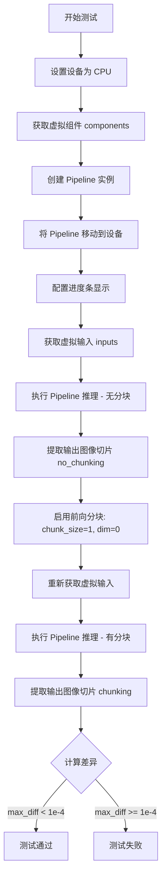

#### 带注释源码

```python
def test_feed_forward_chunking(self):
    """
    测试前向分块功能。
    
    该测试验证启用 forward chunking 后，模型的输出与未启用时保持一致。
    这对于内存优化和长序列处理非常重要。
    """
    # 设置测试设备为 CPU
    device = "cpu"

    # 获取虚拟组件（transformer, vae, scheduler, text_encoder, tokenizer 等）
    components = self.get_dummy_components()
    
    # 使用虚拟组件创建 HunyuanDiTPipeline 实例
    pipe = self.pipeline_class(**components)
    
    # 将 Pipeline 移动到指定设备
    pipe.to(device)
    
    # 配置进度条（disable=None 表示启用进度条）
    pipe.set_progress_bar_config(disable=None)

    # 获取虚拟输入（包含 prompt, generator, num_inference_steps 等）
    inputs = self.get_dummy_inputs(device)
    
    # 执行推理（不启用分块）
    image = pipe(**inputs).images
    
    # 提取输出图像的最后 3x3 像素切片（用于比较）
    image_slice_no_chunking = image[0, -3:, -3:, -1]

    # 启用前向分块：按维度 0（序列长度维度）分块，每块大小为 1
    pipe.transformer.enable_forward_chunking(chunk_size=1, dim=0)
    
    # 重新获取虚拟输入（使用相同的随机种子以确保可重复性）
    inputs = self.get_dummy_inputs(device)
    
    # 执行推理（启用分块）
    image = pipe(**inputs).images
    
    # 提取启用分块后的输出图像切片
    image_slice_chunking = image[0, -3:, -3:, -1]

    # 计算两种情况输出的最大差异
    max_diff = np.abs(to_np(image_slice_no_chunking) - to_np(image_slice_chunking)).max()
    
    # 断言：差异必须小于 1e-4，确保分块功能不影响输出质量
    self.assertLess(max_diff, 1e-4)
```


### `HunyuanDiTPipelineFastTests.test_fused_qkv_projections`

该方法用于测试 HunyuanDiT Pipeline 中 QKV（Query、Key、Value）投影融合功能，验证融合操作不会影响模型输出结果，通过对比原始输出、融合后输出和解融后输出的差异来确保功能的正确性和可逆性。

参数：

- `self`：隐式参数，HunyuanDiTPipelineFastTests 实例本身，无需额外描述

返回值：`None`，该方法为单元测试方法，通过断言验证功能，不返回任何值

#### 流程图

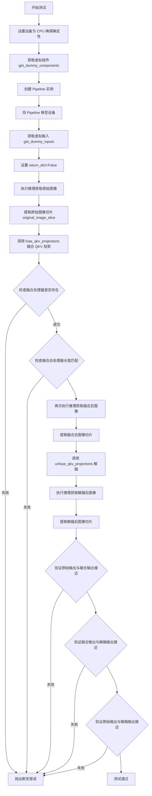

#### 带注释源码

```python
def test_fused_qkv_projections(self):
    """
    测试 QKV 投影融合功能。
    
    该测试验证以下场景：
    1. 融合 QKV 投影后，模型输出应与原始输出一致
    2. 解融 QKV 投影后，模型输出应恢复到原始状态
    3. 融合/解融操作是可逆的
    """
    # 设置设备为 CPU，以确保 torch.Generator 的确定性
    device = "cpu"  # ensure determinism for the device-dependent torch.Generator
    
    # 获取用于测试的虚拟组件（transformer、VAE、scheduler、text_encoder 等）
    components = self.get_dummy_components()
    
    # 使用虚拟组件创建 HunyuanDiTPipeline 实例
    pipe = self.pipeline_class(**components)
    
    # 将 Pipeline 移至指定设备（CPU）
    pipe = pipe.to(device)
    
    # 配置进度条（disable=None 表示不禁用）
    pipe.set_progress_bar_config(disable=None)

    # 获取虚拟输入参数（包含 prompt、generator、num_inference_steps 等）
    inputs = self.get_dummy_inputs(device)
    
    # 设置为非字典返回模式，直接返回元组
    inputs["return_dict"] = False
    
    # 执行推理，获取原始图像（索引 [0] 取第一张图像）
    image = pipe(**inputs)[0]
    
    # 提取图像右下角 3x3 区域用于后续对比（-3: 表示最后3行/列）
    original_image_slice = image[0, -3:, -3:, -1]

    # 调用 transformer 的 fuse_qkv_projections 方法，融合 QKV 投影
    # 这会将分离的 Q、K、V 投影合并为单一的融合投影
    pipe.transformer.fuse_qkv_projections()
    
    # TODO (sayakpaul): will refactor this once `fuse_qkv_projections()` has been added
    # to the pipeline level.
    # 再次调用确认（可能用于测试幂等性或确保状态正确）
    pipe.transformer.fuse_qkv_projections()
    
    # 断言：验证融合后的注意力处理器确实存在
    # check_qkv_fusion_processors_exist 检查所有注意力处理器是否已融合
    assert check_qkv_fusion_processors_exist(pipe.transformer), (
        "Something wrong with the fused attention processors. Expected all the attention processors to be fused."
    )
    
    # 断言：验证融合后的处理器数量与原始处理器数量匹配
    # check_qkv_fusion_matches_attn_procs_length 检查融合后的处理器长度一致性
    assert check_qkv_fusion_matches_attn_procs_length(
        pipe.transformer, pipe.transformer.original_attn_processors
    ), "Something wrong with the attention processors concerning the fused QKV projections."

    # 使用相同输入执行融合后的推理
    inputs = self.get_dummy_inputs(device)
    inputs["return_dict"] = False
    
    # 执行推理，获取融合后的图像
    image_fused = pipe(**inputs)[0]
    
    # 提取融合后图像的相同区域切片
    image_slice_fused = image_fused[0, -3:, -3:, -1]

    # 调用 unfuse_qkv_projections 方法，解融 QKV 投影
    # 恢复到融合前的分离 Q、K、V 投影状态
    pipe.transformer.unfuse_qkv_projections()
    
    # 再次执行推理，获取解融后的图像
    inputs = self.get_dummy_inputs(device)
    inputs["return_dict"] = False
    image_disabled = pipe(**inputs)[0]
    
    # 提取解融后图像的相同区域切片
    image_slice_disabled = image_disabled[0, -3:, -3:, -1]

    # 断言：验证 QKV 融合不会影响模型输出
    # 使用 np.allclose 比较，允许一定的数值误差（相对误差 rtol=1e-2，绝对误差 atol=1e-2）
    assert np.allclose(original_image_slice, image_slice_fused, atol=1e-2, rtol=1e-2), (
        "Fusion of QKV projections shouldn't affect the outputs."
    )
    
    # 断言：验证融合后解融的输出应与融合时输出一致
    # 确保禁用融合后的输出与融合时相同
    assert np.allclose(image_slice_fused, image_slice_disabled, atol=1e-2, rtol=1e-2), (
        "Outputs, with QKV projection fusion enabled, shouldn't change when fused QKV projections are disabled."
    )
    
    # 断言：验证原始输出与解融后输出应完全一致
    # 确保融合/解融操作是完全可逆的
    assert np.allclose(original_image_slice, image_slice_disabled, atol=1e-2, rtol=1e-2), (
        "Original outputs should match when fused QKV projections are disabled."
    )
```


### `HunyuanDiTPipelineFastTests.test_save_load_optional_components`

该测试方法验证了管道在保存和加载时正确处理可选组件（optional components），确保当可选组件被设置为 None 时，保存和加载后仍能保持为 None，并且两次推理的输出结果一致。

参数：

- `self`：`HunyuanDiTPipelineFastTests`，测试类实例本身

返回值：`None`，该方法为测试方法，不返回任何值，通过 `self.assertLess` 等断言验证结果

#### 流程图

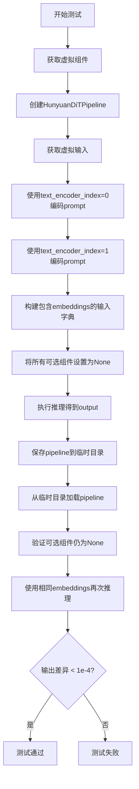

#### 带注释源码

```python
def test_save_load_optional_components(self):
    """
    测试可选组件的保存和加载功能
    验证当可选组件设为None时，保存加载后仍为None，且输出保持一致
    """
    # 步骤1: 获取虚拟组件配置
    components = self.get_dummy_components()
    
    # 步骤2: 创建pipeline并移至测试设备
    pipe = self.pipeline_class(**components)
    pipe.to(torch_device)
    pipe.set_progress_bar_config(disable=None)

    # 步骤3: 获取虚拟输入参数
    inputs = self.get_dummy_inputs(torch_device)

    # 提取需要的输入参数
    prompt = inputs["prompt"]
    generator = inputs["generator"]
    num_inference_steps = inputs["num_inference_steps"]
    output_type = inputs["output_type"]

    # 步骤4: 使用第一个文本编码器编码prompt (text_encoder_index=0)
    (
        prompt_embeds,
        negative_prompt_embeds,
        prompt_attention_mask,
        negative_prompt_attention_mask,
    ) = pipe.encode_prompt(prompt, device=torch_device, dtype=torch.float32, text_encoder_index=0)

    # 步骤5: 使用第二个文本编码器编码prompt (text_encoder_index=1)
    (
        prompt_embeds_2,
        negative_prompt_embeds_2,
        prompt_attention_mask_2,
        negative_prompt_attention_mask_2,
    ) = pipe.encode_prompt(
        prompt,
        device=torch_device,
        dtype=torch.float32,
        text_encoder_index=1,
    )

    # 步骤6: 构建包含预计算embeddings的输入字典
    # 避免在测试中重复编码，提高测试效率
    inputs = {
        "prompt_embeds": prompt_embeds,
        "prompt_attention_mask": prompt_attention_mask,
        "negative_prompt_embeds": negative_prompt_embeds,
        "negative_prompt_attention_mask": negative_prompt_attention_mask,
        "prompt_embeds_2": prompt_embeds_2,
        "prompt_attention_mask_2": prompt_attention_mask_2,
        "negative_prompt_embeds_2": negative_prompt_embeds_2,
        "negative_prompt_attention_mask_2": negative_prompt_attention_mask_2,
        "generator": generator,
        "num_inference_steps": num_inference_steps,
        "output_type": output_type,
        "use_resolution_binning": False,
    }

    # 步骤7: 将pipeline的所有可选组件设置为None
    # _optional_components是pipeline中标记为可选的组件列表
    for optional_component in pipe._optional_components:
        setattr(pipe, optional_component, None)

    # 步骤8: 使用设置了可选组件为None的pipeline进行推理
    output = pipe(**inputs)[0]

    # 步骤9: 创建临时目录并保存pipeline
    with tempfile.TemporaryDirectory() as tmpdir:
        pipe.save_pretrained(tmpdir)
        # 步骤10: 从保存的目录加载新的pipeline
        pipe_loaded = self.pipeline_class.from_pretrained(tmpdir)
        pipe_loaded.to(torch_device)
        pipe_loaded.set_progress_bar_config(disable=None)

    # 步骤11: 验证加载后的pipeline中可选组件仍为None
    for optional_component in pipe._optional_components:
        self.assertTrue(
            getattr(pipe_loaded, optional_component) is None,
            f"`{optional_component}` did not stay set to None after loading.",
        )

    # 步骤12: 使用相同的embeddings再次进行推理
    inputs = self.get_dummy_inputs(torch_device)

    generator = inputs["generator"]
    num_inference_steps = inputs["num_inference_steps"]
    output_type = inputs["output_type"]

    # 重新构建输入字典（与步骤6相同）
    inputs = {
        "prompt_embeds": prompt_embeds,
        "prompt_attention_mask": prompt_attention_mask,
        "negative_prompt_embeds": negative_prompt_embeds,
        "negative_prompt_attention_mask": negative_prompt_attention_mask,
        "prompt_embeds_2": prompt_embeds_2,
        "prompt_attention_mask_2": prompt_attention_mask_2,
        "negative_prompt_embeds_2": negative_prompt_embeds_2,
        "negative_prompt_attention_mask_2": negative_prompt_attention_mask_2,
        "generator": generator,
        "num_inference_steps": num_inference_steps,
        "output_type": output_type,
        "use_resolution_binning": False,
    }

    # 步骤13: 使用加载的pipeline进行推理
    output_loaded = pipe_loaded(**inputs)[0]

    # 步骤14: 验证两次推理输出的差异在可接受范围内
    max_diff = np.abs(to_np(output) - to_np(output_loaded)).max()
    self.assertLess(max_diff, 1e-4)
```


### `HunyuanDiTPipelineIntegrationTests.setUp`

集成测试前的初始化设置，用于清理垃圾回收和清空 GPU 缓存，为测试准备干净的环境。

参数：

- `self`：无类型，unittest.TestCase 实例本身，用于访问类的属性和方法

返回值：`None`，无返回值，仅执行初始化操作

#### 流程图

```mermaid
flowchart TD
    A[开始 setUp] --> B[调用 super().setUp]
    B --> C[执行 gc.collect]
    C --> D[调用 backend_empty_cache]
    D --> E[结束 setUp]
```

#### 带注释源码

```python
def setUp(self):
    # 调用父类 TestCase 的 setUp 方法，确保 unittest 框架正确初始化
    super().setUp()
    # 手动触发 Python 垃圾回收，释放未使用的内存对象
    gc.collect()
    # 清空 GPU/后端缓存，确保测试从干净的状态开始
    # 避免之前测试的内存或计算图残留影响当前测试
    backend_empty_cache(torch_device)
```


### `HunyuanDiTPipelineIntegrationTests.tearDown`

这是集成测试类的清理方法，用于在每个集成测试完成后释放GPU内存和执行垃圾回收，确保测试环境干净，防止内存泄漏。

参数：
- 无（除了隐含的 `self` 参数）

返回值：`None`，无返回值

#### 流程图

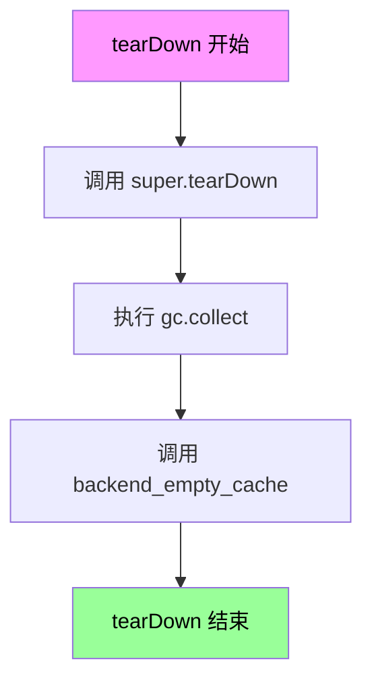

#### 带注释源码

```python
def tearDown(self):
    """
    集成测试后的清理工作
    
    该方法在每个集成测试执行完毕后被调用，负责清理测试过程中
    产生的GPU内存和Python对象，防止测试间的内存泄漏。
    """
    # 调用父类的 tearDown 方法，执行基础清理
    super().tearDown()
    
    # 手动触发 Python 垃圾回收，释放不再使用的对象
    gc.collect()
    
    # 清空 GPU 显存缓存，释放 GPU 内存
    backend_empty_cache(torch_device)
```

#### 补充说明

| 项目 | 描述 |
|------|------|
| **所属类** | `HunyuanDiTPipelineIntegrationTests` |
| **调用时机** | 每个集成测试方法执行完毕后自动调用 |
| **核心功能** | 资源清理与内存释放 |
| **依赖模块** | `gc` (Python垃圾回收), `backend_empty_cache` (GPU缓存清理) |


### `HunyuanDiTPipelineIntegrationTests.test_hunyuan_dit_1024`

测试1024分辨率的文生图功能，加载预训练的HunyuanDiT模型，使用指定提示词生成1024x1024分辨率的图像，并验证生成结果与预期值的余弦相似度距离是否在允许范围内。

参数：

- `self`：无参数类型，测试用例实例本身
- `generator`：`torch.Generator`，随机数生成器，用于控制生成过程的可重现性
- `pipe`：`HunyuanDiTPipeline`，从预训练模型加载的HunyuanDiT扩散管道实例
- `prompt`：`str`，文本提示词（"一个宇航员在骑马"）
- `height`：`int`，生成图像的高度（1024）
- `width`：`int`，生成图像的宽度（1024）
- `num_inference_steps`：`int`，推理步数（2）
- `output_type`：`str`，输出类型（"np"，即numpy数组）

返回值：`numpy.ndarray`，生成的图像数组，形状为(1, 1024, 1024, 3)，包含RGB通道值

#### 流程图

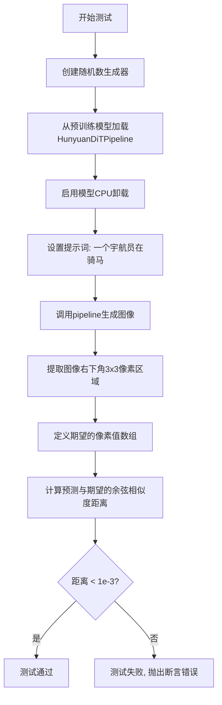

#### 带注释源码

```python
@unittest.skip(
    "Test not supported as `encode_prompt` is called two times separately which deivates from about 99% of the pipelines we have."
)
def test_encode_prompt_works_in_isolation(self):
    pass

@slow  # 标记为慢速测试，需要显式启用
@require_torch_accelerator  # 需要GPU加速器才能运行
class HunyuanDiTPipelineIntegrationTests(unittest.TestCase):
    prompt = "一个宇航员在骑马"  # 测试用的中文提示词

    def setUp(self):
        """测试前清理缓存"""
        super().setUp()
        gc.collect()  # 垃圾回收
        backend_empty_cache(torch_device)  # 清空GPU缓存

    def tearDown(self):
        """测试后清理缓存"""
        super().tearDown()
        gc.collect()
        backend_empty_cache(torch_device)

    def test_hunyuan_dit_1024(self):
        """测试1024分辨率的文生图功能"""
        # 创建CPU上的随机数生成器，种子为0确保可重现性
        generator = torch.Generator("cpu").manual_seed(0)

        # 从HuggingFace Hub加载预训练的HunyuanDiT模型
        # XCLiu/HunyuanDiT-0523: 模型ID
        # revision="refs/pr/2": 指定特定的模型版本
        # torch_dtype=torch.float16: 使用半精度浮点数减少内存占用
        pipe = HunyuanDiTPipeline.from_pretrained(
            "XCLiu/HunyuanDiT-0523", revision="refs/pr/2", torch_dtype=torch.float16
        )
        
        # 启用模型CPU卸载，在推理时将模型临时移到GPU，处理完后再移回CPU
        # 这样可以减少GPU显存占用
        pipe.enable_model_cpu_offload(device=torch_device)
        
        # 获取测试提示词
        prompt = self.prompt

        # 调用pipeline进行图像生成
        # 参数:
        #   prompt: 文本提示词
        #   height/width: 1024 指定输出分辨率
        #   generator: 随机数生成器
        #   num_inference_steps: 2 扩散推理步数，越多越精细但越慢
        #   output_type: "np" 输出numpy数组格式
        image = pipe(
            prompt=prompt, 
            height=1024, 
            width=1024, 
            generator=generator, 
            num_inference_steps=2, 
            output_type="np"
        ).images

        # 提取生成的图像右下角3x3像素区域用于验证
        # image shape: (1, 1024, 1024, 3) -> [batch, height, width, channels]
        image_slice = image[0, -3:, -3:, -1]
        
        # 期望的像素值（预先计算好的基准值）
        expected_slice = np.array(
            [0.48388672, 0.33789062, 0.30737305, 0.47875977, 0.25097656, 0.30029297, 0.4440918, 0.26953125, 0.30078125]
        )

        # 计算预测结果与期望值的余弦相似度距离
        max_diff = numpy_cosine_similarity_distance(image_slice.flatten(), expected_slice)
        
        # 断言：距离必须小于1e-3，否则测试失败
        assert max_diff < 1e-3, f"Max diff is too high. got {image_slice.flatten()}"
```


### HunyuanDiTPipelineFastTests.get_dummy_components

该方法用于创建测试所需的虚拟（dummy）模型组件集合，初始化 HunyuanDiT2DModel、AutoencoderKL、DDPMScheduler、BertModel、T5EncoderModel 等扩散管道所需的全部模型组件，并返回一个包含所有组件的字典供测试使用。

参数：

- `self`：`HunyuanDiTPipelineFastTests`，隐式参数，测试类实例本身

返回值：`Dict[str, Any]`，返回包含以下键的字典：
- `transformer`: HunyuanDiT2DModel 实例
- `vae`: AutoencoderKL 实例
- `scheduler`: DDPMScheduler 实例
- `text_encoder`: BertModel 实例
- `tokenizer`: AutoTokenizer 实例
- `text_encoder_2`: T5EncoderModel 实例
- `tokenizer_2`: AutoTokenizer 实例
- `safety_checker`: None
- `feature_extractor`: None

#### 流程图

```mermaid
flowchart TD
    A[开始 get_dummy_components] --> B[设置随机种子 torch.manual_seed(0)]
    B --> C[创建 HunyuanDiT2DModel 转换器]
    C --> D[设置随机种子 torch.manual_seed(0)]
    D --> E[创建 AutoencoderKL VAE]
    E --> F[创建 DDPMScheduler 调度器]
    F --> G[创建 BertModel text_encoder]
    G --> H[创建 AutoTokenizer tokenizer]
    H --> I[创建 T5EncoderModel text_encoder_2]
    I --> J[创建 AutoTokenizer tokenizer_2]
    J --> K[构建 components 字典]
    K --> L[设置 safety_checker 和 feature_extractor 为 None]
    L --> M[返回 components 字典]
```

#### 带注释源码

```python
def get_dummy_components(self):
    """
    创建用于测试的虚拟组件集合。
    初始化所有必需的模型组件用于扩散管道测试。
    """
    # 设置随机种子确保测试可重复性
    torch.manual_seed(0)
    
    # 创建 HunyuanDiT2DModel 转换器模型
    # 参数配置：16x16图像，2层，2x2 patch，8维注意力头，3个注意力头
    # 4通道输入，32维交叉注意力，T5文本编码器维度32，池化投影维度16，隐藏层24
    transformer = HunyuanDiT2DModel(
        sample_size=16,       # 输入样本尺寸
        num_layers=2,          # Transformer层数
        patch_size=2,          # 图像patch大小
        attention_head_dim=8, # 注意力头维度
        num_attention_heads=3,# 注意力头数量
        in_channels=4,         # 输入通道数（RGB+alpha）
        cross_attention_dim=32,# 交叉注意力维度（BERT）
        cross_attention_dim_t5=32,# T5交叉注意力维度
        pooled_projection_dim=16,# 池化投影维度
        hidden_size=24,        # 隐藏层维度
        activation_fn="gelu-approximate",# 激活函数
    )
    
    # 重新设置种子确保VAE与转换器有相同的初始状态
    torch.manual_seed(0)
    
    # 创建AutoencoderKL VAE模型用于图像编码/解码
    vae = AutoencoderKL()
    
    # 创建DDPMScheduler调度器用于扩散过程
    scheduler = DDPMScheduler()
    
    # 创建文本编码器1：BertModel
    # 使用HuggingFace测试用的小型随机模型
    text_encoder = BertModel.from_pretrained("hf-internal-testing/tiny-random-BertModel")
    
    # 创建对应的分词器1
    tokenizer = AutoTokenizer.from_pretrained("hf-internal-testing/tiny-random-BertModel")
    
    # 创建文本编码器2：T5EncoderModel（用于双文本编码器管道）
    text_encoder_2 = T5EncoderModel.from_pretrained("hf-internal-testing/tiny-random-t5")
    
    # 创建对应的分词器2
    tokenizer_2 = AutoTokenizer.from_pretrained("hf-internal-testing/tiny-random-t5")
    
    # 组装所有组件到字典中
    components = {
        "transformer": transformer.eval(),  # 设置为评估模式
        "vae": vae.eval(),                   # VAE评估模式
        "scheduler": scheduler,              # 调度器无需评估模式
        "text_encoder": text_encoder,        # BERT文本编码器
        "tokenizer": tokenizer,               # BERT分词器
        "text_encoder_2": text_encoder_2,     # T5文本编码器
        "tokenizer_2": tokenizer_2,           # T5分词器
        "safety_checker": None,              # 安全检查器（可选组件）
        "feature_extractor": None,           # 特征提取器（可选组件）
    }
    
    return components
```

---

### 整体设计文档

#### 1. 一句话描述

该代码定义了 `HunyuanDiTPipeline` 扩散管道的单元测试类，通过 `get_dummy_components()` 方法创建虚拟模型组件，用于验证 HunyuanDiT 文本到图像扩散管道在 CPU 和 GPU 上的推理、批处理、QKV融合、模型保存加载等功能。

#### 2. 文件运行流程

```
1. 导入依赖库（torch, numpy, transformers, diffusers等）
2. 配置测试工具和辅助函数
3. 定义 HunyuanDiTPipelineFastTests 测试类
   ├── get_dummy_components() - 创建虚拟组件
   ├── get_dummy_inputs() - 创建测试输入
   ├── test_inference() - 基础推理测试
   ├── test_inference_batch_single_identical() - 批处理一致性测试
   ├── test_feed_forward_chunking() - 前向分块测试
   ├── test_fused_qkv_projections() - QKV融合测试
   └── test_save_load_optional_components() - 保存加载测试
4. 定义 HunyuanDiTPipelineIntegrationTests 集成测试类
   └── test_hunyuan_dit_1024() - 1024x1024分辨率集成测试
```

#### 3. 类详细信息

| 类名 | 说明 |
|------|------|
| **HunyuanDiTPipelineFastTests** | 单元测试类，继承 `PipelineTesterMixin` 和 `unittest.TestCase`，测试扩散管道的基础功能 |
| **HunyuanDiTPipelineIntegrationTests** | 集成测试类，使用真实预训练模型进行端到端测试 |

**全局变量/函数：**

| 名称 | 类型 | 描述 |
|------|------|------|
| `enable_full_determinism` | 函数 | 启用完全确定性以确保测试可重复性 |
| `numpy_cosine_similarity_distance` | 函数 | 计算numpy数组之间的余弦相似度距离 |
| `torch_device` | 变量 | 测试使用的设备（CPU/CUDA） |

#### 4. 关键组件信息

| 组件 | 描述 |
|------|------|
| **HunyuanDiT2DModel** | HunyuanDiT 2D扩散变换器模型，核心去噪网络 |
| **AutoencoderKL** | VAE变分自编码器，用于图像编码和解码 |
| **DDPMScheduler** | DDPM噪声调度器，控制扩散过程 |
| **BertModel** | BERT文本编码器（文本编码器1） |
| **T5EncoderModel** | T5文本编码器（文本编码器2） |
| **AutoTokenizer** | 分词器，用于文本到token的转换 |

#### 5. 潜在技术债务与优化空间

1. **硬编码的随机种子**：使用 `torch.manual_seed(0)` 两次初始化不同模型可能导致状态共享问题，应考虑使用更清晰的随机性管理方式

2. **跳过测试的注释技术债务**：多个测试方法因 `MultiheadAttention` 问题被跳过（`test_sequential_cpu_offload_forward_pass`, `test_sequential_offload_forward_pass_twice`），这是已知问题但未解决

3. **双文本编码器支持**：虽然代码支持双文本编码器（BERT+T5），但测试覆盖可能不完整，`test_encode_prompt_works_in_isolation` 被跳过

4. **测试资源使用**：集成测试使用 `torch.float16` 和模型CPU卸载，应确保GPU内存正确释放（`gc.collect()`, `backend_empty_cache`）

5. **magic number**：hidden_size=24, num_layers=2 等超参数应提取为常量或配置

#### 6. 其它项目

**设计目标与约束：**
- 支持文本到图像生成
- 支持双文本编码器架构
- 兼容 HuggingFace Diffusers 框架
- 支持 CPU 和 CUDA 设备

**错误处理与异常设计：**
- 使用 `unittest.skip` 跳过已知不兼容的测试
- 集成测试使用 `@slow` 和 `@require_torch_accelerator` 标记

**数据流与状态机：**
```
文本输入 → Tokenizer → Text Encoder → 文本嵌入
                                       ↓
图像噪声 → Scheduler → Transformer → 去噪过程
                         ↓
                VAE Decoder → 最终图像输出
```

**外部依赖与接口契约：**
- 依赖 `transformers` 库的 BertModel, T5EncoderModel, AutoTokenizer
- 依赖 `diffusers` 库的 HunyuanDiT2DModel, AutoencoderKL, DDPMScheduler, HunyuanDiTPipeline
- 组件字典遵循 `HunyuanDiTPipeline` 的构造函数签名


### `HunyuanDiTPipelineFastTests.get_dummy_inputs`

该方法用于生成文本到图像扩散管道测试所需的虚拟输入参数，包括提示词、随机数生成器、推理步数、引导比例等配置。

参数：

- `self`：隐式参数，测试类实例本身
- `device`：`str` 或 `torch.device`，目标计算设备，用于创建随机数生成器
- `seed`：`int`，随机数种子，默认为 0，用于确保测试结果可复现

返回值：`Dict[str, Any]`，包含以下键值对的字典：
- `prompt`：`str`，文本提示词
- `generator`：`torch.Generator`，随机数生成器实例
- `num_inference_steps`：`int`，扩散模型推理步数
- `guidance_scale`：`float`，分类器自由引导比例
- `output_type`：`str`，输出类型（"np" 表示 NumPy 数组）
- `use_resolution_binning`：`bool`，是否启用分辨率分箱

#### 流程图

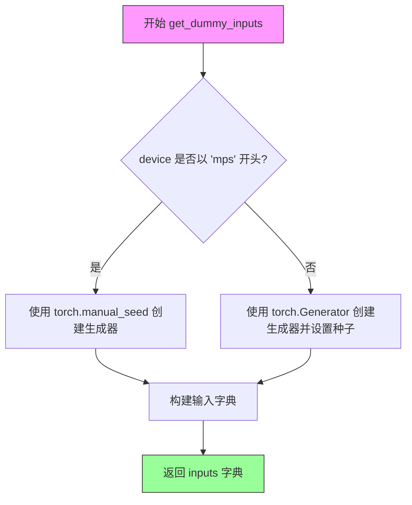

#### 带注释源码

```python
def get_dummy_inputs(self, device, seed=0):
    """
    生成用于测试 HunyuanDiT 管道的虚拟输入参数
    
    参数:
        device: 目标计算设备（如 'cpu', 'cuda', 'mps'）
        seed: 随机种子，用于确保测试结果可复现
    
    返回:
        包含管道推理所需参数的字典
    """
    # 判断设备类型，MPS 设备需要特殊处理
    if str(device).startswith("mps"):
        # MPS 设备不支持 torch.Generator，使用 CPU 随机种子
        generator = torch.manual_seed(seed)
    else:
        # 其他设备创建指定设备的随机数生成器并设置种子
        generator = torch.Generator(device=device).manual_seed(seed)
    
    # 构建输入参数字典
    inputs = {
        "prompt": "A painting of a squirrel eating a burger",  # 测试用文本提示
        "generator": generator,  # 随机数生成器确保扩散过程可复现
        "num_inference_steps": 2,  # 减少推理步数以加快测试速度
        "guidance_scale": 5.0,  # cfg 引导强度
        "output_type": "np",  # 返回 NumPy 数组便于数值比较
        "use_resolution_binning": False,  # 禁用分辨率分箱简化测试
    }
    return inputs
```


### `HunyuanDiTPipelineFastTests.test_inference`

该测试方法在 CPU 设备上对 HunyuanDiT 文本到图像生成管道进行推理测试，验证生成的图像形状和像素值是否与预期值匹配，以确保管道核心功能的正确性。

参数：
- 该方法无显式参数（隐式参数 `self` 表示测试类实例）

返回值：`None`，该方法为单元测试方法，通过断言验证结果，不返回任何值

#### 流程图

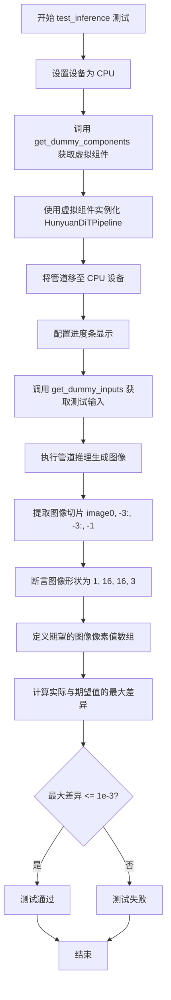

#### 带注释源码

```python
def test_inference(self):
    """
    测试 HunyuanDiTPipeline 的推理功能
    验证生成的图像形状和像素值是否符合预期
    """
    # 1. 设置测试设备为 CPU
    device = "cpu"

    # 2. 获取虚拟组件（transformer, vae, scheduler, text_encoder 等）
    components = self.get_dummy_components()
    
    # 3. 使用虚拟组件实例化 HunyuanDiT 管道
    pipe = self.pipeline_class(**components)
    
    # 4. 将管道移至指定设备（CPU）
    pipe.to(device)
    
    # 5. 配置进度条（disable=None 表示不禁用进度条）
    pipe.set_progress_bar_config(disable=None)

    # 6. 获取虚拟输入参数（prompt, generator, num_inference_steps 等）
    inputs = self.get_dummy_inputs(device)
    
    # 7. 执行管道推理，获取生成的图像
    # pipe(**inputs) 返回一个 PipelineOutput 对象，包含 images 属性
    image = pipe(**inputs).images
    
    # 8. 提取图像右下角 3x3 区域的所有通道（最后一维）
    # image shape: (batch, height, width, channels)
    image_slice = image[0, -3:, -3:, -1]

    # 9. 断言验证：图像形状必须为 (1, 16, 16, 3)
    # - 1: batch size
    # - 16: 图像高度
    # - 16: 图像宽度
    # - 3: RGB 通道数
    self.assertEqual(image.shape, (1, 16, 16, 3))
    
    # 10. 定义期望的图像像素值（用于对比验证）
    expected_slice = np.array(
        [0.56939435, 0.34541583, 0.35915792, 0.46489206, 0.38775963, 0.45004836, 0.5957267, 0.59481275, 0.33287364]
    )
    
    # 11. 计算实际输出与期望值的最大差异
    # 将图像切片展平后与期望数组进行逐元素比较
    max_diff = np.abs(image_slice.flatten() - expected_slice).max()
    
    # 12. 断言验证：最大差异必须小于等于 1e-3（0.001）
    self.assertLessEqual(max_diff, 1e-3)
```


### `HunyuanDiTPipelineFastTests.test_inference_batch_single_identical`

该方法是一个单元测试，用于验证 HunyuanDiT Pipeline 在批量推理模式下，单个样本的推理结果与批量推理中单个样本的结果是否保持一致（identical），以确保批处理逻辑没有引入不确定性或副作用。

参数：

- `self`：`HunyuanDiTPipelineFastTests`，隐式参数，测试类实例本身

返回值：`None`，该方法为测试用例，无返回值，直接通过断言验证

#### 流程图

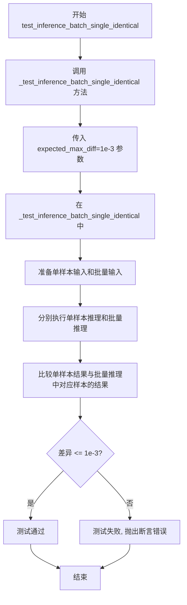

#### 带注释源码

```python
def test_inference_batch_single_identical(self):
    """
    测试批量推理模式下单样本结果的一致性。
    
    该测试方法继承自 PipelineTesterMixin，通过调用 _test_inference_batch_single_identical
    验证当使用批处理时，模型对单个样本的输出与单独处理该样本时的输出保持一致。
    这对于确保批处理不会引入非确定性行为非常重要。
    
    参数:
        self: HunyuanDiTPipelineFastTests 的实例，包含测试所需的 pipeline 和配置
    
    返回值:
        None: 测试方法，通过 unittest 断言验证结果，不返回任何值
    
    异常:
        AssertionError: 如果单样本推理结果与批量推理结果的差异超过 expected_max_diff
    """
    # 调用父类 PipelineTesterMixin 提供的 _test_inference_batch_single_identical 方法
    # expected_max_diff=1e-3 表示允许的最大差异阈值为 0.001
    # 该方法内部会:
    # 1. 获取测试用的虚拟组件 (get_dummy_components)
    # 2. 创建 pipeline 实例
    # 3. 分别进行单样本和批量样本的推理
    # 4. 比较两者结果的差异
    self._test_inference_batch_single_identical(
        expected_max_diff=1e-3,  # 设置最大允许差异为千分之一
    )
```


### `HunyuanDiTPipelineFastTests.test_feed_forward_chunking`

该测试方法用于验证 HunyuanDiT Pipeline 的前向传播分块（forward chunking）功能是否正常工作。测试分别在不启用和启用分块模式下运行推理，比较生成的图像差异，确保两种模式的输出结果一致（差异小于阈值 1e-4）。

参数：

- `self`：隐式参数，测试类实例

返回值：`None`，测试方法无返回值，通过 `self.assertLess` 断言验证结果

#### 流程图

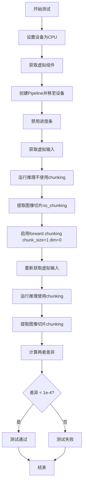

#### 带注释源码

```python
def test_feed_forward_chunking(self):
    """
    测试 HunyuanDiT Pipeline 的前向传播分块功能。
    验证启用 chunking 与不启用 chunking 的输出应该一致。
    """
    # 设置设备为 CPU
    device = "cpu"

    # 获取虚拟组件（transformer, vae, scheduler, text_encoder 等）
    components = self.get_dummy_components()
    # 使用虚拟组件创建 Pipeline 实例
    pipe = self.pipeline_class(**components)
    # 将 Pipeline 移至指定设备
    pipe.to(device)
    # 设置进度条配置，disable=None 表示不禁用进度条
    pipe.set_progress_bar_config(disable=None)

    # 获取虚拟输入（包含 prompt, generator, num_inference_steps 等）
    inputs = self.get_dummy_inputs(device)
    # 执行推理，获取图像结果
    image = pipe(**inputs).images
    # 提取图像右下角 3x3 像素块的最后一位通道（RGB 通道）
    image_slice_no_chunking = image[0, -3:, -3:, -1]

    # 启用 transformer 的前向分块功能
    # chunk_size=1 表示每次处理 1 个块，dim=0 表示按批次维度分块
    pipe.transformer.enable_forward_chunking(chunk_size=1, dim=0)
    # 重新获取虚拟输入（使用相同的 seed 确保可重复性）
    inputs = self.get_dummy_inputs(device)
    # 再次执行推理
    image = pipe(**inputs).images
    # 提取相同的图像切片
    image_slice_chunking = image[0, -3:, -3:, -1]

    # 计算不使用分块和使用分块两种情况下的最大差异
    max_diff = np.abs(to_np(image_slice_no_chunking) - to_np(image_slice_chunking)).max()
    # 断言：差异应该小于 1e-4，确保分块功能不影响输出结果
    self.assertLess(max_diff, 1e-4)
```


### `HunyuanDiTPipelineFastTests.test_fused_qkv_projections`

该测试方法用于验证 HunyuanDiT Pipeline 中 QKV（Query-Key-Value）投影融合功能的正确性。测试通过比较融合前后的图像输出，验证融合操作不会影响模型的实际输出结果，同时确保融合与解融操作能够正确切换。

参数：
- `self`：实例方法隐式参数，无需显式传递

返回值：无（`None`），该方法为单元测试方法，通过 `assert` 断言验证正确性

#### 流程图

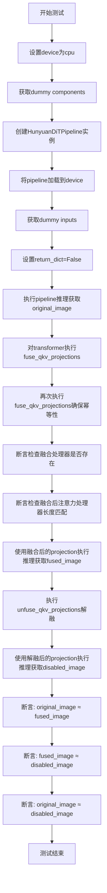

#### 带注释源码

```python
def test_fused_qkv_projections(self):
    """
    测试 HunyuanDiT Pipeline 中 QKV 投影融合功能的正确性。
    
    该测试验证以下场景：
    1. 融合 QKV projections 前后，模型输出应保持一致
    2. 融合后再解融，输出应与原始输出一致
    3. 融合操作本身是幂等的（多次调用不会出错）
    """
    # 设置设备为 cpu 以确保确定性结果
    # torch.Generator 在 CPU 上需要确定性设置
    device = "cpu"
    
    # 获取测试用的虚拟组件（transformer, vae, scheduler, text_encoder 等）
    components = self.get_dummy_components()
    
    # 使用虚拟组件初始化 HunyuanDiTPipeline
    pipe = self.pipeline_class(**components)
    
    # 将 pipeline 移动到指定设备
    pipe = pipe.to(device)
    
    # 禁用进度条配置
    pipe.set_progress_bar_config(disable=None)
    
    # 获取测试输入参数（包含 prompt, generator, num_inference_steps 等）
    inputs = self.get_dummy_inputs(device)
    
    # 设置返回格式为元组而非字典
    inputs["return_dict"] = False
    
    # 执行第一次推理，获取原始（未融合 QKV）输出
    image = pipe(**inputs)[0]
    
    # 提取图像的一部分切片用于后续比较
    # 取最后 3x3 像素区域用于快速验证
    original_image_slice = image[0, -3:, -3:, -1]
    
    # ==== 执行 QKV 投影融合 ====
    # fuse_qkv_projections() 将分离的 Q、K、V 投影合并为单一的 fused 投影
    # 这样做可以减少内存访问并可能提高推理速度
    pipe.transformer.fuse_qkv_projections()
    
    # 再次调用确保幂等性（多次融合不应产生副作用）
    # TODO (sayakpaul): 未来会在 pipeline 级别添加此功能
    pipe.transformer.fuse_qkv_projections()
    
    # 断言：验证融合后的注意力处理器确实存在
    assert check_qkv_fusion_processors_exist(pipe.transformer), (
        "Something wrong with the fused attention processors. "
        "Expected all the attention processors to be fused."
    )
    
    # 断言：验证融合后的注意力处理器数量与原始数量匹配
    assert check_qkv_fusion_matches_attn_procs_length(
        pipe.transformer, pipe.transformer.original_attn_procs
    ), "Something wrong with the attention processors concerning the fused QKV projections."
    
    # ==== 使用融合后的投影执行推理 ====
    inputs = self.get_dummy_inputs(device)
    inputs["return_dict"] = False
    
    # 执行推理，获取融合 QKV 后的输出
    image_fused = pipe(**inputs)[0]
    image_slice_fused = image_fused[0, -3:, -3:, -1]
    
    # ==== 解融 QKV 投影 ====
    # 恢复到原始的非融合状态
    pipe.transformer.unfuse_qkv_projections()
    
    # ==== 使用解融后的投影执行推理 ====
    inputs = self.get_dummy_inputs(device)
    inputs["return_dict"] = False
    
    # 执行推理，获取解融后的输出
    image_disabled = pipe(**inputs)[0]
    image_slice_disabled = image_disabled[0, -3:, -3:, -1]
    
    # ==== 验证断言 ====
    
    # 断言1：融合 QKV 投影不应影响输出结果
    # 允许 1e-2 的绝对误差和相对误差
    assert np.allclose(original_image_slice, image_slice_fused, atol=1e-2, rtol=1e-2), (
        "Fusion of QKV projections shouldn't affect the outputs."
    )
    
    # 断言2：融合后解融，输出应与融合时一致
    assert np.allclose(image_slice_fused, image_slice_disabled, atol=1e-2, rtol=1e-2), (
        "Outputs, with QKV projection fusion enabled, shouldn't change when fused QKV projections are disabled."
    )
    
    # 断言3：解融后输出应与原始输出一致
    assert np.allclose(original_image_slice, image_slice_disabled, atol=1e-2, rtol=1e-2), (
        "Original outputs should match when fused QKV projections are disabled."
    )
```


### `HunyuanDiTPipelineFastTests.test_save_load_optional_components`

该测试方法验证了 HunyuanDiTPipeline 在保存和加载时处理可选组件（如 safety_checker、feature_extractor 等）的能力，特别是当这些组件被设置为 None 时的行为是否符合预期。

参数：无（该方法为 unittest.TestCase 的测试方法，使用 self 和类实例状态）

返回值：`None`，该方法为测试用例，通过 `self.assertLess` 等断言验证逻辑，不返回任何值

#### 流程图

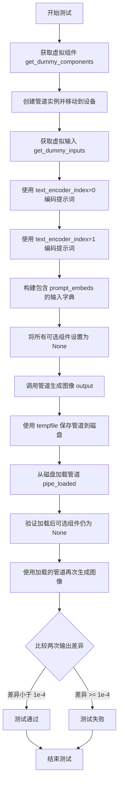

#### 带注释源码

```python
def test_save_load_optional_components(self):
    """
    测试保存和加载可选组件的功能。
    验证当可选组件设置为 None 时，保存后加载仍保持 None。
    """
    # 步骤1: 获取预定义的虚拟组件（transformer, vae, scheduler, text_encoder等）
    components = self.get_dummy_components()
    
    # 步骤2: 使用虚拟组件创建管道，并移动到测试设备（如CPU/GPU）
    pipe = self.pipeline_class(**components)
    pipe.to(torch_device)
    pipe.set_progress_bar_config(disable=None)

    # 步骤3: 获取虚拟输入参数（包含prompt、generator等）
    inputs = self.get_dummy_inputs(torch_device)

    # 提取输入参数
    prompt = inputs["prompt"]
    generator = inputs["generator"]
    num_inference_steps = inputs["num_inference_steps"]
    output_type = inputs["output_type"]

    # 步骤4: 使用第一个文本编码器（text_encoder）编码提示词
    # 获取文本嵌入和注意力掩码
    (
        prompt_embeds,
        negative_prompt_embeds,
        prompt_attention_mask,
        negative_prompt_attention_mask,
    ) = pipe.encode_prompt(prompt, device=torch_device, dtype=torch.float32, text_encoder_index=0)

    # 步骤5: 使用第二个文本编码器（text_encoder_2）编码提示词
    (
        prompt_embeds_2,
        negative_prompt_embeds_2,
        prompt_attention_mask_2,
        negative_prompt_attention_mask_2,
    ) = pipe.encode_prompt(
        prompt,
        device=torch_device,
        dtype=torch.float32,
        text_encoder_index=1,
    )

    # 步骤6: 构建输入字典，使用预计算的文本嵌入而非原始prompt
    # inputs with prompt converted to embeddings
    inputs = {
        "prompt_embeds": prompt_embeds,
        "prompt_attention_mask": prompt_attention_mask,
        "negative_prompt_embeds": negative_prompt_embeds,
        "negative_prompt_attention_mask": negative_prompt_attention_mask,
        "prompt_embeds_2": prompt_embeds_2,
        "prompt_attention_mask_2": prompt_attention_mask_2,
        "negative_prompt_embeds_2": negative_prompt_embeds_2,
        "negative_prompt_attention_mask_2": negative_prompt_attention_mask_2,
        "generator": generator,
        "num_inference_steps": num_inference_steps,
        "output_type": output_type,
        "use_resolution_binning": False,
    }

    # 步骤7: 将管道中所有可选组件设置为 None
    # 典型可选组件包括: safety_checker, feature_extractor 等
    for optional_component in pipe._optional_components:
        setattr(pipe, optional_component, None)

    # 步骤8: 使用设置好嵌入的输入调用管道生成图像
    output = pipe(**inputs)[0]

    # 步骤9: 创建临时目录并保存管道
    with tempfile.TemporaryDirectory() as tmpdir:
        pipe.save_pretrained(tmpdir)
        # 步骤10: 从保存的目录重新加载管道
        pipe_loaded = self.pipeline_class.from_pretrained(tmpdir)
        pipe_loaded.to(torch_device)
        pipe_loaded.set_progress_bar_config(disable=None)

    # 步骤11: 验证加载后的管道中，可选组件仍然为 None
    for optional_component in pipe._optional_components:
        self.assertTrue(
            getattr(pipe_loaded, optional_component) is None,
            f"`{optional_component}` did not stay set to None after loading.",
        )

    # 步骤12: 重新获取输入参数（使用新的generator）
    inputs = self.get_dummy_inputs(torch_device)

    generator = inputs["generator"]
    num_inference_steps = inputs["num_inference_steps"]
    output_type = inputs["output_type"]

    # 步骤13: 重新构建输入字典（使用之前计算的文本嵌入）
    # inputs with prompt converted to embeddings
    inputs = {
        "prompt_embeds": prompt_embeds,
        "prompt_attention_mask": prompt_attention_mask,
        "negative_prompt_embeds": negative_prompt_embeds,
        "negative_prompt_attention_mask": negative_prompt_attention_mask,
        "prompt_embeds_2": prompt_embeds_2,
        "prompt_attention_mask_2": prompt_attention_mask_2,
        "negative_prompt_embeds_2": negative_prompt_embeds_2,
        "negative_prompt_attention_mask_2": negative_prompt_attention_mask_2,
        "generator": generator,
        "num_inference_steps": num_inference_steps,
        "output_type": output_type,
        "use_resolution_binning": False,
    }

    # 步骤14: 使用加载的管道生成图像
    output_loaded = pipe_loaded(**inputs)[0]

    # 步骤15: 比较两次输出的差异，确保差异在可接受范围内
    max_diff = np.abs(to_np(output) - to_np(output_loaded)).max()
    self.assertLess(max_diff, 1e-4)
```


### `HunyuanDiTPipelineIntegrationTests.setUp`

该方法为集成测试的初始化方法，用于在每个测试执行前清理Python垃圾回收和GPU显存缓存，确保测试环境处于干净状态。

参数：

- `self`：`HunyuanDiTPipelineIntegrationTests` 对象实例，代表当前测试类本身，无需显式传递

返回值：`None`，该方法为测试框架的 `setUp` 生命周期方法，不返回任何值

#### 流程图

```mermaid
flowchart TD
    A[开始 setUp] --> B[调用 super().setUp]
    B --> C[执行 gc.collect]
    C --> D[调用 backend_empty_cache]
    D --> E[结束 setUp]
```

#### 带注释源码

```python
def setUp(self):
    """
    测试初始化方法，在每个测试方法运行前被调用
    """
    # 调用父类的 setUp 方法，确保 unittest 框架正确初始化
    super().setUp()
    
    # 执行 Python 垃圾回收，释放不再使用的对象内存
    gc.collect()
    
    # 清空 GPU 显存缓存，为后续测试释放显存资源
    backend_empty_cache(torch_device)
```


### `HunyuanDiTPipelineIntegrationTests.tearDown`

这是 `HunyuanDiTPipelineIntegrationTests` 集成测试类的销毁方法（tearDown），在每个测试方法执行完毕后自动调用，用于清理测试过程中产生的资源，包括强制垃圾回收和清空 GPU 缓存，以确保测试环境不会因为残留的内存或 GPU 内存影响后续测试。

参数：

- `self`：隐式参数，表示测试类实例本身，无类型声明

返回值：`None`，无返回值描述

#### 流程图

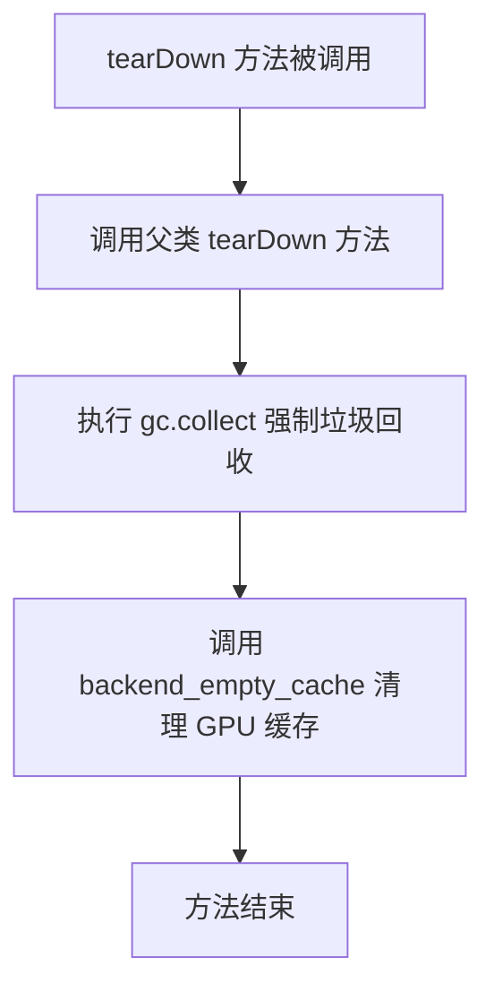

#### 带注释源码

```python
def tearDown(self):
    """
    测试用例 tearDown 方法
    在每个集成测试方法执行完毕后自动调用，用于清理测试资源
    """
    # 调用父类的 tearDown 方法，执行基础清理工作
    super().tearDown()
    
    # 强制执行 Python 垃圾回收，释放测试过程中创建的对象内存
    gc.collect()
    
    # 调用后端工具函数清理 GPU 缓存
    # torch_device 是全局变量，指向当前使用的设备（如 cuda:0）
    # 这一步对于在 GPU 上运行的测试尤为重要，可避免显存泄漏
    backend_empty_cache(torch_device)
```


### `HunyuanDiTPipelineIntegrationTests.test_hunyuan_dit_1024`

该测试方法验证 HunyuanDiT 模型在 1024x1024 分辨率下的文本到图像生成能力。它使用预训练模型生成图像，并将生成的图像切片与预期值进行相似度比较，确保模型输出的正确性和稳定性。

参数：
- `self`：`unittest.TestCase`，测试用例的实例本身

返回值：`None`，该方法为测试用例，无返回值（通过 assert 语句进行断言验证）

#### 流程图

```mermaid
flowchart TD
    A[测试开始] --> B[创建随机数生成器 generator]
    B --> C[从预训练模型加载 HunyuanDiTPipeline]
    C --> D[启用模型 CPU 卸载]
    D --> E[获取 prompt: '一个宇航员在骑马']
    E --> F[调用 pipeline 生成 1024x1024 图像]
    F --> G[提取图像切片 image[0, -3:, -3:, -1]]
    G --> H[定义预期图像切片 expected_slice]
    H --> I[计算图像相似度距离]
    I --> J{相似度距离 < 1e-3?}
    J -->|是| K[测试通过]
    J -->|否| L[断言失败]
```

#### 带注释源码

```python
@unittest.skip("The HunyuanDiT Attention pooling layer does not support sequential CPU offloading.")
def test_hunyuan_dit_1024(self):
    """测试 HunyuanDiT 模型在 1024x1024 分辨率下的文本到图像生成能力"""
    
    # 1. 创建随机数生成器，确保测试可重复性
    # 使用 CPU 设备，种子设为 0
    generator = torch.Generator("cpu").manual_seed(0)

    # 2. 从预训练模型加载 HunyuanDiTPipeline
    # XCLiu/HunyuanDiT-0523: 预训练模型名称
    # revision="refs/pr/2": 指定模型版本
    # torch_dtype=torch.float16: 使用半精度浮点数以减少内存占用
    pipe = HunyuanDiTPipeline.from_pretrained(
        "XCLiu/HunyuanDiT-0523", revision="refs/pr/2", torch.float16
    )
    
    # 3. 启用模型 CPU 卸载
    # 将模型分批加载到 GPU 以节省显存
    # torch_device 是测试工具中定义的设备（如 'cuda'）
    pipe.enable_model_cpu_offload(device=torch_device)
    
    # 4. 获取测试用的 prompt
    # 来自类属性: "一个宇航员在骑马"
    prompt = self.prompt

    # 5. 调用 pipeline 进行图像生成
    # 参数说明:
    #   prompt: 文本提示
    #   height/width: 生成图像的分辨率 (1024x1024)
    #   generator: 随机数生成器，确保可重复性
    #   num_inference_steps: 推理步数 (2 步，用于快速测试)
    #   output_type: 输出类型为 numpy 数组
    image = pipe(
        prompt=prompt, 
        height=1024, 
        width=1024, 
        generator=generator, 
        num_inference_steps=2, 
        output_type="np"
    ).images

    # 6. 提取图像切片用于验证
    # 取图像右下角 3x3 像素区域
    image_slice = image[0, -3:, -3:, -1]
    
    # 7. 定义预期图像切片数值
    # 用于与生成图像进行相似度比较
    expected_slice = np.array(
        [0.48388672, 0.33789062, 0.30737305, 
         0.47875977, 0.25097656, 0.30029297, 
         0.4440918, 0.26953125, 0.30078125]
    )

    # 8. 计算生成图像与预期图像的余弦相似度距离
    max_diff = numpy_cosine_similarity_distance(image_slice.flatten(), expected_slice)
    
    # 9. 断言验证
    # 确保相似度距离小于阈值 (1e-3)
    assert max_diff < 1e-3, f"Max diff is too high. got {image_slice.flatten()}"
```

## 关键组件


### HunyuanDiTPipeline

HunyuanDiTPipeline是腾讯混元DiT文本到图像生成管道，整合了DiT transformer模型、VAE、双文本编码器（Bert和T5）和噪声调度器，实现从文本提示生成图像的功能。

### HunyuanDiT2DModel

HunyuanDiT2DModel是核心的Diffusion Transformer模型，负责在latent空间中进行去噪扩散过程，包含多层Transformer块和注意力机制。

### AutoencoderKL

AutoencoderKL是变分自编码器(VAE)，负责将图像编码为latent表示以及将latent解码回图像空间。

### DDPMScheduler

DDPMScheduler是DDPM噪声调度器，负责在扩散过程中管理噪声调度和去噪步骤。

### 双文本编码器架构

代码使用两个文本编码器（BertModel和T5EncoderModel）分别处理文本提示，生成多模态文本嵌入用于条件引导图像生成。

### QKV投影融合

代码支持fuse_qkv_projections()和unfuse_qkv_projections()，用于融合注意力机制的QKV投影矩阵，提升推理效率。

### 前向分块(Forward Chunking)

enable_forward_chunking(chunk_size=1, dim=0)支持将Transformer前向计算分块处理，用于内存优化和长序列处理。

### 模型CPU Offload

enable_model_cpu_offload(device=torch_device)支持将模型层在CPU和GPU之间动态迁移，优化大模型推理的显存占用。

### 测试组件

包含多个测试类(HunyuanDiTPipelineFastTests和HunyuanDiTPipelineIntegrationTests)用于验证pipeline的正确性，包括推理批处理、加载保存、QKV融合等功能测试。


## 问题及建议


### 已知问题

- **重复调用 `fuse_qkv_projections`**：在 `test_fused_qkv_projections` 方法中，`pipe.transformer.fuse_qkv_projections()` 被调用了两次，这看起来是一个编码错误或疏忽
- **被跳过的测试未修复**：有两个测试 `test_sequential_cpu_offload_forward_pass` 和 `test_sequential_offload_forward_pass_twice` 因为 HunyuanDiT Attention pooling 层使用 `torch.nn.MultiheadAttention` 不支持顺序 CPU offloading 而被跳过，但 TODO 注释表明需要后续修复
- **测试 `test_encode_prompt_works_in_isolation` 被跳过**：`encode_prompt` 被调用两次的设计与 99% 的 pipeline 设计不同，导致测试被跳过，这是一个已知的设计偏差
- **设备判断使用字符串匹配**：在 `get_dummy_inputs` 中使用 `str(device).startswith("mps")` 来判断设备，这种字符串匹配方式较为脆弱
- **代码重复**：`test_save_load_optional_components` 中构造输入字典的代码重复了两次，可以提取为独立方法

### 优化建议

- **修复重复调用**：移除 `test_fused_qkv_projections` 中多余的 `fuse_qkv_projections()` 调用
- **统一设备检测方式**：使用更 robust 的设备检测方法，如 `device.type == 'mps'` 或统一的设备枚举
- **提取公共方法**：将 `inputs` 字典的构造抽取为独立的辅助方法，减少代码重复
- **添加模型加载错误处理**：在集成测试中添加 try-except 处理模型加载失败的情况，提高测试健壮性
- **修复或移除跳过测试**：尽快修复 Attention pooling 的 CPU offloading 问题，或者如果无法修复，应在代码库中记录此限制
- **将魔数提取为常量**：将 `1e-3`、`1e-4` 等阈值以及 `16`、`2` 等尺寸参数提取为类级别常量，提高可维护性

## 其它


### 设计目标与约束

本测试文件旨在验证HunyuanDiTPipeline的功能正确性，包括推理输出准确性、模型保存加载、QKV投影融合等核心功能。测试设计遵循Diffusers库的PipelineTesterMixin标准，要求在CPU和GPU环境下均能通过，确保pipeline的跨平台兼容性。测试使用虚拟组件(dummy components)进行快速验证，同时保留真实模型(XCLiu/HunyuanDiT-0523)的集成测试。

### 错误处理与异常设计

测试中通过unittest.skip装饰器处理已知问题：HunyuanDiT的Attention pooling层使用torch.nn.MultiheadAttention导致sequential CPU offload无法正常工作，因此跳过相关测试。集成测试使用@require_torch_accelerator装饰器确保在GPU环境下运行，使用gc.collect()和backend_empty_cache()管理GPU内存避免OOM。

### 数据流与状态机

测试流程为：get_dummy_components() → 初始化pipeline → get_dummy_inputs() → 执行推理 → 验证输出。关键状态转换包括：pipeline初始化、模型加载到设备、推理执行、保存/加载模型。测试涵盖两种输入模式：直接使用prompt和使用预计算的prompt_embeds。

### 外部依赖与接口契约

依赖包括：transformers(BertModel, T5EncoderModel, AutoTokenizer)、diffusers(AutoencoderKL, DDPMScheduler, HunyuanDiT2DModel, HunyuanDiTPipeline)、numpy、torch。pipeline接口遵循Diffusers标准，encode_prompt支持text_encoder_index参数区分两个文本编码器，save_pretrained和from_pretrained实现模型序列化。

### 性能考虑

测试使用小规模虚拟模型(sample_size=16, num_layers=2, hidden_size=24)加速执行。集成测试限制num_inference_steps=2减少计算量。enable_forward_chunking测试验证transformer的分块推理能力，test_inference_batch_single_identical验证批处理一致性。

### 安全性考虑

测试代码本身无直接安全风险，但集成测试从HuggingFace Hub加载预训练模型(XCLiu/HunyuanDiT-0523)，需确保模型来源可信。测试中safety_checker和feature_extractor设置为None，避免额外的安全检查干扰测试。

### 配置管理

pipeline参数通过TEXT_TO_IMAGE_PARAMS、TEXT_TO_IMAGE_BATCH_PARAMS、TEXT_TO_IMAGE_IMAGE_PARAMS统一管理。测试使用use_resolution_binning=False禁用分辨率分箱，guidance_scale=5.0设置引导强度，output_type="np"输出numpy数组便于验证。

### 版本兼容性

代码指定torchDevice、enable_full_determinism()确保可复现性。numpy_cosine_similarity_distance用于集成测试的相似度比较。test_fused_qkv_projections验证注意力机制融合/解融的兼容性，test_save_load_optional_components测试可选组件的序列化。

### 测试策略

采用分层测试策略：单元测试(HunyuanDiTPipelineFastTests)使用虚拟组件快速验证功能，集成测试(HunyuanDiTPipelineIntegrationTests)使用真实模型验证实际效果。测试覆盖：基础推理、批处理一致性、前向分块、QKV融合、模型保存加载、可选组件处理。

    